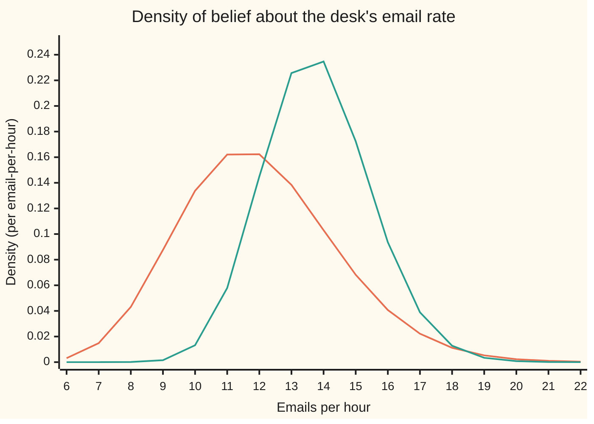
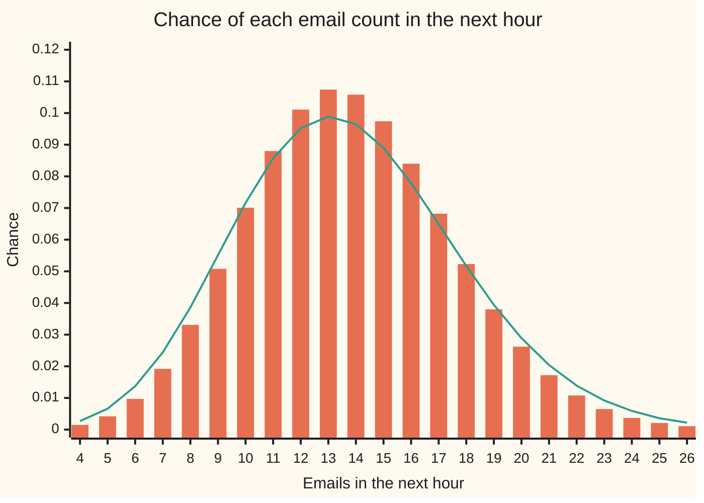

# Gamma-Poisson: updating a rate from counts and hours, then predicting the next hour

Probability and statistics → Bayesian Inference → Learning a rate from counts → Gamma-Poisson

---

## General Overview

A new help desk opens. Nobody knows how many emails an hour it will get. Desks like it run at about 12 an hour, give or take 2.45, and that is the belief on day one.

Then the desk is watched. From 9:00 to 11:00, 28 emails arrive. From 14:00 to 15:00, 17 more. That is 45 emails in 3 observed hours, 15 an hour. The two windows have different lengths, so the hours matter as much as the emails: 45 emails in three minutes would mean something else entirely.

The updated belief puts the rate at 13.8 emails an hour, give or take 1.66. It sits between the old guess of 12 and the record's 15, closer to the record because three hours of watching outweigh the prior. And the question the desk manager asks is about the next hour: one person clears 20 emails an hour, so how often does an hour overflow? The answer is 0.058132, about 1 hour in 17. Treating 13.8 as the known rate gives 0.042431, about 1 in 24. The difference is the uncertainty still left in the rate.

The rule that produces these numbers is the gamma-Poisson update. The belief about the rate is a gamma law ([gamma-and-beta-distributions](../04-Continuous%20Distributions/07-gamma-and-beta-distributions.md)). Each window's count is a Poisson count ([poisson](../03-Discrete%20Distributions/04-poisson.md)). Together they give a gamma law again, with two additions, and the forecast for a new hour is the negative binomial law.

**Emails seen add to the gamma's shape, hours watched add to its rate, and the next hour's count follows a negative binomial law that is wider than a Poisson because the rate is still uncertain.**

**What kind of fact this is:** a theorem, proved on this card in Why it works: a gamma prior and Poisson counts give a gamma posterior and a negative binomial forecast. Using it for a real desk is a model, and When it holds says where the model fails.

### The picture: belief about the rate, before and after three hours



Orange: the prior, Gamma(24, 2), centred on 12. Green: the posterior after 45 emails in 3 hours, Gamma(69, 5), centred on 13.8. The curve moved right, toward the record's 15, and grew taller and narrower: the record added information, so less spread remains.

---

## The formula

Notation first, in words. The desk's true rate, emails per hour, is $\lambda$ (lambda). It is unknown, so it is treated as a random quantity with a law of its own. Gamma(α, β), read "the gamma law with shape alpha and rate beta", is the density from the gamma card, $f(\lambda) = \beta^{\alpha}\lambda^{\alpha-1}e^{-\beta\lambda}/\Gamma(\alpha)$, where Γ (capital gamma) is the gamma integral, with Γ(a) = (a − 1)! for a whole number a. Its **shape** $\alpha$ counts emails and its **rate** $\beta$ is measured in hours; its mean is α/β and its variance α/β^2. Watching window i lasts $t_i$ hours and brings $y_i$ emails. Given the rate, the count in that window is Poisson with mean $t_i\lambda$: the exposure, the time watched, times the rate.

Prior: $\lambda$ ~ Gamma(α, β). Record: $y_i$ given $\lambda$ ~ Poisson($t_i\lambda$), independently. Then, writing $K = \sum_i y_i$ for all the emails and $H = \sum_i t_i$ for all the hours,

$$\lambda \mid \text{record} \;\sim\; \mathrm{Gamma}(A,\,B), \qquad A = \alpha + K, \qquad B = \beta + H$$

**Read it aloud:** after the record, the rate is still gamma; its shape is the old shape plus every email seen, and its rate is the old rate plus every hour watched.

The posterior mean and spread follow from the gamma card's moments:

$$E[\lambda \mid \text{record}] = \frac{A}{B}, \qquad \mathrm{Var}(\lambda \mid \text{record}) = \frac{A}{B^2}$$

The forecast. Let $N$ be the count in a new window of $t$ hours, and $k$ one possible value. Averaging the Poisson over the posterior gives

$$P(N = k \mid \text{record}) = \frac{\Gamma(A+k)}{\Gamma(A)\,k!}\;p^{A}\,(1-p)^{k}, \qquad p = \frac{B}{B+t}, \qquad k = 0, 1, 2, \ldots$$

**Read it aloud:** the chance of k emails in the new window is the negative binomial mass with shape A and success chance B over B + t.

Its mean and variance:

$$E[N \mid \text{record}] = \frac{tA}{B}, \qquad \mathrm{Var}(N \mid \text{record}) = \frac{tA}{B} + \frac{t^2 A}{B^2}$$

The first variance term is the Poisson's own scatter. The second is the leftover doubt about $\lambda$.

| Symbol | Plain meaning | In our example | Push it up and the answer… |
| --- | --- | --- | --- |
| $\lambda$ | the desk's true rate, emails per hour; unknown | believed near 13.8 after the record | — |
| $\alpha$ | prior shape: emails the prior is "worth" | 24 | the prior mean α/β rises, and the posterior mean with it, by 1/B per unit; the prior's weight β/B is unchanged |
| $\beta$ | prior rate: hours the prior is "worth" | 2 hours | the prior pulls harder; prior mean α/β falls |
| $t_i$, $y_i$, $i$ | hours watched and emails seen in window i | 2 h and 28; 1 h and 17 | — |
| $K$, $H$ | all emails seen, all hours watched | 45 and 3 | K up: the rate estimate rises; H up: it falls and tightens |
| $A$, $B$ | posterior shape α + K and posterior rate β + H | 69 and 5 | — |
| $N$, $t$, $k$ | the count in a new window, its length in hours, one possible count | next hour, t = 1, k = 14 | t up: more emails expected, and more doubt about them |
| $p$ | the forecast's success chance, B/(B + t) | 5/6 | closer to 1: a tighter forecast |
| $\Gamma$ | the gamma integral, Γ(a) = (a − 1)! for whole a | Γ(69) = 68! | — |
| $f$ | a density: f(λ) before the record, f(λ ∣ record) after | 0.1623 at 12 and 0.2347 at 14 on the chart | — |
| $E$, $\mathrm{Var}$ | the long-run average, and the variance | E[N] = 13.8, Var(N) = 16.56 | — |
| $L$, $u$, $C$, $m$ | used only in the proofs: L(λ) the likelihood; u = Bλ, the substitution in the gamma integral; C the record's factor free of λ; m the mean of a Poisson count | L(λ) is a constant times λ^45 e^(−3λ) | — |

The vertical bar ∣ is read "given", as in the conditional-probability cards: "λ given the record" is the belief about λ once the record is known.

### When it holds

- **Emails arrive one at a time and independently, given the rate.** That is what makes each window's count Poisson. If emails came in pairs, each count would carry half the information the update credits it with, and the posterior would be too narrow.
- **One steady rate across every window, and in the window forecast.** The morning, the afternoon and the next hour share the same λ. If mornings run hotter, pooling blends two rates into one number that describes neither.
- **Exposure is the hours watched, not the number of windows.** Adding the number of windows (2) instead of the hours (3) to β gives a posterior mean of 17.25 instead of 13.8.
- **Each window is new evidence.** Entering the morning twice gives 13.857143, nearly unchanged, but a spread of 1.406980 instead of 1.661325: confidence the desk has not earned.
- **The prior is proper, with α and β above 0, and β is a rate, not a scale.** Reading β = 2 as a scale of 2, a rate of 0.5, makes the prior mean 48 and the posterior mean 19.714286.

---

## Why it works

### Step 0: the prior and the evidence have the same shape in λ

Written as a function of λ, a gamma density is a power of λ times an exponential, $\lambda^{\alpha-1}e^{-\beta\lambda}$. A Poisson mass, read as a function of λ with the count held fixed, is also a power of λ times an exponential, $\lambda^{y}e^{-t\lambda}$. Bayes' rule multiplies them. Powers of the same thing multiply by adding exponents, and so do exponentials. So the product has the gamma shape again, and the update is two additions. The gamma prior is called **conjugate** to the Poisson: prior and posterior belong to the same family. The beta prior plays the same part for the binomial ([beta-binomial](02-beta-binomial.md)).

### Step 1: the record's evidence depends only on total emails and total hours

The **likelihood** is the chance of the observed record, read as a function of the unknown λ. The windows are independent given λ, so their Poisson masses multiply:

$$L(\lambda) = \prod_i e^{-t_i\lambda}\,\frac{(t_i\lambda)^{y_i}}{y_i!} = \underbrace{\prod_i \frac{t_i^{\,y_i}}{y_i!}}_{\text{no }\lambda}\;\lambda^{K}\,e^{-H\lambda}$$

The first factor does not involve λ, so it cannot move belief about λ. What remains sees only K = 45 and H = 3. Twenty-eight emails in two hours and seventeen in one teach the same thing about the rate as 45 in three straight hours.

### Step 2: multiply, then make the area 1

Bayes' rule for densities says the posterior is the prior times the likelihood, divided by whatever makes the total area 1 ([priors-posteriors-and-updating](01-priors-posteriors-and-updating.md)). Dropping every factor free of λ:

$$f(\lambda \mid \text{record}) \;\propto\; \lambda^{\alpha-1}e^{-\beta\lambda}\cdot\lambda^{K}e^{-H\lambda} = \lambda^{(\alpha+K)-1}\,e^{-(\beta+H)\lambda}$$

The sign ∝ means "equal up to a constant factor". The area under $\lambda^{A-1}e^{-B\lambda}$ is found by substituting u = Bλ in the gamma integral: it is Γ(A)/B^A, finite and positive for A, B > 0. Dividing by it gives exactly the Gamma(A, B) density. The mean A/B and variance A/B^2 are the gamma card's moments.

For the desk: A = 24 + 45 = 69, B = 2 + 3 = 5, mean 13.8, standard deviation √69 / 5 = 1.661325.

### Step 3: the posterior mean is a weighted average

Split the posterior mean:

$$\frac{A}{B} = \frac{\beta}{B}\cdot\frac{\alpha}{\beta} + \frac{H}{B}\cdot\frac{K}{H}$$

The prior mean α/β = 12 gets weight β/B = 0.4. The record's rate K/H = 15 gets weight H/B = 0.6. So 0.4 × 12 + 0.6 × 15 = 13.8. The prior acts like 2 hours of earlier watching that brought 24 emails. That reading is bookkeeping, not a claim that those emails happened. As the watched hours grow, the prior's weight shrinks toward 0 and the posterior mean approaches the record's own rate.

### Step 4: order does not matter

Update after the morning alone: Gamma(24 + 28, 2 + 2) = Gamma(52, 4). Then the afternoon: Gamma(69, 5). Take the afternoon first and the same Gamma(69, 5) comes out, because addition does not care about order. Yesterday's posterior is today's prior; the desk can update window by window or all at once.

### Step 5: the forecast averages the Poisson over the posterior

If λ were known, the next t hours would bring a Poisson count with mean tλ. It is not known, so each possible λ is weighted by its posterior density and the Poisson chances are averaged:

$$P(N = k \mid \text{record}) = \int_0^\infty e^{-t\lambda}\frac{(t\lambda)^k}{k!}\cdot\frac{B^A\lambda^{A-1}e^{-B\lambda}}{\Gamma(A)}\,d\lambda$$

The integrand is again a power of λ times an exponential, $\lambda^{A+k-1}e^{-(B+t)\lambda}$. The same gamma integral evaluates it, and the negative binomial formula falls out. For a whole-number shape it is the law of the number of failures before the A-th success, each trial succeeding with chance p = B/(B + t) ([geometric-and-negative-binomial](../03-Discrete%20Distributions/02-geometric-and-negative-binomial.md) counts trials, which is failures plus A). The formula holds for any positive shape, where the story of successes no longer applies.

### Step 6: two sources of spread

The variance of the forecast splits in two, by the rule that total variance is the average of the variance given λ plus the variance of the average given λ ([conditional-expectation-in-tables](../02-Random%20Variables/05-conditional-expectation-in-tables.md)):

$$\mathrm{Var}(N) = E[\,t\lambda\,] + \mathrm{Var}(t\lambda) = \frac{tA}{B} + \frac{t^2A}{B^2}$$

The Poisson's own scatter, variance equal to its mean, gives 13.8. Doubt about λ adds 2.76. Total 16.56. A Poisson with λ fixed at 13.8 keeps the first term and drops the second, and its tail above 20 is too thin: 0.042431 against 0.058132.

<details>
<summary>Detailed proof</summary>

**Posterior.** For a record with every $t_i \ge 0$, every $y_i$ a whole number, and no email in a zero-length window, the constant $C = \prod_i t_i^{\,y_i}/y_i!$ is positive (with $0^0 = 1$). The joint density of λ and the record is $C\,\beta^{\alpha}\lambda^{A-1}e^{-B\lambda}/\Gamma(\alpha)$. Its integral over λ from 0 to ∞ is, by u = Bλ, $C\,\beta^{\alpha}\Gamma(A)/(\Gamma(\alpha)B^{A})$, the chance of the record, finite and positive. Dividing gives $B^{A}\lambda^{A-1}e^{-B\lambda}/\Gamma(A)$, the Gamma(A, B) density exactly, not only up to a constant. Its moments: $\int \lambda\,f = \Gamma(A+1)/(\Gamma(A)B) = A/B$ and $\int \lambda^2 f = A(A+1)/B^2$, so the variance is $A/B^2$.

**Forecast masses.** For t > 0,
$$\int_0^\infty \frac{t^k\lambda^k e^{-t\lambda}}{k!}\cdot\frac{B^A\lambda^{A-1}e^{-B\lambda}}{\Gamma(A)}\,d\lambda = \frac{B^A t^k}{\Gamma(A)\,k!}\cdot\frac{\Gamma(A+k)}{(B+t)^{A+k}} = \frac{\Gamma(A+k)}{\Gamma(A)\,k!}\,p^A(1-p)^k.$$
The recurrence Γ(a + 1) = aΓ(a) turns the ratio into $A(A+1)\cdots(A+k-1)/k!$, which is how the code builds each mass from the one before: multiply by $(A+k)(1-p)/(k+1)$.

**The masses add to 1.** Every term is non-negative, so sum and integral may be swapped: $\sum_k P(N=k) = \int \big(\sum_k e^{-t\lambda}(t\lambda)^k/k!\big) f(\lambda \mid \text{record})\,d\lambda = \int 1\cdot f = 1$, the Poisson masses adding to 1 for each λ.

**Mean and variance.** Swapping again, $E[N] = \int t\lambda\,f = tA/B$, and $E[N^2] = \int (t\lambda + t^2\lambda^2) f = tA/B + t^2A(A+1)/B^2$, using the Poisson fact that a count with mean m has average square m + m^2. Subtract the squared mean $t^2A^2/B^2$: the variance is $tA/B + t^2A/B^2$.

**Why the forecast is wider than any single Poisson.** The second term, $t^2A/B^2$, is positive whenever t > 0. It shrinks as B grows, since it is $t^2$ times the posterior variance of λ: with enough watching the forecast approaches a Poisson.

</details>

Without conjugacy the same answer needs numerical work: multiply prior by likelihood on a grid of rates and add up areas, which is road 2 in the code, or draw from the posterior by a chain of random steps, which is [markov-chain-monte-carlo-in-outline](06-markov-chain-monte-carlo-in-outline.md). Conjugacy replaces both with two additions.

---

## Worked numbers, by hand

| Step | Arithmetic | Value |
| --- | --- | --- |
| prior mean and spread | 24/2, √24 / 2 | 12 and 2.449490 |
| emails seen, K | 28 + 17 | 45 |
| hours watched, H | 2 + 1 | 3 |
| record's own rate | 45/3 | 15 |
| posterior shape A | 24 + 45 | 69 |
| posterior rate B | 2 + 3 | 5 |
| posterior mean | 69/5, or 0.4 × 12 + 0.6 × 15 | 13.8 |
| posterior spread | √69 / 5 | 1.661325 |
| 95% credible interval for the rate | the rates with 2.5% and 97.5% of Gamma(69, 5) below them, found by halving | 10.74 to 17.24 |
| forecast chance p, next hour | 5/(5 + 1) | 5/6 |
| forecast mean | 1 × 69/5 | 13.8 |
| forecast variance | 13.8 + 69/25 = 13.8 + 2.76 | 16.56 |
| chance of exactly 14 | negative binomial mass at k = 14 | 0.096502 |
| **chance of more than 20** | 1 − (masses 0 to 20) | **0.058132** |

In the world: the rate is 13.8 emails an hour, with a posterior standard deviation of 1.66, and with posterior probability 0.95 it lies between 10.74 and 17.24 an hour. The one-person desk overflows in about 1 hour in 17. The interval's ends come from the gamma card's Poisson sum: the rate is at most a mark with the same chance that a Poisson count with mean 5 times the mark is 69 or more, and halving the search range finds the two marks. The method, and choosing an action by its average cost, is worked on a coin in [credible-intervals-and-decisions](05-credible-intervals-and-decisions.md).

### The picture: next hour's forecast against a Poisson that forgets the doubt



Bars: a Poisson with the rate fixed at 13.8. Line: the negative binomial forecast, NB(69, 5/6). Both average 13.8. The bars are taller in the middle and thinner in both tails: from 19 emails up, and from 10 down, the line runs above every bar. The upper tail holds the hours that overflow the desk.

### What breaks if you drop a piece

| Mistake | Comes out at | What went wrong |
| --- | --- | --- |
| Add the number of windows, 2, to β instead of the hours, 3 | posterior mean 17.25 | exposure lost: the update no longer knows how long the desk was watched |
| Read β = 2 as a scale, so the prior rate is 0.5 | posterior mean 19.714286 | the prior now centres on 48 an hour, not 12 |
| Enter the morning window twice | mean 13.857143, spread 1.406980 | the independence hypothesis dropped: the same 28 emails counted as new evidence |
| Forecast with a Poisson at the posterior mean | overflow 0.042431, variance 13.8 | the doubt about λ discarded: truth is 0.058132 and 16.56 |

---

## Code, from first principles, and it actually runs

The programs reach the posterior and the forecast by three roads. Road 1 is the formula: two additions, then the negative binomial masses built one from the next, and the interval's ends from the gamma's Poisson sum. Road 2 never uses the gamma algebra: it multiplies the prior density by the two windows' Poisson masses, kept separate with their own exposures, on 4,000 slices of rates from 0 to 40, and adds up areas by Simpson's rule, which fits small parabolas through the slices, for the posterior mean, spread, interval and every forecast chance up to 20. Road 3 simulates desks. Each simulated desk draws its rate from the prior, as the sum of 24 exponential waits of rate 2, then runs for 3 hours; only desks that received exactly 45 emails are kept, and each kept desk runs one more hour. Pooling the two windows is safe here, by Step 1. The random numbers come from SplitMix64, a small generator written out in both languages with seed 20260929, so both draw the same numbers; the simulated mean and overflow share are printed with their standard errors, and the asserts allow four of them. The simulation turns the definition of a posterior, belief about λ among the worlds consistent with the record, into counting.

### Python

```python
# Gamma-Poisson -- the check behind the card.  Standard library only (math); no
# statistics or random module.  Prior Gamma(shape 24, rate 2 hours); record: 28
# emails in 2 hours, then 17 in 1 hour.  Road 1: the conjugate update and the
# negative binomial.  Road 2: prior times likelihood on a grid (Simpson), no gamma
# algebra.  Road 3: seeded simulated desks, kept only if 3 hours brought 45 emails.
import math

ALPHA, BETA = 24, 2.0                     # prior shape and prior rate (hours)
RECORD = [(2.0, 28), (1.0, 17)]           # (exposure in hours, emails seen)
STAFF = 20                                # one person clears 20 emails an hour

def update(a, b, record):                 # counts add to the shape, hours to the rate
    return a + sum(y for t, y in record), b + sum(t for t, y in record)

def negbin(A, B, t, top):                 # predictive masses for a window of t hours
    p = B / (B + t)
    q = [p ** A]
    for k in range(top):
        q.append(q[-1] * (A + k) / (k + 1) * (1 - p))
    return q

def poisson(mu, top):                     # p0 = e^-mu, then times mu/(k+1)
    p = [math.exp(-mu)]
    for k in range(top):
        p.append(p[-1] * mu / (k + 1))
    return p

def lfact(n): return sum(math.log(j) for j in range(2, n + 1))
def gamma_cdf(x, a, b): return 1 - sum(poisson(b * x, a - 1))   # whole a: at least a events by time x
def bisect(cdf, c):                       # the x with cdf(x) = c, halving 0 to 40 fifty times
    lo, hi = 0.0, 40.0
    for _ in range(50): mid = (lo + hi) / 2; lo, hi = (lo, mid) if cdf(mid) >= c else (mid, hi)
    return (lo + hi) / 2

def gamma_pdf(x, a, b):                   # whole-number shape a: Gamma(a) = (a-1)!
    return math.exp(a * math.log(b) + (a - 1) * math.log(x) - b * x - lfact(a - 1))

def simpson(f, lo, hi, n=4000):
    h = (hi - lo) / n
    s = f(lo) + f(hi) + sum((4 if i % 2 else 2) * f(lo + i * h) for i in range(1, n))
    return s * h / 3

def row(label, v): print(f"{label:<44}{v:>12.6f}")

# ---- road 1: the formula ----
A, B = update(ALPHA, BETA, RECORD); K, H = A - ALPHA, B - BETA   # all emails, all hours
mean, sd = A / B, math.sqrt(A) / B
q = negbin(A, B, 1.0, 200)
tail = 1 - sum(q[:STAFF + 1])
plug = poisson(mean, 200)
print(f"posterior Gamma(shape {A}, rate {B:.0f} hours)")
row("prior mean, emails per hour", ALPHA / BETA); row("prior sd", math.sqrt(ALPHA) / BETA)
row("record rate K / H", K / H)
row("prior weight beta / B", BETA / B); row("record weight H / B", H / B)
row("1 posterior mean A / B", mean)
row("1 posterior sd sqrt(A) / B", sd)
ci = [bisect(lambda x: gamma_cdf(x, A, B), c) for c in (0.025, 0.975)]
row("1 rate 95% interval, lower end", ci[0]); row("  upper end", ci[1])
row("1 next hour P(N = 14)", q[14])
row("1 next hour variance tA/B + t^2 A/B^2", A / B + A / B ** 2); row("  of which t^2 A/B^2", A / B ** 2)
row("  plug-in Poisson(13.8) variance", mean)
pt = 1 - sum(plug[:STAFF + 1])
print(f"1 next hour P(N > 20) {tail:.6f} (1 hour in {1 / tail:.1f}); plug-in {pt:.6f} (1 in {1 / pt:.1f})")
m0, m2 = update(ALPHA, BETA, RECORD[:1]), update(*update(ALPHA, BETA, RECORD[1:]), RECORD[:1])
print(f"sequential: after morning {m0[0]}/{m0[1]:.0f}, then {update(*m0, RECORD[1:])[0]}; other order {m2[0]}/{m2[1]:.0f}")

# ---- road 2: prior times likelihood on a grid, windows kept separate ----
def unnorm(lam):
    s = (ALPHA - 1) * math.log(lam) - BETA * lam
    for t, y in RECORD:
        s += y * math.log(t * lam) - t * lam - lfact(y)
    return math.exp(s)
LO, HI = 1e-9, 40.0
Z = simpson(unnorm, LO, HI)
g_mean = simpson(lambda x: x * unnorm(x), LO, HI) / Z
g_var = simpson(lambda x: x * x * unnorm(x), LO, HI) / Z - g_mean ** 2
g_q = [simpson(lambda x, k=k: math.exp(-x + k * math.log(x) - lfact(k)) * unnorm(x), LO, HI) / Z
       for k in range(STAFF + 1)]
row("2 grid posterior mean", g_mean); row("2 grid posterior sd", math.sqrt(g_var))
g_ci = [bisect(lambda x: simpson(unnorm, LO, x) / Z, c) for c in (0.025, 0.975)]
row("2 grid rate 95% interval, lower end", g_ci[0]); row("  upper end", g_ci[1])
row("2 grid P(N = 14)", g_q[14]); row("2 grid P(N > 20)", 1 - sum(g_q))
pmf_mean = sum(k * x for k, x in enumerate(q))
pmf_var = sum(k * k * x for k, x in enumerate(q)) - pmf_mean ** 2
row("  masses 0..200 sum", sum(q)); row("  variance read off the masses", pmf_var)

# ---- road 3: simulated desks (SplitMix64, seed 20260929) ----
state = 20260929
def u01():
    global state
    state = (state + 0x9E3779B97F4A7C15) & 0xFFFFFFFFFFFFFFFF
    z = state
    z = ((z ^ (z >> 30)) * 0xBF58476D1CE4E5B9) & 0xFFFFFFFFFFFFFFFF
    z = ((z ^ (z >> 27)) * 0x94D049BB133111EB) & 0xFFFFFFFFFFFFFFFF
    return (((z ^ (z >> 31)) >> 11) + 0.5) / 9007199254740992.0
def count(mu):                            # multiply uniforms until below e^-mu
    lim, prod, n = math.exp(-mu), u01(), 0
    while prod > lim:
        prod *= u01(); n += 1
    return n
WORLDS, kept = 200000, []
for _ in range(WORLDS):
    prod = 1.0
    for _ in range(ALPHA):                # 24 exponential waits of rate 2 add to a Gamma(24, 2)
        prod *= u01()
    lam = -math.log(prod) / BETA
    if count(H * lam) == K:               # H hours of this desk; keep it if K emails came
        kept.append((lam, count(lam)))
n = len(kept); s_mean = sum(l for l, _ in kept) / n
s_sd = math.sqrt(sum((l - s_mean) ** 2 for l, _ in kept) / (n - 1))
s_tail = sum(1 for _, c in kept if c > STAFF) / n
print(f"3 simulated desks {WORLDS}, kept {n}")
row("3 sim posterior mean", s_mean); row("  standard error", s_sd / math.sqrt(n))
row("3 sim posterior sd", s_sd)
row("3 sim next hour P(N > 20)", s_tail); row("  standard error", math.sqrt(s_tail * (1 - s_tail) / n))

# ---- what breaks, and try changing ----
row("wrong: count windows, not hours: mean", A / (BETA + len(RECORD))); row("wrong: rate 2 read as scale 2: mean", A / (0.5 + H))
row("wrong: morning entered twice: mean", (A + 28) / (B + 2)); row("  its sd", math.sqrt(A + 28) / (B + 2))
row("try: prior Gamma(2.4, 0.2): mean", (2.4 + 45) / 3.2)
row("try: six hours, 90 emails: mean", (24 + 90) / 8.0); row("try: six hours, 90 emails: sd", math.sqrt(114) / 8.0)
row("try: half-hour window: mean", 0.5 * A / B); row("try: half-hour window: variance", 0.5 * A / B + 0.25 * A / B ** 2)
row("try: a fourth hour with no email: mean", A / (B + 1))

# ---- chart points ----
xs = range(6, 23)
print("chart, rate      " + " ".join(f"{x:>6d}" for x in xs))
print("chart, prior     " + " ".join(f"{gamma_pdf(x, ALPHA, BETA):6.4f}" for x in xs))
print("chart, posterior " + " ".join(f"{gamma_pdf(x, A, B):6.4f}" for x in xs))
print("chart, count     " + " ".join(f"{k:>6d}" for k in range(4, 27)))
print("chart, predict   " + " ".join(f"{q[k]:6.4f}" for k in range(4, 27)))
print("chart, plug-in   " + " ".join(f"{plug[k]:6.4f}" for k in range(4, 27)))

assert abs(g_mean - mean) < 1e-9, "grid posterior mean vs A/B"
assert max(abs(g_q[k] - q[k]) for k in range(STAFF + 1)) < 1e-9, "grid predictive vs negative binomial"
assert abs(pmf_var - (A / B + A / B ** 2)) < 1e-9, "variance from the masses vs the formula"
assert max(abs(g_ci[i] - ci[i]) for i in (0, 1)) < 1e-8, "grid interval vs the gamma's Poisson sum"
assert abs(s_mean - mean) < 4 * s_sd / math.sqrt(n), "simulated posterior mean within 4 se"
assert abs(s_tail - tail) < 4 * math.sqrt(s_tail * (1 - s_tail) / n), "simulated tail within 4 se"
print("ALL CHECKS PASS")
```

**Ran 2026-10-06 on macOS, Python 3.14.6, standard library only. All checks passed. Output, pasted from the run:**

```
posterior Gamma(shape 69, rate 5 hours)
prior mean, emails per hour                    12.000000
prior sd                                        2.449490
record rate K / H                              15.000000
prior weight beta / B                           0.400000
record weight H / B                             0.600000
1 posterior mean A / B                         13.800000
1 posterior sd sqrt(A) / B                      1.661325
1 rate 95% interval, lower end                 10.737224
  upper end                                    17.241241
1 next hour P(N = 14)                           0.096502
1 next hour variance tA/B + t^2 A/B^2          16.560000
  of which t^2 A/B^2                            2.760000
  plug-in Poisson(13.8) variance               13.800000
1 next hour P(N > 20) 0.058132 (1 hour in 17.2); plug-in 0.042431 (1 in 23.6)
sequential: after morning 52/4, then 69; other order 69/5
2 grid posterior mean                          13.800000
2 grid posterior sd                             1.661325
2 grid rate 95% interval, lower end            10.737224
  upper end                                    17.241241
2 grid P(N = 14)                                0.096502
2 grid P(N > 20)                                0.058132
  masses 0..200 sum                             1.000000
  variance read off the masses                 16.560000
3 simulated desks 200000, kept 4677
3 sim posterior mean                           13.786224
  standard error                                0.024556
3 sim posterior sd                              1.679377
3 sim next hour P(N > 20)                       0.057302
  standard error                                0.003398
wrong: count windows, not hours: mean          17.250000
wrong: rate 2 read as scale 2: mean            19.714286
wrong: morning entered twice: mean             13.857143
  its sd                                        1.406980
try: prior Gamma(2.4, 0.2): mean               14.812500
try: six hours, 90 emails: mean                14.250000
try: six hours, 90 emails: sd                   1.334635
try: half-hour window: mean                     6.900000
try: half-hour window: variance                 7.590000
try: a fourth hour with no email: mean         11.500000
chart, rate           6      7      8      9     10     11     12     13     14     15     16     17     18     19     20     21     22
chart, prior     0.0031 0.0148 0.0431 0.0876 0.1338 0.1621 0.1623 0.1384 0.1030 0.0682 0.0407 0.0222 0.0112 0.0053 0.0023 0.0010 0.0004
chart, posterior 0.0000 0.0000 0.0001 0.0015 0.0132 0.0579 0.1449 0.2257 0.2347 0.1724 0.0936 0.0389 0.0128 0.0034 0.0008 0.0001 0.0000
chart, count          4      5      6      7      8      9     10     11     12     13     14     15     16     17     18     19     20     21     22     23     24     25     26
chart, predict   0.0027 0.0066 0.0137 0.0244 0.0386 0.0551 0.0716 0.0857 0.0952 0.0989 0.0965 0.0890 0.0779 0.0649 0.0517 0.0394 0.0289 0.0204 0.0139 0.0092 0.0059 0.0036 0.0022
chart, plug-in   0.0015 0.0042 0.0097 0.0192 0.0331 0.0508 0.0701 0.0880 0.1011 0.1074 0.1058 0.0974 0.0840 0.0682 0.0523 0.0380 0.0262 0.0172 0.0108 0.0065 0.0037 0.0021 0.0011
ALL CHECKS PASS
```

Of 200,000 simulated desks, 4,677 matched the record. Their average rate, 13.786224 with standard error 0.024556, sits within one standard error of 13.8, and their overflow share, 0.057302 with standard error 0.003398, sits within one of 0.058132. The grid lands on the formula to every printed digit.

### Rust

```rust
// Gamma-Poisson -- the same check as gamma_poisson_check.py, in Rust.  Std only,
// no crates.  Prior Gamma(shape 24, rate 2 hours); record: 28 emails in 2 hours,
// then 17 in 1 hour.  Road 1: the conjugate update and the negative binomial.
// Road 2: prior times likelihood on a grid (Simpson), no gamma algebra.  Road 3:
// seeded simulated desks (SplitMix64), kept only if 3 hours brought 45 emails.
// Compile: rustc --edition 2021 -O gamma_poisson_check.rs -o /tmp/gamma_poisson_check

const ALPHA: u32 = 24;
const BETA: f64 = 2.0;
const RECORD: [(f64, u32); 2] = [(2.0, 28), (1.0, 17)]; // (exposure in hours, emails seen)
const STAFF: usize = 20; // one person clears 20 emails an hour

fn update(a: u32, b: f64, record: &[(f64, u32)]) -> (u32, f64) { // counts add to the shape, hours to the rate
    (a + record.iter().map(|r| r.1).sum::<u32>(), b + record.iter().fold(0.0, |s, r| s + r.0))
}

fn negbin(a: f64, b: f64, t: f64, top: usize) -> Vec<f64> {
    let p = b / (b + t);
    let mut q = vec![p.powf(a)];
    for k in 0..top {
        q.push(q[k] * (a + k as f64) / (k as f64 + 1.0) * (1.0 - p));
    }
    q
}

fn poisson(mu: f64, top: usize) -> Vec<f64> {
    let mut p = vec![(-mu).exp()];
    for k in 0..top {
        p.push(p[k] * mu / (k as f64 + 1.0));
    }
    p
}

fn lfact(n: u32) -> f64 { (2..=n).fold(0.0, |s, j| s + (j as f64).ln()) }
fn gamma_cdf(x: f64, a: f64, b: f64) -> f64 { 1.0 - poisson(b * x, a as usize - 1).iter().sum::<f64>() } // whole a: at least a events by time x
fn bisect<F: Fn(f64) -> f64>(cdf: F, c: f64) -> f64 { // the x with cdf(x) = c, halving 0 to 40 fifty times
    let (mut lo, mut hi) = (0.0, 40.0);
    for _ in 0..50 { let mid = (lo + hi) / 2.0; if cdf(mid) >= c { hi = mid } else { lo = mid } }
    (lo + hi) / 2.0
}

fn gamma_pdf(x: f64, a: u32, b: f64) -> f64 {
    // whole-number shape a: Gamma(a) = (a-1)!
    (a as f64 * b.ln() + (a as f64 - 1.0) * x.ln() - b * x - lfact(a - 1)).exp()
}

fn simpson<F: Fn(f64) -> f64>(f: F, lo: f64, hi: f64) -> f64 {
    let n = 4000;
    let h = (hi - lo) / n as f64;
    let inner = (1..n).fold(0.0, |s, i| s + if i % 2 == 1 { 4.0 } else { 2.0 } * f(lo + i as f64 * h));
    (f(lo) + f(hi) + inner) * h / 3.0
}

fn row(label: &str, v: f64) { println!("{:<44}{:>12.6}", label, v); }

fn unnorm(lam: f64) -> f64 {
    let mut s = (ALPHA as f64 - 1.0) * lam.ln() - BETA * lam;
    for &(t, y) in RECORD.iter() {
        s += y as f64 * (t * lam).ln() - t * lam - lfact(y);
    }
    s.exp()
}

struct SplitMix64(u64);
impl SplitMix64 {
    fn u01(&mut self) -> f64 {
        self.0 = self.0.wrapping_add(0x9E3779B97F4A7C15);
        let mut z = self.0;
        z = (z ^ (z >> 30)).wrapping_mul(0xBF58476D1CE4E5B9);
        z = (z ^ (z >> 27)).wrapping_mul(0x94D049BB133111EB);
        (((z ^ (z >> 31)) >> 11) as f64 + 0.5) / 9007199254740992.0
    }
    fn count(&mut self, mu: f64) -> usize {
        // multiply uniforms until below e^-mu
        let lim = (-mu).exp();
        let (mut prod, mut n) = (self.u01(), 0);
        while prod > lim { prod *= self.u01(); n += 1; }
        n
    }
}

fn main() {
    // ---- road 1: the formula ----
    let (a, b) = update(ALPHA, BETA, &RECORD);
    let (af, kk, hh) = (a as f64, a - ALPHA, b - BETA); // kk emails in hh hours
    let (mean, sd) = (af / b, af.sqrt() / b);
    let q = negbin(af, b, 1.0, 200);
    let tail = 1.0 - q[..=STAFF].iter().sum::<f64>();
    let plug = poisson(mean, 200);
    println!("posterior Gamma(shape {}, rate {:.0} hours)", a, b);
    row("prior mean, emails per hour", ALPHA as f64 / BETA); row("prior sd", (ALPHA as f64).sqrt() / BETA);
    row("record rate K / H", kk as f64 / hh);
    row("prior weight beta / B", BETA / b); row("record weight H / B", hh / b);
    row("1 posterior mean A / B", mean);
    row("1 posterior sd sqrt(A) / B", sd);
    let ci: Vec<f64> = [0.025, 0.975].iter().map(|&c| bisect(|x| gamma_cdf(x, af, b), c)).collect();
    row("1 rate 95% interval, lower end", ci[0]); row("  upper end", ci[1]);
    row("1 next hour P(N = 14)", q[14]);
    row("1 next hour variance tA/B + t^2 A/B^2", af / b + af / b.powf(2.0)); row("  of which t^2 A/B^2", af / b.powf(2.0));
    row("  plug-in Poisson(13.8) variance", mean);
    let pt = 1.0 - plug[..=STAFF].iter().sum::<f64>();
    println!("1 next hour P(N > 20) {:.6} (1 hour in {:.1}); plug-in {:.6} (1 in {:.1})", tail, 1.0 / tail, pt, 1.0 / pt);
    let m0 = update(ALPHA, BETA, &RECORD[..1]);
    let m1 = update(m0.0, m0.1, &RECORD[1..]);
    let r1 = update(ALPHA, BETA, &RECORD[1..]);
    let m2 = update(r1.0, r1.1, &RECORD[..1]);
    println!("sequential: after morning {}/{:.0}, then {}; other order {}/{:.0}", m0.0, m0.1, m1.0, m2.0, m2.1);

    // ---- road 2: prior times likelihood on a grid, windows kept separate ----
    let (lo, hi) = (1e-9, 40.0);
    let z = simpson(unnorm, lo, hi);
    let g_mean = simpson(|x| x * unnorm(x), lo, hi) / z;
    let g_var = simpson(|x| x * x * unnorm(x), lo, hi) / z - g_mean.powf(2.0);
    let g_q: Vec<f64> = (0..=STAFF as u32)
        .map(|k| simpson(|x| (-x + k as f64 * x.ln() - lfact(k)).exp() * unnorm(x), lo, hi) / z)
        .collect();
    row("2 grid posterior mean", g_mean); row("2 grid posterior sd", g_var.sqrt());
    let g_ci: Vec<f64> = [0.025, 0.975].iter().map(|&c| bisect(|x| simpson(unnorm, lo, x) / z, c)).collect();
    row("2 grid rate 95% interval, lower end", g_ci[0]); row("  upper end", g_ci[1]);
    row("2 grid P(N = 14)", g_q[14]); row("2 grid P(N > 20)", 1.0 - g_q.iter().sum::<f64>());
    let pmf_mean = q.iter().enumerate().fold(0.0, |s, (k, x)| s + k as f64 * x);
    let pmf_var = q.iter().enumerate().fold(0.0, |s, (k, x)| s + (k * k) as f64 * x) - pmf_mean.powf(2.0);
    row("  masses 0..200 sum", q.iter().sum::<f64>()); row("  variance read off the masses", pmf_var);

    // ---- road 3: simulated desks (SplitMix64, seed 20260929) ----
    let mut rng = SplitMix64(20260929);
    let worlds = 200000;
    let mut kept: Vec<(f64, usize)> = Vec::new();
    for _ in 0..worlds {
        let mut prod = 1.0;
        for _ in 0..ALPHA { prod *= rng.u01(); } // 24 exponential waits of rate 2 add to a Gamma(24, 2)
        let lam = -prod.ln() / BETA;
        if rng.count(hh * lam) == kk as usize { // hh hours of this desk; keep it if kk emails came
            kept.push((lam, rng.count(lam)));
        }
    }
    let n = kept.len() as f64;
    let s_mean = kept.iter().fold(0.0, |s, k| s + k.0) / n;
    let s_sd = (kept.iter().fold(0.0, |s, k| s + (k.0 - s_mean).powf(2.0)) / (n - 1.0)).sqrt();
    let s_tail = kept.iter().filter(|k| k.1 > STAFF).count() as f64 / n;
    println!("3 simulated desks {}, kept {}", worlds, kept.len());
    row("3 sim posterior mean", s_mean); row("  standard error", s_sd / n.sqrt());
    row("3 sim posterior sd", s_sd);
    row("3 sim next hour P(N > 20)", s_tail); row("  standard error", (s_tail * (1.0 - s_tail) / n).sqrt());

    // ---- what breaks, and try changing ----
    row("wrong: count windows, not hours: mean", af / (BETA + RECORD.len() as f64)); row("wrong: rate 2 read as scale 2: mean", af / (0.5 + hh));
    row("wrong: morning entered twice: mean", (af + 28.0) / (b + 2.0)); row("  its sd", (af + 28.0).sqrt() / (b + 2.0));
    row("try: prior Gamma(2.4, 0.2): mean", (2.4 + 45.0) / 3.2);
    row("try: six hours, 90 emails: mean", (24.0 + 90.0) / 8.0); row("try: six hours, 90 emails: sd", 114f64.sqrt() / 8.0);
    row("try: half-hour window: mean", 0.5 * af / b); row("try: half-hour window: variance", 0.5 * af / b + 0.25 * af / b.powf(2.0));
    row("try: a fourth hour with no email: mean", af / (b + 1.0));

    // ---- chart points ----
    let line = |label: &str, v: Vec<String>| println!("{:<17}{}", label, v.join(" "));
    line("chart, rate", (6..23).map(|x| format!("{:>6}", x)).collect());
    line("chart, prior", (6..23).map(|x| format!("{:6.4}", gamma_pdf(x as f64, ALPHA, BETA))).collect());
    line("chart, posterior", (6..23).map(|x| format!("{:6.4}", gamma_pdf(x as f64, a, b))).collect());
    line("chart, count", (4..27).map(|k| format!("{:>6}", k)).collect());
    line("chart, predict", (4..27).map(|k| format!("{:6.4}", q[k])).collect());
    line("chart, plug-in", (4..27).map(|k| format!("{:6.4}", plug[k])).collect());

    assert!((g_mean - mean).abs() < 1e-9, "grid posterior mean vs A/B");
    assert!((0..=STAFF).all(|k| (g_q[k] - q[k]).abs() < 1e-9), "grid predictive vs negative binomial");
    assert!((pmf_var - (af / b + af / b.powf(2.0))).abs() < 1e-9, "variance from the masses vs the formula");
    assert!((0..2).all(|i| (g_ci[i] - ci[i]).abs() < 1e-8), "grid interval vs the gamma's Poisson sum");
    assert!((s_mean - mean).abs() < 4.0 * s_sd / n.sqrt(), "simulated posterior mean within 4 se");
    assert!((s_tail - tail).abs() < 4.0 * (s_tail * (1.0 - s_tail) / n).sqrt(), "simulated tail within 4 se");
    println!("ALL CHECKS PASS");
}
```

**Ran 2026-10-06 on macOS, rustc 1.98.1, no crates. All checks passed. Output, pasted from the run:**

```
posterior Gamma(shape 69, rate 5 hours)
prior mean, emails per hour                    12.000000
prior sd                                        2.449490
record rate K / H                              15.000000
prior weight beta / B                           0.400000
record weight H / B                             0.600000
1 posterior mean A / B                         13.800000
1 posterior sd sqrt(A) / B                      1.661325
1 rate 95% interval, lower end                 10.737224
  upper end                                    17.241241
1 next hour P(N = 14)                           0.096502
1 next hour variance tA/B + t^2 A/B^2          16.560000
  of which t^2 A/B^2                            2.760000
  plug-in Poisson(13.8) variance               13.800000
1 next hour P(N > 20) 0.058132 (1 hour in 17.2); plug-in 0.042431 (1 in 23.6)
sequential: after morning 52/4, then 69; other order 69/5
2 grid posterior mean                          13.800000
2 grid posterior sd                             1.661325
2 grid rate 95% interval, lower end            10.737224
  upper end                                    17.241241
2 grid P(N = 14)                                0.096502
2 grid P(N > 20)                                0.058132
  masses 0..200 sum                             1.000000
  variance read off the masses                 16.560000
3 simulated desks 200000, kept 4677
3 sim posterior mean                           13.786224
  standard error                                0.024556
3 sim posterior sd                              1.679377
3 sim next hour P(N > 20)                       0.057302
  standard error                                0.003398
wrong: count windows, not hours: mean          17.250000
wrong: rate 2 read as scale 2: mean            19.714286
wrong: morning entered twice: mean             13.857143
  its sd                                        1.406980
try: prior Gamma(2.4, 0.2): mean               14.812500
try: six hours, 90 emails: mean                14.250000
try: six hours, 90 emails: sd                   1.334635
try: half-hour window: mean                     6.900000
try: half-hour window: variance                 7.590000
try: a fourth hour with no email: mean         11.500000
chart, rate           6      7      8      9     10     11     12     13     14     15     16     17     18     19     20     21     22
chart, prior     0.0031 0.0148 0.0431 0.0876 0.1338 0.1621 0.1623 0.1384 0.1030 0.0682 0.0407 0.0222 0.0112 0.0053 0.0023 0.0010 0.0004
chart, posterior 0.0000 0.0000 0.0001 0.0015 0.0132 0.0579 0.1449 0.2257 0.2347 0.1724 0.0936 0.0389 0.0128 0.0034 0.0008 0.0001 0.0000
chart, count          4      5      6      7      8      9     10     11     12     13     14     15     16     17     18     19     20     21     22     23     24     25     26
chart, predict   0.0027 0.0066 0.0137 0.0244 0.0386 0.0551 0.0716 0.0857 0.0952 0.0989 0.0965 0.0890 0.0779 0.0649 0.0517 0.0394 0.0289 0.0204 0.0139 0.0092 0.0059 0.0036 0.0022
chart, plug-in   0.0015 0.0042 0.0097 0.0192 0.0331 0.0508 0.0701 0.0880 0.1011 0.1074 0.1058 0.0974 0.0840 0.0682 0.0523 0.0380 0.0262 0.0172 0.0108 0.0065 0.0037 0.0021 0.0011
ALL CHECKS PASS
```

The two outputs agree line for line, including the simulation, since both languages draw the same SplitMix64 stream.

> [!TIP]
> **Try changing**
> Guess first, then run.
> - **A vaguer prior with the same mean.** In the Python script, set `ALPHA, BETA = 2.4, 0.2` (worth 12 minutes of watching); the Rust program holds the shape as a whole number, `u32`. The posterior mean moves to 14.8125, close to the record's 15. The script prints it, then stops with an error at the interval: the Poisson sum behind the interval, the simulation and the prior chart are built for a whole shape.
> - **Six hours at the same pace.** Set `RECORD = [(4.0, 56), (2.0, 34)]`: 90 emails in 6 hours. The mean is 14.25 and the spread falls from 1.661325 to 1.334635: more watching, less doubt.
> - **Forecast half an hour.** Put t = 0.5 in the forecast formulas; the `try: half-hour` lines print the result. The mean is 6.9 and the variance 7.59; the doubt term is now a quarter of 2.76, since it scales with t^2.
> - **A fourth hour with no email.** Add the window `(1.0, 0)` to `RECORD`; in Rust, also change the array length from 2 to 3. The mean drops to 11.5. An empty window is evidence: its hour still adds to B.

---

## The usual mistake

> [!warning]
> **Plugging the estimated rate into a Poisson and forecasting as if it were known.** The posterior mean 13.8 is a best guess, not the rate. A Poisson at 13.8 has variance 13.8; the honest forecast has 16.56, and its overflow chance is 0.058132, not 0.042431. The plug-in understates the busy hours, and the gap grows as the forecast window lengthens, since the doubt term grows with t^2.
>
> Smaller traps:
> - **Counts without hours.** 45 emails is not evidence about a rate until the 3 hours are attached. Adding windows instead of hours to β gives 17.25.
> - **Rate versus scale.** Many books and software packages write the gamma with a scale, 1/β. Reading β = 2 as a scale gives a posterior mean of 19.714286.
> - **Counting one window twice.** A copied record adds no information, but the update cannot tell: the spread shrinks to 1.406980 without cause.
> - **Reading the prior's 24 emails as real.** α and β describe a belief in the units of data. No one saw those emails, and a posterior quoted without its prior hides a choice.

---

## Where you meet it in real life

- **Insurance pricing.** A driver's claim rate is unknown; the prior is the rate across similar drivers, and each year's claims update it. The weighted average of Step 3 is the credibility premium that actuaries charge.
- **Disease rates per person-year.** Epidemiologists count cases and divide by exposure, the total time people were followed. The gamma-Poisson update is a standard way to steady the rate of a small town by the national rate.
- **Accident proneness.** Greenwood and Yule, in 1920, found that factory accident counts were too spread out for a Poisson, and explained it by letting each worker's rate vary by a gamma law: the negative binomial of this card.
- **Server alerts and reliability.** Failures per operating hour, alerts per day: counts over unequal windows, updated as the logs grow, with the forecast deciding how many engineers stay on call.
- **Sequencing counts in genetics.** Read counts per gene are modelled with the negative binomial for the same reason as here: the underlying rate varies, and a Poisson is too narrow.

> **Say it back**
> The desk's email rate is unknown, and a gamma law describes belief about it. Each window's count is Poisson with mean hours times rate, and multiplying the gamma by the Poisson evidence gives a gamma again: add the emails to the shape and the hours to the rate. The new mean is a weighted average of the prior's guess and the record's rate. The next hour's count is negative binomial, whose variance is the Poisson's plus the remaining doubt about the rate. Forgetting that doubt thins the tail, and the tail is where the desk overflows.

---

## What this builds on

- [beta-binomial](02-beta-binomial.md): the same move for a chance instead of a rate: a conjugate prior, counts added to its parameters, and a predictive law that averages over the posterior.
- [poisson](../03-Discrete%20Distributions/04-poisson.md): the count in each window, its mass formula, and its variance equal to its mean.
- [gamma-and-beta-distributions](../04-Continuous%20Distributions/07-gamma-and-beta-distributions.md): the gamma density, the gamma integral, its moments α/β and α/β^2, and the Poisson sum for its cumulative area.

## Where this goes next

- [credible-intervals-and-decisions](05-credible-intervals-and-decisions.md): credible intervals and choosing an action by its average loss over the posterior, taught on a coin; the same steps apply to Gamma(69, 5) and the desk's overflow chance.
- [markov-chain-monte-carlo-in-outline](06-markov-chain-monte-carlo-in-outline.md): what to do when the prior is not conjugate and no two additions will do.

Here a conjugate pair made the posterior two additions; what it leaves open is how to report a posterior and act on it, and how to compute one when no such pair exists, which the two cards above answer.

---

## Sources

Verified 29 Sep 2026: every link below resolves to the publisher's page.

- Hoff, Peter D. *A First Course in Bayesian Statistical Methods*. Springer, 2009. [doi:10.1007/978-0-387-92407-6](https://doi.org/10.1007/978-0-387-92407-6). Chapter 3 derives the gamma posterior for a Poisson rate and the negative binomial predictive.
- Gelman, Andrew, John B. Carlin, Hal S. Stern, David B. Dunson, Aki Vehtari and Donald B. Rubin. *Bayesian Data Analysis*, 3rd ed. CRC Press, 2013. [Publisher page](https://www.routledge.com/Bayesian-Data-Analysis/Gelman-Carlin-Stern-Dunson-Vehtari-Rubin/p/book/9781439840955). Chapter 2 treats the Poisson model with exposure and its negative binomial predictive.
- Greenwood, Major, and G. Udny Yule. "An Inquiry into the Nature of Frequency Distributions Representative of Multiple Happenings with Particular Reference to the Occurrence of Multiple Attacks of Disease or of Repeated Accidents." *Journal of the Royal Statistical Society* 83 (1920), from page 255. [doi:10.2307/2341080](https://doi.org/10.2307/2341080). The gamma mixture of Poisson counts, and its negative binomial law, first used on real accident data.
