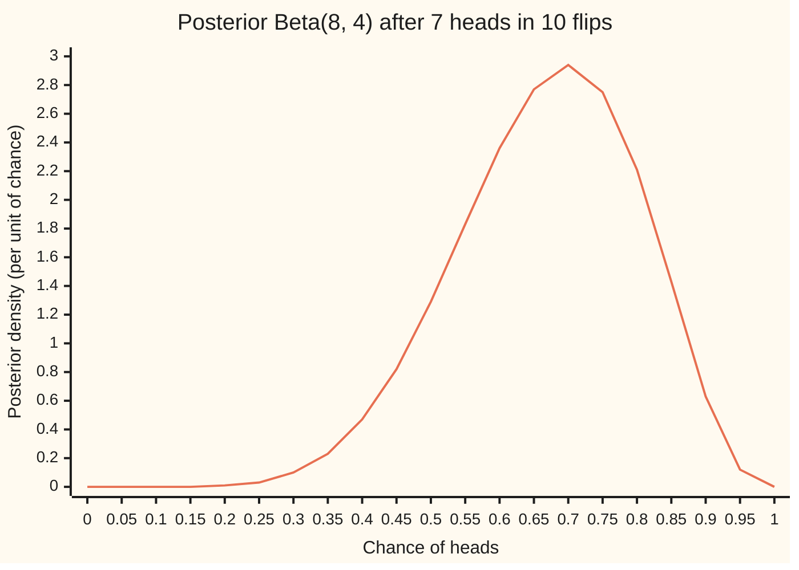
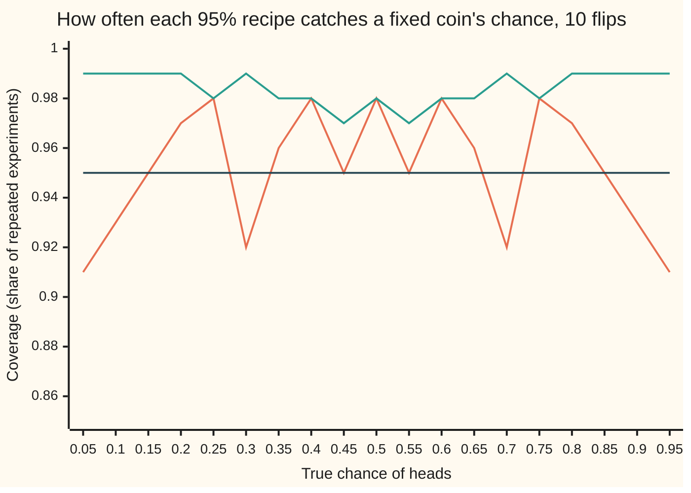

# Credible intervals and decisions: what the posterior lets you say and do

[Syllabus](../../../SYLLABUS.md) → [Probability and statistics](../README.md) → [Bayesian Inference](../README.md#s10) → Credible intervals and decisions

---

## General Overview

A new coin comes out of a souvenir shop's bag. Flipped ten times, it lands heads 7 times. Two friends want to use it to settle a running bet: $10 a flip, even money, and one of them may pick the side. Should the coin be used, and on which side?

Nobody knows the coin's true chance of heads. What is known is a curve over every candidate chance from 0 to 1, saying how believable each one is after the ten flips. [Beta-binomial](02-beta-binomial.md) gives the rule that builds that curve: add the heads to a beta law's first number and the tails to its second. Start from a flat prior (every chance equally believable, Beta(1, 1)), add 7 heads and 3 tails, and the posterior (the belief after the data) is Beta(8, 4). That card's gentler Beta(2, 2) prior gives Beta(9, 5) instead; the flat prior is used here, and the difference is measured below. This card does two things with the posterior.

**It says something.** Picture the posterior as a pile of sand spread along the line from 0 to 1, deepest near 0.7. A stretch of the line holding 95% of the sand is a **credible interval**, the term used from here on, and its sand is posterior probability. For this coin, the chance of heads lies between 0.39 and 0.89 with posterior probability 0.95. That sentence is about this coin, after these ten flips.

**It does something.** Each action, bet heads, bet tails or decline, gains or loses money depending on the true chance. Weigh the money by the posterior at every chance, add up, and compare. Betting heads averages a profit of $3.33 a flip; betting tails averages a loss of $3.33; declining is $0. Bet heads.

A confidence interval ([Confidence intervals](../08-Confidence%20Intervals%20and%20Tests/01-confidence-intervals.md)) looks similar, 0.35 to 0.93 for the same flips by the exact recipe of [Intervals for a proportion](../08-Confidence%20Intervals%20and%20Tests/02-intervals-for-proportions.md), but promises something else: a recipe that catches the true chance 95 times in 100 at every possible coin. The card computes both promises and shows where they part.

**Once the data are in, the posterior is the whole answer: a credible interval is a stretch holding a stated share of it, and the best action is the one whose loss, averaged over it, is smallest.**

**What kind of fact this is:** a method. The credible interval is a definition and the rule "smallest average loss" is a convention for what "best" means; the facts underneath it (the interval's exact share, the mean as the best single number under squared loss, the 95% average coverage) are theorems proved on this card in Why it works.

### The picture: the posterior for the coin's chance of heads



One line: the posterior density, peaking at 0.7. The 95% equal-tailed credible interval runs from 0.3903 to 0.8907 and leaves 2.5% of the area in each tail. The area left of 0.5, where tails is the better side, is 0.1133: about 1 chance in 9.

---

## The formula

Notation first, in words. The unknown chance of heads is $\theta$ (theta). The data, 7 heads in 10 flips, are $x$. The posterior density is written $f(\theta \mid x)$, read "the density of theta given the data"; its area over a stretch is the posterior probability of that stretch. For this coin:

$$f(\theta \mid x) = 1320\,\theta^{7}(1-\theta)^{3}, \qquad 0 < \theta < 1$$

A **credible interval** at level $1-\alpha$ is any stretch from $\theta_{lo}$ to $\theta_{hi}$ holding that share of the posterior:

$$P(\theta_{lo} \le \theta \le \theta_{hi} \mid x) \;=\; \int_{\theta_{lo}}^{\theta_{hi}} f(\theta \mid x)\,d\theta \;=\; 1-\alpha$$

**Read it aloud:** the chance, given the data, that theta lies between the two ends is the area under the posterior between them, and that area is 95%.

The **equal-tailed** interval picks the ends that leave $\alpha/2$ in each tail, where $F$ is the posterior's cumulative area:

$$F(\theta_{lo}) = \tfrac{\alpha}{2}, \qquad F(\theta_{hi}) = 1 - \tfrac{\alpha}{2}$$

A **decision** $d$ is an action. A **loss** $L(d,\theta)$ is the money lost by taking $d$ when the chance is theta (a gain counts as a negative loss). The **posterior expected loss** is its average over the posterior, and the **Bayes action** is the $d$ that makes it smallest:

$$\rho(d) \;=\; E[\,L(d,\theta) \mid x\,] \;=\; \int_0^1 L(d,\theta)\, f(\theta \mid x)\,d\theta, \qquad \text{choose the } d \text{ with the smallest } \rho(d)$$

**Read it aloud:** for each action, average its loss over every chance the coin might have, weighted by how believable that chance is; take the action with the smallest average.

| Symbol | Plain meaning | In our example | Push it up and the answer… |
| --- | --- | --- | --- |
| $\theta$ | the coin's unknown chance of heads | somewhere in 0 to 1 | — |
| $x$ | the data | 7 heads in 10 flips | more heads: the posterior slides right |
| $a$, $b$ | the posterior Beta(a, b): 1 + heads, 1 + tails under a flat prior | 8 and 4 | a + b larger: a narrower posterior |
| $m$ | posterior mean, a/(a + b) | 0.6667 | betting heads pays more |
| $v$ | posterior variance, the spread squared | 0.017094 (sd 0.1307) | wider intervals |
| $f(\theta \mid x)$ | posterior density: believability per unit of chance | peaks at 0.7, height 2.94 | — |
| $F$ | posterior cumulative area up to a point | F(0.5) = 0.1133 | — |
| $\alpha$ | the share left outside the interval | 0.05 | a shorter interval |
| $\theta_{lo}$, $\theta_{hi}$ | the interval's ends | 0.3903 and 0.8907 | — |
| $d$ | an action | bet heads, bet tails, decline | — |
| $L(d,\theta)$ | money lost by action d at chance theta | bet heads: −10(2θ − 1) dollars | — |
| $\rho(d)$ | posterior expected loss of d | −$3.33 for bet heads | the action looks worse |
| $t$, $j$, $h$, B(8, 4) | helpers: t a mark on the line from 0 to 1; j a count of points in Step 1's sum; h a small step in the median proof; B(8, 4) the beta integral | F(t) at t = 1/2; B(8, 4) = 1/1320 | — |

Two helpers. The density's constant 1320 is 1/B(8, 4), the reciprocal of the beta integral from [Gamma and beta](../04-Continuous%20Distributions/07-gamma-and-beta-distributions.md), so the whole area is 1. The mean and variance of Beta(a, b) are a/(a + b) and ab/((a + b)^2 (a + b + 1)), from the same card.

### When it holds

- **One fixed chance, independent flips.** The posterior assumes every flip has the same chance theta and no flip affects another. A flipper who can steer the coin breaks that, and every interval on this card describes the wrong thing.
- **A stated prior.** The flat prior is a choice. The Beta(2, 2) prior of the beta-binomial card, leaning gently towards a fair coin, moves the mean to 0.6429, the chance that heads is favoured to 0.8666, and the 95% equal-tailed interval to 0.3857 to 0.8614. With ten flips the prior shows; with a hundred it barely does.
- **A loss that matches the stakes.** The even-money bet's loss is a straight line in theta, so only the posterior mean matters. A player who cannot survive a run of losses has a curved loss, and the best action can change.
- **An accurate posterior.** Here it is exact. When it comes from a simulation, every area carries simulation error.
- **A probability given this data.** The 95% is the posterior's share for these ten flips. It is not a promise about how often the recipe catches the truth for a fixed coin; that is the confidence interval's promise, and the two can differ sharply.

---

## Why it works

### Step 0: after the data, every question is an area under one curve

The posterior is a complete probability law for theta. The chance that theta lies in a stretch is the area over that stretch. The average of any quantity that depends on theta, such as profit, is that quantity times the density, integrated. Intervals and decisions are both areas under the same curve.

### Step 1: the area up to any point, by counting

Beta(8, 4) is the law of the 8th smallest of 11 points dropped independently and uniformly on 0 to 1 ([Gamma and beta](../04-Continuous%20Distributions/07-gamma-and-beta-distributions.md) proves it by counting). The 8th smallest point sits at or below some mark exactly when at least 8 of the 11 points do. Each point lands below the mark independently, with chance equal to the mark. So the cumulative area is a binomial tail:

$$F(t) \;=\; \sum_{j=8}^{11} \binom{11}{j}\, t^{j} (1-t)^{11-j}$$

At the mark 1/2 every term has the same factor (1/2)^11 = 1/2048, and the counts are 165, 55, 11 and 1:

$$F(\tfrac12) = \frac{165 + 55 + 11 + 1}{2048} = \frac{232}{2048} = \frac{29}{256} = 0.1133$$

The posterior puts 0.1133 on "tails is the better side" and 0.8867 on "heads is". Integrating the density from 0 to 1/2 by Simpson's rule gives the same 0.113281.

### Step 2: the credible interval is two cut points

$F$ climbs smoothly from 0 to 1 and never flattens inside 0 to 1, because the density is positive there. So for each share, one cut point has exactly that much area to its left (the intermediate value theorem). Take the cut points at 0.025 and 0.975. The area between them is 0.975 − 0.025 = 0.95, exactly. That is the whole proof that the equal-tailed interval holds 95%.

Finding the cut points means solving F(t) = 0.025 and F(t) = 0.975. No formula gives them, so the code halves the search range 60 times (bisection). Both roads, the binomial sum and the Simpson area, give 0.3903 to 0.8907.

Equal tails is one choice among many; any stretch with 95% of the area is a 95% credible interval. The **shortest** one, also called the highest posterior density interval, runs from 0.4120 to 0.9066, width 0.4946 against 0.5005. It shifts right because the posterior is lopsided: its left tail is long and thin, so trimming there buys more width per unit of area.

<details>
<summary>Why the shortest interval ends at equal heights</summary>

If the density is lower at the left end, move the left end right a little; the area lost is small. Win it back at the right end, where the density is higher, with a smaller step. The width shrinks. So a shortest interval has equal heights at its ends. The code finds it by searching over how the 5% outside is split between the tails.

</details>

### Step 3: a decision averages its loss over the posterior

Betting $10 on heads at even money makes, per flip, $10 with chance theta and −$10 otherwise: 10(2θ − 1) dollars on average at a known theta. The loss is the negative of that. Average over the posterior. Because the loss is a straight line in theta, the average of the line is the line at the average:

$$\rho(\text{heads}) = -10\,(2m - 1) = -10\,(2 \times 0.6667 - 1) = -3.33$$

Betting tails has the mirror loss, +$3.33; declining loses nothing. The smallest expected loss is betting heads: a profit of $3.33 a flip on average.

Because the loss is a straight line, only the posterior mean decides the bet. That the interval contains 0.5 is beside the point: the question is which action pays more on average, not whether a fair coin is still believable.

A worse offer shows the rule weighing odds. Suppose heads wins only $8 while tails still loses $10. Profit per flip at chance theta is 8θ − 10(1 − θ) = 18θ − 10, averaging 18 × 0.6667 − 10 = $2.00. The bet loses money whenever theta is below 10/18, which has posterior probability 0.2015, yet it is still worth taking. The payout at which betting heads breaks even is $5.00 against a $10 loss.

One more average prices the uncertainty. Where tails is favoured, betting heads loses money; averaged over the posterior, that shortfall is $0.1595 a flip, small because only 0.1133 of the posterior lies below 1/2 and it sits close to 1/2. Knowing theta exactly would let the bettor switch to tails there and gain twice that, $0.32 a flip: the most perfect information could add.

The rule itself, "take the smallest posterior expected loss", is the definition of best under the posterior. The axioms that single it out as the only coherent rule are in Berger and Robert, listed under Sources.

### Step 4: reporting one number is a decision too

A report $d$ of the chance of heads, judged by squared miss (d − θ)^2, has expected loss

$$\rho(d) = E[(d-\theta)^2 \mid x] = v + (d - m)^2$$

Expand (d − θ)^2 as ((d − m) − (θ − m))^2. The cross term averages to zero, because theta averages to m under the posterior. What remains is the variance $v$ plus the squared distance from the mean. The smallest value is at d = m. So under squared loss the best single number is the **posterior mean**, 0.6667, with expected loss 0.017094, which is v = 2/117.

Other losses pick other numbers. Under absolute miss |d − θ| the best report is the **posterior median**, 0.6762. Under a loss of 0 inside a tiny window around the truth and 1 outside it, the best report tends to the **posterior mode**, the peak, 0.7000, as the window shrinks. Judged by squared loss, the median scores 0.017185 and the mode 0.018205. The mode is also the maximum-likelihood estimate here, since the prior is flat.

<details>
<summary>Detailed proof: absolute loss picks the median</summary>

Write the expected absolute loss as the integral of |d − θ| times the density. Move d right by a small step h. Every chance left of d is now h further away, and every chance right of d is h closer. The change is h times (area left of d minus area right of d), to first order. Left of the median, the area left is smaller, so moving right lowers the loss; right of the median it raises it. The loss is smallest where the two areas are equal, at F(d) = 1/2: the median, 0.6762.

</details>

### Step 5: credible and confidence intervals answer different questions

A confidence interval is judged at each fixed coin. Fix the true chance, imagine ten fresh flips again and again, and ask how often the recipe's interval contains the chance: the **coverage**. The exact (Clopper–Pearson) recipe from [Intervals for a proportion](../08-Confidence%20Intervals%20and%20Tests/02-intervals-for-proportions.md) guarantees at least 95% at every coin. For 7 heads it gives 0.3475 to 0.9333.

A credible interval is judged at the data actually seen. Its 95% is area under this posterior. Run the equal-tailed credible recipe as if it were a confidence recipe, one interval for each possible count from 0 to 10, and its coverage at a fixed coin can be anything:

| True chance of heads | Credible recipe covers | Exact confidence recipe covers |
| --- | --- | --- |
| 0.5 | 0.9785 | 0.9785 |
| 0.02 | 0.8171 | 0.9838 |
| 0.002 | 0.0000 | 0.9802 |

At 0.002 the credible recipe never covers. A coin with that chance almost always shows 0 heads in 10, and the equal-tailed interval for 0 heads must leave 2.5% of its posterior in the left tail, which cuts off every chance that small.

What the credible recipe does promise is an average. Average its coverage over coins drawn from the flat prior and it is exactly 95%; the code's grid of 20,000 coins returns 0.9500.

<details>
<summary>Detailed proof: average coverage equals the credible level</summary>

Draw a chance from the prior, flip ten times, get count x, build the credible interval for x. The chance the interval holds the drawn chance can be computed in two orders. Chance first: that is the coverage at each chance, averaged over the prior. Count first: each count x has some overall chance, 1/11 under the flat prior; given x, the drawn chance follows exactly the posterior for x, which puts 95% of its area in the interval for x. So the answer is 0.95 times the sum of the counts' chances, which is 0.95. The two orders count the same event, so the prior-average coverage is 0.95. No fixed coin is promised anything.

</details>

The two numbers also disagree on one data set. The exact confidence interval, 0.3475 to 0.9333, holds 0.9838 of this coin's posterior, not 0.95. Neither recipe is wrong. They answer different questions: "which chances are believable after these flips?" against "which recipe is right 95 times in 100 at every coin?".

### The chart: coverage at each fixed coin



Orange: the equal-tailed credible recipe, dipping to 0.91 near the ends and averaging 0.95 over the prior. Teal: the exact confidence recipe, never below 0.95, paid for with wider intervals. Dark: the 0.95 line. The saw-teeth come from whole-number counts: as the chance slides out of one count's interval, coverage drops by that count's chance.

The simulation in the code is a third road to the posterior that uses no beta formula: draw a chance from the flat prior, flip ten times, keep the chance only if 7 heads appear. The kept chances are draws from the posterior. When a posterior has no closed form, this idea, grown into a walk that proposes near where the posterior already is, is how its areas get computed: [MCMC in outline](06-markov-chain-monte-carlo-in-outline.md).

---

## Worked numbers, by hand

| Step | Arithmetic | Value |
| --- | --- | --- |
| posterior | flat prior Beta(1, 1), plus 7 heads and 3 tails | Beta(8, 4) |
| mean | 8 / (8 + 4) | 0.6667 |
| sd | square root of 8 × 4 / (12^2 × 13) | 0.1307 |
| chance tails is favoured | (165 + 55 + 11 + 1) / 2048 = 29/256 | 0.1133 |
| chance heads is favoured | 1 − 0.1133 | 0.8867 |
| 95% equal-tailed interval | solve F = 0.025 and F = 0.975 by halving | 0.3903 to 0.8907 |
| bet heads, per flip | 10 × (2 × 0.6667 − 1) | **$3.33** |
| bet tails, per flip | −10 × (2 × 0.6667 − 1) | −$3.33 |
| heads wins $8, tails loses $10 | 18 × 0.6667 − 10 | $2.00 |

Use the coin, and bet heads: on average $3.33 a flip, with about 1 chance in 9 that the coin in fact favours tails.

### What breaks if you drop a piece

| Mistake | Comes out at | What went wrong |
| --- | --- | --- |
| Decide by whether the interval contains 0.5 | decline, $0.00 a flip instead of $3.33 | the interval answers "which chances are believable", not "which action pays" |
| Plug in the observed share 0.7 | $4.00 a flip | treats the chance as known; the posterior mean 0.6667 is the right average |
| Read the exact confidence interval as a 95% posterior range | holds 0.9838 of the posterior | a statement about a recipe, not about this coin |
| Report the mode under squared loss | expected loss 0.018205, not 0.017094 | squared loss is minimised by the mean |
| Take the credible 95% as coverage at a nearly-never-heads coin (0.02) | covers 0.8171 of the time | credible mass is not a per-coin guarantee |

---

## Code, from first principles, and it actually runs

The scripts reach the posterior's areas by three independent roads: the binomial sum of Step 1, Simpson's rule on the density, and a seeded simulation that draws from the prior, flips, and keeps only the runs matching the data. Then they price every action, score three single-number reports, and compute each recipe's coverage at fixed coins. Six asserts compare independently computed values. Random numbers come from SplitMix64 with seed 20260929, written out in both languages, so both print the same draws.

### Python

```python
# Credible intervals and decisions -- the check behind the card.  Standard library only.
# A new coin shows 7 heads in 10 flips.  Flat prior, so the chance of heads has posterior
# Beta(8, 4).  Roads: (1) the posterior CDF as a binomial sum, (2) the same CDF by Simpson's
# rule on the density, (3) a seeded simulation that draws a chance from the flat prior, flips
# ten times and keeps only the runs with 7 heads; it never uses a beta formula.
N_FLIPS, HEADS, STAKE = 10, 7, 10.0
A, B = 1 + HEADS, 1 + N_FLIPS - HEADS            # posterior Beta(8, 4)
MASK = (1 << 64) - 1

def choose(n, k):
    out = 1
    for i in range(k):
        out = out * (n - i) // (i + 1)
    return out

def cdf_sum(t, a, b):                            # road 1: P(chance <= t) = P(at least a of a+b-1 uniforms <= t)
    n = a + b - 1
    return sum(choose(n, j) * t ** j * (1 - t) ** (n - j) for j in range(a, n + 1))

def dens(t, a=A, b=B):                           # 1/B(a,b) = (a+b-1)!/((a-1)!(b-1)!) for whole a, b
    return (a + b - 1) * choose(a + b - 2, a - 1) * t ** (a - 1) * (1 - t) ** (b - 1)

def simpson(g, lo, hi, n=2000):
    h = (hi - lo) / n
    s = g(lo) + g(hi) + sum((4 if i % 2 else 2) * g(lo + i * h) for i in range(1, n))
    return s * h / 3

def cdf_int(t):                                  # road 2: area under the density up to t
    return simpson(dens, 0.0, t)

def quantile(cdf, p):                            # bisection: the t with cdf(t) = p
    lo, hi = 0.0, 1.0
    for _ in range(60):
        mid = (lo + hi) / 2
        lo, hi = (mid, hi) if cdf(mid) < p else (lo, mid)
    return (lo + hi) / 2

def q(p, a=A, b=B):
    return quantile(lambda t: cdf_sum(t, a, b), p)

lo1, hi1, med = q(0.025), q(0.975), q(0.5)
lo2, hi2 = quantile(cdf_int, 0.025), quantile(cdf_int, 0.975)
m, v, mode = A / (A + B), A * B / ((A + B) ** 2 * (A + B + 1)), (A - 1) / (A + B - 2)
below_half = cdf_int(0.5)                        # by hand: (165 + 55 + 11 + 1) / 2048 = 29/256
lo_share, hi_share = 0.0, 0.05                   # shortest 95%: slide the 5% between the tails
for _ in range(60):
    c1, c2 = lo_share + (hi_share - lo_share) / 3, hi_share - (hi_share - lo_share) / 3
    if q(c1 + 0.95) - q(c1) < q(c2 + 0.95) - q(c2):
        hi_share = c2
    else:
        lo_share = c1
hpd_lo, hpd_hi = q(lo_share), q(lo_share + 0.95)

state = 20260929                                 # road 3: SplitMix64, seed 20260929
def uniform():                                   # strictly between 0 and 1
    global state
    state = (state + 0x9E3779B97F4A7C15) & MASK
    z = state
    z = ((z ^ (z >> 30)) * 0xBF58476D1CE4E5B9) & MASK
    z = ((z ^ (z >> 27)) * 0x94D049BB133111EB) & MASK
    return (((z ^ (z >> 31)) >> 11) + 0.5) / 2.0 ** 53
kept = []
for _ in range(220000):                          # a chance from the flat prior, then ten flips
    theta = uniform()
    if sum(uniform() < theta for _ in range(N_FLIPS)) == HEADS:
        kept.append(theta)
kept.sort()
k = len(kept)
sim_m = sum(kept) / k
sim_se = (sum((t - sim_m) ** 2 for t in kept) / (k - 1) / k) ** 0.5
sim_p = sum(t > 0.5 for t in kept) / k
sim_p_se = (sim_p * (1 - sim_p) / k) ** 0.5

def heads(t):                                    # profit per flip of a $10 even-money bet on heads
    return STAKE * (2 * t - 1)
def post_avg(g):                                 # average of g over the posterior, by Simpson
    return simpson(lambda t: g(t) * dens(t), 0.0, 1.0)
profit_heads, profit_tails = post_avg(heads), post_avg(lambda t: -heads(t))
profit_tilt = post_avg(lambda t: 18 * t - 10)    # heads wins $8, tails loses $10
shortfall = post_avg(lambda t: max(0.0, -heads(t)))
sim_profit = sum(heads(t) for t in kept) / k
risk = [post_avg(lambda t, d=d: (t - d) ** 2) for d in (m, med, mode)]

def cover(theta, ints):                          # chance, at a fixed theta, that the recipe's interval holds it
    return sum(choose(N_FLIPS, x) * theta ** x * (1 - theta) ** (N_FLIPS - x)
               for x, (lo, hi) in enumerate(ints) if lo <= theta <= hi)
CRED = [(q(0.025, 1 + x, 1 + N_FLIPS - x), q(0.975, 1 + x, 1 + N_FLIPS - x)) for x in range(N_FLIPS + 1)]
EXACT = [(0.0 if x == 0 else q(0.025, x, N_FLIPS - x + 1),     # Clopper-Pearson ends are beta quantiles too
          1.0 if x == N_FLIPS else q(0.975, x + 1, N_FLIPS - x)) for x in range(N_FLIPS + 1)]
G = 20000
prior_avg = sum(cover((i + 0.5) / G, CRED) for i in range(G)) / G
grid = [j / 20 for j in range(1, 20)]
cov_c, cov_e = [cover(t, CRED) for t in grid], [cover(t, EXACT) for t in grid]
cp_lo, cp_hi = EXACT[HEADS]

rows = [
    ("posterior Beta(a, b), 1/B(a, b)", f"{A} {B} {(A + B - 1) * choose(A + B - 2, A - 1)}"), ("mean, sd", f"{m:.4f} {v ** 0.5:.4f}"),
    ("median, mode", f"{med:.4f} {mode:.4f}"),
    ("P(chance <= 1/2) Simpson, 29/256", f"{below_half:.6f} {29 / 256:.6f} = "
     + " + ".join(str(choose(11, j)) for j in range(8, 12)) + " over 2048"),
    ("P(chance > 1/2)", f"{1 - below_half:.4f}"),
    ("95% equal-tailed, binomial sum", f"{lo1:.4f} {hi1:.4f}"),
    ("95% equal-tailed, Simpson", f"{lo2:.4f} {hi2:.4f}"),
    ("95% shortest", f"{hpd_lo:.4f} {hpd_hi:.4f}"),
    ("widths: equal-tailed, shortest", f"{hi1 - lo1:.4f} {hpd_hi - hpd_lo:.4f}"),
    ("sim: prior draws, runs kept, share, 1/11", f"220000 {k} {k / 220000:.4f} {1 / 11:.4f}"),
    ("sim: mean, se", f"{sim_m:.4f} {sim_se:.4f}"),
    ("sim: P(chance > 1/2), se", f"{sim_p:.4f} {sim_p_se:.4f}"),
    ("sim: 2.5% and 97.5% points", f"{kept[int(0.025 * k)]:.4f} {kept[int(0.975 * k)]:.4f}"),
    ("profit/flip: heads, tails, decline ($)", f"{profit_heads:.4f} {profit_tails:.4f} 0.0000"),
    ("  10 (2 mean - 1), sim ($)", f"{STAKE * (2 * m - 1):.4f} {sim_profit:.4f}"),
    ("  shortfall of heads when tails-heavy ($)", f"{shortfall:.4f}"),
    ("tilted 8 to 10: profit ($), P(loses)", f"{profit_tilt:.4f} {cdf_int(10 / 18):.4f}"),
    ("  payout that breaks even ($)", f"{STAKE * (1 - m) / m:.4f}"),
    ("sq risk: mean, median, mode", f"{risk[0]:.6f} {risk[1]:.6f} {risk[2]:.6f}"),
    ("  var, var + (mode - mean)^2", f"{v:.6f} {v + (mode - m) ** 2:.6f}"),
    ("95% exact confidence (Clopper-Pearson)", f"{cp_lo:.4f} {cp_hi:.4f}"),
    ("  its posterior mass", f"{cdf_sum(cp_hi, A, B) - cdf_sum(cp_lo, A, B):.4f}"),
    ("coverage at 0.5: credible, exact", f"{cover(0.5, CRED):.4f} {cover(0.5, EXACT):.4f}"),
    ("coverage at 0.02: credible, exact", f"{cover(0.02, CRED):.4f} {cover(0.02, EXACT):.4f}"),
    ("coverage at 0.002: credible, exact", f"{cover(0.002, CRED):.4f} {cover(0.002, EXACT):.4f}"),
    ("credible coverage averaged over prior", f"{prior_avg:.4f}"),
    ("mistake: MLE 0.7 in the profit ($)", f"{STAKE * (2 * 0.7 - 1):.4f}"),
    ("mistake: Beta(heads, tails), interval", f"{q(0.025, 7, 3):.4f} {q(0.975, 7, 3):.4f}"),
    ("try: 70 of 100, interval", f"{q(0.025, 71, 31):.4f} {q(0.975, 71, 31):.4f}"),
    ("try: prior Beta(2,2), mean, P(> 1/2), 95%", f"{9 / 14:.4f} {1 - cdf_sum(0.5, 9, 5):.4f} {q(0.025, 9, 5):.4f} {q(0.975, 9, 5):.4f}"),
    ("try: 99% equal-tailed", f"{q(0.005):.4f} {q(0.995):.4f}"),
]
for name, val in rows:
    print(f"{name:<42} {val}")
print("figure, density at 0, 0.05, .., 1: " + ", ".join(f"{dens(j / 20):.2f}" for j in range(21)))
print("figure, coverage credible 0.05..0.95: " + ", ".join(f"{c:.2f}" for c in cov_c))
print("figure, coverage exact 0.05..0.95: " + ", ".join(f"{c:.2f}" for c in cov_e))
assert abs(lo1 - lo2) < 1e-8 and abs(hi1 - hi2) < 1e-8          # two roads to the interval
assert abs(below_half - 29 / 256) < 1e-10                       # Simpson against the hand count
assert abs(sim_m - m) < 4 * sim_se and abs(sim_p - (1 - below_half)) < 4 * sim_p_se
assert abs(profit_heads - STAKE * (2 * m - 1)) < 1e-9           # integral against linearity
assert abs(risk[2] - (v + (mode - m) ** 2)) < 1e-9 and risk[0] < risk[1] < risk[2]
assert abs(prior_avg - 0.95) < 1e-3 and min(cov_e) >= 0.95 > min(cov_c)
print("ALL CHECKS PASS")
```

**Ran 2026-10-06 on macOS, Python 3.14.6, standard library only. All checks passed. Output, pasted from the run:**

```
posterior Beta(a, b), 1/B(a, b)            8 4 1320
mean, sd                                   0.6667 0.1307
median, mode                               0.6762 0.7000
P(chance <= 1/2) Simpson, 29/256           0.113281 0.113281 = 165 + 55 + 11 + 1 over 2048
P(chance > 1/2)                            0.8867
95% equal-tailed, binomial sum             0.3903 0.8907
95% equal-tailed, Simpson                  0.3903 0.8907
95% shortest                               0.4120 0.9066
widths: equal-tailed, shortest             0.5005 0.4946
sim: prior draws, runs kept, share, 1/11   220000 20116 0.0914 0.0909
sim: mean, se                              0.6667 0.0009
sim: P(chance > 1/2), se                   0.8830 0.0023
sim: 2.5% and 97.5% points                 0.3870 0.8913
profit/flip: heads, tails, decline ($)     3.3333 -3.3333 0.0000
  10 (2 mean - 1), sim ($)                 3.3333 3.3339
  shortfall of heads when tails-heavy ($)  0.1595
tilted 8 to 10: profit ($), P(loses)       2.0000 0.2015
  payout that breaks even ($)              5.0000
sq risk: mean, median, mode                0.017094 0.017185 0.018205
  var, var + (mode - mean)^2               0.017094 0.018205
95% exact confidence (Clopper-Pearson)     0.3475 0.9333
  its posterior mass                       0.9838
coverage at 0.5: credible, exact           0.9785 0.9785
coverage at 0.02: credible, exact          0.8171 0.9838
coverage at 0.002: credible, exact         0.0000 0.9802
credible coverage averaged over prior      0.9500
mistake: MLE 0.7 in the profit ($)         4.0000
mistake: Beta(heads, tails), interval      0.3999 0.9251
try: 70 of 100, interval                   0.6039 0.7810
try: prior Beta(2,2), mean, P(> 1/2), 95%  0.6429 0.8666 0.3857 0.8614
try: 99% equal-tailed                      0.3067 0.9312
figure, density at 0, 0.05, .., 1: 0.00, 0.00, 0.00, 0.00, 0.01, 0.03, 0.10, 0.23, 0.47, 0.82, 1.29, 1.83, 2.36, 2.77, 2.94, 2.75, 2.21, 1.43, 0.63, 0.12, 0.00
figure, coverage credible 0.05..0.95: 0.91, 0.93, 0.95, 0.97, 0.98, 0.92, 0.96, 0.98, 0.95, 0.98, 0.95, 0.98, 0.96, 0.92, 0.98, 0.97, 0.95, 0.93, 0.91
figure, coverage exact 0.05..0.95: 0.99, 0.99, 0.99, 0.99, 0.98, 0.99, 0.98, 0.98, 0.97, 0.98, 0.97, 0.98, 0.98, 0.99, 0.98, 0.99, 0.99, 0.99, 0.99
ALL CHECKS PASS
```

### Rust

Same numbers, same labels, built with `rustc --edition 2021 -O`.

```rust
// Credible intervals and decisions -- the same check as the Python, in Rust.  No crates.
// A new coin shows 7 heads in 10 flips.  Flat prior, so the chance of heads has posterior
// Beta(8, 4).  Roads: (1) the posterior CDF as a binomial sum, (2) the same CDF by Simpson's
// rule on the density, (3) a seeded simulation that draws a chance from the flat prior, flips
// ten times and keeps only the runs with 7 heads; it never uses a beta formula.
const N_FLIPS: u64 = 10;
const HEADS: u64 = 7;
const STAKE: f64 = 10.0;
const A: u64 = 1 + HEADS;
const B: u64 = 1 + N_FLIPS - HEADS; // posterior Beta(8, 4)

fn choose(n: u64, k: u64) -> f64 {
    let mut out: u128 = 1;
    for i in 0..k as u128 { out = out * (n as u128 - i) / (i + 1) }
    out as f64
}

// road 1: P(chance <= t) = P(at least a of a+b-1 uniforms <= t)
fn cdf_sum(t: f64, a: u64, b: u64) -> f64 {
    let n = a + b - 1;
    (a..=n).map(|j| choose(n, j) * t.powf(j as f64) * (1.0 - t).powf((n - j) as f64)).sum()
}

fn dens(t: f64) -> f64 { // 1/B(a,b) = (a+b-1)!/((a-1)!(b-1)!) for whole a, b
    (A + B - 1) as f64 * choose(A + B - 2, A - 1) * t.powf((A - 1) as f64) * (1.0 - t).powf((B - 1) as f64)
}

fn simpson(g: &dyn Fn(f64) -> f64, lo: f64, hi: f64) -> f64 {
    let n = 2000;
    let h = (hi - lo) / n as f64;
    let mut s = g(lo) + g(hi);
    for i in 1..n { s += if i % 2 == 1 { 4.0 } else { 2.0 } * g(lo + i as f64 * h) }
    s * h / 3.0
}

fn cdf_int(t: f64) -> f64 { simpson(&dens, 0.0, t) } // road 2: area under the density up to t

fn quantile(cdf: &dyn Fn(f64) -> f64, p: f64) -> f64 { // bisection: the t with cdf(t) = p
    let (mut lo, mut hi) = (0.0, 1.0);
    for _ in 0..60 {
        let mid = (lo + hi) / 2.0;
        if cdf(mid) < p { lo = mid } else { hi = mid }
    }
    (lo + hi) / 2.0
}

fn q(p: f64, a: u64, b: u64) -> f64 { quantile(&|t| cdf_sum(t, a, b), p) }

struct SplitMix(u64);
impl SplitMix {
    fn uniform(&mut self) -> f64 { // strictly between 0 and 1
        self.0 = self.0.wrapping_add(0x9E3779B97F4A7C15);
        let mut z = self.0;
        z = (z ^ (z >> 30)).wrapping_mul(0xBF58476D1CE4E5B9);
        z = (z ^ (z >> 27)).wrapping_mul(0x94D049BB133111EB);
        (((z ^ (z >> 31)) >> 11) as f64 + 0.5) / 2f64.powi(53)
    }
}

fn heads(t: f64) -> f64 { STAKE * (2.0 * t - 1.0) } // profit per flip of a $10 even-money bet on heads
fn post_avg(g: &dyn Fn(f64) -> f64) -> f64 { simpson(&|t| g(t) * dens(t), 0.0, 1.0) }

// chance, at a fixed theta, that the recipe's interval holds it
fn cover(theta: f64, ints: &[(f64, f64)]) -> f64 {
    let mut s = 0.0;
    for (x, &(lo, hi)) in ints.iter().enumerate() {
        let x = x as u64;
        if lo <= theta && theta <= hi {
            s += choose(N_FLIPS, x) * theta.powf(x as f64) * (1.0 - theta).powf((N_FLIPS - x) as f64);
        }
    }
    s
}

fn join(xs: &[f64]) -> String { xs.iter().map(|x| format!("{:.2}", x)).collect::<Vec<_>>().join(", ") }

fn main() {
    let (lo1, hi1, med) = (q(0.025, A, B), q(0.975, A, B), q(0.5, A, B));
    let (lo2, hi2) = (quantile(&cdf_int, 0.025), quantile(&cdf_int, 0.975));
    let (af, bf) = (A as f64, B as f64);
    let (m, v, mode) = (af / (af + bf), af * bf / ((af + bf).powi(2) * (af + bf + 1.0)), (af - 1.0) / (af + bf - 2.0));
    let below_half = cdf_int(0.5); // by hand: (165 + 55 + 11 + 1) / 2048 = 29/256
    let (mut lo_share, mut hi_share) = (0.0, 0.05); // shortest 95%: slide the 5% between the tails
    for _ in 0..60 {
        let c1 = lo_share + (hi_share - lo_share) / 3.0;
        let c2 = hi_share - (hi_share - lo_share) / 3.0;
        if q(c1 + 0.95, A, B) - q(c1, A, B) < q(c2 + 0.95, A, B) - q(c2, A, B) { hi_share = c2 } else { lo_share = c1 }
    }
    let (hpd_lo, hpd_hi) = (q(lo_share, A, B), q(lo_share + 0.95, A, B));

    let mut rng = SplitMix(20260929); // road 3: SplitMix64, seed 20260929
    let mut kept: Vec<f64> = Vec::new();
    for _ in 0..220000 { // a chance from the flat prior, then ten flips
        let theta = rng.uniform();
        let mut h = 0;
        for _ in 0..N_FLIPS { if rng.uniform() < theta { h += 1 } }
        if h == HEADS { kept.push(theta) }
    }
    kept.sort_by(|a, b| a.partial_cmp(b).unwrap());
    let k = kept.len() as f64;
    let sim_m = kept.iter().sum::<f64>() / k;
    let sim_se = (kept.iter().map(|t| (t - sim_m).powi(2)).sum::<f64>() / (k - 1.0) / k).sqrt();
    let sim_p = kept.iter().filter(|&&t| t > 0.5).count() as f64 / k;
    let sim_p_se = (sim_p * (1.0 - sim_p) / k).sqrt();
    let pick = |p: f64| kept[(p * k) as usize];

    let (profit_heads, profit_tails) = (post_avg(&heads), post_avg(&|t| -heads(t)));
    let profit_tilt = post_avg(&|t| 18.0 * t - 10.0); // heads wins $8, tails loses $10
    let shortfall = post_avg(&|t| f64::max(0.0, -heads(t)));
    let sim_profit = kept.iter().map(|&t| heads(t)).sum::<f64>() / k;
    let risk: Vec<f64> = [m, med, mode].iter().map(|&d| post_avg(&|t| (t - d).powi(2))).collect();

    let cred: Vec<(f64, f64)> = (0..=N_FLIPS).map(|x| (q(0.025, 1 + x, 1 + N_FLIPS - x), q(0.975, 1 + x, 1 + N_FLIPS - x))).collect();
    let exact: Vec<(f64, f64)> = (0..=N_FLIPS).map(|x| ( // Clopper-Pearson ends are beta quantiles too
        if x == 0 { 0.0 } else { q(0.025, x, N_FLIPS - x + 1) },
        if x == N_FLIPS { 1.0 } else { q(0.975, x + 1, N_FLIPS - x) })).collect();
    let g = 20000;
    let prior_avg = (0..g).map(|i| cover((i as f64 + 0.5) / g as f64, &cred)).sum::<f64>() / g as f64;
    let grid: Vec<f64> = (1..20).map(|j| j as f64 / 20.0).collect();
    let cov_c: Vec<f64> = grid.iter().map(|&t| cover(t, &cred)).collect();
    let cov_e: Vec<f64> = grid.iter().map(|&t| cover(t, &exact)).collect();
    let (cp_lo, cp_hi) = exact[HEADS as usize];
    let min = |xs: &[f64]| xs.iter().cloned().fold(f64::INFINITY, f64::min);

    let rows: Vec<(&str, String)> = vec![
        ("posterior Beta(a, b), 1/B(a, b)", format!("{} {} {}", A, B, (A + B - 1) as f64 * choose(A + B - 2, A - 1))), ("mean, sd", format!("{:.4} {:.4}", m, v.sqrt())),
        ("median, mode", format!("{:.4} {:.4}", med, mode)),
        ("P(chance <= 1/2) Simpson, 29/256", format!("{:.6} {:.6} = {} over 2048", below_half, 29.0 / 256.0,
            (8..12).map(|j| choose(11, j).to_string()).collect::<Vec<_>>().join(" + "))),
        ("P(chance > 1/2)", format!("{:.4}", 1.0 - below_half)),
        ("95% equal-tailed, binomial sum", format!("{:.4} {:.4}", lo1, hi1)),
        ("95% equal-tailed, Simpson", format!("{:.4} {:.4}", lo2, hi2)),
        ("95% shortest", format!("{:.4} {:.4}", hpd_lo, hpd_hi)),
        ("widths: equal-tailed, shortest", format!("{:.4} {:.4}", hi1 - lo1, hpd_hi - hpd_lo)),
        ("sim: prior draws, runs kept, share, 1/11", format!("220000 {} {:.4} {:.4}", kept.len(), k / 220000.0, 1.0 / 11.0)),
        ("sim: mean, se", format!("{:.4} {:.4}", sim_m, sim_se)),
        ("sim: P(chance > 1/2), se", format!("{:.4} {:.4}", sim_p, sim_p_se)),
        ("sim: 2.5% and 97.5% points", format!("{:.4} {:.4}", pick(0.025), pick(0.975))),
        ("profit/flip: heads, tails, decline ($)", format!("{:.4} {:.4} 0.0000", profit_heads, profit_tails)),
        ("  10 (2 mean - 1), sim ($)", format!("{:.4} {:.4}", STAKE * (2.0 * m - 1.0), sim_profit)),
        ("  shortfall of heads when tails-heavy ($)", format!("{:.4}", shortfall)),
        ("tilted 8 to 10: profit ($), P(loses)", format!("{:.4} {:.4}", profit_tilt, cdf_int(10.0 / 18.0))),
        ("  payout that breaks even ($)", format!("{:.4}", STAKE * (1.0 - m) / m)),
        ("sq risk: mean, median, mode", format!("{:.6} {:.6} {:.6}", risk[0], risk[1], risk[2])),
        ("  var, var + (mode - mean)^2", format!("{:.6} {:.6}", v, v + (mode - m).powi(2))),
        ("95% exact confidence (Clopper-Pearson)", format!("{:.4} {:.4}", cp_lo, cp_hi)),
        ("  its posterior mass", format!("{:.4}", cdf_sum(cp_hi, A, B) - cdf_sum(cp_lo, A, B))),
        ("coverage at 0.5: credible, exact", format!("{:.4} {:.4}", cover(0.5, &cred), cover(0.5, &exact))),
        ("coverage at 0.02: credible, exact", format!("{:.4} {:.4}", cover(0.02, &cred), cover(0.02, &exact))),
        ("coverage at 0.002: credible, exact", format!("{:.4} {:.4}", cover(0.002, &cred), cover(0.002, &exact))),
        ("credible coverage averaged over prior", format!("{:.4}", prior_avg)),
        ("mistake: MLE 0.7 in the profit ($)", format!("{:.4}", STAKE * (2.0 * 0.7 - 1.0))),
        ("mistake: Beta(heads, tails), interval", format!("{:.4} {:.4}", q(0.025, 7, 3), q(0.975, 7, 3))),
        ("try: 70 of 100, interval", format!("{:.4} {:.4}", q(0.025, 71, 31), q(0.975, 71, 31))),
        ("try: prior Beta(2,2), mean, P(> 1/2), 95%", format!("{:.4} {:.4} {:.4} {:.4}", 9.0 / 14.0, 1.0 - cdf_sum(0.5, 9, 5), q(0.025, 9, 5), q(0.975, 9, 5))),
        ("try: 99% equal-tailed", format!("{:.4} {:.4}", q(0.005, A, B), q(0.995, A, B))),
    ];
    for (name, val) in &rows { println!("{:<42} {}", name, val) }
    let dgrid: Vec<f64> = (0..21).map(|j| dens(j as f64 / 20.0)).collect();
    println!("figure, density at 0, 0.05, .., 1: {}", join(&dgrid));
    println!("figure, coverage credible 0.05..0.95: {}", join(&cov_c));
    println!("figure, coverage exact 0.05..0.95: {}", join(&cov_e));
    assert!((lo1 - lo2).abs() < 1e-8 && (hi1 - hi2).abs() < 1e-8); // two roads to the interval
    assert!((below_half - 29.0 / 256.0).abs() < 1e-10); // Simpson against the hand count
    assert!((sim_m - m).abs() < 4.0 * sim_se && (sim_p - (1.0 - below_half)).abs() < 4.0 * sim_p_se);
    assert!((profit_heads - STAKE * (2.0 * m - 1.0)).abs() < 1e-9); // integral against linearity
    assert!((risk[2] - (v + (mode - m).powi(2))).abs() < 1e-9 && risk[0] < risk[1] && risk[1] < risk[2]);
    assert!((prior_avg - 0.95).abs() < 1e-3 && min(&cov_e) >= 0.95 && 0.95 > min(&cov_c));
    println!("ALL CHECKS PASS");
}
```

**Ran 2026-10-06 on macOS, rustc 1.98.1, no crates. All checks passed. Output, pasted from the run:**

```
posterior Beta(a, b), 1/B(a, b)            8 4 1320
mean, sd                                   0.6667 0.1307
median, mode                               0.6762 0.7000
P(chance <= 1/2) Simpson, 29/256           0.113281 0.113281 = 165 + 55 + 11 + 1 over 2048
P(chance > 1/2)                            0.8867
95% equal-tailed, binomial sum             0.3903 0.8907
95% equal-tailed, Simpson                  0.3903 0.8907
95% shortest                               0.4120 0.9066
widths: equal-tailed, shortest             0.5005 0.4946
sim: prior draws, runs kept, share, 1/11   220000 20116 0.0914 0.0909
sim: mean, se                              0.6667 0.0009
sim: P(chance > 1/2), se                   0.8830 0.0023
sim: 2.5% and 97.5% points                 0.3870 0.8913
profit/flip: heads, tails, decline ($)     3.3333 -3.3333 0.0000
  10 (2 mean - 1), sim ($)                 3.3333 3.3339
  shortfall of heads when tails-heavy ($)  0.1595
tilted 8 to 10: profit ($), P(loses)       2.0000 0.2015
  payout that breaks even ($)              5.0000
sq risk: mean, median, mode                0.017094 0.017185 0.018205
  var, var + (mode - mean)^2               0.017094 0.018205
95% exact confidence (Clopper-Pearson)     0.3475 0.9333
  its posterior mass                       0.9838
coverage at 0.5: credible, exact           0.9785 0.9785
coverage at 0.02: credible, exact          0.8171 0.9838
coverage at 0.002: credible, exact         0.0000 0.9802
credible coverage averaged over prior      0.9500
mistake: MLE 0.7 in the profit ($)         4.0000
mistake: Beta(heads, tails), interval      0.3999 0.9251
try: 70 of 100, interval                   0.6039 0.7810
try: prior Beta(2,2), mean, P(> 1/2), 95%  0.6429 0.8666 0.3857 0.8614
try: 99% equal-tailed                      0.3067 0.9312
figure, density at 0, 0.05, .., 1: 0.00, 0.00, 0.00, 0.00, 0.01, 0.03, 0.10, 0.23, 0.47, 0.82, 1.29, 1.83, 2.36, 2.77, 2.94, 2.75, 2.21, 1.43, 0.63, 0.12, 0.00
figure, coverage credible 0.05..0.95: 0.91, 0.93, 0.95, 0.97, 0.98, 0.92, 0.96, 0.98, 0.95, 0.98, 0.95, 0.98, 0.96, 0.92, 0.98, 0.97, 0.95, 0.93, 0.91
figure, coverage exact 0.05..0.95: 0.99, 0.99, 0.99, 0.99, 0.98, 0.99, 0.98, 0.98, 0.97, 0.98, 0.97, 0.98, 0.98, 0.99, 0.98, 0.99, 0.99, 0.99, 0.99
ALL CHECKS PASS
```

The two outputs match line for line. The simulation keeps 20,116 of 220,000 runs, a share of 0.0914 against the exact 1/11 = 0.0909; its mean 0.6667 and its P(chance > 1/2) of 0.8830 sit within two standard errors of the exact 0.6667 and 0.8867.

> [!TIP]
> **Try changing**
> Guess first, then run it.
> - **A hundred flips.** With 70 heads in 100 the posterior is Beta(71, 31). Guess the width before looking: the interval is 0.6039 to 0.7810, width 0.1771 against 0.5005, about a third as wide, and it now excludes 0.5.
> - **A different prior.** Set `A, B = 2 + HEADS, 2 + N_FLIPS - HEADS`, a Beta(2, 2) prior. The mean drops to 0.6429, P(chance > 1/2) to 0.8666 and the interval to 0.3857 to 0.8614; betting heads still wins. The second assert stops the run: the hand count 29/256, like the simulation, belongs to the flat prior.
> - **A 99% interval.** Change 0.025 and 0.975 to 0.005 and 0.995: 0.3067 to 0.9312. It still contains 0.5, and the bet is still $3.33 a flip in favour of heads.
> - **Worse odds.** Guess the payout at which betting heads stops being worth it. The checks print it: $5.00 against a $10 loss, where the average profit 15 × 0.6667 − 10 is zero.

---

## The usual mistake

> [!warning]
> **Reading a confidence interval as a credible one.** "There is a 95% chance the true value lies in 0.3475 to 0.9333" is a statement about the posterior, and under a flat prior that stretch holds 0.9838 of it, not 0.95. The confidence interval's 95% belongs to the recipe run on many data sets at a fixed coin. The reverse slip is as common: a 95% credible interval is not a promise to catch any particular coin 95 times in 100; at a coin with chance 0.02 the credible recipe catches it 0.8171 of the time.
>
> - **Deciding by the interval.** "0.5 is inside the interval, so the coin might be fair, so do not bet" throws away $3.33 a flip. A decision needs a loss; the interval has none.
> - **Plugging in the best guess.** Profit computed at the observed share 0.7 is $4.00 a flip, 20% too high. Averaging over the posterior gives $3.33, and for a curved loss the gap can be larger.
> - **Forgetting the prior's own counts.** Writing Beta(heads, tails) = Beta(7, 3), without the flat prior's 1 and 1, moves the interval to 0.3999 to 0.9251. That is not the data alone: the flips alone, θ^7(1 − θ)^3 scaled to area 1, are Beta(8, 4), the flat-prior answer. Beta(7, 3) is the posterior under Beta(0, 0), an improper prior (its area is infinite, so it is not a true law), and still a prior. The prior is part of the answer; state it.
> - **Calling the interval unique.** Equal-tailed (0.3903 to 0.8907) and shortest (0.4120 to 0.9066) both hold 95%. Say which one is quoted.

---

## Where you meet it in real life

- **A/B tests on websites.** A Bayesian A/B test reports the posterior probability that version B converts better, and the expected loss of shipping it if it does not: Step 3 with two posteriors.
- **Clinical trials.** Adaptive trials stop early when the posterior probability of benefit passes a threshold, a credible statement about this trial's data.
- **A measurement with a known error.** The same interval for a mean, with a normal posterior, is on [Normal-normal](03-normal-normal.md); for a rate of events, on [Gamma-Poisson](04-gamma-poisson.md).

> **Say it back**
> After 7 heads in 10 flips and a flat prior, the chance of heads has the posterior Beta(8, 4). A credible interval is a stretch holding a stated share of that posterior: 0.39 to 0.89 holds 95%. A decision averages each action's loss over the posterior and takes the smallest; betting heads averages $3.33 a flip. A confidence interval promises coverage at every fixed coin; a credible interval promises posterior probability for the data seen, and 95% coverage only on average over the prior.

---

## What this builds on

- [Beta-binomial](02-beta-binomial.md): the posterior Beta(8, 4) itself, and why heads add to a and tails to b.
- [Confidence intervals](../08-Confidence%20Intervals%20and%20Tests/01-confidence-intervals.md): coverage, the promise a confidence interval makes and a credible interval does not.
- [Intervals for a proportion](../08-Confidence%20Intervals%20and%20Tests/02-intervals-for-proportions.md): the exact (Clopper–Pearson) interval for a proportion, 0.3475 to 0.9333 here, and its proof of at least 95% coverage at every coin.

## Where this goes next

- [MCMC in outline](06-markov-chain-monte-carlo-in-outline.md): posteriors with no closed form, whose intervals and expected losses must be computed from draws, as the simulation road here did.

Every area on this card came from a posterior with a formula; when the model has many unknowns and no formula, the question left open is how to draw from the posterior at all, which is what MCMC answers.

---

## Sources

Verified 2026-09-29: every link below opens a page naming the cited work.

- Gelman, Andrew, John B. Carlin, Hal S. Stern, David B. Dunson, Aki Vehtari, and Donald B. Rubin. *Bayesian Data Analysis*, 3rd ed. CRC Press, 2013. [Publisher page](https://www.routledge.com/Bayesian-Data-Analysis/Gelman-Carlin-Stern-Dunson-Vehtari-Rubin/p/book/9781439840955); [authors' page with free PDF](https://sites.stat.columbia.edu/gelman/book/). Chapter 2: the binomial posterior, equal-tailed and highest-density intervals.
- Robert, Christian P. *The Bayesian Choice*, 2nd ed. Springer, 2007. [doi:10.1007/0-387-71599-1](https://doi.org/10.1007/0-387-71599-1). Chapter 2: losses, posterior expected loss, and the mean, median and mode as Bayes estimates.
- Berger, James O. *Statistical Decision Theory and Bayesian Analysis*, 2nd ed. Springer, 1985. [doi:10.1007/978-1-4757-4286-2](https://doi.org/10.1007/978-1-4757-4286-2). The decision-theoretic case for the smallest posterior expected loss.
- Clopper, C. J., and E. S. Pearson. "The Use of Confidence or Fiducial Limits Illustrated in the Case of the Binomial." *Biometrika* 26, no. 4 (1934): 404–413. [doi:10.1093/biomet/26.4.404](https://doi.org/10.1093/biomet/26.4.404). The exact confidence interval set against the credible one here.
