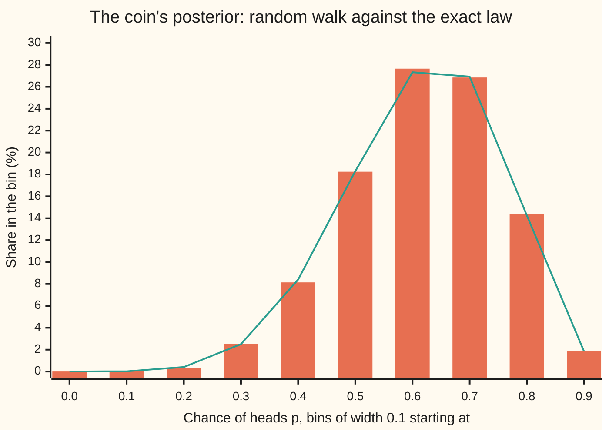
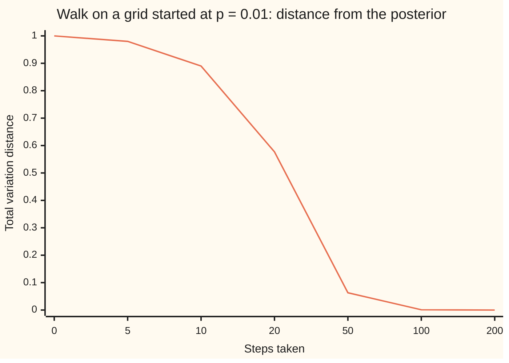

# MCMC in outline: sampling a posterior you cannot write down

[Syllabus](../../../SYLLABUS.md) → [Probability and statistics](../README.md) → [Bayesian Inference](../README.md#s10) → MCMC in outline

---

## General Overview

A new coin is flipped 10 times and shows 7 heads. Its chance of heads, call it p, is unknown. Start from a flat prior, every value of p from 0 to 1 equally plausible, and update on the 7 heads and 3 tails. The posterior is the Beta(8, 4) law of [Beta-binomial](02-beta-binomial.md): its average is 0.666667, and the chance the coin favours heads, P(p > 0.5), is 0.886719, about 9 in 10.

That answer came from a table of named laws. Change the prior to a triangle peaked at a fair coin, height min(p, 1 − p), and the table has no entry. The posterior's shape is still easy to state: prior times likelihood, one multiplication per value of p. What goes missing is the constant that makes the total area 1. Every question about the posterior (its average, its tails, its credible interval) needs that constant, and with several unknowns it is an integral nobody can do.

**Markov chain Monte Carlo**, MCMC for short, gets round the constant. Picture a walker on the line from 0 to 1. At each step it proposes a small random move. A move uphill, to a more plausible value of p, is always taken. A move downhill is taken only sometimes, with a chance equal to the new height divided by the old. Rejected moves leave the walker where it is, and it writes that value down again. The list of positions is the sample. Here 100,000 positions average 0.6677, with a standard error of 0.0011: the exact 0.666667 sits one standard error away.

**A random walk that always accepts uphill moves and accepts downhill moves with chance equal to the ratio of posterior heights spends its time in proportion to the posterior, so averages along the walk estimate posterior averages, with no normalising constant ever computed.**

**What kind of fact this is:** a method. That the walk leaves the posterior unchanged is proved on this card in Why it works; that the walk forgets its start and that its averages converge are theorems stated here, checked by computation, and proved for finite chains, such as the grid walk below, in [Convergence to equilibrium](../../11-Stochastic%20processes%20and%20calculus/03-Markov%20Chains/05-convergence-to-equilibrium.md) and [Stationary distributions](../../11-Stochastic%20processes%20and%20calculus/03-Markov%20Chains/04-stationary-distributions.md).

### The picture: where the walker spent its time



Bars: the share of the walk's 100,000 kept positions in each bin. Line: the exact Beta(8, 4) chance of each bin, counted without simulation. The walk never saw the Beta formula; it only compared heights.

---

## The formula

Notation first, in words. $p_t$ is where the walker stands after step t. $f(p)$ is prior times likelihood, the posterior's height up to an unknown constant. $g(p)$ is the true posterior density, $f(p)$ divided by the area under it. A proposed move is written $p'$, read "p-prime". $h$ is the largest step allowed. $u$ and $v$ are independent random numbers, each equally likely to fall anywhere between 0 and 1. $\alpha$ (alpha) is the chance of accepting the proposal.

$$p' = p_t + h\,(2u - 1), \qquad \alpha = \min\!\left(1,\ \frac{f(p')}{f(p_t)}\right)$$

**Read it aloud:** propose a point at random up to h either side of the current one; then move there with chance equal to the height ratio, capped at 1.

Draw a second uniform number $v$. If $v < \alpha$ the walker moves, $p_{t+1} = p'$; otherwise it stays, $p_{t+1} = p_t$, and that repeated value is recorded like any other. For the coin with a flat prior,

$$f(p) = p^{7}(1-p)^{3}, \qquad g(p) = \frac{f(p)}{Z}, \qquad Z = \int_0^1 f(p)\,dp = \frac{1}{1320}$$

and outside 0 to 1 the height is zero, so a proposal there is always refused. The estimate of a posterior average is the plain average of the $N$ positions kept; $N_{\text{eff}}$, the effective sample size, is defined below the table.

$$\bar p = \frac{1}{N}\sum_{t=1}^{N} p_t, \qquad \text{standard error} \approx \frac{\text{spread of the } p_t}{\sqrt{N_{\text{eff}}}}$$

| Symbol | Plain meaning | In our example | Push it up and the answer… |
| --- | --- | --- | --- |
| $p$ | the coin's chance of heads, the unknown | 0 to 1 | — |
| $p_t$ | the walker's position after step t | starts at 0.5 | — |
| $p'$ | a proposed next position | 0.6638 at step 1 | — |
| $f(p)$ | prior times likelihood: the posterior's height, constant unknown | $p^7(1-p)^3$ | — |
| $g(p)$ | the posterior density, total area 1 | Beta(8, 4) | — |
| $Z$ | the area under $f$, the constant MCMC never needs | 1/1320 = 0.000757576 | cancels in every ratio |
| $h$ | the largest step the walker may propose | 0.25 | fewer moves accepted, bolder moves |
| $u$, $v$ | independent uniform numbers between 0 and 1 | step 1's $u$ is 0.8277, its $v$ 0.1756 | — |
| $\alpha$ | the chance of accepting the proposal | 1 uphill; 0.3518 at step 4 | the walk moves more often |
| $N$ | positions kept after the burn-in | 100,000 | smaller standard error |
| $N_{\text{eff}}$ | effective sample size: independent draws the walk is worth | 15,276 | smaller standard error |
| $\bar p$ | the walk's average, the estimate of the posterior mean | 0.6677 | — |

The **burn-in** is the stretch of steps discarded at the start, here 1,000, while the walk leaves wherever it was put. **Effective sample size** answers a fair question: the 100,000 positions are not 100,000 independent draws, since each one sits next to the last, so how many independent draws carry the same information? Here 15,276, found by the batch-means method in Step 5.

### When it holds

- **The proposal is symmetric.** A step from a to b is exactly as likely as a step from b to a. Propose on a stretched scale, such as the log-odds, without correcting for the stretch and the walk settles on the wrong law: Beta(7, 3), mean 0.7000, instead of Beta(8, 4).
- **The walk can reach every value with positive posterior height.** Here any value in (0, 1) is a few steps from any other. A posterior with two peaks separated by a gap wider than h can trap the walk on one peak, and nothing in its output says so.
- **Every step is recorded, moves and stays alike.** Keep only the moves and the answer drifts: mean 0.6628 and spread 0.1274, where the truth is 0.666667 and 0.130744.
- **The run is long compared with how slowly the walk moves.** With steps of at most 0.002, 2,000 steps average 0.5188: the walk has barely left its start at 0.5, and its reported effective sample size of 27 is itself an overestimate.

---

## Why it works

### Step 0: a walk whose long-run habits match the posterior

A **Markov chain** is a sequence of random positions in which the next position depends only on the current one, not on the path that led there. MCMC builds a Markov chain whose long-run share of time in any region equals the posterior probability of that region. Then running the chain and counting is sampling. The design problem is a rule for moving that has the posterior as its resting state, and the Metropolis rule above is the simplest such rule.

### Step 1: only ratios are needed, so the constant cancels

The acceptance chance uses $f(p')/f(p_t)$. Since $g = f/Z$, the ratio of true posterior heights is $g(p')/g(p_t) = f(p')/f(p_t)$: $Z$ appears on top and bottom and cancels. That is the whole reason MCMC exists. For the coin, step 1 proposes 0.6638 from 0.5; the height ratio is 2.2099, uphill, so the move is taken. The walker never learns that $Z$ is 1/1320.

### Step 2: flows balance between every pair of places

Imagine a huge crowd of walkers, spread exactly like the posterior, all taking one step at once. Pick two places, a and b, with b higher. The flow from a to b is the crowd at a, times the chance of proposing b, times 1 (uphill is always accepted). The flow from b to a is the crowd at b, times the same proposal chance (the proposal is symmetric), times $f(a)/f(b)$. The crowd at b is the crowd at a times $f(b)/f(a)$, so the two flows are equal. This is **detailed balance**: in one step as many walkers go from a to b as from b to a. On a grid of 99 values of p the check builds each move chance from the same step function the grid walk runs, computes every such pair of flows and finds the largest imbalance to be 2.2e-19, rounding error.

### Step 3: balance means the posterior stays put

If every pair of places swaps equal numbers of walkers, no place gains or loses, and the crowd's spread after one step is the spread before it. The posterior is a **stationary** law of the walk: a resting state. On the grid, one step applied to the exact posterior changes no share by more than 1.0e-17.

<details>
<summary>Detailed proof: detailed balance on the grid, and why it gives a resting state</summary>

Take states $i = 1, \dots, 99$ with heights $w_i = f(i/100)$ and target shares $\pi_i = w_i / \sum_j w_j$. From state i the walk proposes each of the 20 states $i \pm 1, \dots, i \pm 10$ with chance 1/20. A proposal off the grid is refused. So for $k \ne i$ the move chance is $P_{ik} = \tfrac{1}{20}\min(1, w_k/w_i)$, and the stay chance is what is left, $P_{ii} = 1 - \sum_{k \ne i} P_{ik}$.

Balance: $\pi_i P_{ik} = \tfrac{1}{20}\min(\pi_i,\ \pi_i w_k / w_i) = \tfrac{1}{20}\min(\pi_i, \pi_k)$, since $\pi_i w_k / w_i = \pi_k$. The right side does not change when i and k swap, so $\pi_i P_{ik} = \pi_k P_{ki}$.

Resting state: the share at state k after one step is $\sum_i \pi_i P_{ik} = \pi_k P_{kk} + \sum_{i \ne k} \pi_k P_{ki} = \pi_k \bigl(P_{kk} + \sum_{i \ne k} P_{ki}\bigr) = \pi_k$, because the chances of leaving state k and of staying there add to 1.

The continuous walk on (0, 1) is the same argument with sums replaced by integrals. The chance of staying is no longer a single number but an integral over refused proposals; it cancels in the same way.

</details>

### Step 4: the walk forgets where it started

A resting state is not yet enough: the walk must also arrive there from wherever it begins. Put all the walkers on the grid at p = 0.01, deep in the posterior's left tail, and push the whole crowd forward exactly, one step at a time, with no random numbers. The **total variation distance**, half the summed gaps between the crowd's shares and the posterior's, measures how much probability is still in the wrong place.



The one line is the distance after each number of steps; the steps are not evenly spaced. After 10 steps, 0.890 of the probability is still in the wrong place. By 100 steps the gap is 0.001, and by 200 it is below the printed precision. The theorem behind the picture: a chain that can reach every state from every other, and does not cycle with a fixed period, approaches its resting state from any start. It is proved for finite chains, the grid walk among them, in [Convergence to equilibrium](../../11-Stochastic%20processes%20and%20calculus/03-Markov%20Chains/05-convergence-to-equilibrium.md). The burn-in exists because of this picture: the first positions still remember the start.

### Step 5: averages settle, at a price

A companion theorem, proved in [Stationary distributions](../../11-Stochastic%20processes%20and%20calculus/03-Markov%20Chains/04-stationary-distributions.md), gives a law of large numbers for chains: the average along one long walk converges to the posterior average, as the average of independent draws does in [Law of large numbers](../06-Limit%20Theorems%20in%20Practice/01-law-of-large-numbers.md). The price is correlation. Each position is at most 0.25 from the last, and about a third of the time it is the last. Neighbouring positions carry overlapping information, so the standard error is larger than the formula for independent draws says.

The **batch-means** method measures it without theory. Cut the 100,000 positions into 100 consecutive batches of 1,000 and average each batch. Batches this long are nearly independent of each other, so the spread of the 100 batch averages, divided by the square root of 100, is an honest standard error: 0.0011. The formula for independent draws, spread divided by the square root of N, gives 0.0004, about two and a half times too small. The effective sample size is the N that would make the independent-draws formula honest: the walk's variance over the squared batch standard error, 15,276.

Road 4 in the code supplies the comparison. Beta(8, 4) happens to have an exact sampler: the 8th smallest of 11 uniform numbers. Twenty thousand such independent draws average 0.6642, standard error 0.0009, which is already sharper than the 100,000-step walk.

Another way round the constant, importance sampling (drawing from an easy law and reweighting the draws), fails when the easy law misses where the posterior lives; MCMC trades that risk for correlation. More than one unknown at once, with a two-unknown Gibbs sampler worked through, is on [MCMC](../../11-Stochastic%20processes%20and%20calculus/03-Markov%20Chains/07-markov-chain-monte-carlo.md); the computational side is MCMC as a tool.

---

## Worked numbers, by hand

The walk starts at 0.5 with $h = 0.25$. Each row uses two uniform numbers from the generator: one sets the proposal, one decides.

| Step | Arithmetic | Value |
| --- | --- | --- |
| 1: propose from 0.5000 | 0.5 + 0.25 × (2u − 1), with u = 0.8277 | 0.6638 |
| 1: height ratio | $f(0.6638)/f(0.5)$ | 2.2099, uphill: **move** |
| 2: propose from 0.6638 | 0.6638 + 0.25 × (2u − 1), with u = 0.3365 | 0.5821 |
| 2: ratio, draw | 0.7658 against a draw of 0.2897 | 0.2897 < 0.7658: **move** |
| 3: 0.5821 to 0.5952 | ratio 1.0619 | uphill: **move** |
| 4: 0.5952 to 0.4493 | ratio 0.3518 against a draw of 0.0453 | downhill, yet **move** |
| 5: 0.4493 to 0.2102 | ratio 0.0145 against a draw of 0.7250 | 0.7250 > 0.0145: **stay**, record 0.4493 again |
| 100,000 kept positions | average after 1,000 burn-in steps | 0.6677 (SE 0.0011) |
| the exact mean | 8 / 12, the Beta(8, 4) mean | **0.666667** |
| P(p > 0.5), walk | share of positions above 0.5 | 0.8900 (SE 0.0023) |
| P(p > 0.5), exact | 1 − 232/2048, counting 11 fair flips with 8 or more heads | **0.886719** |
| 95% credible interval | walk's 2.5% and 97.5% points; exact by bisection | 0.3915 to 0.8920; exact **0.3903 to 0.8907** |

Step 4 is the one that makes this sampling rather than climbing: a downhill move, taken because the draw 0.0453 fell under 0.3518. The exact tail comes from a counting identity: the chance that a Beta(8, 4) value is below x equals the chance that at least 8 of 11 uniform numbers fall below x, so at x = 0.5 the chance is the share of 11 fair flips with 8 or more heads, 232 of 2048. Read back in the world: after 7 heads in 10, the coin favours heads with posterior chance about 0.89, and its chance of heads is between 0.39 and 0.89 with posterior probability 0.95, as [Credible intervals and decisions](05-credible-intervals-and-decisions.md) reads such an interval.

The triangle prior peaked at a fair coin, height min(p, 1 − p), has no named partner law. The same walk with $f(p) = \min(p, 1-p)\,p^7(1-p)^3$ averages 0.6272 (SE 0.0008); Simpson's rule on the unnormalised height, an independent road, gives 0.6272. The sceptical prior pulls the estimate toward 0.5.

### What breaks if you drop a piece

| Mistake | Comes out at | What went wrong |
| --- | --- | --- |
| Record only the moves, drop the repeats | mean 0.6628 (SE 0.0009), sd 0.1274 | Stays are how the walk weights places that are hard to leave, here the tails; dropping them over-weights places where moves are easy to accept, on the slope below the peak |
| Walk on log-odds with no stretch correction | mean 0.6988 (SE 0.0012), the Beta(7, 3) mean 0.7000 | The proposal is symmetric on the wrong scale; the missing factor p(1 − p) removes one head and one tail |
| Steps of at most 0.002, 2,000 steps | acceptance 0.9970, mean 0.5188 (SE 0.0014), ESS 27 | Nearly every move is accepted and nearly none goes anywhere; the walk never left 0.5 |
| Standard error as if draws were independent | 0.0004 instead of 0.0011 | Neighbouring positions are correlated; only 15,276 of the 100,000 count |

The small-step row carries its own warning: its batch standard error, 0.0014, is also far too small, because 20 batches of 100 steps are nowhere near independent. A walk that has not explored cannot report that it has not explored.

<details>
<summary>Why log-odds loses a head and a tail</summary>

Log-odds is $\ln\frac{p}{1-p}$, a scale that runs over the whole number line. A symmetric walk there with acceptance ratio $f(p')/f(p)$ rests on a law whose density in log-odds is proportional to $f$. Changing variables back to p multiplies by the stretch factor, called the Jacobian (the word in the code's output), $\frac{d}{dp}\ln\frac{p}{1-p} = \frac{1}{p(1-p)}$, so the resting law in p is $p^7(1-p)^3 / (p(1-p)) = p^6(1-p)^2$: Beta(7, 3). Multiplying $f$ by $p(1-p)$ before taking the ratio restores Beta(8, 4). Metropolis–Hastings, the general form, puts this correction into the acceptance ratio for any asymmetric proposal.

</details>

---

## Code, from first principles, and it actually runs

Both programs draw every random number from SplitMix64, written out, with seed 20260929, so they make the same walk and print the same digits. Five roads reach the coin's posterior. Road 1 counts: the Beta(8, 4) mean, spread, tail and interval from factorials and binomial sums. Road 2 integrates $p^7(1-p)^3$ by Simpson's rule, which recovers $Z$ = 1/1320 without factorials. Road 3 is the Metropolis walk. Road 4 draws independently, as the 8th smallest of 11 uniforms. Road 5 runs the walk on a grid of 99 points and pushes its entire distribution forward exactly. Seven asserts compare roads, and simulated numbers are allowed four standard errors.

### Python

```python
# MCMC in outline -- the check behind the card.  Standard library only.  A new coin shows
# 7 heads in 10 flips; with a flat prior its posterior is Beta(8, 4).  Road 1: exact, by
# counting.  Road 2: Simpson's rule on p^7 (1 - p)^3.  Road 3: a Metropolis random walk.
# Road 4: independent draws (the 8th smallest of 11 uniforms).  Road 5: the same walk on a
# grid of 99 points, its whole distribution pushed forward exactly, step by step.
from math import comb, sqrt, exp

MASK, state = (1 << 64) - 1, 20260929

def splitmix():                      # SplitMix64, written out: the same stream in Rust
    global state
    state = (state + 0x9E3779B97F4A7C15) & MASK
    z = state
    z = ((z ^ (z >> 30)) * 0xBF58476D1CE4E5B9) & MASK
    z = ((z ^ (z >> 27)) * 0x94D049BB133111EB) & MASK
    return z ^ (z >> 31)

def unif(): return ((splitmix() >> 11) + 0.5) / 2.0 ** 53

def pw(x, k):                        # x multiplied in k times, the same way in both languages
    r = 1.0
    for _ in range(k): r *= x
    return r

def total(xs):                       # plain running sum, as Rust does it
    t = 0.0
    for x in xs: t += x
    return t

def f(p): return pw(p, 7) * pw(1 - p, 3) if 0 < p < 1 else 0.0   # flat prior x likelihood
def f_tri(p): return f(p) * min(p, 1 - p)                        # prior peaked at a fair coin

def cdf(x):                          # Beta(8,4) by counting: at least 8 of 11 uniforms below x
    return total([comb(11, k) * pw(x, k) * pw(1 - x, 11 - k) for k in range(8, 12)])

def quantile(c):                     # bisection on the counted CDF
    lo, hi = 0.0, 1.0
    for _ in range(60):
        mid = (lo + hi) / 2
        lo, hi = (mid, hi) if cdf(mid) < c else (lo, mid)
    return (lo + hi) / 2

def simpson(g, n=2000):              # the area under g on [0, 1]
    h = 1.0 / n
    return h / 3 * total([(1 if i in (0, n) else 4 if i % 2 else 2) * g(i * h) for i in range(n + 1)])

def walk(target, h, n, burn, show=0):
    p, fp, acc, out = 0.5, target(0.5), 0, []
    for t in range(burn + n):
        u = unif(); prop = p + h * (2 * u - 1)   # propose: a step of up to h either way
        fq, v = target(prop), unif()
        ok = v < fq / fp                          # accept with chance min(1, f(p') / f(p))
        if t < show:
            print(f"  step {t + 1}: at {p:.4f}, u {u:.4f}, propose {prop:.4f}, ratio {fq / fp:.4f}, "
                  f"draw {v:.4f}, {'move' if ok else 'stay'}")
        if ok: p, fp, acc = prop, fq, acc + 1
        if t >= burn: out.append(p)
    return out, acc / (burn + n)

def summary(xs, batches=100):        # mean, spread, batch-means standard error, effective size
    n, m = len(xs), total(xs) / len(xs)
    var = total([(x - m) * (x - m) for x in xs]) / (n - 1)
    k = n // batches
    bm = [total(xs[b * k:(b + 1) * k]) / k for b in range(batches)]
    se = sqrt(total([(b - m) * (b - m) for b in bm]) / (batches - 1) / batches)
    return m, sqrt(var), se, var / (se * se)

Z_exact = 1 / (4 * comb(11, 4))              # 7! 3! / 11! = 1 / 1320
Z_simp = simpson(f)
mean_x, sd_x = 8 / 12, sqrt(8 * 4 / (12 * 12 * 13))
up_x = 1 - total([comb(11, k) for k in range(8, 12)]) / 2 ** 11
lo_x, hi_x = quantile(0.025), quantile(0.975)
print(f"road 1, exact, Beta(8, 4): mean {mean_x:.6f}, sd {sd_x:.6f}, P(p > 0.5) = 1 - 232/2048 = {up_x:.6f}")
print(f"  95% credible interval {lo_x:.4f} to {hi_x:.4f}; Z = 1/1320 = {Z_exact:.9f}")
print(f"road 2, Simpson: Z {Z_simp:.9f}, mean {simpson(lambda p: p * f(p)) / Z_simp:.6f}")
print("road 3, Metropolis, step h = 0.25, start 0.5; the first five steps:")
N, BURN = 100000, 1000
ch, acc = walk(f, 0.25, N, BURN, show=5)
m3, s3, se3, ess3 = summary(ch)
up = [1.0 if x > 0.5 else 0.0 for x in ch]
u3, _, seu, _ = summary(up)
print(f"  {N} kept after {BURN} burn-in, acceptance {acc:.4f}")
print(f"  mean {m3:.4f} (SE {se3:.4f}), sd {s3:.4f}, P(p > 0.5) {u3:.4f} (SE {seu:.4f})")
print(f"  95% interval {sorted(ch)[int(0.025 * N)]:.4f} to {sorted(ch)[int(0.975 * N)]:.4f}")
print(f"  batch means over 100 batches: effective sample size {ess3:.0f}; naive SE sd/root N {s3 / sqrt(N):.4f}")
iid = [sorted(unif() for _ in range(11))[7] for _ in range(20000)]
m4, s4, _, _ = summary(iid)
print(f"road 4, 20000 independent draws, 8th smallest of 11 uniforms: mean {m4:.4f} (SE {s4 / sqrt(20000):.4f}), sd {s4:.4f}")
print("chart, bin from:  " + " ".join(f"{b / 10:.1f}" for b in range(10)))
print("chart, exact %:   " + " ".join(f"{100 * (cdf((b + 1) / 10) - cdf(b / 10)):.2f}" for b in range(10)))
print("chart, chain %:   " + " ".join(f"{100 * total([1.0 for x in ch if b / 10 <= x < (b + 1) / 10]) / N:.2f}"
                                       for b in range(10)))

G = [i / 100 for i in range(1, 100)]         # road 5: the walk on a grid, steps of 1 to 10 cells
wg = [f(p) for p in G]
tgt = [w / total(wg) for w in wg]
def grid_step(d):
    new = [0.0] * 99
    for i in range(99):
        for k in [i + j for j in range(-10, 11) if j != 0]:
            a = min(1.0, wg[k] / wg[i]) if 0 <= k < 99 else 0.0
            if a > 0: new[k] += d[i] * a / 20
            new[i] += d[i] * (1 - a) / 20
    return new
d, tv = [1.0 if i == 0 else 0.0 for i in range(99)], []   # start at p = 0.01, deep in the tail
for s in range(201):
    if s in (0, 5, 10, 20, 50, 100, 200):
        tv.append((s, total([abs(a - b) for a, b in zip(d, tgt)]) / 2))
    d = grid_step(d)
P = [grid_step([1.0 if j == i else 0.0 for j in range(99)]) for i in range(99)]   # row i: one step from state i
flow = max(abs(tgt[i] * P[i][k] - tgt[k] * P[k][i]) for i in range(99) for k in range(99))
still = max(abs(a - b) for a, b in zip(grid_step(tgt), tgt))
print(f"road 5, grid of 99 points, steps of 1 to 10 cells, start 0.01: largest flow imbalance {flow:.1e}; one step moves the posterior by {still:.1e}")
print("chart, grid steps:    " + " ".join(f"{s}" for s, _ in tv))
print("chart, distance left: " + " ".join(f"{v:.3f}" for _, v in tv))

mt_x = simpson(lambda p: p * f_tri(p)) / simpson(f_tri)
mt, st, set_, _ = summary(walk(f_tri, 0.25, N, BURN)[0])
print(f"second case, prior min(p, 1 - p): Simpson mean {mt_x:.4f}; chain mean {mt:.4f} (SE {set_:.4f})")

print("what breaks")
kept = [x for i, x in enumerate(ch) if i == 0 or x != ch[i - 1]]
mk, sk, sek, _ = summary(kept)
print(f"  repeats dropped: {len(kept)} moves, mean {mk:.4f} (SE {sek:.4f}), sd {sk:.4f}")
def f_logit(t): return f(1 / (1 + exp(-t)))  # walk on log-odds, no Jacobian correction
chl, _ = walk(f_logit, 1.0, N, BURN)
ml, _, sel, _ = summary([1 / (1 + exp(-t)) for t in chl])
print(f"  log-odds walk, no Jacobian: mean {ml:.4f} (SE {sel:.4f}); Beta(7, 3) mean {7 / 10:.4f}")
chs, accs = walk(f, 0.002, 2000, 0)
ms, _, ses, esss = summary(chs, 20)
print(f"  step 0.002, 2000 steps: acceptance {accs:.4f}, mean {ms:.4f} (SE {ses:.4f}), ESS {esss:.0f}")

assert abs(Z_simp - Z_exact) < 1e-12 and abs(simpson(lambda p: p * f(p)) / Z_simp - mean_x) < 1e-9, "Simpson vs factorials"
assert abs(m3 - mean_x) < 4 * se3 and abs(u3 - up_x) < 4 * seu, "chain vs exact, within 4 SE"
assert abs(m4 - mean_x) < 4 * s4 / sqrt(20000), "independent draws vs exact"
assert s3 / sqrt(N) < se3, "correlated draws: naive SE must understate the batch-means SE"
assert flow < 1e-15 and still < 1e-15 and tv[-1][1] < 0.01 < tv[2][1], "grid: balance, stillness, forgetting"
assert abs(mt - mt_x) < 4 * set_, "second prior: chain vs Simpson"
assert abs(ml - 0.7) < 4 * sel and abs(ml - mean_x) > 4 * sel, "missing Jacobian lands on Beta(7, 3)"
print("ALL CHECKS PASS")
```

**Ran 2026-10-06 on macOS, Python 3.14.6, standard library only. All checks passed. Output, pasted from the run:**

```
road 1, exact, Beta(8, 4): mean 0.666667, sd 0.130744, P(p > 0.5) = 1 - 232/2048 = 0.886719
  95% credible interval 0.3903 to 0.8907; Z = 1/1320 = 0.000757576
road 2, Simpson: Z 0.000757576, mean 0.666667
road 3, Metropolis, step h = 0.25, start 0.5; the first five steps:
  step 1: at 0.5000, u 0.8277, propose 0.6638, ratio 2.2099, draw 0.1756, move
  step 2: at 0.6638, u 0.3365, propose 0.5821, ratio 0.7658, draw 0.2897, move
  step 3: at 0.5821, u 0.5261, propose 0.5952, ratio 1.0619, draw 0.1050, move
  step 4: at 0.5952, u 0.2083, propose 0.4493, ratio 0.3518, draw 0.0453, move
  step 5: at 0.4493, u 0.0219, propose 0.2102, ratio 0.0145, draw 0.7250, stay
  100000 kept after 1000 burn-in, acceptance 0.6513
  mean 0.6677 (SE 0.0011), sd 0.1302, P(p > 0.5) 0.8900 (SE 0.0023)
  95% interval 0.3915 to 0.8920
  batch means over 100 batches: effective sample size 15276; naive SE sd/root N 0.0004
road 4, 20000 independent draws, 8th smallest of 11 uniforms: mean 0.6642 (SE 0.0009), sd 0.1310
chart, bin from:  0.0 0.1 0.2 0.3 0.4 0.5 0.6 0.7 0.8 0.9
chart, exact %:   0.00 0.02 0.41 2.50 8.40 18.30 27.33 26.93 14.26 1.85
chart, chain %:   0.00 0.01 0.33 2.52 8.14 18.25 27.66 26.85 14.35 1.89
road 5, grid of 99 points, steps of 1 to 10 cells, start 0.01: largest flow imbalance 2.2e-19; one step moves the posterior by 1.0e-17
chart, grid steps:    0 5 10 20 50 100 200
chart, distance left: 1.000 0.980 0.890 0.577 0.063 0.001 0.000
second case, prior min(p, 1 - p): Simpson mean 0.6272; chain mean 0.6272 (SE 0.0008)
what breaks
  repeats dropped: 65117 moves, mean 0.6628 (SE 0.0009), sd 0.1274
  log-odds walk, no Jacobian: mean 0.6988 (SE 0.0012); Beta(7, 3) mean 0.7000
  step 0.002, 2000 steps: acceptance 0.9970, mean 0.5188 (SE 0.0014), ESS 27
ALL CHECKS PASS
```

### Rust

Same walk, same labels, built with `rustc --edition 2021 -O`.

```rust
// MCMC in outline -- the same check as the Python, in Rust.  No crates.  A new coin shows
// 7 heads in 10 flips; with a flat prior its posterior is Beta(8, 4).  Road 1: exact, by
// counting.  Road 2: Simpson's rule on p^7 (1 - p)^3.  Road 3: a Metropolis random walk.
// Road 4: independent draws (the 8th smallest of 11 uniforms).  Road 5: the same walk on a
// grid of 99 points, its whole distribution pushed forward exactly, step by step.

struct Rng(u64);
impl Rng {
    fn next(&mut self) -> u64 { // SplitMix64, written out: the same stream as the Python
        self.0 = self.0.wrapping_add(0x9E3779B97F4A7C15);
        let mut z = self.0;
        z = (z ^ (z >> 30)).wrapping_mul(0xBF58476D1CE4E5B9);
        z = (z ^ (z >> 27)).wrapping_mul(0x94D049BB133111EB);
        z ^ (z >> 31)
    }
    fn unif(&mut self) -> f64 { ((self.next() >> 11) as f64 + 0.5) / 2f64.powi(53) }
}

fn pw(x: f64, k: usize) -> f64 { let mut r = 1.0; for _ in 0..k { r *= x; } r }
fn total(xs: &[f64]) -> f64 { let mut t = 0.0; for x in xs { t += x; } t }
fn comb(n: u64, k: u64) -> f64 { let mut c = 1u64; for i in 0..k { c = c * (n - i) / (i + 1); } c as f64 }

fn f(p: f64) -> f64 { if 0.0 < p && p < 1.0 { pw(p, 7) * pw(1.0 - p, 3) } else { 0.0 } } // flat prior x likelihood
fn f_tri(p: f64) -> f64 { f(p) * p.min(1.0 - p) }                                        // prior peaked at a fair coin
fn f_logit(t: f64) -> f64 { f(1.0 / (1.0 + (-t).exp())) } // walk on log-odds, no Jacobian correction

fn cdf(x: f64) -> f64 { // Beta(8,4) by counting: at least 8 of 11 uniforms below x
    let terms: Vec<f64> = (8..12).map(|k| comb(11, k as u64) * pw(x, k) * pw(1.0 - x, 11 - k)).collect();
    total(&terms)
}

fn quantile(c: f64) -> f64 { // bisection on the counted CDF
    let (mut lo, mut hi) = (0.0, 1.0);
    for _ in 0..60 {
        let mid = (lo + hi) / 2.0;
        if cdf(mid) < c { lo = mid } else { hi = mid }
    }
    (lo + hi) / 2.0
}

fn simpson(g: &dyn Fn(f64) -> f64) -> f64 { // the area under g on [0, 1]
    let n = 2000;
    let h = 1.0 / n as f64;
    let terms: Vec<f64> = (0..=n)
        .map(|i| (if i == 0 || i == n { 1.0 } else if i % 2 == 1 { 4.0 } else { 2.0 }) * g(i as f64 * h)).collect();
    h / 3.0 * total(&terms)
}

fn walk(rng: &mut Rng, target: &dyn Fn(f64) -> f64, h: f64, n: usize, burn: usize, show: usize) -> (Vec<f64>, f64) {
    let (mut p, mut fp, mut acc, mut out) = (0.5, target(0.5), 0usize, Vec::new());
    for t in 0..burn + n {
        let u = rng.unif(); let prop = p + h * (2.0 * u - 1.0); // propose: a step of up to h either way
        let (fq, v) = (target(prop), rng.unif());
        let ok = v < fq / fp; // accept with chance min(1, f(p') / f(p))
        if t < show {
            println!("  step {}: at {:.4}, u {:.4}, propose {:.4}, ratio {:.4}, draw {:.4}, {}",
                     t + 1, p, u, prop, fq / fp, v, if ok { "move" } else { "stay" });
        }
        if ok { p = prop; fp = fq; acc += 1; }
        if t >= burn { out.push(p); }
    }
    (out, acc as f64 / (burn + n) as f64)
}

fn summary(xs: &[f64], batches: usize) -> (f64, f64, f64, f64) { // mean, spread, batch-means SE, effective size
    let (n, m) = (xs.len(), total(xs) / xs.len() as f64);
    let var = total(&xs.iter().map(|x| (x - m) * (x - m)).collect::<Vec<_>>()) / (n - 1) as f64;
    let k = n / batches;
    let bm: Vec<f64> = (0..batches).map(|b| total(&xs[b * k..(b + 1) * k]) / k as f64).collect();
    let se = (total(&bm.iter().map(|b| (b - m) * (b - m)).collect::<Vec<_>>()) / (batches - 1) as f64 / batches as f64).sqrt();
    (m, var.sqrt(), se, var / (se * se))
}

fn grid_step(d: &[f64], wg: &[f64]) -> Vec<f64> {
    let mut new = vec![0.0; 99];
    for i in 0..99i64 {
        for j in -10..=10i64 {
            if j == 0 { continue; }
            let k = i + j;
            let a = if (0..99).contains(&k) { (1.0f64).min(wg[k as usize] / wg[i as usize]) } else { 0.0 };
            if a > 0.0 { new[k as usize] += d[i as usize] * a / 20.0; }
            new[i as usize] += d[i as usize] * (1.0 - a) / 20.0;
        }
    }
    new
}

fn main() {
    let mut rng = Rng(20260929);
    let z_exact = 1.0 / (4.0 * comb(11, 4)); // 7! 3! / 11! = 1 / 1320
    let z_simp = simpson(&f);
    let (mean_x, sd_x) = (8.0 / 12.0, (32.0f64 / 1872.0).sqrt());
    let up_x = 1.0 - total(&(8..12).map(|k| comb(11, k)).collect::<Vec<_>>()) / 2048.0;
    let (lo_x, hi_x) = (quantile(0.025), quantile(0.975));
    println!("road 1, exact, Beta(8, 4): mean {:.6}, sd {:.6}, P(p > 0.5) = 1 - 232/2048 = {:.6}", mean_x, sd_x, up_x);
    println!("  95% credible interval {:.4} to {:.4}; Z = 1/1320 = {:.9}", lo_x, hi_x, z_exact);
    println!("road 2, Simpson: Z {:.9}, mean {:.6}", z_simp, simpson(&|p| p * f(p)) / z_simp);
    println!("road 3, Metropolis, step h = 0.25, start 0.5; the first five steps:");
    let (n, burn) = (100000usize, 1000usize);
    let (ch, acc) = walk(&mut rng, &f, 0.25, n, burn, 5);
    let (m3, s3, se3, ess3) = summary(&ch, 100);
    let up: Vec<f64> = ch.iter().map(|&x| if x > 0.5 { 1.0 } else { 0.0 }).collect();
    let (u3, _, seu, _) = summary(&up, 100);
    let mut srt = ch.clone();
    srt.sort_by(|a, b| a.partial_cmp(b).unwrap());
    println!("  {} kept after {} burn-in, acceptance {:.4}", n, burn, acc);
    println!("  mean {:.4} (SE {:.4}), sd {:.4}, P(p > 0.5) {:.4} (SE {:.4})", m3, se3, s3, u3, seu);
    println!("  95% interval {:.4} to {:.4}", srt[(0.025 * n as f64) as usize], srt[(0.975 * n as f64) as usize]);
    println!("  batch means over 100 batches: effective sample size {:.0}; naive SE sd/root N {:.4}", ess3, s3 / (n as f64).sqrt());
    let iid: Vec<f64> = (0..20000).map(|_| {
        let mut u: Vec<f64> = (0..11).map(|_| rng.unif()).collect();
        u.sort_by(|a, b| a.partial_cmp(b).unwrap());
        u[7]
    }).collect();
    let (m4, s4, _, _) = summary(&iid, 100);
    println!("road 4, 20000 independent draws, 8th smallest of 11 uniforms: mean {:.4} (SE {:.4}), sd {:.4}", m4, s4 / 20000f64.sqrt(), s4);
    let row = |g: &dyn Fn(f64) -> String| (0..10).map(|b| g(b as f64)).collect::<Vec<_>>().join(" ");
    println!("chart, bin from:  {}", row(&|b| format!("{:.1}", b / 10.0)));
    println!("chart, exact %:   {}", row(&|b| format!("{:.2}", 100.0 * (cdf((b + 1.0) / 10.0) - cdf(b / 10.0)))));
    println!("chart, chain %:   {}", row(&|b| {
        let c = total(&ch.iter().filter(|&&x| b / 10.0 <= x && x < (b + 1.0) / 10.0).map(|_| 1.0).collect::<Vec<_>>());
        format!("{:.2}", 100.0 * c / n as f64)
    }));

    let wg: Vec<f64> = (1..100).map(|i| f(i as f64 / 100.0)).collect(); // road 5: the walk on a grid
    let tgt: Vec<f64> = wg.iter().map(|w| w / total(&wg)).collect();
    let mut d: Vec<f64> = (0..99).map(|i| if i == 0 { 1.0 } else { 0.0 }).collect(); // start at p = 0.01
    let mut tv: Vec<(usize, f64)> = Vec::new();
    for s in 0..=200usize {
        if [0, 5, 10, 20, 50, 100, 200].contains(&s) {
            tv.push((s, total(&d.iter().zip(&tgt).map(|(a, b)| (a - b).abs()).collect::<Vec<_>>()) / 2.0));
        }
        d = grid_step(&d, &wg);
    }
    let pm: Vec<Vec<f64>> = (0..99).map(|i| grid_step(&(0..99).map(|j| if j == i { 1.0 } else { 0.0 }).collect::<Vec<f64>>(), &wg)).collect(); // row i: one step from state i
    let mut flow = 0.0f64;
    for i in 0..99usize { for k in 0..99usize { flow = flow.max((tgt[i] * pm[i][k] - tgt[k] * pm[k][i]).abs()); } }
    let still = grid_step(&tgt, &wg).iter().zip(&tgt).map(|(a, b)| (a - b).abs()).fold(0.0, f64::max);
    println!("road 5, grid of 99 points, steps of 1 to 10 cells, start 0.01: largest flow imbalance {:.1e}; one step moves the posterior by {:.1e}", flow, still);
    println!("chart, grid steps:    {}", tv.iter().map(|(s, _)| s.to_string()).collect::<Vec<_>>().join(" "));
    println!("chart, distance left: {}", tv.iter().map(|(_, v)| format!("{:.3}", v)).collect::<Vec<_>>().join(" "));

    let mt_x = simpson(&|p| p * f_tri(p)) / simpson(&f_tri);
    let (mt, _, set, _) = summary(&walk(&mut rng, &f_tri, 0.25, n, burn, 0).0, 100);
    println!("second case, prior min(p, 1 - p): Simpson mean {:.4}; chain mean {:.4} (SE {:.4})", mt_x, mt, set);

    println!("what breaks");
    let kept: Vec<f64> = (0..ch.len()).filter(|&i| i == 0 || ch[i] != ch[i - 1]).map(|i| ch[i]).collect();
    let (mk, sk, sek, _) = summary(&kept, 100);
    println!("  repeats dropped: {} moves, mean {:.4} (SE {:.4}), sd {:.4}", kept.len(), mk, sek, sk);
    let chl = walk(&mut rng, &f_logit, 1.0, n, burn, 0).0;
    let (ml, _, sel, _) = summary(&chl.iter().map(|t| 1.0 / (1.0 + (-t).exp())).collect::<Vec<_>>(), 100);
    println!("  log-odds walk, no Jacobian: mean {:.4} (SE {:.4}); Beta(7, 3) mean {:.4}", ml, sel, 7.0 / 10.0);
    let (chs, accs) = walk(&mut rng, &f, 0.002, 2000, 0, 0);
    let (ms, _, ses, esss) = summary(&chs, 20);
    println!("  step 0.002, 2000 steps: acceptance {:.4}, mean {:.4} (SE {:.4}), ESS {:.0}", accs, ms, ses, esss);

    assert!((z_simp - z_exact).abs() < 1e-12 && (simpson(&|p| p * f(p)) / z_simp - mean_x).abs() < 1e-9, "Simpson vs factorials");
    assert!((m3 - mean_x).abs() < 4.0 * se3 && (u3 - up_x).abs() < 4.0 * seu, "chain vs exact, within 4 SE");
    assert!((m4 - mean_x).abs() < 4.0 * s4 / 20000f64.sqrt(), "independent draws vs exact");
    assert!(s3 / (n as f64).sqrt() < se3, "correlated draws: naive SE must understate the batch-means SE");
    assert!(flow < 1e-15 && still < 1e-15 && tv[6].1 < 0.01 && 0.01 < tv[2].1, "grid: balance, stillness, forgetting");
    assert!((mt - mt_x).abs() < 4.0 * set, "second prior: chain vs Simpson");
    assert!((ml - 0.7).abs() < 4.0 * sel && (ml - mean_x).abs() > 4.0 * sel, "missing Jacobian lands on Beta(7, 3)");
    println!("ALL CHECKS PASS");
}
```

**Ran 2026-10-06 on macOS, rustc 1.98.1, no crates. All checks passed. Output, pasted from the run:**

```
road 1, exact, Beta(8, 4): mean 0.666667, sd 0.130744, P(p > 0.5) = 1 - 232/2048 = 0.886719
  95% credible interval 0.3903 to 0.8907; Z = 1/1320 = 0.000757576
road 2, Simpson: Z 0.000757576, mean 0.666667
road 3, Metropolis, step h = 0.25, start 0.5; the first five steps:
  step 1: at 0.5000, u 0.8277, propose 0.6638, ratio 2.2099, draw 0.1756, move
  step 2: at 0.6638, u 0.3365, propose 0.5821, ratio 0.7658, draw 0.2897, move
  step 3: at 0.5821, u 0.5261, propose 0.5952, ratio 1.0619, draw 0.1050, move
  step 4: at 0.5952, u 0.2083, propose 0.4493, ratio 0.3518, draw 0.0453, move
  step 5: at 0.4493, u 0.0219, propose 0.2102, ratio 0.0145, draw 0.7250, stay
  100000 kept after 1000 burn-in, acceptance 0.6513
  mean 0.6677 (SE 0.0011), sd 0.1302, P(p > 0.5) 0.8900 (SE 0.0023)
  95% interval 0.3915 to 0.8920
  batch means over 100 batches: effective sample size 15276; naive SE sd/root N 0.0004
road 4, 20000 independent draws, 8th smallest of 11 uniforms: mean 0.6642 (SE 0.0009), sd 0.1310
chart, bin from:  0.0 0.1 0.2 0.3 0.4 0.5 0.6 0.7 0.8 0.9
chart, exact %:   0.00 0.02 0.41 2.50 8.40 18.30 27.33 26.93 14.26 1.85
chart, chain %:   0.00 0.01 0.33 2.52 8.14 18.25 27.66 26.85 14.35 1.89
road 5, grid of 99 points, steps of 1 to 10 cells, start 0.01: largest flow imbalance 2.2e-19; one step moves the posterior by 1.0e-17
chart, grid steps:    0 5 10 20 50 100 200
chart, distance left: 1.000 0.980 0.890 0.577 0.063 0.001 0.000
second case, prior min(p, 1 - p): Simpson mean 0.6272; chain mean 0.6272 (SE 0.0008)
what breaks
  repeats dropped: 65117 moves, mean 0.6628 (SE 0.0009), sd 0.1274
  log-odds walk, no Jacobian: mean 0.6988 (SE 0.0012); Beta(7, 3) mean 0.7000
  step 0.002, 2000 steps: acceptance 0.9970, mean 0.5188 (SE 0.0014), ESS 27
ALL CHECKS PASS
```

The two outputs agree line for line: the same generator drives the same walk, and every sum runs in the same order in both languages.

> [!TIP]
> **Try changing**
> Guess first, then run it.
> - **Shrink the step.** Set the main walk's 0.25 to 0.05. Acceptance rises toward 1, the effective sample size falls, and the batch standard error grows; the mean still lands within a few standard errors of 0.666667, just less sharply.
> - **Widen the step.** Set it to 2.0. Most proposals land outside 0 to 1 and are refused, so the walk mostly stays. Acceptance collapses and so does the effective sample size. Between the extremes, a common guide for one unknown is to accept about 0.44 of proposals (Gelman and colleagues, chapter 12); with many unknowns the best rate falls to about 0.234 (Roberts, Gelman and Gilks). This walk accepts 0.6513.
> - **Accept everything.** Replace `v < fq / fp` with `True` in Python or `true` in Rust. The walk becomes a plain random walk that leaves 0 to 1 entirely, and the second assert stops the run.
> - **Fix the log-odds walk.** Multiply `f_logit`'s value by p(1 − p). It now rests on Beta(8, 4), and the last assert, which checks that the mistake lands on Beta(7, 3), stops the run.

---

## The usual mistake

> [!warning]
> **Reading 100,000 steps as 100,000 draws.** The positions are correlated: each is a short step from the last, and a third of them repeat it. Quoting spread over the square root of N gives a standard error of 0.0004 for the coin; the honest figure is 0.0011, and the walk is worth 15,276 independent draws. Always quote the batch-means or effective-sample-size standard error.
>
> - **Dropping the repeats.** A refused proposal is a data point, not a failure. Keeping only moves gives mean 0.6628 and spread 0.1274 against the true 0.666667 and 0.130744, and running longer does not fix it.
> - **Trusting a walk that has not explored.** Steps of 0.002 give acceptance 0.9970 and a confident-looking mean of 0.5188, with a standard error of 0.0014 that is itself wrong. High acceptance is not a sign of health: it means the steps are too small to go anywhere.
> - **Changing scale without correcting.** Walking on log-odds with the plain ratio samples Beta(7, 3), mean 0.7000, not Beta(8, 4).
> - **Keeping the burn-in.** The grid walk started at 0.01 still has 0.577 of its probability in the wrong place after 20 steps. Discard the first stretch, or start several walks at spread-out points and check they agree.

---

## Where you meet it in real life

- **Statistical software.** Stan, PyMC and their relatives take a model written as code, prior times likelihood, and run a descendant of this walk on it; the reported means and intervals are walk averages like 0.6677 here.
- **The 1953 original.** Metropolis and colleagues at Los Alamos used the walk to average over positions of hard spheres in a fluid, where the constant (the partition function) was out of reach. Physicists still call it the Metropolis algorithm.
- **Evolutionary trees.** Programs that infer how species are related walk over possible trees, a space far too large to list, and report how often each branch appears.
- **Clinical trials and hierarchical models.** A trial pooling many hospitals has one unknown per hospital plus shared ones; conjugate pairs such as [Normal-normal](03-normal-normal.md) and [Gamma-Poisson](04-gamma-poisson.md) handle one unknown at a time, and MCMC takes over when the unknowns are tied together.

> **Say it back**
> A posterior's shape is prior times likelihood, but the constant that makes its area 1 is often out of reach. The Metropolis walk proposes a random step, always accepts it uphill, accepts it downhill with chance equal to the height ratio, and records its position either way. The constant cancels in the ratio, and balanced flows make the posterior the walk's resting state. For the coin with 7 heads in 10, 100,000 steps average 0.6677 against the exact 0.666667. The steps are correlated, so the honest standard error comes from batch means, not from the square root of N.

---

## What this builds on

- [Credible intervals and decisions](05-credible-intervals-and-decisions.md): the posterior summaries the walk estimates, and how to read an interval like 0.3903 to 0.8907.
- [Beta-binomial](02-beta-binomial.md): the exact Beta(8, 4) posterior that the walk is checked against.
- [Law of large numbers](../06-Limit%20Theorems%20in%20Practice/01-law-of-large-numbers.md): why averages of draws settle, here extended to correlated draws.
- [Standard error](../07-Sampling%20and%20Estimation/02-sample-mean-and-standard-error.md): the standard error that correlation inflates.

## Where this goes next

- [MCMC](../../11-Stochastic%20processes%20and%20calculus/03-Markov%20Chains/07-markov-chain-monte-carlo.md): the general method on two unknowns: Metropolis–Hastings and Gibbs sampling, why the wanted law is the chain's resting state, the convergence hypotheses checked, and the exact price of correlation.
- MCMC as a tool: the walk on many unknowns at once: Gibbs sampling, gradient-guided proposals, and diagnostics across several chains.

This card checked the walk against a posterior it could compute exactly; what it leaves open is how to know a walk has converged when no exact answer exists, which is what the theory of mixing times (how many steps a chain needs to forget its start) answers.

---

## Sources

Verified 2026-09-29: every link below resolves to the publisher's page.

- Metropolis, Nicholas, Arianna W. Rosenbluth, Marshall N. Rosenbluth, Augusta H. Teller and Edward Teller. "Equation of State Calculations by Fast Computing Machines." *The Journal of Chemical Physics* 21, no. 6 (1953): 1087–1092. [doi:10.1063/1.1699114](https://doi.org/10.1063/1.1699114). The walk and its acceptance rule, first used on a fluid.
- Hastings, W. K. "Monte Carlo Sampling Methods Using Markov Chains and Their Applications." *Biometrika* 57, no. 1 (1970): 97–109. [doi:10.1093/biomet/57.1.97](https://doi.org/10.1093/biomet/57.1.97). The correction for asymmetric proposals, the fix for the log-odds row.
- Geyer, Charles J. "Practical Markov Chain Monte Carlo." *Statistical Science* 7, no. 4 (1992). [doi:10.1214/ss/1177011137](https://doi.org/10.1214/ss/1177011137). Standard errors for correlated output, including batch means, and the case for one long run.
- Roberts, G. O., A. Gelman and W. R. Gilks. "Weak Convergence and Optimal Scaling of Random Walk Metropolis Algorithms." *The Annals of Applied Probability* 7, no. 1 (1997). [doi:10.1214/aoap/1034625254](https://doi.org/10.1214/aoap/1034625254). Where the 0.234 target acceptance rate for many unknowns comes from.
- Gelman, Andrew, John B. Carlin, Hal S. Stern, David B. Dunson, Aki Vehtari and Donald B. Rubin. *Bayesian Data Analysis*, 3rd ed. Chapman & Hall/CRC, 2013. [Publisher page](https://www.routledge.com/Bayesian-Data-Analysis/Gelman-Carlin-Stern-Dunson-Vehtari-Rubin/p/book/9781439840955). Chapters 11 and 12: Metropolis in practice, burn-in, several chains, effective sample size, and the acceptance rate near 0.44 for one unknown.
