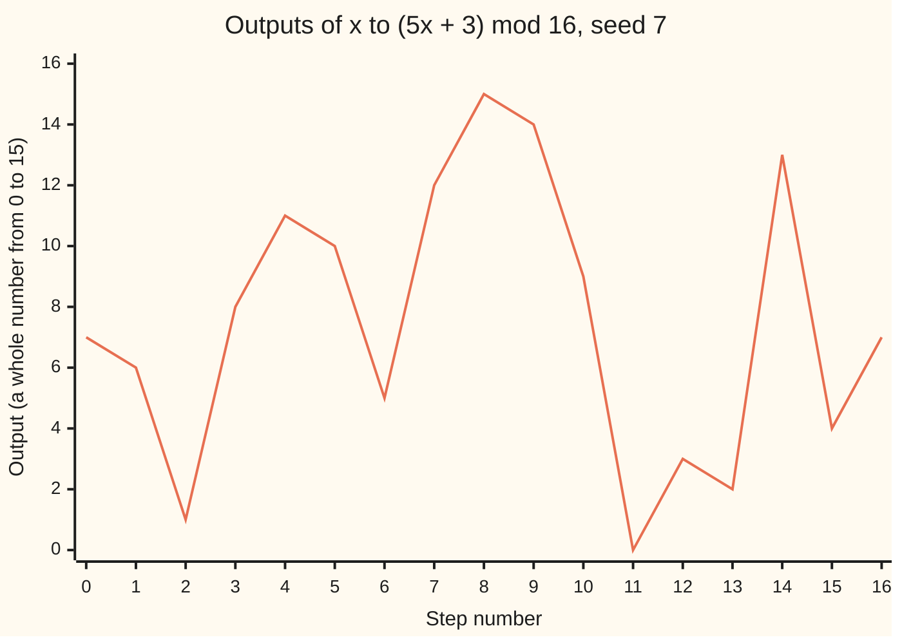
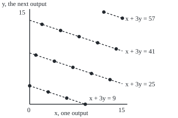
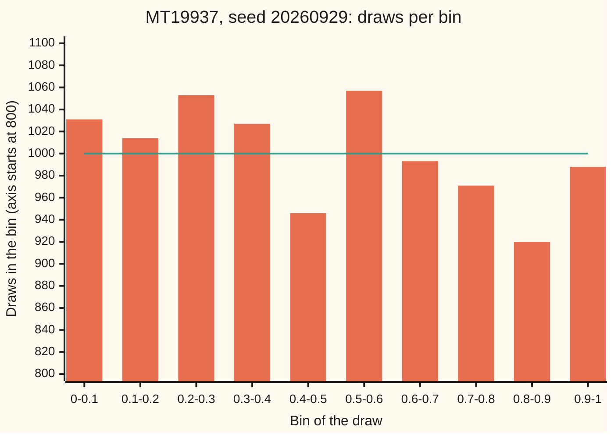

# Random numbers from a computer: linear congruential and Mersenne generators, seeds and tests

[Syllabus](../../../SYLLABUS.md) → [Probability and statistics](../README.md) → [Simulation](../README.md#s11) → Random numbers from a computer

---

## General Overview

A simulation throws 100,000 darts at a square one unit on a side. A dart counts as a hit when it lands within one unit of the bottom-left corner, inside a quarter circle. The quarter circle covers π/4 of the square, so four times the share of hits estimates π. On Monday the program, started from the number 20260929, prints 3.13856, give or take a standard error of 0.00520. On Friday the same program, started from the same number, prints 3.13856 again, to every digit. Started from 20260930 it prints 3.14304. Both runs sit within one standard error of π = 3.14159.

The darts were never random. A computer follows fixed rules, so every "random" number it hands out is computed from the one before. Think of a shuffled deck dealt from the top: the deal looks random, but the same shuffle gives the same deal every time. The rule is a **pseudo-random number generator**, from here on a **generator**. The dart program uses **MT19937**, the Mersenne Twister, built into Python and R; Step 5 opens it up. The number it starts from, 20260929 on Monday, is the **seed**. Same seed, same stream of numbers, same answer: that is what lets a bug be chased, a result be checked by someone else, and two designs be compared on identical luck.

Two questions decide whether a generator can be trusted. How long does its stream run before it repeats? And does the stream pass for uniform draws between 0 and 1 ([Uniform](../04-Continuous%20Distributions/02-uniform-distribution.md)) under tests designed to catch it out?

**A generator is a fixed rule applied over and over to a hidden number; the seed picks the starting number, so the same seed replays the same stream exactly, and a generator earns trust only through the length of its loop and the tests its output passes.**

**What kind of fact this is:** a method: a deterministic recipe that imitates uniform draws, never the real thing; the rule for when the simplest generators visit every value is a theorem, proved on this card in Why it works.

### The picture: a 16-state generator goes round once, then repeats



The line: the seed 7 at step 0, then the generator's 16 outputs, printed by both checks. It hits every whole number from 0 to 15 exactly once with no visible plan, and at step 16 is back at 7, to repeat forever. Real generators do the same with far more states.

---

## The formula

Notation first. The **mod** operation gives the remainder after division: 38 mod 16 is 6, since 38 = 2 × 16 + 6. The three-bar sign ≡ reads "leaves the same remainder as" ([Congruence](../../02-Number%20theory/03-Clock%20Arithmetic/01-congruence-mod-n.md)). A subscript counts steps: $x_n$ is the generator's state after $n$ steps, and $x_0$ is the seed.

The simplest family, the **linear congruential generator** (LCG: multiply, add, keep the remainder), is one line:

$$x_{n+1} = (a\,x_n + c) \bmod m, \qquad u_n = \frac{x_n}{m}$$

**Read it aloud:** multiply the current number by $a$, add $c$, keep the remainder after dividing by $m$; that remainder is the next number, and dividing it by $m$ gives a draw between 0 and 1.

The example above is $a = 5$, $c = 3$, $m = 16$, seed 7: $5 \times 7 + 3 = 38$, and 38 mod 16 is 6, so $x_1 = 6$ and $u_1 = 6/16 = 0.3750$.

The state can take only $m$ values, so the stream must repeat. The **full-cycle rule** (Hull and Dobell, 1962) says when the loop is as long as possible. For $m$ a power of 2, as in most software:

$$\text{loop length} = m \iff c \text{ is odd and } a \equiv 1 \pmod 4$$

**Read it aloud:** the generator visits all $m$ states before repeating exactly when the added number is odd and the multiplier leaves remainder 1 on division by 4. For other $m$ the rule reads: $c$ shares no factor with $m$, $a - 1$ is divisible by every prime that divides $m$, and by 4 if 4 divides $m$.

Uniformity is tested by sorting $N$ draws into $k$ equal bins and adding up the squared surprises ([Chi-square tests](../08-Confidence%20Intervals%20and%20Tests/06-chi-square-tests.md)):

$$\chi^2 = \sum_{j=1}^{k} \frac{(O_j - E_j)^2}{E_j}$$

**Read it aloud:** in each bin, square the gap between the count seen and the count expected, divide by the count expected, and add over the bins.

| Symbol | Plain meaning | In our example | Push it up and the answer… |
| --- | --- | --- | --- |
| $x_n$, $n$ | the state after $n$ steps, a whole number from 0 to $m - 1$ | $x_1 = 6$ | — |
| $x$, $y$ | in the figure: one output and the output after it | 7 and 6 | — |
| $x_0$ | the seed: the starting state | 7 (darts: 20260929) | a different stream, same quality |
| $a$ | the multiplier | 5 | stirs harder; quality depends on its digits, not its size |
| $c$ | the increment, added each step | 3 | odd (with $a \equiv 1 \pmod 4$) gives the full loop; even gives at most half |
| $m$ | the modulus: how many states there are | 16 (minstd, Step 1: 2^31 − 1) | longer possible loop |
| $u_n$ | the draw between 0 and 1, $x_n / m$ | $u_1 = 0.3750$ | — |
| $S(n)$ | in the proof: $1 + a + a^2 + \dots + a^{n-1}$ | adds $n$ powers of 5 | — |
| $N$ | number of draws tested | 10,000 | real flaws show up more clearly |
| $k$ | number of equal bins | 10 | finer test, fewer draws per bin |
| $O_j$, $E_j$, $j$ | draws seen, and expected, in bin number $j$ | 1031 and 1000 | — |
| $\chi^2$ | chi-square: the total squared surprise | 18.29 (MT19937) | above 16.919 fails at 5% |

### When it holds

- **The arithmetic is exact.** A multiply that silently drops its top bits is a different generator with a different loop.
- **The draws are taken in the same order.** One extra draw early in the program, or threads that take turns in no fixed order, shift every later number, and the replay is lost.
- **For the full-cycle rule as stated, $m$ is a power of 2.** If $c$ is even the loop is at most half as long: $(5x + 2) \bmod 16$ loops after 8.
- **For the tests, the draws are compared with a known law.** A test finds only the pattern it looks for: a generator can pass the bin test and still fail badly on triples, as RANDU does below.

---

## Why it works

### Step 0: a machine with finitely many states must loop

Only $m$ states are possible, so within $m + 1$ steps some state comes back, and from there the stream repeats. A designer controls only how long the loop is and how patternless the path round it looks. Randomness, here, is a standard the output must meet under testing, not a property of the rule.

### Step 1: the same seed replays the same stream, and any stretch can be reached directly

The rule's only input is the current state, so the same seed gives the same stream: 3.13856 twice. A different seed starts somewhere else on the loop: 3.14304. The two differ by 0.00448, less than one standard error, which is the size of luck at 100,000 darts ([Monte Carlo](04-monte-carlo-estimates-and-error.md)).

Determinism also allows jumping ahead. The generator Park and Miller called the minimal standard, **minstd**, has $c = 0$, $a = 16807$ and $m = 2^{31} - 1$. With no increment, $n$ steps multiply the seed by $a$ exactly $n$ times, so $x_n = a^n x_0 \bmod m$. Repeated squaring computes $a^{10000}$ with a handful of squarings instead of 10,000 steps. From seed 1, stepping and jumping both land on 1043618065: the value Park and Miller published as the test that an implementation is correct. Jumping is how parallel workers get separate stretches of one stream.

### Step 2: when the loop visits every state

For $m$ a power of 2 the full-cycle rule has a short proof, by counting factors of 2. The shape:

1. When $a$ is odd, each state has exactly one state before it, so the states fall into separate loops. Full cycle means the loop through 0 has length $m$.
2. From 0, the state after $n$ steps is $c \times S(n) \bmod m$, where $S(n) = 1 + a + \dots + a^{n-1}$.
3. With $c$ odd, that state is 0 exactly when $m$ divides $S(n)$.
4. With $a \equiv 1 \pmod 4$, $S(n)$ carries exactly as many factors of 2 as $n$ does. So $S(n)$ first becomes divisible by $m$ at $n = m$.

Each condition is needed: the folded proof shows how the loop shortens when one fails.

The checks test the rule against brute force. For $m = 16$ they run every pair of $a$ and $c$ from 0 to 15 and find 32 with a full loop; the rule picks out the same 32 pairs. For $m = 64$: 512 pairs both ways.

<details>
<summary>Detailed proof: the full-cycle rule for m a power of 2, at least 4</summary>

**Loops.** If $a$ is odd it has an inverse on the $m$-clock, so $x \mapsto (ax + c) \bmod m$ can be undone: no two states share a successor. Following successors from any state must then return to it, so the states split into separate loops. The generator has a full cycle exactly when the loop through 0 has length $m$.

**The state after n steps.** Start at 0. Then $x_1 = c = c\,S(1)$. If $x_n = c\,S(n)$, then $x_{n+1} = a\,c\,S(n) + c = c\,(a\,S(n) + 1) = c\,S(n+1)$, all mod $m$. With $c$ odd, $c$ has an inverse, so $x_n = 0$ exactly when $m$ divides $S(n)$.

**Counting factors of 2 (for a ≡ 1 mod 4).** If $n$ is odd, $S(n)$ adds $n$ odd numbers and is odd: no factor of 2, like $n$. If $n$ is even, pair the terms: $S(n) = (1 + a)(1 + a^2 + a^4 + \dots + a^{n-2})$. The first factor is 2 more than a multiple of 4, so it carries exactly one factor of 2. The second is $S$ built from $a^2$ over $n/2$ terms, and $a^2 \equiv 1 \pmod 4$ too. By induction on $n$ it carries as many factors of 2 as $n/2$. Together: as many as $n$. Since $m$ is a power of 2, $m$ divides $S(n)$ exactly when $m$ divides $n$; the first such $n$ is $m$, and the loop through 0 has length $m$.

**Necessity.** If $c$ is even and $a$ odd, $ax + c$ has the parity of $x$, so a stream never changes parity and misses half the states. If $a$ is even, every state after the first has the parity of $c$. If $a \equiv 3 \pmod 4$, then $1 + a$ is a multiple of 4, so for even $n$ the pairing gives $S(n)$ at least one more factor of 2 than $n$; at $n = m/2$ that makes $m$ divide $S(n)$, and the loop through 0 closes by step $m/2$.

The toy generator has $a = 5 \equiv 1 \pmod 4$ and $c = 3$ odd: a full loop of 16, as the chart shows.

</details>

### Step 3: a full loop is not randomness

The rule guarantees coverage, not disorder. Take $a = 1$, $c = 1$: the loop is full, and the stream is 8, 9, 10, 11, 12, 13, a counter.

The toy generator hides two quieter patterns. Its last binary digit, or **bit**, runs 0, 1, 0, 1 for ever, because with $m$ a power of 2 the lowest bit is itself a generator with only two states. And its consecutive pairs line up. Plot each output $x$ against the next output $y$ and all 16 points fall on four parallel lines.

### The picture: consecutive outputs of the toy generator, as points (x, y)

<p align="center"></p>

Every point satisfies $x + 3y = 9$, 25, 41 or 57: the check lists the 16 pairs and finds exactly those four values. Drawn to scale, one unit to 12.5 drawing units on both axes. The reason is one line of algebra: $y \equiv 5x + 3 \pmod{16}$, and $3 \times 5 = 15 \equiv -1$, so $3y \equiv -x + 9$, which gives $x + 3y \equiv 9 \pmod{16}$. Every LCG does this. George Marsaglia showed in 1968 that consecutive draws of any LCG, taken in pairs, triples or longer runs, lie on a limited number of flat sheets. A good multiplier makes the sheets many and close together; a bad one makes them few.

The notorious bad one is **RANDU**, IBM's generator of the 1960s: $a = 65539$, $c = 0$, $m = 2^{31}$. Since $65539 = 2^{16} + 3$, squaring gives $a^2 \equiv 6a - 9 \pmod{2^{31}}$, so every output is fixed by the two before: $x_{n+2} \equiv 6x_{n+1} - 9x_n$. In the check, 9 times one output, minus 6 times the next, plus the one after, is a multiple of $2^{31}$ for all 10,000 triples of consecutive outputs, and those triples lie on just 15 planes in the unit cube. For MT19937 (its top 31 bits) the same combination is a multiple of $2^{31}$ in 0 of 10,000 triples.

### Step 4: testing uniformity with chi-square

A test asks one question: would honest uniform draws look this lumpy? Sort 10,000 draws into 10 equal bins, about 1000 expected in each. The chi-square total follows, for honest draws and to a close approximation when each bin expects many draws, the chi-square law with 9 **degrees of freedom** (the bin count less one, since the counts must add to 10,000) ([The reference distributions](../07-Sampling%20and%20Estimation/03-chi-square-t-and-f-distributions.md)). Its p-value, the chance honest draws would score at least as high ([Hypothesis tests](../08-Confidence%20Intervals%20and%20Tests/03-hypothesis-tests-and-p-values.md)), comes from the area under that law's density. The checks compute it with their own Simpson's-rule integrator. At 16.919, the 5% point that printed tables give for 9 degrees of freedom, the integrator returns 0.0500.

| Generator | Chi-square | p-value |
| --- | --- | --- |
| MT19937, seed 20260929 | 18.29 | 0.0319 |
| minstd, seed 1 | 6.69 | 0.6694 |
| RANDU, seed 1 | 8.81 | 0.4548 |

### The picture: 10,000 MT19937 draws in ten bins



Bars: the counts, printed by both checks. Line: the 1000 expected in each bin. The axis starts at 800, which magnifies the wobble.

The best generator of the three has the worst score and fails at the 5% level. A 5% test rejects honest draws one time in twenty, by design. From seeds 1 to 100, MT19937 falls below 0.05 in 5 runs: what a sound generator should do. RANDU passes comfortably, because the bin test looks at one draw at a time and RANDU's flaw lives in triples. Serious test batteries run hundreds of tests aimed at different patterns.

### Step 5: bigger states, stirred with bits

Modern generators keep a much larger state and stir it with bit operations: shifts (slide the binary digits left or right) and XOR (exclusive or: compare two numbers digit by digit, 1 where they differ).

**MT19937**, the Mersenne Twister of Matsumoto and Nishimura (1998), holds 624 numbers of 32 bits. Each refill mixes every word with its neighbour and with the word 397 places on; each output is then scrambled further, "tempered", before release. Its loop has length $2^{19937} - 1$, a **Mersenne prime** (a prime one less than a power of 2), which gives the name; the 1998 paper proves it by polynomial algebra over bits, and this card takes it as stated. The check's version, from seed 5489, gives 4123659995 as its 10,000th output, the value the C++ standard fixes as the test of a correct implementation.

**SplitMix64**, written out in many checks on this wing, is a counter with a scrambler. Its state steps by a fixed odd number: an LCG with $a = 1$ and odd $c$, so by Step 2 its loop covers all $2^{64}$ states. On its own that is the counter of Step 3. A mixing function then shifts, XORs and multiplies the state so that neighbouring counts give unrelated outputs. Because the state after $n$ steps is the seed plus $n$ times the step, the 10,000th output can be computed directly; the check gets the same number both ways.

Physical noise and cryptographic generators are the other routes; simulation rarely needs them, security always needs the second. How far fixed rules can stand in for true randomness is the subject of Pseudorandomness.

---

## Worked numbers, by hand

The toy generator $x_{n+1} = (5x_n + 3) \bmod 16$, seed 7.

| Step | Arithmetic | Value |
| --- | --- | --- |
| $x_1$ | 5 × 7 + 3 = 38; 38 − 2 × 16 | 6 |
| $u_1$ | 6 / 16 | 0.3750 |
| $x_2$ | 5 × 6 + 3 = 33; 33 − 2 × 16 | 1 |
| $x_3$ | 5 × 1 + 3 = 8 | 8 |
| $x_4$ | 5 × 8 + 3 = 43; 43 − 2 × 16 | 11 |
| $u_2$, $u_3$, $u_4$ | 1/16, 8/16, 11/16 | 0.0625, 0.5000, 0.6875 |
| the rule | $a = 5$ leaves 1 on division by 4; $c = 3$ is odd | full loop |
| steps until 7 returns | keep going: 10, 5, 12, 15, 14, 9, 0, 3, 2, 13, 4, 7 | **16** |

Each of the 16 values appears exactly once per loop, then the loop replays: the reason real generators have loops far longer than any simulation will use.

### What breaks if you drop a piece

| Mistake | Comes out at | What went wrong |
| --- | --- | --- |
| Even increment: $(5x + 2) \bmod 16$ | loop of 8 | an odd seed never reaches an even state |
| Multiplier 3, remainder 3 on division by 4: $(3x + 3) \bmod 16$ | loop of 8 | an extra factor of 2 closes the loop at step $m/2$ |
| Last bit of the toy generator as a coin | 0, 1, 0, 1, … | with $m$ a power of 2, the lowest bit has a loop of 2 |
| minstd seeded 1 and 2 as "independent" streams | seed 2 gives 0.000016, 0.263076, 0.511211: seed 1's 0.000008, 0.131538, 0.755605 doubled, less 1 once past 1 | with $c = 0$, the seed-2 stream is 2 times the seed-1 stream mod $m$, in 1000 of 1000 outputs |
| Trusting RANDU because it passes the bin test | p = 0.4548, yet 10,000 of 10,000 triples on 15 planes | the test looked at single draws, the flaw lives in triples |

---

## Code, from first principles, and it actually runs

Both programs write out their generators (linear congruential, MT19937, SplitMix64) and import no random module. Four roads: the full-cycle rule against brute force over every multiplier and increment; the 10,000th output by stepping, by jumping ahead and against published values; a hand-written Simpson's rule against the printed 5% table value; and simulated numbers held to their standard errors or a failure count, never to exact matches.

### Python

```python
# Random numbers from a computer -- the check behind the card.  Standard library
# only, no random module: every generator is written out here.  Roads: rule
# against brute force, stepping against jumping ahead against published values,
# and statistical tests whose own yardstick is checked against a printed table.
import math
M32, M64, P = 2**32 - 1, 2**64 - 1, 2**31 - 1

def lcg(a, c, m, x, n):                        # n outputs of x -> (a x + c) mod m
    out = []
    for _ in range(n):
        x = (a * x + c) % m
        out.append(x)
    return out

def cycle(a, c, m, x):                         # length of the loop the seed falls into
    seen, n = {}, 0
    while x not in seen:
        seen[x], x, n = n, (a * x + c) % m, n + 1
    return n - seen[x]

def powmod(b, e, m):                           # square-and-multiply, to jump ahead
    r = 1
    while e:
        if e & 1: r = r * b % m
        b, e = b * b % m, e >> 1
    return r

class MT:                                      # MT19937, Matsumoto and Nishimura 1998
    def __init__(self, seed):
        self.s = [seed]
        for i in range(1, 624):
            self.s.append((1812433253 * (self.s[-1] ^ (self.s[-1] >> 30)) + i) & M32)
        self.i = 624
    def next32(self):
        s = self.s
        if self.i == 624:                      # refill all 624 words at once
            for k in range(624):
                y = (s[k] & 0x80000000) | (s[(k + 1) % 624] & 0x7FFFFFFF)
                s[k] = s[(k + 397) % 624] ^ (y >> 1) ^ (0x9908B0DF * (y & 1))
            self.i = 0
        y = s[self.i]; self.i += 1
        y ^= y >> 11; y ^= (y << 7) & 0x9D2C5680; y ^= (y << 15) & 0xEFC60000
        return y ^ (y >> 18)
    def u(self): return self.next32() / 2**32

def splitmix(state):                           # SplitMix64: a counter, then a scrambler
    state = (state + 0x9E3779B97F4A7C15) & M64
    z = ((state ^ (state >> 30)) * 0xBF58476D1CE4E5B9) & M64
    z = ((z ^ (z >> 27)) * 0x94D049BB133111EB) & M64
    return state, z ^ (z >> 31)

def chi2(draw, n=10000, k=10):                 # counts in k equal bins, and the statistic
    obs = [0] * k
    for _ in range(n): obs[int(draw() * k)] += 1
    return obs, sum((o - n / k) ** 2 / (n / k) for o in obs)

def pvalue(x, steps=2000):                     # chance a true uniform scores above x, for
    g = 3.5 * 2.5 * 1.5 * 0.5 * math.sqrt(math.pi)    # 9 degrees of freedom, by Simpson's rule
    f = lambda t: t ** 3.5 * math.exp(-t / 2) / (2 ** 4.5 * g)
    h = x / steps
    s = f(0) + f(x) + sum((4 if j % 2 else 2) * f(j * h) for j in range(1, steps))
    return 1 - s * h / 3

def stream(a, m, x):                           # an LCG without increment, as u in [0, 1)
    def draw():
        nonlocal x
        x = a * x % m
        return x / m
    return draw

def darts(seed, n=100000):                     # the house example: darts at a unit square
    g, hits = MT(seed), 0
    for _ in range(n):
        x, y = g.u(), g.u()
        hits += x * x + y * y < 1
    p = hits / n
    return 4 * p, 4 * math.sqrt(p * (1 - p) / n)

yn = lambda b: "yes" if b else "no"
toy = lcg(5, 3, 16, 7, 16)
pairs = sorted(zip([7] + toy[:15], toy))
print(f"toy,x -> (5x + 3) mod 16,seed 7,outputs {toy},cycle {cycle(5, 3, 16, 7)}")
print(f"toy,u = x/16,first four {', '.join(f'{x / 16:.4f}' for x in toy[:4])},last bits {[x & 1 for x in toy[:12]]}")
print(f"figure,pairs {pairs},values of x + 3y {sorted({x + 3 * y for x, y in pairs})}")
rule_ok = True
for m in (16, 64):
    brute = [(a, c) for a in range(m) for c in range(m) if cycle(a, c, m, 0) == m]
    rule = [(a, c) for a in range(m) for c in range(m) if c % 2 == 1 and a % 4 == 1]
    rule_ok = rule_ok and brute == rule
    print(f"full cycle,m {m},pairs by brute force {len(brute)},by the rule {len(rule)},same pairs {yn(brute == rule)}")
print(f"cycle,(5x + 2) mod 16 from 7: {cycle(5, 2, 16, 7)},(3x + 3) mod 16 from 7: {cycle(3, 3, 16, 7)},"
      f"(x + 1) mod 16: {cycle(1, 1, 16, 7)} {lcg(1, 1, 16, 7, 6)}")
step, jump = lcg(16807, 0, P, 1, 10000)[-1], powmod(16807, 10000, P)
print(f"minstd,x -> 16807x mod (2^31 - 1),seed 1,10000th by stepping {step},by jumping {jump},published 1043618065")
g = MT(5489)
mt_out = [g.next32() for _ in range(10000)]
print(f"mt19937,seed 5489,first {mt_out[0]},10000th {mt_out[-1]},published 10000th 4123659995")
s, sm = 0, []
for _ in range(10000):
    s, z = splitmix(s)
    sm.append(z)
jump_sm = splitmix((10000 - 1) * 0x9E3779B97F4A7C15 & M64)[1]   # the counter jumps straight there
print(f"splitmix64,seed 0,first {sm[0]:016x},10000th by stepping {sm[-1]:016x},by jumping {jump_sm:016x}")
print(f"chi-square,table 5% point for 9 degrees of freedom 16.919,p by Simpson {pvalue(16.919):.4f}")
pv = []
for name, draw in [("mt19937 seed 20260929", MT(20260929).u), ("minstd seed 1", stream(16807, P, 1)),
                   ("randu seed 1", stream(65539, 2**31, 1))]:
    obs, x2 = chi2(draw)
    pv.append(pvalue(x2))
    print(f"uniformity,{name},10000 draws in 10 bins (1000 expected in each) {obs},chi-square {x2:.2f},p {pv[-1]:.4f}")
low = sum(1 for sd in range(1, 101) if pvalue(chi2(MT(sd).u)[1]) < 0.05)
print(f"uniformity,mt19937 seeds 1 to 100,tests with p below 0.05: {low} of 100")
r = lcg(65539, 0, 2**31, 1, 10002)
g = MT(20260929)
w = [g.next32() >> 1 for _ in range(10002)]
on = sum(1 for i in range(10000) if (9 * r[i] - 6 * r[i + 1] + r[i + 2]) % 2**31 == 0)
planes = len({(9 * r[i] - 6 * r[i + 1] + r[i + 2]) // 2**31 for i in range(10000)})
on_mt = sum(1 for i in range(10000) if (9 * w[i] - 6 * w[i + 1] + w[i + 2]) % 2**31 == 0)
print(f"triples,randu,9x - 6y + z a multiple of 2^31 in {on} of 10000,planes {planes},mt19937 {on_mt} of 10000")
s1, s2 = lcg(16807, 0, P, 1, 1000), lcg(16807, 0, P, 2, 1000)
twice = sum(1 for a, b in zip(s1, s2) if b == 2 * a % P)
print(f"seeds,minstd seed 1 {', '.join(f'{x / P:.6f}' for x in s1[:3])},seed 2 {', '.join(f'{x / P:.6f}' for x in s2[:3])},"
      f"seed-2 output = 2 x seed-1 output mod m in {twice} of 1000")
(a1, se1), (a2, _), (b1, seb) = darts(20260929), darts(20260929), darts(20260930)
print(f"darts,100000 each,seed 20260929 run 1 {a1:.5f} ({round(a1 * 25000)} hits),run 2 {a2:.5f},se {se1:.5f}")
print(f"darts,seed 20260930 {b1:.5f},se {seb:.5f},pi {math.pi:.5f},gap between seeds {abs(a1 - b1):.5f}")
assert sorted(toy) == list(range(16)) and all((x + 3 * y) % 16 == 9 for x, y in pairs)  # rule; x + 3y = 9 mod 16
assert rule_ok and cycle(5, 2, 16, 7) == cycle(3, 3, 16, 7) == 8  # rule = brute force; broken rule halves
assert step == jump == 1043618065                              # three roads to minstd's 10000th
assert mt_out[-1] == 4123659995 and sm[-1] == jump_sm          # published value; counter jump
assert abs(pvalue(16.919) - 0.05) < 1e-4                       # own integrator = printed table
assert on == 10000 and planes == 15 and on_mt < 5              # a^2 = 6a - 9 predicts the planes
assert twice == 1000                                           # algebra predicts the seed clone
assert round(a1 * 25000) == 78464 and a1 != b1                 # the Rust run's hits; new seed, new run
assert abs(a1 - math.pi) < 4 * se1 and abs(b1 - math.pi) < 4 * seb
assert min(pv) > 0.001 and low <= 14                           # 5 in 100 expected, sd about 2
print("ALL CHECKS PASS")
```

**Ran 2026-10-06 on macOS, Python 3.14.6, standard library only. All checks passed. Output, pasted from the run:**

```
toy,x -> (5x + 3) mod 16,seed 7,outputs [6, 1, 8, 11, 10, 5, 12, 15, 14, 9, 0, 3, 2, 13, 4, 7],cycle 16
toy,u = x/16,first four 0.3750, 0.0625, 0.5000, 0.6875,last bits [0, 1, 0, 1, 0, 1, 0, 1, 0, 1, 0, 1]
figure,pairs [(0, 3), (1, 8), (2, 13), (3, 2), (4, 7), (5, 12), (6, 1), (7, 6), (8, 11), (9, 0), (10, 5), (11, 10), (12, 15), (13, 4), (14, 9), (15, 14)],values of x + 3y [9, 25, 41, 57]
full cycle,m 16,pairs by brute force 32,by the rule 32,same pairs yes
full cycle,m 64,pairs by brute force 512,by the rule 512,same pairs yes
cycle,(5x + 2) mod 16 from 7: 8,(3x + 3) mod 16 from 7: 8,(x + 1) mod 16: 16 [8, 9, 10, 11, 12, 13]
minstd,x -> 16807x mod (2^31 - 1),seed 1,10000th by stepping 1043618065,by jumping 1043618065,published 1043618065
mt19937,seed 5489,first 3499211612,10000th 4123659995,published 10000th 4123659995
splitmix64,seed 0,first e220a8397b1dcdaf,10000th by stepping 488601e3f80e210a,by jumping 488601e3f80e210a
chi-square,table 5% point for 9 degrees of freedom 16.919,p by Simpson 0.0500
uniformity,mt19937 seed 20260929,10000 draws in 10 bins (1000 expected in each) [1031, 1014, 1053, 1027, 946, 1057, 993, 971, 920, 988],chi-square 18.29,p 0.0319
uniformity,minstd seed 1,10000 draws in 10 bins (1000 expected in each) [993, 1007, 998, 958, 1001, 1049, 989, 963, 1026, 1016],chi-square 6.69,p 0.6694
uniformity,randu seed 1,10000 draws in 10 bins (1000 expected in each) [974, 1011, 984, 1031, 1011, 972, 1004, 1064, 959, 990],chi-square 8.81,p 0.4548
uniformity,mt19937 seeds 1 to 100,tests with p below 0.05: 5 of 100
triples,randu,9x - 6y + z a multiple of 2^31 in 10000 of 10000,planes 15,mt19937 0 of 10000
seeds,minstd seed 1 0.000008, 0.131538, 0.755605,seed 2 0.000016, 0.263076, 0.511211,seed-2 output = 2 x seed-1 output mod m in 1000 of 1000
darts,100000 each,seed 20260929 run 1 3.13856 (78464 hits),run 2 3.13856,se 0.00520
darts,seed 20260930 3.14304,se 0.00519,pi 3.14159,gap between seeds 0.00448
ALL CHECKS PASS
```

### Rust

Same numbers, same labels, built with `rustc --edition 2021 -O`.

```rust
// Random numbers from a computer -- the same check as the Python, in Rust.  No
// crates: every generator is written out here.  Roads: rule against brute
// force, stepping against jumping ahead against published values, and
// statistical tests whose own yardstick is checked against a printed table.
use std::collections::{BTreeSet, HashMap};
const P: u64 = (1 << 31) - 1;

fn lcg(a: u64, c: u64, m: u64, mut x: u64, n: usize) -> Vec<u64> {   // n outputs of (a x + c) mod m
    (0..n).map(|_| { x = (a * x + c) % m; x }).collect()
}

fn cycle(a: u64, c: u64, m: u64, mut x: u64) -> u64 {   // length of the loop the seed falls into
    let (mut seen, mut n) = (HashMap::new(), 0u64);
    while !seen.contains_key(&x) {
        seen.insert(x, n);
        x = (a * x + c) % m;
        n += 1;
    }
    n - seen[&x]
}

fn powmod(mut b: u64, mut e: u64, m: u64) -> u64 {      // square-and-multiply, to jump ahead
    let mut r = 1;
    while e > 0 {
        if e & 1 == 1 { r = r * b % m }
        b = b * b % m;
        e >>= 1;
    }
    r
}

struct Mt { s: Vec<u32>, i: usize }                     // MT19937, Matsumoto and Nishimura 1998
impl Mt {
    fn new(seed: u32) -> Mt {
        let mut s = vec![seed];
        for i in 1..624u32 {
            let p = s[i as usize - 1];
            s.push(1812433253u32.wrapping_mul(p ^ (p >> 30)).wrapping_add(i));
        }
        Mt { s, i: 624 }
    }
    fn next32(&mut self) -> u32 {
        if self.i == 624 {                              // refill all 624 words at once
            for k in 0..624 {
                let y = (self.s[k] & 0x80000000) | (self.s[(k + 1) % 624] & 0x7FFFFFFF);
                self.s[k] = self.s[(k + 397) % 624] ^ (y >> 1) ^ (0x9908B0DF * (y & 1));
            }
            self.i = 0;
        }
        let mut y = self.s[self.i];
        self.i += 1;
        y ^= y >> 11; y ^= (y << 7) & 0x9D2C5680; y ^= (y << 15) & 0xEFC60000;
        y ^ (y >> 18)
    }
    fn u(&mut self) -> f64 { self.next32() as f64 / 4294967296.0 }
}

fn splitmix(state: u64) -> (u64, u64) {                 // SplitMix64: a counter, then a scrambler
    let state = state.wrapping_add(0x9E3779B97F4A7C15);
    let z = (state ^ (state >> 30)).wrapping_mul(0xBF58476D1CE4E5B9);
    let z = (z ^ (z >> 27)).wrapping_mul(0x94D049BB133111EB);
    (state, z ^ (z >> 31))
}

fn chi2(draw: &mut dyn FnMut() -> f64) -> (Vec<u64>, f64) {   // counts in 10 bins, and the statistic
    let mut obs = vec![0u64; 10];
    for _ in 0..10000 { obs[(draw() * 10.0) as usize] += 1 }
    (obs.clone(), obs.iter().map(|&o| (o as f64 - 1000.0).powi(2) / 1000.0).sum())
}

fn pvalue(x: f64) -> f64 {                              // chance a true uniform scores above x,
    let g = 3.5 * 2.5 * 1.5 * 0.5 * std::f64::consts::PI.sqrt();   // 9 degrees of freedom, Simpson
    let f = |t: f64| t.powf(3.5) * (-t / 2.0).exp() / (2f64.powf(4.5) * g);
    let h = x / 2000.0;
    let mut acc = 0.0;
    for j in 1..2000 { acc += (if j % 2 == 1 { 4.0 } else { 2.0 }) * f(j as f64 * h) }
    1.0 - (f(0.0) + f(x) + acc) * h / 3.0
}

fn stream(a: u64, m: u64, mut x: u64) -> impl FnMut() -> f64 {   // LCG without increment, u in [0, 1)
    move || { x = a * x % m; x as f64 / m as f64 }
}

fn darts(seed: u32) -> (f64, f64) {                     // the house example: darts at a unit square
    let (mut g, mut hits, n) = (Mt::new(seed), 0u64, 100000.0);
    for _ in 0..100000 {
        let (x, y) = (g.u(), g.u());
        if x * x + y * y < 1.0 { hits += 1 }
    }
    let p = hits as f64 / n;
    (4.0 * p, 4.0 * (p * (1.0 - p) / n).sqrt())
}

fn yn(b: bool) -> &'static str { if b { "yes" } else { "no" } }
fn fl(v: &[u64], m: f64, d: usize) -> String {
    v.iter().map(|&x| format!("{:.*}", d, x as f64 / m)).collect::<Vec<_>>().join(", ")
}

fn main() {
    let toy = lcg(5, 3, 16, 7, 16);
    let mut pairs: Vec<(u64, u64)> = (0..16).map(|i| (if i == 0 { 7 } else { toy[i - 1] }, toy[i])).collect();
    pairs.sort();
    let lines: Vec<u64> = pairs.iter().map(|&(x, y)| x + 3 * y).collect::<BTreeSet<u64>>().into_iter().collect();
    let bits: Vec<u64> = toy[..12].iter().map(|x| x & 1).collect();
    println!("toy,x -> (5x + 3) mod 16,seed 7,outputs {:?},cycle {}", toy, cycle(5, 3, 16, 7));
    println!("toy,u = x/16,first four {},last bits {:?}", fl(&toy[..4], 16.0, 4), bits);
    println!("figure,pairs {:?},values of x + 3y {:?}", pairs, lines);
    let mut rule_ok = true;
    for m in [16u64, 64] {
        let all: Vec<(u64, u64)> = (0..m).flat_map(|a| (0..m).map(move |c| (a, c))).collect();
        let brute: Vec<(u64, u64)> = all.iter().copied().filter(|&(a, c)| cycle(a, c, m, 0) == m).collect();
        let rule: Vec<(u64, u64)> = all.iter().copied().filter(|&(a, c)| c % 2 == 1 && a % 4 == 1).collect();
        rule_ok = rule_ok && brute == rule;
        println!("full cycle,m {},pairs by brute force {},by the rule {},same pairs {}", m, brute.len(), rule.len(), yn(brute == rule));
    }
    println!("cycle,(5x + 2) mod 16 from 7: {},(3x + 3) mod 16 from 7: {},(x + 1) mod 16: {} {:?}",
             cycle(5, 2, 16, 7), cycle(3, 3, 16, 7), cycle(1, 1, 16, 7), lcg(1, 1, 16, 7, 6));
    let (step, jump) = (lcg(16807, 0, P, 1, 10000)[9999], powmod(16807, 10000, P));
    println!("minstd,x -> 16807x mod (2^31 - 1),seed 1,10000th by stepping {},by jumping {},published 1043618065", step, jump);
    let mut g = Mt::new(5489);
    let mt_out: Vec<u32> = (0..10000).map(|_| g.next32()).collect();
    println!("mt19937,seed 5489,first {},10000th {},published 10000th 4123659995", mt_out[0], mt_out[9999]);
    let (mut s, mut sm) = (0u64, Vec::new());
    for _ in 0..10000 { let (s2, z) = splitmix(s); s = s2; sm.push(z); }
    let jump_sm = splitmix(9999u64.wrapping_mul(0x9E3779B97F4A7C15)).1;   // the counter jumps straight there
    println!("splitmix64,seed 0,first {:016x},10000th by stepping {:016x},by jumping {:016x}", sm[0], sm[9999], jump_sm);
    println!("chi-square,table 5% point for 9 degrees of freedom 16.919,p by Simpson {:.4}", pvalue(16.919));
    let mut mt = Mt::new(20260929);
    let mut tests: Vec<(&str, Box<dyn FnMut() -> f64>)> = vec![("mt19937 seed 20260929", Box::new(move || mt.u())),
        ("minstd seed 1", Box::new(stream(16807, P, 1))), ("randu seed 1", Box::new(stream(65539, 1 << 31, 1)))];
    let mut pv = Vec::new();
    for (name, draw) in tests.iter_mut() {
        let (obs, x2) = chi2(draw.as_mut());
        pv.push(pvalue(x2));
        println!("uniformity,{},10000 draws in 10 bins (1000 expected in each) {:?},chi-square {:.2},p {:.4}", name, obs, x2, pv[pv.len() - 1]);
    }
    let low = (1..=100u32).filter(|&sd| { let mut g = Mt::new(sd); pvalue(chi2(&mut || g.u()).1) < 0.05 }).count();
    println!("uniformity,mt19937 seeds 1 to 100,tests with p below 0.05: {} of 100", low);
    let r: Vec<i64> = lcg(65539, 0, 1 << 31, 1, 10002).iter().map(|&x| x as i64).collect();
    let mut g = Mt::new(20260929);
    let w: Vec<i64> = (0..10002).map(|_| (g.next32() >> 1) as i64).collect();
    let comb = |v: &Vec<i64>, i: usize| 9 * v[i] - 6 * v[i + 1] + v[i + 2];
    let on = (0..10000).filter(|&i| comb(&r, i).rem_euclid(1 << 31) == 0).count();
    let planes = (0..10000).map(|i| comb(&r, i).div_euclid(1 << 31)).collect::<BTreeSet<i64>>().len();
    let on_mt = (0..10000).filter(|&i| comb(&w, i).rem_euclid(1 << 31) == 0).count();
    println!("triples,randu,9x - 6y + z a multiple of 2^31 in {} of 10000,planes {},mt19937 {} of 10000", on, planes, on_mt);
    let (s1, s2) = (lcg(16807, 0, P, 1, 1000), lcg(16807, 0, P, 2, 1000));
    let twice = s1.iter().zip(&s2).filter(|&(a, b)| *b == 2 * a % P).count();
    println!("seeds,minstd seed 1 {},seed 2 {},seed-2 output = 2 x seed-1 output mod m in {} of 1000",
             fl(&s1[..3], P as f64, 6), fl(&s2[..3], P as f64, 6), twice);
    let ((a1, se1), (a2, _), (b1, seb)) = (darts(20260929), darts(20260929), darts(20260930));
    let pi = std::f64::consts::PI;
    println!("darts,100000 each,seed 20260929 run 1 {:.5} ({} hits),run 2 {:.5},se {:.5}", a1, (a1 * 25000.0).round() as u64, a2, se1);
    println!("darts,seed 20260930 {:.5},se {:.5},pi {:.5},gap between seeds {:.5}", b1, seb, pi, (a1 - b1).abs());
    assert!(toy.iter().copied().collect::<BTreeSet<u64>>().len() == 16 && pairs.iter().all(|&(x, y)| (x + 3 * y) % 16 == 9));
    assert!(rule_ok && cycle(5, 2, 16, 7) == 8 && cycle(3, 3, 16, 7) == 8);   // rule = brute force; broken rule halves
    assert!(step == 1043618065 && jump == 1043618065);                 // three roads to minstd's 10000th
    assert!(mt_out[9999] == 4123659995 && sm[9999] == jump_sm);          // published value; counter jump
    assert!((pvalue(16.919) - 0.05).abs() < 1e-4);                     // own integrator = printed table
    assert!(on == 10000 && planes == 15 && on_mt < 5);                 // a^2 = 6a - 9 predicts the planes
    assert!(twice == 1000);                                            // algebra predicts the seed clone
    assert!((a1 * 25000.0).round() as u64 == 78464 && a1 != b1);       // the Python run's hits; new seed, new run
    assert!((a1 - pi).abs() < 4.0 * se1 && (b1 - pi).abs() < 4.0 * seb);
    assert!(pv.iter().all(|&p| p > 0.001) && low <= 14);               // 5 in 100 expected, sd about 2
    println!("ALL CHECKS PASS");
}
```

**Ran 2026-10-06 on macOS, rustc 1.98.1, no crates. All checks passed. Output, pasted from the run:**

```
toy,x -> (5x + 3) mod 16,seed 7,outputs [6, 1, 8, 11, 10, 5, 12, 15, 14, 9, 0, 3, 2, 13, 4, 7],cycle 16
toy,u = x/16,first four 0.3750, 0.0625, 0.5000, 0.6875,last bits [0, 1, 0, 1, 0, 1, 0, 1, 0, 1, 0, 1]
figure,pairs [(0, 3), (1, 8), (2, 13), (3, 2), (4, 7), (5, 12), (6, 1), (7, 6), (8, 11), (9, 0), (10, 5), (11, 10), (12, 15), (13, 4), (14, 9), (15, 14)],values of x + 3y [9, 25, 41, 57]
full cycle,m 16,pairs by brute force 32,by the rule 32,same pairs yes
full cycle,m 64,pairs by brute force 512,by the rule 512,same pairs yes
cycle,(5x + 2) mod 16 from 7: 8,(3x + 3) mod 16 from 7: 8,(x + 1) mod 16: 16 [8, 9, 10, 11, 12, 13]
minstd,x -> 16807x mod (2^31 - 1),seed 1,10000th by stepping 1043618065,by jumping 1043618065,published 1043618065
mt19937,seed 5489,first 3499211612,10000th 4123659995,published 10000th 4123659995
splitmix64,seed 0,first e220a8397b1dcdaf,10000th by stepping 488601e3f80e210a,by jumping 488601e3f80e210a
chi-square,table 5% point for 9 degrees of freedom 16.919,p by Simpson 0.0500
uniformity,mt19937 seed 20260929,10000 draws in 10 bins (1000 expected in each) [1031, 1014, 1053, 1027, 946, 1057, 993, 971, 920, 988],chi-square 18.29,p 0.0319
uniformity,minstd seed 1,10000 draws in 10 bins (1000 expected in each) [993, 1007, 998, 958, 1001, 1049, 989, 963, 1026, 1016],chi-square 6.69,p 0.6694
uniformity,randu seed 1,10000 draws in 10 bins (1000 expected in each) [974, 1011, 984, 1031, 1011, 972, 1004, 1064, 959, 990],chi-square 8.81,p 0.4548
uniformity,mt19937 seeds 1 to 100,tests with p below 0.05: 5 of 100
triples,randu,9x - 6y + z a multiple of 2^31 in 10000 of 10000,planes 15,mt19937 0 of 10000
seeds,minstd seed 1 0.000008, 0.131538, 0.755605,seed 2 0.000016, 0.263076, 0.511211,seed-2 output = 2 x seed-1 output mod m in 1000 of 1000
darts,100000 each,seed 20260929 run 1 3.13856 (78464 hits),run 2 3.13856,se 0.00520
darts,seed 20260930 3.14304,se 0.00519,pi 3.14159,gap between seeds 0.00448
ALL CHECKS PASS
```

The two outputs match line for line, and that match is the replay test: each program asserts the 78,464 hits the other counted from seed 20260929, while the second run inside one program can only repeat the first. Every assert was also broken on purpose (a wrong rule, a wrong tempering shift, a wrong Simpson constant, a wider dart target, a wrong seed algebra, an even toy increment) and each stopped the run.

> [!TIP]
> **Try changing**
> Guess first, then run it.
> - **An even increment.** In the toy line, change `lcg(5, 3, 16, 7, 16)` to `lcg(5, 2, 16, 7, 16)`. Guess the outputs: 5, 11, 9, 15, 13, 3, 1, 7, then the same eight again. The full-loop assert stops the run.
> - **A third modulus for the rule.** Change `(16, 64)` to `(16, 32, 64)`. Guess the count for 32: 8 multipliers times 16 odd increments, 128, and brute force agrees.
> - **Replace RANDU's multiplier.** Change `lcg(65539, ...` to `lcg(69069, ...` (a well-studied multiplier). The triples on planes drop from 10,000 to 0, and the planes assert stops the run.
> - **Move the table value.** Change `pvalue(16.919)` in the chi-square print to `pvalue(14.684)`, the 10% point for 9 degrees of freedom: it prints 0.1000.

---

## The usual mistake

> [!warning]
> **Treating a passed test as proof of randomness.** A test answers one narrow question. RANDU passes the ten-bin test with p = 0.4548, while every one of its 10,000 triples sits on one of 15 planes. A simulation of points in a cube driven by RANDU gives wrong answers that no single-draw test would catch.
>
> - **Treating one failed test as proof of a bad generator.** MT19937 scores p = 0.0319 from seed 20260929; across seeds 1 to 100 it falls below 0.05 in 5 runs, exactly the one in twenty a 5% test allows.
> - **Seeding streams with neighbouring numbers.** With minstd, seed 2 gives exactly twice seed 1's stream, mod $m$: the "independent" runs are tied together in 1000 of 1000 outputs. Take separate stretches by jumping ahead, or use a generator built for splitting.
> - **Taking low bits from a power-of-2 LCG.** The toy generator's last bit runs 0, 1, 0, 1. Dice made by `x mod 6` from such a generator inherit the pattern; use the high bits, as $u_n = x_n / m$ does.
> - **Re-running with new seeds until the answer looks right.** Each seed gives a legitimate run; choosing among them afterwards is running many tests and reporting one ([Many tests](../08-Confidence%20Intervals%20and%20Tests/08-multiple-testing.md)).
> - **Using a simulation generator for secrets.** MT19937's state can be rebuilt from 624 consecutive outputs, after which every later output is known. Passwords and keys need a cryptographic generator.

---

## Where you meet it in real life

- **Published research.** A simulation study that states its generator and seed can be re-run by a referee to the last digit; more on seeds and parallel streams: Seeds.
- **Monte Carlo estimates.** Every estimate on [Monte Carlo](04-monte-carlo-estimates-and-error.md), and every simulated option price in the finance wing, is only as good as the uniform draws underneath it.
- **Games.** A video game that builds its world from a seed builds the same world for every player who types that seed, because the terrain is a generator's stream.
- **Shuffling and sampling.** Dealing a card game or picking a random sample of records draws from a generator; Fair choices from a list you cannot hold shows how to do it fairly.
- **Software testing.** Random-input tests print their seed on failure, so the failing case replays exactly.

> **Say it back**
> A computer makes random-looking numbers by applying a fixed rule to a hidden number, again and again. The seed is the starting number, so the same seed replays the same stream: that is what makes a simulation repeatable. The simplest rule, multiply, add and keep the remainder, visits every state before repeating exactly when the increment is odd and the multiplier leaves 1 on division by 4. Visiting every state is not randomness: such streams line up on lines and planes, and their low bits repeat quickly. A generator is trusted after tests aimed at many patterns, knowing a sound one still fails a 5% test one time in twenty.

---

## What this builds on

- [Uniform](../04-Continuous%20Distributions/02-uniform-distribution.md): the flat law on 0 to 1 that every generator imitates, and the bin shares it predicts.
- [Congruence](../../02-Number%20theory/03-Clock%20Arithmetic/01-congruence-mod-n.md): remainders and the ≡ sign that the generator's rule and the full-cycle proof are written in.

## Where this goes next

- [Inverse transform](02-inverse-transform-sampling.md): turning uniform draws into draws from any other law.
- [Monte Carlo](04-monte-carlo-estimates-and-error.md): why the dart estimate's error shrinks like one over the square root of the number of darts.
- Randomised algorithms: algorithms that flip coins to run faster, and what their average cost means.
- Fair choices from a list you cannot hold: fair shuffles and samples built from a generator's draws.
- Seeds: seeds, parallel streams and version pinning in practice.
- Pseudorandomness: when a fixed rule can provably replace true randomness.

A generator hands out flat draws between 0 and 1, but a simulation needs waiting times, heights and prices with other shapes; [Inverse transform](02-inverse-transform-sampling.md) turns one into the other.

---

## Sources

Verified 2026-09-29: every link below resolves to the publisher's page or, for the standard, the committee's own document.

- Knuth, Donald E. *The Art of Computer Programming, Volume 2: Seminumerical Algorithms*, 3rd ed. Addison-Wesley, 1997. [Publisher page](https://www.informit.com/store/art-of-computer-programming-volume-2-seminumerical-algorithms-9780201896848). Chapter 3: the full-cycle theorem for linear congruential generators, the chi-square test, the spectral test and RANDU's planes.
- Hull, T. E., and A. R. Dobell. "Random number generators." *SIAM Review* 4, no. 3 (1962). [DOI 10.1137/1004061](https://doi.org/10.1137/1004061). The full-cycle rule.
- Marsaglia, George. "Random numbers fall mainly in the planes." *Proceedings of the National Academy of Sciences* 61, no. 1 (1968). [DOI 10.1073/pnas.61.1.25](https://doi.org/10.1073/pnas.61.1.25). Consecutive LCG outputs lie on few planes.
- Park, Stephen K., and Keith W. Miller. "Random number generators: good ones are hard to find." *Communications of the ACM* 31, no. 10 (1988). [DOI 10.1145/63039.63042](https://doi.org/10.1145/63039.63042). The minimal standard generator and its check value 1043618065.
- Matsumoto, Makoto, and Takuji Nishimura. "Mersenne twister: a 623-dimensionally equidistributed uniform pseudo-random number generator." *ACM Transactions on Modeling and Computer Simulation* 8, no. 1 (1998). [DOI 10.1145/272991.272995](https://doi.org/10.1145/272991.272995). MT19937 and the proof of its period.
- Steele, Guy L., Doug Lea, and Christine H. Flood. "Fast splittable pseudorandom number generators." OOPSLA 2014. [DOI 10.1145/2660193.2660195](https://doi.org/10.1145/2660193.2660195). The SplitMix64 generator used in the checks on this wing.
- ISO/IEC JTC1/SC22/WG21. *Working Draft, Standard for Programming Language C++*, N4861, 2020. [Committee document](https://www.open-std.org/jtc1/sc22/wg21/docs/papers/2020/n4861.pdf). Section [rand.predef] fixes the 10,000th outputs of minstd_rand0 (1043618065) and mt19937 (4123659995).
