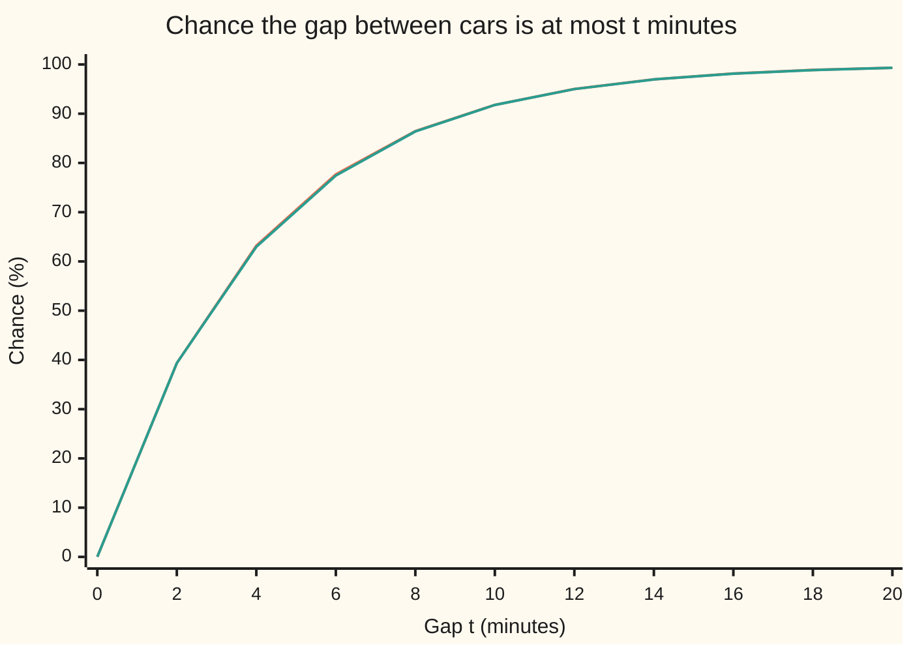
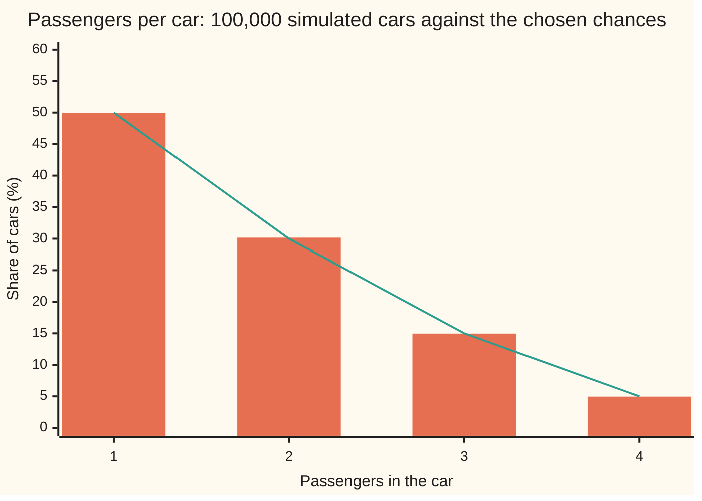

# Inverse transform: turning uniforms into any distribution with a CDF you can invert

[Syllabus](../../../SYLLABUS.md) → [Probability and statistics](../README.md) → [Simulation](../README.md#s11) → Inverse transform

---

## General Overview

A toll booth on a quiet road at night sees one car every 4 minutes on average. The cars do not coordinate, so the gap between two cars follows the exponential law ([Exponential](../04-Continuous%20Distributions/03-exponential-distribution.md)): short gaps are common, long ones rare, and a gap over 10 minutes comes about 1 time in 12. A planner wants to simulate a night at the booth, to see how often the single attendant is swamped.

The computer offers one kind of randomness: numbers spread evenly between 0 and 1, called **uniform draws** ([Random numbers from a computer](01-pseudo-random-numbers.md)). The first one from the generator used on this card is 0.827679. That is not a gap in minutes. Something has to turn an evenly spread number into a wait that is usually short and occasionally long.

The turning is done by the cumulative distribution function run backwards. The cumulative distribution function, CDF for short, takes a wait and returns the chance of a gap that short or shorter. Read the other way, it takes a chance and returns the wait with that much chance below it. Feed it 0.827679 and out comes 7.0336 minutes. Feed it 0.5 and out comes the middle gap, 2.7726 minutes. Uniform draws in, exponential waits out, with no rejected draws and no approximation. The same trick draws a whole-number count, such as passengers in the next car, by walking a staircase instead of a curve.

**Pick a chance uniformly between 0 and 1, then return the value that has exactly that much chance at or below it: the values returned follow the chosen law.**

**What kind of fact this is:** a method, whose correctness is a theorem proved on this card in Why it works.

### The picture: 100,000 simulated gaps against the law they should follow



Orange: the exponential CDF, from its formula. Green: the share of 100,000 simulated gaps at or below each value, each gap made from one uniform draw. The two lines sit on top of each other. The largest gap between them is 1.97 standard errors, where a standard error is the typical size of a simulation's chance wobble ([Monte Carlo](04-monte-carlo-estimates-and-error.md)). To read the method off the picture, start on the vertical axis at a chance, go across to the orange curve, and drop down to the gap.

---

## The formula

Notation first. A capital $U$ is a uniform draw, a random variable spread evenly on the stretch from 0 to 1; $U \sim \text{Uniform}(0,1)$ reads "U follows the uniform law on 0 to 1". A lower-case $u$ is one particular value of it. $F(x)$ is the CDF of the law wanted: the chance of a value at or below $x$. The **quantile function** $Q(u)$ is the CDF run backwards: the smallest value $x$ with at least chance $u$ at or below it.

$$Q(u) = \min\{\,x : F(x) \ge u\,\}, \qquad U \sim \text{Uniform}(0,1) \;\Longrightarrow\; P\big(Q(U) \le x\big) = F(x)$$

**Read it aloud:** the quantile of $u$ is the first value where the running chance reaches $u$; feed it a uniform draw and what comes out has CDF $F$.

When $F$ is a smooth curve that only climbs, $Q$ is the ordinary inverse: solve $F(x) = u$ for $x$. For the toll booth the gap $T$ has rate $\lambda$ cars per minute and CDF $F(t) = 1 - e^{-\lambda t}$. Solving $u = 1 - e^{-\lambda t}$ gives

$$T = Q(U) = -\frac{\ln(1 - U)}{\lambda}$$

**Read it aloud:** the gap is minus the log of one minus the uniform draw, divided by the rate.

For a count $X$ taking values $k = 1, 2, 3, 4$ with chances $p_k$, the CDF is a staircase of running totals, and $Q(u)$ is the first value whose running total reaches $u$.

| Symbol | Plain meaning | In our example | Push it up and the answer… |
| --- | --- | --- | --- |
| $U$ | a uniform draw: a random number spread evenly between 0 and 1 | first draw 0.827679 | a longer gap, or a bigger count |
| $u$ | one particular value of $U$ | 0.50 | the returned value climbs, never falls |
| $F$ | the CDF: chance of a value at or below the one given | $1 - e^{-0.25t}$ | — |
| $Q$ | the quantile function: the CDF run backwards | $Q(0.5) = 2.7726$ minutes | — |
| $T$ | the gap until the next car, in minutes | mean 4 | — |
| $x$ | one value of the law wanted, a gap or a count | 10 minutes, or 3 passengers | more chance at or below it |
| $t$ | one particular number of minutes | 10 | more chance below it |
| $\lambda$ | the rate: cars per minute | 0.25 | every gap shrinks in proportion |
| $\Phi$ | the standard normal CDF, from the normal card | no closed-form inverse | — |
| $X$ | passengers in the next car, a count | 1 to 4 | — |
| $k$ | one possible count | 3 | — |
| $p_k$ | the chance of exactly $k$ passengers | 0.50, 0.30, 0.15, 0.05 | the stair at $k$ gets taller |
| $n$ | the number of simulated draws | 100,000 | standard errors shrink like one over its square root |

### When it holds

- **The input is uniform on 0 to 1.** Feed in the square of a uniform draw instead, which crowds towards 0, and the mean gap falls from 4 minutes to 2.4548.
- **The CDF is the running total, not the separate chances.** Compare $u$ with each $p_k$ alone and the mean passenger count comes out at 2.5, not 1.75.
- **The draw never reaches the far end.** At $u = 1$ the exponential quantile is infinite. This card's generator returns at most $1 - 2^{-53}$, just short of 1, so its longest possible gap is 146.95 minutes. The true law puts chance $2^{-53}$ beyond that, far too small to matter.
- **The quantile can be computed.** The exponential's has a closed form. The normal law's does not: it needs a numerical inverse or a different method, as Why it works says at the end.
- **One draw per value, independent draws.** Each simulated gap uses its own uniform. Reusing a draw for two gaps makes them equal, not independent.

---

## Why it works

### Step 0: a uniform draw is a chance picked at random

For a uniform draw, the chance of landing at or below any number $u$ between 0 and 1 is $u$ itself: $P(U \le u) = u$. The draw lands at or below 0.50 half the time. So a uniform draw is a chance picked at random, and the CDF translates between chances and values. Going from chance to value, through the quantile, turns "chance at or below $u$ is $u$" into "chance at or below $x$ is $F(x)$". That is the whole idea; the steps below make it exact. [Uniform](../04-Continuous%20Distributions/02-uniform-distribution.md) met the rule with a short proof; this card is its home, proving it for any CDF and putting it to work on waits and counts.

### Step 1: invert the exponential CDF

The chance that a gap is at most $t$ minutes is $F(t) = 1 - e^{-0.25t}$. Set that equal to a chance $u$ and solve for $t$:

$$u = 1 - e^{-0.25t} \;\Longrightarrow\; e^{-0.25t} = 1 - u \;\Longrightarrow\; t = -\frac{\ln(1-u)}{0.25}$$

At $u = 0.5$: $1 - u = 0.5$, $\ln 0.5 = -0.6931$, and $t = 0.6931 / 0.25 = 2.7726$ minutes. Half of all gaps are shorter than that. At $u = 0.99$ the gap is 18.4207 minutes: only 1 gap in 100 is longer.

### Step 2: the proof, when the CDF only climbs

Take any gap length $t$. The quantile climbs as $u$ climbs, because a larger chance needs a longer gap to accumulate. So the quantile of $U$ is at most $t$ exactly when $U$ itself is at most $F(t)$:

$$Q(U) \le t \iff U \le F(t)$$

The two sides describe the same event, so they have the same chance. The right side has chance $F(t)$ by Step 0. Therefore

$$P(T \le t) = P\big(U \le F(t)\big) = F(t).$$

The simulated gaps have exactly the CDF wanted, for every $t$ at once. With $t = 10$: the chance of a gap over 10 minutes is $e^{-2.5} = 0.0821$, and 8.22 percent of the simulated gaps exceed 10 minutes.

### Step 3: a count is a staircase, and each stair has the right width

Passengers per car: 1 with chance 0.50, 2 with 0.30, 3 with 0.15, 4 with 0.05. The running totals are 0.50, 0.80, 0.95, 1.00. They cut the stretch from 0 to 1 into four pieces:

| Draw $u$ lands in | Returns | Width of the piece |
| --- | --- | --- |
| 0 to 0.50 | 1 passenger | 0.50 |
| 0.50 to 0.80 | 2 passengers | 0.30 |
| 0.80 to 0.95 | 3 passengers | 0.15 |
| 0.95 to 1 | 4 passengers | 0.05 |

A uniform draw lands in a piece with chance equal to its width, by Step 0. Each width is one $p_k$, so each count comes out with its own chance. A draw of 0.87 passes 0.50 and 0.80, first reaches 0.95, and returns 3.

### The picture: the passenger staircase, simulated



Orange bars: the share of 100,000 simulated cars with each count, one uniform draw per car. Green line: the chances chosen, 50, 30, 15 and 5 percent. Every bar is within 4 standard errors of its target; the standard errors are 0.16, 0.14, 0.11 and 0.07 percentage points.

### Step 4: one rule covers curves, stairs and flat stretches

The exponential CDF is a smooth climb; the passenger CDF jumps at each count and stays flat between counts. Solving $F(x) = u$ fails on a staircase: at $u = 0.87$ no count has running total exactly 0.87. It also fails on a flat stretch, where many values share one running total. The rule "the smallest $x$ with $F(x) \ge u$" never fails. At a jump it returns the value where the total first reaches $u$. On a flat stretch it returns the left end. And for every law and every $x$,

$$Q(u) \le x \iff u \le F(x),$$

which is all Step 2 used. So the proof in Step 2 goes through word for word, for any CDF whatever.

<details>
<summary>Detailed proof: the smallest value exists, and the equivalence holds</summary>

Fix $u$ strictly between 0 and 1, and call the values $x$ with $F(x) \ge u$ the qualifying values. Every CDF climbs (never falls), tends to 0 far to the left and to 1 far to the right ([Densities](../04-Continuous%20Distributions/01-densities-and-cdfs.md)), and is right-continuous: at each point it equals its limit from the right ([Random variables](../02-Random%20Variables/01-random-variables-and-distributions.md)).

**Some value qualifies.** $F$ tends to 1 and $u < 1$, so far enough right $F(x) \ge u$.

**The qualifying values have a left end.** $F$ tends to 0 and $u > 0$, so far enough left some value has $F$ below $u$. Every qualifying value lies to the right of it, since $F$ never falls. So the qualifying values are bounded on the left, and because $F$ never falls, everything to the right of a qualifying value qualifies too: together they form a stretch running off to the right, with a left end.

**The left end qualifies.** Take qualifying values closing in on the left end from the right. Each has $F \ge u$. Right-continuity makes $F$ at the left end the limit of those values, so it is at least $u$ and the left end qualifies. So the minimum exists; it is $Q(u)$.

**The equivalence.** If $u \le F(x)$ then $x$ qualifies, so $Q(u) \le x$. If $Q(u) \le x$ then $F(x) \ge F(Q(u)) \ge u$, since $F$ never falls. So $Q(u) \le x$ exactly when $u \le F(x)$.

**The law.** A uniform $U$ lands strictly between 0 and 1 with chance 1, and for those draws the events $Q(U) \le x$ and $U \le F(x)$ coincide. Hence $P(Q(U) \le x) = P(U \le F(x)) = F(x)$ for every $x$. Two laws with the same CDF are the same law ([Densities](../04-Continuous%20Distributions/01-densities-and-cdfs.md)), so $Q(U)$ has the chosen law.

</details>

<details>
<summary>The same fact read backwards</summary>

If a quantity $X$ has a CDF with no jumps, then $F(X)$ is uniform on 0 to 1: the chance that $F(X) \le u$ is $u$. Feeding each observed toll-booth gap through $1 - e^{-0.25t}$ should give numbers spread evenly between 0 and 1; if they bunch, the exponential law is wrong for that road. This reverse direction is called the probability integral transform, and it underlies goodness-of-fit checks (tests of whether data follow a proposed law) and copulas (recipes for joining several laws into one). With jumps it fails: the passenger CDF turns every car into one of only four numbers.

</details>

A second route is needed when the quantile has no formula. The standard normal law's CDF, written $\Phi$ on [Normal](../04-Continuous%20Distributions/04-normal-distribution.md), has no closed-form inverse, so $\Phi^{-1}(u)$ must be found by solving $\Phi(x) = u$ numerically ([Normal quantiles](../04-Continuous%20Distributions/05-normal-quantile.md)), one root-find per draw. Methods that avoid the inverse altogether are on [Rejection sampling and Box-Muller](03-rejection-sampling-and-box-muller.md).

---

## Worked numbers, by hand

The toll booth, rate 0.25 cars per minute, then one passenger count.

| Step | Arithmetic | Value |
| --- | --- | --- |
| the quantile | solve $u = 1 - e^{-0.25t}$ for $t$ | $t = -\ln(1-u)/0.25$ |
| $u = 0.10$ | $-\ln 0.90 / 0.25 = 0.1054/0.25$ | 0.4214 min |
| $u = 0.50$ | $-\ln 0.50 / 0.25 = 0.6931/0.25$ | 2.7726 min |
| $u = 0.90$ | $-\ln 0.10 / 0.25 = 2.3026/0.25$ | 9.2103 min |
| first generator draw, 0.827679 | $-\ln(1 - 0.827679) / 0.25$ | 7.0336 min |
| mean gap, exact | $1/\lambda = 1/0.25$ | 4.0000 min |
| mean gap, 100,000 draws | average of the simulated gaps | **4.0154 min, standard error 0.0127** |
| passengers, $u = 0.87$ | running totals 0.50, 0.80, 0.95: first to reach 0.87 | **3** |

The simulated mean sits 1.22 standard errors from the true 4 minutes, well inside the ordinary wobble of 100,000 draws: the planner's simulated night has the right rhythm of cars.

### What breaks if you drop a piece

| Mistake | Comes out at | What went wrong |
| --- | --- | --- |
| Multiply by the rate instead of dividing, $-\lambda \ln(1-U)$ | mean gap 0.2500 min, simulated 0.2510 | The rate, 0.25 cars per minute, took the place of the mean gap, 4 minutes |
| Feed in $U$ squared, not $U$ | mean gap 2.4548 min, simulated 2.4680 | The input is no longer uniform: squaring crowds draws towards 0 |
| Compare $u$ with each chance, not the running totals | mean 2.5000 passengers, simulated 2.5029 | Draws above 0.50 fail every test and fall through to 4 |

The exact mean for the squared input is $4(2 - 2\ln 2)$, from integrating $-\ln(1 - u^2)$ over 0 to 1; the code also gets it by a grid. The third mistake returns 1 or 4 passengers, half the time each. The code prints all three and asserts each simulated mean against its exact value.

---

## Code, from first principles, and it actually runs

Nothing is imported except the logarithm, exponential and square root. Every uniform draw comes from SplitMix64, a small generator written out in both languages with seed 20260929, so the two programs draw identical numbers. The answer is reached three ways that share no arithmetic beyond the quantile itself: the exact formula; a grid of 100,000 evenly spaced values of $u$ pushed through the quantile, which averages it by the midpoint rule (each slice of width 1/100,000 represented by its centre) with no randomness at all; and a seeded simulation of 100,000 gaps and 100,000 cars, every estimate printed with its standard error. The asserts compare grid and simulation against the formulas, allowing 4 standard errors for anything simulated.

### Python

```python
# Inverse transform sampling -- the check behind the card.  Nothing is imported
# but math.log, math.exp and math.sqrt.  Uniform draws come from SplitMix64,
# written out below with seed 20260929, so the Rust program draws the same
# numbers.  Three roads: the exact formula, a grid of evenly spaced u values
# pushed through the quantile, and a seeded simulation with standard errors.
from math import log, exp, sqrt

MASK = (1 << 64) - 1
class SplitMix64:
    def __init__(self, seed):
        self.state = seed
    def uniform(self):                     # a number in [0, 1), 53 random bits
        self.state = (self.state + 0x9E3779B97F4A7C15) & MASK
        z = self.state
        z = ((z ^ (z >> 30)) * 0xBF58476D1CE4E5B9) & MASK
        z = ((z ^ (z >> 27)) * 0x94D049BB133111EB) & MASK
        z ^= z >> 31
        return (z >> 11) / 9007199254740992.0

LAM = 0.25                                 # cars per minute: one every 4 minutes
def wait(u):                               # the exponential quantile
    return -log(1.0 - u) / LAM
def cdf(t):
    return 1.0 - exp(-LAM * t)

VALUES, CHANCES = [1, 2, 3, 4], [0.50, 0.30, 0.15, 0.05]
CUMUL = [sum(CHANCES[:i + 1]) for i in range(4)]
def passengers(u):                         # first value whose running total reaches u
    for v, c in zip(VALUES, CUMUL):
        if u <= c:
            return v
    return VALUES[-1]
def passengers_uncumulated(u):             # mistake: compares u with each chance alone
    for v, p in zip(VALUES, CHANCES):
        if u <= p:
            return v
    return VALUES[-1]

def mean_se(xs):
    m = sum(xs) / len(xs)
    var = sum((x - m) ** 2 for x in xs) / (len(xs) - 1)
    return m, sqrt(var / len(xs))

N = 100000
rng = SplitMix64(20260929)
us = [rng.uniform() for _ in range(N)]
vs = [rng.uniform() for _ in range(N)]
waits = [wait(u) for u in us]
grid = [(i + 0.5) / N for i in range(N)]   # evenly spaced u, no randomness

print(f"toll booth: rate lambda = {LAM} cars per minute, mean gap {1 / LAM:.4f} min")
print("first five draws (SplitMix64, seed 20260929):")
for u in us[:5]:
    print(f"  u = {u:.6f}  ->  wait {wait(u):.4f} min")
for u in (0.10, 0.50, 0.90, 0.99):
    print(f"hand case: u = {u:.2f}, 1 - u = {1 - u:.2f}, ln(1 - u) = {log(1 - u):.4f}, wait = {wait(u):.4f} min")

m_exact = 1 / LAM
m_grid = sum(wait(u) for u in grid) / N
m_sim, se_sim = mean_se(waits)
print(f"mean wait    exact 1/lambda {m_exact:.4f} | grid {m_grid:.4f} | sim {m_sim:.4f} (SE {se_sim:.4f})")
srt = sorted(waits)
med_sim = (srt[N // 2 - 1] + srt[N // 2]) / 2
flip_sim, flip_se = mean_se([-log(1.0 - u) / LAM for u in [1.0 - u for u in us]])
print(f"variant -ln(u) / lambda, since 1 - U is uniform too: sim mean {flip_sim:.4f} (SE {flip_se:.4f})")
print(f"distance from 1/lambda in standard errors: sim {(m_sim - 1 / LAM) / se_sim:.2f}, variant {(flip_sim - 1 / LAM) / flip_se:.2f}")
print(f"median wait  exact ln 2 / lambda {log(2) / LAM:.4f} | grid {wait(0.5):.4f} | sim {med_sim:.4f}")
p10 = exp(-10 * LAM)
p10_grid = sum(1 for u in grid if wait(u) > 10) / N
p10_sim = sum(1 for w in waits if w > 10) / N
se10 = sqrt(p10 * (1 - p10) / N)
print(f"P(T > 10)    exact e^(-10 lambda) {p10:.4f} | grid {p10_grid:.4f} | sim {p10_sim:.4f} (SE {se10:.4f})")

ts = list(range(0, 21, 2))
f_exact = [cdf(t) for t in ts]
f_sim = [sum(1 for w in waits if w <= t) / N for t in ts]
print("chart t (min): " + ", ".join(str(t) for t in ts))
print("chart exact F(t) %: " + ", ".join(f"{100 * f:.2f}" for f in f_exact))
print("chart sim F(t) %:   " + ", ".join(f"{100 * f:.2f}" for f in f_sim))
worst = max(abs(a - b) / sqrt(max(a * (1 - a), 1e-12) / N) for a, b in zip(f_exact, f_sim) if 0 < a)
print(f"largest CDF gap, in standard errors: {worst:.2f}")

print("passengers per car: values 1, 2, 3, 4; chances 0.50, 0.30, 0.15, 0.05")
print("running totals: " + ", ".join(f"{c:.2f}" for c in CUMUL))
for u in (0.30, 0.50, 0.87, 0.97):
    print(f"hand case: u = {u:.2f} -> passengers {passengers(u)}")
g_counts = [0] * 4
for u in [(i + 0.5) / 1000 for i in range(1000)]:
    g_counts[passengers(u) - 1] += 1
s_counts = [0] * 4
for v in vs:
    s_counts[passengers(v) - 1] += 1
print("grid counts over 1000 evenly spaced u: " + ", ".join(str(c) for c in g_counts))
print("exact shares %: " + ", ".join(f"{100 * p:.2f}" for p in CHANCES))
print("sim shares %: " + ", ".join(f"{100 * c / N:.2f}" for c in s_counts))
print("sim SE %:     " + ", ".join(f"{100 * sqrt(p * (1 - p) / N):.2f}" for p in CHANCES))
d_exact = sum(v * p for v, p in zip(VALUES, CHANCES))
d_sim, d_se = mean_se([passengers(v) for v in vs])
print(f"mean passengers  exact {d_exact:.4f} | grid {sum(k * c for k, c in zip(VALUES, g_counts)) / 1000:.4f} | sim {d_sim:.4f} (SE {d_se:.4f})")

wrong_rate, wr_se = mean_se([-LAM * log(1 - u) for u in us])
sq_exact = (2 - 2 * log(2)) / LAM          # integral of -ln(1 - u^2), divided by lambda
sq_grid = sum(wait(u * u) for u in grid) / N
sq_sim, sq_se = mean_se([wait(u * u) for u in us])
unc_sim, unc_se = mean_se([passengers_uncumulated(v) for v in vs])
unc_p, top = [], 0.0                       # chance each value is returned by the mistake
for p in CHANCES:
    unc_p.append(max(0.0, p - top)); top = max(top, p)
unc_p[-1] += 1 - top                       # every draw above the largest chance falls to 4
unc_exact = sum(v * q for v, q in zip(VALUES, unc_p))
print(f"mistake 1, rate used as the mean gap: mean {LAM:.4f} exact | {wrong_rate:.4f} sim (SE {wr_se:.4f})")
print(f"mistake 2, u squared fed in: mean {sq_exact:.4f} exact | {sq_grid:.4f} grid | {sq_sim:.4f} sim (SE {sq_se:.4f})")
print(f"mistake 3, chances not added up: mean {unc_exact:.4f} exact | {unc_sim:.4f} sim (SE {unc_se:.4f})")
print(f"longest possible wait from a 53-bit uniform: {wait(1 - 2.0 ** -53):.2f} min")

assert abs(m_grid - 1 / LAM) < 1e-3                         # grid of u vs the formula 1/lambda
assert abs(m_sim - 1 / LAM) < 4 * se_sim                     # simulation vs the formula
assert abs(flip_sim - 1 / LAM) < 4 * flip_se                 # the flipped input, same law
assert abs(p10_sim - p10) < 4 * se10 and worst < 4.0         # whole CDF within 4 SE
assert g_counts == [round(1000 * p) for p in CHANCES]        # grid counts vs the chances
assert all(abs(c / N - p) < 4 * sqrt(p * (1 - p) / N) for c, p in zip(s_counts, CHANCES))
assert abs(sq_sim - sq_exact) < 4 * sq_se and abs(sq_grid - sq_exact) < 1e-3
assert abs(d_sim - d_exact) < 4 * d_se and abs(unc_sim - unc_exact) < 4 * unc_se
assert abs(wrong_rate - LAM) < 4 * wr_se                     # mistake 1 lands on lambda, not 1/lambda
print("ALL CHECKS PASS")
```

**Ran 2026-10-06 on macOS, Python 3.14.6, standard library only. All checks passed. Output, pasted from the run:**

```
toll booth: rate lambda = 0.25 cars per minute, mean gap 4.0000 min
first five draws (SplitMix64, seed 20260929):
  u = 0.827679  ->  wait 7.0336 min
  u = 0.175609  ->  wait 0.7724 min
  u = 0.336530  ->  wait 1.6411 min
  u = 0.289668  ->  wait 1.3681 min
  u = 0.526137  ->  wait 2.9873 min
hand case: u = 0.10, 1 - u = 0.90, ln(1 - u) = -0.1054, wait = 0.4214 min
hand case: u = 0.50, 1 - u = 0.50, ln(1 - u) = -0.6931, wait = 2.7726 min
hand case: u = 0.90, 1 - u = 0.10, ln(1 - u) = -2.3026, wait = 9.2103 min
hand case: u = 0.99, 1 - u = 0.01, ln(1 - u) = -4.6052, wait = 18.4207 min
mean wait    exact 1/lambda 4.0000 | grid 4.0000 | sim 4.0154 (SE 0.0127)
variant -ln(u) / lambda, since 1 - U is uniform too: sim mean 3.9851 (SE 0.0126)
distance from 1/lambda in standard errors: sim 1.22, variant -1.19
median wait  exact ln 2 / lambda 2.7726 | grid 2.7726 | sim 2.7831
P(T > 10)    exact e^(-10 lambda) 0.0821 | grid 0.0821 | sim 0.0822 (SE 0.0009)
chart t (min): 0, 2, 4, 6, 8, 10, 12, 14, 16, 18, 20
chart exact F(t) %: 0.00, 39.35, 63.21, 77.69, 86.47, 91.79, 95.02, 96.98, 98.17, 98.89, 99.33
chart sim F(t) %:   0.00, 39.35, 62.97, 77.43, 86.39, 91.78, 95.00, 96.96, 98.14, 98.86, 99.32
largest CDF gap, in standard errors: 1.97
passengers per car: values 1, 2, 3, 4; chances 0.50, 0.30, 0.15, 0.05
running totals: 0.50, 0.80, 0.95, 1.00
hand case: u = 0.30 -> passengers 1
hand case: u = 0.50 -> passengers 1
hand case: u = 0.87 -> passengers 3
hand case: u = 0.97 -> passengers 4
grid counts over 1000 evenly spaced u: 500, 300, 150, 50
exact shares %: 50.00, 30.00, 15.00, 5.00
sim shares %: 49.90, 30.17, 14.96, 4.96
sim SE %:     0.16, 0.14, 0.11, 0.07
mean passengers  exact 1.7500 | grid 1.7500 | sim 1.7499 (SE 0.0028)
mistake 1, rate used as the mean gap: mean 0.2500 exact | 0.2510 sim (SE 0.0008)
mistake 2, u squared fed in: mean 2.4548 exact | 2.4548 grid | 2.4680 sim (SE 0.0107)
mistake 3, chances not added up: mean 2.5000 exact | 2.5029 sim (SE 0.0047)
longest possible wait from a 53-bit uniform: 146.95 min
ALL CHECKS PASS
```

### Rust

Same draws, same labels, built with `rustc --edition 2021 -O`.

```rust
// Inverse transform sampling -- the same check as the Python, in Rust.  No
// crates.  Uniform draws come from SplitMix64, written out below with seed
// 20260929, so both programs draw the same numbers.  Three roads: the exact
// formula, a grid of evenly spaced u values pushed through the quantile, and a
// seeded simulation with standard errors.
struct SplitMix64(u64);
impl SplitMix64 {
    fn uniform(&mut self) -> f64 {                 // a number in [0, 1), 53 random bits
        self.0 = self.0.wrapping_add(0x9E3779B97F4A7C15);
        let mut z = self.0;
        z = (z ^ (z >> 30)).wrapping_mul(0xBF58476D1CE4E5B9);
        z = (z ^ (z >> 27)).wrapping_mul(0x94D049BB133111EB);
        z ^= z >> 31;
        (z >> 11) as f64 / 9007199254740992.0
    }
}

const LAM: f64 = 0.25;                             // cars per minute: one every 4 minutes
const VALUES: [usize; 4] = [1, 2, 3, 4];
const CHANCES: [f64; 4] = [0.50, 0.30, 0.15, 0.05];

fn wait(u: f64) -> f64 { -(1.0 - u).ln() / LAM }   // the exponential quantile
fn cdf(t: f64) -> f64 { 1.0 - (-LAM * t).exp() }

fn cumul() -> [f64; 4] {
    let mut c = [0.0; 4];
    let mut run = 0.0;
    for i in 0..4 { run += CHANCES[i]; c[i] = run; }
    c
}
fn passengers(u: f64) -> usize {                   // first value whose running total reaches u
    let c = cumul();
    for i in 0..4 { if u <= c[i] { return VALUES[i]; } }
    VALUES[3]
}
fn passengers_uncumulated(u: f64) -> usize {       // mistake: compares u with each chance alone
    for i in 0..4 { if u <= CHANCES[i] { return VALUES[i]; } }
    VALUES[3]
}

fn mean_se(xs: &[f64]) -> (f64, f64) {
    let n = xs.len() as f64;
    let m = xs.iter().sum::<f64>() / n;
    let var = xs.iter().map(|x| (x - m) * (x - m)).sum::<f64>() / (n - 1.0);
    (m, (var / n).sqrt())
}
fn join(xs: &[f64], scale: f64) -> String {
    xs.iter().map(|x| format!("{:.2}", scale * x)).collect::<Vec<_>>().join(", ")
}

fn main() {
    const N: usize = 100000;
    let nf = N as f64;
    let mut rng = SplitMix64(20260929);
    let us: Vec<f64> = (0..N).map(|_| rng.uniform()).collect();
    let vs: Vec<f64> = (0..N).map(|_| rng.uniform()).collect();
    let waits: Vec<f64> = us.iter().map(|&u| wait(u)).collect();
    let grid: Vec<f64> = (0..N).map(|i| (i as f64 + 0.5) / nf).collect();

    println!("toll booth: rate lambda = {} cars per minute, mean gap {:.4} min", LAM, 1.0 / LAM);
    println!("first five draws (SplitMix64, seed 20260929):");
    for &u in &us[..5] { println!("  u = {:.6}  ->  wait {:.4} min", u, wait(u)); }
    for u in [0.10f64, 0.50, 0.90, 0.99] {
        println!("hand case: u = {:.2}, 1 - u = {:.2}, ln(1 - u) = {:.4}, wait = {:.4} min", u, 1.0 - u, (1.0 - u).ln(), wait(u));
    }

    let m_exact = 1.0 / LAM;
    let m_grid = grid.iter().map(|&u| wait(u)).sum::<f64>() / nf;
    let (m_sim, se_sim) = mean_se(&waits);
    println!("mean wait    exact 1/lambda {:.4} | grid {:.4} | sim {:.4} (SE {:.4})", m_exact, m_grid, m_sim, se_sim);
    let (flip_sim, flip_se) = mean_se(&us.iter().map(|&u| wait(1.0 - u)).collect::<Vec<_>>());
    println!("variant -ln(u) / lambda, since 1 - U is uniform too: sim mean {:.4} (SE {:.4})", flip_sim, flip_se);
    println!("distance from 1/lambda in standard errors: sim {:.2}, variant {:.2}", (m_sim - 1.0 / LAM) / se_sim, (flip_sim - 1.0 / LAM) / flip_se);
    let mut srt = waits.clone();
    srt.sort_by(|a, b| a.partial_cmp(b).unwrap());
    let med_sim = (srt[N / 2 - 1] + srt[N / 2]) / 2.0;
    println!("median wait  exact ln 2 / lambda {:.4} | grid {:.4} | sim {:.4}", 2f64.ln() / LAM, wait(0.5), med_sim);
    let p10 = (-10.0 * LAM).exp();
    let p10_grid = grid.iter().filter(|&&u| wait(u) > 10.0).count() as f64 / nf;
    let p10_sim = waits.iter().filter(|&&w| w > 10.0).count() as f64 / nf;
    let se10 = (p10 * (1.0 - p10) / nf).sqrt();
    println!("P(T > 10)    exact e^(-10 lambda) {:.4} | grid {:.4} | sim {:.4} (SE {:.4})", p10, p10_grid, p10_sim, se10);

    let ts: Vec<f64> = (0..11).map(|k| 2.0 * k as f64).collect();
    let f_exact: Vec<f64> = ts.iter().map(|&t| cdf(t)).collect();
    let f_sim: Vec<f64> = ts.iter().map(|&t| waits.iter().filter(|&&w| w <= t).count() as f64 / nf).collect();
    println!("chart t (min): {}", ts.iter().map(|t| format!("{}", t)).collect::<Vec<_>>().join(", "));
    println!("chart exact F(t) %: {}", join(&f_exact, 100.0));
    println!("chart sim F(t) %:   {}", join(&f_sim, 100.0));
    let worst = f_exact.iter().zip(&f_sim).filter(|(a, _)| **a > 0.0)
        .map(|(a, b)| (a - b).abs() / (a * (1.0 - a) / nf).sqrt()).fold(0.0, f64::max);
    println!("largest CDF gap, in standard errors: {:.2}", worst);

    println!("passengers per car: values 1, 2, 3, 4; chances 0.50, 0.30, 0.15, 0.05");
    println!("running totals: {}", join(&cumul(), 1.0));
    for u in [0.30, 0.50, 0.87, 0.97] { println!("hand case: u = {:.2} -> passengers {}", u, passengers(u)); }
    let mut g_counts = [0usize; 4];
    for i in 0..1000 { g_counts[passengers((i as f64 + 0.5) / 1000.0) - 1] += 1; }
    let mut s_counts = [0usize; 4];
    for &v in &vs { s_counts[passengers(v) - 1] += 1; }
    println!("grid counts over 1000 evenly spaced u: {}", g_counts.iter().map(|c| c.to_string()).collect::<Vec<_>>().join(", "));
    let shares: Vec<f64> = s_counts.iter().map(|&c| c as f64 / nf).collect();
    let ses: Vec<f64> = CHANCES.iter().map(|p| (p * (1.0 - p) / nf).sqrt()).collect();
    println!("exact shares %: {}", join(&CHANCES, 100.0));
    println!("sim shares %: {}", join(&shares, 100.0));
    println!("sim SE %:     {}", join(&ses, 100.0));
    let d_exact: f64 = (0..4).map(|i| VALUES[i] as f64 * CHANCES[i]).sum();
    let d_grid = (0..4).map(|i| (VALUES[i] * g_counts[i]) as f64).sum::<f64>() / 1000.0;
    let (d_sim, d_se) = mean_se(&vs.iter().map(|&v| passengers(v) as f64).collect::<Vec<_>>());
    println!("mean passengers  exact {:.4} | grid {:.4} | sim {:.4} (SE {:.4})", d_exact, d_grid, d_sim, d_se);

    let (wrong_rate, wr_se) = mean_se(&us.iter().map(|&u| -LAM * (1.0 - u).ln()).collect::<Vec<_>>());
    let sq_exact = (2.0 - 2.0 * 2f64.ln()) / LAM;  // integral of -ln(1 - u^2), divided by lambda
    let sq_grid = grid.iter().map(|&u| wait(u * u)).sum::<f64>() / nf;
    let (sq_sim, sq_se) = mean_se(&us.iter().map(|&u| wait(u * u)).collect::<Vec<_>>());
    let (unc_sim, unc_se) = mean_se(&vs.iter().map(|&v| passengers_uncumulated(v) as f64).collect::<Vec<_>>());
    let (mut unc_p, mut top) = ([0.0f64; 4], 0.0f64);   // chance each value is returned by the mistake
    for i in 0..4 { unc_p[i] = (CHANCES[i] - top).max(0.0); top = top.max(CHANCES[i]); }
    unc_p[3] += 1.0 - top;                         // every draw above the largest chance falls to 4
    let unc_exact: f64 = (0..4).map(|i| VALUES[i] as f64 * unc_p[i]).sum();
    println!("mistake 1, rate used as the mean gap: mean {:.4} exact | {:.4} sim (SE {:.4})", LAM, wrong_rate, wr_se);
    println!("mistake 2, u squared fed in: mean {:.4} exact | {:.4} grid | {:.4} sim (SE {:.4})", sq_exact, sq_grid, sq_sim, sq_se);
    println!("mistake 3, chances not added up: mean {:.4} exact | {:.4} sim (SE {:.4})", unc_exact, unc_sim, unc_se);
    println!("longest possible wait from a 53-bit uniform: {:.2} min", wait(1.0 - 2f64.powi(-53)));

    assert!((m_grid - 1.0 / LAM).abs() < 1e-3);                      // grid of u vs the formula 1/lambda
    assert!((m_sim - 1.0 / LAM).abs() < 4.0 * se_sim);               // simulation vs the formula
    assert!((flip_sim - 1.0 / LAM).abs() < 4.0 * flip_se);           // the flipped input, same law
    assert!((p10_sim - p10).abs() < 4.0 * se10 && worst < 4.0);
    let expect: Vec<usize> = CHANCES.iter().map(|p| (1000.0 * p).round() as usize).collect();
    assert!(g_counts.to_vec() == expect);                            // grid counts vs the chances
    assert!((0..4).all(|i| (shares[i] - CHANCES[i]).abs() < 4.0 * ses[i]));
    assert!((sq_sim - sq_exact).abs() < 4.0 * sq_se && (sq_grid - sq_exact).abs() < 1e-3);
    assert!((d_sim - d_exact).abs() < 4.0 * d_se && (unc_sim - unc_exact).abs() < 4.0 * unc_se);
    assert!((wrong_rate - LAM).abs() < 4.0 * wr_se);                // mistake 1 lands on lambda, not 1/lambda
    println!("ALL CHECKS PASS");
}
```

**Ran 2026-10-06 on macOS, rustc 1.98.1, no crates. All checks passed. Output, pasted from the run:**

```
toll booth: rate lambda = 0.25 cars per minute, mean gap 4.0000 min
first five draws (SplitMix64, seed 20260929):
  u = 0.827679  ->  wait 7.0336 min
  u = 0.175609  ->  wait 0.7724 min
  u = 0.336530  ->  wait 1.6411 min
  u = 0.289668  ->  wait 1.3681 min
  u = 0.526137  ->  wait 2.9873 min
hand case: u = 0.10, 1 - u = 0.90, ln(1 - u) = -0.1054, wait = 0.4214 min
hand case: u = 0.50, 1 - u = 0.50, ln(1 - u) = -0.6931, wait = 2.7726 min
hand case: u = 0.90, 1 - u = 0.10, ln(1 - u) = -2.3026, wait = 9.2103 min
hand case: u = 0.99, 1 - u = 0.01, ln(1 - u) = -4.6052, wait = 18.4207 min
mean wait    exact 1/lambda 4.0000 | grid 4.0000 | sim 4.0154 (SE 0.0127)
variant -ln(u) / lambda, since 1 - U is uniform too: sim mean 3.9851 (SE 0.0126)
distance from 1/lambda in standard errors: sim 1.22, variant -1.19
median wait  exact ln 2 / lambda 2.7726 | grid 2.7726 | sim 2.7831
P(T > 10)    exact e^(-10 lambda) 0.0821 | grid 0.0821 | sim 0.0822 (SE 0.0009)
chart t (min): 0, 2, 4, 6, 8, 10, 12, 14, 16, 18, 20
chart exact F(t) %: 0.00, 39.35, 63.21, 77.69, 86.47, 91.79, 95.02, 96.98, 98.17, 98.89, 99.33
chart sim F(t) %:   0.00, 39.35, 62.97, 77.43, 86.39, 91.78, 95.00, 96.96, 98.14, 98.86, 99.32
largest CDF gap, in standard errors: 1.97
passengers per car: values 1, 2, 3, 4; chances 0.50, 0.30, 0.15, 0.05
running totals: 0.50, 0.80, 0.95, 1.00
hand case: u = 0.30 -> passengers 1
hand case: u = 0.50 -> passengers 1
hand case: u = 0.87 -> passengers 3
hand case: u = 0.97 -> passengers 4
grid counts over 1000 evenly spaced u: 500, 300, 150, 50
exact shares %: 50.00, 30.00, 15.00, 5.00
sim shares %: 49.90, 30.17, 14.96, 4.96
sim SE %:     0.16, 0.14, 0.11, 0.07
mean passengers  exact 1.7500 | grid 1.7500 | sim 1.7499 (SE 0.0028)
mistake 1, rate used as the mean gap: mean 0.2500 exact | 0.2510 sim (SE 0.0008)
mistake 2, u squared fed in: mean 2.4548 exact | 2.4548 grid | 2.4680 sim (SE 0.0107)
mistake 3, chances not added up: mean 2.5000 exact | 2.5029 sim (SE 0.0047)
longest possible wait from a 53-bit uniform: 146.95 min
ALL CHECKS PASS
```

The two outputs match line for line.

> [!TIP]
> **Try changing**
> Guess first, then run it.
> - **A busier road.** Set `LAM = 0.5`. Guess: every gap halves, and the mean with it. It does: the mean comes out at 2.0077 against an exact 2, and every assert passes, since each exact value is worked out from `LAM`.
> - **Flip the input.** The variant line already feeds in $1 - U$ in place of $U$, the form $-\ln(U)/\lambda$ seen in many textbooks. Guess: the individual gaps change, the law does not. The mean comes out at 3.9851, 1.19 standard errors below 4.
> - **Equal passenger chances.** Set `CHANCES` to four equal chances of 0.25. Guess the mean count. The grid gives four equal counts and the mean becomes 2.5. All asserts pass, since each compares against `CHANCES`. Mistake 3 moves to 3.25: every draw above 0.25 now falls through to 4.
> - **Forget the running total.** Set `CUMUL = CHANCES`. The fifth assert stops it: the grid counts no longer match the chances.

---

## The usual mistake

> [!warning]
> **Plugging the uniform draw into the CDF instead of its inverse.** The CDF takes a value and returns a chance; the sampler needs the opposite direction. $1 - e^{-0.25u}$ for $u$ between 0 and 1 gives numbers below $1 - e^{-0.25}$: all chances, none of them minutes. The method runs the CDF backwards: a chance in, a value out.
>
> - **Rate used as mean.** $-0.25 \ln(1-u)$ gives a mean gap of 0.2500 minutes against the true 4.
> - **Separate chances used as the staircase.** Testing $u \le 0.50$, then $u \le 0.30$, then $u \le 0.15$ never catches a draw above 0.50, so the mean count is 2.5000, not 1.75.
> - **A non-uniform input.** Squared draws, or draws from a flawed generator, give the wrong law with no error message; here the mean gap is 2.4548 minutes, not 4.
> - **Letting the draw reach 1.** $-\ln(1 - 1)$ is infinite. Generators that return values in $[0, 1)$, as this card's does, are safe with $1 - U$; one that can return exactly 1 needs that value excluded.

---

## Where you meet it in real life

- **Queues and traffic.** Arrival gaps at booths, call centres and server farms are drawn as $-\ln(1-U)/\lambda$, one line per customer; the gap law itself is on [Exponential](../04-Continuous%20Distributions/03-exponential-distribution.md).
- **Discrete events in games and surveys.** A loot table, a weighted menu of outcomes, or a survey's category mix is sampled by walking the running totals, as the passenger staircase does.
- **Reliability and credit.** A failure time or a default time with a known survival curve is drawn by inverting it; the finance version is [Simulating a default time](../../12-Financial%20mathematics/41-Default%2C%20Survival%20and%20the%20Hazard%20Rate/05-simulating-a-default-time.md).
- **Normal draws in bulk.** Many numerical libraries draw normals as $\Phi^{-1}(U)$ with a fast approximate inverse ([Normal quantiles](../04-Continuous%20Distributions/05-normal-quantile.md)); evenly spread inputs then stay evenly spread, which [Variance reduction](05-variance-reduction.md) exploits.

> **Say it back**
> A uniform draw is a chance picked at random: it lands at or below any number $u$ between 0 and 1 with chance $u$. Running the CDF backwards turns that chance into a value, and the value at or below $x$ comes out exactly when the draw is at or below $F(x)$, which has chance $F(x)$. So the values follow the chosen law. For exponential gaps the backwards CDF is $-\ln(1-u)/\lambda$; for a count it is "the first value whose running total reaches $u$". The method needs a uniform input and a quantile that can be computed.

---

## What this builds on

- [Random numbers from a computer](01-pseudo-random-numbers.md): the uniform draws, and the SplitMix64 generator that makes them.
- [Densities](../04-Continuous%20Distributions/01-densities-and-cdfs.md): the CDF, and the fact that it climbs from 0 to 1.
- [Random variables](../02-Random%20Variables/01-random-variables-and-distributions.md): the running total F of any random variable, and the proof that it is right-continuous, which the general case needs.

## Where this goes next

- [Rejection sampling and Box-Muller](03-rejection-sampling-and-box-muller.md): sampling when the quantile has no formula, by keeping some proposals and by a change of variables for the normal.
- [Simulating a default time](../../12-Financial%20mathematics/41-Default%2C%20Survival%20and%20the%20Hazard%20Rate/05-simulating-a-default-time.md): this card's exponential step, applied to a company's survival curve.

The exponential and the staircase invert by hand, but the normal law, the one simulations need most, has no quantile formula; how to draw it without one is [Rejection sampling and Box-Muller](03-rejection-sampling-and-box-muller.md).

---

## Sources

Verified 2026-09-29: every link below opens the cited work.

- Glasserman, Paul. *Monte Carlo Methods in Financial Engineering*. Springer, 2003. [Publisher page](https://doi.org/10.1007/978-0-387-21617-1). Section 2.2 states and proves inversion, with the exponential and discrete cases.
- Devroye, Luc. *Non-Uniform Random Variate Generation*. Springer-Verlag, 1986; web edition by the author. [Book page and full text](https://luc.devroye.org/rnbookindex.html). Chapter II proves the inversion theorem for any CDF and treats its numerical cost.
- Steele, Guy L., Doug Lea, and Christine H. Flood. "Fast splittable pseudorandom number generators." OOPSLA 2014. [DOI](https://doi.org/10.1145/2660193.2660195). The SplitMix64 generator the checks write out.
