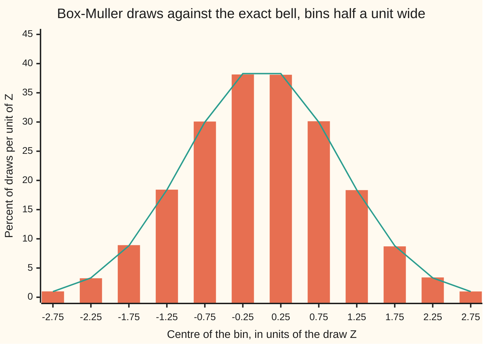
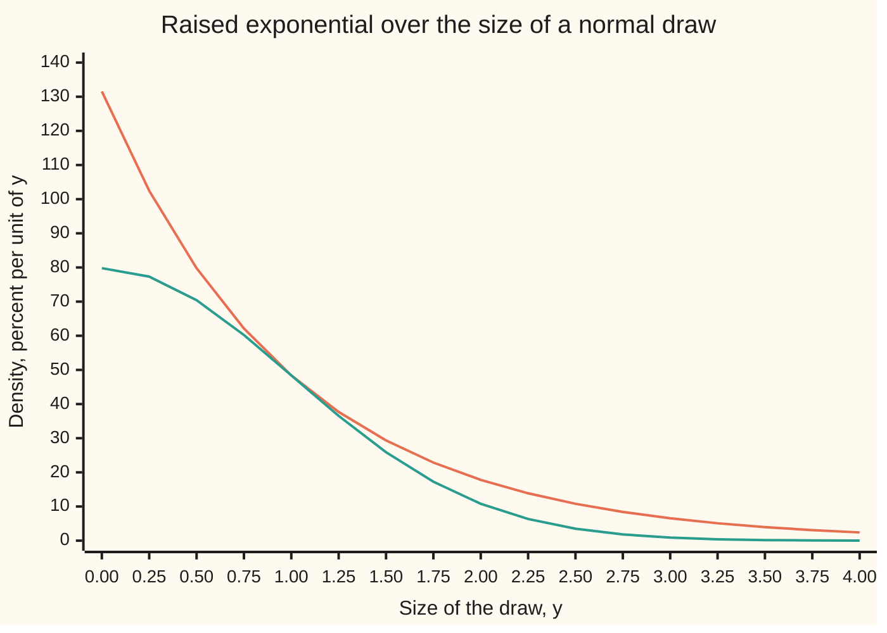

# Rejection sampling and Box-Muller: distributions without an invertible CDF, and normals from uniforms

Probability and statistics → Simulation → Exact normal draws → Rejection sampling and Box-Muller

---

## General Overview

A risk desk simulates a share priced at $100 one year ahead. The model it uses says the price in a year is 100 times e raised to 0.01 plus 0.2 times a standard normal draw: a number from the bell curve with centre 0 and spread 1 ([lognormal-distribution](../04-Continuous%20Distributions/06-lognormal-distribution.md)). The 0.2 is the share's yearly volatility, 20%. The 0.01 is the pricing drift: a 5% interest rate, minus 2% dividends, minus half of 0.2 squared. A draw of 0.479519 puts the share at $111.17; a negative draw puts it lower. A run of 200,000 simulated years needs 200,000 bell-curve draws.

A computer's generator hands out uniform numbers: values between 0 and 1, every stretch of equal length equally likely ([pseudo-random-numbers](01-pseudo-random-numbers.md)). The inverse transform turns a uniform into any law by reading its cumulative curve backwards ([inverse-transform-sampling](02-inverse-transform-sampling.md)). For the bell curve that backwards reading, the normal quantile, has no formula in logs, roots and powers; a computer finds it by searching ([normal-quantile](../04-Continuous%20Distributions/05-normal-quantile.md)). Doing a search 200,000 times is slow, and the answer is only as good as the search.

Two exact tricks avoid the search. **Rejection sampling** draws from an easy law that sits above the hard one everywhere, then throws some draws away so the ones kept follow the hard law. It works for any density that can be bounded that way. **Box-Muller** takes two uniforms, reads them as a distance and an angle, and returns two independent bell-curve draws with one log, one square root, a cosine and a sine. Both return the exact law, not an approximation of it.

**Keep a draw from an easy law with chance equal to the hard law's height over the easy law's raised height, and the kept draws follow the hard law exactly; read two uniforms as a radius and an angle, and the point they mark has two independent normal coordinates.**

**What kind of fact this is:** two theorems, each proved on this card in Why it works; each is also a method that a simulation runs.

### The picture: 200,000 Box-Muller draws against the bell



Bars: the share of 200,000 Box-Muller draws landing in each half-unit bin, divided by the bin width. Line: the exact bell's area over the same bin, divided by the same width. They differ by a few tenths of a percent, the size of the sampling noise.

---

## The formula

Reminders. $\varphi$ is the standard bell's height and $\Phi$ its area to the left of a point ([normal-distribution](../04-Continuous%20Distributions/04-normal-distribution.md)); P(A) is the chance of A, and P(A | B) the chance of A given B.

**Rejection sampling.** The target density $f$ is the law wanted. The proposal density $g$ is a law that is easy to draw from. Find a number $M$ with

$$f(y) \le M\,g(y) \quad\text{for every } y.$$

Draw $Y$ from $g$ and a fresh uniform $U$. Keep $Y$ when

$$U \le \frac{f(Y)}{M\,g(Y)},$$

otherwise throw both away and try again. Then

$$P(\text{kept}) = \frac{1}{M}, \qquad P(Y \le y \mid \text{kept}) = F(y).$$

**Read it aloud:** raise the easy curve until it sits above the hard one everywhere; keep each easy draw with chance equal to the hard curve's height over the raised curve's height at that point; one draw in M survives, and the survivors follow the hard law.

**Box-Muller.** Take two independent uniforms $U_1$ and $U_2$ in (0, 1]. Set

$$R = \sqrt{-2\ln U_1}, \qquad \Theta = 2\pi U_2, \qquad Z_1 = R\cos\Theta, \qquad Z_2 = R\sin\Theta.$$

**Read it aloud:** turn the first uniform into a distance from the centre and the second into an angle; the point at that distance and angle has two coordinates, each a standard normal draw, and neither tells anything about the other.

On this card the target of the rejection sampler is the size of a normal draw, its distance from 0 ignoring sign, and a fair coin then adds the sign. The proposal is the exponential law with rate 1, drawn by the inverse transform as −ln of a uniform ([exponential-distribution](../04-Continuous%20Distributions/03-exponential-distribution.md)):

$$f(y) = \sqrt{2/\pi}\;e^{-y^2/2}, \qquad g(y) = e^{-y}, \qquad M = \sqrt{2e/\pi} = 1.315489, \qquad \frac{f(y)}{M\,g(y)} = e^{-(y-1)^2/2}.$$

| Symbol | Plain meaning | In our example | Push it up and the answer… |
| --- | --- | --- | --- |
| $f$ | target density: the law wanted | size of a normal draw, height 79.79 percent per unit at 0 | — |
| $g$ | proposal density: a law easy to draw | exponential, e^(−y), height 1 at 0 | a proposal closer to the target needs a smaller M |
| $F$ | the target's cumulative curve, its area to the left of a point | at 1: 2Φ(1) − 1 | — |
| $M$ | envelope constant: how far g must be raised to sit above f | 1.315489 | more tries per kept draw, same law |
| $Y$, $y$ | a draw from the proposal, and a point on the axis; in Steps 4 and 7 and the detailed proof, $x$ and $y$ are instead the two coordinates of a point in the plane | Y = 1.203973 from U = 0.3 | — |
| $U$ | the uniform used for the keep-or-throw test | 0.8 | — |
| $U_1$, $U_2$ | two independent uniforms in (0, 1] | 0.3 and 0.8 | smaller U1 gives a longer radius |
| $R$, $\Theta$ | distance from the centre, and angle round it, in radians | 1.551756 and 5.026548 | — |
| $r$, $\theta$ | one particular value of the distance and of the angle | 1.551756 and 5.026548 | — |
| $W$ | polar method: a kept dart's squared distance from the centre, $x^2 + y^2$ | a number in (0, 1], used in place of $U_1$ | smaller W gives a longer radius |
| $t$, $s$ | variables of integration: the points an integral sweeps over | $t$ up to $y$ in Step 2; $s$ from $r$ outwards in Step 5 | — |
| $Z_1$, $Z_2$ | the two standard normal draws Box-Muller returns | 0.479519 and −1.475807 | — |
| $\varphi$, $\Phi$ | the standard bell's height, and its area to the left | Φ(1) = 0.841345 | Φ rises from 0 to 1 |
| $S$ | the share's price in a year, 100 e^(0.01 + 0.2 Z) | $111.17 for Z = 0.479519 | — |
| $\sigma$ | the share's yearly volatility | 0.2 | wider spread of prices |

### When it holds

- **The envelope must hold at every point.** If $f$ pokes above $M g$ somewhere, the test chance would exceed 1 there. Capping it at 1 silently thins that region. With $M$ = 1 on this card's example, the kept draws land beyond 2 in size 0.0516 of the time, against 0.0455 for the true bell.
- **The proposal must reach everywhere the target lives.** Where $g$ is 0 and $f$ is not, no proposal ever lands, and that part of the law is missing however long the run.
- **Each test uses a fresh uniform, independent of the proposal.** Reusing the number that made $Y$ makes the keep decision a fixed function of $Y$, and the output follows a different law.
- **Uniforms in (0, 1], never 0.** Box-Muller takes the log of $U_1$; ln 0 is minus infinity. With 53-bit uniforms the smallest $U_1$ is 2^(−53), so the longest radius is 8.5717: no draw beyond 8.5717 standard deviations, a limit that matters only for tails far beyond anything a share simulation uses.
- **Real uniforms are a model.** A generator produces a long fixed cycle of numbers that pass tests for uniformity ([pseudo-random-numbers](01-pseudo-random-numbers.md)). The theorems are exact for true uniforms; the program is as good as its generator.

---

## Why it works

### Step 0: a law is decided by its areas, and both tricks produce the right areas

A density is a curve whose area over any stretch is the chance of landing there. A sampler is right when every such area comes out right. Rejection sampling gets the areas right by thinning the easy curve down to the hard one, point by point. Box-Muller gets them right by a change of coordinates: in distance-and-angle coordinates the two-dimensional bell splits into two easy pieces.

### Step 1: the envelope picture



Upper line (orange): the envelope, $M$ times the exponential density. Lower line (green): the target, the density of the size of a normal draw. The two touch at y = 1, where both are 48.39 percent per unit; everywhere else the envelope is higher.

Picture the region under the envelope as a dartboard. A proposal $Y$ picks the dart's horizontal position with density $g$. The uniform $U$ times $M g(Y)$ picks a height between 0 and the envelope. The dart is kept when it lands under the target curve. Kept darts are spread evenly over the region under $f$, so their horizontal positions follow $f$. The steps below turn that picture into two lines of calculus.

Why $M$ = 1.315489: the ratio $f(y) / g(y)$ equals √(2/π) e^(y − y^2/2). The exponent y − y^2/2 is largest at y = 1, where it is 1/2, so the ratio peaks at √(2/π) e^(1/2) = √(2e/π). That peak is the smallest $M$ that works. Dividing, the keep chance at a point is $e^{-(y-1)^2/2}$: certain at y = 1, and falling off both sides.

### Step 2: the chance of landing at or below y and being kept

Fix a point y. A proposal lands in a thin slice at t with chance g(t) dt. Once there, it is kept with chance $f(t) / (M g(t))$, since $U$ is uniform and independent of $Y$. Multiply and add over every slice at or below y:

$$P(Y \le y \text{ and kept}) = \int_{-\infty}^{y} g(t)\,\frac{f(t)}{M\,g(t)}\,dt = \frac{1}{M}\int_{-\infty}^{y} f(t)\,dt = \frac{F(y)}{M}.$$

The proposal density cancels. Only the target's area survives, scaled by $1/M$.

### Step 3: the chance of being kept at all, and the law of the kept draws

Let y run to the far right. The target's total area is 1, so $P(\text{kept}) = 1/M$. Divide Step 2 by this, which is the definition of a chance given an event:

$$P(Y \le y \mid \text{kept}) = \frac{F(y)/M}{1/M} = F(y).$$

The kept draws have exactly the target's cumulative curve, so exactly the target law. Nothing was approximated. For this card's example the keep rate is 1/M = 0.760173, and the integral of $g$ times the keep chance, done numerically in the code, gives the same 0.760173.

Each try is independent and succeeds with chance $1/M$, so the number of tries per kept draw is geometric (the count of attempts up to and including the first success), with average $M$ = 1.315489. The loop returns the first kept draw. If it comes on try j, the chance of that and of a value at or below y is (1 − 1/M)^(j−1) × F(y)/M; adding over every j gives F(y), so the returned draw follows the target law too. The sampler spends 1.315489 exponential draws, on average, per normal size it returns. A looser envelope, say $M$ = 2, still gives the exact law but wastes more proposals.

The sign comes from a separate fair coin. The bell is symmetric, so a size with a random sign is a standard normal draw.

### Step 4: two normals together form a round bell

Now Box-Muller. Take two independent standard normals as the coordinates of a point in the plane. Independence means their joint density is the product of the two heights:

$$\varphi(x)\,\varphi(y) = \frac{1}{2\pi}\,e^{-(x^2 + y^2)/2}.$$

The right side depends only on $x^2 + y^2$, the squared distance from the centre. The two-dimensional bell is round. That is the whole reason Box-Muller exists: a round law has a uniform angle, and only its distance needs work.

### Step 5: the angle and the distance, each from one uniform

Switch to distance $R$ and angle $\Theta$. A small patch dr by dθ covers area r dr dθ, the Jacobian factor for polar coordinates ([change-of-variables-and-jacobians](../../06-Calculus%20and%20analysis/08-Multiple%20Integrals/03-change-of-variables-and-jacobians.md)). So the density in the new coordinates is

$$\frac{1}{2\pi} \times r\,e^{-r^2/2}, \qquad r > 0,\; 0 \le \theta < 2\pi.$$

It splits into a factor in θ alone, 1/(2π), and a factor in r alone, r e^(−r^2/2). A density that splits into separate factors means the pieces are independent. The angle is uniform round the circle: $\Theta = 2\pi U_2$. The distance has tail chance

$$P(R > r) = \int_r^\infty s\,e^{-s^2/2}\,ds = e^{-r^2/2}.$$

Set this tail chance equal to a uniform and solve: $e^{-R^2/2} = U_1$ gives $R = \sqrt{-2\ln U_1}$. The inverse transform does this, run on the tail chance instead of the cumulative curve, which is allowed because 1 − U is uniform too ([inverse-transform-sampling](02-inverse-transform-sampling.md)); it works because the distance, unlike the normal itself, has a cumulative curve that can be turned round by algebra. Half the squared distance, $R^2/2 = -\ln U_1$, is an exponential draw with rate 1.

### Step 6: run it backwards

Steps 4 and 5 say: two independent normals, read in polar coordinates, are a uniform angle and a distance $\sqrt{-2\ln U_1}$, independent of each other. Reverse it: build the angle and the distance from $U_1$ and $U_2$, then read off the coordinates $Z_1 = R\cos\Theta$ and $Z_2 = R\sin\Theta$. The pair has the round bell's density, so $Z_1$ and $Z_2$ are two independent standard normals. The folded proof below does the same computation in one Jacobian.

<details>
<summary>Detailed proof: Box-Muller by one change of variables</summary>

The pair $(U_1, U_2)$ has density 1 on the square (0, 1] × (0, 1]. The map to $(Z_1, Z_2)$ is one to one, and its inverse is
$$U_1 = e^{-(x^2 + y^2)/2}, \qquad U_2 = \frac{\theta(x, y)}{2\pi},$$
where θ(x, y) is the angle of the point (x, y), measured anticlockwise from the positive x-axis into [0, 2π). The angle's rates of change are ∂θ/∂x = −y / (x^2 + y^2) and ∂θ/∂y = x / (x^2 + y^2). Write r^2 = x^2 + y^2. The Jacobian determinant of the inverse map is
$$\frac{\partial U_1}{\partial x}\frac{\partial U_2}{\partial y} - \frac{\partial U_1}{\partial y}\frac{\partial U_2}{\partial x} = \left(-x\,e^{-r^2/2}\right)\frac{x}{2\pi r^2} - \left(-y\,e^{-r^2/2}\right)\frac{-y}{2\pi r^2} = -\frac{e^{-r^2/2}}{2\pi}.$$
The change-of-variables theorem says the density of $(Z_1, Z_2)$ is the density of $(U_1, U_2)$, which is 1, times the size of this determinant:
$$1 \times \frac{e^{-(x^2+y^2)/2}}{2\pi} = \varphi(x)\,\varphi(y).$$
A joint density that is a product of one function of x and one of y means independent coordinates, each with density φ. The edge where $U_1$ = 1, which has zero area, maps to the centre.

</details>

### Step 7: the polar method, where the two ideas meet

Box-Muller needs a cosine and a sine. Marsaglia's polar method removes them with a rejection step. Throw a dart uniformly at the square from −1 to 1 on both axes, and keep it only if it lands inside the circle of radius 1. The keep rate is the circle's area over the square's, π/4 = 0.785398, the same count that estimates π from darts. A kept dart (x, y) has a uniform angle, and its squared distance W = x^2 + y^2 is uniform on (0, 1], since the area inside radius √w is a fraction w of the circle. The angle and W are also independent: in distance-and-angle coordinates the dart's flat density on the disc splits into a factor in the angle alone and one in the distance alone, as in Step 5. So W can stand in for $U_1$, and x/√W, y/√W are the cosine and sine of the angle for free:

$$Z_1 = x\sqrt{\frac{-2\ln W}{W}}, \qquad Z_2 = y\sqrt{\frac{-2\ln W}{W}}.$$

The code runs it: of 127,375 darts, the kept share times 4 is 3.1403, with a standard error of 0.0046, and the draws pass the same checks as the other two samplers.

A third road to normals, adding twelve uniforms and subtracting 6, gives only an approximation: its draws can never exceed 6 in size, and its shape is only close to the bell. The two methods on this card are exact.

---

## Worked numbers, by hand

The same two uniforms, U = 0.3 and then U = 0.8, run through both methods.

| Step | Arithmetic | Value |
| --- | --- | --- |
| rejection: proposal | Y = −ln 0.3 | 1.203973 |
| rejection: keep chance | e^(−(1.203973 − 1)^2/2) | 0.979412 |
| rejection: test | 0.8 ≤ 0.979412 | **kept**; a coin then picks the sign |
| Box-Muller: squared radius | −2 ln 0.3 | 2.407946 |
| radius | √2.407946 | 1.551756 |
| angle | 2π × 0.8 | 5.026548 |
| cosine and sine | cos 5.026548, sin 5.026548 | 0.309017, −0.951057 |
| $Z_1$ | 1.551756 × 0.309017 | **0.479519** |
| $Z_2$ | 1.551756 × (−0.951057) | **−1.475807** |
| share in a year | 100 e^(0.01 + 0.2 × 0.479519) | **$111.17** |

One pair of uniforms gives two simulated years for the share: one at \$111.17, and a second from $Z_2$ = −1.475807, a bad year.

Across 200,000 draws each, the three samplers land where the bell says. Φ(1) = 0.841345 by numerical integration of the bell. The share of draws at or below 1 is 0.8404 ± 0.0008 by rejection, 0.8416 ± 0.0008 by Box-Muller, and 0.8423 ± 0.0008 by the polar method; the ± is one standard error, and each estimate sits within two of them of the true value. A grid of 1,000,000 evenly spaced uniform pairs, pushed through Box-Muller with no randomness at all, gives 0.841360.

For the share, with the house market of the finance wing (rate 5%, dividends 2%, volatility 20%, one year):

| Quantity | Exact | From 200,000 Box-Muller years |
| --- | --- | --- |
| chance the share ends above $100: Z > −0.05, so Φ(0.05) | 0.519939 | 0.5196 ± 0.0011 |
| average price, 100 e^0.03 | $103.0455 | $103.0302 ± 0.0466 |
| call with strike $100, discounted average payoff | $9.227006 | $9.2326 ± 0.0310 |

The simulated call lands within one standard error of the Black-Scholes price ([black-scholes-call](../../12-Financial%20mathematics/08-The%20Black-Scholes%20call%20and%20put/01-black-scholes-call.md)): the normals are good enough to price an option.

### What breaks if you drop a piece

| Mistake | Comes out at | What went wrong |
| --- | --- | --- |
| R = √(−ln U1), the 2 dropped | variance 0.5; call $6.4312 instead of $9.227006 | The spread shrinks by √2; the share acts as if its volatility were 20% divided by √2 |
| R = −2 ln U1, no square root | variance 4 | The squared radius used as the radius: draws four times too spread, and no longer bell-shaped |
| Envelope M = 1, keep chance capped at 1 | beyond 2 in size: 0.0519 ± 0.0005 simulated, 0.0516 by integral, true 0.0455 | The unraised exponential sits below the target over a middle stretch round y = 1; capping thins the middle, so the tails come out too heavy |

The code prints all three: the first two with their simulated variances beside the exact ones, the third with its mean and variance beside its tail shares. The third is the dangerous one: the mean is −0.0019 and the variance 1.0142, so a quick look passes it, while 2-sigma years are too common.

---

## Code, from first principles, and it actually runs

Nothing imported holds an answer: the generator is SplitMix64 written out, seed 20260929, so both languages draw the same numbers; the bell's area Φ is Simpson's rule (adding up thin slices with weights 1, 4, 2, 4, …) on the bell's height. The law is checked by independent roads: the exact integral, a grid of uniform pairs with no randomness, and three samplers that share no step. The rejection keep rate is found by formula, by integral and by simulation. The share's call is priced by formula and by 200,000 simulated years.

### Python

```python
# Rejection sampling and Box-Muller -- the check behind the card.  Only math primitives
# are imported.  Every draw comes from SplitMix64, seed 20260929, written out so Python
# and Rust draw the same numbers.  Phi is Simpson's rule on the bell, never a sampler.
from math import sqrt, log, exp, cos, sin, pi, e
MASK, state = (1 << 64) - 1, 20260929

def uniform():                                 # SplitMix64, 53 bits, in (0, 1]
    global state
    state = (state + 0x9E3779B97F4A7C15) & MASK
    z = state
    z = ((z ^ (z >> 30)) * 0xBF58476D1CE4E5B9) & MASK
    z = ((z ^ (z >> 27)) * 0x94D049BB133111EB) & MASK
    return (((z ^ (z >> 31)) >> 11) + 1) / 2.0 ** 53

def simpson(f, a, b, n=20000):
    h, inner = (b - a) / n, 0.0
    for i in range(1, n):
        inner += (4 if i % 2 else 2) * f(a + i * h)
    return (f(a) + f(b) + inner) * h / 3

def bell(z): return exp(-z * z / 2) / sqrt(2 * pi)
def Phi(x): return 0.5 + simpson(bell, 0.0, x)
def half_normal(y): return 2 * bell(y)          # target f: the size of a normal
def lognormal_call(s, m=log(100.0) + 0.01):     # e^-r E[(e^X - 100)+], X ~ N(m, s^2)
    d = (m - log(100.0)) / s
    return exp(-0.05) * (exp(m + s * s / 2) * Phi(d + s) - 100.0 * Phi(d))

M = sqrt(2 * e / pi)                           # envelope: f(y) <= M e^-y for y >= 0
def rejection(ceiling):                        # returns a signed draw and the tries used
    tries = 0
    while True:
        tries += 1
        y = -log(uniform())                    # exponential proposal, by inverse transform
        if uniform() <= min(1.0, half_normal(y) / (ceiling * exp(-y))):
            return (y if uniform() < 0.5 else -y), tries

def box_muller(k=2.0, root=True):
    u1, u2 = uniform(), uniform()
    rad = sqrt(-k * log(u1)) if root else -k * log(u1)
    return rad * cos(2 * pi * u2), rad * sin(2 * pi * u2)

def polar():                                   # dart in the square, kept if inside the disc
    tries = 0
    while True:
        tries += 1
        x, y = 2 * uniform() - 1, 2 * uniform() - 1
        s = x * x + y * y
        if 0 < s <= 1:
            return x * sqrt(-2 * log(s) / s), y * sqrt(-2 * log(s) / s), tries
def summary(zs):
    n = len(zs)
    mean = sum(zs) / n
    var = sum((z - mean) * (z - mean) for z in zs) / n
    p = sum(1 for z in zs if z <= 1.0) / n
    return mean, var, p, sqrt(p * (1 - p) / n)
def show(label, zs):
    mean, var, p, se = summary(zs)
    print(f"{label}: mean {mean:.4f}, variance {var:.4f}, P(Z <= 1) {p:.4f} +/- {se:.4f}")
    return p, se

N, phi1 = 200000, Phi(1.0)
print(f"SplitMix64 seed 20260929; {N} normal draws per method; Phi(1) by Simpson {phi1:.6f}; "
      f"largest R from 53-bit uniforms {sqrt(-2 * log(2.0 ** -53)):.4f}")
accept_int = simpson(lambda y: exp(-y) * exp(-(y - 1) * (y - 1) / 2), 0.0, 12.0)
print(f"rejection: M = sqrt(2e/pi) = {M:.6f}; acceptance 1/M = {1 / M:.6f}, by integral {accept_int:.6f}")
draws = [rejection(M) for _ in range(N)]
rej, rej_tries = [z for z, _ in draws], sum(t for _, t in draws)
acc = N / rej_tries
acc_se = sqrt(acc * (1 - acc) / rej_tries)
print(f"rejection: {rej_tries} proposals, acceptance {acc:.4f} +/- {acc_se:.4f}, tries per draw {rej_tries / N:.4f}")
p_rej, se_rej = show("rejection draws", rej)
u1, u2, r_hand, y_hand = 0.3, 0.8, sqrt(-2 * log(0.3)), -log(0.3)
print(f"by hand, rejection: Y = -ln 0.3 = {y_hand:.6f}, keep chance exp(-(Y - 1)^2 / 2) = "
      f"{exp(-(y_hand - 1) * (y_hand - 1) / 2):.6f}, test U = 0.8: kept {'yes' if 0.8 <= exp(-(y_hand - 1) * (y_hand - 1) / 2) else 'no'}")
z1, z2 = r_hand * cos(2 * pi * u2), r_hand * sin(2 * pi * u2)
print(f"by hand: U1 = 0.3, U2 = 0.8 -> -2 ln U1 = {-2 * log(u1):.6f}, R = {r_hand:.6f}, angle = {2 * pi * u2:.6f}, "
      f"cos {cos(2 * pi * u2):.6f}, sin {sin(2 * pi * u2):.6f}")
print(f"by hand: Z1 = {z1:.6f}, Z2 = {z2:.6f}; stock in a year 100 exp(0.01 + 0.2 Z1) = {100 * exp(0.01 + 0.2 * z1):.2f}")
m, below, both = 1000, 0, 0
for i in range(m):
    rad = sqrt(-2 * log((i + 0.5) / m))
    for j in range(m):
        a, b = rad * cos(2 * pi * (j + 0.5) / m), rad * sin(2 * pi * (j + 0.5) / m)
        below += a <= 1.0
        both += a <= 1.0 and b <= 1.0
print(f"grid of {m * m} uniform pairs, no randomness: P(Z1 <= 1) {below / m / m:.6f}, "
      f"P(Z1 <= 1 and Z2 <= 1) {both / m / m:.6f}, Phi(1)^2 {phi1 * phi1:.6f}")
bm = [z for _ in range(N // 2) for z in box_muller()]
p_bm, se_bm = show("Box-Muller draws", bm)
pairs = list(zip(bm[0::2], bm[1::2]))
corr = sum(a * b for a, b in pairs) / len(pairs)
p_both = sum(1 for a, b in pairs if a <= 1.0 and b <= 1.0) / len(pairs)
print(f"Box-Muller pairs: average Z1 Z2 {corr:.4f}, P(Z1 <= 1 and Z2 <= 1) {p_both:.4f} +/- {sqrt(p_both * (1 - p_both) / len(pairs)):.4f}")
darts = [polar() for _ in range(N // 2)]
pol, pol_tries = [z for a, b, _ in darts for z in (a, b)], sum(t for _, _, t in darts)
pi_hat = 4 * (N // 2) / pol_tries
pi_se = 4 * sqrt((pi_hat / 4) * (1 - pi_hat / 4) / pol_tries)
print(f"polar: acceptance pi/4 = {pi / 4:.6f}; darts {pol_tries}, 4 x kept share {pi_hat:.4f} +/- {pi_se:.4f}")
p_pol, se_pol = show("polar draws", pol)
stock = [100 * exp(0.01 + 0.2 * z) for z in bm]
up = sum(1 for s in stock if s > 100) / N
pay = [exp(-0.05) * max(s - 100, 0.0) for s in stock]
call = sum(pay) / N
call_se = sqrt(sum((p - call) * (p - call) for p in pay) / N / N)
print(f"stock: P(price > 100) {up:.4f} +/- {sqrt(up * (1 - up) / N):.4f}; exact Phi(0.05) = {Phi(0.05):.6f}")
avg = sum(stock) / N
print(f"stock: average price {avg:.4f} +/- {sqrt(sum((s - avg) * (s - avg) for s in stock) / N / N):.4f}; exact 100 e^0.03 = {100 * exp(0.03):.4f}")
exact_call = lognormal_call(0.2)
print(f"stock: call by simulation {call:.4f} +/- {call_se:.4f}; by formula {exact_call:.6f}")
half = [box_muller(k=1.0)[0] for _ in range(N)]
wide = [box_muller(root=False)[0] for _ in range(N)]
clip = [rejection(1.0)[0] for _ in range(N)]
floor = lambda y: min(half_normal(y), exp(-y))           # clipped: the accepted weight
clip_tail = simpson(floor, 2.0, 12.0) / simpson(floor, 0.0, 12.0)
tail_sim = sum(1 for z in clip if abs(z) > 2) / N
print(f"break, -ln U1 without the 2: variance {summary(half)[1]:.4f} (exact 0.5); call {lognormal_call(0.2 / sqrt(2)):.4f}")
print(f"break, R = -2 ln U1 with no root: variance {summary(wide)[1]:.4f} (exact 4)")
print(f"break, envelope M = 1, clipped: P(|Z| > 2) {tail_sim:.4f} +/- {sqrt(tail_sim * (1 - tail_sim) / N):.4f}; "
      f"by integral {clip_tail:.4f}; true {2 * (1 - Phi(2.0)):.4f}; mean {summary(clip)[0]:.4f}, variance {summary(clip)[1]:.4f}")
ys = [0.25 * k for k in range(17)]
print("chart, y:", ", ".join(f"{y:.2f}" for y in ys))
print("chart, target f(y), percent:", ", ".join(f"{100 * half_normal(y):.2f}" for y in ys))
print("chart, envelope M g(y), percent:", ", ".join(f"{100 * M * exp(-y):.2f}" for y in ys))
edges = [-3 + 0.5 * k for k in range(13)]
print("chart, bin centres:", ", ".join(f"{a + 0.25:.2f}" for a in edges[:-1]))
print("chart, Box-Muller percent per unit:", ", ".join(
    f"{100 * sum(1 for z in bm if a < z <= a + 0.5) / N / 0.5:.2f}" for a in edges[:-1]))
print("chart, exact bell percent per unit:", ", ".join(f"{100 * (Phi(a + 0.5) - Phi(a)) / 0.5:.2f}" for a in edges[:-1]))
assert abs(accept_int - sqrt(pi / (2 * e))) < 1e-9          # integral against closed form
assert abs(acc - 1 / M) < 4 * acc_se                          # simulated acceptance
assert abs(below / m / m - phi1) < 1e-3 and abs(both / m / m - phi1 * phi1) < 1e-3
for p, se in ((p_rej, se_rej), (p_bm, se_bm), (p_pol, se_pol)):
    assert abs(p - phi1) < 4 * se                             # three samplers, one bell
assert abs(p_both - phi1 * phi1) < 4 * sqrt(p_both * (1 - p_both) / len(pairs))   # independent pair
assert abs(call - exact_call) < 4 * call_se and abs(exact_call - 9.227005508154) < 1e-6
assert abs(tail_sim - clip_tail) < 4 * sqrt(clip_tail * (1 - clip_tail) / N)
assert abs(summary(half)[1] - 0.5) < 0.01 and abs(summary(wide)[1] - 4) < 0.1
assert clip_tail - 2 * (1 - Phi(2.0)) > 0.005                # the clipped sampler is wrong
print("ALL CHECKS PASS")
```

**Ran 2026-10-06 on macOS, Python 3.14.6, standard library only. All checks passed. Output, pasted from the run:**

```
SplitMix64 seed 20260929; 200000 normal draws per method; Phi(1) by Simpson 0.841345; largest R from 53-bit uniforms 8.5717
rejection: M = sqrt(2e/pi) = 1.315489; acceptance 1/M = 0.760173, by integral 0.760173
rejection: 263278 proposals, acceptance 0.7597 +/- 0.0008, tries per draw 1.3164
rejection draws: mean 0.0021, variance 1.0020, P(Z <= 1) 0.8404 +/- 0.0008
by hand, rejection: Y = -ln 0.3 = 1.203973, keep chance exp(-(Y - 1)^2 / 2) = 0.979412, test U = 0.8: kept yes
by hand: U1 = 0.3, U2 = 0.8 -> -2 ln U1 = 2.407946, R = 1.551756, angle = 5.026548, cos 0.309017, sin -0.951057
by hand: Z1 = 0.479519, Z2 = -1.475807; stock in a year 100 exp(0.01 + 0.2 Z1) = 111.17
grid of 1000000 uniform pairs, no randomness: P(Z1 <= 1) 0.841360, P(Z1 <= 1 and Z2 <= 1) 0.707882, Phi(1)^2 0.707861
Box-Muller draws: mean -0.0011, variance 1.0040, P(Z <= 1) 0.8416 +/- 0.0008
Box-Muller pairs: average Z1 Z2 0.0010, P(Z1 <= 1 and Z2 <= 1) 0.7083 +/- 0.0014
polar: acceptance pi/4 = 0.785398; darts 127375, 4 x kept share 3.1403 +/- 0.0046
polar draws: mean 0.0023, variance 0.9935, P(Z <= 1) 0.8423 +/- 0.0008
stock: P(price > 100) 0.5196 +/- 0.0011; exact Phi(0.05) = 0.519939
stock: average price 103.0302 +/- 0.0466; exact 100 e^0.03 = 103.0455
stock: call by simulation 9.2326 +/- 0.0310; by formula 9.227006
break, -ln U1 without the 2: variance 0.5033 (exact 0.5); call 6.4312
break, R = -2 ln U1 with no root: variance 3.9816 (exact 4)
break, envelope M = 1, clipped: P(|Z| > 2) 0.0519 +/- 0.0005; by integral 0.0516; true 0.0455; mean -0.0019, variance 1.0142
chart, y: 0.00, 0.25, 0.50, 0.75, 1.00, 1.25, 1.50, 1.75, 2.00, 2.25, 2.50, 2.75, 3.00, 3.25, 3.50, 3.75, 4.00
chart, target f(y), percent: 79.79, 77.33, 70.41, 60.23, 48.39, 36.53, 25.90, 17.26, 10.80, 6.35, 3.51, 1.82, 0.89, 0.41, 0.17, 0.07, 0.03
chart, envelope M g(y), percent: 131.55, 102.45, 79.79, 62.14, 48.39, 37.69, 29.35, 22.86, 17.80, 13.87, 10.80, 8.41, 6.55, 5.10, 3.97, 3.09, 2.41
chart, bin centres: -2.75, -2.25, -1.75, -1.25, -0.75, -0.25, 0.25, 0.75, 1.25, 1.75, 2.25, 2.75
chart, Box-Muller percent per unit: 1.00, 3.25, 8.92, 18.42, 30.08, 38.14, 38.09, 30.13, 18.34, 8.71, 3.39, 0.99
chart, exact bell percent per unit: 0.97, 3.31, 8.81, 18.37, 29.98, 38.29, 38.29, 29.98, 18.37, 8.81, 3.31, 0.97
ALL CHECKS PASS
```

### Rust

Same numbers, same labels, built with `rustc --edition 2021 -O`.

```rust
// Rejection sampling and Box-Muller -- the same check as the Python, in Rust.  No crates.
// Every draw comes from SplitMix64, seed 20260929, so both languages draw the same
// numbers.  Phi is Simpson's rule on the bell curve, never a sampler.
use std::f64::consts::{E, PI};

struct Rng(u64);
impl Rng {
    fn uniform(&mut self) -> f64 {                   // SplitMix64, 53 bits, in (0, 1]
        self.0 = self.0.wrapping_add(0x9E3779B97F4A7C15);
        let mut z = self.0;
        z = (z ^ (z >> 30)).wrapping_mul(0xBF58476D1CE4E5B9);
        z = (z ^ (z >> 27)).wrapping_mul(0x94D049BB133111EB);
        (((z ^ (z >> 31)) >> 11) + 1) as f64 / 2f64.powi(53)
    }
}

fn simpson(f: &dyn Fn(f64) -> f64, a: f64, b: f64) -> f64 {
    let (n, mut inner) = (20000, 0.0);
    let h = (b - a) / n as f64;
    for i in 1..n {
        inner += (if i % 2 == 1 { 4.0 } else { 2.0 }) * f(a + i as f64 * h);
    }
    (f(a) + f(b) + inner) * h / 3.0
}

fn bell(z: f64) -> f64 { (-z * z / 2.0).exp() / (2.0 * PI).sqrt() }
fn phi(x: f64) -> f64 { 0.5 + simpson(&bell, 0.0, x) }
fn half_normal(y: f64) -> f64 { 2.0 * bell(y) }     // target f: the size of a normal
fn lognormal_call(s: f64) -> f64 {                  // e^-r E[(e^X - 100)+], X ~ N(m, s^2)
    let m = 100f64.ln() + 0.01;
    let d = (m - 100f64.ln()) / s;
    (-0.05f64).exp() * ((m + s * s / 2.0).exp() * phi(d + s) - 100.0 * phi(d))
}

fn rejection(g: &mut Rng, ceiling: f64) -> (f64, u64) {   // a signed draw and the tries used
    let mut tries = 0;
    loop {
        tries += 1;
        let y = -g.uniform().ln();                  // exponential proposal, by inverse transform
        if g.uniform() <= (half_normal(y) / (ceiling * (-y).exp())).min(1.0) {
            return (if g.uniform() < 0.5 { y } else { -y }, tries);
        }
    }
}

fn box_muller(g: &mut Rng, k: f64, root: bool) -> (f64, f64) {
    let (u1, u2) = (g.uniform(), g.uniform());
    let rad = if root { (-k * u1.ln()).sqrt() } else { -k * u1.ln() };
    (rad * (2.0 * PI * u2).cos(), rad * (2.0 * PI * u2).sin())
}

fn polar(g: &mut Rng) -> (f64, f64, u64) {          // dart in the square, kept if inside the disc
    let mut tries = 0;
    loop {
        tries += 1;
        let (x, y) = (2.0 * g.uniform() - 1.0, 2.0 * g.uniform() - 1.0);
        let s = x * x + y * y;
        if 0.0 < s && s <= 1.0 {
            return (x * (-2.0 * s.ln() / s).sqrt(), y * (-2.0 * s.ln() / s).sqrt(), tries);
        }
    }
}

fn summary(zs: &[f64]) -> (f64, f64, f64, f64) {
    let n = zs.len() as f64;
    let mean = zs.iter().fold(0.0, |a, z| a + z) / n;
    let var = zs.iter().fold(0.0, |a, z| a + (z - mean) * (z - mean)) / n;
    let p = zs.iter().filter(|&&z| z <= 1.0).count() as f64 / n;
    (mean, var, p, (p * (1.0 - p) / n).sqrt())
}

fn show(label: &str, zs: &[f64]) -> (f64, f64) {
    let (mean, var, p, se) = summary(zs);
    println!("{}: mean {:.4}, variance {:.4}, P(Z <= 1) {:.4} +/- {:.4}", label, mean, var, p, se);
    (p, se)
}
fn row(label: &str, v: &[f64], places: usize) {
    let cells: Vec<String> = v.iter().map(|x| format!("{:.*}", places, x)).collect();
    println!("chart, {}: {}", label, cells.join(", "));
}
fn main() {
    let mut g = Rng(20260929);
    let (n, phi1) = (200000usize, phi(1.0));
    let nf = n as f64;
    let m_env = (2.0 * E / PI).sqrt();
    println!("SplitMix64 seed 20260929; {} normal draws per method; Phi(1) by Simpson {:.6}; largest R from 53-bit uniforms {:.4}",
             n, phi1, (-2.0 * 2f64.powi(-53).ln()).sqrt());
    let accept_int = simpson(&|y: f64| (-y).exp() * (-(y - 1.0) * (y - 1.0) / 2.0).exp(), 0.0, 12.0);
    println!("rejection: M = sqrt(2e/pi) = {:.6}; acceptance 1/M = {:.6}, by integral {:.6}", m_env, 1.0 / m_env, accept_int);
    let draws: Vec<(f64, u64)> = (0..n).map(|_| rejection(&mut g, m_env)).collect();
    let (rej, rej_tries): (Vec<f64>, u64) = (draws.iter().map(|d| d.0).collect(), draws.iter().map(|d| d.1).sum());
    let acc = nf / rej_tries as f64;
    let acc_se = (acc * (1.0 - acc) / rej_tries as f64).sqrt();
    println!("rejection: {} proposals, acceptance {:.4} +/- {:.4}, tries per draw {:.4}", rej_tries, acc, acc_se, rej_tries as f64 / nf);
    let (p_rej, se_rej) = show("rejection draws", &rej);
    let (u1, u2, r_hand, y_hand) = (0.3f64, 0.8f64, (-2.0 * 0.3f64.ln()).sqrt(), -0.3f64.ln());
    let keep = (-(y_hand - 1.0) * (y_hand - 1.0) / 2.0).exp();
    println!("by hand, rejection: Y = -ln 0.3 = {:.6}, keep chance exp(-(Y - 1)^2 / 2) = {:.6}, test U = 0.8: kept {}",
             y_hand, keep, if 0.8 <= keep { "yes" } else { "no" });
    let (z1, z2) = (r_hand * (2.0 * PI * u2).cos(), r_hand * (2.0 * PI * u2).sin());
    println!("by hand: U1 = 0.3, U2 = 0.8 -> -2 ln U1 = {:.6}, R = {:.6}, angle = {:.6}, cos {:.6}, sin {:.6}",
             -2.0 * u1.ln(), r_hand, 2.0 * PI * u2, (2.0 * PI * u2).cos(), (2.0 * PI * u2).sin());
    println!("by hand: Z1 = {:.6}, Z2 = {:.6}; stock in a year 100 exp(0.01 + 0.2 Z1) = {:.2}", z1, z2, 100.0 * (0.01 + 0.2 * z1).exp());
    let (m, mut below, mut both) = (1000usize, 0usize, 0usize);
    for i in 0..m {
        let rad = (-2.0 * ((i as f64 + 0.5) / m as f64).ln()).sqrt();
        for j in 0..m {
            let t = 2.0 * PI * (j as f64 + 0.5) / m as f64;
            let (a, b) = (rad * t.cos(), rad * t.sin());
            if a <= 1.0 { below += 1; if b <= 1.0 { both += 1; } }
        }
    }
    let (gb, gj) = (below as f64 / m as f64 / m as f64, both as f64 / m as f64 / m as f64);
    println!("grid of {} uniform pairs, no randomness: P(Z1 <= 1) {:.6}, P(Z1 <= 1 and Z2 <= 1) {:.6}, Phi(1)^2 {:.6}", m * m, gb, gj, phi1 * phi1);
    let mut bm = Vec::new();
    for _ in 0..n / 2 { let (a, b) = box_muller(&mut g, 2.0, true); bm.push(a); bm.push(b); }
    let (p_bm, se_bm) = show("Box-Muller draws", &bm);
    let np = (n / 2) as f64;
    let corr = bm.chunks(2).fold(0.0, |s, c| s + c[0] * c[1]) / np;
    let p_both = bm.chunks(2).filter(|c| c[0] <= 1.0 && c[1] <= 1.0).count() as f64 / np;
    println!("Box-Muller pairs: average Z1 Z2 {:.4}, P(Z1 <= 1 and Z2 <= 1) {:.4} +/- {:.4}", corr, p_both, (p_both * (1.0 - p_both) / np).sqrt());
    let (mut pol, mut pol_tries) = (Vec::new(), 0u64);
    for _ in 0..n / 2 { let (a, b, t) = polar(&mut g); pol.push(a); pol.push(b); pol_tries += t; }
    let pi_hat = 4.0 * (n / 2) as f64 / pol_tries as f64;
    let pi_se = 4.0 * ((pi_hat / 4.0) * (1.0 - pi_hat / 4.0) / pol_tries as f64).sqrt();
    println!("polar: acceptance pi/4 = {:.6}; darts {}, 4 x kept share {:.4} +/- {:.4}", PI / 4.0, pol_tries, pi_hat, pi_se);
    let (p_pol, se_pol) = show("polar draws", &pol);
    let stock: Vec<f64> = bm.iter().map(|z| 100.0 * (0.01 + 0.2 * z).exp()).collect();
    let up = stock.iter().filter(|&&s| s > 100.0).count() as f64 / nf;
    let pay: Vec<f64> = stock.iter().map(|s| (-0.05f64).exp() * (s - 100.0).max(0.0)).collect();
    let call = pay.iter().fold(0.0, |a, p| a + p) / nf;
    let call_se = (pay.iter().fold(0.0, |a, p| a + (p - call) * (p - call)) / nf / nf).sqrt();
    println!("stock: P(price > 100) {:.4} +/- {:.4}; exact Phi(0.05) = {:.6}", up, (up * (1.0 - up) / nf).sqrt(), phi(0.05));
    let avg = stock.iter().fold(0.0, |a, s| a + s) / nf;
    println!("stock: average price {:.4} +/- {:.4}; exact 100 e^0.03 = {:.4}", avg,
             (stock.iter().fold(0.0, |a, s| a + (s - avg) * (s - avg)) / nf / nf).sqrt(), 100.0 * 0.03f64.exp());
    let exact_call = lognormal_call(0.2);
    println!("stock: call by simulation {:.4} +/- {:.4}; by formula {:.6}", call, call_se, exact_call);
    let half: Vec<f64> = (0..n).map(|_| box_muller(&mut g, 1.0, true).0).collect();
    let wide: Vec<f64> = (0..n).map(|_| box_muller(&mut g, 2.0, false).0).collect();
    let clip: Vec<f64> = (0..n).map(|_| rejection(&mut g, 1.0).0).collect();
    let floor = |y: f64| half_normal(y).min((-y).exp());     // clipped: the accepted weight
    let clip_tail = simpson(&floor, 2.0, 12.0) / simpson(&floor, 0.0, 12.0);
    let tail_sim = clip.iter().filter(|z| z.abs() > 2.0).count() as f64 / nf;
    println!("break, -ln U1 without the 2: variance {:.4} (exact 0.5); call {:.4}", summary(&half).1, lognormal_call(0.2 / 2f64.sqrt()));
    println!("break, R = -2 ln U1 with no root: variance {:.4} (exact 4)", summary(&wide).1);
    println!("break, envelope M = 1, clipped: P(|Z| > 2) {:.4} +/- {:.4}; by integral {:.4}; true {:.4}; mean {:.4}, variance {:.4}",
             tail_sim, (tail_sim * (1.0 - tail_sim) / nf).sqrt(), clip_tail, 2.0 * (1.0 - phi(2.0)), summary(&clip).0, summary(&clip).1);
    let ys: Vec<f64> = (0..17).map(|k| 0.25 * k as f64).collect();
    row("y", &ys, 2);
    row("target f(y), percent", &ys.iter().map(|&y| 100.0 * half_normal(y)).collect::<Vec<f64>>(), 2);
    row("envelope M g(y), percent", &ys.iter().map(|&y| 100.0 * m_env * (-y).exp()).collect::<Vec<f64>>(), 2);
    let edges: Vec<f64> = (0..12).map(|k| -3.0 + 0.5 * k as f64).collect();
    row("bin centres", &edges.iter().map(|a| a + 0.25).collect::<Vec<f64>>(), 2);
    row("Box-Muller percent per unit", &edges.iter().map(|&a|
        100.0 * bm.iter().filter(|&&z| a < z && z <= a + 0.5).count() as f64 / nf / 0.5).collect::<Vec<f64>>(), 2);
    row("exact bell percent per unit", &edges.iter().map(|&a| 100.0 * (phi(a + 0.5) - phi(a)) / 0.5).collect::<Vec<f64>>(), 2);
    assert!((accept_int - (PI / (2.0 * E)).sqrt()).abs() < 1e-9);   // integral against closed form
    assert!((acc - 1.0 / m_env).abs() < 4.0 * acc_se);               // simulated acceptance
    assert!((gb - phi1).abs() < 1e-3 && (gj - phi1 * phi1).abs() < 1e-3);
    for (p, se) in [(p_rej, se_rej), (p_bm, se_bm), (p_pol, se_pol)] {
        assert!((p - phi1).abs() < 4.0 * se);                        // three samplers, one bell
    }
    assert!((p_both - phi1 * phi1).abs() < 4.0 * (p_both * (1.0 - p_both) / np).sqrt()); // independent pair
    assert!((call - exact_call).abs() < 4.0 * call_se && (exact_call - 9.227005508154).abs() < 1e-6);
    assert!((tail_sim - clip_tail).abs() < 4.0 * (clip_tail * (1.0 - clip_tail) / nf).sqrt());
    assert!((summary(&half).1 - 0.5).abs() < 0.01 && (summary(&wide).1 - 4.0).abs() < 0.1);
    assert!(clip_tail - 2.0 * (1.0 - phi(2.0)) > 0.005);            // the clipped sampler is wrong
    println!("ALL CHECKS PASS");
}
```

**Ran 2026-10-06 on macOS, rustc 1.98.1, no crates. All checks passed. Output, pasted from the run:**

```
SplitMix64 seed 20260929; 200000 normal draws per method; Phi(1) by Simpson 0.841345; largest R from 53-bit uniforms 8.5717
rejection: M = sqrt(2e/pi) = 1.315489; acceptance 1/M = 0.760173, by integral 0.760173
rejection: 263278 proposals, acceptance 0.7597 +/- 0.0008, tries per draw 1.3164
rejection draws: mean 0.0021, variance 1.0020, P(Z <= 1) 0.8404 +/- 0.0008
by hand, rejection: Y = -ln 0.3 = 1.203973, keep chance exp(-(Y - 1)^2 / 2) = 0.979412, test U = 0.8: kept yes
by hand: U1 = 0.3, U2 = 0.8 -> -2 ln U1 = 2.407946, R = 1.551756, angle = 5.026548, cos 0.309017, sin -0.951057
by hand: Z1 = 0.479519, Z2 = -1.475807; stock in a year 100 exp(0.01 + 0.2 Z1) = 111.17
grid of 1000000 uniform pairs, no randomness: P(Z1 <= 1) 0.841360, P(Z1 <= 1 and Z2 <= 1) 0.707882, Phi(1)^2 0.707861
Box-Muller draws: mean -0.0011, variance 1.0040, P(Z <= 1) 0.8416 +/- 0.0008
Box-Muller pairs: average Z1 Z2 0.0010, P(Z1 <= 1 and Z2 <= 1) 0.7083 +/- 0.0014
polar: acceptance pi/4 = 0.785398; darts 127375, 4 x kept share 3.1403 +/- 0.0046
polar draws: mean 0.0023, variance 0.9935, P(Z <= 1) 0.8423 +/- 0.0008
stock: P(price > 100) 0.5196 +/- 0.0011; exact Phi(0.05) = 0.519939
stock: average price 103.0302 +/- 0.0466; exact 100 e^0.03 = 103.0455
stock: call by simulation 9.2326 +/- 0.0310; by formula 9.227006
break, -ln U1 without the 2: variance 0.5033 (exact 0.5); call 6.4312
break, R = -2 ln U1 with no root: variance 3.9816 (exact 4)
break, envelope M = 1, clipped: P(|Z| > 2) 0.0519 +/- 0.0005; by integral 0.0516; true 0.0455; mean -0.0019, variance 1.0142
chart, y: 0.00, 0.25, 0.50, 0.75, 1.00, 1.25, 1.50, 1.75, 2.00, 2.25, 2.50, 2.75, 3.00, 3.25, 3.50, 3.75, 4.00
chart, target f(y), percent: 79.79, 77.33, 70.41, 60.23, 48.39, 36.53, 25.90, 17.26, 10.80, 6.35, 3.51, 1.82, 0.89, 0.41, 0.17, 0.07, 0.03
chart, envelope M g(y), percent: 131.55, 102.45, 79.79, 62.14, 48.39, 37.69, 29.35, 22.86, 17.80, 13.87, 10.80, 8.41, 6.55, 5.10, 3.97, 3.09, 2.41
chart, bin centres: -2.75, -2.25, -1.75, -1.25, -0.75, -0.25, 0.25, 0.75, 1.25, 1.75, 2.25, 2.75
chart, Box-Muller percent per unit: 1.00, 3.25, 8.92, 18.42, 30.08, 38.14, 38.09, 30.13, 18.34, 8.71, 3.39, 0.99
chart, exact bell percent per unit: 0.97, 3.31, 8.81, 18.37, 29.98, 38.29, 38.29, 29.98, 18.37, 8.81, 3.31, 0.97
ALL CHECKS PASS
```

The two outputs match line for line: the same generator feeds the same arithmetic in the same order.

> [!TIP]
> **Try changing**
> Guess first, then run it.
> - **A looser envelope.** Set `M = 2.0`. The keep rate falls to about a half and the tries per draw rise to about 2, yet the draws still match the bell and every check passes: a loose envelope costs time, never correctness. The first rejection line still shows 0.760173 by integral: that integral, like the label sqrt(2e/pi), is written for the tight envelope.
> - **Too low an envelope.** Change `rejection(M)` in the line that builds `draws` to `rejection(1.0)`. The keep rate rises above 1/M, which looks like a gain; the acceptance assert stops the run, because a keep rate other than 1/M means the envelope was not above the target.
> - **Drop the 2.** Change `k=2.0` to `k=1.0` in the definition of `box_muller`. The variance of the main draws falls to about 0.5 and the P(Z ≤ 1) assert stops it.
> - **Another seed.** Change `20260929` to any other number. Every simulated figure moves by about its standard error; the exact figures do not move at all.

---

## The usual mistake

> [!warning]
> **Mending a low envelope by capping the keep chance at 1.** If the chosen $M$ is too small, the ratio $f/(M g)$ exceeds 1 in places, and code that caps it at 1 runs without complaint. The output is wrong where it matters: with $M$ = 1 here the draws land beyond 2 in size 0.0516 of the time instead of 0.0455, while the mean and variance barely move. The fix is to prove the bound before sampling, by finding the peak of $f/g$, as Step 1 did.
>
> - **Dropping the 2 in −2 ln U1.** The variance halves to 0.5, and the call on this card's share comes out at $6.4312 instead of $9.227006.
> - **Using the squared radius as the radius.** Without the square root, the variance is 4 and the shape is no longer a bell.
> - **Letting U1 be 0.** A generator that can return exactly 0 makes ln U1 minus infinity and crashes the run, or worse, produces an infinite price. Use (0, 1], or 1 minus a [0, 1) uniform.
> - **Reusing one uniform for two jobs.** The proposal and its test, or the radius and the angle, need separate fresh uniforms; one number in two roles couples them, and the law changes.

---

## Where you meet it in real life

- **Share and option simulations.** Every simulated price path starts from normal draws. Glasserman's text on Monte Carlo in finance covers Box-Muller, the polar method and a fast normal quantile in its section on normal draws.
- **Standard libraries.** Python's `random.gauss` uses a Box-Muller form; Java's `Random.nextGaussian` documents the polar method. Faster modern normal samplers, such as the ziggurat, are rejection samplers with a staircase envelope built to keep almost every proposal.
- **Laws with no invertible curve.** The gamma law of waiting times ([gamma-and-beta-distributions](../04-Continuous%20Distributions/07-gamma-and-beta-distributions.md)) is sampled in practice by rejection against a simple envelope, and the beta law of proportions from two gamma draws.
- **Bayesian computing.** A posterior known only up to a constant can be sampled by rejection, since the keep test needs $f$ only up to a fixed factor folded into $M$.

> **Say it back**
> Rejection sampling raises an easy density until it sits above the wanted one, draws from the easy one, and keeps each draw with chance equal to the ratio of the two heights. The kept draws follow the wanted law exactly, and one proposal in M is kept. Box-Muller reads two uniforms as a distance √(−2 ln U1) and an angle 2πU2; because two independent normals form a round bell, the point's two coordinates are two independent normals. The polar method combines the two: darts in a square, kept inside the circle, give the same normals without a cosine or sine. Both methods are exact; the danger is an envelope that is not really above the target.

---

## What this builds on

- [inverse-transform-sampling](02-inverse-transform-sampling.md): turns a uniform into an exponential by −ln U, the proposal for rejection and the radius for Box-Muller.
- [change-of-variables-and-jacobians](../../06-Calculus%20and%20analysis/08-Multiple%20Integrals/03-change-of-variables-and-jacobians.md): the polar area factor r dr dθ and the Jacobian determinant behind the Box-Muller proof.

## Where this goes next

- [monte-carlo-estimates-and-error](04-monte-carlo-estimates-and-error.md): turns these draws into an estimate, such as the $9.2326 call, and says where its ± comes from.
- [variance-reduction](05-variance-reduction.md): shrinks that ± without more draws, for instance by pairing each Z with −Z.
- [importance-sampling](06-importance-sampling.md): draws from a proposal as rejection does, but keeps every draw and weights it by the height ratio instead of throwing any away.

Exact draws are now cheap; what remains open is how many are needed before an average of them, such as a simulated option price, can be trusted to a stated precision.

---

## Sources

Verified 2026-09-29: every link below resolves to the publisher's page.

- Box, G. E. P., and Mervin E. Muller. "A Note on the Generation of Random Normal Deviates." *The Annals of Mathematical Statistics* 29, no. 2 (1958): 610–611. [doi:10.1214/aoms/1177706645](https://doi.org/10.1214/aoms/1177706645). The original two-line transform and its proof.
- Marsaglia, George, and Thomas A. Bray. "A Convenient Method for Generating Normal Variables." *SIAM Review* 6, no. 3 (1964): 260–264. [doi:10.1137/1006063](https://doi.org/10.1137/1006063). The polar method of Step 7.
- Devroye, Luc. *Non-Uniform Random Variate Generation*. Springer, 1986. [doi:10.1007/978-1-4613-8643-8](https://doi.org/10.1007/978-1-4613-8643-8). The standard reference for rejection sampling, envelopes and their costs.
- Glasserman, Paul. *Monte Carlo Methods in Financial Engineering*. Springer, 2003. [Publisher page](https://link.springer.com/book/10.1007/978-0-387-21617-1). Section 2.3 on normal draws for price simulation, the use on this card.
- Steele, Guy L., Doug Lea, and Christine H. Flood. "Fast Splittable Pseudorandom Number Generators." *OOPSLA 2014*: 453–472. [doi:10.1145/2660193.2660195](https://doi.org/10.1145/2660193.2660195). SplitMix64, the generator in the code.
