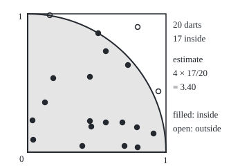
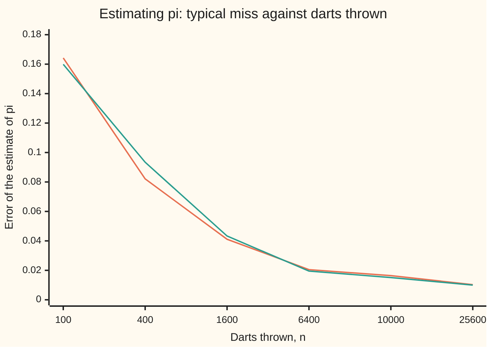

# Monte Carlo: an average of random draws, and the square-root-of-n error bar

[Syllabus](../../../SYLLABUS.md) → [Probability and statistics](../../../SYLLABUS.md#w09) → [Simulation](../../../SYLLABUS.md#w09-s11) → Monte Carlo

---

## General Overview

Draw a square board one metre on a side. From its bottom-left corner, draw a quarter circle of radius one metre. The quarter circle covers π/4 of the board, about 78.5 percent, because a full circle of radius 1 has area π and a quarter of it sits inside the square.

Now throw 10,000 darts so that each lands anywhere on the board with equal chance, independently of the others. A computer does the throwing: each dart is two random numbers between 0 and 1, its across and up positions. In the seeded run on this card, 7,856 darts land inside the quarter circle. The fraction inside is 0.7856, and four times it is 3.1424. That is π, estimated by throwing darts, and π is 3.141593.

An estimate without an error bar is half an answer. The same run also says how far off it is likely to be: about 0.016 either way. So the answer is **3.14 plus or minus 0.02**. Throw 100 times as many darts and the error bar shrinks tenfold, not a hundredfold. This way of estimating a number by averaging random draws is called **Monte Carlo**, after the casino; Nicholas Metropolis and Stanislaw Ulam published it under that name in 1949.

**Write the answer as an average of a random quantity, average many independent draws of it, and quote the result with its standard error: the spread of one draw divided by the square root of the number of draws.**

**What kind of fact this is:** a method. Its error bar rests on two theorems: the spread of an average of n draws is σ/√n, one draw's spread σ divided by the square root of n, proved on this card in Why it works, and the central limit theorem, stated in [Central limit theorem](../06-Limit%20Theorems%20in%20Practice/02-central-limit-theorem.md), which turns that spread into a 95 percent interval.

### The picture: the first 20 darts

<p align="center"></p>

The square is the board, one unit a side; the shaded region is the quarter circle. Filled dots are darts inside, open dots are outside. Twenty darts already give 3.40. Ten thousand give 3.1424.

---

## The formula

Notation first, in words. A reminder from shelf 02: E[X] is the average value of X in the long run and Var(X) is its variance, the average squared distance from that mean. A hat marks an estimate, as on shelf 07: $\hat I_n$ is the estimate of $I$ from $n$ draws. The Greek letter σ (sigma) is the spread of one draw, its standard deviation; s is the same spread measured from the draws of one run.

The integral to estimate is written as an average of a function $g$ of a random point $U$:

$$I = E[g(U)], \qquad \hat I_n = \frac{1}{n}\sum_{i=1}^{n} X_i, \quad X_i = g(U_i)$$

**Read it aloud:** the target is the long-run average of g at a random point; the estimate is the plain average of g at n random points.

$$\mathrm{SE} = \frac{\sigma}{\sqrt n}, \qquad \sigma^2 = \mathrm{Var}(X_i), \qquad \text{95 percent interval: } \hat I_n \pm 1.96\,\frac{s}{\sqrt n}$$

**Read it aloud:** the estimate's typical miss is one draw's spread divided by the square root of the number of draws; in practice s stands in for σ, and 1.96 of those errors either side catches the truth in about 95 runs out of 100.

For the darts, $U$ is a point $(x, y)$ in the square and $g$ scores 4 for a dart inside the quarter circle and 0 for one outside. The chance of scoring 4 is $p = \pi/4$, so

$$\sigma = 4\sqrt{p(1-p)} = 1.642183, \qquad s = 4\sqrt{\hat p(1-\hat p)}\sqrt{\frac{n}{n-1}}$$

In words: a score that is 4 or 0 has spread 4 times the spread of a yes-or-no count; the second formula is the same thing measured from the run, with the usual n − 1 correction from shelf 07.

| Symbol | Plain meaning | In our example | Push it up and the answer… |
| --- | --- | --- | --- |
| $n$ | number of independent draws | 10,000 darts | error bar shrinks as 1/√n |
| $U$, $x$, $y$ | one random point, and its across and up positions; in Step 1, also a single uniform number on 0 to 1 | a dart on the board | — |
| $a$, $b$ | the ends of an interval, when the integral runs from a to b instead of 0 to 1 | 0 and 1 for the curve heights | — |
| $g$ | the function whose average is wanted | 4 inside, 0 outside | — |
| $X_i$ | the i-th draw's score, g of the i-th point | 4 or 0 | — |
| $Z_i$ | the i-th draw's miss, $X_i - I$, used in the Detailed proof | 4 − π or −π | — |
| $I$ | the true value, an integral written as an average | π = 3.141593 | — |
| $\hat I_n$ | the estimate: the average of n scores | 3.1424 | — |
| $\sigma$ | spread of one score, its standard deviation | 1.642183 | wider error bar |
| $s$ | the same spread measured from the run | 1.641704 | wider error bar |
| $\mathrm{SE}$ | standard error: the estimate's typical miss, σ/√n | 0.016417 | — |
| $z$, $\Phi$ | Φ is the standard bell's area to the left; z = 1.96 has area 0.975 left of it | 1.959964 | wider interval, higher coverage |
| $p$, $\hat p$, $K$ | chance a dart lands inside; the fraction that did; the count inside | 0.785398; 0.7856; 7,856 | — |
| $\varepsilon$ | a chosen tolerance for the miss | 0.01 | fewer darts needed |

### When it holds

- **Draws independent of each other.** If the two numbers of a dart are the same number, every dart lands on the diagonal and the estimate settles on 2.8284, not π; more darts only make it more precisely wrong.
- **Draws from the intended law.** The average targets E[g(U)] for whatever law U actually follows; a generator that favours one corner estimates a different number. The generator is the subject of [Random numbers from a computer](01-pseudo-random-numbers.md).
- **Finite mean** for the average to settle, and **finite variance** for σ/√n to mean anything. In the infinite-variance test under What breaks, the 95 percent interval covered the truth in only 110 of 200 runs.
- **Enough draws for the bell.** The 1.96 comes from the central limit theorem, a statement about large n. With few darts, or a target hit very rarely, the bell is a poor fit and the interval's coverage drifts from 95 percent.

---

## Why it works

### Step 0: an area is a chance, and a chance is an average

A dart lands uniformly on a board of area 1. The chance it lands in a region equals the region's area. A chance is the long-run average of a score that is 1 on a hit and 0 on a miss. So an area, which is an integral, is a long-run average, and a long-run average can be estimated by an actual average.

### Step 1: write π as an average

Score each dart 4 inside the quarter circle and 0 outside. The long-run average score is 4 times the chance of a hit, $4 \times \pi/4 = \pi$. Any integral over the unit interval works the same way: if U is now a single uniform number on 0 to 1, then E[g(U)] is the integral of g from 0 to 1, because every stretch of the interval gets a chance equal to its length. The quarter circle's upper edge is the curve $y = \sqrt{1 - x^2}$, so π is also the average of $4\sqrt{1-x^2}$ at a random x. That second way reads the curve's height instead of counting hits; the code runs it too. On an interval from a to b, average $(b-a)\,g(a + (b-a)U)$: the factor b − a is the interval's length.

### Step 2: the average is right on average

Expectation passes through sums and constants (shelf 02). So $E[\hat I_n] = \frac1n(E[X_1] + \dots + E[X_n]) = I$. The estimator has no bias: it aims at the truth. Across 200 repeated runs of 10,000 darts, the estimates averaged 3.1415.

### Step 3: its spread is σ divided by root n

Variances of independent quantities add: the variance of $X_1 + \dots + X_n$ is $n\sigma^2$. Dividing the sum by n divides its variance by $n^2$. So the average has variance $\sigma^2/n$ and standard deviation $\sigma/\sqrt n$. The cancellation from $n^2$ to $n$ is the whole story: n draws add n units of variance, but spreads are square roots of variances, so the typical miss falls only as $1/\sqrt n$. Four times the draws halve the error; a hundred times the draws buy one more decimal place.

<details>
<summary>Detailed proof</summary>

Write $Z_i = X_i - I$, the i-th draw's miss. Each has mean 0 and variance $\sigma^2$. The estimate misses by the average miss, $\hat I_n - I = \frac1n(Z_1 + \dots + Z_n)$. Square it and take expectations:
$$E\big[(\hat I_n - I)^2\big] = \frac{1}{n^2}\sum_{i=1}^{n}\sum_{j=1}^{n} E[Z_i Z_j].$$
For i ≠ j, independence gives $E[Z_i Z_j] = E[Z_i]\,E[Z_j] = 0$: the cross terms vanish. Only the n diagonal terms survive, each equal to $\sigma^2$. So the mean squared miss is $n\sigma^2/n^2 = \sigma^2/n$. Because the estimate has no bias, this is its variance, and its square root σ/√n is its standard error. Nothing here needs a bell curve: the formula holds exactly at every n, as long as σ is finite.

Chebyshev's inequality (shelf 02) then gives a guarantee with no limit theorem at all:
$$P\big(|\hat I_n - I| \ge \varepsilon\big) \le \frac{\sigma^2}{n\varepsilon^2}.$$
Set the right side to 0.05 and solve for n.

</details>

### Step 4: from a spread to an interval

The central limit theorem says the average of many independent draws with finite variance is close to bell-shaped around I, with spread σ/√n. The standard bell puts 95 percent of its area within 1.96 spreads of its centre. So $\hat I_n \pm 1.96\,\sigma/\sqrt n$ catches I in about 95 percent of runs. That is a statement about the method: of 200 runs, 193 intervals caught π. Any one interval either contains π or it does not.

Chebyshev gives the same kind of promise without the bell, at a price. To be within 0.01 of π with 95 percent confidence, the bell asks for 103,595 darts; Chebyshev's guarantee asks for 539,353, about five times as many.

### Step 5: measure σ from the run

σ is usually unknown, since it depends on the answer. Replace it with s, the spread of the scores the run produced. For the darts, $s = 1.641704$ against the true 1.642183. Using s in place of σ leaves the 95 percent coverage intact as n grows; the proof is in [Delta method](../06-Limit%20Theorems%20in%20Practice/05-delta-method-and-slutsky.md).

### The other door: a grid

Instead of random darts, put one dart at the centre of each cell of a 100 by 100 grid. The same 10,000 points give 3.142800, an error of about 0.0012, better than the random darts' 0.016. In two dimensions a grid wins. The grid loses as the dimension grows: in d dimensions, n points give only the d-th root of n points along each direction, while Monte Carlo's σ/√n has no d in it. That trade is the subject of Many dimensions.

---

## Worked numbers, by hand

The seeded run: 10,000 darts, seed 1946.

| Step | Arithmetic | Value |
| --- | --- | --- |
| darts inside | counted | 7,856 |
| fraction inside, p-hat | 7,856 / 10,000 | 0.7856 |
| estimate of π | 4 × 0.7856 | 3.1424 |
| spread of one score, s | 4 × √(0.7856 × (1 − 0.7856)) × √(n / (n − 1)) | 1.641704 |
| standard error | 1.641704 / √10,000 | 0.016417 |
| 95 percent interval | 3.1424 ± 1.959964 × 0.016417 | 3.1102 to 3.1746 |
| **answer** | estimate ± one standard error, rounded | **3.14 ± 0.02** |

The truth, 3.141593, sits 0.0008 below the estimate: 0.05 standard errors, a lucky run. The method's promise is about runs in general; the chart below tests it on 200 of them.

### The picture: the error bar against the number of darts



First line (orange): the true standard error σ/√n. Second line (green): the root-mean-square miss of 200 independent runs at each n. Each fourfold step in darts halves both; the categories are not evenly spaced in n.

### What breaks if you drop a piece

| Mistake | Comes out at | What went wrong |
| --- | --- | --- |
| One random number for both positions | 2.7940 ± 0.0184; exact limit 2.8284 | the draws inside a dart are not independent, so every dart lies on the diagonal |
| Error bar s/n instead of s/√n | ± 0.000164; covers π in 3 of 200 runs | variances add, spreads do not |
| Average of 0.2 x^−0.8 on 0 to 1, true value 1 | nominal 95 percent intervals cover 1 in 110 of 200 runs | infinite variance: rare huge draws, so s and the bell both mislead |
| Forgetting the 4 | 0.7856 | that is the fraction inside, π/4 |

---

## Code, from first principles, and it actually runs

Both programs reach π three independent ways: Machin's arctangent series (π = 16 arctan(1/5) − 4 arctan(1/239), summed term by term), a deterministic grid of cell centres counted in whole numbers, and seeded darts from a SplitMix64 generator written out in each language, so Python and Rust draw the same numbers. Then 200 repeated runs check that the miss shrinks as σ/√n and that 95 percent intervals cover π about 95 percent of the time. The normal quantile 1.96 comes from the bell's area summed as a series and solved by halving an interval, then checked by Simpson's rule; nothing imported knows it. Every what-breaks number is reproduced.

### Python

```python
# Monte Carlo estimates and error -- the check behind the card.  Standard library only.
# Pi from 10,000 darts thrown at a unit square, with its standard error.
# Road 1: exact values: pi from Machin's arctangent series, sigma from p = pi / 4.
# Road 2: a deterministic grid, every cell centre of the square counted.
# Road 3: seeded simulation from a SplitMix64 generator written out below.
from math import sqrt, exp
SEED, N, R = 1946, 10000, 200                   # darts per run, repeated runs
CHECK = (100, 400, 1600, 6400, 10000, 25600)    # dart counts watched inside each repeated run
MASK, state = (1 << 64) - 1, SEED

def u():                                        # one uniform number in [0, 1), from SplitMix64
    global state
    state = (state + 0x9E3779B97F4A7C15) & MASK
    z = state
    z = ((z ^ (z >> 30)) * 0xBF58476D1CE4E5B9) & MASK
    z = ((z ^ (z >> 27)) * 0x94D049BB133111EB) & MASK
    return ((z ^ (z >> 31)) >> 11) / 9007199254740992.0

def atan_series(x):                             # x - x^3/3 + x^5/5 - ...
    term, total, k = x, 0.0, 0
    while abs(term) > 1e-18:
        total += term / (2 * k + 1)
        term *= -x * x
        k += 1
    return total

def Phi(z):                                     # standard normal area left of z, by series
    term, total = z, z
    for k in range(1, 300):
        term *= -z * z / (2 * k)
        total += term / (2 * k + 1)
    return 0.5 + total / sqrt(2 * 3.141592653589793)

def quantile(q):                                # Phi^(-1)(q) by bisection
    lo, hi = 0.0, 8.0
    for _ in range(100):
        mid = (lo + hi) / 2
        lo, hi = (mid, hi) if Phi(mid) < q else (lo, mid)
    return (lo + hi) / 2

PI = 16 * atan_series(1 / 5) - 4 * atan_series(1 / 239)
p, z = PI / 4, quantile(0.975)
sigma = 4 * sqrt(p * (1 - p))                   # spread of one dart's score, 4 or 0
print(f"road 1, exact: pi {PI:.6f}, p = pi/4 {p:.6f}, sigma = 4 sqrt(p(1-p)) {sigma:.6f}")
print(f"  z for 95% {z:.6f}; true standard error at {N} darts {sigma / sqrt(N):.6f}")

for m in (100, 1000):
    inside = sum(1 for i in range(m) for j in range(m)
                 if (2 * i + 1) ** 2 + (2 * j + 1) ** 2 <= 4 * m * m)
    grid = 4 * inside / m / m
    print(f"road 2, grid of {m}x{m} cell centres: {inside} inside, 4 x fraction {grid:.6f}")

darts, K = [], 0
for i in range(N):
    x, y = u(), u()
    K += x * x + y * y <= 1.0
    if i < 20:
        darts.append((x, y))
p_hat, pi_hat = K / N, 4 * K / N
s = sqrt(16 * p_hat * (1 - p_hat) * N / (N - 1)); se = s / sqrt(N)
print(f"road 3, {N} darts, seed {SEED}: {K} inside, fraction {p_hat:.4f}, estimate {pi_hat:.4f}")
print(f"  sample spread s {s:.6f}, standard error s/root n {se:.6f}")
print(f"  95% interval {pi_hat - z * se:.4f} to {pi_hat + z * se:.4f}; miss from pi {pi_hat - PI:.4f}"
      f" = {(pi_hat - PI) / se:.2f} standard errors")
for a in (0, 10):
    print(f"figure, darts {a + 1}-{a + 10} (x, y, 1 = inside): " + " ".join(
        f"({40 + 200 * x:.0f},{220 - 200 * y:.0f},{int(x * x + y * y <= 1.0)})" for x, y in darts[a:a + 10]))
h20 = sum(1 for x, y in darts if x * x + y * y <= 1.0)
print(f"figure, first 20 darts: {h20} inside, estimate 4 x {h20}/20 = {4 * h20 / 20:.2f}")

g1 = g2 = 0.0
for _ in range(N):
    g = 4 * sqrt(1 - u() ** 2)                  # height of the curve at a random x
    g1, g2 = g1 + g, g2 + g * g
semi, s_semi = g1 / N, sqrt((g2 - g1 * g1 / N) / (N - 1))
sig_semi = sqrt(32 / 3 - PI * PI)          # spread of one height: E[16(1 - x^2)] = 32/3
print(f"curve heights 4 sqrt(1 - x^2), {N} draws: estimate {semi:.4f}, s {s_semi:.6f} (exact {sig_semi:.6f}),"
      f" standard error {s_semi / sqrt(N):.6f}")

est, cover, cover_n = {c: [] for c in CHECK}, 0, 0
for _ in range(R):
    k = 0
    for i in range(1, CHECK[-1] + 1):
        x, y = u(), u()
        k += x * x + y * y <= 1.0
        if i in est:
            est[i].append(4 * k / i)
            if i == N:
                q = k / N
                sr = sqrt(16 * q * (1 - q) * N / (N - 1))
                cover += abs(4 * q - PI) <= z * sr / sqrt(N)
                cover_n += abs(4 * q - PI) <= z * sr / N
print(f"{R} repeated runs: n, true standard error sigma/root n, observed root-mean-square miss")
rms = {c: sqrt(sum((e - PI) * (e - PI) for e in est[c]) / R) for c in CHECK}
for c in CHECK:
    print(f"  {c:>5}  {sigma / sqrt(c):.4f}  {rms[c]:.4f}")
mean10 = sum(est[N]) / R
spread10 = sqrt(sum((e - mean10) * (e - mean10) for e in est[N]) / (R - 1))
print(f"  at {N}: mean of estimates {mean10:.4f}, their spread {spread10:.6f}")
print(f"  95% intervals covering pi: {cover} of {R} = {cover / R:.3f}")
clt_n = (z * sigma / 0.01) * (z * sigma / 0.01)
print(f"darts for +/- 0.01 at 95%: CLT (z sigma / 0.01)^2 = {clt_n:.0f};"
      f" Chebyshev sigma^2 / (0.05 x 0.01^2) = {sigma * sigma / (0.05 * 0.0001):.0f}")

print(f"what breaks, the right answer is {pi_hat:.4f} +/- {se:.4f}")
kb = 0
for _ in range(N):
    w = u()
    kb += w * w + w * w <= 1.0                  # one random number used for both coordinates
qb = kb / N
print(f"  same number for x and y: {4 * qb:.4f} +/- {4 * sqrt(qb * (1 - qb) / N):.4f};"
      f" exact 4/root 2 = {4 / sqrt(2):.4f}")
print(f"  error bar s/n, not s/root n: +/- {s / N:.6f}; covers pi in {cover_n} of {R} runs")
print(f"  forgetting the 4: {p_hat:.4f}")
heavy = 0
for _ in range(R):
    h1 = h2 = 0.0
    for _ in range(N):
        h = 0.2 * (1 - u()) ** -0.8             # integral over [0, 1] is 1, variance infinite
        h1, h2 = h1 + h, h2 + h * h
    hs = sqrt((h2 - h1 * h1 / N) / (N - 1))
    heavy += abs(h1 / N - 1) <= z * hs / sqrt(N)
print(f"  infinite variance, 0.2 x^-0.8 on [0, 1]: 95% intervals cover 1 in {heavy} of {R} runs")
print(f"try: 40000 darts, standard error {sigma / sqrt(40000):.4f}; 1000000 darts {sigma / sqrt(1000000):.4f};"
      f" curve heights at 10000 {sig_semi / sqrt(N):.4f}")
assert abs(grid - PI) < 1e-3, "grid count vs Machin's series"
assert abs(sum((1 if k in (0, 1000) else 4 if k % 2 else 2) * exp(-(k * z / 1000) ** 2 / 2) for k in range(1001))
           * z / 3000 / sqrt(2 * PI) - 0.475) < 1e-9, "z: bell area 0 to z by Simpson's rule is 0.475"
assert abs(mean10 - PI) < 4 * sigma / sqrt(N * R), "estimates average to pi: no bias"
assert abs(pi_hat - PI) < 4 * se, "simulation vs exact pi"
assert abs(s - sigma) < 4 * 2 * (2 * p - 1) / sqrt(N), "sample spread vs 4 sqrt(p(1-p)): s has se 2(2p-1)/root n"
assert abs(spread10 - sigma / sqrt(N)) < 4 * sigma / sqrt(N) / sqrt(2 * R), "spread of runs vs sigma/root n"
for c in CHECK:
    assert abs(rms[c] / (sigma / sqrt(c)) - 1) < 4 / sqrt(2 * R), "miss shrinks as 1/root n"
assert abs(cover / R - 0.95) < 4 * sqrt(0.95 * 0.05 / R), "coverage vs 95%"
assert abs(semi - PI) < 4 * s_semi / sqrt(N), "curve heights vs exact pi"
assert abs(s_semi - sig_semi) < 0.02, "curve heights' spread vs sqrt(32/3 - pi^2)"
assert abs(4 * qb - 4 / sqrt(2)) < 4 * 4 * sqrt(qb * (1 - qb) / N), "shared number lands on 4/root 2"
assert heavy / R < 0.95 - 4 * sqrt(0.95 * 0.05 / R), "infinite variance breaks the interval"
print("ALL CHECKS PASS")
```

**Ran 2026-10-06 on macOS, Python 3.14.6, standard library only. All checks passed. Output, pasted from the run:**

```
road 1, exact: pi 3.141593, p = pi/4 0.785398, sigma = 4 sqrt(p(1-p)) 1.642183
  z for 95% 1.959964; true standard error at 10000 darts 0.016422
road 2, grid of 100x100 cell centres: 7857 inside, 4 x fraction 3.142800
road 2, grid of 1000x1000 cell centres: 785419 inside, 4 x fraction 3.141676
road 3, 10000 darts, seed 1946: 7856 inside, fraction 0.7856, estimate 3.1424
  sample spread s 1.641704, standard error s/root n 0.016417
  95% interval 3.1102 to 3.1746; miss from pi 0.0008 = 0.05 standard errors
figure, darts 1-10 (x, y, 1 = inside): (72,22,0) (130,111,1) (199,39,0) (199,213,1) (47,174,1) (77,113,1) (177,177,1) (222,193,1) (48,202,1) (153,74,1)
figure, darts 11-20 (x, y, 1 = inside): (142,48,1) (180,211,1) (153,177,1) (229,132,0) (130,175,1) (132,183,1) (185,94,1) (65,148,1) (198,184,1) (119,211,1)
figure, first 20 darts: 17 inside, estimate 4 x 17/20 = 3.40
curve heights 4 sqrt(1 - x^2), 10000 draws: estimate 3.1318, s 0.897975 (exact 0.892783), standard error 0.008980
200 repeated runs: n, true standard error sigma/root n, observed root-mean-square miss
    100  0.1642  0.1599
    400  0.0821  0.0934
   1600  0.0411  0.0433
   6400  0.0205  0.0195
  10000  0.0164  0.0151
  25600  0.0103  0.0100
  at 10000: mean of estimates 3.1415, their spread 0.015132
  95% intervals covering pi: 193 of 200 = 0.965
darts for +/- 0.01 at 95%: CLT (z sigma / 0.01)^2 = 103595; Chebyshev sigma^2 / (0.05 x 0.01^2) = 539353
what breaks, the right answer is 3.1424 +/- 0.0164
  same number for x and y: 2.7940 +/- 0.0184; exact 4/root 2 = 2.8284
  error bar s/n, not s/root n: +/- 0.000164; covers pi in 3 of 200 runs
  forgetting the 4: 0.7856
  infinite variance, 0.2 x^-0.8 on [0, 1]: 95% intervals cover 1 in 110 of 200 runs
try: 40000 darts, standard error 0.0082; 1000000 darts 0.0016; curve heights at 10000 0.0089
ALL CHECKS PASS
```

### Rust

```rust
// Monte Carlo estimates and error -- the check behind the card.  Rust std only.
// Pi from 10,000 darts thrown at a unit square, with its standard error.
// Road 1: exact values: pi from Machin's arctangent series, sigma from p = pi / 4.
// Road 2: a deterministic grid, every cell centre of the square counted.
// Road 3: seeded simulation from a SplitMix64 generator written out below.
const SEED: u64 = 1946;
const N: usize = 10000; const R: usize = 200; // darts per run, repeated runs
const CHECK: [usize; 6] = [100, 400, 1600, 6400, 10000, 25600]; // dart counts watched inside each run

struct SplitMix(u64);
impl SplitMix {
    fn u(&mut self) -> f64 { // one uniform number in [0, 1)
        self.0 = self.0.wrapping_add(0x9E3779B97F4A7C15);
        let mut z = self.0;
        z = (z ^ (z >> 30)).wrapping_mul(0xBF58476D1CE4E5B9);
        z = (z ^ (z >> 27)).wrapping_mul(0x94D049BB133111EB);
        ((z ^ (z >> 31)) >> 11) as f64 / 9007199254740992.0
    }
}

fn atan_series(x: f64) -> f64 { // x - x^3/3 + x^5/5 - ...
    let (mut term, mut total, mut k) = (x, 0.0, 0.0);
    while term.abs() > 1e-18 {
        total += term / (2.0 * k + 1.0);
        term *= -x * x;
        k += 1.0;
    }
    total
}

fn phi_cdf(z: f64) -> f64 { // standard normal area left of z, by series
    let (mut term, mut total) = (z, z);
    for k in 1..300 {
        let k = k as f64;
        term *= -z * z / (2.0 * k);
        total += term / (2.0 * k + 1.0);
    }
    0.5 + total / (2.0 * 3.141592653589793f64).sqrt()
}

fn quantile(q: f64) -> f64 { // Phi^(-1)(q) by bisection
    let (mut lo, mut hi) = (0.0, 8.0);
    for _ in 0..100 {
        let mid = (lo + hi) / 2.0;
        if phi_cdf(mid) < q { lo = mid } else { hi = mid }
    }
    (lo + hi) / 2.0
}

fn inside(x: f64, y: f64) -> bool { x * x + y * y <= 1.0 }

fn main() {
    let mut g = SplitMix(SEED);
    let (nf, rf) = (N as f64, R as f64);
    let pi = 16.0 * atan_series(1.0 / 5.0) - 4.0 * atan_series(1.0 / 239.0);
    let (p, z) = (pi / 4.0, quantile(0.975));
    let sigma = 4.0 * (p * (1.0 - p)).sqrt(); // spread of one dart's score, 4 or 0
    println!("road 1, exact: pi {:.6}, p = pi/4 {:.6}, sigma = 4 sqrt(p(1-p)) {:.6}", pi, p, sigma);
    println!("  z for 95% {:.6}; true standard error at {} darts {:.6}", z, N, sigma / nf.sqrt());
    let mut grid = 0.0;
    for m in [100i64, 1000] {
        let count = (0..m).flat_map(|i| (0..m).map(move |j| (i, j)))
            .filter(|&(i, j)| (2 * i + 1) * (2 * i + 1) + (2 * j + 1) * (2 * j + 1) <= 4 * m * m).count();
        grid = 4.0 * count as f64 / m as f64 / m as f64;
        println!("road 2, grid of {}x{} cell centres: {} inside, 4 x fraction {:.6}", m, m, count, grid);
    }
    let (mut darts, mut k_hits) = (Vec::new(), 0usize);
    for i in 0..N {
        let (x, y) = (g.u(), g.u());
        if inside(x, y) { k_hits += 1; }
        if i < 20 { darts.push((x, y)); }
    }
    let (p_hat, pi_hat) = (k_hits as f64 / nf, 4.0 * k_hits as f64 / nf);
    let s = (16.0 * p_hat * (1.0 - p_hat) * nf / (nf - 1.0)).sqrt();
    let se = s / nf.sqrt();
    println!("road 3, {} darts, seed {}: {} inside, fraction {:.4}, estimate {:.4}", N, SEED, k_hits, p_hat, pi_hat);
    println!("  sample spread s {:.6}, standard error s/root n {:.6}", s, se);
    println!("  95% interval {:.4} to {:.4}; miss from pi {:.4} = {:.2} standard errors",
             pi_hat - z * se, pi_hat + z * se, pi_hat - pi, (pi_hat - pi) / se);
    for a in [0usize, 10] {
        let row: Vec<String> = darts[a..a + 10].iter()
            .map(|&(x, y)| format!("({:.0},{:.0},{})", 40.0 + 200.0 * x, 220.0 - 200.0 * y, inside(x, y) as i32))
            .collect();
        println!("figure, darts {}-{} (x, y, 1 = inside): {}", a + 1, a + 10, row.join(" "));
    }
    let h20 = darts.iter().filter(|&&(x, y)| inside(x, y)).count();
    println!("figure, first 20 darts: {} inside, estimate 4 x {}/20 = {:.2}", h20, h20, 4.0 * h20 as f64 / 20.0);
    let (mut g1, mut g2) = (0.0, 0.0);
    for _ in 0..N {
        let h = 4.0 * (1.0 - g.u().powi(2)).sqrt(); // height of the curve at a random x
        g1 += h; g2 += h * h;
    }
    let (semi, s_semi) = (g1 / nf, ((g2 - g1 * g1 / nf) / (nf - 1.0)).sqrt());
    let sig_semi = (32.0 / 3.0 - pi * pi).sqrt(); // spread of one height: E[16(1 - x^2)] = 32/3
    println!("curve heights 4 sqrt(1 - x^2), {} draws: estimate {:.4}, s {:.6} (exact {:.6}), standard error {:.6}",
             N, semi, s_semi, sig_semi, s_semi / nf.sqrt());
    let mut est: Vec<Vec<f64>> = vec![Vec::new(); CHECK.len()];
    let (mut cover, mut cover_n) = (0usize, 0usize);
    for _ in 0..R {
        let mut k = 0usize;
        for i in 1..=CHECK[CHECK.len() - 1] {
            let (x, y) = (g.u(), g.u());
            if inside(x, y) { k += 1; }
            if let Some(c) = CHECK.iter().position(|&c| c == i) {
                est[c].push(4.0 * k as f64 / i as f64);
                if i == N {
                    let q = k as f64 / nf;
                    let sr = (16.0 * q * (1.0 - q) * nf / (nf - 1.0)).sqrt();
                    if (4.0 * q - pi).abs() <= z * sr / nf.sqrt() { cover += 1; }
                    if (4.0 * q - pi).abs() <= z * sr / nf { cover_n += 1; }
                }
            }
        }
    }
    println!("{} repeated runs: n, true standard error sigma/root n, observed root-mean-square miss", R);
    let mut rms = Vec::new();
    for (ci, &c) in CHECK.iter().enumerate() {
        let r = (est[ci].iter().map(|e| (e - pi) * (e - pi)).sum::<f64>() / rf).sqrt();
        rms.push(r);
        println!("  {:>5}  {:.4}  {:.4}", c, sigma / (c as f64).sqrt(), r);
    }
    let mean10 = est[4].iter().sum::<f64>() / rf;
    let spread10 = (est[4].iter().map(|e| (e - mean10) * (e - mean10)).sum::<f64>() / (rf - 1.0)).sqrt();
    println!("  at {}: mean of estimates {:.4}, their spread {:.6}", N, mean10, spread10);
    println!("  95% intervals covering pi: {} of {} = {:.3}", cover, R, cover as f64 / rf);
    let clt_n = (z * sigma / 0.01) * (z * sigma / 0.01);
    println!("darts for +/- 0.01 at 95%: CLT (z sigma / 0.01)^2 = {:.0}; Chebyshev sigma^2 / (0.05 x 0.01^2) = {:.0}",
             clt_n, sigma * sigma / (0.05 * 0.0001));
    println!("what breaks, the right answer is {:.4} +/- {:.4}", pi_hat, se);
    let mut kb = 0usize;
    for _ in 0..N {
        let w = g.u();
        if inside(w, w) { kb += 1; } // one random number used for both coordinates
    }
    let qb = kb as f64 / nf;
    let se_b = 4.0 * (qb * (1.0 - qb) / nf).sqrt();
    println!("  same number for x and y: {:.4} +/- {:.4}; exact 4/root 2 = {:.4}", 4.0 * qb, se_b, 4.0 / 2f64.sqrt());
    println!("  error bar s/n, not s/root n: +/- {:.6}; covers pi in {} of {} runs", s / nf, cover_n, R);
    println!("  forgetting the 4: {:.4}", p_hat);
    let mut heavy = 0usize;
    for _ in 0..R {
        let (mut h1, mut h2) = (0.0, 0.0);
        for _ in 0..N {
            let h = 0.2 * (1.0 - g.u()).powf(-0.8); // integral over [0, 1] is 1, variance infinite
            h1 += h; h2 += h * h;
        }
        let hs = ((h2 - h1 * h1 / nf) / (nf - 1.0)).sqrt();
        if (h1 / nf - 1.0).abs() <= z * hs / nf.sqrt() { heavy += 1; }
    }
    println!("  infinite variance, 0.2 x^-0.8 on [0, 1]: 95% intervals cover 1 in {} of {} runs", heavy, R);
    println!("try: 40000 darts, standard error {:.4}; 1000000 darts {:.4}; curve heights at 10000 {:.4}",
             sigma / 40000f64.sqrt(), sigma / 1000000f64.sqrt(), sig_semi / nf.sqrt());
    assert!((grid - pi).abs() < 1e-3, "grid count vs Machin's series");
    let bell: f64 = (0..=1000).map(|k| (if k == 0 || k == 1000 { 1.0 } else if k % 2 == 1 { 4.0 } else { 2.0 })
        * (-(k as f64 * z / 1000.0).powi(2) / 2.0).exp()).sum();
    assert!((bell * z / 3000.0 / (2.0 * pi).sqrt() - 0.475).abs() < 1e-9, "z: bell area 0 to z by Simpson's rule is 0.475");
    assert!((mean10 - pi).abs() < 4.0 * sigma / (nf * rf).sqrt(), "estimates average to pi: no bias");
    assert!((pi_hat - pi).abs() < 4.0 * se, "simulation vs exact pi");
    assert!((s - sigma).abs() < 4.0 * 2.0 * (2.0 * p - 1.0) / nf.sqrt(), "sample spread vs 4 sqrt(p(1-p)): s has se 2(2p-1)/root n");
    assert!((spread10 - sigma / nf.sqrt()).abs() < 4.0 * sigma / nf.sqrt() / (2.0 * rf).sqrt(), "spread of runs");
    for (ci, &c) in CHECK.iter().enumerate() {
        assert!((rms[ci] / (sigma / (c as f64).sqrt()) - 1.0).abs() < 4.0 / (2.0 * rf).sqrt(), "miss shrinks as 1/root n");
    }
    assert!((cover as f64 / rf - 0.95).abs() < 4.0 * (0.95 * 0.05 / rf).sqrt(), "coverage vs 95%");
    assert!((semi - pi).abs() < 4.0 * s_semi / nf.sqrt(), "curve heights vs exact pi");
    assert!((s_semi - sig_semi).abs() < 0.02, "curve heights' spread vs sqrt(32/3 - pi^2)");
    assert!((4.0 * qb - 4.0 / 2f64.sqrt()).abs() < 4.0 * se_b, "shared number lands on 4/root 2");
    assert!((heavy as f64 / rf) < 0.95 - 4.0 * (0.95 * 0.05 / rf).sqrt(), "infinite variance breaks the interval");
    println!("ALL CHECKS PASS");
}
```

**Ran 2026-10-06 on macOS, rustc 1.98.1, no crates. All checks passed. Output, pasted from the run:**

```
road 1, exact: pi 3.141593, p = pi/4 0.785398, sigma = 4 sqrt(p(1-p)) 1.642183
  z for 95% 1.959964; true standard error at 10000 darts 0.016422
road 2, grid of 100x100 cell centres: 7857 inside, 4 x fraction 3.142800
road 2, grid of 1000x1000 cell centres: 785419 inside, 4 x fraction 3.141676
road 3, 10000 darts, seed 1946: 7856 inside, fraction 0.7856, estimate 3.1424
  sample spread s 1.641704, standard error s/root n 0.016417
  95% interval 3.1102 to 3.1746; miss from pi 0.0008 = 0.05 standard errors
figure, darts 1-10 (x, y, 1 = inside): (72,22,0) (130,111,1) (199,39,0) (199,213,1) (47,174,1) (77,113,1) (177,177,1) (222,193,1) (48,202,1) (153,74,1)
figure, darts 11-20 (x, y, 1 = inside): (142,48,1) (180,211,1) (153,177,1) (229,132,0) (130,175,1) (132,183,1) (185,94,1) (65,148,1) (198,184,1) (119,211,1)
figure, first 20 darts: 17 inside, estimate 4 x 17/20 = 3.40
curve heights 4 sqrt(1 - x^2), 10000 draws: estimate 3.1318, s 0.897975 (exact 0.892783), standard error 0.008980
200 repeated runs: n, true standard error sigma/root n, observed root-mean-square miss
    100  0.1642  0.1599
    400  0.0821  0.0934
   1600  0.0411  0.0433
   6400  0.0205  0.0195
  10000  0.0164  0.0151
  25600  0.0103  0.0100
  at 10000: mean of estimates 3.1415, their spread 0.015132
  95% intervals covering pi: 193 of 200 = 0.965
darts for +/- 0.01 at 95%: CLT (z sigma / 0.01)^2 = 103595; Chebyshev sigma^2 / (0.05 x 0.01^2) = 539353
what breaks, the right answer is 3.1424 +/- 0.0164
  same number for x and y: 2.7940 +/- 0.0184; exact 4/root 2 = 2.8284
  error bar s/n, not s/root n: +/- 0.000164; covers pi in 3 of 200 runs
  forgetting the 4: 0.7856
  infinite variance, 0.2 x^-0.8 on [0, 1]: 95% intervals cover 1 in 110 of 200 runs
try: 40000 darts, standard error 0.0082; 1000000 darts 0.0016; curve heights at 10000 0.0089
ALL CHECKS PASS
```

The two outputs are identical line for line.

> [!TIP]
> **Try changing**
> - **40,000 darts instead of 10,000.** Guess first: four times the work. The standard error falls from 0.0164 to 0.0082, exactly half.
> - **1,000,000 darts.** Guess first: 100 times the work. The standard error is 0.0016: one more correct decimal place, no more.
> - **Read heights instead of counting hits.** Average $4\sqrt{1-x^2}$ at 10,000 random x. Guess first: same cost, same target. The standard error drops to 0.0089 against the darts' 0.0164, because a height varies less than a 4-or-0 score. Shrinking σ is the other lever, pulled in [Variance reduction](05-variance-reduction.md).
> - **Change the seed.** Guess first: does 3.1424 survive? No: each seed gives its own estimate, but about 95 in 100 of their intervals still contain π; the 200 runs above caught it 193 times.

---

## The usual mistake

> [!warning]
> **Reading the error bar as a guarantee about this run.** "3.1102 to 3.1746 at 95 percent" does not mean π has a 95 percent chance of being in that range. π is fixed; the interval is what varies. The 95 percent describes the method: across 200 runs, 7 intervals missed. The error bar is also only as good as the draws: it measures sampling noise, not a bug.
>
> - **Expecting error to fall like 1/n.** Ten times the darts buys √10, about a threefold, improvement. One more decimal place costs 100 times the darts: 0.0164 at 10,000, 0.0016 at 1,000,000.
> - **Trusting more draws to fix wrong draws.** The shared-number dart converges to 2.8284 with a tidy ± 0.0184. A small error bar around the wrong target is still wrong.
> - **Trusting a small s.** With infinite variance, most runs never meet the rare giant draw, so s comes out small and the interval too narrow: 110 of 200 covered.
> - **Dividing by n instead of √n.** The error bar becomes ± 0.000164, a hundred times too narrow, and covers π in 3 runs of 200.

---

## Where you meet it in real life

- **Physics at Los Alamos.** The method was built there in the late 1940s to follow neutrons through matter, where each neutron's path is a chain of random collisions and no formula gives the average. Metropolis and Ulam's 1949 paper named it.
- **Option pricing.** A price is a discounted average payoff over random futures; a bank simulates the futures and quotes the price with its standard error: [Monte Carlo pricing](../../12-Financial%20mathematics/06-Numerical%20Methods%20for%20Pricing/01-monte-carlo-pricing.md).
- **Computer graphics.** A film renderer estimates each pixel's brightness by averaging random light paths. The speckled noise in a quick render is σ/√n made visible; four times the paths halve it.
- **Polls.** A poll of 1,000 people is a Monte Carlo estimate with people as draws, and the quoted margin is 1.96 standard errors: [Confidence intervals](../08-Confidence%20Intervals%20and%20Tests/01-confidence-intervals.md).

> **Say it back**
> Many quantities, π among them, are averages of something random. Monte Carlo draws that something many times independently and takes the plain average. The average is right on average, and its typical miss is one draw's spread divided by root n, so four times the draws halve the error. The central limit theorem turns that miss into an interval that catches the truth in about 95 runs out of 100. Ten thousand darts give π as 3.14 plus or minus 0.02.

---

## What this builds on

- [Central limit theorem](../06-Limit%20Theorems%20in%20Practice/02-central-limit-theorem.md): the bell shape of an average's error, which turns σ/√n into a 95 percent interval.
- [Random numbers from a computer](01-pseudo-random-numbers.md): where the darts come from, and the SplitMix64 generator both programs use.

## Where this goes next

- [Variance reduction](05-variance-reduction.md): shrinking σ instead of buying more draws.
- [Monte Carlo pricing](../../12-Financial%20mathematics/06-Numerical%20Methods%20for%20Pricing/01-monte-carlo-pricing.md): an option's price as an average payoff, quoted with its standard error.
- [The Asian option desks trade](../../12-Financial%20mathematics/27-Averages%20-%20commodity%20swaps%20and%20Asian%20options/03-arithmetic-asian-option.md): a payoff with no closed formula, priced by simulation.
- [Investing over a lifetime](../../12-Financial%20mathematics/38-Performance%20and%20Multi-Period/05-life-cycle-and-glide-paths.md): simulated retirement savings paths and the spread of their outcomes.
- Monte Carlo integration: why σ/√n with no dimension in it beats a grid in high dimensions.
- Many dimensions: grids and random points compared as quadrature rules.
- Bumping a simulated price: what the noise does to a difference of two simulated numbers.

The error bar has two levers, n and σ, and n is the expensive one: a hundred times the work for one digit. Whether σ can be cut instead, at no extra draws, is the question [Variance reduction](05-variance-reduction.md) answers.

---

## Sources

Verified 2026-09-29: every link below resolves to the publisher's page.

- Metropolis, Nicholas, and S. Ulam. "The Monte Carlo Method." *Journal of the American Statistical Association* 44 (1949), 335–341. [DOI](https://doi.org/10.1080/01621459.1949.10483310). The paper that named the method.
- Owen, Art B. *Monte Carlo Theory, Methods and Examples*. [Author's book page](https://artowen.su.domains/mc/). Free; the chapter on simple Monte Carlo covers the σ/√n error, intervals and heavy tails.
- Glasserman, Paul. *Monte Carlo Methods in Financial Engineering*. Springer, 2003. [Publisher page](https://doi.org/10.1007/978-0-387-21617-1). Chapter 1 sets out the estimator, its standard error and the cost of accuracy.
- Steele, Guy L., Doug Lea, and Christine H. Flood. "Fast Splittable Pseudorandom Number Generators." OOPSLA 2014. [DOI](https://doi.org/10.1145/2660193.2660195). The SplitMix64 generator both programs use.
