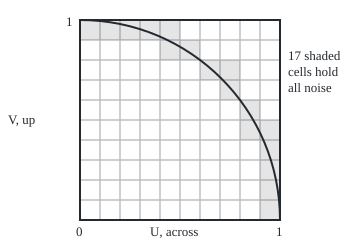
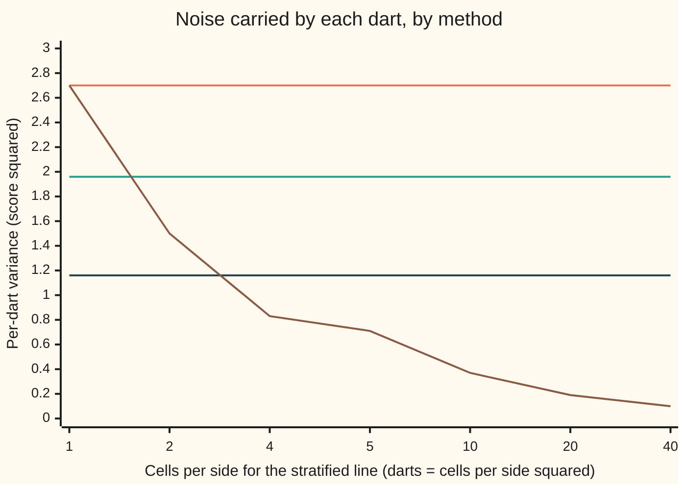

# Variance reduction: antithetic, control and stratified draws

[Syllabus](../../../SYLLABUS.md) → [Probability and statistics](../README.md) → [Simulation](../README.md#s11) → Variance reduction

---

## General Overview

A square board, one metre on each side, has a quarter circle drawn on it: radius one metre, centred on the lower-left corner. The quarter circle covers π/4 of the board, about 0.7854. Throw darts that land anywhere on the board with equal chance, score 4 for a dart inside the arc and 0 for one outside, and the average score settles on π.

One batch of 100 darts from the checks below averaged 3.2000. Plain sampling has a standard error of 0.1642: batch averages scatter around π by about that much ([Monte Carlo](04-monte-carlo-estimates-and-error.md)). The error shrinks only with the square root of the number of darts, so every extra digit costs a hundred times the darts.

The error is the spread of one dart's score over the square root of the count. Shrink the spread per dart and the same 100 darts land closer. Three classic ways do it without moving the average off π:

- **Mirror darts.** Throw a dart, then score its mirror image through the board's centre as well. When one of the pair lands out, the other tends to land in.
- **A side reading with a known average.** Every dart's squared distance from the corner has a known average, 2/3. A batch whose darts landed farther out than that has probably scored too few hits. Correct the score by a multiple of that known miss.
- **One dart per cell.** Cut the board into a 10 by 10 grid and throw exactly one dart into each cell. No region gets too many or too few.

On 100 darts the three give standard errors of 0.1400, 0.1075 and 0.0611 against the plain 0.1642. The last is worth 7.23 times as many plain darts. From here on the three methods go by their standard names: **antithetic** draws, **control variates**, and **stratified** sampling. Together they are **variance reduction**.

**Variance reduction keeps a simulation's average on target and cuts the spread each draw contributes, by pairing draws that cancel, subtracting a reading with a known mean, or forcing the draws to cover every region in its fair share.**

**What kind of fact this is:** a method, in three versions; that each one stays on target and has the variance stated is a theorem, proved on this card in Why it works.

### The picture: where the noise lives

The board to scale, cut into the 10 by 10 grid. A cell wholly inside the arc always scores 4; wholly outside, always 0. Only a cell the arc crosses can surprise.

<p align="center"></p>

The arc crosses 17 of the 100 cells. With one dart per cell, the other 83 contribute no noise at all.

### The picture: variance per dart, as the grid gets finer

Per-dart variance is the estimate's variance times the number of darts: the noise each dart carries. The stratified line uses k cells per side and one dart per cell.



Orange, flat at 2.70: plain darts. Green, 1.96: mirror pairs. Dark blue, 1.16: the control variate. Brown: stratified, from 2.70 with one cell (plain sampling) to 0.10 with 40 cells per side. Only stratification keeps improving as the darts multiply.

---

## The formula

Notation, as on earlier cards: $E[X]$ is the long-run average of a reading X, $\mathrm{Var}(X)$ its variance, $\mathrm{Cov}(X, Y)$ the covariance of two readings, and a hat marks an estimate, so $\hat\pi$ is an estimate of π.

A dart lands at $(U, V)$: $U$ across, $V$ up, each uniform between 0 and 1. Its score is $H = 4$ when $U^2 + V^2 \le 1$ and $H = 0$ otherwise. Then $E[H] = \pi$, and the per-dart variance is $\sigma^2 = \mathrm{Var}(H) = 16 \cdot \tfrac{\pi}{4}(1 - \tfrac{\pi}{4})$. Plain sampling averages $N$ independent scores, with variance $\sigma^2 / N$.

**Antithetic.** Pair each dart with its mirror $(1 - U, 1 - V)$, scored $H'$. Use $N/2$ pairs:

$$\hat\pi_{\text{anti}} = \frac{1}{N}\sum_{i=1}^{N/2}\left(H_i + H_i'\right), \qquad \mathrm{Var}(\hat\pi_{\text{anti}}) = \frac{\sigma^2 + \mathrm{Cov}(H, H')}{N}.$$

**Read it aloud:** average each dart with its mirror; the variance is the plain one plus the pair's covariance, over the number of darts.

**Control variate.** Let $Y = U^2 + V^2$, whose mean $\nu = 2/3$ is known. Pick a fixed number $c$:

$$\hat\pi_{\text{ctrl}} = \frac{1}{N}\sum_{i=1}^{N}\Big(H_i - c\,(Y_i - \nu)\Big), \qquad \mathrm{Var}(\hat\pi_{\text{ctrl}}) = \frac{\sigma^2 - 2c\,\mathrm{Cov}(H, Y) + c^2\,\mathrm{Var}(Y)}{N}.$$

**Read it aloud:** from each score, take away $c$ times how far the side reading missed its known average; the variance is a bowl in $c$.

The bowl is lowest at

$$c^* = \frac{\mathrm{Cov}(H, Y)}{\mathrm{Var}(Y)}, \qquad \mathrm{Var}(\hat\pi_{\text{ctrl}}) = \frac{\sigma^2\,(1 - \rho^2)}{N},$$

where $\rho$ is the correlation of $H$ and $Y$.

**Stratified.** Cut the board into cells. Cell $j$ has share $p_j$ of the board, and $n_j$ darts land in it, each drawn uniformly inside the cell. With $\bar H_j$ the average score in cell $j$:

$$\hat\pi_{\text{strat}} = \sum_j p_j\,\bar H_j, \qquad \mathrm{Var}(\hat\pi_{\text{strat}}) = \sum_j \frac{p_j^2\,\sigma_j^2}{n_j}.$$

**Read it aloud:** weight each cell's average by the cell's share of the board; each cell adds its own variance, times its weight squared, over its dart count.

With darts in proportion to the shares, $n_j = N p_j$ (one per cell on the 10 by 10 grid), the variance is

$$\mathrm{Var}(\hat\pi_{\text{strat}}) = \frac{1}{N}\Big(\sigma^2 - \sum_j p_j\,(\mu_j - \mu)^2\Big),$$

where $\mu_j$ is cell $j$'s mean score and $\mu = \pi$ is the target.

| Symbol | Plain meaning | In our example | Push it up and the answer… |
| --- | --- | --- | --- |
| $N$ | darts per estimate | 100 | error falls as one over its square root |
| $U$, $V$; values $u$, $v$ | a dart's coordinates, across and up | uniform, 0 to 1 | — |
| $H$ | one dart's score: 4 inside the arc, 0 outside | average π | — |
| $\sigma$ | spread of one plain score; $\sigma^2$ is its variance | $\sigma^2$ = 2.696766 | every error grows with it |
| $H'$ | the mirror dart's score, at $(1 - U, 1 - V)$ | Cov with $H$: −0.736863 | a more negative covariance cancels more |
| $Y$ | the dart's squared distance from the corner, $U^2 + V^2$ | Cov with $H$: −0.523599 | — |
| $\nu$ | the known mean of $Y$ | 2/3 | a wrong value shifts the estimate |
| $c$ | the control coefficient; $c^*$ is the best one | −3; $c^*$ = −2.945243 | off the bottom, variance climbs as a parabola |
| $\rho$ | correlation of $H$ and $Y$, between −1 and 1 | −0.756203 | further from 0, bigger gain |
| $k$ | cells per side of the grid | 10 | per-dart variance falls about as 1 over $k$ |
| $p_j$, $n_j$ for cell $j$ | cell $j$'s share of the board, and its dart count | 0.01 and 1 | — |
| $\mu_j$, $\sigma_j$, $\mu$ | cell $j$'s mean score and spread; the overall target | $\mu$ = π | the more the $\mu_j$ differ, the more stratifying removes |

### When it holds

- **Independent draws.** Mirror darts depend on each other inside a pair on purpose; pair to pair, and cell to cell, they are independent. Break that and no error bar here applies.
- **Antithetic: the score moves one way in each coordinate.** Here it falls as either coordinate grows, so the mirror covariance is negative. Mirror across the diagonal instead, $(V, U)$, and the mirror scores the same as the dart: the pair is one dart counted twice, and the variance doubles.
- **Control: the mean $\nu$ is known exactly and $c$ is fixed before the darts fly.** A wrong $\nu$ of 1/2 moves the average to 3.641593. A $c$ fitted on the same darts adds a small bias, shrinking as the batch grows.
- **Stratified: the cell shares $p_j$ are known and used as the weights.** Pool the darts with no weights after giving some cells more darts, and the average moves: 3.484019 in the example under What breaks.
- **Finite variance.** Every formula divides a variance by $N$. Scores of 0 or 4 guarantee it here.

---

## Why it works

### Step 0: the error has two levers, and these methods pull the second

The error of an average of $N$ independent draws is $\sqrt{\sigma^2 / N}$. More darts pull the first lever, slowly. Each method below keeps the average exactly on π, so no bias is traded for the gain, and shrinks the variance each dart contributes. The fair comparison is at equal darts: the **gain** is the plain variance divided by the method's variance, both for $N = 100$. A gain of 2 means the method does with 100 darts what plain sampling does with 200, provided a dart costs about the same under each method.

### Step 1: a mirror dart is a fair dart, and a negatively correlated one

The mirror $(1 - U, 1 - V)$ of a uniform dart is again uniform on the board, so $H'$ has mean π and variance $\sigma^2$, and the pair average is on target.

Its variance follows from the rule for sums ([Two variables at once](../02-Random%20Variables/04-joint-distributions-and-covariance.md)): $\mathrm{Var}(H + H') = 2\sigma^2 + 2\,\mathrm{Cov}(H, H')$. Divide by 4 for the pair average, then by the $N/2$ pairs, and the formula above appears.

The covariance needs $E[H H']$: both darts score only when the dart lies inside both the arc about the lower-left corner and the arc about the upper-right corner. Those two quarter discs together cover the whole board, so by inclusion–exclusion their overlap, a lens, has area $\pi/4 + \pi/4 - 1 = 0.570796$. So $\mathrm{Cov}(H, H') = 16\,(0.570796 - 0.785398^2) = -0.736863$. Negative, as promised: the pair variance is 0.979952 against 1.348383 for two independent darts, and the gain is 1.38.

Why negative in general: moving the dart right or up can only turn a hit into a miss, and it moves the mirror left or down, which can only turn a miss into a hit. Every change of the dart pushes the two scores opposite ways.

<details>
<summary>Detailed proof: a score that falls in each coordinate has a negative mirror covariance</summary>

Let $f(u, v)$ fall (or stay level) as $u$ grows and as $v$ grows, with $f^2$ integrable. Write $g(u, v) = f(1 - u, 1 - v)$, which rises in each coordinate.

**One coordinate.** Fix the second coordinate at a value $v$. For any two points $u$ and $u'$, $f(u, v) - f(u', v)$ and $g(u, v) - g(u', v)$ have opposite signs, so their product is at most 0. Integrate over independent uniform $u$ and $u'$. Expanding the product gives $2\big(E_U[f g] - E_U[f]\,E_U[g]\big) \le 0$, with $v$ held fixed.

**Second coordinate.** Take the average over $V$ of that inequality: $E[f g] \le E[a(V)\,b(V)]$, where $a(v) = E_U[f(U, v)]$ and $b(v) = E_U[g(U, v)]$. Averaging over $U$ keeps directions, so $a(v)$ falls as $v$ grows and $b(v)$ rises. The one-coordinate argument, applied to these two, gives $E[a(V)\,b(V)] \le E[a(V)]\,E[b(V)] = E[f]\,E[g]$.

Together, $\mathrm{Cov}(f(U, V), g(U, V)) \le 0$. The score $H$ is 4 or 0 and falls in each coordinate, so it qualifies.

</details>

### Step 2: a control variate subtracts a noise whose average is known

$Y = U^2 + V^2$ has mean $1/3 + 1/3 = 2/3$, since the average of $U^2$ is the integral of $u^2$ from 0 to 1. So $Y - \nu$ averages zero, and $H - c(Y - \nu)$ averages π for every fixed $c$.

Its variance, by the rule for a difference, is $\sigma^2 - 2c\,\mathrm{Cov}(H, Y) + c^2\,\mathrm{Var}(Y)$: a parabola in $c$ opening upward. Its lowest point is at $c^* = \mathrm{Cov}(H, Y)/\mathrm{Var}(Y)$, and the lowest value is $\sigma^2(1 - \rho^2)$.

<details>
<summary>The algebra: completing the square</summary>

Write $b = \mathrm{Cov}(H, Y)$ and $w = \mathrm{Var}(Y) > 0$. Complete the square:
$$\sigma^2 - 2cb + c^2 w = \sigma^2 - \frac{b^2}{w} + w\left(c - \frac{b}{w}\right)^2.$$
The last term is never negative and is zero only at $c = b/w = c^*$. The first two terms are $\sigma^2(1 - \rho^2)$, since $\rho^2 = b^2/(\sigma^2 w)$. The correlation lies between −1 and 1 (the Cauchy–Schwarz inequality), so the minimum is never below zero.

</details>

The numbers. $\mathrm{Var}(U^2) = 1/5 - 1/9 = 4/45$, so $\mathrm{Var}(Y) = 8/45$. The average of $H Y$ is 4 times the integral of $x^2 + y^2$ over the quarter disc; in polar coordinates that integral is $\pi/8$. So $\mathrm{Cov}(H, Y) = 4(\pi/8) - \pi \cdot 2/3 = -\pi/6 = -0.523599$. Far darts miss: the reading and the score move against each other, $\rho = -0.756203$.

Then $c^* = -2.945243$, which is $-15\pi/16$: the best coefficient contains the very number being estimated. The bowl is flat at the bottom, so a rough value costs almost nothing. With $c = -3$ the variance is 1.155174 against 1.154641 at the best $c$. The gain is 2.33.

A negative $c$ reads naturally: darts that landed far from the corner (large $Y$) scored too few hits, so the correction adds a little back.

### Step 3: stratification removes the variation between cells

In one cell, darts drawn uniformly inside it have mean $\mu_j$. Averaging the cell means with the shares as weights gives $\sum_j p_j \mu_j = \mu$: the board's average, split by region. So the weighted estimate is on target.

The cells are sampled independently, so their variances add, each scaled by its weight squared: $\sum_j p_j^2 \sigma_j^2 / n_j$.

The gain comes from the split of variance into spread within groups plus spread between group means ([Conditional expectation](../02-Random%20Variables/05-conditional-expectation-in-tables.md)):

$$\sigma^2 = \sum_j p_j\,\sigma_j^2 + \sum_j p_j\,(\mu_j - \mu)^2.$$

A plain dart pays for both parts. A stratified design fixes how many darts each cell gets, so the between part never enters.

<details>
<summary>Detailed proof: proportional allocation never does worse</summary>

Put $n_j = N p_j$ darts in cell $j$, all independent. Each cell average $\bar H_j$ has mean $\mu_j$ and variance $\sigma_j^2 / n_j$. The estimate $\sum_j p_j \bar H_j$ has mean $\sum_j p_j \mu_j = \mu$ and, with no covariance between cells,
$$\sum_j \frac{p_j^2 \sigma_j^2}{N p_j} = \frac{1}{N}\sum_j p_j\,\sigma_j^2.$$
By the variance split above this equals $\big(\sigma^2 - \sum_j p_j(\mu_j - \mu)^2\big)/N$, which is at most $\sigma^2 / N$, the plain variance. Equality holds only when every cell has the same mean. Other allocations need their own comparison: they can do better (more darts where $\sigma_j$ is large) or worse.

</details>

### Step 4: on the board, stratification changes the rate itself

In a cell wholly inside the arc every dart scores 4, so $\sigma_j = 0$; wholly outside, every dart scores 0. Only the 17 cells the arc crosses have any spread, and a 4-or-0 score has variance at most 4. With one dart per cell and $p_j = 0.01$, the variance is at most $17 \times 4 \times 0.01^2$; the actual value is 0.003731. Plain darts give 0.026968, a gain of 7.23.

Why 17? The arc runs from the top-left corner to the bottom-right, always moving right and down. Moving into a new cell means crossing one grid line, and there are 9 vertical and 9 horizontal lines inside the board, so it visits at most 19 cells. It passes exactly through two grid corners, $(0.6, 0.8)$ and $(0.8, 0.6)$, where one step crosses two lines at once: 19 − 2 = 17.

With $k$ cells per side, about $2k$ cells are crossed, each with weight $1/k^2$. The variance is then about a constant times $2k/k^4$, which is a constant over $N^{3/2}$ since $N = k^2$. The error falls like $N^{-3/4}$, not $N^{-1/2}$. The checks print $k$ times the per-dart variance: 2.70, 2.99, 3.32, 3.55, 3.73, 3.84, 3.90 as $k$ runs from 1 to 40, levelling off, as a rate of $1/k$ requires.

The antithetic and control gains are fixed ratios; stratification, in few dimensions, improves the rate. A fourth road changes the law the darts are drawn from and reweights the scores: [Importance sampling](06-importance-sampling.md).

---

## Worked numbers, by hand

All for $N = 100$ darts.

| Step | Arithmetic | Value |
| --- | --- | --- |
| share of darts that hit | π/4 | 0.785398 |
| plain per-dart variance $\sigma^2$ | 16 × 0.785398 × (1 − 0.785398) | 2.696766 |
| plain standard error | square root of 2.696766 / 100 | 0.1642 |
| lens where dart and mirror both hit | π/2 − 1 | 0.570796 |
| mirror covariance | 16 × (0.570796 − 0.785398^2) | −0.736863 |
| antithetic standard error | square root of (2.696766 − 0.736863) / 100 | 0.1400 |
| covariance of score and squared distance | 4 × π/8 − π × 2/3 | −0.523599 |
| best coefficient $c^*$ | −0.523599 ÷ (8/45) | −2.945243 |
| control variance, $c = -3$ | 2.696766 − 2 × (−3) × (−0.523599) + 9 × 8/45 | 1.155174 |
| control standard error | square root of 1.155174 / 100 | 0.1075 |
| stratified variance, 10 by 10 | sum over the 17 crossed cells of 16 q(1 − q) × 0.01^2 | 0.003731 |
| stratified standard error | square root of 0.003731 | **0.0611** |
| stratified gain | 2.696766 ÷ 0.373127 (per-dart variances) | **7.23** |

In the control row, the middle term is 6 × π/6, which is exactly π, and the last is 1.6. In the stratified row, q is the share of a crossed cell inside the arc.

On this board, 100 darts thrown one per cell estimate π with a standard error of 0.0611, a precision plain darts would need 7.23 times as many throws to match.

### What breaks if you drop a piece

| Mistake | Comes out at | What went wrong |
| --- | --- | --- |
| Mirror across the diagonal, $(V, U)$, and quote the plain error bar | true standard error 0.2322, claimed 0.1642; gain 0.50 | the score ignores the swap, so each pair is one dart counted twice |
| Control mean taken as 1/2 instead of 2/3 | average 3.641593 (simulated 3.6374 ± 0.0034) | the correction no longer averages zero: it adds $-c(\nu - 1/2) = 0.5$ |
| 75 darts in the left half, 25 in the right, pooled with no weights | average 3.484019 (simulated 3.4782 ± 0.0038) | the left half, mean score 3.826446, gets three quarters of the weight instead of half; the right half's mean is 2.456739 |

The first row breaks the reversal in Step 1: the swap turns neither coordinate around, so when the dart moves away from the corner its mirror does too. The second and third break the known-mean and known-weight hypotheses of Steps 2 and 3.

---

## Code, from first principles, and it actually runs

The checks reach every variance by two roads and measure it by a third. Road 1 is the closed forms, which use π. Road 2 never uses π: it adds up thin slices of the board (a midpoint sum) for the hit share, the lens, the distance moments and each cell's area. Road 3 throws the darts: 1,000 batches of 100 darts for each method, from a SplitMix64 generator ([Random numbers from a computer](01-pseudo-random-numbers.md)) seeded with 20260929, so both languages throw identical darts. The spread of the 1,000 batch averages is the measured standard error, set beside the exact one. The crossed cells are found a fourth way, by whole-number arithmetic on the grid corners. Asserts compare roads, never a road with itself; five deliberate breaks of the maths (a wrong lens, a wrong cell area, a control reading from fresh darts, a wrong control variance, a one-sided mirror) each trip an assert.

### Python

```python
# Variance reduction on the pi-dart estimate -- the check behind the card.
# Standard library only. Three roads: closed forms that use pi, midpoint sums
# over the square that never use pi, and a seeded simulation (SplitMix64).
from math import sqrt, asin, pi

MASK, state = (1 << 64) - 1, 20260929
def uniform():                                    # SplitMix64 -> a number in [0, 1)
    global state
    state = (state + 0x9E3779B97F4A7C15) & MASK
    z = state
    z = ((z ^ (z >> 30)) * 0xBF58476D1CE4E5B9) & MASK
    z = ((z ^ (z >> 27)) * 0x94D049BB133111EB) & MASK
    return ((z ^ (z >> 31)) >> 11) / 9007199254740992.0

def hit(u, v): return 4.0 if u * u + v * v <= 1.0 else 0.0   # one dart's score
def s(x): return sqrt(max(0.0, 1.0 - x * x))                # height of the arc at x
def G(x): return 0.5 * (x * s(x) + asin(x))                 # area under the arc from 0 to x

N, C, NU, K = 100, -3.0, 2.0 / 3.0, 10

# ---- road 1: closed forms (these use pi) ----
p = pi / 4
var_plain = 16 * p * (1 - p)
cov_anti = 16 * ((pi / 2 - 1) - p * p)            # both darts hit inside the lens
cov_hy = 4 * (pi / 8 - p * NU)                    # Cov(H, Y), Y = U^2 + V^2
var_y = 8.0 / 45.0; c_star = cov_hy / var_y       # Var(Y) = 2 Var(U^2) = 8/45
var_pair = (var_plain + cov_anti) / 2
var_ctrl_best = var_plain - cov_hy ** 2 / var_y
var_ctrl = var_ctrl_best + var_y * (C - c_star) ** 2

def cell_exact(x0, x1, y0, y1):                   # area of the quarter disc inside one cell
    a, b = s(y1), s(y0)                           # arc is above y1 left of a, above y0 left of b
    full = max(0.0, min(x1, a) - x0)
    lo, hi = max(x0, a), min(x1, b)
    part = G(hi) - G(lo) - y0 * (hi - lo) if hi > lo else 0.0
    return full * (y1 - y0) + part

def cell_mid(x0, x1, y0, y1, m=400):              # the same area by midpoint slices
    h, w = y1 - y0, (x1 - x0) / m
    return sum(min(h, max(0.0, s(x0 + (i + 0.5) * w) - y0)) for i in range(m)) * w

def strat_var(k, area):                           # Var of the stratified estimate, one dart per cell
    qs = [area(i / k, (i + 1) / k, j / k, (j + 1) / k) * k * k for i in range(k) for j in range(k)]
    return sum(16 * q * (1 - q) for q in qs) / k ** 4

var_strat = strat_var(K, cell_exact)
crossed = [(i, j) for i in range(K) for j in range(K) if i*i + j*j < K*K < (i+1)**2 + (j+1)**2]

# ---- road 2: midpoint sums over the square, no pi anywhere ----
M, A, lens, eyh, eu2, eu4 = 200000, 0.0, 0.0, 0.0, 0.0, 0.0
for i in range(M):
    x = (i + 0.5) / M
    A += s(x); eyh += x * x * s(x) + s(x) ** 3 / 3; lens += max(0.0, s(x) + s(1 - x) - 1)
    eu2 += x * x; eu4 += x ** 4                   # moments of U^2, for Var(Y)
A, lens, eyh, var_y_m = A / M, lens / M, eyh / M, 2 * (eu4 / M - (eu2 / M) ** 2)   # Var(Y) = 2 Var(U^2)
var_plain_m = 16 * A * (1 - A)
cov_anti_m = 16 * (lens - A * A)
cov_hy_m = 4 * (eyh - A * NU)
var_pair_m = (var_plain_m + cov_anti_m) / 2
var_ctrl_m = var_plain_m - 2 * C * cov_hy_m + C * C * var_y_m
var_strat_m = strat_var(K, cell_mid)

# ---- road 3: seeded simulation, R batches of N darts per method ----
R = 1000
MIRROR = {"antithetic": lambda u, v: (1 - u, 1 - v), "swap mirror": lambda u, v: (v, u)}
def batch(method):
    if method == "plain":
        return sum(hit(uniform(), uniform()) for _ in range(N)) / N
    if method in MIRROR:                          # N/2 darts, each scored with its mirror
        t = 0.0
        for _ in range(N // 2):
            u, v = uniform(), uniform(); t += hit(u, v) + hit(*MIRROR[method](u, v))
        return t / N
    if method in ("control", "wrong nu"):
        nu = NU if method == "control" else 0.5
        t = 0.0
        for _ in range(N):
            u, v = uniform(), uniform(); t += hit(u, v) - C * (u * u + v * v - nu)
        return t / N
    if method == "stratified":
        return sum(hit((i + uniform()) / K, (j + uniform()) / K) for i in range(K) for j in range(K)) / N
    if method == "unweighted":                    # 75 darts left of x = 0.5, 25 right, plain average
        return (sum(hit(0.5 * uniform(), uniform()) for _ in range(75))
                + sum(hit(0.5 + 0.5 * uniform(), uniform()) for _ in range(25))) / N

exact = {"plain": var_plain / N, "antithetic": var_pair / (N // 2),
         "control": var_ctrl / N, "stratified": var_strat, "swap mirror": var_plain / (N // 2)}
print(f"{'method':<12}{'run 1':>8}{'mean of runs':>14}{'+/-':>8}{'exact SE':>10}{'SD of runs':>12}{'gain':>7}")
sim = {}
for meth in ("plain", "antithetic", "control", "stratified", "swap mirror", "wrong nu", "unweighted"):
    ests = [batch(meth) for _ in range(R)]
    mean = sum(ests) / R
    sd = sqrt(sum((e - mean) ** 2 for e in ests) / (R - 1))
    sim[meth] = (mean, sd)
    ex = exact.get(meth)
    tail = f"{sqrt(ex):>10.4f}{sd:>12.4f}{var_plain / N / ex:>7.2f}" if ex else f"{'':>10}{sd:>12.4f}"
    print(f"{meth:<12}{ests[0]:>8.4f}{mean:>14.4f}{sd / sqrt(R):>8.4f}" + tail)

left = (G(0.5) - G(0.0)) / 0.5                    # chance a dart in the left strip hits
wrong_nu, unweighted = pi - C * (NU - 0.5), 4 * (0.75 * left + 0.25 * (2 * p - left))
rows = [("pi/4, share of darts that hit", p), ("  by midpoint sums", A),
        ("sigma^2, plain variance per dart", var_plain), ("  by midpoint sums", var_plain_m),
        ("plain Var, 100 darts", var_plain / N), ("two independent darts, Var of average", var_plain / 2),
        ("lens area, both mirror darts hit", pi / 2 - 1), ("  by midpoint sums", lens),
        ("Cov(H, H') mirror pair", cov_anti), ("  by midpoint sums", cov_anti_m),
        ("variance of a mirror pair average", var_pair), ("  by midpoint sums", var_pair_m),
        ("Cov(H, Y) dart and distance^2", cov_hy), ("  by midpoint sums", cov_hy_m),
        ("c* best coefficient", c_star), ("correlation of H and Y", cov_hy / sqrt(var_plain * var_y)),
        ("control variance, c = c*", var_ctrl_best), ("control variance, chosen c", var_ctrl),
        ("  by midpoint sums", var_ctrl_m),
        ("stratified Var, 10 x 10 cells", var_strat), ("  by midpoint slices", var_strat_m),
        ("stratified, per-dart N*Var", N * var_strat),
        ("wrong nu = 1/2: expected estimate", wrong_nu),
        ("left strip mean score", 4 * left), ("right strip mean score", 4 * (2 * p - left)),
        ("unweighted 75/25: expected estimate", unweighted)]
for name, v in rows:
    print(f"{name:<40} {v:>12.6f}")
print("crossed cells, 10 x 10:", len(crossed))
ks = (1, 2, 4, 5, 10, 20, 40)
chart = [k * k * strat_var(k, cell_exact) for k in ks]
print("chart, cells per side    " + " ".join(f"{k:>6}" for k in ks))
print("chart, per-dart variance " + " ".join(f"{v:>6.2f}" for v in chart))
print("chart, plain, antithetic, control " + " ".join(f"{v:.2f}" for v in (var_plain, 2 * var_pair, var_ctrl)))
print("chart, times k           " + " ".join(f"{v * k:>6.2f}" for v, k in zip(chart, ks)))
print("figure, square 200 units at (80,20), arc radius 200 about (80,220), cell 20, shaded (i,j):",
      " ".join(f"{i},{j}" for i, j in crossed))

assert abs(var_plain - var_plain_m) < 1e-5, "plain variance: closed form vs midpoint"
assert abs(cov_anti - cov_anti_m) < 1e-5, "mirror covariance: closed form vs midpoint"
assert abs(var_ctrl - var_ctrl_m) < 1e-5, "control variance: closed form vs midpoint"
assert abs(var_strat - var_strat_m) < 1e-6, "stratified variance: antiderivative vs slices"
assert len(crossed) == sum(1 for c in range(K * K) if 1e-9 < cell_exact((c // K) / K, (c // K + 1) / K,
    (c % K) / K, (c % K + 1) / K) * K * K < 1 - 1e-9), "integer corner test vs cell areas"
for meth, ex in exact.items():
    assert abs(sim[meth][1] / sqrt(ex) - 1) < 0.1, f"{meth}: simulated spread vs exact SE"
for meth in ("plain", "antithetic", "control", "stratified"):
    assert abs(sim[meth][0] - pi) < 4 * sqrt(exact[meth] / R), f"{meth}: centred on pi"
for meth, target in (("wrong nu", wrong_nu), ("unweighted", unweighted)):
    assert abs(sim[meth][0] - target) < 4 * sim[meth][1] / sqrt(R), f"{meth}: simulated bias vs exact"
print("ALL CHECKS PASS")
```

**Ran 2026-10-06 on macOS, Python 3.14.6, standard library only. All checks passed. Output, pasted from the run:**

```
method         run 1  mean of runs     +/-  exact SE  SD of runs   gain
plain         3.2000        3.1366  0.0051    0.1642      0.1609   1.00
antithetic    3.0000        3.1357  0.0044    0.1400      0.1389   1.38
control       3.1816        3.1404  0.0033    0.1075      0.1046   2.33
stratified    3.1200        3.1407  0.0020    0.0611      0.0617   7.23
swap mirror   3.1200        3.1321  0.0075    0.2322      0.2377   0.50
wrong nu      3.5669        3.6374  0.0034                0.1072
unweighted    3.3200        3.4782  0.0038                0.1216
pi/4, share of darts that hit                0.785398
  by midpoint sums                           0.785398
sigma^2, plain variance per dart             2.696766
  by midpoint sums                           2.696766
plain Var, 100 darts                         0.026968
two independent darts, Var of average        1.348383
lens area, both mirror darts hit             0.570796
  by midpoint sums                           0.570796
Cov(H, H') mirror pair                      -0.736863
  by midpoint sums                          -0.736863
variance of a mirror pair average            0.979952
  by midpoint sums                           0.979952
Cov(H, Y) dart and distance^2               -0.523599
  by midpoint sums                          -0.523599
c* best coefficient                         -2.945243
correlation of H and Y                      -0.756203
control variance, c = c*                     1.154641
control variance, chosen c                   1.155174
  by midpoint sums                           1.155174
stratified Var, 10 x 10 cells                0.003731
  by midpoint slices                         0.003731
stratified, per-dart N*Var                   0.373127
wrong nu = 1/2: expected estimate            3.641593
left strip mean score                        3.826446
right strip mean score                       2.456739
unweighted 75/25: expected estimate          3.484019
crossed cells, 10 x 10: 17
chart, cells per side         1      2      4      5     10     20     40
chart, per-dart variance   2.70   1.50   0.83   0.71   0.37   0.19   0.10
chart, plain, antithetic, control 2.70 1.96 1.16
chart, times k             2.70   2.99   3.32   3.55   3.73   3.84   3.90
figure, square 200 units at (80,20), arc radius 200 about (80,220), cell 20, shaded (i,j): 0,9 1,9 2,9 3,9 4,8 4,9 5,8 6,7 7,6 7,7 8,4 8,5 9,0 9,1 9,2 9,3 9,4
ALL CHECKS PASS
```

In the top table, "run 1" is the first batch; "mean of runs" averages all 1,000 batches, with its standard error after "+/-"; "SD of runs" is the measured scatter of one batch, beside the exact standard error. Gains come from the exact variances.

### Rust

Same roads, same seed, same order of draws. No crates.

```rust
// Variance reduction on the pi-dart estimate -- the same check as variance_reduction_check.py.
// Std only, no crates. Three roads: closed forms that use pi, midpoint sums over
// the square that never use pi, and a seeded simulation (SplitMix64, same seed).
use std::collections::HashMap;
use std::f64::consts::PI;

struct SplitMix(u64);
impl SplitMix {
    fn uniform(&mut self) -> f64 {                // SplitMix64 -> a number in [0, 1)
        self.0 = self.0.wrapping_add(0x9E3779B97F4A7C15);
        let mut z = self.0;
        z = (z ^ (z >> 30)).wrapping_mul(0xBF58476D1CE4E5B9);
        z = (z ^ (z >> 27)).wrapping_mul(0x94D049BB133111EB);
        ((z ^ (z >> 31)) >> 11) as f64 / 9007199254740992.0
    }
}

fn hit(u: f64, v: f64) -> f64 { if u * u + v * v <= 1.0 { 4.0 } else { 0.0 } }  // one dart's score
fn s(x: f64) -> f64 { (1.0 - x * x).max(0.0).sqrt() }                           // height of the arc
fn g(x: f64) -> f64 { 0.5 * (x * s(x) + x.asin()) }                             // area under the arc, 0 to x

const N: usize = 100; const K: usize = 10; const R: usize = 1000;
const C: f64 = -3.0; const NU: f64 = 2.0 / 3.0;

fn cell_exact(x0: f64, x1: f64, y0: f64, y1: f64) -> f64 {   // quarter disc inside one cell
    let (a, b) = (s(y1), s(y0));
    let full = (x1.min(a) - x0).max(0.0);
    let (lo, hi) = (x0.max(a), x1.min(b));
    let part = if hi > lo { g(hi) - g(lo) - y0 * (hi - lo) } else { 0.0 };
    full * (y1 - y0) + part
}

fn cell_mid(x0: f64, x1: f64, y0: f64, y1: f64) -> f64 {     // the same area by 400 midpoint slices
    let (h, w) = (y1 - y0, (x1 - x0) / 400.0);
    (0..400).map(|i| h.min((s(x0 + (i as f64 + 0.5) * w) - y0).max(0.0))).sum::<f64>() * w
}

fn strat_var(k: usize, area: fn(f64, f64, f64, f64) -> f64) -> f64 {   // one dart per cell
    let kf = k as f64;
    let qs: Vec<f64> = (0..k * k).map(|c| { let (i, j) = ((c / k) as f64, (c % k) as f64);
        area(i / kf, (i + 1.0) / kf, j / kf, (j + 1.0) / kf) * kf * kf }).collect();
    qs.iter().map(|q| 16.0 * q * (1.0 - q)).sum::<f64>() / kf.powi(4)
}

fn batch(rng: &mut SplitMix, method: &str) -> f64 {
    let mut t = 0.0;
    match method {
        "plain" => for _ in 0..N { let (u, v) = (rng.uniform(), rng.uniform()); t += hit(u, v); },
        "antithetic" => for _ in 0..N / 2 { let (u, v) = (rng.uniform(), rng.uniform()); t += hit(u, v) + hit(1.0 - u, 1.0 - v); },
        "swap mirror" => for _ in 0..N / 2 { let (u, v) = (rng.uniform(), rng.uniform()); t += hit(u, v) + hit(v, u); },
        "control" | "wrong nu" => {
            let nu = if method == "control" { NU } else { 0.5 };
            for _ in 0..N { let (u, v) = (rng.uniform(), rng.uniform()); t += hit(u, v) - C * (u * u + v * v - nu); }
        }
        "stratified" => for c in 0..K * K {
            let (u, v) = (((c / K) as f64 + rng.uniform()) / K as f64, ((c % K) as f64 + rng.uniform()) / K as f64); t += hit(u, v); },
        _ => {                                    // "unweighted": 75 darts left of x = 0.5, 25 right
            for _ in 0..75 { let (u, v) = (0.5 * rng.uniform(), rng.uniform()); t += hit(u, v); }
            for _ in 0..25 { let (u, v) = (0.5 + 0.5 * rng.uniform(), rng.uniform()); t += hit(u, v); }
        }
    }
    t / N as f64
}

fn main() {
    // ---- road 1: closed forms (these use pi) ----
    let p = PI / 4.0;
    let var_plain = 16.0 * p * (1.0 - p);
    let cov_anti = 16.0 * ((PI / 2.0 - 1.0) - p * p);
    let cov_hy = 4.0 * (PI / 8.0 - p * NU);
    let var_y = 8.0 / 45.0;
    let c_star = cov_hy / var_y;
    let var_pair = (var_plain + cov_anti) / 2.0;
    let var_ctrl_best = var_plain - cov_hy * cov_hy / var_y;
    let var_ctrl = var_ctrl_best + var_y * (C - c_star) * (C - c_star);
    let var_strat = strat_var(K, cell_exact);
    let mut crossed = Vec::new();
    for i in 0..K { for j in 0..K {
        if i * i + j * j < K * K && K * K < (i + 1) * (i + 1) + (j + 1) * (j + 1) { crossed.push((i, j)); }
    } }

    // ---- road 2: midpoint sums over the square, no pi anywhere ----
    let m = 200000;
    let (mut a, mut lens, mut eyh, mut eu2, mut eu4) = (0.0, 0.0, 0.0, 0.0, 0.0);
    for i in 0..m {
        let x = (i as f64 + 0.5) / m as f64;
        a += s(x); eyh += x * x * s(x) + s(x).powi(3) / 3.0; lens += (s(x) + s(1.0 - x) - 1.0).max(0.0);
        eu2 += x * x; eu4 += x.powi(4);           // moments of U^2, for Var(Y)
    }
    let (a, lens, eyh) = (a / m as f64, lens / m as f64, eyh / m as f64);
    let var_y_m = 2.0 * (eu4 / m as f64 - (eu2 / m as f64).powi(2));   // Var(Y) = 2 Var(U^2)
    let var_plain_m = 16.0 * a * (1.0 - a);
    let cov_anti_m = 16.0 * (lens - a * a);
    let cov_hy_m = 4.0 * (eyh - a * NU);
    let var_pair_m = (var_plain_m + cov_anti_m) / 2.0;
    let var_ctrl_m = var_plain_m - 2.0 * C * cov_hy_m + C * C * var_y_m;
    let var_strat_m = strat_var(K, cell_mid);

    // ---- road 3: seeded simulation, R batches of N darts per method ----
    let nf = N as f64;
    let exact: HashMap<&str, f64> = HashMap::from([("plain", var_plain / nf), ("antithetic", var_pair / (N / 2) as f64),
        ("control", var_ctrl / nf), ("stratified", var_strat), ("swap mirror", var_plain / (N / 2) as f64)]);
    println!("{:<12}{:>8}{:>14}{:>8}{:>10}{:>12}{:>7}", "method", "run 1", "mean of runs", "+/-", "exact SE", "SD of runs", "gain");
    let mut rng = SplitMix(20260929);
    let mut sim: HashMap<&str, (f64, f64)> = HashMap::new();
    for meth in ["plain", "antithetic", "control", "stratified", "swap mirror", "wrong nu", "unweighted"] {
        let ests: Vec<f64> = (0..R).map(|_| batch(&mut rng, meth)).collect();
        let mean = ests.iter().sum::<f64>() / R as f64;
        let sd = (ests.iter().map(|e| (e - mean) * (e - mean)).sum::<f64>() / (R - 1) as f64).sqrt();
        sim.insert(meth, (mean, sd));
        let tail = match exact.get(meth) {
            Some(ex) => format!("{:>10.4}{:>12.4}{:>7.2}", ex.sqrt(), sd, var_plain / nf / ex),
            None => format!("{:>10}{:>12.4}", "", sd),
        };
        println!("{:<12}{:>8.4}{:>14.4}{:>8.4}{}", meth, ests[0], mean, sd / (R as f64).sqrt(), tail);
    }

    let left = (g(0.5) - g(0.0)) / 0.5;             // chance a dart in the left strip hits
    let wrong_nu = PI - C * (NU - 0.5);
    let unweighted = 4.0 * (0.75 * left + 0.25 * (2.0 * p - left));
    let rows = [("pi/4, share of darts that hit", p), ("  by midpoint sums", a),
        ("sigma^2, plain variance per dart", var_plain), ("  by midpoint sums", var_plain_m),
        ("plain Var, 100 darts", var_plain / nf), ("two independent darts, Var of average", var_plain / 2.0),
        ("lens area, both mirror darts hit", PI / 2.0 - 1.0), ("  by midpoint sums", lens),
        ("Cov(H, H') mirror pair", cov_anti), ("  by midpoint sums", cov_anti_m),
        ("variance of a mirror pair average", var_pair), ("  by midpoint sums", var_pair_m),
        ("Cov(H, Y) dart and distance^2", cov_hy), ("  by midpoint sums", cov_hy_m),
        ("c* best coefficient", c_star), ("correlation of H and Y", cov_hy / (var_plain * var_y).sqrt()),
        ("control variance, c = c*", var_ctrl_best), ("control variance, chosen c", var_ctrl),
        ("  by midpoint sums", var_ctrl_m),
        ("stratified Var, 10 x 10 cells", var_strat), ("  by midpoint slices", var_strat_m),
        ("stratified, per-dart N*Var", nf * var_strat),
        ("wrong nu = 1/2: expected estimate", wrong_nu),
        ("left strip mean score", 4.0 * left), ("right strip mean score", 4.0 * (2.0 * p - left)),
        ("unweighted 75/25: expected estimate", unweighted)];
    for (name, v) in rows.iter() { println!("{:<40} {:>12.6}", name, v); }
    println!("crossed cells, 10 x 10: {}", crossed.len());
    let ks = [1usize, 2, 4, 5, 10, 20, 40];
    let chart: Vec<f64> = ks.iter().map(|&k| (k * k) as f64 * strat_var(k, cell_exact)).collect();
    let row = |v: Vec<String>| v.join(" ");
    println!("chart, cells per side    {}", row(ks.iter().map(|k| format!("{:>6}", k)).collect()));
    println!("chart, per-dart variance {}", row(chart.iter().map(|v| format!("{:>6.2}", v)).collect()));
    println!("chart, plain, antithetic, control {}", row([var_plain, 2.0 * var_pair, var_ctrl].iter().map(|v| format!("{:.2}", v)).collect()));
    println!("chart, times k           {}", row(chart.iter().zip(ks.iter()).map(|(v, &k)| format!("{:>6.2}", v * k as f64)).collect()));
    println!("figure, square 200 units at (80,20), arc radius 200 about (80,220), cell 20, shaded (i,j): {}",
        row(crossed.iter().map(|(i, j)| format!("{},{}", i, j)).collect()));

    assert!((var_plain - var_plain_m).abs() < 1e-5, "plain variance: closed form vs midpoint");
    assert!((cov_anti - cov_anti_m).abs() < 1e-5, "mirror covariance: closed form vs midpoint");
    assert!((var_ctrl - var_ctrl_m).abs() < 1e-5, "control variance: closed form vs midpoint");
    assert!((var_strat - var_strat_m).abs() < 1e-6, "stratified variance: antiderivative vs slices");
    let kf = K as f64;
    let partial = (0..K * K).filter(|c| {
        let (i, j) = ((c / K) as f64, (c % K) as f64);
        let q = cell_exact(i / kf, (i + 1.0) / kf, j / kf, (j + 1.0) / kf) * kf * kf;
        1e-9 < q && q < 1.0 - 1e-9
    }).count();
    assert_eq!(crossed.len(), partial, "integer corner test vs cell areas");
    for (meth, ex) in exact.iter() {
        assert!((sim[meth].1 / ex.sqrt() - 1.0).abs() < 0.1, "{}: simulated spread vs exact SE", meth);
    }
    for meth in ["plain", "antithetic", "control", "stratified"] {
        assert!((sim[meth].0 - PI).abs() < 4.0 * (exact[meth] / R as f64).sqrt(), "{}: centred on pi", meth);
    }
    for (meth, target) in [("wrong nu", wrong_nu), ("unweighted", unweighted)] {
        assert!((sim[meth].0 - target).abs() < 4.0 * sim[meth].1 / (R as f64).sqrt(), "{}: simulated bias vs exact", meth);
    }
    println!("ALL CHECKS PASS");
}
```

**Ran 2026-10-06 on macOS, rustc 1.98.1, no crates. All checks passed. Output, pasted from the run:**

```
method         run 1  mean of runs     +/-  exact SE  SD of runs   gain
plain         3.2000        3.1366  0.0051    0.1642      0.1609   1.00
antithetic    3.0000        3.1357  0.0044    0.1400      0.1389   1.38
control       3.1816        3.1404  0.0033    0.1075      0.1046   2.33
stratified    3.1200        3.1407  0.0020    0.0611      0.0617   7.23
swap mirror   3.1200        3.1321  0.0075    0.2322      0.2377   0.50
wrong nu      3.5669        3.6374  0.0034                0.1072
unweighted    3.3200        3.4782  0.0038                0.1216
pi/4, share of darts that hit                0.785398
  by midpoint sums                           0.785398
sigma^2, plain variance per dart             2.696766
  by midpoint sums                           2.696766
plain Var, 100 darts                         0.026968
two independent darts, Var of average        1.348383
lens area, both mirror darts hit             0.570796
  by midpoint sums                           0.570796
Cov(H, H') mirror pair                      -0.736863
  by midpoint sums                          -0.736863
variance of a mirror pair average            0.979952
  by midpoint sums                           0.979952
Cov(H, Y) dart and distance^2               -0.523599
  by midpoint sums                          -0.523599
c* best coefficient                         -2.945243
correlation of H and Y                      -0.756203
control variance, c = c*                     1.154641
control variance, chosen c                   1.155174
  by midpoint sums                           1.155174
stratified Var, 10 x 10 cells                0.003731
  by midpoint slices                         0.003731
stratified, per-dart N*Var                   0.373127
wrong nu = 1/2: expected estimate            3.641593
left strip mean score                        3.826446
right strip mean score                       2.456739
unweighted 75/25: expected estimate          3.484019
crossed cells, 10 x 10: 17
chart, cells per side         1      2      4      5     10     20     40
chart, per-dart variance   2.70   1.50   0.83   0.71   0.37   0.19   0.10
chart, plain, antithetic, control 2.70 1.96 1.16
chart, times k             2.70   2.99   3.32   3.55   3.73   3.84   3.90
figure, square 200 units at (80,20), arc radius 200 about (80,220), cell 20, shaded (i,j): 0,9 1,9 2,9 3,9 4,8 4,9 5,8 6,7 7,6 7,7 8,4 8,5 9,0 9,1 9,2 9,3 9,4
ALL CHECKS PASS
```

The two outputs agree line for line.

> [!TIP]
> **Try changing**
> Guess first, then run.
> - **A finer grid.** Add `print(400 * strat_var(20, cell_exact))` at the end: the per-dart variance with 400 darts, one per cell. Guess it. It is 0.19 against 0.37 on the 10 by 10 grid: halving the cell size halves it, where plain darts stay at 2.70.
> - **The best coefficient.** Add `C = c_star` on the line after `c_star` is defined. The control variance moves from 1.155174 only to 1.154641: the bottom of the bowl is flat.
> - **No control at all.** Set `C = 0.0`. The control method becomes plain sampling, variance 2.696766, and its gain drops to 1.00.
> - **The wrong mirror.** In `MIRROR`, make the antithetic mirror `(v, u)`. The antithetic row's measured scatter jumps to that of the swap-mirror row, near 0.2322, and the spread assert fails, because the exact formula still assumes the true mirror.

---

## The usual mistake

> [!warning]
> **Quoting the plain error bar for a design that is not plain.** The plain formula assumes independent darts from one uniform law; stratified and paired designs break that on purpose. On 100 darts it claims 0.1642 whatever the design. The truth is 0.0611 for one dart per cell and 0.2322 for the diagonal mirror: far too pessimistic in one case, overconfident in the other. The error bar must come from the design's own formula, or from repeating whole batches.
>
> - **Fitting the control coefficient on the same darts.** The fitted $c$ leans on the batch's own noise and adds a small bias. Fix $c$ in advance or from a separate pilot run.
> - **Trusting a mirror without checking the direction.** The diagonal swap leaves the score unchanged, so its gain is 0.50: worse than plain.
> - **Forgetting the weights.** Giving some cells more darts is allowed; pooling them without the $p_j$ weights is not. The 75/25 split averages 3.484019, not π.
> - **Judging by one batch.** The first antithetic batch read 3.0000, further from π than the first plain batch, 3.2000. Only the spread over many batches judges a method.

---

## Where you meet it in real life

- **Pricing options by simulation.** Mirrored price paths, and a control from a contract with a known formula, are standard: [Cheaper Monte Carlo](../../12-Financial%20mathematics/06-Numerical%20Methods%20for%20Pricing/02-variance-reduction-for-pricing.md).
- **Opinion polls.** A national poll interviews set numbers in each region and weights by each region's share of voters: stratified sampling, removing the between-region spread.
- **Rendering images.** A renderer places one random sample inside each sub-square of a pixel. Graphics calls it jittered sampling; it is the dart grid.

> **Say it back**
> A simulation's error is the spread per draw over the square root of the draw count, and variance reduction attacks the spread. Antithetic draws pair each dart with its mirror; when the score moves one way in each coordinate the pair's errors partly cancel. A control variate subtracts a multiple of a reading whose mean is known; the best multiple is covariance over variance and leaves a share one minus rho squared. Stratified sampling puts darts into every cell in proportion to its share and weights the cell averages, removing the spread between cells. On the dart board with 100 darts the gains are 1.38, 2.33 and 7.23, and each method's error bar comes from its own formula.

---

## What this builds on

- [Monte Carlo](04-monte-carlo-estimates-and-error.md): the plain estimate, its standard error, and the square-root law this card works against.
- [Two variables at once](../02-Random%20Variables/04-joint-distributions-and-covariance.md): the variance of a sum with its covariance term, used in Steps 1 and 2.
- [Conditional expectation](../02-Random%20Variables/05-conditional-expectation-in-tables.md): the split of variance into within and between parts, used in Step 3.

## Where this goes next

- [Importance sampling](06-importance-sampling.md): instead of arranging the darts, change where they are likely to land and reweight each score.
- [Cheaper Monte Carlo](../../12-Financial%20mathematics/06-Numerical%20Methods%20for%20Pricing/02-variance-reduction-for-pricing.md): the same three methods on option payoffs, with the Black–Scholes price as a control.
- Monte Carlo integration: why grids fail in high dimension and what replaces them.

All three methods keep the darts on the board's own law; the open question is what happens when the law itself is changed to send the darts where the score varies most.

---

## Sources

Verified 2026-09-29: every link below resolves to the publisher's page.

- Hammersley, J. M., and K. W. Morton. "A New Monte Carlo Technique: Antithetic Variates." *Mathematical Proceedings of the Cambridge Philosophical Society* 52, no. 3 (1956): 449–475. [doi:10.1017/S0305004100031455](https://doi.org/10.1017/S0305004100031455). The paper that introduced mirrored draws.
- Hammersley, J. M., and D. C. Handscomb. *Monte Carlo Methods*. Springer Netherlands, 1964. [doi:10.1007/978-94-009-5819-7](https://doi.org/10.1007/978-94-009-5819-7). The classic account of stratification, control variates and antithetics on simple integrals.
- Glasserman, Paul. *Monte Carlo Methods in Financial Engineering*. Springer, 2003. [doi:10.1007/978-0-387-21617-1](https://doi.org/10.1007/978-0-387-21617-1). Chapter 4 treats all three methods, including the bias from a fitted control coefficient.
- Owen, Art B. *Monte Carlo Theory, Methods and Examples*. [Author's book site](https://artowen.su.domains/mc/). The variance-reduction chapters prove the monotone antithetic result and the stratification rates used here.
