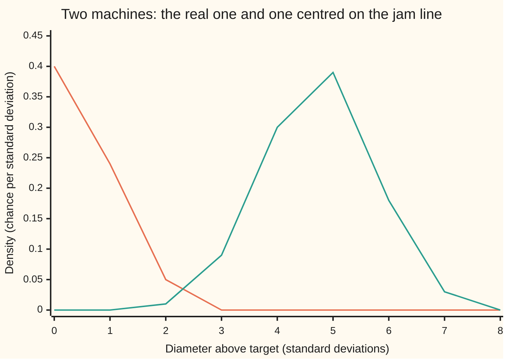
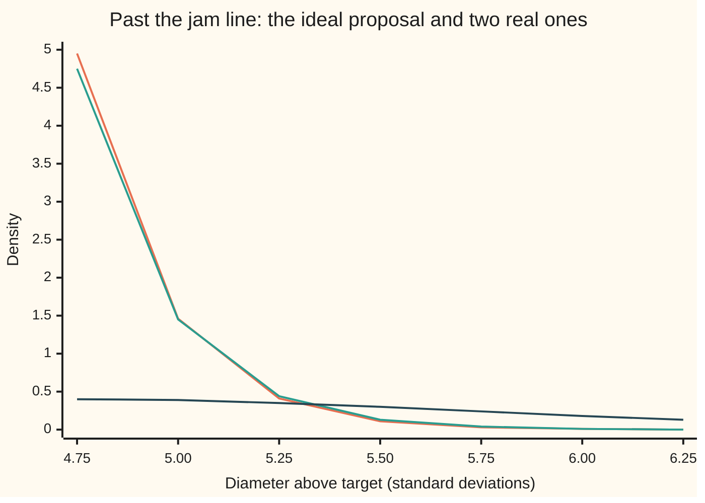
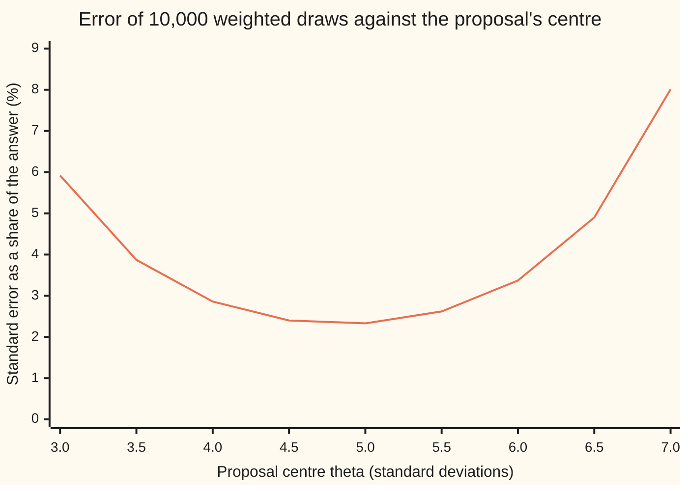

# Importance sampling: drawing from where it matters and reweighting

Probability and statistics → Simulation → Rare events by reweighting → Importance sampling

---

## General Overview

A machine cuts steel bolts meant to be 10.000 mm across. Real bolts vary. Their diameters follow a bell curve centred on 10.000 mm with a standard deviation (the typical distance from the centre) of 0.010 mm. A bolt wider than 10.0475 mm jams in the fitting: 4.75 standard deviations above target. The chance of that is 1.017 in a million.

Here the bell curve gives the exact answer, so the answer is known. In a real plant the diameter comes out of a simulation of tool wear and heat, with no formula, and the only way to get the chance is to simulate bolts and count jams. Simulate 10,000 bolts and the expected number of jams is 0.0102. In about 99 runs out of 100 not one bolt jams, and the estimate is zero. The rare region is exactly where the answer lives, and ordinary draws almost never go there.

The fix is to simulate from a deliberately mis-set machine, one centred on the jam line, so that about half its bolts jam. Each jam is then counted at a discount: by how much less often the real machine would have made that bolt. A pollster does the same when oversampling a small town and counting each answer from there at a matching discount. The drawing law is called the **proposal**, the discount is the **weight**, and the method is **importance sampling**. With 10,000 draws it gives the one-in-a-million chance with a standard error of about 2.3 percent of the answer, or, with a better proposal, 0.08 percent.

**Draw from a law that visits the rare region often, multiply each outcome by the true density divided by the drawing density, and the average still aims at exactly the right answer; a proposal shaped like the answer makes its error bar small.**

**What kind of fact this is:** a method, resting on a theorem (the reweighting identity and its error formula) proved on this card in Why it works.

### The picture: where the real machine draws, and where the mis-set one draws



Orange: the real machine, a bell curve centred on target. Green: the mis-set machine, the same bell curve moved to the jam line at 4.75. Past the line the orange curve is too small to see at this scale; that thin sliver, 1.017 in a million, is the answer.

---

## The formula

Notation first. The real diameter, measured in standard deviations above target, is a random variable $X$ (a number settled by chance) with density $f$, the bell curve ([normal-distribution](../04-Continuous%20Distributions/04-normal-distribution.md)). The proposal is a second density $g$, and its draws are called $Y_1, Y_2, \dots$ to keep them apart from the real ones. $E_f[\cdot]$ reads "the long-run average when the draw comes from $f$", the expectation of shelf 02 with the drawing law written underneath. A hat marks an estimate.

The quantity averaged is $h$: here $h(x) = 1$ if $x$ is past the line $c$ and 0 if not, so its average is the chance of a jam. The answer is

$$I = E_f[h(X)] = \int h(x)\,f(x)\,dx = \int h(x)\,\frac{f(x)}{g(x)}\,g(x)\,dx = E_g\big[h(Y)\,w(Y)\big], \qquad w(y) = \frac{f(y)}{g(y)}.$$

**Read it aloud:** the average of $h$ under the real law equals the average of $h$ times the weight under the proposal, where the weight is the real density divided by the proposal density.

So draw $n$ times from $g$ and average:

$$\hat I_n = \frac1n \sum_{i=1}^{n} h(Y_i)\,w(Y_i), \qquad \text{standard error} = \sqrt{\frac{M_2 - I^2}{n}}, \qquad M_2 = E_g\big[h(Y)^2 w(Y)^2\big] = \int \frac{h(x)^2 f(x)^2}{g(x)}\,dx.$$

**Read it aloud:** the estimate is the plain average of the weighted outcomes; its error shrinks like one over the square root of the number of draws, with a size set by the second moment $M_2$, the average squared weighted outcome.

For the bolts, the first proposal is the bell curve moved to centre $\theta$, and Step 3 shows the weight and second moment come out as

$$w(y) = e^{-\theta y + \theta^2/2}, \qquad M_2(\theta) = e^{\theta^2}\,P(X > c + \theta).$$

The second proposal starts at the line and falls away like an exponential with rate $\lambda$: $g(y) = \lambda\,e^{-\lambda (y - c)}$ for $y > c$. Its density falls to about 37 percent of its value with every further $1/\lambda$ standard deviations.

| Symbol | Plain meaning | In our example | Push it up and the answer… |
| --- | --- | --- | --- |
| $X$, $x$, $y$, $t$ | a real bolt's diameter in standard deviations above target; $x$ and $y$ particular values; $t = y - c$ the distance past the line | a bell-curve draw | — |
| $c$, $h$ | the jam line; $h(x)$ is 1 past it, 0 before it | $c = 4.75$ | a higher line makes the chance smaller and plain simulation hopeless sooner |
| $f$ | the real density: the bell curve centred on 0 | $f(4.75)$ is tiny | — |
| $g$ | the proposal: the density actually drawn from | bell curve centred on $\theta$, or an exponential tail | must be positive wherever $h f$ is |
| $Y$, $Y_i$, $U$ | draws from the proposal; $U$ is a uniform draw between 0 and 1 that the code turns into one | 10,000 of them | — |
| $w$ | the weight $f/g$: how much less (or more) often the real machine makes this bolt | 12.6071 per million at the line | — |
| $I$ | the answer, $P(X > c)$ | 1.017083243 per million | — |
| $n$ | number of draws | 10,000 | standard error falls like $1/\sqrt{n}$ |
| $\hat I_n$ | the estimate from $n$ weighted draws | 0.973097 per million, se 0.023024 | — |
| $M_2$ | second moment: the average squared weighted outcome | 6.602853 per $10^{12}$ | a bigger second moment means a wider error bar |
| $\theta$, $\lambda$, $s$ | the proposal's settings: centre, exponential rate, spread | 4.75; 4.75; 1 | best centre 4.852; a spread with $s^2 < 1/2$ makes $M_2$ infinite |
| $E_f$, $E_g$ | long-run average with draws from $f$, or from $g$ | — | — |

### When it holds

- **The proposal covers the answer.** $g$ must be positive wherever $h\,f$ is not zero. A proposal that never draws past 5.75 misses 0.44 percent of the answer, and more draws never find it.
- **Both densities are known exactly, constants included.** Drop the $e^{\theta^2/2}$ from the weight and the estimate comes out 79,320 times too small. When $f$ is known only up to a constant factor, the self-normalised version divides by the total weight instead; it is then slightly biased, but the bias shrinks as $n$ grows.
- **The second moment is finite.** The error formula needs $M_2 < \infty$. A bell-curve proposal on the line with spread 0.5 has an infinite second moment, and the error bar it prints means nothing.
- **Independent draws.** The $1/\sqrt n$ comes from independence ([monte-carlo-estimates-and-error](04-monte-carlo-estimates-and-error.md)). Reused or correlated random numbers make the printed error bar too narrow.

---

## Why it works

### Step 0: count each draw by how often it should have happened

Plain simulation fails on the bolts for one reason: every draw costs the same, and almost every draw lands where $h$ is zero. Importance sampling spends the draws where $h$ is not zero and pays for the choice with a correction. If the mis-set machine makes a given diameter far more often than the real one, that bolt counts for correspondingly less: exactly the ratio of the two densities at that diameter. The correction is exact, not approximate, so nothing is lost except the need to know both densities.

### Step 1: multiply and divide by the proposal

Take the integral that defines the answer, $\int h f\,dx$. Multiply and divide the integrand by $g$. Wherever $g$ is positive, nothing changes:

$$\int h(x) f(x)\,dx = \int h(x)\,\frac{f(x)}{g(x)}\;g(x)\,dx.$$

The right side is an average under $g$: the integral of something times $g$. So $I = E_g[h(Y)\,w(Y)]$. The only fine print is where $g$ is zero: there, the division is not allowed, and any part of $h f$ sitting there is dropped from the right side. That is the coverage condition.

### Step 2: the estimate is unbiased, and its error has a formula

Each term $h(Y_i)\,w(Y_i)$ has average $I$ by Step 1, so the average of $n$ of them has average $I$ as well: the estimate is **unbiased** (it aims at the right number). The terms are independent, so the variance of their average is the variance of one term divided by $n$, as on [monte-carlo-estimates-and-error](04-monte-carlo-estimates-and-error.md). The variance of one term is its average square minus its squared average, $M_2 - I^2$. So the standard error is $\sqrt{(M_2 - I^2)/n}$.

Unbiasedness holds for any proposal that covers the answer. The error bar depends entirely on $M_2$, and $M_2$ depends on the choice of $g$. That choice is the whole craft.

### Step 3: the bolts, with the bell curve moved to the line

Take $g$ as the bell curve centred at $\theta$. The ratio of two bell curves simplifies, because the $y^2$ terms cancel:

$$w(y) = \frac{e^{-y^2/2}}{e^{-(y-\theta)^2/2}} = e^{-\theta y + \theta^2/2}.$$

At $\theta = c = 4.75$, a draw exactly on the line has weight $e^{-c^2/2} = e^{-11.28125}$, which is 12.6071 per million. A draw at 5.75 has weight 0.1091 per million. The weight falls as the draw moves further out, because the real machine makes those bolts even more rarely than the mis-set one does. About half the proposal's draws jam, each counted at a weight of at most 12.6071 per million, and the average lands near one per million.

The second moment comes from completing the square, and is again a bell-curve tail:

$$M_2(\theta) = e^{\theta^2}\,P(X > c + \theta).$$

<details>
<summary>The algebra behind this, if you want it</summary>

$M_2 = \int_c^\infty f(x)^2 / g(x)\,dx$. With $f(x) = e^{-x^2/2}/\sqrt{2\pi}$ and $g(x) = f(x - \theta)$, the exponent of $f^2/g$ is
$$-x^2 + \tfrac12 (x-\theta)^2 = -\tfrac12 x^2 - \theta x + \tfrac12\theta^2 = -\tfrac12 (x+\theta)^2 + \theta^2.$$
So $f(x)^2/g(x) = e^{\theta^2} f(x + \theta)$, and integrating from $c$ to infinity gives $e^{\theta^2}\,P(X > c + \theta)$. At $\theta = 4.75$: $e^{22.5625} \times 1.0495 \times 10^{-21} = 6.602853 \times 10^{-12}$. The checks confirm it by integrating $f^2/g$ directly with Simpson's rule.

</details>

This moving of a bell curve is called **exponential tilting**: $g(y) = f(y)\,e^{\theta y - \theta^2/2}$, the real density multiplied by an exponential and rescaled to area 1. The same exponential factor $e^{\theta y}$ drives the Chernoff bound on [concentration-inequalities-hoeffding-and-chernoff](../06-Limit%20Theorems%20in%20Practice/06-concentration-inequalities-hoeffding-and-chernoff.md).

### Step 4: choosing the proposal

**The ideal.** If every weighted outcome $h(Y)\,w(Y)$ were the same number, the variance would be zero. That happens when $g$ is proportional to $h f$: the proposal $g^* = h f / I$, the real density cut off at the line and rescaled. Every draw from $g^*$ jams, and every weight is exactly $I$. This ideal needs $I$ itself, so it cannot be used. It is still the target shape: **a good proposal looks like the part of the real density that makes the answer.**

**What that shape is here.** Write a point past the line as $y = c + t$. Then $y^2/2 = c^2/2 + ct + t^2/2$, so $f(c + t) = f(c)\,e^{-ct}\,e^{-t^2/2}$. Just past the line the tail falls like $e^{-ct}$, an exponential with rate $c$. The exponential proposal with $\lambda = c = 4.75$ copies that fall. Its weight is $f(c)\,e^{-t^2/2}/c$: nearly the same on every draw, which is what a small variance means.



Orange: the ideal $g^* = f/I$ past the line. Green: the exponential proposal, rate 4.75, lying almost on it. Dark blue: the bell curve moved to the line, which spreads its draws far too wide and puts half of them before the line, where $h$ is zero. That gap is why the exponential proposal's error is 0.0776 percent and the moved bell curve's is 2.32 percent.

**Tuning the centre.** Within the moved bell curves, $M_2(\theta)$ has a formula, so the best centre can be found by minimising it. A golden-section search (repeatedly narrowing an interval around the lowest point) gives $\theta = 4.852$, just past the line, with a relative standard error of 2.31 percent. Too little shift and the draws rarely jam; too much and most draws land far out with negligible weights, so the few that land near the line carry large weights and dominate the estimate.



Orange: the relative standard error, $\sqrt{M_2(\theta) - I^2}\,/\,(I\sqrt{n})$, for $n$ = 10,000. It bottoms out near the line. At centre 0, plain simulation, it is 991.57 percent.

### Step 5: two ways a proposal fails

**Missing ground.** If $g$ is zero on part of the region where $h f$ is not, Step 1 drops that part. The estimate is then unbiased for the wrong number, and its error bar shrinks around it with confidence.

**Tails that are too thin.** $M_2$ divides by $g$. Where $g$ is much smaller than $f$, the weight is huge, and its square larger still. A bell-curve proposal on the line with spread $s$ gives $f^2/g$ the exponent $-x^2 + (x-c)^2/(2s^2)$. For $s^2 < 1/2$ the $x^2$ term wins with a plus sign, the integrand grows without bound, and $M_2$ is infinite. With $s = 0.5$, the second moment integrated out to 10, 20, 25 and 30 is $10^{-11.5}$, $10^{26.3}$, $10^{82.6}$ and $10^{160.6}$. The mean is still right: the weights are integrable, so the average still settles on $I$. What is lost is the error bar.

<details>
<summary>Detailed proof</summary>

Assume $h f$ is integrable, $g$ is a density, and $g(x) > 0$ wherever $h(x) f(x) \neq 0$. Let $Y_1, \dots, Y_n$ be independent draws from $g$.

**The identity.** $E_g[h(Y) w(Y)] = \int_{g > 0} h(x) \frac{f(x)}{g(x)} g(x)\,dx = \int_{g>0} h(x) f(x)\,dx = \int h(x) f(x)\,dx = I$. The last step uses coverage: the integrand $h f$ is zero where $g$ is zero. The same computation with $|h|$ shows each term has a finite average, so the averages are well defined.

**Unbiased.** An average of expectations is the expectation of the average, so $E[\hat I_n] = \frac1n \sum_i E_g[h(Y_i) w(Y_i)] = I$.

**The error.** $E_g[(h w)^2] = \int_{g>0} h^2 \frac{f^2}{g^2}\,g\,dx = \int h^2 f^2 / g\,dx = M_2$. If $M_2$ is finite, one term has variance $M_2 - I^2$, and independent terms add their variances, so $\operatorname{Var}(\hat I_n) = (M_2 - I^2)/n$. If $M_2$ is infinite, one term has infinite variance, and no finite error bar is justified.

**The zero-variance proposal.** Since a variance is never negative, $M_2 \ge I^2$ for every proposal. Equality means $h w$ equals $I$ at every point $g$ draws from, that is $h f / g = I$, or $g = h f / I$ (for $h \ge 0$ and $I > 0$). No other proposal achieves zero.

**Thin bell-curve proposals.** For $g$ the bell curve with centre $c$ and spread $s$, $f(x)^2/g(x) = \frac{s}{\sqrt{2\pi}}\exp\!\big(-x^2 + \frac{(x-c)^2}{2s^2}\big)$. The coefficient of $x^2$ in the exponent is $-1 + \frac{1}{2s^2}$, positive exactly when $s^2 < 1/2$. Then the integrand tends to infinity as $x$ grows, so its integral from $c$ to infinity is infinite. For $s^2 = 1/2$ the exponent is $-2cx + c^2$, which decays, and for $s^2 > 1/2$ it decays faster, so $M_2$ is finite exactly when $s^2 \ge 1/2$.

</details>

---

## Worked numbers, by hand

| Step | Arithmetic | Value |
| --- | --- | --- |
| the answer, $P(X > 4.75)$ | bell-curve tail | 1.017083243 per million |
| plain simulation: expected jams in 10,000 | 10,000 × 1.017 per million | 0.0102 |
| plain: chance of seeing none | (1 − 1.017 per million) to the power 10,000 | 0.9899 |
| plain: relative standard error | $\sqrt{(1 - I)/(n I)}$ | 991.57% |
| weight on the line, $\theta = 4.75$ | $e^{-4.75^2/2} = e^{-11.28125}$ | 12.6071 per million |
| weight at 5.75 | $e^{-4.75 \times 5.75 + 11.28125}$ | 0.1091 per million |
| second moment | $e^{22.5625} \times 1.0495 \times 10^{-21}$ | 6.602853 per $10^{12}$ |
| relative standard error | $\sqrt{6.602853 - 1.034458}$ per $10^{12}$ = 2.3597 per million, over (1.017083 per million × $\sqrt{10{,}000}$) | 2.32% |
| plain draws for the same error | $I(1 - I)/(M_2 - I^2) \times 10{,}000$ | 1,827 million |
| **the run, 10,000 moved-bell draws** | 4,934 jams, weighted and averaged | **0.973097 per million, se 0.023024** |
| the run, 10,000 exponential draws | every draw past the line | 1.016923 per million, se 0.000790 |

The moved bell curve's run is 1.91 standard errors below the true 1.017 per million, an ordinary miss for a random estimate. The exponential run is 0.20 standard errors below, with a far narrower error bar. To match that error, plain simulation would need 1631.7 billion bolts.

### What breaks if you drop a piece

| Mistake | Comes out at | What went wrong |
| --- | --- | --- |
| Plain simulation, 10,000 draws | 0 jams, estimate 0 (chance 0.9899) | The draws never reach the region that holds the answer |
| Count the proposal's jams without weights | 0.4934 | That is the mis-set machine's jam rate, not the real one's |
| Weight $e^{-\theta y}$, dropping $e^{\theta^2/2}$ | 0.00001227 per million, 79,320 times too small | A density's constant is part of the weight |
| Proposal that never draws past 5.75 | misses 0.44% of the answer | No coverage: the missing piece never shows up in any run |
| Bell curve on the line with spread 0.5 | 0.996897 per million, printed se 0.015209; true $M_2$ infinite | Tails too thin: the printed error bar looks better than the spread-1 run's and means nothing |
| Centre the bell curve at 7 instead of 4.852 | relative se 8.01% instead of 2.31% | Overshoot: draws land where the real density is negligible |

---

## Code, from first principles, and it actually runs

Five roads to one number. The exact tail by Laplace's continued fraction, $P(X > x) = f(x) / (x + 1/(x + 2/(x + 3/(x + \dots))))$, evaluated from the bottom up. The same tail by Simpson's rule, an integrator written into the script. Plain simulation with 10,000 draws. Importance sampling from the moved bell curve and from the exponential tail, 10,000 draws each. Random numbers come from a SplitMix64 generator with seed 2026 ([pseudo-random-numbers](01-pseudo-random-numbers.md)), bell-curve draws from Box-Muller ([rejection-sampling-and-box-muller](03-rejection-sampling-and-box-muller.md)), exponential draws from the inverse transform $y = c - \ln(U)/\lambda$, with $U$ a uniform draw between 0 and 1 ([inverse-transform-sampling](02-inverse-transform-sampling.md)). The second moment is reached three ways: the completed square, Simpson's rule on $f^2/g$, and the run's own squares. Simulated numbers are asserted within four standard errors of the exact answer, never to an exact match.

### Python

```python
# Importance sampling -- the check behind the card.  Nothing is imported but math primitives.
# A bolt jams when its diameter is more than c = 4.75 standard deviations above target: a chance of
# about one in a million.  Estimate it with 10,000 simulated bolts.  Roads: the exact tail by
# a continued fraction; the same tail by Simpson's rule; plain simulation; importance sampling
# from two proposals, drawn with SplitMix64 (seed 2026), Box-Muller and the inverse transform.
from math import exp, log, sqrt, pi, cos
C, N, M64 = 4.75, 10000, (1 << 64) - 1

class SplitMix64:
    def __init__(self, seed):
        self.s = seed
    def uniform(self):                                   # strictly inside (0, 1)
        self.s = (self.s + 0x9E3779B97F4A7C15) & M64
        z = self.s
        z = ((z ^ (z >> 30)) * 0xBF58476D1CE4E5B9) & M64
        z = ((z ^ (z >> 27)) * 0x94D049BB133111EB) & M64
        return (((z ^ (z >> 31)) >> 11) + 0.5) / 9007199254740992.0
    def normal(self):                                    # Box-Muller, one draw from two uniforms
        u1, u2 = self.uniform(), self.uniform()
        return sqrt(-2 * log(u1)) * cos(2 * pi * u2)

def f(y):                                                # target: the standard bell curve
    return exp(-y * y / 2) / sqrt(2 * pi)

def tail_cf(x, terms=300):                               # P(X > x) by Laplace's continued fraction
    t = x
    for k in range(terms, 0, -1):
        t = x + k / t
    return f(x) / t

def simpson(g, lo, hi, n):
    w = (hi - lo) / n
    s = g(lo) + g(hi) + sum((4.0 if j % 2 else 2.0) * g(lo + j * w) for j in range(1, n))
    return s * w / 3.0

def summary(vals):                                       # mean and its standard error
    m = sum(vals) / len(vals)
    return m, sqrt(sum((v - m) ** 2 for v in vals) / (len(vals) - 1) / len(vals))

def m2_shift(th):                                        # second moment, proposal N(th, 1), closed form
    return exp(th * th) * tail_cf(C + th)

def rel_se(m2, p, n):                                    # standard error as a share of the answer
    return sqrt(m2 - p * p) / (p * sqrt(n))

p = tail_cf(C)
p_simp = simpson(f, C, C + 30, 20000)
print(f"exact P(X > 4.75), continued fraction : {p * 1e6:.9f} per million")
print(f"exact P(X > 4.75), Simpson's rule     : {p_simp * 1e6:.9f} per million")
print(f"plain: expected hits in {N} draws {N * p:.4f}; P(no hits) = {(1 - p) ** N:.4f}; rel se {rel_se(p, p, N) * 100:.2f}%")
rng = SplitMix64(2026)
plain = [1.0 if rng.normal() > C else 0.0 for _ in range(N)]
print(f"plain run: {int(sum(plain))} hits, estimate {sum(plain) / N * 1e6:.6f} per million")

g_n = lambda y: f(y - C)                                 # proposal A: bell curve moved to the line
w_n = lambda y: exp(-C * y + C * C / 2)                  # weight f/g, simplified
ys = [C + rng.normal() for _ in range(N)]
wh = [w_n(y) if y > C else 0.0 for y in ys]
est_n, se_n = summary(wh)
hits_n = sum(y > C for y in ys)
m2_simp = simpson(lambda y: f(y) ** 2 / g_n(y), C, C + 30, 20000)
print(f"proposal N(4.75, 1): {hits_n} hits; estimate {est_n * 1e6:.6f} per million, se {se_n * 1e6:.6f}")
print(f"  weight at the line e^(-c^2/2) = {w_n(C) * 1e6:.4f} per million; at y = 5.75 {w_n(5.75) * 1e6:.4f} per million")
print(f"  second moment per 10^12: closed {m2_shift(C) * 1e12:.6f}, Simpson {m2_simp * 1e12:.6f}, sample {sum(v * v for v in wh) / N * 1e12:.6f}")
print(f"  by hand: c^2/2 = {C * C / 2:.5f}; c^2 = {C * C:.4f}; P(X > 9.5) = {tail_cf(9.5) * 1e21:.4f} per 10^21; I^2 = {p * p * 1e12:.6f} per 10^12")
print(f"  rel se: formula {rel_se(m2_shift(C), p, N) * 100:.2f}%, run {se_n / est_n * 100:.2f}%; run is {(est_n - p) / se_n:.2f} se from exact")
print(f"  plain draws for the same se: {p * (1 - p) / (m2_shift(C) - p * p) * N / 1e6:.0f} million")

lam = C                                                  # proposal B: exponential tail from the line
g_e = lambda y: lam * exp(-lam * (y - C))
ye = [C - log(rng.uniform()) / lam for _ in range(N)]    # inverse transform
we = [f(y) / g_e(y) for y in ye]
est_e, se_e = summary(we)
m2_e = simpson(lambda y: f(y) ** 2 / g_e(y), C, C + 30, 20000)
print(f"proposal exponential, rate 4.75: estimate {est_e * 1e6:.6f} per million, se {se_e * 1e6:.6f}")
print(f"  rel se: formula {rel_se(m2_e, p, N) * 100:.4f}%, run {se_e / est_e * 100:.4f}%; run is {(est_e - p) / se_e:.2f} se from exact")
print(f"  plain draws for the same se: {p * (1 - p) / (m2_e - p * p) * N / 1e9:.1f} billion")

a, b, gr = 3.0, 7.0, (sqrt(5) - 1) / 2                   # best shift by golden-section search
for _ in range(100):
    x1, x2 = b - gr * (b - a), a + gr * (b - a)
    a, b = (a, x2) if m2_shift(x1) < m2_shift(x2) else (x1, b)
th_best = (a + b) / 2
print(f"best shift {th_best:.4f}: rel se {rel_se(m2_shift(th_best), p, N) * 100:.2f}%; shift 0 (plain): {rel_se(m2_shift(0.0), p, N) * 100:.2f}%")
thetas = [3.0 + 0.5 * k for k in range(9)]
print("figure, shift:        " + ", ".join(f"{t:.1f}" for t in thetas))
print("figure, rel se %:     " + ", ".join(f"{rel_se(m2_shift(t), p, N) * 100:.2f}" for t in thetas))
grid = list(range(9))
print("figure, y:            " + ", ".join(str(y) for y in grid))
print("figure, target f:     " + ", ".join(f"{f(y):.2f}" for y in grid))
print("figure, proposal A:   " + ", ".join(f"{g_n(y):.2f}" for y in grid))
tail_grid = [C + 0.25 * k for k in range(7)]
print("figure, y in tail:    " + ", ".join(f"{y:.2f}" for y in tail_grid))
print("figure, ideal f/I:    " + ", ".join(f"{f(y) / p:.2f}" for y in tail_grid))
print("figure, proposal B:   " + ", ".join(f"{g_e(y):.2f}" for y in tail_grid))
print("figure, A in tail:    " + ", ".join(f"{g_n(y):.2f}" for y in tail_grid))

# what breaks
print(f"wrong: no weights, share of proposal draws past the line {hits_n / N:.4f}")
print(f"wrong: weight e^(-c y), dropping e^(c^2/2): estimate {est_n * exp(-C * C / 2) * 1e6:.8f} per million, {exp(C * C / 2):.0f} times too small")
print(f"wrong: proposal only up to 5.75 misses {tail_cf(5.75) / p * 100:.2f}% of the answer")
s = 0.5                                                  # proposal N(4.75, 0.25): tails too thin
w_t = lambda y: s * exp(-y * y / 2 + (y - C) ** 2 / (2 * s * s))       # f / g, simplified
m2_t = lambda y: s / sqrt(2 * pi) * exp(-y * y + (y - C) ** 2 / (2 * s * s))   # f * f / g
parts = [simpson(m2_t, C, R, 20000) for R in (10, 20, 25, 30)]
print("wrong: thin proposal sd 0.5, second moment to R = 10, 20, 25, 30: 10^" + ", 10^".join(f"{log(v) / log(10):.1f}" for v in parts))
yt = [C + s * rng.normal() for _ in range(N)]
est_t, se_t = summary([w_t(y) if y > C else 0.0 for y in yt])
print(f"wrong: thin proposal run: estimate {est_t * 1e6:.6f} per million, printed se {se_t * 1e6:.6f}")
print(f"try: line at c = 6, shift 6: rel se {rel_se(exp(36) * tail_cf(12.0), tail_cf(6.0), N) * 100:.2f}%; P(X > 6) = {tail_cf(6.0) * 1e9:.4f} per billion")
for lam2 in (3.0, 7.0):
    m2l = simpson(lambda y: f(y) ** 2 / (lam2 * exp(-lam2 * (y - C))), C, C + 30, 20000)
    print(f"try: exponential rate {lam2:.0f}: rel se {rel_se(m2l, p, N) * 100:.4f}%")

assert abs(p_simp / p - 1) < 1e-9                        # continued fraction vs integration
assert abs(m2_simp / m2_shift(C) - 1) < 1e-8             # completed square vs integration
assert abs(est_n - p) < 4 * se_n                        # simulation, proposal A, vs exact
assert abs(est_e - p) < 4 * se_e                        # simulation, proposal B, vs exact
assert abs(se_e / est_e / rel_se(m2_e, p, N) - 1) < 0.1  # run's error bar vs the variance formula
assert parts[3] > 1e6 * parts[1]                         # thin tails: the second moment explodes
print("ALL CHECKS PASS")
```

**Ran 2026-09-29 on macOS, Python 3.14.6, standard library only. All checks passed. Output, pasted from the run:**

```
exact P(X > 4.75), continued fraction : 1.017083243 per million
exact P(X > 4.75), Simpson's rule     : 1.017083243 per million
plain: expected hits in 10000 draws 0.0102; P(no hits) = 0.9899; rel se 991.57%
plain run: 0 hits, estimate 0.000000 per million
proposal N(4.75, 1): 4934 hits; estimate 0.973097 per million, se 0.023024
  weight at the line e^(-c^2/2) = 12.6071 per million; at y = 5.75 0.1091 per million
  second moment per 10^12: closed 6.602853, Simpson 6.602853, sample 6.247247
  by hand: c^2/2 = 11.28125; c^2 = 22.5625; P(X > 9.5) = 1.0495 per 10^21; I^2 = 1.034458 per 10^12
  rel se: formula 2.32%, run 2.37%; run is -1.91 se from exact
  plain draws for the same se: 1827 million
proposal exponential, rate 4.75: estimate 1.016923 per million, se 0.000790
  rel se: formula 0.0776%, run 0.0777%; run is -0.20 se from exact
  plain draws for the same se: 1631.7 billion
best shift 4.8520: rel se 2.31%; shift 0 (plain): 991.57%
figure, shift:        3.0, 3.5, 4.0, 4.5, 5.0, 5.5, 6.0, 6.5, 7.0
figure, rel se %:     5.92, 3.87, 2.86, 2.40, 2.33, 2.62, 3.37, 4.90, 8.01
figure, y:            0, 1, 2, 3, 4, 5, 6, 7, 8
figure, target f:     0.40, 0.24, 0.05, 0.00, 0.00, 0.00, 0.00, 0.00, 0.00
figure, proposal A:   0.00, 0.00, 0.01, 0.09, 0.30, 0.39, 0.18, 0.03, 0.00
figure, y in tail:    4.75, 5.00, 5.25, 5.50, 5.75, 6.00, 6.25
figure, ideal f/I:    4.95, 1.46, 0.41, 0.11, 0.03, 0.01, 0.00
figure, proposal B:   4.75, 1.45, 0.44, 0.13, 0.04, 0.01, 0.00
figure, A in tail:    0.40, 0.39, 0.35, 0.30, 0.24, 0.18, 0.13
wrong: no weights, share of proposal draws past the line 0.4934
wrong: weight e^(-c y), dropping e^(c^2/2): estimate 0.00001227 per million, 79320 times too small
wrong: proposal only up to 5.75 misses 0.44% of the answer
wrong: thin proposal sd 0.5, second moment to R = 10, 20, 25, 30: 10^-11.5, 10^26.3, 10^82.6, 10^160.6
wrong: thin proposal run: estimate 0.996897 per million, printed se 0.015209
try: line at c = 6, shift 6: rel se 2.62%; P(X > 6) = 0.9866 per billion
try: exponential rate 3: rel se 0.4490%
try: exponential rate 7: rel se 0.3725%
ALL CHECKS PASS
```

### Rust

The same roads in Rust, std only. SplitMix64 wraps its arithmetic the same way in both languages, so the two programs draw identical numbers.

```rust
// Importance sampling -- the same check as importance_sampling_check.py, in Rust.  Std only.
// A bolt jams when its diameter is more than c = 4.75 standard deviations above target: a chance of
// about one in a million.  Estimate it with 10,000 simulated bolts.  Same roads, same seed.
use std::f64::consts::PI;
const C: f64 = 4.75;
const N: usize = 10000;

struct SplitMix64 { s: u64 }
impl SplitMix64 {
    fn uniform(&mut self) -> f64 {                       // strictly inside (0, 1)
        self.s = self.s.wrapping_add(0x9E3779B97F4A7C15);
        let mut z = self.s;
        z = (z ^ (z >> 30)).wrapping_mul(0xBF58476D1CE4E5B9);
        z = (z ^ (z >> 27)).wrapping_mul(0x94D049BB133111EB);
        (((z ^ (z >> 31)) >> 11) as f64 + 0.5) / 9007199254740992.0
    }
    fn normal(&mut self) -> f64 {                        // Box-Muller, one draw from two uniforms
        let (u1, u2) = (self.uniform(), self.uniform());
        (-2.0 * u1.ln()).sqrt() * (2.0 * PI * u2).cos()
    }
}

fn f(y: f64) -> f64 { (-y * y / 2.0).exp() / (2.0 * PI).sqrt() }   // target: standard bell curve

fn tail_cf(x: f64) -> f64 {                              // P(X > x) by Laplace's continued fraction
    let mut t = x;
    for k in (1..=300).rev() { t = x + k as f64 / t; }
    f(x) / t
}

fn simpson<G: Fn(f64) -> f64>(g: G, lo: f64, hi: f64, n: usize) -> f64 {
    let w = (hi - lo) / n as f64;
    let mut s = g(lo) + g(hi);
    for j in 1..n { s += if j % 2 == 1 { 4.0 } else { 2.0 } * g(lo + j as f64 * w); }
    s * w / 3.0
}

fn summary(v: &[f64]) -> (f64, f64) {                    // mean and its standard error
    let n = v.len() as f64;
    let m = v.iter().sum::<f64>() / n;
    (m, (v.iter().map(|x| (x - m) * (x - m)).sum::<f64>() / (n - 1.0) / n).sqrt())
}

fn m2_shift(th: f64) -> f64 { (th * th).exp() * tail_cf(C + th) }   // proposal N(th, 1), closed form

fn rel_se(m2: f64, p: f64, n: usize) -> f64 { (m2 - p * p).sqrt() / (p * (n as f64).sqrt()) }

fn join(v: &[f64], dp: usize) -> String {
    v.iter().map(|x| format!("{:.*}", dp, x)).collect::<Vec<_>>().join(", ")
}

fn main() {
    let p = tail_cf(C);
    let p_simp = simpson(f, C, C + 30.0, 20000);
    println!("exact P(X > 4.75), continued fraction : {:.9} per million", p * 1e6);
    println!("exact P(X > 4.75), Simpson's rule     : {:.9} per million", p_simp * 1e6);
    println!("plain: expected hits in {} draws {:.4}; P(no hits) = {:.4}; rel se {:.2}%",
             N, N as f64 * p, (1.0 - p).powi(N as i32), rel_se(p, p, N) * 100.0);
    let mut rng = SplitMix64 { s: 2026 };
    let plain_hits = (0..N).filter(|_| rng.normal() > C).count();
    println!("plain run: {} hits, estimate {:.6} per million", plain_hits, plain_hits as f64 / N as f64 * 1e6);

    let g_n = |y: f64| f(y - C);                         // proposal A: bell curve moved to the line
    let w_n = |y: f64| (-C * y + C * C / 2.0).exp();     // weight f/g, simplified
    let ys: Vec<f64> = (0..N).map(|_| C + rng.normal()).collect();
    let wh: Vec<f64> = ys.iter().map(|&y| if y > C { w_n(y) } else { 0.0 }).collect();
    let (est_n, se_n) = summary(&wh);
    let hits_n = ys.iter().filter(|&&y| y > C).count();
    let m2_simp = simpson(|y| f(y) * f(y) / g_n(y), C, C + 30.0, 20000);
    println!("proposal N(4.75, 1): {} hits; estimate {:.6} per million, se {:.6}", hits_n, est_n * 1e6, se_n * 1e6);
    println!("  weight at the line e^(-c^2/2) = {:.4} per million; at y = 5.75 {:.4} per million", w_n(C) * 1e6, w_n(5.75) * 1e6);
    println!("  second moment per 10^12: closed {:.6}, Simpson {:.6}, sample {:.6}", m2_shift(C) * 1e12,
             m2_simp * 1e12, wh.iter().map(|v| v * v).sum::<f64>() / N as f64 * 1e12);
    println!("  by hand: c^2/2 = {:.5}; c^2 = {:.4}; P(X > 9.5) = {:.4} per 10^21; I^2 = {:.6} per 10^12",
             C * C / 2.0, C * C, tail_cf(9.5) * 1e21, p * p * 1e12);
    println!("  rel se: formula {:.2}%, run {:.2}%; run is {:.2} se from exact", rel_se(m2_shift(C), p, N) * 100.0,
             se_n / est_n * 100.0, (est_n - p) / se_n);
    println!("  plain draws for the same se: {:.0} million", p * (1.0 - p) / (m2_shift(C) - p * p) * N as f64 / 1e6);

    let lam = C;                                         // proposal B: exponential tail from the line
    let g_e = |y: f64| lam * (-lam * (y - C)).exp();
    let ye: Vec<f64> = (0..N).map(|_| C - rng.uniform().ln() / lam).collect();   // inverse transform
    let we: Vec<f64> = ye.iter().map(|&y| f(y) / g_e(y)).collect();
    let (est_e, se_e) = summary(&we);
    let m2_e = simpson(|y| f(y) * f(y) / g_e(y), C, C + 30.0, 20000);
    println!("proposal exponential, rate 4.75: estimate {:.6} per million, se {:.6}", est_e * 1e6, se_e * 1e6);
    println!("  rel se: formula {:.4}%, run {:.4}%; run is {:.2} se from exact", rel_se(m2_e, p, N) * 100.0,
             se_e / est_e * 100.0, (est_e - p) / se_e);
    println!("  plain draws for the same se: {:.1} billion", p * (1.0 - p) / (m2_e - p * p) * N as f64 / 1e9);

    let (mut a, mut b, gr) = (3.0_f64, 7.0_f64, (5.0_f64.sqrt() - 1.0) / 2.0);   // golden-section search
    for _ in 0..100 {
        let (x1, x2) = (b - gr * (b - a), a + gr * (b - a));
        if m2_shift(x1) < m2_shift(x2) { b = x2; } else { a = x1; }
    }
    let th_best = (a + b) / 2.0;
    println!("best shift {:.4}: rel se {:.2}%; shift 0 (plain): {:.2}%", th_best,
             rel_se(m2_shift(th_best), p, N) * 100.0, rel_se(m2_shift(0.0), p, N) * 100.0);
    let thetas: Vec<f64> = (0..9).map(|k| 3.0 + 0.5 * k as f64).collect();
    println!("figure, shift:        {}", join(&thetas, 1));
    println!("figure, rel se %:     {}", join(&thetas.iter().map(|&t| rel_se(m2_shift(t), p, N) * 100.0).collect::<Vec<_>>(), 2));
    let grid: Vec<f64> = (0..9).map(|k| k as f64).collect();
    println!("figure, y:            {}", join(&grid, 0));
    println!("figure, target f:     {}", join(&grid.iter().map(|&y| f(y)).collect::<Vec<_>>(), 2));
    println!("figure, proposal A:   {}", join(&grid.iter().map(|&y| g_n(y)).collect::<Vec<_>>(), 2));
    let tg: Vec<f64> = (0..7).map(|k| C + 0.25 * k as f64).collect();
    println!("figure, y in tail:    {}", join(&tg, 2));
    println!("figure, ideal f/I:    {}", join(&tg.iter().map(|&y| f(y) / p).collect::<Vec<_>>(), 2));
    println!("figure, proposal B:   {}", join(&tg.iter().map(|&y| g_e(y)).collect::<Vec<_>>(), 2));
    println!("figure, A in tail:    {}", join(&tg.iter().map(|&y| g_n(y)).collect::<Vec<_>>(), 2));

    // what breaks
    println!("wrong: no weights, share of proposal draws past the line {:.4}", hits_n as f64 / N as f64);
    println!("wrong: weight e^(-c y), dropping e^(c^2/2): estimate {:.8} per million, {:.0} times too small",
             est_n * (-C * C / 2.0).exp() * 1e6, (C * C / 2.0).exp());
    println!("wrong: proposal only up to 5.75 misses {:.2}% of the answer", tail_cf(5.75) / p * 100.0);
    let s = 0.5;                                         // proposal N(4.75, 0.25): tails too thin
    let w_t = |y: f64| s * (-y * y / 2.0 + (y - C) * (y - C) / (2.0 * s * s)).exp();        // f / g
    let m2_t = |y: f64| s / (2.0 * PI).sqrt() * (-y * y + (y - C) * (y - C) / (2.0 * s * s)).exp();
    let parts: Vec<f64> = [10.0, 20.0, 25.0, 30.0].iter().map(|&r| simpson(m2_t, C, r, 20000)).collect();
    let logs: Vec<String> = parts.iter().map(|v| format!("{:.1}", v.ln() / 10f64.ln())).collect();
    println!("wrong: thin proposal sd 0.5, second moment to R = 10, 20, 25, 30: 10^{}", logs.join(", 10^"));
    let wt: Vec<f64> = (0..N).map(|_| { let y = C + s * rng.normal(); if y > C { w_t(y) } else { 0.0 } }).collect();
    let (est_t, se_t) = summary(&wt);
    println!("wrong: thin proposal run: estimate {:.6} per million, printed se {:.6}", est_t * 1e6, se_t * 1e6);
    println!("try: line at c = 6, shift 6: rel se {:.2}%; P(X > 6) = {:.4} per billion",
             rel_se(36f64.exp() * tail_cf(12.0), tail_cf(6.0), N) * 100.0, tail_cf(6.0) * 1e9);
    for lam2 in [3.0_f64, 7.0] {
        let m2l = simpson(|y| f(y) * f(y) / (lam2 * (-lam2 * (y - C)).exp()), C, C + 30.0, 20000);
        println!("try: exponential rate {:.0}: rel se {:.4}%", lam2, rel_se(m2l, p, N) * 100.0);
    }

    assert!((p_simp / p - 1.0).abs() < 1e-9, "continued fraction vs integration");
    assert!((m2_simp / m2_shift(C) - 1.0).abs() < 1e-8, "completed square vs integration");
    assert!((est_n - p).abs() < 4.0 * se_n, "simulation, proposal A, vs exact");
    assert!((est_e - p).abs() < 4.0 * se_e, "simulation, proposal B, vs exact");
    assert!((se_e / est_e / rel_se(m2_e, p, N) - 1.0).abs() < 0.1, "run's error bar vs the variance formula");
    assert!(parts[3] > 1e6 * parts[1], "thin tails: the second moment explodes");
    println!("ALL CHECKS PASS");
}
```

**Ran 2026-09-29 on macOS, rustc 1.98.1, no crates. All checks passed. Output, pasted from the run:**

```
exact P(X > 4.75), continued fraction : 1.017083243 per million
exact P(X > 4.75), Simpson's rule     : 1.017083243 per million
plain: expected hits in 10000 draws 0.0102; P(no hits) = 0.9899; rel se 991.57%
plain run: 0 hits, estimate 0.000000 per million
proposal N(4.75, 1): 4934 hits; estimate 0.973097 per million, se 0.023024
  weight at the line e^(-c^2/2) = 12.6071 per million; at y = 5.75 0.1091 per million
  second moment per 10^12: closed 6.602853, Simpson 6.602853, sample 6.247247
  by hand: c^2/2 = 11.28125; c^2 = 22.5625; P(X > 9.5) = 1.0495 per 10^21; I^2 = 1.034458 per 10^12
  rel se: formula 2.32%, run 2.37%; run is -1.91 se from exact
  plain draws for the same se: 1827 million
proposal exponential, rate 4.75: estimate 1.016923 per million, se 0.000790
  rel se: formula 0.0776%, run 0.0777%; run is -0.20 se from exact
  plain draws for the same se: 1631.7 billion
best shift 4.8520: rel se 2.31%; shift 0 (plain): 991.57%
figure, shift:        3.0, 3.5, 4.0, 4.5, 5.0, 5.5, 6.0, 6.5, 7.0
figure, rel se %:     5.92, 3.87, 2.86, 2.40, 2.33, 2.62, 3.37, 4.90, 8.01
figure, y:            0, 1, 2, 3, 4, 5, 6, 7, 8
figure, target f:     0.40, 0.24, 0.05, 0.00, 0.00, 0.00, 0.00, 0.00, 0.00
figure, proposal A:   0.00, 0.00, 0.01, 0.09, 0.30, 0.39, 0.18, 0.03, 0.00
figure, y in tail:    4.75, 5.00, 5.25, 5.50, 5.75, 6.00, 6.25
figure, ideal f/I:    4.95, 1.46, 0.41, 0.11, 0.03, 0.01, 0.00
figure, proposal B:   4.75, 1.45, 0.44, 0.13, 0.04, 0.01, 0.00
figure, A in tail:    0.40, 0.39, 0.35, 0.30, 0.24, 0.18, 0.13
wrong: no weights, share of proposal draws past the line 0.4934
wrong: weight e^(-c y), dropping e^(c^2/2): estimate 0.00001227 per million, 79320 times too small
wrong: proposal only up to 5.75 misses 0.44% of the answer
wrong: thin proposal sd 0.5, second moment to R = 10, 20, 25, 30: 10^-11.5, 10^26.3, 10^82.6, 10^160.6
wrong: thin proposal run: estimate 0.996897 per million, printed se 0.015209
try: line at c = 6, shift 6: rel se 2.62%; P(X > 6) = 0.9866 per billion
try: exponential rate 3: rel se 0.4490%
try: exponential rate 7: rel se 0.3725%
ALL CHECKS PASS
```

The two outputs agree line for line.

> [!TIP]
> **Try changing**
> Guess first, then run it.
> - **Move the jam line to 6.** The chance drops to 0.9866 per billion. Guess the error with 10,000 draws from a bell curve centred at 6. It is 2.62 percent, barely worse than at 4.75. Plain simulation gets worse in step with the chance; importance sampling hardly notices.
> - **Mis-tune the exponential.** Set the rate to 3, then to 7, instead of 4.75. Guess which is worse. Rate 3 gives 0.4490 percent and rate 7 gives 0.3725 percent, both far behind 0.0776 percent: the rate that copies the tail's fall wins.
> - **Thin the proposal.** Draw from the bell curve on the line with spread 0.5. The run prints 0.996897 per million with standard error 0.015209, better-looking than the spread-1 run. Then read Step 5 again: the true second moment is infinite.
> - **Change the seed.** Each estimate moves by about one of its own standard errors. The exact roads do not move at all.

---

## The usual mistake

> [!warning]
> **Trusting the printed error bar.** Importance sampling estimates its own error from the same weights it averages. When the proposal's tails are too thin (for a bell curve on the line, a spread with $s^2 < 1/2$), the second moment is infinite, the rare huge weights have not turned up yet, and the error bar printed from the run is too small by an unknown amount. The spread-0.5 proposal printed 0.015209 per million for an error that has no finite size. Check with algebra that $M_2$ is finite before believing any run; a safe rule is a proposal whose tails are at least as heavy as those of $h f$.
>
> A second trap: **more shift is not better.** Centring at 7 gives 8.01 percent, worse than centring at 3.5 (3.87 percent). The best centre sits just past the line, at 4.852.

---

## Where you meet it in real life

- **Reliability and safety.** Failure chances of one in a million or less, for a bridge, a turbine blade or a flood wall, are estimated by simulating stress from a law tilted towards failure and reweighting.
- **Communication links.** Bit error rates far too small to see in plain simulation are measured by boosting the noise and weighting each error back down.
- **Bank risk.** Losses deep in the tail of a portfolio, and the prices of options that pay only after a large move, are simulated with the same tilt; the finance wing's other variance-reduction tools are on [variance-reduction-for-pricing](../../12-Financial%20mathematics/06-Numerical%20Methods%20for%20Pricing/02-variance-reduction-for-pricing.md).
- **Computer graphics.** A renderer traces light paths towards bright lamps and shiny directions more often, then divides each path's light by the chance it was chosen. The noise in a rendered image is this card's standard error.
- **Bayesian statistics.** A posterior (the law of an unknown after seeing data) is often known only up to a constant, so draws from a simpler law are weighted and the self-normalised version is used.
- **Where it began.** Herman Kahn and Andrew Marshall set out the method in 1953, for simulating the rare particles that get through radiation shielding.

> **Say it back**
> A one-in-a-million event almost never appears in 10,000 ordinary draws, so plain simulation returns zero. Importance sampling draws from a proposal that reaches the rare region often and multiplies each outcome by the real density divided by the proposal density. Multiplying and dividing by the proposal inside the integral shows the average is still exactly the right answer, as long as the proposal covers the whole region that matters. The error depends on the second moment, which is smallest when the proposal copies the part of the real density that makes the answer, and infinite when the proposal's tails are too thin. For the bolts, 10,000 draws from an exponential tail give the chance with a standard error of 0.08 percent of the answer.

---

## What this builds on

- [variance-reduction](05-variance-reduction.md): the idea that the same number of draws can give a narrower error bar if the draws are arranged well. Importance sampling is the variance reduction that changes the law itself.
- [monte-carlo-estimates-and-error](04-monte-carlo-estimates-and-error.md): the average of independent draws and its error bar, variance over $n$ under a square root, used in Step 2.
- [inverse-transform-sampling](02-inverse-transform-sampling.md) and [rejection-sampling-and-box-muller](03-rejection-sampling-and-box-muller.md): how the code draws from the two proposals.
- [normal-distribution](../04-Continuous%20Distributions/04-normal-distribution.md): the bell curve and its tail areas.

## Where this goes next

- [radon-nikodym-derivative](../../10-Measure%20and%20integration/08-Densities%20and%20Changing%20Measure/04-radon-nikodym-derivative.md): the weight $f/g$ in general, for laws with or without densities, and exactly when it exists.
- [girsanov-theorem](../../11-Stochastic%20processes%20and%20calculus/07-Changing%20Measure/02-girsanov-theorem.md): the same reweighting for whole random paths, where moving the centre becomes changing the drift.
- [historical-and-monte-carlo-var](../../12-Financial%20mathematics/39-Value%20at%20Risk%20and%20Expected%20Shortfall/03-historical-and-monte-carlo-var.md): simulated tail losses, where plain simulation is short of draws in exactly the way the bolts were.

The weight here was a ratio of two densities on a line; what that ratio means when the thing drawn is a whole path through time, with no density to divide, is the question the Radon-Nikodym and Girsanov cards answer.

---

## Sources

Verified 2026-09-29: every link below resolves to the publisher's page, or for Owen the author's.

- Kahn, Herman, and Andrew W. Marshall. "Methods of Reducing Sample Size in Monte Carlo Computations." *Journal of the Operations Research Society of America* 1, no. 5 (1953): 263–278. [doi:10.1287/opre.1.5.263](https://doi.org/10.1287/opre.1.5.263). The original: sampling from a changed law and correcting by the density ratio, with the zero-variance choice.
- Glasserman, Paul. *Monte Carlo Methods in Financial Engineering*. Springer, 2003. [doi:10.1007/978-0-387-21617-1](https://doi.org/10.1007/978-0-387-21617-1). Section 4.6, Importance Sampling: the weight, exponential tilting of the bell curve, and rare-event examples.
- Asmussen, Søren, and Peter W. Glynn. *Stochastic Simulation: Algorithms and Analysis*. Springer, 2007. [doi:10.1007/978-0-387-69033-9](https://doi.org/10.1007/978-0-387-69033-9). Chapter VI, Rare-Event Simulation: why plain simulation fails on small chances and how tilted proposals fix it.
- Owen, Art B. *Monte Carlo Theory, Methods and Examples*. [Author's book page](https://artowen.su.domains/mc/). Chapter 9, Importance Sampling: the second-moment formula, the zero-variance proposal, and the warning about thin-tailed proposals.
