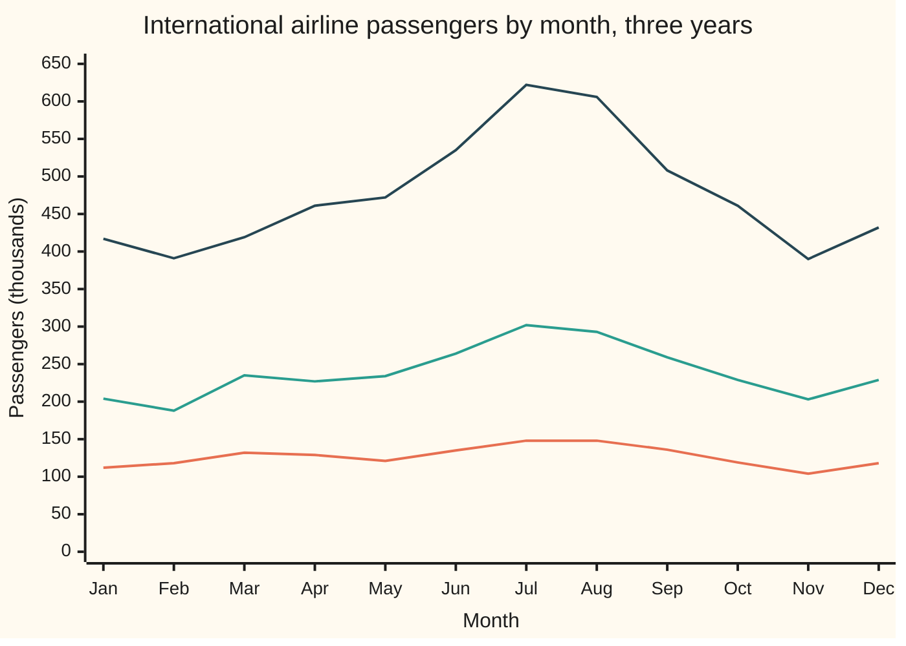
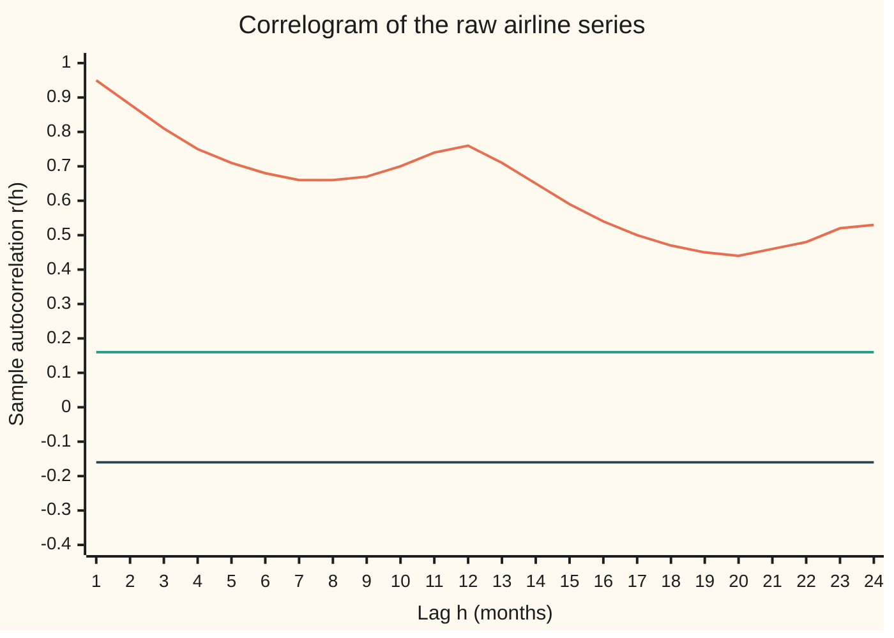
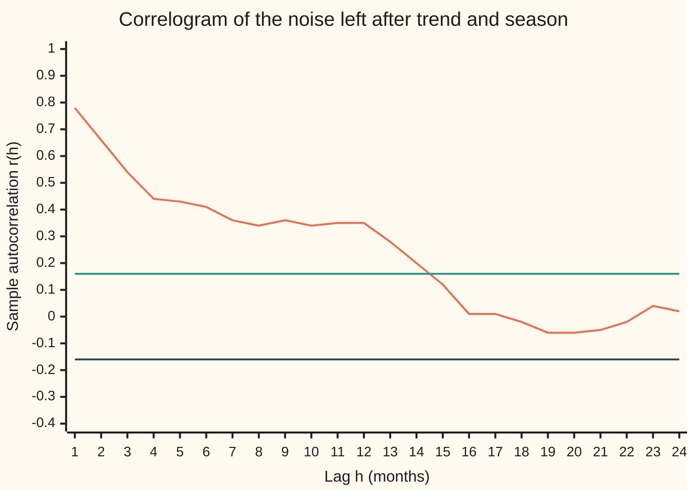

# Stationarity and autocorrelation: does the series keep its character, and does today remember yesterday

[Syllabus](../../../SYLLABUS.md) → [Probability and statistics](../README.md) → [Time Series](../README.md#s12) → Stationarity and autocorrelation

---

## General Overview

In January 1949 international airlines carried 112 thousand passengers. In July 1960 they carried 622 thousand. The monthly counts in between, 144 of them, are a classic data set: Box and Jenkins used them to illustrate their forecasting method, and every textbook since has plotted them.

The series has three visible parts. A **trend**: the level climbs about 12.8 percent a year. A **season**: every July is busy and every November is quiet. And **noise**: the wobble left when trend and season are taken out.

Two questions decide what can be done with it. First, does it keep its character: is the average level, and the size of the swings, the same in 1960 as in 1949? Here, no. The 1949 months average 126.67 thousand, the 1960 months 476.17; the typical swing within a year grows from 13.14 thousand to 74.43. Second, does this month remember last month: if one month is above its usual level, is the next one likely to be above too? That memory is measured by one number per gap between months, the **autocorrelation**. Plotted against the gap, it gives the **correlogram**, the first picture drawn of any new series.

A series that keeps its character, in the sense made exact below, is called **stationary**. Stationarity is what lets one long record stand in for many repeated experiments.

**A series is weakly stationary when its average and its spread never change and the covariance of two values depends only on how far apart in time they are; the autocorrelation is that covariance scaled to lie between −1 and 1, and its sample version, read off a correlogram, shows trend, season and short memory at a glance.**

**What kind of fact this is:** definitions, of weak stationarity, autocovariance and autocorrelation; beside them, one theorem proved in Why it works (autocorrelations lie between −1 and 1), and one approximation (the ±1.96/√n band for pure noise), with its error checked by simulation.

### The picture: three years of the airline series



Bottom line: 1949. Middle: 1954. Top: 1960. The level rises year on year: that is the trend. Each year peaks in July or August and dips in November and again around February: that is the season. The summer bulge grows with the level, from 148 against January's 112 in 1949 to 622 against 417 in 1960, so the swings scale with the size of the series. That last fact is why the card later works with logarithms, which turn "24 percent above normal" into a fixed amount whatever the level.

---

## The formula

Notation first, in words. A series is a list of random variables in time order, written $X_t$ and read "X at time t"; here $t$ counts months from January 1949. The gap between two times is $h$, the **lag**. $\operatorname{Cov}(X, Y)$ is the covariance from the joint-distributions card: the average product of the two variables' deviations from their means.

A series is **weakly stationary** when, for every time $t$ and every lag $h$,

$$\mathbb{E}[X_t] = \mu, \qquad \operatorname{Cov}(X_t,\, X_{t+h}) = \gamma(h), \qquad \gamma(0) \text{ finite}.$$

**Read it aloud:** the average value is the same at every time, and the covariance of two values depends only on how far apart they are, never on when.

The function $\gamma$ is the **autocovariance**: covariance of the series with itself, shifted. At lag 0 it is the variance, the same at every time. Scaled by it, the **autocorrelation** is

$$\rho(h) = \frac{\gamma(h)}{\gamma(0)}.$$

**Read it aloud:** the correlation between the series and itself $h$ steps later.

From one record $x_1, \dots, x_n$ the two are estimated by the **sample autocovariance** and **sample autocorrelation**:

$$c(h) = \frac{1}{n}\sum_{t=1}^{n-h} (x_t - \bar x)(x_{t+h} - \bar x), \qquad r(h) = \frac{c(h)}{c(0)}.$$

**Read it aloud:** line the record up against itself shifted by $h$, multiply the matched deviations from the overall average, add them up, and divide by the record's length; then scale by the lag-0 value.

For a series of pure noise (values independent of each other), $r(h)$ lies inside $\pm 1.96/\sqrt n$ at about 95 percent of lags. Those two lines are drawn on every correlogram. For 144 months the band is ±0.1633.

| Symbol | Plain meaning | In our example | Push it up and the answer… |
| --- | --- | --- | --- |
| $X_t$ | the series at time $t$, as a random variable | passengers in month $t$ | — |
| $x_t$ | the value actually recorded at time $t$ | 112 in January 1949 | — |
| $t$ | time, counted in steps | months from January 1949 | — |
| $h$ | the lag: gap between the two times compared | 1, 12, 24 months | pairs further apart; fewer of them, $n - h$ |
| $n$ | length of the record | 144 months | the band $1.96/\sqrt n$ narrows |
| $\mu$ | the common mean of a stationary series | none: the airline mean climbs | — |
| $\gamma(h)$ | autocovariance: covariance of values $h$ apart | defined only if stationary | stronger memory at lag $h$ |
| $\rho(h)$ | autocorrelation: $\gamma(h)$ over $\gamma(0)$ | between −1 and 1 | values $h$ apart move more together |
| $\bar x$ | the record's average | 126.67 for 1949 alone | — |
| $c(h)$ | sample autocovariance, divided by $n$ | 1949 alone: 1163.5556 / 12 at lag 1 | — |
| $r(h)$ | sample autocorrelation, $c(h)/c(0)$ | 0.9480 at lag 1, raw series | — |
| $b$ | the trend's slope: growth per month, in logs | 12.84 percent a year once compounded over 12 months | a steeper climb |
| $a_i$ | weights in a weighted sum of the series (Steps 3 and 5) | Step 5: the weights that turn the noise into an estimate's error | that value counts for more |
| $\sigma$ | standard deviation of one value of pure noise (Step 6) | never needed: it cancels from $r(h)$ | no change in $r(h)$ |
| $S$ | the lag-$h$ sum of products for pure noise (Step 6's proof) | mean 0, variance $(n-h)\sigma^4$ | — |
| $d_t$ | a value's distance from the record's average, $x_t - \bar x$ (Step 3's proof) | a month's count minus the 144-month average | — |
| $u_t$, $v_t$ | any two lists of numbers, in Step 3's proof | $d_t$ and $d_{t+h}$ | — |
| $\lambda$ | a free multiplier in that proof | any number | — |

### When it holds

Stationarity, autocovariance and autocorrelation are definitions: nothing has to hold for them to be stated, only for them to apply. What needs assumptions is reading a correlogram:

- **One record, many pairs.** Averaging the 143 lag-1 products estimates $\gamma(1)$ only if all of them share one covariance, which is what stationarity says, and the memory fades (Step 1). With a trend they do not, and $r(1)$ measures the trend, not memory: 0.9480 raw against 0.7788 once trend and season are removed.
- **The band assumes pure noise.** The ±1.96/√n lines test whether a series is independent noise, one lag at a time. For a series with real memory, at lags beyond the memory, the scatter of $r(h)$ is wider than the band suggests.
- **One lag at a time.** Across 24 lags of pure noise, some lag crosses the band in 61.40 percent of series (standard error 1.09 points), so one crossing out of 24 is not evidence of memory.
- **Finite variance.** Without a finite $\gamma(0)$, $\gamma(h)$ and $\rho(h)$ are not defined, so $r(h)$ has no target. For heavy-tailed noise it can still settle (independent Cauchy noise gives $r(h)$ close to 0 in a long record), but the band and the readings on this card no longer apply.

---

## Why it works

### Step 0: stationarity turns one history into many repetitions

There is only one 1949 to 1960. Covariance is an average over repetitions, and history gives no repetitions. What it does give is many pairs: 143 pairs one month apart, 132 pairs twelve months apart. If every lag-1 pair has the same covariance, those 143 products are 143 attempts at one number, and their average estimates it. Without that condition, each pair is a separate unknown with one observation, and nothing can be averaged. Stationarity is the price of estimating dependence from a single record. It is not the whole price: the shared-offset model in Step 1 shows the other condition.

### Step 1: the covariance depends on the gap, so it is symmetric and the variance is fixed

Put $h = 0$: $\operatorname{Cov}(X_t, X_t)$ is the variance of $X_t$, so every month has the same variance $\gamma(0)$. Covariance does not care about order, so $\gamma(-h) = \operatorname{Cov}(X_{t}, X_{t-h}) = \operatorname{Cov}(X_{t-h}, X_t) = \gamma(h)$. That is why a correlogram shows only $h \ge 0$.

Three small models, each built from fair ±1 coin flips, show the definition working and failing. Listing all 64 equally likely outcomes gives every covariance exactly:

- **A shock that lingers one month.** $X_t$ is this month's flip plus half of last month's. The covariance is 1.25 at gap 0, 0.50 at gap 1 and 0.00 at gap 2, at every starting month. Stationary, with memory one month long ([Moving average and ARMA](03-ma-and-arma.md)).
- **A shared offset.** One flip is drawn once and added to every month, plus a fresh flip each month. The covariance is 2.00 at gap 0 and 1.00 at every other gap. Stationary, and the memory never fades: $\rho(h) = 0.5$ at every lag. Yet one simulated record of 1,440 months gives $r(1) = -0.0156$ and $r(12) = 0.0213$, inside that record's band of ±0.0517. A record holds only one offset, and subtracting the record's average removes it.

So averaging over time recovers $\gamma(h)$ only when the memory also fades, letting distant stretches of the record act as fresh repetitions. That extra condition is called **ergodicity**. The models on the later cards of this shelf have it; the shared offset does not.
- **A running total.** $X_t$ is the sum of all flips so far. Its variance is 1.00, 2.00, 3.00, 4.00 in months 1 to 4. The variance depends on the time, so this is not stationary ([Unit roots](04-differencing-and-unit-roots.md)).

The word **weak** is there because only means and covariances are required to stay put. **Strict** stationarity asks that the whole joint law of any stretch of the series be unchanged by a shift in time; it implies the weak kind when variances are finite, and not the other way round.

### Step 2: autocorrelation lies between −1 and 1

This is the theorem on the card, and it needs only the variance of a sum. From [Two variables at once](../02-Random%20Variables/04-joint-distributions-and-covariance.md), $\operatorname{Var}(X + Y) = \operatorname{Var}X + \operatorname{Var}Y + 2\operatorname{Cov}(X, Y)$. Apply it to $X_t + X_{t+h}$ and to $X_t - X_{t+h}$ in a stationary series:

$$0 \le \operatorname{Var}(X_t \pm X_{t+h}) = 2\gamma(0) \pm 2\gamma(h).$$

The plus sign gives $\gamma(h) \ge -\gamma(0)$; the minus sign gives $\gamma(h) \le \gamma(0)$. Divide by $\gamma(0)$, which is positive unless the series never moves: $-1 \le \rho(h) \le 1$. At lag 0, $\rho(0) = 1$ always.

### Step 3: the sample version, and why it divides by n

The sample autocovariance copies the definition, with the record's average for the unknown mean and an average over pairs for the average over repetitions. The one surprise is the divisor. There are only $n - h$ pairs at lag $h$, yet $c(h)$ divides by $n$.

The reason: dividing by $n$ guarantees $|r(h)| \le 1$ for every record. Dividing by $n - h$ breaks it. On the raw airline series the $n - h$ version gives −1.1741 at lag 100 and −1.6894 at lag 120: "correlations" beyond −1, from pairs that are few and all pair a low early month with a high late one.

<details>
<summary>Detailed proof: dividing by n keeps every r(h) between −1 and 1</summary>

Write $d_t = x_t - \bar x$. The Cauchy–Schwarz inequality for sums says $(\sum u_t v_t)^2 \le \sum u_t^2 \sum v_t^2$; it holds because $\sum (u_t - λ v_t)^2 \ge 0$ for every multiplier λ, and a quadratic in λ that never goes negative has a discriminant at most 0. Take $u_t = d_t$ and $v_t = d_{t+h}$ for $t = 1, \dots, n-h$:
$$\Big(\sum_{t=1}^{n-h} d_t d_{t+h}\Big)^2 \le \sum_{t=1}^{n-h} d_t^2 \sum_{t=h+1}^{n} d_t^2 \le \Big(\sum_{t=1}^{n} d_t^2\Big)^2.$$
Both sides of $r(h) = c(h)/c(0)$ carry the same $1/n$, so $|r(h)| \le 1$. With $1/(n-h)$ on top and $1/n$ below, the ratio picks up a factor $n/(n-h)$, which reaches $n$ at the last lag, so the bound can fail, as it does at lags 100 and 120.

Dividing by $n$ gives more than the bound. The sample autocovariances equal the inverse transform of a sum of squares (the spectrum road in the code), so any weighted sum $\sum_i \sum_j a_i a_j c(t_j - t_i)$ is at least 0, as a variance must be. That property, called positive semidefiniteness, is what forecasting formulas on later cards rely on.

</details>

### Step 4: reading a correlogram

**A trend makes the correlogram decay slowly.** When the level climbs, early months sit below the overall average and late months above it. Two months a short gap apart are almost always on the same side, so their product is positive, and $r(h)$ stays high for many lags. The raw airline series has $r(1) = 0.9480$ and is still 0.5322 at lag 24, two years apart.

**A season makes a wave.** Months twelve apart are the same calendar month, both busy or both quiet, so $r(12)$ rises above its neighbours: 0.7604 at lag 12 against 0.6817 at lag 6. Fit only a straight line to the logs of the counts, removing the trend and leaving the season, and the wave is clear: $r(6) = -0.3394$ (summer paired with winter) and $r(12) = 0.8254$.

**Short memory fades.** Remove trend and season (next step), and what is left starts at $r(1) = 0.7788$ and fades, crossing inside the band after lag 14.



Top line: $r(h)$ for the raw counts, lags 1 to 24. The two flat lines are the pure-noise band at +0.16 and −0.16. Everything sits far above the band, falling slowly with a bump at lag 12: trend plus season, the signature of a series that is not stationary.

### Step 5: take out trend and season, and look again

The swings grow with the level, so work with the logarithm of the counts, where "24 percent above normal" is the same distance in every year. Then fit

$$\ln x_t = (\text{a level for its calendar month}) + b\,t + (\text{noise}),$$

by least squares, where $b$ is the trend's growth per month in logs. It is found by comparing each calendar month only with itself across the twelve years, so the season cannot leak into the trend. The fit gives growth of 12.84 percent a year (standard error 0.51 percentage points), July 24.01 percent above a typical month (factor 1.2401, standard error 0.0164) and November 19.80 percent below (factor 0.8020, standard error 0.0108).

The noise that remains has a spread of 0.0571 in 1949 to 1954 and 0.0557 in 1955 to 1960, about 5.7 percent of the level in both halves. Its average is zero within every calendar month by construction. It keeps its character, as far as two halves of one record can show; stationarity is a claim about the process that produced it, and no plot proves it.



Top line: $r(h)$ for the noise, lags 1 to 24; flat lines: the band at ±0.16. The noise does remember: a month above its usual level is followed by months that tend to stay above, and the memory fades over about a year, inside the band from lag 15 on. That is short memory, though it fades more slowly than the simplest autoregression would make it.

The standard errors above allow for that memory. Each estimate's error is a weighted sum of the noise values, with weights $a_i$ fixed by the fit, and its variance is $\sum_i \sum_j a_i a_j \gamma(j - i)$. The code puts the noise's own $c(h)$, up to lag 24, in place of $\gamma$, then carries the result through the exponential to the growth and the factors. Keeping only lag 0, as if the noise were independent, puts the growth's standard error at 0.15 points, under a third of the figure that allows for memory.

### Step 6: the band for pure noise

Suppose the series is pure noise: independent values with mean 0 and variance $\sigma^2$, where σ (sigma) is the standard deviation of one value; it cancels from $r(h)$ and never needs to be known. Then $r(h)$ for any fixed lag is close to normal with mean about $-1/n$ and standard deviation about $1/\sqrt n$. So 95 percent of lags should fall within $\pm 1.96/\sqrt n$, using the normal quantile 1.96 ([Normal quantiles](../04-Continuous%20Distributions/05-normal-quantile.md)).

The standard deviation comes from counting which products are correlated; the full argument is folded below. The normal shape comes from a central limit theorem for sums whose terms depend only on near neighbours; it is stated here and checked by simulation, with the general theorem on [Central limit theorem](../06-Limit%20Theorems%20in%20Practice/02-central-limit-theorem.md). Across 2,000 simulated noise series of 144 months, the standard deviation of $r(1)$ is 0.0833 against $1/\sqrt{144} = 0.0833$, its mean is −0.0073 (standard error 0.0019) against $-1/144 = -0.0069$, and 5.10 percent of series put $r(1)$ outside the band (standard error 0.49 points).

<details>
<summary>Detailed proof: why the scatter of r(h) is about 1/√n</summary>

Take the true mean as known, 0, so the numerator is $S = \sum_{t=1}^{n-h} x_t x_{t+h}$ for independent values with mean 0 and variance $\sigma^2$, and fixed $h \ge 1$. Each product has mean $\mathbb{E}[x_t]\,\mathbb{E}[x_{t+h}] = 0$, so $\mathbb{E}[S] = 0$.

For the variance, expand $\mathbb{E}[S^2] = \sum_t \sum_s \mathbb{E}[x_t x_{t+h} x_s x_{s+h}]$. When $s = t$ the term is $\mathbb{E}[x_t^2]\,\mathbb{E}[x_{t+h}^2] = \sigma^4$. When $s \ne t$, the four indices $t, t+h, s, s+h$ cannot pair off: the smallest of them appears exactly once (it is one of the two starting times, and they differ). Independence lets that lone factor split off with mean 0, so the term is 0. Hence $\operatorname{Var}(S) = (n-h)\sigma^4$.

The denominator $\sum x_t^2$ is $n\sigma^2$ plus a relative error that shrinks like $1/\sqrt n$ (the law of large numbers). So $r(h) \approx S/(n\sigma^2)$ has standard deviation $\sqrt{n-h}/n$, which is $1/\sqrt n$ to first order. Subtracting the sample average instead of the true mean shifts the centre to about $-1/n$ and changes the spread only at the next order. No normal law for the values was used: the simulation draws uniform noise.

</details>

The same numbers come by a second road. The sample autocovariances are the inverse Fourier transform of the **periodogram**, the squared size of each frequency in the record; this is the Wiener–Khinchin relation, with the record padded by 144 zeros so the transform does not wrap round. The code computes the correlogram both ways and they agree to nine decimals. The frequency side is developed on Wiener-Khinchin.

---

## Worked numbers, by hand

The twelve months of 1949 alone, lag 1: January 112 thousand to December 118.

| Step | Arithmetic | Value |
| --- | --- | --- |
| average of the 12 months | total over 12 | 126.6667 |
| sum of squared deviations | $(112 - 126.67)^2 + \dots + (118 - 126.67)^2$ | 2070.6667 |
| sum of lag-1 products, 11 pairs | $(112 - 126.67)(118 - 126.67) + \dots + (104 - 126.67)(118 - 126.67)$ | 1163.5556 |
| $r(1)$ | $1163.5556 / 2070.6667$, the two $1/12$ divisors cancel | **0.5619** |
| band for 12 months | $1.96/\sqrt{12}$ | 0.5658 |

One year of data gives $r(1) = 0.5619$, just inside the pure-noise band of 0.5658: twelve months cannot tell memory from chance. The full 144 months give 0.9480 raw and 0.7788 for the noise, both far outside a band of 0.1633.

### What breaks if you drop a piece

| Mistake | Comes out at | What went wrong |
| --- | --- | --- |
| Divide the lag-$h$ sum by $n - h$ | $r(100) = -1.1741$, $r(120) = -1.6894$ | Few pairs, all early-low against late-high; the $1/n$ divisor is what keeps the bound |
| Read the raw correlogram as memory | $r(1) = 0.9480$ | Mostly trend; the noise's own $r(1)$ is 0.7788 |
| Remove the trend and forget the season | $r(6) = -0.3394$, $r(12) = 0.8254$ | The calendar wave dominates the correlogram |
| Treat a running total as stationary | variance 1.00 in month 1, 4.00 in month 4 | Its covariance depends on the time, not only the gap |
| Trust one record when the memory never fades | shared offset: $r(1) = -0.0156$, true $\rho(1) = 0.5$ | Stationary but not ergodic: the record's average swallows the offset |

---

## Code, from first principles, and it actually runs

Only `math` is imported. The correlogram is computed by two roads that share no arithmetic: lag products, and the periodogram transformed back. The trend's standard errors come from the noise's own $c(h)$. The covariances of the three coin-flip models come from listing all 64 outcomes and are compared with the formulas. The band is checked against 2,000 pure-noise series drawn from SplitMix64, a short recipe for pseudo-random whole numbers written out in both languages, so both draw the same values. Asserts compare the two correlogram roads, the least-squares conditions on the noise, the enumerated covariances against their formulas, one shared-offset record against zero, the simulated scatter against $1/\sqrt n$ within a few standard errors, and the bound against the $n - h$ divisor.

### Python

```python
# Stationarity and autocorrelation -- the check behind the card; only math is imported.
# Monthly airline passengers, thousands, Jan 1949 to Dec 1960 (Box and Jenkins, Series G).
# Roads: r(h) by lag products and via the spectrum; exact covariances of three small
# models by listing every outcome; 2,000 seeded pure-noise series for the band.
import math

DATA = [112, 118, 132, 129, 121, 135, 148, 148, 136, 119, 104, 118,
        115, 126, 141, 135, 125, 149, 170, 170, 158, 133, 114, 140,
        145, 150, 178, 163, 172, 178, 199, 199, 184, 162, 146, 166,
        171, 180, 193, 181, 183, 218, 230, 242, 209, 191, 172, 194,
        196, 196, 236, 235, 229, 243, 264, 272, 237, 211, 180, 201,
        204, 188, 235, 227, 234, 264, 302, 293, 259, 229, 203, 229,
        242, 233, 267, 269, 270, 315, 364, 347, 312, 274, 237, 278,
        284, 277, 317, 313, 318, 374, 413, 405, 355, 306, 271, 306,
        315, 301, 356, 348, 355, 422, 465, 467, 404, 347, 305, 336,
        340, 318, 362, 348, 363, 435, 491, 505, 404, 359, 310, 337,
        360, 342, 406, 396, 420, 472, 548, 559, 463, 407, 362, 405,
        417, 391, 419, 461, 472, 535, 622, 606, 508, 461, 390, 432]
N, LAGS, SERIES, SEED, M64 = len(DATA), 24, 2000, 20260929, 0xFFFFFFFFFFFFFFFF
BAND = 1.96 / math.sqrt(N)
def acov(xs, h, divisor=None):              # c(h): lag products about the mean, over n
    n = len(xs); m = sum(xs) / n
    return sum((xs[t] - m) * (xs[t + h] - m) for t in range(n - h)) / (divisor or n)
def acf(xs, lags):                          # road 1: r(h) = c(h) / c(0)
    return [acov(xs, h) / acov(xs, 0) for h in range(lags + 1)]
def acf_spectral(xs, lags):                 # road 2: periodogram, then back again
    n = len(xs); m = sum(xs) / n; big = 2 * n   # zero padding stops the wrap-round
    power = []
    for k in range(big):
        re = im = 0.0
        for t in range(n):
            re += (xs[t] - m) * math.cos(2 * math.pi * k * t / big)
            im -= (xs[t] - m) * math.sin(2 * math.pi * k * t / big)
        power.append(re * re + im * im)
    c = [sum(power[k] * math.cos(2 * math.pi * k * h / big) for k in range(big)) / big
         for h in range(lags + 1)]
    return [v / c[0] for v in c]
def sd(xs): return math.sqrt(acov(xs, 0))
def splitmix64(s):                          # the generator both languages share
    s = (s + 0x9E3779B97F4A7C15) & M64
    z = ((s ^ (s >> 30)) * 0xBF58476D1CE4E5B9) & M64
    z = ((z ^ (z >> 27)) * 0x94D049BB133111EB) & M64
    return s, z ^ (z >> 31)
def row(label, vals, f="{:.4f}"):
    print(label + " " + " ".join(f.format(v) for v in vals))
# ---- the raw series: does it keep its character? ----
for yr in (1949, 1954, 1960):
    row(f"figure, {yr} by month:", DATA[12 * (yr - 1949):12 * (yr - 1948)], "{:d}")
years = [DATA[12 * k:12 * k + 12] for k in range(12)]
row("year mean, 1949 and 1960:", [sum(years[0]) / 12, sum(years[11]) / 12], "{:.2f}")
row("year sd, 1949 and 1960:", [sd(years[0]), sd(years[11])], "{:.2f}")
y49 = years[0]; m49 = sum(y49) / 12
row("hand, 1949: mean, sum sq dev, sum lag-1 products, r(1):",
    [m49, sum((v - m49) ** 2 for v in y49),
     sum((y49[t] - m49) * (y49[t + 1] - m49) for t in range(11)), acf(y49, 1)[1]])

# ---- trend, season and noise, on logs: y = level(month) + b t + noise ----
y = [math.log(v) for v in DATA]
tbar = [m + 66.0 for m in range(12)]        # average month index for each calendar month
ybar = [sum(y[12 * k + m] for k in range(12)) / 12 for m in range(12)]
sxx = sum((t - tbar[t % 12]) ** 2 for t in range(N))
b = sum((t - tbar[t % 12]) * (y[t] - ybar[t % 12]) for t in range(N)) / sxx    # each month compared with itself
lev = [ybar[m] - b * tbar[m] for m in range(12)]
noise = [y[t] - lev[t % 12] - b * t for t in range(N)]
avg = sum(lev) / 12
row("trend: growth per year, July factor, November factor:",
    [math.exp(12 * b) - 1, math.exp(lev[6] - avg), math.exp(lev[10] - avg)])
normal_eq = max([abs(sum(noise[m::12])) for m in range(12)] + [abs(sum(t * noise[t] for t in range(N)))])
row("noise sd, 1949-54 and 1955-60:", [sd(noise[:72]), sd(noise[72:])])
cn = [acov(noise, h) for h in range(LAGS + 1)]     # standard errors: Var(sum a_t noise_t) from c(h), lags to 24
def se_of(a): return math.sqrt(sum(a[i] * a[j] * cn[abs(i - j)] for i in range(N) for j in range(N) if abs(i - j) <= LAGS))
wb = [(t - tbar[t % 12]) / sxx for t in range(N)]                         # error of b = sum of wb_t noise_t
sea = [[(t % 12 == m) / 12 - 1 / N - (tbar[m] - 71.5) * wb[t] for t in range(N)] for m in (6, 10)]
g, fjul, fnov = 12 * math.exp(12 * b), math.exp(lev[6] - avg), math.exp(lev[10] - avg)   # growth's slope, factors
row("trend se with memory: growth, July, November; growth se if independent:",
    [g * se_of(wb), fjul * se_of(sea[0]), fnov * se_of(sea[1]), g * math.sqrt(cn[0] / sxx)])

# ---- the correlograms, two roads each ----
raw1, raw2 = acf(DATA, LAGS), acf_spectral(DATA, LAGS)
noi1, noi2 = acf(noise, LAGS), acf_spectral(noise, LAGS)
for name, r1, r2 in (("raw", raw1, raw2), ("noise", noi1, noi2)):
    row(f"{name} r(h), h = 1 2 3 6 12 24, lag products:", [r1[h] for h in (1, 2, 3, 6, 12, 24)])
    row(f"{name} r(h), h = 1 2 3 6 12 24, spectrum and back:", [r2[h] for h in (1, 2, 3, 6, 12, 24)])
    row(f"figure, {name} r(h) for h = 1..24:", r1[1:], "{:.2f}")
row("band, +-1.96/sqrt(144):", [BAND, -BAND])
row("figure, band:", [BAND, -BAND], "{:.2f}")
last_out = max(h for h in range(1, LAGS + 1) if abs(noi1[h]) > BAND)

# ---- three small models, every outcome listed: 64 equally likely sign patterns ----
models = {"lingering shock": lambda c, z: [z[t] + 0.5 * z[t - 1] for t in range(1, 5)],
          "shared offset":   lambda c, z: [c + z[t] for t in range(1, 5)],
          "random walk":     lambda c, z: [sum(z[1:t + 1]) for t in range(1, 5)]}
paths = {k: [] for k in models}
for code in range(64):
    s = [1.0 if code >> i & 1 else -1.0 for i in range(6)]
    for k, f in models.items():
        paths[k].append(f(s[0], s[1:]))
cov = {k: [[sum(p[i] * p[j] for p in ps) / 64 for j in range(4)] for i in range(4)] for k, ps in paths.items()}
for k in models:
    row(f"{k}: Cov at gap 0, 1, 2 from t = 1:", [cov[k][t][t + g] for g in range(3) for t in range(4 - g)], "{:.2f}")
avg4 = sum(sum(p) ** 2 for p in paths["shared offset"]) / 64 / 16
row("shared offset, variance of the average of 4, and if independent:", [avg4, 2 / 4], "{:.2f}")

# ---- 2,000 pure-noise series of 144, uniform on (-1, 1) ----
s, r1s, any_out = SEED, [], 0
for _ in range(SERIES):
    xs = []
    for _ in range(N):
        s, z = splitmix64(s)
        xs.append((z >> 11) * 2.0 ** -52 - 1.0)
    r = acf(xs, LAGS)
    r1s.append(r[1])
    any_out += any(abs(v) > BAND for v in r[1:])
mean_r1 = sum(r1s) / SERIES
sd_r1 = math.sqrt(sum((v - mean_r1) ** 2 for v in r1s) / (SERIES - 1))
out1, anyf = sum(abs(v) > BAND for v in r1s) / SERIES, any_out / SERIES
row("pure noise: mean r(1), its se; theory -1/n:", [mean_r1, sd_r1 / math.sqrt(SERIES), -1 / N])
row("pure noise: sd of r(1); theory 1/sqrt(n):", [sd_r1, 1 / math.sqrt(N)])
row("pure noise: share with r(1) outside band, its se:", [out1, math.sqrt(out1 * (1 - out1) / SERIES)])
row("pure noise: share with any of 24 lags outside, its se:", [anyf, math.sqrt(anyf * (1 - anyf) / SERIES)])
s, z = splitmix64(s); off = [(z >> 63) * 2.0 - 1.0]    # one shared-offset record: c, then c + e_t
for _ in range(10 * N): s, z = splitmix64(s); off.append(off[0] + (z >> 63) * 2.0 - 1.0)
one = acf(off[1:], 12); row("shared offset, one record of 1,440: r(1), r(12); true rho:", [one[1], one[12], 0.5])
# ---- what breaks, and try changing ----
row("wrong: divide by n - h, raw r(h) at h = 100 and 120:",
    [acov(DATA, h, N - h) / acov(DATA, 0) for h in (100, 120)])
line = [y[t] - (sum(y) / N + (t - 71.5) * sum((u - 71.5) * y[u] for u in range(N))
        / sum((u - 71.5) ** 2 for u in range(N))) for t in range(N)]
row("try: trend only removed, r(h) at h = 1 6 12:", [acf(line, 12)[h] for h in (1, 6, 12)])
row("band for 12 months, 36 and 1,440:", [1.96 / math.sqrt(12), 1.96 / 6, 1.96 / math.sqrt(1440)])
print(f"noise: last lag of 24 outside the band: {last_out}")

assert max(abs(p - q) for p, q in zip(raw1 + noi1, raw2 + noi2)) < 1e-9     # two roads, one correlogram
assert normal_eq < 1e-9                                                     # noise is least-squares residual
assert cov["lingering shock"][0][:3] == [1.25, 0.5, 0.0] and cov["lingering shock"][2][3] == 0.5
assert cov["shared offset"][1][3] == 1.0 and cov["random walk"][3][3] == 4.0 and avg4 == 1.25
assert abs(sd_r1 - 1 / math.sqrt(N)) < 0.004 and abs(out1 - 0.05) < 4 * math.sqrt(0.05 * 0.95 / SERIES)
assert all(abs(v) <= 1 for v in raw1 + noi1) and acov(DATA, 100, N - 100) / acov(DATA, 0) < -1
assert max(abs(one[1]), abs(one[12])) < 4 / math.sqrt(10 * N)   # one record cannot see its offset
print("ALL CHECKS PASS")
```

**Ran 2026-10-06 on macOS, Python 3.14.6, standard library only. All checks passed. Output, pasted from the run:**

```
figure, 1949 by month: 112 118 132 129 121 135 148 148 136 119 104 118
figure, 1954 by month: 204 188 235 227 234 264 302 293 259 229 203 229
figure, 1960 by month: 417 391 419 461 472 535 622 606 508 461 390 432
year mean, 1949 and 1960: 126.67 476.17
year sd, 1949 and 1960: 13.14 74.43
hand, 1949: mean, sum sq dev, sum lag-1 products, r(1): 126.6667 2070.6667 1163.5556 0.5619
trend: growth per year, July factor, November factor: 0.1284 1.2401 0.8020
noise sd, 1949-54 and 1955-60: 0.0571 0.0557
trend se with memory: growth, July, November; growth se if independent: 0.0051 0.0164 0.0108 0.0015
raw r(h), h = 1 2 3 6 12 24, lag products: 0.9480 0.8756 0.8067 0.6817 0.7604 0.5322
raw r(h), h = 1 2 3 6 12 24, spectrum and back: 0.9480 0.8756 0.8067 0.6817 0.7604 0.5322
figure, raw r(h) for h = 1..24: 0.95 0.88 0.81 0.75 0.71 0.68 0.66 0.66 0.67 0.70 0.74 0.76 0.71 0.65 0.59 0.54 0.50 0.47 0.45 0.44 0.46 0.48 0.52 0.53
noise r(h), h = 1 2 3 6 12 24, lag products: 0.7788 0.6615 0.5387 0.4096 0.3531 0.0195
noise r(h), h = 1 2 3 6 12 24, spectrum and back: 0.7788 0.6615 0.5387 0.4096 0.3531 0.0195
figure, noise r(h) for h = 1..24: 0.78 0.66 0.54 0.44 0.43 0.41 0.36 0.34 0.36 0.34 0.35 0.35 0.28 0.20 0.12 0.01 0.01 -0.02 -0.06 -0.06 -0.05 -0.02 0.04 0.02
band, +-1.96/sqrt(144): 0.1633 -0.1633
figure, band: 0.16 -0.16
lingering shock: Cov at gap 0, 1, 2 from t = 1: 1.25 1.25 1.25 1.25 0.50 0.50 0.50 0.00 0.00
shared offset: Cov at gap 0, 1, 2 from t = 1: 2.00 2.00 2.00 2.00 1.00 1.00 1.00 1.00 1.00
random walk: Cov at gap 0, 1, 2 from t = 1: 1.00 2.00 3.00 4.00 1.00 2.00 3.00 1.00 2.00
shared offset, variance of the average of 4, and if independent: 1.25 0.50
pure noise: mean r(1), its se; theory -1/n: -0.0073 0.0019 -0.0069
pure noise: sd of r(1); theory 1/sqrt(n): 0.0833 0.0833
pure noise: share with r(1) outside band, its se: 0.0510 0.0049
pure noise: share with any of 24 lags outside, its se: 0.6140 0.0109
shared offset, one record of 1,440: r(1), r(12); true rho: -0.0156 0.0213 0.5000
wrong: divide by n - h, raw r(h) at h = 100 and 120: -1.1741 -1.6894
try: trend only removed, r(h) at h = 1 6 12: 0.6976 -0.3394 0.8254
band for 12 months, 36 and 1,440: 0.5658 0.3267 0.0517
noise: last lag of 24 outside the band: 14
ALL CHECKS PASS
```

### Rust

Same numbers, same labels, same generator and seed, built with `rustc --edition 2021 -O`.

```rust
// Stationarity and autocorrelation -- the same check as the Python, in Rust, std only.
// Monthly airline passengers, thousands, Jan 1949 to Dec 1960 (Box and Jenkins, Series G).
// Roads: r(h) by lag products and via the spectrum; exact covariances of three small
// models by listing every outcome; 2,000 seeded pure-noise series for the band.
use std::f64::consts::PI;

const DATA: [f64; 144] = [112., 118., 132., 129., 121., 135., 148., 148., 136., 119., 104., 118.,
    115., 126., 141., 135., 125., 149., 170., 170., 158., 133., 114., 140.,
    145., 150., 178., 163., 172., 178., 199., 199., 184., 162., 146., 166.,
    171., 180., 193., 181., 183., 218., 230., 242., 209., 191., 172., 194.,
    196., 196., 236., 235., 229., 243., 264., 272., 237., 211., 180., 201.,
    204., 188., 235., 227., 234., 264., 302., 293., 259., 229., 203., 229.,
    242., 233., 267., 269., 270., 315., 364., 347., 312., 274., 237., 278.,
    284., 277., 317., 313., 318., 374., 413., 405., 355., 306., 271., 306.,
    315., 301., 356., 348., 355., 422., 465., 467., 404., 347., 305., 336.,
    340., 318., 362., 348., 363., 435., 491., 505., 404., 359., 310., 337.,
    360., 342., 406., 396., 420., 472., 548., 559., 463., 407., 362., 405.,
    417., 391., 419., 461., 472., 535., 622., 606., 508., 461., 390., 432.];
const N: usize = 144; const LAGS: usize = 24; const SERIES: usize = 2000; const SEED: u64 = 20260929;
fn mean(xs: &[f64]) -> f64 { xs.iter().sum::<f64>() / xs.len() as f64 }
fn acov(xs: &[f64], h: usize, divisor: f64) -> f64 { // c(h): lag products about the mean
    let m = mean(xs);
    (0..xs.len() - h).map(|t| (xs[t] - m) * (xs[t + h] - m)).sum::<f64>() / divisor
}
fn acf(xs: &[f64], lags: usize) -> Vec<f64> { // road 1: r(h) = c(h) / c(0)
    let n = xs.len() as f64;
    (0..=lags).map(|h| acov(xs, h, n) / acov(xs, 0, n)).collect()
}
fn acf_spectral(xs: &[f64], lags: usize) -> Vec<f64> { // road 2: periodogram, then back
    let (n, m) = (xs.len(), mean(xs));
    let big = 2 * n; // zero padding stops the wrap-round
    let power: Vec<f64> = (0..big).map(|k| {
        let (mut re, mut im) = (0.0, 0.0);
        for t in 0..n {
            let a = 2.0 * PI * (k * t) as f64 / big as f64;
            re += (xs[t] - m) * a.cos();
            im -= (xs[t] - m) * a.sin();
        }
        re * re + im * im
    }).collect();
    let c: Vec<f64> = (0..=lags).map(|h| (0..big)
        .map(|k| power[k] * (2.0 * PI * (k * h) as f64 / big as f64).cos()).sum::<f64>() / big as f64).collect();
    c.iter().map(|v| v / c[0]).collect()
}
fn sd(xs: &[f64]) -> f64 { acov(xs, 0, xs.len() as f64).sqrt() }
fn splitmix64(s: u64) -> (u64, u64) { // the generator both languages share
    let s = s.wrapping_add(0x9E3779B97F4A7C15);
    let mut z = (s ^ (s >> 30)).wrapping_mul(0xBF58476D1CE4E5B9);
    z = (z ^ (z >> 27)).wrapping_mul(0x94D049BB133111EB);
    (s, z ^ (z >> 31))
}
fn row(label: &str, vals: &[f64], dp: usize) {
    let v: Vec<String> = vals.iter().map(|x| format!("{:.*}", dp, x)).collect();
    println!("{} {}", label, v.join(" "));
}
fn main() {
    let (band, nf) = (1.96 / (N as f64).sqrt(), N as f64);
    for yr in [1949usize, 1954, 1960] { row(&format!("figure, {} by month:", yr), &DATA[12 * (yr - 1949)..12 * (yr - 1948)], 0); }
    let (y49, y60) = (&DATA[0..12], &DATA[132..144]);
    row("year mean, 1949 and 1960:", &[mean(y49), mean(y60)], 2);
    row("year sd, 1949 and 1960:", &[sd(y49), sd(y60)], 2);
    let m49 = mean(y49);
    row("hand, 1949: mean, sum sq dev, sum lag-1 products, r(1):", &[m49,
        y49.iter().map(|v| (v - m49).powi(2)).sum::<f64>(),
        (0..11).map(|t| (y49[t] - m49) * (y49[t + 1] - m49)).sum::<f64>(), acf(y49, 1)[1]], 4);

    // ---- trend, season and noise, on logs: y = level(month) + b t + noise ----
    let y: Vec<f64> = DATA.iter().map(|v| v.ln()).collect();
    let tbar: Vec<f64> = (0..12).map(|m| m as f64 + 66.0).collect();
    let ybar: Vec<f64> = (0..12).map(|m| (0..12).map(|k| y[12 * k + m]).sum::<f64>() / 12.0).collect();
    let sxx = (0..N).map(|t| (t as f64 - tbar[t % 12]).powi(2)).sum::<f64>();
    let b = (0..N).map(|t| (t as f64 - tbar[t % 12]) * (y[t] - ybar[t % 12])).sum::<f64>() / sxx; // each month vs itself
    let lev: Vec<f64> = (0..12).map(|m| ybar[m] - b * tbar[m]).collect();
    let noise: Vec<f64> = (0..N).map(|t| y[t] - lev[t % 12] - b * t as f64).collect();
    let avg = mean(&lev);
    row("trend: growth per year, July factor, November factor:",
        &[(12.0 * b).exp() - 1.0, (lev[6] - avg).exp(), (lev[10] - avg).exp()], 4);
    let mut normal_eq = (0..N).map(|t| t as f64 * noise[t]).sum::<f64>().abs();
    for m in 0..12 { normal_eq = normal_eq.max((0..12).map(|k| noise[12 * k + m]).sum::<f64>().abs()); }
    row("noise sd, 1949-54 and 1955-60:", &[sd(&noise[..72]), sd(&noise[72..])], 4);
    let cn: Vec<f64> = (0..=LAGS).map(|h| acov(&noise, h, nf)).collect(); // standard errors: Var(sum a_t noise_t)
    let se_of = |a: &[f64]| -> f64 { (0..N).flat_map(|i| (0..N).map(move |j| (i, j))).filter(|&(i, j)| i.abs_diff(j) <= LAGS)
        .map(|(i, j)| a[i] * a[j] * cn[i.abs_diff(j)]).sum::<f64>().sqrt() };
    let wb: Vec<f64> = (0..N).map(|t| (t as f64 - tbar[t % 12]) / sxx).collect(); // error of b = sum of wb_t noise_t
    let sea: Vec<Vec<f64>> = [6usize, 10].iter().map(|&m| (0..N).map(|t| (if t % 12 == m { 1.0 / 12.0 } else { 0.0 })
        - 1.0 / nf - (tbar[m] - 71.5) * wb[t]).collect()).collect();
    let (g, fjul, fnov) = (12.0 * (12.0 * b).exp(), (lev[6] - avg).exp(), (lev[10] - avg).exp()); // growth's slope, factors
    row("trend se with memory: growth, July, November; growth se if independent:",
        &[g * se_of(&wb), fjul * se_of(&sea[0]), fnov * se_of(&sea[1]), g * (cn[0] / sxx).sqrt()], 4);

    // ---- the correlograms, two roads each ----
    let (raw1, raw2) = (acf(&DATA, LAGS), acf_spectral(&DATA, LAGS));
    let (noi1, noi2) = (acf(&noise, LAGS), acf_spectral(&noise, LAGS));
    let pick = |r: &Vec<f64>| -> Vec<f64> { [1, 2, 3, 6, 12, 24].iter().map(|&h| r[h]).collect() };
    for (name, r1, r2) in [("raw", &raw1, &raw2), ("noise", &noi1, &noi2)] {
        row(&format!("{} r(h), h = 1 2 3 6 12 24, lag products:", name), &pick(r1), 4);
        row(&format!("{} r(h), h = 1 2 3 6 12 24, spectrum and back:", name), &pick(r2), 4);
        row(&format!("figure, {} r(h) for h = 1..24:", name), &r1[1..], 2);
    }
    row("band, +-1.96/sqrt(144):", &[band, -band], 4);
    row("figure, band:", &[band, -band], 2);
    let last_out = (1..=LAGS).filter(|&h| noi1[h].abs() > band).max().unwrap();

    // ---- three small models, every outcome listed: 64 equally likely sign patterns ----
    let names = ["lingering shock", "shared offset", "random walk"];
    let model = |k: usize, c: f64, z: &[f64]| -> Vec<f64> {
        (1..5).map(|t| match k { 0 => z[t] + 0.5 * z[t - 1], 1 => c + z[t], _ => z[1..=t].iter().sum() }).collect()
    };
    let mut cov = [[[0.0f64; 4]; 4]; 3];
    let mut avg4 = 0.0;
    for code in 0..64u32 {
        let s: Vec<f64> = (0..6).map(|i| if code >> i & 1 == 1 { 1.0 } else { -1.0 }).collect();
        for k in 0..3 {
            let p = model(k, s[0], &s[1..]);
            for i in 0..4 { for j in 0..4 { cov[k][i][j] += p[i] * p[j] / 64.0; } }
            if k == 1 { avg4 += p.iter().sum::<f64>().powi(2) / 64.0 / 16.0; }
        }
    }
    for k in 0..3 {
        let v: Vec<f64> = (0..3).flat_map(|g| (0..4 - g).map(move |t| (t, t + g))).map(|(i, j)| cov[k][i][j]).collect();
        row(&format!("{}: Cov at gap 0, 1, 2 from t = 1:", names[k]), &v, 2);
    }
    row("shared offset, variance of the average of 4, and if independent:", &[avg4, 2.0 / 4.0], 2);

    // ---- 2,000 pure-noise series of 144, uniform on (-1, 1) ----
    let (mut s, mut r1s, mut any_out) = (SEED, Vec::new(), 0usize);
    for _ in 0..SERIES {
        let mut xs = Vec::with_capacity(N);
        for _ in 0..N {
            let (s2, z) = splitmix64(s); s = s2;
            xs.push((z >> 11) as f64 * 2f64.powi(-52) - 1.0);
        }
        let r = acf(&xs, LAGS);
        r1s.push(r[1]);
        if r[1..].iter().any(|v| v.abs() > band) { any_out += 1; }
    }
    let sf = SERIES as f64;
    let mean_r1 = mean(&r1s);
    let sd_r1 = (r1s.iter().map(|v| (v - mean_r1).powi(2)).sum::<f64>() / (sf - 1.0)).sqrt();
    let (out1, anyf) = (r1s.iter().filter(|v| v.abs() > band).count() as f64 / sf, any_out as f64 / sf);
    row("pure noise: mean r(1), its se; theory -1/n:", &[mean_r1, sd_r1 / sf.sqrt(), -1.0 / nf], 4);
    row("pure noise: sd of r(1); theory 1/sqrt(n):", &[sd_r1, 1.0 / nf.sqrt()], 4);
    row("pure noise: share with r(1) outside band, its se:", &[out1, (out1 * (1.0 - out1) / sf).sqrt()], 4);
    row("pure noise: share with any of 24 lags outside, its se:", &[anyf, (anyf * (1.0 - anyf) / sf).sqrt()], 4);
    let (s2, z) = splitmix64(s); s = s2; // one shared-offset record: c, then c + e_t
    let mut off = vec![(z >> 63) as f64 * 2.0 - 1.0];
    for _ in 0..10 * N { let (s2, z) = splitmix64(s); s = s2; off.push(off[0] + (z >> 63) as f64 * 2.0 - 1.0); }
    let one = acf(&off[1..], 12);
    row("shared offset, one record of 1,440: r(1), r(12); true rho:", &[one[1], one[12], 0.5], 4);
    // ---- what breaks, and try changing ----
    let c0 = acov(&DATA, 0, nf);
    let wrong: Vec<f64> = [100usize, 120].iter().map(|&h| acov(&DATA, h, (N - h) as f64) / c0).collect();
    row("wrong: divide by n - h, raw r(h) at h = 100 and 120:", &wrong, 4);
    let slope = (0..N).map(|u| (u as f64 - 71.5) * y[u]).sum::<f64>() / (0..N).map(|u| (u as f64 - 71.5).powi(2)).sum::<f64>();
    let line: Vec<f64> = (0..N).map(|t| y[t] - (mean(&y) + (t as f64 - 71.5) * slope)).collect();
    let lr = acf(&line, 12);
    row("try: trend only removed, r(h) at h = 1 6 12:", &[lr[1], lr[6], lr[12]], 4);
    row("band for 12 months, 36 and 1,440:", &[1.96 / 12f64.sqrt(), 1.96 / 6.0, 1.96 / 1440f64.sqrt()], 4);
    println!("noise: last lag of 24 outside the band: {}", last_out);

    let gap = raw1.iter().chain(&noi1).zip(raw2.iter().chain(&noi2)).map(|(p, q)| (p - q).abs()).fold(0.0, f64::max);
    assert!(gap < 1e-9); // two roads, one correlogram
    assert!(normal_eq < 1e-9); // noise is least-squares residual
    assert!(cov[0][0][0] == 1.25 && cov[0][0][1] == 0.5 && cov[0][0][2] == 0.0 && cov[0][2][3] == 0.5);
    assert!(cov[1][1][3] == 1.0 && cov[2][3][3] == 4.0 && avg4 == 1.25);
    assert!((sd_r1 - 1.0 / nf.sqrt()).abs() < 0.004 && (out1 - 0.05).abs() < 4.0 * (0.05 * 0.95 / sf).sqrt());
    assert!(raw1.iter().chain(&noi1).all(|v| v.abs() <= 1.0) && wrong[0] < -1.0);
    assert!(one[1].abs().max(one[12].abs()) < 4.0 / (10.0 * nf).sqrt()); // one record cannot see its offset
    println!("ALL CHECKS PASS");
}
```

**Ran 2026-10-06 on macOS, rustc 1.98.1, no crates. All checks passed. Output, pasted from the run:**

```
figure, 1949 by month: 112 118 132 129 121 135 148 148 136 119 104 118
figure, 1954 by month: 204 188 235 227 234 264 302 293 259 229 203 229
figure, 1960 by month: 417 391 419 461 472 535 622 606 508 461 390 432
year mean, 1949 and 1960: 126.67 476.17
year sd, 1949 and 1960: 13.14 74.43
hand, 1949: mean, sum sq dev, sum lag-1 products, r(1): 126.6667 2070.6667 1163.5556 0.5619
trend: growth per year, July factor, November factor: 0.1284 1.2401 0.8020
noise sd, 1949-54 and 1955-60: 0.0571 0.0557
trend se with memory: growth, July, November; growth se if independent: 0.0051 0.0164 0.0108 0.0015
raw r(h), h = 1 2 3 6 12 24, lag products: 0.9480 0.8756 0.8067 0.6817 0.7604 0.5322
raw r(h), h = 1 2 3 6 12 24, spectrum and back: 0.9480 0.8756 0.8067 0.6817 0.7604 0.5322
figure, raw r(h) for h = 1..24: 0.95 0.88 0.81 0.75 0.71 0.68 0.66 0.66 0.67 0.70 0.74 0.76 0.71 0.65 0.59 0.54 0.50 0.47 0.45 0.44 0.46 0.48 0.52 0.53
noise r(h), h = 1 2 3 6 12 24, lag products: 0.7788 0.6615 0.5387 0.4096 0.3531 0.0195
noise r(h), h = 1 2 3 6 12 24, spectrum and back: 0.7788 0.6615 0.5387 0.4096 0.3531 0.0195
figure, noise r(h) for h = 1..24: 0.78 0.66 0.54 0.44 0.43 0.41 0.36 0.34 0.36 0.34 0.35 0.35 0.28 0.20 0.12 0.01 0.01 -0.02 -0.06 -0.06 -0.05 -0.02 0.04 0.02
band, +-1.96/sqrt(144): 0.1633 -0.1633
figure, band: 0.16 -0.16
lingering shock: Cov at gap 0, 1, 2 from t = 1: 1.25 1.25 1.25 1.25 0.50 0.50 0.50 0.00 0.00
shared offset: Cov at gap 0, 1, 2 from t = 1: 2.00 2.00 2.00 2.00 1.00 1.00 1.00 1.00 1.00
random walk: Cov at gap 0, 1, 2 from t = 1: 1.00 2.00 3.00 4.00 1.00 2.00 3.00 1.00 2.00
shared offset, variance of the average of 4, and if independent: 1.25 0.50
pure noise: mean r(1), its se; theory -1/n: -0.0073 0.0019 -0.0069
pure noise: sd of r(1); theory 1/sqrt(n): 0.0833 0.0833
pure noise: share with r(1) outside band, its se: 0.0510 0.0049
pure noise: share with any of 24 lags outside, its se: 0.6140 0.0109
shared offset, one record of 1,440: r(1), r(12); true rho: -0.0156 0.0213 0.5000
wrong: divide by n - h, raw r(h) at h = 100 and 120: -1.1741 -1.6894
try: trend only removed, r(h) at h = 1 6 12: 0.6976 -0.3394 0.8254
band for 12 months, 36 and 1,440: 0.5658 0.3267 0.0517
noise: last lag of 24 outside the band: 14
ALL CHECKS PASS
```

The two outputs match line for line.

> [!TIP]
> **Try changing**
> Guess first, then run it.
> - **Leave the season in.** The line starting `try: trend only removed` fits a straight line to the logs and nothing else. Guess the sign of $r(6)$ first. It is −0.3394, with $r(12) = 0.8254$: summer paired with winter, and each month with itself a year later.
> - **Divide by n − h.** Change `(divisor or n)` to `(divisor or n - h)` in `acov`. The spectrum road can only produce the $1/n$ version, so the first assert stops the run.
> - **A shorter or longer record.** The band scales as $1/\sqrt n$: 0.5658 for 12 months, 0.3267 for 36, 0.0517 for 1,440. Ten times the data, 1,440 months against 144, narrows it from 0.1633 to 0.0517: by the square root of 10, not by 10.
> - **Another seed.** Change `SEED`. The share of pure-noise series with $r(1)$ outside the band moves by about its standard error, 0.49 points, around 5 percent.

---

## The usual mistake

> [!warning]
> **Reading a high autocorrelation in a trending series as memory.** The raw airline series has $r(1) = 0.9480$. Most of that is the trend: any two nearby months of a climbing series sit on the same side of the overall average. The definition of $\gamma(h)$ assumes one mean for the whole series, and a trending series has none. Take out trend and season first; only then does the correlogram measure how a month remembers the last one, here $r(1) = 0.7788$.
>
> - **Counting band crossings as discoveries.** Each lag has about a 5 percent chance of crossing for pure noise. Across 24 lags, 61.40 percent of pure-noise series cross somewhere. Look for a pattern, not one spike.
> - **Taking stationary to mean the memory fades.** The shared-offset model is stationary with $\rho(h) = 0.5$ at every lag. The average of 4 of its values has variance 1.25, not the 0.50 that independent values would give, and no length of record removes the shared part ([Standard error](../07-Sampling%20and%20Estimation/02-sample-mean-and-standard-error.md)).
> - **Reading autocorrelation as cause.** $r(12) = 0.7604$ does not mean last July's passengers produced this July's. Both follow the same calendar and the same growth.
> - **Dividing by the number of pairs.** It looks more honest and gives impossible values: −1.1741 at lag 100.

---

## Where you meet it in real life

- **A share's daily returns.** Daily returns of a large share usually show $r(1)$ close to zero, inside the band; their squares do not, because calm and stormy days cluster. That second correlogram is the starting point of [GARCH](06-garch-and-volatility-clustering.md).
- **Checking a fitted model.** After any regression or forecasting model on time-ordered data, the correlogram of the leftover errors should sit inside the band; a pattern there means the model missed some memory ([Diagnostics](../09-Regression/04-diagnostics-and-residuals.md)).
- **Error bars on averages over time.** Positive autocorrelation makes an average of a series vary more than the independent formula says, as the shared-offset model shows.
- **Signals and radar.** Sliding a signal against itself is autocorrelation by another name; sliding it against a template is cross-correlation (Correlation).

> **Say it back**
> A series is weakly stationary when its mean and variance never change and the covariance of two values depends only on the gap between them. That condition, with memory that fades, turns a single history into many repetitions, so averages over time estimate the autocovariance $\gamma(h)$ and the autocorrelation $\rho(h)$, which lies between −1 and 1. The sample correlogram divides by $n$ to keep that bound. A trend shows as a slow decay, a season as a wave, and short memory as a quick fade, judged against a pure-noise band of ±1.96/√n. The raw airline series is not stationary; its noise, with trend and season removed, remembers about a year.

---

## What this builds on

- [Two variables at once](../02-Random%20Variables/04-joint-distributions-and-covariance.md): covariance, correlation and the variance of a sum, which give the definitions and the bound.

## Where this goes next

- [Autoregression](02-ar-models.md): a model in which today is a fraction of yesterday plus a fresh shock, and the correlogram it produces.
- Spectral estimation: the periodogram used as road 2, turned into an estimate of how much each frequency contributes.
- Filtration and persistent homology: shapes in data built from distances, including sliding windows of a time series.
- Persistence in practice: detecting periodic behaviour in a series by its loops rather than by its correlogram.
- Correlation: sliding correlation used to find a known pattern in noise.
- Wiener-Khinchin: why the autocovariance and the power spectrum are one object seen two ways.

The noise of the airline series starts at $r(1) = 0.7788$: a month remembers the last. The simplest rule that builds memory in, today as a fraction of yesterday plus a fresh shock, the correlogram that rule must produce, and how to fit it, are on [Autoregression](02-ar-models.md).

---

## Sources

Verified 29 Sep 2026: every link below resolves to the publisher's page.

- Box, George E. P., Gwilym M. Jenkins, Gregory C. Reinsel, and Greta M. Ljung. *Time Series Analysis: Forecasting and Control*, 5th ed. Wiley, 2015. [Publisher page](https://www.wiley.com/en-us/Time+Series+Analysis%3A+Forecasting+and+Control%2C+5th+Edition-p-9781118675021). The airline passenger data (Series G), and the correlogram as the first step in identifying a model.
- Brockwell, Peter J., and Richard A. Davis. *Introduction to Time Series and Forecasting*, 3rd ed. Springer, 2016. [doi:10.1007/978-3-319-29854-2](https://doi.org/10.1007/978-3-319-29854-2). Weak and strict stationarity, the sample autocovariance with its $1/n$ divisor, and the pure-noise band.
- Bartlett, M. S. "On the Theoretical Specification and Sampling Properties of Autocorrelated Time-Series." *Supplement to the Journal of the Royal Statistical Society* 8, no. 1 (1946): 27–41. [doi:10.2307/2983611](https://doi.org/10.2307/2983611). The sampling scatter of $r(h)$, behind the ±1.96/√n lines.
- Hyndman, Rob J., and George Athanasopoulos. *Forecasting: Principles and Practice*, 3rd ed. OTexts. [Section 2.8, Autocorrelation](https://otexts.com/fpp3/acf.html). Reading trend and season off a correlogram, with worked examples; free online.
