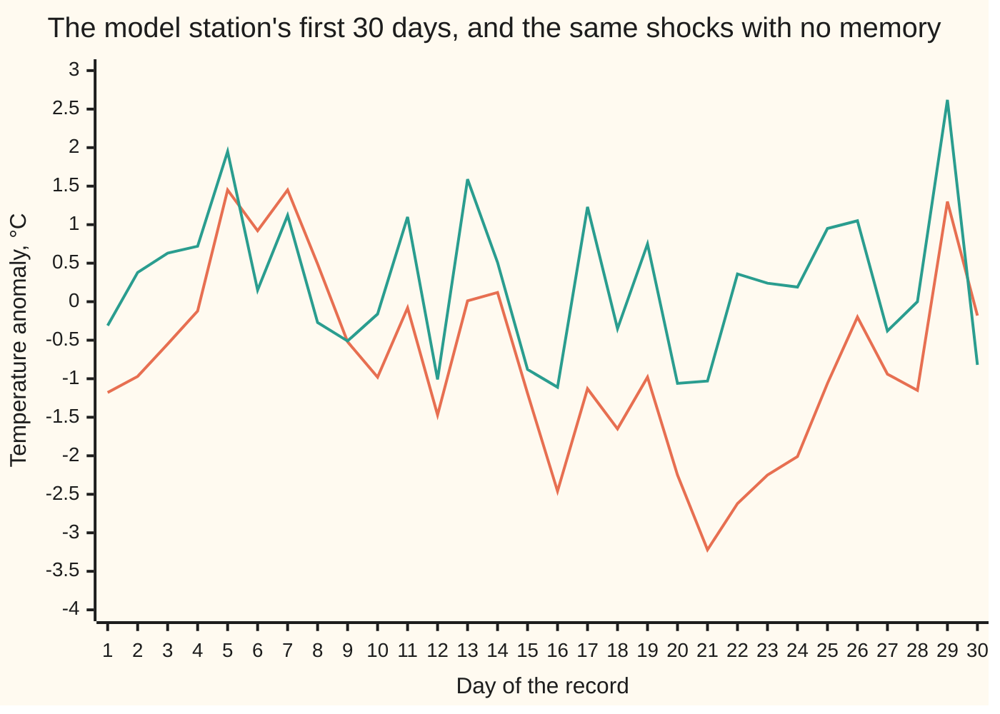
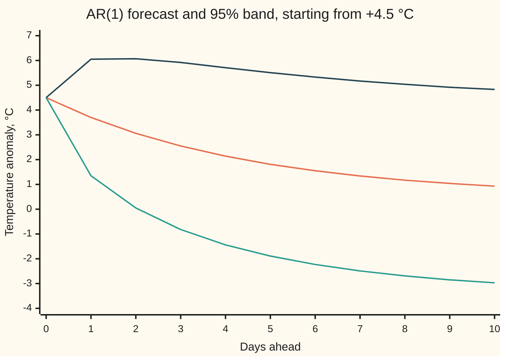

# Autoregression: tomorrow as a fraction of today plus noise

[Syllabus](../../../SYLLABUS.md) → [Probability and statistics](../README.md) → [Time Series](../README.md#s12) → Autoregression

---

## General Overview

A weather station logs each day's temperature anomaly: that day's mean temperature minus the long-run average for the same calendar date. A reading of +3 °C means three degrees warmer than usual for the date, whatever the season. Warm days tend to follow warm days. A heat wave does not stop overnight; it fades.

Autoregression turns the fading into a rule. Tomorrow's anomaly is a fixed fraction of today's, plus a small constant, plus a fresh random surprise. On this card the fraction is 0.8, the constant 0.1 °C, and the surprise is a normal draw with standard deviation 1.2 °C. "Auto" because the series is regressed on itself: yesterday plays the explanatory variable, today the response.

The station is a model, not a real record: a year of its readings is generated from those three numbers with a stated seed, so every fit can be graded against the truth. Three jobs follow. **Fit:** a year of readings gives back 0.823, standard error 0.030. **Condition:** the fraction must lie strictly between −1 and 1, or the readings wander off with no average to return to. **Forecast:** after a +4.5 °C day, tomorrow's forecast is +3.7 °C, and 95 tomorrows in 100 land between +1.35 and +6.05 °C.

**An AR(1) model says each value is a constant, plus a fixed fraction of the last value, plus a fresh independent shock; when the fraction lies strictly between −1 and 1 the series settles around a fixed mean, its memory fades geometrically, and forecasts glide back to that mean inside bands that widen to a fixed width.**

**What kind of fact this is:** a model: an assumption about how anomalies evolve, to be checked against data, not a law. Inside the model, the stationarity condition and the forecast formulas are theorems, proved on this card in Why it works.

### The picture: thirty days with memory and without



Orange: the station, each day keeping 80% of the day before. Green: the same daily shocks added to the station's long-run mean of 0.5 °C, with no carry-over. The green line jumps about its mean. The orange line drifts: from day 16 to day 25 it stays below zero throughout, because a run of shocks that lean cold piles up when each day keeps most of the last.

---

## The formula

Notation first, in words. Days are numbered $t$ = 1, 2, 3 and so on. $X_t$ is the anomaly on day $t$ before it is seen, a random variable, written with a capital letter as on the random-variables shelf; $x_t$ is the value recorded. A subscript $t-1$ means the day before.

$$X_t = c + \phi\,X_{t-1} + \varepsilon_t$$

**Read it aloud:** today's anomaly is a constant, plus phi times yesterday's, plus a fresh shock.

The shocks $\varepsilon_t$ are independent of each other and of everything before day $t$, with mean 0 and standard deviation $\sigma$. For the 95% bands they are also normal. When $-1 < \phi < 1$ three facts follow:

$$\mu = \frac{c}{1-\phi}, \qquad \operatorname{Var}(X_t) = \frac{\sigma^2}{1-\phi^2}, \qquad \rho(h) = \phi^{h}$$

**Read it aloud:** the long-run mean is the constant divided by one minus phi; the spread is the shock's variance divided by one minus phi squared; and readings $h$ days apart are correlated by phi to the power $h$.

Standing on day $T$ with reading $x_T$, the forecast $h$ days ahead and the spread of its error are

$$\hat X_{T+h} = \mu + \phi^{h}\,(x_T - \mu), \qquad \sigma_h^2 = \sigma^2\,\frac{1-\phi^{2h}}{1-\phi^2}$$

**Read it aloud:** the forecast is the mean plus today's gap from it, shrunk by phi once per day ahead; the error's variance adds one shrunk shock per day. The 95% band is $\hat X_{T+h} \pm 1.96\,\sigma_h$, where 1.96 is the normal quantile $\Phi^{-1}(0.975)$ of [Normal quantiles](../04-Continuous%20Distributions/05-normal-quantile.md).

With $p$ days of memory the model is AR($p$):

$$X_t = c + \phi_1 X_{t-1} + \phi_2 X_{t-2} + \dots + \phi_p X_{t-p} + \varepsilon_t$$

It is stationary exactly when every solution $\lambda$ of $\lambda^p = \phi_1\lambda^{p-1} + \phi_2\lambda^{p-2} + \dots + \phi_p$ has size below 1, complex solutions measured by their modulus. For $p$ = 1 the one solution is $\phi$ itself, which gives back $-1 < \phi < 1$. For $p$ = 2 the condition is a triangle: $\phi_1 + \phi_2 < 1$, $\phi_2 - \phi_1 < 1$ and $-1 < \phi_2 < 1$.

Fitting has two standard roads, given here for AR(1) and in Why it works, Step 6, for AR($p$). Least squares fits the line through the points (yesterday, today), exactly as in [Least squares](../09-Regression/01-least-squares-regression.md), and its slope is the estimate $\hat\phi$. Yule–Walker sets $\hat\phi = r(1)$, the record's own autocorrelation at lag 1. Either way, for a record of $n$ days,

$$\operatorname{se}(\hat\phi) \approx \sqrt{\frac{1-\phi^2}{n}}$$

| Symbol | Plain meaning | In our example | Push it up and the answer… |
| --- | --- | --- | --- |
| $X_t$, $x_t$, $t$ | the anomaly on day $t$: random before it is seen, a number after | day 1 recorded −1.18 °C | — |
| $\phi$ | phi, the carry-over: the fraction of yesterday kept today | 0.8 | memory lasts longer and the spread grows; at 1 there is no mean |
| $c$ | the constant added each day | 0.1 °C | the mean rises, by the constant over one minus phi |
| $\varepsilon_t$ | the shock on day $t$: fresh, independent, mean zero | one normal draw a day | — |
| $\sigma$ | the shock's standard deviation | 1.2 °C | every band widens in proportion |
| $\mu$ | the long-run mean the series settles around | 0.5 °C | forecasts glide to a higher level |
| $\rho(h)$, $h$ | the autocorrelation at lag $h$; $h$ counts days apart, or days ahead | 0.8 at one day, 0.64 at two | — |
| $T$, $x_T$ | today, the last recorded day, and its reading | +4.5 °C | every forecast starts higher |
| $\hat X_{T+h}$ | the forecast $h$ days ahead | 3.7 °C tomorrow | — |
| $\sigma_h$ | the standard deviation of the $h$-day forecast error | 1.2 tomorrow, 1.537 at two days, towards 2.0 | the band widens |
| $p$; $\phi_1$, $\phi_2$, $\phi_p$; $\lambda$ | the order of an AR($p$) model; its carry-over fractions; a solution of its root equation | $p$ = 2 fit: 0.7562 and 0.0808; largest size of $\lambda$ 0.8512 | stationarity lost once any size reaches 1 |
| $n$; $\hat\phi$, $r(1)$ | days in the record; the fitted carry-over by least squares, and by the lag-1 autocorrelation | 365; 0.8230 both ways | a larger record shrinks the standard error |
| $\operatorname{se}(\cdot)$ | the standard error of an estimate: its typical distance from the truth | se of $\hat\phi$: 0.0298 by regression, 0.0314 by formula | — |
| $\Phi^{-1}$ | the normal quantile: the cutoff with a given area to its left | $\Phi^{-1}(0.975)$ = 1.96 | — |
| $Y_t$, $Y_0$ | the gap from the mean, $X_t - \mu$, in the proof; $Y_0$ on the starting day | today's gap, 4.5 − 0.5 = 4 °C | — |
| $j$ | a shock's age in days, or in Step 6 the day of an echo | weight $\phi^j$: 0.8 at age 1, 0.64 at age 2 | — |

### When it holds

- **The carry-over strictly between −1 and 1** (for AR($p$), every root size below 1). At $\phi$ = 1 the model is a random walk: fed the same shocks, its spread after a year is 23.26 °C, against the station's 2.00.
- **Shocks independent of the past, with the same spread every day.** If calm and stormy spells alternate, the band is right on average and wrong on the day; [GARCH](06-garch-and-volatility-clustering.md) models that.
- **Normal shocks, for the 1.96.** The forecast itself needs only mean-zero shocks. With fat-tailed shocks the share outside the band is no longer 5%, and the misses that do happen are larger.
- **Known parameters.** The formulas use the true 0.8. A band built from the fitted 0.823 ignores that estimate's own error and comes out slightly too narrow; with a year of data the effect is small.
- **Memory that fades geometrically.** A seasonal cycle left in the data gives autocorrelations that rise again at a year's lag, which no AR(1) can produce. That is why the station records anomalies, not raw temperatures.

---

## Why it works

### Step 0: unroll the rule, and every value is a weighted sum of past shocks

Substitute yesterday's equation into today's, then the day before's, and so on. Today's anomaly becomes the long-run mean, plus today's shock, plus 0.8 of yesterday's shock, plus 0.64 of the shock before, each shock weighted by phi to the power of its age. Everything on this card, the mean, the spread, the memory, the forecast and its band, is read off that weighted sum.

### Step 1: the mean is not the constant

If the series has a fixed mean $\mu$, averaging both sides of the rule gives $\mu = c + \phi\mu$, since the shock averages zero. So $\mu = c/(1-\phi)$ = 0.1/0.2 = 0.5 °C. The constant 0.1 is not the mean. Each day adds 0.1 and keeps 80% of the rest, and the level where those balance is 0.5.

### Step 2: the spread settles exactly when the carry-over is below 1 in size

Unrolled from a starting day 0, the gap from the mean on day $t$ is the starting gap times $\phi^t$, plus $t$ shocks weighted 1, $\phi$, $\phi^2$ and so on. The pieces are independent, so their variances add: the starting variance times $\phi^{2t}$, plus $\sigma^2$ times $1 + \phi^2 + \phi^4 + \dots + \phi^{2(t-1)}$.

That is a geometric series with ratio $\phi^2$. When $-1 < \phi < 1$ the starting term dies away and the sum approaches $\sigma^2/(1-\phi^2)$ = 1.44/0.36 = 4, standard deviation 2 °C, whatever the start. A series started with variance 4 keeps it exactly on every day. When the size of $\phi$ is 1 or more, the sum grows without limit: at $\phi$ = 1 it is $t$ times $\sigma^2$, and no fixed spread exists. That is the stationarity condition, and why it takes exactly this form.

<details>
<summary>Detailed proof: unrolling, the variance and the autocorrelation</summary>

Measure each day as a gap from the mean, $Y_t = X_t - \mu$. Since $c = \mu - \phi\mu$, the rule becomes $Y_t = \phi Y_{t-1} + \varepsilon_t$. By induction on $t$,
$$Y_t = \phi^t Y_0 + \sum_{j=0}^{t-1} \phi^j \varepsilon_{t-j}.$$
The case $t$ = 1 is the rule itself; substituting the rule into the case for $t$ gives the case for $t+1$.

The shocks are independent of each other and of the starting gap $Y_0 = X_0 - \mu$, so variances add, and a constant factor multiplies a variance by its square:
$$\operatorname{Var}(Y_t) = \phi^{2t}\operatorname{Var}(Y_0) + \sigma^2 \sum_{j=0}^{t-1} \phi^{2j} = \phi^{2t}\operatorname{Var}(Y_0) + \sigma^2\,\frac{1-\phi^{2t}}{1-\phi^2}.$$
If $\operatorname{Var}(Y_0) = \sigma^2/(1-\phi^2)$, substituting gives $\sigma^2/(1-\phi^2)$ for every $t$. If $-1 < \phi < 1$, $\phi^{2t}$ goes to 0 and any starting variance is forgotten. If $\phi^2 \ge 1$, every term of the sum is at least $\sigma^2$, so the variance is at least $t\sigma^2$ and grows without limit.

For the memory, unroll from day $t$ to day $t+h$: $Y_{t+h} = \phi^h Y_t + (\text{shocks after day } t)$. Those shocks are independent of the day-$t$ gap, so $\operatorname{Cov}(Y_{t+h}, Y_t) = \phi^h \operatorname{Var}(Y_t)$. Divide by the variance: $\rho(h) = \phi^h$. The code also sums the first 200 weights $\sigma^2\phi^{2j}$ directly and gets 4.0000.

</details>

### Step 3: the memory fades geometrically

The autocorrelation from [Stationarity and autocorrelation](01-stationarity-and-autocorrelation.md) is, for this model, $\phi^h$: 0.800, 0.640, 0.512, 0.410, 0.328 at lags 1 to 5. The simulated year gives 0.823, 0.703, 0.538, 0.434, 0.374. Each lag keeps a fixed fraction of the one before. A negative $\phi$ makes the signs alternate: a warm day predicts a cool one. That geometric fade is the fingerprint an analyst looks for before choosing AR(1).

### Step 4: fitting, by two roads

Given yesterday, the rule says today is $c + \phi x_{t-1}$ plus an independent shock. That is a straight-line regression of today on yesterday with independent errors, so least squares applies unchanged. On the 364 pairs of consecutive days it gives slope $\hat\phi$ = 0.8230, intercept 0.1181, and residual standard deviation 1.2157 against a true 1.2.

The second road uses no regression. Subtract the mean, multiply the rule by yesterday's gap, and average. The shock is independent of yesterday, so its term averages zero, and what is left says the lag-1 autocovariance is $\phi$ times the variance: $\phi = \rho(1)$. Plugging in the record's $r(1)$ gives 0.8230 again. This is the one-lag Yule–Walker equation; the two roads differ only in how they treat the first and last day, which moves nothing at four decimals here.

How far off is the fit likely to be? The regression card's standard error of a slope is the residual spread over the square root of the sum of squared deviations of yesterday's values: here 0.0298. For large $n$ that sum is about $n$ times the stationary variance, and the ratio simplifies to $\sqrt{(1-\phi^2)/n}$ = 0.0314. So the fit reads 0.823 with a standard error of about 0.030, and the true 0.8 sits within one standard error.

Simulating 2,000 more years of the station tests those claims. The fitted carry-over averages 0.7911, with standard deviation 0.0321 across years. The spread matches the formula's 0.0314. The average sits low: least squares on a series with memory underestimates $\phi$ by about $(1+3\phi)/n$, which predicts 0.7907 (Marriott and Pope, 1954).

The record's mean is 0.6375 against a true 0.5, with standard error $\sigma/((1-\phi)\sqrt n)$ = 0.31. Independent readings would give $2/\sqrt{365}$ = 0.10: with memory, 365 days carry far less information about the mean; [Stationarity and autocorrelation](01-stationarity-and-autocorrelation.md) shows the same effect for a shared offset.

### Step 5: the forecast is the mean plus the shrunk gap, and its error is the shocks still to come

The forecast with the smallest average squared error is the average of the future value given everything known today, the conditional expectation of [Conditional expectation](../02-Random%20Variables/05-conditional-expectation-in-tables.md). Unroll from today, day $T$:

$$X_{T+h} - \mu = \phi^h (x_T - \mu) + \varepsilon_{T+h} + \phi\,\varepsilon_{T+h-1} + \dots + \phi^{h-1}\varepsilon_{T+1}$$

Today's gap is known. The future shocks average zero, so the forecast is $\mu + \phi^h(x_T - \mu)$. The error is exactly the future shocks' weighted sum, whose variance is $\sigma^2(1 + \phi^2 + \dots + \phi^{2(h-1)})$, the formula for $\sigma_h^2$. A sum of independent normal shocks is normal, so the band of $\pm 1.96\,\sigma_h$ holds 95% of outcomes. Two limits read off: tomorrow's error is one shock, $\sigma_1 = \sigma$; far ahead the forecast is the mean and the band is the stationary spread, $\pm 1.96 \times 2$.

The code runs 20,000 futures from +4.5 °C. At 1, 2, 3, 5 and 10 days ahead the share inside the band is 0.9526, 0.9516, 0.9501, 0.9500 and 0.9497.

### Step 6: AR(p), and why the condition is on the roots

Follow one shock of size 1 through an AR(2). Its echo obeys the model's own rule with no new shocks: each day's echo is $\phi_1$ times the echo the day before, plus $\phi_2$ times the echo two days before. Try an echo that is a power of one number, $\lambda^j$ on day j: the rule holds exactly when $\lambda^2 = \phi_1\lambda + \phi_2$. Every echo is a mix of the two solutions' powers (with a repeated solution, $j\lambda^j$ joins $\lambda^j$), so it dies away exactly when both have size below 1, and the variance, $\sigma^2$ times the sum of squared echoes, is finite exactly then. The same holds for any $p$. Stacking the last $p$ days into a vector turns AR($p$) into a one-step matrix rule, and the $\lambda$ are that matrix's eigenvalues.

Both fitting roads carry over to $p$ lags. Least squares regresses today on the last $p$ days together, the multiple regression of [Multiple regression](../09-Regression/03-multiple-regression-and-gauss-markov.md). Yule–Walker multiplies the rule by each of the last $p$ days' gaps in turn and averages, as in Step 4. That gives $p$ equations, one for each lag $k = 1, \dots, p$: $r(k) = \phi_1 r(k-1) + \phi_2 r(k-2) + \dots + \phi_p r(k-p)$, where $r(0) = 1$ and a negative lag reads as the positive one, solved for the $p$ fractions. For $p$ = 2 the solution is

$$\hat\phi_1 = \frac{r(1)\,(1 - r(2))}{1 - r(1)^2}, \qquad \hat\phi_2 = \frac{r(2) - r(1)^2}{1 - r(1)^2}.$$

The code fits an AR(2) to the same year. Least squares gives 0.7562 and 0.0808, with standard error 0.0527 on the second; Yule–Walker gives 0.7572 and 0.0800. By hand, Step 3's three-place values 0.823 and 0.703 give 0.7575 and 0.0796: the denominator $1 - r(1)^2$ is only about 0.32, so rounding the inputs moves the fourth decimal. The largest root size is 0.8512, inside the triangle. The second coefficient sits under two standard errors from zero, so the extra lag earns nothing and AR(1) stays. Choosing the order properly uses the partial correlogram of [Moving average and ARMA](03-ma-and-arma.md) or an information criterion, treated in the sources below.

Shrink the day to an instant and AR(1) becomes the Ornstein–Uhlenbeck process of [Mean reversion](../../12-Financial%20mathematics/50-Signals%2C%20Mean%20Reversion%20and%20Backtesting/01-ornstein-uhlenbeck-mean-reversion-trading.md).

---

## Worked numbers, by hand

The station: carry-over 0.8, constant 0.1 °C, shock standard deviation 1.2 °C. Today reads +4.5 °C.

| Step | Arithmetic | Value |
| --- | --- | --- |
| long-run mean | 0.1 / (1 − 0.8) = 0.1 / 0.2 | 0.5 °C |
| stationary variance | 1.44 / (1 − 0.64) = 1.44 / 0.36 | 4, so standard deviation 2 °C |
| today's gap from the mean | 4.5 − 0.5 | 4 °C |
| tomorrow's forecast | 0.5 + 0.8 × 4 = 0.5 + 3.2 | 3.7 °C |
| tomorrow's error | one shock | standard deviation 1.2 °C |
| tomorrow's 95% band | 3.7 ± 1.96 × 1.2 = 3.7 ± 2.352 | **1.348 to 6.052 °C** |
| two days ahead | 0.5 + 0.64 × 4 = 0.5 + 2.56 | 3.06 °C |
| its error variance | 1.44 × (1 + 0.64) = 1.44 × 1.64 | 2.3616, standard deviation 1.537 |
| its 95% band | 3.06 ± 1.96 × 1.537 | 0.048 to 6.072 °C |
| ten days ahead | 0.5 + 0.8^10 × 4 = 0.5 + 0.1074 × 4 = 0.5 + 0.4295 | 0.929 °C, band −2.968 to 4.827 |
| far ahead | the mean, ± 1.96 × 2 | 0.5 ± 3.92 °C |

After a +4.5 °C day, tomorrow is very likely still warm: about 95 tomorrows in 100 fall between +1.35 and +6.05 °C. Ten days out the warm spell has mostly faded from the forecast, and the band is almost as wide as it will ever get.

### The picture: the forecast fan from +4.5 °C



Orange: the forecast, gliding from 4.5 towards the 0.5 °C mean. Green: the lower edge of the 95% band. Dark blue: the upper edge. The band opens fast, then stops widening at ± 3.92 around the mean.

### What breaks if you drop a piece

| Mistake | Comes out at | What went wrong |
| --- | --- | --- |
| Carry-over set to 1, a random walk | spread after a year 23.26 °C simulated (rule 22.93), not 2.00 | Variance grows by the shock's variance every day; there is no mean to return to |
| AR(2) with 0.5 and 0.6, "each below 1" | largest root size 1.0639; one shock's echo after 50 days is 14.49 times the shock | The condition is on the roots: 0.5 + 0.6 is above 1, outside the triangle |
| The constant taken as the mean | 30-day forecast 0.10 °C instead of 0.505 | The mean is the constant over one minus phi |
| Tomorrow's band from the stationary spread | ± 3.92 instead of ± 2.35 | Tomorrow's error is one shock, not the whole stationary spread |

The code prints all four.

---

## Code, from first principles, and it actually runs

Nothing imported knows the answer. Both programs write out their own random numbers (SplitMix64, seed 2026, turned into normal draws by the Box–Muller formula), their own normal area (Simpson's rule, bisected for the 1.96), and their own regressions. The carry-over is found three ways: least squares, Yule–Walker, and 2,000 simulated years that test the standard error and the bias. The stationary variance is found as a formula and as a sum of 200 weights. The forecast and its band are checked against 20,000 simulated futures. The AR(2) root condition is checked against a shock's echo computed step by step.

### Python

```python
# Autoregression, AR(1) and AR(2) -- the check behind the card.  Standard library
# only: math supplies sqrt, log, cos and exp.  Every random draw comes from
# SplitMix64 (seed 2026) and Box-Muller, written out here, so Python and Rust
# draw the same numbers.  Model station: X_t = 0.1 + 0.8 X_(t-1) + shock, sd 1.2.
import math

PHI, C, SIG, N = 0.8, 0.1, 1.2, 365
MU, VAR = C / (1 - PHI), SIG**2 / (1 - PHI**2)
SD, X_NOW, HS, YEARS, PATHS = math.sqrt(VAR), 4.5, [1, 2, 3, 5, 10], 2000, 20000
MASK, state = (1 << 64) - 1, 2026

def u01():                                   # SplitMix64, mapped into (0, 1)
    global state
    state = (state + 0x9E3779B97F4A7C15) & MASK
    z = state
    z = ((z ^ (z >> 30)) * 0xBF58476D1CE4E5B9) & MASK
    z = ((z ^ (z >> 27)) * 0x94D049BB133111EB) & MASK
    return (((z ^ (z >> 31)) >> 11) + 0.5) / 2.0**53

def gauss():                                 # Box-Muller: one standard normal draw
    u1, u2 = u01(), u01()
    return math.sqrt(-2 * math.log(u1)) * math.cos(2 * math.pi * u2)

def cdf(x):                                  # Phi(x): 1/2 plus a Simpson integral
    n, h = 2000, x / 2000
    s = sum((1 if i in (0, n) else 4 if i % 2 else 2) * math.exp(-(i * h)**2 / 2)
            for i in range(n + 1))
    return 0.5 + s * h / 3 / math.sqrt(2 * math.pi)

def year():                                  # day 0 from the stationary law, then 365 days
    x, eps = [MU + SD * gauss()], []
    for _ in range(N):
        eps.append(SIG * gauss())
        x.append(C + PHI * x[-1] + eps[-1])
    return x[1:], eps

def ls_ar1(x):                               # road one: least squares, today on yesterday
    a, b = x[:-1], x[1:]
    ma, mb = sum(a) / len(a), sum(b) / len(b)
    sxx = sum((u - ma)**2 for u in a)
    slope = sum((u - ma) * (v - mb) for u, v in zip(a, b)) / sxx
    icpt = mb - slope * ma
    s2 = sum((v - icpt - slope * u)**2 for u, v in zip(a, b)) / (len(a) - 2)
    return slope, icpt, math.sqrt(s2), math.sqrt(s2 / sxx)

def acf(x, k):                               # road two: sample autocorrelations 0..k
    m = sum(x) / len(x)
    g = [sum((x[t] - m) * (x[t - h] - m) for t in range(h, len(x))) / len(x)
         for h in range(k + 1)]
    return m, g[0], [gh / g[0] for gh in g]
def top_root(p1, p2):                        # largest |lambda| with lambda^2 = p1 lambda + p2
    d = p1 * p1 + 4 * p2
    return (abs(p1) + math.sqrt(d)) / 2 if d >= 0 else math.sqrt(-p2)
def triangle(p1, p2):                        # the AR(2) stationarity triangle
    return p1 + p2 < 1 and p2 - p1 < 1 and abs(p2) < 1
def row(label, vals, fmt="{:.2f}"):
    print(f"{label:<36}" + " ".join(fmt.format(v) for v in vals))

lo, hi = 0.0, 5.0                            # the 95% point: bisect Phi(z) = 0.975
for _ in range(60):
    mid = (lo + hi) / 2
    lo, hi = (mid, hi) if cdf(mid) < 0.975 else (lo, mid)
Z95 = (lo + hi) / 2
tail = SIG**2 * sum(PHI**(2 * j) for j in range(200))
row("model phi, c, sigma, z95", [PHI, C, SIG, Z95], "{:.6f}")
row("mean c/(1-phi), var, sd", [MU, VAR, SD], "{:.4f}")
row("variance, 200 weights summed", [tail], "{:.4f}")
row("hand: 1-phi,phi^2,1-phi^2,sig^2,gap", [1 - PHI, PHI**2, 1 - PHI**2, SIG**2, X_NOW - MU], "{:.4f}")
row("hand: phi^h x gap h=1,2,10; phi^10", [PHI * 4, PHI**2 * 4, PHI**10 * 4, PHI**10], "{:.4f}")
row("hand: 1+phi^2, var h=2", [1 + PHI**2, SIG**2 * (1 + PHI**2)], "{:.4f}")
x, eps = year()
row("chart, AR(1) days 1-15", x[0:15]); row("chart, AR(1) days 16-30", x[15:30])
row("chart, shocks alone days 1-15", [MU + e for e in eps[0:15]]); row("chart, shocks alone days 16-30", [MU + e for e in eps[15:30]])
b, a, s, se = ls_ar1(x)
m, g0, r = acf(x, 5)
row("LS fit phi, c, sigma, se(phi)", [b, a, s, se], "{:.4f}")
row("YW fit phi = r1, c = m(1-r1)", [r[1], m * (1 - r[1])], "{:.4f}")
row("se formula sqrt((1-phi^2)/n)", [math.sqrt((1 - PHI**2) / N)], "{:.4f}")
row("record mean, variance, se(mean)", [m, g0, SIG / (1 - PHI) / math.sqrt(N)], "{:.4f}")
row("acf lags 1-5, record", r[1:], "{:.3f}"); row("acf lags 1-5, phi^h", [PHI**h for h in range(1, 6)], "{:.3f}")
y = [v - m for v in x]
def S(i, j): return sum(y[t - i] * y[t - j] for t in range(2, N))
s11, s12, s22, s01, s02 = S(1, 1), S(1, 2), S(2, 2), S(0, 1), S(0, 2)
det = s11 * s22 - s12**2
p1, p2 = (s01 * s22 - s02 * s12) / det, (s02 * s11 - s01 * s12) / det
res = sum((y[t] - p1 * y[t - 1] - p2 * y[t - 2])**2 for t in range(2, N)) / (N - 5)
se2 = math.sqrt(res * s11 / det)
q1, q2 = r[1] * (1 - r[2]) / (1 - r[1]**2), (r[2] - r[1]**2) / (1 - r[1]**2)
row("AR(2) LS phi1, phi2, se(phi2)", [p1, p2, se2], "{:.4f}")
row("AR(2) YW phi1, phi2", [q1, q2], "{:.4f}")
h1, h2 = round(r[1], 3), round(r[2], 3)      # Step 6 by hand, from the three-place r(1), r(2)
row("hand: AR(2) YW 3dp; 1-r1^2; 2/sqrtn", [h1 * (1 - h2) / (1 - h1**2), (h2 - h1**2) / (1 - h1**2), 1 - h1**2, SD / math.sqrt(N)], "{:.4f}")
print(f"{'AR(2) fit: top |root|, in triangle':<36}{top_root(p1, p2):.4f} {'yes' if triangle(p1, p2) else 'no'}")
fits, ends = [], []
for _ in range(YEARS):                       # road three: 2000 simulated years
    xs, es = year()
    fits.append(ls_ar1(xs)[0])
    ends.append(sum(es))                     # a random walk fed the same shocks
mf = sum(fits) / YEARS
sf = math.sqrt(sum((f - mf)**2 for f in fits) / (YEARS - 1))
se_ = math.sqrt(sum(e * e for e in ends) / YEARS)
row("2000 years: mean phi_hat, sd", [mf, sf], "{:.4f}")
row("theory: phi-(1+3phi)/n, se", [PHI - (1 + 3 * PHI) / N, math.sqrt((1 - PHI**2) / N)], "{:.4f}")
row("random walk sd day 365: sim, rule", [se_, math.sqrt(N) * SIG], "{:.2f}")
got = {h: [] for h in HS}
for _ in range(PATHS):                       # forecast paths from +4.5 today
    v = X_NOW
    for h in range(1, 11):
        v = C + PHI * v + SIG * gauss()
        if h in got: got[h].append(v)
fm = lambda h: MU + PHI**h * (X_NOW - MU)
fs = lambda h: SIG * math.sqrt((1 - PHI**(2 * h)) / (1 - PHI**2))
print("h   mean    sd      lower   upper  | sim mean  sim sd  inside band")
checks = []
for h in HS:
    g = got[h]; mm = sum(g) / PATHS; ss = math.sqrt(sum((v - mm)**2 for v in g) / (PATHS - 1))
    cov = sum(abs(v - fm(h)) <= Z95 * fs(h) for v in g) / PATHS
    checks.append((h, mm, ss, cov))
    print(f"{h:<3} {fm(h):<7.3f} {fs(h):<7.3f} {fm(h) - Z95 * fs(h):<7.3f} {fm(h) + Z95 * fs(h):<6.3f} "
          f"| {mm:<9.3f} {ss:<7.3f} {cov:.4f}")
row("chart, forecast h 0-10", [fm(h) for h in range(11)])
row("chart, lower 95% h 0-10", [fm(h) - Z95 * fs(h) for h in range(11)])
row("chart, upper 95% h 0-10", [fm(h) + Z95 * fs(h) for h in range(11)])
psi = [1.0, 0.5]                             # a shock's echo in AR(2) with 0.5 and 0.6
for j in range(2, 51): psi.append(0.5 * psi[-1] + 0.6 * psi[-2])
row("wrong: 0.5,0.6 root, ratio, echo 50", [top_root(0.5, 0.6), psi[50] / psi[49], psi[50]], "{:.4f}")
row("wrong: 30-day forecast toward c", [C, fm(30)], "{:.4f}")
row("wrong: h=1 half-band stationary sd", [Z95 * SD, Z95 * fs(1)], "{:.4f}")
assert abs(b - r[1]) < 0.02 and abs(q2 - p2) < 0.02    # two estimators, one record
assert abs(b - PHI) < 4 * se and abs(tail - VAR) < 1e-9
assert abs(s - SIG) < 4 * SIG / math.sqrt(2 * (N - 1))     # residual spread recovers the shock's 1.2
assert abs(mf - (PHI - (1 + 3 * PHI) / N)) < 4 * sf / math.sqrt(YEARS)
assert abs(se_ - math.sqrt(N) * SIG) < 4 * math.sqrt(N) * SIG / math.sqrt(2 * YEARS)
for h, mm, ss, cov in checks:
    assert abs(mm - fm(h)) < 4 * fs(h) / math.sqrt(PATHS)
    assert abs(ss - fs(h)) < 4 * fs(h) / math.sqrt(2 * PATHS)
    assert abs(cov - 0.95) < 4 * math.sqrt(0.95 * 0.05 / PATHS)
assert abs(Z95 - 1.959964) < 1e-6 and abs(psi[50] / psi[49] - top_root(0.5, 0.6)) < 1e-6
assert triangle(p1, p2) == (top_root(p1, p2) < 1) and triangle(0.5, 0.6) == (top_root(0.5, 0.6) < 1)
print("ALL CHECKS PASS")
```

**Ran 2026-10-06 on macOS, Python 3.14.6, standard library only. All checks passed. Output, pasted from the run:**

```
model phi, c, sigma, z95            0.800000 0.100000 1.200000 1.959964
mean c/(1-phi), var, sd             0.5000 4.0000 2.0000
variance, 200 weights summed        4.0000
hand: 1-phi,phi^2,1-phi^2,sig^2,gap 0.2000 0.6400 0.3600 1.4400 4.0000
hand: phi^h x gap h=1,2,10; phi^10  3.2000 2.5600 0.4295 0.1074
hand: 1+phi^2, var h=2              1.6400 2.3616
chart, AR(1) days 1-15              -1.18 -0.97 -0.55 -0.12 1.45 0.92 1.45 0.49 -0.52 -0.98 -0.08 -1.47 0.01 0.12 -1.19
chart, AR(1) days 16-30             -2.46 -1.13 -1.65 -0.98 -2.25 -3.22 -2.62 -2.25 -2.01 -1.06 -0.20 -0.94 -1.15 1.30 -0.18
chart, shocks alone days 1-15       -0.31 0.38 0.63 0.72 1.95 0.15 1.12 -0.27 -0.51 -0.16 1.10 -1.01 1.59 0.51 -0.88
chart, shocks alone days 16-30      -1.11 1.23 -0.35 0.75 -1.06 -1.03 0.36 0.24 0.19 0.95 1.05 -0.38 0.00 2.62 -0.82
LS fit phi, c, sigma, se(phi)       0.8230 0.1181 1.2157 0.0298
YW fit phi = r1, c = m(1-r1)        0.8230 0.1128
se formula sqrt((1-phi^2)/n)        0.0314
record mean, variance, se(mean)     0.6375 4.5709 0.3141
acf lags 1-5, record                0.823 0.703 0.538 0.434 0.374
acf lags 1-5, phi^h                 0.800 0.640 0.512 0.410 0.328
AR(2) LS phi1, phi2, se(phi2)       0.7562 0.0808 0.0527
AR(2) YW phi1, phi2                 0.7572 0.0800
hand: AR(2) YW 3dp; 1-r1^2; 2/sqrtn 0.7575 0.0796 0.3227 0.1047
AR(2) fit: top |root|, in triangle  0.8512 yes
2000 years: mean phi_hat, sd        0.7911 0.0321
theory: phi-(1+3phi)/n, se          0.7907 0.0314
random walk sd day 365: sim, rule   23.26 22.93
h   mean    sd      lower   upper  | sim mean  sim sd  inside band
1   3.700   1.200   1.348   6.052  | 3.703     1.192   0.9526
2   3.060   1.537   0.048   6.072  | 3.057     1.526   0.9516
3   2.548   1.718   -0.819  5.915  | 2.543     1.713   0.9501
5   1.811   1.890   -1.893  5.514  | 1.808     1.894   0.9500
10  0.929   1.988   -2.968  4.827  | 0.915     1.990   0.9497
chart, forecast h 0-10              4.50 3.70 3.06 2.55 2.14 1.81 1.55 1.34 1.17 1.04 0.93
chart, lower 95% h 0-10             4.50 1.35 0.05 -0.82 -1.44 -1.89 -2.23 -2.49 -2.69 -2.85 -2.97
chart, upper 95% h 0-10             4.50 6.05 6.07 5.92 5.71 5.51 5.33 5.17 5.04 4.92 4.83
wrong: 0.5,0.6 root, ratio, echo 50 1.0639 1.0639 14.4935
wrong: 30-day forecast toward c     0.1000 0.5050
wrong: h=1 half-band stationary sd  3.9199 2.3520
ALL CHECKS PASS
```

### Rust

Same draws, same labels, built with `rustc --edition 2021 -O`.

```rust
// Autoregression, AR(1) and AR(2): X_t = 0.1 + 0.8 X_(t-1) + shock, sd 1.2.
// The same check as the Python, std only.  Every random draw comes from SplitMix64 (seed 2026) and
// Box-Muller, written out here, so both languages draw the same numbers.
const PHI: f64 = 0.8; const C: f64 = 0.1; const SIG: f64 = 1.2; const X_NOW: f64 = 4.5;
const N: usize = 365; const YEARS: usize = 2000; const PATHS: usize = 20000;

struct Rng(u64);
impl Rng {
    fn u01(&mut self) -> f64 {               // SplitMix64, mapped into (0, 1)
        self.0 = self.0.wrapping_add(0x9E3779B97F4A7C15);
        let mut z = self.0;
        z = (z ^ (z >> 30)).wrapping_mul(0xBF58476D1CE4E5B9);
        z = (z ^ (z >> 27)).wrapping_mul(0x94D049BB133111EB);
        (((z ^ (z >> 31)) >> 11) as f64 + 0.5) / 2f64.powi(53)
    }
    fn gauss(&mut self) -> f64 {             // Box-Muller: one standard normal draw
        let (u1, u2) = (self.u01(), self.u01());
        (-2.0 * u1.ln()).sqrt() * (2.0 * std::f64::consts::PI * u2).cos()
    }
}

fn mu() -> f64 { C / (1.0 - PHI) }
fn var() -> f64 { SIG.powf(2.0) / (1.0 - PHI.powf(2.0)) }

fn cdf(x: f64) -> f64 {                      // Phi(x): 1/2 plus a Simpson integral
    let (n, h) = (2000, x / 2000.0);
    let mut s = 0.0;
    for i in 0..=n {
        let w = if i == 0 || i == n { 1.0 } else if i % 2 == 1 { 4.0 } else { 2.0 };
        s += w * (-(i as f64 * h).powf(2.0) / 2.0).exp();
    }
    0.5 + s * h / 3.0 / (2.0 * std::f64::consts::PI).sqrt()
}

fn year(rng: &mut Rng) -> (Vec<f64>, Vec<f64>) { // day 0 from the stationary law, then 365 days
    let (mut x, mut eps) = (vec![mu() + var().sqrt() * rng.gauss()], Vec::new());
    for _ in 0..N {
        eps.push(SIG * rng.gauss());
        let next = C + PHI * x[x.len() - 1] + eps[eps.len() - 1]; x.push(next);
    }
    (x[1..].to_vec(), eps)
}

fn mean(v: &[f64]) -> f64 { v.iter().fold(0.0, |s, x| s + x) / v.len() as f64 }

fn ls_ar1(x: &[f64]) -> (f64, f64, f64, f64) { // road one: least squares, today on yesterday
    let (a, b) = (&x[..x.len() - 1], &x[1..]);
    let (ma, mb) = (mean(a), mean(b));
    let sxx = a.iter().fold(0.0, |s, u| s + (u - ma).powf(2.0));
    let slope = a.iter().zip(b).fold(0.0, |s, (u, v)| s + (u - ma) * (v - mb)) / sxx;
    let icpt = mb - slope * ma;
    let s2 = a.iter().zip(b).fold(0.0, |s, (u, v)| s + (v - icpt - slope * u).powf(2.0)) / (a.len() - 2) as f64;
    (slope, icpt, s2.sqrt(), (s2 / sxx).sqrt())
}

fn acf(x: &[f64], k: usize) -> (f64, f64, Vec<f64>) { // road two: sample autocorrelations
    let m = mean(x);
    let g: Vec<f64> = (0..=k).map(|h| (h..x.len())
        .fold(0.0, |s, t| s + (x[t] - m) * (x[t - h] - m)) / x.len() as f64).collect();
    (m, g[0], g.iter().map(|gh| gh / g[0]).collect())
}
fn top_root(p1: f64, p2: f64) -> f64 {       // largest |lambda| with lambda^2 = p1 lambda + p2
    let d = p1 * p1 + 4.0 * p2;
    if d >= 0.0 { (p1.abs() + d.sqrt()) / 2.0 } else { (-p2).sqrt() }
}
fn triangle(p1: f64, p2: f64) -> bool { p1 + p2 < 1.0 && p2 - p1 < 1.0 && p2.abs() < 1.0 }
fn row(label: &str, vals: &[f64], dp: usize) {
    let body: Vec<String> = vals.iter().map(|v| format!("{:.*}", dp, v)).collect();
    println!("{:<36}{}", label, body.join(" "));
}

fn fm(h: usize) -> f64 { mu() + PHI.powf(h as f64) * (X_NOW - mu()) }
fn fs(h: usize) -> f64 { SIG * ((1.0 - PHI.powf(2.0 * h as f64)) / (1.0 - PHI.powf(2.0))).sqrt() }

fn main() {
    let (sd, nf) = (var().sqrt(), N as f64);
    let (mut lo, mut hi) = (0.0f64, 5.0f64);     // the 95% point: bisect Phi(z) = 0.975
    for _ in 0..60 {
        let mid = (lo + hi) / 2.0;
        if cdf(mid) < 0.975 { lo = mid } else { hi = mid }
    }
    let z95 = (lo + hi) / 2.0;
    let tail = SIG.powf(2.0) * (0..200).fold(0.0, |s, j| s + PHI.powf(2.0 * j as f64));
    row("model phi, c, sigma, z95", &[PHI, C, SIG, z95], 6);
    row("mean c/(1-phi), var, sd", &[mu(), var(), sd], 4);
    row("variance, 200 weights summed", &[tail], 4);
    row("hand: 1-phi,phi^2,1-phi^2,sig^2,gap", &[1.0 - PHI, PHI.powf(2.0), 1.0 - PHI.powf(2.0), SIG.powf(2.0), X_NOW - mu()], 4);
    row("hand: phi^h x gap h=1,2,10; phi^10", &[PHI * 4.0, PHI.powf(2.0) * 4.0, PHI.powf(10.0) * 4.0, PHI.powf(10.0)], 4);
    row("hand: 1+phi^2, var h=2", &[1.0 + PHI.powf(2.0), SIG.powf(2.0) * (1.0 + PHI.powf(2.0))], 4);
    let mut rng = Rng(2026);
    let (x, eps) = year(&mut rng);
    row("chart, AR(1) days 1-15", &x[0..15], 2);
    row("chart, AR(1) days 16-30", &x[15..30], 2);
    let alone: Vec<f64> = eps[0..30].iter().map(|e| mu() + e).collect();
    row("chart, shocks alone days 1-15", &alone[0..15], 2);
    row("chart, shocks alone days 16-30", &alone[15..30], 2);
    let (b, a, s, se) = ls_ar1(&x);
    let (m, g0, r) = acf(&x, 5);
    row("LS fit phi, c, sigma, se(phi)", &[b, a, s, se], 4);
    row("YW fit phi = r1, c = m(1-r1)", &[r[1], m * (1.0 - r[1])], 4);
    row("se formula sqrt((1-phi^2)/n)", &[((1.0 - PHI.powf(2.0)) / nf).sqrt()], 4);
    row("record mean, variance, se(mean)", &[m, g0, SIG / (1.0 - PHI) / nf.sqrt()], 4);
    row("acf lags 1-5, record", &r[1..], 3);
    let theory: Vec<f64> = (1..6).map(|h| PHI.powf(h as f64)).collect();
    row("acf lags 1-5, phi^h", &theory, 3);
    let y: Vec<f64> = x.iter().map(|v| v - m).collect();
    let big_s = |i: usize, j: usize| (2..N).fold(0.0, |acc, t| acc + y[t - i] * y[t - j]);
    let (s11, s12, s22, s01, s02) = (big_s(1, 1), big_s(1, 2), big_s(2, 2), big_s(0, 1), big_s(0, 2));
    let det = s11 * s22 - s12.powf(2.0);
    let (p1, p2) = ((s01 * s22 - s02 * s12) / det, (s02 * s11 - s01 * s12) / det);
    let res = (2..N).fold(0.0, |acc, t| acc + (y[t] - p1 * y[t - 1] - p2 * y[t - 2]).powf(2.0)) / (N - 5) as f64;
    let se2 = (res * s11 / det).sqrt();
    let den = 1.0 - r[1].powf(2.0);
    let (q1, q2) = (r[1] * (1.0 - r[2]) / den, (r[2] - r[1].powf(2.0)) / den);
    row("AR(2) LS phi1, phi2, se(phi2)", &[p1, p2, se2], 4);
    row("AR(2) YW phi1, phi2", &[q1, q2], 4);
    let (h1, h2) = ((r[1] * 1e3).round() / 1e3, (r[2] * 1e3).round() / 1e3); // Step 6 by hand, three-place r(1), r(2)
    row("hand: AR(2) YW 3dp; 1-r1^2; 2/sqrtn", &[h1 * (1.0 - h2) / (1.0 - h1.powf(2.0)), (h2 - h1.powf(2.0)) / (1.0 - h1.powf(2.0)), 1.0 - h1.powf(2.0), sd / nf.sqrt()], 4);
    println!("{:<36}{:.4} {}", "AR(2) fit: top |root|, in triangle", top_root(p1, p2),
             if triangle(p1, p2) { "yes" } else { "no" });
    let (mut fits, mut ends) = (Vec::new(), Vec::new());
    for _ in 0..YEARS {                      // road three: 2000 simulated years
        let (xs, es) = year(&mut rng);
        fits.push(ls_ar1(&xs).0);
        ends.push(es.iter().fold(0.0, |acc, e| acc + e)); // a random walk fed the same shocks
    }
    let mf = mean(&fits);
    let sf = (fits.iter().fold(0.0, |acc, f| acc + (f - mf).powf(2.0)) / (YEARS - 1) as f64).sqrt();
    let rw = (ends.iter().fold(0.0, |acc, e| acc + e * e) / YEARS as f64).sqrt();
    row("2000 years: mean phi_hat, sd", &[mf, sf], 4);
    row("theory: phi-(1+3phi)/n, se", &[PHI - (1.0 + 3.0 * PHI) / nf, ((1.0 - PHI.powf(2.0)) / nf).sqrt()], 4);
    row("random walk sd day 365: sim, rule", &[rw, nf.sqrt() * SIG], 2);
    let hs = [1usize, 2, 3, 5, 10];
    let mut got: Vec<Vec<f64>> = vec![Vec::new(); 11];
    for _ in 0..PATHS {                      // forecast paths from +4.5 today
        let mut v = X_NOW;
        for h in 1..=10 {
            v = C + PHI * v + SIG * rng.gauss();
            if hs.contains(&h) { got[h].push(v) }
        }
    }
    println!("h   mean    sd      lower   upper  | sim mean  sim sd  inside band");
    let pf = PATHS as f64;
    for &h in &hs {
        let (g, mm) = (&got[h], mean(&got[h]));
        let ss = (g.iter().fold(0.0, |acc, v| acc + (v - mm).powf(2.0)) / (pf - 1.0)).sqrt();
        let cov = g.iter().filter(|v| (*v - fm(h)).abs() <= z95 * fs(h)).count() as f64 / pf;
        println!("{:<3} {:<7.3} {:<7.3} {:<7.3} {:<6.3} | {:<9.3} {:<7.3} {:.4}",
                 h, fm(h), fs(h), fm(h) - z95 * fs(h), fm(h) + z95 * fs(h), mm, ss, cov);
        assert!((mm - fm(h)).abs() < 4.0 * fs(h) / pf.sqrt());
        assert!((ss - fs(h)).abs() < 4.0 * fs(h) / (2.0 * pf).sqrt());
        assert!((cov - 0.95).abs() < 4.0 * (0.95 * 0.05 / pf).sqrt());
    }
    row("chart, forecast h 0-10", &(0..11).map(fm).collect::<Vec<f64>>(), 2);
    row("chart, lower 95% h 0-10", &(0..11).map(|h| fm(h) - z95 * fs(h)).collect::<Vec<f64>>(), 2);
    row("chart, upper 95% h 0-10", &(0..11).map(|h| fm(h) + z95 * fs(h)).collect::<Vec<f64>>(), 2);
    let mut psi = vec![1.0, 0.5];            // a shock's echo in AR(2) with 0.5 and 0.6
    for j in 2..51 { let next = 0.5 * psi[j - 1] + 0.6 * psi[j - 2]; psi.push(next) }
    row("wrong: 0.5,0.6 root, ratio, echo 50", &[top_root(0.5, 0.6), psi[50] / psi[49], psi[50]], 4);
    row("wrong: 30-day forecast toward c", &[C, fm(30)], 4);
    row("wrong: h=1 half-band stationary sd", &[z95 * sd, z95 * fs(1)], 4);
    assert!((b - r[1]).abs() < 0.02 && (q2 - p2).abs() < 0.02);     // two estimators, one record
    assert!((b - PHI).abs() < 4.0 * se && (tail - var()).abs() < 1e-9);
    assert!((s - SIG).abs() < 4.0 * SIG / (2.0 * (N - 1) as f64).sqrt()); // residual spread recovers the shock's 1.2
    assert!((mf - (PHI - (1.0 + 3.0 * PHI) / nf)).abs() < 4.0 * sf / (YEARS as f64).sqrt());
    assert!((rw - nf.sqrt() * SIG).abs() < 4.0 * nf.sqrt() * SIG / (2.0 * YEARS as f64).sqrt());
    assert!((z95 - 1.959964).abs() < 1e-6 && (psi[50] / psi[49] - top_root(0.5, 0.6)).abs() < 1e-6);
    assert!(triangle(p1, p2) == (top_root(p1, p2) < 1.0) && triangle(0.5, 0.6) == (top_root(0.5, 0.6) < 1.0));
    println!("ALL CHECKS PASS");
}
```

**Ran 2026-10-06 on macOS, rustc 1.98.1, no crates. All checks passed. Output, pasted from the run:**

```
model phi, c, sigma, z95            0.800000 0.100000 1.200000 1.959964
mean c/(1-phi), var, sd             0.5000 4.0000 2.0000
variance, 200 weights summed        4.0000
hand: 1-phi,phi^2,1-phi^2,sig^2,gap 0.2000 0.6400 0.3600 1.4400 4.0000
hand: phi^h x gap h=1,2,10; phi^10  3.2000 2.5600 0.4295 0.1074
hand: 1+phi^2, var h=2              1.6400 2.3616
chart, AR(1) days 1-15              -1.18 -0.97 -0.55 -0.12 1.45 0.92 1.45 0.49 -0.52 -0.98 -0.08 -1.47 0.01 0.12 -1.19
chart, AR(1) days 16-30             -2.46 -1.13 -1.65 -0.98 -2.25 -3.22 -2.62 -2.25 -2.01 -1.06 -0.20 -0.94 -1.15 1.30 -0.18
chart, shocks alone days 1-15       -0.31 0.38 0.63 0.72 1.95 0.15 1.12 -0.27 -0.51 -0.16 1.10 -1.01 1.59 0.51 -0.88
chart, shocks alone days 16-30      -1.11 1.23 -0.35 0.75 -1.06 -1.03 0.36 0.24 0.19 0.95 1.05 -0.38 0.00 2.62 -0.82
LS fit phi, c, sigma, se(phi)       0.8230 0.1181 1.2157 0.0298
YW fit phi = r1, c = m(1-r1)        0.8230 0.1128
se formula sqrt((1-phi^2)/n)        0.0314
record mean, variance, se(mean)     0.6375 4.5709 0.3141
acf lags 1-5, record                0.823 0.703 0.538 0.434 0.374
acf lags 1-5, phi^h                 0.800 0.640 0.512 0.410 0.328
AR(2) LS phi1, phi2, se(phi2)       0.7562 0.0808 0.0527
AR(2) YW phi1, phi2                 0.7572 0.0800
hand: AR(2) YW 3dp; 1-r1^2; 2/sqrtn 0.7575 0.0796 0.3227 0.1047
AR(2) fit: top |root|, in triangle  0.8512 yes
2000 years: mean phi_hat, sd        0.7911 0.0321
theory: phi-(1+3phi)/n, se          0.7907 0.0314
random walk sd day 365: sim, rule   23.26 22.93
h   mean    sd      lower   upper  | sim mean  sim sd  inside band
1   3.700   1.200   1.348   6.052  | 3.703     1.192   0.9526
2   3.060   1.537   0.048   6.072  | 3.057     1.526   0.9516
3   2.548   1.718   -0.819  5.915  | 2.543     1.713   0.9501
5   1.811   1.890   -1.893  5.514  | 1.808     1.894   0.9500
10  0.929   1.988   -2.968  4.827  | 0.915     1.990   0.9497
chart, forecast h 0-10              4.50 3.70 3.06 2.55 2.14 1.81 1.55 1.34 1.17 1.04 0.93
chart, lower 95% h 0-10             4.50 1.35 0.05 -0.82 -1.44 -1.89 -2.23 -2.49 -2.69 -2.85 -2.97
chart, upper 95% h 0-10             4.50 6.05 6.07 5.92 5.71 5.51 5.33 5.17 5.04 4.92 4.83
wrong: 0.5,0.6 root, ratio, echo 50 1.0639 1.0639 14.4935
wrong: 30-day forecast toward c     0.1000 0.5050
wrong: h=1 half-band stationary sd  3.9199 2.3520
ALL CHECKS PASS
```

The two outputs match line for line, simulations included, since both languages draw the same numbers from the same seed.

> [!TIP]
> **Try changing**
> Guess first, then run it.
> - **More memory.** Set the carry-over to 0.95. Guess what happens to the stationary spread. It nearly doubles, and forecasts fade far more slowly. An assert stops the run: 200 weights no longer reach the formula to nine decimals, because the echoes fade too slowly.
> - **No mean at all.** Set the carry-over to 1.0. Guess where it fails. The Python stops at the line that sets the mean, which divides by 1 − 1; the Rust gets an infinite mean and fails its asserts. The long-run mean does not exist.
> - **Another year.** Change the seed from 2026 to 7. Guess how far the fit moves. The carry-over lands a little over one standard error below 0.8, and the AR(2) second coefficient lands more than two standard errors from zero although the truth is AR(1). About 1 record in 20 does that, which is what a 5% test promises.
> - **A longer record.** Set the record to 3,650 days. The standard error falls by the square root of 10, to about a third.

---

## The usual mistake

> [!warning]
> **Fitting AR(1) to a series with no fixed mean.** On a random walk, least squares returns a carry-over close to 1, and the formulas then promise a mean to return to and a band that stops widening. Neither exists. Fed the same shocks as the station, a random walk's spread after a year is 23.26 °C, against the station's 2.00. Test for a unit root first: [Unit roots](04-differencing-and-unit-roots.md).
>
> - **The constant read as the mean.** Forecasts far ahead go to 0.5 °C, not 0.1; the 30-day forecast is 0.505.
> - **Each coefficient below 1.** An AR(2) with 0.5 and 0.6 explodes: its largest root size is 1.0639, and a shock's echo after 50 days is 14.49 times the shock.
> - **One band width for every horizon.** The stationary spread gives ± 3.92 tomorrow, where ± 2.35 is right; one shock's spread used ten days out is too narrow.
> - **The fit read as exact.** 0.823 carries a standard error of 0.030, and across simulated years the fit averages 0.7911, low by about (1 + 3 × 0.8)/365.

---

## Where you meet it in real life

- **Climate science.** AR(1) is the standard "red noise" benchmark: before a cycle in a temperature record is called real, it must stand out from what an AR(1) with the same lag-1 correlation produces by chance. The comparison is done in frequency, as in Spectral estimation.
- **Weather forecasting.** Persistence shrunk towards normal, exactly the AR(1) forecast, is a baseline forecasters compare against.
- **Economics.** AR models are the benchmark forecasts for series such as inflation; smoothing methods are compared with them in [Forecasting](05-forecasting-and-exponential-smoothing.md).
- **Trading.** A spread between two related prices that reverts to its mean is modelled as AR(1) in discrete time and as Ornstein–Uhlenbeck in continuous time: [Mean reversion](../../12-Financial%20mathematics/50-Signals%2C%20Mean%20Reversion%20and%20Backtesting/01-ornstein-uhlenbeck-mean-reversion-trading.md).
- **Speech coding.** Linear prediction fits an AR model of order 10 or so to each short slice of speech and transmits the coefficients instead of the sound itself.

> **Say it back**
> An AR(1) model makes each value a constant plus a fixed fraction of the last value plus a fresh independent shock. Unrolled, each value is a weighted sum of past shocks, with weights that are powers of the fraction. When the fraction lies strictly between −1 and 1 the weights fade, so the series has a mean of the constant over one minus the fraction, a fixed spread, and correlations that fall geometrically with the lag. The fraction is fitted by regressing today on yesterday, or read off the lag-1 autocorrelation, and it comes with a standard error. Forecasts shrink today's gap from the mean by the fraction once per day ahead, inside a band that widens to the stationary spread.

---

## What this builds on

- [Stationarity and autocorrelation](01-stationarity-and-autocorrelation.md): what a fixed mean and spread mean for a series, and the autocorrelation this card predicts and measures.
- [Least squares](../09-Regression/01-least-squares-regression.md): the slope formula and its standard error, applied here to today against yesterday.

## Where this goes next

- [Moving average and ARMA](03-ma-and-arma.md): the next card; shocks that count for a fixed number of days, and models that mix both kinds of memory.
- [Unit roots](04-differencing-and-unit-roots.md): what to do when the carry-over is 1, and how to test for it.
- [GARCH](06-garch-and-volatility-clustering.md): autoregression applied to the size of the shocks, not their direction.
- [Mean reversion](../../12-Financial%20mathematics/50-Signals%2C%20Mean%20Reversion%20and%20Backtesting/01-ornstein-uhlenbeck-mean-reversion-trading.md): AR(1) in continuous time, traded.
- Spectral estimation: the same memory seen as a spectrum, and AR fits as a spectral estimate.

An AR model keeps memory in past values, so every shock echoes forever; the open question is how to model a shock that matters for exactly one or two days and then vanishes, which [Moving average and ARMA](03-ma-and-arma.md) answers.

---

## Sources

Verified 29 Sep 2026: every link below resolves to the publisher's page.

- Brockwell, Peter J., and Richard A. Davis. *Introduction to Time Series and Forecasting*, 3rd ed. Springer, 2016. [Publisher page](https://doi.org/10.1007/978-3-319-29854-2). AR processes, causality and the root condition, Yule–Walker estimation, and prediction.
- Hamilton, James D. *Time Series Analysis*. Princeton University Press, 1994. [Publisher page](https://press.princeton.edu/books/hardcover/9780691042893/time-series-analysis). Stationary AR($p$) processes, the companion-matrix view, and forecasting.
- Box, George E. P., Gwilym M. Jenkins, Gregory C. Reinsel and Greta M. Ljung. *Time Series Analysis: Forecasting and Control*, 5th ed. Wiley, 2015. [Publisher page](https://www.wiley.com/en-us/Time+Series+Analysis%3A+Forecasting+and+Control%2C+5th+Edition-p-9781118675021). Model identification by autocorrelations and partial autocorrelations, and forecast bands.
- Hyndman, Rob J., and George Athanasopoulos. *Forecasting: Principles and Practice*, 3rd ed. OTexts. [Section 9.3, Autoregressive models](https://otexts.com/fpp3/AR.html). Free; AR models, their stationarity triangle and choosing the order in practice.
- Marriott, F. H. C., and J. A. Pope. "Bias in the estimation of autocorrelations." *Biometrika* 41 (1954). [DOI](https://doi.org/10.2307/2332719). The downward bias of about (1 + 3 phi)/n that the simulated years reproduce.
