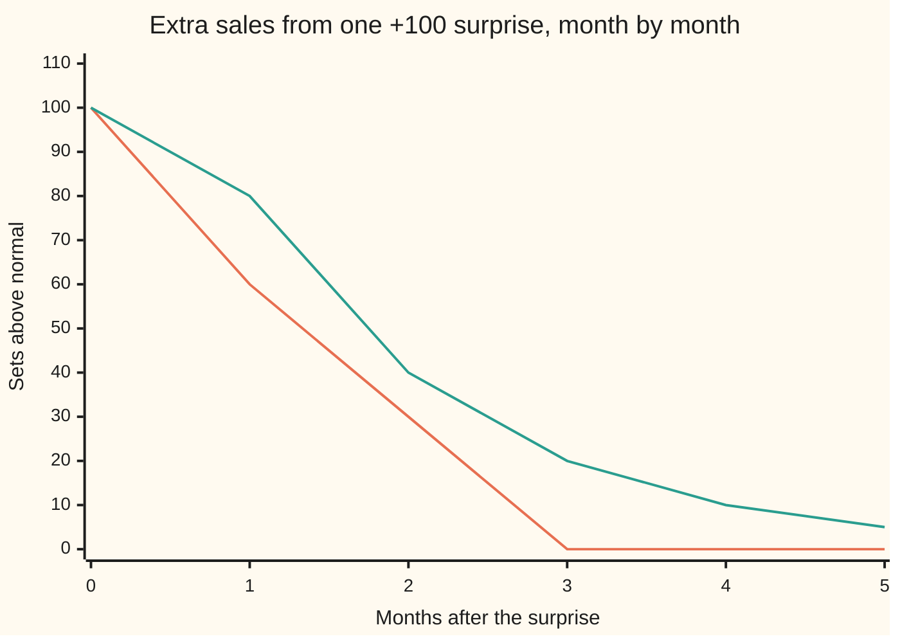
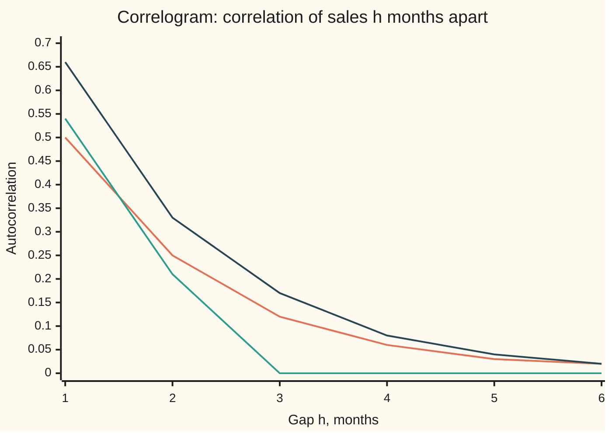
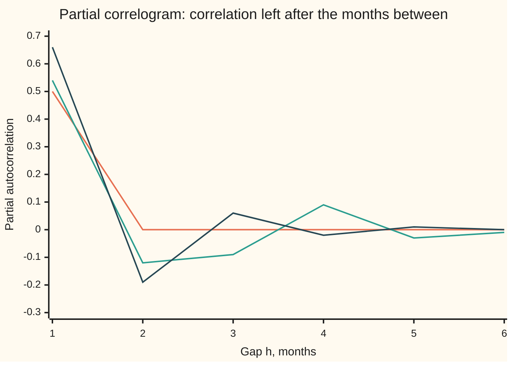

# Moving average and ARMA: noise that lingers

[Syllabus](../../../SYLLABUS.md) → [Probability and statistics](../../../SYLLABUS.md#w09) → [Time Series](../../../SYLLABUS.md#w09-s12) → Moving average and ARMA

---

## General Overview

A garden-furniture shop sells 500 sets in a normal month. No month is normal. A sunny spell, a rival's closing-down sale, a radio advert: each month brings a surprise, sometimes up, sometimes down, typically about 40 sets either way.

The shop's records show something more. A surprise does not vanish when the month ends. In March a radio advert lifts sales 100 sets above normal. April runs 60 sets above normal, with no new advert. May runs 30 above. By June the advert has left no trace. Customers who heard it, measured a patio, argued about colours and came back later made up the echo. Every surprise, good or bad, echoes this way: 60% of it one month on, 30% two months on, then gone.

That is a **moving-average model**: this month's sales are the normal level, plus this month's surprise, plus fixed fractions of a few earlier surprises. The name is old and misleading (the usual mistake below says why). Add a second ingredient, a share of last month's actual sales carried forward, and the model becomes **ARMA**, short for autoregressive moving average. This card defines both, shows how to tell them apart from data, and fits the echo weights from a record of sales.

**A moving-average model says a surprise echoes for a fixed number of months and then stops, so sales correlate with the months inside the echo and with no month beyond it; ARMA adds a carried-forward share of past sales, which makes the echo fade forever instead of stopping.**

**What kind of fact this is:** a model, an assumption about how surprises spread that fits many records well and none exactly; inside it, the cut-off in the correlations is a theorem proved on this card in Why it works, and the fitting recipe is a method.

### The picture: one surprise, two echoes



The line that drops to zero after month 2 is the moving-average shop: 100, 60, 30, then nothing. The line that keeps halving is an ARMA shop that also carries half of each month's excess into the next: 100, 80, 40, 20, 10, 5, never quite zero.

---

## The formula

Notation first, in words. Months are counted by $t$. Sales in month $t$ are $X_t$, a random variable (capital letter, as on the rest of this wing). The surprise that arrives in month $t$ is $\varepsilon_t$ (the Greek letter epsilon). A subscript $t-1$ means "one month earlier".

The moving-average model of order $q$, written MA($q$), lets each surprise echo for $q$ months:

$$X_t = \mu + \varepsilon_t + \theta_1\varepsilon_{t-1} + \theta_2\varepsilon_{t-2} + \dots + \theta_q\varepsilon_{t-q}$$

**Read it aloud:** sales this month are the normal level, plus this month's surprise, plus a fixed fraction of each of the last $q$ surprises.

The shop is MA(2) with $\mu = 500$, $\theta_1 = 0.6$, $\theta_2 = 0.3$ and surprises of standard deviation $\sigma = 40$.

The ARMA($p$, $q$) model adds $p$ carried-forward shares of past sales, measured from the normal level:

$$X_t - \mu = \phi_1(X_{t-1} - \mu) + \dots + \phi_p(X_{t-p} - \mu) + \varepsilon_t + \theta_1\varepsilon_{t-1} + \dots + \theta_q\varepsilon_{t-q}$$

**Read it aloud:** this month's distance from normal is a share of recent months' distances, plus this month's surprise, plus the echoes of recent surprises.

With $q = 0$ it is the autoregression of [Autoregression](02-ar-models.md); with $p = 0$ it is MA($q$). The card's second shop is ARMA(1, 1) with $\phi_1 = 0.5$ and $\theta_1 = 0.3$. Fitted to a series after taking month-on-month changes $d$ times, the same model is called ARIMA($p$, $d$, $q$), the I for integrated; [Unit roots](04-differencing-and-unit-roots.md) says when changes are needed.

What the model predicts about data is its autocovariance, $\gamma(h)$: the covariance between sales in two months $h$ apart ([Stationarity and autocorrelation](01-stationarity-and-autocorrelation.md)). Write $\theta_0 = 1$ for this month's own surprise. For MA($q$):

$$\gamma(h) = \sigma^2\sum_{j=0}^{q-h}\theta_j\,\theta_{j+h}\quad\text{for } h \le q, \qquad \gamma(h) = 0 \quad\text{for } h > q$$

**Read it aloud:** two months $h$ apart share the surprises that both still feel; multiply their weights on each shared surprise, add, scale by the surprise variance; months too far apart share nothing.

The autocorrelation is $\rho(h) = \gamma(h)/\gamma(0)$, a number between −1 and 1. Its plot against $h$ is the **correlogram**.

| Symbol | Plain meaning | In our example | Push it up and the answer… |
| --- | --- | --- | --- |
| $t$, $h$, $j$, $k$ | month number; gap in months between two months; counters over past surprises | $h$ = 1, 2, 3 | larger $h$: correlation falls, to exactly 0 past $q$ for MA |
| $X_t$ | sales in month $t$, a random variable | about 500 sets | — |
| $\mu$ | the normal level: long-run average sales | 500 sets | every month shifts up; correlations unchanged |
| $\varepsilon_t$, $\varepsilon_{t-1}$ | the surprise arriving in month $t$, in month $t-1$; independent, average 0 | +100 for the advert | — |
| $\sigma$ | standard deviation of one surprise; $\sigma^2$ its variance | 40 sets | all covariances scale by $\sigma^2$; correlations unchanged |
| $\theta_0$, $\theta_1$, $\theta_2$, $\theta_j$, $\theta_q$ | echo weights: the share of a surprise felt $j$ months on; $\theta_0 = 1$ | 1, 0.6, 0.3 | longer, louder echo; larger $\rho(1)$, $\rho(2)$ |
| $q$, $p$, $d$ | how many months the echo lasts; how many past months of sales are carried forward; how many times the series is differenced first (ARIMA) | $q = 2$, $p = 0$, $d = 0$ (second shop: 1, 1, 0) | correlations reach further |
| $\phi$, $\phi_1$, $\phi_p$ | carried-forward shares of past sales (the autoregressive part) | 0.5 in the second shop | echo fades more slowly, never stops |
| $\gamma(h)$ | autocovariance: covariance of sales $h$ months apart | 2320, 1248, 480, 0 | — |
| $\rho(h)$ | autocorrelation: $\gamma(h)/\gamma(0)$ | 0.5379, 0.2069, 0 | — |
| $\psi_j$ | total weight of a surprise $j$ months later, echo and carry-over together | MA(2): 1, 0.6, 0.3; ARMA: 1, 0.8, 0.4, 0.2 | — |
| $z$; $\lambda$ | the number the echo polynomial is written in; a root of the recovery recursion (Step 5) | roots of size 1.8257 in $z$, 0.5477 in $\lambda$ | — |
| $n$, $\hat\theta_1$, $S$ | months in the record; the fitted echo weight (a hat marks an estimate); the sum of squared recovered surprises | 240 months; 0.6228 | larger $n$: standard error shrinks like $1/\sqrt{n}$ |

### When it holds

- **Surprises are uncorrelated, with average 0 and one fixed variance.** If one month's surprise carries part of the last, the cut-off fails: the code gives $\rho(3) = 0.0579$ where the model says 0, and the record looks like MA(3).
- **The normal level stays put.** A shop that is growing has no fixed $\mu$; the correlogram then decays slowly at every lag and the model misreads the trend as a long echo. Differencing first is [Unit roots](04-differencing-and-unit-roots.md).
- **Echoes add up in straight lines.** A surprise twice as big leaves an echo twice as big. Saturation (a second advert in a month when the shop is sold out) breaks this.
- **The echo weights can be undone.** For fitting, the surprises must be recoverable from past sales; Step 5 says when, and the second row of What breaks shows the failure.
- **Surprise sizes are steady.** In a share's daily returns calm and wild weeks alternate; the variance itself then needs a model, [GARCH](06-garch-and-volatility-clustering.md).

---

## Why it works

### Step 0: covariance counts shared surprises

Surprises in different months are independent. So the covariance of two sums of surprises comes only from surprises that appear in both sums; every cross term between different months averages to zero. Each shared surprise contributes the product of its two weights times $\sigma^2$. The whole card follows from that one rule.

### Step 1: the average and the spread

The average of each surprise is 0, so $E[X_t] = \mu$: the long-run average of sales is 500. The variance adds one term per surprise, each weight squared:

$$\gamma(0) = \sigma^2(1 + \theta_1^2 + \theta_2^2) = 1600 \times (1 + 0.36 + 0.09) = 2320.$$

The standard deviation of monthly sales is $\sqrt{2320} = 48.1664$ sets. The echo makes sales more variable than one surprise (40 sets) alone.

### Step 2: the correlogram stops after lag q

March sales contain the surprises of March, February and January. April sales contain those of April, March and February. They share two: March's (weight 1 in March, 0.6 in April) and February's (0.6 in March, 0.3 in April). So

$$\gamma(1) = \sigma^2(1 \times 0.6 + 0.6 \times 0.3) = 1600 \times 0.78 = 1248.$$

March and May share only March's surprise, weight 1 then 0.3: $\gamma(2) = 1600 \times 0.3 = 480$. March and June share nothing: $\gamma(3) = 0$, and every larger gap too. That is the signature of a moving average. **The correlogram of MA($q$) is exactly zero from lag $q+1$ on.**

<details>
<summary>Detailed proof: the autocovariance of MA(q), every lag</summary>

Write $X_t - \mu = \sum_{j=0}^{q}\theta_j\varepsilon_{t-j}$ and $X_{t-h} - \mu = \sum_{k=0}^{q}\theta_k\varepsilon_{t-h-k}$, with $h \ge 0$.
Covariance is linear in each argument, so
$$\gamma(h) = \sum_{j=0}^{q}\sum_{k=0}^{q}\theta_j\theta_k\,\mathrm{Cov}(\varepsilon_{t-j}, \varepsilon_{t-h-k}).$$
The surprises are uncorrelated with variance $\sigma^2$, so the inner covariance is $\sigma^2$ when $t - j = t - h - k$, that is $j = k + h$, and 0 otherwise.
Keep only those terms: $k$ runs from 0 to $q - h$ and $j = k + h$, giving $\gamma(h) = \sigma^2\sum_{k=0}^{q-h}\theta_k\theta_{k+h}$.
When $h > q$ the range of $k$ is empty and $\gamma(h) = 0$. Negative gaps follow from $\gamma(-h) = \gamma(h)$.
Nothing here depends on $t$: the mean and every covariance are the same in every month, so any finite MA is stationary, whatever its weights. Only uncorrelatedness was used, not independence or a normal law.

</details>

### Step 3: add a carried-forward share and the echo never stops

In ARMA(1, 1) the shop also carries half of each month's excess into the next: $X_t - \mu = 0.5(X_{t-1} - \mu) + \varepsilon_t + 0.3\varepsilon_{t-1}$. Follow a +100 surprise. Month 0: 100. Month 1: half of 100 carried, plus the 30 echo: 80. Month 2: half of 80, no echo left: 40. Then 20, 10, 5. The total weight of a surprise $j$ months on is

$$\psi_0 = 1, \qquad \psi_j = \phi^{\,j-1}(\phi + \theta_1) \quad (j \ge 1).$$

So ARMA is a moving average with infinitely many weights, shrinking by $\phi$ each month. Step 0 still applies, now with an infinite sum: $\gamma(h) = \sigma^2\sum_j \psi_j\psi_{j+h}$. It converges because $|\phi| < 1$. The result has a closed form:

$$\rho(1) = \frac{(1 + \phi\theta_1)(\phi + \theta_1)}{1 + 2\phi\theta_1 + \theta_1^2}, \qquad \rho(h) = \phi\,\rho(h-1) \quad (h \ge 2).$$

For the second shop $\rho(1) = 1.15 \times 0.8 / 1.39 = 0.6619$, then 0.3309, 0.1655: halving forever. **ARMA's correlogram does not cut off. After lag $q$ it decays by the factor $\phi$ each step, like an autoregression's.**

<details>
<summary>The algebra behind the closed form</summary>

Multiply the ARMA(1, 1) equation by $X_{t-h} - \mu$ and take averages. For $h \ge 2$ neither $\varepsilon_t$ nor $\varepsilon_{t-1}$ has reached month $t - h$, so $\gamma(h) = \phi\gamma(h-1)$.
For $h = 1$: $\gamma(1) = \phi\gamma(0) + \theta_1\sigma^2$, since $X_{t-1}$ contains $\varepsilon_{t-1}$ with weight 1.
For $h = 0$: $\gamma(0) = \phi\gamma(1) + \sigma^2 + \theta_1(\phi + \theta_1)\sigma^2$, since $X_t$ contains $\varepsilon_{t-1}$ with weight $\psi_1 = \phi + \theta_1$.
Solve the last two together: $\gamma(0) = \sigma^2(1 + 2\phi\theta_1 + \theta_1^2)/(1 - \phi^2)$, which is 2965.3333 for the second shop, and dividing $\gamma(1)$ by it gives the $\rho(1)$ above.

</details>

### Step 4: the second correlogram tells AR from MA

An autoregression's correlogram never cuts off either, so one plot cannot separate AR from ARMA. A second plot can. The **partial autocorrelation** at lag $h$ is the correlation between two months $h$ apart that is left after the months in between have been used as well as possible, by least squares. It equals the last coefficient of the best autoregression of order $h$, and a short recursion (Durbin–Levinson, in the code) computes it from the correlogram.

- **AR($p$):** the best autoregression of any order above $p$ is the true one, whose extra coefficients are 0. So the partial correlogram cuts off after lag $p$.
- **MA($q$):** Step 5 shows an MA can be rewritten as an autoregression with infinitely many terms, so no finite order is ever complete. The partial correlogram never cuts off; it shrinks, often alternating in sign.
- **ARMA:** both plots tail off.

| Model | Correlogram | Partial correlogram |
| --- | --- | --- |
| AR($p$) | tails off | zero after lag $p$ |
| MA($q$) | zero after lag $q$ | tails off |
| ARMA($p$, $q$) | tails off after lag $q$ | tails off after lag $p$ |





In both charts, first line (orange): an AR(1) with carry-over 0.5; second (green): the MA(2) shop; third (dark): the ARMA(1, 1) shop. The AR line cuts off in the partial correlogram, the MA line cuts off in the correlogram, the ARMA line cuts off in neither.

### Step 5: two models, one correlogram; keep the one that can be undone

Many sets of echo weights give the same correlogram. Take weights 1, 2, 3.3333 with surprises of standard deviation 12. By Step 2, $\gamma(0) = 144 \times (1 + 4 + 11.1111) = 2320$, $\gamma(1) = 144 \times (2 + 6.6667) = 1248$, $\gamma(2) = 144 \times 3.3333 = 480$: identical to the shop's. No record of sales can tell the two apart.

They differ in one way that matters. To fit a model, the surprises must be recovered from the sales, one month at a time:

$$\varepsilon_t = X_t - \mu - \theta_1\varepsilon_{t-1} - \theta_2\varepsilon_{t-2}.$$

Any error in the starting guess is fed back through the weights. With 0.6 and 0.3 the error shrinks each month; with 2 and 3.3333 it grows each month. The test is the echo polynomial $1 + \theta_1 z + \theta_2 z^2$, the echo weights as coefficients of a number $z$. The model is **invertible** (its surprises can be recovered from past sales) when every root of that polynomial has size greater than 1. The roots here are complex numbers, and size means distance from 0. The shop's roots have size 1.8257; the twin's 0.5477, the reciprocal. Equivalently, the recursion's own roots, the solutions of $\lambda^2 + 0.6\lambda + 0.3 = 0$, have size 0.5477, below 1: the form [Autoregression](02-ar-models.md) uses, and roughly the factor by which the starting error shrinks each month. Unless a root has size exactly 1, every MA correlogram has exactly one invertible version, and that is the one fitted and reported.

Invertibility is also why an MA is an autoregression of infinite order. Substitute the recursion into itself: $\varepsilon_t$ becomes today's sales minus a weighted sum of all past sales, with weights shrinking roughly like $1.8257^{-j}$. That infinite tail is what keeps the MA's partial correlogram from cutting off.

### Step 6: fit the weights by least squares on recovered surprises

For an autoregression the inputs are past sales, which are on record, and ordinary least squares fits it ([Least squares](../09-Regression/01-least-squares-regression.md)). For an MA the inputs are past surprises, which nobody recorded. The way round: guess the weights, recover the surprises with the Step 5 recursion (starting from surprises of 0 before month 1), and score the guess by the sum of squared recovered surprises,

$$S(\theta_1, \theta_2) = \sum_{t=1}^{n}\varepsilon_t(\theta_1, \theta_2)^2.$$

The best weights make $S$ smallest: they leave the least unexplained. This is **conditional least squares**, conditional on the starting zeros. $S$ is not a quadratic in the weights, because each recovered surprise feeds on earlier ones, so there is no one-line formula. Gauss–Newton finds the minimum: straighten each recovered surprise into a line in the weights near the current guess, solve that ordinary least-squares problem for a step, and halve the step if $S$ does not fall. The derivatives needed come from a second recursion, differentiating the first.

The same straightened problem gives the standard errors: its least-squares covariance, scaled by the average squared surprise. Theory offers a check: for MA(2) each weight's standard error is close to $\sqrt{(1 - \theta_2^2)/n}$, which is 0.0616 for 240 months. ARMA is fitted the same way, with $\phi_1(X_{t-1} - \mu)$ also subtracted in the recursion. The code fits only the MA(2) shop, which stands in for both: an ARMA(1, 1) fit runs the same Gauss–Newton loop on the pair $\phi_1$, $\theta_1$, with the two derivative recursions changed to match.

Maximum likelihood with normal surprises gives nearly the same answers on a long record; only the first few months are treated differently.

---

## Worked numbers, by hand

The shop: $\mu = 500$, $\sigma = 40$, echo weights 0.6 and 0.3.

| Step | Arithmetic | Value |
| --- | --- | --- |
| surprise variance $\sigma^2$ | $40^2$ | 1600 |
| $\gamma(0)$, variance of sales | $1600 \times (1 + 0.36 + 0.09)$ | 2320 |
| standard deviation of sales | $\sqrt{2320}$ | 48.1664 sets |
| $\gamma(1)$ | $1600 \times (0.6 + 0.6 \times 0.3)$ | 1248 |
| $\gamma(2)$ | $1600 \times 0.3$ | 480 |
| $\gamma(3)$ | no shared surprise | 0 |
| $\rho(1)$, $\rho(2)$ | $1248/2320$, $480/2320$ | 0.5379, 0.2069 |
| month 1 surprise, from sales of 535.73 | $535.73 - 500$ | 35.73 |
| month 2 surprise, from 549.95 | $49.95 - 0.6 \times 35.73$ | 28.51 |
| month 3 surprise, from 512.25 | $12.25 - 0.6 \times 28.51 - 0.3 \times 35.73$ | −15.57 |
| **correlogram of the shop** | | **0.5379, 0.2069, then 0 at every lag** |

Read back in the shop: sales in neighbouring months move together with correlation about 0.54, two months apart about 0.21, and three or more months apart not at all.

The last three rows run the Step 5 recursion on the first months of a simulated 240-month record (the code's seed 26). The true surprises were 64.24, 15.88 and −16.55; the recovered ones start wrong, because the recursion assumed no surprises before month 1, and the error shrinks each month. By month 6 the recovered surprise is 60.31 against a true 60.39, and by month 24 they agree to the cent.

On that record the fit gives $\hat\theta_1 = 0.6228$ (standard error 0.0623) and $\hat\theta_2 = 0.3110$ (standard error 0.0623), normal level 496.1104 (standard error 5.1736) and surprise standard deviation 41.4467. Both weights sit within one standard error of the truth. Across 200 simulated records the fitted weights averaged 0.6002 and 0.3009 and spread with standard deviations 0.0594 and 0.0576, close to the textbook 0.0616.

The record's correlogram reads 0.5263, 0.1805, −0.0078, 0.0582, 0.0416, −0.0459. The noise band for a lag with no true correlation is $\pm 2/\sqrt{240} = \pm 0.1291$ (the 1.96 of [Stationarity and autocorrelation](01-stationarity-and-autocorrelation.md), rounded to 2): lags 1 and 2 stand clear, lags 3 to 6 sit inside. That points to MA(2). The partial correlogram, 0.5263, −0.1334, −0.0638, 0.1607, −0.0723, −0.0963, shrinks and changes sign, with one stray at lag 4; twelve values against a two-standard-error band often give one. After the fit, the recovered surprises correlate −0.0072, −0.0187, −0.0309 at lags 1 to 3: no echo left.

### What breaks if you drop a piece

| Mistake | Comes out at | What went wrong |
| --- | --- | --- |
| Fit an AR(1) to the echoing shop | one-month forecast error variance 1648.66 in theory, 1641.42 on a 120,000-month run, against 1600 for the true model | Carrying forward last month's sales cannot copy a two-month echo; part of the pattern stays in the errors. |
| Use the twin weights 1, 2, 3.3333 (surprises of sd 12) | same correlogram 0.5379, 0.2069; recovered surprise in month 24 is 18,062,489.75 instead of −32.15 | The twin is not invertible: its recursion amplifies the starting error by about 1.8257 a month. |
| Let each surprise share half of the previous one | $\rho(3) = 0.0579$ instead of 0 | Surprises are no longer uncorrelated; the echo gains a month and the record reads as MA(3). |
| Read $\rho(2)$ as the second echo weight | 0.2069 instead of 0.3 | A correlation mixes all shared surprises and divides by the variance; the weights come from the fit, not from the correlogram directly. |

---

## Code, from first principles, and it actually runs

Four roads lead to the numbers. The autocovariances come from the Step 2 formula and, independently, from listing every pattern of surprises when each is +40 or −40 with equal chance (same average and variance, all Step 2 used). The ARMA correlations come from the closed form and from 400 terms of the weight sum. The partial correlations come from the Durbin–Levinson recursion and are checked against a direct solve of each Yule–Walker system, for both shops and the record. A simulated run of 120,000 months, cut into 60 batches of 2,000, gives each correlation with a standard error. Then a 240-month record is fitted by conditional least squares, and 200 more records check the standard errors. The random numbers come from SplitMix64 with stated seeds, turned normal by the Box–Muller formula, so both languages draw the same numbers. Every "chart," line is a plotted series.

### Python

```python
# Moving average and ARMA -- the check behind the card.  Standard library only.
# Monthly sales after an advert: X_t = 500 + e_t + 0.6 e_(t-1) + 0.3 e_(t-2), surprises of sd 40.
# Every random draw comes from SplitMix64 (seed stated), turned normal by Box-Muller.
from math import sqrt, log, cos, pi
M64 = (1 << 64) - 1
class Rng:
    def __init__(self, seed): self.s = seed
    def u(self):
        self.s = (self.s + 0x9E3779B97F4A7C15) & M64
        z = ((self.s ^ (self.s >> 30)) * 0xBF58476D1CE4E5B9) & M64
        z = ((z ^ (z >> 27)) * 0x94D049BB133111EB) & M64
        return ((z ^ (z >> 31)) >> 11) * 2.0 ** -53
    def normal(self):
        u1 = 1.0 - self.u()
        return sqrt(-2.0 * log(u1)) * cos(2.0 * pi * self.u())

MU, SIG, TH = 500.0, 40.0, [1.0, 0.6, 0.3]
PHI, TA = 0.5, 0.3                                    # ARMA(1,1): loyalty carries half of last month
def acov_formula(th, h, s2):                          # road 1: count the shocks two months share
    return s2 * sum(th[j] * th[j + h] for j in range(len(th) - h)) if h < len(th) else 0.0
def acov_enum(th, h, s):                              # road 2: every surprise is +s or -s; list all
    w = len(th) + h; tot = 0.0
    for word in range(1 << w):
        e = [s if (word >> i) & 1 else -s for i in range(w)]     # e[i] = surprise i months ago
        tot += sum(th[j] * e[j] for j in range(len(th))) * sum(th[j] * e[j + h] for j in range(len(th)))
    return tot / (1 << w)
def arma_rho(h): return 1.0 if h == 0 else (1 + PHI * TA) * (PHI + TA) / (1 + 2 * PHI * TA + TA * TA) * PHI ** (h - 1)
def arma_psi_acov(h, n=400):                          # road 2 for ARMA: weights on past surprises
    psi = [1.0] + [PHI ** (j - 1) * (PHI + TA) for j in range(1, n + h)]
    return SIG * SIG * sum(psi[j] * psi[j + h] for j in range(n))
def pacf(rho, H):                                     # Durbin-Levinson: last coefficient of best AR(k)
    out, a = [], []
    for k in range(1, H + 1):
        kk = (rho[k] - sum(a[j] * rho[k - 1 - j] for j in range(k - 1))) / (1 - sum(a[j] * rho[j + 1] for j in range(k - 1)))
        a = [a[j] - kk * a[k - 2 - j] for j in range(k - 1)] + [kk]; out.append(kk)
    return out
def yw_last(rho, k):                                  # road 2 for the PACF: the k-by-k Yule-Walker system, by elimination
    A = [[rho[abs(i - j)] for j in range(k)] + [rho[i + 1]] for i in range(k)]
    for c in range(k):
        for i in range(c + 1, k):
            f = A[i][c] / A[c][c]; A[i] = [p - f * q for p, q in zip(A[i], A[c])]
    return A[k - 1][k] / A[k - 1][k - 1]              # the last unknown: the partial autocorrelation at lag k
def sample_acf(x, H):
    m = sum(x) / len(x); d = [v - m for v in x]; c0 = sum(v * v for v in d)
    return [1.0] + [sum(d[t] * d[t + h] for t in range(len(d) - h)) / c0 for h in range(1, H + 1)]
def ma2_path(rng, n, th):
    e = [SIG * rng.normal() for _ in range(n + 2)]
    return [MU + e[t + 2] + th[1] * e[t + 1] + th[2] * e[t] for t in range(n)], e[2:]
def resid(x, t1, t2, m):                              # recover surprises month by month, start from 0
    e, a, b = [0.0, 0.0], [0.0, 0.0], [0.0, 0.0]
    for v in x:
        a.append(-e[-1] - t1 * a[-1] - t2 * a[-2]); b.append(-e[-2] - t1 * b[-1] - t2 * b[-2])
        e.append(v - m - t1 * e[-1] - t2 * e[-2])
    return e[2:], a[2:], b[2:]
def fit(x):                                           # least squares on recovered surprises, Gauss-Newton
    m, t1, t2 = sum(x) / len(x), 0.0, 0.0
    for _ in range(30):
        e, a, b = resid(x, t1, t2, m)
        saa, sab, sbb = sum(v * v for v in a), sum(p * q for p, q in zip(a, b)), sum(v * v for v in b)
        sae, sbe = sum(p * q for p, q in zip(a, e)), sum(p * q for p, q in zip(b, e))
        det, sse, step = saa * sbb - sab * sab, sum(v * v for v in e), 1.0
        d1, d2 = (sbb * sae - sab * sbe) / det, (saa * sbe - sab * sae) / det
        while step > 1e-6 and sum(v * v for v in resid(x, t1 - step * d1, t2 - step * d2, m)[0]) > sse: step /= 2
        t1, t2 = t1 - step * d1, t2 - step * d2       # halve the step until the squares shrink
    e, a, b = resid(x, t1, t2, m)
    s2 = sum(v * v for v in e) / (len(x) - 3)
    saa, sab, sbb = sum(v * v for v in a), sum(p * q for p, q in zip(a, b)), sum(v * v for v in b)
    det = saa * sbb - sab * sab
    return m, t1, t2, sqrt(s2 * sbb / det), sqrt(s2 * saa / det), s2, e

g = [acov_formula(TH, h, SIG * SIG) for h in range(7)]; rho = [v / g[0] for v in g]
print("MA(2) sales: mean 500, surprise sd 40, echo weights 1, 0.6, 0.3")
print("lag  gamma by formula  gamma by enumeration     rho")
for h in range(4):
    ge = acov_enum(TH, h, SIG); print(f"{h:>3} {g[h]:>17.4f} {ge:>21.4f} {rho[h]:>7.4f}")
    assert abs(ge - g[h]) < 1e-9
print(f"variance {g[0]:.4f}, sd {sqrt(g[0]):.4f}")
ga0 = SIG * SIG * (1 + 2 * PHI * TA + TA * TA) / (1 - PHI * PHI); arho = [arma_rho(h) for h in range(7)]
print(f"ARMA(1,1) phi 0.5 theta 0.3: gamma0 closed form {ga0:.4f}, by weights {arma_psi_acov(0):.4f}")
for h in (1, 2, 3):
    pr = arma_psi_acov(h) / arma_psi_acov(0); print(f"  lag {h}: rho closed form {arho[h]:.4f}, by weights {pr:.4f}")
    assert abs(pr - arho[h]) < 1e-9
print("chart, echo of a +100 surprise, MA(2)  " + " ".join(f"{100 * (TH[j] if j < 3 else 0):.2f}" for j in range(6)))
print("chart, echo of a +100 surprise, ARMA   " + " ".join(f"{100 * (1 if j == 0 else PHI ** (j - 1) * (PHI + TA)):.2f}" for j in range(6)))
ar1 = [PHI ** h for h in range(7)]; P = {"AR(1)": pacf(ar1, 6), "MA(2)": pacf(rho, 6), "ARMA": pacf(arho, 6)}
assert max(abs(v) for v in P["AR(1)"][1:]) < 1e-12 and all(abs(P[k][1] - (r[2] - r[1] ** 2) / (1 - r[1] ** 2)) < 1e-12 for k, r in (("MA(2)", rho), ("ARMA", arho)))
for name, r in (("AR(1)", ar1), ("MA(2)", rho), ("ARMA", arho)):
    print(f"chart, ACF  {name:<6}" + " ".join(f"{v:.2f}" for v in r[1:]))
    print(f"chart, PACF {name:<6}" + " ".join(f"{v:.2f}" for v in P[name]))
# road 3: a long simulated run, autocorrelations in 60 batches of 2,000 months
rng = Rng(20260929); xs, _ = ma2_path(rng, 120000, TH)
y, prev, ep = [], 0.0, SIG * rng.normal()
for t in range(120100):
    en = SIG * rng.normal(); prev = PHI * prev + en + TA * ep; ep = en
    if t >= 100: y.append(MU + prev)
print("simulated 120000 months, 60 batches: lag, MA(2) sim (se) theory, ARMA sim (se) theory")
for h in (1, 2, 3):
    row = []
    for s, th in ((xs, rho[h]), (y, arho[h])):
        b = [sample_acf(s[i * 2000:(i + 1) * 2000], h)[h] for i in range(60)]
        mb = sum(b) / 60; se = sqrt(sum((v - mb) ** 2 for v in b) / 59 / 60)
        assert abs(mb - th) < 4 * se; row.append(f"{mb:.4f} ({se:.4f}) {th:.4f}")
    print(f"  lag {h}: " + "   ".join(row))
a1 = sample_acf(xs, 1)[1]; mx = sum(xs) / len(xs)
r1 = [xs[t] - mx - a1 * (xs[t - 1] - mx) for t in range(1, len(xs))]
v_th = g[0] * (1 - rho[1] ** 2); v_sim = sum(v * v for v in r1) / len(r1)
print(f"wrong order, AR(1) on MA(2): error variance theory {v_th:.4f}, long run {v_sim:.4f}, true 1600.0000")
assert abs(v_sim - v_th) < 0.02 * v_th and abs(v_sim - 1600) > 0.02 * 1600
# identification and fit on one 240-month record
rec, true_e = ma2_path(Rng(26), 240, TH); ra = sample_acf(rec, 6); rp = pacf(ra, 6)
print(f"record of 240 months, band 2/sqrt(240) = {2 / sqrt(240):.4f}; beyond lag 2, Bartlett widens it by {sqrt(1 + 2 * (rho[1] ** 2 + rho[2] ** 2)):.4f}")
assert all(abs(p[k - 1] - yw_last(r, k)) < 1e-9 for p, r in ((P["MA(2)"], rho), (P["ARMA"], arho), (rp, ra)) for k in range(1, 7))   # two roads to every PACF
print("  sample ACF  " + " ".join(f"{v:.4f}" for v in ra[1:])); print("  sample PACF " + " ".join(f"{v:.4f}" for v in rp))
print("  first months " + " ".join(f"{v:.2f}" for v in rec[:4]))
m, t1, t2, se1, se2, s2, e = fit(rec)
print(f"fit: mean {m:.4f} (se {sqrt(s2) * (1 + t1 + t2) / sqrt(240):.4f}), theta1 {t1:.4f} (se {se1:.4f}), theta2 {t2:.4f} (se {se2:.4f}), surprise sd {sqrt(s2):.4f}")
print(f"textbook se sqrt((1 - theta2^2)/n) = {sqrt((1 - TH[2] ** 2) / 240):.4f}")
assert abs(t1 - 0.6) < 3 * se1 and abs(t2 - 0.3) < 3 * se2
print("  residual ACF lags 1-3 " + " ".join(f"{v:.4f}" for v in sample_acf(e, 3)[1:]))
mc = Rng(11); f1, f2 = [], []
for _ in range(200):
    _, a, b, *_ = fit(ma2_path(mc, 240, TH)[0]); f1.append(a); f2.append(b)
sd = lambda v: sqrt(sum((w - sum(v) / len(v)) ** 2 for w in v) / (len(v) - 1))
print(f"200 simulated records: theta1 mean {sum(f1) / 200:.4f} sd {sd(f1):.4f}, theta2 mean {sum(f2) / 200:.4f} sd {sd(f2):.4f}")
assert abs(sd(f1) / sqrt(0.91 / 240) - 1) < 0.25 and abs(sd(f2) / sqrt(0.91 / 240) - 1) < 0.25
# invertibility: the twin with echo weights 2 and 3.33 and surprises of sd 12 has the same correlogram
tw = [1.0, TH[1] / TH[2], 1 / TH[2]]
print(f"twin: weights 1, {tw[1]:.4f}, {tw[2]:.4f}, sd {SIG * TH[2]:.4f}; root size {sqrt(1 / TH[2]):.4f} vs {sqrt(1 / tw[2]):.4f}")
for h in (0, 1, 2):
    gt = acov_enum(tw, h, SIG * TH[2]); print(f"  lag {h}: twin gamma {gt:.4f}, sales gamma {g[h]:.4f}"); assert abs(gt - g[h]) < 1e-9
ok, _, _ = resid(rec, 0.6, 0.3, MU); bad, _, _ = resid(rec, tw[1], tw[2], MU)
for t in (1, 2, 3, 6, 12, 24):
    print(f"  month {t:>2}: true surprise {true_e[t - 1]:>8.2f}, recovered {ok[t - 1]:>8.2f}, twin recursion {bad[t - 1]:>12.2f}")
assert abs(ok[23] - true_e[23]) < 0.01 and abs(bad[23]) > 1e6
c = [1.0, 1.1, 0.6, 0.15]                             # surprises sharing part of last month's: u = e + 0.5 e(-1)
r3f, r3e = acov_formula(c, 3, 1) / acov_formula(c, 0, 1), acov_enum(c, 3, 1) / acov_enum(c, 0, 1); assert abs(r3f - r3e) < 1e-12 and r3f > 0.05
print(f"correlated surprises: rho3 formula {r3f:.4f}, enumerated {r3e:.4f}, independent 0.0000")
```

**Ran 2026-10-06 on macOS, Python 3.14.6, standard library only. All checks passed. Output, pasted from the run:**

```
MA(2) sales: mean 500, surprise sd 40, echo weights 1, 0.6, 0.3
lag  gamma by formula  gamma by enumeration     rho
  0         2320.0000             2320.0000  1.0000
  1         1248.0000             1248.0000  0.5379
  2          480.0000              480.0000  0.2069
  3            0.0000                0.0000  0.0000
variance 2320.0000, sd 48.1664
ARMA(1,1) phi 0.5 theta 0.3: gamma0 closed form 2965.3333, by weights 2965.3333
  lag 1: rho closed form 0.6619, by weights 0.6619
  lag 2: rho closed form 0.3309, by weights 0.3309
  lag 3: rho closed form 0.1655, by weights 0.1655
chart, echo of a +100 surprise, MA(2)  100.00 60.00 30.00 0.00 0.00 0.00
chart, echo of a +100 surprise, ARMA   100.00 80.00 40.00 20.00 10.00 5.00
chart, ACF  AR(1) 0.50 0.25 0.12 0.06 0.03 0.02
chart, PACF AR(1) 0.50 0.00 0.00 0.00 0.00 0.00
chart, ACF  MA(2) 0.54 0.21 0.00 0.00 0.00 0.00
chart, PACF MA(2) 0.54 -0.12 -0.09 0.09 -0.03 -0.01
chart, ACF  ARMA  0.66 0.33 0.17 0.08 0.04 0.02
chart, PACF ARMA  0.66 -0.19 0.06 -0.02 0.01 -0.00
simulated 120000 months, 60 batches: lag, MA(2) sim (se) theory, ARMA sim (se) theory
  lag 1: 0.5367 (0.0021) 0.5379   0.6591 (0.0019) 0.6619
  lag 2: 0.2058 (0.0029) 0.2069   0.3244 (0.0030) 0.3309
  lag 3: -0.0018 (0.0039) 0.0000   0.1581 (0.0033) 0.1655
wrong order, AR(1) on MA(2): error variance theory 1648.6621, long run 1641.4215, true 1600.0000
record of 240 months, band 2/sqrt(240) = 0.1291; beyond lag 2, Bartlett widens it by 1.2901
  sample ACF  0.5263 0.1805 -0.0078 0.0582 0.0416 -0.0459
  sample PACF 0.5263 -0.1334 -0.0638 0.1607 -0.0723 -0.0963
  first months 535.73 549.95 512.25 460.65
fit: mean 496.1104 (se 5.1736), theta1 0.6228 (se 0.0623), theta2 0.3110 (se 0.0623), surprise sd 41.4467
textbook se sqrt((1 - theta2^2)/n) = 0.0616
  residual ACF lags 1-3 -0.0072 -0.0187 -0.0309
200 simulated records: theta1 mean 0.6002 sd 0.0594, theta2 mean 0.3009 sd 0.0576
twin: weights 1, 2.0000, 3.3333, sd 12.0000; root size 1.8257 vs 0.5477
  lag 0: twin gamma 2320.0000, sales gamma 2320.0000
  lag 1: twin gamma 1248.0000, sales gamma 1248.0000
  lag 2: twin gamma 480.0000, sales gamma 480.0000
  month  1: true surprise    64.24, recovered    35.73, twin recursion        35.73
  month  2: true surprise    15.88, recovered    28.51, twin recursion       -21.51
  month  3: true surprise   -16.55, recovered   -15.57, twin recursion       -63.82
  month  6: true surprise    60.39, recovered    60.31, twin recursion      -143.59
  month 12: true surprise    42.90, recovered    42.89, twin recursion       742.56
  month 24: true surprise   -32.15, recovered   -32.15, twin recursion  18062489.75
correlated surprises: rho3 formula 0.0579, enumerated 0.0579, independent 0.0000
```

### Rust

```rust
// Moving average and ARMA -- the check behind the card.  Rust std only.
// Monthly sales after an advert: X_t = 500 + e_t + 0.6 e_(t-1) + 0.3 e_(t-2), surprises of sd 40.
// Every random draw comes from SplitMix64 (seed stated), turned normal by Box-Muller.
struct Rng(u64);
impl Rng {
    fn u(&mut self) -> f64 {
        self.0 = self.0.wrapping_add(0x9E3779B97F4A7C15);
        let mut z = (self.0 ^ (self.0 >> 30)).wrapping_mul(0xBF58476D1CE4E5B9);
        z = (z ^ (z >> 27)).wrapping_mul(0x94D049BB133111EB);
        ((z ^ (z >> 31)) >> 11) as f64 * 2f64.powi(-53)
    }
    fn normal(&mut self) -> f64 {
        let u1 = 1.0 - self.u();
        (-2.0 * u1.ln()).sqrt() * (2.0 * std::f64::consts::PI * self.u()).cos()
    }
}
const MU: f64 = 500.0; const SIG: f64 = 40.0; const TH: [f64; 3] = [1.0, 0.6, 0.3];
const PHI: f64 = 0.5; const TA: f64 = 0.3; // ARMA(1,1): loyalty carries half of last month
fn acov_formula(th: &[f64], h: usize, s2: f64) -> f64 { // road 1: count the shocks two months share
    if h >= th.len() { 0.0 } else { s2 * (0..th.len() - h).fold(0.0, |a, j| a + th[j] * th[j + h]) }
}
fn acov_enum(th: &[f64], h: usize, s: f64) -> f64 { // road 2: every surprise is +s or -s; list all
    let w = th.len() + h; let mut tot = 0.0;
    for word in 0..(1usize << w) {
        let e: Vec<f64> = (0..w).map(|i| if (word >> i) & 1 == 1 { s } else { -s }).collect();
        tot += (0..th.len()).fold(0.0, |a, j| a + th[j] * e[j]) * (0..th.len()).fold(0.0, |a, j| a + th[j] * e[j + h]);
    }
    tot / (1usize << w) as f64
}
fn arma_rho(h: usize) -> f64 {
    if h == 0 { 1.0 } else { (1.0 + PHI * TA) * (PHI + TA) / (1.0 + 2.0 * PHI * TA + TA * TA) * PHI.powi(h as i32 - 1) }
}
fn arma_psi_acov(h: usize) -> f64 { // road 2 for ARMA: weights on past surprises
    let n = 400; let psi: Vec<f64> = (0..n + h).map(|j| if j == 0 { 1.0 } else { PHI.powi(j as i32 - 1) * (PHI + TA) }).collect();
    SIG * SIG * (0..n).fold(0.0, |a, j| a + psi[j] * psi[j + h])
}
fn pacf(rho: &[f64], hmax: usize) -> Vec<f64> { // Durbin-Levinson: last coefficient of best AR(k)
    let (mut out, mut a): (Vec<f64>, Vec<f64>) = (vec![], vec![]);
    for k in 1..=hmax {
        let num = rho[k] - (0..k - 1).fold(0.0, |s, j| s + a[j] * rho[k - 1 - j]);
        let den = 1.0 - (0..k - 1).fold(0.0, |s, j| s + a[j] * rho[j + 1]);
        let kk = num / den; let mut na: Vec<f64> = (0..k - 1).map(|j| a[j] - kk * a[k - 2 - j]).collect();
        na.push(kk); a = na; out.push(kk);
    }
    out
}
fn yw_last(rho: &[f64], k: usize) -> f64 { // road 2 for the PACF: the k-by-k Yule-Walker system, by elimination
    let mut a: Vec<Vec<f64>> = (0..k).map(|i| (0..=k).map(|j| if j < k { rho[i.abs_diff(j)] } else { rho[i + 1] }).collect()).collect();
    for c in 0..k { for i in c + 1..k { let f = a[i][c] / a[c][c]; for j in 0..=k { a[i][j] -= f * a[c][j]; } } }
    a[k - 1][k] / a[k - 1][k - 1] // the last unknown: the partial autocorrelation at lag k
}
fn sample_acf(x: &[f64], hmax: usize) -> Vec<f64> {
    let m = x.iter().fold(0.0, |a, v| a + v) / x.len() as f64;
    let d: Vec<f64> = x.iter().map(|v| v - m).collect();
    let c0 = d.iter().fold(0.0, |a, v| a + v * v); let mut out = vec![1.0];
    for h in 1..=hmax { out.push((0..d.len() - h).fold(0.0, |a, t| a + d[t] * d[t + h]) / c0); }
    out
}
fn ma2_path(rng: &mut Rng, n: usize, th: &[f64]) -> (Vec<f64>, Vec<f64>) {
    let e: Vec<f64> = (0..n + 2).map(|_| SIG * rng.normal()).collect();
    ((0..n).map(|t| MU + e[t + 2] + th[1] * e[t + 1] + th[2] * e[t]).collect(), e[2..].to_vec())
}
fn resid(x: &[f64], t1: f64, t2: f64, m: f64) -> (Vec<f64>, Vec<f64>, Vec<f64>) { // recover surprises, start from 0
    let (mut e, mut a, mut b) = (vec![0.0, 0.0], vec![0.0, 0.0], vec![0.0, 0.0]);
    for v in x {
        let k = e.len();
        a.push(-e[k - 1] - t1 * a[k - 1] - t2 * a[k - 2]); b.push(-e[k - 2] - t1 * b[k - 1] - t2 * b[k - 2]);
        e.push(v - m - t1 * e[k - 1] - t2 * e[k - 2]);
    }
    (e[2..].to_vec(), a[2..].to_vec(), b[2..].to_vec())
}
fn dot(p: &[f64], q: &[f64]) -> f64 { p.iter().zip(q).fold(0.0, |s, (a, b)| s + a * b) }
fn fit(x: &[f64]) -> (f64, f64, f64, f64, f64, f64, Vec<f64>) { // least squares, Gauss-Newton
    let m = x.iter().fold(0.0, |a, v| a + v) / x.len() as f64; let (mut t1, mut t2) = (0.0, 0.0);
    for _ in 0..30 {
        let (e, a, b) = resid(x, t1, t2, m);
        let (saa, sab, sbb, sae, sbe) = (dot(&a, &a), dot(&a, &b), dot(&b, &b), dot(&a, &e), dot(&b, &e));
        let (det, sse, mut step) = (saa * sbb - sab * sab, dot(&e, &e), 1.0);
        let (d1, d2) = ((sbb * sae - sab * sbe) / det, (saa * sbe - sab * sae) / det);
        while step > 1e-6 { let r = resid(x, t1 - step * d1, t2 - step * d2, m).0; if dot(&r, &r) > sse { step /= 2.0; } else { break; } }
        t1 -= step * d1; t2 -= step * d2; // halve the step until the squares shrink
    }
    let (e, a, b) = resid(x, t1, t2, m);
    let s2 = dot(&e, &e) / (x.len() - 3) as f64;
    let (saa, sab, sbb) = (dot(&a, &a), dot(&a, &b), dot(&b, &b)); let det = saa * sbb - sab * sab;
    (m, t1, t2, (s2 * sbb / det).sqrt(), (s2 * saa / det).sqrt(), s2, e)
}
fn join(v: &[f64], p: usize) -> String { v.iter().map(|x| format!("{:.*}", p, x)).collect::<Vec<_>>().join(" ") }
fn main() {
    let g: Vec<f64> = (0..7).map(|h| acov_formula(&TH, h, SIG * SIG)).collect();
    let rho: Vec<f64> = g.iter().map(|v| v / g[0]).collect();
    println!("MA(2) sales: mean 500, surprise sd 40, echo weights 1, 0.6, 0.3");
    println!("lag  gamma by formula  gamma by enumeration     rho");
    for h in 0..4 {
        let ge = acov_enum(&TH, h, SIG); println!("{:>3} {:>17.4} {:>21.4} {:>7.4}", h, g[h], ge, rho[h]);
        assert!((ge - g[h]).abs() < 1e-9);
    }
    println!("variance {:.4}, sd {:.4}", g[0], g[0].sqrt());
    let ga0 = SIG * SIG * (1.0 + 2.0 * PHI * TA + TA * TA) / (1.0 - PHI * PHI);
    let arho: Vec<f64> = (0..7).map(arma_rho).collect();
    println!("ARMA(1,1) phi 0.5 theta 0.3: gamma0 closed form {:.4}, by weights {:.4}", ga0, arma_psi_acov(0));
    for h in 1..4 {
        let pr = arma_psi_acov(h) / arma_psi_acov(0); println!("  lag {}: rho closed form {:.4}, by weights {:.4}", h, arho[h], pr);
        assert!((pr - arho[h]).abs() < 1e-9);
    }
    let em: Vec<f64> = (0..6).map(|j| 100.0 * if j < 3 { TH[j] } else { 0.0 }).collect();
    let ea: Vec<f64> = (0..6).map(|j| 100.0 * if j == 0 { 1.0 } else { PHI.powi(j as i32 - 1) * (PHI + TA) }).collect();
    println!("chart, echo of a +100 surprise, MA(2)  {}", join(&em, 2));
    println!("chart, echo of a +100 surprise, ARMA   {}", join(&ea, 2));
    let ar1: Vec<f64> = (0..7).map(|h| PHI.powi(h)).collect(); let p2 = |r: &Vec<f64>| (r[2] - r[1] * r[1]) / (1.0 - r[1] * r[1]);
    assert!(pacf(&ar1, 6)[1..].iter().all(|v| v.abs() < 1e-12) && [&rho, &arho].iter().all(|r| (pacf(r, 6)[1] - p2(r)).abs() < 1e-12));
    for (name, r) in [("AR(1)", &ar1), ("MA(2)", &rho), ("ARMA", &arho)] {
        println!("chart, ACF  {:<6}{}", name, join(&r[1..], 2));
        println!("chart, PACF {:<6}{}", name, join(&pacf(r, 6), 2));
    }
    // road 3: a long simulated run, autocorrelations in 60 batches of 2,000 months
    let mut rng = Rng(20260929); let (xs, _) = ma2_path(&mut rng, 120000, &TH);
    let (mut y, mut prev, mut ep) = (vec![], 0.0, SIG * rng.normal());
    for t in 0..120100 {
        let en = SIG * rng.normal(); prev = PHI * prev + en + TA * ep; ep = en;
        if t >= 100 { y.push(MU + prev); }
    }
    println!("simulated 120000 months, 60 batches: lag, MA(2) sim (se) theory, ARMA sim (se) theory");
    for h in 1..4 {
        let mut row = vec![];
        for (s, th) in [(&xs, rho[h]), (&y, arho[h])] {
            let b: Vec<f64> = (0..60).map(|i| sample_acf(&s[i * 2000..(i + 1) * 2000], h)[h]).collect();
            let mb = b.iter().fold(0.0, |a, v| a + v) / 60.0;
            let se = (b.iter().fold(0.0, |a, v| a + (v - mb).powi(2)) / 59.0 / 60.0).sqrt();
            assert!((mb - th).abs() < 4.0 * se); row.push(format!("{:.4} ({:.4}) {:.4}", mb, se, th));
        }
        println!("  lag {}: {}", h, row.join("   "));
    }
    let a1 = sample_acf(&xs, 1)[1]; let mx = xs.iter().fold(0.0, |a, v| a + v) / xs.len() as f64;
    let r1: Vec<f64> = (1..xs.len()).map(|t| xs[t] - mx - a1 * (xs[t - 1] - mx)).collect();
    let v_th = g[0] * (1.0 - rho[1].powi(2)); let v_sim = dot(&r1, &r1) / r1.len() as f64;
    println!("wrong order, AR(1) on MA(2): error variance theory {:.4}, long run {:.4}, true 1600.0000", v_th, v_sim);
    assert!((v_sim - v_th).abs() < 0.02 * v_th && (v_sim - 1600.0).abs() > 0.02 * 1600.0);
    // identification and fit on one 240-month record
    let (rec, true_e) = ma2_path(&mut Rng(26), 240, &TH); let ra = sample_acf(&rec, 6); let rp = pacf(&ra, 6);
    println!("record of 240 months, band 2/sqrt(240) = {:.4}; beyond lag 2, Bartlett widens it by {:.4}", 2.0 / 240f64.sqrt(), (1.0 + 2.0 * (rho[1].powi(2) + rho[2].powi(2))).sqrt());
    assert!([(pacf(&rho, 6), &rho), (pacf(&arho, 6), &arho), (rp.clone(), &ra)].iter().all(|(p, r)| (1..7).all(|k| (p[k - 1] - yw_last(r, k)).abs() < 1e-9))); // two roads to every PACF
    println!("  sample ACF  {}", join(&ra[1..], 4)); println!("  sample PACF {}", join(&rp, 4)); println!("  first months {}", join(&rec[..4], 2));
    let (m, t1, t2, se1, se2, s2, e) = fit(&rec);
    println!("fit: mean {:.4} (se {:.4}), theta1 {:.4} (se {:.4}), theta2 {:.4} (se {:.4}), surprise sd {:.4}", m, s2.sqrt() * (1.0 + t1 + t2) / 240f64.sqrt(), t1, se1, t2, se2, s2.sqrt());
    println!("textbook se sqrt((1 - theta2^2)/n) = {:.4}", ((1.0 - TH[2].powi(2)) / 240.0).sqrt());
    assert!((t1 - 0.6).abs() < 3.0 * se1 && (t2 - 0.3).abs() < 3.0 * se2);
    println!("  residual ACF lags 1-3 {}", join(&sample_acf(&e, 3)[1..], 4));
    let mut mc = Rng(11); let (mut f1, mut f2) = (vec![], vec![]);
    for _ in 0..200 { let r = fit(&ma2_path(&mut mc, 240, &TH).0); f1.push(r.1); f2.push(r.2); }
    let mean = |v: &Vec<f64>| v.iter().fold(0.0, |a, w| a + w) / v.len() as f64;
    let sd = |v: &Vec<f64>| (v.iter().fold(0.0, |a, w| a + (w - mean(v)).powi(2)) / (v.len() - 1) as f64).sqrt();
    println!("200 simulated records: theta1 mean {:.4} sd {:.4}, theta2 mean {:.4} sd {:.4}", mean(&f1), sd(&f1), mean(&f2), sd(&f2));
    let tse = (0.91f64 / 240.0).sqrt(); assert!((sd(&f1) / tse - 1.0).abs() < 0.25 && (sd(&f2) / tse - 1.0).abs() < 0.25);
    // invertibility: the twin with echo weights 2 and 3.33 and surprises of sd 12 has the same correlogram
    let tw = [1.0, TH[1] / TH[2], 1.0 / TH[2]];
    println!("twin: weights 1, {:.4}, {:.4}, sd {:.4}; root size {:.4} vs {:.4}", tw[1], tw[2], SIG * TH[2], (1.0 / TH[2]).sqrt(), (1.0 / tw[2]).sqrt());
    for h in 0..3 {
        let gt = acov_enum(&tw, h, SIG * TH[2]); println!("  lag {}: twin gamma {:.4}, sales gamma {:.4}", h, gt, g[h]);
        assert!((gt - g[h]).abs() < 1e-9);
    }
    let ok = resid(&rec, 0.6, 0.3, MU).0; let bad = resid(&rec, tw[1], tw[2], MU).0;
    for t in [1, 2, 3, 6, 12, 24] {
        println!("  month {:>2}: true surprise {:>8.2}, recovered {:>8.2}, twin recursion {:>12.2}", t, true_e[t - 1], ok[t - 1], bad[t - 1]);
    }
    assert!((ok[23] - true_e[23]).abs() < 0.01 && bad[23].abs() > 1e6);
    let c = [1.0, 1.1, 0.6, 0.15]; // surprises sharing part of last month's: u = e + 0.5 e(-1)
    let (r3f, r3e) = (acov_formula(&c, 3, 1.0) / acov_formula(&c, 0, 1.0), acov_enum(&c, 3, 1.0) / acov_enum(&c, 0, 1.0)); assert!((r3f - r3e).abs() < 1e-12 && r3f > 0.05);
    println!("correlated surprises: rho3 formula {:.4}, enumerated {:.4}, independent 0.0000", r3f, r3e);
}
```

**Ran 2026-10-06 on macOS, rustc 1.98.1, no crates. All checks passed. Output, pasted from the run:**

```
MA(2) sales: mean 500, surprise sd 40, echo weights 1, 0.6, 0.3
lag  gamma by formula  gamma by enumeration     rho
  0         2320.0000             2320.0000  1.0000
  1         1248.0000             1248.0000  0.5379
  2          480.0000              480.0000  0.2069
  3            0.0000                0.0000  0.0000
variance 2320.0000, sd 48.1664
ARMA(1,1) phi 0.5 theta 0.3: gamma0 closed form 2965.3333, by weights 2965.3333
  lag 1: rho closed form 0.6619, by weights 0.6619
  lag 2: rho closed form 0.3309, by weights 0.3309
  lag 3: rho closed form 0.1655, by weights 0.1655
chart, echo of a +100 surprise, MA(2)  100.00 60.00 30.00 0.00 0.00 0.00
chart, echo of a +100 surprise, ARMA   100.00 80.00 40.00 20.00 10.00 5.00
chart, ACF  AR(1) 0.50 0.25 0.12 0.06 0.03 0.02
chart, PACF AR(1) 0.50 0.00 0.00 0.00 0.00 0.00
chart, ACF  MA(2) 0.54 0.21 0.00 0.00 0.00 0.00
chart, PACF MA(2) 0.54 -0.12 -0.09 0.09 -0.03 -0.01
chart, ACF  ARMA  0.66 0.33 0.17 0.08 0.04 0.02
chart, PACF ARMA  0.66 -0.19 0.06 -0.02 0.01 -0.00
simulated 120000 months, 60 batches: lag, MA(2) sim (se) theory, ARMA sim (se) theory
  lag 1: 0.5367 (0.0021) 0.5379   0.6591 (0.0019) 0.6619
  lag 2: 0.2058 (0.0029) 0.2069   0.3244 (0.0030) 0.3309
  lag 3: -0.0018 (0.0039) 0.0000   0.1581 (0.0033) 0.1655
wrong order, AR(1) on MA(2): error variance theory 1648.6621, long run 1641.4215, true 1600.0000
record of 240 months, band 2/sqrt(240) = 0.1291; beyond lag 2, Bartlett widens it by 1.2901
  sample ACF  0.5263 0.1805 -0.0078 0.0582 0.0416 -0.0459
  sample PACF 0.5263 -0.1334 -0.0638 0.1607 -0.0723 -0.0963
  first months 535.73 549.95 512.25 460.65
fit: mean 496.1104 (se 5.1736), theta1 0.6228 (se 0.0623), theta2 0.3110 (se 0.0623), surprise sd 41.4467
textbook se sqrt((1 - theta2^2)/n) = 0.0616
  residual ACF lags 1-3 -0.0072 -0.0187 -0.0309
200 simulated records: theta1 mean 0.6002 sd 0.0594, theta2 mean 0.3009 sd 0.0576
twin: weights 1, 2.0000, 3.3333, sd 12.0000; root size 1.8257 vs 0.5477
  lag 0: twin gamma 2320.0000, sales gamma 2320.0000
  lag 1: twin gamma 1248.0000, sales gamma 1248.0000
  lag 2: twin gamma 480.0000, sales gamma 480.0000
  month  1: true surprise    64.24, recovered    35.73, twin recursion        35.73
  month  2: true surprise    15.88, recovered    28.51, twin recursion       -21.51
  month  3: true surprise   -16.55, recovered   -15.57, twin recursion       -63.82
  month  6: true surprise    60.39, recovered    60.31, twin recursion      -143.59
  month 12: true surprise    42.90, recovered    42.89, twin recursion       742.56
  month 24: true surprise   -32.15, recovered   -32.15, twin recursion  18062489.75
correlated surprises: rho3 formula 0.0579, enumerated 0.0579, independent 0.0000
```

The two outputs agree line for line.

> [!TIP]
> **Try changing**
> - **Silence the second echo.** Guess first: which correlations change? Change `[1.0, 0.6, 0.3]` to `[1.0, 0.6, 0.0]`. Answer: the correlogram stops after lag 1 instead of lag 2, the partial correlogram still tails off, and the fit's assert fails: the record has no second echo, so the fitted second weight is no longer near the 0.3 the assert expects.
> - **Drop the carry-over.** Guess first: what does ARMA(1, 1) become with `PHI = 0.0`? Answer: MA(1) with weight 0.3; its correlogram is zero from lag 2, and the ARMA echo line reads 100, 30, then zeros.
> - **Another record.** Guess first: does a different seed change the verdict? Change `Rng(26)` to `Rng(7)`. Answer: on that record the lag-2 correlation falls inside the noise band, so the correlogram alone would suggest MA(1); the fit still finds a second weight more than four standard errors from zero. One record is one draw.
> - **Ten times the data.** Guess first: how much do the standard errors shrink? Change 240 to 2400 in `ma2_path(Rng(26), 240, TH)`. Answer: by a factor close to $\sqrt{10}$, a little over 3.

---

## The usual mistake

> [!warning]
> **A moving-average model is not a moving average.** The smoothing average, the last three months of sales added and divided by three, draws a calmer line through data. The MA model is a claim about how the data were made: a weighted sum of surprises, none of which are on record. Smoothing the shop's sales does not fit its MA(2); it makes a new series with an echo of its own.
>
> - **Reading a correlation as an echo weight.** $\rho(2) = 0.2069$, the weight is 0.3. The weights come from the fit.
> - **Calling a small lag-3 correlation a signal.** On the 240-month record lag 3 reads −0.0078 inside a band of ±0.1291. For lags beyond the true order the band itself should be about 29% wider here, since the correlations at earlier lags add to its noise: by Bartlett's formula the factor is $\sqrt{1 + 2(0.5379^2 + 0.2069^2)}$ = 1.2901.
> - **Fitting an MA by regressing sales on past sales.** That is an autoregression; with one lag the forecast error variance stays at 1648.66 instead of 1600.
> - **Reporting a non-invertible fit.** Weights 2 and 3.3333 describe the same correlogram, but their recovered surprises explode to 18,062,489.75 by month 24; software that fits an MA reports the invertible version.

---

## Where you meet it in real life

- **Advertising.** Carry-over of adverts into later months' sales is a standard ingredient of marketing models; a short echo that ends is MA, a slowly fading one is closer to ARMA.
- **Overlapping returns.** A fund that reports its three-month return every month counts each month's news in three reports running. The reported series is an MA(2) even if the monthly news is pure noise.
- **Differencing a line.** Taking month-on-month changes of a series that is a straight trend plus noise produces an MA(1) with weight −1: the change subtracts last month's noise. That boundary case, and when differencing is the right move, is [Unit roots](04-differencing-and-unit-roots.md).
- **A share's daily returns.** Trades bounce between the buying and selling price, which gives daily returns a small negative correlation at lag 1: a textbook MA(1). Their changing size is the job of [GARCH](06-garch-and-volatility-clustering.md).

> **Say it back**
> A moving-average model makes this month's value a normal level plus a fresh surprise plus fixed shares of the last few surprises. Months share surprises only while the echo lasts, so the correlogram is exactly zero beyond the echo's length. Adding a carried-forward share of past values gives ARMA, whose echo fades forever and whose correlogram only tails off. The partial correlogram cuts off for an autoregression and tails off for an MA, so the two plots together suggest the orders. The weights are fitted by recovering the surprises month by month and making their squares as small as possible, which needs the invertible version of the model.

---

## What this builds on

- [Autoregression](02-ar-models.md): the carried-forward share, the condition $|\phi| < 1$, and the geometric correlogram that ARMA inherits after lag $q$.

## Where this goes next

- [Forecasting](05-forecasting-and-exponential-smoothing.md): forecasts with honest ranges that widen with the horizon, and simple exponential smoothing as the best forecast when the month-on-month changes are an MA(1).

A model of how surprises spread says what the coming months should look like; how to turn a record into forecasts, and how wide the band around a forecast must be, is what [Forecasting](05-forecasting-and-exponential-smoothing.md) answers.

---

## Sources

Verified 2026-09-29: every link below resolves to the publisher's page.

- Box, George E. P., Gwilym M. Jenkins, Gregory C. Reinsel and Greta M. Ljung. *Time Series Analysis: Forecasting and Control*, 5th ed. Wiley, 2015. [Publisher page](https://www.wiley.com/en-us/Time+Series+Analysis%3A+Forecasting+and+Control%2C+5th+Edition-p-9781118675021). The classic account of identifying orders from the two correlograms and fitting by conditional least squares.
- Brockwell, Peter J., and Richard A. Davis. *Introduction to Time Series and Forecasting*, 3rd ed. Springer, 2016. [DOI 10.1007/978-3-319-29854-2](https://doi.org/10.1007/978-3-319-29854-2). ARMA autocovariances, invertibility, the Durbin–Levinson recursion and the large-sample standard errors.
- Shumway, Robert H., and David S. Stoffer. *Time Series Analysis and Its Applications*, 4th ed. Springer, 2017. [DOI 10.1007/978-3-319-52452-8](https://doi.org/10.1007/978-3-319-52452-8). Gauss–Newton fitting of MA and ARMA models, with worked data.
- Hyndman, Rob J., and George Athanasopoulos. *Forecasting: Principles and Practice*, 3rd ed. OTexts. [Chapter 9, ARIMA models](https://otexts.com/fpp3/arima.html). Free; reading the correlograms on real series.
