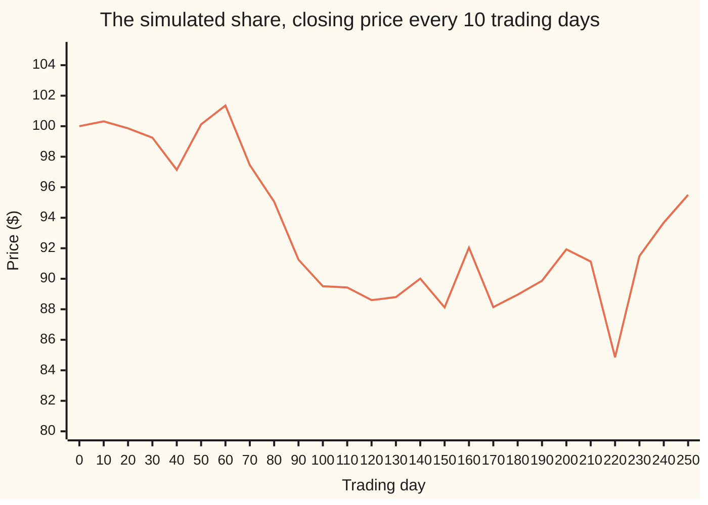
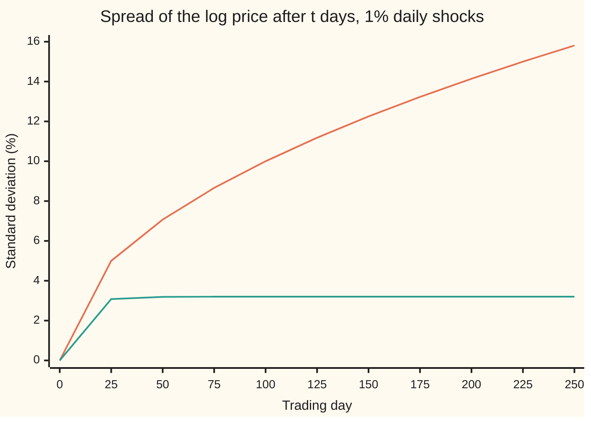
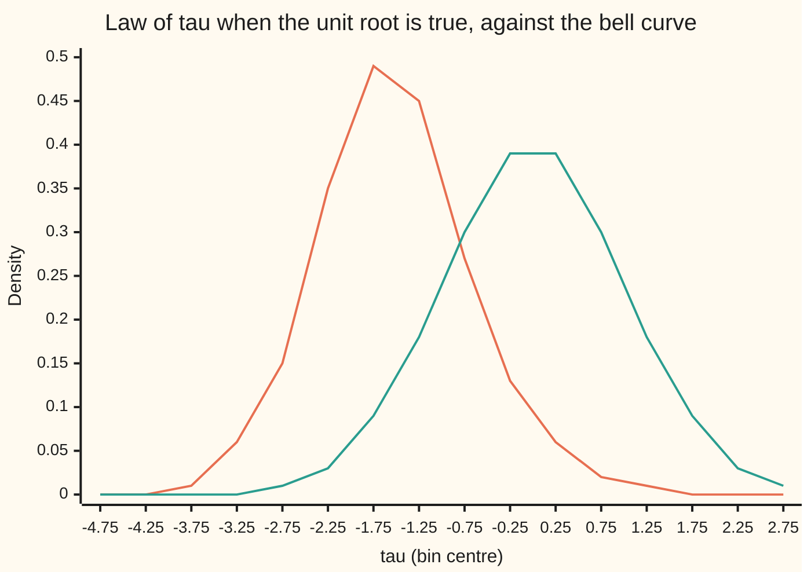

# Unit roots: series that wander, and the differencing that tames them

[Syllabus](../../../SYLLABUS.md) → [Probability and statistics](../../../SYLLABUS.md#w09) → [Time Series](../../../SYLLABUS.md#w09-s12) → Unit roots

---

## General Overview

A share starts the year at $100. Over 250 trading days it climbs to $102.13 in its third month, slides to $84.85 by day 220, and ends the year at $95.50. Nothing pulls it back towards $100 or towards any other level. Each day's close is yesterday's close plus a fresh surprise, and the surprises pile up.

Its daily returns, the percentage change from one close to the next, behave differently. They hover around zero, about 1% either way, day after day. Their average does not drift and their spread does not grow. The share on this card is simulated from a stated seed, so every number can be rechecked; real share prices usually behave the same way under these tests.

A moored boat swings around its buoy; a drifting boat sits wherever the last wave left it. The drifting boat is the price, a series with a **unit root**: every shock stays in it for good. The moored boat is a **stationary** series, the term used from here on: its average and spread do not change with the date, and old shocks fade. Returns are stationary.

Three jobs follow. Tell the two kinds apart from the data alone. Do it with a test that respects how badly a wandering series fools ordinary statistics. And turn the wandering series into a settled one by **differencing**: replacing each value by its change from the day before, which turns prices into returns.

**A series whose shocks never fade has a unit root: its spread grows without limit, ordinary regression cutoffs misjudge it, the augmented Dickey-Fuller test uses its own cutoff to detect it, and one difference removes it.**

**What kind of fact this is:** a method, the augmented Dickey-Fuller test. It rests on two theorems proved on this card in Why it works (a random walk's variance grows in step with time; one difference returns the shocks) and on a limit law that is stated and checked by simulation here; its proof needs Brownian motion (wing 11).

### The picture: one year of the share



One line: the closing price, sampled every tenth trading day. It drops through the spring, stays well below its starting price for most of the rest of the year, and never settles on a fixed level. That is what a unit root looks like, and also what a slow-reverting stationary series can look like over one year, which is why a test is needed.

---

## The formula

Notation first, in words. A subscript names the day: $y_t$ is the value on day $t$, and $y_{t-1}$ is the value the day before. Here $y_t$ is the logarithm of the closing price, so the change from one day to the next is the log return, within a hair of the percentage change for 1% moves. The Greek capital delta, $\Delta$, read "the change in", marks differencing: $\Delta y_t = y_t - y_{t-1}$. A hat marks an estimate, as in [Regression error bars](../09-Regression/02-regression-inference.md).

The autoregression from [Autoregression](02-ar-models.md) says tomorrow is a fraction of today plus a fresh shock:

$$y_t = \rho\, y_{t-1} + \varepsilon_t$$

**Read it aloud:** today's value is yesterday's value times a carry-over factor, plus today's surprise.

The series has a **unit root** when the carry-over factor is exactly 1. Then $y_t = y_{t-1} + \varepsilon_t$: a **random walk**, and nothing ever decays. Subtract $y_{t-1}$ from both sides of the autoregression, write $\gamma = \rho - 1$, allow a constant and $p$ lagged changes, and the question "is the carry-over factor 1?" becomes the question "is the slope on yesterday's level 0?" in the regression

$$\Delta y_t = \alpha + \gamma\, y_{t-1} + \sum_{j=1}^{p} \delta_j\, \Delta y_{t-j} + \varepsilon_t, \qquad \tau = \frac{\hat\gamma}{\operatorname{se}(\hat\gamma)}.$$

**Read it aloud:** regress today's change on a constant, yesterday's level and the last few changes; divide the estimated slope on the level by its standard error; call that ratio tau.

A unit root means $\gamma = 0$. Stationarity means $\gamma < 0$: a level above average is followed, on average, by a fall. The test rejects the unit root only when $\tau$ falls below a cutoff $c$ that is far more negative than the usual one: −2.8732 at the 5% level for 250 observations, against −1.645 for an ordinary one-sided test.

| Symbol | Plain meaning | In our example | Push it up and the answer… |
| --- | --- | --- | --- |
| $y_t$ | the log of the closing price on day $t$ | log of $100 on day 0 | a higher level; says nothing about wandering |
| $t$ | the day number | 0 to 250 | a random walk's spread grows as the square root of $t$ |
| $\varepsilon_t$ | the day's shock: new, independent, average zero | about 1% either way | — |
| $\sigma$ | the typical size of a shock, its standard deviation | 1% a day | every spread scales with it; the test statistic does not |
| $\rho$ | the carry-over factor: how much of yesterday survives today (written phi on ar-models) | 1 for the share | at 1 shocks never fade; below 1 each shock shrinks by the factor $\rho$ every day |
| $\Delta y_t$ | the change in the log price from yesterday: here, the day's return | about ±1% | — |
| $\gamma$ | $\rho - 1$: the pull back towards the average | 0 under the unit root; estimated −0.024741 with no lags, −0.027399 with one | more negative means faster pull-back and an easier rejection |
| $\alpha$ | a constant, the regression's intercept | 0 under the unit root; fitted, far from 0: about −$\hat\gamma$ times the average log level, because the fitted line passes through the averages | — |
| $\delta_j$, $j$, $p$ | the weight on the change $j$ days ago, and how many such lagged changes the regression includes | $p = 1$; weight estimated 0.0423 | more lags: safer against memory, fewer effective observations |
| $\tau$ | the test statistic: the slope on the level over its standard error | −2.1145 for the price, −10.3459 for returns | more negative: stronger evidence against a unit root |
| $T$ | the number of observations in the test regression | 250 (249 once a lag is added) | the cutoff barely moves: −2.8644 at 1,000 |
| $c$ | the 5% cutoff for $\tau$ under a unit root, with a constant | −2.8732 | a lower cutoff makes rejection harder |

The cutoff $c$ comes from MacKinnon's published formula, $c(T) = -2.86154 - 2.8903/T - 4.234/T^2 - 40.040/T^3$, fitted to millions of simulated random walks. The checks below reproduce it by their own simulation.

<details>
<summary>Why "unit root"?</summary>

Write the autoregression as $(1 - \rho B)\,y_t = \varepsilon_t$, where the backshift B moves a series back one day. The polynomial $1 - \rho z$ has its root at $z = 1/\rho$. The series is stationary when that root lies outside the unit circle, which for a real number means $\rho$ between −1 and 1. At $\rho = 1$ the root sits on the circle, at exactly 1: a unit root. For an autoregression with $p$ lags the same rule applies to every root of its polynomial, and one root at exactly 1 is what the Dickey-Fuller regression looks for.

</details>

### When it holds

- **The shocks have constant spread and no memory left after the lags.** If the changes carry more memory than $p$ lags soak up, $\tau$ is misread and the test rejects a true unit root too often. Choose $p$ before looking, or by a stated rule.
- **The right fixed terms.** The version here has a constant and no trend, correct for a share whose log price has no steady drift. A series that climbs a steady slope needs the trend version, with its own, more negative cutoff; the constant-only version applied to a trending stationary series tends to find a unit root that is not there.
- **No breaks.** A one-off jump in level, such as a takeover bid, makes a stationary series look like it wanders. The test cannot tell a single permanent shift from many small permanent shocks.
- **Enough calendar time.** Power depends on how long the series runs, not on how many points it has. Over one year the test catches a factor of 0.95 only 44.59% of the time.

---

## Why it works

### Step 0: a unit root is a sum that never forgets

Solve the random walk backwards: $y_t = y_0 + \varepsilon_1 + \varepsilon_2 + \dots + \varepsilon_t$. Today's log price is the starting value plus every shock ever received, each with full weight. Everything below follows from that sum.

### Step 1: the spread grows without limit

The shocks are independent, so the variance of their sum is the sum of their variances ([Variance](../02-Random%20Variables/03-variance-and-standard-deviation.md)):

$$\operatorname{Var}(y_t - y_0) = t\,\sigma^2.$$

After 250 days of 1% shocks the standard deviation is 1% times the square root of 250: 15.81%. The simulation of 10,000 walks gives a variance of 246.91 squared percent against the exact 250.00, with a standard error of 3.54.

With a carry-over factor below 1 the old shocks shrink by $\rho$ each day, the sum becomes a geometric series, and the variance levels off at $\sigma^2/(1 - \rho^2)$. For $\rho = 0.95$ that is a standard deviation of 3.20%, reached within a few weeks.



Orange, rising: the random walk, standard deviation 1% times the square root of the day. Green, flat: the moored series with carry-over factor 0.95, which settles at 3.20%. Both lines are the exact formulas; the checks print the simulated values beside them, and they agree within sampling error.

### Step 2: one difference returns the shocks

Subtract yesterday from today: $\Delta y_t = y_t - y_{t-1} = \varepsilon_t$. The whole accumulated sum cancels except the newest shock. The differenced series has constant average and constant spread, and no memory: it is stationary. For the share, differencing the log price gives the daily return. A series that needs one difference to become stationary is called **integrated of order one**. That is the "I" in ARIMA, short for autoregressive integrated moving average: an ARMA model, as on [Moving average and ARMA](03-ma-and-arma.md), fitted to the differenced series.

Differencing once too often does harm. The change in the return, $\varepsilon_t - \varepsilon_{t-1}$, shares the shock $\varepsilon_{t-1}$ with its neighbour, with opposite signs. Its lag-one autocorrelation, the correlation between consecutive values, is exactly −0.5. The share's twice-differenced series shows −0.5063, with a standard error of 0.0448.

<details>
<summary>Detailed proof: the two variances and the −0.5</summary>

**Random walk.** $y_t - y_0 = \sum_{s=1}^{t} \varepsilon_s$. For independent terms the covariances vanish, so $\operatorname{Var}(y_t - y_0) = \sum_{s=1}^{t} \operatorname{Var}(\varepsilon_s) = t\sigma^2$.

**Stationary autoregression started at 0.** Substituting repeatedly, $y_t = \sum_{j=0}^{t-1} \rho^j \varepsilon_{t-j}$. The variance is $\sigma^2 \sum_{j=0}^{t-1} \rho^{2j} = \sigma^2 (1 - \rho^{2t})/(1 - \rho^2)$, a finite geometric sum. When $|\rho| < 1$ the term $\rho^{2t}$ goes to 0 and the variance settles at $\sigma^2/(1-\rho^2)$. At $\rho = 1$ the sum has $t$ equal terms and gives $t\sigma^2$ back.

**Over-differencing.** Let $w_t = \varepsilon_t - \varepsilon_{t-1}$. Then $\operatorname{Var}(w_t) = \sigma^2 + \sigma^2 = 2\sigma^2$. Consecutive terms share one shock: $\operatorname{Cov}(w_t, w_{t-1}) = \operatorname{Cov}(\varepsilon_t - \varepsilon_{t-1}, \varepsilon_{t-1} - \varepsilon_{t-2}) = -\operatorname{Var}(\varepsilon_{t-1}) = -\sigma^2$. Terms two or more days apart share nothing. The lag-one autocorrelation is $-\sigma^2 / 2\sigma^2 = -1/2$, whatever the shock size. The same bookkeeping on a stationary autoregression, whose values one and two days apart have covariances $\rho$ and $\rho^2$ times its variance, gives the change a lag-one covariance of $-(1-\rho)^2$ and a variance of $2(1-\rho)$, both times that variance: a lag-one autocorrelation of $-(1-\rho)/2$, still negative, and nearer 0 the longer the memory.

</details>

### Step 3: turn "is the factor 1?" into a slope

Subtracting $y_{t-1}$ from both sides of $y_t = \rho y_{t-1} + \varepsilon_t$ gives $\Delta y_t = (\rho - 1) y_{t-1} + \varepsilon_t$. The carry-over factor becomes the slope $\gamma$ of today's change on yesterday's level. Under a unit root that slope is 0: yesterday's level tells nothing about today's change. Under stationarity it is negative: high levels are followed by falls. The constant $\alpha$ lets the moored series settle around any level, not only zero. Least squares estimates the slope, and $\tau$ divides it by its standard error, the same ratio that [Regression error bars](../09-Regression/02-regression-inference.md) calls a t statistic.

### Step 4: why the usual cutoff is wrong

In ordinary regression that ratio follows, approximately, the standard bell curve, and a one-sided 5% test rejects below −1.645. Here the regressor is the wandering level itself, and two effects break the bell curve.

First, the estimate of the carry-over factor is pulled below 1. The constant in the regression centres the fit on the path's own average, and any path, even a pure random walk, sits above its own average about as often as below it and crosses it. Over a finite stretch the fitted line reads that as pull-back. For the share, $\hat\rho = 0.975259$ although the true factor is exactly 1.

Second, the standard error is computed as if the level were a stable regressor, and it is not: its spread grows with time. Together these shift the whole distribution of $\tau$ to the left. Across 10,000 simulated random walks of 250 days, 4.93% land below MacKinnon's cutoff of −2.8732 (standard error 0.22%): the published cutoff and this card's own simulation agree.



Orange: the Dickey-Fuller law, a histogram of $\tau$ from 10,000 simulated random walks in bins half a unit wide. Green: the standard bell curve that ordinary regression would use. The orange hump sits well to the left, so a cutoff taken from the green curve rejects a true unit root 45.92% of the time (standard error 0.50%) instead of 5%.

Dickey and Fuller derived and tabulated the limit of this law, as the series grows long, in 1979; it is written today as a ratio of integrals of a Brownian path. Its proof needs [Brownian motion](../../11-Stochastic%20processes%20and%20calculus/05-Brownian%20Motion/01-brownian-motion.md) and is not given here; this card states it, simulates it, and checks the simulation against MacKinnon's published cutoffs.

### Step 5: augment the regression when the changes have memory

A share's returns carry almost no memory, but many series do: this month's change in unemployment predicts part of next month's. Memory left in the shocks distorts $\tau$. The augmented test adds $p$ lagged changes to the regression. They absorb the short memory, so the leftover shocks are close to independent, and Said and Dickey showed in 1984 that the same cutoffs then remain valid. For the share, one lag gets weight 0.0423 with a standard error of 0.0632: no detectable memory, as expected for returns, and the test statistic moves only from −1.9206 to −2.1145.

<details>
<summary>The algebra behind the augmented slope</summary>

The slope on the level in a regression with several regressors equals the slope obtained in two stages. First regress today's change on the constant and the lagged changes, and keep the leftovers. Then regress yesterday's level on the same constant and lagged changes, and keep those leftovers. The slope of the first leftovers on the second is $\hat\gamma$, and its standard error follows from the full regression's residuals, which are the same. This is the Frisch-Waugh-Lovell theorem of [Multiple regression](../09-Regression/03-multiple-regression-and-gauss-markov.md). The code uses it as a third, independent road to $\tau$: it never forms or inverts a matrix, and it lands on −2.1145 like the full solve.

</details>

Another door: the Phillips-Perron test corrects $\tau$ for memory afterwards instead of adding lags, and the KPSS test takes stationarity, not the unit root, as the claim under test.

---

## Worked numbers, by hand

The plain Dickey-Fuller regression, with no lags, on the share's log price. Call yesterday's log level x and today's change d. The regression uses 250 pairs, and everything follows from three sums of squared deviations from the averages.

| Step | Arithmetic | Value |
| --- | --- | --- |
| number of changes, n | days 1 to 250 | 250 |
| average level and average change | from the data | 4.533094 and −0.00018399 |
| Sxx, spread of yesterday's level | sum of squared (x − average) | 0.586235 |
| Sxd, level against change | sum of (x − average)(d − average) | −0.01450402 |
| Sdd, spread of the change | sum of squared (d − average) | 0.02448476 |
| slope, $\hat\gamma$ | −0.01450402 / 0.586235 | −0.024741 |
| implied factor, $\hat\rho$ | 1 − 0.024741 | 0.975259 |
| leftover sum of squares | 0.02448476 − 0.024741 × 0.01450402 | 0.02412592 |
| leftover variance, s squared | 0.02412592 / 248 | 0.00009728 |
| standard error of the slope | square root of (0.00009728 / 0.586235) | 0.012882 |
| $\tau$ | −0.024741 / 0.012882 | −1.9206 |
| 5% cutoff for T = 250 | MacKinnon's formula | −2.8732 |
| **verdict** | −1.9206 is above −2.8732 | **unit root not rejected** |

The augmented version with one lag gives −2.1145: the same verdict. The daily returns, run through the same augmented test, give −10.3459, far below the cutoff: the unit root is rejected, and the returns behave as a stationary series.

The price wanders and the returns do not. The test does not prove the price has a unit root; it finds too little evidence to reject one.

### What breaks if you drop a piece

| Mistake | Comes out at | What went wrong |
| --- | --- | --- |
| Compare $\tau$ with the normal cutoff −1.645 | The share "reverts": −2.1145 is below −1.645. A true random walk is rejected 45.92% of the time (standard error 0.50%), not 5% | The law of $\tau$ under a unit root is shifted left; the bell curve is the wrong yardstick |
| Regress one wandering price on another | Two unrelated random walks give a "significant" slope, $\lvert t\rvert$ above 1.96, in 84.70% of 5,000 pairs (standard error 0.51%) | Spurious regression: two sums of shocks both drift, and drifting paths look related |
| Difference the returns again | Lag-one autocorrelation −0.5063; exact value −0.5 | Over-differencing builds a pattern into pure noise |
| Read $\hat\rho$ = 0.975259 as real pull-back | A "half-life" of 27.7 days | The estimate is biased below 1 even when the true factor is exactly 1 |

---

## Code, from first principles, and it actually runs

The code simulates the share from SplitMix64, a small random number generator written out in both languages with seed 7, so Python and Rust draw the same shocks. It reaches the test statistic by three independent roads: the five sums of the hand calculation, a Gauss-Jordan solve of the full regression with any number of lags, and the two-stage partialling-out route for one lag. It reaches the 5% cutoff two ways: MacKinnon's published formula, and 10,000 simulated random walks whose rejection rate at that cutoff must sit within four standard errors of 5%. The spread of a random walk is checked against $t\sigma^2$, the over-differencing autocorrelation against −0.5, and every what-breaks number is reproduced. Six asserts. Breaking the maths five ways, one at a time, made an assert fail each time.

### Python

```python
# Unit roots and differencing -- the check behind the card.  Standard library only.
# Every number quoted on the card is printed here.  Random draws come from SplitMix64
# written out below, so the Rust check draws the same numbers; least squares is solved
# two ways by hand; the normal area is Simpson's rule; nothing imported knows the answer.
from math import log, exp, sqrt, cos, pi
M64 = (1 << 64) - 1
class Rng:                                     # SplitMix64 with a stated seed
    def __init__(s, seed): s.x = seed
    def u64(s):
        s.x = (s.x + 0x9E3779B97F4A7C15) & M64
        z = s.x
        z = ((z ^ (z >> 30)) * 0xBF58476D1CE4E5B9) & M64
        z = ((z ^ (z >> 27)) * 0x94D049BB133111EB) & M64
        return z ^ (z >> 31)
    def unif(s): return ((s.u64() >> 11) + 0.5) / 9007199254740992.0
    def normal(s):                             # Box-Muller, cosine half only
        u1 = s.unif(); u2 = s.unif()
        return sqrt(-2.0 * log(u1)) * cos(2.0 * pi * u2)
def reg1(x, v):     # road 1: least squares of v on a constant and x, from sums
    n = len(x); mx = sum(x) / n; mv = sum(v) / n
    sxx = sum((a - mx) ** 2 for a in x); sxv = sum((a - mx) * (b - mv) for a, b in zip(x, v))
    svv = sum((b - mv) ** 2 for b in v); g = sxv / sxx
    return g, sqrt((svv - g * sxv) / (n - 2) / sxx), (n, mx, mv, sxx, sxv, svv)
def df0(y):         # Dickey-Fuller with no lags: today's change on a constant and yesterday's level
    return reg1(y[:-1], [y[t + 1] - y[t] for t in range(len(y) - 1)])
def ols(X, v):      # road 2: normal equations by Gauss-Jordan; also returns standard errors
    k = len(X[0])
    A = [[sum(r[i] * r[j] for r in X) for j in range(k)] + [sum(r[i] * b for r, b in zip(X, v))]
         + [1.0 if i == j else 0.0 for j in range(k)] for i in range(k)]
    for c in range(k):
        p = c
        for i in range(c + 1, k):
            if abs(A[i][c]) > abs(A[p][c]): p = i
        A[c], A[p] = A[p], A[c]
        piv = A[c][c]; A[c] = [a / piv for a in A[c]]
        for i in range(k):
            if i != c:
                f = A[i][c]; A[i] = [a - f * b for a, b in zip(A[i], A[c])]
    b = [A[i][k] for i in range(k)]
    rss = sum((u - sum(bi * xi for bi, xi in zip(b, r))) ** 2 for r, u in zip(X, v))
    return b, [sqrt(rss / (len(v) - k) * A[i][k + 1 + i]) for i in range(k)]
def adf(y, p):      # augmented Dickey-Fuller: add p lagged changes to the regression
    d = [0.0] + [y[t] - y[t - 1] for t in range(1, len(y))]
    X = [[1.0, y[t - 1]] + [d[t - j] for j in range(1, p + 1)] for t in range(p + 1, len(y))]
    b, se = ols(X, d[p + 1:])
    return b, se, b[1] / se[1]
def adf1_fwl(y):    # road 3 for p = 1: partial the constant and lagged change out of both sides
    d = [0.0] + [y[t] - y[t - 1] for t in range(1, len(y))]; z = d[1:-1]
    def resid(v):
        g, _, (n, mz, mv, *_r) = reg1(z, v)
        return [b - mv - g * (a - mz) for a, b in zip(z, v)]
    ex = resid(y[1:-1]); ed = resid(d[2:])
    sxx = sum(a * a for a in ex); g = sum(a * b for a, b in zip(ex, ed)) / sxx
    rss = sum((b - g * a) ** 2 for a, b in zip(ex, ed))
    return g, g / sqrt(rss / (len(z) - 3) / sxx)
def phi(x): return exp(-0.5 * x * x) / sqrt(2.0 * pi)
def Phi_left(c, n=2000):                       # normal area left of c < 0, by Simpson on [c, 0]
    h = -c / n
    s = phi(c) + phi(0.0) + sum((4 if i % 2 else 2) * phi(c + i * h) for i in range(1, n))
    return 0.5 - s * h / 3.0
def cv5(T): return -2.86154 - 2.8903 / T - 4.234 / T ** 2 - 40.040 / T ** 3   # MacKinnon 2010
def pr(label, v, f=6): print(f"{label:<44} {v:>12.{f}f}")
# ---- the share: $100, 250 trading days, daily log-return shocks of 1% ----
g = Rng(7); N = 250; e = [g.normal() for _ in range(N)]
y = [log(100.0)]; u = [0.0]
for z in e: y.append(y[-1] + 0.01 * z); u.append(0.9 * u[-1] + 0.01 * z)
price = [exp(v) for v in y]; ret = [y[t] - y[t - 1] for t in range(1, N + 1)]
gam, se0, (n, mx, md, sxx, sxd, sdd) = df0(y)
b0, s0, tau0g = adf(y, 0)
b1, s1, tau1 = adf(y, 1); gam_f, tau1f = adf1_fwl(y)
_, _, taur = adf(ret, 1)
dr = [ret[t] - ret[t - 1] for t in range(1, N)]; m = sum(dr) / len(dr)
ac1 = sum((dr[t] - m) * (dr[t - 1] - m) for t in range(1, len(dr))) / sum((a - m) ** 2 for a in dr)
pr("price on day 0 ($)", price[0], 2); pr("price on day 250 ($)", price[N], 2)
pr("  lowest ($)", min(price), 2); pr("  highest ($)", max(price), 2)
pr("DF by hand: n", n, 0); pr("  mean level x-bar", mx); pr("  mean change d-bar", md, 8)
pr("  Sxx", sxx); pr("  Sxd", sxd, 8); pr("  Sdd", sdd, 8)
pr("  gamma-hat = Sxd/Sxx", gam); pr("  rho-hat = 1 + gamma-hat", 1 + gam)
pr("  RSS = Sdd - gamma-hat Sxd", sdd - gam * sxd, 8); pr("  s^2 = RSS/(n-2)", (sdd - gam * sxd) / (n - 2), 8)
pr("  se(gamma-hat) = sqrt(s^2/Sxx)", se0)
pr("  tau = gamma-hat / se  (road 1, sums)", gam / se0, 4); pr("  tau  (road 2, Gauss-Jordan)", tau0g, 4)
pr("ADF p=1 on log price: gamma-hat", b1[1]); pr("  lag coefficient delta-hat", b1[2], 4)
pr("  se(delta-hat)", s1[2], 4); pr("  tau  (road 2, Gauss-Jordan)", tau1, 4); pr("  tau  (road 3, partialling out)", tau1f, 4)
pr("ADF p=1 on daily returns: tau", taur, 4)
pr("5% cutoff, MacKinnon, T = 250", cv5(250), 4)
pr("  normal area left of -1.645 (Simpson)", Phi_left(-1.645))
pr("half-life if rho-hat were real (days)", log(0.5) / log(1 + gam), 1)
pr("over-differenced returns: lag-1 autocorr", ac1, 4); pr("  exact for white-noise returns", -0.5, 4)
pr("  its standard error sqrt(0.5/n)", sqrt(0.5 / len(dr)), 4)
print("figure, price every 10 days: " + ", ".join(f"{price[t]:.2f}" for t in range(0, N + 1, 10)))
# ---- 10,000 simulated random walks of 250 days, and AR(0.95) paths driven by the same shocks ----
R, RHO = 10000, 0.95; g = Rng(2029); cut = cv5(250)
ssw = [0.0] * 11; ssa = [0.0] * 11; bins = [0] * 16; taus = []
rej = naive = power = sp_lvl = sp_ret = 0; pw = pe = None
for k in range(R):
    w = [0.0]; a = [0.0]; e = []
    for t in range(N):
        z = g.normal(); e.append(z); w.append(w[-1] + z); a.append(RHO * a[-1] + z)
    for i in range(11): ssw[i] += w[25 * i] ** 2; ssa[i] += a[25 * i] ** 2
    tau = df0(w); tau = tau[0] / tau[1]; taus.append(tau)
    rej += tau < cut; naive += tau < -1.645
    ta = df0(a); power += ta[0] / ta[1] < cut
    j = int((tau + 5.0) // 0.5)
    if 0 <= j < 16: bins[j] += 1
    if k % 2:
        s = reg1(pw, w); sp_lvl += abs(s[0] / s[1]) > 1.96
        s = reg1(pe, e); sp_ret += abs(s[0] / s[1]) > 1.96
    pw, pe = w, e
taus.sort(); P = R // 2
se = lambda p, n: sqrt(p * (1 - p) / n)
pr("sim: walks rejected at MacKinnon cutoff", rej / R, 4); pr("  standard error", se(0.05, R), 4)
pr("sim: 5% quantile of tau", taus[R // 20 - 1], 4); pr("sim: mean of tau", sum(taus) / R, 4)
pr("sim: walks rejected at normal cutoff", naive / R, 4); pr("  standard error", se(naive / R, R), 4)
pr("sim: AR(0.95) rejected (power)", power / R, 4); pr("  standard error", se(power / R, R), 4)
pr("sim: walk-on-walk |t| > 1.96 (spurious)", sp_lvl / P, 4); pr("  standard error", se(sp_lvl / P, P), 4)
pr("try: returns-on-returns |t| > 1.96", sp_ret / P, 4); pr("  standard error", se(sp_ret / P, P), 4)
v250 = ssw[10] / R
pr("sim: variance of walk at day 250", v250, 2); pr("  exact t sigma^2", 250.0, 2); pr("  standard error", 250 * sqrt(2 / R), 2)
print("figure, walk sd exact: " + ", ".join(f"{sqrt(25 * i):.2f}" for i in range(11)))
print("figure, walk sd sim:   " + ", ".join(f"{sqrt(ssw[i] / R):.2f}" for i in range(11)))
print("figure, AR sd exact:   " + ", ".join(f"{sqrt((1 - RHO ** (50 * i)) / (1 - RHO ** 2)):.2f}" for i in range(11)))
print("figure, AR sd sim:     " + ", ".join(f"{sqrt(ssa[i] / R):.2f}" for i in range(11)))
print("figure, tau density:    " + ", ".join(f"{c / (R * 0.5):.2f}" for c in bins))
print("figure, normal density: " + ", ".join(f"{phi(-4.75 + 0.5 * i):.2f}" for i in range(16)))
_, _, tau9 = adf(u, 1)
pr("try: rho = 0.9 share, ADF p=1 tau", tau9, 4); pr("try: 5% cutoff, MacKinnon, T = 1000", cv5(1000), 4)
# ---- asserts: each compares two independent computations ----
assert abs(gam / se0 - tau0g) < 1e-8, "sums and Gauss-Jordan disagree"
assert abs(tau1 - tau1f) < 1e-8, "Gauss-Jordan and partialling out disagree"
assert abs(rej / R - 0.05) < 4 * se(0.05, R), "simulation does not match MacKinnon's cutoff"
assert abs(v250 - 250.0) < 4 * 250 * sqrt(2 / R), "random-walk variance is not t sigma^2"
assert abs(ac1 + 0.5) < 4 * sqrt(0.5 / len(dr)), "over-differencing did not give -0.5"
assert naive / R > Phi_left(-1.645) + 10 * se(naive / R, R), "normal cutoff was not too lenient"
print("all checks passed")
```

**Ran 2026-09-29 on macOS, Python 3.14.6, standard library only. All checks passed. Output, pasted from the run:**

```
price on day 0 ($)                                 100.00
price on day 250 ($)                                95.50
  lowest ($)                                        84.85
  highest ($)                                      102.13
DF by hand: n                                         250
  mean level x-bar                               4.533094
  mean change d-bar                           -0.00018399
  Sxx                                            0.586235
  Sxd                                         -0.01450402
  Sdd                                          0.02448476
  gamma-hat = Sxd/Sxx                           -0.024741
  rho-hat = 1 + gamma-hat                        0.975259
  RSS = Sdd - gamma-hat Sxd                    0.02412592
  s^2 = RSS/(n-2)                              0.00009728
  se(gamma-hat) = sqrt(s^2/Sxx)                  0.012882
  tau = gamma-hat / se  (road 1, sums)            -1.9206
  tau  (road 2, Gauss-Jordan)                     -1.9206
ADF p=1 on log price: gamma-hat                 -0.027399
  lag coefficient delta-hat                        0.0423
  se(delta-hat)                                    0.0632
  tau  (road 2, Gauss-Jordan)                     -2.1145
  tau  (road 3, partialling out)                  -2.1145
ADF p=1 on daily returns: tau                    -10.3459
5% cutoff, MacKinnon, T = 250                     -2.8732
  normal area left of -1.645 (Simpson)           0.049985
half-life if rho-hat were real (days)                27.7
over-differenced returns: lag-1 autocorr          -0.5063
  exact for white-noise returns                   -0.5000
  its standard error sqrt(0.5/n)                   0.0448
figure, price every 10 days: 100.00, 100.32, 99.86, 99.25, 97.14, 100.12, 101.36, 97.45, 95.05, 91.25, 89.51, 89.43, 88.60, 88.80, 90.01, 88.12, 92.04, 88.14, 88.96, 89.87, 91.93, 91.13, 84.85, 91.49, 93.68, 95.50
sim: walks rejected at MacKinnon cutoff            0.0493
  standard error                                   0.0022
sim: 5% quantile of tau                           -2.8654
sim: mean of tau                                  -1.5318
sim: walks rejected at normal cutoff               0.4592
  standard error                                   0.0050
sim: AR(0.95) rejected (power)                     0.4459
  standard error                                   0.0050
sim: walk-on-walk |t| > 1.96 (spurious)            0.8470
  standard error                                   0.0051
try: returns-on-returns |t| > 1.96                 0.0550
  standard error                                   0.0032
sim: variance of walk at day 250                   246.91
  exact t sigma^2                                  250.00
  standard error                                     3.54
figure, walk sd exact: 0.00, 5.00, 7.07, 8.66, 10.00, 11.18, 12.25, 13.23, 14.14, 15.00, 15.81
figure, walk sd sim:   0.00, 5.03, 7.08, 8.65, 10.03, 11.12, 12.24, 13.11, 14.03, 14.88, 15.71
figure, AR sd exact:   0.00, 3.08, 3.19, 3.20, 3.20, 3.20, 3.20, 3.20, 3.20, 3.20, 3.20
figure, AR sd sim:     0.00, 3.11, 3.17, 3.19, 3.23, 3.22, 3.20, 3.20, 3.23, 3.20, 3.17
figure, tau density:    0.00, 0.00, 0.01, 0.06, 0.15, 0.35, 0.49, 0.45, 0.27, 0.13, 0.06, 0.02, 0.01, 0.00, 0.00, 0.00
figure, normal density: 0.00, 0.00, 0.00, 0.00, 0.01, 0.03, 0.09, 0.18, 0.30, 0.39, 0.39, 0.30, 0.18, 0.09, 0.03, 0.01
try: rho = 0.9 share, ADF p=1 tau                 -4.3710
try: 5% cutoff, MacKinnon, T = 1000               -2.8644
all checks passed
```

### Rust

```rust
// Unit roots and differencing -- the check behind the card.  Rust std only, no crates.
// Same SplitMix64 draws as the Python check; least squares solved by hand; nothing knows the answer.
use std::f64::consts::PI;
struct Rng(u64);
impl Rng {
    fn u64(&mut self) -> u64 {
        self.0 = self.0.wrapping_add(0x9E3779B97F4A7C15);
        let mut z = self.0;
        z = (z ^ (z >> 30)).wrapping_mul(0xBF58476D1CE4E5B9);
        z = (z ^ (z >> 27)).wrapping_mul(0x94D049BB133111EB);
        z ^ (z >> 31)
    }
    fn unif(&mut self) -> f64 { ((self.u64() >> 11) as f64 + 0.5) / 9007199254740992.0 }
    fn normal(&mut self) -> f64 { let (u1, u2) = (self.unif(), self.unif()); (-2.0 * u1.ln()).sqrt() * (2.0 * PI * u2).cos() }
}
// road 1: least squares of v on a constant and x, from sums -> (slope, se, [n, mx, mv, sxx, sxv, svv])
fn reg1(x: &[f64], v: &[f64]) -> (f64, f64, [f64; 6]) {
    let n = x.len() as f64;
    let (mx, mv) = (x.iter().sum::<f64>() / n, v.iter().sum::<f64>() / n);
    let (mut sxx, mut sxv, mut svv) = (0.0, 0.0, 0.0);
    for (a, b) in x.iter().zip(v) { sxx += (a - mx) * (a - mx); sxv += (a - mx) * (b - mv); svv += (b - mv) * (b - mv); }
    let g = sxv / sxx;
    (g, ((svv - g * sxv) / (n - 2.0) / sxx).sqrt(), [n, mx, mv, sxx, sxv, svv])
}
fn diffs(y: &[f64]) -> Vec<f64> { (1..y.len()).map(|t| y[t] - y[t - 1]).collect() }
fn df0(y: &[f64]) -> (f64, f64, [f64; 6]) { reg1(&y[..y.len() - 1], &diffs(y)) }
// road 2: normal equations by Gauss-Jordan, with standard errors from the inverse
fn ols(x: &[Vec<f64>], v: &[f64]) -> (Vec<f64>, Vec<f64>) {
    let k = x[0].len();
    let mut a = vec![vec![0.0; 2 * k + 1]; k];
    for i in 0..k {
        for j in 0..k { a[i][j] = x.iter().map(|r| r[i] * r[j]).sum(); }
        a[i][k] = x.iter().zip(v).map(|(r, b)| r[i] * b).sum();
        a[i][k + 1 + i] = 1.0;
    }
    for c in 0..k {
        let mut p = c;
        for i in c + 1..k { if a[i][c].abs() > a[p][c].abs() { p = i; } }
        a.swap(c, p); let piv = a[c][c];
        for q in 0..2 * k + 1 { a[c][q] /= piv; }
        for i in 0..k {
            if i == c { continue; } let f = a[i][c];
            for q in 0..2 * k + 1 { a[i][q] -= f * a[c][q]; }
        }
    }
    let b: Vec<f64> = (0..k).map(|i| a[i][k]).collect();
    let fit = |r: &Vec<f64>| -> f64 { b.iter().zip(r).map(|(bi, xi)| bi * xi).sum() };
    let s2 = x.iter().zip(v).map(|(r, u)| (u - fit(r)) * (u - fit(r))).sum::<f64>() / (v.len() - k) as f64;
    (b, (0..k).map(|i| (s2 * a[i][k + 1 + i]).sqrt()).collect())
}
fn adf(y: &[f64], p: usize) -> (Vec<f64>, Vec<f64>, f64) {
    let d: Vec<f64> = [vec![0.0], diffs(y)].concat();
    let x: Vec<Vec<f64>> = (p + 1..y.len())
        .map(|t| [vec![1.0, y[t - 1]], (1..=p).map(|j| d[t - j]).collect()].concat()).collect();
    let (b, se) = ols(&x, &d[p + 1..]);
    let tau = b[1] / se[1]; (b, se, tau)
}
// road 3 for p = 1: partial the constant and the lagged change out of both sides
fn adf1_fwl(y: &[f64]) -> (f64, f64) {
    let d: Vec<f64> = [vec![0.0], diffs(y)].concat();
    let z = &d[1..d.len() - 1];
    let resid = |v: &[f64]| -> Vec<f64> {
        let (g, _, s) = reg1(z, v);
        z.iter().zip(v).map(|(a, b)| b - s[2] - g * (a - s[1])).collect()
    };
    let (ex, ed) = (resid(&y[1..y.len() - 1]), resid(&d[2..]));
    let sxx: f64 = ex.iter().map(|a| a * a).sum();
    let g = ex.iter().zip(&ed).map(|(a, b)| a * b).sum::<f64>() / sxx;
    let rss: f64 = ex.iter().zip(&ed).map(|(a, b)| (b - g * a) * (b - g * a)).sum();
    (g, g / (rss / (z.len() as f64 - 3.0) / sxx).sqrt())
}
fn phi(x: f64) -> f64 { (-0.5 * x * x).exp() / (2.0 * PI).sqrt() }
fn phi_left(c: f64) -> f64 {
    let (n, mut s, h) = (2000, phi(c) + phi(0.0), -c / 2000.0);
    for i in 1..n { s += (if i % 2 == 1 { 4.0 } else { 2.0 }) * phi(c + i as f64 * h); }
    0.5 - s * h / 3.0
}
fn cv5(t: f64) -> f64 { -2.86154 - 2.8903 / t - 4.234 / (t * t) - 40.040 / (t * t * t) }
fn pr(label: &str, v: f64, f: usize) { println!("{:<44} {:>12.*}", label, f, v); }
fn line(label: &str, v: &[f64], f: usize) { println!("{}{}", label, v.iter().map(|x| format!("{:.*}", f, x)).collect::<Vec<_>>().join(", ")); }
fn se(p: f64, n: f64) -> f64 { (p * (1.0 - p) / n).sqrt() }
fn main() {
    // ---- the share: $100, 250 trading days, daily log-return shocks of 1% ----
    let (mut g, n) = (Rng(7), 250);
    let e: Vec<f64> = (0..n).map(|_| g.normal()).collect();
    let (mut y, mut u) = (vec![100f64.ln()], vec![0.0]);
    for z in &e { let (a, b) = (y[y.len() - 1], u[u.len() - 1]); y.push(a + 0.01 * z); u.push(0.9 * b + 0.01 * z); }
    let (price, ret): (Vec<f64>, _) = (y.iter().map(|v| v.exp()).collect(), diffs(&y));
    let (gam, se0, st) = df0(&y);
    let (sxx, sxd, sdd) = (st[3], st[4], st[5]);
    let ((_, _, tau0g), (b1, s1, tau1)) = (adf(&y, 0), adf(&y, 1));
    let ((_, tau1f), (_, _, taur)) = (adf1_fwl(&y), adf(&ret, 1));
    let dr = diffs(&ret); let m = dr.iter().sum::<f64>() / dr.len() as f64;
    let num: f64 = (1..dr.len()).map(|t| (dr[t] - m) * (dr[t - 1] - m)).sum();
    let ac1 = num / dr.iter().map(|a| (a - m) * (a - m)).sum::<f64>();
    pr("price on day 0 ($)", price[0], 2); pr("price on day 250 ($)", price[n], 2);
    pr("  lowest ($)", price.iter().cloned().fold(f64::MAX, f64::min), 2);
    pr("  highest ($)", price.iter().cloned().fold(f64::MIN, f64::max), 2);
    pr("DF by hand: n", st[0], 0); pr("  mean level x-bar", st[1], 6); pr("  mean change d-bar", st[2], 8);
    pr("  Sxx", sxx, 6); pr("  Sxd", sxd, 8); pr("  Sdd", sdd, 8);
    pr("  gamma-hat = Sxd/Sxx", gam, 6); pr("  rho-hat = 1 + gamma-hat", 1.0 + gam, 6);
    pr("  RSS = Sdd - gamma-hat Sxd", sdd - gam * sxd, 8); pr("  s^2 = RSS/(n-2)", (sdd - gam * sxd) / (st[0] - 2.0), 8);
    pr("  se(gamma-hat) = sqrt(s^2/Sxx)", se0, 6);
    pr("  tau = gamma-hat / se  (road 1, sums)", gam / se0, 4); pr("  tau  (road 2, Gauss-Jordan)", tau0g, 4);
    pr("ADF p=1 on log price: gamma-hat", b1[1], 6); pr("  lag coefficient delta-hat", b1[2], 4);
    pr("  se(delta-hat)", s1[2], 4); pr("  tau  (road 2, Gauss-Jordan)", tau1, 4); pr("  tau  (road 3, partialling out)", tau1f, 4);
    pr("ADF p=1 on daily returns: tau", taur, 4);
    pr("5% cutoff, MacKinnon, T = 250", cv5(250.0), 4);
    pr("  normal area left of -1.645 (Simpson)", phi_left(-1.645), 6);
    pr("half-life if rho-hat were real (days)", 0.5f64.ln() / (1.0 + gam).ln(), 1);
    pr("over-differenced returns: lag-1 autocorr", ac1, 4); pr("  exact for white-noise returns", -0.5, 4);
    pr("  its standard error sqrt(0.5/n)", (0.5 / dr.len() as f64).sqrt(), 4);
    line("figure, price every 10 days: ", &(0..=n).step_by(10).map(|t| price[t]).collect::<Vec<_>>(), 2);
    // ---- 10,000 simulated random walks of 250 days, and AR(0.95) paths driven by the same shocks ----
    let (r, rho) = (10000usize, 0.95f64);
    let (mut g, cut) = (Rng(2029), cv5(250.0));
    let (mut ssw, mut ssa, mut bins, mut taus) = ([0.0f64; 11], [0.0f64; 11], [0usize; 16], Vec::new());
    let (mut rej, mut naive, mut power, mut sp_lvl, mut sp_ret) = (0, 0, 0, 0, 0);
    let (mut pw, mut pe): (Vec<f64>, Vec<f64>) = (Vec::new(), Vec::new());
    for k in 0..r {
        let (mut w, mut a, mut e) = (vec![0.0], vec![0.0], Vec::with_capacity(n));
        for _ in 0..n {
            let z = g.normal();
            e.push(z); w.push(w[w.len() - 1] + z); a.push(rho * a[a.len() - 1] + z);
        }
        for i in 0..11 { ssw[i] += w[25 * i] * w[25 * i]; ssa[i] += a[25 * i] * a[25 * i]; }
        let (t0, ta) = (df0(&w), df0(&a));
        let tau = t0.0 / t0.1;
        taus.push(tau);
        rej += (tau < cut) as usize; naive += (tau < -1.645) as usize; power += (ta.0 / ta.1 < cut) as usize;
        let j = ((tau + 5.0) / 0.5).floor();
        if j >= 0.0 && j < 16.0 { bins[j as usize] += 1; }
        if k % 2 == 1 {
            let (s, q) = (reg1(&pw, &w), reg1(&pe, &e));
            sp_lvl += ((s.0 / s.1).abs() > 1.96) as usize; sp_ret += ((q.0 / q.1).abs() > 1.96) as usize;
        }
        pw = w; pe = e;
    }
    taus.sort_by(|a, b| a.partial_cmp(b).unwrap());
    let (rf, pf) = (r as f64, (r / 2) as f64);
    pr("sim: walks rejected at MacKinnon cutoff", rej as f64 / rf, 4); pr("  standard error", se(0.05, rf), 4);
    pr("sim: 5% quantile of tau", taus[r / 20 - 1], 4); pr("sim: mean of tau", taus.iter().sum::<f64>() / rf, 4);
    pr("sim: walks rejected at normal cutoff", naive as f64 / rf, 4); pr("  standard error", se(naive as f64 / rf, rf), 4);
    pr("sim: AR(0.95) rejected (power)", power as f64 / rf, 4); pr("  standard error", se(power as f64 / rf, rf), 4);
    pr("sim: walk-on-walk |t| > 1.96 (spurious)", sp_lvl as f64 / pf, 4); pr("  standard error", se(sp_lvl as f64 / pf, pf), 4);
    pr("try: returns-on-returns |t| > 1.96", sp_ret as f64 / pf, 4); pr("  standard error", se(sp_ret as f64 / pf, pf), 4);
    let v250 = ssw[10] / rf;
    pr("sim: variance of walk at day 250", v250, 2); pr("  exact t sigma^2", 250.0, 2); pr("  standard error", 250.0 * (2.0 / rf).sqrt(), 2);
    line("figure, walk sd exact: ", &(0..11).map(|i| (25.0 * i as f64).sqrt()).collect::<Vec<_>>(), 2);
    line("figure, walk sd sim:   ", &(0..11).map(|i| (ssw[i] / rf).sqrt()).collect::<Vec<_>>(), 2);
    line("figure, AR sd exact:   ", &(0..11).map(|i| ((1.0 - rho.powi(50 * i as i32)) / (1.0 - rho * rho)).sqrt()).collect::<Vec<_>>(), 2);
    line("figure, AR sd sim:     ", &(0..11).map(|i| (ssa[i] / rf).sqrt()).collect::<Vec<_>>(), 2);
    line("figure, tau density:    ", &bins.iter().map(|&c| c as f64 / (rf * 0.5)).collect::<Vec<_>>(), 2);
    line("figure, normal density: ", &(0..16).map(|i| phi(-4.75 + 0.5 * i as f64)).collect::<Vec<_>>(), 2);
    let (_, _, tau9) = adf(&u, 1);
    pr("try: rho = 0.9 share, ADF p=1 tau", tau9, 4); pr("try: 5% cutoff, MacKinnon, T = 1000", cv5(1000.0), 4);
    // ---- asserts: each compares two independent computations ----
    assert!((gam / se0 - tau0g).abs() < 1e-8, "sums and Gauss-Jordan disagree");
    assert!((tau1 - tau1f).abs() < 1e-8, "Gauss-Jordan and partialling out disagree");
    assert!((rej as f64 / rf - 0.05).abs() < 4.0 * se(0.05, rf), "simulation does not match MacKinnon's cutoff");
    assert!((v250 - 250.0).abs() < 4.0 * 250.0 * (2.0 / rf).sqrt(), "random-walk variance is not t sigma^2");
    assert!((ac1 + 0.5).abs() < 4.0 * (0.5 / dr.len() as f64).sqrt(), "over-differencing did not give -0.5");
    assert!(naive as f64 / rf > phi_left(-1.645) + 10.0 * se(naive as f64 / rf, rf), "normal cutoff was not too lenient");
    println!("all checks passed");
}
```

**Ran 2026-09-29 on macOS, rustc 1.98.1, no crates. All checks passed. Output, pasted from the run:**

```
price on day 0 ($)                                 100.00
price on day 250 ($)                                95.50
  lowest ($)                                        84.85
  highest ($)                                      102.13
DF by hand: n                                         250
  mean level x-bar                               4.533094
  mean change d-bar                           -0.00018399
  Sxx                                            0.586235
  Sxd                                         -0.01450402
  Sdd                                          0.02448476
  gamma-hat = Sxd/Sxx                           -0.024741
  rho-hat = 1 + gamma-hat                        0.975259
  RSS = Sdd - gamma-hat Sxd                    0.02412592
  s^2 = RSS/(n-2)                              0.00009728
  se(gamma-hat) = sqrt(s^2/Sxx)                  0.012882
  tau = gamma-hat / se  (road 1, sums)            -1.9206
  tau  (road 2, Gauss-Jordan)                     -1.9206
ADF p=1 on log price: gamma-hat                 -0.027399
  lag coefficient delta-hat                        0.0423
  se(delta-hat)                                    0.0632
  tau  (road 2, Gauss-Jordan)                     -2.1145
  tau  (road 3, partialling out)                  -2.1145
ADF p=1 on daily returns: tau                    -10.3459
5% cutoff, MacKinnon, T = 250                     -2.8732
  normal area left of -1.645 (Simpson)           0.049985
half-life if rho-hat were real (days)                27.7
over-differenced returns: lag-1 autocorr          -0.5063
  exact for white-noise returns                   -0.5000
  its standard error sqrt(0.5/n)                   0.0448
figure, price every 10 days: 100.00, 100.32, 99.86, 99.25, 97.14, 100.12, 101.36, 97.45, 95.05, 91.25, 89.51, 89.43, 88.60, 88.80, 90.01, 88.12, 92.04, 88.14, 88.96, 89.87, 91.93, 91.13, 84.85, 91.49, 93.68, 95.50
sim: walks rejected at MacKinnon cutoff            0.0493
  standard error                                   0.0022
sim: 5% quantile of tau                           -2.8654
sim: mean of tau                                  -1.5318
sim: walks rejected at normal cutoff               0.4592
  standard error                                   0.0050
sim: AR(0.95) rejected (power)                     0.4459
  standard error                                   0.0050
sim: walk-on-walk |t| > 1.96 (spurious)            0.8470
  standard error                                   0.0051
try: returns-on-returns |t| > 1.96                 0.0550
  standard error                                   0.0032
sim: variance of walk at day 250                   246.91
  exact t sigma^2                                  250.00
  standard error                                     3.54
figure, walk sd exact: 0.00, 5.00, 7.07, 8.66, 10.00, 11.18, 12.25, 13.23, 14.14, 15.00, 15.81
figure, walk sd sim:   0.00, 5.03, 7.08, 8.65, 10.03, 11.12, 12.24, 13.11, 14.03, 14.88, 15.71
figure, AR sd exact:   0.00, 3.08, 3.19, 3.20, 3.20, 3.20, 3.20, 3.20, 3.20, 3.20, 3.20
figure, AR sd sim:     0.00, 3.11, 3.17, 3.19, 3.23, 3.22, 3.20, 3.20, 3.23, 3.20, 3.17
figure, tau density:    0.00, 0.00, 0.01, 0.06, 0.15, 0.35, 0.49, 0.45, 0.27, 0.13, 0.06, 0.02, 0.01, 0.00, 0.00, 0.00
figure, normal density: 0.00, 0.00, 0.00, 0.00, 0.01, 0.03, 0.09, 0.18, 0.30, 0.39, 0.39, 0.30, 0.18, 0.09, 0.03, 0.01
try: rho = 0.9 share, ADF p=1 tau                 -4.3710
try: 5% cutoff, MacKinnon, T = 1000               -2.8644
all checks passed
```

The two outputs agree line for line.

> [!TIP]
> **Try changing**
> - **Anchor the share.** Guess first: with the same shocks but a carry-over factor of 0.9 instead of 1, does the test notice? The checks already print it, from the path `u`. It does: $\tau$ = −4.3710, well below −2.8732.
> - **Regress returns on returns.** Guess first: does the spurious regression survive differencing? The checks already print it: pairs of independent return series give $\lvert t\rvert$ above 1.96 in 5.50% of cases (standard error 0.32%), the honest 5%.
> - **Four years of data.** Guess first: does the cutoff drift towards −1.645 as the sample grows? Call the cutoff formula with T = 1000: −2.8644. The shift is not a small-sample quirk; it stays in the limit.

---

## The usual mistake

> [!warning]
> **Reading "cannot reject a unit root" as "the series is a random walk".** The test's claim under examination is the unit root, and failing to reject it is a statement about the evidence, not about the series. Against a genuinely stationary series with factor 0.95, one year of daily data rejects only 44.59% of the time (standard error 0.50%). More than half the time the test cannot tell anchored from adrift. As with any p-value, the result is not the chance that the unit root is real.
>
> Smaller traps:
> - **The bell-curve cutoff.** −1.645 rejects a true random walk 45.92% of the time. Use the Dickey-Fuller cutoff: −2.8732 for 250 observations with a constant.
> - **Correlating prices instead of returns.** Two unrelated wandering prices look significantly related in 84.70% of pairs. Correlate returns, or test the gap for a unit root, which is the idea of [Cointegration](07-cointegration-in-outline.md).
> - **Differencing a stationary series.** It manufactures a negative lag-one autocorrelation: −0.5 for a series with no memory, like these returns, and $-(1-\rho)/2$ for an autoregression with carry-over factor $\rho$. It also makes forecasts worse. Test before differencing, and difference only as many times as the test demands.
> - **Trusting the half-life of a wandering series.** A fitted factor of 0.975259 implies a 27.7-day half-life that does not exist.

---

## Where you meet it in real life

- **Prices and returns.** Share prices, exchange rates and commodity prices in logs rarely reject a unit root; their returns reject it overwhelmingly. That is why risk models, from volatility estimates to [GARCH](06-garch-and-volatility-clustering.md), are fitted to returns, not prices.
- **Economic statistics.** Output, employment and price indices are tested for unit roots before modelling. Whether a recession's damage is permanent, a unit root, or temporary, a stationary dip, is a live policy question these tests address.
- **ARIMA forecasting.** The "I" is the number of differences the unit-root test demands. A random walk's best forecast is today's value, and its forecast band widens with the square root of the horizon, the variance growth of Step 1: see [Forecasting](05-forecasting-and-exponential-smoothing.md).
- **Reading a correlogram.** For a unit-root series the correlogram of [Stationarity and autocorrelation](01-stationarity-and-autocorrelation.md) decays slowly, almost in a straight line; the test puts a cutoff on that impression.
- **Pairs trading.** Two wandering prices whose gap does not wander are cointegrated; traders test the gap with a Dickey-Fuller regression and special cutoffs: [Pairs trading](../../12-Financial%20mathematics/50-Signals%2C%20Mean%20Reversion%20and%20Backtesting/02-pairs-trading-and-cointegration.md).

> **Say it back**
> A series has a unit root when its carry-over factor is 1, so every shock stays in it and its variance grows in step with time. Its difference is the shock itself, which is stationary: a price wanders, its returns do not. The augmented Dickey-Fuller test regresses today's change on yesterday's level and a few past changes, and rejects the unit root only when the slope's t ratio falls below about −2.87, not −1.645, because a wandering regressor shifts the law of that ratio to the left. Failing to reject is weak evidence, and differencing a series that did not need it adds a false negative correlation, −0.5 when the series had no memory.

---

## What this builds on

- [Autoregression](02-ar-models.md): the autoregression and its stationarity condition. This card asks what happens at the edge of that condition, where the factor is exactly 1.
- [Regression error bars](../09-Regression/02-regression-inference.md): slopes, standard errors and t ratios. The test statistic here is one of them, read against a different law.
- [Hypothesis tests](../08-Confidence%20Intervals%20and%20Tests/03-hypothesis-tests-and-p-values.md): what a cutoff and a rejection mean, and why failing to reject proves nothing.

## Where this goes next

- [Cointegration](07-cointegration-in-outline.md): two series that each wander, joined by a gap that does not. The unit-root test, applied to that gap, becomes a cointegration test with its own cutoffs.
- [Pairs trading](../../12-Financial%20mathematics/50-Signals%2C%20Mean%20Reversion%20and%20Backtesting/02-pairs-trading-and-cointegration.md): the same idea as a trading strategy, with the costs of being wrong about the gap.

Differencing tames one wandering series by throwing its level away; the open question is whether two wandering series can share a level worth keeping, and cointegration is the answer.

---

## Sources

Verified 2026-09-29: every link below resolves to the publisher's page.

- Dickey, David A., and Wayne A. Fuller. "Distribution of the Estimators for Autoregressive Time Series with a Unit Root." *Journal of the American Statistical Association* 74, no. 366 (1979): 427–431. [doi:10.1080/01621459.1979.10482531](https://doi.org/10.1080/01621459.1979.10482531). The regression, the statistic and the left-shifted law of Step 4.
- Said, Said E., and David A. Dickey. "Testing for Unit Roots in Autoregressive-Moving Average Models of Unknown Order." *Biometrika* 71, no. 3 (1984): 599–607. [doi:10.1093/biomet/71.3.599](https://doi.org/10.1093/biomet/71.3.599). The augmentation of Step 5, and why the cutoffs survive it.
- MacKinnon, James G. "Critical Values for Cointegration Tests." Queen's Economics Department Working Paper No. 1227, 2010. [PDF at Queen's University](https://www.econ.queensu.ca/sites/econ.queensu.ca/files/wpaper/qed_wp_1227.pdf). Table 2, one variable with a constant, 5%: the cutoff formula used on this card.
- Granger, C. W. J., and P. Newbold. "Spurious Regressions in Econometrics." *Journal of Econometrics* 2, no. 2 (1974): 111–120. [doi:10.1016/0304-4076(74)90034-7](https://doi.org/10.1016/0304-4076(74)90034-7). The walk-on-walk regression in What breaks.
- Hamilton, James D. *Time Series Analysis*. Princeton University Press, 1994. [Publisher page](https://press.princeton.edu/books/hardcover/9780691042893/time-series-analysis). Chapters 15 and 17: nonstationary models, the unit-root limit laws and the tests, done carefully.
