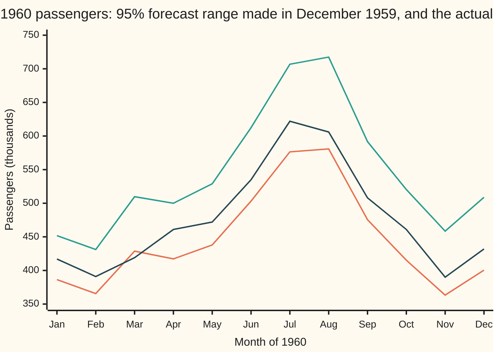
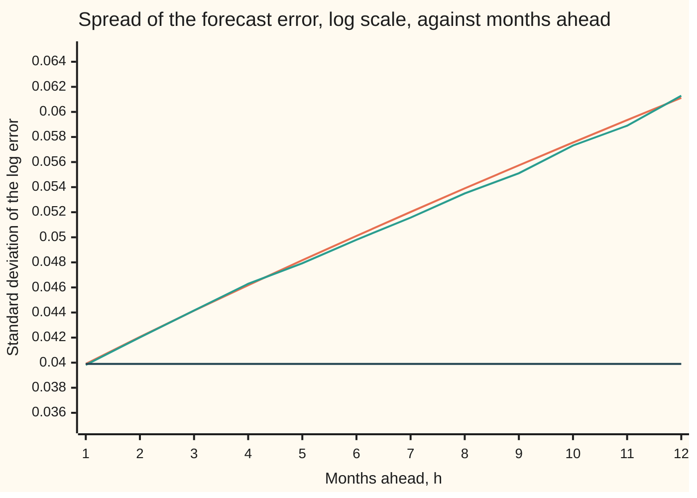

# Forecasting: exponential smoothing, Holt-Winters and honest forecast intervals

Probability and statistics → Time Series → Smoothing forecasts → Forecasting

---

## General Overview

At the end of December 1959 an airline planner holds 132 monthly counts of international airline passengers, in thousands, from January 1949 to December 1959. The counts climb: 112 thousand in January 1949, 405 thousand in December 1959. Every year has the same shape, a summer peak in July or August and a winter low between November and February. The peak grows with the traffic: 148 thousand in July 1949, 548 thousand in July 1959.

The planner needs next year's passengers: a number for each month of 1960, and an honest statement of how far off each number may be. Aircraft, crews and gates are booked on the answer. A number with no range cannot say how many spare aircraft to hold.

Exponential smoothing keeps three running numbers. The **level** is where the traffic stands now, with the season taken out. The **trend** is how much the level rises per month. The **season** is how far each calendar month sits above or below the level. When a new month arrives, each number moves part of the way toward what that month says. The share it moves is fixed, so the pull of an old month fades by the same factor every month: geometrically, or "exponentially", which gives the method its name. Charles Holt added the trend in 1957 and Peter Winters the season in 1960; the three together are called **Holt-Winters**.

The forecast for a month ahead is level, plus trend times months ahead, plus that month's season. The range around it comes from the size of past one-month misses, widened for months further out, because misses pile up. Fitted to 1949 to 1959, the method forecasts 5914.0 thousand passengers for 1960, with a 95% range from 5512.7 to 6358.6 thousand. The year's actual count was 5714 thousand. Month by month, 11 of the 12 actual counts fell inside their ranges.

**Holt-Winters updates a level, a trend and a season by moving each a fixed share toward every new month; its forecast adds them up, and its interval widens with the horizon by an amount the smoothing weights fix exactly.**

**What kind of fact this is:** a method; the interval width is a theorem inside a stated model (independent, normal one-month misses), proved on this card in Why it works, and the model is an assumption checked against 1960.

### The picture: the 1960 ranges and what happened



Orange: the lower edge of each month's 95% range. Green: the upper edge. Dark blue: the actual count. The actual line stays between the edges except in March, when 419 thousand fell below the lower edge of 428.74. In every earlier year March had carried about as many passengers as April, or more; in 1960 it carried far fewer, a break the method had no way to see coming. Easter is one possible cause, on 29 March in 1959 and 17 April in 1960, but March had outrun April in years with April Easters too. The range also widens from January to December: a forecast twelve months out is less sure than one a month out.

---

## The formula

Notation first. The series is written $y_t$: the natural logarithm (ln) of the passenger count in month $t$. Logarithms turn the growing summer peak into a fixed-size bump: July runs about the same percentage above the level every year, and a percentage becomes a fixed amount after taking ln. A subscript names the month, so $\ell_t$ is the level after month $t$ has been seen, $b_t$ the trend and $s_t$ the season. $m$ = 12 is the months in one season, and $\alpha$, $\beta$, $\gamma$ (alpha, beta, gamma) are fixed weights between 0 and 1: the share by which level, trend and season move toward each new month. A hat marks an estimate, as on the estimation shelf: $\hat y_{t+h|t}$ is the forecast of the log count for month $t+h$, made at the end of month $t$.

Each month, three updates, in this order:

$$\ell_t = \alpha\,(y_t - s_{t-m}) + (1-\alpha)\,(\ell_{t-1} + b_{t-1})$$

$$b_t = \beta\,(\ell_t - \ell_{t-1}) + (1-\beta)\,b_{t-1}$$

$$s_t = \gamma\,(y_t - \ell_{t-1} - b_{t-1}) + (1-\gamma)\,s_{t-m}$$

**Read it aloud:** the new level is a blend of what this month says the level is and what the old level plus trend predicted; the new trend is a blend of the latest rise in level and the old trend; the new season for this calendar month is a blend of what this month says and what the same month last year said.

The forecast, for $h$ from 1 to 12 months ahead:

$$\hat y_{t+h|t} = \ell_t + h\,b_t + s_{t+h-m}$$

and the 95% forecast interval, on the log scale:

$$\hat y_{t+h|t} \;\pm\; 1.96\,\sigma\sqrt{v_h}, \qquad v_h = 1 + \sum_{j=1}^{h-1} c_j^2, \qquad c_j = \alpha\,(1 + j\beta)$$

**Read it aloud:** the range is the forecast plus or minus 1.96 typical one-month misses, stretched by a factor that grows with how many unseen months lie between now and the target.

Raising e to both ends turns the log range into passengers. The number 1.96 is the point that leaves 2.5% of a standard normal law in each tail, from [normal-quantile](../04-Continuous%20Distributions/05-normal-quantile.md).

| Symbol | Plain meaning | In our example | Push it up and the answer… |
| --- | --- | --- | --- |
| $y_t$, $t$ | ln of passengers in month $t$; $t$ counts months | January 1960: ln 417 | — |
| $\ell_t$, $\ell_0$ | level: where the log traffic stands, season removed; $\ell_0$ is its starting value | 6.105755 in December 1959 | every forecast rises |
| $b_t$ | trend: rise in level per month | 0.009438 | later months rise more |
| $s_t$ | season: this calendar month's distance above the level | July 0.286970, January −0.080124 | that month's forecast rises |
| $m$ | months in one season | 12 | — |
| $\alpha$, $\beta$, $\gamma$ | smoothing weights for level, trend, season, each from 0 to 1 | 0.33, 0.01, 0.53 | the estimate chases recent months harder |
| $h$ | months ahead | 1 to 12 | the interval widens |
| $\hat y_{t+h\mid t}$ | forecast of the log count for month $t+h$, made at month $t$ | January 1960: 6.035068 | — |
| $e_t$ | one-month miss: $y_t$ minus the forecast made one month earlier | 120 of them, 1950 to 1959 | — |
| $\sigma$ | typical size of a one-month miss (their root mean square) | 0.039897, roughly 4% of the count | every interval widens in proportion |
| $c_j$, $j$ | how much a miss $j$ months before the target moves the target's forecast error | 0.3333 for one month back | the interval widens faster |
| $v_h$ | the widening factor, squared | 1 at $h = 1$, 1.70013 at $h = 7$ | — |
| $\varepsilon_t$, $\theta$ | Step 1 only: in an MA(1) model of the monthly changes, the month's independent surprise, and the share of last month's surprise carried into this month's change | a simple-smoothing $\alpha$ of 0.33 would mean $\theta = -0.67$ | $\alpha = 1 + \theta$ rises: the forecast chases the latest month harder |

The three weights were chosen by least squares on a grid of hundredths: the triple that makes the sum of squared one-month misses over 1950 to 1959 smallest. The starting values come from 1949: level is that year's average log count, trend is the rise from the 1949 average to the 1950 average spread over 12 months, and each season is the 1949 month minus the 1949 average.

A closed form for the widening factor follows by summing squares and powers:

$$v_h = 1 + (h-1)\Big[\alpha^2 + \alpha^2\beta\,h + \tfrac16\,\alpha^2\beta^2\,h\,(2h-1)\Big]$$

### When it holds

- **The future moves like the recent past.** Level, trend and season change slowly. A strike, a crash or a holiday that moves between months breaks this: March 1960 fell outside its range when it fell well short of April, as it had in no earlier year.
- **One-month misses are independent, with a constant spread.** If misses come in runs, the interval is too narrow; the check is the autocorrelation of the misses, from [stationarity-and-autocorrelation](01-stationarity-and-autocorrelation.md).
- **Misses are roughly normal on the log scale.** The 1.96 comes from the normal law. Heavy-tailed misses put more than 5% outside.
- **The season adds on the log scale.** That is, it multiplies the passenger count by a fixed percentage. A season of fixed size in passengers calls for the same equations on the raw counts.
- **The weights and $\sigma$ are treated as known.** They are estimated: $\sigma$ = 0.039897 carries a standard error of about 0.002575. The interval ignores that uncertainty, so it runs a little narrow.

---

## Why it works

### Step 0: a running average that forgets at a fixed rate

A forecast should lean on recent months more than on old ones. The cleanest way to do that is to give the month $j$ steps back a weight that shrinks by the same factor, $1-\alpha$, for every step. Such weights need no memory of the past: one running number carries the whole weighted average, and each new month updates it in one line. Every equation on this card applies that idea to the level, the trend or the season.

### Step 1: one running number is a weighted average of every past month

Take the level alone, with no trend and no season: $\ell_t = \alpha\,y_t + (1-\alpha)\,\ell_{t-1}$. Substitute the same rule for $\ell_{t-1}$, then for $\ell_{t-2}$, and so on back to a starting value $\ell_0$:

$$\ell_t = \alpha\,y_t + \alpha(1-\alpha)\,y_{t-1} + \alpha(1-\alpha)^2\,y_{t-2} + \cdots + (1-\alpha)^t\,\ell_0$$

The weight on the month $j$ steps back is $\alpha(1-\alpha)^j$. With $\alpha$ = 0.33:

```
weight on the month j steps back, alpha = 0.33
  j=0  ████████████████████████████████  0.3300
  j=1  █████████████████████             0.2211
  j=2  ██████████████                    0.1481
  j=3  ██████████                        0.0993
  j=4  ██████                            0.0665
  j=5  ████                              0.0446
```

Each bar is two thirds of the one above. The weights add up to 1 once the starting value's share is counted, so the level is a genuine average. The code runs the one-line update 131 times over the log counts of 1949 to 1959 and also sums the 131 weighted terms directly; both give 6.0305227383.

This is **simple exponential smoothing**, the base of the family. It is also the best forecast for one model from [ma-and-arma](03-ma-and-arma.md). Suppose the monthly changes are MA(1): $y_{t+1} - y_t = \varepsilon_{t+1} + \theta\,\varepsilon_t$, with independent surprises $\varepsilon$ of mean 0. Standing at month $t$, the unseen $\varepsilon_{t+1}$ averages 0, so the best forecast is $\hat y_{t+1} = y_t + \theta\,\varepsilon_t$. The surprise $\varepsilon_t$ is last month's miss, $y_t - \hat y_t$. Substituting, $\hat y_{t+1} = (1+\theta)\,y_t - \theta\,\hat y_t$: simple smoothing with $\alpha = 1 + \theta$. A simple-smoothing $\alpha$ of 0.33 would correspond to $\theta = -0.67$.

### Step 2: the same blend, three times

Each Holt-Winters equation has one shape: new estimate = weight × (what this month says) + (1 − weight) × (what was expected).

- **Level.** This month says the level is $y_t - s_{t-m}$: the log count with last year's season for this month taken out. The old level plus one month of trend expected $\ell_{t-1} + b_{t-1}$.
- **Trend.** This month says the monthly rise is $\ell_t - \ell_{t-1}$. The old trend expected $b_{t-1}$.
- **Season.** This month says the season is $y_t - \ell_{t-1} - b_{t-1}$: the log count minus where the level was expected to be. Last year's value for this month expected $s_{t-m}$.

The fitted weights read directly. $\alpha$ = 0.33: the level moves a third of the way toward each month's news. $\beta$ = 0.01: the trend hardly moves, so eleven years of steady growth dominate. $\gamma$ = 0.53: each calendar month's season is rebuilt about half from its latest value.

### Step 3: every update is old prediction plus a share of the miss

Call the one-month miss $e_t = y_t - (\ell_{t-1} + b_{t-1} + s_{t-m})$: the actual log count minus the forecast made a month earlier. Rearranging the three updates gives

$$\ell_t = \ell_{t-1} + b_{t-1} + \alpha\,e_t, \qquad b_t = b_{t-1} + \alpha\beta\,e_t, \qquad s_t = s_{t-m} + \gamma\,e_t.$$

So each update is a fixed rule plus a correction proportional to the latest surprise. The code runs this form separately and reaches the same December 1959 state to 12 decimals.

<details>
<summary>The algebra behind this, if you want it</summary>

Level: $\alpha(y_t - s_{t-m}) + (1-\alpha)(\ell_{t-1} + b_{t-1}) = \ell_{t-1} + b_{t-1} + \alpha\,(y_t - s_{t-m} - \ell_{t-1} - b_{t-1})$, and the bracket is $e_t$.

Trend: $\beta(\ell_t - \ell_{t-1}) + (1-\beta)b_{t-1} = b_{t-1} + \beta(\ell_t - \ell_{t-1} - b_{t-1})$, and by the level line the bracket is $\alpha e_t$.

Season: $\gamma(y_t - \ell_{t-1} - b_{t-1}) + (1-\gamma)s_{t-m} = s_{t-m} + \gamma\,(y_t - \ell_{t-1} - b_{t-1} - s_{t-m})$, and the bracket is $e_t$.

</details>

### Step 4: how misses pile up, and the width of the interval

Now the model. Assume the future misses are independent draws from a normal law with centre 0 and spread $\sigma$, N(0, $\sigma^2$). This is the **innovations model** of Hyndman, Koehler, Ord and Snyder: the smoothing equations become the law of motion of the series itself.

Stand at December 1959 and target month $h$. The error of the forecast $\hat y_{t+h|t}$ is the target month's own miss plus the effect of every miss in between. A miss $j$ months before the target does three things. It lifts the level by $\alpha$ times itself, which lifts the target by the same amount. It lifts the trend by $\alpha\beta$ times itself, and the trend is then added $j$ more times before the target. It changes the season for its own calendar month, which touches the target only if the two are a whole year apart, never within 12 months. Total effect:

$$c_j = \alpha + j\,\alpha\beta = \alpha\,(1 + j\beta).$$

So the forecast error at horizon $h$ is the target's miss, weight 1, plus $h-1$ earlier misses with weights $c_1, \dots, c_{h-1}$. Independent pieces add their variances (from [variance-and-standard-deviation](../02-Random%20Variables/03-variance-and-standard-deviation.md)), so the variance is $\sigma^2(1 + c_1^2 + \cdots + c_{h-1}^2) = \sigma^2 v_h$. A sum of independent normals is normal, so 95% of the error lies within $1.96\,\sigma\sqrt{v_h}$.

With $\beta$ = 0, no trend and no season, every $c_j$ is $\alpha$. Set $\alpha$ = 1 as well and the level is always the latest value: the forecast is this month's value, the random-walk forecast of [differencing-and-unit-roots](04-differencing-and-unit-roots.md), and $v_h = 1 + (h-1) = h$, so the band grows as the square root of the horizon.

<details>
<summary>Detailed proof: the closed form for the widening factor</summary>

$\sum_{j=1}^{h-1} (\alpha + \alpha\beta j)^2 = (h-1)\alpha^2 + 2\alpha^2\beta \sum_{j=1}^{h-1} j + \alpha^2\beta^2 \sum_{j=1}^{h-1} j^2$.

The two sums are $\tfrac12 (h-1)h$ and $\tfrac16 (h-1)h(2h-1)$. Substituting and taking out the common factor $h-1$ gives $(h-1)\big[\alpha^2 + \alpha^2\beta h + \tfrac16\alpha^2\beta^2 h(2h-1)\big]$, which is the closed form under The formula. For $h$ beyond 12, a miss exactly a year before the target also works through the season, and $c_j$ gains $\gamma$ at $j$ = 12, 24 and so on.

</details>

The code reaches the width three ways: a loop over the $c_j$, the closed form, and 20,000 simulated years. Each simulated year draws twelve normal misses of spread $\sigma$ and runs the smoothing equations forward on them, exactly as the real months would. The spread of the simulated errors matches the formula at every horizon, and the formula's band catches 0.9498 of the simulated Decembers.



Orange: $\sigma\sqrt{v_h}$ from the formula. Green: the standard deviation of 20,000 simulated errors; it lies on the formula line to within its own sampling wobble. Dark blue: the one-month $\sigma$ held flat, the width a forecaster gets by forgetting that misses pile up.

### Step 5: the year's total, where months share their misses

Next year's passengers as one number is the sum of the twelve monthly forecasts, 5914.0 thousand. Its range is not the sum of the monthly ranges. The months share their misses: a bad January lowers the level, and every later month inherits part of it. So the variance of the total includes every pair of months.

Two roads give the range. The simulation adds up each simulated year and reads off the 2.5% and 97.5% points of the 20,000 totals: 5512.7 to 6358.6 thousand. A linearised road treats each month's count as its forecast times (1 + log error), then adds all twelve variances and all the covariances between months: 5488.5 to 6339.6 thousand. The two roads agree closely. The simulated range sits higher because raising e to a normal error stretches the upper tail, which the straight-line road leaves out. The actual 1960 total, 5714 thousand, is inside both.

<details>
<summary>The covariance the linearised road uses</summary>

Take two target months, the earlier one $h$ months ahead. Both contain the misses of months 1 to $h$. Each weights an earlier miss by the $c_j$ for the gap between them, and its own miss by 1. So their covariance is $\sigma^2$ times the sum, over months 1 to $h$, of the product of the two weights. The total's variance is then approximately the sum, over every pair of months, of the two forecast counts times their covariance.

</details>

---

## Worked numbers, by hand

State at the end of December 1959, from the fitted run: level 6.105755, trend 0.009438, January season −0.080124, July season 0.286970. Sums of rounded entries can differ from the printed value in the sixth decimal; the code carries full precision.

| Step | Arithmetic | Value |
| --- | --- | --- |
| January log forecast, $h$ = 1 | 6.105755 + 0.009438 − 0.080124 | 6.035068 |
| January forecast | e^6.035068 | 417.83 thousand |
| half-width, $h$ = 1 | 1.96 × 0.039897 × 1 | 0.078199 |
| January range | e^(6.035068 − 0.078199) to e^(6.035068 + 0.078199) | 386.40 to 451.81 |
| July log forecast, $h$ = 7 | 6.105755 + 7 × 0.009438 + 0.286970 | 6.458790 |
| widening factor $v_h$, $h$ = 7 | 1 + sum over j = 1 to 6 of (0.33 × (1 + 0.01 j))^2 | 1.70013 |
| half-width, $h$ = 7 | 1.96 × 0.039897 × √1.70013 | 0.101962 |
| July forecast | e^6.458790 | **638.29 thousand** |
| July range | e^(6.458790 − 0.101962) to e^(6.458790 + 0.101962) | **576.41 to 706.80** |

The actual counts were 417 thousand in January and 622 thousand in July: both inside. The July range is symmetric on the log scale and lopsided in passengers: its upper edge sits further above 638.29 than its lower edge sits below.

### What breaks if you drop a piece

Same data; the Holt-Winters forecast of the 1960 total is 5914.0 thousand against an actual 5714.

| Mistake | Comes out at | What went wrong |
| --- | --- | --- |
| Forecast each month as the same month last year | 1960 total 5140, short by 574 | No trend: eleven years of growth thrown away. Holt-Winters is over by 200.0 |
| Drop the season, keep $\alpha$ and $\beta$ | July 450.82 against 622 actual | The summer peak is the largest feature of the series; level plus trend alone forecasts a year with no peak |
| Use the one-month width at every horizon | the December band covers 0.7996 of simulated years, not 0.95 | Misses pile up; the width at $h$ = 12 is $\sqrt{v_h}$ times the one-month width |

---

## Code, from first principles, and it actually runs

Both programs hold the 144 monthly counts, take logs, fit $\alpha$, $\beta$ and $\gamma$ by a grid search in tenths and then hundredths, and forecast 1960. The interval width is reached by three independent roads: the loop over the weights $c_j$, the closed form, and 20,000 simulated years from a SplitMix64 generator (a short, fixed recipe for pseudo-random numbers, seed 0x2026092905) with the Box–Muller step turning uniform draws into normal ones. The year's total gets two roads, simulated and linearised. Simple smoothing is checked as a recursion against its explicit weighted sum, and the three updates against their error-correction form from Step 3. The 1960 actuals then test the method. Every number in the tables and charts above is printed.

### Python

```python
# Forecasting with exponential smoothing -- the check behind the card.  Standard library only.
# Monthly airline passengers, thousands, 1949-1960 (Box-Jenkins series G); Holt-Winters on the logs, fitted to 1949-1959.
# Interval width three ways: a loop over the error weights, their closed form, 20,000 simulated years (SplitMix64 below).
from math import log, exp, sqrt, cos, pi

P = [112, 118, 132, 129, 121, 135, 148, 148, 136, 119, 104, 118, 115, 126, 141, 135, 125, 149, 170, 170, 158, 133, 114, 140,
     145, 150, 178, 163, 172, 178, 199, 199, 184, 162, 146, 166, 171, 180, 193, 181, 183, 218, 230, 242, 209, 191, 172, 194,
     196, 196, 236, 235, 229, 243, 264, 272, 237, 211, 180, 201, 204, 188, 235, 227, 234, 264, 302, 293, 259, 229, 203, 229,
     242, 233, 267, 269, 270, 315, 364, 347, 312, 274, 237, 278, 284, 277, 317, 313, 318, 374, 413, 405, 355, 306, 271, 306,
     315, 301, 356, 348, 355, 422, 465, 467, 404, 347, 305, 336, 340, 318, 362, 348, 363, 435, 491, 505, 404, 359, 310, 337,
     360, 342, 406, 396, 420, 472, 548, 559, 463, 407, 362, 405, 417, 391, 419, 461, 472, 535, 622, 606, 508, 461, 390, 432]
M, Z, MON = 12, 1.96, "Jan Feb Mar Apr May Jun Jul Aug Sep Oct Nov Dec".split()  # season length; 95% normal quantile

def run(y, a, b, g, seasons=True):    # Holt-Winters over y; returns final state and the one-step squared errors
    lev = sum(y[:M]) / M
    tr = (sum(y[M:2 * M]) - sum(y[:M])) / (M * M)
    sea = [v - lev if seasons else 0.0 for v in y[:M]]
    sse = 0.0
    for t in range(M, len(y)):
        s = sea[t % M]
        e = y[t] - lev - tr - s
        sse += e * e
        sea[t % M] = g * (y[t] - lev - tr) + (1 - g) * s
        new = a * (y[t] - s) + (1 - a) * (lev + tr)
        tr, lev = b * (new - lev) + (1 - b) * tr, new
    return lev, tr, sea, sse

def fit(y):                           # coarse grid in tenths, then hundredths around the best point
    best = (1e9, 0, 0, 0)
    for i in range(1, 10):
        for j in range(10):
            for k in range(10):
                best = min(best, (run(y, i / 10, j / 10, k / 10)[3], i * 10, j * 10, k * 10))
    _, i0, j0, k0 = best
    for i in range(max(i0 - 9, 1), min(i0 + 10, 100)):
        for j in range(max(j0 - 9, 0), min(j0 + 10, 100)):
            for k in range(max(k0 - 9, 0), min(k0 + 10, 100)):
                best = min(best, (run(y, i / 100, j / 100, k / 100)[3], i, j, k))
    return best[1] / 100, best[2] / 100, best[3] / 100

Y = [log(p) for p in P]
FIT, ACT = Y[:132], P[132:]
a, b, g = fit(FIT)
lev, tr, sea, sse = run(FIT, a, b, g)
n, sig = len(FIT) - M, sqrt(sse / (len(FIT) - M))
print(f"fit     alpha {a:.2f}  beta {b:.2f}  gamma {g:.2f}  one-step errors {n}  sigma {sig:.6f}  se {sig / sqrt(2 * n):.6f}")
print(f"state   Dec 1959: level {lev:.6f}  trend {tr:.6f}  s_Jan {sea[0]:.6f}  s_Jul {sea[6]:.6f}  s_Dec {sea[11]:.6f}")
L2, T2 = sum(FIT[:M]) / M, (sum(FIT[M:2 * M]) - sum(FIT[:M])) / (M * M)
S2 = [v - L2 for v in FIT[:M]]
for t in range(M, 132):               # Step 3's error-correction form: a second road to the same state
    e = FIT[t] - L2 - T2 - S2[t % M]
    L2, T2, S2[t % M] = L2 + T2 + a * e, T2 + a * b * e, S2[t % M] + g * e
print(f"ec      error-correction form, Dec 1959: level {L2:.6f}  trend {T2:.6f}  s_Jul {S2[6]:.6f}")

c = [1.0] + [a * (1 + j * b) for j in range(1, M)]           # weight of a shock j months back
v_loop = [sum(c[j] * c[j] for j in range(h)) for h in range(1, M + 1)]
v_closed = [1 + (h - 1) * (a * a + a * a * b * h + a * a * b * b * h * (2 * h - 1) / 6) for h in range(1, M + 1)]
f = [lev + h * tr + sea[(h - 1) % M] for h in range(1, M + 1)]

state = [0x2026092905]                  # SplitMix64, seed 0x2026092905
def u01():
    state[0] = (state[0] + 0x9E3779B97F4A7C15) & 0xFFFFFFFFFFFFFFFF
    x = state[0]
    x = ((x ^ (x >> 30)) * 0xBF58476D1CE4E5B9) & 0xFFFFFFFFFFFFFFFF
    x = ((x ^ (x >> 27)) * 0x94D049BB133111EB) & 0xFFFFFFFFFFFFFFFF
    return ((x ^ (x >> 31)) >> 11) / 9007199254740992.0 + 1.1102230246251565e-16
def normal(): return sqrt(-2.0 * log(u01())) * cos(2.0 * pi * u01())

N = 20000
err = [[0.0] * N for _ in range(M)]
tot = []
for p in range(N):                    # run the same smoothing equations forward on simulated months
    L, T, S, total = lev, tr, sea[:], 0.0
    for h in range(M):
        s = S[h]
        yv = L + T + s + sig * normal()
        err[h][p] = yv - f[h]
        total += exp(yv)
        S[h] = g * (yv - L - T) + (1 - g) * s
        new = a * (yv - s) + (1 - a) * (L + T)
        T, L = b * (new - L) + (1 - b) * T, new
    tot.append(total)

print(" h month  forecast   lower   upper  actual  in | sd loop  sd closed  sd sim  cover sim  cover flat")
inside, cov12, flat12, sd_sim = 0, 0.0, 0.0, []
for h in range(M):
    w = Z * sig * sqrt(v_loop[h])
    lo, hi = exp(f[h] - w), exp(f[h] + w)
    ok = lo <= ACT[h] <= hi
    inside += ok
    mean = sum(err[h]) / N
    sd_sim.append(sqrt(sum((e - mean) * (e - mean) for e in err[h]) / (N - 1)))
    cover = sum(1 for e in err[h] if abs(e) <= w) / N
    flat = sum(1 for e in err[h] if abs(e) <= Z * sig) / N
    print(f"{h + 1:2d} {MON[h]}  {exp(f[h]):9.2f} {lo:7.2f} {hi:7.2f} {ACT[h]:7d}  {'yes' if ok else 'NO ':3s}|"
          f" {sig * sqrt(v_loop[h]):.5f}  {sig * sqrt(v_closed[h]):.5f}    {sd_sim[h]:.5f}  {cover:.4f}    {flat:.4f}")
    if h == M - 1: cov12, flat12, mean12 = cover, flat, mean

tot.sort()
F = [exp(x) for x in f]
var_tot = sum(F[h] * F[k] * sig * sig * sum(c[h - i] * c[k - i] for i in range(min(h, k) + 1))
              for h in range(M) for k in range(M))
lin_lo, lin_hi = sum(F) - Z * sqrt(var_tot), sum(F) + Z * sqrt(var_tot)
print(f"total   1960 forecast {sum(F):.1f}  simulated 95% band {tot[int(0.025 * N)]:.1f} to {tot[int(0.975 * N)]:.1f}"
      f"  linearised {lin_lo:.1f} to {lin_hi:.1f}  actual {sum(ACT)}")
print(f"hand    Jan log forecast {f[0]:.6f}  half-width {Z * sig:.6f}   Jul log forecast {f[6]:.6f}  v_7 {v_loop[6]:.5f}"
      f"  half-width {Z * sig * sqrt(v_loop[6]):.6f}")
print(f"check   1960 months inside the 95% band: {inside} of 12   h=12 mean simulated log error {mean12:.5f}")

ses_l = FIT[0]                         # simple smoothing, level only: recursion against explicit weights
for t in range(1, 132): ses_l = a * FIT[t] + (1 - a) * ses_l
ses_w = sum(a * (1 - a) ** k * FIT[131 - k] for k in range(131)) + (1 - a) ** 131 * FIT[0]
print(f"ses     recursion {ses_l:.10f}  weighted sum {ses_w:.10f}")
print("weights " + "  ".join(f"j={k} {a * (1 - a) ** k:.4f}" for k in range(6)))

ar, br, gr = fit([float(p) for p in P[:132]])  # what breaks: additive seasons on the raw counts
lr, tr_r, sr, _ = run([float(p) for p in P[:132]], ar, br, gr)
raw = [lr + (h + 1) * tr_r + sr[h] for h in range(M)]
mape = lambda fc: 100 * sum(abs(fc[h] - ACT[h]) / ACT[h] for h in range(M)) / M
print(f"try     log-scale error {mape(F):.2f}%   raw-count fit ({ar:.2f}, {br:.2f}, {gr:.2f}) error {mape(raw):.2f}%"
      f"   July raw {raw[6]:.2f}")
print(f"breaks  same month last year: 1960 total {sum(P[120:132])}  short by {sum(ACT) - sum(P[120:132])}"
      f"   Holt-Winters over by {sum(F) - sum(ACT):.1f}")
k80 = sum(1 for h in range(M) if abs(log(ACT[h]) - f[h]) <= 1.2816 * sig * sqrt(v_loop[h]))
a8, b8, g8 = fit(Y[:120])                     # the same method one year earlier: fit to 1949-1958, forecast 1959
l8, t8, s8, e8 = run(Y[:120], a8, b8, g8)
v8 = lambda h: 1 + sum(a8 * (1 + j * b8) * a8 * (1 + j * b8) for j in range(1, h))
in59 = sum(1 for h in range(M) if abs(Y[120 + h] - l8 - (h + 1) * t8 - s8[h]) <= Z * sqrt(e8 / 108) * sqrt(v8(h + 1)))
print(f"try     80% band holds {k80} of 12   alpha 0.9 sigma {sqrt(run(FIT, 0.9, b, g)[3] / n):.6f}"
      f"   fit to 1958 ({a8:.2f}, {b8:.2f}, {g8:.2f}): 1959 inside {in59} of 12")
l0, t0, _, _ = run(FIT, a, b, 0.0, seasons=False)
print(f"breaks  unwidened band at h=12 covers {flat12:.4f}   July with no season {exp(l0 + 7 * t0):.2f}")

assert all(abs(v_loop[h] - v_closed[h]) < 1e-12 for h in range(M))              # two formulas, one width
assert all(abs(sd_sim[h] / (sig * sqrt(v_loop[h])) - 1) < 4 / sqrt(2 * N) for h in range(M))  # simulation vs formula
assert abs(cov12 - 0.95) < 4 * sqrt(0.95 * 0.05 / N)                             # the band covers 95%
assert abs(mean12) < 4 * sd_sim[-1] / sqrt(N)                                     # simulated paths centre on f
assert max([abs(L2 - lev), abs(T2 - tr)] + [abs(S2[i] - sea[i]) for i in range(M)]) < 1e-12  # two update forms agree
assert abs(ses_l - ses_w) < 1e-9                                                   # recursion = fading weights
print("all checks passed")
```

**Ran 2026-10-06 on macOS, Python 3.14.6, standard library only. All checks passed. Output, pasted from the run:**

```
fit     alpha 0.33  beta 0.01  gamma 0.53  one-step errors 120  sigma 0.039897  se 0.002575
state   Dec 1959: level 6.105755  trend 0.009438  s_Jan -0.080124  s_Jul 0.286970  s_Dec -0.106677
ec      error-correction form, Dec 1959: level 6.105755  trend 0.009438  s_Jul 0.286970
 h month  forecast   lower   upper  actual  in | sd loop  sd closed  sd sim  cover sim  cover flat
 1 Jan     417.83  386.40  451.81     417  yes| 0.03990  0.03990    0.03982  0.9495    0.9495
 2 Feb     397.04  365.63  431.16     391  yes| 0.04205  0.04205    0.04202  0.9489    0.9362
 3 Mar     467.49  428.74  509.75     419  NO | 0.04415  0.04415    0.04416  0.9477    0.9223
 4 Apr     456.72  417.20  499.99     461  yes| 0.04618  0.04618    0.04629  0.9504    0.9085
 5 May     481.25  437.89  528.90     472  yes| 0.04817  0.04817    0.04793  0.9513    0.8953
 6 Jun     555.12  503.19  612.41     535  yes| 0.05011  0.05011    0.04980  0.9518    0.8839
 7 Jul     638.29  576.41  706.80     622  yes| 0.05202  0.05202    0.05157  0.9508    0.8681
 8 Aug     645.50  580.79  717.42     606  yes| 0.05390  0.05390    0.05350  0.9502    0.8579
 9 Sep     530.43  475.54  591.66     508  yes| 0.05574  0.05574    0.05511  0.9532    0.8446
10 Oct     464.84  415.25  520.35     461  yes| 0.05756  0.05756    0.05732  0.9516    0.8267
11 Nov     408.14  363.32  458.49     390  yes| 0.05935  0.05935    0.05890  0.9508    0.8145
12 Dec     451.39  400.43  508.84     432  yes| 0.06112  0.06112    0.06129  0.9498    0.7996
total   1960 forecast 5914.0  simulated 95% band 5512.7 to 6358.6  linearised 5488.5 to 6339.6  actual 5714
hand    Jan log forecast 6.035068  half-width 0.078199   Jul log forecast 6.458790  v_7 1.70013  half-width 0.101962
check   1960 months inside the 95% band: 11 of 12   h=12 mean simulated log error 0.00070
ses     recursion 6.0305227383  weighted sum 6.0305227383
weights j=0 0.3300  j=1 0.2211  j=2 0.1481  j=3 0.0993  j=4 0.0665  j=5 0.0446
try     log-scale error 3.62%   raw-count fit (0.37, 0.03, 0.92) error 2.86%   July raw 608.49
breaks  same month last year: 1960 total 5140  short by 574   Holt-Winters over by 200.0
try     80% band holds 11 of 12   alpha 0.9 sigma 0.046471   fit to 1958 (0.34, 0.01, 0.54): 1959 inside 12 of 12
breaks  unwidened band at h=12 covers 0.7996   July with no season 450.82
all checks passed
```

### Rust

```rust
// Forecasting with exponential smoothing -- the check behind the card.  Rust std only.
// Monthly airline passengers, thousands, 1949-1960 (Box-Jenkins series G); Holt-Winters on the logs, fitted to 1949-1959.
// Interval width three ways: a loop over the error weights, their closed form, 20,000 simulated years (SplitMix64 below).
const P: [u32; 144] = [
    112, 118, 132, 129, 121, 135, 148, 148, 136, 119, 104, 118, 115, 126, 141, 135, 125, 149, 170, 170, 158, 133, 114, 140,
    145, 150, 178, 163, 172, 178, 199, 199, 184, 162, 146, 166, 171, 180, 193, 181, 183, 218, 230, 242, 209, 191, 172, 194,
    196, 196, 236, 235, 229, 243, 264, 272, 237, 211, 180, 201, 204, 188, 235, 227, 234, 264, 302, 293, 259, 229, 203, 229,
    242, 233, 267, 269, 270, 315, 364, 347, 312, 274, 237, 278, 284, 277, 317, 313, 318, 374, 413, 405, 355, 306, 271, 306,
    315, 301, 356, 348, 355, 422, 465, 467, 404, 347, 305, 336, 340, 318, 362, 348, 363, 435, 491, 505, 404, 359, 310, 337,
    360, 342, 406, 396, 420, 472, 548, 559, 463, 407, 362, 405, 417, 391, 419, 461, 472, 535, 622, 606, 508, 461, 390, 432];
const M: usize = 12; // months in one season
const Z: f64 = 1.96; // the 95% normal quantile
const MON: [&str; 12] = ["Jan", "Feb", "Mar", "Apr", "May", "Jun", "Jul", "Aug", "Sep", "Oct", "Nov", "Dec"];

// Holt-Winters over y; returns final level, trend, seasons and the one-step squared errors
fn run(y: &[f64], a: f64, b: f64, g: f64, seasons: bool) -> (f64, f64, Vec<f64>, f64) {
    let mut lev = y[..M].iter().fold(0.0, |s, v| s + v) / M as f64;
    let mut tr = (y[M..2 * M].iter().fold(0.0, |s, v| s + v) - y[..M].iter().fold(0.0, |s, v| s + v)) / (M * M) as f64;
    let mut sea: Vec<f64> = y[..M].iter().map(|v| if seasons { v - lev } else { 0.0 }).collect();
    let mut sse = 0.0;
    for t in M..y.len() {
        let s = sea[t % M];
        let e = y[t] - lev - tr - s;
        sse += e * e;
        sea[t % M] = g * (y[t] - lev - tr) + (1.0 - g) * s;
        let new = a * (y[t] - s) + (1.0 - a) * (lev + tr);
        tr = b * (new - lev) + (1.0 - b) * tr;
        lev = new;
    }
    (lev, tr, sea, sse)
}

// coarse grid in tenths, then hundredths around the best point
fn fit(y: &[f64]) -> (f64, f64, f64) {
    let mut best = (1e9, 0i64, 0i64, 0i64);
    let try_it = |i: i64, j: i64, k: i64, d: f64, w: i64, best: &mut (f64, i64, i64, i64)| {
        let e = run(y, i as f64 / d, j as f64 / d, k as f64 / d, true).3;
        if e < best.0 { *best = (e, i * w, j * w, k * w); }
    };
    for i in 1..10 { for j in 0..10 { for k in 0..10 { try_it(i, j, k, 10.0, 10, &mut best); } } }
    let (_, i0, j0, k0) = best;
    for i in (i0 - 9).max(1)..(i0 + 10).min(100) {
        for j in (j0 - 9).max(0)..(j0 + 10).min(100) {
            for k in (k0 - 9).max(0)..(k0 + 10).min(100) { try_it(i, j, k, 100.0, 1, &mut best); }
        }
    }
    (best.1 as f64 / 100.0, best.2 as f64 / 100.0, best.3 as f64 / 100.0)
}

struct Rng(u64); // SplitMix64, seed 0x2026092905
impl Rng {
    fn u01(&mut self) -> f64 {
        self.0 = self.0.wrapping_add(0x9E3779B97F4A7C15);
        let mut x = self.0;
        x = (x ^ (x >> 30)).wrapping_mul(0xBF58476D1CE4E5B9);
        x = (x ^ (x >> 27)).wrapping_mul(0x94D049BB133111EB);
        ((x ^ (x >> 31)) >> 11) as f64 / 9007199254740992.0 + 1.1102230246251565e-16
    }
    fn normal(&mut self) -> f64 {
        let r = (-2.0 * self.u01().ln()).sqrt();
        r * (2.0 * std::f64::consts::PI * self.u01()).cos()
    }
}

fn main() {
    let yall: Vec<f64> = P.iter().map(|&p| (p as f64).ln()).collect();
    let (fitd, act) = (&yall[..132], &P[132..]);
    let (a, b, g) = fit(fitd);
    let (lev, tr, sea, sse) = run(fitd, a, b, g, true);
    let n = fitd.len() - M;
    let sig = (sse / n as f64).sqrt();
    println!("fit     alpha {:.2}  beta {:.2}  gamma {:.2}  one-step errors {}  sigma {:.6}  se {:.6}", a, b, g, n, sig, sig / ((2 * n) as f64).sqrt());
    println!("state   Dec 1959: level {:.6}  trend {:.6}  s_Jan {:.6}  s_Jul {:.6}  s_Dec {:.6}", lev, tr, sea[0], sea[6], sea[11]);
    let mut l2 = fitd[..M].iter().fold(0.0, |s, v| s + v) / M as f64;
    let mut t2 = (fitd[M..2 * M].iter().fold(0.0, |s, v| s + v) - fitd[..M].iter().fold(0.0, |s, v| s + v)) / (M * M) as f64;
    let mut s2: Vec<f64> = fitd[..M].iter().map(|v| v - l2).collect();
    for t in M..132 { let e = fitd[t] - l2 - t2 - s2[t % M]; l2 = l2 + t2 + a * e; t2 += a * b * e; s2[t % M] += g * e; } // Step 3's form
    println!("ec      error-correction form, Dec 1959: level {:.6}  trend {:.6}  s_Jul {:.6}", l2, t2, s2[6]);

    let c: Vec<f64> = (0..M).map(|j| if j == 0 { 1.0 } else { a * (1.0 + j as f64 * b) }).collect(); // weight of a shock j months back
    let v_loop: Vec<f64> = (1..=M).map(|h| (0..h).fold(0.0, |s, j| s + c[j] * c[j])).collect();
    let v_closed: Vec<f64> = (1..=M).map(|h| { let hf = h as f64;
        1.0 + (hf - 1.0) * (a * a + a * a * b * hf + a * a * b * b * hf * (2.0 * hf - 1.0) / 6.0) }).collect();
    let f: Vec<f64> = (1..=M).map(|h| lev + h as f64 * tr + sea[(h - 1) % M]).collect();

    let mut rng = Rng(0x2026092905);
    let nn = 20000usize;
    let mut err = vec![vec![0.0f64; nn]; M];
    let mut tot: Vec<f64> = Vec::with_capacity(nn);
    for p in 0..nn { // run the same smoothing equations forward on simulated months
        let (mut l, mut t, mut s_, mut total) = (lev, tr, sea.clone(), 0.0);
        for h in 0..M {
            let s = s_[h];
            let yv = l + t + s + sig * rng.normal();
            err[h][p] = yv - f[h];
            total += yv.exp();
            s_[h] = g * (yv - l - t) + (1.0 - g) * s;
            let new = a * (yv - s) + (1.0 - a) * (l + t);
            t = b * (new - l) + (1.0 - b) * t;
            l = new;
        }
        tot.push(total);
    }

    println!(" h month  forecast   lower   upper  actual  in | sd loop  sd closed  sd sim  cover sim  cover flat");
    let (mut inside, mut cov12, mut flat12, mut mean12) = (0, 0.0, 0.0, 0.0);
    let mut sd_sim = Vec::new();
    for h in 0..M {
        let w = Z * sig * v_loop[h].sqrt();
        let (lo, hi) = ((f[h] - w).exp(), (f[h] + w).exp());
        let ok = lo <= act[h] as f64 && act[h] as f64 <= hi;
        if ok { inside += 1; }
        let mean = err[h].iter().fold(0.0, |s, e| s + e) / nn as f64;
        sd_sim.push((err[h].iter().fold(0.0, |s, e| s + (e - mean) * (e - mean)) / (nn - 1) as f64).sqrt());
        let cover = err[h].iter().filter(|e| e.abs() <= w).count() as f64 / nn as f64;
        let flat = err[h].iter().filter(|e| e.abs() <= Z * sig).count() as f64 / nn as f64;
        println!("{:2} {}  {:9.2} {:7.2} {:7.2} {:7}  {}| {:.5}  {:.5}    {:.5}  {:.4}    {:.4}", h + 1, MON[h], f[h].exp(), lo, hi, act[h],
            if ok { "yes" } else { "NO " }, sig * v_loop[h].sqrt(), sig * v_closed[h].sqrt(), sd_sim[h], cover, flat);
        if h == M - 1 { cov12 = cover; flat12 = flat; mean12 = mean; }
    }

    tot.sort_by(|x, y| x.partial_cmp(y).unwrap());
    let ff: Vec<f64> = f.iter().map(|x| x.exp()).collect();
    let sum_f = ff.iter().fold(0.0, |s, v| s + v);
    let mut var_tot = 0.0;
    for h in 0..M { for k in 0..M {
        let inner = (0..=h.min(k)).fold(0.0, |s, i| s + c[h - i] * c[k - i]);
        var_tot += ff[h] * ff[k] * sig * sig * inner;
    } }
    let act_sum: u32 = act.iter().sum();
    println!("total   1960 forecast {:.1}  simulated 95% band {:.1} to {:.1}  linearised {:.1} to {:.1}  actual {}", sum_f,
        tot[(0.025 * nn as f64) as usize], tot[(0.975 * nn as f64) as usize], sum_f - Z * var_tot.sqrt(), sum_f + Z * var_tot.sqrt(), act_sum);
    println!("hand    Jan log forecast {:.6}  half-width {:.6}   Jul log forecast {:.6}  v_7 {:.5}  half-width {:.6}",
        f[0], Z * sig, f[6], v_loop[6], Z * sig * v_loop[6].sqrt());
    println!("check   1960 months inside the 95% band: {} of 12   h=12 mean simulated log error {:.5}", inside, mean12);

    let mut ses_l = fitd[0]; // simple smoothing, level only: recursion against explicit weights
    for t in 1..132 { ses_l = a * fitd[t] + (1.0 - a) * ses_l; }
    let ses_w = (0..131).fold(0.0, |s, k| s + a * (1.0 - a).powf(k as f64) * fitd[131 - k]) + (1.0 - a).powf(131.0) * fitd[0];
    println!("ses     recursion {:.10}  weighted sum {:.10}", ses_l, ses_w);
    let wts: Vec<String> = (0..6).map(|k| format!("j={} {:.4}", k, a * (1.0 - a).powf(k as f64))).collect();
    println!("weights {}", wts.join("  "));

    let rawy: Vec<f64> = P[..132].iter().map(|&p| p as f64).collect(); // additive seasons on the raw counts
    let (ar, br, gr) = fit(&rawy);
    let (lr, trr, sr, _) = run(&rawy, ar, br, gr, true);
    let raw: Vec<f64> = (0..M).map(|h| lr + (h + 1) as f64 * trr + sr[h]).collect();
    let mape = |fc: &[f64]| 100.0 * (0..M).fold(0.0, |s, h| s + (fc[h] - act[h] as f64).abs() / act[h] as f64) / M as f64;
    println!("try     log-scale error {:.2}%   raw-count fit ({:.2}, {:.2}, {:.2}) error {:.2}%   July raw {:.2}", mape(&ff), ar, br, gr, mape(&raw), raw[6]);
    let naive: u32 = P[120..132].iter().sum();
    println!("breaks  same month last year: 1960 total {}  short by {}   Holt-Winters over by {:.1}", naive, act_sum - naive, sum_f - act_sum as f64);
    let k80 = (0..M).filter(|&h| ((act[h] as f64).ln() - f[h]).abs() <= 1.2816 * sig * v_loop[h].sqrt()).count();
    let (a8, b8, g8) = fit(&yall[..120]); // the same method one year earlier: fit to 1949-1958, forecast 1959
    let (l8, t8, s8, e8) = run(&yall[..120], a8, b8, g8, true);
    let v8 = |h: usize| 1.0 + (1..h).fold(0.0, |s, j| s + a8 * (1.0 + j as f64 * b8) * a8 * (1.0 + j as f64 * b8));
    let in59 = (0..M).filter(|&h| (yall[120 + h] - l8 - (h + 1) as f64 * t8 - s8[h]).abs() <= Z * (e8 / 108.0).sqrt() * v8(h + 1).sqrt()).count();
    println!("try     80% band holds {} of 12   alpha 0.9 sigma {:.6}   fit to 1958 ({:.2}, {:.2}, {:.2}): 1959 inside {} of 12",
        k80, (run(fitd, 0.9, b, g, true).3 / n as f64).sqrt(), a8, b8, g8, in59);
    let (l0, t0, _, _) = run(fitd, a, b, 0.0, false);
    println!("breaks  unwidened band at h=12 covers {:.4}   July with no season {:.2}", flat12, (l0 + 7.0 * t0).exp());

    assert!((0..M).all(|h| (v_loop[h] - v_closed[h]).abs() < 1e-12)); // two formulas, one width
    assert!((0..M).all(|h| (sd_sim[h] / (sig * v_loop[h].sqrt()) - 1.0).abs() < 4.0 / ((2 * nn) as f64).sqrt())); // simulation vs formula
    assert!((cov12 - 0.95).abs() < 4.0 * (0.95 * 0.05 / nn as f64).sqrt()); // the band covers 95%
    assert!(mean12.abs() < 4.0 * sd_sim[M - 1] / (nn as f64).sqrt()); // simulated paths centre on f
    assert!((0..M).fold((l2 - lev).abs().max((t2 - tr).abs()), |m, i| m.max((s2[i] - sea[i]).abs())) < 1e-12); // two update forms agree
    assert!((ses_l - ses_w).abs() < 1e-9); // recursion = fading weights
    println!("all checks passed");
}
```

**Ran 2026-10-06 on macOS, rustc 1.98.1, no crates. All checks passed. Output, pasted from the run:**

```
fit     alpha 0.33  beta 0.01  gamma 0.53  one-step errors 120  sigma 0.039897  se 0.002575
state   Dec 1959: level 6.105755  trend 0.009438  s_Jan -0.080124  s_Jul 0.286970  s_Dec -0.106677
ec      error-correction form, Dec 1959: level 6.105755  trend 0.009438  s_Jul 0.286970
 h month  forecast   lower   upper  actual  in | sd loop  sd closed  sd sim  cover sim  cover flat
 1 Jan     417.83  386.40  451.81     417  yes| 0.03990  0.03990    0.03982  0.9495    0.9495
 2 Feb     397.04  365.63  431.16     391  yes| 0.04205  0.04205    0.04202  0.9489    0.9362
 3 Mar     467.49  428.74  509.75     419  NO | 0.04415  0.04415    0.04416  0.9477    0.9223
 4 Apr     456.72  417.20  499.99     461  yes| 0.04618  0.04618    0.04629  0.9504    0.9085
 5 May     481.25  437.89  528.90     472  yes| 0.04817  0.04817    0.04793  0.9513    0.8953
 6 Jun     555.12  503.19  612.41     535  yes| 0.05011  0.05011    0.04980  0.9518    0.8839
 7 Jul     638.29  576.41  706.80     622  yes| 0.05202  0.05202    0.05157  0.9508    0.8681
 8 Aug     645.50  580.79  717.42     606  yes| 0.05390  0.05390    0.05350  0.9502    0.8579
 9 Sep     530.43  475.54  591.66     508  yes| 0.05574  0.05574    0.05511  0.9532    0.8446
10 Oct     464.84  415.25  520.35     461  yes| 0.05756  0.05756    0.05732  0.9516    0.8267
11 Nov     408.14  363.32  458.49     390  yes| 0.05935  0.05935    0.05890  0.9508    0.8145
12 Dec     451.39  400.43  508.84     432  yes| 0.06112  0.06112    0.06129  0.9498    0.7996
total   1960 forecast 5914.0  simulated 95% band 5512.7 to 6358.6  linearised 5488.5 to 6339.6  actual 5714
hand    Jan log forecast 6.035068  half-width 0.078199   Jul log forecast 6.458790  v_7 1.70013  half-width 0.101962
check   1960 months inside the 95% band: 11 of 12   h=12 mean simulated log error 0.00070
ses     recursion 6.0305227383  weighted sum 6.0305227383
weights j=0 0.3300  j=1 0.2211  j=2 0.1481  j=3 0.0993  j=4 0.0665  j=5 0.0446
try     log-scale error 3.62%   raw-count fit (0.37, 0.03, 0.92) error 2.86%   July raw 608.49
breaks  same month last year: 1960 total 5140  short by 574   Holt-Winters over by 200.0
try     80% band holds 11 of 12   alpha 0.9 sigma 0.046471   fit to 1958 (0.34, 0.01, 0.54): 1959 inside 12 of 12
breaks  unwidened band at h=12 covers 0.7996   July with no season 450.82
all checks passed
```

The two outputs agree line for line, including every simulated number: both programs draw the same SplitMix64 stream.

> [!TIP]
> **Try changing**
> Guess first, then check the printed line.
> - **Ask for an 80% range instead of 95%.** Replace 1.96 by 1.2816. An 80% range should miss about one month in five. In 1960 it holds 11 of 12 and misses only March.
> - **Force $\alpha$ = 0.9.** The level now chases every month. The one-month miss grows from 0.039897 to 0.046471. The fit chose 0.33 to make this number smallest on these months, so any other $\alpha$ loses here; 0.9 loses by 16%, because it chases noise.
> - **Run the same method one year earlier.** Fit to 1949 to 1958 and forecast 1959. The weights come out 0.34, 0.01, 0.54, close to the 1960 fit, and all 12 months of 1959 land inside their ranges.
> - **Smooth the raw counts instead of their logs.** The fit moves to 0.37, 0.03, 0.92: the season weight jumps, because a fixed-size season has to be rebuilt every year to keep up with a growing peak. Its 1960 average miss is 2.86%, below the log version's 3.62%. One year of twelve months cannot rank two methods; the log version earns its place in the intervals, whose width in percent stays steady as the traffic grows.

---

## The usual mistake

> [!warning]
> **Reading the 95% as unconditional.** Inside the model, with independent normal misses of spread $\sigma$ and the weights and $\sigma$ taken as known, the range is a 95% chance for the outcome: given the months seen so far, the target month lands inside with probability 0.95. The simulation confirms that inside the model (0.9498 at twelve months). Outside it, nothing guarantees it: the weights and $\sigma$ are estimates, and the next Easter, strike or recession is not in the model. Twelve months of 1960, with 11 inside, is a check, not a proof.
>
> - **Using the one-month width for a year ahead.** The December range would catch 0.7996 of simulated outcomes instead of 0.95.
> - **Adding the monthly ranges to get the year's range.** Months share their misses through the level; the year's range comes from the joint spread, 5512.7 to 6358.6 thousand by simulation.
> - **Reading e raised to the log forecast as the average.** It is the middle value, the median. The average passenger count sits slightly higher, because raising e to a normal error stretches the upper tail.
> - **Judging the weights on the months they were fitted to.** $\sigma$ = 0.039897 is measured on the same months that chose $\alpha$, $\beta$ and $\gamma$, so it flatters the method. Honest checks forecast months the fit never saw, as 1960 is here.

---

## Where you meet it in real life

- **Stock and demand planning.** Holt's first work on the method was for inventory control, and weekly or monthly sales forecasts in retail and manufacturing still run on smoothing of this kind, often thousands of products at once.
- **Airline and hotel capacity.** Seasonal passenger and booking series are the textbook case; this card's data are the Box–Jenkins series of international airline passengers.
- **Call centres and staffing.** Calls per half-hour carry a daily and a weekly season; smoothing with two seasons sets rotas.
- **Volatility in finance.** An exponentially weighted average of squared daily returns is simple smoothing applied to risk; its links to the GARCH model are on [garch-and-volatility-clustering](06-garch-and-volatility-clustering.md), and its use by risk desks on [volatility-forecasting-ewma-garch-and-realised](../../12-Financial%20mathematics/40-Hedging%2C%20Volatility%20Forecasts%20and%20Stress/04-volatility-forecasting-ewma-garch-and-realised.md).

> **Say it back**
> Exponential smoothing keeps a running estimate that moves a fixed share toward each new observation, which makes it a weighted average whose weights fade geometrically. Holt-Winters keeps three such estimates, level, trend and season, and forecasts by adding them. Each update is the old prediction plus a share of the latest miss, so a miss j months before a target moves it by α(1 + jβ), and the forecast variance is the one-month variance times one plus the sum of those squares. On airline passengers it forecast 5914.0 thousand for 1960 with a range of 5512.7 to 6358.6; the actual was 5714, and 11 of 12 months fell inside their ranges. The 95% holds inside the model, with its settings taken as known; outside it, the range is no promise about one year.

---

## What this builds on

- [ma-and-arma](03-ma-and-arma.md): the MA(1) model, whose best forecast is simple smoothing (Step 1), and the idea that a forecast error is a weighted sum of past surprises (Step 4).

## Where this goes next

- [garch-and-volatility-clustering](06-garch-and-volatility-clustering.md): when the size of the misses itself changes over time, as in a share's daily returns with calm and wild weeks in clusters, a constant $\sigma$ fails, and the spread gets a forecast of its own.
- [cointegration-in-outline](07-cointegration-in-outline.md): two trending series that share a trend, and forecasts that use the tie between them.

Holt-Winters gives every month the same spread of misses and treats each series alone; whether that spread can itself be forecast, and whether a tie between two series can be put to use, are the questions those two cards answer.

---

## Sources

Verified 2026-09-29: every link below resolves to the publisher's page.

- Holt, Charles C. "Forecasting seasonals and trends by exponentially weighted moving averages." *International Journal of Forecasting* 20, no. 1 (2004): 5–10. [doi:10.1016/j.ijforecast.2003.09.015](https://doi.org/10.1016/j.ijforecast.2003.09.015). The 1957 Office of Naval Research memorandum, reprinted: level and trend smoothing, with a seasonal extension.
- Winters, Peter R. "Forecasting Sales by Exponentially Weighted Moving Averages." *Management Science* 6, no. 3 (1960): 324–342. [doi:10.1287/mnsc.6.3.324](https://doi.org/10.1287/mnsc.6.3.324). The seasonal method that completes Holt-Winters.
- Hyndman, Rob J., Anne B. Koehler, J. Keith Ord, and Ralph D. Snyder. *Forecasting with Exponential Smoothing: The State Space Approach*. Springer, 2008. [doi:10.1007/978-3-540-71918-2](https://doi.org/10.1007/978-3-540-71918-2). The innovations model and the forecast variance formulas, including the weights $c_j$.
- Hyndman, Rob J., and George Athanasopoulos. *Forecasting: Principles and Practice*, 3rd ed. OTexts. [Section 8.3, methods with seasonality](https://otexts.com/fpp3/holt-winters.html) and [section 8.7, forecasting with ETS models](https://otexts.com/fpp3/ets-forecasting.html). The update equations in this card's form and the variance table for additive models.
- Box, George E. P., Gwilym M. Jenkins, Gregory C. Reinsel, and Greta M. Ljung. *Time Series Analysis: Forecasting and Control*, 5th ed. Wiley, 2015. [Publisher page](https://www.wiley.com/en-us/Time+Series+Analysis%3A+Forecasting+and+Control%2C+5th+Edition-p-9781118675021). The airline passenger series used throughout, and the moving-average view of smoothing.
