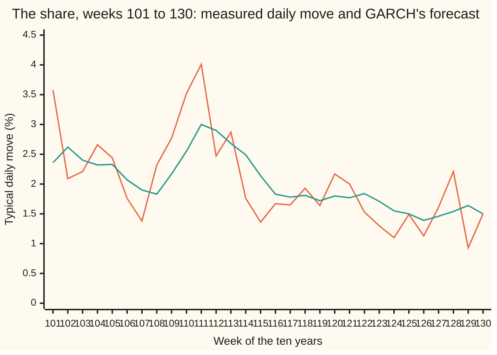
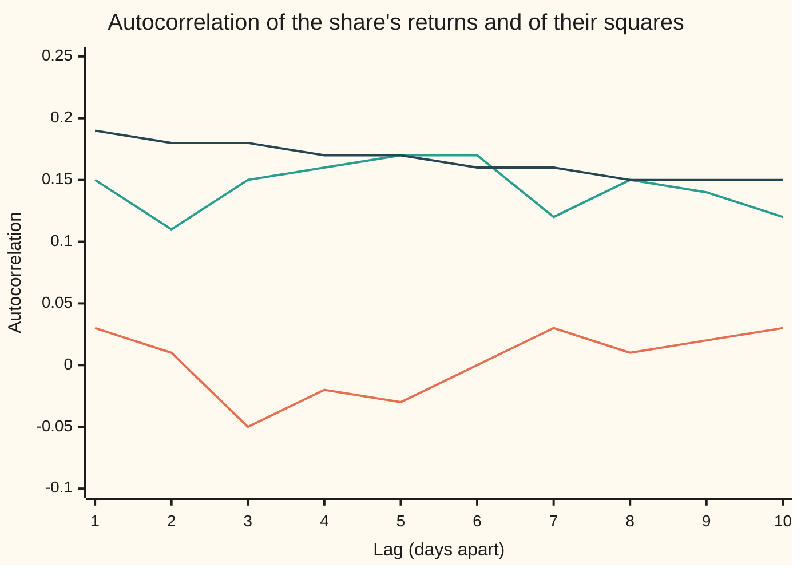
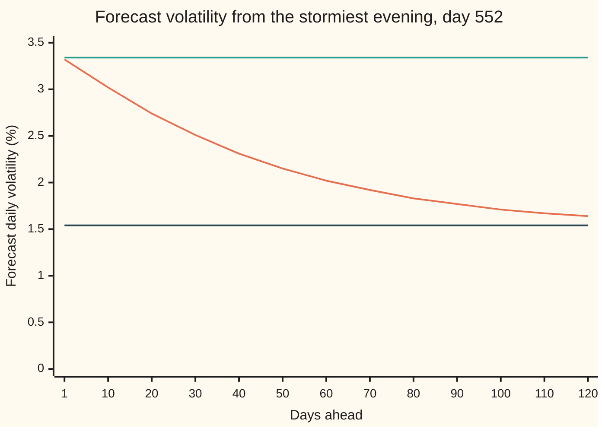

# GARCH: volatility that clusters, and a model for tomorrow's spread

[Syllabus](../../../SYLLABUS.md) → [Probability and statistics](../README.md) → [Time Series](../README.md#s12) → GARCH

---

## General Overview

A share trades for ten years: 2,500 trading days. Its daily return is the percentage change in its price from one close to the next. Over the whole decade the typical day moves about 1.53%, up or down.

The typical day hides two kinds of week. In a calm week, such as week 129, the days move about 0.93% each. In the wildest week of the decade, week 111, they move 4.01% each. The wild weeks do not arrive at random. They come in runs, and a wild week is usually followed by another fairly wild one. Weather behaves the same way: a stormy day makes a stormy tomorrow more likely, without saying which way the wind will blow.

The same holds for the share. The direction of tomorrow's move is close to unguessable: today's return and tomorrow's have a correlation of 0.03, which is noise. The size of tomorrow's move is not: today's squared return and tomorrow's have a correlation of 0.15, well clear of noise. From here on the storms have their proper name, **volatility clustering**: large moves follow large moves, of either sign, and small follow small.

GARCH turns that observation into a rule. Each evening it sets tomorrow's variance, the expected squared move, from three pieces: a small constant, today's squared return, and today's variance. The rule has three settings. They are fitted to the record by maximum likelihood, and then the rule forecasts the spread of tomorrow, next week and next quarter. The share on this card is simulated from a GARCH rule with known settings, so the fit can be graded against the truth; real shares show the same clustering.

**Tomorrow's variance is a small constant, plus a share of today's squared return, plus a share of today's variance; fitted by maximum likelihood, that rule explains the clustering and forecasts a variance that drifts back towards a long-run level.**

**What kind of fact this is:** a model: an assumption about how variance moves that fits returns well enough, not a law. Inside the model, the long-run level and the forecast formula are theorems, proved on this card in Why it works.

### The picture: thirty weeks, calm and wild



First line (orange): each week's measured typical daily move, the square root of the average squared return over its five days. Second line (green): the typical move the fitted GARCH rule forecast for the same days, each forecast made the evening before. The stormy weeks 109 to 113 give way to calm by week 122. The forecast follows the storm up with a lag and comes down slowly, which is the whole behaviour of the model in one picture.

---

## The formula

Notation first, in words. Trading days are counted by $t$. $r_t$ is day t's return in percent. $h_t$ is the variance of that return as it stands the evening before: the expected squared move, given everything known up to day t − 1. Its square root is the day's **volatility**, the size of a typical move. $z_t$ is a fresh draw from the standard normal law, independent of everything that came before. The model has three settings: $\omega$ (omega), a small constant; $\alpha$ (alpha), the weight on today's squared return; and $\beta$ (beta), the weight on today's variance.

$$r_t = \sqrt{h_t}\; z_t, \qquad h_{t+1} = \omega + \alpha\, r_t^2 + \beta\, h_t$$

**Read it aloud:** each day's return is a normal draw scaled by that day's volatility; tomorrow's variance is a small constant, plus alpha times today's squared return, plus beta times today's variance.

The name spells out the idea: generalised autoregressive conditional heteroskedasticity. Heteroskedastic means of unequal spread; conditional, given the past; autoregressive, built from its own past, as on [Autoregression](02-ar-models.md); generalised, because yesterday's variance enters as well as yesterday's squared return. The (1,1) counts one day back of each.

The sum $\phi = \alpha + \beta$ is the **persistence**: the share of today's variance above its long-run level that survives to tomorrow. When it is below 1, the variance has a long-run level, and the forecast k days ahead drifts towards it:

$$\bar h = \frac{\omega}{1 - \phi}, \qquad E\left[h_{t+k} \mid \text{day } t\right] = \bar h + \phi^{\,k-1}\left(h_{t+1} - \bar h\right)$$

**Read it aloud:** the long-run variance is the constant divided by one minus the persistence; k days ahead, the forecast is the long-run level plus the persistence to the power k − 1 times tomorrow's gap from it.

The simpler rival is **EWMA**, the exponentially weighted moving average, with one setting $\lambda$ (lambda):

$$h_{t+1} = \lambda\, h_t + (1 - \lambda)\, r_t^2$$

It is GARCH with the constant removed and the persistence set to exactly 1: $\omega = 0$, $\alpha = 1 - \lambda$, $\beta = \lambda$. It has no long-run level to return to.

The settings are fitted by maximum likelihood ([Maximum likelihood](../07-Sampling%20and%20Estimation/04-maximum-likelihood.md)). Over $n$ days, the log-likelihood $\ell$ is

$$\ell(\omega, \alpha, \beta) = -\frac{1}{2} \sum_{t=1}^{n} \left[ \ln\left(2\pi h_t\right) + \frac{r_t^2}{h_t} \right]$$

**Read it aloud:** for each day, penalise a large forecast variance through its logarithm, and a large squared return relative to that forecast; add up the penalties and take minus a half. The best settings make the total least negative.

| Symbol | Plain meaning | In our example | Push it up and the answer… |
| --- | --- | --- | --- |
| $r_t$ | day t's return, in percent | the ten years' daily moves; typical size 1.53% | a larger squared return raises tomorrow's variance |
| $h_t$ | day t's variance, as forecast the evening before, in percent-squared | 11.0400 on the stormiest evening | wider likely moves |
| $z_t$ | the day's fresh standard normal draw: its surprise, in units of volatility | one draw per day from the seeded generator | — |
| $\omega$ | the constant: variance added every day | true 0.05; fitted 0.0638 | a higher long-run level |
| $\alpha$ | the weight on today's squared return | true 0.08; fitted 0.0834 | sharper jumps after a big day |
| $\beta$ | the weight on today's variance | true 0.90; fitted 0.8896 | a smoother, longer memory |
| $\phi$, $\bar h$ | persistence α + β, and the long-run variance ω / (1 − φ) | 0.9730 and 2.3620 fitted | φ up: storms fade more slowly |
| $\lambda$ | EWMA's carry: the share of today's variance kept | fitted 0.9285 | slower reaction, longer memory |
| $t$, $k$ | the day counter, and days ahead of a forecast | k from 1 to 120 | — |
| $n$, $\ell$ | the number of days fitted, and the log-likelihood; a hat, as in $\hat\alpha$, marks a fitted value | 2,500 days; −4488.21 at the peak | more days: tighter estimates |
| $u_t$ | the surprise in the square, $r_t^2 - h_t$: zero on average | used in Step 4 | — |
| $\rho_k$, $\rho_1$ | the correlation of squared returns k days apart (lag 1 for $\rho_1$) | 0.15 measured at lag 1 | stronger clustering |

### When it holds

- **Returns centred on zero.** The model reads the whole squared return as spread. A drift must be removed first, or it is counted as variance.
- **Persistence below 1.** Then the long-run level exists and forecasts return to it. At exactly 1, EWMA's case, they never do. Above 1, the forecasts grow without limit.
- **A positive constant and non-negative weights.** These keep every variance positive; a negative weight can make a variance negative.
- **Normal surprises in the likelihood.** Even normal surprises give returns fatter tails than the normal law, because the scale moves. Real daily surprises are fatter-tailed still. The fitted settings stay sound (the quasi-maximum-likelihood result of Bollerslev and Wooldridge), but standard errors read off the curvature come out too small and need a correction.
- **Symmetry.** A fall and a rise of the same size raise tomorrow's variance equally. Real share prices react more to falls. Variants such as GJR-GARCH (after Glosten, Jagannathan and Runkle) add a separate weight for down days.

---

## Why it works

### Step 0: split each return into a sign and a size

The model makes a return's direction fresh each day, through the normal draw, and gives its size a memory, through the variance. Everything below follows from two facts: the draw is unpredictable, and the scale is fixed the evening before.

### Step 1: returns are uncorrelated, but their squares are not

Take today's return and one from k days earlier. Given last evening's information, today's volatility and the earlier return are fixed numbers and today's draw averages zero, so their product averages zero; averaging over all evenings keeps it zero (the tower rule, [Conditional expectation](../02-Random%20Variables/05-conditional-expectation-in-tables.md)). The returns are uncorrelated at every lag. On the share the measured correlations run from −0.05 to 0.03. Pure noise over 2,500 days stays inside ±0.04 about 19 times in 20; nine of the ten lags do, and one stray at lag 3 is what noise gives. That band is for independent noise. Returns that cluster are uncorrelated but not independent, and their measured correlations spread wider still, so the stray is even less remarkable.

The squares are not. Given last evening, today's squared return averages $h_t$, which contains yesterday's squared return with weight α: a large move yesterday raises the expected square today. That correlation is the clustering. It is measured by the **autocorrelation**, the correlation of a series with itself k days earlier ([Stationarity and autocorrelation](01-stationarity-and-autocorrelation.md)).



First line (orange): the returns, flat at zero. Second line (green): the squared returns, measured, all well above zero. Third line (dark): what the fitted model says the squares' autocorrelation should be, $\rho_k$ from Step 4. The measured squares sit a little below the model's line: sample autocorrelations of squares are noisy, and tend to run low, in samples of this size.

### Step 2: the variance has a long-run level

Average both sides of the rule for tomorrow's variance over all possible histories. The average squared return equals the average variance, because each day's squared return averages to that day's variance. So the average variance obeys one line of arithmetic: tomorrow's average is ω plus φ times today's. If the average has settled, tomorrow's equals today's, and solving gives $\bar h = \omega / (1 - \phi)$.

For the true settings, 0.05 / (1 − 0.98) is 2.5. The fitted settings give 2.3620, with standard error 0.3005; the plain average of the squared returns is 2.3449. The two estimates agree, and the truth sits well inside the fitted value's error.

### Step 3: the forecast is pulled home geometrically

Stand at the close of day t. Tomorrow's variance $h_{t+1}$ is already fixed by the rule. Call the average forecast k days ahead m(k), so m(1) is that known value. The same averaging as Step 2, done from the evening of day t rather than over all history, gives

m(k + 1) = ω + φ · m(k).

Subtract the long-run level, which satisfies the same equation with m replaced by $\bar h$: the gap m(k) − $\bar h$ is multiplied by φ each day. After k − 1 days it has been multiplied by φ to the power k − 1, which is the forecast formula. The gap halves after ln(1/2) / ln φ days, the **half-life**: 25.3 days for the fitted persistence 0.9730, and 34.3 days for the true 0.98.

EWMA is the case φ = 1 with no constant. Its gap is multiplied by 1 each day: the forecast for every future day equals tomorrow's.



First line (orange): the GARCH forecast, falling from 3.32% towards home. Second line (green): the EWMA forecast, flat at 3.34% for ever. Third line (dark): the long-run volatility, 1.54%. The horizons run 1, then every 10 days. The settings were fitted on all ten years, so this is a replay of the storm, not a forecast anyone could have made on day 552.

The code checks the formula a second way, by simulating the future: 20,000 paths from the stormy evening, each drawing fresh surprises. Five days ahead the formula says 10.1397 and the paths average 10.1293, standard error 0.0172. Twenty days ahead, 7.5198 against 7.5410, standard error 0.0281. Both gaps are under one standard error.

### Step 4: the squares follow an ARMA(1,1)

Write the squared return as its forecast plus a surprise: $r_t^2 = h_t + u_t$, where $u_t$ averages zero given the past. Put that into the variance rule, replacing yesterday's variance by yesterday's square minus yesterday's surprise:

$$r_t^2 = \omega + \phi\, r_{t-1}^2 + u_t - \beta\, u_{t-1}$$

The squares follow an autoregression with coefficient φ, plus a one-day moving average of the surprises: an ARMA(1,1) ([Moving average and ARMA](03-ma-and-arma.md)). Its autocorrelations decay by φ per day after the first:

$$\rho_1 = \frac{\alpha\,(1 - \alpha\beta - \beta^2)}{1 - 2\alpha\beta - \beta^2}, \qquad \rho_k = \phi^{\,k-1}\,\rho_1$$

For the fitted settings $\rho_1$ is 0.186200, about 0.19. The code reaches the same 0.186200 a second way, by unrolling the ARMA(1,1) into weights on past surprises (1, then φ − β, then φ times the last) and dividing the sum of neighbouring products by the sum of squares. The formula needs the squares to have a finite variance, which for normal surprises holds when $3\alpha^2 + 2\alpha\beta + \beta^2 < 1$; the true settings meet it, narrowly.

<details>
<summary>Detailed proof: the autocorrelation of the squares</summary>

Centre the squares: let y(t) be $r_t^2$ minus its long-run average $\bar h$. Step 2's averaging turns the equation above into y(t) = φ y(t−1) + $u_t$ − β u(t−1). The surprises are uncorrelated with each other and with everything earlier; call their common variance s. Assume the squares have a finite, settled variance, the condition in the body.

**Covariance of y with the surprises.** y(t) contains $u_t$ once, so Cov(y(t), $u_t$) = s. And Cov(y(t), u(t−1)) = φ Cov(y(t−1), u(t−1)) − β s = (φ − β) s = α s.

**The variance.** Write g0 for Var y and g1 for Cov(y(t), y(t−1)). Taking the variance of both sides, $g_0 = \phi^2 g_0 + s + \beta^2 s - 2\phi\beta s$, so $g_0 = s\,(1 + \beta^2 - 2\phi\beta) / (1 - \phi^2)$.

**Lag one.** Multiply the equation by y(t−1) and average: g1 = φ g0 − β Cov(u(t−1), y(t−1)) = φ g0 − β s.

**Divide.** $\rho_1 = g_1 / g_0 = \phi - \beta(1 - \phi^2)/(1 + \beta^2 - 2\phi\beta)$. Over the common bottom the top is $\phi + \phi\beta^2 - \phi^2\beta - \beta = (\phi - \beta)(1 - \phi\beta)$. With φ − β = α and φ = α + β, the top is $\alpha(1 - \alpha\beta - \beta^2)$ and the bottom is $1 - 2\alpha\beta - \beta^2$, the formula in the body.

**Later lags.** For k of 2 or more, multiply by y(t−k) and average. Both surprises, $u_t$ and u(t−1), are uncorrelated with y(t−k), so the k-lag covariance is φ times the (k−1)-lag one. Divide by g0: $\rho_k$ = φ to the power k − 1, times $\rho_1$.

</details>

### Step 5: the likelihood splits into one-day pieces

The chance of the whole record factors day by day: the density of day 1, times that of day 2 given day 1, and so on, the chain rule for conditional densities. Given the past, day t's return is normal with centre zero and variance $h_t$, and the logarithm of that normal density is −½ [ln(2π $h_t$) + $r_t^2$ / $h_t$]. Adding the days gives $\ell$. The first day's variance has no past; the code starts it at the plain average of the squared returns.

The two terms pull against each other: the squared-return term rewards a large forecast variance and the logarithm term charges for it. For one day alone the best variance is that day's squared return; three settings must serve all 2,500 days, and the peak is the best compromise.

The peak has no formula, so the code climbs to it. The Nelder–Mead method keeps four trial points in the three settings and keeps reflecting the worst through the others. Standard errors come from the curvature at the peak, as on [Fisher information](../07-Sampling%20and%20Estimation/07-fisher-information-and-cramer-rao.md). EWMA's one setting is found by golden-section search, which shrinks an interval by a fixed ratio each step.

### Step 6: several days at once

Returns are uncorrelated, so the variance of a 20-day total return is the sum of the 20 daily variances. From the stormy evening, the sum of the GARCH forecasts gives a 20-day volatility of 13.52%. Using the storm's variance for all 20 days, with no pull home, gives 14.86%.

### The other door

Step 4 opens a second road: match the squared returns' autocorrelations to the ARMA(1,1), as on [Method of moments](../07-Sampling%20and%20Estimation/05-method-of-moments.md). It is quicker but noisier than the likelihood, since those autocorrelations settle slowly. EWMA itself is exponential smoothing of the squares ([Forecasting](05-forecasting-and-exponential-smoothing.md)).

---

## Worked numbers, by hand

The true rule first: ω = 0.05, α = 0.08, β = 0.90. The share sits at its long-run variance of 2.5 and then falls 6%.

| Step | Arithmetic | Value |
| --- | --- | --- |
| long-run variance | 0.05 / (1 − 0.08 − 0.90) = 0.05 / 0.02 | 2.5 |
| the storm day's square | (−6) × (−6) | 36 |
| tomorrow's variance | 0.05 + 0.08 × 36 + 0.90 × 2.5 = 0.05 + 2.88 + 2.25 | **5.1800** |
| persistence | 0.08 + 0.90 | 0.98 |
| ten days ahead | 2.5 + 0.98^9 × (5.18 − 2.5) | 4.7344 |
| half-life of the excess | ln(0.5) / ln(0.98) | 34.3 days |
| the storm day's log-likelihood term, at variance 2.5 | −½ [ln(2π × 2.5) + 36 / 2.5] | −8.5771 |

One 6% fall roughly doubles tomorrow's variance, and ten days later most of the excess is still there.

The fitted rule, from the ten years:

| Setting | Fitted | Standard error | True |
| --- | --- | --- | --- |
| ω | 0.0638 | 0.0181 | 0.05 |
| α | 0.0834 | 0.0123 | 0.08 |
| β | 0.8896 | 0.0162 | 0.90 |
| persistence φ | 0.9730 | 0.0088 | 0.98 |
| long-run variance | 2.3620 | 0.3005 | 2.5 |
| EWMA's λ | 0.9285 | 0.0084 | — |

Every true value lies within one standard error of its estimate. The grid search, with the long-run level pinned to the plain variance, lands on α = 0.09 and β = 0.88, each within 0.01 of the climb's answer. An interval of two standard errors either side is a statement about the method: built this way on many simulated decades, it would cover the truth about 95 times in 100. The half-life is loosely pinned: 25.3 days at the estimate, anywhere from 15.2 to 74.0 days across two standard errors of persistence.

The likelihood ranks the three rules. Constant variance reaches −4612.65, EWMA −4504.79, and GARCH −4488.21, a gain of 124.44 over constant variance and 16.58 over EWMA. How large a gain must be before it counts is the business of [Likelihood ratio tests](../08-Confidence%20Intervals%20and%20Tests/07-likelihood-ratio-tests.md); these are far past any usual threshold. The true settings score −4488.59, just below the peak, as they must: the peak is the best score any settings can reach on this record.

The live forecast, at the close of the last day: GARCH puts tomorrow's variance at 2.5407 and twenty days out at 2.4682, already close to its long-run 2.3620. EWMA says 2.2847, for tomorrow and for every day after.

### What breaks if you drop a piece

| Mistake | Comes out at | What went wrong |
| --- | --- | --- |
| Shuffle the days: same returns, new order | autocorrelation of squares at lag 1: −0.02, not 0.15 | The clustering lives in the order of the days, not in the list of returns |
| Constant variance | log-likelihood −4612.65, 124.44 below GARCH | A single variance cannot serve calm and wild weeks at once |
| Decay by β alone instead of α + β | storm forecast 20 days out: 3.3011, not 7.5198 | Each future squared return feeds variance back in; the pull home runs at φ |
| No pull home: the storm's variance for all 20 days | 20-day volatility 14.86%, not 13.52% | The storm is priced as if it will never fade |

The code prints all four.

---

## Code, from first principles, and it actually runs

Nothing imported knows the answer. The scripts simulate the share from the true rule, using a SplitMix64 generator (seed 2026) and Box–Muller normal draws ([Rejection sampling and Box-Muller](../11-Simulation/03-rejection-sampling-and-box-muller.md)). They fit both rules with searches written out here. Three roads meet. The fit is checked against the known truth and against a grid search with the long-run level pinned to the plain variance. The forecast formula is checked against 20,000 simulated futures ([Monte Carlo](../11-Simulation/04-monte-carlo-estimates-and-error.md)), with four standard errors allowed. The clustering is checked against the same days shuffled and, loosely, against the model's $\rho_1$; the $\rho_1$ formula itself is checked tightly against the ARMA(1,1)'s own weights, summed 4,000 days back.

### Python

```python
# GARCH and volatility clustering -- the check behind the card.  Standard library
# only.  Returns are in percent a day, variances in percent-squared.  The share is
# simulated from a known GARCH(1,1), so every fitted number can be graded.
from math import log, sqrt, cos, pi
W, A, B, N = 0.05, 0.08, 0.90, 2500           # the true omega, alpha, beta; ten years

class SplitMix64:                             # random numbers, same in both languages
    def __init__(self, seed): self.s = seed
    def uniform(self):
        M = (1 << 64) - 1; self.s = z = (self.s + 0x9E3779B97F4A7C15) & M
        z = ((z ^ (z >> 30)) * 0xBF58476D1CE4E5B9) & M
        z = ((z ^ (z >> 27)) * 0x94D049BB133111EB) & M
        return ((z ^ (z >> 31)) >> 11) / 9007199254740992.0
    def normal(self):                         # Box-Muller, the cosine half only
        u1, u2 = 1.0 - self.uniform(), self.uniform()
        return sqrt(-2.0 * log(u1)) * cos(2.0 * pi * u2)

rng, h, r = SplitMix64(2026), W / (1 - A - B), []
for t in range(250 + N):                      # road one: simulate; 250 warm-up days dropped
    x = sqrt(h) * rng.normal()
    if t >= 250: r.append(x)
    h = W + A * x * x + B * h
sq = [x * x for x in r]; S2 = sum(sq) / N     # variance about zero; also the seed h_1
def path(w, a, b):                            # h_1 .. h_{N+1}, each known the evening before
    hs = [S2]
    for x2 in sq: hs.append(w + a * x2 + b * hs[-1])
    return hs
def loglik(p):                                # Gaussian log-likelihood of all N days
    w, a, b = p
    if w < 0 or a < 0 or b < 0 or a + b > 1: return -1e300
    return -0.5 * sum(log(2 * pi * v) + x2 / v for v, x2 in zip(path(w, a, b), sq))

def nelder_mead(f, x0, step, iters=600):      # climb to the top without derivatives
    pts = [x0] + [[x0[j] + (step if j == i else 0.0) for j in range(3)] for i in range(3)]
    val = [f(p) for p in pts]
    for _ in range(iters):
        o = sorted(range(4), key=lambda i: -val[i])
        pts, val = [pts[i] for i in o], [val[i] for i in o]
        c = [(pts[0][j] + pts[1][j] + pts[2][j]) / 3 for j in range(3)]
        mv = lambda k: [c[j] + k * (pts[3][j] - c[j]) for j in range(3)]
        xr = mv(-1.0); fr = f(xr)
        if fr > val[0]:
            xe = mv(-2.0); fe = f(xe)
            pts[3], val[3] = (xe, fe) if fe > fr else (xr, fr)
        elif fr > val[2]: pts[3], val[3] = xr, fr
        else:
            xc = mv(0.5); fc = f(xc)
            if fc > val[3]: pts[3], val[3] = xc, fc
            else:                             # shrink everything towards the best point
                pts = [pts[0]] + [[(pts[0][j] + p[j]) / 2 for j in range(3)] for p in pts[1:]]
                val = [val[0]] + [f(p) for p in pts[1:]]
    return pts[0], val[0]
est, ll_g = nelder_mead(loglik, [0.1, 0.1, 0.8], 0.05)
w, a, b = est; phi = a + b; lr = w / (1 - phi); rho1 = a * (1 - a * b - b * b) / (1 - 2 * a * b - b * b)
psi = [1.0] + [(phi - b) * phi ** (j - 1) for j in range(1, 4001)]; rho1_w = sum(p * q for p, q in zip(psi, psi[1:])) / sum(p * p for p in psi)
d = [1e-3 * v for v in est]                   # curvature of the peak, by differences
def bump(i, j, si, sj):
    q = list(est); q[i] += si * d[i]; q[j] += sj * d[j]; return loglik(q)
H = [[-(bump(i, j, 1, 1) - bump(i, j, 1, -1) - bump(i, j, -1, 1) + bump(i, j, -1, -1))
      / (4 * d[i] * d[j]) for j in range(3)] for i in range(3)]
det = sum(H[0][j] * (H[1][(j + 1) % 3] * H[2][(j + 2) % 3] - H[1][(j + 2) % 3] * H[2][(j + 1) % 3]) for j in range(3))
V = [[(H[(j + 1) % 3][(i + 1) % 3] * H[(j + 2) % 3][(i + 2) % 3]
       - H[(j + 1) % 3][(i + 2) % 3] * H[(j + 2) % 3][(i + 1) % 3]) / det for j in range(3)] for i in range(3)]
se, se_phi = [sqrt(V[i][i]) for i in range(3)], sqrt(V[1][1] + V[2][2] + 2 * V[1][2])
g = [1 / (1 - phi), lr / (1 - phi), lr / (1 - phi)]   # delta method for the long-run level
se_lr = sqrt(sum(g[i] * V[i][j] * g[j] for i in range(3) for j in range(3)))

grid = max((loglik([S2 * (1 - ga - gb), ga, gb]), ga, gb)       # road two: a grid, with
           for ga in [0.01 * i for i in range(1, 21)]            # omega pinned by the
           for gb in [0.70 + 0.01 * j for j in range(30)] if ga + gb < 1)  # sample variance

lo, hi = 0.80, 0.999                          # EWMA's one knob, by golden section
ll_e = lambda lam: loglik([0.0, 1 - lam, lam])
for _ in range(60):
    m1, m2 = hi - 0.618034 * (hi - lo), lo + 0.618034 * (hi - lo)
    if ll_e(m1) < ll_e(m2): lo = m1
    else: hi = m2
lam = (lo + hi) / 2; se_lam = sqrt(-1e-6 / (ll_e(lam + 1e-3) - 2 * ll_e(lam) + ll_e(lam - 1e-3)))
ll_c = -0.5 * N * (log(2 * pi * S2) + 1)
def acf(xs, k):
    m = sum(xs) / len(xs); dv = [x - m for x in xs]
    return sum(dv[i] * dv[i - k] for i in range(k, len(dv))) / sum(v * v for v in dv)
shuf = list(sq)
for i in range(N - 1, 0, -1):                 # Fisher-Yates: the same days, in a new order
    j = int(rng.uniform() * (i + 1)); shuf[i], shuf[j] = shuf[j], shuf[i]
hs, ew = path(w, a, b), path(0.0, 1 - lam, lam)       # GARCH and EWMA variances
fc = lambda h1, k: lr + phi ** (k - 1) * (h1 - lr)             # the forecast formula
def monte_carlo(h1, k, paths=20000):          # road three: simulate the future instead
    tot = tot2 = 0.0
    for _ in range(paths):
        hh = h1
        for _ in range(k - 1):
            z = rng.normal(); hh = w + a * hh * z * z + b * hh
        tot += hh; tot2 += hh * hh
    return tot / paths, sqrt((tot2 / paths - (tot / paths) ** 2) / paths)
wk, wg = ([sqrt(sum(v[5 * i:5 * i + 5]) / 5) for i in range(N // 5)] for v in (sq, hs))   # weekly
top = max(range(len(wk)), key=lambda i: wk[i]); storm = max(range(1, N + 1), key=lambda t: hs[t])   # evening of day t
hS, K = hs[storm], [1] + list(range(10, 130, 10)); var20 = sum(fc(hS, k) for k in range(1, 21))
mc5, mc20 = monte_carlo(hS, 5), monte_carlo(hS, 20); hand = W + A * 36 + B * 2.5   # by hand: a -6% day, long-run level

pr = lambda lab, xs, f: print(f"{lab:<29}" + "".join(f.format(v) for v in xs))
print(f"share: {N} days, seed 2026; true omega {W:.2f}, alpha {A:.2f}, beta {B:.2f}")
print(f"variance of returns {S2:.4f}; daily vol {sqrt(S2):.4f}%; no-correlation band 2/sqrt(N) {2 / sqrt(N):.4f}")
pr("lag", range(1, 11), "{:6d}")
pr("chart, acf of returns", [acf(r, k) for k in range(1, 11)], "{:6.2f}")
pr("chart, acf of squares", [acf(sq, k) for k in range(1, 11)], "{:6.2f}")
pr("chart, acf squares, model", [rho1 * phi ** (k - 1) for k in range(1, 11)], "{:6.2f}")
print(f"rho_1 of squares: formula {rho1:.6f}, from the ARMA(1,1) weights {rho1_w:.6f}")
pr("acf squares, days shuffled", [acf(shuf, k) for k in range(1, 11)], "{:6.2f}")
print(f"GARCH fit: omega {w:.4f} (se {se[0]:.4f}), alpha {a:.4f} (se {se[1]:.4f}), beta {b:.4f} (se {se[2]:.4f})")
print(f"persistence {phi:.4f} (se {se_phi:.4f}); half-life {log(0.5) / log(phi):.1f} days, "
      f"{log(0.5) / log(phi - 2 * se_phi):.1f} to {log(0.5) / log(phi + 2 * se_phi):.1f} at 2 se")
print(f"long-run variance {lr:.4f} (se {se_lr:.4f}); long-run vol {sqrt(lr):.4f}%")
print(f"grid, omega pinned: alpha {grid[1]:.2f}, beta {grid[2]:.2f}, log-likelihood {grid[0]:.2f}")
print(f"EWMA fit: lambda {lam:.4f} (se {se_lam:.4f})")
print(f"log-likelihood: constant {ll_c:.2f}, EWMA {ll_e(lam):.2f}, GARCH {ll_g:.2f}, GARCH at the truth {loglik([W, A, B]):.2f}")
print(f"GARCH gain over constant {ll_g - ll_c:.2f}, over EWMA {ll_g - ll_e(lam):.2f}")
pr("chart, week", range(top - 9, top + 21), "{:6d}")
pr("chart, weekly rms return %", wk[top - 10:top + 20], "{:6.2f}")
pr("chart, weekly GARCH vol %", wg[top - 10:top + 20], "{:6.2f}")
print(f"storm: evening of day {storm}, GARCH h {hS:.4f}, EWMA h {ew[storm]:.4f}")
pr("days ahead k", K, "{:6d}")
pr("chart, storm GARCH vol %", [sqrt(fc(hS, k)) for k in K], "{:6.2f}")
pr("chart, storm EWMA vol %", [sqrt(ew[storm])] * len(K), "{:6.2f}")
pr("chart, long-run vol %", [sqrt(lr)] * len(K), "{:6.2f}")
print(f"storm k=5: formula {fc(hS, 5):.4f}, simulated {mc5[0]:.4f} (se {mc5[1]:.4f})")
print(f"storm k=20: formula {fc(hS, 20):.4f}, simulated {mc20[0]:.4f} (se {mc20[1]:.4f})")
print(f"storm 20-day vol: sum of forecasts {sqrt(var20):.2f}%, with no pull home {sqrt(20 * hS):.2f}%")
print(f"end of sample: GARCH h {hs[N]:.4f} -> k=20 {fc(hs[N], 20):.4f}; EWMA h {ew[N]:.4f}")
print(f"hand: h after a -6% day {hand:.4f}; k=10 {W / (1 - A - B) + (A + B) ** 9 * (hand - 2.5):.4f}; "
      f"half-life {log(0.5) / log(A + B):.1f} days; that day's log-lik term {-0.5 * (log(2 * pi * 2.5) + 36 / 2.5):.4f}")
print(f"break: decay by beta alone, storm k=20: {lr + b ** 19 * (hS - lr):.4f}")
assert all(abs(p - t) < 3 * s for p, t, s in zip(est, (W, A, B), se))   # the truth is inside
assert abs(grid[1] - a) < 0.02 and abs(grid[2] - b) < 0.02 and grid[0] <= ll_g   # two fits agree
assert ll_c <= ll_e(lam) <= ll_g and loglik([W, A, B]) <= ll_g   # the peak beats its nested rivals
assert ll_e(lam) >= max(ll_e(lam - 0.01), ll_e(lam + 0.01))       # and EWMA's peak its neighbours
assert abs(fc(hS, 5) - mc5[0]) < 4 * mc5[1] and abs(fc(hS, 20) - mc20[0]) < 4 * mc20[1]
assert acf(sq, 1) > 4 / sqrt(N) and abs(acf(sq, 1) - rho1) < 4 / sqrt(N) and all(abs(acf(v, k)) < 4 / sqrt(N) for v in (r, shuf) for k in range(1, 11))
assert abs(rho1_w - rho1) < 1e-9          # Step 4's rho_1 against the squares' ARMA(1,1) as weights on past surprises
print("ALL CHECKS PASS")
```

**Ran 2026-10-06 on macOS, Python 3.14.6, standard library only. All checks passed. Output, pasted from the run:**

```
share: 2500 days, seed 2026; true omega 0.05, alpha 0.08, beta 0.90
variance of returns 2.3449; daily vol 1.5313%; no-correlation band 2/sqrt(N) 0.0400
lag                               1     2     3     4     5     6     7     8     9    10
chart, acf of returns          0.03  0.01 -0.05 -0.02 -0.03 -0.00  0.03  0.01  0.02  0.03
chart, acf of squares          0.15  0.11  0.15  0.16  0.17  0.17  0.12  0.15  0.14  0.12
chart, acf squares, model      0.19  0.18  0.18  0.17  0.17  0.16  0.16  0.15  0.15  0.15
rho_1 of squares: formula 0.186200, from the ARMA(1,1) weights 0.186200
acf squares, days shuffled    -0.02 -0.02  0.05  0.00 -0.03 -0.05  0.02 -0.02  0.00  0.02
GARCH fit: omega 0.0638 (se 0.0181), alpha 0.0834 (se 0.0123), beta 0.8896 (se 0.0162)
persistence 0.9730 (se 0.0088); half-life 25.3 days, 15.2 to 74.0 at 2 se
long-run variance 2.3620 (se 0.3005); long-run vol 1.5369%
grid, omega pinned: alpha 0.09, beta 0.88, log-likelihood -4488.39
EWMA fit: lambda 0.9285 (se 0.0084)
log-likelihood: constant -4612.65, EWMA -4504.79, GARCH -4488.21, GARCH at the truth -4488.59
GARCH gain over constant 124.44, over EWMA 16.58
chart, week                     101   102   103   104   105   106   107   108   109   110   111   112   113   114   115   116   117   118   119   120   121   122   123   124   125   126   127   128   129   130
chart, weekly rms return %     3.58  2.09  2.21  2.66  2.44  1.76  1.38  2.32  2.77  3.52  4.01  2.47  2.87  1.76  1.36  1.67  1.65  1.93  1.64  2.17  2.00  1.53  1.30  1.10  1.49  1.13  1.61  2.21  0.93  1.50
chart, weekly GARCH vol %      2.36  2.62  2.40  2.32  2.33  2.07  1.90  1.83  2.17  2.55  3.00  2.90  2.68  2.49  2.14  1.83  1.78  1.81  1.72  1.80  1.77  1.84  1.71  1.55  1.50  1.39  1.46  1.54  1.64  1.50
storm: evening of day 552, GARCH h 11.0400, EWMA h 11.1785
days ahead k                      1    10    20    30    40    50    60    70    80    90   100   110   120
chart, storm GARCH vol %       3.32  3.02  2.74  2.51  2.31  2.15  2.02  1.92  1.83  1.77  1.71  1.67  1.64
chart, storm EWMA vol %        3.34  3.34  3.34  3.34  3.34  3.34  3.34  3.34  3.34  3.34  3.34  3.34  3.34
chart, long-run vol %          1.54  1.54  1.54  1.54  1.54  1.54  1.54  1.54  1.54  1.54  1.54  1.54  1.54
storm k=5: formula 10.1397, simulated 10.1293 (se 0.0172)
storm k=20: formula 7.5198, simulated 7.5410 (se 0.0281)
storm 20-day vol: sum of forecasts 13.52%, with no pull home 14.86%
end of sample: GARCH h 2.5407 -> k=20 2.4682; EWMA h 2.2847
hand: h after a -6% day 5.1800; k=10 4.7344; half-life 34.3 days; that day's log-lik term -8.5771
break: decay by beta alone, storm k=20: 3.3011
ALL CHECKS PASS
```

### Rust

Same numbers, same labels, built with `rustc --edition 2021 -O`.

```rust
// GARCH and volatility clustering -- the same check as the Python, in Rust.  No
// crates.  Returns are in percent a day, variances in percent-squared.  The share
// is simulated from a known GARCH(1,1), so every fitted number can be graded.
use std::f64::consts::PI;
const W: f64 = 0.05; const A: f64 = 0.08; const B: f64 = 0.90; const N: usize = 2500;
struct SplitMix64 { s: u64 }                  // random numbers, same in both languages
impl SplitMix64 {
    fn uniform(&mut self) -> f64 {
        self.s = self.s.wrapping_add(0x9E3779B97F4A7C15); let mut z = self.s;
        z = (z ^ (z >> 30)).wrapping_mul(0xBF58476D1CE4E5B9);
        z = (z ^ (z >> 27)).wrapping_mul(0x94D049BB133111EB);
        ((z ^ (z >> 31)) >> 11) as f64 / 9007199254740992.0
    }
    fn normal(&mut self) -> f64 {             // Box-Muller, the cosine half only
        let u1 = 1.0 - self.uniform(); let u2 = self.uniform();
        (-2.0 * u1.ln()).sqrt() * (2.0 * PI * u2).cos()
    }
}
fn path(sq: &[f64], s2: f64, w: f64, a: f64, b: f64) -> Vec<f64> {   // h_1 .. h_{N+1}
    let mut hs = vec![s2];
    for x2 in sq { let last = hs[hs.len() - 1]; hs.push(w + a * x2 + b * last); }
    hs
}
fn loglik(sq: &[f64], s2: f64, p: &[f64]) -> f64 {   // Gaussian log-likelihood of all N days
    let (w, a, b) = (p[0], p[1], p[2]);
    if w < 0.0 || a < 0.0 || b < 0.0 || a + b > 1.0 { return -1e300; }
    let (hs, mut s) = (path(sq, s2, w, a, b), 0.0);
    for t in 0..sq.len() { s += (2.0 * PI * hs[t]).ln() + sq[t] / hs[t]; }
    -0.5 * s
}
fn nelder_mead(f: &dyn Fn(&[f64]) -> f64, x0: [f64; 3], step: f64) -> ([f64; 3], f64) {
    let mut pts = vec![x0; 4];
    for i in 0..3 { pts[i + 1][i] += step; }
    let mut val: Vec<f64> = pts.iter().map(|p| f(p)).collect();
    for _ in 0..600 {
        let mut o: Vec<usize> = (0..4).collect();
        o.sort_by(|&i, &j| val[j].partial_cmp(&val[i]).unwrap());
        pts = o.iter().map(|&i| pts[i]).collect(); val = o.iter().map(|&i| val[i]).collect();
        let (mut c, p3) = ([0.0; 3], pts[3]);
        for j in 0..3 { c[j] = (pts[0][j] + pts[1][j] + pts[2][j]) / 3.0; }
        let mv = |k: f64| { let mut x = [0.0; 3]; for j in 0..3 { x[j] = c[j] + k * (p3[j] - c[j]); } x };
        let xr = mv(-1.0); let fr = f(&xr);
        if fr > val[0] {
            let xe = mv(-2.0); let fe = f(&xe);
            if fe > fr { pts[3] = xe; val[3] = fe; } else { pts[3] = xr; val[3] = fr; }
        } else if fr > val[2] { pts[3] = xr; val[3] = fr; }
        else {
            let xc = mv(0.5); let fc = f(&xc);
            if fc > val[3] { pts[3] = xc; val[3] = fc; }
            else {                            // shrink everything towards the best point
                for i in 1..4 { for j in 0..3 { pts[i][j] = (pts[0][j] + pts[i][j]) / 2.0; } val[i] = f(&pts[i]); }
            }
        }
    }
    (pts[0], val[0])
}
fn acf(xs: &[f64], k: usize) -> f64 {
    let m = xs.iter().sum::<f64>() / xs.len() as f64;
    let dv: Vec<f64> = xs.iter().map(|x| x - m).collect();
    let mut num = 0.0; for i in k..dv.len() { num += dv[i] * dv[i - k]; }
    num / dv.iter().map(|v| v * v).sum::<f64>()
}
fn pr<T>(lab: &str, xs: &[T], f: &dyn Fn(&T) -> String) {
    println!("{:<29}{}", lab, xs.iter().map(|v| f(v)).collect::<String>());
}
fn main() {
    let mut rng = SplitMix64 { s: 2026 };
    let (mut h, mut r) = (W / (1.0 - A - B), Vec::new());
    for t in 0..250 + N {                     // road one: simulate; 250 warm-up days dropped
        let x = h.sqrt() * rng.normal();
        if t >= 250 { r.push(x); }
        h = W + A * x * x + B * h;
    }
    let sq: Vec<f64> = r.iter().map(|x| x * x).collect(); let s2 = sq.iter().sum::<f64>() / N as f64;   // variance about zero; also the seed h_1
    let ll = |p: &[f64]| loglik(&sq, s2, p);
    let (est, ll_g) = nelder_mead(&ll, [0.1, 0.1, 0.8], 0.05);
    let (w, a, b) = (est[0], est[1], est[2]); let phi = a + b; let lr = w / (1.0 - phi);
    let d: Vec<f64> = est.iter().map(|v| 1e-3 * v).collect();   // curvature of the peak
    let bump = |i: usize, j: usize, si: f64, sj: f64| { let mut q = est; q[i] += si * d[i]; q[j] += sj * d[j]; ll(&q) };
    let mut hm = [[0.0; 3]; 3];
    for i in 0..3 { for j in 0..3 {
        hm[i][j] = -(bump(i, j, 1.0, 1.0) - bump(i, j, 1.0, -1.0) - bump(i, j, -1.0, 1.0) + bump(i, j, -1.0, -1.0)) / (4.0 * d[i] * d[j]);
    } }
    let mut det = 0.0;
    for j in 0..3 { det += hm[0][j] * (hm[1][(j + 1) % 3] * hm[2][(j + 2) % 3] - hm[1][(j + 2) % 3] * hm[2][(j + 1) % 3]); }
    let mut v = [[0.0; 3]; 3];
    for i in 0..3 { for j in 0..3 {
        v[i][j] = (hm[(j + 1) % 3][(i + 1) % 3] * hm[(j + 2) % 3][(i + 2) % 3] - hm[(j + 1) % 3][(i + 2) % 3] * hm[(j + 2) % 3][(i + 1) % 3]) / det;
    } }
    let (se, se_phi): (Vec<f64>, f64) = ((0..3).map(|i| v[i][i].sqrt()).collect(), (v[1][1] + v[2][2] + 2.0 * v[1][2]).sqrt());
    let g = [1.0 / (1.0 - phi), lr / (1.0 - phi), lr / (1.0 - phi)];   // delta method
    let mut s = 0.0; for i in 0..3 { for j in 0..3 { s += g[i] * v[i][j] * g[j]; } } let se_lr = s.sqrt();
    let mut grid = (f64::NEG_INFINITY, 0.0, 0.0);   // road two: a grid, omega pinned by S2
    for i in 1..21 { for j in 0..30 {
        let (ga, gb) = (0.01 * i as f64, 0.70 + 0.01 * j as f64);
        if ga + gb < 1.0 { let l = ll(&[s2 * (1.0 - ga - gb), ga, gb]); if l > grid.0 { grid = (l, ga, gb); } }
    } }
    let ll_e = |lam: f64| ll(&[0.0, 1.0 - lam, lam]);   // EWMA's one knob, by golden section
    let (mut lo, mut hi) = (0.80, 0.999);
    for _ in 0..60 {
        let (m1, m2) = (hi - 0.618034 * (hi - lo), lo + 0.618034 * (hi - lo));
        if ll_e(m1) < ll_e(m2) { lo = m1; } else { hi = m2; }
    }
    let lam = (lo + hi) / 2.0; let se_lam = (-1e-6 / (ll_e(lam + 1e-3) - 2.0 * ll_e(lam) + ll_e(lam - 1e-3))).sqrt();
    let ll_c = -0.5 * N as f64 * ((2.0 * PI * s2).ln() + 1.0);
    let mut shuf = sq.clone();
    for i in (1..N).rev() { let j = (rng.uniform() * (i + 1) as f64) as usize; shuf.swap(i, j); }
    let rho1 = a * (1.0 - a * b - b * b) / (1.0 - 2.0 * a * b - b * b);
    let psi: Vec<f64> = (0..4001).map(|j| if j == 0 { 1.0 } else { (phi - b) * phi.powf((j - 1) as f64) }).collect();
    let rho1_w = psi.windows(2).map(|p| p[0] * p[1]).sum::<f64>() / psi.iter().map(|p| p * p).sum::<f64>();
    let (hs, ew) = (path(&sq, s2, w, a, b), path(&sq, s2, 0.0, 1.0 - lam, lam));
    let fc = |h1: f64, k: usize| lr + phi.powf((k - 1) as f64) * (h1 - lr);   // the forecast formula
    let mut monte_carlo = |h1: f64, k: usize| {   // road three: simulate the future instead
        let (mut tot, mut tot2) = (0.0, 0.0);
        for _ in 0..20000 {
            let mut hh = h1;
            for _ in 0..k - 1 { let z = rng.normal(); hh = w + a * hh * z * z + b * hh; }
            tot += hh; tot2 += hh * hh;
        }
        (tot / 20000.0, ((tot2 / 20000.0 - (tot / 20000.0).powf(2.0)) / 20000.0).sqrt())
    };
    let weekly = |v: &[f64]| -> Vec<f64> { (0..N / 5).map(|i| (v[5 * i..5 * i + 5].iter().sum::<f64>() / 5.0).sqrt()).collect() };
    let (wk, wg) = (weekly(&sq), weekly(&hs));
    let mut top = 0; for i in 0..wk.len() { if wk[i] > wk[top] { top = i; } } let mut storm = 1; for t in 1..N + 1 { if hs[t] > hs[storm] { storm = t; } }   // evening of day t
    let hstorm = hs[storm]; let ks: Vec<usize> = std::iter::once(1).chain((10..130).step_by(10)).collect();
    let var20: f64 = (1..21).map(|k| fc(hstorm, k)).sum();
    let (mc5, mc20) = (monte_carlo(hstorm, 5), monte_carlo(hstorm, 20)); let hand = W + A * 36.0 + B * 2.5;   // by hand: a -6% day, long-run level
    let f2 = |x: &f64| format!("{:6.2}", x); let fd = |x: &usize| format!("{:6}", x);
    let lags: Vec<usize> = (1..11).collect();
    println!("share: {} days, seed 2026; true omega {:.2}, alpha {:.2}, beta {:.2}", N, W, A, B);
    println!("variance of returns {:.4}; daily vol {:.4}%; no-correlation band 2/sqrt(N) {:.4}", s2, s2.sqrt(), 2.0 / (N as f64).sqrt());
    pr("lag", &lags, &fd);
    pr("chart, acf of returns", &lags.iter().map(|&k| acf(&r, k)).collect::<Vec<_>>(), &f2);
    pr("chart, acf of squares", &lags.iter().map(|&k| acf(&sq, k)).collect::<Vec<_>>(), &f2);
    pr("chart, acf squares, model", &lags.iter().map(|&k| rho1 * phi.powf((k - 1) as f64)).collect::<Vec<_>>(), &f2);
    println!("rho_1 of squares: formula {:.6}, from the ARMA(1,1) weights {:.6}", rho1, rho1_w);
    pr("acf squares, days shuffled", &lags.iter().map(|&k| acf(&shuf, k)).collect::<Vec<_>>(), &f2);
    println!("GARCH fit: omega {:.4} (se {:.4}), alpha {:.4} (se {:.4}), beta {:.4} (se {:.4})", w, se[0], a, se[1], b, se[2]);
    println!("persistence {:.4} (se {:.4}); half-life {:.1} days, {:.1} to {:.1} at 2 se", phi, se_phi, 0.5f64.ln() / phi.ln(),
             0.5f64.ln() / (phi - 2.0 * se_phi).ln(), 0.5f64.ln() / (phi + 2.0 * se_phi).ln());
    println!("long-run variance {:.4} (se {:.4}); long-run vol {:.4}%", lr, se_lr, lr.sqrt());
    println!("grid, omega pinned: alpha {:.2}, beta {:.2}, log-likelihood {:.2}", grid.1, grid.2, grid.0);
    println!("EWMA fit: lambda {:.4} (se {:.4})", lam, se_lam);
    let ll_t = ll(&[W, A, B]);
    println!("log-likelihood: constant {:.2}, EWMA {:.2}, GARCH {:.2}, GARCH at the truth {:.2}", ll_c, ll_e(lam), ll_g, ll_t);
    println!("GARCH gain over constant {:.2}, over EWMA {:.2}", ll_g - ll_c, ll_g - ll_e(lam));
    pr("chart, week", &(top - 9..top + 21).collect::<Vec<_>>(), &fd);
    pr("chart, weekly rms return %", &wk[top - 10..top + 20], &f2);
    pr("chart, weekly GARCH vol %", &wg[top - 10..top + 20], &f2);
    println!("storm: evening of day {}, GARCH h {:.4}, EWMA h {:.4}", storm, hstorm, ew[storm]);
    pr("days ahead k", &ks, &fd);
    pr("chart, storm GARCH vol %", &ks.iter().map(|&k| fc(hstorm, k).sqrt()).collect::<Vec<_>>(), &f2);
    pr("chart, storm EWMA vol %", &vec![ew[storm].sqrt(); ks.len()], &f2);
    pr("chart, long-run vol %", &vec![lr.sqrt(); ks.len()], &f2);
    println!("storm k=5: formula {:.4}, simulated {:.4} (se {:.4})", fc(hstorm, 5), mc5.0, mc5.1);
    println!("storm k=20: formula {:.4}, simulated {:.4} (se {:.4})", fc(hstorm, 20), mc20.0, mc20.1);
    println!("storm 20-day vol: sum of forecasts {:.2}%, with no pull home {:.2}%", var20.sqrt(), (20.0 * hstorm).sqrt());
    println!("end of sample: GARCH h {:.4} -> k=20 {:.4}; EWMA h {:.4}", hs[N], fc(hs[N], 20), ew[N]);
    println!("hand: h after a -6% day {:.4}; k=10 {:.4}; half-life {:.1} days; that day's log-lik term {:.4}",
             hand, W / (1.0 - A - B) + (A + B).powf(9.0) * (hand - 2.5), 0.5f64.ln() / (A + B).ln(), -0.5 * ((2.0 * PI * 2.5).ln() + 36.0 / 2.5));
    println!("break: decay by beta alone, storm k=20: {:.4}", lr + b.powf(19.0) * (hstorm - lr));
    assert!((0..3).all(|i| (est[i] - [W, A, B][i]).abs() < 3.0 * se[i]));   // the truth is inside
    assert!((grid.1 - a).abs() < 0.02 && (grid.2 - b).abs() < 0.02 && grid.0 <= ll_g);   // two fits agree
    assert!(ll_c <= ll_e(lam) && ll_e(lam) <= ll_g && ll_t <= ll_g);   // the peak beats its nested rivals
    assert!(ll_e(lam) >= ll_e(lam - 0.01).max(ll_e(lam + 0.01)));       // and EWMA's peak its neighbours
    assert!((fc(hstorm, 5) - mc5.0).abs() < 4.0 * mc5.1 && (fc(hstorm, 20) - mc20.0).abs() < 4.0 * mc20.1);
    assert!(acf(&sq, 1) > 4.0 / (N as f64).sqrt() && (acf(&sq, 1) - rho1).abs() < 4.0 / (N as f64).sqrt() && [&r, &shuf].iter().all(|v| (1..11).all(|k| acf(v, k).abs() < 4.0 / (N as f64).sqrt())));
    assert!((rho1_w - rho1).abs() < 1e-9);   // Step 4's rho_1 against the squares' ARMA(1,1) as weights on past surprises
    println!("ALL CHECKS PASS");
}
```

**Ran 2026-10-06 on macOS, rustc 1.98.1, no crates. All checks passed. Output, pasted from the run:**

```
share: 2500 days, seed 2026; true omega 0.05, alpha 0.08, beta 0.90
variance of returns 2.3449; daily vol 1.5313%; no-correlation band 2/sqrt(N) 0.0400
lag                               1     2     3     4     5     6     7     8     9    10
chart, acf of returns          0.03  0.01 -0.05 -0.02 -0.03 -0.00  0.03  0.01  0.02  0.03
chart, acf of squares          0.15  0.11  0.15  0.16  0.17  0.17  0.12  0.15  0.14  0.12
chart, acf squares, model      0.19  0.18  0.18  0.17  0.17  0.16  0.16  0.15  0.15  0.15
rho_1 of squares: formula 0.186200, from the ARMA(1,1) weights 0.186200
acf squares, days shuffled    -0.02 -0.02  0.05  0.00 -0.03 -0.05  0.02 -0.02  0.00  0.02
GARCH fit: omega 0.0638 (se 0.0181), alpha 0.0834 (se 0.0123), beta 0.8896 (se 0.0162)
persistence 0.9730 (se 0.0088); half-life 25.3 days, 15.2 to 74.0 at 2 se
long-run variance 2.3620 (se 0.3005); long-run vol 1.5369%
grid, omega pinned: alpha 0.09, beta 0.88, log-likelihood -4488.39
EWMA fit: lambda 0.9285 (se 0.0084)
log-likelihood: constant -4612.65, EWMA -4504.79, GARCH -4488.21, GARCH at the truth -4488.59
GARCH gain over constant 124.44, over EWMA 16.58
chart, week                     101   102   103   104   105   106   107   108   109   110   111   112   113   114   115   116   117   118   119   120   121   122   123   124   125   126   127   128   129   130
chart, weekly rms return %     3.58  2.09  2.21  2.66  2.44  1.76  1.38  2.32  2.77  3.52  4.01  2.47  2.87  1.76  1.36  1.67  1.65  1.93  1.64  2.17  2.00  1.53  1.30  1.10  1.49  1.13  1.61  2.21  0.93  1.50
chart, weekly GARCH vol %      2.36  2.62  2.40  2.32  2.33  2.07  1.90  1.83  2.17  2.55  3.00  2.90  2.68  2.49  2.14  1.83  1.78  1.81  1.72  1.80  1.77  1.84  1.71  1.55  1.50  1.39  1.46  1.54  1.64  1.50
storm: evening of day 552, GARCH h 11.0400, EWMA h 11.1785
days ahead k                      1    10    20    30    40    50    60    70    80    90   100   110   120
chart, storm GARCH vol %       3.32  3.02  2.74  2.51  2.31  2.15  2.02  1.92  1.83  1.77  1.71  1.67  1.64
chart, storm EWMA vol %        3.34  3.34  3.34  3.34  3.34  3.34  3.34  3.34  3.34  3.34  3.34  3.34  3.34
chart, long-run vol %          1.54  1.54  1.54  1.54  1.54  1.54  1.54  1.54  1.54  1.54  1.54  1.54  1.54
storm k=5: formula 10.1397, simulated 10.1293 (se 0.0172)
storm k=20: formula 7.5198, simulated 7.5410 (se 0.0281)
storm 20-day vol: sum of forecasts 13.52%, with no pull home 14.86%
end of sample: GARCH h 2.5407 -> k=20 2.4682; EWMA h 2.2847
hand: h after a -6% day 5.1800; k=10 4.7344; half-life 34.3 days; that day's log-lik term -8.5771
break: decay by beta alone, storm k=20: 3.3011
ALL CHECKS PASS
```

The two outputs match line for line: the same generator, the same climb and the same order of additions give the same bits.

> [!TIP]
> **Try changing**
> Guess first, then run it. Some changes stop the program at an assert.
> - **A different decade.** Change the seed from `2026` to `2027`. The fitted settings move by about one standard error, the storm lands on a different day, and every assert still passes.
> - **A jumpier share.** Set `A, B` to `0.15, 0.80`. Persistence falls, so the half-life roughly halves, the squares' autocorrelation rises, and the fit still finds the truth.
> - **Two years instead of ten.** Set `N` to `500`. The standard errors roughly double, and the clustering assert stops the run: over 500 days the lag-1 autocorrelation of squares no longer clears the stricter band of four over the square root of N.
> - **Forget the squared return in the forecast.** In `fc`, replace `phi` by `b`. The formula now decays too fast, and the Monte Carlo assert stops it.

---

## The usual mistake

> [!warning]
> **Reading clustering as predictability of direction.** GARCH forecasts how big tomorrow's move is likely to be, not which way it goes. The share's returns are uncorrelated at every lag, measured at −0.05 to 0.03. A model of the variance says nothing about the average return, and a storm forecast is not a forecast of a fall.
>
> - **Decaying the forecast by β.** The pull home runs at α + β. Using β alone brings the storm forecast 20 days out down to 3.3011 instead of 7.5198.
> - **Treating EWMA as a smaller GARCH.** It has persistence exactly 1 and no long-run level. From the storm it still forecasts 3.34% volatility 120 days out, where GARCH has come back to 1.64%.
> - **Scoring the fit on the days it was fitted to.** The storm replay above uses settings that saw the whole decade. A forecast is only tested on days its settings never saw; the scoring is on [Tomorrow's volatility](../../12-Financial%20mathematics/40-Hedging%2C%20Volatility%20Forecasts%20and%20Stress/04-volatility-forecasting-ewma-garch-and-realised.md).
> - **Quoting a forecast without its uncertainty.** The forecasts above treat the fitted settings as exact. The half-life alone could be anywhere from 15.2 to 74.0 days.

---

## Where you meet it in real life

- **Market risk.** Banks size tomorrow's possible loss from a variance forecast. RiskMetrics published EWMA with λ = 0.94 for this; GARCH is its standard rival ([Tomorrow's volatility](../../12-Financial%20mathematics/40-Hedging%2C%20Volatility%20Forecasts%20and%20Stress/04-volatility-forecasting-ewma-garch-and-realised.md)).
- **Inflation.** Robert Engle introduced the ARCH model in 1982 to measure how uncertain UK inflation was, and shared the 2003 Nobel memorial prize in economics for it.
- **Any series with bursts.** Electricity prices and network traffic cluster too. The mean is modelled first, often by an autoregression; GARCH models the spread of what is left.
- **Persistence near 1.** Fitted daily persistence for shares is often close to 1. At exactly 1 the variance behaves like a series with a unit root ([Unit roots](04-differencing-and-unit-roots.md)): shocks never fade.

> **Say it back**
> Share returns have no memory for direction but a strong memory for size: large moves follow large moves. GARCH sets tomorrow's variance to a constant plus weights on today's squared return and today's variance. Its settings are fitted by maximum likelihood, which scores each day's return against the variance forecast for it. The persistence, alpha plus beta, pulls every forecast back to a long-run level, halving the excess every ln(1/2) / ln(φ) days. EWMA is the special case with persistence 1, which never comes home.

---

## What this builds on

- [Autoregression](02-ar-models.md): a series built from its own past; here the variance, and the squared returns, are built that way.
- [Maximum likelihood](../07-Sampling%20and%20Estimation/04-maximum-likelihood.md): choosing settings that make the record least surprising, and reading standard errors off the curvature of the peak.
- [Stationarity and autocorrelation](01-stationarity-and-autocorrelation.md): the autocorrelation that shows clustering, and the settled long-run behaviour Step 2 assumes.

## Where this goes next

- [Tomorrow's volatility](../../12-Financial%20mathematics/40-Hedging%2C%20Volatility%20Forecasts%20and%20Stress/04-volatility-forecasting-ewma-garch-and-realised.md): GARCH, EWMA and realised variance set against each other on a trading desk, with forecasts scored on days they never saw.

GARCH here is fitted and replayed on the same ten years; whether its forecasts beat simpler rules on days the fit never saw, and what that is worth to a risk desk, is what that card measures.

---

## Sources

Verified 29 Sep 2026: every link below resolves to the publisher's page.

- Engle, Robert F. "Autoregressive Conditional Heteroscedasticity with Estimates of the Variance of United Kingdom Inflation." *Econometrica* 50, no. 4 (1982): 987–1007. [doi:10.2307/1912773](https://doi.org/10.2307/1912773). The first model of a variance that depends on past squared returns.
- Bollerslev, Tim. "Generalized Autoregressive Conditional Heteroskedasticity." *Journal of Econometrics* 31, no. 3 (1986): 307–327. [doi:10.1016/0304-4076(86)90063-1](https://doi.org/10.1016/0304-4076(86)90063-1). Adds yesterday's variance: GARCH(1,1) and its long-run level.
- Bollerslev, Tim. "On the Correlation Structure for the Generalized Autoregressive Conditional Heteroskedastic Process." *Journal of Time Series Analysis* 9, no. 2 (1988): 121–131. [doi:10.1111/j.1467-9892.1988.tb00459.x](https://doi.org/10.1111/j.1467-9892.1988.tb00459.x). The ARMA form of the squares and their autocorrelations.
- Bollerslev, Tim, and Jeffrey M. Wooldridge. "Quasi-Maximum Likelihood Estimation and Inference in Dynamic Models with Time-Varying Covariances." *Econometric Reviews* 11, no. 2 (1992): 143–172. [doi:10.1080/07474939208800229](https://doi.org/10.1080/07474939208800229). Why the normal likelihood still works when the surprises are not normal, and how to correct the standard errors.
- J.P. Morgan and Reuters. *RiskMetrics Technical Document*, 4th ed., 1996. [Document, hosted by MSCI](https://www.msci.com/documents/10199/5915b101-4206-4ba0-aee2-3449d5c7e95a). The EWMA rule and the daily setting λ = 0.94.
