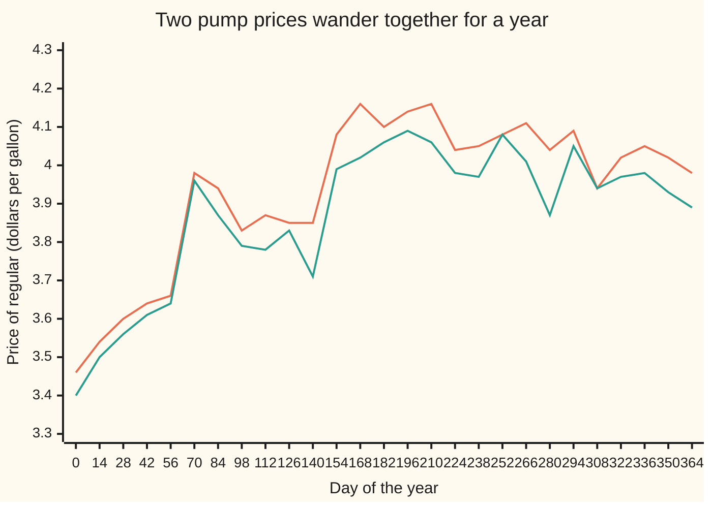
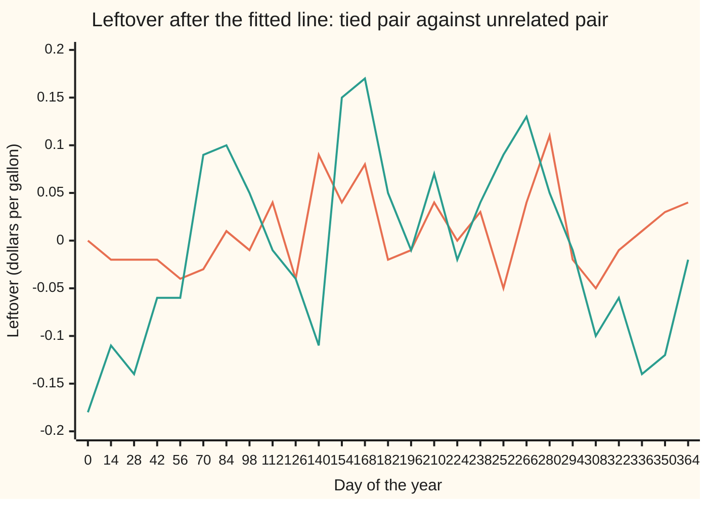

# Cointegration: two wandering series tied together

[Syllabus](../../../SYLLABUS.md) → [Probability and statistics](../README.md) → [Time Series](../README.md#s12) → Cointegration

---

## General Overview

Two petrol stations face each other across a crossroads. Call them North and South. On 1 January South sells regular at $3.40 a gallon and North at $3.46. Both buy from the same wholesale market, so when crude oil moves, both pump prices move. Neither price has a home: South drifts up to $4.09 by mid-July and ends December at $3.89.

Yet the gap between them does not wander. When North runs 10 cents above its usual gap, drivers cross the road, and within days North cuts or South creeps up. Two dogs on one leash: each roams the town, never far from the other.

From here on the leash has its real name. Two wandering series are **cointegrated** when some fixed mix of them, here North's price minus South's, stops wandering and keeps coming back to a steady level. The card tests whether the tie is real, by the Engle–Granger two-step method (Robert Engle and Clive Granger, 1987), then fits an **error-correction model**: a rule for how much of today's gap each station closes tomorrow.

**Two series that each wander without a home are cointegrated when one fixed mix of them is steady; Engle–Granger fits that mix by least squares and tests the leftover for a pull back to its level, and the error-correction model measures who does the pulling.**

**What kind of fact this is:** a method (the Engle–Granger test and the error-correction fit), built on a definition (cointegration). The two small theorems it rests on are proved in Why it works; the test's cutoff is simulated and matched to a published table; the Granger representation theorem is stated with its source.

### The picture: a year of the two pump prices

The prices below are simulated, so the truth behind them is known: a gallon at North is tied one-for-one to a gallon at South, 6 cents apart. One price every two weeks:



Orange: North. Teal: South. Both climb about 50 cents over the year, and neither price alone says where it will be next month. At the plotted days the gap between the lines stays within about a dime of its usual 6 cents; single days between them stray further.

---

## The formula

Notation first. A small $t$ under a price names the day: $N_t$ is North's price on day $t$, $S_t$ South's. A capital delta, $\Delta$, means "change since yesterday": $\Delta N_t = N_t - N_{t-1}$. A hat marks a value fitted from data; a bar marks an average over the record, so $\bar N$ is North's average price. A series **wanders**, or is **integrated of order one**, written I(1), when its daily changes are steady but its level has no home ([Unit roots](04-differencing-and-unit-roots.md)). A series is **steady**, written I(0), when it keeps returning to a fixed level with a fixed spread ([Stationarity and autocorrelation](01-stationarity-and-autocorrelation.md)).

**The definition.** Two I(1) series are cointegrated when, for some fixed $\beta$ and $c$,

$$z_t = N_t - c - \beta S_t \quad \text{is I(0).}$$

**Read it aloud:** take North's price, remove a fixed premium and a fixed multiple of South's price, and what is left no longer wanders.

**Engle–Granger, step one: fit the tie.** Least squares ([Least squares](../09-Regression/01-least-squares-regression.md)) fits the line $N_t = c + \beta S_t + z_t$ over the $n$ = 365 days:

$$\hat\beta = \frac{\sum_t (S_t - \bar S)(N_t - \bar N)}{\sum_t (S_t - \bar S)^2}, \qquad \hat c = \bar N - \hat\beta\,\bar S, \qquad \hat z_t = N_t - \hat c - \hat\beta S_t .$$

**Read it aloud:** the ratio is how far North moves with South, divided by how far South moves on its own; the leftover is North's price less the fitted premium and the fitted share of South.

**Engle–Granger, step two: test the leftover.** Regress each day's change in the leftover on yesterday's leftover, with $e_t$ the part of the change the pull does not explain:

$$\Delta \hat z_t = \rho\, \hat z_{t-1} + e_t, \qquad \tau = \frac{\hat\rho}{\operatorname{se}(\hat\rho)} .$$

**Read it aloud:** when yesterday's gap was wide, does today's change narrow it, and by how many standard errors is that pull away from zero?

Its standard error is $\operatorname{se}(\hat\rho) = \sqrt{\big(\sum_t \hat e_t^2/(m-1)\big) \big/ \sum_t \hat z_{t-1}^2}$, over the $m = n - 1$ daily changes, with $\hat e_t$ the fitted values of $e_t$. "No tie" is rejected when $\tau$ falls below the 5% cutoff, the value unrelated pairs fall below only 5% of the time: **−3.353** for two series and 364 changes, from MacKinnon's published table. The one-series cutoff, **−2.870**, is the wrong one here.

**The error-correction model.** Each station's daily change answers yesterday's gap:

$$\Delta N_t = \alpha_N\, \hat z_{t-1} + \varepsilon_{N,t}, \qquad \Delta S_t = \alpha_S\, \hat z_{t-1} + \varepsilon_{S,t} .$$

**Read it aloud:** tomorrow North moves by its own pull times today's gap, plus news; South likewise, with its own pull.

| Symbol | Plain meaning | In our example | Push it up and the answer… |
| --- | --- | --- | --- |
| $N_t$, $S_t$ | North's and South's price of regular on day $t$, dollars per gallon; $\bar N$, $\bar S$ their averages | $3.46 and $3.40 on day 0 | both up together: leftover unchanged |
| $t$, $n$, $m$ | day number; days in the record; daily changes | 0 to 364; 365; 364 | a sharper ratio, a fairer test |
| $\beta$, $b$ | the tie ratio: dollars North moves, in the long run, per dollar South moves; $b$ any trial ratio | built 1; fitted 0.9931 | North carries more of South's wander |
| $c$ | the premium: North's usual price above the tie | built $0.06; fitted $0.0806 | moves the level, not the pull |
| $z_t$ | the leftover or gap, $N_t - c - \beta S_t$ | −$0.05 to $0.11 at the plotted days | North is dear against South |
| $\Delta$ | change since yesterday | $\Delta N_t$, $\Delta \hat z_t$ | — |
| $\rho$ | the daily pull-back: minus the share of yesterday's gap removed today (the slope called gamma on differencing-and-unit-roots, which keeps rho for the carry-over, here $\phi$) | fitted −0.1621 | more negative: gaps close faster |
| $\phi$ | the share of a gap still there tomorrow, $1 + \rho$ (the carry-over of [Autoregression](02-ar-models.md)) | built 0.85; fitted 0.8379 | towards 1: gaps linger; at 1 there is no tie |
| $e_t$, $\varepsilon$, $u_t$ | news: the part of a day's change the pull does not explain; $u_t$ the gap's news, in the proof | — | — |
| $R^2$ | the share of one series' movement that a fitted line appears to explain, from 0 to 1 | median 0.17 over 4,000 unrelated pairs; 0.67 for the unrelated price of Step 3 | nearer 1: the line looks better, which for two wandering series proves nothing |
| $\tau$, $\tau_{5\%}$ | the test statistic; the cutoff it must fall below | −5.64; −3.353 | more negative: stronger evidence of a tie |
| $\alpha_N$, $\alpha_S$ | each station's pull: its move per dollar of yesterday's gap | built −0.12, 0.03; fitted −0.1268, 0.0356 | that station closes more of the gap |
| $\eta$, $v$, $w$ | first folded proof only: South's daily change, its variance, the leftover's variance | — | — |

### When it holds

- **Each series wanders on its own.** The recipe is for two I(1) series. If South's price were already steady, the regression would pair a walker with a post and the cutoffs would not apply.
- **The tie is fixed over the record.** If North changes hands in June and resets its premium, the fitted line averages two truths and the leftover inherits a wander.
- **The cutoff matches the recipe.** −3.353 is for two series, a premium fitted in step one, no extra lags in step two and 364 changes. With the one-series cutoff, 14.77% of unrelated pairs pass, not 5%.
- **The news has no pattern of its own.** If today's surprise echoes yesterday's, step two needs lagged changes added (the augmented version) and a matching cutoff.
- **Gaps close at the same speed both ways.** The model is linear: +10 cents closes as fast as −10. A station that raises fast and cuts slowly needs a model with two pulls.

---

## Why it works

### Step 0: a shared wander cancels only in one mix

Both stations ride one common wander: the wholesale price. North carries one gallon's worth of it, South one gallon's worth. Subtract South from North and the common wander cancels, leaving what each station does on its own. That part keeps returning, because drivers punish a wide gap.

Subtract any other multiple and a slice of the wander survives. North minus 0.9 of South still carries a tenth of the wholesale wander, and a slice of a wander still wanders without limit. So one mix, and only one, turns two walkers into something steady. That uniqueness is what makes the tie testable.

### Step 1: least squares finds the tying ratio, and finds it fast

A wrong ratio leaves a wandering leftover, and a wandering leftover's squares pile up much faster than a steady one's. So the ratio with the smallest total squared leftover is the tying ratio. The year was built with ratio 1; least squares returns 0.9931, and a bracket search that never uses the formula, only the misfit, returns the same 0.9931.

How precise is 0.9931? Over 500 simulated years of the same two stations, the fitted ratio averages 0.9619 with a spread of 0.0545. The textbook slope standard error, 0.0118, is over four times too small: it assumes each day's leftover is independent of the last. The average sits a little below 1 because South's own news also moves the gap; longer records shrink both effects.

<details>
<summary>Detailed proof: the tying ratio is unique, and least squares homes in on it</summary>

Model South as a random walk: $S_t = S_0 + \eta_1 + \dots + \eta_t$, with independent daily changes $\eta$ of variance $v$. The variance of $S_t$ is then $t v$, growing with $t$. Let $N_t = c + \beta S_t + z_t$, with $z_t$ steady (its variance is a fixed number $w$) and independent of the $\eta$.

For any trial ratio $b$: $N_t - b S_t = c + (\beta - b) S_t + z_t$. Its variance is $(\beta - b)^2\, t v + w$. When $b \neq \beta$ this grows without limit, so the mix wanders. Only at $b = \beta$ is it $c + z_t$, which is steady. The ratio is unique.

Least squares minimises $\sum_t \big((N_t - \bar N) - b(S_t - \bar S)\big)^2$. Each term splits into a wandering part, $(\beta - b)(S_t - \bar S)$, and a steady part, $z_t - \bar z$, where $\bar z$ is the leftover's average. Squaring and adding gives three totals:
$$(\beta - b)^2 \sum_t (S_t - \bar S)^2 \;+\; 2(\beta - b) \sum_t (S_t - \bar S)(z_t - \bar z) \;+\; \sum_t (z_t - \bar z)^2 .$$
The last does not depend on $b$, so it cannot move the fit. Setting the slope of the misfit in $b$ to zero gives
$$\hat\beta - \beta = \frac{\sum_t (S_t - \bar S)(z_t - \bar z)}{\sum_t (S_t - \bar S)^2} .$$
The bottom grows like $n^2$, since each of its $n$ terms has a size that grows with $n$. The top grows only like $n$: its $n$ products each have a size of about $\sqrt n$, but their signs follow $z$, which keeps crossing its level, so they largely cancel and their sum grows like $\sqrt n$ times $\sqrt n$. The fitted ratio's error therefore shrinks like $n / n^2 = 1/n$, faster than the $1/\sqrt n$ of an ordinary mean. This is **superconsistency**; Hamilton's cointegration chapter gives the full argument.

</details>

### Step 2: test the leftover for a pull back

A steady leftover is pulled towards its level: if North is 10 cents too dear today, the gap tends to fall tomorrow. So regress each day's change in the leftover on the day before's leftover. A tie shows as a negative slope $\rho$. No tie shows as $\rho$ near zero: yesterday's gap says nothing about today's change.

The stations were built so that 15% of each gap closes each day, $\phi$ = 0.85. The fit gives $\hat\rho$ = −0.1621 with standard error 0.0288, a fitted $\phi$ of 0.8379. The statistic is $\tau$ = −0.1621 / 0.0288 = −5.64, far below −3.353. The pair is judged tied.

This is the unit-root test of [Unit roots](04-differencing-and-unit-roots.md), run on the leftover, with a different cutoff.

### Step 3: a fitted leftover needs its own cutoff

Step one chose the line that makes the leftover as small and tidy as possible, for any two series, tied or not. So two unrelated wanderers still give a leftover that looks steadier than either, and the test must be judged against what fitting alone produces.

The code builds 4,000 pairs of unrelated random walks of 365 days, runs both steps on each, and records $\tau$. The value that 5% of them fall below is −3.307, close to MacKinnon's −3.353. Judged at −3.353, 4.58% of the unrelated pairs pass (standard error 0.33 points): within simulation noise of 5%. Judged at the one-series cutoff, −2.870, 14.77% pass: nearly three times the promised false-alarm rate.

The fitting fools the eye too. Across the 4,000 unrelated pairs the median $R^2$, the share of one series' movement the line appears to explain, is 0.17: **spurious regression**, named by Granger and Newbold in 1974. One unrelated price, picked to show the trap, explains 67% of North's movement at a ratio of 0.72. Its $\tau$ is −3.20: past the one-series cutoff, short of the right one. The two leftovers, side by side:



Orange: North against South, crossing zero every few weeks. Teal: North against the unrelated price, spending months on one side, from −$0.18 in January to $0.17 in June.

### Step 4: the error-correction model says who closes the gap

The test says a gap closes; the error-correction model says who closes it. Regress North's daily change on yesterday's leftover, then South's. The fitted pulls are $\alpha_N$ = −0.1268 (standard error 0.0353) and $\alpha_S$ = 0.0356 (standard error 0.0342). North's pull is 3.6 standard errors from zero: when North is dear, North cuts. South's is one standard error from zero: one year cannot tell it from no pull at all, though the build gave it 0.03. These standard errors are the ordinary ones, since the leftover they lean on is steady.

The two pulls rebuild step two exactly. The leftover's change is North's change less $\hat\beta$ times South's, so its pull is $\alpha_N - \hat\beta\,\alpha_S$ = −0.1268 − 0.9931 × 0.0356 = −0.162, the $\hat\rho$ of step two. The code prints both: they agree to four places.

<details>
<summary>Detailed proof: pulls of the right sign make the gap steady</summary>

Suppose each change is a pull on yesterday's gap plus news: $\Delta N_t = \alpha_N z_{t-1} + \varepsilon_{N,t}$ and $\Delta S_t = \alpha_S z_{t-1} + \varepsilon_{S,t}$, with $z_t = N_t - c - \beta S_t$. Subtract $\beta$ times the second from the first. The premium $c$ does not change, so $\Delta z_t = (\alpha_N - \beta\alpha_S)\,z_{t-1} + (\varepsilon_{N,t} - \beta\varepsilon_{S,t})$, that is
$$z_t = \phi\, z_{t-1} + u_t, \qquad \phi = 1 + \alpha_N - \beta\alpha_S,$$
with $u_t$ the combined news. That is an AR(1) with carry-over $\phi$, which is steady exactly when $-1 < \phi < 1$ ([Autoregression](02-ar-models.md)). Here $\phi = 1 - 0.12 - 0.03 = 0.85$. The wholesale news enters both stations equally and cancels in $u_t$ when $\beta = 1$: Step 0 in symbols. So pulls of the right sign, not too strong, produce a cointegrated pair.

The converse, that every cointegrated pair has an error-correction form, is the **Granger representation theorem**, proved in Engle and Granger (1987). It needs the moving-average algebra of [Moving average and ARMA](03-ma-and-arma.md) in two dimensions and is stated here, not proved.

</details>

A second road tests several series at once. The **Johansen procedure** fits the error-correction model for all of them together, needs no series on the left-hand side, and counts the independent ties from the eigenvalues of a matrix built from the same regressions. Two stations have at most one tie; five on one ring road could have four.

---

## Worked numbers, by hand

First, step two on one week, small enough to do on paper. The leftover is in cents: 4, 3, 1, 2, 0, −1, 0.

| Step | Arithmetic | Value |
| --- | --- | --- |
| yesterday's gaps | days 0 to 5 | 4, 3, 1, 2, 0, −1 |
| today's changes | days 1 to 6 | −1, −2, 1, −2, −1, 1 |
| sum of gap × change | −4 − 6 + 1 − 4 + 0 − 1 | −14 |
| sum of gap squared | 16 + 9 + 1 + 4 + 0 + 1 | 31 |
| **fitted pull-back** $\hat\rho$ | −14 / 31 | **−0.4516** |

About 45% of each gap closed each day that week; six changes are far too few for a verdict. The year, from the code:

| Step | Arithmetic | Value |
| --- | --- | --- |
| step one: ratio | least squares over 365 days | $\hat\beta$ = 0.9931 |
| step one: premium | $\bar N - \hat\beta \bar S$ | $\hat c$ = $0.0806 |
| step two: pull-back | $\Delta \hat z_t$ on $\hat z_{t-1}$, 364 changes | $\hat\rho$ = −0.1621, se 0.0288 |
| test statistic | −0.1621 / 0.0288 | $\tau$ = −5.64 |
| cutoff | −3.33613 − 6.1101 / 364 − 6.823 / 364^2 | −3.353 |
| **verdict** | −5.64 is below −3.353 | **tied** |
| share of a gap left tomorrow | 1 − 0.1621 | 0.8379 |
| half-life of a gap | ln 0.5 / ln 0.8379 | 3.92 days |
| North's pull | $\Delta N_t$ on $\hat z_{t-1}$ | $\alpha_N$ = −0.1268, se 0.0353 |
| South's pull | $\Delta S_t$ on $\hat z_{t-1}$ | $\alpha_S$ = 0.0356, se 0.0342 |

The two stations are tied: a gap between them halves in about four days, against 4.27 days in the build (ln 0.5 / ln 0.85). North does almost all the closing.

### What breaks if you drop a piece

| Mistake | Comes out at | What went wrong |
| --- | --- | --- |
| One-series cutoff −2.870 on a fitted leftover | 14.77% of 4,000 unrelated pairs pass, not 5% | Step one already made the leftover look steady |
| Trusting a regression of one wandering level on another | an unrelated price: $R^2$ 0.67, ratio 0.72; its $\tau$ −3.20 fails the right cutoff | Two walkers always seem to explain each other |
| Quoting the textbook standard error of $\hat\beta$ | 0.0118, against a spread of 0.0545 over 500 simulated years | It assumes independent leftovers; these persist |
| Differencing both prices and regressing change on change | slope 0.66, not 1 | Changes carry day-to-day co-movement; the long-run tie is gone |

The code prints all four.

---

## How a gap closes, day by day

A gap that closes by itself is closed by somebody. Start the built model with North 10 cents above its usual gap and no news after. Each day North moves by −0.12 times the gap, South by 0.03 times it, and the gap shrinks by 15%.

| Day | Gap above usual, cents | North's next move, cents | South's next move, cents |
| --- | --- | --- | --- |
| 0 | 10.00 | −1.20 | +0.30 |
| 1 | 8.50 | −1.02 | +0.26 |
| 2 | 7.22 | −0.87 | +0.22 |
| 3 | 6.14 | −0.74 | +0.18 |
| 4 | 5.22 | −0.63 | +0.16 |
| 5 | 4.44 | −0.53 | +0.13 |

```
gap above usual, cents, the model with no news
day 0   ████████████████████████████████████████  10.00
day 1   ██████████████████████████████████        8.50
day 2   █████████████████████████████             7.22
day 3   █████████████████████████                 6.14
day 4   █████████████████████                     5.22
day 5   ██████████████████                        4.44
```

Summed over every day, North gives back 8.00 cents and South rises 2.00. The geometric series, $\alpha_N \times 10 / (\alpha_S - \alpha_N)$, gives the same −8.00. So after North's 10-cent jump, both stations end 2 cents dearer. The split is the pulls' split: North 0.12 of 0.15, South 0.03 of 0.15.

---

## Code, from first principles, and it actually runs

Only `math` is imported in Python, nothing in Rust. Random draws come from SplitMix64 with stated seeds, made bell-shaped by the Box–Muller formula, so both languages draw the same numbers. Five pairs of roads: the ratio by formula and by bracket search; the cutoff by 4,000 simulated pairs and by MacKinnon's formula; the pulls against the built values; the gap's closing summed day by day and by the geometric series; the week's pull-back against −14/31. Asserts also hold the verdict, the pulls' rebuild of $\hat\rho$ and the one-series cutoff's excess passes. Flipping the bracket search, using the one-series cutoff or reversing North's pull each stops the run.

### Python

```python
# Cointegration in outline -- the check behind the card.  Only math is imported.
# Two petrol stations on one crossroads, a year of daily pump prices in dollars
# per gallon.  South follows the wholesale market; both stations answer a gap.
# Engle-Granger: fit the tie, test the leftover; then the error-correction model.
import math

MASK = (1 << 64) - 1

class Rng:                                       # SplitMix64, then Box-Muller
    def __init__(self, seed):
        self.s = seed
    def bits(self):
        self.s = (self.s + 0x9E3779B97F4A7C15) & MASK
        z = self.s
        z = ((z ^ (z >> 30)) * 0xBF58476D1CE4E5B9) & MASK
        z = ((z ^ (z >> 27)) * 0x94D049BB133111EB) & MASK
        return z ^ (z >> 31)
    def normal(self):
        u1 = ((self.bits() >> 11) + 0.5) / 2.0 ** 53
        u2 = (self.bits() >> 11) / 2.0 ** 53
        return math.sqrt(-2.0 * math.log(u1)) * math.cos(2.0 * math.pi * u2)

DAYS, C, A_N, A_S, SHOCK = 365, 0.06, -0.12, 0.03, 10.0

def stations(rng):                               # the built world: beta = 1, c = 6 cents
    north, south = [3.40 + C], [3.40]
    for _ in range(DAYS - 1):
        gap = north[-1] - C - south[-1]
        eta, e_n, e_s = 0.02 * rng.normal(), 0.015 * rng.normal(), 0.015 * rng.normal()
        north.append(north[-1] + A_N * gap + eta + e_n)
        south.append(south[-1] + A_S * gap + eta + e_s)
    return north, south

def walk(rng, sd):                               # a price with no home and no partner
    x = [3.40]
    for _ in range(DAYS - 1):
        x.append(x[-1] + sd * rng.normal())
    return x

diff = lambda x: [x[t] - x[t - 1] for t in range(1, len(x))]

def fit_line(y, x):                              # least squares y = c + b x, and R^2
    mx, my = sum(x) / len(x), sum(y) / len(y)
    sxy = sum((a - mx) * (b - my) for a, b in zip(x, y))
    sxx, syy = sum((a - mx) ** 2 for a in x), sum((b - my) ** 2 for b in y)
    b = sxy / sxx
    return my - b * mx, b, [v - my - b * (u - mx) for u, v in zip(x, y)], sxy * sxy / (sxx * syy)

def slope0(y, x):                                # y = r x, no constant: slope, standard error
    sxx = sum(a * a for a in x)
    r = sum(a * b for a, b in zip(x, y)) / sxx
    s2 = sum((b - r * a) ** 2 for a, b in zip(x, y)) / (len(x) - 1)
    return r, math.sqrt(s2 / sxx)

def eg(y, x):                                    # Engle-Granger: c, ratio, leftover, rho, se, tau, R^2
    c, b, z, r2 = fit_line(y, x)
    rho, se = slope0(diff(z), z[:-1])
    return c, b, z, rho, se, rho / se, r2

def search_ratio(y, x):                          # road two: shrink a bracket on the misfit
    my, mx = sum(y) / len(y), sum(x) / len(x)
    miss = lambda b: sum(((v - my) - b * (u - mx)) ** 2 for u, v in zip(x, y))
    lo, hi = 0.0, 2.0
    for _ in range(100):
        m1, m2 = lo + (hi - lo) / 3, hi - (hi - lo) / 3
        lo, hi = (lo, m2) if miss(m1) < miss(m2) else (m1, hi)
    return (lo + hi) / 2

def mackinnon(b0, b1, b2, b3, t):                # MacKinnon (2010): the 5% cutoff for t changes
    return b0 + b1 / t + b2 / t ** 2 + b3 / t ** 3

north, south = stations(Rng(2025))
c, beta, z, rho, se, tau, r2 = eg(north, south)
beta_search = search_ratio(north, south)
cut2 = mackinnon(-3.33613, -6.1101, -6.823, 0.0, DAYS - 1)   # two prices, ratio fitted
cut1 = mackinnon(-2.86154, -2.8903, -4.234, -40.040, DAYS - 1)    # one series, nothing fitted
a_n, se_n = slope0(diff(north), z[:-1])
a_s, se_s = slope0(diff(south), z[:-1])
_, b_o, z_o, _, _, tau_o, r2_o = eg(north, walk(Rng(52), 0.025))   # one unrelated price, picked to show the trap
days = list(range(0, DAYS, 14))
f2 = lambda xs: " ".join(f"{v:.2f}" for v in xs)
print(f"year of {DAYS} days; built with beta 1, c 0.06, alpha_N {A_N}, alpha_S {A_S}, phi {1 + A_N - A_S:.2f}")
print("figure, days", " ".join(str(d) for d in days))
for name, xs in (("north", north), ("south", south), ("tied leftover", z), ("unrelated leftover", z_o)):
    print(f"figure, {name}", f2(xs[d] for d in days))
print(f"step 1: beta_hat {beta:.4f}, c_hat {c:.4f}; by bracket search {beta_search:.4f}")
print(f"step 2: rho_hat {rho:.4f}, se {se:.4f}, tau {tau:.2f}, phi {1 + rho:.4f}")
print(f"half-life of a gap, fitted: {math.log(0.5) / math.log(1 + rho):.2f} days; built: "
      f"{math.log(0.5) / math.log(1 + A_N - A_S):.2f} days")
print(f"5% cutoff, two prices: {cut2:.3f}; one series: {cut1:.3f}; tied: {'yes' if tau < cut2 else 'no'}")
print(f"ecm: alpha_N {a_n:.4f} (se {se_n:.4f}), alpha_S {a_s:.4f} (se {se_s:.4f})")
print(f"alpha_N - beta_hat alpha_S = {a_n - beta * a_s:.4f}, the step-2 rho {rho:.4f}")
gap, moves = SHOCK, []                           # a 10-cent jump at North, traced
for day in range(400):
    moves.append((gap, A_N * gap, A_S * gap))
    gap += (A_N - A_S) * gap
for d in range(6):
    print(f"shock, day {d}: excess gap {moves[d][0]:.2f} cents, North {moves[d][1]:+.2f}, South {moves[d][2]:+.2f}")
tot_n, tot_s = sum(m[1] for m in moves), sum(m[2] for m in moves)
form_n, form_s = A_N * SHOCK / (A_S - A_N), A_S * SHOCK / (A_S - A_N)
print(f"shock totals, summed: North {tot_n:+.2f}, South {tot_s:+.2f}; by formula {form_n:+.2f}, {form_s:+.2f}")
toy = [4, 3, 1, 2, 0, -1, 0]                     # the by-hand table, in cents
toy_rho, _ = slope0(diff(toy), toy[:-1])
print(f"toy: sum lag*change {sum(a * b for a, b in zip(toy[:-1], diff(toy)))}, "
      f"sum lag^2 {sum(a * a for a in toy[:-1])}, rho {toy_rho:.4f}")
M, K, rng = 4000, 500, Rng(99)                   # unrelated pairs, then tied years
taus, r2s = [], []
for _ in range(M):
    out = eg(walk(rng, 1.0), walk(rng, 1.0))
    taus.append(out[5])
    r2s.append(out[6])
taus.sort(), r2s.sort()
p2, p1 = sum(t < cut2 for t in taus) / M, sum(t < cut1 for t in taus) / M
print(f"{M} unrelated pairs: simulated 5% cutoff {taus[M // 20]:.3f}; median R^2 {r2s[M // 2]:.2f}")
for cut, p in ((cut2, p2), (cut1, p1)):
    print(f"passed at {cut:.3f}: {100 * p:.2f}% (se {100 * math.sqrt(p * (1 - p) / M):.2f})")
betas, hits = [], 0
for _ in range(K):
    out = eg(*stations(rng))
    betas.append(out[1])
    hits += out[5] < cut2
mb = sum(betas) / K
sb = math.sqrt(sum((b - mb) ** 2 for b in betas) / (K - 1))
print(f"{K} tied years: judged tied {100 * hits / K:.2f}%; beta_hat mean {mb:.4f}, spread {sb:.4f}")
ms = sum(south) / DAYS
se_naive = math.sqrt(sum(v * v for v in z) / (DAYS - 2) / sum((s - ms) ** 2 for s in south))
_, b_d, _, _ = fit_line(diff(north), diff(south))
print(f"break 1, one-series cutoff on unrelated pairs: {100 * p1:.2f}% pass, not 5%")
print(f"break 2, unrelated price against North: R^2 {r2_o:.2f}, ratio {b_o:.2f}, tau {tau_o:.2f}")
print(f"break 3, textbook se of beta_hat {se_naive:.4f}, against the spread {sb:.4f} over {K} years")
print(f"break 4, changes on changes: slope {b_d:.2f}, not 1")
assert abs(beta - beta_search) < 1e-6                         # two roads to the ratio
assert abs(a_n - A_N) < 3 * se_n and abs(a_s - A_S) < 3 * se_s   # estimates near the build
assert abs(p2 - 0.05) < 3 * math.sqrt(0.05 * 0.95 / M)         # simulated vs published cutoff
assert abs(tot_n - form_n) < 1e-9                             # summed trace vs geometric series
assert abs(toy_rho + 14 / 31) < 1e-12                          # the by-hand fraction
assert tau < cut2 and abs(a_n - beta * a_s - rho) < 1e-12        # the verdict; pulls rebuild rho
assert p1 > 0.05 + 3 * math.sqrt(0.05 * 0.95 / M)              # break 1: one-series cutoff over-passes
print("ALL CHECKS PASS")
```

**Ran 2026-10-06 on macOS, Python 3.14.6, standard library only. All checks passed. Output, pasted from the run:**

```
year of 365 days; built with beta 1, c 0.06, alpha_N -0.12, alpha_S 0.03, phi 0.85
figure, days 0 14 28 42 56 70 84 98 112 126 140 154 168 182 196 210 224 238 252 266 280 294 308 322 336 350 364
figure, north 3.46 3.54 3.60 3.64 3.66 3.98 3.94 3.83 3.87 3.85 3.85 4.08 4.16 4.10 4.14 4.16 4.04 4.05 4.08 4.11 4.04 4.09 3.94 4.02 4.05 4.02 3.98
figure, south 3.40 3.50 3.56 3.61 3.64 3.96 3.87 3.79 3.78 3.83 3.71 3.99 4.02 4.06 4.09 4.06 3.98 3.97 4.08 4.01 3.87 4.05 3.94 3.97 3.98 3.93 3.89
figure, tied leftover 0.00 -0.02 -0.02 -0.02 -0.04 -0.03 0.01 -0.01 0.04 -0.04 0.09 0.04 0.08 -0.02 -0.01 0.04 0.00 0.03 -0.05 0.04 0.11 -0.02 -0.05 -0.01 0.01 0.03 0.04
figure, unrelated leftover -0.18 -0.11 -0.14 -0.06 -0.06 0.09 0.10 0.05 -0.01 -0.04 -0.11 0.15 0.17 0.05 -0.01 0.07 -0.02 0.04 0.09 0.13 0.05 -0.01 -0.10 -0.06 -0.14 -0.12 -0.02
step 1: beta_hat 0.9931, c_hat 0.0806; by bracket search 0.9931
step 2: rho_hat -0.1621, se 0.0288, tau -5.64, phi 0.8379
half-life of a gap, fitted: 3.92 days; built: 4.27 days
5% cutoff, two prices: -3.353; one series: -2.870; tied: yes
ecm: alpha_N -0.1268 (se 0.0353), alpha_S 0.0356 (se 0.0342)
alpha_N - beta_hat alpha_S = -0.1621, the step-2 rho -0.1621
shock, day 0: excess gap 10.00 cents, North -1.20, South +0.30
shock, day 1: excess gap 8.50 cents, North -1.02, South +0.26
shock, day 2: excess gap 7.22 cents, North -0.87, South +0.22
shock, day 3: excess gap 6.14 cents, North -0.74, South +0.18
shock, day 4: excess gap 5.22 cents, North -0.63, South +0.16
shock, day 5: excess gap 4.44 cents, North -0.53, South +0.13
shock totals, summed: North -8.00, South +2.00; by formula -8.00, +2.00
toy: sum lag*change -14, sum lag^2 31, rho -0.4516
4000 unrelated pairs: simulated 5% cutoff -3.307; median R^2 0.17
passed at -3.353: 4.58% (se 0.33)
passed at -2.870: 14.77% (se 0.56)
500 tied years: judged tied 100.00%; beta_hat mean 0.9619, spread 0.0545
break 1, one-series cutoff on unrelated pairs: 14.77% pass, not 5%
break 2, unrelated price against North: R^2 0.67, ratio 0.72, tau -3.20
break 3, textbook se of beta_hat 0.0118, against the spread 0.0545 over 500 years
break 4, changes on changes: slope 0.66, not 1
ALL CHECKS PASS
```

### Rust

Same numbers, same labels, built with `rustc --edition 2021 -O`.

```rust
// Cointegration in outline -- the same check as the Python, in Rust.  No crates.
// Two petrol stations on one crossroads, a year of daily pump prices in dollars
// per gallon.  South follows the wholesale market; both stations answer a gap.
// Engle-Granger: fit the tie, test the leftover; then the error-correction model.
const DAYS: usize = 365;
const C: f64 = 0.06; const SHOCK: f64 = 10.0;
const A_N: f64 = -0.12; const A_S: f64 = 0.03;

struct Rng { s: u64 }                            // SplitMix64, then Box-Muller
impl Rng {
    fn bits(&mut self) -> u64 {
        self.s = self.s.wrapping_add(0x9E3779B97F4A7C15);
        let mut z = self.s;
        z = (z ^ (z >> 30)).wrapping_mul(0xBF58476D1CE4E5B9);
        z = (z ^ (z >> 27)).wrapping_mul(0x94D049BB133111EB);
        z ^ (z >> 31)
    }
    fn normal(&mut self) -> f64 {
        let u1 = ((self.bits() >> 11) as f64 + 0.5) / 2f64.powi(53);
        let u2 = (self.bits() >> 11) as f64 / 2f64.powi(53);
        (-2.0 * u1.ln()).sqrt() * (2.0 * std::f64::consts::PI * u2).cos()
    }
}

fn stations(rng: &mut Rng) -> (Vec<f64>, Vec<f64>) {   // the built world: beta = 1, c = 6 cents
    let (mut north, mut south) = (vec![3.40 + C], vec![3.40]);
    for _ in 0..DAYS - 1 {
        let (n, s) = (*north.last().unwrap(), *south.last().unwrap());
        let gap = n - C - s;
        let (eta, e_n, e_s) = (0.02 * rng.normal(), 0.015 * rng.normal(), 0.015 * rng.normal());
        north.push(n + A_N * gap + eta + e_n);
        south.push(s + A_S * gap + eta + e_s);
    }
    (north, south)
}

fn walk(rng: &mut Rng, sd: f64) -> Vec<f64> {   // a price with no home and no partner
    let mut x = vec![3.40];
    for _ in 0..DAYS - 1 { let last = *x.last().unwrap(); x.push(last + sd * rng.normal()); }
    x
}

fn diff(x: &[f64]) -> Vec<f64> { (1..x.len()).map(|t| x[t] - x[t - 1]).collect() }
fn mean(x: &[f64]) -> f64 { x.iter().sum::<f64>() / x.len() as f64 }

fn fit_line(y: &[f64], x: &[f64]) -> (f64, f64, Vec<f64>, f64) {   // y = c + b x, and R^2
    let (mx, my) = (mean(x), mean(y));
    let sxy: f64 = x.iter().zip(y).map(|(a, b)| (a - mx) * (b - my)).sum();
    let sxx: f64 = x.iter().map(|a| (a - mx).powi(2)).sum();
    let syy: f64 = y.iter().map(|b| (b - my).powi(2)).sum();
    let b = sxy / sxx;
    let z = x.iter().zip(y).map(|(u, v)| v - my - b * (u - mx)).collect();
    (my - b * mx, b, z, sxy * sxy / (sxx * syy))
}

fn slope0(y: &[f64], x: &[f64]) -> (f64, f64) { // y = r x, no constant: slope, standard error
    let sxx: f64 = x.iter().map(|a| a * a).sum();
    let r = x.iter().zip(y).map(|(a, b)| a * b).sum::<f64>() / sxx;
    let s2 = x.iter().zip(y).map(|(a, b)| (b - r * a).powi(2)).sum::<f64>() / (x.len() - 1) as f64;
    (r, (s2 / sxx).sqrt())
}

struct Eg { c: f64, b: f64, z: Vec<f64>, rho: f64, se: f64, tau: f64, r2: f64 }
fn eg(y: &[f64], x: &[f64]) -> Eg {              // Engle-Granger, both steps
    let (c, b, z, r2) = fit_line(y, x);
    let (rho, se) = slope0(&diff(&z), &z[..z.len() - 1]);
    Eg { c, b, z, rho, se, tau: rho / se, r2 }
}

fn search_ratio(y: &[f64], x: &[f64]) -> f64 {  // road two: shrink a bracket on the misfit
    let (my, mx) = (mean(y), mean(x));
    let miss = |b: f64| x.iter().zip(y).map(|(u, v)| ((v - my) - b * (u - mx)).powi(2)).sum::<f64>();
    let (mut lo, mut hi) = (0.0f64, 2.0f64);
    for _ in 0..100 {
        let (m1, m2) = (lo + (hi - lo) / 3.0, hi - (hi - lo) / 3.0);
        if miss(m1) < miss(m2) { hi = m2 } else { lo = m1 }
    }
    (lo + hi) / 2.0
}

fn mackinnon(b: [f64; 4], t: f64) -> f64 { b[0] + b[1] / t + b[2] / (t * t) + b[3] / (t * t * t) }   // MacKinnon (2010)
fn f2(xs: &[f64], days: &[usize]) -> String {
    days.iter().map(|&d| format!("{:.2}", xs[d])).collect::<Vec<_>>().join(" ")
}

fn main() {
    let (north, south) = stations(&mut Rng { s: 2025 });
    let y = eg(&north, &south);
    let beta_search = search_ratio(&north, &south);
    let t = (DAYS - 1) as f64;
    let cut2 = mackinnon([-3.33613, -6.1101, -6.823, 0.0], t);   // two prices, ratio fitted
    let cut1 = mackinnon([-2.86154, -2.8903, -4.234, -40.040], t);    // one series, nothing fitted
    let lag = &y.z[..DAYS - 1];
    let (a_n, se_n) = slope0(&diff(&north), lag);
    let (a_s, se_s) = slope0(&diff(&south), lag);
    let o = eg(&north, &walk(&mut Rng { s: 52 }, 0.025));   // one unrelated price, picked to show the trap
    let days: Vec<usize> = (0..DAYS).step_by(14).collect();
    println!("year of {} days; built with beta 1, c 0.06, alpha_N {}, alpha_S {}, phi {:.2}", DAYS, A_N, A_S, 1.0 + A_N - A_S);
    println!("figure, days {}", days.iter().map(|d| d.to_string()).collect::<Vec<_>>().join(" "));
    for (name, xs) in [("north", &north), ("south", &south), ("tied leftover", &y.z), ("unrelated leftover", &o.z)] {
        println!("figure, {} {}", name, f2(xs, &days));
    }
    println!("step 1: beta_hat {:.4}, c_hat {:.4}; by bracket search {:.4}", y.b, y.c, beta_search);
    println!("step 2: rho_hat {:.4}, se {:.4}, tau {:.2}, phi {:.4}", y.rho, y.se, y.tau, 1.0 + y.rho);
    println!("half-life of a gap, fitted: {:.2} days; built: {:.2} days",
             0.5f64.ln() / (1.0 + y.rho).ln(), 0.5f64.ln() / (1.0 + A_N - A_S).ln());
    println!("5% cutoff, two prices: {:.3}; one series: {:.3}; tied: {}", cut2, cut1, if y.tau < cut2 { "yes" } else { "no" });
    println!("ecm: alpha_N {:.4} (se {:.4}), alpha_S {:.4} (se {:.4})", a_n, se_n, a_s, se_s);
    println!("alpha_N - beta_hat alpha_S = {:.4}, the step-2 rho {:.4}", a_n - y.b * a_s, y.rho);
    let (mut gap, mut moves) = (SHOCK, Vec::new());   // a 10-cent jump at North, traced
    for _ in 0..400 {
        moves.push((gap, A_N * gap, A_S * gap));
        gap += (A_N - A_S) * gap;
    }
    for d in 0..6 {
        println!("shock, day {}: excess gap {:.2} cents, North {:+.2}, South {:+.2}", d, moves[d].0, moves[d].1, moves[d].2);
    }
    let tot_n: f64 = moves.iter().map(|m| m.1).sum();
    let tot_s: f64 = moves.iter().map(|m| m.2).sum();
    let (form_n, form_s) = (A_N * SHOCK / (A_S - A_N), A_S * SHOCK / (A_S - A_N));
    println!("shock totals, summed: North {:+.2}, South {:+.2}; by formula {:+.2}, {:+.2}", tot_n, tot_s, form_n, form_s);
    let toy: Vec<i64> = vec![4, 3, 1, 2, 0, -1, 0];   // the by-hand table, in cents
    let cross: i64 = (1..7).map(|t| toy[t - 1] * (toy[t] - toy[t - 1])).sum();
    let square: i64 = (0..6).map(|t| toy[t] * toy[t]).sum();
    let toy_f: Vec<f64> = toy.iter().map(|&v| v as f64).collect();
    let (toy_rho, _) = slope0(&diff(&toy_f), &toy_f[..6]);
    println!("toy: sum lag*change {}, sum lag^2 {}, rho {:.4}", cross, square, toy_rho);
    let (m, k, mut rng) = (4000usize, 500usize, Rng { s: 99 });   // unrelated pairs, then tied years
    let (mut taus, mut r2s) = (Vec::new(), Vec::new());
    for _ in 0..m {
        let (x, w) = (walk(&mut rng, 1.0), walk(&mut rng, 1.0));
        let out = eg(&x, &w);
        taus.push(out.tau);
        r2s.push(out.r2);
    }
    for v in [&mut taus, &mut r2s] { v.sort_by(|a, b| a.partial_cmp(b).unwrap()) }
    let p2 = taus.iter().filter(|&&v| v < cut2).count() as f64 / m as f64;
    let p1 = taus.iter().filter(|&&v| v < cut1).count() as f64 / m as f64;
    println!("{} unrelated pairs: simulated 5% cutoff {:.3}; median R^2 {:.2}", m, taus[m / 20], r2s[m / 2]);
    for (cut, p) in [(cut2, p2), (cut1, p1)] {
        println!("passed at {:.3}: {:.2}% (se {:.2})", cut, 100.0 * p, 100.0 * (p * (1.0 - p) / m as f64).sqrt());
    }
    let (mut betas, mut hits) = (Vec::new(), 0usize);
    for _ in 0..k {
        let (n_k, s_k) = stations(&mut rng);
        let out = eg(&n_k, &s_k);
        betas.push(out.b);
        if out.tau < cut2 { hits += 1 }
    }
    let mb = mean(&betas);
    let sb = (betas.iter().map(|b| (b - mb).powi(2)).sum::<f64>() / (k - 1) as f64).sqrt();
    println!("{} tied years: judged tied {:.2}%; beta_hat mean {:.4}, spread {:.4}", k, 100.0 * hits as f64 / k as f64, mb, sb);
    let ms = mean(&south);
    let se_naive = (y.z.iter().map(|v| v * v).sum::<f64>() / (DAYS - 2) as f64
        / south.iter().map(|s| (s - ms).powi(2)).sum::<f64>()).sqrt();
    let (_, b_d, _, _) = fit_line(&diff(&north), &diff(&south));
    println!("break 1, one-series cutoff on unrelated pairs: {:.2}% pass, not 5%", 100.0 * p1);
    println!("break 2, unrelated price against North: R^2 {:.2}, ratio {:.2}, tau {:.2}", o.r2, o.b, o.tau);
    println!("break 3, textbook se of beta_hat {:.4}, against the spread {:.4} over {} years", se_naive, sb, k);
    println!("break 4, changes on changes: slope {:.2}, not 1", b_d);
    assert!((y.b - beta_search).abs() < 1e-6);                        // two roads to the ratio
    assert!((a_n - A_N).abs() < 3.0 * se_n && (a_s - A_S).abs() < 3.0 * se_s);   // near the build
    assert!((p2 - 0.05).abs() < 3.0 * (0.05 * 0.95 / m as f64).sqrt());   // simulated vs published
    assert!((tot_n - form_n).abs() < 1e-9);                           // summed trace vs geometric series
    assert!((toy_rho + 14.0 / 31.0).abs() < 1e-12);                   // the by-hand fraction
    assert!(y.tau < cut2 && (a_n - y.b * a_s - y.rho).abs() < 1e-12);   // the verdict; pulls rebuild rho
    assert!(p1 > 0.05 + 3.0 * (0.05 * 0.95 / m as f64).sqrt());      // break 1: one-series cutoff over-passes
    println!("ALL CHECKS PASS");
}
```

**Ran 2026-10-06 on macOS, rustc 1.98.1, no crates. All checks passed. Output, pasted from the run:**

```
year of 365 days; built with beta 1, c 0.06, alpha_N -0.12, alpha_S 0.03, phi 0.85
figure, days 0 14 28 42 56 70 84 98 112 126 140 154 168 182 196 210 224 238 252 266 280 294 308 322 336 350 364
figure, north 3.46 3.54 3.60 3.64 3.66 3.98 3.94 3.83 3.87 3.85 3.85 4.08 4.16 4.10 4.14 4.16 4.04 4.05 4.08 4.11 4.04 4.09 3.94 4.02 4.05 4.02 3.98
figure, south 3.40 3.50 3.56 3.61 3.64 3.96 3.87 3.79 3.78 3.83 3.71 3.99 4.02 4.06 4.09 4.06 3.98 3.97 4.08 4.01 3.87 4.05 3.94 3.97 3.98 3.93 3.89
figure, tied leftover 0.00 -0.02 -0.02 -0.02 -0.04 -0.03 0.01 -0.01 0.04 -0.04 0.09 0.04 0.08 -0.02 -0.01 0.04 0.00 0.03 -0.05 0.04 0.11 -0.02 -0.05 -0.01 0.01 0.03 0.04
figure, unrelated leftover -0.18 -0.11 -0.14 -0.06 -0.06 0.09 0.10 0.05 -0.01 -0.04 -0.11 0.15 0.17 0.05 -0.01 0.07 -0.02 0.04 0.09 0.13 0.05 -0.01 -0.10 -0.06 -0.14 -0.12 -0.02
step 1: beta_hat 0.9931, c_hat 0.0806; by bracket search 0.9931
step 2: rho_hat -0.1621, se 0.0288, tau -5.64, phi 0.8379
half-life of a gap, fitted: 3.92 days; built: 4.27 days
5% cutoff, two prices: -3.353; one series: -2.870; tied: yes
ecm: alpha_N -0.1268 (se 0.0353), alpha_S 0.0356 (se 0.0342)
alpha_N - beta_hat alpha_S = -0.1621, the step-2 rho -0.1621
shock, day 0: excess gap 10.00 cents, North -1.20, South +0.30
shock, day 1: excess gap 8.50 cents, North -1.02, South +0.26
shock, day 2: excess gap 7.22 cents, North -0.87, South +0.22
shock, day 3: excess gap 6.14 cents, North -0.74, South +0.18
shock, day 4: excess gap 5.22 cents, North -0.63, South +0.16
shock, day 5: excess gap 4.44 cents, North -0.53, South +0.13
shock totals, summed: North -8.00, South +2.00; by formula -8.00, +2.00
toy: sum lag*change -14, sum lag^2 31, rho -0.4516
4000 unrelated pairs: simulated 5% cutoff -3.307; median R^2 0.17
passed at -3.353: 4.58% (se 0.33)
passed at -2.870: 14.77% (se 0.56)
500 tied years: judged tied 100.00%; beta_hat mean 0.9619, spread 0.0545
break 1, one-series cutoff on unrelated pairs: 14.77% pass, not 5%
break 2, unrelated price against North: R^2 0.67, ratio 0.72, tau -3.20
break 3, textbook se of beta_hat 0.0118, against the spread 0.0545 over 500 years
break 4, changes on changes: slope 0.66, not 1
ALL CHECKS PASS
```

The two outputs match line for line.

> [!TIP]
> **Try changing**
> Guess first, then run it.
> - **Let South do the closing.** Set `A_N, A_S` to `-0.03, 0.12`. The test barely notices: $\tau$ = −5.62, tied. The pulls swap: $\alpha_N$ = −0.0398, $\alpha_S$ = 0.1234, and the 10-cent jump now ends with North down 2.00 cents and South up 8.00.
> - **Loosen the leash.** Set `A_N, A_S` to `-0.02, 0.0`. A gap now halves in 34.31 days. The year's $\tau$ is −3.07: past the one-series cutoff, short of −3.353, so the test does not declare a tie that is really there; over 500 such years it finds the tie only 10.60% of the time. The trace assert then stops the run, since 400 days no longer finish closing the gap.
> - **Shorten the record.** Set `DAYS` to 60. The cutoff moves to −3.442, the ratio is fitted at 0.6809, and only 17.40% of 500 two-month records are judged tied. A tie that takes days to show needs months of data to prove.

---

## The usual mistake

> [!warning]
> **Reading prices that move together as tied.** Two wandering series nearly always look related: across 4,000 unrelated pairs the median $R^2$ is 0.17, and the unrelated price picked in Step 3 reaches 0.67. Cointegration is a claim about the leftover: it must keep coming back, judged against a cutoff built for fitted leftovers. Nor is a tie a cause: both stations answer the same market and the same drivers, and the pulls say who adjusts, not who is to blame.
>
> - **The wrong cutoff.** The one-series −2.870 on a fitted leftover passes 14.77% of unrelated pairs.
> - **Differencing both series first.** Change on change gives a slope of 0.66, not the tie's 1, and a model in changes never sees a gap to close.
> - **The textbook standard error on the ratio.** It says 0.0118; the ratio really varies by 0.0545 from year to year.
> - **Testing many pairs and keeping the winners.** Even at the right cutoff 4.58% of unrelated pairs pass; screen 100 pairs and about 5 look tied by chance alone.

---

## Where you meet it in real life

- **Fuel prices.** Pump prices across a town, and pump prices against wholesale, are standard cointegrated pairs; studies of fuel markets measure how fast each gap closes.
- **Spot and futures prices.** A commodity's price today and for delivery in three months wander together, tied by storage costs.
- **Interest rates.** One-year and ten-year rates each wander; the gap between them keeps returning.
- **Economics.** Household spending against income was an early use. Clive Granger's share of the 2003 Nobel memorial prize in economics was for this work.
- **Pairs trading.** Two shares tied this way are held long and short in the fitted ratio, betting on the gap, not the market: [Pairs trading](../../12-Financial%20mathematics/50-Signals%2C%20Mean%20Reversion%20and%20Backtesting/02-pairs-trading-and-cointegration.md).
- **Forecasting.** An error-correction model forecasts tomorrow's change from today's gap, which a model of changes alone cannot do; the day-by-day trace in How a gap closes is such a forecast, with the news set to zero.

> **Say it back**
> Two series that each wander without a home are cointegrated when one fixed mix of them keeps returning to a steady level. Engle–Granger fits that mix by least squares, then tests whether the leftover is pulled back, against a cutoff built for fitted leftovers, −3.353 here, not the one-series −2.870. The error-correction model regresses each series' daily change on yesterday's gap and reads off who closes it. For the two stations the tie is clear, a gap halves in about four days, and North does most of the closing.

---

## What this builds on

- [Unit roots](04-differencing-and-unit-roots.md): what it means for a series to wander, and the unit-root test that step two runs on the leftover.
- [Autoregression](02-ar-models.md): the carry-over $\phi$, and why a gap with $\phi$ below 1 keeps returning.
- [Least squares](../09-Regression/01-least-squares-regression.md): the line fitted in step one and the slopes fitted in step two and the error-correction model.

## Where this goes next

- [Pairs trading](../../12-Financial%20mathematics/50-Signals%2C%20Mean%20Reversion%20and%20Backtesting/02-pairs-trading-and-cointegration.md): the same two steps on two share prices, with a position built in the fitted ratio and the gap traded for profit.

The test says whether a tie exists and the pulls say how fast it acts; whether that speed is enough to earn money after trading costs is the question the pairs-trading card answers.

---

## Sources

Verified 29 Sep 2026: every link below resolves to the publisher's page.

- Engle, Robert F., and C. W. J. Granger. "Co-Integration and Error Correction: Representation, Estimation, and Testing." *Econometrica* 55, no. 2 (1987): 251–276. [doi:10.2307/1913236](https://doi.org/10.2307/1913236). The definition, the two-step test and the representation theorem.
- Granger, C. W. J., and P. Newbold. "Spurious Regressions in Econometrics." *Journal of Econometrics* 2, no. 2 (1974): 111–120. [doi:10.1016/0304-4076(74)90034-7](https://doi.org/10.1016/0304-4076(74)90034-7). Why two unrelated wanderers seem to explain each other.
- MacKinnon, James G. "Critical Values for Cointegration Tests." Queen's Economics Department Working Paper 1227, 2010. [PDF](https://www.econ.queensu.ca/sites/econ.queensu.ca/files/wpaper/qed_wp_1227.pdf). The response-surface coefficients behind −3.353 and −2.870.
- Johansen, Søren. "Estimation and Hypothesis Testing of Cointegration Vectors in Gaussian Vector Autoregressive Models." *Econometrica* 59, no. 6 (1991): 1551–1580. [doi:10.2307/2938278](https://doi.org/10.2307/2938278). The several-series road.
- Hamilton, James D. *Time Series Analysis*. Princeton University Press, 1994. [Publisher page](https://press.princeton.edu/books/hardcover/9780691042893/time-series-analysis). The chapter on cointegration covers the test, the error-correction model and superconsistency.
