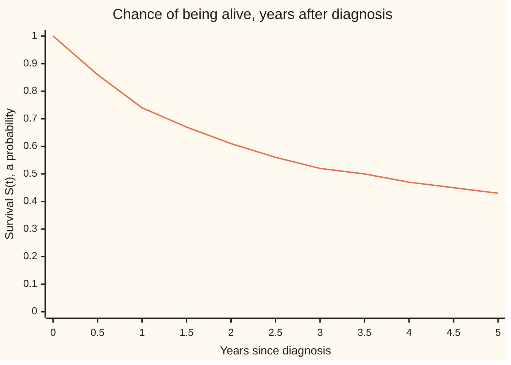
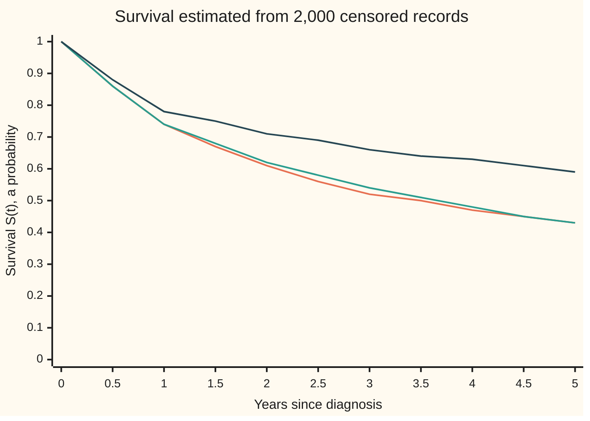

# Survival: the chance of lasting past t, and the hazard that drives it

[Syllabus](../../../SYLLABUS.md) → [Probability and statistics](../README.md) → [Survival, Design and Causality](../README.md#s13) → Survival

---

## General Overview

A hospital follows patients from the day they are diagnosed with one serious cancer. The number doctors quote is five-year survival: the fraction still alive five years after diagnosis. For the cohort on this card, the group of patients it follows, it is 0.4274: about 43 patients in 100.

That number hides a second one. The first year is the dangerous one: among patients alive at its start, deaths run at 0.30 per patient-year, one patient watched for one year. By year four the rate among those still alive has fallen to 0.10. A patient who has already lived two years has a 0.7047 chance of reaching five, far better than the 0.4274 quoted at diagnosis.

The first number is the **survival function**: the chance of being alive past a given time. The second is the **hazard**: the death rate right now, counted only among those still alive. The hazard drives the survival curve; knowing one fixes the other.

Real records add a complication. A trial closes before every patient has lived five years, and some patients move away. For them the record says only "alive when last seen at 2.5 years". Such a record is **censored**: the lifetime is known to exceed a time, not what it is. Throwing it away, or counting it as a death, gives the wrong answer. The hazard gives the right one, because it only ever asks about patients still being watched.

**Survival is the chance of lasting past a time, the hazard is the death rate among those still alive, survival is e to the minus the hazard added up over time, and a censored record counts as time survived with no death.**

**What kind of fact this is:** survival and hazard are definitions; survival equals e to the minus the added-up hazard is a theorem, proved on this card in Why it works; and treating dropouts as uninformative is an assumption about how the study ran, which the records alone cannot confirm.

### The picture: five years after diagnosis



The single line is the survival curve of the cohort's model. It falls steeply in the first year, where the hazard is 0.30 per patient-year, and flattens once the hazard drops to 0.10.

---

## The formula

Notation first, in words. A capital $T$ is a patient's lifetime from diagnosis, in years: a random variable, a quantity settled by chance. A lower-case $t$ is one fixed time. $S(t)$ is the survival function, $f(t)$ the density of $T$ (how thickly deaths are packed near time $t$), $h(t)$ the hazard and $H(t)$ the **cumulative hazard**, the hazard added up from diagnosis to $t$. The bar in $P(A \mid B)$ reads "given".

$$S(t) = P(T > t), \qquad h(t) = \lim_{\Delta \to 0}\frac{P(t < T \le t + \Delta \mid T > t)}{\Delta} = \frac{f(t)}{S(t)}$$

$$H(t) = \int_0^t h(u)\,du, \qquad S(t) = e^{-H(t)}$$

**Read it aloud:** survival is the chance of living past t; the hazard is the chance of dying in the next short while among those alive at t, per unit of time; and survival is e to the minus the hazard piled up so far.

Two helper formulas follow from these. The chance of lasting from one time to a later one, given alive at the first, uses only the hazard in between:

$$P(T > t \mid T > s) = \frac{S(t)}{S(s)} = e^{-[H(t) - H(s)]}$$

And a study that watches each patient for a while, some to death and some not, estimates a constant hazard by deaths over time watched:

$$\hat\lambda = \frac{D}{E} = \frac{\text{deaths seen}}{\text{person-years watched}}$$

The hat marks an estimate made from data.

| Symbol | Plain meaning | In our example | Push it up and the answer… |
| --- | --- | --- | --- |
| $T$ | a patient's lifetime from diagnosis, in years; a random variable | unknown in advance | — |
| $t$, $s$ | fixed times since diagnosis, in years | $t$ = 5, $s$ = 2 | later $t$: survival lower |
| $S(t)$ | survival: the chance of being alive past $t$ | $S(5)$ = 0.4274 | — |
| $f(t)$ | density: deaths per year near $t$, as a share of everyone diagnosed | $f = h \times S$ | — |
| $h(t)$ | hazard: deaths per patient-year among those still alive at $t$ | 0.30 in year 1, 0.10 in year 5 | survival falls faster |
| $H(t)$ | cumulative hazard: the hazard added up from 0 to $t$ | $H(5)$ = 0.85 | survival falls as e to the minus it |
| $\Delta$ | a short slice of time, in years | 0.001 for the hazard limit in Step 1, 0.0001 for the slice product in Step 2, 0.01 in the simulation | smaller: the slice product closes on $e^{-H}$ |
| $q_j$ | the chance of dying during year j, given alive at its start | 0.2592 in year 1 | — |
| $C$ | censoring time: when watching this patient stops | study close or dropout | later: more deaths seen |
| $G(y)$ | the chance that watching has not stopped before $y$: $P(C \ge y)$ | used only in the folded proof of Step 5 | — |
| $Y$, $y$, $\delta$ | the record: $Y$ is the lesser of $T$ and $C$, and $y$ one recorded value of it; $\delta$ is 1 if the death was seen, 0 if censored | $y$ = 2.5 years, $\delta$ = 0 | — |
| $\lambda$ | a hazard that stays constant over time, per year | estimated 0.1423 | survival falls faster |
| $D$, $E$ | deaths seen, and person-years watched | 4 and 28.10 | more deaths: higher rate; more time: lower |

### When it holds

- **No chance concentrated at one instant.** If 5% of patients die on the day of surgery, survival across that day is 1 − 0.05 = 0.9500, not $e^{-0.05}$ = 0.9512. At a jump, survival multiplies by one minus the jump's chance; the exponential covers only the smooth stretches.
- **Survival above zero.** The hazard divides by $S(t)$, so it is defined only while someone can still be alive.
- **Censoring that says nothing about the outlook.** A patient who stops being watched must have the same hazard afterwards as those still watched. If the sickest drop out, the estimate of five-year survival reads 0.5920 against a truth of 0.4270; What breaks shows it.
- **One clock for everyone.** Time counts from diagnosis, not from a calendar date. A patient enrolled two years after diagnosis joins a group already selected for surviving two years, and needs separate handling (delayed entry).

---

## Why it works

### Step 0: surviving five years is surviving each year in turn

A patient alive at five years was alive at the end of year one, then survived year two given alive at its start, and so on. Chances of this chained kind multiply: $P(A \text{ and } B) = P(A)\,P(B \mid A)$, applied four times.

$$S(5) = (1 - q_1)(1 - q_2)(1 - q_3)(1 - q_4)(1 - q_5)$$

Each $q_j$ is the chance of dying in year j among those alive at its start. For the cohort they are 0.2592, 0.1813, 0.1393, 0.0952 and 0.0952. This product is a life table. Cutting time into ever thinner slices turns it into the formula.

### Step 1: the hazard is the per-slice death chance, per unit of time

Take a slice of length $\Delta$ starting at $t$. Among patients alive at $t$, the chance of dying inside the slice is

$$P(t < T \le t + \Delta \mid T > t) = \frac{S(t) - S(t + \Delta)}{S(t)}.$$

The top is the share of all patients who die inside the slice; dividing by $S(t)$ keeps only those still alive. Divide by $\Delta$ and let the slice shrink. The top over $\Delta$ tends to the density $f(t)$, since the density is minus the slope of $S$. So the hazard is $f(t)/S(t)$.

At 1.5 years, with a slice of 0.001 years, the conditional chance divided by the slice length is 0.199980; the year-two hazard is 0.20. A hazard is a rate, deaths per patient-year, not a probability: for a very sick group it can exceed 1 per year, while every chance stays below 1.

### Step 2: add the hazard up and survival falls out

Rearranged, Step 1 says $f(t) = h(t)\,S(t)$: the share of everyone dying near $t$ is the rate among the living times the share still living. Since $f$ is minus the slope of $S$, the slope of $S$ is $-h(t)\,S(t)$. The slope of $\ln S$ is the slope of $S$ divided by $S$, which is $-h(t)$.

Everyone is alive at diagnosis, so $S(0) = 1$ and $\ln S(0) = 0$. Adding up the slope from 0 to $t$ gives $\ln S(t) = -H(t)$, so $S(t) = e^{-H(t)}$. [Weibull and hazards](../04-Continuous%20Distributions/09-weibull-and-hazard-rates.md) already proved this for any lifetime whose density is continuous; the proof below also allows the hazard to jump, as the cohort's does at each anniversary of diagnosis.

The same result comes from Step 0. With slices of length $\Delta$, survival is a product of $1 - h\Delta$ factors. The logarithm of each factor is close to $-h\Delta$, and their sum is close to $-H(t)$. The code multiplies 50,000 slices of 0.0001 years without calling the exponential and gets 0.427411 at five years, against $e^{-0.85}$ = 0.427415.

<details>
<summary>Detailed proof: survival equals e to the minus the cumulative hazard</summary>

Assume $T > 0$ has a density $f$ that is continuous except at finitely many times (the cohort's hazard jumps at each anniversary of diagnosis), and $S(t) > 0$. Then $S(t) = 1 - \int_0^t f(u)\,du$ is continuous, and at every time where $f$ is continuous the fundamental theorem of calculus gives $S'(t) = -f(t)$.

At such a time, $\frac{d}{dt}\ln S(t) = S'(t)/S(t) = -f(t)/S(t) = -h(t)$ by the chain rule. On each stretch between the jump times, $\ln S$ is continuous and has slope $-h$, so its change across the stretch is minus the integral of $h$ over it. Adding the stretches, and using $\ln S(0) = \ln 1 = 0$, gives $\ln S(t) = -\int_0^t h(u)\,du = -H(t)$.

The formula can fail only where the proof used an assumption. If $T$ has a chance sitting at one instant, say 0.05 on the day of surgery, $S$ drops by a factor 1 − 0.05 there; the slope argument never sees the drop, and $e^{-0.05}$ overstates survival across it. If $S(t) = 0$ the hazard is undefined beyond $t$.

For the cohort, $h$ is 0.30, 0.20, 0.15, 0.10 and 0.10 in years one to five, so $H(5)$ is 0.30 + 0.20 + 0.15 + 0.10 + 0.10 = 0.85 and $S(5) = e^{-0.85}$ = 0.4274. Year by year, $1 - q_j = e^{-h}$ in a year of constant hazard, which returns Step 0's life table.

</details>

### Step 3: the past is paid for

Given alive at time $s$, the chance of reaching a later time $t$ is $S(t)/S(s)$, by the definition of a conditional chance: being alive at $t$ already includes being alive at $s$. Both are exponentials, so the ratio is $e^{-[H(t) - H(s)]}$. Only the hazard still ahead counts.

A patient alive at two years faces $0.15 + 0.10 + 0.10 = 0.35$ of cumulative hazard to reach five, so the chance is $e^{-0.35}$ = 0.7047. A constant hazard of 0.17 per year gives the same five-year survival, 0.4274, since $5 \times 0.17 = 0.85$. For it, the two-year survivor's chance is only 0.6005. Equal survival at one time does not mean equal outlooks later: the shape of the hazard decides.

### Step 4: what a censored record says

Each patient has a lifetime $T$ and a censoring time $C$, when watching stops: the study's close, or a move away. The record holds the earlier of the two, $Y$, and a flag $\delta$: 1 if the death was seen, 0 if watching stopped first.

A death seen at $y$ says the patient lived to $y$ and died there. Its contribution to the chance of the records is the density, $f(y) = h(y)\,S(y)$. A censored record at $y$ says only that the patient was alive at $y$. Its contribution is $S(y)$, with no death factor. That is the only honest reading: the lifetime might end one day later or thirty years later.

This needs the censoring to be **independent** of the lifetime: when a patient leaves carries no information about how long they would have lived. The chances of the censoring times then form a separate factor that does not involve the hazard, and it can be set aside.

### Step 5: deaths over time watched

Put the pieces together. Using $S = e^{-H}$, patient i contributes $h(y)^{\delta}\,e^{-H(y)}$, where the power $\delta$ keeps the death factor only for a seen death. The log of the chance of all the records, called the **log-likelihood** ([Maximum likelihood](../07-Sampling%20and%20Estimation/04-maximum-likelihood.md)), is

$$\sum_{\text{deaths}} \ln h(Y) \;-\; \sum_{\text{everyone}} H(Y).$$

Take a constant hazard $\lambda$. Then $H(Y) = \lambda Y$, and the log-likelihood is $D \ln\lambda - \lambda E$: $D$ deaths seen, $E$ the total time watched over all patients. Its slope in $\lambda$ is $D/\lambda - E$, zero at $\hat\lambda = D/E$. Every patient, censored or not, adds to $E$; only seen deaths add to $D$.

The curvature of the log-likelihood at its peak is $-D/\hat\lambda^2$. One over the square root of minus the curvature is the standard error ([Fisher information](../07-Sampling%20and%20Estimation/07-fisher-information-and-cramer-rao.md)), so it is about $\hat\lambda/\sqrt{D}$. Precision grows with deaths seen, not with patients enrolled.

When the hazard changes by year, the log-likelihood splits into one such piece per year. The estimate for year j is deaths in that year over person-years lived in it, and survival is rebuilt as e to the minus their sum. The simulation below does exactly that.

<details>
<summary>Detailed proof: the censored records' chances</summary>

Suppose $T$ and $C$ are independent, $T$ has density $f$ and survival $S$, and $G(y) = P(C \ge y)$. A seen death in a short stretch near $y$ needs $T$ in the stretch and $C \ge T$; by independence its chance is about $f(y)\,G(y)$ times the stretch length. A censoring at $y$ needs $C$ at $y$ and $T > y$; its chance is $P(C \text{ at } y)\,S(y)$.

Over independent patients the chances multiply. Every factor built from $C$ alone, $G(y)$ or $P(C \text{ at } y)$, is the same whatever the hazard, so the hazard that best explains the records maximises $\prod_{\text{deaths}} f(Y) \prod_{\text{censored}} S(Y)$. With $f = hS$ this is $\prod h(Y)^{\delta} e^{-H(Y)}$. If $C$ depends on $T$, the factorisation fails and the $C$-factors no longer drop out.

</details>

The estimate of survival at a time from the records without any model for the hazard, one step at each death, is [Kaplan-Meier](02-kaplan-meier.md). It is Step 0's product with each $q_j$ estimated from the patients still watched.

---

## Worked numbers, by hand

A pilot study watches ten patients. Four deaths are seen, at 0.4, 1.3, 2.1 and 3.6 years. Six records are censored: one patient moved away at 1.0 year, one at 2.5; one, enrolled at diagnosis three years before the study closed, was still alive at the close, 3.0 years; one at 4.2; two reached 5.0 years alive. A constant hazard is assumed, a model choice a pilot this small cannot test.

| Step | Arithmetic | Value |
| --- | --- | --- |
| deaths seen, $D$ | four seen deaths | 4 |
| person-years, $E$ | 0.4 + 1.0 + 1.3 + 2.1 + 2.5 + 3.0 + 3.6 + 4.2 + 5.0 + 5.0 | 28.10 |
| hazard, $\hat\lambda = D/E$ | 4 / 28.10 | 0.1423 per year |
| its standard error | 0.1423 / $\sqrt{4}$ | 0.0712 |
| cumulative hazard at 5 years | 5 × 0.1423 | 0.7117 |
| standard error of five-year survival | $e^{-0.7117}$ × 5 × 0.0712 = 0.4908 × 5 × 0.0712 | 0.1747 |
| **five-year survival** | $e^{-0.7117}$ | **0.4908** (se 0.1747) |

About half the patients are estimated to be alive at five years, and with four deaths the standard error is 0.1747: the pilot cannot tell 30% from 70%. That error is carried over from the rate's error by the delta method ([Delta method](../06-Limit%20Theorems%20in%20Practice/05-delta-method-and-slutsky.md)): survival $e^{-5\lambda}$ moves by 5 × 0.4908 per unit of rate, so its error is that slope times the rate's 0.0712. The code reaches the same rate a second way, by searching for the peak of the log-likelihood patient by patient without the formula $D/E$.

### What breaks if you drop a piece

| Mistake | Five-year survival comes out at | What went wrong |
| --- | --- | --- |
| Censored patients counted as survivors | 0.6000 | Four of them left before five years and might have died later |
| Censored-before-five patients thrown away | 0.3333 | Only the known outcomes remain, and the early deaths are all known |
| Censored records counted as deaths | 0.1687 | The rate becomes 10 / 28.10 = 0.3559, a death for every record |
| Hazard × 5 years read as a chance of death | 0.7117, against a true 0.5092 | A rate over a long stretch overshoots; the chance is 1 − $e^{-H}$ |
| Dropouts who are the sickest (simulation) | 0.5920 (se 0.0141), against a truth of 0.4270 | Independent censoring dropped: the deaths that would show the risk leave the records |

The first four rows come from the pilot's records; the last row drops the independence hypothesis in the 2,000-patient simulation.

### The picture: honest records against leaking ones



Orange: the true survival curve. Green: the estimate from yearly deaths over person-years, with the dropouts independent of the lifetimes; it lies on the truth. Dark blue: the same patients and the same lifetimes, but half of those about to die leave the study half a year before their death. Nothing about the patients changed, only what was recorded, and the estimate drifts upward year after year.

---

## Code, from first principles, and it actually runs

Both scripts take four roads. The closed form $e^{-H}$. A product of 50,000 survived slices that never calls the exponential. The pilot's rate twice: the formula $D/E$, and a golden-section search (a shrinking bracket around the peak) over the log-likelihood summed patient by patient. And 2,000 simulated patients from a SplitMix64 generator with seed 2026: each enters the study at a random time over three years, the study closes at year six, dropouts come at 0.08 per year, and each patient lives slice by slice, dying in a slice of 0.01 years with chance $h \times 0.01$. That generator never uses the survival formula, so the simulation tests it. The simulated truth is 0.4270 rather than 0.4274 because deaths happen in whole slices of 0.01 years; the scripts compute it as the slice product. Simulated numbers carry a standard error, and the asserts allow four of them.

### Python

```python
# Survival functions and hazards -- the check behind the card.  Only math primitives.
# Patients followed from diagnosis.  Model: a hazard of 0.30, 0.20, 0.15, 0.10, 0.10
# deaths per patient-year in years 1 to 5 (0.10 after).  Roads: S = exp(-H); a product
# of survived slices that never calls exp; ten censored records fitted by the formula
# D/E and by a search over the log-likelihood; and 2,000 simulated patients, each
# living slice by slice, observed through entry, dropout and the study's close.
from math import exp, log, sqrt
RATES, W, M64 = [0.30, 0.20, 0.15, 0.10, 0.10], 0.01, (1 << 64) - 1

def h(t):                                   # hazard at age t, in years
    return RATES[min(int(t), 4)]

def H(t, rates=RATES):                      # cumulative hazard: the area under h
    return sum(r * min(max(t - j, 0.0), 1.0) for j, r in enumerate(rates)) + 0.10 * max(t - 5, 0.0)

def slices(t, d):                           # survive each slice of d years in turn
    s = 1.0
    for i in range(round(t / d)):
        s *= 1.0 - h((i + 0.5) * d) * d
    return s

class SplitMix64:                           # the same random numbers in both languages
    def __init__(self, seed):
        self.s = seed
    def uniform(self):                      # strictly between 0 and 1
        self.s = (self.s + 0x9E3779B97F4A7C15) & M64
        z = self.s
        z = ((z ^ (z >> 30)) * 0xBF58476D1CE4E5B9) & M64
        z = ((z ^ (z >> 27)) * 0x94D049BB133111EB) & M64
        return (((z ^ (z >> 31)) >> 11) + 0.5) / 2.0 ** 53

def yearly_rates(recs):                     # deaths / person-years inside each year
    out = []
    for j in range(5):
        d = sum(1 for y, e in recs if e == 1 and j < y <= j + 1)
        ex = sum(min(max(y - j, 0.0), 1.0) for y, _ in recs)
        out.append((d, ex))
    return out

def s_hat(fit, t):                          # survival from the fitted yearly rates
    return exp(-H(min(t, 5.0), [d / ex for d, ex in fit]))

def se_s5(fit):                             # standard error of S(5), by the delta method
    return s_hat(fit, 5) * sqrt(sum(d / ex ** 2 for d, ex in fit))

print("year  hazard  H(t)    S(t)=exp(-H)  slices of 0.0001  one-year death chance q")
for j in range(1, 6):
    print(f"{j:>4}  {RATES[j-1]:.2f}   {H(j):.4f}  {exp(-H(j)):.6f}      {slices(j, 0.0001):.6f}          {1 - exp(-RATES[j-1]):.4f}")
S5 = exp(-H(5))
print(f"hazard limit at t = 1.5: P(die within 0.001 | alive) / 0.001 = {(1 - exp(-H(1.501)) / exp(-H(1.5))) / 0.001:.6f}")
print(f"alive at 2, reaches 5: S(5)/S(2) = {S5 / exp(-H(2)):.6f}; fresh patient S(5) = {S5:.6f}")
FLAT = [0.17] * 5                           # a constant hazard with the same H(5)
print(f"constant 0.17: S(5) = {exp(-H(5, FLAT)):.6f}; alive at 2, reaches 5 = {exp(-H(5, FLAT)) / exp(-H(2, FLAT)):.6f}")
print(f"jump: 5% die on the day of surgery: 1 - 0.05 = {1 - 0.05:.4f}, exp(-0.05) = {exp(-0.05):.4f}")
print("chart, t in years " + " ".join(f"{0.5 * i:.1f}" for i in range(11)))
print("chart, true S(t)   " + " ".join(f"{exp(-H(0.5 * i)):.2f}" for i in range(11)))

# ---- ten patients, a constant hazard fitted to their records ----
TEN = [(0.4, 1), (1.0, 0), (1.3, 1), (2.1, 1), (2.5, 0), (3.0, 0), (3.6, 1), (4.2, 0), (5.0, 0), (5.0, 0)]
D, E = sum(e for _, e in TEN), sum(y for y, _ in TEN)
lam = D / E
def loglik(l):                              # each death gives log h - H(y), each censor - H(y)
    return sum(e * log(l) - l * y for y, e in TEN)
lo, hi = 0.001, 2.0                         # golden-section search for the peak
for _ in range(200):
    a, b = hi - 0.618034 * (hi - lo), lo + 0.618034 * (hi - lo)
    lo, hi = (lo, b) if loglik(a) > loglik(b) else (a, hi)
lam_search = (lo + hi) / 2
print(f"ten patients: deaths D = {D}, person-years E = {E:.2f}")
print(f"  rate D/E = {lam:.6f} per year, se {lam / sqrt(D):.6f}; by log-likelihood search {lam_search:.6f}")
print(f"  S(5) = exp(-5 D/E) = {exp(-5 * lam):.4f} (se {exp(-5 * lam) * 5 * lam / sqrt(D):.4f}); death by 5 = {1 - exp(-5 * lam):.4f}")
known = [e for y, e in TEN if e == 1 or y >= 5]
print(f"wrong: fraction not seen to die          {1 - D / len(TEN):.4f}")
print(f"wrong: drop those censored before 5      {known.count(0) / len(known):.4f}")
print(f"wrong: censored counted as deaths        {exp(-5 * len(TEN) / E):.4f} (rate {len(TEN) / E:.4f})")
print(f"wrong: hazard x 5 years read as a chance {5 * lam:.4f}")

# ---- 2,000 simulated patients: entry over 3 years, study closes at year 6, dropouts ----
g, recs, lives = SplitMix64(2026), [], []
for _ in range(2000):
    close = 6.0 - 3.0 * g.uniform()         # follow-up until the study closes
    c = min(close, -log(g.uniform()) / 0.08)   # dropout at 0.08 per year, whichever first
    t = 99.0                                # alive past year 6
    for i in range(600):                    # live slice by slice: die with chance h * W
        if g.uniform() < h((i + 0.5) * W) * W:
            t = (i + 1) * W
            break
    lives.append(t)
    recs.append((min(t, c), 1 if t <= c else 0))
fit = yearly_rates(recs)
truth = slices(5, W)                        # the simulated patients' exact S(5)
print(f"simulation, 2000 patients, seed 2026: {sum(e for _, e in recs)} deaths seen, {sum(1 - e for _, e in recs)} censored")
for j, (d, ex) in enumerate(fit):
    print(f"  year {j + 1}: deaths {d:>3}, person-years {ex:8.2f}, rate {d / ex:.4f} (se {sqrt(d) / ex:.4f}), true {RATES[j]:.2f}")
alive = sum(1 for t in lives if t > 5) / 2000
print(f"  S(5) from censored records {s_hat(fit, 5):.4f} (se {se_s5(fit):.4f}); truth {truth:.4f}")
print(f"  every lifetime known: fraction alive at 5 = {alive:.4f} (se {sqrt(alive * (1 - alive) / 2000):.4f})")

# ---- informative dropout: half the patients about to die leave half a year before ----
inf = []
for (y, e), t in zip(recs, lives):
    leave = g.uniform() < 0.5
    inf.append((t - 0.5, 0) if e == 1 and t > 0.5 and leave else (y, e))
fit_inf = yearly_rates(inf)
print(f"  informative dropout: S(5) estimate {s_hat(fit_inf, 5):.4f} (se {se_s5(fit_inf):.4f}); truth {truth:.4f}")
print("chart, estimate    " + " ".join(f"{s_hat(fit, 0.5 * i):.2f}" for i in range(11)))
print("chart, informative " + " ".join(f"{s_hat(fit_inf, 0.5 * i):.2f}" for i in range(11)))

assert abs(slices(5, 0.0001) - S5) < 1e-4                  # slice product vs exp(-H)
assert abs(lam_search - lam) < 1e-6                         # search vs the formula D/E
assert abs((1 - exp(-H(1.501)) / exp(-H(1.5))) / 0.001 - RATES[1]) < 1e-3   # slice chance / slice vs h
assert abs(sum(ex for _, ex in yearly_rates(TEN)) - E) < 1e-9     # exposure year by year vs in one sum
assert abs(s_hat(fit, 5) - truth) < 4 * se_s5(fit)          # censored records vs truth
assert abs(alive - truth) < 4 * sqrt(truth * (1 - truth) / 2000)
assert s_hat(fit_inf, 5) - truth > 4 * se_s5(fit_inf)       # informative dropout is biased
print("ALL CHECKS PASS")
```

**Ran 2026-09-29 on macOS, Python 3.14.6, standard library only. All checks passed. Output, pasted from the run:**

```
year  hazard  H(t)    S(t)=exp(-H)  slices of 0.0001  one-year death chance q
   1  0.30   0.3000  0.740818      0.740815          0.2592
   2  0.20   0.5000  0.606531      0.606527          0.1813
   3  0.15   0.6500  0.522046      0.522042          0.1393
   4  0.10   0.7500  0.472367      0.472363          0.0952
   5  0.10   0.8500  0.427415      0.427411          0.0952
hazard limit at t = 1.5: P(die within 0.001 | alive) / 0.001 = 0.199980
alive at 2, reaches 5: S(5)/S(2) = 0.704688; fresh patient S(5) = 0.427415
constant 0.17: S(5) = 0.427415; alive at 2, reaches 5 = 0.600496
jump: 5% die on the day of surgery: 1 - 0.05 = 0.9500, exp(-0.05) = 0.9512
chart, t in years 0.0 0.5 1.0 1.5 2.0 2.5 3.0 3.5 4.0 4.5 5.0
chart, true S(t)   1.00 0.86 0.74 0.67 0.61 0.56 0.52 0.50 0.47 0.45 0.43
ten patients: deaths D = 4, person-years E = 28.10
  rate D/E = 0.142349 per year, se 0.071174; by log-likelihood search 0.142349
  S(5) = exp(-5 D/E) = 0.4908 (se 0.1747); death by 5 = 0.5092
wrong: fraction not seen to die          0.6000
wrong: drop those censored before 5      0.3333
wrong: censored counted as deaths        0.1687 (rate 0.3559)
wrong: hazard x 5 years read as a chance 0.7117
simulation, 2000 patients, seed 2026: 975 deaths seen, 1025 censored
  year 1: deaths 501, person-years  1668.17, rate 0.3003 (se 0.0134), true 0.30
  year 2: deaths 210, person-years  1213.32, rate 0.1731 (se 0.0119), true 0.20
  year 3: deaths 145, person-years   966.74, rate 0.1500 (se 0.0125), true 0.15
  year 4: deaths  73, person-years   655.89, rate 0.1113 (se 0.0130), true 0.10
  year 5: deaths  39, person-years   333.78, rate 0.1168 (se 0.0187), true 0.10
  S(5) from censored records 0.4268 (se 0.0135); truth 0.4270
  every lifetime known: fraction alive at 5 = 0.4335 (se 0.0111)
  informative dropout: S(5) estimate 0.5920 (se 0.0141); truth 0.4270
chart, estimate    1.00 0.86 0.74 0.68 0.62 0.58 0.54 0.51 0.48 0.45 0.43
chart, informative 1.00 0.88 0.78 0.75 0.71 0.69 0.66 0.64 0.63 0.61 0.59
ALL CHECKS PASS
```

The censored records give 0.4268 (se 0.0135) against a truth of 0.4270. The oracle that sees every lifetime, which no real study has, gives 0.4335 (se 0.0111). Year two's estimate is the furthest from its truth, 0.1731 against 0.20, about 2.3 standard errors off, and the others fall within a standard error or so of theirs.

### Rust

Same numbers, same labels, built with `rustc --edition 2021 -O`.

```rust
// Survival functions and hazards -- the same check as the Python, in Rust.  No crates.
// Patients followed from diagnosis.  Model: a hazard of 0.30, 0.20, 0.15, 0.10, 0.10
// deaths per patient-year in years 1 to 5 (0.10 after).  Roads: S = exp(-H); a product
// of survived slices that never calls exp; ten censored records fitted by the formula
// D/E and by a search over the log-likelihood; and 2,000 simulated patients, each
// living slice by slice, observed through entry, dropout and the study's close.
const RATES: [f64; 5] = [0.30, 0.20, 0.15, 0.10, 0.10];
const W: f64 = 0.01;

fn h(t: f64) -> f64 { RATES[(t as usize).min(4)] }          // hazard at age t, in years

fn big_h(t: f64, rates: &[f64]) -> f64 {                     // cumulative hazard: the area under h
    let mut s = 0.10 * (t - 5.0).max(0.0);
    for (j, r) in rates.iter().enumerate() { s += r * (t - j as f64).max(0.0).min(1.0); }
    s
}

fn slices(t: f64, d: f64) -> f64 {                           // survive each slice of d years in turn
    let mut s = 1.0;
    for i in 0..(t / d).round() as usize { s *= 1.0 - h((i as f64 + 0.5) * d) * d; }
    s
}

struct SplitMix64 { s: u64 }                                 // the same random numbers in both languages
impl SplitMix64 {
    fn uniform(&mut self) -> f64 {                           // strictly between 0 and 1
        self.s = self.s.wrapping_add(0x9E3779B97F4A7C15);
        let mut z = self.s;
        z = (z ^ (z >> 30)).wrapping_mul(0xBF58476D1CE4E5B9);
        z = (z ^ (z >> 27)).wrapping_mul(0x94D049BB133111EB);
        (((z ^ (z >> 31)) >> 11) as f64 + 0.5) / 2f64.powi(53)
    }
}

fn yearly_rates(recs: &[(f64, u32)]) -> Vec<(u32, f64)> {   // deaths / person-years inside each year
    (0..5).map(|j| {
        let jf = j as f64;
        let d = recs.iter().filter(|&&(y, e)| e == 1 && jf < y && y <= jf + 1.0).count() as u32;
        let ex: f64 = recs.iter().map(|&(y, _)| (y - jf).max(0.0).min(1.0)).sum();
        (d, ex)
    }).collect()
}

fn s_hat(fit: &[(u32, f64)], t: f64) -> f64 {                // survival from the fitted yearly rates
    let r: Vec<f64> = fit.iter().map(|&(d, ex)| d as f64 / ex).collect();
    (-big_h(t.min(5.0), &r)).exp()
}

fn se_s5(fit: &[(u32, f64)]) -> f64 {                        // standard error of S(5), by the delta method
    s_hat(fit, 5.0) * fit.iter().map(|&(d, ex)| d as f64 / (ex * ex)).sum::<f64>().sqrt()
}

fn row(label: &str, f: impl Fn(f64) -> f64) {
    let v: Vec<String> = (0..11).map(|i| format!("{:.2}", f(0.5 * i as f64))).collect();
    println!("{}{}", label, v.join(" "));
}

fn main() {
    let s_of = |t: f64| (-big_h(t, &RATES)).exp();
    println!("year  hazard  H(t)    S(t)=exp(-H)  slices of 0.0001  one-year death chance q");
    for j in 1..6 {
        let jf = j as f64;
        println!("{:>4}  {:.2}   {:.4}  {:.6}      {:.6}          {:.4}", j, RATES[j - 1], big_h(jf, &RATES),
                 s_of(jf), slices(jf, 0.0001), 1.0 - (-RATES[j - 1]).exp());
    }
    let s5 = s_of(5.0);
    println!("hazard limit at t = 1.5: P(die within 0.001 | alive) / 0.001 = {:.6}", (1.0 - s_of(1.501) / s_of(1.5)) / 0.001);
    println!("alive at 2, reaches 5: S(5)/S(2) = {:.6}; fresh patient S(5) = {:.6}", s5 / s_of(2.0), s5);
    let flat = [0.17f64; 5];                                     // a constant hazard with the same H(5)
    let sf = |t: f64| (-big_h(t, &flat)).exp();
    println!("constant 0.17: S(5) = {:.6}; alive at 2, reaches 5 = {:.6}", sf(5.0), sf(5.0) / sf(2.0));
    println!("jump: 5% die on the day of surgery: 1 - 0.05 = {:.4}, exp(-0.05) = {:.4}", 1.0 - 0.05, (-0.05f64).exp());
    let ts: Vec<String> = (0..11).map(|i| format!("{:.1}", 0.5 * i as f64)).collect();
    println!("chart, t in years {}", ts.join(" "));
    row("chart, true S(t)   ", s_of);

    // ---- ten patients, a constant hazard fitted to their records ----
    let ten: [(f64, u32); 10] = [(0.4, 1), (1.0, 0), (1.3, 1), (2.1, 1), (2.5, 0), (3.0, 0), (3.6, 1), (4.2, 0), (5.0, 0), (5.0, 0)];
    let d = ten.iter().map(|r| r.1).sum::<u32>() as f64;
    let e: f64 = ten.iter().map(|r| r.0).sum();
    let lam = d / e;
    let loglik = |l: f64| ten.iter().map(|&(y, ev)| ev as f64 * l.ln() - l * y).sum::<f64>();
    let (mut lo, mut hi) = (0.001f64, 2.0f64);                  // golden-section search for the peak
    for _ in 0..200 {
        let (a, b) = (hi - 0.618034 * (hi - lo), lo + 0.618034 * (hi - lo));
        if loglik(a) > loglik(b) { hi = b } else { lo = a }
    }
    let lam_search = (lo + hi) / 2.0;
    println!("ten patients: deaths D = {}, person-years E = {:.2}", d, e);
    println!("  rate D/E = {:.6} per year, se {:.6}; by log-likelihood search {:.6}", lam, lam / d.sqrt(), lam_search);
    let s5_ten = (-5.0 * lam).exp();
    println!("  S(5) = exp(-5 D/E) = {:.4} (se {:.4}); death by 5 = {:.4}", s5_ten, s5_ten * 5.0 * lam / d.sqrt(), 1.0 - s5_ten);
    let known: Vec<u32> = ten.iter().filter(|r| r.1 == 1 || r.0 >= 5.0).map(|r| r.1).collect();
    let alive_known = known.iter().filter(|&&x| x == 0).count() as f64 / known.len() as f64;
    println!("wrong: fraction not seen to die          {:.4}", 1.0 - d / 10.0);
    println!("wrong: drop those censored before 5      {:.4}", alive_known);
    println!("wrong: censored counted as deaths        {:.4} (rate {:.4})", (-5.0 * 10.0 / e).exp(), 10.0 / e);
    println!("wrong: hazard x 5 years read as a chance {:.4}", 5.0 * lam);

    // ---- 2,000 simulated patients: entry over 3 years, study closes at year 6, dropouts ----
    let mut g = SplitMix64 { s: 2026 };
    let (mut recs, mut lives): (Vec<(f64, u32)>, Vec<f64>) = (Vec::new(), Vec::new());
    for _ in 0..2000 {
        let close = 6.0 - 3.0 * g.uniform();                     // follow-up until the study closes
        let c = close.min(-g.uniform().ln() / 0.08);              // dropout at 0.08 per year, whichever first
        let mut t = 99.0;                                        // alive past year 6
        for i in 0..600 {                                        // live slice by slice: die with chance h * W
            if g.uniform() < h((i as f64 + 0.5) * W) * W { t = (i + 1) as f64 * W; break; }
        }
        lives.push(t);
        recs.push((t.min(c), if t <= c { 1 } else { 0 }));
    }
    let fit = yearly_rates(&recs);
    let truth = slices(5.0, W);                                  // the simulated patients' exact S(5)
    let seen = recs.iter().map(|r| r.1).sum::<u32>();
    println!("simulation, 2000 patients, seed 2026: {} deaths seen, {} censored", seen, 2000 - seen);
    for (j, &(dj, ex)) in fit.iter().enumerate() {
        println!("  year {}: deaths {:>3}, person-years {:8.2}, rate {:.4} (se {:.4}), true {:.2}",
                 j + 1, dj, ex, dj as f64 / ex, (dj as f64).sqrt() / ex, RATES[j]);
    }
    let alive = lives.iter().filter(|&&t| t > 5.0).count() as f64 / 2000.0;
    println!("  S(5) from censored records {:.4} (se {:.4}); truth {:.4}", s_hat(&fit, 5.0), se_s5(&fit), truth);
    println!("  every lifetime known: fraction alive at 5 = {:.4} (se {:.4})", alive, (alive * (1.0 - alive) / 2000.0).sqrt());

    // ---- informative dropout: half the patients about to die leave half a year before ----
    let mut inf: Vec<(f64, u32)> = Vec::new();
    for (&(y, ev), &t) in recs.iter().zip(lives.iter()) {
        let leave = g.uniform() < 0.5;
        inf.push(if ev == 1 && t > 0.5 && leave { (t - 0.5, 0) } else { (y, ev) });
    }
    let fit_inf = yearly_rates(&inf);
    println!("  informative dropout: S(5) estimate {:.4} (se {:.4}); truth {:.4}", s_hat(&fit_inf, 5.0), se_s5(&fit_inf), truth);
    row("chart, estimate    ", |t| s_hat(&fit, t));
    row("chart, informative ", |t| s_hat(&fit_inf, t));

    assert!((slices(5.0, 0.0001) - s5).abs() < 1e-4);                     // slice product vs exp(-H)
    assert!((lam_search - lam).abs() < 1e-6);                              // search vs the formula D/E
    assert!(((1.0 - s_of(1.501) / s_of(1.5)) / 0.001 - RATES[1]).abs() < 1e-3);  // slice chance / slice vs h
    assert!((yearly_rates(&ten).iter().map(|r| r.1).sum::<f64>() - e).abs() < 1e-9);  // exposure year by year vs in one sum
    assert!((s_hat(&fit, 5.0) - truth).abs() < 4.0 * se_s5(&fit));        // censored records vs truth
    assert!((alive - truth).abs() < 4.0 * (truth * (1.0 - truth) / 2000.0).sqrt());
    assert!(s_hat(&fit_inf, 5.0) - truth > 4.0 * se_s5(&fit_inf));        // informative dropout is biased
    println!("ALL CHECKS PASS");
}
```

**Ran 2026-09-29 on macOS, rustc 1.98.1, no crates. All checks passed. Output, pasted from the run:**

```
year  hazard  H(t)    S(t)=exp(-H)  slices of 0.0001  one-year death chance q
   1  0.30   0.3000  0.740818      0.740815          0.2592
   2  0.20   0.5000  0.606531      0.606527          0.1813
   3  0.15   0.6500  0.522046      0.522042          0.1393
   4  0.10   0.7500  0.472367      0.472363          0.0952
   5  0.10   0.8500  0.427415      0.427411          0.0952
hazard limit at t = 1.5: P(die within 0.001 | alive) / 0.001 = 0.199980
alive at 2, reaches 5: S(5)/S(2) = 0.704688; fresh patient S(5) = 0.427415
constant 0.17: S(5) = 0.427415; alive at 2, reaches 5 = 0.600496
jump: 5% die on the day of surgery: 1 - 0.05 = 0.9500, exp(-0.05) = 0.9512
chart, t in years 0.0 0.5 1.0 1.5 2.0 2.5 3.0 3.5 4.0 4.5 5.0
chart, true S(t)   1.00 0.86 0.74 0.67 0.61 0.56 0.52 0.50 0.47 0.45 0.43
ten patients: deaths D = 4, person-years E = 28.10
  rate D/E = 0.142349 per year, se 0.071174; by log-likelihood search 0.142349
  S(5) = exp(-5 D/E) = 0.4908 (se 0.1747); death by 5 = 0.5092
wrong: fraction not seen to die          0.6000
wrong: drop those censored before 5      0.3333
wrong: censored counted as deaths        0.1687 (rate 0.3559)
wrong: hazard x 5 years read as a chance 0.7117
simulation, 2000 patients, seed 2026: 975 deaths seen, 1025 censored
  year 1: deaths 501, person-years  1668.17, rate 0.3003 (se 0.0134), true 0.30
  year 2: deaths 210, person-years  1213.32, rate 0.1731 (se 0.0119), true 0.20
  year 3: deaths 145, person-years   966.74, rate 0.1500 (se 0.0125), true 0.15
  year 4: deaths  73, person-years   655.89, rate 0.1113 (se 0.0130), true 0.10
  year 5: deaths  39, person-years   333.78, rate 0.1168 (se 0.0187), true 0.10
  S(5) from censored records 0.4268 (se 0.0135); truth 0.4270
  every lifetime known: fraction alive at 5 = 0.4335 (se 0.0111)
  informative dropout: S(5) estimate 0.5920 (se 0.0141); truth 0.4270
chart, estimate    1.00 0.86 0.74 0.68 0.62 0.58 0.54 0.51 0.48 0.45 0.43
chart, informative 1.00 0.88 0.78 0.75 0.71 0.69 0.66 0.64 0.63 0.61 0.59
ALL CHECKS PASS
```

The two outputs match line for line: both languages draw the same numbers from the same generator.

> [!TIP]
> **Try changing**
> Guess first, then run it.
> - **A flat hazard with the same five-year survival.** The line `constant 0.17` already prints it: $S(5)$ = 0.4274 again, but the two-year survivor's chance of reaching five falls from 0.7047 to 0.6005. Survival at one time does not fix the hazard's shape.
> - **More dropouts.** Change the dropout rate `0.08` to `0.30`. Fewer deaths are seen, the standard error of $S(5)$ grows, and the estimate still lands within a few standard errors of 0.4270: independent censoring costs precision, not accuracy.
> - **Milder leaking.** Change the leave chance `0.5` to `0.1`. The upward bias shrinks to under two standard errors, and the last assert stops the run: a small bias hides inside the noise of 2,000 patients, which is why it is dangerous.

---

## The usual mistake

> [!warning]
> **Treating a censored record as an outcome.** "Alive at 2.5 years, then moved away" is neither a survivor at five years nor a death. Counted as a survivor, the pilot's five-year survival reads 0.6000; thrown away, 0.3333; counted as a death, 0.1687. The honest reading, time survived with no death, gives 0.4908.
>
> - **Reading the hazard as a chance.** The pilot's 0.1423 per year times five years is 0.7117, but the chance of death by five years is 0.5092. A rate applied over a long stretch ignores that the living are thinning.
> - **Assuming the censoring is harmless.** The records cannot show whether dropouts were the sick ones. When they were, the estimate read 0.5920 against a truth of 0.4270, with nothing in the data to flag it.
> - **Dividing by patients instead of time.** Four deaths among ten patients is not a rate of 0.4. Rates divide by person-years watched: 4 / 28.10 = 0.1423 per year.
> - **Quoting one number without its error.** Four deaths give a standard error of 0.1747 on five-year survival; the pilot's 0.4908 is a wide guess, not a result.

---

## Where you meet it in real life

- **Cancer statistics.** Five-year survival, and conditional survival for patients who have already lived some years, are the figures behind prognosis. The conditional figures are Step 3.
- **Clinical trials.** Every trial with staggered enrolment and dropouts produces censored records. Comparing two treatments by their hazards is [Cox regression in outline](03-cox-proportional-hazards-in-outline.md); making the comparison fair is [Randomised experiments](04-randomised-experiments-and-ab-tests.md).
- **Life insurance and pensions.** A life table is Step 0's product for a whole population, and the hazard is the force of mortality: [Life tables](../../12-Financial%20mathematics/51-Insurance%20and%20Actuarial%20Mathematics/01-survival-life-tables-and-force-of-mortality.md).
- **Customer churn.** A subscriber still paying when the data were pulled is a censored record; the monthly cancellation rate among current subscribers is a hazard.
- **Reliability.** Machines still running when a test stops are censored in exactly the same way; the Weibull law of [Weibull and hazards](../04-Continuous%20Distributions/09-weibull-and-hazard-rates.md) is one family of hazards.

> **Say it back**
> Survival is the chance of being alive past a time. The hazard is the death rate among those still alive, per unit of time, and survival is e to the minus the hazard added up since the start. The chance of going on from any point uses only the hazard still ahead. A censored record says the patient was alive when watching stopped, so it adds time watched and no death, and a constant hazard is estimated as deaths over person-years. All of it assumes that leaving the study says nothing about how long a patient would have lived.

---

## What this builds on

- [Weibull and hazards](../04-Continuous%20Distributions/09-weibull-and-hazard-rates.md): the hazard and cumulative hazard, survival as a run of survived slices, and the proof that $S = e^{-H}$ for any lifetime whose density is continuous; this card adds hazards that jump, the life table and censored records.

## Where this goes next

- [Kaplan-Meier](02-kaplan-meier.md): survival estimated from censored records with no model for the hazard, one factor at each death.
- [Life tables](../../12-Financial%20mathematics/51-Insurance%20and%20Actuarial%20Mathematics/01-survival-life-tables-and-force-of-mortality.md): the same survival and hazard, read as a population's life table and priced into annuities.

The pilot's answer rested on a constant hazard it could not test; how to read a survival curve off censored records without choosing any hazard at all is what [Kaplan-Meier](02-kaplan-meier.md) answers.

---

## Sources

Verified 2026-09-29: every link below resolves to the publisher's page.

- Kalbfleisch, John D., and Ross L. Prentice. *The Statistical Analysis of Failure Time Data*, 2nd ed. Wiley, 2002. [Publisher page](https://www.wiley.com/en-us/The+Statistical+Analysis+of+Failure+Time+Data%2C+2nd+Edition-p-9780471363576). Survival, hazard and the censored likelihood of Steps 4 and 5.
- Klein, John P., and Melvin L. Moeschberger. *Survival Analysis: Techniques for Censored and Truncated Data*, 2nd ed. Springer, 2003. [DOI 10.1007/b97377](https://doi.org/10.1007/b97377). The survival-hazard relations, including jumps, and delayed entry.
- Aalen, Odd O., Ørnulf Borgan, and Håkon K. Gjessing. *Survival and Event History Analysis*. Springer, 2008. [DOI 10.1007/978-0-387-68560-1](https://doi.org/10.1007/978-0-387-68560-1). Deaths over person-years as the occurrence/exposure rate, and when censoring is independent.
- NIST/SEMATECH. *e-Handbook of Statistical Methods*, section 8.1.2.3, "Failure (or hazard) rate". [NIST page](https://www.itl.nist.gov/div898/handbook/apr/section1/apr123.htm). The hazard as a rate among survivors.
- NIST/SEMATECH. *e-Handbook of Statistical Methods*, section 8.1.3.1, "Censoring". [NIST page](https://www.itl.nist.gov/div898/handbook/apr/section1/apr131.htm). Records cut short by the end of a test.
