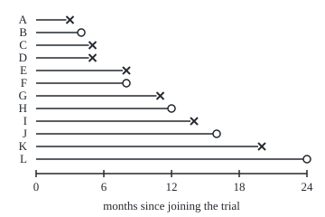
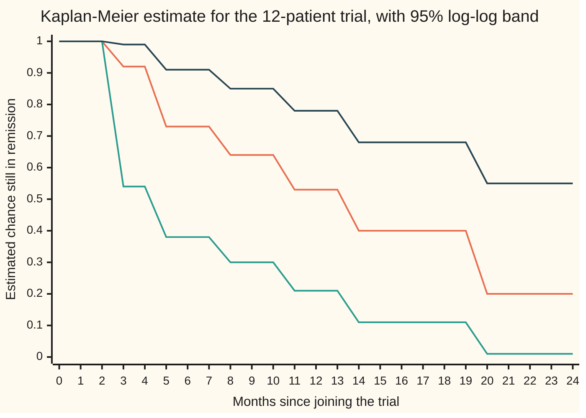

# Kaplan-Meier: a survival curve from data with dropouts

[Syllabus](../../../SYLLABUS.md) → [Probability and statistics](../README.md) → [Survival, Design and Causality](../README.md#s13) → Kaplan-Meier

---

## General Overview

Twelve patients join a two-year trial of a new treatment after their cancer has gone into remission. The question is how long the remission lasts. Seven patients relapse during the study, at 3, 5, 5, 8, 11, 14 and 20 months. The other five leave the study without relapsing: one moves away at month 4, others stop attending at months 8, 12 and 16, and the last is still well when the study closes at month 24. A patient who leaves without the event being seen is a **dropout**; statisticians call the record **censored**, meaning the true relapse time is known only to lie beyond the last visit.

The dropouts are the difficulty. Counting them as relapses says the patient who moved away at month 4 relapsed at month 4, which nobody saw. Deleting them throws away months of relapse-free follow-up. Ignoring the clock and reporting that 5 of 12 were never seen to relapse mixes a patient watched for 4 months with one watched for 24.

The fix, published by Edward Kaplan and Paul Meier in 1958, asks a smaller question at each relapse: of the patients still being watched just before this moment, what share got through it? Multiplying those shares gives the curve, with no shape assumed for it. For this trial it estimates that 40.1% of patients are still in remission at 14 months, with a standard error of 16.4 percentage points, from Major Greenwood's 1926 formula.

**The Kaplan-Meier estimate multiplies, across every relapse time, the share of patients still under watch who got through that time; a dropout counts toward every share until it leaves and never counts as a relapse.**

**What kind of fact this is:** a method. On this card, "Why it works" proves that its product is the best fit to the record (the maximum-likelihood estimate) and that a second algorithm gives the same curve; Greenwood's error bar is an approximation from the delta method, with its error measured by simulation.

### The picture: twelve patients, followed until they relapse or leave

<p align="center"></p>

Each line is one patient, drawn to scale from joining the trial at month 0. A cross marks a relapse; an open circle marks a dropout. Patients E and F both end at month 8, one by relapse and one by dropout.

---

## The formula

Notation first. The sibling card [Survival](01-survival-functions-and-hazards.md) writes $S(t)$ for the **survival function**: the chance that a patient is still relapse-free at time $t$. A hat marks an estimate made from data, so $\hat S(t)$ is the estimate of $S(t)$ from the twelve records. The months at which at least one relapse is seen are listed in order and called $t_j$, where the label j counts them: the first is month 3, the second month 5, and so on. At each one, $r_j$ counts the patients **at risk**: still in the study, relapse-free, just before $t_j$. $d_j$ counts the relapses at $t_j$. The capital pi, $\prod$, means "multiply together", as the capital sigma, $\sum$, means "add together".

$$\hat S(t) \;=\; \prod_{t_j \le t} \left(1 - \frac{d_j}{r_j}\right)$$

**Read it aloud:** the estimated chance of being relapse-free at month t is the product, over every relapse month up to t, of the share of patients at risk who did not relapse that month.

**Greenwood's formula** gives its variance, the square of its standard error:

$$\widehat{\mathrm{Var}}\big(\hat S(t)\big) \;=\; \hat S(t)^2 \sum_{t_j \le t} \frac{d_j}{r_j\,(r_j - d_j)}$$

**Read it aloud:** the squared error is the curve's height squared, times a running sum that adds, at each relapse month, the relapses divided by the number at risk times the number who got through.

| Symbol | Plain meaning | In our example | Push it up and the answer… |
| --- | --- | --- | --- |
| $n$ | patients in the study | 12 | the error bar narrows, roughly like one over the square root of n |
| $t$ | time since joining, in months | 14 | the curve steps down or stays level, never rises |
| $t_j$ | the j-th month at which a relapse is seen | 3, 5, 8, 11, 14, 20 | — |
| $r_j$ | patients at risk just before $t_j$: in the study and relapse-free | 12 at month 3, 4 at month 14 | that month's drop is smaller |
| $d_j$ | relapses seen at $t_j$ | 2 at month 5 | that month's drop is larger |
| $h_j$, $h$ | the true chance of relapsing at $t_j$ for a patient at risk; $d_j/r_j$ estimates it | estimated 1/4 = 0.25 at month 14 | the curve falls further |
| $S(t)$ | true chance of being relapse-free at $t$ | unknown | — |
| $\hat S(t)$ | its Kaplan-Meier estimate | 0.401042 at month 14 | — |
| $\prod$, $\sum$ | multiply together, add together, over the relapse months up to $t$ | — | — |
| $\mathrm{Var}$ | variance: the average squared miss of an estimate | the SE squared | — |
| $\mathrm{SE}$ | standard error, the square root of the variance | 0.163937 at month 14 | — |
| $z$ | the normal quantile for a 95% interval | 1.96 | a wider interval |

A dropout never appears in any $d_j$. It appears in every $r_j$ up to and including the month it leaves. When a relapse and a dropout share a month, as at month 8, the relapse is counted first: the dropout was still under watch that month, so it stays in that month's $r_j$.

The plain 95% **confidence interval** ([Confidence intervals](../08-Confidence%20Intervals%20and%20Tests/01-confidence-intervals.md)) is $\hat S(t)$ plus or minus $z$ standard errors. Some packages, Python's lifelines among them, instead work on the scale of the log of minus the log of $\hat S(t)$ and transform back, which keeps both ends between 0 and 1. Its half-width on that scale is $z$ times the square root of the Greenwood sum, divided by the size of the log of $\hat S(t)$. R's survival package uses the plain log of $\hat S(t)$ by default instead.

### When it holds

- **Dropout unrelated to relapse.** Those who leave at a given month must have the same chance of relapsing later as those who stay, called **independent** or **non-informative censoring**. If sicker patients drop out, the curve is too optimistic: in the simulation below, where half the patients heading for an early relapse leave first, the estimate of a true 0.5 comes out at 0.6879.
- **Watching starts at time zero.** Here time zero is each patient's day of joining. A patient first watched months after time zero enters the risk sets only from then on; counting that patient earlier makes the early denominators too large.
- **Enough patients at risk.** Greenwood's formula is a large-sample approximation. With 2 patients at risk at month 20 the plain interval runs below zero.
- **Only inside the follow-up.** After month 24 nobody is watched, so the flat line beyond the last patient is a drawing convention, not an estimate.

---

## Why it works

### Step 0: survive each month in turn

Being relapse-free at month 14 means getting through every month up to 14. By the multiplication rule for chances ([Conditional probability](../01-Chance%20and%20Events/05-conditional-probability.md)), the chance of getting through them all is the chance of getting through month 1, times the chance of getting through month 2 given month 1, and so on. Each factor is a question about the patients who are still relapse-free at that month.

That is what makes dropouts usable: each factor needs only the patients watched at that moment. The patient who left at month 12 helps answer the questions for months 1 to 12 and is not asked after that.

### Step 1: only relapse months move the curve

Estimate each month's chance of relapse by the share who relapsed among those at risk. In a month with no relapse the share is zero, and the factor is one. So the product keeps only the relapse months, where the factor is one minus relapses over number at risk. Slicing time ever finer adds only more factors of one, which is why Kaplan and Meier called it the **product-limit estimate**.

For the trial, month 5 has 10 patients at risk (12 minus the month-3 relapse and the month-4 dropout) and 2 relapses, so the factor is 0.8. The dropout at month 4 does not move the curve: a dropout ends a line but does not add a step.

### Step 2: each factor is the best fit to the record

A month with no relapse could carry its own unknown chance $h$, but it enters the record's chance only through one factor $1 - h$ for each patient at risk, since all of them get through it, and that product is largest at $h = 0$; so the best fit puts no relapse chance there, and only the relapse months need unknowns. Treat the true chance of relapsing at the j-th relapse month, for someone at risk, as an unknown number $h_j$. Every patient's record then has a chance: a relapse at month 14 needs survival through the earlier relapse months, then a relapse; a dropout at month 12 needs survival through the relapse months up to 12. Collecting the factors that involve $h_j$, the record's chance is proportional to

$$\prod_j h_j^{\,d_j}\,(1 - h_j)^{\,r_j - d_j}.$$

Each factor is the chance of $d_j$ relapses and $r_j - d_j$ survivals among $r_j$ patients, the binomial shape ([Binomial](../03-Discrete%20Distributions/01-bernoulli-and-binomial.md)). Each is largest at $h_j = d_j/r_j$, so the Kaplan-Meier curve is the **maximum-likelihood estimate** ([Maximum likelihood](../07-Sampling%20and%20Estimation/04-maximum-likelihood.md)): the curve under which the record actually seen is most probable. Independent censoring is what lets the dropout terms separate out; the code checks the maximum at all six relapse months by a grid search.

<details>
<summary>Detailed proof: the record's chance factorises and d/r maximises each factor</summary>

Assume dropout time and relapse time are independent. A patient who relapses at $t_j$ contributes, for each earlier relapse month, one minus that month's $h$, then $h_j$, times the chance of not having dropped out by $t_j$. A patient who drops out at month c contributes a factor $1-h_j$ for every relapse month $t_j$ up to and including c, times the chance of dropping out at c. The dropout chances contain no $h$, so they form a separate factor that does not affect where the maximum in $h$ lies.

Now count, for one relapse month $t_j$, how often $h_j$ and $1-h_j$ appear. $h_j$ appears once per relapse at $t_j$: $d_j$ times. $1 - h_j$ appears once for every patient who is still at risk at $t_j$ and gets through it, relapsing later or dropping out at or after $t_j$: $r_j - d_j$ times. Multiplying over patients gives the product above.

Take logs of one factor: $d \ln h + (r - d)\ln(1-h)$. Its derivative in h is $d/h - (r-d)/(1-h)$, which equals $(d - rh)/(h(1-h))$. That is positive for h below $d/r$ and negative above, so $d/r$ is the unique maximum when $0 < d < r$. If $d = r$ the factor $h^r$ is largest at $h = 1$, which is again $d/r$. The factors involve different unknowns, so the product is largest when each factor is. Substituting $h_j = d_j/r_j$ into $S = \prod (1 - h_j)$ gives the Kaplan-Meier estimate.

</details>

### Step 3: a second road, redistribute to the right

Bradley Efron gave a different algorithm in 1967. Give each of the 12 patients an equal share, one twelfth, of the whole group. When a patient drops out, the share is not lost: it is split equally among everyone whose time comes later, since under independent censoring the dropout's future looks like theirs. When a patient relapses, the share is spent. The estimated survival at month t is one minus the shares spent by then.

At month 4 the dropout's twelfth is split among the 10 patients still ahead. At month 5 two of them relapse and spend their enlarged shares; one minus everything spent so far is 0.733333, the same as the product. The code finds the two roads agree at every relapse month to the last binary digit.

<details>
<summary>Detailed proof: redistribution gives the product</summary>

Claim: just before each time, every patient still at risk holds the same share, equal to the current survival estimate divided by the number at risk, $S/r$. At the start every share is $1/n$ and $S = 1$, so the claim holds. A relapse month with d relapses spends $d \cdot S/r$, leaving $S(1 - d/r)$ with the $r - d$ survivors, each still holding $S/r$. A dropout's equal share is split equally among the patients after it, so they remain equal to each other, and the total held by the patients at risk is unchanged; the number at risk falls by one, so each share becomes the unchanged total divided by the new count. Both moves keep the claim, and the relapse move multiplies the remaining total by $1 - d/r$: exactly the Kaplan-Meier factor.

</details>

### Step 4: Greenwood's error bar

Take logs, so the product becomes a sum: $\ln \hat S(t) = \sum \ln(1 - d_j/r_j)$. Given who is at risk, $d_j$ behaves like a binomial count out of $r_j$ with chance $h_j$, so the estimated chance $d_j/r_j$ has variance $h_j(1-h_j)/r_j$. The **delta method** ([Delta method](../06-Limit%20Theorems%20in%20Practice/05-delta-method-and-slutsky.md)) carries that through the log: the variance is multiplied by the slope squared, $1/(1-h_j)^2$, which leaves $h_j/(r_j(1-h_j))$. Putting in $d_j/r_j$ for $h_j$ gives $d_j/(r_j(r_j - d_j))$, one term of the Greenwood sum.

The terms at different months are added as if they were independent. They are not quite: the number at risk depends on what happened earlier. But each month's relapse count, given the past, is a fresh draw with average zero error, and errors of that kind are uncorrelated. The proof of that step uses martingales, which belong to wing 11. A second use of the delta method returns from the log to the curve itself: the variance of $\hat S$ is about $\hat S^2$ times the variance of $\ln \hat S$.

<details>
<summary>The algebra of the delta-method steps</summary>

For one factor, with $\hat h = d/r$ and true chance h: $\mathrm{Var}(\hat h) = h(1-h)/r$. The slope of $\ln(1 - x)$ at $x = h$ is $-1/(1-h)$, so $\mathrm{Var}(\ln(1 - \hat h)) \approx h(1-h)/(r(1-h)^2) = h/(r(1-h))$. With $h = d/r$ this is $(d/r)/(r - d) = d/(r(r-d))$. Summing over relapse months gives $\mathrm{Var}(\ln \hat S)$. The slope of $e^x$ at $x = \ln S$ is S, so $\mathrm{Var}(\hat S) \approx S^2\,\mathrm{Var}(\ln \hat S)$, Greenwood's formula.

</details>

The code tests the approximation where it can be tested: in 4,000 simulated trials of 60 patients, the spread of the estimate across trials is 0.0700 and the average Greenwood standard error is 0.0692.

---

## Worked numbers, by hand

The whole trial, one row per month at which anything happens.

| Month | At risk | Relapses | Dropouts | Factor | Estimate | Greenwood sum | SE |
| --- | --- | --- | --- | --- | --- | --- | --- |
| 3 | 12 | 1 | 0 | 11/12 = 0.9167 | 0.9167 | 0.007576 | 0.0798 |
| 4 | 11 | 0 | 1 | 1 | 0.9167 | 0.007576 | 0.0798 |
| 5 | 10 | 2 | 0 | 8/10 = 0.8000 | 0.7333 | 0.032576 | 0.1324 |
| 8 | 8 | 1 | 1 | 7/8 = 0.8750 | 0.6417 | 0.050433 | 0.1441 |
| 11 | 6 | 1 | 0 | 5/6 = 0.8333 | 0.5347 | 0.083766 | 0.1548 |
| 12 | 5 | 0 | 1 | 1 | 0.5347 | 0.083766 | 0.1548 |
| 14 | 4 | 1 | 0 | 3/4 = 0.7500 | **0.4010** | 0.167100 | **0.1639** |
| 16 | 3 | 0 | 1 | 1 | 0.4010 | 0.167100 | 0.1639 |
| 20 | 2 | 1 | 0 | 1/2 = 0.5000 | 0.2005 | 0.667100 | 0.1638 |
| 24 | 1 | 0 | 1 | 1 | 0.2005 | 0.667100 | 0.1638 |

At month 14 the estimate is $0.401042$, exactly $77/192$. Its Greenwood sum is $1/132 + 2/80 + 1/56 + 1/30 + 1/12$, and its standard error is 0.163937. The plain 95% interval is 0.0797 to 0.7224; the log-log interval is 0.1113 to 0.6837.

About 4 in 10 patients are estimated to be still in remission at 14 months. The interval is wide: the method behind it covers the true value in about 95% of trials, and here anything from about 1 in 9 to about 2 in 3 fits the record. The curve first falls to 0.5 or below at month 14, so the estimated median time in remission is 14 months; but the log-log band contains 0.5 at every month from 5 to 24, so the record cannot pin the median down to better than "month 5 or later".

### The curve and its band



Orange: the Kaplan-Meier estimate, read at each whole month; it is a staircase that steps down at 3, 5, 8, 11, 14 and 20 months (joining month-end values draws each step as a one-month slope). Green: the lower end of the 95% log-log interval. Dark blue: the upper end. The band is wide throughout: twelve patients carry little information.

### What breaks if you drop a piece

| Mistake | Comes out at | What went wrong |
| --- | --- | --- |
| Count each dropout as a relapse | S(14) = 0.250000 | Five invented relapses; the curve is too low |
| Delete the dropouts | S(14) = 0.142857 | The long relapse-free follow-ups are thrown away, so the 7 who relapsed make up the whole sample |
| Ignore the clock | 0.416667 never seen to relapse | A share with no time attached: 4 months and 24 months weigh the same |
| Remove the month-8 dropout before the month-8 relapse | S(8) = 0.628571, right 0.641667 | The dropout was still under watch that month and belongs in its risk set |
| Plain interval at month 20 | −0.1205 to 0.5215 | A chance below zero: the plain interval ignores the 0-to-1 boundary; log-log gives 0.0129 to 0.5525 |

Both of the first two errors push the curve down, and not only here: with a true value of 0.5 at month 12, counting dropouts as relapses averages 0.3760 and deleting them averages 0.2660, while Kaplan-Meier averages 0.5007.

---

## Code, from first principles, and it actually runs

The code builds the curve by two independent roads: the product over risk sets, and Efron's redistribute-to-the-right, which never forms a ratio of relapses to patients at risk. A third road finds each month's best-fitting chance of relapse by a grid search over a thousand values. A fourth runs 4,000 simulated trials of 60 patients whose true relapse times follow an exponential law with a median of 12 months, so the true S(12) is 0.5; dropout times are drawn uniformly over 48 months and the study stops at 24. It checks that Kaplan-Meier centres on 0.5 and that Greenwood's standard error matches the real spread. Every random draw comes from SplitMix64, a small generator written out in both languages with seed 2026, so the two programs draw identical numbers.

### Python

```python
# Kaplan-Meier -- the check behind the card.  Standard library only.  Nothing
# imported knows the answer: the curve is built two ways (a product over risk
# sets, and Efron's redistribute-to-the-right), the error bar two ways (the
# Greenwood sum, and the spread across simulated trials), and every random
# draw comes from SplitMix64, written out, with a stated seed.
from math import log, exp, sqrt

# the trial: months to relapse (1) or to dropout (0), 12 patients
TRIAL = [(3, 1), (4, 0), (5, 1), (5, 1), (8, 1), (8, 0), (11, 1), (12, 0),
         (14, 1), (16, 0), (20, 1), (24, 0)]
Z = 1.96                                     # the normal quantile for a 95% interval

def km(data, dropout_first=False):
    # road 1: at each time, d relapses among r still followed; multiply (1 - d/r)
    pts = sorted(data, key=lambda p: (p[0], p[1] if dropout_first else -p[1]))
    rows, s, g, r, i = [], 1.0, 0.0, len(pts), 0
    while i < len(pts):
        t, j = pts[i][0], i
        while j < len(pts) and pts[j][0] == t:
            j += 1
        d = sum(e for _, e in pts[i:j]); c = j - i - d
        rr = r - c if dropout_first else r   # the wrong tie rule drops the leavers first
        if d:
            s *= 1.0 - d / rr
            g += d / (rr * (rr - d)) if rr > d else 0.0
        rows.append((t, r, d, c, s, g))
        r -= j - i; i = j
    return rows

def at(rows, t):                             # the curve's height at month t
    out = (1.0, 0.0)
    for u, _, _, _, s, g in rows:
        if u <= t: out = (s, g)
    return out

def redistribute(data):
    # road 2 (Efron 1967): each patient holds 1/n of the curve; a dropout hands
    # its share, equally, to everyone after it in time order (relapses first at a tie)
    pts = sorted(data, key=lambda p: (p[0], -p[1]))
    w = [1.0 / len(pts)] * len(pts)
    for i, (t, e) in enumerate(pts):
        if e == 0 and i + 1 < len(pts):
            share = w[i] / (len(pts) - i - 1)
            for j in range(i + 1, len(pts)): w[j] += share
            w[i] = 0.0
    return {t: 1.0 - sum(w[k] for k, (u, e) in enumerate(pts) if e == 1 and u <= t)
            for t, e in pts if e == 1}

def loglog_band(s, g):                       # 95% interval on the log(-log S) scale
    if s >= 1.0 or s <= 0.0: return (s, s)
    w = Z * sqrt(g) / abs(log(s))
    return (s ** exp(w), s ** exp(-w))

class SplitMix64:
    def __init__(self, seed): self.x = seed
    def next(self):
        self.x = (self.x + 0x9E3779B97F4A7C15) & 0xFFFFFFFFFFFFFFFF
        z = self.x
        z = ((z ^ (z >> 30)) * 0xBF58476D1CE4E5B9) & 0xFFFFFFFFFFFFFFFF
        z = ((z ^ (z >> 27)) * 0x94D049BB133111EB) & 0xFFFFFFFFFFFFFFFF
        return z ^ (z >> 31)
    def uniform(self): return (self.next() >> 11) * 2.0 ** -53

rows = km(TRIAL)
print("month at_risk relapses dropouts  factor   S_hat  greenwood_sum      SE")
for t, r, d, c, s, g in rows:
    print(f"{t:5d} {r:7d} {d:8d} {c:8d} {1 - d / r:7.4f} {s:7.4f} {g:14.6f} {s * sqrt(g):7.4f}")
eff = redistribute(TRIAL)
gap = max(abs(eff[t] - at(rows, t)[0]) for t in eff)
print("road 2, redistribute-to-the-right:", " ".join(f"{eff[t]:.6f}" for t in sorted(eff)))
print(f"road 2, largest gap to road 1: {gap:.12f}")
best = []                                    # road 3: grid search of each factor h^d (1-h)^(r-d)
for t, r, d, c, s, g in rows:
    if d:
        ll = lambda h: d * log(h) + (r - d) * log(1 - h)
        best.append((max(range(1, 1000), key=lambda k: ll(k / 1000)) / 1000, d / r))
print("road 3, grid argmax vs d/r:", " ".join(f"{a:.3f}/{b:.3f}" for a, b in best))
s14, g14 = at(rows, 14); s20, g20 = at(rows, 20)
for t, s, g in ((14, s14, g14), (20, s20, g20)):
    lo, hi = loglog_band(s, g)
    print(f"S({t}) = {s:.6f}  SE {s * sqrt(g):.6f}  plain 95%: {s - Z * s * sqrt(g):.4f} to "
          f"{s + Z * s * sqrt(g):.4f}  log-log 95%: {lo:.4f} to {hi:.4f}")
print(f"median relapse-free time: {min(t for t, *_, s, g in rows if s <= 0.5)} months")

# ---- what breaks ----
print(f"wrong: dropouts counted as relapses, S(14) = {at(km([(t, 1) for t, e in TRIAL]), 14)[0]:.6f}")
print(f"wrong: dropouts deleted, S(14) = {at(km([p for p in TRIAL if p[1]]), 14)[0]:.6f}")
print(f"wrong: no clock, share never seen to relapse = {sum(1 - e for _, e in TRIAL) / 12:.6f}")
wt = km(TRIAL, dropout_first=True)
print(f"wrong: dropout removed before the month-8 relapse, S(8) = {at(wt, 8)[0]:.6f}, S(14) = {at(wt, 14)[0]:.6f}")

# ---- road 4: 4000 simulated trials, 60 patients each, true S(12) = 0.5 ----
rng, TRIALS, N, LAM = SplitMix64(2026), 4000, 60, log(2.0) / 12.0
sums = {"km": [0.0, 0.0], "se": [0.0, 0.0], "all": [0.0, 0.0], "del": [0.0, 0.0], "inf": [0.0, 0.0]}
for _ in range(TRIALS):
    fair, sick = [], []
    for _ in range(N):
        tt = -log(1.0 - rng.uniform()) / LAM          # true relapse month, median 12
        cc = min(48.0 * rng.uniform(), 24.0)          # dropout month, study stops at 24
        c2 = min(cc, tt / 2) if (rng.uniform() < 0.5 and tt < 12.0) else cc
        fair.append((min(tt, cc), 1 if tt <= cc else 0))
        sick.append((min(tt, c2), 1 if tt <= c2 else 0))
    s, g = at(km(fair), 12)
    vals = {"km": s, "se": s * sqrt(g), "all": at(km([(t, 1) for t, e in fair]), 12)[0],
            "del": at(km([p for p in fair if p[1]]), 12)[0], "inf": at(km(sick), 12)[0]}
    for k, v in vals.items():
        sums[k][0] += v; sums[k][1] += v * v
mean = {k: a / TRIALS for k, (a, b) in sums.items()}
sd = {k: sqrt(b / TRIALS - mean[k] ** 2) for k, (a, b) in sums.items()}
mc = sd["km"] / sqrt(TRIALS)
print(f"sim: mean S_hat(12) = {mean['km']:.4f} (MC SE {mc:.4f}), truth 0.5000")
print(f"sim: spread of S_hat(12) across trials = {sd['km']:.4f}, mean Greenwood SE = {mean['se']:.4f}")
print(f"sim wrong: dropouts as relapses {mean['all']:.4f}, dropouts deleted {mean['del']:.4f}, "
      f"sick patients leave early {mean['inf']:.4f}")

# ---- try changing ----
alt = [(4, 1) if p == (4, 0) else p for p in TRIAL]
dbl = at(km(TRIAL + TRIAL), 14)
print(f"try: month-4 dropout relapses instead, S(14) = {at(km(alt), 14)[0]:.6f}")
print(f"try: every record doubled, S(14) = {dbl[0]:.6f}, SE {dbl[0] * sqrt(dbl[1]):.6f}")
print(f"try: last patient relapses at 24, S(24) = {at(km(TRIAL[:-1] + [(24, 1)]), 24)[0]:.6f}")

# ---- chart and figure points ----
band = [loglog_band(*at(rows, m)) for m in range(25)]
print("chart, S_hat  ", " ".join(f"{at(rows, m)[0]:.2f}" for m in range(25)))
print("chart, lower  ", " ".join(f"{lo:.2f}" for lo, hi in band))
print("chart, upper  ", " ".join(f"{hi:.2f}" for lo, hi in band))
print("figure, x = 40 + 12.5 * month; line ends:", " ".join(f"{40 + 12.5 * t:g}" for t, e in TRIAL))

assert gap < 1e-12, "redistribute-to-the-right must give the product-limit curve"
assert abs(s14 - 77 / 192) < 1e-12 and abs(s20 - 77 / 384) < 1e-12, "hand fractions 77/192 and 77/384"
assert abs(g14 - (1/132 + 2/80 + 1/56 + 1/30 + 1/12)) < 1e-12, "Greenwood sum from the hand table"
assert all(abs(a - b) < 0.0006 for a, b in best), "each factor peaks at d/r"
assert abs(mean["km"] - 0.5) < 4 * mc, "Kaplan-Meier centred on the true S(12)"
assert abs(mean["se"] / sd["km"] - 1) < 0.05, "Greenwood SE matches the real spread"
assert mean["inf"] - 0.5 > 4 * sd["inf"] / sqrt(TRIALS), "informative dropout must bias the curve up"
print("ALL CHECKS PASS")
```

**Ran 2026-09-29 on macOS, Python 3.14.6, standard library only. All checks passed. Output, pasted from the run:**

```
month at_risk relapses dropouts  factor   S_hat  greenwood_sum      SE
    3      12        1        0  0.9167  0.9167       0.007576  0.0798
    4      11        0        1  1.0000  0.9167       0.007576  0.0798
    5      10        2        0  0.8000  0.7333       0.032576  0.1324
    8       8        1        1  0.8750  0.6417       0.050433  0.1441
   11       6        1        0  0.8333  0.5347       0.083766  0.1548
   12       5        0        1  1.0000  0.5347       0.083766  0.1548
   14       4        1        0  0.7500  0.4010       0.167100  0.1639
   16       3        0        1  1.0000  0.4010       0.167100  0.1639
   20       2        1        0  0.5000  0.2005       0.667100  0.1638
   24       1        0        1  1.0000  0.2005       0.667100  0.1638
road 2, redistribute-to-the-right: 0.916667 0.733333 0.641667 0.534722 0.401042 0.200521
road 2, largest gap to road 1: 0.000000000000
road 3, grid argmax vs d/r: 0.083/0.083 0.200/0.200 0.125/0.125 0.167/0.167 0.250/0.250 0.500/0.500
S(14) = 0.401042  SE 0.163937  plain 95%: 0.0797 to 0.7224  log-log 95%: 0.1113 to 0.6837
S(20) = 0.200521  SE 0.163778  plain 95%: -0.1205 to 0.5215  log-log 95%: 0.0129 to 0.5525
median relapse-free time: 14 months
wrong: dropouts counted as relapses, S(14) = 0.250000
wrong: dropouts deleted, S(14) = 0.142857
wrong: no clock, share never seen to relapse = 0.416667
wrong: dropout removed before the month-8 relapse, S(8) = 0.628571, S(14) = 0.392857
sim: mean S_hat(12) = 0.5007 (MC SE 0.0011), truth 0.5000
sim: spread of S_hat(12) across trials = 0.0700, mean Greenwood SE = 0.0692
sim wrong: dropouts as relapses 0.3760, dropouts deleted 0.2660, sick patients leave early 0.6879
try: month-4 dropout relapses instead, S(14) = 0.364583
try: every record doubled, S(14) = 0.401042, SE 0.115921
try: last patient relapses at 24, S(24) = 0.000000
chart, S_hat   1.00 1.00 1.00 0.92 0.92 0.73 0.73 0.73 0.64 0.64 0.64 0.53 0.53 0.53 0.40 0.40 0.40 0.40 0.40 0.40 0.20 0.20 0.20 0.20 0.20
chart, lower   1.00 1.00 1.00 0.54 0.54 0.38 0.38 0.38 0.30 0.30 0.30 0.21 0.21 0.21 0.11 0.11 0.11 0.11 0.11 0.11 0.01 0.01 0.01 0.01 0.01
chart, upper   1.00 1.00 1.00 0.99 0.99 0.91 0.91 0.91 0.85 0.85 0.85 0.78 0.78 0.78 0.68 0.68 0.68 0.68 0.68 0.68 0.55 0.55 0.55 0.55 0.55
figure, x = 40 + 12.5 * month; line ends: 77.5 90 102.5 102.5 140 140 177.5 190 215 240 290 340
ALL CHECKS PASS
```

### Rust

```rust
// Kaplan-Meier -- the same check as kaplan_meier_check.py, in Rust.  Std only,
// no crates.  The curve is built two ways (a product over risk sets, and
// Efron's redistribute-to-the-right), the error bar two ways (the Greenwood
// sum, and the spread across simulated trials); SplitMix64 draws the numbers.

const TRIAL: [(f64, u32); 12] = [(3.0, 1), (4.0, 0), (5.0, 1), (5.0, 1), (8.0, 1), (8.0, 0),
    (11.0, 1), (12.0, 0), (14.0, 1), (16.0, 0), (20.0, 1), (24.0, 0)];
const Z: f64 = 1.96; // the normal quantile for a 95% interval

// one row per distinct time: (month, at risk, relapses, dropouts, S_hat, Greenwood sum)
type Row = (f64, usize, usize, usize, f64, f64);

fn km(data: &[(f64, u32)], dropout_first: bool) -> Vec<Row> {
    // road 1: at each time, d relapses among r still followed; multiply (1 - d/r)
    let mut pts = data.to_vec();
    pts.sort_by(|a, b| a.0.partial_cmp(&b.0).unwrap().then(
        if dropout_first { a.1.cmp(&b.1) } else { b.1.cmp(&a.1) }));
    let (mut rows, mut s, mut g, mut r, mut i) = (Vec::new(), 1.0_f64, 0.0_f64, pts.len(), 0);
    while i < pts.len() {
        let (t, mut j) = (pts[i].0, i);
        while j < pts.len() && pts[j].0 == t { j += 1; }
        let d = pts[i..j].iter().filter(|p| p.1 == 1).count(); let c = j - i - d;
        let rr = if dropout_first { r - c } else { r }; // the wrong tie rule drops the leavers first
        if d > 0 {
            s *= 1.0 - d as f64 / rr as f64;
            if rr > d { g += d as f64 / (rr as f64 * (rr - d) as f64); }
        }
        rows.push((t, r, d, c, s, g));
        r -= j - i; i = j;
    }
    rows
}

fn at(rows: &[Row], t: f64) -> (f64, f64) { // the curve's height at month t
    let mut out = (1.0, 0.0);
    for row in rows { if row.0 <= t { out = (row.4, row.5); } }
    out
}

fn redistribute(data: &[(f64, u32)]) -> Vec<(f64, f64)> {
    // road 2 (Efron 1967): each patient holds 1/n of the curve; a dropout hands
    // its share, equally, to everyone after it in time order (relapses first at a tie)
    let mut pts = data.to_vec();
    pts.sort_by(|a, b| a.0.partial_cmp(&b.0).unwrap().then(b.1.cmp(&a.1)));
    let n = pts.len(); let mut w = vec![1.0 / n as f64; n];
    for i in 0..n {
        if pts[i].1 == 0 && i + 1 < n {
            let share = w[i] / (n - i - 1) as f64;
            for j in i + 1..n { w[j] += share; }
            w[i] = 0.0;
        }
    }
    let mut out: Vec<(f64, f64)> = Vec::new();
    for &(t, e) in &pts {
        if e == 1 && out.last().map_or(true, |o| o.0 != t) {
            let lost = (0..n).filter(|&k| pts[k].1 == 1 && pts[k].0 <= t).fold(0.0, |a, k| a + w[k]);
            out.push((t, 1.0 - lost));
        }
    }
    out
}

fn loglog_band(s: f64, g: f64) -> (f64, f64) { // 95% interval on the log(-log S) scale
    if s >= 1.0 || s <= 0.0 { return (s, s); }
    let w = Z * g.sqrt() / s.ln().abs();
    (s.powf(w.exp()), s.powf((-w).exp()))
}

struct SplitMix64(u64);
impl SplitMix64 {
    fn next(&mut self) -> u64 {
        self.0 = self.0.wrapping_add(0x9E3779B97F4A7C15);
        let mut z = self.0;
        z = (z ^ (z >> 30)).wrapping_mul(0xBF58476D1CE4E5B9);
        z = (z ^ (z >> 27)).wrapping_mul(0x94D049BB133111EB);
        z ^ (z >> 31)
    }
    fn uniform(&mut self) -> f64 { (self.next() >> 11) as f64 * 2.0_f64.powi(-53) }
}

fn all_relapse(d: &[(f64, u32)]) -> Vec<(f64, u32)> { d.iter().map(|p| (p.0, 1)).collect() }
fn deleted(d: &[(f64, u32)]) -> Vec<(f64, u32)> { d.iter().copied().filter(|p| p.1 == 1).collect() }

fn main() {
    let rows = km(&TRIAL, false);
    println!("month at_risk relapses dropouts  factor   S_hat  greenwood_sum      SE");
    for &(t, r, d, c, s, g) in &rows {
        println!("{:5} {:7} {:8} {:8} {:7.4} {:7.4} {:14.6} {:7.4}",
                 t, r, d, c, 1.0 - d as f64 / r as f64, s, g, s * g.sqrt());
    }
    let eff = redistribute(&TRIAL);
    let gap = eff.iter().map(|&(t, v)| (v - at(&rows, t).0).abs()).fold(0.0, f64::max);
    let list: Vec<String> = eff.iter().map(|e| format!("{:.6}", e.1)).collect();
    println!("road 2, redistribute-to-the-right: {}", list.join(" "));
    println!("road 2, largest gap to road 1: {:.12}", gap);
    let mut best: Vec<(f64, f64)> = Vec::new(); // road 3: grid search of each factor h^d (1-h)^(r-d)
    for &(_, r, d, _, _, _) in &rows {
        if d == 0 { continue; }
        let ll = |h: f64| d as f64 * h.ln() + (r - d) as f64 * (1.0 - h).ln();
        let mut k_best = 1; for k in 2..1000 { if ll(k as f64 / 1000.0) > ll(k_best as f64 / 1000.0) { k_best = k; } }
        best.push((k_best as f64 / 1000.0, d as f64 / r as f64));
    }
    let bl: Vec<String> = best.iter().map(|(a, b)| format!("{:.3}/{:.3}", a, b)).collect();
    println!("road 3, grid argmax vs d/r: {}", bl.join(" "));
    let ((s14, g14), (s20, g20)) = (at(&rows, 14.0), at(&rows, 20.0));
    for (t, s, g) in [(14, s14, g14), (20, s20, g20)] {
        let (lo, hi) = loglog_band(s, g);
        println!("S({}) = {:.6}  SE {:.6}  plain 95%: {:.4} to {:.4}  log-log 95%: {:.4} to {:.4}",
                 t, s, s * g.sqrt(), s - Z * s * g.sqrt(), s + Z * s * g.sqrt(), lo, hi);
    }
    let median = rows.iter().find(|r| r.4 <= 0.5).unwrap().0;
    println!("median relapse-free time: {} months", median);
    // ---- what breaks ----
    println!("wrong: dropouts counted as relapses, S(14) = {:.6}", at(&km(&all_relapse(&TRIAL), false), 14.0).0);
    println!("wrong: dropouts deleted, S(14) = {:.6}", at(&km(&deleted(&TRIAL), false), 14.0).0);
    let never = TRIAL.iter().filter(|p| p.1 == 0).count() as f64 / 12.0;
    println!("wrong: no clock, share never seen to relapse = {:.6}", never);
    let wt = km(&TRIAL, true);
    println!("wrong: dropout removed before the month-8 relapse, S(8) = {:.6}, S(14) = {:.6}",
             at(&wt, 8.0).0, at(&wt, 14.0).0);
    // ---- road 4: 4000 simulated trials, 60 patients each, true S(12) = 0.5 ----
    let (mut rng, trials, n, lam) = (SplitMix64(2026), 4000, 60, 2.0_f64.ln() / 12.0);
    let mut sums = [[0.0_f64; 2]; 5]; // km, se, all, del, inf
    for _ in 0..trials {
        let (mut fair, mut sick) = (Vec::new(), Vec::new());
        for _ in 0..n {
            let tt = -(1.0 - rng.uniform()).ln() / lam; // true relapse month, median 12
            let cc = (48.0 * rng.uniform()).min(24.0);  // dropout month, study stops at 24
            let c2 = if rng.uniform() < 0.5 && tt < 12.0 { cc.min(tt / 2.0) } else { cc };
            fair.push((tt.min(cc), if tt <= cc { 1 } else { 0 }));
            sick.push((tt.min(c2), if tt <= c2 { 1 } else { 0 }));
        }
        let (s, g) = at(&km(&fair, false), 12.0);
        let vals = [s, s * g.sqrt(), at(&km(&all_relapse(&fair), false), 12.0).0,
                    at(&km(&deleted(&fair), false), 12.0).0, at(&km(&sick, false), 12.0).0];
        for k in 0..5 { sums[k][0] += vals[k]; sums[k][1] += vals[k] * vals[k]; }
    }
    let tf = trials as f64; let mean: Vec<f64> = sums.iter().map(|s| s[0] / tf).collect();
    let sd: Vec<f64> = sums.iter().zip(&mean).map(|(s, m)| (s[1] / tf - m * m).sqrt()).collect();
    let mc = sd[0] / tf.sqrt();
    println!("sim: mean S_hat(12) = {:.4} (MC SE {:.4}), truth 0.5000", mean[0], mc);
    println!("sim: spread of S_hat(12) across trials = {:.4}, mean Greenwood SE = {:.4}", sd[0], mean[1]);
    println!("sim wrong: dropouts as relapses {:.4}, dropouts deleted {:.4}, sick patients leave early {:.4}",
             mean[2], mean[3], mean[4]);
    // ---- try changing ----
    let alt: Vec<(f64, u32)> = TRIAL.iter().map(|&p| if p == (4.0, 0) { (4.0, 1) } else { p }).collect();
    let dbl_data: Vec<(f64, u32)> = TRIAL.iter().chain(TRIAL.iter()).copied().collect();
    let dbl = at(&km(&dbl_data, false), 14.0);
    let mut last = TRIAL.to_vec(); last[11] = (24.0, 1);
    println!("try: month-4 dropout relapses instead, S(14) = {:.6}", at(&km(&alt, false), 14.0).0);
    println!("try: every record doubled, S(14) = {:.6}, SE {:.6}", dbl.0, dbl.0 * dbl.1.sqrt());
    println!("try: last patient relapses at 24, S(24) = {:.6}", at(&km(&last, false), 24.0).0);
    // ---- chart and figure points ----
    let pts: Vec<(f64, (f64, f64))> = (0..25).map(|m| { let (s, g) = at(&rows, m as f64); (s, loglog_band(s, g)) }).collect();
    let line = |f: &dyn Fn(&(f64, (f64, f64))) -> f64| pts.iter().map(|p| format!("{:.2}", f(p))).collect::<Vec<_>>().join(" ");
    println!("chart, S_hat   {}", line(&|p| p.0));
    println!("chart, lower   {}", line(&|p| p.1 .0));
    println!("chart, upper   {}", line(&|p| p.1 .1));
    let ends: Vec<String> = TRIAL.iter().map(|p| format!("{}", 40.0 + 12.5 * p.0)).collect();
    println!("figure, x = 40 + 12.5 * month; line ends: {}", ends.join(" "));

    assert!(gap < 1e-12, "redistribute-to-the-right must give the product-limit curve");
    assert!((s14 - 77.0 / 192.0).abs() < 1e-12 && (s20 - 77.0 / 384.0).abs() < 1e-12, "hand fractions 77/192 and 77/384");
    assert!((g14 - (1.0 / 132.0 + 2.0 / 80.0 + 1.0 / 56.0 + 1.0 / 30.0 + 1.0 / 12.0)).abs() < 1e-12, "Greenwood sum from the hand table");
    assert!(best.iter().all(|(a, b)| (a - b).abs() < 0.0006), "each factor peaks at d/r");
    assert!((mean[0] - 0.5).abs() < 4.0 * mc, "Kaplan-Meier centred on the true S(12)");
    assert!((mean[1] / sd[0] - 1.0).abs() < 0.05, "Greenwood SE matches the real spread");
    assert!(mean[4] - 0.5 > 4.0 * sd[4] / tf.sqrt(), "informative dropout must bias the curve up");
    println!("ALL CHECKS PASS");
}
```

**Ran 2026-09-29 on macOS, rustc 1.98.1, no crates. All checks passed. Output, pasted from the run:**

```
month at_risk relapses dropouts  factor   S_hat  greenwood_sum      SE
    3      12        1        0  0.9167  0.9167       0.007576  0.0798
    4      11        0        1  1.0000  0.9167       0.007576  0.0798
    5      10        2        0  0.8000  0.7333       0.032576  0.1324
    8       8        1        1  0.8750  0.6417       0.050433  0.1441
   11       6        1        0  0.8333  0.5347       0.083766  0.1548
   12       5        0        1  1.0000  0.5347       0.083766  0.1548
   14       4        1        0  0.7500  0.4010       0.167100  0.1639
   16       3        0        1  1.0000  0.4010       0.167100  0.1639
   20       2        1        0  0.5000  0.2005       0.667100  0.1638
   24       1        0        1  1.0000  0.2005       0.667100  0.1638
road 2, redistribute-to-the-right: 0.916667 0.733333 0.641667 0.534722 0.401042 0.200521
road 2, largest gap to road 1: 0.000000000000
road 3, grid argmax vs d/r: 0.083/0.083 0.200/0.200 0.125/0.125 0.167/0.167 0.250/0.250 0.500/0.500
S(14) = 0.401042  SE 0.163937  plain 95%: 0.0797 to 0.7224  log-log 95%: 0.1113 to 0.6837
S(20) = 0.200521  SE 0.163778  plain 95%: -0.1205 to 0.5215  log-log 95%: 0.0129 to 0.5525
median relapse-free time: 14 months
wrong: dropouts counted as relapses, S(14) = 0.250000
wrong: dropouts deleted, S(14) = 0.142857
wrong: no clock, share never seen to relapse = 0.416667
wrong: dropout removed before the month-8 relapse, S(8) = 0.628571, S(14) = 0.392857
sim: mean S_hat(12) = 0.5007 (MC SE 0.0011), truth 0.5000
sim: spread of S_hat(12) across trials = 0.0700, mean Greenwood SE = 0.0692
sim wrong: dropouts as relapses 0.3760, dropouts deleted 0.2660, sick patients leave early 0.6879
try: month-4 dropout relapses instead, S(14) = 0.364583
try: every record doubled, S(14) = 0.401042, SE 0.115921
try: last patient relapses at 24, S(24) = 0.000000
chart, S_hat   1.00 1.00 1.00 0.92 0.92 0.73 0.73 0.73 0.64 0.64 0.64 0.53 0.53 0.53 0.40 0.40 0.40 0.40 0.40 0.40 0.20 0.20 0.20 0.20 0.20
chart, lower   1.00 1.00 1.00 0.54 0.54 0.38 0.38 0.38 0.30 0.30 0.30 0.21 0.21 0.21 0.11 0.11 0.11 0.11 0.11 0.11 0.01 0.01 0.01 0.01 0.01
chart, upper   1.00 1.00 1.00 0.99 0.99 0.91 0.91 0.91 0.85 0.85 0.85 0.78 0.78 0.78 0.68 0.68 0.68 0.68 0.68 0.68 0.55 0.55 0.55 0.55 0.55
figure, x = 40 + 12.5 * month; line ends: 77.5 90 102.5 102.5 140 140 177.5 190 215 240 290 340
ALL CHECKS PASS
```

The two outputs are identical line for line, simulation included, because both programs draw the same SplitMix64 numbers and do the same arithmetic in the same order.

> [!TIP]
> **Try changing**
> Guess the direction first, then run it.
> - **Make the month-4 dropout a relapse.** Change `(4, 0)` to `(4, 1)`. S(14) falls from 0.401042 to **0.364583**.
> - **Double every record.** Run the trial with each patient entered twice. S(14) stays at **0.401042**, since every share is unchanged, but the standard error falls from 0.163937 to **0.115921**: exactly the old value divided by the square root of 2, since every Greenwood term $d/(r(r-d))$ is halved.
> - **Let the last patient relapse at month 24.** Change `(24, 0)` to `(24, 1)`. With 1 at risk and 1 relapse the factor is zero, and S(24) is **0.000000**. A curve reaches zero only when the last patient at risk has the event.
> - **Let sick patients leave.** The `sick` list in the simulation sends half of the patients headed for relapse before month 12 away at half their relapse time. The estimate of a true 0.5 averages **0.6879**. No formula can repair dropout that is tied to the outcome.

---

## The usual mistake

> [!warning]
> **Treating a dropout as a relapse, or as if it never happened.** Both are wrong. A dropout is a patient known to be relapse-free up to the day of leaving, and nothing more. Counted as a relapse it drags the month-14 estimate down to 0.250000; deleted it drags it down to 0.142857.
>
> - **Assuming dropout is harmless.** The method is only as good as the independent-censoring assumption. If patients leave because they feel worse, the curve is too high, 0.6879 against a truth of 0.5 in the simulation, and nothing in the data reveals it.
> - **Reading the tail.** At month 20 only 2 patients are at risk and the plain interval runs from −0.1205 to 0.5215. The right-hand end of a Kaplan-Meier curve rests on a handful of people; the band shows it.
> - **Removing a dropout before a relapse in the same month.** At month 8 that turns 0.641667 into 0.628571. The convention is relapses first.
> - **Calling the interval a 95% chance for this curve.** The 95% belongs to the method: across many trials, intervals built this way cover the true value about 95% of the time.

---

## Where you meet it in real life

- **Clinical trials.** Almost every trial of a cancer or heart treatment reports Kaplan-Meier curves for each arm, with the numbers at risk printed beneath. Whether the arms differ is a question for the log-rank test, which [Cox regression in outline](03-cox-proportional-hazards-in-outline.md) derives as the Cox score at a hazard ratio of 1; relabelling patients between the arms, as in [Permutation tests](06-permutation-tests.md), is a general alternative. Either runs inside a [Randomised experiments](04-randomised-experiments-and-ab-tests.md) design.
- **Engineering reliability.** Machines still working when a test ends are censored in exactly this sense.
- **Customer retention.** A subscriber who joined last month cannot yet have stayed a year; "still subscribed" is a censored record.
- **Informative dropout in observational data.** When the reason for leaving is related to the outcome, the curve is biased, the same trap [Confounding](07-confounding-and-simpsons-paradox.md) shows in comparisons between groups.

> **Say it back**
> Dropouts make simple shares wrong, because a patient who left at month 4 was relapse-free only until month 4. Kaplan-Meier asks, at each relapse month, what share of the patients still watched got through, and multiplies those shares. A dropout counts in every risk set until it leaves and in no relapse count. The product is the best fit to the record, and Efron's redistribute-to-the-right gives the same curve. Greenwood's formula gives its error bar, which is honest only while enough patients remain at risk and while dropout is unrelated to relapse.

---

## What this builds on

- [Survival](01-survival-functions-and-hazards.md): the survival function S(t), the hazard, and what a censored record means.
- [Maximum likelihood](../07-Sampling%20and%20Estimation/04-maximum-likelihood.md): the best-fit principle Step 2 applies to each factor.
- [Delta method](../06-Limit%20Theorems%20in%20Practice/05-delta-method-and-slutsky.md): the tool behind Greenwood's formula.

## Where this goes next

- [Cox regression in outline](03-cox-proportional-hazards-in-outline.md): survival curves that depend on a patient's age, dose or treatment arm, with each patient's own risk set used the same way.

A Kaplan-Meier curve describes one group; how a treatment or a patient's age shifts the chance of relapse at every month at once, without fitting a separate curve for each kind of patient, is the question Cox regression answers.

---

## Sources

Verified 2026-10-06: every link below opens a page naming the cited work.

- Kaplan, E. L., and Paul Meier. "Nonparametric Estimation from Incomplete Observations." *Journal of the American Statistical Association* 53, no. 282 (1958): 457–481. [doi:10.1080/01621459.1958.10501452](https://doi.org/10.1080/01621459.1958.10501452). The product-limit estimate and the name.
- Greenwood, Major. *A Report on the Natural Duration of Cancer*. Reports on Public Health and Medical Subjects, no. 33. Ministry of Health, HMSO, London, 1926. [Wellcome Collection catalogue record](https://wellcomecollection.org/works/dyw3nj4k). The variance of a life-table product, the error bar of Step 4.
- Efron, Bradley. "The Two Sample Problem with Censored Data." In *Proceedings of the Fifth Berkeley Symposium on Mathematical Statistics and Probability*, vol. 4, 831–853. University of California Press, 1967. [Project Euclid](https://projecteuclid.org/euclid.bsmsp/1200513831). The redistribute-to-the-right algorithm of Step 3.
- Kalbfleisch, John D., and Ross L. Prentice. *The Statistical Analysis of Failure Time Data*, 2nd ed. Wiley, 2002. [Publisher page](https://www.wiley.com/en-us/The+Statistical+Analysis+of+Failure+Time+Data%2C+2nd+Edition-p-9780471363576). The likelihood argument, Greenwood's formula and the log-log interval.
- Klein, John P., and Melvin L. Moeschberger. *Survival Analysis: Techniques for Censored and Truncated Data*, 2nd ed. Springer, 2003. [doi:10.1007/b97377](https://doi.org/10.1007/b97377). Worked Kaplan-Meier tables with ties, and the late-entry adjustment.
