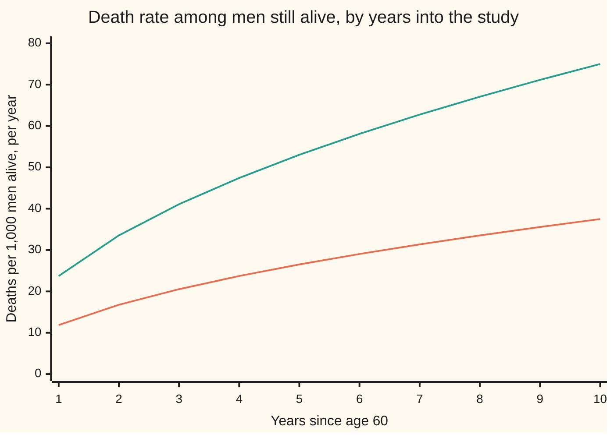
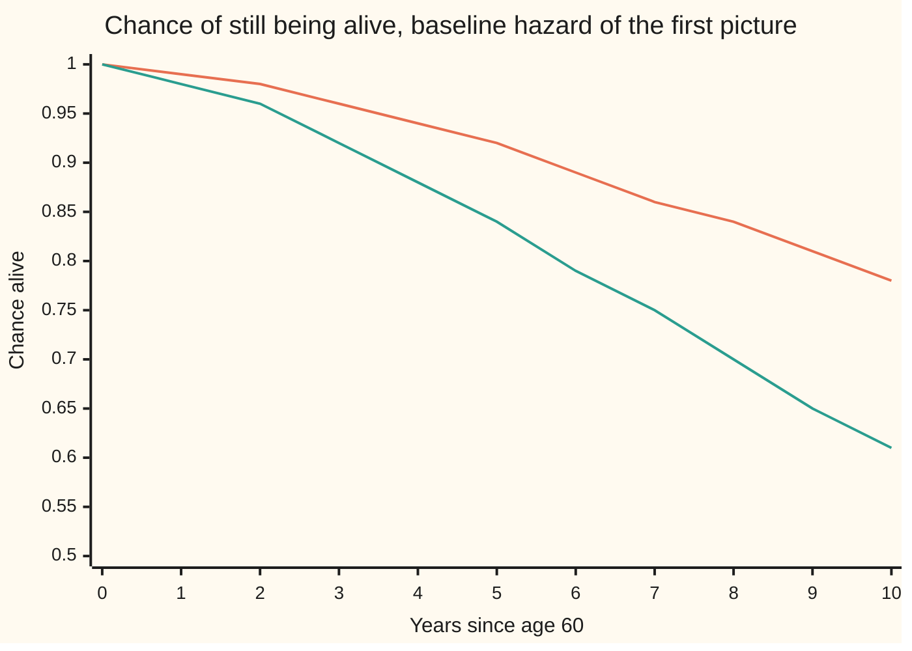
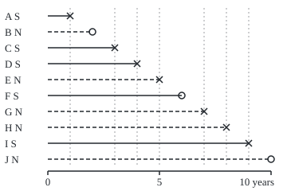

# Cox regression in outline: how covariates scale the hazard

[Syllabus](../../../SYLLABUS.md) → [Probability and statistics](../../../SYLLABUS.md#w09) → [Survival, Design and Causality](../../../SYLLABUS.md#w09-s13) → Cox regression in outline

---

## General Overview

A study of male British doctors, started in 1951, recorded who smoked and then followed every death for fifty years. For the doctors born in the first decade of the 1900s, the chance of dying between ages 35 and 69 was 24% for lifelong non-smokers and 42% for men who kept smoking cigarettes. The authors call this "a twofold death rate ratio". Yet 42 is not twice 24.

The doubling lives somewhere else. It is in the **hazard**: the death rate among the men still alive at each age, measured per year ([Survival](01-survival-functions-and-hazards.md)). Read as one ratio that holds at every age, the paper's twofold ratio says a smoker still alive was dying at twice the rate of a non-smoker of the same age. Twice the rate, compounded over 35 years, turns a 24% chance of dying into 42%, not 48%.

**Cox regression** measures that ratio from data. It handles men who join late, men who leave the study alive, and deaths spread over decades. It never needs to know how the death rate itself rises with age: that part cancels. David Cox published the method in 1972, and it is now the standard way a medical study reports a risk factor.

This card works through ten men aged 60, made up for the card and followed for up to ten years. Five smoke. Seven die during the study; three leave it alive. Fitted to those ten, the model says smoking doubles the hazard: a ratio of exactly 2. It also says how little ten men prove: the 95% interval runs from 0.43 to 9.2.

**The Cox model says a risk factor multiplies the hazard by one fixed factor at every moment; it estimates that factor by asking, at each death, how likely it was that the man who died was the one who did, out of everyone still at risk, and in that question the unknown baseline hazard cancels.**

**What kind of fact this is:** a model, since "the same factor at every age" is an assumption about how smoking acts, not a law; it is fitted by a method, partial likelihood, and the cancellation that method rests on is a theorem proved on this card in Why it works.

### The picture: two hazards, one always twice the other



First line (orange): non-smokers, the rising **baseline hazard** used in the simulated cohorts below. Second line (green): smokers, exactly twice the first at every year. The model fixes the gap between the curves as a ratio. It leaves the shape of the curves free, and the fit never estimates it.

---

## The formula

Notation first, in words. A **covariate** is a measured fact about a person that might change the risk; here it is one number, $x$, equal to 1 for a smoker and 0 for a non-smoker. The hazard at time $t$ for a person with covariate $x$ is written $h(t \mid x)$, read "the hazard at t given x". Deaths happen at times $t_1, t_2, \dots$; at the $j$-th death, the **risk set** $R_j$ is everyone still in the study just before it: alive and not yet gone.

$$h(t \mid x) \;=\; h_0(t)\, e^{\beta x}$$

**Read it aloud:** the hazard for a person with covariate x is the baseline hazard, the same unknown curve for everyone, multiplied by e to the beta x.

For a non-smoker, $e^{\beta \cdot 0} = 1$ and the hazard is the baseline. For a smoker it is the baseline times $e^{\beta}$. That factor is the **hazard ratio**:

$$\text{HR} \;=\; \frac{h(t \mid 1)}{h(t \mid 0)} \;=\; e^{\beta}$$

**Read it aloud:** at every moment, a smoker's hazard divided by a non-smoker's is e to the beta, whatever the moment.

The fit uses the **partial likelihood**, a product with one factor per death:

$$L(\beta) \;=\; \prod_{j} \frac{e^{\beta x_{(j)}}}{\sum_{i \in R_j} e^{\beta x_i}}$$

**Read it aloud:** at each death, take the dying man's weight e to the beta x, divide by the total weight of everyone at risk, and multiply these fractions over all the deaths.

Here $x_{(j)}$ is the covariate of the man who died at the $j$-th death, and $x_i$ runs over each man $i$ in the risk set. The estimate $\hat\beta$, read "beta hat", is the value that makes $L$ largest. Its logarithm has a slope, the **score**, and a downward curvature whose size is the **information**:

$$U(\beta) = \sum_j \big(x_{(j)} - m_j\big), \qquad m_j = \frac{\sum_{i \in R_j} x_i\, e^{\beta x_i}}{\sum_{i \in R_j} e^{\beta x_i}}, \qquad I(\beta) = \sum_j m_j\,(1 - m_j)$$

**Read it aloud:** the score is observed smoker deaths minus expected smoker deaths, where the expected share at each death is the smokers' share of the risk set's weight; the information adds up how uncertain each of those shares is.

The fit sets $U(\hat\beta) = 0$. The standard error of $\hat\beta$ is $1/\sqrt{I(\hat\beta)}$, and a 95% interval for the hazard ratio is $e^{\hat\beta \pm 1.96\,\text{SE}}$. The form $m_j(1 - m_j)$ holds because $x$ is 0 or 1; for a covariate with more values, the information is the weighted variance of $x$ in each risk set.

What the hazard ratio does to survival:

$$S(t \mid x) \;=\; S_0(t)^{\,e^{\beta x}}$$

**Read it aloud:** a smoker's chance of being alive at time t is the non-smoker's chance raised to the power of the hazard ratio.

| Symbol | Plain meaning | In our example | Push it up and the answer… |
| --- | --- | --- | --- |
| $t$, $t_j$, $j$, $dt$ | time since the study began; the time of the $j$-th death, $j$ counting the deaths in order; $dt$ a short stretch of time | years 1 to 10; deaths in years 1, 3, 4, 5, 7, 8, 9 | — |
| $x$, $x_i$, $i$ | the covariate: 1 for a smoker, 0 for a non-smoker; man $i$'s value, $i$ naming a man | A: 1; B: 0 | the hazard is multiplied by $e^{\beta}$ |
| $x_{(j)}$ | the covariate of the man who died at the $j$-th death | year 1: A, a smoker, 1 | — |
| $h(t \mid x)$ | the hazard: death rate per year among those still alive at $t$ | smoker, year 10: 75.00 per 1,000 | deaths come sooner |
| $h_0(t)$ | the baseline hazard: the hazard at $x = 0$, left unknown | non-smoker, year 10: 37.50 per 1,000 | everyone's risk rises; $\hat\beta$ unchanged |
| $\beta$ | log of the hazard ratio | fit: 0.6931 = ln 2 | smokers die faster relative to non-smokers |
| $e^{\beta}$, $c_i$, $C$ | the hazard ratio, HR; in the proof, man $i$'s weight $e^{\beta x_i}$ and the risk set's total weight | fit: 2.0000; year 4 at HR 2: total weight 10 | same |
| $R_j$ | the risk set: everyone still alive and in the study just before the $j$-th death | year 4: 3 smokers, 4 non-smokers | a bigger denominator, more information |
| $L(\beta)$ | the partial likelihood | log of it: −10.8967 at the fit | — |
| $U(\beta)$, $m_j$ | the score: observed minus expected smoker deaths; $m_j$ the expected smoker share of death $j$ | at HR 2: 4.0000 expected, 4 seen | pushes $\hat\beta$ up |
| $I(\beta)$ | the information: minus the curvature of $\ln L$, giving the standard error | 1.6467, SE 0.7793 | narrower interval |
| $S(t \mid x)$, $S_0(t)$, $H_0(t)$ | chance of being alive at $t$; the same at $x = 0$; the baseline's **cumulative hazard**, the area under $h_0$ up to $t$ | non-smoker at year 10: 0.78 | — |

### When it holds

- **The ratio stays fixed over time (proportional hazards).** If smoking's effect were 4 in the first five years and 1 afterwards, a single fitted ratio comes out at 2.2334, describing neither period.
- **Leaving says nothing about risk.** A man who leaves the study alive, called **censored**, must leave for reasons unrelated to his chance of dying soon. If men leave because they fall ill, the ones who stay look healthier than they are.
- **Men independent of each other.** The factors multiply as if each death were a separate event. Clusters, such as families sharing a household, need an adjustment.
- **The covariate acts on the log scale.** With 0 or 1 this is automatic. For cigarettes a day, $e^{\beta x}$ says each extra cigarette multiplies the hazard by the same factor; if the real effect levels off, the one number misstates it.
- **An association, not a cause.** Smokers in a cohort differ from non-smokers in other ways. The fitted ratio measures how much faster they die; it says smoking is the reason only when the groups were formed by chance or the other differences are measured and included.

---

## Why it works

### Step 0: ask a question the baseline cannot answer

The baseline $h_0(t)$ is a whole unknown curve. Estimating it alongside $\beta$ would need an assumption about its shape. Cox's idea was to ask a narrower question at each death: given that one man died at this moment, which one was it? Every man's hazard carries the same factor $h_0(t)$, so in the answer it divides out.

### Step 1: a race between two men

Take two men alive at time $t$: a smoker and a non-smoker. In the next short interval of length $dt$, the smoker dies with chance about $2\,h_0(t)\,dt$ and the non-smoker with chance about $h_0(t)\,dt$. Given that exactly one of them died, the chance it was the smoker is

$$\frac{2\,h_0(t)\,dt}{2\,h_0(t)\,dt + h_0(t)\,dt} \;=\; \frac{2}{3}.$$

The baseline, and the interval length, cancel. The answer is 2/3 whether $h_0$ rises with age, falls, or jumps about. The checks confirm it: Simpson's rule on a rising baseline gives 0.6667, and 200,000 simulated races on a falling baseline give 0.6667 with a standard error of 0.0011.

### Step 2: a whole risk set

With several men at risk, the same argument gives each man a share of the death in proportion to his weight $e^{\beta x_i}$. At year 4 of the ten-man study, three smokers and four non-smokers are at risk. At a hazard ratio of 2, the smokers hold weight 2 + 2 + 2 = 6 of a total 10, so a death at that moment is a smoker's with chance 0.6000.

<details>
<summary>Detailed proof</summary>

Take the men in a risk set and restart the clock at the moment the set is formed, so every one of them is alive at time 0 and $H_0(t)$, the baseline hazard added up over time, counts from there. Give man $i$ the weight $c_i = e^{\beta x_i}$, and write $C$ for the sum of the weights. Man $i$ survives to time $t$ with chance $e^{-c_i H_0(t)}$. The chance that man $i$ is the first to die, and dies in the interval from $t$ to $t + dt$, is his death rate $c_i h_0(t)\,dt$ times the chance that every man, himself included, lasted until $t$:
$$c_i\, h_0(t)\, dt \;\prod_k e^{-c_k H_0(t)} \;=\; c_i\, h_0(t)\, e^{-C H_0(t)}\, dt.$$
Add this over all men $i$ and the first death happens in that interval with chance $C\,h_0(t)\,e^{-C H_0(t)}\,dt$. Divide the two: given that the first death is at $t$, it is man $i$'s with chance $c_i / C$. Nothing in that ratio depends on $h_0$ or on $t$. Integrating instead over all $t$, with $H_0$ growing without bound, gives the same $c_i/C$ for "man $i$ dies first", which is the 2/3 of Step 1.

</details>

### Step 3: multiply over the deaths

Each death contributes its "which one" chance, and the partial likelihood $L(\beta)$ multiplies them. A censored man never appears on top of a fraction. He appears in the denominators of every death that happened while he was still in the study, then drops out. So the three men who left alive still count: they were at risk, and they did not die.

What the product leaves out is the timing of the deaths: how long the gaps between them were. The gaps carry information about $h_0$, which the model never needed, and almost none about $\beta$. Cox argued in 1975 that $L(\beta)$ can be treated like an ordinary likelihood: its peak settles on the true $\beta$ as the study grows, and its curvature gives the standard error. The full proof uses martingales, sums of surprises whose average is zero ([Filtrations and martingales](../../10-Measure%20and%20integration/09-Conditional%20Expectation/06-filtrations-and-martingales.md) has the idea), run in continuous time, and belongs to wing 11. This card checks it by simulation instead: 400 cohorts of 200 men with a true ratio of 2 give an average $\hat\beta$ of 0.6981, standard error 0.0145, against ln 2 = 0.6931. The 400 estimates spread by 0.2898; the curvature reported 0.2934 on average.

### Step 4: slope and curvature

Take logarithms: $\ln L(\beta) = \sum_j \big[\beta x_{(j)} - \ln \sum_{i \in R_j} e^{\beta x_i}\big]$. Differentiate once. The first term gives $x_{(j)}$. The second gives the weighted average of $x$ over the risk set, which is $m_j$. So the slope is the score $U(\beta)$: observed smoker deaths minus expected. Setting it to zero says the fitted ratio is the one at which the smokers died exactly as often as their weight predicted.

Differentiate again. The slope of $m_j$ is the weighted variance of $x$ in the risk set; for a 0 or 1 covariate that is $m_j(1 - m_j)$. The information $I(\beta)$ is their sum. Newton's method climbs to the peak by repeating $\beta \leftarrow \beta + U(\beta)/I(\beta)$, the same step used for [Logistic regression](../09-Regression/05-logistic-regression.md), and $1/\sqrt{I(\hat\beta)}$ is the standard error as for any maximum likelihood fit.

### Step 5: from hazard to survival

The chance of being alive at $t$ is $e^{-H(t)}$, where $H(t)$ is the hazard added up from 0 to $t$. A smoker's hazard is $e^{\beta}$ times the baseline at every moment, so its sum is $e^{\beta}$ times the baseline's: $H(t \mid 1) = e^{\beta} H_0(t)$. Then

$$S(t \mid 1) \;=\; e^{-e^{\beta} H_0(t)} \;=\; \big(e^{-H_0(t)}\big)^{e^{\beta}} \;=\; S_0(t)^{e^{\beta}}.$$

For the doctors: a non-smoker survives the 35 years with chance 1 − 0.24 = 0.76. With the rate doubled, a smoker survives with chance 0.76 squared, so dies with chance 0.4224: the study's 42%.



First line (orange): non-smokers. Second line (green): smokers, each value the square of the first. After ten years, 0.2212 of non-smokers and 0.3935 of smokers have died: a ratio of 1.7788, not 2.

A different road fits a full shape for the baseline, such as the Weibull hazard of [Weibull and hazards](../04-Continuous%20Distributions/09-weibull-and-hazard-rates.md), and estimates it together with $\beta$ by [Maximum likelihood](../07-Sampling%20and%20Estimation/04-maximum-likelihood.md). It gains a little precision when the shape is right and gives a wrong $\beta$ when it is not. Cox's road gives up the shape and keeps $\beta$ safe.

---

## Worked numbers, by hand

The ten men, labelled A to J in the order they leave the study:

| Man | A | B | C | D | E | F | G | H | I | J |
| --- | --- | --- | --- | --- | --- | --- | --- | --- | --- | --- |
| Smoker? | yes | no | yes | yes | no | yes | no | no | yes | no |
| Year he leaves | 1 | 2 | 3 | 4 | 5 | 6 | 7 | 8 | 9 | 10 |
| How | died | left alive | died | died | died | left alive | died | died | died | study ended |

### The picture: who is at risk at each death

<p align="center"></p>

Drawn to scale: 28 units per year from year 0 at the left. Solid lines are smokers (S), dashed lines non-smokers (N). A cross marks a death, a circle a man who left alive. Each faint vertical marks a death; the lines it crosses are that death's risk set.

The hand check: guess a hazard ratio of 2 and see whether observed smoker deaths equal expected ones. At each death, a smoker weighs 2 and a non-smoker 1.

| Step | Arithmetic | Value |
| --- | --- | --- |
| Year 1, A dies (smoker): 5 smokers, 5 non-smokers at risk | 2 × 5 / (2 × 5 + 5) = 10/15 | 0.6667 |
| Year 3, C dies (smoker): 4 and 4 at risk (B left in year 2) | 8/12 | 0.6667 |
| Year 4, D dies (smoker): 3 and 4 | 6/10 | 0.6000 |
| Year 5, E dies (non-smoker): 2 and 4 | 4/8 | 0.5000 |
| Year 7, G dies (non-smoker): 1 and 3 (F left in year 6) | 2/5 | 0.4000 |
| Year 8, H dies (non-smoker): 1 and 2 | 2/4 | 0.5000 |
| Year 9, I dies (smoker): 1 and 1 | 2/3 | 0.6667 |
| Expected smoker deaths | sum of the seven shares | 4.0000 |
| Observed smoker deaths | A, C, D, I | 4 |
| Score at HR 2 | 4 − 4.0000 | 0, so $\hat\beta$ = ln 2 = 0.6931 |
| Information | sum of share × (1 − share): 0.2222 + 0.2222 + 0.2400 + 0.2500 + 0.2400 + 0.2500 + 0.2222 | 1.6467 |
| Standard error of $\hat\beta$ | 1 / √1.6467 | 0.7793 |
| 95% interval for the HR | e^(0.6931 ± 1.96 × 0.7793) | 0.4342 to 9.2124 |
| **Hazard ratio** | e^0.6931 | **2.0000** |

In this made-up cohort, the fitted ratio is 2: the estimate says a smoker still alive was dying at twice the rate of a non-smoker still alive. Ten men cannot tell that from no effect at all: the interval runs from a smoker's rate being less than half a non-smoker's to more than nine times it. The code's simulated cohort of 1,000 men, with 271 deaths, pins the same ratio at 2.0429, interval 1.5897 to 2.6254.

### What breaks if you drop a piece

| Mistake | Comes out at | What went wrong |
| --- | --- | --- |
| Count the three who left alive as deaths | HR 1.8329 | B and J, both non-smokers, become deaths that never happened, and F's leaving becomes a smoker's death: the record is rewritten |
| Drop the three who left alive | HR 1.3703 | the risk sets shrink and lose B, F and J's years of survival: survival that was seen is thrown away |
| Read HR 2 as twice the chance of dying (the doctors) | 0.4800 instead of 0.4224 | the rate doubles at every age, and survival compounds: 0.76 squared, not 0.24 doubled |
| Fit one ratio when the effect fades (simulated: 4 for five years, then 1) | 2.2334 overall; 4.0124 and 0.9585 fitted separately | the hazards were not proportional, so one number averages two different stories |

---

## Code, from first principles, and it actually runs

The checks fit the ten men three ways: by hand (the expected shares at HR 2), by Newton's method on the score, and by a golden-section climb on the raw product $L(\beta)$ with its curvature taken by nudging. They check Step 1's race three ways: the exact 2/3, Simpson's rule on a rising baseline, and a seeded simulation on a falling one. They then simulate cohorts from a known model, a baseline hazard that is either rising or falling and a true ratio of 2, with men also dropping out at 3% a year, and confirm that the fit recovers ln 2 and that its reported standard error matches the real spread of the estimates. Random draws come from SplitMix64 written out in both languages with seed 20260929, so both print the same numbers.

### Python

```python
# Cox regression in outline -- the check behind the card.  Standard library only.  One covariate,
# x = 1 for a smoker, 0 for a non-smoker.  The fit on ten men is reached three ways: by hand (the score
# is zero at hazard ratio 2), Newton's method on risk-set counts, and a golden-section climb on the raw
# partial-likelihood product.  Simulated cohorts use SplitMix64, seed 20260929, the same draws as Rust.
from math import exp, log, sqrt
M64 = (1 << 64) - 1
state = [20260929]
def unif():                                   # SplitMix64: a uniform number in [0, 1)
    state[0] = (state[0] + 0x9E3779B97F4A7C15) & M64
    z = state[0]
    z = ((z ^ (z >> 30)) * 0xBF58476D1CE4E5B9) & M64
    z = ((z ^ (z >> 27)) * 0x94D049BB133111EB) & M64
    return ((z ^ (z >> 31)) >> 11) / 9007199254740992.0
# the ten men: (years followed, 1 = died / 0 = left the study alive, 1 = smoker / 0 = non-smoker)
MEN = [(1, 1, 1), (2, 0, 0), (3, 1, 1), (4, 1, 1), (5, 1, 0),
       (6, 0, 1), (7, 1, 0), (8, 1, 0), (9, 1, 1), (10, 0, 0)]
def score(b, rows):                           # road 1: risk sets counted from the latest time back
    r, n0, n1, U, I, i = exp(b), 0, 0, 0.0, 0.0, 0
    while i < len(rows):                      # men with equal times join the risk set together
        j = i
        while j < len(rows) and rows[j][0] == rows[i][0]:
            n1 += rows[j][2]; n0 += 1 - rows[j][2]; j += 1
        m = n1 * r / (n0 + n1 * r)            # expected smoker share of a death at this time
        for t, d, x in rows[i:j]:
            if d: U += x - m; I += m * (1.0 - m)
        i = j
    return U, I
def fit(data):                                # Newton's method: step = score / information
    rows, b = sorted(data, key=lambda r: -r[0]), 0.0
    for _ in range(60):
        U, I = score(b, rows)
        b += U / I
        if abs(U) < 1e-12: break
    return b, 1.0 / sqrt(I)
def logpl(b, data):                           # road 2: the partial likelihood as a raw product
    s = 0.0
    for t, d, x in data:
        if d:
            den = 0.0
            for tk, dk, xk in data:
                if tk >= t: den += exp(b * xk)
            s += log(exp(b * x) / den)
    return s
def golden(f, lo, hi):                        # climb to the top without any slope formula
    g = (sqrt(5.0) - 1.0) / 2.0
    for _ in range(200):
        a, c = hi - g * (hi - lo), lo + g * (hi - lo)
        if f(a) > f(c): hi = c
        else: lo = a
    return (lo + hi) / 2.0
def show(label, *v): print(label.ljust(44) + "".join(f"{x:>11.4f}" for x in v))
print("event year, smokers at risk, non-smokers at risk, died a smoker?, at HR 2: smoker share m, m(1-m)")
tot = inf = 0.0
for t, d, x in MEN:
    if d:
        n1 = sum(1 for tk, dk, xk in MEN if tk >= t and xk == 1)
        n0 = sum(1 for tk, dk, xk in MEN if tk >= t and xk == 0)
        m = 2 * n1 / (2 * n1 + n0); tot += m; inf += m * (1 - m)
        print(f"  {t:>2} {n1:>3} {n0:>3} {x:>3}", f"{m:>9.4f}{m * (1 - m):>9.4f}")
show("hand: expected, observed smoker deaths; info", tot, sum(d * x for t, d, x in MEN), inf)
b1, se1 = fit(MEN)
show("1 Newton: beta, HR, SE of beta", b1, exp(b1), se1)
b2 = golden(lambda b: logpl(b, MEN), -3.0, 3.0)
h = 1e-3
se2 = 1.0 / sqrt(-(logpl(b2 + h, MEN) - 2 * logpl(b2, MEN) + logpl(b2 - h, MEN)) / (h * h))
show("2 golden climb: beta, HR, SE by curvature", b2, exp(b2), se2)
show("hand: ln 2", log(2.0))
show("95% interval for the HR", exp(b1 - 1.96 * se1), exp(b1 + 1.96 * se1))
show("log partial likelihood at beta = 0, at fit", logpl(0.0, MEN), logpl(b1, MEN))
U0, I0 = score(0.0, sorted(MEN, key=lambda r: -r[0]))
show("score test at HR 1 (log-rank): z", U0 / sqrt(I0))
assert abs(b1 - log(2.0)) < 1e-10
assert abs(b2 - b1) < 1e-7
assert abs(se2 - se1) < 1e-5
def H0(t, k): return 0.25 * (t / 10.0) ** k   # baseline cumulative hazard: 0.25 by year 10
def draw_time(x, k, early):                   # invert the survival curve: S(T) = a uniform draw
    E = -log(1.0 - unif())
    H5 = H0(5.0, k)
    if x and early: H = E / 4.0 if E < 4.0 * H5 else E - 3.0 * H5
    else: H = E / (2.0 if x else 1.0)
    return 10.0 * (H / 0.25) ** (1.0 / k)
def cohort(n, k, early=False):                # 10-year study, people also drop out at 3% a year
    out = []
    for i in range(n):
        x = i % 2
        t = draw_time(x, k, early)
        c = min(-log(1.0 - unif()) / 0.03, 10.0)
        out.append((min(t, c), 1 if t <= c else 0, x))
    return out
n, s, k = 200000, 0, 0.5                      # race of two, falling baseline: who dies first?
for _ in range(n):
    s += 1 if draw_time(1, k, False) < draw_time(0, k, False) else 0
p = s / n
N, a, bb, tot = 20000, 0.0, 8.0, 0.0          # the same race by Simpson's rule, rising baseline:
for i in range(N + 1):                        # smoker's hazard 2 h0(t) times both alive, t = 10 u^2
    u = a + i * (bb - a) / N
    t = 10.0 * u * u
    f = 2.0 * 0.0375 * u * exp(-3.0 * H0(t, 1.5)) * 20.0 * u
    tot += f * (1 if i in (0, N) else (4 if i % 2 else 2))
integ = tot * (bb - a) / N / 3.0
show("race: exact 2/3, Simpson (rising h0)", 2.0 / 3.0, integ)
show("race: simulated (falling h0), SE", p, sqrt(p * (1 - p) / n))
assert abs(integ - 2.0 / 3.0) < 1e-9
assert abs(p - 2.0 / 3.0) < 4 * sqrt(p * (1 - p) / n)
big = cohort(1000, 1.5)
bB, seB = fit(big)
print(f"1,000 men: {sum(d for t, d, x in big)} deaths".ljust(44) + f"{bB:>11.4f}{seB:>11.4f}")
show("1,000 men: HR and its 95% interval", exp(bB), exp(bB - 1.96 * seB), exp(bB + 1.96 * seB))
for k in (1.5, 0.5):
    bs, ses = [], []
    for _ in range(400):
        bk, sk = fit(cohort(200, k)); bs.append(bk); ses.append(sk)
    mb = sum(bs) / 400; sd = sqrt(sum((v - mb) ** 2 for v in bs) / 399)
    show(f"400 cohorts of 200, k={k}: mean beta, SE", mb, sd / 20.0)
    show(f"  spread of beta, average reported SE", sd, sum(ses) / 400)
    assert abs(mb - log(2.0)) < 4 * sd / 20.0
    assert abs(sum(ses) / 400 - sd) < 0.15 * sd
wrong1 = fit([(t, 1, x) for t, d, x in MEN])
wrong2 = fit([(t, d, x) for t, d, x in MEN if d])
show("wrong: count leavers as deaths, HR", exp(wrong1[0]))
show("wrong: drop the leavers, HR", exp(wrong2[0]))
show("doctors: risk 0.24; doubled; rate doubled", 0.24, 2 * 0.24, 1 - (1 - 0.24) * (1 - 0.24))
show("10-year risk: non-smoker, smoker, ratio", 1 - exp(-0.25), 1 - exp(-0.5), (1 - exp(-0.5)) / (1 - exp(-0.25)))
cr = cohort(2000, 1.5, early=True)
show("crossing: fitted HR overall", exp(fit(cr)[0]))
show("  first 5 years, after year 5", exp(fit([(min(t, 5.0), d if t <= 5.0 else 0, x) for t, d, x in cr])[0]),
     exp(fit([(t, d if t > 5.0 else 0, x) for t, d, x in cr])[0]))
print("chart hazard per 1,000 a year, years 1..10:")
for c in (1.0, 2.0):
    print("  " + ", ".join(f"{c * 1000 * 0.375 * (t / 10.0) ** 0.5 / 10.0:.2f}" for t in range(1, 11)))
print("chart survival, years 0..10:")
for c in (1.0, 2.0):
    print("  " + ", ".join(f"{exp(-c * H0(float(t), 1.5)):.2f}" for t in range(0, 11)))
print("figure, line ends x = 60 + 28 t:", ", ".join(str(60 + 28 * t) for t, d, x in MEN))
print("figure, rows y = 20 + 20 i:", ", ".join(str(20 + 20 * i) for i in range(10)))
show("try: F dies at 6 instead of leaving, HR", exp(fit([(t, 1 if t == 6 else d, x) for t, d, x in MEN])[0]))
bD, seD = fit(MEN + MEN)
show("try: every man counted twice, HR, SE", exp(bD), seD)
bN = fit([(t, d, 1 - x) for t, d, x in MEN])[0]; show("try: code non-smokers as 1, beta, HR", bN, exp(bN))
print("ALL CHECKS PASS")
```

**Ran 2026-10-07 on macOS, Python 3.14.6, standard library only. All checks passed. Output, pasted from the run:**

```
event year, smokers at risk, non-smokers at risk, died a smoker?, at HR 2: smoker share m, m(1-m)
   1   5   5   1    0.6667   0.2222
   3   4   4   1    0.6667   0.2222
   4   3   4   1    0.6000   0.2400
   5   2   4   0    0.5000   0.2500
   7   1   3   0    0.4000   0.2400
   8   1   2   0    0.5000   0.2500
   9   1   1   1    0.6667   0.2222
hand: expected, observed smoker deaths; info     4.0000     4.0000     1.6467
1 Newton: beta, HR, SE of beta                   0.6931     2.0000     0.7793
2 golden climb: beta, HR, SE by curvature        0.6931     2.0000     0.7793
hand: ln 2                                       0.6931
95% interval for the HR                          0.4342     9.2124
log partial likelihood at beta = 0, at fit     -11.2978   -10.8967
score test at HR 1 (log-rank): z                 0.9054
race: exact 2/3, Simpson (rising h0)             0.6667     0.6667
race: simulated (falling h0), SE                 0.6667     0.0011
1,000 men: 271 deaths                            0.7144     0.1280
1,000 men: HR and its 95% interval               2.0429     1.5897     2.6254
400 cohorts of 200, k=1.5: mean beta, SE         0.6981     0.0145
  spread of beta, average reported SE            0.2898     0.2934
400 cohorts of 200, k=0.5: mean beta, SE         0.6756     0.0134
  spread of beta, average reported SE            0.2680     0.2790
wrong: count leavers as deaths, HR               1.8329
wrong: drop the leavers, HR                      1.3703
doctors: risk 0.24; doubled; rate doubled        0.2400     0.4800     0.4224
10-year risk: non-smoker, smoker, ratio          0.2212     0.3935     1.7788
crossing: fitted HR overall                      2.2334
  first 5 years, after year 5                    4.0124     0.9585
chart hazard per 1,000 a year, years 1..10:
  11.86, 16.77, 20.54, 23.72, 26.52, 29.05, 31.37, 33.54, 35.58, 37.50
  23.72, 33.54, 41.08, 47.43, 53.03, 58.09, 62.75, 67.08, 71.15, 75.00
chart survival, years 0..10:
  1.00, 0.99, 0.98, 0.96, 0.94, 0.92, 0.89, 0.86, 0.84, 0.81, 0.78
  1.00, 0.98, 0.96, 0.92, 0.88, 0.84, 0.79, 0.75, 0.70, 0.65, 0.61
figure, line ends x = 60 + 28 t: 88, 116, 144, 172, 200, 228, 256, 284, 312, 340
figure, rows y = 20 + 20 i: 20, 40, 60, 80, 100, 120, 140, 160, 180, 200
try: F dies at 6 instead of leaving, HR          2.5198
try: every man counted twice, HR, SE             2.0000     0.5510
try: code non-smokers as 1, beta, HR            -0.6931     0.5000
ALL CHECKS PASS
```

### Rust

```rust
// Cox regression in outline -- the check behind the card.  Rust std only.  One covariate,
// x = 1 for a smoker, 0 for a non-smoker.  The fit on ten men is reached three ways: by hand (the score
// is zero at hazard ratio 2), Newton's method on risk-set counts, and a golden-section climb on the raw
// partial-likelihood product.  Simulated cohorts use SplitMix64, seed 20260929, the same draws as Python.
type Row = (f64, u32, u32); // (years followed, 1 = died / 0 = left alive, 1 = smoker / 0 = non-smoker)
struct Rng(u64);
impl Rng { fn unif(&mut self) -> f64 { // SplitMix64: a uniform number in [0, 1)
        self.0 = self.0.wrapping_add(0x9E3779B97F4A7C15);
        let mut z = self.0;
        z = (z ^ (z >> 30)).wrapping_mul(0xBF58476D1CE4E5B9);
        z = (z ^ (z >> 27)).wrapping_mul(0x94D049BB133111EB);
        ((z ^ (z >> 31)) >> 11) as f64 / 9007199254740992.0 } }
fn sorted(data: &[Row]) -> Vec<Row> { // latest time first; the sort is stable
    let mut rows = data.to_vec(); rows.sort_by(|a, b| b.0.partial_cmp(&a.0).unwrap()); rows }
// road 1: risk sets counted from the latest time back; men with equal times join together
fn score(b: f64, rows: &[Row]) -> (f64, f64) {
    let r = b.exp();
    let (mut n0, mut n1, mut u, mut info, mut i) = (0u32, 0u32, 0.0, 0.0, 0usize);
    while i < rows.len() {
        let mut j = i;
        while j < rows.len() && rows[j].0 == rows[i].0 { n1 += rows[j].2; n0 += 1 - rows[j].2; j += 1; }
        let m = n1 as f64 * r / (n0 as f64 + n1 as f64 * r); // expected smoker share of a death here
        for &(_, d, x) in &rows[i..j] { if d == 1 { u += x as f64 - m; info += m * (1.0 - m); } }
        i = j;
    }
    (u, info)
}
fn fit(data: &[Row]) -> (f64, f64) { // Newton's method: step = score / information
    let rows = sorted(data);
    let (mut b, mut info) = (0.0, 0.0);
    for _ in 0..60 {
        let (u, i) = score(b, &rows);
        info = i; b += u / i;
        if u.abs() < 1e-12 { break; }
    }
    (b, 1.0 / info.sqrt())
}
fn logpl(b: f64, data: &[Row]) -> f64 { // road 2: the partial likelihood as a raw product
    let mut s = 0.0;
    for &(t, d, x) in data {
        if d == 0 { continue; }
        let den: f64 = data.iter().filter(|r| r.0 >= t).map(|r| (b * r.2 as f64).exp()).sum();
        s += ((b * x as f64).exp() / den).ln();
    }
    s
}
fn golden(f: &dyn Fn(f64) -> f64, mut lo: f64, mut hi: f64) -> f64 { // no slope formula
    let g = (5.0f64.sqrt() - 1.0) / 2.0;
    for _ in 0..200 {
        let (a, c) = (hi - g * (hi - lo), lo + g * (hi - lo));
        if f(a) > f(c) { hi = c; } else { lo = a; }
    }
    (lo + hi) / 2.0
}
fn show(label: &str, v: &[f64]) { let s: String = v.iter().map(|x| format!("{:>11.4}", x)).collect(); println!("{:<44}{}", label, s); }
fn h0cum(t: f64, k: f64) -> f64 { 0.25 * (t / 10.0).powf(k) } // baseline: 0.25 by year 10
fn draw_time(g: &mut Rng, x: u32, k: f64, early: bool) -> f64 { // invert S(T) = a uniform draw
    let (e, h5) = (-(1.0 - g.unif()).ln(), h0cum(5.0, k));
    let h = if x == 1 && early { if e < 4.0 * h5 { e / 4.0 } else { e - 3.0 * h5 } }
            else { e / (if x == 1 { 2.0 } else { 1.0 }) };
    10.0 * (h / 0.25).powf(1.0 / k)
}
fn cohort(g: &mut Rng, n: usize, k: f64, early: bool) -> Vec<Row> { // 10 years, 3% a year drop out
    (0..n).map(|i| {
        let x = (i % 2) as u32; let t = draw_time(g, x, k, early);
        let c = (-(1.0 - g.unif()).ln() / 0.03).min(10.0);
        (t.min(c), if t <= c { 1 } else { 0 }, x)
    }).collect()
}
fn main() {
    let men: Vec<Row> = vec![(1.0, 1, 1), (2.0, 0, 0), (3.0, 1, 1), (4.0, 1, 1), (5.0, 1, 0),
                             (6.0, 0, 1), (7.0, 1, 0), (8.0, 1, 0), (9.0, 1, 1), (10.0, 0, 0)];
    let mut g = Rng(20260929);
    println!("event year, smokers at risk, non-smokers at risk, died a smoker?, at HR 2: smoker share m, m(1-m)");
    let (mut tot, mut inf) = (0.0, 0.0);
    for &(t, d, x) in &men {
        if d == 1 {
            let n1 = men.iter().filter(|r| r.0 >= t && r.2 == 1).count();
            let n0 = men.iter().filter(|r| r.0 >= t && r.2 == 0).count();
            let m = (2 * n1) as f64 / (2 * n1 + n0) as f64; tot += m; inf += m * (1.0 - m);
            println!("  {:>2} {:>3} {:>3} {:>3} {:>9.4}{:>9.4}", t as u32, n1, n0, x, m, m * (1.0 - m));
        }
    }
    let obs: u32 = men.iter().map(|r| r.1 * r.2).sum();
    show("hand: expected, observed smoker deaths; info", &[tot, obs as f64, inf]);
    let (b1, se1) = fit(&men);
    show("1 Newton: beta, HR, SE of beta", &[b1, b1.exp(), se1]);
    let b2 = golden(&|b| logpl(b, &men), -3.0, 3.0);
    let h = 1e-3;
    let se2 = 1.0 / (-(logpl(b2 + h, &men) - 2.0 * logpl(b2, &men) + logpl(b2 - h, &men)) / (h * h)).sqrt();
    show("2 golden climb: beta, HR, SE by curvature", &[b2, b2.exp(), se2]);
    show("hand: ln 2", &[2.0f64.ln()]);
    show("95% interval for the HR", &[(b1 - 1.96 * se1).exp(), (b1 + 1.96 * se1).exp()]);
    show("log partial likelihood at beta = 0, at fit", &[logpl(0.0, &men), logpl(b1, &men)]);
    let (u0, i0) = score(0.0, &sorted(&men));
    show("score test at HR 1 (log-rank): z", &[u0 / i0.sqrt()]);
    assert!((b1 - 2.0f64.ln()).abs() < 1e-10);
    assert!((b2 - b1).abs() < 1e-7);
    assert!((se2 - se1).abs() < 1e-5);
    let (n, mut s) = (200000, 0); // race of two, falling baseline: who dies first?
    for _ in 0..n {
        let ts = draw_time(&mut g, 1, 0.5, false);
        if ts < draw_time(&mut g, 0, 0.5, false) { s += 1; }
    }
    let p = s as f64 / n as f64;
    let (nn, a, bb) = (20000, 0.0, 8.0); // the same race by Simpson's rule, rising baseline, t = 10 u^2
    let mut tot = 0.0;
    for i in 0..=nn {
        let u = a + i as f64 * (bb - a) / nn as f64; let t = 10.0 * u * u;
        let f = 2.0 * 0.0375 * u * (-3.0 * h0cum(t, 1.5)).exp() * 20.0 * u;
        tot += f * (if i == 0 || i == nn { 1.0 } else if i % 2 == 1 { 4.0 } else { 2.0 });
    }
    let integ = tot * (bb - a) / nn as f64 / 3.0;
    let sep = (p * (1.0 - p) / n as f64).sqrt();
    show("race: exact 2/3, Simpson (rising h0)", &[2.0 / 3.0, integ]);
    show("race: simulated (falling h0), SE", &[p, sep]);
    assert!((integ - 2.0 / 3.0).abs() < 1e-9);
    assert!((p - 2.0 / 3.0).abs() < 4.0 * sep);
    let big = cohort(&mut g, 1000, 1.5, false);
    let (bbig, sebig) = fit(&big);
    let deaths: u32 = big.iter().map(|r| r.1).sum();
    println!("{:<44}{:>11.4}{:>11.4}", format!("1,000 men: {} deaths", deaths), bbig, sebig);
    show("1,000 men: HR and its 95% interval", &[bbig.exp(), (bbig - 1.96 * sebig).exp(), (bbig + 1.96 * sebig).exp()]);
    for &k in &[1.5, 0.5] {
        let (mut bs, mut ses) = (Vec::new(), Vec::new());
        for _ in 0..400 {
            let (bk, sk) = fit(&cohort(&mut g, 200, k, false)); bs.push(bk); ses.push(sk);
        }
        let mb = bs.iter().sum::<f64>() / 400.0;
        let sd = (bs.iter().map(|v| (v - mb) * (v - mb)).sum::<f64>() / 399.0).sqrt();
        let mse = ses.iter().sum::<f64>() / 400.0;
        show(&format!("400 cohorts of 200, k={}: mean beta, SE", k), &[mb, sd / 20.0]);
        show("  spread of beta, average reported SE", &[sd, mse]);
        assert!((mb - 2.0f64.ln()).abs() < 4.0 * sd / 20.0);
        assert!((mse - sd).abs() < 0.15 * sd);
    }
    let w1: Vec<Row> = men.iter().map(|r| (r.0, 1, r.2)).collect();
    let w2: Vec<Row> = men.iter().filter(|r| r.1 == 1).cloned().collect();
    show("wrong: count leavers as deaths, HR", &[fit(&w1).0.exp()]);
    show("wrong: drop the leavers, HR", &[fit(&w2).0.exp()]);
    show("doctors: risk 0.24; doubled; rate doubled", &[0.24, 2.0 * 0.24, 1.0 - (1.0 - 0.24) * (1.0 - 0.24)]);
    let (r0, r1) = (1.0 - (-0.25f64).exp(), 1.0 - (-0.5f64).exp());
    show("10-year risk: non-smoker, smoker, ratio", &[r0, r1, r1 / r0]);
    let cr = cohort(&mut g, 2000, 1.5, true);
    show("crossing: fitted HR overall", &[fit(&cr).0.exp()]);
    let early: Vec<Row> = cr.iter().map(|r| (r.0.min(5.0), if r.0 <= 5.0 { r.1 } else { 0 }, r.2)).collect();
    let late: Vec<Row> = cr.iter().map(|r| (r.0, if r.0 > 5.0 { r.1 } else { 0 }, r.2)).collect();
    show("  first 5 years, after year 5", &[fit(&early).0.exp(), fit(&late).0.exp()]);
    println!("chart hazard per 1,000 a year, years 1..10:");
    for c in [1.0, 2.0] {
        let v: Vec<String> = (1..=10).map(|t| format!("{:.2}", c * 1000.0 * 0.375 * (t as f64 / 10.0).powf(0.5) / 10.0)).collect();
        println!("  {}", v.join(", "));
    }
    println!("chart survival, years 0..10:");
    for c in [1.0, 2.0] {
        let v: Vec<String> = (0..=10).map(|t| format!("{:.2}", (-c * h0cum(t as f64, 1.5)).exp())).collect();
        println!("  {}", v.join(", "));
    }
    let ends: Vec<String> = men.iter().map(|r| (60 + 28 * r.0 as u32).to_string()).collect();
    println!("figure, line ends x = 60 + 28 t: {}", ends.join(", "));
    let ys: Vec<String> = (0..10).map(|i| (20 + 20 * i).to_string()).collect();
    println!("figure, rows y = 20 + 20 i: {}", ys.join(", "));
    let f6: Vec<Row> = men.iter().map(|r| (r.0, if r.0 == 6.0 { 1 } else { r.1 }, r.2)).collect();
    show("try: F dies at 6 instead of leaving, HR", &[fit(&f6).0.exp()]);
    let twice: Vec<Row> = men.iter().chain(men.iter()).cloned().collect();
    let (bd, sed) = fit(&twice); show("try: every man counted twice, HR, SE", &[bd.exp(), sed]);
    let flip: Vec<Row> = men.iter().map(|r| (r.0, r.1, 1 - r.2)).collect();
    let bn = fit(&flip).0; show("try: code non-smokers as 1, beta, HR", &[bn, bn.exp()]);
    println!("ALL CHECKS PASS");
}
```

**Ran 2026-10-07 on macOS, rustc 1.98.1, no crates. All checks passed. Output, pasted from the run:**

```
event year, smokers at risk, non-smokers at risk, died a smoker?, at HR 2: smoker share m, m(1-m)
   1   5   5   1    0.6667   0.2222
   3   4   4   1    0.6667   0.2222
   4   3   4   1    0.6000   0.2400
   5   2   4   0    0.5000   0.2500
   7   1   3   0    0.4000   0.2400
   8   1   2   0    0.5000   0.2500
   9   1   1   1    0.6667   0.2222
hand: expected, observed smoker deaths; info     4.0000     4.0000     1.6467
1 Newton: beta, HR, SE of beta                   0.6931     2.0000     0.7793
2 golden climb: beta, HR, SE by curvature        0.6931     2.0000     0.7793
hand: ln 2                                       0.6931
95% interval for the HR                          0.4342     9.2124
log partial likelihood at beta = 0, at fit     -11.2978   -10.8967
score test at HR 1 (log-rank): z                 0.9054
race: exact 2/3, Simpson (rising h0)             0.6667     0.6667
race: simulated (falling h0), SE                 0.6667     0.0011
1,000 men: 271 deaths                            0.7144     0.1280
1,000 men: HR and its 95% interval               2.0429     1.5897     2.6254
400 cohorts of 200, k=1.5: mean beta, SE         0.6981     0.0145
  spread of beta, average reported SE            0.2898     0.2934
400 cohorts of 200, k=0.5: mean beta, SE         0.6756     0.0134
  spread of beta, average reported SE            0.2680     0.2790
wrong: count leavers as deaths, HR               1.8329
wrong: drop the leavers, HR                      1.3703
doctors: risk 0.24; doubled; rate doubled        0.2400     0.4800     0.4224
10-year risk: non-smoker, smoker, ratio          0.2212     0.3935     1.7788
crossing: fitted HR overall                      2.2334
  first 5 years, after year 5                    4.0124     0.9585
chart hazard per 1,000 a year, years 1..10:
  11.86, 16.77, 20.54, 23.72, 26.52, 29.05, 31.37, 33.54, 35.58, 37.50
  23.72, 33.54, 41.08, 47.43, 53.03, 58.09, 62.75, 67.08, 71.15, 75.00
chart survival, years 0..10:
  1.00, 0.99, 0.98, 0.96, 0.94, 0.92, 0.89, 0.86, 0.84, 0.81, 0.78
  1.00, 0.98, 0.96, 0.92, 0.88, 0.84, 0.79, 0.75, 0.70, 0.65, 0.61
figure, line ends x = 60 + 28 t: 88, 116, 144, 172, 200, 228, 256, 284, 312, 340
figure, rows y = 20 + 20 i: 20, 40, 60, 80, 100, 120, 140, 160, 180, 200
try: F dies at 6 instead of leaving, HR          2.5198
try: every man counted twice, HR, SE             2.0000     0.5510
try: code non-smokers as 1, beta, HR            -0.6931     0.5000
ALL CHECKS PASS
```

> [!TIP]
> **Try changing**
> - **F dies in year 6 instead of leaving.** Guess first: does the ratio rise or fall? One more smoker death, when smokers are only 2 of the 5 at risk, pushes it up, to 2.5198.
> - **Count every man twice.** Guess first: does the ratio move? It stays at 2.0000; the standard error falls from 0.7793 to 0.5510, by the square root of 2. Twenty men still give a wide interval.
> - **Code non-smokers as 1 instead.** $\hat\beta$ becomes −0.6931 and the ratio 0.5000: the same finding, read from the other group.
> - **Swap the rising baseline for a falling one in the 400 cohorts.** Guess first: does the average $\hat\beta$ move? No: 0.6981 on the rising baseline, 0.6756 on the falling one, each within about two standard errors of 0.6931. The baseline never entered the fit.

---

## The usual mistake

> [!warning]
> **A hazard ratio of 2 is not twice the chance of dying.** It doubles the death rate among the living, moment by moment. Survival then compounds: a smoker's chance of being alive is the non-smoker's raised to the power 2. For the doctors, 24% becomes 42.24%, not 48%. In the simulated cohorts, a ten-year risk of 0.2212 becomes 0.3935: a ratio of 1.7788. The gap between the two ratios grows as the risk grows; only for rare events are they close.
>
> - **Treating men who left alive as deaths, or dropping them.** Both rewrite the data: the ten men give 1.8329 or 1.3703 instead of 2.
> - **Reading the ratio as a cause.** The cohort was observed, not assigned. A smoker's ratio of 2 includes everything else that travels with smoking. See [Confounding](07-confounding-and-simpsons-paradox.md).
> - **One ratio for an effect that changes with time.** The fading effect fits as 2.2334, a number true at no time. Fit the periods apart, or check that the ratio holds, before quoting one.
> - **Quoting the estimate without its interval.** Ten men give 2.0000 with an interval from 0.4342 to 9.2124; the ratio alone looks like a finding, the interval shows it is not one.

---

## Where you meet it in real life

- **Cohort studies of risk factors.** Smoking, blood pressure, weight: nearly every long-term medical cohort reports hazard ratios fitted this way, with other covariates added so each ratio is "at equal age, sex and so on".
- **Clinical trials.** A trial of a new drug reports the hazard ratio of treated to untreated patients beside the [Kaplan-Meier](02-kaplan-meier.md) curves. Because patients are assigned by chance, there the ratio can be read as the drug's effect ([Randomised experiments](04-randomised-experiments-and-ab-tests.md)).
- **The log-rank test.** The standard test that two survival curves differ is the Cox score evaluated at a ratio of 1, divided by its standard error. For the ten men it is z = 0.9054, well inside the range chance alone produces: the data cannot separate a ratio of 2 from a ratio of 1.
- **Customers and machines.** Time until a subscriber cancels, or a pump fails, with covariates such as price plan or operating temperature.
- **Credit.** A lender's hazard of default, scaled by a borrower's covariates, is the same object as the hazard rate of [The hazard rate](../../12-Financial%20mathematics/41-Default%2C%20Survival%20and%20the%20Hazard%20Rate/02-hazard-rate-and-survival-probability.md).

> **Say it back**
> The Cox model says a covariate multiplies the hazard by one fixed factor, e to the beta, at every moment, and leaves the baseline hazard free. At each death it asks which of the men at risk died; the answer is each man's weight over the total, and the baseline cancels. Multiplying those chances gives the partial likelihood, whose peak is where observed deaths in a group equal expected ones. Its curvature gives the standard error. A hazard ratio of 2 doubles the death rate among the living, not the chance of dying.

---

## What this builds on

- [Kaplan-Meier](02-kaplan-meier.md): risk sets, and how a man who leaves alive still counts until he leaves.
- [Logistic regression](../09-Regression/05-logistic-regression.md): a covariate acting on a log scale, a ratio read as e to the beta, and a fit by Newton's method with curvature standard errors.

## Where this goes next

- [Randomised experiments](04-randomised-experiments-and-ab-tests.md): why assignment by chance turns an association into an effect.
- [Confounding](07-confounding-and-simpsons-paradox.md): how a hidden variable makes a fitted ratio misleading.
- [Filtrations and martingales](../../10-Measure%20and%20integration/09-Conditional%20Expectation/06-filtrations-and-martingales.md): the tool behind the proof that the partial likelihood behaves like a likelihood.

The model measures how much faster smokers die, and says nothing about why; when a ratio may be read as "because" is the question [Randomised experiments](04-randomised-experiments-and-ab-tests.md) answers.

---

## Sources

Verified 2026-09-29: every link below resolves to the publisher's page.

- Cox, D. R. "Regression Models and Life-Tables." *Journal of the Royal Statistical Society, Series B* 34 (1972), 187–202. [DOI](https://doi.org/10.1111/j.2517-6161.1972.tb00899.x). The model and the conditional "which one died" argument.
- Cox, D. R. "Partial likelihood." *Biometrika* 62 (1975), 269–276. [DOI](https://doi.org/10.1093/biomet/62.2.269). Why the product can be treated as a likelihood.
- Klein, John P., and Melvin L. Moeschberger. *Survival Analysis: Techniques for Censored and Truncated Data*, 2nd ed. Springer, 2003. [DOI](https://doi.org/10.1007/b97377). The score, information, ties and checks of proportional hazards, worked on real data.
- Doll, R., R. Peto, J. Boreham and I. Sutherland. "Mortality in relation to smoking: 50 years' observations on male British doctors." *BMJ* 328 (2004), 1519. [DOI](https://doi.org/10.1136/bmj.38142.554479.AE). The 24% and 42% and the "twofold death rate ratio".
