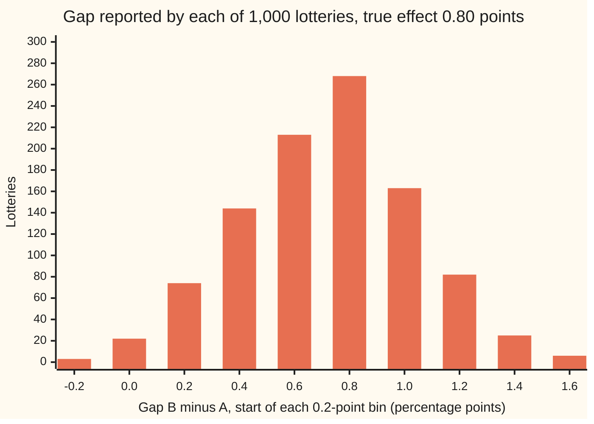
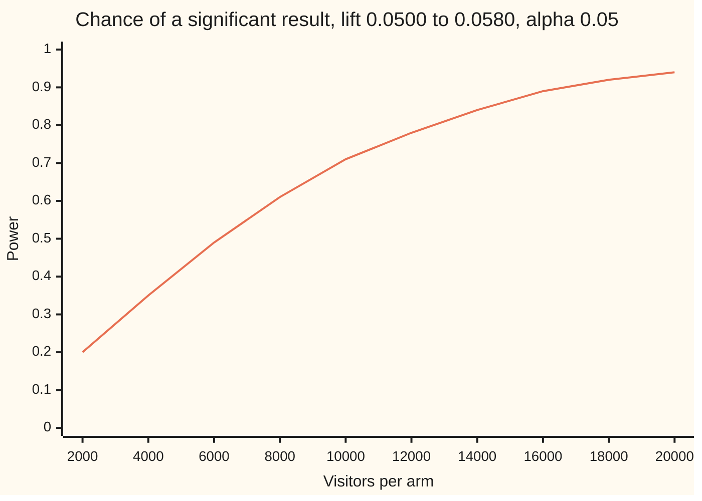

# Randomised experiments: why random assignment lets you say 'because'

[Syllabus](../../../SYLLABUS.md) → [Probability and statistics](../README.md) → [Survival, Design and Causality](../README.md#s13) → Randomised experiments

---

## General Overview

An online shop has an old checkout page, A, and a new one, B. Over two weeks, 20,000 visitors reach checkout. A lottery sends exactly 10,000 of them to each page. On page A, 500 buy: 5.00 percent. On page B, 580 buy: 5.80 percent. The gap is 0.80 of a percentage point, about 8 extra sales per 1,000 visitors.

The shop wants to say more than "B's visitors bought more". It wants to say "B's visitors bought more **because** of page B". Suppose instead B had been shown only to returning customers, who buy far more often anyway. The gap would then mix the page with the kind of visitor, and no arithmetic afterwards could separate them. The lottery is what closes that door. Chance alone decided who saw which page, so nothing about a visitor can have steered them to B.

The price is that chance also adds noise. Another lottery on the same 20,000 visitors would have given a different gap. The card proves that these gaps, averaged over every possible lottery, land exactly on the page's true effect; it measures how far one lottery can stray; and it turns that spread into the number of visitors a test needs. An experiment that assigns its treatment this way is a **randomised experiment**; on websites it is called an **A/B test**, and the two groups are its **arms**.

**Assign by lottery and the difference between the two arms' averages is, over all possible lotteries, exactly the average effect of the treatment; its spread from one lottery to the next is known, so the test can be sized before it runs.**

**What kind of fact this is:** a theorem, proved on this card in Why it works. The treatment effect it estimates is a definition, and the sizing rule is the method of [Power](../08-Confidence%20Intervals%20and%20Tests/04-power-and-sample-size.md), applied here.

### The picture: 1,000 lotteries on one shop

No real shop can rerun its lottery. A model shop can. The checks build 20,000 visitors whose behaviour on both pages is written down in advance, with a true effect of 0.0080, then draw 1,000 separate lotteries and record the gap each one would have reported.



Each bar counts the lotteries whose gap fell in a 0.2-point bin; the first and last bars also hold anything beyond them. The pile is centred on the true 0.80. The tallest bar, 268 lotteries, is the bin from 0.8 to 1.0. Yet 3 lotteries showed B losing, and 6 showed a lift of 1.6 points or more. Across all 1,000 the average gap was 0.00811, about one standard error, 0.00010, from the truth.

---

## The formula

Notation first, in words. Number the visitors $i = 1$ to $N$. Each visitor carries two **potential outcomes**: $y_i(A)$ is 1 if visitor $i$ would buy on page A and 0 if not, and $y_i(B)$ is the same for page B. Both are fixed facts about the visitor before the test begins; the test reveals only one of them. The visitor's **treatment effect** is $y_i(B) - y_i(A)$: 1 if page B wins them a sale, −1 if it loses one, 0 if it changes nothing. The **average treatment effect** $\tau$ (tau) averages that over everyone:

$$\tau = \frac{1}{N}\sum_{i=1}^{N}\bigl[\,y_i(B) - y_i(A)\,\bigr]$$

**Read it aloud:** the share of visitors who would buy on B minus the share who would buy on A, as if every visitor could be shown both pages.

The lottery sets $Z_i = 1$ if visitor $i$ lands in B and $Z_i = 0$ if in A, with exactly $n_B$ ones among the $N$ visitors and every such choice equally likely. The estimate is the difference in observed purchase rates:

$$\hat\tau = \frac{1}{n_B}\sum_{i=1}^{N} Z_i\,y_i(B) \;-\; \frac{1}{n_A}\sum_{i=1}^{N}(1 - Z_i)\,y_i(A)$$

**Read it aloud:** the buying rate among those sent to B, minus the buying rate among those sent to A.

The theorem is two lines. $E$ averages over all possible lotteries:

$$E[\hat\tau] = \tau, \qquad \operatorname{Var}(\hat\tau) = \frac{S_B^2}{n_B} + \frac{S_A^2}{n_A} - \frac{S_\tau^2}{N}$$

**Read it aloud:** averaged over every lottery, the observed gap is exactly the average effect; its variance is each page's spread divided by that arm's size, less a correction for how much the effect varies from visitor to visitor.

The spreads are the usual variance of a column of numbers, with divisor $N - 1$: $S_A^2$ for the column of $y_i(A)$, $S_B^2$ for $y_i(B)$, and $S_\tau^2$ for the column of individual effects.

Sizing borrows one formula from [Power](../08-Confidence%20Intervals%20and%20Tests/04-power-and-sample-size.md). To detect a lift from buying chance $p_A$ to $p_B$, a gap $\delta = p_B - p_A$, with a false-alarm rate $\alpha$ and power $1 - \beta$, each arm needs

$$n = \frac{\bigl(z_{1-\alpha/2}\,\sigma_0 + z_{1-\beta}\,\sigma_1\bigr)^2}{\delta^2}, \qquad \sigma_0 = \sqrt{2\bar p(1-\bar p)}, \quad \sigma_1 = \sqrt{p_A(1-p_A) + p_B(1-p_B)}$$

with $\bar p$ the average of $p_A$ and $p_B$. **Read it aloud:** visitors per arm grow with the square of the two cutoffs' combined reach and shrink with the square of the lift being chased.

| Symbol | Plain meaning | In our example | Push it up and the answer… |
| --- | --- | --- | --- |
| $N$, $i$ | visitors in the test; one visitor's number | 20,000 | the correction term shrinks |
| $n_A$, $n_B$ | visitors sent to A, to B | 10,000 each | the variance falls |
| $y_i(A)$, $y_i(B)$ | would visitor $i$ buy on A, on B: 1 or 0 | rates 0.0500 and 0.0580 in the model shop | — |
| $\tau$ | the average treatment effect | 0.0080 in the model shop | the arms' gap moves with it |
| $Z_i$ | the lottery's verdict: 1 for B, 0 for A; $C(N, n_B)$ equally likely patterns | 35 of the 70 patterns put visitor 1 in B, on the 8-visitor table | — |
| $\hat\tau$ | the observed gap, B's rate minus A's | 0.0080 | — |
| $E$, Var, $a_i$ | average and variance over all possible lotteries; $a_i$ is a helper in the proof | SD of $\hat\tau$ 0.003052 | — |
| $S_A^2$, $S_B^2$, $S_\tau^2$, $S_{AB}$ | spread of the A column, the B column, the effect column; how the A and B columns move together | 0.047502, 0.054639, 0.017937 | more spread, more noise; $S_\tau^2$ is subtracted |
| $p_A$, $p_B$, $\delta$ | buying chances used for planning, and the lift between them | 0.0500, 0.0580, 0.0080 | bigger lift: far fewer visitors |
| $\bar p$, $p$, $\bar a$ | the average of the two planning chances; one arm's observed buying rate; the average of the $a_i$ in the proof | 0.0540; 0.0500 and 0.0580; — | $\bar p$ nearer one half: more visitors |
| $\sigma_0$, $\sigma_1$ | one pair of visitors' spread in the gap, without and with the lift | 0.319637 and 0.319587 | more visitors |
| $\alpha$, $\beta$, $z_{1-\alpha/2}$, $z_{1-\beta}$ | false-alarm rate, miss rate, and their bell-curve cutoffs | 0.05, 0.20; 1.959964, 0.841621 | stricter rates: more visitors |
| $\Phi$ | the standard bell curve's area to the left of a point | $\Phi(2.5028)$ gives the p-value 0.0123 | — |

### When it holds

- **A real lottery, fixed arm sizes.** Every set of $n_B$ visitors must be equally likely to form arm B, and neither arm may be empty: $1 \le n_B \le N - 1$. Let visitors choose, or let an engineer pick, and the proof has nothing to stand on: showing B only to returning visitors reports a gap of 0.1725, not 0.0080.
- **No interference.** Each visitor's purchase depends only on the page that visitor saw. If B's buyers empty the stock of a sale item, A's visitors find it gone, and the two columns stop being fixed facts.
- **One outcome per visitor, recorded for everyone assigned.** Visitors whose session is lost more often on one page than the other bias the gap, whatever the lottery did.
- **The average is the target.** The theorem speaks about $\tau$, the average over these 20,000 visitors. It says nothing about any single visitor, and nothing about next year's visitors unless they resemble these.

---

## Why it works

### Step 0: the comparison is fair because the lottery ignores everything about the visitor

Every visitor carries two answers, one per page, and the test sees only the answer for the page they got. The missing answers are the problem of causal inference. The lottery does not fill them in. It makes the hiding random: which half of the table is hidden is decided by a coin that knows nothing about the visitors. Then the visitors seen on B are a fair sample of what all 20,000 would have done on B, and likewise for A.

### Step 1: every visitor has the same chance of landing in B

With 20,000 visitors and 10,000 slots in B, there are $C(20000, 10000)$ possible lotteries, all equally likely. Fix one visitor. The lotteries that put them in B choose the other 9,999 B-visitors from the remaining 19,999: $C(19999, 9999)$ of them. The ratio is

$$P(Z_i = 1) = \frac{C(N-1,\,n_B-1)}{C(N,\,n_B)} = \frac{n_B}{N} = \frac{1}{2}.$$

On an 8-visitor table with 4 slots in B, the 70 possible lotteries put visitor 1 in B exactly 35 times. A returning customer and a first-time visitor face the same one-in-two chance. That is the whole of balance: not that each lottery splits every kind of visitor evenly, but that no kind of visitor is favoured on average. In the first of the model shop's lotteries, 0.1992 of the B arm and 0.2008 of the A arm were returning customers, against 4,000 of 20,000 in the shop.

### Step 2: the average gap over all lotteries is the true effect

Average the B arm's buying rate over every lottery. Each visitor's $y_i(B)$ is counted with chance $n_B/N$, and the rate divides by $n_B$:

$$E\Bigl[\frac{1}{n_B}\sum_i Z_i\,y_i(B)\Bigr] = \frac{1}{n_B}\sum_i \frac{n_B}{N}\,y_i(B) = \frac{1}{N}\sum_i y_i(B).$$

That is what the whole shop would have bought on B. The same step for A, with chance $n_A/N$ of landing there, gives the whole shop's rate on A. Averages subtract, so $E[\hat\tau] = \tau$. The proof used only the expectation of a sum and Step 1. It needed no bell curve, no independence between visitors, and no model of why people buy.

Unbiased means right on average over lotteries. It does not mean right on each one. The 8-visitor table has a true effect of 0.1250, and its 70 lotteries average exactly 0.1250, yet they range from −0.5000 to 0.7500.

### Step 3: the spread of the gap from one lottery to the next

The lottery indicators are not independent: with the arm sizes fixed, one visitor landing in B makes it slightly less likely that another does. Keeping that negative dependence, the variance comes out as the formula shows. The model shop's gap has a standard deviation, over all lotteries, of 0.003052; the 1,000 simulated lotteries show 0.003117.

The trouble is the last term. $S_\tau^2$ measures how much individual effects vary, and no visitor ever shows both outcomes, so it cannot be estimated. The usual practice drops it and estimates the rest from each arm's own spread: the arm's sample variance, with divisor $n - 1$, over its size. For buy-or-not outcomes that is $p(1-p)/(n-1)$; the familiar $p(1-p)/n$ is smaller by a factor $(n-1)/n$, too little to show in the digits below. The term dropped is subtracted, so the usual variance, averaged over lotteries, is never smaller than the true one. In the model shop the usual standard error is 0.003196 against a true 0.003052. One lottery's estimate can still fall short, but on average the intervals err on the wide, safe side. Over the 1,000 lotteries, the 95 percent interval caught the true effect 952 times, give or take 7. When every visitor has the same effect, $S_\tau^2$ is zero and the two agree.

<details>
<summary>Detailed proof: the variance formula, by counting</summary>

Counting lotteries gives $E[Z_i] = n_B/N$ and, for two different visitors, $E[Z_i Z_j] = n_B(n_B - 1)/(N(N-1))$: the lotteries putting both in B choose the other $n_B - 2$ from $N - 2$. Hence
$$\operatorname{Var}(Z_i) = \frac{n_A n_B}{N^2}, \qquad \operatorname{Cov}(Z_i, Z_j) = -\frac{n_A n_B}{N^2(N-1)}.$$
Write $a_i = y_i(B)/n_B + y_i(A)/n_A$. Since $1 - Z_i$ multiplies $y_i(A)$, the estimate is $\hat\tau = \sum_i Z_i a_i - \frac{1}{n_A}\sum_i y_i(A)$, and the last sum is fixed. The variance of a sum is the sum of all variances and covariances:
$$\operatorname{Var}(\hat\tau) = \frac{n_A n_B}{N^2}\Bigl[\sum_i a_i^2 - \frac{1}{N-1}\sum_{i \ne j} a_i a_j\Bigr] = \frac{n_A n_B}{N(N-1)}\sum_i (a_i - \bar a)^2,$$
where $\bar a$ is the average of the $a_i$. Write $S_{AB}$ for the covariance of the two columns, divisor $N - 1$. Expanding the square gives $\sum_i (a_i - \bar a)^2 = (N-1)\bigl[S_B^2/n_B^2 + S_A^2/n_A^2 + 2S_{AB}/(n_A n_B)\bigr]$, so
$$\operatorname{Var}(\hat\tau) = \frac{n_A S_B^2}{N n_B} + \frac{n_B S_A^2}{N n_A} + \frac{2S_{AB}}{N}.$$
Put $n_A = N - n_B$ in the first term: it is $S_B^2/n_B - S_B^2/N$. Likewise the second is $S_A^2/n_A - S_A^2/N$. The effect column's spread is $S_\tau^2 = S_A^2 + S_B^2 - 2S_{AB}$, so the leftover terms are $-S_\tau^2/N$. That is the formula. On the 8-visitor table the variance over all 70 lotteries and the formula both give 0.069196.

</details>

### Step 4: size the test before it runs

The shop's 10,000 per arm give a standard error of about a third of a point, so a real lift of 0.8 points sits about 2.5 standard errors from zero: usually detectable, not always. The power formula makes that exact. With a 0.05 false-alarm rate and a lift from 0.0500 to 0.0580, the power at 10,000 per arm is 0.7064. An exact sum over every pair of purchase counts gives 0.7068. Reaching 80 percent power needs 12,529 visitors per arm.



The line is the power formula at each size. The shop's 10,000 per arm sit at 0.71; the curve crosses 0.80 between 12,000 and 14,000. Turned round, 10,000 per arm reliably finds a lift from 0.0500 to 0.05899, about 0.9 of a point, and nothing much smaller. A half-point lift, to 0.0550, needs 31,234 per arm.

A second way to judge the gap, one that needs no formula for the variance at all, reshuffles the observed labels and asks how often a gap this large appears by lottery alone: [Permutation tests](06-permutation-tests.md).

---

## Worked numbers, by hand

The shop's result: 500 of 10,000 bought on A, 580 of 10,000 on B.

| Step | Arithmetic | Value |
| --- | --- | --- |
| buying rates | 500 / 10,000 and 580 / 10,000 | 0.0500 and 0.0580 |
| the gap, $\hat\tau$ | 0.0580 − 0.0500 | **0.0080** |
| each arm's variance | 0.05 × 0.95 / 10,000 and 0.058 × 0.942 / 10,000 | 0.00000475 and 0.00000546 |
| standard error | square root of their sum | 0.003196 |
| 95 percent interval | 0.0080 ± 1.959964 × 0.003196 | **0.0017 to 0.0143** |
| pooled rate, if the pages were equal | 1,080 / 20,000 | 0.0540 |
| test statistic | 0.0080 / 0.003196 (pooled) | 2.5028 |
| two-sided p-value | 2 × (1 − $\Phi$(2.5028)) | 0.0123 |
| visitors per arm for 80 percent power | ((0.626478 + 0.268971) / 0.008)^2 = 12528.6 | **12,529** |

Page B's estimated lift is 0.80 of a point, standard error 0.32 of a point: about 8 extra sales per 1,000 visitors. The interval runs from 0.17 to 1.43 points; the recipe that built it catches the true lift in 95 of every 100 tests, and says nothing more about this one. If the pages were truly equal, a gap at least this large, either way, would turn up in about 12 tests in 1,000. That p-value is not the chance that page B is no better. The lottery is what licenses "because": the lift is caused by the page, up to that chance noise.

### What breaks if you drop a piece

The model shop's true effect is 0.0080. Its returning customers, 4,000 of the 20,000, buy at 0.1800 on A and 0.1900 on B; its 16,000 new visitors at 0.0175 and 0.0250.

| Mistake | Comes out at | What went wrong |
| --- | --- | --- |
| B shown to returning visitors only, A to new ones | gap 0.1725 | the gap measures who the visitors are, not the page |
| B shown to new visitors only, A to returning ones | gap −0.1550 | same page, now it looks harmful: the assignment made the answer |
| one lottery read as the truth | 1,000 lotteries ranged from −0.0011 to 0.0176 | unbiased is a statement about the average over lotteries |
| chasing a half-point lift with 10,000 per arm | power 0.3541 | the lift sits too close to the noise; 31,234 per arm are needed |

The code prints all four.

---

## Code, from first principles, and it actually runs

Nothing is imported beyond square roots, logarithms and exponentials. The bell curve's area is a Taylor series, its inverse is Newton's method, and every random draw comes from SplitMix64, a small generator written out in both languages with seed 20260929, so both print identical lotteries. The theorem is reached by three roads. First, exact formulas applied to a model shop of 20,000 visitors whose two potential outcomes are both written down: 900 who buy on either page, 260 whom B wins, 100 whom B loses, and 18,740 who never buy. Second, every one of the 70 lotteries on an 8-visitor table, enumerated. Third, 1,000 seeded lotteries on the model shop. The sizing is reached twice: by the normal formula, and by an exact sum over every pair of purchase counts.

### Python

```python
# Randomised experiments and A/B tests -- the check behind the card.  Standard library only.
# Checkout pages A (old) and B (new), 10,000 visitors each, assigned by lottery.  Road 1: exact
# formulas on a model table of both outcomes for 20,000 visitors.  Road 2: all 70 lotteries on an
# 8-visitor table.  Road 3: 1,000 seeded lotteries (SplitMix64).  Sizing: formula against exact count.
from math import sqrt, pi, exp, ceil, log
SEED, R, NA, NB = 20260929, 1000, 10000, 10000

def Phi(z):                                   # bell area left of z, by its Taylor series
    term, total = z, z
    for k in range(1, 300):
        term *= -z * z / (2 * k)
        total += term / (2 * k + 1)
    return 0.5 + total / sqrt(2 * pi)
def Phi_inv(p, z=0.0):                        # normal quantile by Newton's method from 0
    for _ in range(50): z -= (Phi(z) - p) / (exp(-z * z / 2) / sqrt(2 * pi))
    return z
def neyman(yA, yB, nA, nB):                   # road 1: the exact variance over all lotteries
    N = len(yA)
    def S2(col): m = sum(col) / N; return sum((v - m) ** 2 for v in col) / (N - 1)
    SA, SB, St = S2(yA), S2(yB), S2([b - a for a, b in zip(yA, yB)])
    return SA, SB, St, SB / nB + SA / nA - St / N
# the model population: (returning?, count) for each kind of visitor, (y(A), y(B))
KINDS = [(1, 700, 1, 1), (1, 60, 0, 1), (1, 20, 1, 0), (1, 3220, 0, 0),
         (0, 200, 1, 1), (0, 200, 0, 1), (0, 80, 1, 0), (0, 15520, 0, 0)]
ret, yA, yB = [], [], []
for r, c, a, b in KINDS:
    ret += [r] * c; yA += [a] * c; yB += [b] * c
N = len(yA)
tau = (sum(yB) - sum(yA)) / N
kind = lambda a, b: sum(c for r, c, x, y in KINDS if (x, y) == (a, b))
xA, xB = 500, 580                             # the observed test
gap = xB / NB - xA / NA
pool = (xA + xB) / (NA + NB)
se0 = sqrt(pool * (1 - pool) * (1 / NA + 1 / NB))
se1 = sqrt(xA / NA * (1 - xA / NA) / NA + xB / NB * (1 - xB / NB) / NB)
za, zb = Phi_inv(0.975), Phi_inv(0.80)
print(f"observed: A {xA} of {NA} = {xA / NA:.4f}, B {xB} of {NB} = {xB / NB:.4f}, gap {gap:.4f}")
print(f"observed: pooled rate {pool:.4f}, pooled SE {se0:.6f}, z {gap / se0:.4f}, two-sided p-value {2 * (1 - Phi(gap / se0)):.4f}")
print(f"observed: arm variances {xA / NA * (1 - xA / NA) / NA:.8f} + {xB / NB * (1 - xB / NB) / NB:.8f}, unpooled SE {se1:.6f}, 95% interval {gap - za * se1:.4f} to {gap + za * se1:.4f}")
print(f"model: N {N}; always {kind(1, 1)}, helped {kind(0, 1)}, hurt {kind(1, 0)}, never {kind(0, 0)}")
print(f"model: y(A) rate {sum(yA) / N:.4f}, y(B) rate {sum(yB) / N:.4f}, true effect tau {tau:.4f}")
nret = sum(ret)
rA = sum(a for a, r in zip(yA, ret) if r); rB = sum(b for b, r in zip(yB, ret) if r)
print(f"model: returning {nret} (A {rA / nret:.4f}, B {rB / nret:.4f}), new {N - nret} "
      f"(A {(sum(yA) - rA) / (N - nret):.4f}, B {(sum(yB) - rB) / (N - nret):.4f})")
SA, SB, St, V = neyman(yA, yB, NA, NB)
print(f"exact: S_A^2 {SA:.6f}, S_B^2 {SB:.6f}, S_tau^2 {St:.6f}")
print(f"exact: SD of tau hat over all lotteries {sqrt(V):.6f}; usual SE formula {sqrt(SA / NA + SB / NB):.6f}")
# road 2: the 8-visitor table, every lottery of 4 into B
sA, sB = [1, 0, 0, 1, 0, 0, 0, 0], [1, 1, 1, 0, 0, 0, 0, 0]
gaps8, in_B, total8 = [], 0, 0
for mask in range(256):
    if bin(mask).count("1") != 4: continue
    b = sum(sB[i] for i in range(8) if mask >> i & 1)
    a = sum(sA[i] for i in range(8) if not mask >> i & 1)
    gaps8.append((b - a) / 4); total8 += b - a; in_B += mask & 1
tau8, m8 = (sum(sB) - sum(sA)) / 8, sum(gaps8) / len(gaps8)
v8 = sum((g - m8) ** 2 for g in gaps8) / len(gaps8)
print(f"enumeration, 8 visitors: {len(gaps8)} lotteries; visitor 1 lands in B in {in_B} of {len(gaps8)}")
print(f"enumeration: tau {tau8:.4f}, mean of all gaps {m8:.4f}; variance {v8:.6f}, formula {neyman(sA, sB, 4, 4)[3]:.6f}")
print(f"enumeration: smallest gap {min(gaps8):.4f}, largest {max(gaps8):.4f}")
# road 3: seeded lotteries on the 20,000 visitors
class Rng:                                    # SplitMix64
    def __init__(self, s): self.s = s
    def next(self):
        z = self.s = (self.s + 0x9E3779B97F4A7C15) & 0xFFFFFFFFFFFFFFFF
        z = ((z ^ (z >> 30)) * 0xBF58476D1CE4E5B9) & 0xFFFFFFFFFFFFFFFF
        z = ((z ^ (z >> 27)) * 0x94D049BB133111EB) & 0xFFFFFFFFFFFFFFFF
        return z ^ (z >> 31)
rng, perm, sims, cover, bins = Rng(SEED), list(range(N)), [], 0, [0] * 10
for t in range(R):
    for i in range(NB):                       # the first NB places of a Fisher-Yates shuffle go to B
        j = i + rng.next() % (N - i)
        perm[i], perm[j] = perm[j], perm[i]
    b = sum(yB[k] for k in perm[:NB]); a = sum(yA[k] for k in perm[NB:])
    g = b / NB - a / NA
    se = sqrt(a / NA * (1 - a / NA) / NA + b / NB * (1 - b / NB) / NB)
    cover += abs(g - tau) <= za * se; sims.append(g)
    bins[min(max((b - a + 20) // 20, 0), 9)] += 1      # 0.2-point bins; the end bins take the tails
    if t == 0:
        print(f"simulation: first lottery, returning share in B {sum(ret[k] for k in perm[:NB]) / NB:.4f}, "
              f"in A {sum(ret[k] for k in perm[NB:]) / NA:.4f}")
ms = sum(sims) / R
sd = sqrt(sum((g - ms) ** 2 for g in sims) / (R - 1))
print(f"simulation: {R} lotteries, seed {SEED}: mean gap {ms:.5f} +- {sd / sqrt(R):.5f}, SD {sd:.6f}")
print(f"simulation: the 95% interval caught tau in {cover} of {R} ({cover / R:.4f})")
print(f"simulation: smallest gap {min(sims):.4f}, largest {max(sims):.4f}")
# what breaks: assignment chosen by who the visitor is
print(f"breaks, B shown to returning visitors only: gap {rB / nret - (sum(yA) - rA) / (N - nret):.4f}")
print(f"breaks, B shown to new visitors only: gap {(sum(yB) - rB) / (N - nret) - rA / nret:.4f}")
# sizing
def spreads(p0, p1):
    pb = (p0 + p1) / 2
    return sqrt(2 * pb * (1 - pb)), sqrt(p0 * (1 - p0) + p1 * (1 - p1))
def power(n, p0, p1):                         # normal formula, both tails
    s0, s1 = spreads(p0, p1)
    return Phi(((p1 - p0) * sqrt(n) - za * s0) / s1) + Phi((-(p1 - p0) * sqrt(n) - za * s0) / s1)
def n_need(p0, p1):
    s0, s1 = spreads(p0, p1)
    return ceil(((za * s0 + zb * s1) / (p1 - p0)) ** 2)
def pmf_window(n, p):                         # binomial chances within 12 SDs of the mean, by logs
    m, s = n * p, sqrt(n * p * (1 - p))
    lo, hi = max(0, int(m - 12 * s)), min(n, int(m + 12 * s))
    lg = sum(log(k) for k in range(1, lo + 1)) - sum(log(k) for k in range(n - lo + 1, n + 1))
    out, lp = {}, None
    for k in range(lo, hi + 1):
        lp = (-lg + lo * log(p) + (n - lo) * log(1 - p)) if k == lo else lp + log((n - k + 1) / k * p / (1 - p))
        out[k] = exp(lp)
    return out
def power_exact(n, p0, p1):                   # road 2 for sizing: add every rejecting pair of counts
    f0, f1, tot = pmf_window(n, p0), pmf_window(n, p1), 0.0
    for x1, q1 in f1.items():
        for x0, q0 in f0.items():
            pl = (x0 + x1) / (2 * n)
            if abs(x1 - x0) / n > za * sqrt(pl * (1 - pl) * 2 / n): tot += q1 * q0
    return tot
s0, s1 = spreads(0.05, 0.058); lo, hi = 0.05, 0.07
for _ in range(60):
    mid = (lo + hi) / 2
    lo, hi = (mid, hi) if power(NA, 0.05, mid) < 0.80 else (lo, mid)
pf, pe = power(NA, 0.05, 0.058), power_exact(NA, 0.05, 0.058)
print(f"sizing: z(0.975) {za:.6f}, z(0.80) {zb:.6f}, sigma0 {s0:.6f}, sigma1 {s1:.6f}")
print(f"sizing: 0.0500 -> 0.0580: (({za * s0:.6f} + {zb * s1:.6f}) / 0.008)^2 = {((za * s0 + zb * s1) / 0.008) ** 2:.1f}, needs {n_need(0.05, 0.058)} per arm")
print(f"sizing: power at {NA} per arm, formula {pf:.4f}, exact count {pe:.4f}")
print(f"sizing: smallest lift found with 80% power at {NA} per arm: 0.0500 -> {hi:.5f}")
print(f"sizing: 0.0500 -> 0.0550 needs {n_need(0.05, 0.055)} per arm; power at {NA} per arm {power(NA, 0.05, 0.055):.4f}")
ns = list(range(2000, 22000, 2000))
print("figure, gap bin starts (points)", " ".join(f"{-0.2 + 0.2 * i:.1f}" for i in range(10)))
print("figure, lotteries per bin", " ".join(str(c) for c in bins))
print("figure, visitors per arm", " ".join(str(n) for n in ns))
print("figure, power at 0.8-point lift", " ".join(f"{power(n, 0.05, 0.058):.2f}" for n in ns))
assert total8 * 8 == len(gaps8) * 4 * (sum(sB) - sum(sA))            # enumeration vs definition of tau
assert abs(v8 - neyman(sA, sB, 4, 4)[3]) < 1e-12 and 2 * in_B == len(gaps8)    # enumeration vs variance formula; Step 1
S8 = neyman(sA, sB, 4, 4); assert v8 < S8[0] / 4 + S8[1] / 4             # usual variance errs on the safe side
assert abs(ms - tau) < 4 * sd / sqrt(R) and abs(sd / sqrt(V) - 1) < 0.15  # simulation vs exact
assert abs(pf - pe) < 0.01                                              # formula vs exact count
assert power(n_need(0.05, 0.058), 0.05, 0.058) >= 0.80 > power(n_need(0.05, 0.058) - 1, 0.05, 0.058)
assert abs(za - 1.959963984540054) < 1e-9                               # published 97.5% point
assert cover / R > 0.93                                                 # coverage by lottery
print("all checks passed")
```

**Ran 2026-09-29 on macOS, Python 3.14.6, standard library only. All checks passed. Output, pasted from the run:**

```
observed: A 500 of 10000 = 0.0500, B 580 of 10000 = 0.0580, gap 0.0080
observed: pooled rate 0.0540, pooled SE 0.003196, z 2.5028, two-sided p-value 0.0123
observed: arm variances 0.00000475 + 0.00000546, unpooled SE 0.003196, 95% interval 0.0017 to 0.0143
model: N 20000; always 900, helped 260, hurt 100, never 18740
model: y(A) rate 0.0500, y(B) rate 0.0580, true effect tau 0.0080
model: returning 4000 (A 0.1800, B 0.1900), new 16000 (A 0.0175, B 0.0250)
exact: S_A^2 0.047502, S_B^2 0.054639, S_tau^2 0.017937
exact: SD of tau hat over all lotteries 0.003052; usual SE formula 0.003196
enumeration, 8 visitors: 70 lotteries; visitor 1 lands in B in 35 of 70
enumeration: tau 0.1250, mean of all gaps 0.1250; variance 0.069196, formula 0.069196
enumeration: smallest gap -0.5000, largest 0.7500
simulation: first lottery, returning share in B 0.1992, in A 0.2008
simulation: 1000 lotteries, seed 20260929: mean gap 0.00811 +- 0.00010, SD 0.003117
simulation: the 95% interval caught tau in 952 of 1000 (0.9520)
simulation: smallest gap -0.0011, largest 0.0176
breaks, B shown to returning visitors only: gap 0.1725
breaks, B shown to new visitors only: gap -0.1550
sizing: z(0.975) 1.959964, z(0.80) 0.841621, sigma0 0.319637, sigma1 0.319587
sizing: 0.0500 -> 0.0580: ((0.626478 + 0.268971) / 0.008)^2 = 12528.6, needs 12529 per arm
sizing: power at 10000 per arm, formula 0.7064, exact count 0.7068
sizing: smallest lift found with 80% power at 10000 per arm: 0.0500 -> 0.05899
sizing: 0.0500 -> 0.0550 needs 31234 per arm; power at 10000 per arm 0.3541
figure, gap bin starts (points) -0.2 0.0 0.2 0.4 0.6 0.8 1.0 1.2 1.4 1.6
figure, lotteries per bin 3 22 74 144 213 268 163 82 25 6
figure, visitors per arm 2000 4000 6000 8000 10000 12000 14000 16000 18000 20000
figure, power at 0.8-point lift 0.20 0.35 0.49 0.61 0.71 0.78 0.84 0.89 0.92 0.94
all checks passed
```

### Rust

Same numbers, same labels, built with `rustc --edition 2021 -O`.

```rust
// Randomised experiments and A/B tests -- the same check as the Python, in Rust.  No crates.
// Checkout pages A (old) and B (new), 10,000 visitors each, assigned by lottery.  Road 1: exact
// formulas on a model table of both outcomes for 20,000 visitors.  Road 2: all 70 lotteries on an
// 8-visitor table.  Road 3: 1,000 seeded lotteries (SplitMix64).  Sizing: formula against exact count.
use std::f64::consts::PI;
const SEED: u64 = 20260929;
const R: usize = 1000; const NA: usize = 10000; const NB: usize = 10000;
fn phi_cdf(z: f64) -> f64 {                    // bell area left of z, by its Taylor series
    let (mut term, mut total) = (z, z);
    for k in 1..300 { let k = k as f64; term *= -z * z / (2.0 * k); total += term / (2.0 * k + 1.0) }
    0.5 + total / (2.0 * PI).sqrt()
}
fn phi_inv(p: f64) -> f64 {                    // normal quantile by Newton's method from 0
    let mut z = 0.0;
    for _ in 0..50 { z -= (phi_cdf(z) - p) / ((-z * z / 2.0).exp() / (2.0 * PI).sqrt()) }
    z
}
fn neyman(ya: &[i64], yb: &[i64], na: f64, nb: f64) -> (f64, f64, f64, f64) {   // road 1
    let n = ya.len() as f64;
    let s2 = |col: &[i64]| {
        let m = col.iter().sum::<i64>() as f64 / n; col.iter().map(|&v| (v as f64 - m).powi(2)).sum::<f64>() / (n - 1.0)
    };
    let eff: Vec<i64> = ya.iter().zip(yb).map(|(a, b)| b - a).collect();
    let (sa, sb, st) = (s2(ya), s2(yb), s2(&eff));
    (sa, sb, st, sb / nb + sa / na - st / n)
}
struct Rng(u64);                                // SplitMix64
impl Rng {
    fn next(&mut self) -> u64 {
        self.0 = self.0.wrapping_add(0x9E3779B97F4A7C15); let mut z = self.0;
        z = (z ^ (z >> 30)).wrapping_mul(0xBF58476D1CE4E5B9);
        z = (z ^ (z >> 27)).wrapping_mul(0x94D049BB133111EB);
        z ^ (z >> 31)
    }
}
fn spreads(p0: f64, p1: f64) -> (f64, f64) {
    let pb = (p0 + p1) / 2.0;
    ((2.0 * pb * (1.0 - pb)).sqrt(), (p0 * (1.0 - p0) + p1 * (1.0 - p1)).sqrt())
}
fn power(n: f64, p0: f64, p1: f64, za: f64) -> f64 {          // normal formula, both tails
    let (s0, s1) = spreads(p0, p1);
    phi_cdf(((p1 - p0) * n.sqrt() - za * s0) / s1) + phi_cdf((-(p1 - p0) * n.sqrt() - za * s0) / s1)
}
fn n_need(p0: f64, p1: f64, za: f64, zb: f64) -> usize {
    let (s0, s1) = spreads(p0, p1);
    ((za * s0 + zb * s1) / (p1 - p0)).powi(2).ceil() as usize
}
fn pmf_window(n: usize, p: f64) -> Vec<(usize, f64)> {        // binomial chances within 12 SDs, by logs
    let (m, s) = (n as f64 * p, (n as f64 * p * (1.0 - p)).sqrt());
    let lo = if m - 12.0 * s > 0.0 { (m - 12.0 * s) as usize } else { 0 };
    let hi = ((m + 12.0 * s) as usize).min(n);
    let lg = (1..=lo).map(|k| (k as f64).ln()).sum::<f64>() - (n - lo + 1..=n).map(|k| (k as f64).ln()).sum::<f64>();
    let (mut out, mut lp) = (Vec::new(), 0.0);
    for k in lo..=hi {
        lp = if k == lo { -lg + lo as f64 * p.ln() + (n - lo) as f64 * (1.0 - p).ln() }
             else { lp + ((n - k + 1) as f64 / k as f64 * p / (1.0 - p)).ln() };
        out.push((k, lp.exp()));
    }
    out
}
fn power_exact(n: usize, p0: f64, p1: f64, za: f64) -> f64 {  // road 2 for sizing: every rejecting pair
    let (f0, f1, nf) = (pmf_window(n, p0), pmf_window(n, p1), n as f64);
    let mut tot = 0.0;
    for &(x1, q1) in &f1 {
        for &(x0, q0) in &f0 {
            let pl = (x0 + x1) as f64 / (2.0 * nf);
            if (x1 as f64 - x0 as f64).abs() / nf > za * (pl * (1.0 - pl) * 2.0 / nf).sqrt() { tot += q1 * q0 }
        }
    }
    tot
}
fn main() {
    let kinds: [(i64, usize, i64, i64); 8] = [(1, 700, 1, 1), (1, 60, 0, 1), (1, 20, 1, 0), (1, 3220, 0, 0),
        (0, 200, 1, 1), (0, 200, 0, 1), (0, 80, 1, 0), (0, 15520, 0, 0)];
    let (mut ret, mut ya, mut yb) = (Vec::new(), Vec::new(), Vec::new());
    for &(r, c, a, b) in &kinds { for _ in 0..c { ret.push(r); ya.push(a); yb.push(b) } }
    let n = ya.len();
    let (sum_a, sum_b) = (ya.iter().sum::<i64>(), yb.iter().sum::<i64>());
    let tau = (sum_b - sum_a) as f64 / n as f64;
    let kind = |a: i64, b: i64| kinds.iter().filter(|k| (k.2, k.3) == (a, b)).map(|k| k.1).sum::<usize>();
    let (na, nb) = (NA as f64, NB as f64);
    let (xa, xb) = (500.0, 580.0);                               // the observed test
    let gap = xb / nb - xa / na;
    let pool = (xa + xb) / (na + nb);
    let se0 = (pool * (1.0 - pool) * (1.0 / na + 1.0 / nb)).sqrt();
    let se1 = (xa / na * (1.0 - xa / na) / na + xb / nb * (1.0 - xb / nb) / nb).sqrt();
    let (za, zb) = (phi_inv(0.975), phi_inv(0.80));
    println!("observed: A {} of {} = {:.4}, B {} of {} = {:.4}, gap {:.4}", xa, NA, xa / na, xb, NB, xb / nb, gap);
    println!("observed: pooled rate {:.4}, pooled SE {:.6}, z {:.4}, two-sided p-value {:.4}", pool, se0, gap / se0, 2.0 * (1.0 - phi_cdf(gap / se0)));
    println!("observed: arm variances {:.8} + {:.8}, unpooled SE {:.6}, 95% interval {:.4} to {:.4}", xa / na * (1.0 - xa / na) / na, xb / nb * (1.0 - xb / nb) / nb, se1, gap - za * se1, gap + za * se1);
    println!("model: N {}; always {}, helped {}, hurt {}, never {}", n, kind(1, 1), kind(0, 1), kind(1, 0), kind(0, 0));
    println!("model: y(A) rate {:.4}, y(B) rate {:.4}, true effect tau {:.4}", sum_a as f64 / n as f64, sum_b as f64 / n as f64, tau);
    let nret = ret.iter().sum::<i64>() as f64;
    let ra = (0..n).filter(|&i| ret[i] == 1).map(|i| ya[i]).sum::<i64>() as f64;
    let rb = (0..n).filter(|&i| ret[i] == 1).map(|i| yb[i]).sum::<i64>() as f64;
    let nnew = n as f64 - nret;
    println!("model: returning {} (A {:.4}, B {:.4}), new {} (A {:.4}, B {:.4})", nret, ra / nret, rb / nret, nnew,
             (sum_a as f64 - ra) / nnew, (sum_b as f64 - rb) / nnew);
    let (sa, sb, st, v) = neyman(&ya, &yb, na, nb);
    println!("exact: S_A^2 {:.6}, S_B^2 {:.6}, S_tau^2 {:.6}", sa, sb, st);
    println!("exact: SD of tau hat over all lotteries {:.6}; usual SE formula {:.6}", v.sqrt(), (sa / na + sb / nb).sqrt());
    let (sa8, sb8): ([i64; 8], [i64; 8]) = ([1, 0, 0, 1, 0, 0, 0, 0], [1, 1, 1, 0, 0, 0, 0, 0]);  // road 2
    let (mut gaps8, mut in_b, mut total8) = (Vec::new(), 0, 0i64);
    for mask in 0u32..256 {
        if mask.count_ones() != 4 { continue }   // every way to put 4 of the 8 into B
        let b: i64 = (0..8).filter(|i| mask >> i & 1 == 1).map(|i| sb8[i]).sum();
        let a: i64 = (0..8).filter(|i| mask >> i & 1 == 0).map(|i| sa8[i]).sum();
        gaps8.push((b - a) as f64 / 4.0); total8 += b - a; in_b += mask & 1;
    }
    let len8 = gaps8.len() as f64; let (tau8, m8) = ((sb8.iter().sum::<i64>() - sa8.iter().sum::<i64>()) as f64 / 8.0, gaps8.iter().sum::<f64>() / len8);
    let v8 = gaps8.iter().map(|g| (g - m8).powi(2)).sum::<f64>() / len8;
    let f8 = neyman(&sa8, &sb8, 4.0, 4.0).3;
    let (mn8, mx8) = gaps8.iter().fold((f64::MAX, f64::MIN), |(l, h), &g| (l.min(g), h.max(g)));
    println!("enumeration, 8 visitors: {} lotteries; visitor 1 lands in B in {} of {}", gaps8.len(), in_b, gaps8.len());
    println!("enumeration: tau {:.4}, mean of all gaps {:.4}; variance {:.6}, formula {:.6}", tau8, m8, v8, f8);
    println!("enumeration: smallest gap {:.4}, largest {:.4}", mn8, mx8);
    let mut rng = Rng(SEED);                                     // road 3: seeded lotteries
    let (mut perm, mut sims, mut cover, mut bins): (Vec<usize>, Vec<f64>, usize, [usize; 10]) = ((0..n).collect(), Vec::new(), 0, [0; 10]);
    for t in 0..R {
        for i in 0..NB {                                        // the first NB places of a Fisher-Yates shuffle go to B
            let j = i + (rng.next() % (n - i) as u64) as usize; perm.swap(i, j);
        }
        let b = perm[..NB].iter().map(|&k| yb[k]).sum::<i64>();
        let a = perm[NB..].iter().map(|&k| ya[k]).sum::<i64>();
        let (af, bf) = (a as f64, b as f64);
        let g = bf / nb - af / na;
        let se = (af / na * (1.0 - af / na) / na + bf / nb * (1.0 - bf / nb) / nb).sqrt();
        if (g - tau).abs() <= za * se { cover += 1 }
        sims.push(g);
        bins[(b - a + 20).div_euclid(20).clamp(0, 9) as usize] += 1;   // 0.2-point bins; the end bins take the tails
        if t == 0 {
            println!("simulation: first lottery, returning share in B {:.4}, in A {:.4}",
                     perm[..NB].iter().map(|&k| ret[k]).sum::<i64>() as f64 / nb, perm[NB..].iter().map(|&k| ret[k]).sum::<i64>() as f64 / na);
        }
    }
    let rf = R as f64;
    let ms = sims.iter().sum::<f64>() / rf;
    let sd = (sims.iter().map(|g| (g - ms).powi(2)).sum::<f64>() / (rf - 1.0)).sqrt();
    let (mn, mx) = sims.iter().fold((f64::MAX, f64::MIN), |(l, h), &g| (l.min(g), h.max(g)));
    println!("simulation: {} lotteries, seed {}: mean gap {:.5} +- {:.5}, SD {:.6}", R, SEED, ms, sd / rf.sqrt(), sd);
    println!("simulation: the 95% interval caught tau in {} of {} ({:.4})", cover, R, cover as f64 / rf);
    println!("simulation: smallest gap {:.4}, largest {:.4}", mn, mx);
    println!("breaks, B shown to returning visitors only: gap {:.4}", rb / nret - (sum_a as f64 - ra) / nnew);
    println!("breaks, B shown to new visitors only: gap {:.4}", (sum_b as f64 - rb) / nnew - ra / nret);
    let (s0, s1) = spreads(0.05, 0.058);                         // sizing
    let (mut lo, mut hi) = (0.05, 0.07);
    for _ in 0..60 { let mid = (lo + hi) / 2.0; if power(na, 0.05, mid, za) < 0.80 { lo = mid } else { hi = mid } }
    let (pf, pe) = (power(na, 0.05, 0.058, za), power_exact(NA, 0.05, 0.058, za));
    let need = n_need(0.05, 0.058, za, zb);
    println!("sizing: z(0.975) {:.6}, z(0.80) {:.6}, sigma0 {:.6}, sigma1 {:.6}", za, zb, s0, s1);
    println!("sizing: 0.0500 -> 0.0580: (({:.6} + {:.6}) / 0.008)^2 = {:.1}, needs {} per arm", za * s0, zb * s1, ((za * s0 + zb * s1) / 0.008).powi(2), need);
    println!("sizing: power at {} per arm, formula {:.4}, exact count {:.4}", NA, pf, pe);
    println!("sizing: smallest lift found with 80% power at {} per arm: 0.0500 -> {:.5}", NA, hi);
    println!("sizing: 0.0500 -> 0.0550 needs {} per arm; power at {} per arm {:.4}", n_need(0.05, 0.055, za, zb), NA, power(na, 0.05, 0.055, za));
    let ns: Vec<usize> = (1..=10).map(|i| 2000 * i).collect();
    let starts: Vec<String> = (0..10).map(|i| format!("{:.1}", -0.2 + 0.2 * i as f64)).collect();
    println!("figure, gap bin starts (points) {}", starts.join(" "));
    println!("figure, lotteries per bin {}", bins.iter().map(|c| c.to_string()).collect::<Vec<_>>().join(" "));
    println!("figure, visitors per arm {}", ns.iter().map(|c| c.to_string()).collect::<Vec<_>>().join(" "));
    println!("figure, power at 0.8-point lift {}", ns.iter().map(|&m| format!("{:.2}", power(m as f64, 0.05, 0.058, za))).collect::<Vec<_>>().join(" "));
    let diff8 = sb8.iter().sum::<i64>() - sa8.iter().sum::<i64>(); assert!(total8 * 8 == gaps8.len() as i64 * 4 * diff8);  // vs tau
    assert!((v8 - f8).abs() < 1e-12 && 2 * in_b as usize == gaps8.len());   // enumeration vs variance formula; Step 1
    let s8 = neyman(&sa8, &sb8, 4.0, 4.0); assert!(v8 < s8.0 / 4.0 + s8.1 / 4.0);  // usual variance errs on the safe side
    assert!((ms - tau).abs() < 4.0 * sd / rf.sqrt() && (sd / v.sqrt() - 1.0).abs() < 0.15);  // simulation vs exact
    assert!((pf - pe).abs() < 0.01);                                        // formula vs exact count
    assert!(power(need as f64, 0.05, 0.058, za) >= 0.80 && 0.80 > power((need - 1) as f64, 0.05, 0.058, za));
    assert!((za - 1.959963984540054).abs() < 1e-9);                         // published 97.5% point
    assert!(cover as f64 / rf > 0.93);                                      // coverage by lottery
    println!("all checks passed");
}
```

**Ran 2026-09-29 on macOS, rustc 1.98.1, no crates. All checks passed. Output, pasted from the run:**

```
observed: A 500 of 10000 = 0.0500, B 580 of 10000 = 0.0580, gap 0.0080
observed: pooled rate 0.0540, pooled SE 0.003196, z 2.5028, two-sided p-value 0.0123
observed: arm variances 0.00000475 + 0.00000546, unpooled SE 0.003196, 95% interval 0.0017 to 0.0143
model: N 20000; always 900, helped 260, hurt 100, never 18740
model: y(A) rate 0.0500, y(B) rate 0.0580, true effect tau 0.0080
model: returning 4000 (A 0.1800, B 0.1900), new 16000 (A 0.0175, B 0.0250)
exact: S_A^2 0.047502, S_B^2 0.054639, S_tau^2 0.017937
exact: SD of tau hat over all lotteries 0.003052; usual SE formula 0.003196
enumeration, 8 visitors: 70 lotteries; visitor 1 lands in B in 35 of 70
enumeration: tau 0.1250, mean of all gaps 0.1250; variance 0.069196, formula 0.069196
enumeration: smallest gap -0.5000, largest 0.7500
simulation: first lottery, returning share in B 0.1992, in A 0.2008
simulation: 1000 lotteries, seed 20260929: mean gap 0.00811 +- 0.00010, SD 0.003117
simulation: the 95% interval caught tau in 952 of 1000 (0.9520)
simulation: smallest gap -0.0011, largest 0.0176
breaks, B shown to returning visitors only: gap 0.1725
breaks, B shown to new visitors only: gap -0.1550
sizing: z(0.975) 1.959964, z(0.80) 0.841621, sigma0 0.319637, sigma1 0.319587
sizing: 0.0500 -> 0.0580: ((0.626478 + 0.268971) / 0.008)^2 = 12528.6, needs 12529 per arm
sizing: power at 10000 per arm, formula 0.7064, exact count 0.7068
sizing: smallest lift found with 80% power at 10000 per arm: 0.0500 -> 0.05899
sizing: 0.0500 -> 0.0550 needs 31234 per arm; power at 10000 per arm 0.3541
figure, gap bin starts (points) -0.2 0.0 0.2 0.4 0.6 0.8 1.0 1.2 1.4 1.6
figure, lotteries per bin 3 22 74 144 213 268 163 82 25 6
figure, visitors per arm 2000 4000 6000 8000 10000 12000 14000 16000 18000 20000
figure, power at 0.8-point lift 0.20 0.35 0.49 0.61 0.71 0.78 0.84 0.89 0.92 0.94
all checks passed
```

The two outputs match line for line.

> [!TIP]
> **Try changing**
> Guess first, then run it.
> - **Take the lottery away.** In the shuffle, replace `j = i + rng.next() % (N - i)` with `j = i`. B now gets the first 10,000 visitors in the table, all 4,000 returning customers among them. Guess the mean gap: far above 0.0080, and the fourth assert stops the program.
> - **Remove the visitors page B loses.** In `KINDS`, change the two rows ending `1, 0` to end `0, 0`, so they buy on neither page. The average effect rises to 0.0130, $S_\tau^2$ shrinks, and the true standard deviation moves closer to the usual standard error; the asserts still pass, since each road recomputes the new truth.
> - **Ask for 90 percent power.** Change `Phi_inv(0.80)` to `Phi_inv(0.90)`. The visitors needed per arm rise well above 12,529, and the sixth assert, still pinned to the 80 percent boundary, stops the program.
> - **Change the seed.** The 1,000 lotteries change, the mean gap moves by a standard error or so, and the histogram's bars shift a little; the true effect does not move.

---

## The usual mistake

> [!warning]
> **Reading a gap between self-selected groups as an effect.** Comparing customers who chose the new page with those who did not, or this month's visitors with last month's, is not an experiment. The groups differ in who they are, and the gap mixes that difference with the page. In the model shop, showing B only to returning customers reports a lift of 17.25 points for a page worth 0.80; showing it only to new ones reports a loss of 15.50. Adjusting afterwards for the differences someone thought to record cannot promise to remove the ones nobody recorded. The lottery balances both kinds, on average, because it never looks at the visitor. The sibling card [Confounding](07-confounding-and-simpsons-paradox.md) takes that failure apart.
>
> - **Unbiased read as accurate.** One lottery can land anywhere in the histogram. Across 1,000 lotteries on a shop with a true lift of 0.80 points, the reported gap ran from −0.11 to 1.76 points. Quote the gap with its standard error, 0.0080 ± 0.0032 here.
> - **A p-value read as the chance B is no better.** The 0.0123 is the chance of a gap this large if the pages were equal, a statement about the data under an assumption, not about the assumption.
> - **Stopping when the result looks good.** Checking every day and stopping at the first p-value under 0.05 raises the false-alarm rate far above 5 percent; the sample size is fixed in advance for that reason. Each daily look is one more test in a family, and [Many tests](../08-Confidence%20Intervals%20and%20Tests/08-multiple-testing.md) shows how a family's false alarms pile up and how Bonferroni's correction bounds them.
> - **Analysing by what visitors did instead of where they were sent.** Dropping visitors who left B's page before it finished loading keeps only B's patient visitors. Compare the arms as assigned.

---

## Where you meet it in real life

- **Online experiments.** Large sites run thousands of A/B tests a year on layouts, prices and rankings. Before reading any result they check the arms came out the sizes the lottery intended; a split that drifts, a **sample ratio mismatch**, usually means visitors were lost unevenly and the comparison is void.
- **Clinical trials.** Drug trials randomise patients between the new drug and a placebo for the same reason, and analyse patients in the arm they were assigned to even if they stopped taking the pill: the **intention-to-treat** rule, which keeps the lottery's protection. Patients who leave the trial early are the censoring of [Kaplan-Meier](02-kaplan-meier.md).
- **A/A tests.** Running the same page in both arms checks the whole system: about 5 in 100 such tests should come out significant at 0.05, and no more.
- **Marketplaces and social networks.** When one user's treatment changes what others see, the no-interference assumption fails; such platforms randomise whole cities or clusters instead of individual users.

> **Say it back**
> Every visitor has two potential outcomes, one per page, and the treatment effect is their difference; the test can reveal only one of them. A lottery with fixed arm sizes gives every visitor the same chance of each arm, so the difference in the arms' buying rates averages, over all lotteries, exactly to the average effect. One lottery still strays; its standard deviation follows from counting lotteries, and the usual standard error errs slightly on the safe side. The shop's 10,000 per arm found a lift of 0.80 points with standard error 0.32, and would need 12,529 per arm for an 80 percent chance of catching it.

---

## What this builds on

- [Power](../08-Confidence%20Intervals%20and%20Tests/04-power-and-sample-size.md): the sizing formula, its two spreads, and power as a chance fixed before the data.
- [Intervals for a proportion](../08-Confidence%20Intervals%20and%20Tests/02-intervals-for-proportions.md): the interval for a rate and what its 95 percent promises; here it is built for a difference of two rates.

## Where this goes next

- [Blocking and factorial designs](05-blocking-and-factorial-designs.md): running the lottery separately inside groups known in advance, such as returning and new visitors, to shrink the spread; and testing several changes at once.
- [Permutation tests](06-permutation-tests.md): a test that uses the lottery itself as the yardstick, with no bell curve.

A complete lottery balances returning and new visitors only on average, and one draw can still load an arm; whether the design can guarantee that balance, and what it buys in precision, is the question [Blocking and factorial designs](05-blocking-and-factorial-designs.md) answers.

---

## Sources

Verified 2026-09-29: every link below resolves to the publisher's page.

- Splawa-Neyman, Jerzy, translated by D. M. Dabrowska and T. P. Speed. "On the Application of Probability Theory to Agricultural Experiments. Essay on Principles. Section 9." *Statistical Science* 5, no. 4 (1990). [doi:10.1214/ss/1177012031](https://doi.org/10.1214/ss/1177012031). The 1923 origin of potential outcomes and of the variance over all assignments proved above.
- Imbens, Guido W., and Donald B. Rubin. *Causal Inference for Statistics, Social, and Biomedical Sciences: An Introduction*. Cambridge University Press, 2015. [doi:10.1017/CBO9781139025751](https://doi.org/10.1017/CBO9781139025751). Completely randomised experiments, unbiasedness of the difference in means, and why the usual variance estimate is conservative.
- Kohavi, Ron, Diane Tang, and Ya Xu. *Trustworthy Online Controlled Experiments: A Practical Guide to A/B Testing*. Cambridge University Press, 2020. [doi:10.1017/9781108653985](https://doi.org/10.1017/9781108653985). Sizing, sample ratio mismatch, A/A tests and interference in online experiments.
- Hernán, Miguel A., and James M. Robins. *Causal Inference: What If*. Chapman & Hall/CRC. [Author's book page](https://miguelhernan.org/whatifbook). Free text; its chapter on randomised experiments explains why the lottery makes the arms exchangeable.
