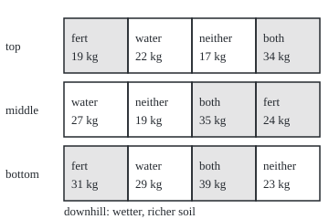
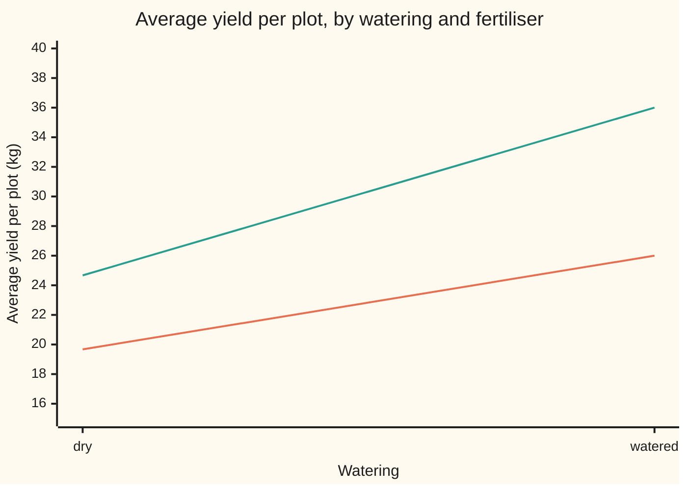

# Blocking and factorial designs: getting more from fewer trials

Probability and statistics → Survival, Design and Causality → Planning a field trial → Blocking and factorial designs

---

## General Overview

A grower wants to test two changes on a wheat field: a fertiliser, and extra watering. The field lies on a slope. Rain drains downhill, so the bottom plots are wetter and richer before anyone treats them. There is room for twelve plots: three strips across the slope (top, middle, bottom), four plots in each.

Two decisions shape the trial. First, every strip gets all four combinations: neither change, fertiliser only, water only, both. A lottery decides which plot in the strip gets which. Second, both changes are tested on the same plots at once, not in two separate trials.

The harvest, in kilograms per plot, averages 23.00 in the top strip, 26.25 in the middle and 30.50 at the bottom. That spread has nothing to do with fertiliser or water. Because each strip holds every combination, comparisons made inside a strip see the strip's richness on both sides, and it cancels. A group of units known in advance to be alike, used this way, is a **block**; the practice is **blocking**. Here the blocks are the strips.

Testing everything at once pays twice. Each of the twelve plots informs both the fertiliser question and the water question. And the combinations show whether the two changes help each other: fertiliser adds 5.00 kg on dry plots and 10.00 kg on watered ones. A trial that runs every combination of its changes is a **factorial design**; each change is a **factor**, set here at two **levels**, off and on. Two factors at two levels make a **two-by-two factorial**.

This season's estimates: fertiliser adds 7.50 kg and water 8.83 kg, each averaged over the other's two settings. Together they add 5.00 kg beyond the sum of their separate gains; the interaction, by the convention used here, is half that, 2.50 kg. Each estimate has a standard error of 1.00 kg. Analysed as if the strips did not exist, the same harvest gives standard errors of 2.34 kg.

**Blocking compares like with like, so known differences between plots cancel out of every comparison; a factorial runs every combination of the factors, so each plot counts for every question and the design can see when factors help or hinder each other.**

**What kind of fact this is:** a method; that the strips cancel exactly, and the precision each design buys, are theorems proved on this card in Why it works.

### The picture: the field plan

The twelve plots as laid out, each labelled with its treatment and its yield in kilograms. Shaded plots got fertiliser. Every strip holds each combination once; the order inside a strip came from a seeded lottery in the checks.

<p align="center"></p>

Follow any one treatment down the field and its yield climbs with the slope: neither gives 17, 19 and 23 kg, both 34, 35 and 39 kg. Read across a strip and the slope is held still: only the treatments differ.

---

## The formula

Notation first, in words. A bar over a letter means an average: $\bar y_{10}$ is the average yield of the plots with fertiliser on and water off. The first digit of the subscript is the fertiliser setting, the second the water setting; 1 means on, 0 off. So $\bar y_{00}$ is the untreated plots, $\bar y_{11}$ the plots with both. A hat marks an estimate, as on the estimation shelf.

$$\hat F = \frac{\bar y_{10} + \bar y_{11}}{2} - \frac{\bar y_{00} + \bar y_{01}}{2}, \qquad \hat W = \frac{\bar y_{01} + \bar y_{11}}{2} - \frac{\bar y_{00} + \bar y_{10}}{2}$$

**Read it aloud:** the fertiliser effect is the average yield of the fertilised half of the field minus the average of the unfertilised half; the water effect splits the same plots the other way.

$$\hat I = \frac{(\bar y_{11} - \bar y_{01}) - (\bar y_{10} - \bar y_{00})}{2}$$

**Read it aloud:** the interaction is half the gap between what fertiliser adds on watered plots and what it adds on dry ones.

Each of these is a **contrast**: a sum of the four averages with weights that add to zero. $\hat F$ and $\hat W$ are the **main effects**, each averaged over both levels of the other factor. $\hat I$ is zero when the two factors act separately. The half in $\hat I$ follows Box, Hunter and Hunter; it makes all three contrasts carry weights of plus or minus a half, so all three have the same precision.

How precise? Write $\sigma$ for the standard deviation of the plot-to-plot noise, $r$ for the number of strips, $N = 4r$ for the number of plots, and $S_b^2$ for how much the strip effects vary across the $N$ plots (squared deviations from their average, summed, divided by $N - 1$).

$$\operatorname{Var}(\hat F) = \frac{\sigma^2}{r} \ \text{with blocks}, \qquad \operatorname{Var}(\hat F) = \frac{\sigma^2 + S_b^2}{r} \ \text{with lots drawn over the whole field}$$

**Read it aloud:** with blocks, only the noise inside a strip blurs the estimate; without them, the spread between strips joins the noise.

The same holds for $\hat W$ and $\hat I$. The standard error, the square root of the variance, is the typical distance between an estimate and the truth. In the data, $\sigma$ is estimated by $s$, found from what is left of each yield after the strip and the treatment have been taken out (Step 5).

| Symbol | Plain meaning | In our example | Push it up and the answer… |
| --- | --- | --- | --- |
| $\bar y_{fw}$ | average yield of the plots with fertiliser setting *f* and water setting *w* (each 0 or 1) | 19.67, 24.67, 26.00, 36.00 kg | moves the contrasts it enters |
| $\mu_{fw}$ | the true long-run yield of that combination, averaged over the field | 20, 24, 26, 36 kg (built into the example) | the target the averages aim at |
| $\hat F$ | fertiliser main effect | 7.50 kg (truth 7) | — |
| $\hat W$ | water main effect | 8.83 kg (truth 9) | — |
| $\hat I$ | fertiliser-by-water interaction | 2.50 kg (truth 3) | fertiliser and water help each other more |
| $\beta_j$ | strip effect: how much richer strip number *j* is than the field's average | −4, 0, +4 kg | cancels out of every contrast |
| $\bar\beta$, $\bar\varepsilon_{fw}$ | the average strip effect; the average noise of the plots with settings *f* and *w* | 0 kg; spread $\sigma/\sqrt r$, 0.87 kg | $\bar\beta$ cancels; $\bar\varepsilon_{fw}$ blurs the estimates |
| $c_k$, $w_i$, $d_i$ | in the folded proof: a contrast's weight on combination *k*; plot *i*'s weight in $\hat F$; plot *i*'s strip effect minus the field average | ±1/2; ±1/6; −4, 0, +4 kg | — |
| $\varepsilon$ | one plot's noise: what neither strip nor treatment explains | spread 1.5 kg | blurs every estimate |
| $\sigma$ | standard deviation of the noise | 1.5 kg (truth) | wider standard errors |
| $r$ | number of blocks, which is also the number of plots per combination | 3 | narrower standard errors, like $1/\sqrt r$ |
| $N$ | total plots, four per block | 12 | same as raising $r$ |
| $S_b^2$ | spread of the strip effects over all $N$ plots: squared deviations summed, divided by $N-1$ | 11.64 kg^2 | a bigger penalty for ignoring the strips |
| $s$ | the estimate of $\sigma$ from this season's leftovers | 1.74 kg | wider quoted standard errors |

### When it holds

- **Strip effects add.** A strip shifts every plot in it by the same amount. If fertiliser works better on wet soil, the strip effect and the treatment interact; the contrasts then report an average over the three strips, and $s$ grows to absorb the disagreement.
- **A lottery inside every strip.** Without it, a pattern within a strip, such as a hedge shading the east end, can line up with one treatment and pass for its effect.
- **Plots do not affect each other.** Water running from a watered plot into its downhill neighbour gives that neighbour a treatment it was not assigned, and every contrast mixes the two.
- **Noise of one size, independent from plot to plot.** The variance formulas assume it. Plots that vary more under one treatment need a separate spread for each.
- **Blocks fixed before the trial**, from what is known in advance: slope, soil, a clinic, a day of the week. Blocks built from the harvest itself are not blocks.

---

## Why it works

### Step 0: compare inside strips, and let every plot answer every question

Two ideas carry the design. A comparison made within a strip cannot be fooled by the strip, because the strip sits on both sides of it. And when all four combinations appear, each factor's comparison uses all twelve plots, not a fraction of them.

### Step 1: the strips cancel from every contrast

Model each yield as the combination's true mean, plus its strip's effect, plus noise: yield $= \mu_{fw} + \beta_j + \varepsilon$. Each combination appears exactly once in each strip. So each average $\bar y_{fw}$ collects the same three strip effects, once each:

$$\bar y_{fw} = \mu_{fw} + \bar\beta + \bar\varepsilon_{fw},$$

where $\bar\beta$ is the average strip effect and $\bar\varepsilon_{fw}$ the average noise of the three plots. Now put these into $\hat F$. The weights are $+\tfrac12, +\tfrac12, -\tfrac12, -\tfrac12$; they add to zero, so $\bar\beta$ appears twice with plus and twice with minus and cancels:

$$\hat F = \underbrace{\tfrac12(\mu_{10} + \mu_{11} - \mu_{00} - \mu_{01})}_{\text{true effect, } F} + \tfrac12(\bar\varepsilon_{10} + \bar\varepsilon_{11} - \bar\varepsilon_{00} - \bar\varepsilon_{01}).$$

The same happens in $\hat W$ and $\hat I$, whose weights also add to zero. No strip term is left, whatever the strips are. The noise averages to zero, so $\hat F$ is centred on the true fertiliser effect: it is **unbiased**.

The cancelling needs balance, not luck: each combination once per strip. It is exact on every season, not only on average.

### Step 2: every plot counts for every effect

Each $\bar\varepsilon_{fw}$ averages three independent noises, so its variance is $\sigma^2/r$ ([sample-mean-and-standard-error](../07-Sampling%20and%20Estimation/02-sample-mean-and-standard-error.md)). The four averages use different plots, so they are independent, and variances of independent terms add. Four terms, each with weight squared $\tfrac14$:

$$\operatorname{Var}(\hat F) = 4 \times \tfrac14 \times \frac{\sigma^2}{r} = \frac{\sigma^2}{r} = \frac{4\sigma^2}{N}.$$

With $\sigma = 1.5$ kg and three strips, the standard error is $1.5/\sqrt3 = 0.87$ kg. Every one of the twelve plots enters $\hat F$, with weight plus or minus one-sixth. It enters $\hat W$ and $\hat I$ too. Twelve plots give three answers, each as precise as if all twelve had been spent on that one question. Designers call this **hidden replication**.

### Step 3: the one-at-a-time trial pays half as much again, and sees less

The obvious alternative tests one change at a time: untreated plots, fertiliser-only plots, water-only plots, no combined plots. Spread twelve plots over three settings, four each. The fertiliser effect is then $\bar y_{10} - \bar y_{00}$, a difference of two averages of four:

$$\operatorname{Var} = \frac{\sigma^2}{4} + \frac{\sigma^2}{4} = \frac{6\sigma^2}{N}, \quad\text{against}\quad \frac{4\sigma^2}{N} \text{ for the factorial.}$$

That is a standard error of 1.06 kg against 0.87 kg on the same twelve plots. To match the factorial the one-at-a-time trial needs 18 plots. Worse, it never grows the two together, so the interaction is invisible, and its fertiliser effect is the effect on dry plots only.

### Step 4: ignore the strips, and they become noise

Suppose the grower skips the blocks and draws lots over the whole field: any three of the twelve plots may get "both", any three of the rest "fertiliser only", and so on. This is **complete randomisation**, the design of [randomised-experiments-and-ab-tests](04-randomised-experiments-and-ab-tests.md). Now a combination can land mostly downhill. The strip effects no longer cancel on each draw; they cancel only on average over the lottery.

The lottery keeps $\hat F$ unbiased. But each draw carries a leftover strip imbalance, and its variance over all draws is exactly $S_b^2/r$. Adding the noise, which is independent of the draw:

$$\operatorname{Var}(\hat F) = \frac{\sigma^2 + S_b^2}{r}.$$

Here $S_b^2 = 8 \times 4^2 / 11 = 11.64$: eight plots sit 4 kg from the average, four sit on it. The standard error grows from 0.87 to 2.15 kg. The variance ratio is 6.17: a completely randomised trial would need about six times as many plots to match three blocked strips.

<details>
<summary>Detailed proof: the variance of the leftover strip imbalance</summary>

Number the plots 1 to $N$. Let $d_1, \dots, d_N$ be each plot's strip effect minus the field average; these deviations sum to zero. Give contrast weights $c_k = \pm\tfrac12$ to the four combinations; they sum to zero and their squares sum to 1. The strip part of $\hat F$ is $\sum_i w_i d_i$, where $w_i = c_k / r$ for a plot that falls in combination number k.

Under complete randomisation each plot falls in each combination with chance $1/4$, so the average weight of any one plot is $\tfrac14 \sum_k c_k / r = 0$. The strip part averages zero: no bias.

Squares: the average of $w_i^2$ is $\tfrac14 \sum_k c_k^2 / r^2 = 1/(4r^2) = 1/(rN)$, using $N = 4r$.

Pairs: for two different plots, both land in one given combination with chance $\frac{r}{N}\cdot\frac{r-1}{N-1}$, and in two given different combinations, one each, with chance $\frac{r}{N}\cdot\frac{r}{N-1}$. Since $\sum_{k \ne k'} c_k c_{k'} = (\sum_k c_k)^2 - \sum_k c_k^2 = -1$, the average of $w_i w_{i'}$ is
$$\frac{1}{r^2}\left[\frac{r(r-1)}{N(N-1)} - \frac{r^2}{N(N-1)}\right] = -\frac{1}{rN(N-1)}.$$
Expand the square of $\sum_i w_i d_i$. The sum of $d_i d_{i'}$ over different pairs is $(\sum_i d_i)^2 - \sum_i d_i^2 = -\sum_i d_i^2$. So
$$\operatorname{Var}\Big(\sum_i w_i d_i\Big) = \sum_i d_i^2\left[\frac{1}{rN} + \frac{1}{rN(N-1)}\right] = \frac{\sum_i d_i^2}{r(N-1)} = \frac{S_b^2}{r}.$$
The noise is independent of the lottery and contributes $\sigma^2/r$ as in Step 2; the cross term averages zero. The checks confirm $S_b^2/r = 3.8788$ by listing all 369,600 ways to deal twelve plots into four groups of three.

</details>

### Step 5: estimate the noise from what is left over

The formulas need $\sigma$, which nobody knows. Estimate it from each plot's **residual**: its yield, minus its strip's average, minus its combination's average, plus the overall average, 26.58 kg. That is what remains once strip and treatment are taken out. Square the twelve residuals and add: 18.17 kg^2. Divide by 6, not 12, because the fit spent six numbers (one overall level, two strip differences, three treatment contrasts) and only six independent leftovers remain:

$$s^2 = \frac{18.17}{(r-1)(4-1)} = \frac{18.17}{6} = 3.03, \qquad \text{standard error} = \sqrt{s^2/r} = 1.00 \text{ kg}.$$

The divisor 6 makes $s^2$ unbiased for $\sigma^2$. Over 20,000 simulated seasons the average $s^2$ is 2.2472, give or take 0.0092, against the true 2.25.

The alternative route is least squares ([multiple-regression-and-gauss-markov](../09-Regression/03-multiple-regression-and-gauss-markov.md)): regress the twelve yields on an intercept, two strip indicators and three columns of plus and minus ones. Twice each fitted slope is the matching contrast, and the leftover sum of squares is the same 18.17. When a block is too small to hold every combination, balanced arrangements like the league fixture lists of [edge-colouring-and-round-robin](../../04-Combinatorics%20and%20graphs/12-Planarity%20and%20Colouring/06-edge-colouring-and-round-robin.md) take over. That card's fixture grid, with one more symbol on its diagonal, is a **Latin square**: every symbol once in each row and once in each column. It blocks two ways at once. On a field that also changed from west to east, four strips of four plots could be laid out as the grid for a four-team league, with rounds 1, 2 and 3 standing for fertiliser, water and both, and neither on the diagonal:

| Strip | Column 1, west | Column 2 | Column 3 | Column 4, east |
| --- | --- | --- | --- | --- |
| top | neither | fertiliser | water | both |
| second | fertiliser | neither | both | water |
| third | water | both | neither | fertiliser |
| bottom | both | water | fertiliser | neither |

Each combination meets every strip once and every column once, so Step 1's cancelling runs twice: the slope and the west-to-east drift both drop out of every contrast.

---

## Worked numbers, by hand

The season, strip by strip, in the order neither, fertiliser, water, both: top 17, 19, 22, 34; middle 19, 24, 27, 35; bottom 23, 31, 29, 39.

| Step | Arithmetic | Value |
| --- | --- | --- |
| $\bar y_{00}$, neither | (17 + 19 + 23) / 3 | 19.67 kg |
| $\bar y_{10}$, fertiliser only | (19 + 24 + 31) / 3 | 24.67 kg |
| $\bar y_{01}$, water only | (22 + 27 + 29) / 3 | 26.00 kg |
| $\bar y_{11}$, both | (34 + 35 + 39) / 3 | 36.00 kg |
| $\hat F$ | (24.67 + 36.00)/2 − (19.67 + 26.00)/2 | 7.50 kg |
| $\hat W$ | (26.00 + 36.00)/2 − (19.67 + 24.67)/2 | 8.83 kg |
| $\hat I$ | ((36.00 − 26.00) − (24.67 − 19.67)) / 2 = (10.00 − 5.00) / 2 | 2.50 kg |
| residual sum of squares | twelve residuals squared and added | 18.17 kg^2 |
| $s^2$ | 18.17 / 6 | 3.03 kg^2 |
| standard error of each effect | √(3.03 / 3) | 1.00 kg |
| **fertiliser effect** | | **7.50 ± 1.00 kg** |

Fertiliser adds about 7.5 kg a plot, averaged over watered and dry plots; a rerun season would typically land within about a kilogram of the true figure. The yields were built from true effects of 7, 9 and 3 kg, so the check is possible here: all three estimates sit within one standard error of the truth. The interaction, 2.50 ± 1.00 kg, is about two and a half standard errors from zero: the case for synergy is moderate, not settled.

### The picture: the interaction



The lower line is the unfertilised plots, the upper line the fertilised ones. Parallel lines would mean no interaction. These spread apart: the gap is 5.00 kg on dry plots and 10.00 kg on watered ones.

### What breaks if you drop a piece

| Mistake | Comes out at | What went wrong |
| --- | --- | --- |
| Analyse the blocked harvest as if the strips did not exist | standard error 2.34 kg, not 1.00 | the strips' 113.17 kg^2 of variation is counted as noise |
| Lay the field out with no blocks: lots drawn over all twelve plots | spread of $\hat F$ 2.15 kg, not 0.87 | the strips no longer cancel; $S_b^2 = 11.64$ joins $\sigma^2 = 2.25$, a variance 6.17 times larger |
| Test fertiliser on dry plots only, one factor at a time | 5.00 kg | the effect depends on water: 10.00 kg on watered plots; the same precision also costs 18 plots, not 12 |
| Predict the "both" plots by adding the two separate gains | 31.00 kg, against 36.00 observed | assumes no interaction |

---

## Code, from first principles, and it actually runs

The code takes four roads. Road one computes the contrasts from the four averages and the residual sum of squares by formula. Road two fits the same model by least squares, solving the normal equations by Gaussian elimination, and must reproduce every effect and the residual sum of squares. Road three lists all 369,600 complete randomisations of the twelve plots and measures the strip imbalance they leave, against $S_b^2/r$. Road four simulates 20,000 seasons from the true model with a small seeded generator (SplitMix64) and the Box-Muller formula, which turns two uniform draws into one normal draw, under both designs, and compares the spread of $\hat F$ with the two variance formulas. The field plan's order inside each strip comes from the same generator.

### Python

```python
# Blocking and a 2 x 2 factorial: fertiliser and watering -- the check behind the card.
# Standard library only. Roads: contrasts on cell means, least squares by Gaussian
# elimination, every complete randomisation enumerated, a seeded simulation (SplitMix64).
from math import sqrt, log, cos, pi
from itertools import combinations

MASK, state = (1 << 64) - 1, 20260929
def uniform():                                    # SplitMix64 -> a number in [0, 1)
    global state
    state = (state + 0x9E3779B97F4A7C15) & MASK
    z = state
    z = ((z ^ (z >> 30)) * 0xBF58476D1CE4E5B9) & MASK
    z = ((z ^ (z >> 27)) * 0x94D049BB133111EB) & MASK
    return ((z ^ (z >> 31)) >> 11) / 9007199254740992.0
def normal():                                     # Box-Muller, one draw per call
    u1, u2 = uniform(), uniform()
    return sqrt(-2.0 * log(1.0 - u1)) * cos(2.0 * pi * u2)
def shuffle(a):                                   # Fisher-Yates
    for i in range(len(a) - 1, 0, -1):
        j = int(uniform() * (i + 1)); a[i], a[j] = a[j], a[i]
    return a

NAMES = ["neither", "fert", "water", "both"]     # cells 00, 10, 01, 11: fertiliser digit, water digit
SIGN = {"F": (-1, 1, -1, 1), "W": (-1, -1, 1, 1), "I": (1, -1, -1, 1)}
def effects(m): return {k: sum(s * x for s, x in zip(v, m)) / 2 for k, v in SIGN.items()}
TRUE = (20.0, 24.0, 26.0, 36.0)                   # true mean yield of each cell, kg
STRIP = (-4.0, 0.0, 4.0)                          # top, middle, bottom of the slope, kg
SIGMA = 1.5                                       # plot-to-plot noise, kg
Y = [[17, 19, 22, 34], [19, 24, 27, 35], [23, 31, 29, 39]]   # the season: strip x cell, kg
r, N = len(Y), 4 * len(Y)

# ---- road 1: contrasts on cell means, sums of squares by formula ----
cell = [sum(Y[j][k] for j in range(r)) / r for k in range(4)]
blk = [sum(row) / 4 for row in Y]
grand = sum(blk) / r
eff = effects(cell)
res_ss = sum((Y[j][k] - blk[j] - cell[k] + grand) ** 2 for j in range(r) for k in range(4))
within_ss = sum((Y[j][k] - cell[k]) ** 2 for j in range(r) for k in range(4))
strip_ss = 4 * sum((b - grand) ** 2 for b in blk)
s2_b, s2_u = res_ss / ((r - 1) * 3), within_ss / (4 * (r - 1))
se_b, se_u = sqrt(s2_b / r), sqrt(s2_u / r)

# ---- road 2: least squares on strip indicators and +/-1 columns ----
X, yv = [], []
for j in range(r):
    for k in range(4):
        xf, xw = (1.0 if k in (1, 3) else -1.0), (1.0 if k in (2, 3) else -1.0)
        X.append([1.0] + [1.0 if j == b else 0.0 for b in range(1, r)] + [xf, xw, xf * xw])
        yv.append(float(Y[j][k]))
def solve(A, b):                                  # Gaussian elimination, partial pivoting
    n = len(b); M = [row[:] + [v] for row, v in zip(A, b)]
    for i in range(n):
        p = max(range(i, n), key=lambda t: abs(M[t][i])); M[i], M[p] = M[p], M[i]
        for t in range(i + 1, n):
            f = M[t][i] / M[i][i]; M[t] = [a - f * c for a, c in zip(M[t], M[i])]
    x = [0.0] * n
    for i in reversed(range(n)):
        x[i] = (M[i][n] - sum(M[i][t] * x[t] for t in range(i + 1, n))) / M[i][i]
    return x
P = len(X[0])
XtX = [[sum(row[a] * row[b] for row in X) for b in range(P)] for a in range(P)]
beta = solve(XtX, [sum(row[a] * v for row, v in zip(X, yv)) for a in range(P)])
ls_eff = {"F": 2 * beta[-3], "W": 2 * beta[-2], "I": 2 * beta[-1]}
ls_res = sum((v - sum(a * b for a, b in zip(row, beta))) ** 2 for row, v in zip(X, yv))
ls_se = [2 * sqrt(ls_res / 6 * solve(XtX, [float(t == a) for t in range(P)])[a]) for a in range(P - 3, P)]

# ---- road 3: every complete randomisation of the 12 plots, strips ignored ----
base = [b for b in STRIP for _ in range(4)]
Sb2 = sum((b - sum(base) / N) ** 2 for b in base) / (N - 1)
tot = tot2 = cnt = 0
for g0 in combinations(range(N), 3):
    rest = [i for i in range(N) if i not in g0]
    for g1 in combinations(rest, 3):
        rest2 = [i for i in rest if i not in g1]
        for g2 in combinations(rest2, 3):
            g3 = [i for i in rest2 if i not in g2]
            m = [sum(base[i] for i in g) / 3 for g in (g0, g1, g2, g3)]
            fb = (-m[0] + m[1] - m[2] + m[3]) / 2
            tot += fb; tot2 += fb * fb; cnt += 1
enum_mean, enum_var = tot / cnt, tot2 / cnt - (tot / cnt) ** 2

order = [shuffle([0, 1, 2, 3]) for _ in range(r)]  # the field plan: a lottery inside each strip

# ---- road 4: seeded simulation of R seasons, blocked and completely randomised ----
R = 20000
fb_sim, fc_sim, s2_sim = [], [], []
for _ in range(R):
    yb = [[TRUE[k] + STRIP[j] + SIGMA * normal() for k in range(4)] for j in range(r)]
    cb = [sum(yb[j][k] for j in range(r)) / r for k in range(4)]
    bb = [sum(row) / 4 for row in yb]; gb = sum(bb) / r
    fb_sim.append(effects(cb)["F"])
    s2_sim.append(sum((yb[j][k] - bb[j] - cb[k] + gb) ** 2 for j in range(r) for k in range(4)) / 6)
    lab = shuffle([k for k in range(4) for _ in range(r)])
    tc = [0.0] * 4
    for i in range(N): tc[lab[i]] += TRUE[lab[i]] + base[i] + SIGMA * normal()
    fc_sim.append(effects([t / r for t in tc])["F"])
def ms(xs):
    m = sum(xs) / len(xs); return m, sqrt(sum((x - m) ** 2 for x in xs) / (len(xs) - 1))
(mb, sdb), (mc, sdc), (m2, sd2) = ms(fb_sim), ms(fc_sim), ms(s2_sim)
ex_b, ex_c = sqrt(SIGMA ** 2 / r), sqrt((SIGMA ** 2 + Sb2) / r)

print("true effects       " + "  ".join(f"{k} {v:.4f}" for k, v in effects(TRUE).items())
      + f"  strips {STRIP[0]:.1f} {STRIP[1]:.1f} {STRIP[2]:.1f}  sigma {SIGMA:.1f}")
print("cell means, kg     " + "  ".join(f"{n} {c:.4f}" for n, c in zip(NAMES, cell)))
print("strip means, kg    " + "  ".join(f"{c:.4f}" for c in blk) + f"  grand {grand:.4f}")
for k, name in (("F", "fertiliser"), ("W", "watering"), ("I", "interaction")):
    print(f"{name:<12} contrast {eff[k]:8.4f}  least squares {ls_eff[k]:8.4f}  SE {se_b:.4f}")
print(f"fertiliser effect, dry plots {cell[1] - cell[0]:.4f}  watered plots {cell[3] - cell[2]:.4f}")
print(f"additive guess for both {cell[1] + cell[2] - cell[0]:.4f}  observed {cell[3]:.4f}")
print(f"residual SS, formula {res_ss:.4f}  least squares {ls_res:.4f}  df {(r - 1) * 3}")
print(f"blocked analysis    s^2 {s2_b:.4f}  s {sqrt(s2_b):.4f}  SE of an effect {se_b:.4f}")
print(f"strips ignored      s^2 {s2_u:.4f}  s {sqrt(s2_u):.4f}  SE of an effect {se_u:.4f}")
print(f"strip SS {strip_ss:.4f}  within-cell SS {within_ss:.4f}")
print(f"S_b^2, spread of plot baselines {Sb2:.4f}")
print(f"enumerated randomisations {cnt}  mean {enum_mean:.4f}  variance {enum_var:.4f}  S_b^2/r {Sb2 / r:.4f}")
print(f"exact SD of F-hat: blocked {ex_b:.4f}  completely randomised {ex_c:.4f}  variance ratio {ex_c ** 2 / ex_b ** 2:.4f}")
print(f"simulated {R} seasons: blocked mean {mb:.4f} SD {sdb:.4f} (+/- {sdb / sqrt(2 * R):.4f})")
print(f"  completely randomised mean {mc:.4f} SD {sdc:.4f} (+/- {sdc / sqrt(2 * R):.4f})")
print(f"  mean s^2 {m2:.4f} (+/- {sd2 / sqrt(R):.4f})  true sigma^2 {SIGMA ** 2:.4f}")
print(f"one at a time, 12 plots: SE {sqrt(6 * SIGMA ** 2 / N):.4f}  factorial SE {sqrt(4 * SIGMA ** 2 / N):.4f}"
      f"  plots to match {6 * N // 4}")
print("chart, dry then watered, unfertilised " + " ".join(f"{cell[k]:.2f}" for k in (0, 2))
      + ", fertilised " + " ".join(f"{cell[k]:.2f}" for k in (1, 3)))
for j, nm in enumerate(("top", "middle", "bottom")):
    print(f"figure, {nm} strip at y={20 + 70 * j}, plots 70 x 60 at x=70,140,210,280:",
          ", ".join(f"{NAMES[k]} {Y[j][k]}" for k in order[j]))

for k in "FWI":
    assert abs(eff[k] - ls_eff[k]) < 1e-9, f"{k}: contrast vs least squares"
assert abs(res_ss - ls_res) < 1e-9, "residual SS: formula vs least squares"
assert all(abs(se - se_b) < 1e-9 for se in ls_se), "SE of an effect: sqrt(s^2 / r) vs least squares"
assert abs(within_ss - res_ss - strip_ss) < 1e-9, "strips ignored: their SS joins the residual"
assert abs(enum_var - Sb2 / r) < 1e-9, "enumerated variance vs S_b^2 / r"
assert abs(enum_mean) < 1e-9, "over all randomisations the strips add no bias to F-hat"
assert abs(sdb / ex_b - 1) < 0.025, "blocked: simulated SD vs sigma / sqrt(r)"
assert abs(sdc / ex_c - 1) < 0.025, "randomised: simulated SD vs sqrt((sigma^2 + S_b^2) / r)"
for m, sd in ((mb, sdb), (mc, sdc)):
    assert abs(m - effects(TRUE)["F"]) < 4 * sd / sqrt(R), "both designs: F-hat centred on the true effect"
assert abs(m2 - SIGMA ** 2) < 4 * sd2 / sqrt(R), "residual variance with (r-1)*3 df is unbiased"
print("ALL CHECKS PASS")
```

**Ran 2026-09-29 on macOS, Python 3.14.6, standard library only. All checks passed. Output, pasted from the run:**

```
true effects       F 7.0000  W 9.0000  I 3.0000  strips -4.0 0.0 4.0  sigma 1.5
cell means, kg     neither 19.6667  fert 24.6667  water 26.0000  both 36.0000
strip means, kg    23.0000  26.2500  30.5000  grand 26.5833
fertiliser   contrast   7.5000  least squares   7.5000  SE 1.0046
watering     contrast   8.8333  least squares   8.8333  SE 1.0046
interaction  contrast   2.5000  least squares   2.5000  SE 1.0046
fertiliser effect, dry plots 5.0000  watered plots 10.0000
additive guess for both 31.0000  observed 36.0000
residual SS, formula 18.1667  least squares 18.1667  df 6
blocked analysis    s^2 3.0278  s 1.7401  SE of an effect 1.0046
strips ignored      s^2 16.4167  s 4.0517  SE of an effect 2.3393
strip SS 113.1667  within-cell SS 131.3333
S_b^2, spread of plot baselines 11.6364
enumerated randomisations 369600  mean 0.0000  variance 3.8788  S_b^2/r 3.8788
exact SD of F-hat: blocked 0.8660  completely randomised 2.1515  variance ratio 6.1717
simulated 20000 seasons: blocked mean 7.0081 SD 0.8656 (+/- 0.0043)
  completely randomised mean 6.9854 SD 2.1510 (+/- 0.0108)
  mean s^2 2.2472 (+/- 0.0092)  true sigma^2 2.2500
one at a time, 12 plots: SE 1.0607  factorial SE 0.8660  plots to match 18
chart, dry then watered, unfertilised 19.67 26.00, fertilised 24.67 36.00
figure, top strip at y=20, plots 70 x 60 at x=70,140,210,280: fert 19, water 22, neither 17, both 34
figure, middle strip at y=90, plots 70 x 60 at x=70,140,210,280: water 27, neither 19, both 35, fert 24
figure, bottom strip at y=160, plots 70 x 60 at x=70,140,210,280: fert 31, water 29, both 39, neither 23
ALL CHECKS PASS
```

### Rust

```rust
// Blocking and a 2 x 2 factorial: fertiliser and watering -- the check behind the card.
// Std only. Roads: contrasts on cell means, least squares by Gaussian elimination,
// every complete randomisation enumerated, a seeded simulation (SplitMix64).
use std::f64::consts::PI;

struct Rng(u64);
impl Rng {
    fn uniform(&mut self) -> f64 {
        self.0 = self.0.wrapping_add(0x9E3779B97F4A7C15);
        let mut z = self.0;
        z = (z ^ (z >> 30)).wrapping_mul(0xBF58476D1CE4E5B9);
        z = (z ^ (z >> 27)).wrapping_mul(0x94D049BB133111EB);
        ((z ^ (z >> 31)) >> 11) as f64 / 9007199254740992.0
    }
    fn normal(&mut self) -> f64 {
        let (u1, u2) = (self.uniform(), self.uniform());
        (-2.0 * (1.0 - u1).ln()).sqrt() * (2.0 * PI * u2).cos()
    }
    fn shuffle(&mut self, a: &mut Vec<usize>) {                  // Fisher-Yates
        for i in (1..a.len()).rev() { let j = (self.uniform() * (i + 1) as f64) as usize; a.swap(i, j); }
    }
}
const NAMES: [&str; 4] = ["neither", "fert", "water", "both"];
const SIGN: [[f64; 4]; 3] = [[-1., 1., -1., 1.], [-1., -1., 1., 1.], [1., -1., -1., 1.]];
fn effects(m: &[f64]) -> [f64; 3] {
    let mut e = [0.0; 3];
    for (i, s) in SIGN.iter().enumerate() { e[i] = s.iter().zip(m).fold(0.0, |a, (s, x)| a + s * x) / 2.0; }
    e
}
fn combos(items: &[usize], k: usize) -> Vec<Vec<usize>> {
    if k == 0 { return vec![vec![]]; }
    let mut out = vec![];
    for i in 0..items.len() {
        for mut rest in combos(&items[i + 1..], k - 1) { rest.insert(0, items[i]); out.push(rest); }
    }
    out
}
fn solve(a: Vec<Vec<f64>>, b: Vec<f64>) -> Vec<f64> {         // Gaussian elimination, partial pivoting
    let n = b.len();
    let mut m: Vec<Vec<f64>> = a.into_iter().zip(b).map(|(mut r, v)| { r.push(v); r }).collect();
    for i in 0..n {
        let mut p = i;
        for t in i + 1..n { if m[t][i].abs() > m[p][i].abs() { p = t; } }
        m.swap(i, p);
        for t in i + 1..n {
            let (f, row) = (m[t][i] / m[i][i], m[i].clone());
            for (x, c) in m[t].iter_mut().zip(row) { *x -= f * c; }
        }
    }
    let mut x = vec![0.0; n];
    for i in (0..n).rev() {
        let s: f64 = (i + 1..n).fold(0.0, |a, t| a + m[i][t] * x[t]);
        x[i] = (m[i][n] - s) / m[i][i];
    }
    x
}
fn ms(xs: &[f64]) -> (f64, f64) {
    let n = xs.len() as f64; let m = xs.iter().fold(0.0, |a, x| a + x) / n;
    (m, (xs.iter().fold(0.0, |a, x| a + (x - m) * (x - m)) / (n - 1.0)).sqrt())
}
fn main() {
    let mut g = Rng(20260929);
    let (truth, strip, sigma) = ([20.0, 24.0, 26.0, 36.0], [-4.0, 0.0, 4.0], 1.5f64);
    let y = [[17.0, 19.0, 22.0, 34.0], [19.0, 24.0, 27.0, 35.0], [23.0, 31.0, 29.0, 39.0]];
    let (r, n, rf) = (3usize, 12usize, 3.0);
    // road 1: contrasts on cell means, sums of squares by formula
    let cell: Vec<f64> = (0..4).map(|k| (0..r).fold(0.0, |a, j| a + y[j][k]) / rf).collect();
    let blk: Vec<f64> = y.iter().map(|row| row.iter().fold(0.0, |a, v| a + v) / 4.0).collect();
    let grand = blk.iter().fold(0.0, |a, b| a + b) / rf;
    let eff = effects(&cell);
    let (mut res_ss, mut within_ss) = (0.0, 0.0);
    for j in 0..r { for k in 0..4 {
        res_ss += (y[j][k] - blk[j] - cell[k] + grand).powi(2);
        within_ss += (y[j][k] - cell[k]).powi(2);
    } }
    let strip_ss = 4.0 * blk.iter().fold(0.0, |a, b| a + (b - grand).powi(2));
    let (s2_b, s2_u) = (res_ss / ((r - 1) * 3) as f64, within_ss / (4 * (r - 1)) as f64);
    let (se_b, se_u) = ((s2_b / rf).sqrt(), (s2_u / rf).sqrt());
    // road 2: least squares on strip indicators and +/-1 columns
    let (mut xm, mut yv) = (vec![], vec![]);
    for j in 0..r { for k in 0..4 {
        let (xf, xw) = (if k == 1 || k == 3 { 1.0 } else { -1.0 }, if k == 2 || k == 3 { 1.0 } else { -1.0 });
        let mut row: Vec<f64> = (0..r).map(|b| if b == 0 || j == b { 1.0 } else { 0.0 }).collect();
        row.extend([xf, xw, xf * xw]); xm.push(row); yv.push(y[j][k]);
    } }
    let p = xm[0].len();
    let xtx: Vec<Vec<f64>> = (0..p).map(|a| (0..p).map(|b| xm.iter().fold(0.0, |s, row| s + row[a] * row[b])).collect()).collect();
    let xty: Vec<f64> = (0..p).map(|a| xm.iter().zip(&yv).fold(0.0, |s, (row, v)| s + row[a] * v)).collect();
    let beta = solve(xtx.clone(), xty);
    let ls_eff = [2.0 * beta[p - 3], 2.0 * beta[p - 2], 2.0 * beta[p - 1]];
    let ls_res = xm.iter().zip(&yv).fold(0.0, |s, (row, v)| {
        let fit = row.iter().zip(&beta).fold(0.0, |a, (x, b)| a + x * b);
        s + (v - fit) * (v - fit)
    });
    let ls_se: Vec<f64> = (p - 3..p).map(|a| 2.0 * (ls_res / 6.0 * solve(xtx.clone(), (0..p).map(|t| if t == a { 1.0 } else { 0.0 }).collect())[a]).sqrt()).collect();
    // road 3: every complete randomisation of the 12 plots, strips ignored
    let base: Vec<f64> = strip.iter().flat_map(|&b| [b; 4]).collect();
    let bmean = base.iter().fold(0.0, |a, b| a + b) / n as f64;
    let sb2 = base.iter().fold(0.0, |a, b| a + (b - bmean).powi(2)) / (n - 1) as f64;   // S_b^2
    let (mut tot, mut tot2, mut cnt, all) = (0.0, 0.0, 0u64, (0..n).collect::<Vec<usize>>());
    let mean3 = |gr: &[usize]| gr.iter().fold(0.0, |a, &i| a + base[i]) / 3.0;
    for g0 in combos(&all, 3) {
        let rest: Vec<usize> = all.iter().copied().filter(|i| !g0.contains(i)).collect();
        for g1 in combos(&rest, 3) {
            let rest2: Vec<usize> = rest.iter().copied().filter(|i| !g1.contains(i)).collect();
            for g2 in combos(&rest2, 3) {
                let g3: Vec<usize> = rest2.iter().copied().filter(|i| !g2.contains(i)).collect();
                let fb = (-mean3(&g0) + mean3(&g1) - mean3(&g2) + mean3(&g3)) / 2.0;
                tot += fb; tot2 += fb * fb; cnt += 1;
            }
        }
    }
    let (enum_mean, enum_var) = (tot / cnt as f64, tot2 / cnt as f64 - (tot / cnt as f64).powi(2));
    let order: Vec<Vec<usize>> = (0..r).map(|_| { let mut o = vec![0, 1, 2, 3]; g.shuffle(&mut o); o }).collect(); // field plan
    // road 4: seeded simulation of R seasons, blocked and completely randomised
    let big_r = 20000usize;
    let (mut fb_sim, mut fc_sim, mut s2_sim) = (vec![], vec![], vec![]);
    for _ in 0..big_r {
        let mut yb = [[0.0; 4]; 3];
        for j in 0..r { for k in 0..4 { yb[j][k] = truth[k] + strip[j] + sigma * g.normal(); } }
        let cb: Vec<f64> = (0..4).map(|k| (0..r).fold(0.0, |a, j| a + yb[j][k]) / rf).collect();
        let bb: Vec<f64> = yb.iter().map(|row| row.iter().fold(0.0, |a, v| a + v) / 4.0).collect();
        let gb = bb.iter().fold(0.0, |a, b| a + b) / rf;
        fb_sim.push(effects(&cb)[0]);
        s2_sim.push((0..12).fold(0.0, |a, i| a + (yb[i / 4][i % 4] - bb[i / 4] - cb[i % 4] + gb).powi(2)) / 6.0);
        let (mut lab, mut tc): (Vec<usize>, _) = ((0..4).flat_map(|k| vec![k; r]).collect(), [0.0; 4]);
        g.shuffle(&mut lab);
        for i in 0..n { tc[lab[i]] += truth[lab[i]] + base[i] + sigma * g.normal(); }
        fc_sim.push(effects(&tc.map(|t| t / rf))[0]);
    }
    let ((mb, sdb), (mc, sdc), (m2, sd2)) = (ms(&fb_sim), ms(&fc_sim), ms(&s2_sim));
    let (ex_b, ex_c) = ((sigma * sigma / rf).sqrt(), ((sigma * sigma + sb2) / rf).sqrt());
    let (rr, te, nf) = (big_r as f64, effects(&truth), n as f64);
    println!("true effects       F {:.4}  W {:.4}  I {:.4}  strips {:.1} {:.1} {:.1}  sigma {:.1}", te[0], te[1], te[2], strip[0], strip[1], strip[2], sigma);
    let cm: Vec<String> = (0..4).map(|k| format!("{} {:.4}", NAMES[k], cell[k])).collect();
    println!("cell means, kg     {}", cm.join("  "));
    println!("strip means, kg    {:.4}  {:.4}  {:.4}  grand {:.4}", blk[0], blk[1], blk[2], grand);
    for (i, name) in ["fertiliser", "watering", "interaction"].iter().enumerate() {
        println!("{:<12} contrast {:8.4}  least squares {:8.4}  SE {:.4}", name, eff[i], ls_eff[i], se_b);
    }
    println!("fertiliser effect, dry plots {:.4}  watered plots {:.4}", cell[1] - cell[0], cell[3] - cell[2]);
    println!("additive guess for both {:.4}  observed {:.4}", cell[1] + cell[2] - cell[0], cell[3]);
    println!("residual SS, formula {:.4}  least squares {:.4}  df {}", res_ss, ls_res, (r - 1) * 3);
    println!("blocked analysis    s^2 {:.4}  s {:.4}  SE of an effect {:.4}", s2_b, s2_b.sqrt(), se_b);
    println!("strips ignored      s^2 {:.4}  s {:.4}  SE of an effect {:.4}", s2_u, s2_u.sqrt(), se_u);
    println!("strip SS {:.4}  within-cell SS {:.4}", strip_ss, within_ss);
    println!("S_b^2, spread of plot baselines {:.4}", sb2);
    println!("enumerated randomisations {}  mean {:.4}  variance {:.4}  S_b^2/r {:.4}", cnt, enum_mean, enum_var, sb2 / rf);
    println!("exact SD of F-hat: blocked {:.4}  completely randomised {:.4}  variance ratio {:.4}", ex_b, ex_c, ex_c * ex_c / (ex_b * ex_b));
    println!("simulated {} seasons: blocked mean {:.4} SD {:.4} (+/- {:.4})", big_r, mb, sdb, sdb / (2.0 * rr).sqrt());
    println!("  completely randomised mean {:.4} SD {:.4} (+/- {:.4})", mc, sdc, sdc / (2.0 * rr).sqrt());
    println!("  mean s^2 {:.4} (+/- {:.4})  true sigma^2 {:.4}", m2, sd2 / rr.sqrt(), sigma * sigma);
    println!("one at a time, 12 plots: SE {:.4}  factorial SE {:.4}  plots to match {}", (6.0 * sigma * sigma / nf).sqrt(), (4.0 * sigma * sigma / nf).sqrt(), 6 * n / 4);
    println!("chart, dry then watered, unfertilised {:.2} {:.2}, fertilised {:.2} {:.2}", cell[0], cell[2], cell[1], cell[3]);
    for (j, nm) in ["top", "middle", "bottom"].iter().enumerate() {
        let parts: Vec<String> = order[j].iter().map(|&k| format!("{} {}", NAMES[k], y[j][k])).collect();
        println!("figure, {} strip at y={}, plots 70 x 60 at x=70,140,210,280: {}", nm, 20 + 70 * j, parts.join(", "));
    }
    for i in 0..3 { assert!((eff[i] - ls_eff[i]).abs() < 1e-9, "contrast vs least squares"); }
    assert!((res_ss - ls_res).abs() < 1e-9, "residual SS: formula vs least squares");
    for se in &ls_se { assert!((se - se_b).abs() < 1e-9, "SE of an effect: sqrt(s^2 / r) vs least squares"); }
    assert!((within_ss - res_ss - strip_ss).abs() < 1e-9, "strips ignored: their SS joins the residual");
    assert!((enum_var - sb2 / rf).abs() < 1e-9, "enumerated variance vs S_b^2 / r");
    assert!(enum_mean.abs() < 1e-9, "over all randomisations the strips add no bias to F-hat");
    assert!((sdb / ex_b - 1.0).abs() < 0.025, "blocked: simulated SD vs sigma / sqrt(r)");
    assert!((sdc / ex_c - 1.0).abs() < 0.025, "randomised: simulated SD vs sqrt((sigma^2 + S_b^2) / r)");
    for (m, sd) in [(mb, sdb), (mc, sdc)] { assert!((m - te[0]).abs() < 4.0 * sd / rr.sqrt(), "both designs: F-hat centred on the true effect"); }
    assert!((m2 - sigma * sigma).abs() < 4.0 * sd2 / rr.sqrt(), "residual variance with (r-1)*3 df is unbiased");
    println!("ALL CHECKS PASS");
}
```

**Ran 2026-09-29 on macOS, rustc 1.98.1, no crates. All checks passed. Output, pasted from the run:**

```
true effects       F 7.0000  W 9.0000  I 3.0000  strips -4.0 0.0 4.0  sigma 1.5
cell means, kg     neither 19.6667  fert 24.6667  water 26.0000  both 36.0000
strip means, kg    23.0000  26.2500  30.5000  grand 26.5833
fertiliser   contrast   7.5000  least squares   7.5000  SE 1.0046
watering     contrast   8.8333  least squares   8.8333  SE 1.0046
interaction  contrast   2.5000  least squares   2.5000  SE 1.0046
fertiliser effect, dry plots 5.0000  watered plots 10.0000
additive guess for both 31.0000  observed 36.0000
residual SS, formula 18.1667  least squares 18.1667  df 6
blocked analysis    s^2 3.0278  s 1.7401  SE of an effect 1.0046
strips ignored      s^2 16.4167  s 4.0517  SE of an effect 2.3393
strip SS 113.1667  within-cell SS 131.3333
S_b^2, spread of plot baselines 11.6364
enumerated randomisations 369600  mean 0.0000  variance 3.8788  S_b^2/r 3.8788
exact SD of F-hat: blocked 0.8660  completely randomised 2.1515  variance ratio 6.1717
simulated 20000 seasons: blocked mean 7.0081 SD 0.8656 (+/- 0.0043)
  completely randomised mean 6.9854 SD 2.1510 (+/- 0.0108)
  mean s^2 2.2472 (+/- 0.0092)  true sigma^2 2.2500
one at a time, 12 plots: SE 1.0607  factorial SE 0.8660  plots to match 18
chart, dry then watered, unfertilised 19.67 26.00, fertilised 24.67 36.00
figure, top strip at y=20, plots 70 x 60 at x=70,140,210,280: fert 19, water 22, neither 17, both 34
figure, middle strip at y=90, plots 70 x 60 at x=70,140,210,280: water 27, neither 19, both 35, fert 24
figure, bottom strip at y=160, plots 70 x 60 at x=70,140,210,280: fert 31, water 29, both 39, neither 23
ALL CHECKS PASS
```

The two outputs agree line for line.

> [!TIP]
> **Try changing**
> - **Flatten the slope.** Guess first: what does blocking buy on a level field? Set `STRIP = (0.0, 0.0, 0.0)`. Both exact spreads become 0.8660 and the variance ratio 1.0000. Blocking then gains nothing, and in the analysis it costs two of the eight leftovers used to estimate the noise.
> - **Steepen it.** Guess first: with strip effects of −8, 0 and +8 kg, how many times as many plots does complete randomisation need? Set `STRIP = (-8.0, 0.0, 8.0)`. $S_b^2$ becomes 46.5455 and the variance ratio 21.6869.
> - **Make the plots noisier.** Guess first: does blocking matter more or less when $\sigma$ doubles? Set `SIGMA = 3.0`. The blocked spread is 1.7321, the unblocked 2.6227, a ratio of only 2.2929: the strips are now a smaller share of the blur.
> - **Remove the synergy.** Guess first: what are the true effects if both changes together give 30 kg? Set `TRUE = (20.0, 24.0, 26.0, 30.0)`. The true effects print as 4, 6 and 0, and the simulated seasons centre on 4.0081 for fertiliser. The fixed season `Y` does not change.

---

## The usual mistake

> [!warning]
> **Reading a main effect as what fertiliser does.** The main effect, 7.50 kg, is an average over watered and dry plots. No plot gains 7.5 kg: dry plots gain about 5.00 and watered ones about 10.00. When the interaction is sizeable, report the effect at each level of the other factor, and let the main effect be a summary, not a promise.
>
> - **Blocking the design, then forgetting the blocks in the analysis.** The strips' variation lands in the noise, and the standard error swells from 1.00 to 2.34 kg. Analysing the blocks costs only two of the leftovers; ignoring them throws away what the design bought.
> - **Blocks chosen after the harvest.** Grouping plots by how well they yielded makes the treatment part of the grouping. Blocks come from what is known beforehand: position, soil, a clinic, a day.
> - **No lottery inside the strip.** Always planting "both" at the east end lets a hedge, a path or a drainage ditch pose as the treatment. The strip removes the slope; only the lottery protects against what nobody measured.
> - **The interaction, halved or not.** Some texts report the full gap, 10.00 − 5.00 = 5.00 kg; this card, following Box, Hunter and Hunter, halves it to 2.50. Compare interactions only within one convention.

---

## Where you meet it in real life

- **Field trials.** Randomised blocks and factorial designs grew up in crop experiments at Rothamsted in England in the 1920s and 1930s, for exactly this problem: fields are never uniform.
- **Clinical trials.** Randomising separately within each hospital, or within age bands, is blocking; it is called stratified randomisation. The ISIS-2 heart-attack trial gave streptokinase, aspirin, both or neither: a two-by-two factorial.
- **Website tests.** Two changes to a page, a new headline and a new button, run as four variants at once reveal whether they clash. Days of the week or device types serve as blocks ([randomised-experiments-and-ab-tests](04-randomised-experiments-and-ab-tests.md)).
- **Paired comparisons.** A before-and-after measurement on the same person is a block of two; the paired t-test in [t-tests-and-comparing-means](../08-Confidence%20Intervals%20and%20Tests/05-t-tests-and-comparing-means.md) is its analysis.
- **Industrial screening.** Engineers test seven or more factors at two levels each in one factorial run, often a planned fraction of all combinations, to find the few settings that matter.

> **Say it back**
> A block is a group of plots known in advance to be alike, and each block receives every treatment by lot. Every comparison is then made inside blocks, so the blocks' own differences cancel exactly. A factorial runs every combination of the factors, so each plot counts toward every effect, and the design shows whether factors help or hinder each other. On the sloping field, fertiliser adds 7.50 ± 1.00 kg on average, 5.00 kg on dry plots and 10.00 kg on watered ones. Without the strips the same harvest gives standard errors of 2.34 kg.

---

## What this builds on

- [randomised-experiments-and-ab-tests](04-randomised-experiments-and-ab-tests.md): the lottery that makes a difference of averages unbiased; this card restricts that lottery to within blocks.
- [edge-colouring-and-round-robin](../../04-Combinatorics%20and%20graphs/12-Planarity%20and%20Colouring/06-edge-colouring-and-round-robin.md): a fixture list in which every pair meets once is the balanced arrangement used when a block is too small to hold every treatment, and its fixture grid is the Latin square that blocks two ways at once.

## Where this goes next

- [permutation-tests](06-permutation-tests.md): judges a difference by re-running the lottery on the observed data, without assuming normal noise; a blocked design like this one is shuffled within its blocks only.
- [confounding-and-simpsons-paradox](07-confounding-and-simpsons-paradox.md): what happens when no lottery assigned the treatment, and a hidden strip decides who gets what.

The standard errors here are read against a bell curve; how to judge a difference between two treatments by the lottery alone, with no bell curve, is the question [permutation-tests](06-permutation-tests.md) answers.

---

## Sources

Verified 2026-09-29: every link below resolves to the publisher's page.

- Box, George E. P., J. Stuart Hunter and William G. Hunter. *Statistics for Experimenters: Design, Innovation, and Discovery*, 2nd ed. Wiley, 2005. [Publisher page](https://www.wiley.com/en-us/Statistics+for+Experimenters%3A+Design%2C+Innovation%2C+and+Discovery%2C+2nd+Edition-p-9780471718130). Randomised blocks, and two-level factorials with effects as contrasts; the source of the halved interaction.
- Montgomery, Douglas C. *Design and Analysis of Experiments*, 10th ed. Wiley, 2019. [Publisher page](https://www.wiley.com/en-us/Design+and+Analysis+of+Experiments%2C+10th+Edition-p-9781119492443). The randomised complete block design, its analysis, and the two-by-two factorial.
- NIST/SEMATECH. *e-Handbook of Statistical Methods*, section 5.3.3.2, "Randomized block designs". [Handbook page](https://www.itl.nist.gov/div898/handbook/pri/section3/pri332.htm). Blocking stated plainly, with the model used here.
- NIST/SEMATECH. *e-Handbook of Statistical Methods*, section 5.3.3.3.1, "Two-level full factorial designs". [Handbook page](https://www.itl.nist.gov/div898/handbook/pri/section3/pri3331.htm). The sign table behind the three contrasts.
