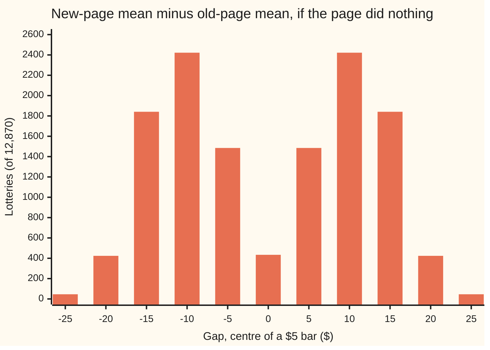

# Permutation tests: shuffle the labels to get the null distribution

[Syllabus](../../../SYLLABUS.md) → [Probability and statistics](../../../SYLLABUS.md#w09) → [Survival, Design and Causality](../../../SYLLABUS.md#w09-s13) → Permutation tests

---

## General Overview

A small online shop tries a new product page for one afternoon. Sixteen visitors arrive. A lottery sends exactly 8 of them to the old page and 8 to the new one, as in [Randomised experiments](04-randomised-experiments-and-ab-tests.md). The shop sells an $8 item, a $12 item, a $22 item, a $27 item and a $95 bundle, so spending comes in lumps:

- **Old page:** $0, $8, $0, $12, $0, $8, $0, $8. Average **$4.50**.
- **New page:** $22, $0, $95, $0, $22, $27, $0, $22. Average **$23.50**.

The new page is ahead by **$19.00** a visitor, with a standard error of $11.15. Is that the page, or the luck of the lottery? The usual formula, the t-test of [t-tests](../08-Confidence%20Intervals%20and%20Tests/05-t-tests-and-comparing-means.md), assumes spending follows a bell curve. This spending is mostly zeros and one $95 bundle. The t-test returns a p-value of 0.1105 anyway. This card does not reuse the checkout test of [Randomised experiments](04-randomised-experiments-and-ab-tests.md): with 10,000 visitors a page, each buying or not, that gap follows a bell curve closely, and a shuffle gives nearly the formula's p-value. A small test with lumpy spending is where the two part company.

There is a way to ask without any curve. Suppose the page changed nothing: each visitor would have spent the same on either page. Then every other way the lottery could have fallen is known in full. Write "old" and "new" on sixteen cards, shuffle them, deal one to each visitor, and recompute the gap. There are 12,870 possible deals. Only 548 of them give a gap of $19.00 or more in either direction, so the p-value is 548 in 12,870, **0.0426**: about 1 lottery in 23. Shuffling the labels is the whole method. From here on it is called a **permutation test**, since each deal is a rearrangement (a permutation) of the labels.

**If the treatment changed nothing, the lottery is the only thing that varied, so recomputing the gap under every assignment the lottery could have made gives the gap's null distribution exactly, with no assumption about the shape of the data.**

**What kind of fact this is:** a method. Its guarantee is a theorem, proved on this card in Why it works: when the treatment changed nothing, a p-value at or below 0.05 turns up in at most 5 lotteries in 100, whatever the data look like.

### The picture: the gap under all 12,870 lotteries



Each bar counts the lotteries whose gap falls within $2.50 of its centre; a gap exactly on an edge goes to the bar nearer zero. The law has two humps, not one bell. The $95 visitor lands in the new group in half the lotteries, pushing the gap right, and in the old group in the other half, pushing it left. The observed $19.00 sits in the thin outer bars.

---

## The formula

Notation first, in words. The visitors are numbered 1 to $N$, and $y_i$ is what visitor $i$ spent. An **assignment** $a$ is one possible lottery outcome: a list of which $n$ visitors see the new page. $T(a)$ is the gap that assignment would show: the new group's average minus the old group's. The observed assignment gives the observed gap, $T_{obs}$. The sign $\#$ means "the number of".

$$p \;=\; \frac{\#\{\,a \;:\; |T(a)| \ge |T_{obs}|\,\}}{M}, \qquad M = \binom{N}{n}$$

**Read it aloud:** the p-value is the share of all possible lottery outcomes whose gap is at least as far from zero as the gap actually seen.

The count $M = \binom{N}{n}$, read "N choose n" and written C(N, n) in the counting cards, is the number of ways to pick which $n$ of the $N$ visitors see the new page: 12,870 here. The observed assignment is one of them, so it counts itself and $p$ is never zero.

| Symbol | Plain meaning | In our example | Push it up and the answer… |
| --- | --- | --- | --- |
| $N$ | visitors in the test | 16 | more lotteries, finer p-values |
| $n$ | visitors the lottery sends to the new page | 8 | — |
| $y_i$, $i$ | dollars spent by visitor number $i$ | $0 to $95 | — |
| $a$ | one assignment: which $n$ visitors see the new page | the one drawn, or any other | — |
| $M$ | how many assignments the lottery could make | 12,870 | the smallest possible p-value shrinks |
| $T(a)$ | the gap under assignment $a$: new mean minus old mean | one value per assignment | — |
| $s$ | the new group's dollar total | 188 | the gap grows |
| $T_{obs}$ | the gap actually seen | $19.00 | $p$ falls |
| $p$ | the p-value | 0.0426 | — |
| $S^2$, $\bar y$ | spending's variance across all $N$ visitors (divisor $N-1$), and their mean | 560.40 dollars squared and $14.00; the variance sets the $11.84 spread | the shuffle law widens |
| $\sigma^2$ | in the folded proof: the variance of one amount drawn at random, divisor $N$ | 15/16 of $S^2$ | — |
| $R$, $b$ | random shuffles drawn when $M$ is too large to list, and how many reach $T_{obs}$ | 20,000 and 881 | more shuffles tighten the estimate of $p$ |
| $\hat p$ | the p-value estimated from the $R$ shuffles | 0.0441 | — |
| $\alpha$ | the test's level: the false-alarm rate it promises not to exceed | 0.05 | more false alarms allowed, more real effects caught |

The gap itself:

$$T(a) \;=\; \frac{1}{n}\sum_{i \in a} y_i \;-\; \frac{1}{N-n}\sum_{i \notin a} y_i$$

In words: the average of the visitors in the new group minus the average of the rest.

Two helpers. The shuffle law is centred on zero, with spread

$$\operatorname{SD}\big(T\big) \;=\; \sqrt{S^2\left(\frac{1}{n} + \frac{1}{N-n}\right)}, \qquad S^2 = \frac{1}{N-1}\sum_{i=1}^{N} (y_i - \bar y)^2$$

which is $11.84 here: the spread of the gap across all the lotteries, found without listing them. When $M$ is too large to list, draw $R$ random shuffles and report

$$\hat p \;=\; \frac{b + 1}{R + 1}$$

with the observed assignment counted as one more shuffle, so the estimate is never zero either.

### When it holds

- **The labels were handed out by a lottery.** The test's probability is the lottery's. Where visitors chose their own page, no lottery exists to rerun, and shuffling proves nothing about cause; see [Confounding](07-confounding-and-simpsons-paradox.md).
- **The shuffle copies the lottery actually run.** A design that paired or blocked visitors, as in [Blocking and factorial designs](05-blocking-and-factorial-designs.md), is shuffled within its blocks only. Shuffling across them tests a lottery nobody ran.
- **The null is "no visitor's spending changed", not "the averages are equal".** Two groups with the same average but different spread are not interchangeable. Shuffle them anyway and, in the simulation under What breaks, a 5% test raises false alarms 28.9% of the time.
- **Ties count as extreme.** Use "at least as far", never "further". Dropping the ties breaks the guarantee: on this data a 5% test then fires 7.2% of the time.
- **The gap was chosen before the data were seen.** Trying several statistics and keeping the smallest p-value is the problem of [Many tests](../08-Confidence%20Intervals%20and%20Tests/08-multiple-testing.md).

---

## Why it works

### Step 0: under the null, only the labels are random

The sixteen amounts spent are not random in this argument. The visitors arrived, and each would spend what they spend. The only chance event was the lottery. If the page did nothing, the lottery moved labels around and left every dollar where it was. So the gap's whole law is the list of gaps under every lottery outcome, and that list can be computed.

### Step 1: the null fills in the missing column

Each visitor carries two potential outcomes, as in [Randomised experiments](04-randomised-experiments-and-ab-tests.md): a spend on the old page and a spend on the new. The shop sees only one. The visitor who spent $95 on the new page might have spent $0 on the old one; the data cannot say.

The null hypothesis of a permutation test says the two are equal for every visitor. That claim is strong, and it is called the **sharp null**. It supplies every missing number: under it, the visitor who spent $95 would have spent $95 on either page. With both columns filled, the gap under any other assignment is plain arithmetic.

The weaker claim "the two pages have the same average spend" does not fill in the missing column. It is not what this test tests.

### Step 2: every assignment was equally likely

The lottery chose 8 of 16 visitors with every choice equally likely: each of the $M = 12{,}870$ assignments had chance $1/M$. So the observed gap $T_{obs}$ is one draw, at random, from the list of 12,870 gaps.

The list has a symmetry here. Swapping every label turns a gap of +$19.00 into −$19.00, because both groups hold 8. So the 274 assignments with a gap of +$19.00 or more are matched by 274 with a gap of −$19.00 or less.

### Step 3: the guarantee, by ranking

If $T_{obs}$ is a random draw from the list, how often does it land in the top 5% of the list by size? At most 5% of the time, because the top 5% of a list holds at most 5% of its entries. The p-value is exactly the rank of the draw, as a share of the list, counted from the top.

On this data: the p-value is at or below 0.05 for 548 of the 12,870 assignments, a rate of 0.0426. That rate is below 0.05, as promised. The t-test's own 5% rule, applied to all the same assignments, fires on 92 of them, a rate of 0.0071. On data this lumpy the t-test's 5% is really under 1%.

<details>
<summary>Detailed proof: a false alarm at level α happens at most α of the time</summary>

Fix the $N$ amounts. Under the sharp null they do not depend on the assignment. For each assignment $a$, let $p(a)$ be the share of assignments $b$ with $|T(b)| \ge |T(a)|$. Pick any level α between 0 and 1. The **false alarms** are the assignments with $p(a) \le \alpha$.

If there are none, their chance is 0. Otherwise let $a^*$ be the false alarm with the smallest $|T|$. Every assignment $b$ with $|T(b)| \ge |T(a^*)|$ has at most as many assignments reaching it as $a^*$ has, so $p(b) \le p(a^*) \le \alpha$: $b$ is a false alarm too. Every false alarm has $|T| \ge |T(a^*)|$, by the choice of $a^*$. So the false alarms are exactly the assignments with $|T(b)| \ge |T(a^*)|$, and there are $M \cdot p(a^*)$ of them.

The lottery picks each assignment with chance $1/M$, so the chance of a false alarm is $M \cdot p(a^*) / M = p(a^*) \le \alpha$. Nothing about the shape of the $y_i$ was used. The step "at most as many beating it" needs ties counted on both sides, which is why the count uses "at least as far", not "further".

</details>

### Step 4: no bell curve appears anywhere

Steps 0 to 3 used the lottery and the sharp null. They never used the shape of the spending: not a mean, not a spread, not a bell curve. That is the sense in which a permutation test is **exact**: its false-alarm rate is controlled by counting, not by an approximation that improves with sample size. The shape of the data still matters for **power**, the chance of detecting a real effect, and a lumpy $95 bundle makes a real effect harder to see. But it cannot make a no-effect page look good more often than the stated rate.

### Step 5: the spread of the shuffle law, by formula

The shuffle law is centred on zero: over all lotteries, each group's average is, on average, the average of all $N$ visitors. Its spread has a closed form, the helper formula above. It gives $11.84, the same as listing all 12,870 gaps.

<details>
<summary>Detailed proof: the spread of the shuffle law</summary>

Write $s$ for the new group's total. Then $T = s\left(\frac1n + \frac1{N-n}\right) - \frac{\text{total}}{N-n}$, so the spread of $T$ is $\frac{N}{n(N-n)}$ times the spread of $s$. The total $s$ is $n$ draws without putting back from the $N$ amounts. One draw has variance $\sigma^2 = \frac{N-1}{N} S^2$. Two different draws have covariance $-\sigma^2/(N-1)$: the $N$ draws of a full sweep add to a fixed total, whose variance is zero, and that pins the covariance. So the variance of $s$ is $n\sigma^2 - n(n-1)\,\sigma^2/(N-1) = n\sigma^2 \frac{N-n}{N-1} = \frac{n(N-n)}{N} S^2$. Multiply by $\left(\frac{N}{n(N-n)}\right)^2$: the variance of $T$ is $\frac{N}{n(N-n)} S^2 = S^2\left(\frac1n + \frac1{N-n}\right)$.

</details>

The t-test's standard error has the same form with a different variance: the spread within each group, pooled, in place of $S^2$, the spread of all sixteen amounts together. That gives the t-test's $11.15 against the shuffle law's $11.84. Under the sharp null the within-group variance averages exactly $S^2$ over all lotteries, so both aim at the same spread, and the bigger difference is the shape. Laying a bell curve with the shuffle law's own spread over the two-humped shuffle law puts the gap at 1.6052 spreads out and gives a p-value of 0.1084, far from the exact 0.0426. The spread was right; the bell was wrong.

### Step 6: when the list is too long, sample it

With 50 visitors on each page the list of assignments is longer than any computer can hold. Draw $R$ random shuffles instead, count the $b$ that reach the observed gap, and report $(b+1)/(R+1)$. That estimate is itself a random number, with standard error $\sqrt{\hat p(1-\hat p)/R}$. Here 20,000 shuffles give 881 hits: 0.0440, standard error 0.0015, within about one standard error of the exact 0.0426. Adding the observed assignment as one more shuffle makes 0.0441 and keeps the answer from ever being zero, which a finite sample could otherwise report (Phipson and Smyth, below).

A second road to the exact count never lists an assignment. Count, for each dollar total, how many groups of 8 visitors reach it, building the table one visitor at a time. The groups with totals of $188 or more, or $36 or less, number 548: the same count, with no list.

---

## Worked numbers, by hand

| Step | Arithmetic | Value |
| --- | --- | --- |
| old-page mean | (0 + 8 + 0 + 12 + 0 + 8 + 0 + 8) ÷ 8 = 36 ÷ 8 | $4.50 |
| new-page mean | (22 + 0 + 95 + 0 + 22 + 27 + 0 + 22) ÷ 8 = 188 ÷ 8 | $23.50 |
| observed gap | 23.50 − 4.50 | **$19.00** |
| pooled total | 188 + 36 | $224 |
| gap for a new-group total $s$ | $s$ ÷ 8 − (224 − $s$) ÷ 8 = (2$s$ − 224) ÷ 8 | — |
| "as extreme" means | gap ≥ 19 or ≤ −19, so $s$ ≥ 188 or $s$ ≤ 36 | two tails |
| possible lotteries | C(16, 8) = 16! ÷ (8! × 8!) | 12,870 |
| lotteries with $s$ ≥ 188 | counted; each must include the $95 visitor | 274 |
| lotteries with $s$ ≤ 36 | the mirror image, labels swapped | 274 |
| **p-value** | (274 + 274) ÷ 12,870 | **0.0426** |

If the new page changed nobody's spending, a lottery would produce a gap this large about 1 time in 23. That is evidence against "no change", not the chance that the page does nothing, and the $19.00 itself is uncertain by a standard error of $11.15.

### What breaks if you drop a piece

| Mistake | Comes out at | What went wrong |
| --- | --- | --- |
| Count only gaps strictly beyond $19.00 | p = 0.0371 (478 lotteries); as a 5% test it fires on 926 lotteries, 0.0720 | Drops the observed lottery and its ties, so false alarms exceed the stated rate |
| Report the one-sided count as the answer | p = 0.0213 | Halves the p-value by picking the direction after seeing which way the gap went |
| t-test on $95-or-nothing spending | p = 0.1105; real 5% rate 0.0071 | Assumes a bell curve the data do not have |
| Bell curve with the right spread | p = 0.1084 | The shuffle law has two humps; the spread was right, the shape wrong |
| Shuffle groups with equal means, unequal spread | 5% test rejects 0.2890, standard error 0.0101 | Four visitors spread four times wider are not interchangeable with twelve; the sharp null is false |

The last row is its own experiment: 2,000 simulated tests, 4 visitors on one side with spending four times as spread out as the 12 on the other, the same average on both sides. The code prints all five.

---

## Code, from first principles, and it actually runs

The code takes three independent roads to the p-value: listing all 12,870 assignments; counting groups of 8 by their dollar total, which never lists one; and 20,000 random shuffles. It finds the shuffle law's spread by listing and by formula, runs the t-test with its own t density and bisection, measures both tests' real false-alarm rates over every assignment, and prints each "what breaks" number. Random numbers come from SplitMix64, seed 20260929, written out in both languages, so the shuffles are the same in each. The bell curve's area is its own Taylor series.

### Python

```python
# Permutation tests -- the check behind the card.  Standard library only.
# A shop's pilot A/B test: 16 visitors, a lottery shows 8 the old product page and 8 the new one.
# Road 1: all 12,870 ways the lottery could have split them.  Road 2: a count of groups of 8 by
# their total, which never lists a split.  Road 3: 20,000 random shuffles from SplitMix64.
# Then the moments of the shuffle law by formula, the t-test, and what breaks.
from math import sqrt, pi, log, cos
from itertools import combinations
from bisect import bisect_left

OLD = [0, 8, 0, 12, 0, 8, 0, 8]             # dollars spent by each visitor on the old page
NEW = [22, 0, 95, 0, 22, 27, 0, 22]         # dollars spent by each visitor on the new page
POOL, N, n = OLD + NEW, 16, 8
TOTAL, EPS, R = sum(POOL), 1e-9, 20000
MASK, state = (1 << 64) - 1, 20260929

def splitmix():                             # SplitMix64: the one source of randomness
    global state
    state = (state + 0x9E3779B97F4A7C15) & MASK
    z = state
    z = ((z ^ (z >> 30)) * 0xBF58476D1CE4E5B9) & MASK
    z = ((z ^ (z >> 27)) * 0x94D049BB133111EB) & MASK
    return z ^ (z >> 31)

def uniform(): return ((splitmix() >> 11) + 0.5) / 2.0 ** 53
def normal(): return sqrt(-2.0 * log(uniform())) * cos(2.0 * pi * uniform())   # Box-Muller
def gap(s, total=TOTAL, k=n, m=N - n): return s / k - (total - s) / m          # new mean - old mean

def Phi(x):                                 # standard normal area left of x, by its Taylor series
    term, s, k = x, x, 0
    while abs(term) > 1e-17:
        k += 1
        term *= -x * x * (2 * k - 1) / (2 * k * (2 * k + 1))
        s += term
    return 0.5 + s / sqrt(2 * pi)

G = 0.5 * sqrt(pi)                          # Gamma(7.5) / Gamma(7): t law with 14 degrees of freedom
for j in range(1, 7): G *= (j + 0.5) / j
def t_area(t, steps=2000):                  # area under the t density from 0 to t, Simpson's rule
    f = lambda x: G / sqrt(14 * pi) * (1 + x * x / 14) ** -7.5
    h = t / steps
    return h / 3 * sum((1 if i in (0, steps) else 4 if i % 2 else 2) * f(i * h) for i in range(steps + 1))

def t_stat(s, q):                           # pooled t from the new group's sum s and sum of squares q
    ss = (q - s * s / n) + (SQ - q - (TOTAL - s) ** 2 / (N - n))
    return gap(s) / sqrt(ss / (N - 2) * (1 / n + 1 / (N - n)))

SQ = sum(x * x for x in POOL)
OBS = gap(sum(NEW))
print(f"old page mean {sum(OLD) / n:.2f}, new page mean {sum(NEW) / n:.2f}, observed gap {OBS:.2f}")
sd_o = sqrt(sum((x - sum(OLD) / n) ** 2 for x in OLD) / (n - 1))
sd_n = sqrt(sum((x - sum(NEW) / n) ** 2 for x in NEW) / (n - 1))
print(f"standard error of the gap {sqrt(sd_o ** 2 / n + sd_n ** 2 / n):.2f}")

# Road 1: every split
splits = [(sum(POOL[i] for i in c), sum(POOL[i] ** 2 for i in c)) for c in combinations(range(N), n)]
gaps = [gap(s) for s, _ in splits]
M = len(gaps)
two = sum(abs(g) >= OBS - EPS for g in gaps)
one = sum(g >= OBS - EPS for g in gaps)
strict = sum(abs(g) > OBS + EPS for g in gaps)
print(f"pooled total {TOTAL}; new-page total {sum(NEW)}; old-page total {sum(OLD)}")
print(f"road 1, all {M} splits: {one} at +{OBS:.2f} or more, {two - one} at -{OBS:.2f} or less, p = {two / M:.4f}")

# Road 2: ways[k][s] = number of groups of k visitors whose spending totals s dollars
ways = [[0] * (TOTAL + 1) for _ in range(n + 1)]
ways[0][0] = 1
for x in POOL:
    for k in range(n, 0, -1):
        for s in range(TOTAL - x, -1, -1):
            ways[k][s + x] += ways[k - 1][s]
two_dp = sum(ways[n][s] for s in range(TOTAL + 1) if abs(gap(s)) >= OBS - EPS)
print(f"road 2, groups of 8 counted by total: {sum(ways[n])} groups, {two_dp} as extreme, p = {two_dp / M:.4f}")

# Road 3: random shuffles, Fisher-Yates driven by SplitMix64
hits = 0
for _ in range(R):
    deck = POOL[:]
    for i in range(N - 1, 0, -1):
        j = splitmix() % (i + 1)
        deck[i], deck[j] = deck[j], deck[i]
    hits += abs(gap(sum(deck[:n]))) >= OBS - EPS
ph = hits / R
print(f"road 3, {R} shuffles: {hits} as extreme, p = {ph:.4f}, standard error {sqrt(ph * (1 - ph) / R):.4f}")
print(f"  shuffles with the observed split counted in: (hits + 1) / (R + 1) = {(hits + 1) / (R + 1):.4f}")

# The shuffle law's centre and spread, by enumeration and by formula
mean_g = sum(gaps) / M
var_g = sum((g - mean_g) ** 2 for g in gaps) / M
S2 = (SQ - TOTAL ** 2 / N) / (N - 1)
var_f = S2 * (1 / n + 1 / (N - n))
print(f"shuffle law: mean {mean_g:.4f}, sd by enumeration {sqrt(var_g):.4f}, sd by formula {sqrt(var_f):.4f} from S^2 {S2:.4f} about the mean {TOTAL / N:.4f}")
p_norm = 2 * (1 - Phi(OBS / sqrt(var_f)))
print(f"bell curve laid over the shuffle law: z = {OBS / sqrt(var_f):.4f}, p = {p_norm:.4f}")

# The t-test on the same data, and its real rate of false alarms on this data
t_obs = t_stat(sum(NEW), sum(x * x for x in NEW))
p_t = 1 - 2 * t_area(t_obs)
lo, hi = 0.0, 10.0
for _ in range(60):                         # bisection for the 5% two-sided critical value
    mid = (lo + hi) / 2
    lo, hi = (mid, hi) if t_area(mid) < 0.475 else (lo, mid)
t_rej = sum(abs(t_stat(s, q)) >= lo for s, q in splits)
print(f"t-test: t = {t_obs:.4f}, p = {p_t:.4f}; 5% cut-off {lo:.4f}")
absg = sorted(abs(g) for g in gaps)
perm_rej = sum((M - bisect_left(absg, abs(g) - EPS)) / M <= 0.05 for g in gaps)
print(f"false alarms over all {M} splits at 5%: shuffle test {perm_rej} = {perm_rej / M:.4f}, "
      f"t-test {t_rej} = {t_rej / M:.4f}")

# Chart: the shuffle law in bars of $5, centred on multiples of 5; an edge value goes to the inner bar
bars = [0] * 11
for g in gaps:
    k = 0 if abs(g) <= 2.5 + EPS else int((abs(g) - 2.5 - EPS) // 5) + 1
    bars[5 + (k if g > 0 else -k)] += 1
print("chart, gap centre ($) " + " ".join(f"{5 * (i - 5):5d}" for i in range(11)))
print("chart, splits         " + " ".join(f"{b:5d}" for b in bars))

# What breaks
strict_rej = sum((M - bisect_left(absg, abs(g) + EPS)) / M <= 0.05 for g in gaps)   # ties dropped
print(f"wrong: strictly larger only, {strict} splits, p = {strict / M:.4f}; "
      f"as a 5% test it fires on {strict_rej} = {strict_rej / M:.4f}")
print(f"wrong: one side reported as the two-sided answer, p = {one / M:.4f}")
REPS, C4, rej = 2000, list(combinations(range(N), 4)), 0
for _ in range(REPS):                       # equal means, 4 visitors spread 4x, 12 visitors spread 1x
    x = [4.0 * normal() for _ in range(4)] + [normal() for _ in range(12)]
    tot = sum(x)
    o = abs(gap(sum(x[:4]), tot, 4, 12))
    c = sum(abs(gap(x[a] + x[b] + x[e] + x[f], tot, 4, 12)) >= o - EPS for a, b, e, f in C4)
    rej += c / len(C4) <= 0.05
pr = rej / REPS
print(f"wrong: shuffling groups of unequal spread, equal means: rejects {rej} of {REPS} "
      f"= {pr:.4f}, standard error {sqrt(pr * (1 - pr) / REPS):.4f}")

assert two == two_dp and M == sum(ways[n]) == 12870          # enumeration against the sum count
assert abs(ph - two / M) < 4 * sqrt(ph * (1 - ph) / R)       # shuffles within 4 standard errors
assert abs(var_g - var_f) < 1e-9 and abs(mean_g) < 1e-9     # shuffle law's spread by formula
assert perm_rej / M <= 0.05 < strict_rej / M and pr > 0.05 + 4 * sqrt(pr * (1 - pr) / REPS)
assert abs(Phi(1.959963984540054) - 0.975) < 1e-12 and abs(lo - 2.1447866879) < 1e-6  # published tables
print("ALL CHECKS PASS")
```

**Ran 2026-10-06 on macOS, Python 3.14.6, standard library only. All checks passed. Output, pasted from the run:**

```
old page mean 4.50, new page mean 23.50, observed gap 19.00
standard error of the gap 11.15
pooled total 224; new-page total 188; old-page total 36
road 1, all 12870 splits: 274 at +19.00 or more, 274 at -19.00 or less, p = 0.0426
road 2, groups of 8 counted by total: 12870 groups, 548 as extreme, p = 0.0426
road 3, 20000 shuffles: 881 as extreme, p = 0.0440, standard error 0.0015
  shuffles with the observed split counted in: (hits + 1) / (R + 1) = 0.0441
shuffle law: mean 0.0000, sd by enumeration 11.8364, sd by formula 11.8364 from S^2 560.4000 about the mean 14.0000
bell curve laid over the shuffle law: z = 1.6052, p = 0.1084
t-test: t = 1.7040, p = 0.1105; 5% cut-off 2.1448
false alarms over all 12870 splits at 5%: shuffle test 548 = 0.0426, t-test 92 = 0.0071
chart, gap centre ($)   -25   -20   -15   -10    -5     0     5    10    15    20    25
chart, splits            46   424  1841  2422  1485   434  1485  2422  1841   424    46
wrong: strictly larger only, 478 splits, p = 0.0371; as a 5% test it fires on 926 = 0.0720
wrong: one side reported as the two-sided answer, p = 0.0213
wrong: shuffling groups of unequal spread, equal means: rejects 578 of 2000 = 0.2890, standard error 0.0101
ALL CHECKS PASS
```

### Rust

Same roads, same seed, same labels, built with `rustc --edition 2021 -O`.

```rust
// Permutation tests -- the same check as the Python, in Rust.  No crates.
// A shop's pilot A/B test: 16 visitors, a lottery shows 8 the old product page and 8 the new one.
// Road 1: all 12,870 ways the lottery could have split them.  Road 2: a count of groups of 8 by
// their total, which never lists a split.  Road 3: 20,000 random shuffles from SplitMix64.
// Then the moments of the shuffle law by formula, the t-test, and what breaks.
use std::f64::consts::PI;

const OLD: [i64; 8] = [0, 8, 0, 12, 0, 8, 0, 8];      // dollars spent by each visitor, old page
const NEW: [i64; 8] = [22, 0, 95, 0, 22, 27, 0, 22];  // dollars spent by each visitor, new page
const N: usize = 16;
const K: usize = 8;
const EPS: f64 = 1e-9;
const R: usize = 20000;

struct Rng(u64);
impl Rng {
    fn next(&mut self) -> u64 {                       // SplitMix64: the one source of randomness
        self.0 = self.0.wrapping_add(0x9E3779B97F4A7C15);
        let mut z = self.0;
        z = (z ^ (z >> 30)).wrapping_mul(0xBF58476D1CE4E5B9);
        z = (z ^ (z >> 27)).wrapping_mul(0x94D049BB133111EB);
        z ^ (z >> 31)
    }
    fn uniform(&mut self) -> f64 { ((self.next() >> 11) as f64 + 0.5) / 2f64.powi(53) }
    fn normal(&mut self) -> f64 {                     // Box-Muller
        let a = (-2.0 * self.uniform().ln()).sqrt();
        a * (2.0 * PI * self.uniform()).cos()
    }
}

fn gap(s: f64, total: f64, k: f64, m: f64) -> f64 { s / k - (total - s) / m }   // new mean - old mean

fn phi(x: f64) -> f64 {                               // standard normal area left of x, Taylor series
    let (mut term, mut s, mut k) = (x, x, 0.0);
    while term.abs() > 1e-17 {
        k += 1.0;
        term *= -x * x * (2.0 * k - 1.0) / (2.0 * k * (2.0 * k + 1.0));
        s += term;
    }
    0.5 + s / (2.0 * PI).sqrt()
}

fn t_area(t: f64, g: f64) -> f64 {                    // area under the t density (14 df) from 0 to t
    let steps = 2000;
    let h = t / steps as f64;
    let f = |x: f64| g / (14.0 * PI).sqrt() * (1.0 + x * x / 14.0).powf(-7.5);
    let mut s = 0.0;
    for i in 0..=steps {
        let w = if i == 0 || i == steps { 1.0 } else if i % 2 == 1 { 4.0 } else { 2.0 };
        s += w * f(i as f64 * h);
    }
    h / 3.0 * s
}

fn subsets(n: usize, k: usize, start: usize, cur: &mut Vec<usize>, out: &mut Vec<Vec<usize>>) {
    if cur.len() == k { out.push(cur.clone()); return }
    for i in start..n { cur.push(i); subsets(n, k, i + 1, cur, out); cur.pop(); }
}

fn main() {
    let pool: Vec<i64> = OLD.iter().chain(NEW.iter()).copied().collect();
    let total: i64 = pool.iter().sum();
    let (tf, kf, mf) = (total as f64, K as f64, (N - K) as f64);
    let sq: i64 = pool.iter().map(|x| x * x).sum();
    let mut rng = Rng(20260929);
    let mut g = 0.5 * PI.sqrt();                      // Gamma(7.5) / Gamma(7)
    for j in 1..7 { g *= (j as f64 + 0.5) / j as f64 }
    let t_stat = |s: f64, q: f64| {
        let ss = (q - s * s / kf) + (sq as f64 - q - (tf - s) * (tf - s) / mf);
        gap(s, tf, kf, mf) / (ss / (N as f64 - 2.0) * (1.0 / kf + 1.0 / mf)).sqrt()
    };
    let (so, sn) = (OLD.iter().sum::<i64>() as f64, NEW.iter().sum::<i64>() as f64);
    let obs = gap(sn, tf, kf, mf);
    println!("old page mean {:.2}, new page mean {:.2}, observed gap {:.2}", so / kf, sn / kf, obs);
    let sd = |v: &[i64]| { let m = v.iter().sum::<i64>() as f64 / kf;
        (v.iter().map(|&x| (x as f64 - m).powi(2)).sum::<f64>() / (kf - 1.0)).sqrt() };
    println!("standard error of the gap {:.2}", (sd(&OLD).powi(2) / kf + sd(&NEW).powi(2) / kf).sqrt());

    let mut idx = Vec::new();                         // Road 1: every split
    subsets(N, K, 0, &mut Vec::new(), &mut idx);
    let splits: Vec<(f64, f64)> = idx.iter().map(|c| (c.iter().map(|&i| pool[i]).sum::<i64>() as f64,
        c.iter().map(|&i| pool[i] * pool[i]).sum::<i64>() as f64)).collect();
    let gaps: Vec<f64> = splits.iter().map(|&(s, _)| gap(s, tf, kf, mf)).collect();
    let m = gaps.len();
    let two = gaps.iter().filter(|g| g.abs() >= obs - EPS).count();
    let one = gaps.iter().filter(|&&g| g >= obs - EPS).count();
    let strict = gaps.iter().filter(|g| g.abs() > obs + EPS).count();
    println!("pooled total {}; new-page total {}; old-page total {}", total, sn, so);
    println!("road 1, all {} splits: {} at +{:.2} or more, {} at -{:.2} or less, p = {:.4}", m, one, obs, two - one, obs, two as f64 / m as f64);

    let tu = total as usize;                          // Road 2: groups of k counted by their total
    let mut ways = vec![vec![0u64; tu + 1]; K + 1];
    ways[0][0] = 1;
    for &x in &pool {
        let x = x as usize;
        for k in (1..=K).rev() { for s in (0..=tu - x).rev() { ways[k][s + x] += ways[k - 1][s] } }
    }
    let groups: u64 = ways[K].iter().sum();
    let two_dp: u64 = (0..=tu).filter(|&s| gap(s as f64, tf, kf, mf).abs() >= obs - EPS).map(|s| ways[K][s]).sum();
    println!("road 2, groups of 8 counted by total: {} groups, {} as extreme, p = {:.4}", groups, two_dp, two_dp as f64 / m as f64);

    let mut hits = 0;                                 // Road 3: Fisher-Yates shuffles
    for _ in 0..R {
        let mut deck = pool.clone();
        for i in (1..N).rev() { let j = (rng.next() % (i as u64 + 1)) as usize; deck.swap(i, j) }
        if gap(deck[..K].iter().sum::<i64>() as f64, tf, kf, mf).abs() >= obs - EPS { hits += 1 }
    }
    let ph = hits as f64 / R as f64;
    println!("road 3, {} shuffles: {} as extreme, p = {:.4}, standard error {:.4}", R, hits, ph, (ph * (1.0 - ph) / R as f64).sqrt());
    println!("  shuffles with the observed split counted in: (hits + 1) / (R + 1) = {:.4}", (hits + 1) as f64 / (R + 1) as f64);

    let mean_g = gaps.iter().sum::<f64>() / m as f64;
    let var_g = gaps.iter().map(|g| (g - mean_g).powi(2)).sum::<f64>() / m as f64;
    let s2 = (sq as f64 - tf * tf / N as f64) / (N as f64 - 1.0); let var_f = s2 * (1.0 / kf + 1.0 / mf);
    println!("shuffle law: mean {:.4}, sd by enumeration {:.4}, sd by formula {:.4} from S^2 {:.4} about the mean {:.4}", mean_g, var_g.sqrt(), var_f.sqrt(), s2, tf / N as f64);
    let z = obs / var_f.sqrt();
    println!("bell curve laid over the shuffle law: z = {:.4}, p = {:.4}", z, 2.0 * (1.0 - phi(z)));

    let t_obs = t_stat(sn, NEW.iter().map(|x| x * x).sum::<i64>() as f64);
    let p_t = 1.0 - 2.0 * t_area(t_obs, g);
    let (mut lo, mut hi) = (0.0f64, 10.0f64);
    for _ in 0..60 { let mid = (lo + hi) / 2.0; if t_area(mid, g) < 0.475 { lo = mid } else { hi = mid } }
    let t_rej = splits.iter().filter(|&&(s, q)| t_stat(s, q).abs() >= lo).count();
    println!("t-test: t = {:.4}, p = {:.4}; 5% cut-off {:.4}", t_obs, p_t, lo);
    let mut absg: Vec<f64> = gaps.iter().map(|g| g.abs()).collect();
    absg.sort_by(|a, b| a.partial_cmp(b).unwrap());
    let perm_rej = gaps.iter().filter(|g| {
        let below = absg.partition_point(|&a| a < g.abs() - EPS);
        (m - below) as f64 / m as f64 <= 0.05 }).count();
    println!("false alarms over all {} splits at 5%: shuffle test {} = {:.4}, t-test {} = {:.4}",
             m, perm_rej, perm_rej as f64 / m as f64, t_rej, t_rej as f64 / m as f64);

    let mut bars = [0usize; 11];                      // chart: bars of $5, an edge value goes inward
    for &g in &gaps {
        let k = if g.abs() <= 2.5 + EPS { 0 } else { ((g.abs() - 2.5 - EPS) / 5.0).floor() as i64 + 1 };
        bars[(5 + if g > 0.0 { k } else { -k }) as usize] += 1;
    }
    println!("chart, gap centre ($) {}", (0..11).map(|i| format!("{:5}", 5 * (i - 5))).collect::<Vec<_>>().join(" "));
    println!("chart, splits         {}", bars.iter().map(|b| format!("{:5}", b)).collect::<Vec<_>>().join(" "));

    let strict_rej = gaps.iter().filter(|g| {         // ties dropped
        (m - absg.partition_point(|&a| a < g.abs() + EPS)) as f64 / m as f64 <= 0.05 }).count();
    println!("wrong: strictly larger only, {} splits, p = {:.4}; as a 5% test it fires on {} = {:.4}",
             strict, strict as f64 / m as f64, strict_rej, strict_rej as f64 / m as f64);
    println!("wrong: one side reported as the two-sided answer, p = {:.4}", one as f64 / m as f64);
    let (reps, mut rej) = (2000, 0);
    let mut c4 = Vec::new();
    subsets(N, 4, 0, &mut Vec::new(), &mut c4);
    for _ in 0..reps {                                // equal means, 4 visitors spread 4x, 12 spread 1x
        let mut x = Vec::new();
        for _ in 0..4 { x.push(4.0 * rng.normal()) }
        for _ in 0..12 { x.push(rng.normal()) }
        let tot: f64 = x.iter().sum();
        let o = gap(x[..4].iter().sum(), tot, 4.0, 12.0).abs();
        let c = c4.iter().filter(|c| gap(x[c[0]] + x[c[1]] + x[c[2]] + x[c[3]], tot, 4.0, 12.0).abs() >= o - EPS).count();
        if c as f64 / c4.len() as f64 <= 0.05 { rej += 1 }
    }
    let pr = rej as f64 / reps as f64;
    println!("wrong: shuffling groups of unequal spread, equal means: rejects {} of {} = {:.4}, standard error {:.4}",
             rej, reps, pr, (pr * (1.0 - pr) / reps as f64).sqrt());

    assert!(two as u64 == two_dp && m as u64 == groups && m == 12870);   // enumeration vs sum count
    assert!((ph - two as f64 / m as f64).abs() < 4.0 * (ph * (1.0 - ph) / R as f64).sqrt());
    assert!((var_g - var_f).abs() < 1e-9 && mean_g.abs() < 1e-9);       // spread by formula
    assert!(perm_rej as f64 / m as f64 <= 0.05 && strict_rej as f64 / m as f64 > 0.05);
    assert!(pr > 0.05 + 4.0 * (pr * (1.0 - pr) / reps as f64).sqrt());
    assert!((phi(1.959963984540054) - 0.975).abs() < 1e-12 && (lo - 2.1447866879).abs() < 1e-6);   // tables
    println!("ALL CHECKS PASS");
}
```

**Ran 2026-10-06 on macOS, rustc 1.98.1, no crates. All checks passed. Output, pasted from the run:**

```
old page mean 4.50, new page mean 23.50, observed gap 19.00
standard error of the gap 11.15
pooled total 224; new-page total 188; old-page total 36
road 1, all 12870 splits: 274 at +19.00 or more, 274 at -19.00 or less, p = 0.0426
road 2, groups of 8 counted by total: 12870 groups, 548 as extreme, p = 0.0426
road 3, 20000 shuffles: 881 as extreme, p = 0.0440, standard error 0.0015
  shuffles with the observed split counted in: (hits + 1) / (R + 1) = 0.0441
shuffle law: mean 0.0000, sd by enumeration 11.8364, sd by formula 11.8364 from S^2 560.4000 about the mean 14.0000
bell curve laid over the shuffle law: z = 1.6052, p = 0.1084
t-test: t = 1.7040, p = 0.1105; 5% cut-off 2.1448
false alarms over all 12870 splits at 5%: shuffle test 548 = 0.0426, t-test 92 = 0.0071
chart, gap centre ($)   -25   -20   -15   -10    -5     0     5    10    15    20    25
chart, splits            46   424  1841  2422  1485   434  1485  2422  1841   424    46
wrong: strictly larger only, 478 splits, p = 0.0371; as a 5% test it fires on 926 = 0.0720
wrong: one side reported as the two-sided answer, p = 0.0213
wrong: shuffling groups of unequal spread, equal means: rejects 578 of 2000 = 0.2890, standard error 0.0101
ALL CHECKS PASS
```

The two outputs match line for line.

> [!TIP]
> **Try changing**
> Guess first, then run it.
> - **Shrink the bundle.** Change the new page's `95` to `30`. Guess: do the two tests now agree? They do: without the one big spender the shuffle law is close to a bell, the gap shrinks, and both p-values land just under 0.05, a few thousandths apart.
> - **Fewer shuffles.** Set `R` to `2000`. The exact p-value does not change; the shuffle estimate moves and its standard error grows by about the square root of 10.
> - **Equal spread.** Change `4.0 * normal()` to `1.0 * normal()`. The groups become interchangeable, the false-alarm rate falls to about 5%, and the assert that expects the failure, the fourth in Python and the fifth in Rust, stops the program.
> - **Another seed.** Change `20260929`. The shuffle estimate and the simulated failure rate move by about their standard errors; the listed and counted p-values do not move at all.

---

## The usual mistake

> [!warning]
> **Reading the p-value as the chance the new page does nothing.** 0.0426 is how often a lottery would produce a gap this large *if* the page did nothing. Whether it did nothing needs a prior belief as well ([Hypothesis tests](../08-Confidence%20Intervals%20and%20Tests/03-hypothesis-tests-and-p-values.md)).
>
> - **Shuffling data no lottery produced.** Visitors who picked their own page carry their reasons with them. A shuffle then tests a lottery that never happened.
> - **Treating "no effect" as "equal averages".** The test's guarantee is for the sharp null. Equal averages with unequal spread give a 5% test that fires 28.9% of the time.
> - **Dropping the ties.** Counting only gaps strictly beyond $19.00 gives 0.0371, not 0.0426.
> - **Reporting a p-value of zero from sampled shuffles.** No shuffle beating the observed gap means $p$ is below about $1/(R+1)$, not zero.

---

## Where you meet it in real life

- **Website experiments.** Revenue per visitor is mostly zeros with a few large orders. A permutation test gives a p-value that does not lean on a bell curve.
- **Clinical trials.** Fisher's exact test for a two-by-two table of treated or not against recovered or not is a permutation test: it counts relabellings of patients. A trial with dropouts needs survival methods first, as in [Kaplan-Meier](02-kaplan-meier.md).
- **Genomics.** Thousands of genes are tested at once; shuffling the sample labels gives a null for each gene, and the shuffles feed the corrections of [Many tests](../08-Confidence%20Intervals%20and%20Tests/08-multiple-testing.md).
- **Resampling in general.** The bootstrap of [Bootstrap](../07-Sampling%20and%20Estimation/08-bootstrap.md) redraws the data to measure an estimate's wobble. A permutation test reruns the lottery to test a null. The two are often confused and answer different questions.

> **Say it back**
> In a randomised test, the lottery is the only thing that varied. If the treatment changed nobody's outcome, every other lottery outcome is known, so the gap can be recomputed under all of them. The p-value is the share at least as extreme as the one seen, ties included. That share is a valid p-value whatever the data look like, because a random draw lands in the top 5% of a list at most 5% of the time. On the shop's lumpy spending it gives 0.0426 where the t-test gives 0.1105.

---

## What this builds on

- [Randomised experiments](04-randomised-experiments-and-ab-tests.md): the lottery that assigns visitors, and the two possible outcomes of each visitor, which this card reruns under the sharp null.

## Where this goes next

- [Confounding](07-confounding-and-simpsons-paradox.md): what goes wrong when no lottery assigned the groups, and why the comparison can then reverse.

A permutation test earns its guarantee from the lottery; what a comparison is worth when there was no lottery at all is the question confounding answers.

---

## Sources

Verified 2026-09-29: every link below resolves to the publisher's page.

- Ernst, Michael D. "Permutation Methods: A Basis for Exact Inference." *Statistical Science* 19(4), 2004, 676–685. [doi:10.1214/088342304000000396](https://doi.org/10.1214/088342304000000396). The randomisation argument, exactness, and the difference between randomisation and population models.
- Phipson, Belinda, and Gordon K. Smyth. "Permutation P-values Should Never Be Zero: Calculating Exact P-values When Permutations Are Randomly Drawn." *Statistical Applications in Genetics and Molecular Biology* 9(1), 2010. [doi:10.2202/1544-6115.1585](https://doi.org/10.2202/1544-6115.1585). Why sampled shuffles report $(b+1)/(R+1)$.
- Good, Phillip I. *Permutation, Parametric and Bootstrap Tests of Hypotheses*, 3rd ed. Springer, 2005. [doi:10.1007/b138696](https://doi.org/10.1007/b138696). Permutation tests set beside the t-test and the bootstrap, with the exchangeability condition.
