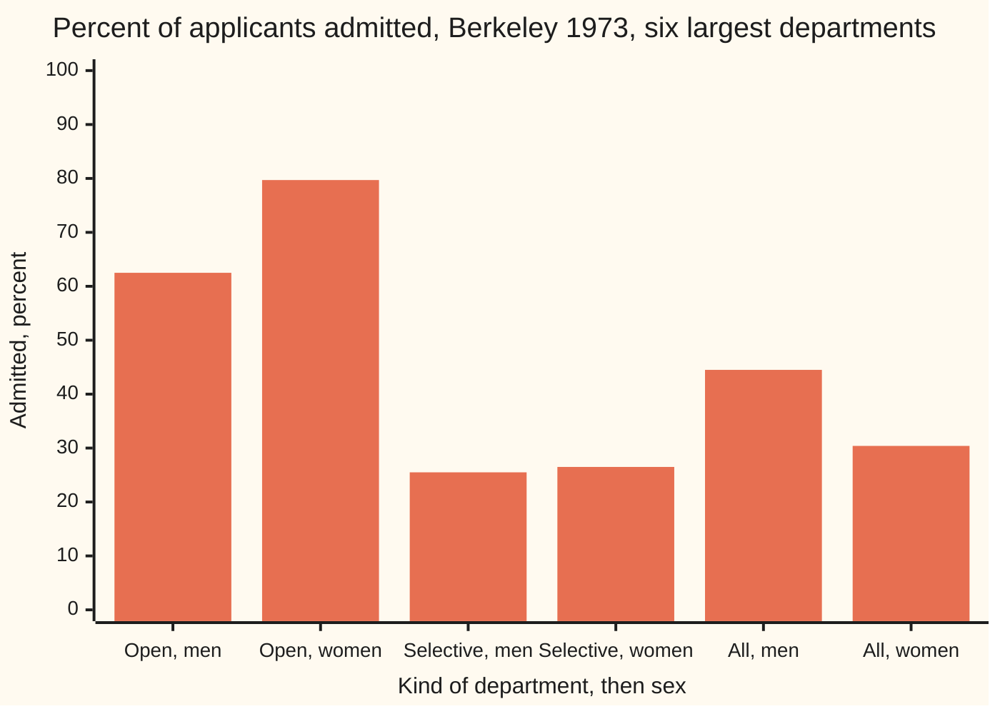
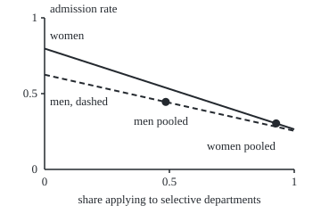

# Confounding: the hidden variable that reverses a conclusion

Probability and statistics → Survival, Design and Causality → Observational comparisons → Confounding

---

## General Overview

In autumn 1973 the University of California, Berkeley, received graduate applications from 2,691 men and 1,835 women to its six largest departments. It admitted 1,198 of the men and 557 of the women. That is 0.4452 of the men, about 45 in 100, against 0.3035 of the women, about 30 in 100. The gap, 14.2 percentage points, is far too large to be chance: its standard error, the typical size of chance wobble in such a gap, is 1.4 points.

Now look inside the departments. Two of them, A and B, admitted most of their applicants; call them the **open** departments. The other four, C to F, admitted fewer than 4 in 10; call them the **selective** departments. In the open pair, women were admitted at 0.7970 and men at 0.6245. In the selective four, women at 0.2650 and men at 0.2550. Women were ahead in both groups. Yet they were 14.2 points behind overall.

Nothing is wrong with the arithmetic. Women applied mostly to the selective departments: 0.9275 of their applications went there, against 0.4853 of the men's. A department's difficulty was linked to who applied and, separately, to who got in. A third variable with both links is a **confounder**. Each slice of a table split by it, here a department or a kind of department, is a **stratum** (plural **strata**). The flip in direction when a table is split this way is **Simpson's paradox**.

**A pooled rate is an average of the stratum rates weighted by each group's own mix, so a confounder, a variable linked both to the group and to the outcome, can create, hide or reverse a gap; comparing the groups on a common mix removes the confounders that were recorded, and only random assignment removes the ones that were not.**

**What kind of fact this is:** a theorem about weighted averages, proved on this card in Why it works, with the reversal itself proved on [independence](../01-Chance%20and%20Events/07-independence.md). Reading any adjusted gap as a cause rests on an assumption about how the data arose, which the table cannot check.

### The picture: ahead in both groups, behind overall



Six bars, read in pairs. In the open departments women lead, 79.7 against 62.5 percent. In the selective ones women lead narrowly, 26.5 against 25.5. Pooled, men lead, 44.5 against 30.4.

---

## The formula

Notation first, in words. $A$ is the event "admitted". A letter $g$ names a group of applicants: W for women, M for men. A letter $d$ names a department, or a kind of department: O for open, S for selective. $P(A \mid g)$, read "the chance of A given g", is the admission rate within group $g$ ([conditional-probability](../01-Chance%20and%20Events/05-conditional-probability.md)). Three shorthands carry the card:

- $r_{g,d} = P(A \mid g, d)$, the admission rate of group $g$ inside department $d$;
- $w_{g,d} = P(d \mid g)$, the share of group $g$'s applications that went to $d$, its **mix**;
- $p_g = P(A \mid g)$, group $g$'s **pooled** rate, all departments together.

The pooled rate is the law of total probability:

$$p_g = \sum_d w_{g,d}\, r_{g,d}$$

**Read it aloud:** a group's overall admission rate is its department rates, averaged with weights set by where that group applied.

The fair comparison gives both groups the same weights. Take $w_d = P(d)$, the share of all applicants who applied to $d$, and define the **standardised** rate:

$$s_g = \sum_d w_d\, r_{g,d}, \qquad s_W - s_M = \sum_d w_d\,\big(r_{W,d} - r_{M,d}\big)$$

**Read it aloud:** compare women and men department by department, then average those gaps with one set of weights, the whole pool's mix.

A helper formula says how big a confounder's effect can be. If admission depended on the department only, so that both groups had the same rate $r_d$ inside each department, the pooled gap would still be

$$p_W - p_M = \sum_d \big(w_{W,d} - w_{M,d}\big)\, r_d \;=\; \big(w_{W,S} - w_{M,S}\big)\,\big(r_S - r_O\big) \text{ with two kinds.}$$

In words: the difference in mix times the difference in department rates. Either factor zero, and the gap vanishes.

| Symbol | Plain meaning | In our example | Push it up and the answer… |
| --- | --- | --- | --- |
| $A$ | the event "admitted" | 1,198 men and 557 women | — |
| $g$, W, M | the group compared: women or men | W and M | — |
| $d$, O, S | a department, or a kind: open or selective | A to F; O = A and B, S = C to F | — |
| $r_{g,d}$ | admission rate of group $g$ inside department $d$ | $r_{W,O}$ = 0.7970, $r_{M,O}$ = 0.6245 | that group's pooled rate rises |
| $w_{g,d}$ | group $g$'s mix: share of its applications to $d$ | $w_{W,S}$ = 0.9275, $w_{M,S}$ = 0.4853 | more weight on that department's rate |
| $p_g$, $p_W$, $p_M$ | pooled rate of a group | 0.3035 and 0.4452 | — |
| $w_d$, $w_O$, $w_S$ | share of all applicants who applied to $d$ | $w_O$ = 0.3354, $w_S$ = 0.6646 | that department counts more in the fair comparison |
| $s_g$, $s_W$, $s_M$ | standardised rate: the group's department rates on the pool's mix | 0.4434 and 0.3789 | — |
| $r_d$, $r_O$, $r_S$ | admission rate of a department, both groups together | 0.6397 and 0.2606 | a bigger spread between them means more room for confounding |
| $n$, $n_g$, $n_W$, $n_M$ | a count of applicants; $n_g$ counts group $g$ | $n_W$ = 1,835, $n_M$ = 2,691 | smaller standard errors |
| $n_{g,d}$, $a_{g,d}$ | in the folded proof: applicants of group $g$ in department $d$, and how many of them were admitted | women in open departments: 133 and 106 | — |
| SE | standard error: typical size of chance error in an estimate | 1.4 points on the pooled gap | smaller with more applicants |

### When it holds

The pooled-rate identity always holds; it is arithmetic. The standardised gap measures a within-department difference only under these conditions:

- **Every variable linked to both group and outcome is in the table.** If the women applying to department C had weaker or stronger records than the men, the gap inside C carries that too, and nothing in the counts says so. Splitting the two kinds into all six departments already moves the standardised gap from +6.4 to +4.3 points.
- **Both groups appear in every department.** Department B had 25 women; its gap, +5.0 points, carries a standard error of 9.5. A department with no women at all has no rate to compare, and the formula has nothing to weight.
- **The splitting variable is not a result of what is being compared, unless that route is meant to be removed.** Department choice came after the applicant's sex, so holding it fixed removes the part of the gap that runs through choice. Whether that is right depends on the question, not the numbers.
- **The gap is similar across departments, or the standard mix is stated.** The gaps here run from −3.8 to +20.3 points; a different standard mix gives a different single number.

---

## Why it works

### Step 0: a pooled rate compares two things at once

A pooled rate mixes department rates with the group's own weights. Two groups with different mixes are averaged with different weights. The pooled gap therefore measures two things together: how each department treats the two groups, and where each group applied. Everything below separates them.

### Step 1: the pooled rate is a mix-weighted average

Each application went to exactly one department, so the event "admitted" splits into admitted-to-O and admitted-to-S, which cannot both happen. Chances of such separate pieces add. Each piece is a chained chance, handled by the multiplication rule: $P(A \text{ and } d \mid g) = P(d \mid g)\,P(A \mid g, d)$. Adding over departments gives $p_g = \sum_d w_{g,d}\, r_{g,d}$.

For men: 0.5147 × 0.6245 + 0.4853 × 0.2550 = 0.4452. For women: 0.0725 × 0.7970 + 0.9275 × 0.2650 = 0.3035. Both match the direct counts, 1,198 of 2,691 and 557 of 1,835.

With two kinds of department the formula has a picture. A group's pooled rate is a point on the straight line joining its open rate to its selective rate, placed at its share of selective applications.

### The picture: each group's pooled rate sits on its own line, at its own mix

<p align="center"></p>

Drawn to scale from the checks' `figure` line. The solid line joins the women's open rate, 0.7970, at the left edge to their selective rate, 0.2650, at the right. The dashed line does the same for men, 0.6245 to 0.2550. The solid line is above the dashed one everywhere. But the men's pooled point sits at 0.4853 across, the women's at 0.9275, where both lines have fallen.

### Step 2: a confounder makes a gap from nothing

Suppose the departments paid no attention to sex, so that $r_{W,d} = r_{M,d} = r_d$. The pooled gap is then $\sum_d (w_{W,d} - w_{M,d})\,r_d$. With two kinds, the mixes each add to one, so $w_{W,O} - w_{M,O} = -(w_{W,S} - w_{M,S})$, and the sum collapses to $(w_{W,S} - w_{M,S})(r_S - r_O)$.

That product is the definition of confounding at work. The first factor is the link between the third variable and the group. The second is the link between the third variable and the outcome. Both must be non-zero. At Berkeley they are 0.9275 − 0.4853 and 0.2606 − 0.6397, and the product is **−16.76 points**: a sex-blind admissions process, fed these application patterns, would show women 16.76 points behind.

The checks build that world. SplitMix64, a small random number generator written out in both languages, draws 100,000 applicants of each sex who choose departments as Berkeley's did, and are admitted at 0.6397 in open departments and 0.2606 in selective ones, whatever their sex. The pooled gap comes out at −16.76 points (SE 0.21). Inside the open kind the gap is +0.35 (SE 0.60), and inside the selective kind −0.03 (SE 0.25): zero, within chance.

### Step 3: the real gap, split in two

The real rates differ by sex inside departments, so the pooled gap has two parts. The split is proved on [independence](../01-Chance%20and%20Events/07-independence.md): add and subtract the men's rates weighted by the women's mix.

$$p_W - p_M = \underbrace{\sum_d w_{W,d}\,\big(r_{W,d} - r_{M,d}\big)}_{\text{inside departments}} + \underbrace{\sum_d \big(w_{W,d} - w_{M,d}\big)\, r_{M,d}}_{\text{different mix}}$$

At Berkeley: −14.16 = +2.18 + (−16.34) points. The departments' own gaps favour women by 2.18 points on the women's mix. Where the women applied costs 16.34. The same card proves the other half: if the two mixes are equal, the second term is zero, and a group ahead in every department is ahead overall. A reversal needs different mixes, and it needs the mix term to outweigh the other.

### Step 4: put both groups on one mix

The standardised rate $s_g$ replaces each group's own mix with the pool's. On two kinds of department, the pool's shares are 0.3354 open and 0.6646 selective:

$s_W$ = 0.3354 × 0.7970 + 0.6646 × 0.2650 = 0.4434, and $s_M$ = 0.3354 × 0.6245 + 0.6646 × 0.2550 = 0.3789.

Women come out **6.4 points ahead** (SE 1.6). Split all six departments instead and the standardised gap is **+4.3 points** (SE 1.8): standardised rates 0.4300 for women and 0.3873 for men.

The same number has a second road, which treats applicants rather than departments. Give each applicant of group $g$ in department $d$ the weight $w_d / w_{g,d}$: large where that group is scarce compared with the pool, small where it is common. Each group's weighted admission rate is its standardised rate. The checks compute it from all 4,526 individual records, and it agrees with the formula to the last printed digit on both splits.

<details>
<summary>Detailed proof: reweighting applicants gives the standardised rate, and its standard error</summary>

Let $n_g$ be the number of applicants in group $g$, $n_{g,d}$ the number in department $d$, and $a_{g,d}$ the number admitted there. Then $w_{g,d} = n_{g,d}/n_g$ and $r_{g,d} = a_{g,d}/n_{g,d}$.

Every applicant of group $g$ in department $d$ carries the weight $w_d / w_{g,d} = w_d\, n_g / n_{g,d}$. The weights of the $n_{g,d}$ such applicants add to $w_d\, n_g$. Over all departments they add to $n_g \sum_d w_d = n_g$, since the pool's shares add to one.

The admitted among them contribute $a_{g,d}$ times the weight, which is $w_d\, n_g\, r_{g,d}$. Dividing the weighted admitted by the total weight:

$$\frac{\sum_d w_d\, n_g\, r_{g,d}}{n_g} = \sum_d w_d\, r_{g,d} = s_g.$$

For the standard error, treat each department's decisions as a chance process, so each rate is an estimate with variance $r(1-r)/n$, where $n$ is the number of applicants behind it. The departments' estimates are independent, and so are the two sexes' within one department. The variance of a sum of independent pieces is the sum of their variances, and a weight $w_d$ multiplies a variance by $w_d^2$. So the standardised gap has variance $\sum_d w_d^2\,\big[r_{W,d}(1-r_{W,d})/n_{W,d} + r_{M,d}(1-r_{M,d})/n_{M,d}\big]$, and its square root is the SE printed by the checks. The 4,526 applicants are the whole year's applicants, not a sample; the SE describes how much the decisions could plausibly have varied, not a sampling error.

</details>

### Step 5: what an observational table cannot say

Data recorded as it happened, with no one assigning the groups, is **observational**. Three things are out of its reach.

**The pooled table does not fix the split.** Keep the pooled counts exactly: men 1,198 of 2,691, women 557 of 1,835. A second, invented world has the women sending 800 applications to open departments, with 400 admitted, 0.5000, and 1,035 to selective ones, with 157 admitted, 0.1517. Its pooled table is identical. Inside, women now trail by 12.5 points in open and 10.3 in selective departments. The same pooled table is consistent with women ahead everywhere and behind everywhere.

**The split does not fix the next split.** The reversal theorem applies at every level. Two kinds of department gave +6.4 points; six departments gave +4.3. Nothing in the data says six is the last level. Applicants' grades, fields within a department, or referees are further variables that could move the gap again, and the table does not record them.

**The table does not say which way the arrows point.** At Berkeley, sex came first and department choice after. Holding department fixed answers one question: did the departments' decisions favour men? On these counts, no: on the pool's mix women were admitted 4.3 points more often (SE 1.8), though the table cannot rule out differences among the applicants themselves. It does not answer another: did being a woman lower the chance of admission to Berkeley by any route? Choice of department is one such route, and the pooled −14.2 includes it. Which comparison is right depends on the question, and the counts cannot choose.

Random assignment of the thing being compared removes all three. Sex cannot be assigned, but a drug or a web page can. If a lottery decides who gets it, both arms have the same mix of every variable, recorded or not, up to chance, so the mix term in Step 3 vanishes. The checks run the department half of this: departments drawn by lottery with the pool's shares, sex ignored in admission, and the pooled gap is −0.05 points (SE 0.22). Designing such comparisons is [randomised-experiments-and-ab-tests](04-randomised-experiments-and-ab-tests.md).

The same comparison can be made with least squares, fitting admission (1 or 0) on sex and department together. With department entered as a category, it reaches a weighted within-department gap like this one, with weights the fit chooses rather than the pool's mix.

---

## Worked numbers, by hand

Two kinds of department, the counts from the table in the checks.

| Step | Arithmetic | Value |
| --- | --- | --- |
| men's mix, selective share | 1,306 of 2,691 | 0.4853 |
| women's mix, selective share | 1,702 of 1,835 | 0.9275 |
| men pooled | 0.5147 × 0.6245 + 0.4853 × 0.2550 | 0.4452 |
| women pooled | 0.0725 × 0.7970 + 0.9275 × 0.2650 | 0.3035 |
| pooled gap | 0.3035 − 0.4452 | −14.16 points |
| inside departments, women's mix | 0.0725 × (0.7970 − 0.6245) + 0.9275 × (0.2650 − 0.2550) | +2.18 points |
| different mix | (0.0725 − 0.5147) × 0.6245 + (0.9275 − 0.4853) × 0.2550 | −16.34 points |
| pool's mix | open and selective shares of all 4,526 applicants | 0.3354 and 0.6646 |
| women standardised | 0.3354 × 0.7970 + 0.6646 × 0.2650 | 0.4434 |
| men standardised | 0.3354 × 0.6245 + 0.6646 × 0.2550 | 0.3789 |
| **standardised gap** | 0.4434 − 0.3789 | **+6.4 points (SE 1.6)** |

On a common mix of departments, women were admitted about 6 points more often than men, not 14 points less; split into all six departments, the figure is +4.3 points (SE 1.8).

### What breaks if you drop a piece

| Mistake | Comes out at | What went wrong |
| --- | --- | --- |
| Pooled gap read as the departments' bias | −14.2 points (SE 1.4), against +4.3 | Assumes equal mixes; women's was 0.9275 selective, men's 0.4853 |
| Two kinds of department instead of six | +6.4 points, against +4.3 | Coarse strata leave confounding inside each kind |
| Plain average of the six department gaps | +3.6 points, against +4.3 | Department B's 25 women count as much as department A's 825 men and 108 women |

The code prints all three.

---

## Code, from first principles, and it actually runs

Nothing is imported except the square root. The checks take three roads. The pooled rates are counted directly and rebuilt as mix-weighted averages. The standardised gap is computed by the formula and again by reweighting all 4,526 applicant records one by one. The confounding formula of Step 2 is tested against a seeded simulation of a sex-blind world, and a lottery world shows the gap disappearing. Random numbers come from SplitMix64 with seed 20260929, written out in both languages, so both print the same digits. Simulated gaps are asserted within four standard errors of their targets, never exactly.

### Python

```python
# Confounding and Simpson's paradox -- the check behind the card.  Standard
# library only.  Data: Berkeley graduate admissions, autumn 1973, the six
# largest departments (Bickel, Hammel and O'Connell, Science, 1975).
# Roads: counting against mix-weighted averages; the standardised gap by
# formula against reweighting all 4,526 applicant records; the bias formula
# against a seeded simulation of a world where sex has no effect at all.
from math import sqrt

DEPTS = [("A", 512, 825, 89, 108), ("B", 353, 560, 17, 25), ("C", 120, 325, 202, 593),
         ("D", 138, 417, 131, 375), ("E", 53, 191, 94, 393), ("F", 22, 373, 24, 341)]
KINDS = {"open": "AB", "selective": "CDEF"}      # admit over 0.6, and under 0.4

def se(p, n, q, m):                              # standard error of a gap in two rates
    return sqrt(p * (1 - p) / n + q * (1 - q) / m)

def table(groups):                               # counts per stratum: [am, nm, aw, nw]
    return {k: [sum(r[i] for r in DEPTS if r[0] in v) for i in range(1, 5)] for k, v in groups.items()}

six = table({r[0]: r[0] for r in DEPTS})
two = table(KINDS)
pool = table({"all six": "ABCDEF"})["all six"]
N = pool[1] + pool[3]
print("stratum     men admitted/applied  women admitted/applied  gap w-m, points (SE)  share of pool")
for k, (am, nm, aw, nw) in list(six.items()) + list(two.items()) + [("all six", pool)]:
    rm, rw = am / nm, aw / nw
    print(f"{k:<10} {am:>5}/{nm:<5} {rm:.4f}   {aw:>5}/{nw:<5} {rw:.4f}   "
          f"{100 * (rw - rm):+6.1f} ({100 * se(rw, nw, rm, nm):.1f})         {(nm + nw) / N:.4f}")

# Road 1 against road 2: the pooled rate, counted, and as a mix-weighted average
p_m, p_w = pool[0] / pool[1], pool[2] / pool[3]
mix_m = {k: c[1] / pool[1] for k, c in two.items()}
mix_w = {k: c[3] / pool[3] for k, c in two.items()}
avg_m = sum(mix_m[k] * c[0] / c[1] for k, c in two.items())
avg_w = sum(mix_w[k] * c[2] / c[3] for k, c in two.items())
print(f"pooled rate by counting: men {p_m:.4f}, women {p_w:.4f}; by mix-weighted average: men {avg_m:.4f}, women {avg_w:.4f}")
bars = [100 * c[i] / c[i + 1] for c in two.values() for i in (0, 2)] + [100 * p_m, 100 * p_w]
print("bars, percent admitted:", ", ".join(f"{b:.1f}" for b in bars))
print(f"applicants {N}; share applying to open departments: men {mix_m['open']:.4f}, women {mix_w['open']:.4f}; "
      f"to selective: men {mix_m['selective']:.4f}, women {mix_w['selective']:.4f}")

# The pooled gap split into a part inside departments and a part from the mix
inside = sum(mix_w[k] * (c[2] / c[3] - c[0] / c[1]) for k, c in two.items())
mixpart = sum((mix_w[k] - mix_m[k]) * c[0] / c[1] for k, c in two.items())
print(f"pooled gap, points: {100 * (p_w - p_m):+.2f} = inside departments {100 * inside:+.2f} + mix {100 * mixpart:+.2f}")

def standardised(strata):                        # road one: the formula, pool's mix for both
    s = [sum((c[1] + c[3]) / N * c[2 * g] / c[2 * g + 1] for c in strata.values()) for g in (0, 1)]
    v = sum(((c[1] + c[3]) / N) ** 2 * se(c[2] / c[3], c[3], c[0] / c[1], c[1]) ** 2 for c in strata.values())
    return s[0], s[1], sqrt(v)

def reweighted(strata):                          # road two: every applicant record, weighted
    recs = []                                    # (sex 0 men / 1 women, stratum, admitted)
    for k, (am, nm, aw, nw) in strata.items():
        recs += [(0, k, 1)] * am + [(0, k, 0)] * (nm - am) + [(1, k, 1)] * aw + [(1, k, 0)] * (nw - aw)
    n_sex = [sum(1 for r in recs if r[0] == g) for g in (0, 1)]
    n_k = {k: sum(1 for r in recs if r[1] == k) for k in strata}
    n_gk = {(g, k): sum(1 for r in recs if r[0] == g and r[1] == k) for g in (0, 1) for k in strata}
    out = []
    for g in (0, 1):                             # weight = P(stratum) / P(stratum | sex)
        wts = [(n_k[r[1]] / len(recs)) / (n_gk[(g, r[1])] / n_sex[g]) for r in recs if r[0] == g]
        adm = [r[2] for r in recs if r[0] == g]
        out.append(sum(w * a for w, a in zip(wts, adm)) / sum(wts))
    return out

for name, strata in (("two kinds", two), ("six departments", six)):
    sm, sw, sd = standardised(strata)
    rm, rw = reweighted(strata)
    print(f"standardised, {name}: men {sm:.4f}, women {sw:.4f}, gap {100 * (sw - sm):+.1f} points (SE {100 * sd:.1f}); "
          f"reweighted records: men {rm:.4f}, women {rw:.4f}")
    assert abs(sm - rm) < 1e-12 and abs(sw - rw) < 1e-12        # formula against records
s2m, s2w, _ = standardised(two)
s6m, s6w, s6se = standardised(six)

# A world where sex has no effect: admission depends on the department kind only
r_open = (two["open"][0] + two["open"][2]) / (two["open"][1] + two["open"][3])
r_sel = (two["selective"][0] + two["selective"][2]) / (two["selective"][1] + two["selective"][3])
w_pool = (two["selective"][1] + two["selective"][3]) / N
bias = (mix_w["selective"] - mix_m["selective"]) * (r_sel - r_open)
print(f"department rates, both sexes: open {r_open:.4f}, selective {r_sel:.4f}; pool's selective share {w_pool:.4f}")
print(f"bias formula, no-sex-effect world: ({mix_w['selective']:.4f} - {mix_m['selective']:.4f}) x "
      f"({r_sel:.4f} - {r_open:.4f}) = {100 * bias:+.2f} points")

M64 = (1 << 64) - 1
state = 20260929                                 # SplitMix64, seed stated
def uniform():
    global state
    state = (state + 0x9E3779B97F4A7C15) & M64
    z = state
    z = ((z ^ (z >> 30)) * 0xBF58476D1CE4E5B9) & M64
    z = ((z ^ (z >> 27)) * 0x94D049BB133111EB) & M64
    return ((z ^ (z >> 31)) >> 11) / 9007199254740992.0

def world(sel_share, n):                         # returns [adm, n] per (sex, kind)
    c = {(g, k): [0, 0] for g in (0, 1) for k in (0, 1)}
    for g in (0, 1):
        for _ in range(n):
            k = 1 if uniform() < sel_share[g] else 0
            c[(g, k)][1] += 1
            c[(g, k)][0] += 1 if uniform() < (r_sel if k else r_open) else 0
    return c

def gap(c, kinds):                               # women minus men, and its SE
    a = [sum(c[(g, k)][0] for k in kinds) for g in (0, 1)]
    n = [sum(c[(g, k)][1] for k in kinds) for g in (0, 1)]
    return a[1] / n[1] - a[0] / n[0], se(a[1] / n[1], n[1], a[0] / n[0], n[0])

NSIM = 100000
print(f"simulation: SplitMix64, seed {state}, {NSIM} applicants of each sex per world")
chosen = world((mix_m["selective"], mix_w["selective"]), NSIM)
coin = world((w_pool, w_pool), NSIM)
for label, c in (("sexes choose as at Berkeley", chosen), ("department by lottery", coin)):
    g_all, s_all = gap(c, (0, 1)); g_o, s_o = gap(c, (0,)); g_s, s_s = gap(c, (1,))
    print(f"  {label}: pooled gap {100 * g_all:+.2f} (SE {100 * s_all:.2f}); inside open {100 * g_o:+.2f} "
          f"(SE {100 * s_o:.2f}); inside selective {100 * g_s:+.2f} (SE {100 * s_s:.2f})")
    assert abs(g_o) < 4 * s_o and abs(g_s) < 4 * s_s            # no sex effect inside
    assert abs(g_all - (bias if c is chosen else 0.0)) < 4 * s_all

# A second world with the same pooled table and the opposite story inside
alt = {"open": [865, 1385, 400, 800], "selective": [333, 1306, 157, 1035]}
alt_pool = [sum(c[i] for c in alt.values()) for i in range(4)]
print(f"second world: women open 400/800 {400 / 800:.4f}, selective 157/1035 {157 / 1035:.4f}; "
      f"pooled women {alt_pool[2]}/{alt_pool[3]}, men {alt_pool[0]}/{alt_pool[1]}")
print("  gaps inside, points: " + ", ".join(f"{k} {100 * (c[2] / c[3] - c[0] / c[1]):+.1f}" for k, c in alt.items()))
assert alt_pool == pool and all(c[2] / c[3] < c[0] / c[1] for c in alt.values())
assert all(c[2] / c[3] > c[0] / c[1] for c in two.values()) and p_w < p_m   # the reversal

unweighted = sum(c[2] / c[3] - c[0] / c[1] for c in six.values()) / 6
print(f"what breaks, points: pooled gap read as bias {100 * (p_w - p_m):+.1f} (SE {100 * se(p_w, pool[3], p_m, pool[1]):.1f}); "
      f"two kinds {100 * (s2w - s2m):+.1f}; unweighted mean of six gaps {100 * unweighted:+.1f}; "
      f"six departments {100 * (s6w - s6m):+.1f}")
assert abs(inside + mixpart - (p_w - p_m)) < 1e-12 and abs(avg_m - p_m) < 1e-12 and abs(avg_w - p_w) < 1e-12

X = lambda s: 50 + 280 * s                         # figure: x = share applying to selective
Y = lambda r: 190 - 170 * r                        # y = admission rate, 0 at 190, 1 at 20
rates = {g: [two[k][2 * g] / two[k][2 * g + 1] for k in ("open", "selective")] for g in (0, 1)}
print(f"figure, men line ({X(0):.1f},{Y(rates[0][0]):.1f})-({X(1):.1f},{Y(rates[0][1]):.1f}); "
      f"women line ({X(0):.1f},{Y(rates[1][0]):.1f})-({X(1):.1f},{Y(rates[1][1]):.1f}); "
      f"men pooled ({X(mix_m['selective']):.1f},{Y(p_m):.1f}); women pooled ({X(mix_w['selective']):.1f},{Y(p_w):.1f})")
print("ALL CHECKS PASS")
```

**Ran 2026-09-29 on macOS, Python 3.14.6, standard library only. All checks passed. Output, pasted from the run:**

```
stratum     men admitted/applied  women admitted/applied  gap w-m, points (SE)  share of pool
A            512/825   0.6206      89/108   0.8241    +20.3 (4.0)         0.2061
B            353/560   0.6304      17/25    0.6800     +5.0 (9.5)         0.1293
C            120/325   0.3692     202/593   0.3406     -2.9 (3.3)         0.2028
D            138/417   0.3309     131/375   0.3493     +1.8 (3.4)         0.1750
E             53/191   0.2775      94/393   0.2392     -3.8 (3.9)         0.1290
F             22/373   0.0590      24/341   0.0704     +1.1 (1.8)         0.1578
open         865/1385  0.6245     106/133   0.7970    +17.2 (3.7)         0.3354
selective    333/1306  0.2550     451/1702  0.2650     +1.0 (1.6)         0.6646
all six     1198/2691  0.4452     557/1835  0.3035    -14.2 (1.4)         1.0000
pooled rate by counting: men 0.4452, women 0.3035; by mix-weighted average: men 0.4452, women 0.3035
bars, percent admitted: 62.5, 79.7, 25.5, 26.5, 44.5, 30.4
applicants 4526; share applying to open departments: men 0.5147, women 0.0725; to selective: men 0.4853, women 0.9275
pooled gap, points: -14.16 = inside departments +2.18 + mix -16.34
standardised, two kinds: men 0.3789, women 0.4434, gap +6.4 points (SE 1.6); reweighted records: men 0.3789, women 0.4434
standardised, six departments: men 0.3873, women 0.4300, gap +4.3 points (SE 1.8); reweighted records: men 0.3873, women 0.4300
department rates, both sexes: open 0.6397, selective 0.2606; pool's selective share 0.6646
bias formula, no-sex-effect world: (0.9275 - 0.4853) x (0.2606 - 0.6397) = -16.76 points
simulation: SplitMix64, seed 20260929, 100000 applicants of each sex per world
  sexes choose as at Berkeley: pooled gap -16.76 (SE 0.21); inside open +0.35 (SE 0.60); inside selective -0.03 (SE 0.25)
  department by lottery: pooled gap -0.05 (SE 0.22); inside open +0.25 (SE 0.37); inside selective -0.30 (SE 0.24)
second world: women open 400/800 0.5000, selective 157/1035 0.1517; pooled women 557/1835, men 1198/2691
  gaps inside, points: open -12.5, selective -10.3
what breaks, points: pooled gap read as bias -14.2 (SE 1.4); two kinds +6.4; unweighted mean of six gaps +3.6; six departments +4.3
figure, men line (50.0,83.8)-(330.0,146.7); women line (50.0,54.5)-(330.0,145.0); men pooled (185.9,114.3); women pooled (309.7,138.4)
ALL CHECKS PASS
```

### Rust

Same numbers, same labels, built with `rustc --edition 2021 -O`.

```rust
// Confounding and Simpson's paradox -- the same check as the Python, in Rust.
// No crates.  Data: Berkeley graduate admissions, autumn 1973, the six
// largest departments (Bickel, Hammel and O'Connell, Science, 1975).
// Roads: counting against mix-weighted averages; the standardised gap by
// formula against reweighting all 4,526 applicant records; the bias formula
// against a seeded simulation of a world where sex has no effect at all.
type C = [f64; 4]; // admitted men, applied men, admitted women, applied women

const DEPTS: [(&str, C); 6] = [("A", [512.0, 825.0, 89.0, 108.0]), ("B", [353.0, 560.0, 17.0, 25.0]),
    ("C", [120.0, 325.0, 202.0, 593.0]), ("D", [138.0, 417.0, 131.0, 375.0]),
    ("E", [53.0, 191.0, 94.0, 393.0]), ("F", [22.0, 373.0, 24.0, 341.0])];

fn se(p: f64, n: f64, q: f64, m: f64) -> f64 { (p * (1.0 - p) / n + q * (1.0 - q) / m).sqrt() }

fn table(groups: &[(&str, &str)]) -> Vec<(String, C)> {
    groups.iter().map(|(k, v)| {
        let mut c = [0.0; 4];
        for i in 0..4 { for d in DEPTS.iter().filter(|d| v.contains(d.0)) { c[i] += d.1[i] } }
        (k.to_string(), c)
    }).collect()
}

fn standardised(strata: &[(String, C)], n: f64) -> (f64, f64, f64) {
    let mut s = [0.0; 2];
    for g in 0..2 { for (_, c) in strata { s[g] += (c[1] + c[3]) / n * c[2 * g] / c[2 * g + 1] } }
    let mut v = 0.0;
    for (_, c) in strata { v += ((c[1] + c[3]) / n).powi(2) * se(c[2] / c[3], c[3], c[0] / c[1], c[1]).powi(2) }
    (s[0], s[1], v.sqrt())
}

fn reweighted(strata: &[(String, C)]) -> [f64; 2] {
    let mut recs: Vec<(usize, usize, f64)> = Vec::new(); // (sex 0 men / 1 women, stratum, admitted)
    for (k, (_, c)) in strata.iter().enumerate() {
        for g in 0..2 {
            for i in 0..c[2 * g + 1] as usize { recs.push((g, k, if i < c[2 * g] as usize { 1.0 } else { 0.0 })) }
        }
    }
    let total = recs.len() as f64;
    let cnt = |f: &dyn Fn(&(usize, usize, f64)) -> bool| recs.iter().filter(|r| f(r)).count() as f64;
    let mut out = [0.0; 2];
    for g in 0..2 { // weight = P(stratum) / P(stratum | sex)
        let n_sex = cnt(&|r| r.0 == g);
        let (mut num, mut den) = (0.0, 0.0);
        for r in recs.iter().filter(|r| r.0 == g) {
            let w = (cnt(&|q| q.1 == r.1) / total) / (cnt(&|q| q.0 == g && q.1 == r.1) / n_sex);
            num += w * r.2;
            den += w;
        }
        out[g] = num / den;
    }
    out
}

struct Rng(u64); // SplitMix64, seed stated
impl Rng {
    fn uniform(&mut self) -> f64 {
        self.0 = self.0.wrapping_add(0x9E3779B97F4A7C15);
        let mut z = self.0;
        z = (z ^ (z >> 30)).wrapping_mul(0xBF58476D1CE4E5B9);
        z = (z ^ (z >> 27)).wrapping_mul(0x94D049BB133111EB);
        ((z ^ (z >> 31)) >> 11) as f64 / 9007199254740992.0
    }
}

fn world(rng: &mut Rng, sel: [f64; 2], rate: [f64; 2], n: usize) -> [[[f64; 2]; 2]; 2] {
    let mut c = [[[0.0; 2]; 2]; 2]; // [sex][kind] = [admitted, applied]
    for g in 0..2 {
        for _ in 0..n {
            let k = if rng.uniform() < sel[g] { 1 } else { 0 };
            c[g][k][1] += 1.0;
            if rng.uniform() < rate[k] { c[g][k][0] += 1.0 }
        }
    }
    c
}

fn gap(c: &[[[f64; 2]; 2]; 2], kinds: &[usize]) -> (f64, f64) {
    let a: Vec<f64> = (0..2).map(|g| kinds.iter().map(|&k| c[g][k][0]).sum()).collect();
    let n: Vec<f64> = (0..2).map(|g| kinds.iter().map(|&k| c[g][k][1]).sum()).collect();
    (a[1] / n[1] - a[0] / n[0], se(a[1] / n[1], n[1], a[0] / n[0], n[0]))
}

fn main() {
    let six = table(&[("A", "A"), ("B", "B"), ("C", "C"), ("D", "D"), ("E", "E"), ("F", "F")]);
    let two = table(&[("open", "AB"), ("selective", "CDEF")]);
    let pool = table(&[("all six", "ABCDEF")])[0].1;
    let n = pool[1] + pool[3];
    println!("stratum     men admitted/applied  women admitted/applied  gap w-m, points (SE)  share of pool");
    for (k, c) in six.iter().chain(two.iter()).chain([("all six".to_string(), pool)].iter()) {
        let (rm, rw) = (c[0] / c[1], c[2] / c[3]);
        println!("{:<10} {:>5}/{:<5} {:.4}   {:>5}/{:<5} {:.4}   {:+6.1} ({:.1})         {:.4}", k, c[0], c[1], rm,
                 c[2], c[3], rw, 100.0 * (rw - rm), 100.0 * se(rw, c[3], rm, c[1]), (c[1] + c[3]) / n);
    }
    // Road 1 against road 2: the pooled rate, counted, and as a mix-weighted average
    let (p_m, p_w) = (pool[0] / pool[1], pool[2] / pool[3]);
    let mix_m: Vec<f64> = two.iter().map(|(_, c)| c[1] / pool[1]).collect();
    let mix_w: Vec<f64> = two.iter().map(|(_, c)| c[3] / pool[3]).collect();
    let (mut avg_m, mut avg_w, mut inside, mut mixpart) = (0.0, 0.0, 0.0, 0.0);
    for (i, (_, c)) in two.iter().enumerate() {
        avg_m += mix_m[i] * c[0] / c[1];
        avg_w += mix_w[i] * c[2] / c[3];
    }
    println!("pooled rate by counting: men {:.4}, women {:.4}; by mix-weighted average: men {:.4}, women {:.4}", p_m, p_w, avg_m, avg_w);
    let mut bars: Vec<f64> = two.iter().flat_map(|(_, c)| [100.0 * c[0] / c[1], 100.0 * c[2] / c[3]]).collect();
    bars.extend([100.0 * p_m, 100.0 * p_w]);
    println!("bars, percent admitted: {}", bars.iter().map(|b| format!("{:.1}", b)).collect::<Vec<_>>().join(", "));
    println!("applicants {}; share applying to open departments: men {:.4}, women {:.4}; to selective: men {:.4}, women {:.4}",
             n, mix_m[0], mix_w[0], mix_m[1], mix_w[1]);
    // The pooled gap split into a part inside departments and a part from the mix
    for (i, (_, c)) in two.iter().enumerate() { inside += mix_w[i] * (c[2] / c[3] - c[0] / c[1]) }
    for (i, (_, c)) in two.iter().enumerate() { mixpart += (mix_w[i] - mix_m[i]) * c[0] / c[1] }
    println!("pooled gap, points: {:+.2} = inside departments {:+.2} + mix {:+.2}", 100.0 * (p_w - p_m), 100.0 * inside, 100.0 * mixpart);
    for (name, strata) in [("two kinds", &two), ("six departments", &six)] {
        let (sm, sw, sd) = standardised(strata, n);
        let r = reweighted(strata);
        println!("standardised, {}: men {:.4}, women {:.4}, gap {:+.1} points (SE {:.1}); reweighted records: men {:.4}, women {:.4}",
                 name, sm, sw, 100.0 * (sw - sm), 100.0 * sd, r[0], r[1]);
        assert!((sm - r[0]).abs() < 1e-12 && (sw - r[1]).abs() < 1e-12); // formula against records
    }
    let (s2m, s2w, _) = standardised(&two, n);
    let (s6m, s6w, _) = standardised(&six, n);
    // A world where sex has no effect: admission depends on the department kind only
    let (o, s) = (two[0].1, two[1].1);
    let (r_open, r_sel) = ((o[0] + o[2]) / (o[1] + o[3]), (s[0] + s[2]) / (s[1] + s[3]));
    let w_pool = (s[1] + s[3]) / n;
    let bias = (mix_w[1] - mix_m[1]) * (r_sel - r_open);
    println!("department rates, both sexes: open {:.4}, selective {:.4}; pool's selective share {:.4}", r_open, r_sel, w_pool);
    println!("bias formula, no-sex-effect world: ({:.4} - {:.4}) x ({:.4} - {:.4}) = {:+.2} points",
             mix_w[1], mix_m[1], r_sel, r_open, 100.0 * bias);
    let mut rng = Rng(20260929);
    let nsim = 100000;
    println!("simulation: SplitMix64, seed {}, {} applicants of each sex per world", rng.0, nsim);
    let chosen = world(&mut rng, [mix_m[1], mix_w[1]], [r_open, r_sel], nsim);
    let coin = world(&mut rng, [w_pool, w_pool], [r_open, r_sel], nsim);
    for (label, c, target) in [("sexes choose as at Berkeley", &chosen, bias), ("department by lottery", &coin, 0.0)] {
        let ((g_all, s_all), (g_o, s_o), (g_s, s_s)) = (gap(c, &[0, 1]), gap(c, &[0]), gap(c, &[1]));
        println!("  {}: pooled gap {:+.2} (SE {:.2}); inside open {:+.2} (SE {:.2}); inside selective {:+.2} (SE {:.2})",
                 label, 100.0 * g_all, 100.0 * s_all, 100.0 * g_o, 100.0 * s_o, 100.0 * g_s, 100.0 * s_s);
        assert!(g_o.abs() < 4.0 * s_o && g_s.abs() < 4.0 * s_s); // no sex effect inside
        assert!((g_all - target).abs() < 4.0 * s_all);
    }
    // A second world with the same pooled table and the opposite story inside
    let alt: [(&str, C); 2] = [("open", [865.0, 1385.0, 400.0, 800.0]), ("selective", [333.0, 1306.0, 157.0, 1035.0])];
    let mut alt_pool = [0.0; 4];
    for (_, c) in &alt { for i in 0..4 { alt_pool[i] += c[i] } }
    println!("second world: women open 400/800 {:.4}, selective 157/1035 {:.4}; pooled women {}/{}, men {}/{}",
             400.0 / 800.0, 157.0 / 1035.0, alt_pool[2], alt_pool[3], alt_pool[0], alt_pool[1]);
    println!("  gaps inside, points: {}", alt.iter().map(|(k, c)| format!("{} {:+.1}", k, 100.0 * (c[2] / c[3] - c[0] / c[1])))
             .collect::<Vec<_>>().join(", "));
    assert!(alt_pool == pool && alt.iter().all(|(_, c)| c[2] / c[3] < c[0] / c[1]));
    assert!(two.iter().all(|(_, c)| c[2] / c[3] > c[0] / c[1]) && p_w < p_m); // the reversal
    let unweighted = six.iter().map(|(_, c)| c[2] / c[3] - c[0] / c[1]).sum::<f64>() / 6.0;
    println!("what breaks, points: pooled gap read as bias {:+.1} (SE {:.1}); two kinds {:+.1}; unweighted mean of six gaps {:+.1}; six departments {:+.1}",
             100.0 * (p_w - p_m), 100.0 * se(p_w, pool[3], p_m, pool[1]), 100.0 * (s2w - s2m), 100.0 * unweighted, 100.0 * (s6w - s6m));
    assert!((inside + mixpart - (p_w - p_m)).abs() < 1e-12 && (avg_m - p_m).abs() < 1e-12 && (avg_w - p_w).abs() < 1e-12);
    let x = |s: f64| 50.0 + 280.0 * s; // figure: x = share applying to selective
    let y = |r: f64| 190.0 - 170.0 * r; // y = admission rate, 0 at 190, 1 at 20
    let rate = |g: usize, k: usize| two[k].1[2 * g] / two[k].1[2 * g + 1];
    println!("figure, men line ({:.1},{:.1})-({:.1},{:.1}); women line ({:.1},{:.1})-({:.1},{:.1}); men pooled ({:.1},{:.1}); women pooled ({:.1},{:.1})",
             x(0.0), y(rate(0, 0)), x(1.0), y(rate(0, 1)), x(0.0), y(rate(1, 0)), x(1.0), y(rate(1, 1)),
             x(mix_m[1]), y(p_m), x(mix_w[1]), y(p_w));
    println!("ALL CHECKS PASS");
}
```

**Ran 2026-09-29 on macOS, rustc 1.98.1, no crates. All checks passed. Output, pasted from the run:**

```
stratum     men admitted/applied  women admitted/applied  gap w-m, points (SE)  share of pool
A            512/825   0.6206      89/108   0.8241    +20.3 (4.0)         0.2061
B            353/560   0.6304      17/25    0.6800     +5.0 (9.5)         0.1293
C            120/325   0.3692     202/593   0.3406     -2.9 (3.3)         0.2028
D            138/417   0.3309     131/375   0.3493     +1.8 (3.4)         0.1750
E             53/191   0.2775      94/393   0.2392     -3.8 (3.9)         0.1290
F             22/373   0.0590      24/341   0.0704     +1.1 (1.8)         0.1578
open         865/1385  0.6245     106/133   0.7970    +17.2 (3.7)         0.3354
selective    333/1306  0.2550     451/1702  0.2650     +1.0 (1.6)         0.6646
all six     1198/2691  0.4452     557/1835  0.3035    -14.2 (1.4)         1.0000
pooled rate by counting: men 0.4452, women 0.3035; by mix-weighted average: men 0.4452, women 0.3035
bars, percent admitted: 62.5, 79.7, 25.5, 26.5, 44.5, 30.4
applicants 4526; share applying to open departments: men 0.5147, women 0.0725; to selective: men 0.4853, women 0.9275
pooled gap, points: -14.16 = inside departments +2.18 + mix -16.34
standardised, two kinds: men 0.3789, women 0.4434, gap +6.4 points (SE 1.6); reweighted records: men 0.3789, women 0.4434
standardised, six departments: men 0.3873, women 0.4300, gap +4.3 points (SE 1.8); reweighted records: men 0.3873, women 0.4300
department rates, both sexes: open 0.6397, selective 0.2606; pool's selective share 0.6646
bias formula, no-sex-effect world: (0.9275 - 0.4853) x (0.2606 - 0.6397) = -16.76 points
simulation: SplitMix64, seed 20260929, 100000 applicants of each sex per world
  sexes choose as at Berkeley: pooled gap -16.76 (SE 0.21); inside open +0.35 (SE 0.60); inside selective -0.03 (SE 0.25)
  department by lottery: pooled gap -0.05 (SE 0.22); inside open +0.25 (SE 0.37); inside selective -0.30 (SE 0.24)
second world: women open 400/800 0.5000, selective 157/1035 0.1517; pooled women 557/1835, men 1198/2691
  gaps inside, points: open -12.5, selective -10.3
what breaks, points: pooled gap read as bias -14.2 (SE 1.4); two kinds +6.4; unweighted mean of six gaps +3.6; six departments +4.3
figure, men line (50.0,83.8)-(330.0,146.7); women line (50.0,54.5)-(330.0,145.0); men pooled (185.9,114.3); women pooled (309.7,138.4)
ALL CHECKS PASS
```

The two outputs match line for line.

> [!TIP]
> **Try changing**
> Guess first, then run it. The asserts are pinned to the Berkeley counts, so some changes stop the program.
> - **Let the lottery world choose like Berkeley.** Replace `(w_pool, w_pool)` in the `coin` line with the two sexes' selective shares. Guess the pooled gap. It lands where the sex-blind Berkeley world's did, far from zero, and the assert expecting zero stops the run.
> - **Make every department equally hard.** Set `r_sel = r_open`. The bias formula prints zero, the simulated pooled gap falls within chance of zero, and the run passes: a confounder needs its link to the outcome.
> - **Group the departments differently.** Move B into the selective kind: `KINDS = {"open": "A", "selective": "BCDEF"}`. Guess whether women still lead in both kinds. They do not: they now trail inside the selective kind, the standardised gap turns negative, and the reversal assert stops it. How strata are drawn is part of the answer.

---

## The usual mistake

> [!warning]
> **Reading a pooled gap as a cause.** Women were admitted 14.2 points less often, but the departments did not produce that gap; the application pattern did. A pooled comparison measures treatment and mix together. And the opposite mistake is as common: a stratified gap is not a cause either. It is the gap after removing the recorded variables, and the ones not recorded are still inside.
>
> - **Splitting by anything available.** A variable caused by the thing being compared removes part of the effect in question. Department choice is such a variable here; whether to hold it fixed depends on the question.
> - **Averaging the stratum gaps without weights.** It gives +3.6 points, letting 25 women in department B count as much as the 825 men and 108 women in A.
> - **Trusting a reversal in a tiny stratum.** Department B's +5.0 points has a standard error of 9.5; it could as easily be negative.
> 
---

## Where you meet it in real life

- **Hospital league tables.** A hospital that takes the sickest patients can have the worst death rate and the best results for each kind of patient. Published comparisons standardise on case mix: the same weighting as Step 4.
- **Website A/B tests with a changing audience.** If one version of a page happens to receive more mobile visitors, who buy less, the pooled conversion rate mixes device with design. Random assignment of each visitor is the protection, [randomised-experiments-and-ab-tests](04-randomised-experiments-and-ab-tests.md); splitting by device before assigning is [blocking-and-factorial-designs](05-blocking-and-factorial-designs.md).
- **Clinical trials with dropouts.** Patients who leave a trial early are often sicker. Comparing only those who stayed is a comparison on a mix the treatment itself may have changed. Survival methods, starting with [survival-functions-and-hazards](01-survival-functions-and-hazards.md), use every patient's time under watch, but only when leaving is unrelated to the outcome. Sicker patients leaving is **informative censoring**, dropout linked to the outcome: a confounding problem those methods do not remove; [kaplan-meier](02-kaplan-meier.md) shows it making the curve too optimistic.
- **Pay-gap and admission audits.** Any claim of discrimination or its absence rests on which variables are held fixed. Holding fixed job grade, or department, removes the route that runs through who gets which grade.

> **Say it back**
> A group's pooled rate is its stratum rates averaged with its own mix as weights. When the mix differs between groups and the strata differ in their rates, a gap appears with no difference inside any stratum, and a real difference can be reversed. At Berkeley in 1973 women trailed by 14.2 points overall and led inside both kinds of department, because most of their applications went to selective ones. Standardising on one common mix puts women 4.3 points ahead across the six departments, but only the recorded variables are removed. Random assignment equalises the mix of every variable, recorded or not.

---

## What this builds on

- [independence](../01-Chance%20and%20Events/07-independence.md): the split of a pooled gap into an inside part and a mix part, and the proof that equal mixes cannot reverse.
- [conditional-probability](../01-Chance%20and%20Events/05-conditional-probability.md): rates given a group and a department, the multiplication rule and the law of total probability.

## Where this goes next

- [conditioning-on-a-partition](../../10-Measure%20and%20integration/09-Conditional%20Expectation/01-conditioning-on-a-partition.md): the departments are the cells of a partition, and each stratum rate is a cell average; the measure wing rebuilds that conditioning so it reaches a confounder measured on a scale, such as a grade, whose every exact value has chance zero.
- [densities-and-likelihood-ratios](../../10-Measure%20and%20integration/08-Densities%20and%20Changing%20Measure/06-densities-and-likelihood-ratios.md): Step 4's applicant weights $w_d / w_{g,d}$ are a ratio of two mixes; there the same reweighting turns an average under one model into an average under another.

The design answers sit earlier on this shelf: [randomised-experiments-and-ab-tests](04-randomised-experiments-and-ab-tests.md) equalises every mix at once by lottery, [blocking-and-factorial-designs](05-blocking-and-factorial-designs.md) fixes a known confounder by randomising within each stratum, and [permutation-tests](06-permutation-tests.md) tests a gap by reshuffling the labels, valid exactly when a lottery assigned them.

Splitting by department worked because each department is a cell with many applicants in it; holding fixed a confounder with no such cells, such as an exact grade, is the question [conditioning-on-a-partition](../../10-Measure%20and%20integration/09-Conditional%20Expectation/01-conditioning-on-a-partition.md) and the cards after it answer.

---

## Sources

Verified 29 Sep 2026: every link below resolves to a page naming the cited work.

- Bickel, P. J., E. A. Hammel and J. W. O'Connell. "Sex Bias in Graduate Admissions: Data from Berkeley." *Science* 187, no. 4175 (1975): 398–404. [doi:10.1126/science.187.4175.398](https://doi.org/10.1126/science.187.4175.398). The original study: the pooled gap, and its disappearance department by department.
- Freedman, David, Robert Pisani and Roger Purves. *Statistics*, 4th ed. W. W. Norton, 2007. [Publisher page](https://wwnorton.com/books/9780393929720). The six-department table used on this card, and the weighted comparison worked by hand.
- Simpson, E. H. "The Interpretation of Interaction in Contingency Tables." *Journal of the Royal Statistical Society, Series B* 13, no. 2 (1951): 238–241. [doi:10.1111/j.2517-6161.1951.tb00088.x](https://doi.org/10.1111/j.2517-6161.1951.tb00088.x). The paper the paradox is named after.
- Pearl, Judea. "Comment: Understanding Simpson's Paradox." *The American Statistician* 68, no. 1 (2014): 8–13. [doi:10.1080/00031305.2014.876829](https://doi.org/10.1080/00031305.2014.876829). Why the right table, pooled or split, depends on the causal story, not the counts.
- Hernán, Miguel A., and James M. Robins. *Causal Inference: What If*. Chapman & Hall/CRC. [Book page, with free full text](https://miguelhernan.org/whatifbook). Confounding, standardisation and reweighting, and the conditions under which an adjusted gap is causal.
