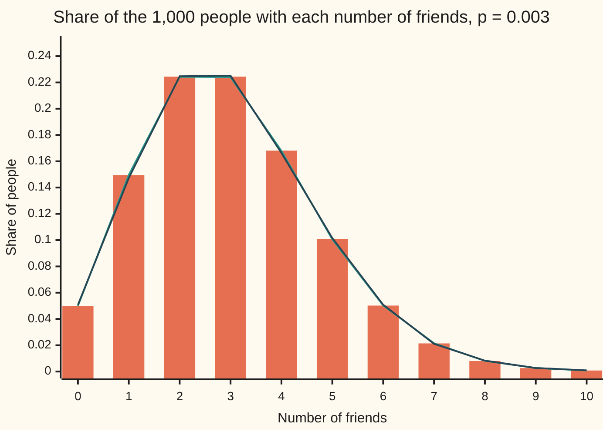
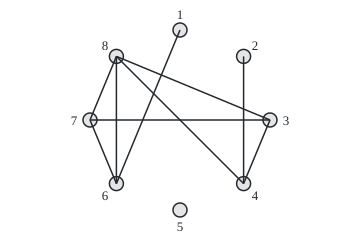

# Random graphs: every edge tossed with probability p

[Syllabus](../../../SYLLABUS.md) → [Probability and statistics](../../../SYLLABUS.md#w09) → [Random Graphs and the Probabilistic Method](../../../SYLLABUS.md#w09-s14) → Random graphs

---

## General Overview

A town has 1,000 people. Nobody plans who befriends whom. For every pair of people, a biased coin is tossed: with chance 0.003 the two become friends, otherwise not. Each pair gets its own coin, and no coin looks at any other.

That rule makes 499,500 tosses, one per pair. It yields 1,498.5 friendships on average, and each person ends up with about 3 friends: 2.997 on average. Not everyone gets 3. About 1 person in 20 has no friends at all, and about 1 in 125 has 8.

The network drawn this way is a **graph**: dots for people, lines for friendships ([Graphs](../../04-Combinatorics%20and%20graphs/09-Graphs%20-%20Dots%20and%20Lines/01-graphs-vertices-and-edges.md)). From here on the dots are **vertices**, the lines **edges**, and a person's friend count is their **degree** ([Degrees and the handshaking lemma](../../04-Combinatorics%20and%20graphs/09-Graphs%20-%20Dots%20and%20Lines/02-degree-and-handshaking.md)). A graph built by tossing one coin per pair is a **random graph**. Edgar Gilbert defined this version in 1959; Paul Erdős and Alfréd Rényi, the same year, studied a close cousin with a fixed number of edges, and both now go by their names.

The model is a baseline. It says what a network looks like when nothing but chance links people. A real network's departures from it, such as far more closed triangles of mutual friends, are what reveal structure.

**Toss one independent coin with chance p for every pair of n people: the edge count is binomial with average p times the number of pairs, each person's degree is binomial with average (n − 1)p, and when p is small that degree law is, to within a stated error, the Poisson law.**

**What kind of fact this is:** a model: a definition of a random network, not a claim about real friendships. Inside the model, the degree law is a theorem, proved on this card in Why it works, and the Poisson form is an approximation with its error stated.

### The picture: the degree law of the town



The bars are the exact law, Binomial(999, 0.003). The first line is the Poisson law with the same average, 2.997. The second line is what 40 simulated towns produced, 40,000 people in all. The three sit on top of each other: bar and Poisson line first differ in the fourth decimal place.

### The picture: one small town, drawn

<p align="center"></p>

A town of 8 people with chance 0.3 per pair, drawn once by the checks' generator: 28 pairs, 8.4 friendships expected, 9 came up. Positions are to scale on a circle of radius 90. Person 8 has 4 friends, person 5 has none. A different draw gives a different town; the model is the rule for drawing, not any one picture.

---

## The formula

Notation, in words first. $G(n,p)$ names the model: n people, each pair a friendship with chance p, all coins independent. $\binom{n}{2}$, read "n choose 2", counts the pairs. For people $u$ and $v$, the **indicator** $I_{uv}$ is 1 if they are friends and 0 if not. The wing's notation carries on: P(A) is the chance of A, E[X] the long-run average of X, and X ~ Binomial(m, p) reads "X follows the binomial law with m trials and chance p".

The number of edges $M$ and the degree $D$ of any one person obey

$$M = \sum_{u<v} I_{uv} \sim \text{Binomial}\!\left(\binom{n}{2},\, p\right), \qquad E[M] = \binom{n}{2}\,p$$

$$P(D = k) = \binom{n-1}{k}\,p^k\,(1-p)^{\,n-1-k}, \qquad E[D] = (n-1)\,p = \lambda$$

**Read it aloud:** the edge count is a sum of one yes-or-no per pair, so it is binomial with one trial per pair; one person's friend count is binomial with one trial for each of the other n − 1 people, and its average is lambda.

When p is small and λ stays fixed, the degree law is close to Poisson:

$$P(D = k) \approx e^{-\lambda}\,\frac{\lambda^k}{k!}, \qquad \Delta \le (n-1)\,p\,(1 - e^{-p}) \le (n-1)\,p^2$$

**Read it aloud:** the chance of k friends is nearly e to the minus lambda, times lambda to the k, over k factorial; and no event's chance differs between the two laws by more than n − 1 times p squared.

| Symbol | Plain meaning | In our example | Push it up and the answer… |
| --- | --- | --- | --- |
| $n$ | number of people (vertices) | 1,000 | more pairs, more friends each at the same p |
| $p$ | chance that one pair are friends | 0.003 | friendships and friends each rise in proportion; the Poisson form gets worse |
| $G(n,p)$ | the model: every pair its own independent coin with chance p | G(1000, 0.003) | — |
| $\binom{n}{2}$ | number of pairs, n(n − 1)/2 | 499,500 | grows like n squared |
| $\binom{n}{3}$ | number of groups of three, n(n − 1)(n − 2)/6 | 166,167,000 | grows like n cubed |
| $I_{uv}$ | 1 if people $u$ and $v$ are friends, else 0 | 1 with chance 0.003 | — |
| $u$, $v$ | two people, with u listed before v | persons 3 and 7 | — |
| $M$ | number of friendships (edges) | about 1,498.5 | — |
| $D$ | one person's number of friends (degree) | about 2.997 | — |
| $k$ | a particular friend count | 0, 1, 2, … | past the average, chances fall fast |
| $\lambda$ | average degree, (n − 1)p; say "lambda" | 2.997 | the degree law's peak moves right |
| $\Delta$ | the gap between two laws: the largest difference in chance they give any event | 0.000752 | the Poisson form is a worse stand-in |
| $A$ | an event, such as one person having a given set of friend counts | "8 or more friends" | — |
| $U$ | in the coupling proof, a uniform random number between 0 and 1 that builds one coin and its Poisson partner | one per coin, 999 per person | — |

A second quantity follows from the same sums. The expected number of people with no friends is $n(1-p)^{n-1}$, 49.71 here. The expected number of **triangles**, three people all friends with each other, is $\binom{n}{3}p^3$, 4.49 here.

### When it holds

- **Every pair has the same chance.** If some people are far more sociable, the degree law grows a long right tail of hubs that no binomial has; Small worlds and hubs builds those networks.
- **The coins are independent.** The averages survive dependence, since an average of a sum never needs independence, but the laws do not. If one coin decided every pair at once, the average degree would still be 2.997, yet each person would have no friends with chance 0.997.
- **p is small for the Poisson form.** The binomial law is exact for any p. Poisson is a stand-in whose error is at most $(n-1)p^2$: 0.009 here, but in a town of 11 at p = 0.3 the gap is 0.0864.
- **The model, not the world.** Real friendships cluster: two friends of one person are often friends. Here that chance is just p, 0.003, and the whole town holds about 4.49 triangles.

---

## Why it works

### Step 0: one coin per pair, and counting by indicators

Every count on this card is a sum of indicators: 1 for each thing present, 0 for each thing absent. The long-run average of a sum is the sum of the averages, and that rule needs no independence at all. The average of one indicator is the chance its thing happens. So every expected count is "how many candidates" times "the chance of each". Independence is needed only for the full law of a count, not its average.

### Step 1: count the pairs

Each of n people can pair with n − 1 others, giving n(n − 1) ordered pairs. Each unordered pair appears twice in that list, once as (u, v) and once as (v, u). So there are

$$\binom{n}{2} = \frac{n(n-1)}{2} = \frac{1000 \times 999}{2} = 499{,}500$$

pairs, and 499,500 coins.

### Step 2: the friendship count is binomial

The friendship count is the sum of the 499,500 indicators. Each is 1 with chance 0.003. By Step 0 the average is 499,500 × 0.003 = 1,498.5.

The coins are independent and alike, so M is the number of successes in 499,500 independent trials: that is the binomial law by definition ([Binomial](../03-Discrete%20Distributions/01-bernoulli-and-binomial.md)). Its variance is the number of trials times p(1 − p), so its standard deviation is 38.65: town to town, the friendship count typically strays from 1,498.5 by about that much.

### Step 3: one person's degree is binomial

Pick one person. Exactly n − 1 coins involve her, one for each other person. Her friend count D is the number of those coins that come up friends: 999 independent trials with chance 0.003. So D ~ Binomial(999, 0.003), with average λ = 2.997 and variance 999 × 0.003 × 0.997 = 2.988009.

The handshaking count gives the same average by another road. Each friendship adds 1 to two people's degrees, so the degrees sum to twice the edge count. Averaged over 1,000 people: 2 × 1,498.5 / 1,000 = 2.997.

Every person is alike under the rule, so every person's degree has this same law. Two people's degrees are not quite independent: the coin between them counts toward both. It is the only coin they share, so they are nearly independent.

### Step 4: small p turns the binomial into Poisson

Keep λ = (n − 1)p fixed and let the town grow, so p shrinks.

The chance of no friends is $(1-p)^{n-1}$. With p = λ/(n − 1) this is $(1 - \lambda/(n-1))^{n-1}$, which tends to $e^{-\lambda}$: 0.0497 against 0.0499 here.

Each next chance is the last one times a ratio:

$$\frac{P(D=k+1)}{P(D=k)} = \frac{n-1-k}{k+1}\cdot\frac{p}{1-p}$$

For a fixed k and large n, n − 1 − k is nearly n − 1 and 1 − p is nearly 1, so the ratio tends to λ/(k + 1). The Poisson law has exactly that start and exactly that ratio. The [Poisson](../03-Discrete%20Distributions/04-poisson.md) card proves this limit in full; nothing about graphs enters it.

### Step 5: how close, in one number

A limit says nothing about a town of exactly 1,000. The gap Δ does. It is half the summed differences of the two laws' chances, and it bounds how far apart the two laws can put any event's chance.

The coupling proof below gives $\Delta \le (n-1)\,p\,(1-e^{-p})$, which is below $(n-1)p^2$, the form Lucien Le Cam proved in 1960. Here that is 0.008978, under 0.009. The true gap, summed over every count, is 0.000752: the bound is safe, and loose.

<details>
<summary>Detailed proof: the coupling bound</summary>

Build each of a person's n − 1 coins from one uniform number U between 0 and 1. The coin is 0 if U ≤ 1 − p and 1 otherwise, so it has chance p. From the same U, build a Poisson count with mean p: it is 0 if $U \le e^{-p}$, 1 if U lies between $e^{-p}$ and $e^{-p}(1+p)$, and 2 or more above that.

Since $e^{-p} \ge 1-p$, the two disagree only when $1-p < U \le e^{-p}$ (coin 1, count 0), with chance $e^{-p}-1+p$, or when $U > e^{-p}(1+p)$ (count at least 2), with chance $1-e^{-p}-p\,e^{-p}$. The two add to $p(1-e^{-p})$, and since $1-e^{-p} \le p$, that is at most $p^2$.

Do this for all n − 1 coins with independent U's. The coins sum to D. The Poisson counts sum to a Poisson count with mean (n − 1)p = λ, since independent Poisson counts add ([Adding counts](../03-Discrete%20Distributions/06-sums-of-discrete-variables.md)). The two sums can differ only if some coin disagrees with its partner. By the union bound, that has chance at most $(n-1)\,p\,(1-e^{-p})$.

For any event A, P(D in A) and P(Poisson in A) are two chances of events that coincide except when the sums differ. So they differ by at most the chance that the sums differ. That is $\Delta \le (n-1)\,p\,(1-e^{-p}) \le (n-1)p^2$.

</details>

### Step 6: from one person's law to the whole town

The share of the town with k friends is a sum over people: 1 for each person with exactly k, divided by n. By Step 0 its average is P(D = k), with no independence needed between people. So the bars of the chart are both one person's chance and the expected share of the town.

The same indicator sum counts people with no friends: n chances of $(1-p)^{n-1}$ each, 1,000 × 0.049712 = 49.71. It counts triangles too. There are $\binom{n}{3}$ = 166,167,000 groups of three, and each is a triangle only when its three coins all land, chance $p^3$. The average is 4.486509.

How tightly the share clusters around its average is a question about variance, not averages. The tool is the variance of a sum of indicators, which [First and second moments](04-first-and-second-moment-methods.md) works out for the triangle count.

Erdős and Rényi's own model is the close cousin: fix a number of edges, then choose exactly that many of the 499,500 pairs, every choice equally likely. Fix the number near 1,498.5 and most questions get the same answers as in $G(n,p)$, because the edge count of $G(n,p)$ rarely strays far from its average. The Frieze and Karoński book below treats both and moves between them.

---

## Worked numbers, by hand

| Step | Arithmetic | Value |
| --- | --- | --- |
| pairs | 1,000 × 999 / 2 | 499,500 |
| expected friendships | 499,500 × 0.003 | **1,498.5** |
| spread of that count | √(499,500 × 0.003 × 0.997) | 38.65 |
| expected friends each | 999 × 0.003 | **2.997** |
| same, by handshakes | 2 × 1,498.5 / 1,000 | 2.997 |
| chance of no friends | 0.997 to the power 999 | 0.0497 |
| Poisson's version | e to the power −2.997 | 0.0499 |
| expected friendless people | 1,000 × 0.049712 | 49.71 |
| expected triangles | 166,167,000 × 0.003^3 | 4.49 |
| Poisson error bound | 999 × 0.003 × (1 − e^−0.003) | **0.008978** |

A town built by chance at this density has about 1,500 friendships, about 50 friendless people, and only 4 or 5 triangles of mutual friends.

### What breaks if you drop a piece

| Mistake | Comes out at | What went wrong |
| --- | --- | --- |
| Pairs counted as n^2 | 3,000.0 friendships, not 1,498.5 | counts each pair twice and pairs people with themselves |
| n times the average degree, not halved | 2,997.0 friendships | every friendship is two people's friend |
| One coin for all pairs | average 2.997, chance of none 0.9970; for 4 people, 1.8 friendships either way, but chance of none 0.7000, not 0.3430 | averages survive dependence; the law does not |
| Poisson for 11 people at p = 0.3 | chance of none 0.0498, truly 0.0282 | p is not small; gap 0.0864 |

The code prints all four.

---

## Code, from first principles, and it actually runs

Both programs take three independent roads. The formulas give the binomial law, the Poisson law, the gap between them and the coupling bound. A 4-person town at p = 0.3 is enumerated outright: all 64 ways its 6 coins can land, each weighted by its chance. And 40 towns of 1,000 are built pair by pair from a SplitMix64 generator, a short, fully written-out source of random bits, with seed 20260929; a pair are friends when a 64-bit draw falls below p × 2^64. Each simulated number carries its standard error, and the asserts allow four of them. Nothing imported holds the answer: no random module, no statistics module.

### Python

```python
# Random graphs G(n, p) -- the check behind the card.  Nothing is imported but
# the math primitives.  1,000 people; each of the 499,500 pairs becomes a
# friendship with chance 0.003, every pair on its own coin.  Three roads: the
# formulas, every outcome of a 4-person network enumerated, and 40 networks
# drawn from a SplitMix64 generator written out here (seed 20260929).
import math

N, P = 1000, 0.003
def pairs(n):                                  # unordered pairs, n(n - 1)/2
    return n * (n - 1) // 2

PAIRS = pairs(N)
LAM = (N - 1) * P                              # average friends per person
MASK = (1 << 64) - 1
state = 20260929

def splitmix():                                # 64 random bits per call
    global state
    state = (state + 0x9E3779B97F4A7C15) & MASK
    z = state
    z = ((z ^ (z >> 30)) * 0xBF58476D1CE4E5B9) & MASK
    z = ((z ^ (z >> 27)) * 0x94D049BB133111EB) & MASK
    return z ^ (z >> 31)

def binom_pmf(m, p):                           # P(X = k) for k = 0..m, ratio rule
    out = [(1 - p) ** m]
    for k in range(m):
        out.append(out[-1] * (m - k) / (k + 1) * p / (1 - p))
    return out

def poisson_pmf(lam, kmax):                    # P(Y = k) for k = 0..kmax
    out = [math.exp(-lam)]
    for k in range(kmax):
        out.append(out[-1] * lam / (k + 1))
    return out

def tv(a, b):                                  # half the summed gaps between two laws
    return 0.5 * sum(abs(x - y) for x, y in zip(a, b))

def mean_se(xs):                               # average and its standard error
    m = sum(xs) / len(xs)
    var = sum((x - m) ** 2 for x in xs) / (len(xs) - 1)
    return m, math.sqrt(var / len(xs))

# ---- road 1: the formulas ----
bin_d, poi_d = binom_pmf(N - 1, P), poisson_pmf(LAM, N - 1)
e_edges, sd_edges = PAIRS * P, math.sqrt(PAIRS * P * (1 - P))
e_loners = N * bin_d[0]                        # each friendless with chance (1-p)^(n-1)
TRIPLES = N * (N - 1) * (N - 2) // 6
e_tri = TRIPLES * P ** 3
print(f"people {N}, chance per pair {P}, pairs C({N},2) = {PAIRS}")
print(f"expected friendships {e_edges:.1f}, standard deviation {sd_edges:.4f}")
print(f"friends per person ~ Binomial({N - 1}, {P}): mean {LAM:.3f}, variance {LAM * (1 - P):.6f}")
print(f"expected people with no friends {e_loners:.4f}; expected triangles {TRIPLES} x {P}^3 = {e_tri:.6f}")
dist, bound = tv(bin_d, poi_d), (N - 1) * P * (1 - math.exp(-P))
print(f"gap between Binomial and Poisson laws {dist:.6f}; coupling bound {bound:.6f}; (n-1)p^2 = {(N - 1) * P * P:.6f}")

# ---- road 2: a 4-person network with p = 0.3, all 2^6 = 64 outcomes ----
pairs4 = [(i, j) for i in range(4) for j in range(i + 1, 4)]
e4, deg0 = 0.0, [0.0] * 4
for mask in range(64):
    on = [pairs4[b] for b in range(6) if mask >> b & 1]
    w = 0.3 ** len(on) * 0.7 ** (6 - len(on))
    e4 += w * len(on)
    deg0[sum(1 for e in on if 0 in e)] += w
b4 = binom_pmf(3, 0.3)
print(f"4 people, p = 0.3, enumerated: expected friendships {e4:.6f}, formula C(4,2)p = {pairs(4) * 0.3:.6f}")
print("  person 1's friend count, enumerated: " + ", ".join(f"{x:.4f}" for x in deg0))
print("  Binomial(3, 0.3) formula:            " + ", ".join(f"{x:.4f}" for x in b4))

# ---- road 3: 40 networks, each pair tossed on its own coin ----
T = int(P * 2 ** 64)                           # a draw below T has chance P
G = 40
edges_s, loners_s, tri_s, hist = [], [], [], [0] * 1000
for g in range(G):
    nbr = [[] for _ in range(N)]
    for i in range(N):
        for j in range(i + 1, N):
            if splitmix() < T:
                nbr[i].append(j)
                nbr[j].append(i)
    deg = [len(a) for a in nbr]
    edges_s.append(sum(deg) // 2)
    loners_s.append(deg.count(0))
    for d in deg:
        hist[d] += 1
    s = [set(a) for a in nbr]
    tri_s.append(sum(len(s[i] & s[j]) for i in range(N) for j in nbr[i] if j > i) // 3)
me, se = mean_se(edges_s)
ml, sl = mean_se(loners_s)
mt, st = mean_se(tri_s)
print(f"simulated, {G} networks: friendships {me:.2f} +/- {se:.2f} (formula {e_edges:.1f})")
print(f"  friends per person {2 * me / N:.4f} +/- {2 * se / N:.4f} (formula {LAM:.3f})")
print(f"  people with no friends {ml:.2f} +/- {sl:.2f} (formula {e_loners:.2f})")
print(f"  triangles {mt:.3f} +/- {st:.3f} (formula {e_tri:.3f}); most friends seen {max(k for k in range(1000) if hist[k])}")
print("k, Binomial, Poisson, simulated share +/- se")
ok, shares = True, []
for k in range(11):
    f = hist[k] / (G * N)
    shares.append(f)
    sf = math.sqrt(bin_d[k] * (1 - bin_d[k]) / (G * N))   # se if the law is right
    ok = ok and abs(f - bin_d[k]) < 4 * sf + 1e-12
    print(f"{k}, {bin_d[k]:.4f}, {poi_d[k]:.4f}, {f:.4f} +/- {sf:.4f}")
print("chart, to 2 places, Poisson " + " ".join(f"{x:.2f}" for x in poi_d[:11]) +
      "; simulated " + " ".join(f"{x:.2f}" for x in shares))

# ---- what breaks ----
print(f"mistake 1, n^2 p counts ordered pairs and self-pairs: {N * N * P:.1f}, not {e_edges:.1f}")
print(f"mistake 2, n x average friends, not halved: {N * LAM:.1f} friendships, not {e_edges:.1f}")
dep = [1 - P] + [0.0] * (N - 2) + [P]          # one coin decides every pair at once
dep_mean = sum(k * x for k, x in enumerate(dep))
print(f"mistake 3, one coin for all pairs: mean friends {dep_mean:.3f}, chance of none {dep[0]:.4f} (own coins: {bin_d[0]:.4f})")
e4dep, none_dep = 0.0, 0.0                     # 4 people, one shared coin: all 6 pairs or none
for on, w in (([], 0.7), (pairs4, 0.3)):
    e4dep += w * len(on)
    none_dep += w * (sum(1 for e in on if 0 in e) == 0)
print(f"  same, 4 people enumerated: friendships {e4dep:.6f} (own coins {e4:.6f}), person 1 has none {none_dep:.4f} (own coins {deg0[0]:.4f})")
b11, p11 = binom_pmf(10, 0.3), poisson_pmf(3.0, 10)
print(f"mistake 4, 11 people at p = 0.3: chance of no friends {b11[0]:.4f}, Poisson says {p11[0]:.4f}; gap {tv(b11, p11) + 0.5 * (1 - sum(p11)):.4f}")

# ---- the picture: 8 people, p = 0.3, one draw (seed 8) ----
state, T8 = 8, int(0.3 * 2 ** 64)
pts = [(180 + 90 * math.sin(2 * math.pi * i / 8), 120 - 90 * math.cos(2 * math.pi * i / 8)) for i in range(8)]
fig_edges = [(i + 1, j + 1) for i in range(8) for j in range(i + 1, 8) if splitmix() < T8]
print("figure, people at " + " ".join(f"({x:.1f},{y:.1f})" for x, y in pts))
print("figure, friendships " + " ".join(f"{i}-{j}" for i, j in fig_edges) + f"; {len(fig_edges)} of 28, expected 8.4")
print("figure, friend counts " + " ".join(str(sum(v in e for e in fig_edges)) for v in range(1, 9)))

assert abs(e4 - pairs(4) * 0.3) < 1e-12 and max(abs(x - y) for x, y in zip(deg0, b4)) < 1e-12
assert abs(me - e_edges) < 4 * se and abs(ml - e_loners) < 4 * sl and abs(mt - e_tri) < 4 * st
assert ok                                      # every share within 4 standard errors
assert dist < bound                            # the coupling bound holds
assert abs(e4dep - e4) < 1e-12 and none_dep > deg0[0] + 0.3   # average kept, law changed
print("ALL CHECKS PASS")
```

**Ran 2026-09-29 on macOS, Python 3.14.6, standard library only. All checks passed. Output, pasted from the run:**

```
people 1000, chance per pair 0.003, pairs C(1000,2) = 499500
expected friendships 1498.5, standard deviation 38.6524
friends per person ~ Binomial(999, 0.003): mean 2.997, variance 2.988009
expected people with no friends 49.7122; expected triangles 166167000 x 0.003^3 = 4.486509
gap between Binomial and Poisson laws 0.000752; coupling bound 0.008978; (n-1)p^2 = 0.008991
4 people, p = 0.3, enumerated: expected friendships 1.800000, formula C(4,2)p = 1.800000
  person 1's friend count, enumerated: 0.3430, 0.4410, 0.1890, 0.0270
  Binomial(3, 0.3) formula:            0.3430, 0.4410, 0.1890, 0.0270
simulated, 40 networks: friendships 1500.83 +/- 5.59 (formula 1498.5)
  friends per person 3.0017 +/- 0.0112 (formula 2.997)
  people with no friends 50.80 +/- 1.35 (formula 49.71)
  triangles 4.800 +/- 0.331 (formula 4.487); most friends seen 12
k, Binomial, Poisson, simulated share +/- se
0, 0.0497, 0.0499, 0.0508 +/- 0.0011
1, 0.1494, 0.1497, 0.1473 +/- 0.0018
2, 0.2244, 0.2243, 0.2247 +/- 0.0021
3, 0.2244, 0.2240, 0.2251 +/- 0.0021
4, 0.1681, 0.1679, 0.1664 +/- 0.0019
5, 0.1007, 0.1006, 0.1016 +/- 0.0015
6, 0.0502, 0.0503, 0.0508 +/- 0.0011
7, 0.0214, 0.0215, 0.0211 +/- 0.0007
8, 0.0080, 0.0081, 0.0083 +/- 0.0004
9, 0.0026, 0.0027, 0.0027 +/- 0.0003
10, 0.0008, 0.0008, 0.0009 +/- 0.0001
chart, to 2 places, Poisson 0.05 0.15 0.22 0.22 0.17 0.10 0.05 0.02 0.01 0.00 0.00; simulated 0.05 0.15 0.22 0.23 0.17 0.10 0.05 0.02 0.01 0.00 0.00
mistake 1, n^2 p counts ordered pairs and self-pairs: 3000.0, not 1498.5
mistake 2, n x average friends, not halved: 2997.0 friendships, not 1498.5
mistake 3, one coin for all pairs: mean friends 2.997, chance of none 0.9970 (own coins: 0.0497)
  same, 4 people enumerated: friendships 1.800000 (own coins 1.800000), person 1 has none 0.7000 (own coins 0.3430)
mistake 4, 11 people at p = 0.3: chance of no friends 0.0282, Poisson says 0.0498; gap 0.0864
figure, people at (180.0,30.0) (243.6,56.4) (270.0,120.0) (243.6,183.6) (180.0,210.0) (116.4,183.6) (90.0,120.0) (116.4,56.4)
figure, friendships 1-6 2-4 3-4 3-7 3-8 4-8 6-7 6-8 7-8; 9 of 28, expected 8.4
figure, friend counts 1 1 3 3 0 3 3 4
ALL CHECKS PASS
```

### Rust

Same numbers, same labels, built with `rustc --edition 2021 -O`.

```rust
// Random graphs G(n, p) -- the same check as the Python, in Rust.  No crates.
// 1,000 people; each of the 499,500 pairs becomes a friendship with chance
// 0.003, every pair on its own coin.  Three roads: the formulas, every outcome
// of a 4-person network enumerated, and 40 networks drawn from a SplitMix64
// generator written out here (seed 20260929).
const N: usize = 1000;
const P: f64 = 0.003;

struct SplitMix(u64); // 64 random bits per call

impl SplitMix {
    fn next(&mut self) -> u64 {
        self.0 = self.0.wrapping_add(0x9E3779B97F4A7C15);
        let mut z = self.0;
        z = (z ^ (z >> 30)).wrapping_mul(0xBF58476D1CE4E5B9);
        z = (z ^ (z >> 27)).wrapping_mul(0x94D049BB133111EB);
        z ^ (z >> 31)
    }
}

fn binom_pmf(m: usize, p: f64) -> Vec<f64> { // P(X = k) for k = 0..m, ratio rule
    let mut out = vec![(1.0 - p).powf(m as f64)];
    for k in 0..m {
        let last = out[k];
        out.push(last * (m - k) as f64 / (k + 1) as f64 * p / (1.0 - p));
    }
    out
}

fn poisson_pmf(lam: f64, kmax: usize) -> Vec<f64> { // P(Y = k) for k = 0..kmax
    let mut out = vec![(-lam).exp()];
    for k in 0..kmax {
        let last = out[k];
        out.push(last * lam / (k + 1) as f64);
    }
    out
}

fn tv(a: &[f64], b: &[f64]) -> f64 { // half the summed gaps between two laws
    0.5 * a.iter().zip(b).map(|(x, y)| (x - y).abs()).sum::<f64>()
}

fn mean_se(xs: &[f64]) -> (f64, f64) { // average and its standard error
    let n = xs.len() as f64;
    let m = xs.iter().sum::<f64>() / n;
    let var = xs.iter().map(|x| (x - m).powi(2)).sum::<f64>() / (n - 1.0);
    (m, (var / n).sqrt())
}

fn n_pairs(n: usize) -> usize { n * (n - 1) / 2 } // unordered pairs, n(n - 1)/2

fn join(v: &[f64]) -> String { v.iter().map(|x| format!("{:.4}", x)).collect::<Vec<_>>().join(", ") }

fn main() {
    let pairs = n_pairs(N);
    let lam = (N - 1) as f64 * P; // average friends per person
    // ---- road 1: the formulas ----
    let (bin_d, poi_d) = (binom_pmf(N - 1, P), poisson_pmf(lam, N - 1));
    let (e_edges, sd_edges) = (pairs as f64 * P, (pairs as f64 * P * (1.0 - P)).sqrt());
    let e_loners = N as f64 * bin_d[0]; // each friendless with chance (1-p)^(n-1)
    let triples = N * (N - 1) * (N - 2) / 6;
    let e_tri = triples as f64 * P.powf(3.0);
    println!("people {}, chance per pair {}, pairs C({},2) = {}", N, P, N, pairs);
    println!("expected friendships {:.1}, standard deviation {:.4}", e_edges, sd_edges);
    println!("friends per person ~ Binomial({}, {}): mean {:.3}, variance {:.6}", N - 1, P, lam, lam * (1.0 - P));
    println!("expected people with no friends {:.4}; expected triangles {} x {}^3 = {:.6}", e_loners, triples, P, e_tri);
    let (dist, bound) = (tv(&bin_d, &poi_d), (N - 1) as f64 * P * (1.0 - (-P).exp()));
    println!("gap between Binomial and Poisson laws {:.6}; coupling bound {:.6}; (n-1)p^2 = {:.6}", dist, bound, (N - 1) as f64 * P * P);
    // ---- road 2: a 4-person network with p = 0.3, all 2^6 = 64 outcomes ----
    let pairs4: Vec<(usize, usize)> = (0..4).flat_map(|i| (i + 1..4).map(move |j| (i, j))).collect();
    let (mut e4, mut deg0) = (0.0f64, vec![0.0f64; 4]);
    for mask in 0..64u32 {
        let on: Vec<(usize, usize)> = (0..6).filter(|b| mask >> b & 1 == 1).map(|b| pairs4[b]).collect();
        let w = 0.3f64.powf(on.len() as f64) * 0.7f64.powf((6 - on.len()) as f64);
        e4 += w * on.len() as f64;
        deg0[on.iter().filter(|e| e.0 == 0 || e.1 == 0).count()] += w;
    }
    let b4 = binom_pmf(3, 0.3);
    println!("4 people, p = 0.3, enumerated: expected friendships {:.6}, formula C(4,2)p = {:.6}", e4, n_pairs(4) as f64 * 0.3);
    println!("  person 1's friend count, enumerated: {}", join(&deg0));
    println!("  Binomial(3, 0.3) formula:            {}", join(&b4));
    // ---- road 3: 40 networks, each pair tossed on its own coin ----
    let mut rng = SplitMix(20260929);
    let t = (P * 2f64.powi(64)) as u64; // a draw below t has chance P
    let g = 40;
    let (mut edges_s, mut loners_s, mut tri_s, mut hist) = (vec![], vec![], vec![], vec![0usize; 1000]);
    for _ in 0..g {
        let mut nbr: Vec<Vec<usize>> = vec![vec![]; N];
        let mut adj = vec![vec![false; N]; N];
        for i in 0..N {
            for j in i + 1..N {
                if rng.next() < t {
                    nbr[i].push(j);
                    nbr[j].push(i);
                    adj[i][j] = true;
                    adj[j][i] = true;
                }
            }
        }
        let deg: Vec<usize> = nbr.iter().map(|a| a.len()).collect();
        edges_s.push((deg.iter().sum::<usize>() / 2) as f64);
        loners_s.push(deg.iter().filter(|&&d| d == 0).count() as f64);
        for &d in &deg { hist[d] += 1 }
        let mut tri = 0usize;
        for i in 0..N {
            for &j in nbr[i].iter().filter(|&&j| j > i) { tri += nbr[i].iter().filter(|&&w| adj[j][w]).count() }
        }
        tri_s.push((tri / 3) as f64);
    }
    let ((me, se), (ml, sl), (mt, st)) = (mean_se(&edges_s), mean_se(&loners_s), mean_se(&tri_s));
    println!("simulated, {} networks: friendships {:.2} +/- {:.2} (formula {:.1})", g, me, se, e_edges);
    println!("  friends per person {:.4} +/- {:.4} (formula {:.3})", 2.0 * me / N as f64, 2.0 * se / N as f64, lam);
    println!("  people with no friends {:.2} +/- {:.2} (formula {:.2})", ml, sl, e_loners);
    let most = (0..1000).filter(|&k| hist[k] > 0).max().unwrap();
    println!("  triangles {:.3} +/- {:.3} (formula {:.3}); most friends seen {}", mt, st, e_tri, most);
    println!("k, Binomial, Poisson, simulated share +/- se");
    let (mut ok, mut shares) = (true, vec![]);
    for k in 0..11 {
        let f = hist[k] as f64 / (g * N) as f64;
        shares.push(f);
        let sf = (bin_d[k] * (1.0 - bin_d[k]) / (g * N) as f64).sqrt(); // se if the law is right
        ok = ok && (f - bin_d[k]).abs() < 4.0 * sf + 1e-12;
        println!("{}, {:.4}, {:.4}, {:.4} +/- {:.4}", k, bin_d[k], poi_d[k], f, sf);
    }
    let two = |v: &[f64]| v.iter().map(|x| format!("{:.2}", x)).collect::<Vec<_>>().join(" ");
    println!("chart, to 2 places, Poisson {}; simulated {}", two(&poi_d[..11]), two(&shares));
    // ---- what breaks ----
    println!("mistake 1, n^2 p counts ordered pairs and self-pairs: {:.1}, not {:.1}", (N * N) as f64 * P, e_edges);
    println!("mistake 2, n x average friends, not halved: {:.1} friendships, not {:.1}", N as f64 * lam, e_edges);
    let mut dep = vec![0.0f64; N]; // one coin decides every pair at once
    dep[0] = 1.0 - P;
    dep[N - 1] = P;
    let dep_mean: f64 = dep.iter().enumerate().map(|(k, x)| k as f64 * x).sum();
    println!("mistake 3, one coin for all pairs: mean friends {:.3}, chance of none {:.4} (own coins: {:.4})", dep_mean, dep[0], bin_d[0]);
    let (mut e4dep, mut none_dep) = (0.0f64, 0.0f64); // 4 people, one shared coin: all 6 pairs or none
    for (on, w) in [(&pairs4[..0], 0.7), (&pairs4[..], 0.3)] {
        e4dep += w * on.len() as f64;
        if on.iter().filter(|e| e.0 == 0 || e.1 == 0).count() == 0 { none_dep += w }
    }
    println!("  same, 4 people enumerated: friendships {:.6} (own coins {:.6}), person 1 has none {:.4} (own coins {:.4})", e4dep, e4, none_dep, deg0[0]);
    let (b11, p11) = (binom_pmf(10, 0.3), poisson_pmf(3.0, 10));
    println!("mistake 4, 11 people at p = 0.3: chance of no friends {:.4}, Poisson says {:.4}; gap {:.4}",
             b11[0], p11[0], tv(&b11, &p11) + 0.5 * (1.0 - p11.iter().sum::<f64>()));
    // ---- the picture: 8 people, p = 0.3, one draw (seed 8) ----
    let (mut rng8, t8) = (SplitMix(8), (0.3 * 2f64.powi(64)) as u64);
    let pi2 = 2.0 * std::f64::consts::PI;
    let pts: Vec<String> = (0..8).map(|i| {
        let a = pi2 * i as f64 / 8.0;
        format!("({:.1},{:.1})", 180.0 + 90.0 * a.sin(), 120.0 - 90.0 * a.cos())
    }).collect();
    let (mut fig_edges, mut counts) = (vec![], vec![0; 8]);
    for i in 0..8 {
        for j in i + 1..8 {
            if rng8.next() < t8 { fig_edges.push(format!("{}-{}", i + 1, j + 1)); counts[i] += 1; counts[j] += 1 }
        }
    }
    println!("figure, people at {}", pts.join(" "));
    println!("figure, friendships {}; {} of 28, expected 8.4", fig_edges.join(" "), fig_edges.len());
    println!("figure, friend counts {}", counts.iter().map(|c| c.to_string()).collect::<Vec<_>>().join(" "));
    assert!((e4 - n_pairs(4) as f64 * 0.3).abs() < 1e-12 && deg0.iter().zip(&b4).all(|(x, y)| (x - y).abs() < 1e-12));
    assert!((me - e_edges).abs() < 4.0 * se && (ml - e_loners).abs() < 4.0 * sl && (mt - e_tri).abs() < 4.0 * st);
    assert!(ok); // every share within 4 standard errors
    assert!(dist < bound); // the coupling bound holds
    assert!((e4dep - e4).abs() < 1e-12 && none_dep > deg0[0] + 0.3); // average kept, law changed
    println!("ALL CHECKS PASS");
}
```

**Ran 2026-09-29 on macOS, rustc 1.98.1, no crates. All checks passed. Output, pasted from the run:**

```
people 1000, chance per pair 0.003, pairs C(1000,2) = 499500
expected friendships 1498.5, standard deviation 38.6524
friends per person ~ Binomial(999, 0.003): mean 2.997, variance 2.988009
expected people with no friends 49.7122; expected triangles 166167000 x 0.003^3 = 4.486509
gap between Binomial and Poisson laws 0.000752; coupling bound 0.008978; (n-1)p^2 = 0.008991
4 people, p = 0.3, enumerated: expected friendships 1.800000, formula C(4,2)p = 1.800000
  person 1's friend count, enumerated: 0.3430, 0.4410, 0.1890, 0.0270
  Binomial(3, 0.3) formula:            0.3430, 0.4410, 0.1890, 0.0270
simulated, 40 networks: friendships 1500.83 +/- 5.59 (formula 1498.5)
  friends per person 3.0017 +/- 0.0112 (formula 2.997)
  people with no friends 50.80 +/- 1.35 (formula 49.71)
  triangles 4.800 +/- 0.331 (formula 4.487); most friends seen 12
k, Binomial, Poisson, simulated share +/- se
0, 0.0497, 0.0499, 0.0508 +/- 0.0011
1, 0.1494, 0.1497, 0.1473 +/- 0.0018
2, 0.2244, 0.2243, 0.2247 +/- 0.0021
3, 0.2244, 0.2240, 0.2251 +/- 0.0021
4, 0.1681, 0.1679, 0.1664 +/- 0.0019
5, 0.1007, 0.1006, 0.1016 +/- 0.0015
6, 0.0502, 0.0503, 0.0508 +/- 0.0011
7, 0.0214, 0.0215, 0.0211 +/- 0.0007
8, 0.0080, 0.0081, 0.0083 +/- 0.0004
9, 0.0026, 0.0027, 0.0027 +/- 0.0003
10, 0.0008, 0.0008, 0.0009 +/- 0.0001
chart, to 2 places, Poisson 0.05 0.15 0.22 0.22 0.17 0.10 0.05 0.02 0.01 0.00 0.00; simulated 0.05 0.15 0.22 0.23 0.17 0.10 0.05 0.02 0.01 0.00 0.00
mistake 1, n^2 p counts ordered pairs and self-pairs: 3000.0, not 1498.5
mistake 2, n x average friends, not halved: 2997.0 friendships, not 1498.5
mistake 3, one coin for all pairs: mean friends 2.997, chance of none 0.9970 (own coins: 0.0497)
  same, 4 people enumerated: friendships 1.800000 (own coins 1.800000), person 1 has none 0.7000 (own coins 0.3430)
mistake 4, 11 people at p = 0.3: chance of no friends 0.0282, Poisson says 0.0498; gap 0.0864
figure, people at (180.0,30.0) (243.6,56.4) (270.0,120.0) (243.6,183.6) (180.0,210.0) (116.4,183.6) (90.0,120.0) (116.4,56.4)
figure, friendships 1-6 2-4 3-4 3-7 3-8 4-8 6-7 6-8 7-8; 9 of 28, expected 8.4
figure, friend counts 1 1 3 3 0 3 3 4
ALL CHECKS PASS
```

The two outputs match line for line: the generator is integer arithmetic in both, so both languages toss the same coins in the same order.

> [!TIP]
> **Try changing**
> Guess first, then run it.
> - **A sparser town.** Set `P` to `0.001`. The average degree drops to 0.999, and the expected number of friendless people rises to 368.06, close to 1,000 × e^−1: over a third of the town.
> - **A denser town.** Set `P` to `0.01`. The average is 9.99, friendless people almost vanish (0.04 expected), and triangles jump to 166.167, since they grow as p cubed. The bound on the Poisson gap rises to 0.099402, but the true gap is only 0.002458.
> - **A small town, same average.** Set `N, P` to `100, 0.03`. The average degree is 2.97, almost the same, but the gap between binomial and Poisson is 0.007612, ten times the 1,000-person gap: the Poisson form needs small p, not just a modest average.
> - **Another seed.** Change the seed `20260929` to `1`. The simulated friendships become 1498.85 +/- 5.93: different towns, same law, still inside four standard errors.

---

## The usual mistake

> [!warning]
> **Reading the average as the typical person.** The average degree is 2.997, but only 22.4% of people have exactly 3 friends. About 5% have none and about 1 in 125 has 8. The model fixes a whole law of friend counts, not one number, and questions about the lonely or the popular are questions about its tails.
>
> - **Counting pairs as n^2.** That gives 3,000 expected friendships instead of 1,498.5: it counts every pair in both orders and pairs each person with themselves.
> - **Forgetting to halve.** Adding up everyone's friends gives 2,997, but each friendship was counted by both friends: 1,498.5.
> - **Carrying the model's laws to dependent networks.** Averages carry over; laws do not. With one coin for all pairs the average is unchanged, but each person is friendless with chance 0.997.
> - **Using Poisson for a small, dense network.** For 11 people at p = 0.3 Poisson says 0.0498 for no friends; the truth is 0.0282.

---

## Where you meet it in real life

- **Network science's yardstick.** A measured network, of friendships, citations or proteins, is compared with a random graph of the same size and density. A triangle count far above the model's, 4.49 for our town, is evidence of clustering that chance alone does not produce.
- **Epidemics.** Disease passes along edges; in a random graph each case meets on average λ contacts, and whether an outbreak takes off depends on that number (Epidemics on a network).
- **Existence proofs.** To show that a graph with some property exists, build a random one and prove it has the property with positive chance ([The probabilistic method](03-probabilistic-method.md)).
- **Percolation and phase changes.** Raising p past 1/n makes a single huge connected cluster appear, the same abrupt change physicists study in porous materials (Percolation).

> **Say it back**
> A random graph tosses one independent coin with chance p for every pair of n people. The friendship count is then binomial over the n(n − 1)/2 pairs, 1,498.5 on average for 1,000 people at p = 0.003. Each person's friend count is binomial over the other n − 1 people, averaging 2.997. When p is small that law is nearly Poisson, and the gap is at most (n − 1)p^2, under 0.009 here. Averages need only counting; the laws need the coins to be independent.

---

## What this builds on

- [Poisson](../03-Discrete%20Distributions/04-poisson.md): the Poisson law and its proof as the limit of the binomial.
- [Graphs](../../04-Combinatorics%20and%20graphs/09-Graphs%20-%20Dots%20and%20Lines/01-graphs-vertices-and-edges.md): what a graph, a vertex and an edge are.
- [Degrees and the handshaking lemma](../../04-Combinatorics%20and%20graphs/09-Graphs%20-%20Dots%20and%20Lines/02-degree-and-handshaking.md): degree, and why degrees sum to twice the edges.

## Where this goes next

- [The giant component](02-the-giant-component.md): once the average degree passes 1, one cluster swallows a fixed share of the town.
- [Random walks on a graph](05-random-walks-on-graphs-and-mixing.md): wandering from friend to friend, and how fast a walk forgets where it began.
- Small worlds and hubs: models that add the clustering and the hubs this one lacks.
- Epidemics on a network: infection spreading along random edges.
- Percolation: the sharp change at the threshold, seen as a physical phase change.

This card counts friends one person at a time; whether those friendships knit the town into one connected whole is the question [The giant component](02-the-giant-component.md) answers.

---

## Sources

Verified 2026-09-29: every link below resolves to the publisher's page or the author's own page for the work.

- Gilbert, E. N. "Random Graphs." *The Annals of Mathematical Statistics* 30(4), 1959, 1141–1144. [DOI](https://doi.org/10.1214/aoms/1177706098). Defines the model with one independent coin per pair.
- Erdős, P., and A. Rényi. "On random graphs I." *Publicationes Mathematicae Debrecen* 6, 1959, 290–297. [DOI](https://doi.org/10.5486/PMD.1959.6.3-4.12). The fixed-edge-count version, and the name.
- Le Cam, Lucien. "An approximation theorem for the Poisson binomial distribution." *Pacific Journal of Mathematics* 10(4), 1960, 1181–1197. [DOI](https://doi.org/10.2140/pjm.1960.10.1181). The bound on the gap between a sum of rare coins and the Poisson law.
- Frieze, Alan, and Michał Karoński. *Introduction to Random Graphs*. Cambridge University Press, 2015. [Author's page, with the full text](https://www.math.cmu.edu/~af1p/Book.html). Chapter 1 sets up both models and their degree laws.
