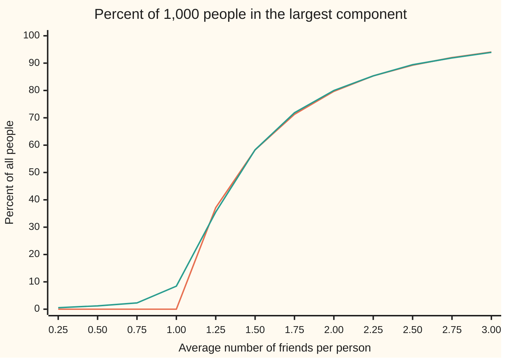
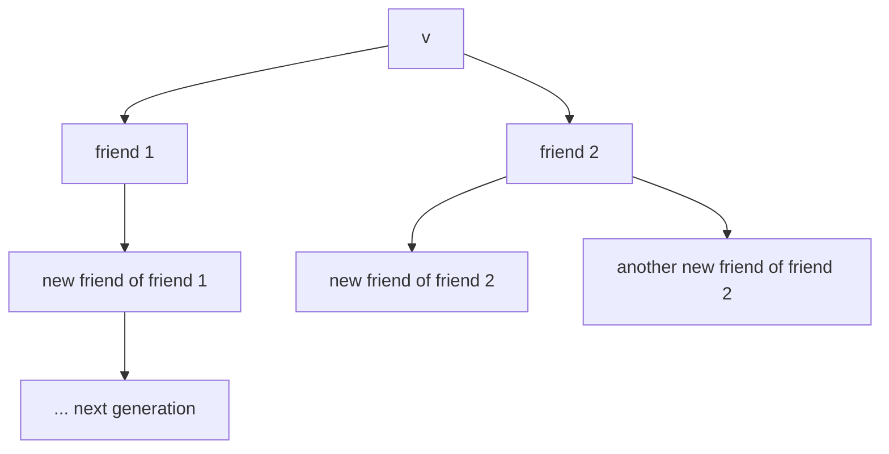

# The giant component: a sudden switch when the average degree passes one

[Syllabus](../../../SYLLABUS.md) → [Probability and statistics](../README.md) → [Random Graphs and the Probabilistic Method](../README.md#s14) → The giant component

---

## General Overview

Take 1,000 people and make friendships at random. Every one of the 499,500 possible pairs becomes a friendship by its own coin toss, all with the same small chance. Turn that chance up slowly and watch who can reach whom through friends of friends.

At first the network is an archipelago. With half a friend per person on average, the biggest island in a simulated network holds about a dozen people. Push the average to 1.5 friends and the picture has changed in kind: one island holds about 583 people, and the next largest about 13. In a large network the change is squeezed into a narrow band of averages, and the band tightens as the network grows. The switch sits at one friend per person.

The islands have a proper name: a **component** is a group of people all joined to one another by chains of friendships, with no friendship leaving the group ([Connected or not](../../04-Combinatorics%20and%20graphs/09-Graphs%20-%20Dots%20and%20Lines/04-connectivity-and-breadth-first-search.md)). The one big island is the **giant component**, the term used from here on. The random network is the Erdős–Rényi graph of [Random graphs](01-random-graphs-erdos-renyi.md).

The reason is a family tree. Explore outward from one person: friends, then their new friends, and so on. Each person found brings on average as many new people as the average number of friends. Below one, the tree dies out; above one, it can run on for ever, and every runaway tree lands in the same giant.

**In a large random network, components stay tiny while the average number of friends is below one; above one, a single giant component appears holding a fixed share of everyone, and that share is the survival chance of a family tree with that many children per person.**

**What kind of fact this is:** a theorem (Erdős and Rényi, 1960). The small-island half and the family-tree equation are proved on this card in Why it works; the giant's half is proved there in outline, with the full proof in the sources.

### The picture: the switch at one friend each

Forty simulated networks of 1,000 people at each average, set against the theorem's prediction.



Orange: the theorem's share for an endless network, zero up to one friend each, then rising steeply. Green: the simulated average for 1,000 people. It never touches zero, since a finite network always has some largest island, and it rounds the corner at one.

---

## The formula

The model, in words first. There are $n$ people. Each pair is a friendship with chance $p$, independently of every other pair. This is the model G(n, p) of the random-graphs card. The average number of friends is then $c$ = (n − 1)p, since each person has n − 1 possible partners; that card calls it lambda, and the letter c is the usual one in the giant-component literature. The theorem is a statement about $n$ growing while $c$ stays fixed.

The share of people in the giant component is the number $\zeta$ (the Greek letter zeta) that solves

$$\zeta = 1 - e^{-c\,\zeta}.$$

**Read it aloud:** the share in the giant equals one minus the chance that none of a person's friends leads into the giant.

The number zero always solves it. The theorem is about the other root:

- **Below the switch,** $c$ < 1: zero is the only root in 0 to 1. Write I = c − 1 − ln c, a positive rate. With chance close to 1, the largest component holds about (1 / I) × ln n people for large n, a slow-growing count. The proof on this card gives the cruder bound (2 / I) × ln n, with failure chance at most 1/n.
- **Above the switch,** $c$ > 1: there is exactly one root $\zeta$ between 0 and 1. The largest component holds about $\zeta$ n people; every other component holds at most a constant times ln n.
- **At the switch,** $c$ = 1: the largest component holds roughly $n^{2/3}$ people, a count between the two.

The same share arrives from a family tree. Write $q$ for the chance that a family line dies out when every member has a Poisson number of children with average $c$ (X ~ Poisson(c), read "X follows the Poisson law with mean c", from [Poisson](../03-Discrete%20Distributions/04-poisson.md)). Then

$$q = e^{c\,(q - 1)}, \qquad \zeta = 1 - q.$$

**Read it aloud:** a line dies out exactly when every child's line dies out, and the share in the giant is the chance a line runs on for ever.

| Symbol | Plain meaning | In our example | Push it up and the answer… |
| --- | --- | --- | --- |
| $n$ | people in the network | 1,000 | islands below the switch grow only like ln n; the giant's share stays put |
| $p$ | chance a given pair are friends | 0.001502 at c = 1.5 | more friendships, larger $c$ |
| $c$ | average number of friends, (n − 1)p | 1.5 | crossing 1 creates the giant; beyond, it grows |
| $\zeta$ | share of people in the giant | 0.5828 | — |
| $q$ | chance a family line dies out; 1 − ζ | 0.4172 | — |
| $q_k$ | chance the line is dead by generation k | 0.2231, 0.3118, 0.3562 for k = 1, 2, 3 | — |
| $X$ | new friends one explored person brings, about Poisson(c) | average 1.5 | — |
| $f$ | the family-tree rule $f(s) = e^{c(s-1)}$, whose smallest fixed point is q | f(0) = 0.2231 | — |
| $v$ | one chosen person; C(v) is that person's component | any of the 1,000 | — |
| $I$ | decay rate below the switch, c − 1 − ln c | 0.1931 at c = 0.5 | a steeper drop in island sizes |
| $k$ | a size cut-off (or a generation count) | 72 people at c = 0.5 | — |

### When it holds

- **Friendships independent, all with the same chance.** Group friendships into tight foursomes and the average reaches 3 with no island above 4 people.
- **Average friends of a friend near the plain average.** Poisson counts make these equal. With uneven friend counts they are not: 300 people with 3 friends each and 700 with none average 0.9 friends, yet 300 people form one component.
- **A large network.** The switch is sharp only as n grows. At 1,000 people and c = 1 the largest component averages 84.2 people, not zero.
- **Fixed average as n grows.** If $c$ grows like ln n instead, the giant swallows everyone and the network becomes connected: that is a different threshold.

---

## Why it works

### Step 0: an island is a family tree that died out

Find the component of one person $v$ by breadth-first search: list $v$'s friends, then their friends not yet seen, generation by generation. The search stops when a generation brings no one new. The component is everyone found.

While few people have been found, almost everyone is unseen, so each explored person brings new people at the same rate. That is a **family tree**, or **branching process**: every member independently has a random number of children. A small component is a tree that died out. The giant is where trees that do not die out end up.



### Step 1: each explored person brings about Poisson(c) new people

An explored person has 999 possible partners, minus those already found. Each is a friend with chance $p$, independently. So the count of new friends, $X$, is binomial with just under 999 trials and chance $p$, and its average is at most (n − 1)p, which is $c$.

Many trials each with a small chance give the Poisson law with the same average: $X$ is close to Poisson(c) ([Poisson](../03-Discrete%20Distributions/04-poisson.md)). At c = 1.5, $p$ is 0.001502.

### Step 2: the dying-out chance obeys one equation

Let $q$ be the chance that a family line dies out. The founder has $X$ children. The whole line dies exactly when each child's line dies, and those lines are independent copies of the whole, each dying with chance $q$. Given $X$ = j children, the chance is $q$ to the power j. Averaging over j:

$$q = \sum_{j \ge 0} P(X = j)\, q^j = e^{c\,(q-1)} = f(q).$$

<details>
<summary>The algebra behind this</summary>

For Poisson(c), $P(X = j) = e^{-c} c^j / j!$. So the sum is $e^{-c} \sum_j (cq)^j / j!$, and the second factor is the series for $e^{cq}$. The product is $e^{cq - c} = e^{c(q-1)}$.

</details>

### Step 3: the right root is the smallest one, and it drops below 1 only when c > 1

Let $q_k$ be the chance the line is dead by generation k. By the same argument, $q_k = f(q_{k-1})$, starting from zero at generation 0. At c = 1.5 the values are 0.2231, 0.3118, 0.3562, 0.3807, 0.3950, climbing to 0.4172.

The sequence climbs and can never pass a root of q = f(q): f is increasing, so if $q_{k-1}$ sits below a root r, then $q_k = f(q_{k-1})$ sits below f(r) = r. It therefore settles on the smallest root in 0 to 1 ([Fixed points](../../06-Calculus%20and%20analysis/03-What%20Derivatives%20Tell%20You/07-fixed-point-iteration-and-the-contraction-principle.md)).

Now the shape of f. It passes through (1, 1), since $e^0 = 1$. Its slope there is $c$. It curves upward everywhere, since its second derivative, $c^2 e^{c(s-1)}$, is positive.

- If c ≤ 1, a curve bending up with slope at most 1 at the point (1, 1) lies above the diagonal everywhere to the left of it. The only root is q = 1: every line dies.
- If c > 1, the curve arrives at (1, 1) steeper than the diagonal, so just left of 1 it lies below. At 0 it lies above, since $f(0) = e^{-c} > 0$. It crosses the diagonal once in between: that crossing is $q$, and $\zeta$ = 1 − q > 0.

Put q = 1 − ζ and the equation becomes $1 - \zeta = e^{-c\zeta}$, the formula. At c = 1.5 the root is 0.5828: about 583 of 1,000 people.

### Step 4: below the switch, a person's island averages at most 1/(1 − c)

Each generation's expected size is at most $c$ times the one before, since every member brings at most $c$ new people on average. So the expected island size, counted from $v$, is at most

$$1 + c + c^2 + c^3 + \dots = \frac{1}{1 - c}.$$

At c = 0.5 that bound is 2. The simulated networks give 2.0209 with standard error 0.0323, within one standard error of the bound. The argument uses only averages, so the bound holds for every n, not just in the limit.

### Step 5: below the switch, no island is large

An average of 2 still allows one big island somewhere among 1,000 people. Ruling that out needs a tail bound on the size of $C(v)$ and a union over all 1,000 starting people. The bound is exponential: the chance that one person's island tops k people is at most $e^{-kI}$. At c = 0.5, I = 0.1931, and k = 72 makes the chance that any island tops 72 people at most 0.000913. The largest island in 40 simulated networks was 26 people; the average largest was 12.2.

<details>
<summary>Detailed proof: the small-island half</summary>

If the island of $v$ holds more than k people, the search is still running after exploring k people. They have then found at least k new people between them, besides $v$. Each exploration draws from fresh pairs, each a friendship with chance $p$, and at most n − 1 pairs per explored person. So the total found is at most a binomial count, call it B, with k(n − 1) trials and chance $p$, whose average is kc.

Chernoff's trick bounds P(B ≥ k). For any t > 0, Markov's inequality applied to $e^{tB}$ gives $P(B \ge k) \le e^{-tk}\, E[e^{tB}]$ ([Markov and Chebyshev](../02-Random%20Variables/08-markov-and-chebyshev-inequalities.md)). The moment generating function of the binomial is $(1 - p + pe^t)^{k(n-1)}$, which is at most $e^{kc(e^t - 1)}$ since $1 + x \le e^x$ ([Moment generating functions](../02-Random%20Variables/07-moment-generating-functions.md)). So

$$P(\lvert C(v)\rvert > k) \le e^{\,k\,(c(e^t - 1) - t)}.$$

Choose t = ln(1/c), positive because c < 1. The exponent becomes k(1 − c + ln c) = −kI, and I = c − 1 − ln c is positive for every c ≠ 1.

The largest island tops k only if some person's island does. There are n people, so the chance is at most $n\,e^{-kI}$. With k above 2 ln n / I this is at most 1/n. At n = 1,000 and c = 0.5, ln n = 6.9078, 2 ln n / I = 71.53, so k = 72 and the bound is 0.000913.

</details>

### Step 6: above the switch, every runaway tree joins one giant

The family tree predicts that a share $\zeta$ of people start searches that do not die young. The proof in outline has three parts.

1. **Early deaths match the tree.** While fewer than about ln n people are found, the new-friend counts are Poisson(c) to within a vanishing error, so a search dies young with chance close to $q$.
2. **Survivors grow large.** A search that has not died by then keeps finding people at a rate above one per explored person, and reaches a size of order $n^{2/3}$ with chance close to 1.
3. **Large searches meet.** Two groups of that size have about $n^{4/3}$ pairs between them, each a friendship with chance c / (n − 1). The chance that none is a friendship is about $e^{-c\,n^{1/3}}$, which vanishes. So all large searches belong to one component.

Every person whose search survives is in the giant, so its size is about ζ n. The second moment method of [First and second moments](04-first-and-second-moment-methods.md), applied to the count of people in small components rather than to triangles, shows that count is concentrated near its average, so the giant's size is too. The full proof is in the evolution chapters of Frieze and Karoński and of van der Hofstad, listed under Sources.

<details>
<summary>The same equation without a tree</summary>

A person is outside the giant when none of their friends is inside it. Each of the other n − 1 people is a friend and inside the giant with chance about p ζ. The chance none is: $(1 - p\zeta)^{n-1}$, which for large n is $e^{-c\zeta}$. So $1 - \zeta = e^{-c\zeta}$, the formula again, read from the person's side.

</details>

A second route follows the search as a walk. Keep a count of people found but not yet explored. Each step explores one: the count rises by the new friends and falls by one. The component ends when the count hits zero. The walk drifts upward exactly when c > 1. Karp (1990) made this exact, and it is the road the critical window at c = 1 is studied by (Percolation).

---

## Worked numbers, by hand

1,000 people, 1.5 friends each on average.

| Step | Arithmetic | Value |
| --- | --- | --- |
| chance a pair are friends | 1.5 ÷ 999 | 0.001502 |
| dead by generation 1 | $e^{1.5\,(0 - 1)} = e^{-1.5}$ | 0.2231 |
| dead by generation 2 | $e^{1.5\,(0.2231 - 1)}$ | 0.3118 |
| dead by generation 3 | $e^{1.5\,(0.3118 - 1)}$ | 0.3562 |
| dead by generations 4, 5 | the same step twice more | 0.3807, 0.3950 |
| the limit | keep going | q = 0.4172 |
| share in the giant | 1 − 0.4172 | **ζ = 0.5828** |
| check in the formula | 1.5 × 0.5828 = 0.8742; $1 - e^{-0.8742}$ | 0.5828 |
| people in the giant | 0.5828 × 1,000 | **about 583** |

About 583 of the 1,000 people can reach each other through friends of friends; the other 417 sit on islands, the largest of which averages 13 people.

### What breaks if you drop a piece

| Mistake | Comes out at | What went wrong |
| --- | --- | --- |
| Friendships in 250 closed foursomes, average 3 | largest island 4, not about 940 | Friendships are not independent: they close inside groups instead of reaching out |
| 300 people with 3 friends, 700 with none, average 0.9 | a component of 300, not tiny islands | A friend's new friends average 2 here, not 0.9: the threshold is on that count |
| Straight line ζ ≈ 2(c − 1) at c = 1.5 | 1.0000 instead of 0.5828 | The line is the curve's tangent at the switch only; at c = 1.1 it gives 0.2000 against 0.1761 |
| Taking the root ζ = 0 at c = 1.5 | no giant instead of about 583 | Zero always solves the equation; the dying-out chance is the smallest root of q = f(q), so ζ is the largest |

The code prints every one of these.

---

## Code, from first principles, and it actually runs

Only math primitives are imported; every random draw comes from a SplitMix64 generator with seed 2026, written out in both languages ([Random numbers from a computer](../11-Simulation/01-pseudo-random-numbers.md)). The giant's share at c = 1.5 is reached four ways: bisection on $\zeta = 1 - e^{-c\zeta}$; the dying-out chance generation by generation; 10,000 simulated family lines with Poisson children; and 40 simulated networks of 1,000 people, with components found by merging friends into groups (union-find). Networks are built by jumping from one friendship to the next with geometric gaps, never testing all 499,500 pairs one by one. Below the switch, the code checks the two proven bounds. The three breaks are built and measured.

### Python

```python
# The giant component -- the check behind the card.  Only math primitives are
# imported.  1,000 people; each pair are friends, independently, with chance
# p = c/999, so c is the average number of friends.  Four roads to the share
# of people in the giant: bisection on z = 1 - e^(-c z), the extinction chance
# generation by generation, a simulated family tree, and simulated networks.
from math import exp, log, floor, sqrt

M64 = (1 << 64) - 1
class Rng:                                  # SplitMix64 with a stated seed; Rust uses the same
    def __init__(self, seed): self.s = seed
    def u(self):                            # a uniform number in [0, 1)
        self.s = (self.s + 0x9E3779B97F4A7C15) & M64
        z = ((self.s ^ (self.s >> 30)) * 0xBF58476D1CE4E5B9) & M64
        z = ((z ^ (z >> 27)) * 0x94D049BB133111EB) & M64
        return ((z ^ (z >> 31)) >> 11) / 2.0 ** 53

def zeta_bisect(c):                         # road 1: the root of 1 - e^(-c z) - z above 0
    if c <= 1: return 0.0
    lo, hi = 1e-6, 1.0                      # the gap is positive at lo, negative at 1
    for _ in range(100):
        mid = (lo + hi) / 2
        if 1 - exp(-c * mid) - mid > 0: lo = mid
        else: hi = mid
    return (lo + hi) / 2

def extinction(c, gens):                    # road 2: q_k = e^(c (q_(k-1) - 1)), q_0 = 0
    q, path = 0.0, []
    for _ in range(gens):
        q = exp(c * (q - 1)); path.append(q)
    return path

def poisson(rng, lam):                      # Knuth: multiply uniforms until below e^-lam
    k, t, stop = 0, rng.u(), exp(-lam)
    while t > stop:
        k += 1; t *= rng.u()
    return k

def survives(rng, c):                       # road 3: one family line, Poisson(c) children each
    alive = 1
    while 0 < alive < 50:                   # at 50 alive, dying out has chance below 1e-18
        alive = poisson(rng, c * alive)     # a generation's children, all drawn at once
    return alive > 0

def sizes(n, edges):                        # union-find: component sizes, largest first
    parent = list(range(n))
    def root(x):
        while parent[x] != x:
            parent[x] = parent[parent[x]]; x = parent[x]
        return x
    for a, b in edges:
        ra, rb = root(a), root(b)
        if ra != rb: parent[ra] = rb
    count = [0] * n
    for x in range(n): count[root(x)] += 1
    return sorted((s for s in count if s > 0), reverse=True)

def network(rng, n, p):                     # road 4: every pair (v, w), w < v, visited by
    edges, v, w, lq = [], 1, -1, log(1 - p) # geometric jumps between friendships
    while v < n:
        w += 1 + floor(log(1 - rng.u()) / lq)
        while w >= v and v < n:
            w -= v; v += 1
        if v < n: edges.append((v, w))
    return edges

def stubs(rng, count, deg):                 # 'count' people with 'deg' friends each, paired at random
    s = [i for i in range(count) for _ in range(deg)]
    for i in range(len(s) - 1, 0, -1):      # Fisher-Yates shuffle, then pair neighbours
        j = floor(rng.u() * (i + 1)); s[i], s[j] = s[j], s[i]
    return [(s[k], s[k + 1]) for k in range(0, len(s), 2)]

def mean_se(xs):                            # plain left-to-right sums, as in Rust (Python's
    t = 0.0                                 # own sum() compensates rounding since 3.12)
    for x in xs: t += x
    m, v = t / len(xs), 0.0
    for x in xs: v += (x - m) * (x - m)
    return m, sqrt(v / (len(xs) - 1) / len(xs))

n, runs, rng = 1000, 40, Rng(2026)
keep = {}
print("c, theory %, simulated largest % (40 networks), s.e. %")
for i in range(1, 13):
    c = 0.25 * i
    got = [sizes(n, network(rng, n, c / (n - 1))) for _ in range(runs)]
    keep[i] = got
    m, se = mean_se([g[0] / n for g in got])
    print(f"sweep, {c:.2f}, {100 * zeta_bisect(c):.2f}, {100 * m:.2f}, {100 * se:.2f}")

c = 1.5
path = extinction(c, 200)
z1, z2 = zeta_bisect(c), 1 - path[-1]
print("extinction chance by generation, c = 1.5: " + ", ".join(f"{q:.4f}" for q in path[:5]))
print(f"limit q = {path[-1]:.6f}; road 2 share 1 - q = {z2:.6f}; road 1 bisection = {z1:.6f}")
print(f"setup: n = {n}, pairs {n * (n - 1) // 2}, c = 1.5, p = c/999 = {c / (n - 1):.6f}")
print(f"check: exponent 1.5 x {z1:.4f} = {c * z1:.4f}; 1 - e^(-{c * z1:.4f}) = {1 - exp(-c * z1):.4f}; giant about {z1 * n:.0f}, outside {(1 - z1) * n:.0f}")
lines = 10000
alive = [1.0 if survives(rng, c) else 0.0 for _ in range(lines)]
zs, zse = mean_se(alive)
print(f"road 3: {lines} family lines at c = 1.5 survive {zs:.4f}, s.e. {zse:.4f}, gap {(zs - z1) / zse:.1f} s.e.")
low = sum(1 for _ in range(2000) if survives(rng, 0.5))
print(f"road 3 at c = 0.5: {low} of 2000 lines survive")
m6, s6 = mean_se([g[0] / n for g in keep[6]])
m6b, _ = mean_se([g[1] for g in keep[6]])
print(f"road 4: largest share at c = 1.5 {m6:.4f}, s.e. {s6:.4f}; second largest {m6b:.1f} people")

g2 = keep[2]                                # c = 0.5, below the switch
big = max(g[0] for g in g2)
avg_big, _ = mean_se([g[0] for g in g2])
own, own_se = mean_se([sum(s * s for s in g) / n for g in g2])
rate = 0.5 - 1 - log(0.5)
k = floor(2 * log(n) / rate) + 1
print(f"c = 0.5: largest island mean {avg_big:.1f}, biggest in 40 networks {big}")
print(f"c = 0.5: a person's own island {own:.4f} (s.e. {own_se:.4f}); bound 1/(1 - c) = {1 / (1 - 0.5):.4f}")
print(f"c = 0.5: rate I = {rate:.4f}; ln n = {log(n):.4f}; 2 ln n / I = {2 * log(n) / rate:.2f}; k = {k}")
print(f"c = 0.5: chance any island tops k is at most n e^(-k I) = {n * exp(-k * rate):.6f}")
crit, _ = mean_se([g[0] for g in keep[4]])
print(f"c = 1: largest mean {crit:.1f} people; n^(2/3) = {n ** (2 / 3):.1f}")

quads = [(4 * g + a, 4 * g + b) for g in range(250) for a in range(4) for b in range(a + 1, 4)]
qs = sizes(n, quads)
hub, _ = mean_se([sizes(n, stubs(rng, 300, 3))[0] for _ in range(runs)])
print(f"breaks: 250 foursomes, average {2 * len(quads) / n:.1f} friends, largest {qs[0]}; theory {zeta_bisect(3) * n:.0f}")
print(f"breaks: 300 people with 3 friends, 700 with none, average {900 / n:.1f}, new friends per friend {3 * 2 * 300 / 900:.1f}, largest mean {hub:.1f}")
print(f"breaks: straight line 2(c - 1) at c = 1.5 gives {2 * (c - 1):.4f}; at c = 1.1 {2 * 0.1:.4f} vs {zeta_bisect(1.1):.4f}")
print(f"try: c = 2 share {zeta_bisect(2):.4f}; c = 3 share {zeta_bisect(3):.4f}")
print(f"try: outside the giant at c = 1.5, friends per person c q = {c * path[-1]:.4f}")
print(f"try: c = 6.9, expected loners n e^(-c) = {n * exp(-6.9):.4f}")

assert abs(z1 - z2) < 1e-9                  # bisection against the generation limit
assert abs(zs - z1) < 4 * zse               # simulated family lines against the formula
assert abs(m6 - z1) < 4 * s6                # networks of 1,000 against the formula
assert own < 1 / (1 - 0.5) + 3 * own_se     # the proven mean-size bound below the switch
assert big < k                              # the proven largest-island bound below the switch
```

**Ran 2026-09-29 on macOS, Python 3.14.6, standard library only. All checks passed. Output, pasted from the run:**

```
c, theory %, simulated largest % (40 networks), s.e. %
sweep, 0.25, 0.00, 0.55, 0.02
sweep, 0.50, 0.00, 1.22, 0.07
sweep, 0.75, 0.00, 2.29, 0.09
sweep, 1.00, 0.00, 8.42, 0.70
sweep, 1.25, 37.14, 35.53, 1.35
sweep, 1.50, 58.28, 58.31, 0.81
sweep, 1.75, 71.27, 71.85, 0.33
sweep, 2.00, 79.68, 79.99, 0.23
sweep, 2.25, 85.34, 85.34, 0.30
sweep, 2.50, 89.26, 89.43, 0.22
sweep, 2.75, 92.04, 91.90, 0.16
sweep, 3.00, 94.05, 93.94, 0.13
extinction chance by generation, c = 1.5: 0.2231, 0.3118, 0.3562, 0.3807, 0.3950
limit q = 0.417188; road 2 share 1 - q = 0.582812; road 1 bisection = 0.582812
setup: n = 1000, pairs 499500, c = 1.5, p = c/999 = 0.001502
check: exponent 1.5 x 0.5828 = 0.8742; 1 - e^(-0.8742) = 0.5828; giant about 583, outside 417
road 3: 10000 family lines at c = 1.5 survive 0.5936, s.e. 0.0049, gap 2.2 s.e.
road 3 at c = 0.5: 0 of 2000 lines survive
road 4: largest share at c = 1.5 0.5831, s.e. 0.0081; second largest 13.0 people
c = 0.5: largest island mean 12.2, biggest in 40 networks 26
c = 0.5: a person's own island 2.0209 (s.e. 0.0323); bound 1/(1 - c) = 2.0000
c = 0.5: rate I = 0.1931; ln n = 6.9078; 2 ln n / I = 71.53; k = 72
c = 0.5: chance any island tops k is at most n e^(-k I) = 0.000913
c = 1: largest mean 84.2 people; n^(2/3) = 100.0
breaks: 250 foursomes, average 3.0 friends, largest 4; theory 940
breaks: 300 people with 3 friends, 700 with none, average 0.9, new friends per friend 2.0, largest mean 300.0
breaks: straight line 2(c - 1) at c = 1.5 gives 1.0000; at c = 1.1 0.2000 vs 0.1761
try: c = 2 share 0.7968; c = 3 share 0.9405
try: outside the giant at c = 1.5, friends per person c q = 0.6258
try: c = 6.9, expected loners n e^(-c) = 1.0078
```

### Rust

```rust
// The giant component -- the check behind the card.  Rust std only.
// 1,000 people; each pair are friends, independently, with chance
// p = c/999, so c is the average number of friends.  Four roads to the share
// of people in the giant: bisection on z = 1 - e^(-c z), the extinction chance
// generation by generation, a simulated family tree, and simulated networks.

struct Rng { s: u64 }                       // SplitMix64 with a stated seed; Python uses the same
impl Rng {
    fn u(&mut self) -> f64 {                // a uniform number in [0, 1)
        self.s = self.s.wrapping_add(0x9E3779B97F4A7C15);
        let mut z = (self.s ^ (self.s >> 30)).wrapping_mul(0xBF58476D1CE4E5B9);
        z = (z ^ (z >> 27)).wrapping_mul(0x94D049BB133111EB);
        ((z ^ (z >> 31)) >> 11) as f64 / 9007199254740992.0
    }
}

fn zeta_bisect(c: f64) -> f64 {             // road 1: the root of 1 - e^(-c z) - z above 0
    if c <= 1.0 { return 0.0; }
    let (mut lo, mut hi) = (1e-6, 1.0);     // the gap is positive at lo, negative at 1
    for _ in 0..100 {
        let mid = (lo + hi) / 2.0;
        if 1.0 - (-c * mid).exp() - mid > 0.0 { lo = mid; } else { hi = mid; }
    }
    (lo + hi) / 2.0
}

fn extinction(c: f64, gens: usize) -> Vec<f64> { // road 2: q_k = e^(c (q_(k-1) - 1)), q_0 = 0
    let mut q = 0.0;
    let mut path = Vec::new();
    for _ in 0..gens { q = (c * (q - 1.0)).exp(); path.push(q); }
    path
}

fn poisson(rng: &mut Rng, lam: f64) -> u64 { // Knuth: multiply uniforms until below e^-lam
    let (mut k, mut t, stop) = (0u64, rng.u(), (-lam).exp());
    while t > stop { k += 1; t *= rng.u(); }
    k
}

fn survives(rng: &mut Rng, c: f64) -> bool { // road 3: one family line, Poisson(c) children each
    let mut alive = 1u64;
    while alive > 0 && alive < 50 {         // at 50 alive, dying out has chance below 1e-18
        alive = poisson(rng, c * alive as f64); // a generation's children, all drawn at once
    }
    alive > 0
}

fn root(parent: &mut Vec<usize>, mut x: usize) -> usize {
    while parent[x] != x { parent[x] = parent[parent[x]]; x = parent[x]; }
    x
}

fn sizes(n: usize, edges: &[(usize, usize)]) -> Vec<usize> { // union-find: sizes, largest first
    let mut parent: Vec<usize> = (0..n).collect();
    for &(a, b) in edges {
        let (ra, rb) = (root(&mut parent, a), root(&mut parent, b));
        if ra != rb { parent[ra] = rb; }
    }
    let mut count = vec![0usize; n];
    for x in 0..n { let r = root(&mut parent, x); count[r] += 1; }
    let mut out: Vec<usize> = count.into_iter().filter(|&s| s > 0).collect();
    out.sort_unstable_by(|a, b| b.cmp(a));
    out
}

fn network(rng: &mut Rng, n: usize, p: f64) -> Vec<(usize, usize)> { // road 4: geometric jumps
    let (mut edges, mut v, mut w, lq) = (Vec::new(), 1i64, -1i64, (1.0 - p).ln());
    let n = n as i64;
    while v < n {
        w += 1 + ((1.0 - rng.u()).ln() / lq).floor() as i64;
        while w >= v && v < n { w -= v; v += 1; }
        if v < n { edges.push((v as usize, w as usize)); }
    }
    edges
}

fn stubs(rng: &mut Rng, count: usize, deg: usize) -> Vec<(usize, usize)> { // random pairing
    let mut s: Vec<usize> = (0..count).flat_map(|i| std::iter::repeat(i).take(deg)).collect();
    for i in (1..s.len()).rev() {           // Fisher-Yates shuffle, then pair neighbours
        let j = (rng.u() * (i + 1) as f64).floor() as usize;
        s.swap(i, j);
    }
    (0..s.len()).step_by(2).map(|k| (s[k], s[k + 1])).collect()
}

fn mean_se(xs: &[f64]) -> (f64, f64) {
    let m = xs.iter().sum::<f64>() / xs.len() as f64;
    let v = xs.iter().map(|x| (x - m) * (x - m)).sum::<f64>() / (xs.len() - 1) as f64;
    (m, (v / xs.len() as f64).sqrt())
}

fn main() {
    let (n, runs) = (1000usize, 40);
    let nf = n as f64;
    let mut rng = Rng { s: 2026 };
    let mut keep: Vec<Vec<Vec<usize>>> = vec![Vec::new()];
    println!("c, theory %, simulated largest % (40 networks), s.e. %");
    for i in 1..13 {
        let c = 0.25 * i as f64;
        let got: Vec<Vec<usize>> = (0..runs).map(|_| { let e = network(&mut rng, n, c / (nf - 1.0)); sizes(n, &e) }).collect();
        let (m, se) = mean_se(&got.iter().map(|g| g[0] as f64 / nf).collect::<Vec<_>>());
        println!("sweep, {:.2}, {:.2}, {:.2}, {:.2}", c, 100.0 * zeta_bisect(c), 100.0 * m, 100.0 * se);
        keep.push(got);
    }

    let c = 1.5;
    let path = extinction(c, 200);
    let q = path[path.len() - 1];
    let (z1, z2) = (zeta_bisect(c), 1.0 - q);
    let first: Vec<String> = path[..5].iter().map(|q| format!("{:.4}", q)).collect();
    println!("extinction chance by generation, c = 1.5: {}", first.join(", "));
    println!("limit q = {:.6}; road 2 share 1 - q = {:.6}; road 1 bisection = {:.6}", q, z2, z1);
    println!("setup: n = {}, pairs {}, c = 1.5, p = c/999 = {:.6}", n, n * (n - 1) / 2, c / (nf - 1.0));
    println!("check: exponent 1.5 x {:.4} = {:.4}; 1 - e^(-{:.4}) = {:.4}; giant about {:.0}, outside {:.0}", z1, c * z1, c * z1, 1.0 - (-c * z1).exp(), z1 * nf, (1.0 - z1) * nf);
    let lines = 10000;
    let alive: Vec<f64> = (0..lines).map(|_| if survives(&mut rng, c) { 1.0 } else { 0.0 }).collect();
    let (zs, zse) = mean_se(&alive);
    println!("road 3: {} family lines at c = 1.5 survive {:.4}, s.e. {:.4}, gap {:.1} s.e.", lines, zs, zse, (zs - z1) / zse);
    let low = (0..2000).filter(|_| survives(&mut rng, 0.5)).count();
    println!("road 3 at c = 0.5: {} of 2000 lines survive", low);
    let (m6, s6) = mean_se(&keep[6].iter().map(|g| g[0] as f64 / nf).collect::<Vec<_>>());
    let (m6b, _) = mean_se(&keep[6].iter().map(|g| g[1] as f64).collect::<Vec<_>>());
    println!("road 4: largest share at c = 1.5 {:.4}, s.e. {:.4}; second largest {:.1} people", m6, s6, m6b);

    let g2 = &keep[2];                      // c = 0.5, below the switch
    let big = g2.iter().map(|g| g[0]).max().unwrap();
    let (avg_big, _) = mean_se(&g2.iter().map(|g| g[0] as f64).collect::<Vec<_>>());
    let own_v: Vec<f64> = g2.iter().map(|g| g.iter().map(|&s| (s * s) as f64).sum::<f64>() / nf).collect();
    let (own, own_se) = mean_se(&own_v);
    let rate = 0.5 - 1.0 - (0.5f64).ln();
    let k = (2.0 * nf.ln() / rate).floor() as usize + 1;
    println!("c = 0.5: largest island mean {:.1}, biggest in 40 networks {}", avg_big, big);
    println!("c = 0.5: a person's own island {:.4} (s.e. {:.4}); bound 1/(1 - c) = {:.4}", own, own_se, 1.0 / (1.0 - 0.5));
    println!("c = 0.5: rate I = {:.4}; ln n = {:.4}; 2 ln n / I = {:.2}; k = {}", rate, nf.ln(), 2.0 * nf.ln() / rate, k);
    println!("c = 0.5: chance any island tops k is at most n e^(-k I) = {:.6}", nf * (-(k as f64) * rate).exp());
    let (crit, _) = mean_se(&keep[4].iter().map(|g| g[0] as f64).collect::<Vec<_>>());
    println!("c = 1: largest mean {:.1} people; n^(2/3) = {:.1}", crit, nf.powf(2.0 / 3.0));

    let mut quads = Vec::new();
    for g in 0..250 { for a in 0..4 { for b in (a + 1)..4 { quads.push((4 * g + a, 4 * g + b)); } } }
    let qs = sizes(n, &quads);
    let hubs: Vec<f64> = (0..runs).map(|_| { let e = stubs(&mut rng, 300, 3); sizes(n, &e)[0] as f64 }).collect();
    let (hub, _) = mean_se(&hubs);
    println!("breaks: 250 foursomes, average {:.1} friends, largest {}; theory {:.0}", 2.0 * quads.len() as f64 / nf, qs[0], zeta_bisect(3.0) * nf);
    println!("breaks: 300 people with 3 friends, 700 with none, average {:.1}, new friends per friend {:.1}, largest mean {:.1}", 900.0 / nf, 3.0 * 2.0 * 300.0 / 900.0, hub);
    println!("breaks: straight line 2(c - 1) at c = 1.5 gives {:.4}; at c = 1.1 {:.4} vs {:.4}", 2.0 * (c - 1.0), 2.0 * 0.1, zeta_bisect(1.1));
    println!("try: c = 2 share {:.4}; c = 3 share {:.4}", zeta_bisect(2.0), zeta_bisect(3.0));
    println!("try: outside the giant at c = 1.5, friends per person c q = {:.4}", c * q);
    println!("try: c = 6.9, expected loners n e^(-c) = {:.4}", nf * (-6.9f64).exp());

    assert!((z1 - z2).abs() < 1e-9);        // bisection against the generation limit
    assert!((zs - z1).abs() < 4.0 * zse);   // simulated family lines against the formula
    assert!((m6 - z1).abs() < 4.0 * s6);    // networks of 1,000 against the formula
    assert!(own < 1.0 / (1.0 - 0.5) + 3.0 * own_se); // the proven mean-size bound below the switch
    assert!(big < k);                       // the proven largest-island bound below the switch
}
```

**Ran 2026-09-29 on macOS, rustc 1.98.1, no crates. All checks passed. Output, pasted from the run:**

```
c, theory %, simulated largest % (40 networks), s.e. %
sweep, 0.25, 0.00, 0.55, 0.02
sweep, 0.50, 0.00, 1.22, 0.07
sweep, 0.75, 0.00, 2.29, 0.09
sweep, 1.00, 0.00, 8.42, 0.70
sweep, 1.25, 37.14, 35.53, 1.35
sweep, 1.50, 58.28, 58.31, 0.81
sweep, 1.75, 71.27, 71.85, 0.33
sweep, 2.00, 79.68, 79.99, 0.23
sweep, 2.25, 85.34, 85.34, 0.30
sweep, 2.50, 89.26, 89.43, 0.22
sweep, 2.75, 92.04, 91.90, 0.16
sweep, 3.00, 94.05, 93.94, 0.13
extinction chance by generation, c = 1.5: 0.2231, 0.3118, 0.3562, 0.3807, 0.3950
limit q = 0.417188; road 2 share 1 - q = 0.582812; road 1 bisection = 0.582812
setup: n = 1000, pairs 499500, c = 1.5, p = c/999 = 0.001502
check: exponent 1.5 x 0.5828 = 0.8742; 1 - e^(-0.8742) = 0.5828; giant about 583, outside 417
road 3: 10000 family lines at c = 1.5 survive 0.5936, s.e. 0.0049, gap 2.2 s.e.
road 3 at c = 0.5: 0 of 2000 lines survive
road 4: largest share at c = 1.5 0.5831, s.e. 0.0081; second largest 13.0 people
c = 0.5: largest island mean 12.2, biggest in 40 networks 26
c = 0.5: a person's own island 2.0209 (s.e. 0.0323); bound 1/(1 - c) = 2.0000
c = 0.5: rate I = 0.1931; ln n = 6.9078; 2 ln n / I = 71.53; k = 72
c = 0.5: chance any island tops k is at most n e^(-k I) = 0.000913
c = 1: largest mean 84.2 people; n^(2/3) = 100.0
breaks: 250 foursomes, average 3.0 friends, largest 4; theory 940
breaks: 300 people with 3 friends, 700 with none, average 0.9, new friends per friend 2.0, largest mean 300.0
breaks: straight line 2(c - 1) at c = 1.5 gives 1.0000; at c = 1.1 0.2000 vs 0.1761
try: c = 2 share 0.7968; c = 3 share 0.9405
try: outside the giant at c = 1.5, friends per person c q = 0.6258
try: c = 6.9, expected loners n e^(-c) = 1.0078
```

The two outputs are identical: both languages draw the same numbers from the same generator. The simulated family lines survive 0.5936 of the time, 2.2 standard errors from 0.5828: sampling noise, inside the four standard errors the assert allows.

> [!TIP]
> **Try changing**
> - **Guess first: at 2 friends each, what share is in the giant?** The first `try:` line prints it: the share is 0.7968; at c = 3 it is 0.9405. Change the 2 in that line's `zeta_bisect` call to any other average to read its share.
> - **Guess first: among the people left outside the giant at c = 1.5, how many friends does each have among themselves?** The second `try:` line prints it: c q = 1.5 × 0.4172 = 0.6258, below one. The leftover network looks like one below the switch, which is why its islands stay small.
> - **Guess first: at what average does the giant take in everyone?** A person has no friends with chance about $e^{-c}$, so the expected number of loners is $n\,e^{-c}$. At c = 6.9, close to ln 1,000, it is 1.0078: about one loner left. Connecting everyone needs ln n friends each, not 1.
> - **Guess first: does a larger network make the corner at c = 1 sharper?** Set `n` to 4000. Yes: the largest component at c = 1 averages 215.8 people, against 84.2 at n = 1,000. Each is the same order as $n^{2/3}$, 252.0 and 100.0, a count that grows more slowly than n, so the share falls from 8.42% to 5.40% and shrinks towards zero.

---

## The usual mistake

> [!warning]
> **Above one friend each, the network is not connected.** The giant is a share, not everyone. At 1.5 friends, 417 of 1,000 people sit outside it. Reaching every person needs about ln n friends each, 6.9 for 1,000 people, where the expected number of loners falls to about one.
>
> - **Counting friends instead of friends of friends.** The switch is at one *new* person per explored person. For Poisson counts that equals the average, $c$. With uneven friend counts it does not: an average of 0.9 still gives a component of 300 people.
> - **Expecting a sharp corner in a finite network.** At 1,000 people and c = 1, the largest component averages 84.2 people, and at c = 1.25 the simulated share is 35.53% against the theorem's 37.14%. The kink is a statement about large n.
> - **Reading ζ as the chance that a giant exists.** Above the switch a giant exists with chance near 1; ζ is the share of people inside it, and the chance that one given person is inside.
> - **Picking the wrong root.** ζ = 0 solves the equation at every c. Above the switch the meaningful root is the positive one: 0.5828 at c = 1.5, not zero.

---

## Where you meet it in real life

- **Epidemics.** Each case infects on average R0 others, the reproduction number. Below 1 an outbreak fizzles; above it, a share of the population is infected that solves the same equation, $z = 1 - e^{-R_0 z}$, with R0 in place of c ([The SIR model](../../08-Differential%20equations%20and%20dynamics/06-Nonlinear%20Dynamics%20in%20the%20Plane/07-the-sir-epidemic-model.md)). Vaccination aims to push the average below one.
- **Nuclear chain reactions.** Each fission releases neutrons that cause, on average, a number of further fissions. At 1 the reaction is critical; above, it runs away. The family tree of Step 0 is the reactor engineer's model.
- **Polymer gels.** Small molecules with several bonding sites link at random. When each bond leads on average to more than one further bond, one molecule spans the container and the liquid sets into a gel: the setting of glue or jelly.
- **Networks under attack.** Remove routers from a communications network at random. The network holds together while each surviving router links to more than one further router on average, and breaks into islands below. That breaking is percolation (Percolation).

> **Say it back**
> In a random network with a fixed average number of friends, a person's component is found by exploring friends generation by generation, and that search behaves like a family tree with Poisson-many children. A family tree whose members average at most one child dies out, so below one friend each every island is small: a dozen or so people in a network of 1,000. Above one, a tree survives with chance ζ, the positive root of $\zeta = 1 - e^{-c\zeta}$. All surviving searches meet, so one giant component holds about ζ n people. At 1.5 friends each, that is about 583 of 1,000.

---

## What this builds on

- [Random graphs](01-random-graphs-erdos-renyi.md): the model itself, n people and each pair a friendship with chance p, independently.
- [Connected or not](../../04-Combinatorics%20and%20graphs/09-Graphs%20-%20Dots%20and%20Lines/04-connectivity-and-breadth-first-search.md): components, and the generation-by-generation search that turns an island into a family tree.

---

## Where this goes next

- Percolation: the same switch on grids and real networks, and what happens exactly at the threshold, where the largest component grows like $n^{2/3}$ and sizes follow power laws.

This card settles both sides of one friend each; what happens exactly at one, and on grids, where each person can befriend only near neighbours, is the question Percolation takes up.

---

## Sources

Verified 2026-09-29: every link below opens the cited work, and each DOI's title and first author were checked at Crossref.

- P. Erdős and A. Rényi, "On the evolution of random graphs", Publications of the Mathematical Institute of the Hungarian Academy of Sciences 5 (1960), 17–61. [Rényi Institute scan](https://www.renyi.hu/~p_erdos/1960-10.pdf). The original theorem: the switch at one and the giant's size.
- R. M. Karp, "The transitive closure of a random digraph", Random Structures & Algorithms 1 (1990), 73–93. [doi:10.1002/rsa.3240010106](https://doi.org/10.1002/rsa.3240010106). The search as a walk and its link to the family tree.
- K. B. Athreya and P. E. Ney, *Branching Processes*, Springer, 1972. [doi:10.1007/978-3-642-65371-1](https://doi.org/10.1007/978-3-642-65371-1). The dying-out chance as the smallest root of q = f(q).
- A. Frieze and M. Karoński, *Introduction to Random Graphs*, Cambridge University Press, 2015. [doi:10.1017/CBO9781316339831](https://doi.org/10.1017/CBO9781316339831). A full proof of both halves, in its chapter on the evolution of the random graph.
- R. van der Hofstad, *Random Graphs and Complex Networks*, volume 1, Cambridge University Press, 2016. [doi:10.1017/9781316779422](https://doi.org/10.1017/9781316779422). The branching-process proof in detail, and the critical window.
