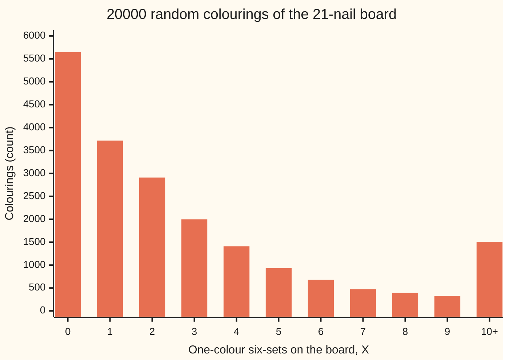
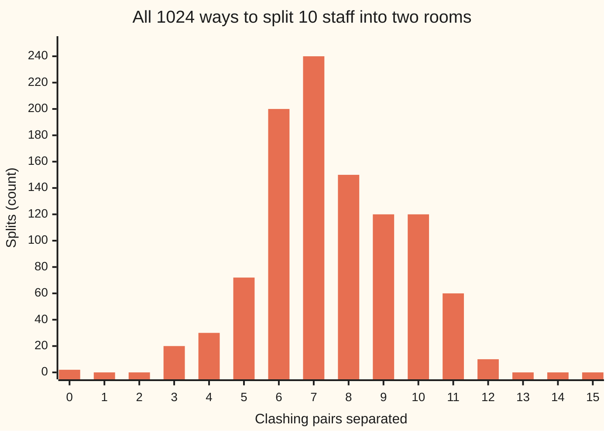

# The probabilistic method: proving something exists by showing a random choice works

[Syllabus](../../../SYLLABUS.md) → [Probability and statistics](../README.md) → [Random Graphs and the Probabilistic Method](../README.md#s14) → The probabilistic method

---

## General Overview

A string-art board has 21 nails. Every pair of nails is joined by a thread, red or blue: 210 threads. The maker wants no 6 nails whose 15 threads between them are all one colour. Is there a way to colour the threads so that no such six-set appears?

Checking every colouring is hopeless: there are 2^210 of them. So flip a fair coin for each thread instead, and ask how many one-colour six-sets (sets of 6 nails) the result holds on average. There are 54264 six-sets. Each is one colour with chance 2^-14, since its 15 threads must all agree. Add those chances: on average a random colouring holds 3.3120 one-colour six-sets.

An average of 3.3120 cannot sit above every colouring's count. Some colouring holds 3 or fewer. Pull out one nail from each of those bad six-sets and at least 18 nails remain, with no one-colour six-set among them. The argument names no colouring, yet one exists. The same average, used on 10 staff with 15 clashing pairs, proves that some split into two rooms separates at least half of the clashing pairs.

This is the **probabilistic method**: set up a random choice, compute an average, and read off that some choice does at least as well as the average. From here on the word for that average is the **expectation**.

**Pick at random, compute the expectation of what is being counted, and conclude that some choice does at least as well as the expectation; no single good choice is ever named.**

**What kind of fact this is:** a method; the averaging principle behind it and each bound it yields here are theorems, proved on this card in Why it works.

### The picture: how many one-colour six-sets a random board holds



Bars: a seeded simulation of 20000 colourings. Their average is 3.2517 with a standard error (the typical size of the simulation's own error) of 0.0368; the exact expectation is 3.3120. The average sits right of the tall bars because a few colourings, lopsided towards one colour, hold dozens: the largest seen held 117. Whatever the shape, some bar must sit at or left of the average.

---

## The formula

Notation first, in words, with reminders. $P(A)$ is the chance of event A. $E[X]$ is the expectation of a random count $X$, read "the average value of X in the long run" ([Expectation](../02-Random%20Variables/02-expectation.md)). C(n, k), read "n choose k", counts the ways to pick k things from n. $K(n)$ is n dots with every pair joined, and $R(k,k)$ is the smallest n at which every two-colouring of $K(n)$ has a one-colour set of k dots ([Ramsey numbers](../../04-Combinatorics%20and%20graphs/14-Ramsey%20and%20Extremal%2C%20in%20Outline/02-ramsey-numbers.md)). A set of dots all joined in one colour is a one-colour **clique**.

The method rests on one fact about averages:

$$\text{some outcome has } X \le E[X], \quad\text{and some outcome has } X \ge E[X]$$

**Read it aloud:** a random count takes, in at least one outcome, a value no bigger than its average, and in at least one outcome a value no smaller.

For the board, $X$ counts the one-colour k-sets when every thread is a fair coin flip:

$$E[X] \;=\; C(n,k)\;\cdot\;2^{\,1 - C(k,2)}$$

**Read it aloud:** the number of k-sets, times the chance that one of them has all its C(k, 2) threads the same colour.

The **deletion** step turns that average into a bound, and $\lfloor E[X] \rfloor$, read "the floor of E[X]", is its whole-number part:

$$R(k,k) \;>\; n - \lfloor E[X] \rfloor \qquad\text{for every board size } n\text{, with } E[X] \text{ taken on } n \text{ nails}$$

**Read it aloud:** some colouring has at most the whole-number part of E[X] bad sets; remove one nail from each, and what is left is clean.

For staff with $m$ clashing pairs, each sent to one of two rooms by a coin flip:

$$E[\text{pairs separated}] \;=\; \frac{m}{2}$$

**Read it aloud:** each clashing pair is split between the rooms with chance one half, so on average half the pairs are.

| Symbol | Plain meaning | In our example | Push it up and the answer… |
| --- | --- | --- | --- |
| $n$ | nails on the board | 21 | more six-sets, so E[X] rises fast |
| $k$ | size of the one-colour set to avoid | 6 | far fewer bad sets: each needs more threads to agree |
| $K(n)$ | n nails, every pair joined by a thread | K(21), 210 threads | — |
| C(n, k) | k-sets among n nails | C(21, 6) = 54264 | — |
| C(k, 2) | threads inside one k-set | 15 | chance per set halves with each thread |
| $S$, $I_S$ | one k-set, and its indicator: 1 if one colour, else 0 | $P(I_S = 1)$ = 2^-14 | — |
| $X$ | one-colour k-sets on a random board | average 3.3120 | — |
| $E[X]$ | the expectation of X | 3.3120 | fewer nails survive deletion |
| $\lfloor E[X] \rfloor$ | the whole-number part of E[X] | 3 | — |
| $R(k,k)$ | smallest board forcing a one-colour k-set | more than 18 | — |
| $P(A)$ | the chance of event A | — | — |
| $m$ | clashing pairs among the staff | 15 | the guaranteed split grows by one half per pair |
| $y$ | in the 1/e proof: e n divided by k 2^((k − 1)/2), so that E[X] is at most 2y^k | — | E[X]'s ceiling grows as its k-th power |
| $\varepsilon$ | in the 1/e proof: a small positive number, read "epsilon", by which the board falls short of the target size | — | the bound proved is smaller |

### When it holds

- **A well-defined average.** The averaging fact needs $E[X]$ to exist. On a finite board it always does: 2^210 colourings, each with a count.
- **The chance per set must be right.** The 2^-14 uses fair, independent coins inside one six-set. Colour every thread by one shared coin and each six-set is one colour with chance 1, not 2^-14.
- **No independence between sets is needed.** Six-sets share threads, so their events are tangled; the expectation of a sum is the sum of expectations anyway. A product of chances, by contrast, does need independence, and fails here (What breaks).
- **Existence, not construction.** The method names no colouring. Finding one is a separate problem; for large k, even checking a single colouring means testing astronomically many sets.

---

## Why it works

### Step 0: an average cannot beat everything it averages

An average is a weighted mix of values. A mix cannot be larger than every ingredient, nor smaller than every ingredient. That is the whole engine. The rest of the card chooses what to average.

### Step 1: the averaging principle, proved

Let $X$ take whole-number values on finitely many outcomes. By definition $E[X]$ is the sum of each value times its chance. Suppose every outcome had $X$ strictly above $E[X]$. Then each term exceeds $E[X]$ times its chance, and the chances add to 1, so the sum exceeds $E[X]$: the average would be larger than itself. So some outcome has $X \le E[X]$. Swap the inequality for the other half.

### Step 2: the expectation of X, by adding indicators

For each six-set $S$, let $I_S$ be 1 when all 15 of its threads share a colour and 0 otherwise. A 0-or-1 count of this kind is an **indicator**, and its expectation is the chance that it reads 1. All red has chance 2^-15, all blue the same, so $P(I_S = 1)$ = 2^-14.

$X$ is the sum of the 54264 indicators. Expectations of sums add, even when the pieces are dependent, as the expectation card proves. So:

$$E[X] \;=\; 54264 \times 2^{-14} \;=\; 3.3120$$

Two six-sets sharing four nails share six threads; their indicators are strongly tied. Linearity does not care.

### Step 3: when the expectation is below 1

$X$ is a whole number, never negative. If $E[X] < 1$, Step 1 gives an outcome with $X < 1$, so $X = 0$: a clean colouring. This is the counting card's argument in the language of chance ([Erdos's counting trick](../../04-Combinatorics%20and%20graphs/14-Ramsey%20and%20Extremal%2C%20in%20Outline/03-probabilistic-method-by-counting.md)): the largest six-set board it clears is 17 nails, so R(6,6) > 17. Markov's inequality ([Markov and Chebyshev](../02-Random%20Variables/08-markov-and-chebyshev-inequalities.md)) adds a little: the chance of a clean colouring is at least 1 − E[X].

### Step 4: when it is not, delete

At 21 nails $E[X]$ = 3.3120, well over 1, and the counting argument stops. The expectation keeps going. Step 1 gives a colouring with $X \le 3.3120$, so $X \le 3$. Each bad six-set loses one of its nails. Removing a nail destroys every six-set containing it and creates none. At most 3 nails go, at least 18 stay, and no one-colour six-set remains among them. So R(6,6) > 18, one better than the counting argument.

The same holds at every board size $n$: a colouring with at most $\lfloor E[X] \rfloor$ bad sets exists, and deleting a nail per set leaves $n - \lfloor E[X] \rfloor$ clean nails. Scanning $n$ from 17 to 23 gives 17, 17, 18, 18, 18, 18, 17: the best is 18.

For large k the gain grows. As k grows, the counting argument gives R(k,k) near $k\,2^{k/2}$ times 0.2601; deletion gives it times 0.3679, which is 1/e. The ratio between them heads to the square root of 2, 1.4142.

<details>
<summary>Detailed proof: where 1/e comes from</summary>

Every k satisfies $k! \ge (k/e)^k$, because the series for $e^k$ holds the term $k^k/k!$ and all its terms are positive. With C(n, k) ≤ n^k / k!:
$$E[X] \;\le\; 2\,\frac{n^k}{k!}\,2^{-k(k-1)/2} \;\le\; 2\left(\frac{e\,n}{k\,2^{(k-1)/2}}\right)^{k} \;=\; 2\,y^k, \qquad y = \frac{e\,n}{k\,2^{(k-1)/2}}.$$

**Counting alone** needs $2y^k < 1$, so y just under 1: n just under $\frac{k}{e}\,2^{(k-1)/2}$, which is $\frac{1}{e\sqrt2}\,k\,2^{k/2}$.

**Deletion** allows y larger. Fix a small positive ε and take $y = \sqrt2\,(1-\varepsilon)$, so $n = \frac{1-\varepsilon}{e}\,k\,2^{k/2}$. Then $E[X] \le 2\cdot 2^{k/2}(1-\varepsilon)^k$. Divided by n, that is $2e(1-\varepsilon)^k/((1-\varepsilon)k)$, which shrinks to 0 as k grows. So the deletion bound $n - E[X]$ is $n$ times a factor tending to 1:
$$R(k,k) \;>\; (1 - \varepsilon - \text{a term tending to } 0)\;\frac{1}{e}\,k\,2^{k/2}.$$
The two constants differ by exactly the factor √2 in y. ∎

</details>

### Step 5: a large cut, by the same average

An office has 10 staff and 15 pairs who clash. Two rooms are free. Put each person in a room by a fair coin flip. A clashing pair is separated when its two coins differ: chance one half. Let $X$ now count separated pairs; by linearity $E[X]$ = 15/2 = 7.50. By Step 1 some split separates at least 7.50 pairs, so at least 8.

The rule holds for any network: a graph with $m$ edges (lines joining dots) has a **cut**, a split of the dots into two groups, crossed by at least $m/2$ edges. Nothing about the network's shape was used.

A different route to existence with dependent bad events is the Lovász local lemma, which gains another factor of about 1.4142 on Ramsey bounds (Spencer, in Sources). When $E[X]$ is large, the question flips to whether $X$ is above 0 for most choices, which needs the variance: [First and second moments](04-first-and-second-moment-methods.md).

---

## Worked numbers, by hand

| Step | Arithmetic | Value |
| --- | --- | --- |
| threads on the board | C(21, 2) | 210 |
| six-sets | C(21, 6) | 54264 |
| threads inside one six-set | C(6, 2) | 15 |
| chance one six-set is one colour | 2 × 2^-15 | 2^-14 |
| expected one-colour six-sets | 54264 × 2 / 2^15 | 3.3120 |
| some colouring holds at most | whole number ≤ 3.3120 | 3 |
| nails left after deleting one per bad set | 21 − 3 | **18** |
| counting argument alone | largest n with E[X] < 1 | 17 |
| office: expected separated clashes | 15 / 2 | 7.50 |
| some split separates at least | whole number ≥ 7.50 | **8** |

So some 18-nail board has no six nails joined all in one colour, and some office split keeps at least 8 of the 15 clashing pairs apart. The code finds both: a sampled colouring with exactly 3 bad sets, pruned to 18 clean nails, and, by listing all 1024 splits, the best split, which separates 12.

### The small board, every colouring

On K(6), with 15 threads and 32768 colourings, the average can be taken over everything:

| Clique size | Formula E[X] | Average over all 32768 | Colourings with X = 0 |
| --- | --- | --- | --- |
| k = 4 | 15 × 2^-5 = 0.46875 | 0.46875 | 22484 |
| k = 3 | 20 × 2^-2 = 5.00 | 5.00 | none: the fewest is 2 |

### The office, every split



Bars: every split, counted. The clash network is the Petersen graph (a ring of five, a five-pointed star inside it, and five spokes). The average is exactly 7.50; 460 splits reach 8 or more, and the best, 10 splits, reach 12.

### What breaks if you drop a piece

| Mistake | Comes out at | What went wrong |
| --- | --- | --- |
| Drop "E[X] below 1": K(6), avoiding one-colour triangles | average 5.00; the fewest in all 32768 colourings is 2 | An average above 1 promises nothing about a zero; no colouring of K(6) is clean |
| Multiply the 54264 chances as if independent | chance of a clean 21-nail board 0.0364; simulated 0.2826, standard error 0.0032 | Six-sets share threads; adding expectations needs no independence, a product does |
| Read the average as a floor for every split | "every split separates 7.5"; the worst separates 0, and 564 of 1024 fall below 7.50 | Averaging promises one outcome at or above the mean, not all |

---

## Code, from first principles, and it actually runs

Three roads reach the expectation: the formula, an exact average over all 32768 colourings of K(6), and a seeded simulation of 20000 colourings of the 21-nail board, printed with its standard error. The simulation keeps the first colouring with exactly 3 bad sets, deletes a nail from each, and checks the 18 survivors by testing every six-subset directly, a count that shares no code with the one that found the bad sets. The same formula then runs in logarithms to tabulate both Ramsey bounds up to k = 40. Last, all 1024 office splits are listed and 100000 random ones simulated. Random numbers come from SplitMix64, written out, so both languages draw the same ones.

### Python

```python
# The probabilistic method -- the check behind the card.  Standard library only;
# math supplies logarithms and square roots, nothing else.  A string-art board
# has 21 nails, every pair joined by a red or a blue thread.  Colour each thread
# by a fair coin; X counts the 6-nail sets whose 15 threads are all one colour.
# E[X] is reached three ways: the formula, an average over every colouring of a
# small board, and a seeded simulation.  Then a deletion certificate, a table of
# bounds, and the office split (a large cut) on 10 staff with 15 clashes.
import math
M64 = (1 << 64) - 1
class SplitMix64:                               # the random numbers, written out here
    def __init__(self, seed): self.s = seed
    def next(self):
        self.s = (self.s + 0x9E3779B97F4A7C15) & M64
        z = self.s
        z = ((z ^ (z >> 30)) * 0xBF58476D1CE4E5B9) & M64
        z = ((z ^ (z >> 27)) * 0x94D049BB133111EB) & M64
        return z ^ (z >> 31)
def choose(n, k):                               # falling product over k!, exact
    out = 1
    for i in range(k): out = out * (n - i) // (i + 1)
    return out
def expect(n, k): return choose(n, k) * 2 / 2 ** choose(k, 2)   # road one: the formula
def log_expect(n, k):                           # the same in logarithms, for huge boards
    return math.log(2) * (1 - k * (k - 1) / 2) + sum(math.log(n - i) - math.log(i + 1) for i in range(k))
def colouring(rng, n):                          # adj[c][v]: nails joined to v in colour c
    adj = [[0] * n, [0] * n]
    for i in range(n):
        for j in range(i + 1, n):
            c = rng.next() >> 63
            adj[c][i] |= 1 << j; adj[c][j] |= 1 << i
    return adj
def cliques(adj, k, cand, size=0, found=None, path=()):   # grow one-colour sets nail by nail
    if size == k: found.append(path); return
    while cand:
        v = cand.bit_length() - 1; cand &= ~(1 << v)
        cliques(adj, k, cand & adj[v], size + 1, found, path + (v,))
def bad_sets(adj, n, k):
    found = []
    for c in (0, 1): cliques(adj[c], k, (1 << n) - 1, 0, found)
    return found
def brute_bad(adj, nails, k):                   # road two: test every k-subset directly
    bad = 0
    for s in range(1 << len(nails)):
        if bin(s).count("1") != k: continue
        mask = sum(1 << nails[i] for i in range(len(nails)) if s >> i & 1)
        bad += any(all((adj[c][v] | 1 << v) & mask == mask for v in nails if mask >> v & 1) for c in (0, 1))
    return bad
def every_colouring(n, ks):                     # every colouring of K(n): counts of one-colour k-sets
    pairs = [(i, j) for i in range(n) for j in range(i + 1, n)]
    masks = {k: [sum(1 << e for e, (i, j) in enumerate(pairs) if s >> i & 1 and s >> j & 1)
                 for s in range(1 << n) if bin(s).count("1") == k] for k in ks}
    return [[sum(1 for m in masks[k] if c & m in (0, m)) for c in range(1 << len(pairs))] for k in ks]

N, K, RUNS = 21, 6, 20000
e21 = expect(N, K)
print(f"board: {N} nails, {choose(N, 2)} threads, {choose(N, K)} six-sets, {choose(K, 2)} threads each")
print(f"E[X] = {choose(N, K)} x 2 / 2^{choose(K, 2)} = {e21:.4f}; in logs {math.exp(log_expect(N, K)):.4f}")
x3, x4 = every_colouring(6, (3, 4))             # the small board K(6), all 32768 colourings
print(f"K(6), k = 4, every colouring: average {sum(x4) / len(x4):.5f}, formula {expect(6, 4):.5f}, "
      f"{x4.count(0)} of {len(x4)} have none")
print(f"K(6), k = 3, every colouring: average {sum(x3) / len(x3):.2f}, formula {expect(6, 3):.2f}, fewest {min(x3)}")
rng, tot, tot2, hist, first, top = SplitMix64(2026), 0, 0, [0] * 11, None, 0
for r in range(RUNS):                           # road three: seeded simulation
    adj = colouring(rng, N)
    found = bad_sets(adj, N, K)
    x = len(found); tot += x; tot2 += x * x; hist[min(x, 10)] += 1; top = max(top, x)
    if first is None and x == int(e21): first = (r, adj, found)   # the worst the average allows
mean = tot / RUNS; se = math.sqrt((tot2 / RUNS - mean ** 2) / RUNS)
print(f"simulated, {RUNS} colourings, seed 2026: mean X = {mean:.4f}, standard error {se:.4f}")
print(f"histogram of X (0 to 9, then 10 or more): {hist}")
p0 = hist[0] / RUNS; p3 = sum(hist[:4]) / RUNS
print(f"share with X = 0: {p0:.4f} (se {math.sqrt(p0 * (1 - p0) / RUNS):.4f}); share with X <= 3: {p3:.4f}")
print(f"mistake, independence product (1 - 2^-14)^{choose(N, K)} = {(1 - 2 ** -14) ** choose(N, K):.4f}; largest X seen {top}")
r, adj, found = first
gone = sorted({max(s) for s in found})
left = [v for v in range(N) if v not in gone]
print(f"colouring no. {r + 1} has X = {len(found)}: {[sorted(s) for s in found]}")
print(f"delete nails {gone}: {len(left)} nails left, one-colour six-sets among them by brute force: {brute_bad(adj, left, K)}")
dl = [(n - math.floor(expect(n, K)), n) for n in range(K, 30)]
print(f"n - floor(E[X]) for n = 17 to 23: {[d for d, n in dl if 17 <= n <= 23]}")
def plain(k):                                   # largest n with E[X] < 1, by halving an interval
    lo, hi = k, 2 * k
    while log_expect(hi, k) < 0: hi *= 2
    while hi - lo > 1:
        mid = (lo + hi) // 2
        if log_expect(mid, k) < 0: lo = mid
        else: hi = mid
    return lo
def deletion(k):                                # max of n - floor(E[X]); E grows faster, so one peak
    lo, hi = k, 2 * k
    while math.exp(log_expect(hi + 1, k)) - math.exp(log_expect(hi, k)) < 1: hi *= 2
    while hi - lo > 1:
        mid = (lo + hi) // 2
        if math.exp(log_expect(mid + 1, k)) - math.exp(log_expect(mid, k)) < 1: lo = mid
        else: hi = mid
    return max(n - math.floor(math.exp(log_expect(n, k))) for n in range(max(k, lo - 3), lo + 4))
print("k, plain (E < 1), deletion, deletion / plain, plain / (k 2^(k/2)), deletion / (k 2^(k/2)):")
table = []
for k in (6, 8, 10, 12, 16, 20, 30, 40):
    p, d = plain(k), deletion(k); s = k * 2 ** (k / 2); table.append((k, p, d))
    print(f"  {k:>2} {p:>9} {d:>9}   {d / p:.4f}   {p / s:.4f}   {d / s:.4f}")
print(f"limits: 1/(e sqrt 2) = {1 / (math.e * math.sqrt(2)):.4f}, 1/e = {1 / math.e:.4f}, sqrt 2 = {math.sqrt(2):.4f}")
# the office split: 10 staff, 15 clashing pairs (the Petersen graph), two rooms
EDGES = [(i, (i + 1) % 5) for i in range(5)] + [(i, i + 5) for i in range(5)] + [(5 + i, 5 + (i + 2) % 5) for i in range(5)]
cut = [sum(1 for a, b in EDGES if (s >> a ^ s >> b) & 1) for s in range(1 << 10)]
dist = [cut.count(c) for c in range(16)]
print(f"office: 10 staff, {len(EDGES)} clashes, formula E[cut] = {len(EDGES) / 2:.2f}")
print(f"every one of 1024 splits: average {sum(cut) / 1024:.2f}, best {max(cut)}, worst {min(cut)}")
print(f"splits separating c clashes, c = 0 to 15: {dist}")
print(f"splits at 8 or more: {sum(dist[8:])}; below the average: {sum(dist[:8])}")
rng2, t, t2, R2 = SplitMix64(7), 0, 0, 100000
for _ in range(R2):
    s = rng2.next() >> 54                      # ten fair coins, one per person
    c = sum(1 for a, b in EDGES if (s >> a ^ s >> b) & 1); t += c; t2 += c * c
m2 = t / R2; se2 = math.sqrt((t2 / R2 - m2 ** 2) / R2)
print(f"simulated, {R2} random splits, seed 7: mean {m2:.4f}, standard error {se2:.4f}")
assert abs(math.exp(log_expect(N, K)) - e21) < 1e-9
assert abs(sum(x4) / len(x4) - expect(6, 4)) < 1e-12 and abs(sum(x3) / len(x3) - expect(6, 3)) < 1e-12
assert abs(mean - e21) < 4 * se and abs(m2 - len(EDGES) / 2) < 4 * se2
assert len(left) >= 18 and brute_bad(adj, left, K) == 0
assert min(x3) > 0 and x4.count(0) > 0 and max(cut) >= 8 and sum(cut) * 2 == len(EDGES) * 1024
assert [p for k, p, d in table if k == 10] == [100] and all(d > p for k, p, d in table if k >= 8)
print("ALL CHECKS PASS")
```

**Ran 2026-09-29 on macOS, Python 3.14.6, standard library only. All checks passed. Output, pasted from the run:**

```
board: 21 nails, 210 threads, 54264 six-sets, 15 threads each
E[X] = 54264 x 2 / 2^15 = 3.3120; in logs 3.3120
K(6), k = 4, every colouring: average 0.46875, formula 0.46875, 22484 of 32768 have none
K(6), k = 3, every colouring: average 5.00, formula 5.00, fewest 2
simulated, 20000 colourings, seed 2026: mean X = 3.2517, standard error 0.0368
histogram of X (0 to 9, then 10 or more): [5651, 3716, 2911, 1999, 1410, 933, 678, 474, 394, 324, 1510]
share with X = 0: 0.2826 (se 0.0032); share with X <= 3: 0.7138
mistake, independence product (1 - 2^-14)^54264 = 0.0364; largest X seen 117
colouring no. 4 has X = 3: [[1, 5, 12, 14, 18, 20], [0, 1, 7, 8, 12, 18], [2, 5, 10, 11, 16, 17]]
delete nails [17, 18, 20]: 18 nails left, one-colour six-sets among them by brute force: 0
n - floor(E[X]) for n = 17 to 23: [17, 17, 18, 18, 18, 18, 17]
k, plain (E < 1), deletion, deletion / plain, plain / (k 2^(k/2)), deletion / (k 2^(k/2)):
   6        17        18   1.0588   0.3542   0.3750
   8        42        47   1.1190   0.3281   0.3672
  10       100       116   1.1600   0.3125   0.3625
  12       231       276   1.1948   0.3008   0.3594
  16      1186      1480   1.2479   0.2896   0.3613
  20      5817      7447   1.2802   0.2840   0.3636
  30    272717    360983   1.3237   0.2774   0.3672
  40  11490820  15463636   1.3457   0.2740   0.3687
limits: 1/(e sqrt 2) = 0.2601, 1/e = 0.3679, sqrt 2 = 1.4142
office: 10 staff, 15 clashes, formula E[cut] = 7.50
every one of 1024 splits: average 7.50, best 12, worst 0
splits separating c clashes, c = 0 to 15: [2, 0, 0, 20, 30, 72, 200, 240, 150, 120, 120, 60, 10, 0, 0, 0]
splits at 8 or more: 460; below the average: 564
simulated, 100000 random splits, seed 7: mean 7.5078, standard error 0.0061
ALL CHECKS PASS
```

### Rust

Same numbers, same labels, built with `rustc --edition 2021 -O`.

```rust
// The probabilistic method -- the same check as the Python, in Rust, std only, no
// crates.  A string-art board has 21 nails, every pair joined by a red or a blue
// thread.  Colour each thread by a fair coin; X counts the 6-nail sets whose 15
// threads are all one colour.  E[X] is reached three ways: the formula, an average
// over every colouring of a small board, and a seeded simulation.  Then a deletion
// certificate, a table of bounds, and the office split (a large cut).
struct SplitMix64 { s: u64 }
impl SplitMix64 {                               // the random numbers, written out here
    fn next(&mut self) -> u64 {
        self.s = self.s.wrapping_add(0x9E3779B97F4A7C15);
        let mut z = self.s;
        z = (z ^ (z >> 30)).wrapping_mul(0xBF58476D1CE4E5B9);
        z = (z ^ (z >> 27)).wrapping_mul(0x94D049BB133111EB);
        z ^ (z >> 31)
    }
}
fn choose(n: u64, k: u64) -> u64 { (0..k).fold(1, |out, i| out * (n - i) / (i + 1)) }
fn expect(n: u64, k: u64) -> f64 {             // road one: the formula
    (choose(n, k) * 2) as f64 / (1u64 << choose(k, 2)) as f64
}
fn log_expect(n: u64, k: u64) -> f64 {         // the same in logarithms, for huge boards
    let kf = k as f64;
    2f64.ln() * (1.0 - kf * (kf - 1.0) / 2.0)
        + (0..k).fold(0.0, |acc, i| acc + (((n - i) as f64).ln() - ((i + 1) as f64).ln()))
}
type Adj = [Vec<u32>; 2];                      // adj[c][v]: nails joined to v in colour c
fn colouring(rng: &mut SplitMix64, n: usize) -> Adj {
    let mut adj: Adj = [vec![0; n], vec![0; n]];
    for i in 0..n {
        for j in i + 1..n {
            let c = (rng.next() >> 63) as usize;
            adj[c][i] |= 1 << j; adj[c][j] |= 1 << i;
        }
    }
    adj
}
fn cliques(adj: &[u32], k: usize, mut cand: u32, path: &mut Vec<usize>, found: &mut Vec<Vec<usize>>) {
    if path.len() == k { found.push(path.clone()); return }   // grow one-colour sets nail by nail
    while cand != 0 {
        let v = 31 - cand.leading_zeros() as usize; cand &= !(1 << v);
        path.push(v); cliques(adj, k, cand & adj[v], path, found); path.pop();
    }
}
fn bad_sets(adj: &Adj, n: usize, k: usize) -> Vec<Vec<usize>> {
    let mut found = Vec::new();
    for c in 0..2 { cliques(&adj[c], k, (1u32 << n) - 1, &mut Vec::new(), &mut found) }
    found
}
fn brute_bad(adj: &Adj, nails: &[usize], k: u32) -> u32 {      // road two: test every k-subset directly
    let mut bad = 0;
    for s in 0u32..1 << nails.len() {
        if s.count_ones() != k { continue }
        let mask: u32 = (0..nails.len()).filter(|&i| s >> i & 1 == 1).map(|i| 1 << nails[i]).sum();
        let one = |c: usize| nails.iter().filter(|&&v| mask >> v & 1 == 1).all(|&v| (adj[c][v] | 1 << v) & mask == mask);
        if one(0) || one(1) { bad += 1 }
    }
    bad
}
fn every_colouring(n: u32, k: u32) -> Vec<u64> {   // every colouring of K(n): count of one-colour k-sets
    let mut pairs = Vec::new();
    for i in 0..n { for j in i + 1..n { pairs.push((i, j)) } }
    let masks: Vec<u64> = (0u32..1 << n).filter(|s| s.count_ones() == k).map(|s| {
        pairs.iter().enumerate().filter(|(_, &(i, j))| s >> i & 1 == 1 && s >> j & 1 == 1).fold(0u64, |m, (e, _)| m | 1 << e)
    }).collect();
    (0u64..1 << pairs.len()).map(|c| masks.iter().filter(|&&m| c & m == 0 || c & m == m).count() as u64).collect()
}
fn plain(k: u64) -> u64 {                      // largest n with E[X] < 1, by halving an interval
    let (mut lo, mut hi) = (k, 2 * k);
    while log_expect(hi, k) < 0.0 { hi *= 2 }
    while hi - lo > 1 { let mid = (lo + hi) / 2; if log_expect(mid, k) < 0.0 { lo = mid } else { hi = mid } }
    lo
}
fn deletion(k: u64) -> u64 {                   // max of n - floor(E[X]); E grows faster, so one peak
    let step = |n: u64| log_expect(n + 1, k).exp() - log_expect(n, k).exp();
    let (mut lo, mut hi) = (k, 2 * k);
    while step(hi) < 1.0 { hi *= 2 }
    while hi - lo > 1 { let mid = (lo + hi) / 2; if step(mid) < 1.0 { lo = mid } else { hi = mid } }
    (k.max(lo - 3)..lo + 4).map(|n| n - log_expect(n, k).exp().floor() as u64).max().unwrap()
}
fn main() {
    const N: usize = 21; const K: usize = 6; const RUNS: usize = 20000;
    let e21 = expect(N as u64, K as u64);
    println!("board: {} nails, {} threads, {} six-sets, {} threads each", N, choose(N as u64, 2), choose(N as u64, K as u64), choose(K as u64, 2));
    println!("E[X] = {} x 2 / 2^{} = {:.4}; in logs {:.4}", choose(N as u64, K as u64), choose(K as u64, 2), e21, log_expect(N as u64, K as u64).exp());
    let (x3, x4) = (every_colouring(6, 3), every_colouring(6, 4));   // the small board K(6), all 32768 colourings
    let avg = |x: &Vec<u64>| x.iter().sum::<u64>() as f64 / x.len() as f64;
    let zeros4 = x4.iter().filter(|&&x| x == 0).count();
    let fewest3 = *x3.iter().min().unwrap();
    println!("K(6), k = 4, every colouring: average {:.5}, formula {:.5}, {} of {} have none", avg(&x4), expect(6, 4), zeros4, x4.len());
    println!("K(6), k = 3, every colouring: average {:.2}, formula {:.2}, fewest {}", avg(&x3), expect(6, 3), fewest3);
    let mut rng = SplitMix64 { s: 2026 };
    let (mut tot, mut tot2, mut hist, mut top) = (0u64, 0u64, vec![0u64; 11], 0usize);
    let mut first: Option<(usize, Adj, Vec<Vec<usize>>)> = None;
    for r in 0..RUNS {                          // road three: seeded simulation
        let adj = colouring(&mut rng, N);
        let found = bad_sets(&adj, N, K);
        let x = found.len();
        tot += x as u64; tot2 += (x * x) as u64; hist[x.min(10)] += 1; top = top.max(x);
        if first.is_none() && x == e21 as usize { first = Some((r, adj, found)) }   // the worst the average allows
    }
    let mean = tot as f64 / RUNS as f64;
    let se = ((tot2 as f64 / RUNS as f64 - mean * mean) / RUNS as f64).sqrt();
    println!("simulated, {} colourings, seed 2026: mean X = {:.4}, standard error {:.4}", RUNS, mean, se);
    println!("histogram of X (0 to 9, then 10 or more): {:?}", hist);
    let p0 = hist[0] as f64 / RUNS as f64;
    let p3 = hist[..4].iter().sum::<u64>() as f64 / RUNS as f64;
    println!("share with X = 0: {:.4} (se {:.4}); share with X <= 3: {:.4}", p0, (p0 * (1.0 - p0) / RUNS as f64).sqrt(), p3);
    println!("mistake, independence product (1 - 2^-14)^{} = {:.4}; largest X seen {}", choose(N as u64, K as u64),
        (1.0 - 2f64.powi(-14)).powi(choose(N as u64, K as u64) as i32), top);
    let (r, adj, found) = first.unwrap();
    let mut gone: Vec<usize> = found.iter().map(|s| *s.iter().max().unwrap()).collect();
    gone.sort(); gone.dedup();
    let left: Vec<usize> = (0..N).filter(|v| !gone.contains(v)).collect();
    let shown: Vec<Vec<usize>> = found.iter().map(|s| { let mut t = s.clone(); t.sort(); t }).collect();
    println!("colouring no. {} has X = {}: {:?}", r + 1, found.len(), shown);
    let left_bad = brute_bad(&adj, &left, K as u32);
    println!("delete nails {:?}: {} nails left, one-colour six-sets among them by brute force: {}", gone, left.len(), left_bad);
    let dl: Vec<u64> = (17..24).map(|n| n - expect(n, K as u64).floor() as u64).collect();
    println!("n - floor(E[X]) for n = 17 to 23: {:?}", dl);
    println!("k, plain (E < 1), deletion, deletion / plain, plain / (k 2^(k/2)), deletion / (k 2^(k/2)):");
    let mut table = Vec::new();
    for k in [6u64, 8, 10, 12, 16, 20, 30, 40] {
        let (p, d) = (plain(k), deletion(k));
        let s = k as f64 * 2f64.powf(k as f64 / 2.0);
        table.push((k, p, d));
        println!("  {:>2} {:>9} {:>9}   {:.4}   {:.4}   {:.4}", k, p, d, d as f64 / p as f64, p as f64 / s, d as f64 / s);
    }
    let e = std::f64::consts::E;
    println!("limits: 1/(e sqrt 2) = {:.4}, 1/e = {:.4}, sqrt 2 = {:.4}", 1.0 / (e * 2f64.sqrt()), 1.0 / e, 2f64.sqrt());
    // the office split: 10 staff, 15 clashing pairs (the Petersen graph), two rooms
    let mut edges = Vec::new();
    for i in 0..5u32 { edges.push((i, (i + 1) % 5)) }
    for i in 0..5u32 { edges.push((i, i + 5)) }
    for i in 0..5u32 { edges.push((5 + i, 5 + (i + 2) % 5)) }
    let cut_of = |s: u64| edges.iter().filter(|&&(a, b)| (s >> a ^ s >> b) & 1 == 1).count();
    let cut: Vec<usize> = (0..1024u64).map(|s| cut_of(s)).collect();
    let dist: Vec<usize> = (0..16).map(|c| cut.iter().filter(|&&x| x == c).count()).collect();
    let (best, worst, total) = (*cut.iter().max().unwrap(), *cut.iter().min().unwrap(), cut.iter().sum::<usize>());
    println!("office: 10 staff, {} clashes, formula E[cut] = {:.2}", edges.len(), edges.len() as f64 / 2.0);
    println!("every one of 1024 splits: average {:.2}, best {}, worst {}", total as f64 / 1024.0, best, worst);
    println!("splits separating c clashes, c = 0 to 15: {:?}", dist);
    println!("splits at 8 or more: {}; below the average: {}", dist[8..].iter().sum::<usize>(), dist[..8].iter().sum::<usize>());
    let (mut rng2, mut t, mut t2, r2) = (SplitMix64 { s: 7 }, 0u64, 0u64, 100000u64);
    for _ in 0..r2 {
        let c = cut_of(rng2.next() >> 54) as u64;  // ten fair coins, one per person
        t += c; t2 += c * c;
    }
    let m2 = t as f64 / r2 as f64;
    let se2 = ((t2 as f64 / r2 as f64 - m2 * m2) / r2 as f64).sqrt();
    println!("simulated, {} random splits, seed 7: mean {:.4}, standard error {:.4}", r2, m2, se2);
    assert!((log_expect(N as u64, K as u64).exp() - e21).abs() < 1e-9);
    assert!((avg(&x4) - expect(6, 4)).abs() < 1e-12 && (avg(&x3) - expect(6, 3)).abs() < 1e-12);
    assert!((mean - e21).abs() < 4.0 * se && (m2 - edges.len() as f64 / 2.0).abs() < 4.0 * se2);
    assert!(left.len() >= 18 && left_bad == 0);
    assert!(fewest3 > 0 && zeros4 > 0 && best >= 8 && total * 2 == edges.len() * 1024);
    assert!(table.iter().filter(|t| t.0 == 10).all(|t| t.1 == 100) && table.iter().filter(|t| t.0 >= 8).all(|t| t.2 > t.1));
    println!("ALL CHECKS PASS");
}
```

**Ran 2026-09-29 on macOS, rustc 1.98.1, no crates. All checks passed. Output, pasted from the run:**

```
board: 21 nails, 210 threads, 54264 six-sets, 15 threads each
E[X] = 54264 x 2 / 2^15 = 3.3120; in logs 3.3120
K(6), k = 4, every colouring: average 0.46875, formula 0.46875, 22484 of 32768 have none
K(6), k = 3, every colouring: average 5.00, formula 5.00, fewest 2
simulated, 20000 colourings, seed 2026: mean X = 3.2517, standard error 0.0368
histogram of X (0 to 9, then 10 or more): [5651, 3716, 2911, 1999, 1410, 933, 678, 474, 394, 324, 1510]
share with X = 0: 0.2826 (se 0.0032); share with X <= 3: 0.7138
mistake, independence product (1 - 2^-14)^54264 = 0.0364; largest X seen 117
colouring no. 4 has X = 3: [[1, 5, 12, 14, 18, 20], [0, 1, 7, 8, 12, 18], [2, 5, 10, 11, 16, 17]]
delete nails [17, 18, 20]: 18 nails left, one-colour six-sets among them by brute force: 0
n - floor(E[X]) for n = 17 to 23: [17, 17, 18, 18, 18, 18, 17]
k, plain (E < 1), deletion, deletion / plain, plain / (k 2^(k/2)), deletion / (k 2^(k/2)):
   6        17        18   1.0588   0.3542   0.3750
   8        42        47   1.1190   0.3281   0.3672
  10       100       116   1.1600   0.3125   0.3625
  12       231       276   1.1948   0.3008   0.3594
  16      1186      1480   1.2479   0.2896   0.3613
  20      5817      7447   1.2802   0.2840   0.3636
  30    272717    360983   1.3237   0.2774   0.3672
  40  11490820  15463636   1.3457   0.2740   0.3687
limits: 1/(e sqrt 2) = 0.2601, 1/e = 0.3679, sqrt 2 = 1.4142
office: 10 staff, 15 clashes, formula E[cut] = 7.50
every one of 1024 splits: average 7.50, best 12, worst 0
splits separating c clashes, c = 0 to 15: [2, 0, 0, 20, 30, 72, 200, 240, 150, 120, 120, 60, 10, 0, 0, 0]
splits at 8 or more: 460; below the average: 564
simulated, 100000 random splits, seed 7: mean 7.5078, standard error 0.0061
ALL CHECKS PASS
```

The two outputs match line for line.

> [!TIP]
> **Try changing**
> - **Drop the two colours.** Guess first: which road notices? In `expect`, remove the `* 2`. The formula halves while the exact average over K(6) stays at 0.46875, and the first assert, which checks the formula against its logarithm form, stops the run before that comparison is reached.
> - **Load the coin.** Guess first: does the average move a little or a lot? Replace `rng.next() >> 63` with `int(rng.next() % 3 == 0)`, so a thread is red one time in three. The simulated mean jumps past 100, almost all of it all-blue six-sets, and the simulation assert stops the run.
> - **Grow the board.** Guess first: does deletion still leave 18? Set `N` to 22. E[X] passes 4, and the first colouring with 4 bad sets needs only 3 deletions, because two of its bad sets share their highest nail: 19 nails survive, clean. The guarantee is a floor, not the outcome.
> - **Sample less.** Guess first: how much wider is the error? Set `RUNS` to 2000. The standard error grows by about the square root of 10, from 0.0368 to about 0.11, and the colouring kept for deletion is the same one, drawn fourth.

---

## The usual mistake

> [!warning]
> **Thinking overlapping sets spoil the average.** Two six-sets sharing four nails share six threads, so their events are far from independent. It does not matter: the expectation of a sum is the sum of expectations for any pieces at all. The 3.3120 is exact, and the simulation and the full listing on K(6) agree with the formula.
>
> - **Multiplying chances instead of adding expectations.** Independence would put a clean 21-nail board at 0.0364; the simulation finds 0.2826.
> - **Reading E[X] ≥ 1 as "no clean colouring".** At 21 nails E[X] is 3.3120, yet 28 in 100 random colourings are already clean (standard error 0.3 in 100). The argument stops at 1; clean colourings do not.
> - **Taking the bound for the answer.** The method shows R(6,6) > 18. The true value is far larger and still unknown.
> - **Expecting the method to hand over the colouring.** It proves one exists. The code finds one only because this board is small enough to sample and check.

---

## Where you meet it in real life

- **Ramsey theory.** Every known exponential lower bound on R(k,k) comes from a random colouring; no explicitly described colouring is known to reach one ([Ramsey numbers](../../04-Combinatorics%20and%20graphs/14-Ramsey%20and%20Extremal%2C%20in%20Outline/02-ramsey-numbers.md)).
- **Random graphs.** The red threads of a coin-flipped board are a random graph in which each edge appears with chance one half ([Random graphs](01-random-graphs-erdos-renyi.md)); what such graphs contain is counted with these expectations.
- **Algorithms.** Splitting a network by coin flips is an algorithm: it reaches half the edges on average, and fixing the coins one at a time, never letting the conditional average drop, finds such a split without luck (Randomised algorithms).
- **Error-correcting codes.** A random code of the right size is good on average, so good codes exist (the Gilbert–Varshamov bound); for codes made of bits, no explicit family is known that beats this random guarantee.

> **Say it back**
> Colour the 210 threads of a 21-nail board by coin flips. Each of the 54264 six-sets is one colour with chance 2^-14, and adding those chances gives an expected 3.3120 bad sets, whatever the overlaps. An average cannot exceed every value, so some colouring has at most 3; delete a nail from each and 18 clean nails remain, so R(6,6) > 18. The same average splits any network so that at least half its edges cross.

---

## What this builds on

- [Expectation](../02-Random%20Variables/02-expectation.md): the weighted sum, and linearity for dependent pieces, which carries Step 2.
- [Erdos's counting trick](../../04-Combinatorics%20and%20graphs/14-Ramsey%20and%20Extremal%2C%20in%20Outline/03-probabilistic-method-by-counting.md): the same argument as a count, and the bound R(k,k) > 2^(k/2) that deletion improves.
- [Ramsey numbers](../../04-Combinatorics%20and%20graphs/14-Ramsey%20and%20Extremal%2C%20in%20Outline/02-ramsey-numbers.md): what R(k,k) means and why one clean colouring bounds it from below.

## Where this goes next

- [First and second moments](04-first-and-second-moment-methods.md): E[X] small forces X = 0 usually, and the variance decides when E[X] large forces X > 0 usually.
- Long progressions: random-looking structure inside the primes, where comparing with a random model is the central move.

This card shows that some choice does at least as well as the average; when the average is large, whether most random choices hold at least one bad set, or only a few do, is the question [First and second moments](04-first-and-second-moment-methods.md) answers with the variance.

---

## Sources

Verified 2026-09-29: each DOI checked against Crossref for title and first author; the publisher page names the book.

- Erdos, P. "Some remarks on the theory of graphs." *Bulletin of the American Mathematical Society* 53 (1947): 292–294. [doi:10.1090/S0002-9904-1947-08785-1](https://doi.org/10.1090/S0002-9904-1947-08785-1). The random-colouring bound on R(k,k).
- Alon, Noga, and Joel H. Spencer. *The Probabilistic Method*, 4th ed. Wiley, 2016. [Publisher page](https://www.wiley.com/en-us/The+Probabilistic+Method%2C+4th+Edition-p-9781119061953). Linearity of expectation, the large cut, and deletion (which it calls alteration).
- Spencer, Joel. "Ramsey's theorem — a new lower bound." *Journal of Combinatorial Theory, Series A* 18, no. 1 (1975): 108–115. [doi:10.1016/0097-3165(75)90071-0](https://doi.org/10.1016/0097-3165(75)90071-0). The local-lemma improvement on the constant.
- Mitzenmacher, Michael, and Eli Upfal. *Probability and Computing*. Cambridge University Press, 2005. [doi:10.1017/CBO9780511813603](https://doi.org/10.1017/CBO9780511813603). The expectation argument for a large cut, and how to turn it into an algorithm.
