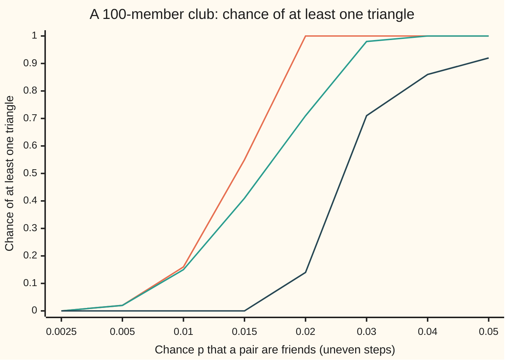
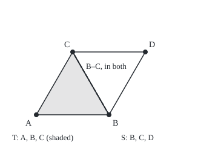

# First and second moments: showing a random count is zero, or is not

[Syllabus](../../../SYLLABUS.md) → [Probability and statistics](../README.md) → [Random Graphs and the Probabilistic Method](../README.md#s14) → First and second moments

---

## General Overview

A new club has 100 members. Any two of them become friends with the same chance, independently of every other pair. Three members who are all friends with each other form a **triangle**: the smallest closed circle of friendship.

When the chance is half a percent, about 2% of such clubs contain a triangle: the bounds on this card pin it between 1.97% and 2.02%. One simulation of 10,000 clubs finds 173, a share of 0.0173 with standard error 0.0013, about two standard errors low by the luck of the draw. At 5%, all 10,000 simulated clubs contain one. Somewhere between, triangles arrive. The question is where, and how to prove it without drawing a single club.

Two tools answer it, both built on the number of triangles a club holds. The **first moment method** uses only the average of that count: if the average is small, the count is usually zero. The **second moment method** adds the spread: if the average is large and the spread is small beside it, the count is usually positive. "Moment" is the old name for these averages: the first moment is the mean, the second brings in the variance.

**If a count's average is small, the count is usually zero; if its average is large and its standard deviation is small beside that average, the count is usually positive.**

**What kind of fact this is:** a method: Markov's and Chebyshev's inequalities, proved on [Markov and Chebyshev](../02-Random%20Variables/08-markov-and-chebyshev-inequalities.md), applied to a count; the triangle threshold it yields is a theorem, proved on this card in Why it works.

### The picture: the two methods squeeze the truth



Orange, top: the first moment method's ceiling. Green, middle: the share of 10,000 simulated clubs with a triangle. Dark, bottom: the second moment method's floor. The truth always sits between them. Up to p = 0.005 the ceiling holds it at about 0.02 or less; from p = 0.04 the floor holds it at 0.86 or more. The steps along the bottom are uneven, so read the p labels, not the spacing.

---

## The formula

A reminder of the notation. $P(A)$ is the chance of an event A. $X$ is a random variable, here the number of triangles in one club. $E[X]$ is its expectation, the long-run average count over many clubs. $\mathrm{Var}(X)$ is its variance, the average squared distance from $E[X]$. $\binom{n}{3}$, also written C(n, 3), counts the ways to pick 3 members from $n$.

The club is the random graph of [Random graphs](01-random-graphs-erdos-renyi.md): $n$ members, and each of the $\binom{n}{2}$ pairs linked with chance $p$, independently.

**The first moment method.** For any count $X$, a random whole number that is never negative:

$$P(X \ge 1) \le E[X]$$

**Read it aloud:** the chance that at least one appears is at most the average number that appear.

**The second moment method.** For any count with $E[X] > 0$:

$$P(X = 0) \le \frac{\mathrm{Var}(X)}{E[X]^2}$$

**Read it aloud:** the chance that none appear is at most the variance divided by the square of the mean.

**The triangle count.** For a club of $n$ members:

$$E[X] = \binom{n}{3} p^3, \qquad \mathrm{Var}(X) = \binom{n}{3}\left(p^3 - p^6\right) + \binom{n}{3} \cdot 3(n-3)\left(p^5 - p^6\right)$$

**Read it aloud:** the average count is the number of trios times the chance a trio is closed; the variance is each trio's own variance plus a covariance term for every pair of trios that share a friendship.

Divided through, the ratio the second method needs is

$$\frac{\mathrm{Var}(X)}{E[X]^2} = \frac{1 - p^3}{E[X]} + \frac{3(n-3)(1-p)}{\binom{n}{3}\, p}.$$

**Read it aloud:** the ratio is small when the average count is large and the second term, the shared-friendship term, is small too.

| Symbol | Plain meaning | In our example | Push it up and the answer… |
| --- | --- | --- | --- |
| $X$ | the number of triangles in one club | 0 in most clubs at p = 0.005 | — |
| $n$ | members in the club | 100 | triangles arrive at a smaller $p$ |
| $p$ | chance that a given pair are friends | 0.005 to 0.05 | $E[X]$ grows like $p^3$ |
| $\binom{n}{3}$ | trios of members, C(n, 3) | 161,700 | more trios, more chances to close |
| $T$, $S$ | one trio of members; a second trio | A, B, C and B, C, D | — |
| $I_T$ | the indicator of $T$: 1 if the trio is a triangle, 0 if not | chance $p^3$ of reading 1 | — |
| $E[X]$ | the average triangle count | 0.0202 at p = 0.005; 20.2125 at p = 0.05 | the first method's ceiling rises |
| $\mathrm{Var}(X)$ | the variance of the count | 34.1793 at p = 0.05 | the second method's floor falls |
| $\mathrm{Cov}(I_S, I_T)$ | covariance of two trios' indicators: how they rise and fall together | $p^5 - p^6$ when they share a pair | the variance grows |
| $c$ | $n$ times $p$: the average number of friends a member has, roughly | 5 at p = 0.05 | $E[X]$ nears $c^3/6$ |
| $\varepsilon$ | Chebyshev's distance from the mean, set to $E[X]$ in Step 4 | 20.2125 at p = 0.05 | the ceiling falls like $1/\varepsilon^2$ |
| $t$ | shorthand for $\binom{n}{3}$ inside the detailed proof | 161,700 | — |

### When it holds

- **The first method needs a count.** Markov's inequality needs a quantity that is never negative, and "at least 1" needs whole numbers. For a quantity that can be 0.3, "positive" and "at least 1" are different events.
- **The second method needs a mean above zero and a finite variance.** Any count over a finite club has both.
- **The formulas for the triangle count need independent pairs.** The two inequalities do not. In a club where all 4,950 pairs are friends together with chance 0.1 and none otherwise, the average count is 16,170, yet 90% of such clubs have no triangle. The second method notices: its ratio is 9, which says nothing.
- **A large mean alone proves nothing.** Only the ratio of variance to squared mean decides the second method. At p = 0.02 the ratio is 0.8612, so the method promises only 14% of clubs a triangle, though about 71% have one (a simulated 0.7068, standard error 0.0046).
- **Thresholds are statements about growing clubs.** "Triangles appear once $c$, which is $n$ times $p$, is large" means: as $n$ grows, the chance of a triangle heads to 1. For a fixed club the inequalities give numbers, as in the chart, not a sharp line.

---

## Why it works

### Step 0: zero or at least one

A count is either 0 or at least 1: there is nothing between. So one tool that caps the chance of reaching 1 and another that caps the chance of falling to 0 together decide the matter. The mean does the first, because reaching 1 costs the average something. The variance does the second, because falling to 0 is a long way below a large mean.

### Step 1: the first moment method is Markov at 1

Markov's inequality says a quantity that is never negative reaches a threshold with chance at most $E[X]$ divided by the threshold. Take the threshold to be 1. A count that is not 0 is at least 1, so $P(X \ge 1) \le E[X]$.

Directly: $E[X] = 1 \cdot P(X = 1) + 2 \cdot P(X = 2) + \dots$, and every term is at least the chance it multiplies. The sum of those chances is $P(X \ge 1)$.

### Step 2: the average count, one trio at a time

Give each trio $T$ an indicator $I_T$: a number that reads 1 if the trio is a triangle and 0 if not. The triangle count is the sum of all 161,700 indicators. A trio is a triangle when its three pairs are all friends: chance $p \cdot p \cdot p = p^3$. So each $I_T$ averages $p^3$.

Averages add, even when the pieces depend on each other ([Expectation](../02-Random%20Variables/02-expectation.md)). So $E[X] = \binom{n}{3} p^3$. At p = 0.005 that is 161,700 × 0.000000125 = 0.0202. The first method: at most 2.02% of clubs contain a triangle.

### Step 3: the variance, pair of trios by pair of trios

The variance of a sum is the sum of every covariance between its pieces, each piece paired with itself included. Covariance measures how two quantities rise and fall together; for independent quantities it is 0.

Pick one trio. Of the other 161,699 trios, 147,440 share no member with it, 13,968 share exactly one member, and 291 share exactly two. Only the last group matters.

- **No common pair.** Sharing no member or one member means sharing no pair. The two trios' friendships are separate coin flips, so their indicators are independent: covariance 0.
- **The same trio.** An indicator times itself is itself, so the covariance is $p^3 - (p^3)^2 = p^3 - p^6$.
- **One common pair.** Trios A, B, C and B, C, D share the pair B, C. Both are triangles when five pairs are friends, not six: chance $p^5$. The covariance is $p^5 - p^3 \cdot p^3 = p^5 - p^6$. That extra is positive: if B and C are friends, both triangles are likelier.

### The picture: two triangles that share a friendship

<p align="center"></p>

Five friendships close both triangles, since the dashed one counts twice. That shared side is the whole reason the variance exceeds the sum of the trios' own variances.

Each trio has $3(n-3)$ such partners: 3 ways to choose the shared pair, $n - 3$ choices for the fourth member. Adding everything up gives the variance formula. At p = 0.05 the own part is 20.2100 and the shared-edge part adds 13.9694: a variance of 34.1793.

### Step 4: the second moment method is Chebyshev at distance $E[X]$

Chebyshev's inequality says $X$ lands at least a distance $\varepsilon$ from its mean with chance at most $\mathrm{Var}(X)/\varepsilon^2$. A count of 0 is exactly $E[X]$ below the mean. Take $\varepsilon = E[X]$:

$$P(X = 0) \le P\big(\lvert X - E[X] \rvert \ge E[X]\big) \le \frac{\mathrm{Var}(X)}{E[X]^2}.$$

At p = 0.05: 34.1793 divided by 20.2125 squared is 0.0837. At most 8.4% of clubs have no triangle; at least 91.6% have one.

### Step 5: the threshold is p near 1/n

Write $p = c/n$, so $c$ is roughly each member's average number of friends. Then $\binom{n}{3} p^3$ is close to $n^3/6 \cdot c^3/n^3 = c^3/6$ for a large club. Three regimes follow.

- **$c$ shrinking to 0** (p much smaller than $1/n$): $E[X]$ shrinks to 0, and the first method sends the chance of a triangle to 0.
- **$c$ growing without limit** (p much larger than $1/n$): $E[X]$ grows without limit, and the second term of the ratio is about $18/(n c)$, which shrinks too. The second method sends the chance of no triangle to 0.
- **$c$ fixed**: neither method decides. The count settles near a Poisson law ([Poisson](../03-Discrete%20Distributions/04-poisson.md)) with mean $c^3/6$, the law of rare events, so $P(X = 0)$ nears $e^{-c^3/6}$.

So $1/n$ is the **threshold** for triangles: well below it they are absent, well above it present. For 100 members the threshold sits near p = 0.01, where the average count is 0.1617 and about 15% of clubs have a triangle (a simulated 0.1484, standard error 0.0036).

<details>
<summary>Detailed proof: the threshold for triangles is 1/n</summary>

Let $n$ grow, with $p = p(n)$ between 0 and 1. Put $t = \binom{n}{3}$. For $n \ge 3$, $(n-2)^3/6 \le t \le n^3/6$.

**Below.** Suppose $np \to 0$. By Step 1, $P(X \ge 1) \le E[X] = t p^3 \le (np)^3/6 \to 0$.

**The variance.** Write $X = \sum_T I_T$ over all $t$ trios. Then $\mathrm{Var}(X) = \sum_S \sum_T \mathrm{Cov}(I_S, I_T)$. If $S$ and $T$ share at most one member, their three pairs each are disjoint sets of independent friendships, so the covariance is 0. If $S = T$, $\mathrm{Cov} = E[I_T^2] - E[I_T]^2 = p^3 - p^6$, since $I_T^2 = I_T$. If they share two members, they share one pair and $I_S I_T = 1$ needs five friendships, so $\mathrm{Cov} = p^5 - p^6$. Each $S$ has $3(n-3)$ partners of the last kind. Hence $\mathrm{Var}(X) = t(p^3 - p^6) + 3(n-3)t(p^5 - p^6)$.

**The ratio.** Divide by $E[X]^2 = t^2 p^6$:
$$\frac{\mathrm{Var}(X)}{E[X]^2} = \frac{1 - p^3}{t p^3} + \frac{3(n-3)(1-p)}{t p} \le \frac{1}{E[X]} + \frac{18}{(n-2)^2 p}.$$
The last step uses $t \ge (n-2)^3/6$ and $n - 3 \le n - 2$.

**Above.** Suppose $np \to \infty$. Then $(n-2)p \to \infty$ as well, so $E[X] \ge ((n-2)p)^3/6 \to \infty$ and $(n-2)^2 p \ge (n-2)p \to \infty$. Both terms go to 0, and by Step 4, $P(X = 0) \to 0$.

**Between.** With $np = c$ fixed, $P(X = 0) \to e^{-c^3/6}$. That needs every moment of $X$, not two, and is proved in Frieze and Karoński, chapter 5 (Sources).

</details>

<details>
<summary>A sharper floor from the same two numbers</summary>

Chebyshev spends its allowance on both sides of the mean, but only the fall to 0 matters here. A one-sided argument (the Cauchy–Schwarz inequality, which says the average of a product is at most the square root of the product of the averages of the squares, applied to $X$ times the indicator of $X > 0$) gives $P(X > 0) \ge E[X]^2 / (E[X]^2 + \mathrm{Var}(X))$, the Paley–Zygmund bound. At p = 0.05 it is 0.9228, against Chebyshev's 0.9163. It never does worse, and the threshold proof goes through unchanged.

</details>

The second method is not special to triangles. Any count built from indicators, one per trio, per person or per pair, has as its variance the sum of the covariances between its pieces, and Step 4 applies unchanged. The number of people with exactly k friends is one such count. Two people's indicators share only the single pair between them, so each covariance is at most $p$. With $p$ near $c/n$ the variance then grows at most like $n$ while the squared mean grows like $n^2$, so the share of a large town with k friends stays close to its average. The size of the giant component of [The giant component](02-the-giant-component.md) is pinned the same way: Chebyshev applied to the number of small tree-shaped pieces of each size fixes how many people sit outside the giant, as Frieze and Karoński work through in their chapter on evolution (Sources).

The first moment method has a second use, and it is the one on [The probabilistic method](03-probabilistic-method.md): if the average count of a bad structure is below 1, some outcome has none of it, so a good object exists.

---

## Worked numbers, by hand

| Step | Arithmetic | Value |
| --- | --- | --- |
| trios in the club | 100 × 99 × 98 / 6 | 161,700 |
| a trio closed, p = 0.005 | 0.005 × 0.005 × 0.005 | 0.000000125 |
| average count, p = 0.005 | 161,700 × 0.000000125 | 0.0202 |
| **first method, p = 0.005** | $P(X \ge 1) \le 0.0202$ | **at most 2.02% of clubs** |
| a trio closed, p = 0.05 | 0.05 × 0.05 × 0.05 | 0.000125 |
| average count, p = 0.05 | 161,700 × 0.000125 | 20.2125 |
| own part of the variance | 161,700 × (p^3 − p^6) | 20.2100 |
| shared-pair part | 161,700 × 291 × (p^5 − p^6) | 13.9694 |
| variance | 20.2100 + 13.9694 | 34.1793 |
| **second method, p = 0.05** | 34.1793 / 20.2125^2 | **no triangle in at most 8.37%** |

At half a percent, at most about 1 club in 50 has a triangle; at 5%, more than 9 in 10 do.

The shelf's house example, a social network of 1,000 people, moves the threshold to about p = 0.001, one friend per person on average: the same $1/n$. There its average count is 0.1662, against 0.1617 for the 100-member club at p = 0.01; both have $c$ = 1.

### What breaks if you drop a piece

| Mistake | Comes out at | What went wrong |
| --- | --- | --- |
| The first method read backwards: "average above 1, so a triangle is certain" | at p = 0.02, $E[X]$ = 1.2936, but only 0.7068 of simulated clubs have one (standard error 0.0046) | Markov caps the chance from above; it never forces it up |
| The shared pairs left out of the variance | at p = 0.05, variance 20.2100 and a "bound" of 0.0495 instead of 0.0837 | Triangles sharing a pair rise and fall together; the covariance adds 13.9694 |
| Independence dropped: all pairs friends together with chance 0.1 | $E[X]$ = 16,170, yet $P(X = 0)$ = 0.9; the ratio reads 9 | The mean is huge because a few clubs hold every triangle |

The code prints all three.

---

## Code, from first principles, and it actually runs

Three roads lead to the same numbers. The formulas give $E[X]$, $\mathrm{Var}(X)$ and the ratio, the ratio twice, by the raw division and by the simplified form. A 6-member club has 15 pairs and so 32,768 friendship patterns; the scripts list every one, weigh it by its chance, and read off the exact mean, variance and chance of no triangle, at 99 values of $p$. And the scripts simulate 10,000 clubs of 100 members at each of eight values of $p$ and report each estimate with its standard error, the typical size of a simulation's miss. Friendships are drawn by skipping straight to the next friendly pair, with a gap drawn from its geometric law, from SplitMix64 (a short, well-tested recipe for pseudo-random whole numbers, written out in both languages so both draw the same clubs). The trio counts behind the covariance, and the triangles of the all-or-nothing club, are counted by brute force too.

### Python

```python
# First and second moments -- the check behind the card; only math is imported.
# A club of 100 members; each pair are friends with chance p, independently.
# X counts triangles: trios of members who are all friends with each other.
# Roads: the formulas for E[X] and Var(X); every friendship pattern of a
# 6-member club enumerated; a seeded simulation of 10,000 clubs per p.
import math

N, TRIALS, SEED = 100, 10000, 20260929
PS = [0.0025, 0.005, 0.01, 0.015, 0.02, 0.03, 0.04, 0.05]

def choose(n, k):                             # C(n, k), by the multiplicative rule
    out = 1
    for i in range(k):
        out = out * (n - i) // (i + 1)
    return out

def mean_f(n, p):                             # first moment: C(n,3) p^3
    return choose(n, 3) * p ** 3

def var_f(n, p):                              # own terms, then pairs sharing an edge
    t = choose(n, 3)
    return t * (p ** 3 - p ** 6) + t * 3 * (n - 3) * (p ** 5 - p ** 6)

def ratio_f(n, p):                            # Var/E^2 rewritten by hand, a second road
    return (1 - p ** 3) / mean_f(n, p) + 3 * (n - 3) * (1 - p) / (choose(n, 3) * p)

def splitmix64(s):                            # the generator both languages share
    s = (s + 0x9E3779B97F4A7C15) & 0xFFFFFFFFFFFFFFFF
    z = ((s ^ (s >> 30)) * 0xBF58476D1CE4E5B9) & 0xFFFFFFFFFFFFFFFF
    z = ((z ^ (z >> 27)) * 0x94D049BB133111EB) & 0xFFFFFFFFFFFFFFFF
    return s, z ^ (z >> 31)

def row(label, v):
    print(f"{label:<50} {v:>12.6f}")

# ---- road 2: every friendship pattern of a 6-member club, 2^15 of them ----
pairs6 = [(i, j) for i in range(6) for j in range(i + 1, 6)]
bit = {pr: 1 << k for k, pr in enumerate(pairs6)}
trios6 = [bit[(a, b)] | bit[(a, c)] | bit[(b, c)]
          for a in range(6) for b in range(a + 1, 6) for c in range(b + 1, 6)]
tally = {}                                    # (friendships, triangles) -> patterns
for mask in range(1 << 15):
    key = (bin(mask).count("1"), sum(1 for t in trios6 if mask & t == t))
    tally[key] = tally.get(key, 0) + 1
def enum6(p):                                 # exact E[X], Var(X), P(X = 0) by counting
    w = {k: c * p ** k[0] * (1 - p) ** (15 - k[0]) for k, c in tally.items()}
    m = sum(v * k[1] for k, v in w.items())
    return m, sum(v * k[1] ** 2 for k, v in w.items()) - m * m, sum(v for k, v in w.items() if k[1] == 0)
share2 = sum(1 for s in trios6 for t in trios6 if bin(s & t).count("1") == 1)

print(f"club n = {N}: pairs {choose(N, 2)}, trios C(100,3) = {choose(N, 3)}")
split = [0, 0, 0, 0]                          # trios meeting trio {0,1,2} in 0..3 members
for a in range(N):
    for b in range(a + 1, N):
        for c in range(b + 1, N):
            split[(a < 3) + (b < 3) + (c < 3)] += 1
print(f"trios sharing 0 / 1 / 2 members with one trio: {split[0]} {split[1]} {split[2]}; 3(n-3) = {3 * (N - 3)}")
print(f"6 members: trio pairs sharing an edge, counted {share2}, formula C(6,3)*3*3 = {choose(6, 3) * 9}")
for p in (0.2, 0.6):
    m, v, z = enum6(p)
    print(f"6 members, p = {p}: E formula {mean_f(6, p):.6f} counted {m:.6f}; Var formula {var_f(6, p):.6f} counted {v:.6f}")
    print(f"6 members, p = {p}: P(X>=1) {1 - z:.6f} <= Markov {mean_f(6, p):.6f}; P(X=0) {z:.6f} <= Chebyshev {var_f(6, p) / mean_f(6, p) ** 2:.6f}")
worst6 = max([0.0] + [max(1 - z - m, z - v / (m * m)) for m, v, z in (enum6(k / 100) for k in range(1, 100))])

# ---- the worked numbers, n = 100 ----
for p in (0.005, 0.05):
    print(f"p = {p}: p^3 = {p ** 3:.9f}")
    row(f"p = {p}: E[X] = C(100,3) p^3", mean_f(N, p))
    row(f"p = {p}: Paley-Zygmund floor E^2/(E^2 + Var)", mean_f(N, p) ** 2 / (mean_f(N, p) ** 2 + var_f(N, p)))
p = 0.05
row("p = 0.05: own part C(100,3)(p^3 - p^6)", choose(N, 3) * (p ** 3 - p ** 6))
row("p = 0.05: shared-edge part 161700*291*(p^5 - p^6)", choose(N, 3) * 3 * (N - 3) * (p ** 5 - p ** 6))
row("p = 0.05: Var(X)", var_f(N, p))
row("p = 0.05: Chebyshev Var/E^2", var_f(N, p) / mean_f(N, p) ** 2)
row("p = 0.05: same, by the simplified ratio", ratio_f(N, p))

# ---- road 3: 10,000 simulated clubs per p, friendships by geometric skips ----
pairs = [(i, j) for i in range(N) for j in range(i + 1, N)]
state, sims = SEED, []
for p in PS:
    lq, zero, s1, s2, s3, s4 = math.log(1 - p), 0, 0, 0, 0, 0
    for _ in range(TRIALS):
        adj, pos, edges = [0] * N, -1, []
        while True:                           # jump straight to the next friendship
            state, z = splitmix64(state)
            pos += 1 + math.floor(math.log(((z >> 11) + 1) * 2.0 ** -53) / lq)
            if pos >= len(pairs):
                break
            i, j = pairs[pos]
            edges.append((i, j))
            adj[i] |= 1 << j
            adj[j] |= 1 << i
        x = sum(((adj[i] & adj[j]) >> (j + 1)).bit_count() for i, j in edges)
        zero += x == 0
        s1, s2, s3, s4 = s1 + x, s2 + x * x, s3 + x ** 3, s4 + x ** 4
    q, m = 1 - zero / TRIALS, s1 / TRIALS
    v = (s2 - s1 * s1 / TRIALS) / (TRIALS - 1)
    m4 = (s4 - 4 * m * s3 + 6 * m * m * s2) / TRIALS - 3 * m ** 4
    sims.append((p, q, math.sqrt(q * (1 - q) / TRIALS), m, math.sqrt(v / TRIALS), v, math.sqrt(max(m4 - v * v, 0) / TRIALS)))

print("exact,      p  c = np      E[X]     Var(X)  Var/E^2  Markov cap  Chebyshev floor  1-exp(-E)")
for p in PS:
    e, v = mean_f(N, p), var_f(N, p)
    print(f"exact, {p:>6} {N * p:>7.4f} {e:>10.4f} {v:>10.4f} {v / e / e:>8.4f} {min(1, e):>11.4f} {max(0, 1 - v / e / e):>16.4f} {1 - math.exp(-e):>10.4f}")
print("sim,        p  P(X>=1)     s.e.   mean X    s.e.   var X    s.e.")
for p, q, sq, m, sm, v, sv in sims:
    print(f"sim,   {p:>6}  {q:>7.4f}  {sq:>7.4f} {m:>8.4f} {sm:>7.4f} {v:>7.4f} {sv:>7.4f}")
print("chart, Markov cap:      " + " ".join(f"{min(1, mean_f(N, p)):.2f}" for p in PS))
print("chart, simulated:       " + " ".join(f"{s[1]:.2f}" for s in sims))
print("chart, Chebyshev floor: " + " ".join(f"{max(0, 1 - var_f(N, p) / mean_f(N, p) ** 2):.2f}" for p in PS))

# ---- what breaks ----
row("wrong: Markov read backwards, E[X] at p = 0.02", mean_f(N, 0.02))
row("wrong:   simulated P(X>=1) at p = 0.02", sims[4][1])
p = 0.05
indep = choose(N, 3) * (p ** 3 - p ** 6)
row("wrong: shared edges ignored, Var at p = 0.05", indep)
row("wrong:   its 'bound' Var/E^2", indep / mean_f(N, p) ** 2)
full = [((1 << N) - 1) ^ (1 << i) for i in range(N)]   # all-or-nothing club: with chance 0.1
tfull = sum(((full[i] & full[j]) >> (j + 1)).bit_count() for i, j in pairs)   # all are friends
ea, e2a = 0.1 * tfull, 0.1 * tfull * tfull
row("wrong: all-or-nothing club, E[X]", ea)
row("wrong:   its P(X = 0)", 1 - 0.1 * (tfull > 0))   # the empty club, chance 0.9, has none
row("wrong:   its Chebyshev Var/E^2", (e2a - ea * ea) / (ea * ea))
row("6 members, 99 values of p: worst bound overshoot", worst6)
row("house example, n = 1000, p = 0.001: E[X]", mean_f(1000, 0.001))
print(f"figure, A (60,190) B (180,190) C (120,{190 - 60 * math.sqrt(3):.0f}) D (240,{190 - 60 * math.sqrt(3):.0f}), sides 120")

assert split == [choose(N - 3, 3), 3 * choose(N - 3, 2), 3 * (N - 3), 1] and share2 == choose(6, 3) * 9, "shared-member counts"
for p in (0.2, 0.6):
    m, v, z = enum6(p)
    assert abs(m - mean_f(6, p)) + abs(v - var_f(6, p)) < 1e-12, "formula vs every pattern"
assert worst6 <= 1e-12, "Markov and Chebyshev hold on every enumerated club"
assert all(abs(var_f(N, p) / mean_f(N, p) ** 2 - ratio_f(N, p)) < 1e-12 for p in PS), "two algebra roads"
for p, q, sq, m, sm, v, sv in sims:
    assert abs(m - mean_f(N, p)) < 4 * sm and abs(v - var_f(N, p)) < 4 * sv, "simulation vs formulas"
    assert q <= mean_f(N, p) + 4 * sq and 1 - q <= var_f(N, p) / mean_f(N, p) ** 2 + 4 * sq, "simulation under both bounds"
assert tfull == choose(N, 3), "every trio of the full club counted as a triangle"
print("ALL CHECKS PASS")
```

**Ran 2026-10-06 on macOS, Python 3.14.6, standard library only. All checks passed. Output, pasted from the run:**

```
club n = 100: pairs 4950, trios C(100,3) = 161700
trios sharing 0 / 1 / 2 members with one trio: 147440 13968 291; 3(n-3) = 291
6 members: trio pairs sharing an edge, counted 180, formula C(6,3)*3*3 = 180
6 members, p = 0.2: E formula 0.160000 counted 0.160000; Var formula 0.204800 counted 0.204800
6 members, p = 0.2: P(X>=1) 0.132419 <= Markov 0.160000; P(X=0) 0.867581 <= Chebyshev 8.000000
6 members, p = 0.6: E formula 4.320000 counted 4.320000; Var formula 8.985600 counted 8.985600
6 members, p = 0.6: P(X>=1) 0.943083 <= Markov 4.320000; P(X=0) 0.056917 <= Chebyshev 0.481481
p = 0.005: p^3 = 0.000000125
p = 0.005: E[X] = C(100,3) p^3                         0.020213
p = 0.005: Paley-Zygmund floor E^2/(E^2 + Var)         0.019672
p = 0.05: p^3 = 0.000125000
p = 0.05: E[X] = C(100,3) p^3                         20.212500
p = 0.05: Paley-Zygmund floor E^2/(E^2 + Var)          0.922798
p = 0.05: own part C(100,3)(p^3 - p^6)                20.209973
p = 0.05: shared-edge part 161700*291*(p^5 - p^6)     13.969364
p = 0.05: Var(X)                                      34.179338
p = 0.05: Chebyshev Var/E^2                            0.083661
p = 0.05: same, by the simplified ratio                0.083661
exact,      p  c = np      E[X]     Var(X)  Var/E^2  Markov cap  Chebyshev floor  1-exp(-E)
exact, 0.0025  0.2500     0.0025     0.0025 396.5127      0.0025           0.0000     0.0025
exact,  0.005  0.5000     0.0202     0.0204  49.8325      0.0202           0.0000     0.0200
exact,   0.01  1.0000     0.1617     0.1664   6.3624      0.1617           0.0000     0.1493
exact,  0.015  1.5000     0.5457     0.5809   1.9506      0.5457           0.0000     0.4206
exact,   0.02  2.0000     1.2936     1.4412   0.8612      1.0000           0.1388     0.7257
exact,   0.03  3.0000     4.3659     5.4749   0.2872      1.0000           0.7128     0.9873
exact,   0.04  4.0000    10.3488    14.9738   0.1398      1.0000           0.8602     1.0000
exact,   0.05  5.0000    20.2125    34.1793   0.0837      1.0000           0.9163     1.0000
sim,        p  P(X>=1)     s.e.   mean X    s.e.   var X    s.e.
sim,   0.0025   0.0031   0.0006   0.0031  0.0006  0.0031  0.0006
sim,    0.005   0.0173   0.0013   0.0175  0.0013  0.0176  0.0014
sim,     0.01   0.1484   0.0036   0.1640  0.0041  0.1713  0.0053
sim,    0.015   0.4149   0.0049   0.5453  0.0075  0.5666  0.0117
sim,     0.02   0.7068   0.0046   1.2746  0.0118  1.3867  0.0245
sim,     0.03   0.9775   0.0015   4.3529  0.0236  5.5483  0.0857
sim,     0.04   0.9998   0.0001  10.3134  0.0387 14.9527  0.2351
sim,     0.05   1.0000   0.0000  20.1512  0.0583 33.9897  0.5138
chart, Markov cap:      0.00 0.02 0.16 0.55 1.00 1.00 1.00 1.00
chart, simulated:       0.00 0.02 0.15 0.41 0.71 0.98 1.00 1.00
chart, Chebyshev floor: 0.00 0.00 0.00 0.00 0.14 0.71 0.86 0.92
wrong: Markov read backwards, E[X] at p = 0.02         1.293600
wrong:   simulated P(X>=1) at p = 0.02                 0.706800
wrong: shared edges ignored, Var at p = 0.05          20.209973
wrong:   its 'bound' Var/E^2                           0.049468
wrong: all-or-nothing club, E[X]                   16170.000000
wrong:   its P(X = 0)                                  0.900000
wrong:   its Chebyshev Var/E^2                         9.000000
6 members, 99 values of p: worst bound overshoot       0.000000
house example, n = 1000, p = 0.001: E[X]               0.166167
figure, A (60,190) B (180,190) C (120,86) D (240,86), sides 120
ALL CHECKS PASS
```

### Rust

Same numbers, same labels, built with `rustc --edition 2021 -O`.

```rust
// First and second moments -- the same check as the Python, in Rust; no crates.
// A club of 100 members; each pair are friends with chance p, independently.
// X counts triangles: trios of members who are all friends with each other.
// Roads: the formulas for E[X] and Var(X); every friendship pattern of a
// 6-member club enumerated; a seeded simulation of 10,000 clubs per p.
const N: usize = 100;
const TRIALS: usize = 10000;
const SEED: u64 = 20260929;
const PS: [f64; 8] = [0.0025, 0.005, 0.01, 0.015, 0.02, 0.03, 0.04, 0.05];

fn choose(n: u64, k: u64) -> u64 {                // C(n, k), by the multiplicative rule
    let mut out = 1;
    for i in 0..k { out = out * (n - i) / (i + 1) }
    out
}

fn mean_f(n: u64, p: f64) -> f64 { choose(n, 3) as f64 * p.powf(3.0) } // first moment

fn var_f(n: u64, p: f64) -> f64 {                // own terms, then pairs sharing an edge
    let t = choose(n, 3) as f64;
    t * (p.powf(3.0) - p.powf(6.0)) + t * 3.0 * (n - 3) as f64 * (p.powf(5.0) - p.powf(6.0))
}

fn ratio_f(n: u64, p: f64) -> f64 {              // Var/E^2 rewritten by hand, a second road
    (1.0 - p.powf(3.0)) / mean_f(n, p) + 3.0 * (n - 3) as f64 * (1.0 - p) / (choose(n, 3) as f64 * p)
}

fn splitmix64(s: u64) -> (u64, u64) {            // the generator both languages share
    let s = s.wrapping_add(0x9E3779B97F4A7C15);
    let z = (s ^ (s >> 30)).wrapping_mul(0xBF58476D1CE4E5B9);
    let z = (z ^ (z >> 27)).wrapping_mul(0x94D049BB133111EB);
    (s, z ^ (z >> 31))
}

fn row(label: &str, v: f64) { println!("{:<50} {:>12.6}", label, v) }

fn enum6(tally: &[((u32, u32), u64)], p: f64) -> (f64, f64, f64) { // exact E, Var, P(X = 0)
    let w: Vec<(u32, f64)> = tally.iter()
        .map(|&((e, t), c)| (t, c as f64 * p.powf(e as f64) * (1.0 - p).powf((15 - e) as f64))).collect();
    let m: f64 = w.iter().map(|&(t, v)| v * t as f64).sum();
    let m2: f64 = w.iter().map(|&(t, v)| v * (t * t) as f64).sum();
    (m, m2 - m * m, w.iter().filter(|&&(t, _)| t == 0).map(|&(_, v)| v).sum())
}

fn main() {
    // ---- road 2: every friendship pattern of a 6-member club, 2^15 of them ----
    let mut bit = [[0u32; 6]; 6];
    let mut k = 0;
    for i in 0..6 { for j in i + 1..6 { bit[i][j] = 1 << k; k += 1 } }
    let mut trios6 = Vec::new();
    for a in 0..6 { for b in a + 1..6 { for c in b + 1..6 { trios6.push(bit[a][b] | bit[a][c] | bit[b][c]) } } }
    let mut tally: Vec<((u32, u32), u64)> = Vec::new();  // (friendships, triangles) -> patterns
    for mask in 0u32..1 << 15 {
        let key = (mask.count_ones(), trios6.iter().filter(|&&t| mask & t == t).count() as u32);
        match tally.iter_mut().find(|e| e.0 == key) { Some(e) => e.1 += 1, None => tally.push((key, 1)) }
    }
    let share2 = trios6.iter().map(|s| trios6.iter().filter(|&&t| (s & t).count_ones() == 1).count()).sum::<usize>();
    let n = N as u64;
    println!("club n = {}: pairs {}, trios C(100,3) = {}", N, choose(n, 2), choose(n, 3));
    let mut split = [0u64; 4];                    // trios meeting trio {0,1,2} in 0..3 members
    for a in 0..N { for b in a + 1..N { for c in b + 1..N {
        split[(a < 3) as usize + (b < 3) as usize + (c < 3) as usize] += 1 } } }
    println!("trios sharing 0 / 1 / 2 members with one trio: {} {} {}; 3(n-3) = {}", split[0], split[1], split[2], 3 * (N - 3));
    println!("6 members: trio pairs sharing an edge, counted {}, formula C(6,3)*3*3 = {}", share2, choose(6, 3) * 9);
    for p in [0.2f64, 0.6] {
        let (m, v, z) = enum6(&tally, p);
        println!("6 members, p = {}: E formula {:.6} counted {:.6}; Var formula {:.6} counted {:.6}", p, mean_f(6, p), m, var_f(6, p), v);
        println!("6 members, p = {}: P(X>=1) {:.6} <= Markov {:.6}; P(X=0) {:.6} <= Chebyshev {:.6}",
                 p, 1.0 - z, mean_f(6, p), z, var_f(6, p) / mean_f(6, p).powf(2.0));
    }
    let mut worst6: f64 = 0.0;
    for k in 1..100 {                             // both bounds, 99 values of p, n = 6
        let (m, v, z) = enum6(&tally, k as f64 / 100.0);
        worst6 = worst6.max((1.0 - z) - m).max(z - v / (m * m));
    }

    // ---- the worked numbers, n = 100 ----
    for p in [0.005f64, 0.05] {
        println!("p = {}: p^3 = {:.9}", p, p.powf(3.0));
        row(&format!("p = {}: E[X] = C(100,3) p^3", p), mean_f(n, p));
        row(&format!("p = {}: Paley-Zygmund floor E^2/(E^2 + Var)", p), mean_f(n, p).powf(2.0) / (mean_f(n, p).powf(2.0) + var_f(n, p)));
    }
    let p: f64 = 0.05;
    row("p = 0.05: own part C(100,3)(p^3 - p^6)", choose(n, 3) as f64 * (p.powf(3.0) - p.powf(6.0)));
    row("p = 0.05: shared-edge part 161700*291*(p^5 - p^6)", (choose(n, 3) * 3 * (n - 3)) as f64 * (p.powf(5.0) - p.powf(6.0)));
    row("p = 0.05: Var(X)", var_f(n, p));
    row("p = 0.05: Chebyshev Var/E^2", var_f(n, p) / mean_f(n, p).powf(2.0));
    row("p = 0.05: same, by the simplified ratio", ratio_f(n, p));

    // ---- road 3: 10,000 simulated clubs per p, friendships by geometric skips ----
    let mut pairs = Vec::new();
    for i in 0..N { for j in i + 1..N { pairs.push((i, j)) } }
    let (mut state, mut sims) = (SEED, Vec::new());
    for &p in PS.iter() {
        let lq = (1.0 - p).ln();
        let (mut zero, mut s1, mut s2, mut s3, mut s4) = (0usize, 0u64, 0u64, 0u64, 0u64);
        for _ in 0..TRIALS {
            let (mut adj, mut pos, mut edges) = (vec![0u128; N], -1i64, Vec::new());
            loop {                                // jump straight to the next friendship
                let (s, z) = splitmix64(state);
                state = s;
                pos += 1 + ((((z >> 11) + 1) as f64 * 2f64.powi(-53)).ln() / lq).floor() as i64;
                if pos >= pairs.len() as i64 { break }
                let (i, j) = pairs[pos as usize];
                edges.push((i, j));
                adj[i] |= 1u128 << j;
                adj[j] |= 1u128 << i;
            }
            let x: u64 = edges.iter().map(|&(i, j)| ((adj[i] & adj[j]) >> (j + 1)).count_ones() as u64).sum();
            if x == 0 { zero += 1 }
            s1 += x; s2 += x * x; s3 += x.pow(3); s4 += x.pow(4);
        }
        let tr = TRIALS as f64;
        let (q, m) = (1.0 - zero as f64 / tr, s1 as f64 / tr);
        let v = (s2 as f64 - (s1 * s1) as f64 / tr) / (tr - 1.0);
        let m4 = (s4 as f64 - 4.0 * m * s3 as f64 + 6.0 * m * m * s2 as f64) / tr - 3.0 * m.powf(4.0);
        sims.push((p, q, (q * (1.0 - q) / tr).sqrt(), m, (v / tr).sqrt(), v, ((m4 - v * v).max(0.0) / tr).sqrt()));
    }
    println!("exact,      p  c = np      E[X]     Var(X)  Var/E^2  Markov cap  Chebyshev floor  1-exp(-E)");
    for &p in PS.iter() {
        let (e, v) = (mean_f(n, p), var_f(n, p));
        println!("exact, {:>6} {:>7.4} {:>10.4} {:>10.4} {:>8.4} {:>11.4} {:>16.4} {:>10.4}",
                 p, N as f64 * p, e, v, v / e / e, e.min(1.0), (1.0 - v / e / e).max(0.0), 1.0 - (-e).exp());
    }
    println!("sim,        p  P(X>=1)     s.e.   mean X    s.e.   var X    s.e.");
    for &(p, q, sq, m, sm, v, sv) in &sims {
        println!("sim,   {:>6}  {:>7.4}  {:>7.4} {:>8.4} {:>7.4} {:>7.4} {:>7.4}", p, q, sq, m, sm, v, sv);
    }
    let join = |f: &dyn Fn(usize) -> f64| (0..PS.len()).map(|i| format!("{:.2}", f(i))).collect::<Vec<_>>().join(" ");
    println!("chart, Markov cap:      {}", join(&|i| mean_f(n, PS[i]).min(1.0)));
    println!("chart, simulated:       {}", join(&|i| sims[i].1));
    println!("chart, Chebyshev floor: {}", join(&|i| (1.0 - var_f(n, PS[i]) / mean_f(n, PS[i]).powf(2.0)).max(0.0)));

    // ---- what breaks ----
    row("wrong: Markov read backwards, E[X] at p = 0.02", mean_f(n, 0.02));
    row("wrong:   simulated P(X>=1) at p = 0.02", sims[4].1);
    let indep = choose(n, 3) as f64 * (p.powf(3.0) - p.powf(6.0));
    row("wrong: shared edges ignored, Var at p = 0.05", indep);
    row("wrong:   its 'bound' Var/E^2", indep / mean_f(n, p).powf(2.0));
    let full: Vec<u128> = (0..N).map(|i| (u128::MAX >> (128 - N)) ^ (1u128 << i)).collect(); // all-or-nothing
    let tfull: u64 = pairs.iter().map(|&(i, j)| ((full[i] & full[j]) >> (j + 1)).count_ones() as u64).sum(); // club
    let (ea, e2a) = (0.1 * tfull as f64, 0.1 * (tfull * tfull) as f64);  // chance 0.1 all friends
    row("wrong: all-or-nothing club, E[X]", ea);
    row("wrong:   its P(X = 0)", 1.0 - 0.1 * (tfull > 0) as u8 as f64);   // the empty club, chance 0.9, has none
    row("wrong:   its Chebyshev Var/E^2", (e2a - ea * ea) / (ea * ea));
    row("6 members, 99 values of p: worst bound overshoot", worst6);
    row("house example, n = 1000, p = 0.001: E[X]", mean_f(1000, 0.001));
    let cy = 190.0 - 60.0 * 3f64.sqrt();
    println!("figure, A (60,190) B (180,190) C (120,{:.0}) D (240,{:.0}), sides 120", cy, cy);

    assert!(split == [choose(n - 3, 3), 3 * choose(n - 3, 2), 3 * (n - 3), 1] && share2 as u64 == choose(6, 3) * 9, "shared-member counts");
    for p in [0.2f64, 0.6] {
        let (m, v, _) = enum6(&tally, p);
        assert!((m - mean_f(6, p)).abs() + (v - var_f(6, p)).abs() < 1e-12, "formula vs every pattern");
    }
    assert!(worst6 <= 1e-12, "Markov and Chebyshev hold on every enumerated club");
    assert!(PS.iter().all(|&p| (var_f(n, p) / mean_f(n, p).powf(2.0) - ratio_f(n, p)).abs() < 1e-12), "two algebra roads");
    for &(p, q, sq, m, sm, v, sv) in &sims {
        assert!((m - mean_f(n, p)).abs() < 4.0 * sm && (v - var_f(n, p)).abs() < 4.0 * sv, "simulation vs formulas");
        assert!(q <= mean_f(n, p) + 4.0 * sq && 1.0 - q <= var_f(n, p) / mean_f(n, p).powf(2.0) + 4.0 * sq, "simulation under both bounds");
    }
    assert!(tfull == choose(n, 3), "every trio of the full club counted as a triangle");
    println!("ALL CHECKS PASS");
}
```

**Ran 2026-10-06 on macOS, rustc 1.98.1, no crates. All checks passed. Output, pasted from the run:**

```
club n = 100: pairs 4950, trios C(100,3) = 161700
trios sharing 0 / 1 / 2 members with one trio: 147440 13968 291; 3(n-3) = 291
6 members: trio pairs sharing an edge, counted 180, formula C(6,3)*3*3 = 180
6 members, p = 0.2: E formula 0.160000 counted 0.160000; Var formula 0.204800 counted 0.204800
6 members, p = 0.2: P(X>=1) 0.132419 <= Markov 0.160000; P(X=0) 0.867581 <= Chebyshev 8.000000
6 members, p = 0.6: E formula 4.320000 counted 4.320000; Var formula 8.985600 counted 8.985600
6 members, p = 0.6: P(X>=1) 0.943083 <= Markov 4.320000; P(X=0) 0.056917 <= Chebyshev 0.481481
p = 0.005: p^3 = 0.000000125
p = 0.005: E[X] = C(100,3) p^3                         0.020213
p = 0.005: Paley-Zygmund floor E^2/(E^2 + Var)         0.019672
p = 0.05: p^3 = 0.000125000
p = 0.05: E[X] = C(100,3) p^3                         20.212500
p = 0.05: Paley-Zygmund floor E^2/(E^2 + Var)          0.922798
p = 0.05: own part C(100,3)(p^3 - p^6)                20.209973
p = 0.05: shared-edge part 161700*291*(p^5 - p^6)     13.969364
p = 0.05: Var(X)                                      34.179338
p = 0.05: Chebyshev Var/E^2                            0.083661
p = 0.05: same, by the simplified ratio                0.083661
exact,      p  c = np      E[X]     Var(X)  Var/E^2  Markov cap  Chebyshev floor  1-exp(-E)
exact, 0.0025  0.2500     0.0025     0.0025 396.5127      0.0025           0.0000     0.0025
exact,  0.005  0.5000     0.0202     0.0204  49.8325      0.0202           0.0000     0.0200
exact,   0.01  1.0000     0.1617     0.1664   6.3624      0.1617           0.0000     0.1493
exact,  0.015  1.5000     0.5457     0.5809   1.9506      0.5457           0.0000     0.4206
exact,   0.02  2.0000     1.2936     1.4412   0.8612      1.0000           0.1388     0.7257
exact,   0.03  3.0000     4.3659     5.4749   0.2872      1.0000           0.7128     0.9873
exact,   0.04  4.0000    10.3488    14.9738   0.1398      1.0000           0.8602     1.0000
exact,   0.05  5.0000    20.2125    34.1793   0.0837      1.0000           0.9163     1.0000
sim,        p  P(X>=1)     s.e.   mean X    s.e.   var X    s.e.
sim,   0.0025   0.0031   0.0006   0.0031  0.0006  0.0031  0.0006
sim,    0.005   0.0173   0.0013   0.0175  0.0013  0.0176  0.0014
sim,     0.01   0.1484   0.0036   0.1640  0.0041  0.1713  0.0053
sim,    0.015   0.4149   0.0049   0.5453  0.0075  0.5666  0.0117
sim,     0.02   0.7068   0.0046   1.2746  0.0118  1.3867  0.0245
sim,     0.03   0.9775   0.0015   4.3529  0.0236  5.5483  0.0857
sim,     0.04   0.9998   0.0001  10.3134  0.0387 14.9527  0.2351
sim,     0.05   1.0000   0.0000  20.1512  0.0583 33.9897  0.5138
chart, Markov cap:      0.00 0.02 0.16 0.55 1.00 1.00 1.00 1.00
chart, simulated:       0.00 0.02 0.15 0.41 0.71 0.98 1.00 1.00
chart, Chebyshev floor: 0.00 0.00 0.00 0.00 0.14 0.71 0.86 0.92
wrong: Markov read backwards, E[X] at p = 0.02         1.293600
wrong:   simulated P(X>=1) at p = 0.02                 0.706800
wrong: shared edges ignored, Var at p = 0.05          20.209973
wrong:   its 'bound' Var/E^2                           0.049468
wrong: all-or-nothing club, E[X]                   16170.000000
wrong:   its P(X = 0)                                  0.900000
wrong:   its Chebyshev Var/E^2                         9.000000
6 members, 99 values of p: worst bound overshoot       0.000000
house example, n = 1000, p = 0.001: E[X]               0.166167
figure, A (60,190) B (180,190) C (120,86) D (240,86), sides 120
ALL CHECKS PASS
```

The two outputs match line for line. The `exact` column `1-exp(-E)` is the Poisson guess of Step 5: at p = 0.015 it reads 0.4206, and the simulation finds 0.4149, standard error 0.0049.

> [!TIP]
> **Try changing**
> Guess first, then run it.
> - **A bigger club.** Set `N = 120` (Rust keeps each member's friends in 128 bits, so stay at or below 128). Guess where the threshold moves: to about p = 1/120, and at p = 0.01 the average count rises from 0.1617 to 0.2808.
> - **Another seed.** Change `20260929`. Every simulated share moves by about one standard error. The asserts allow four standard errors, so they almost always still pass.
> - **Forget the shared pairs.** Replace `(p ** 5 - p ** 6)` in `var_f` with `0`. The formula's variance at p = 0.05 falls to 20.2100, and the check against the 6-member enumeration stops the run.

---

## The usual mistake

> [!warning]
> **"The average count is large, so the structure is there."** An average says nothing about how the count is shared out. A few clubs with many triangles and many clubs with none can average anything. At p = 0.02 the average is 1.2936 triangles, and about 29% of clubs have none (the simulation finds a triangle in 0.7068 of them, standard error 0.0046). Presence needs the second moment: the variance must be small beside the squared mean.
>
> - **Markov turned round.** $P(X \ge 1) \le E[X]$ is a ceiling. $E[X] \ge 1$ gives no floor at all.
> - **Treating overlapping trios as independent.** The variance at p = 0.05 comes out 20.2100 instead of 34.1793, and the "bound" 0.0495 is not a proved bound.
> - **Reading the threshold as a sharp line.** At p = 1/100 only about 15% of 100-member clubs have a triangle (a simulated 0.1484, standard error 0.0036). The threshold is where the chance moves from near 0 to near 1, over a window of a few multiples of $1/n$.
> - **Using the second method below the threshold.** At p = 0.01 the ratio is 6.3624: true, and says nothing.

---

## Where you meet it in real life

- **Random graphs.** Every small pattern, a triangle, a square, four members all linked, has its threshold found by exactly these two steps: the first moment for below, the second for above. [Random graphs](01-random-graphs-erdos-renyi.md) sets up the model; [The giant component](02-the-giant-component.md) follows it past $p = 1/n$, where a large connected mass appears.
- **Existence proofs.** If the average number of flaws in a random design is below 1, a flawless design exists. That is the first moment method on [The probabilistic method](03-probabilistic-method.md).
- **Hashing and collisions.** With k items stored in m slots at random, the average number of colliding pairs is C(k, 2)/m. Below 1, collisions are rare by the first method; the second method shows they become near certain once it is large.
- **Social networks.** Real friendship networks hold far more triangles than a random graph with the same number of friendships. The random graph's average count is the baseline the excess is measured against.

> **Say it back**
> A club of 100 members, each pair friends with chance $p$, holds a random number of triangles. If the average number is small, triangles are usually absent: the chance of at least one is at most the average. If the average is large and the variance is small beside its square, triangles are usually present: the chance of none is at most the variance over the squared mean. Trios that share a pair of members rise and fall together, and that covariance is the part of the variance that must be counted. The two methods together put the triangle threshold at $p$ near $1/n$: 0.01 for this club.

---

## What this builds on

- [The probabilistic method](03-probabilistic-method.md): counting with random objects, and the first moment used for existence.
- [Markov and Chebyshev](../02-Random%20Variables/08-markov-and-chebyshev-inequalities.md): the two inequalities, Steps 1 and 4 in disguise.
- For comparison, [Concentration](../06-Limit%20Theorems%20in%20Practice/06-concentration-inequalities-hoeffding-and-chernoff.md): Markov applied to an exponential, for tails far thinner than Chebyshev's; this card does not need it.

## Where this goes next

- [Random walks on a graph](05-random-walks-on-graphs-and-mixing.md): once the graph exists, how fast a walker moving along friendships forgets where it started.

The two moments settle whether a count is zero; how the finished graph behaves as a whole, measured by a walk that wanders across it, is the question [Random walks on a graph](05-random-walks-on-graphs-and-mixing.md) answers.

---

## Sources

Verified 2026-09-29: every link below opens a page naming the cited work.

- Alon, Noga, and Joel H. Spencer. *The Probabilistic Method*, 4th ed. Wiley, 2016. [Publisher page](https://www.wiley.com/en-us/The+Probabilistic+Method%2C+4th+Edition-p-9781119061953). Chapter 4, "The Second Moment", with thresholds for small subgraphs.
- Frieze, Alan, and Michał Karoński. *Introduction to Random Graphs*. Cambridge University Press, 2016. [Author's full text, Carnegie Mellon](https://www.math.cmu.edu/~af1p/BOOK.pdf). Chapter 5 on small subgraphs proves the thresholds and the Poisson limit; section 33.1 of this online edition states the first and second moment methods.
- Janson, Svante, Tomasz Łuczak, and Andrzej Ruciński. *Random Graphs*. Wiley, 2000. [Publisher page](https://www.wiley.com/en-us/Random+Graphs-p-9780471175414). The standard reference on subgraph counts and their variances.
- Zhao, Yufei. *Probabilistic Methods in Combinatorics*, MIT 18.226, Fall 2022. [Course page with lecture notes](https://yufeizhao.com/pm/). The second moment method and threshold functions, with worked proofs.
