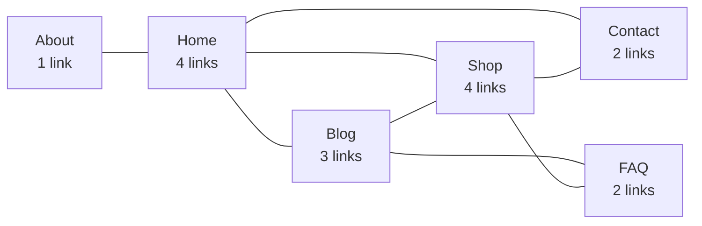
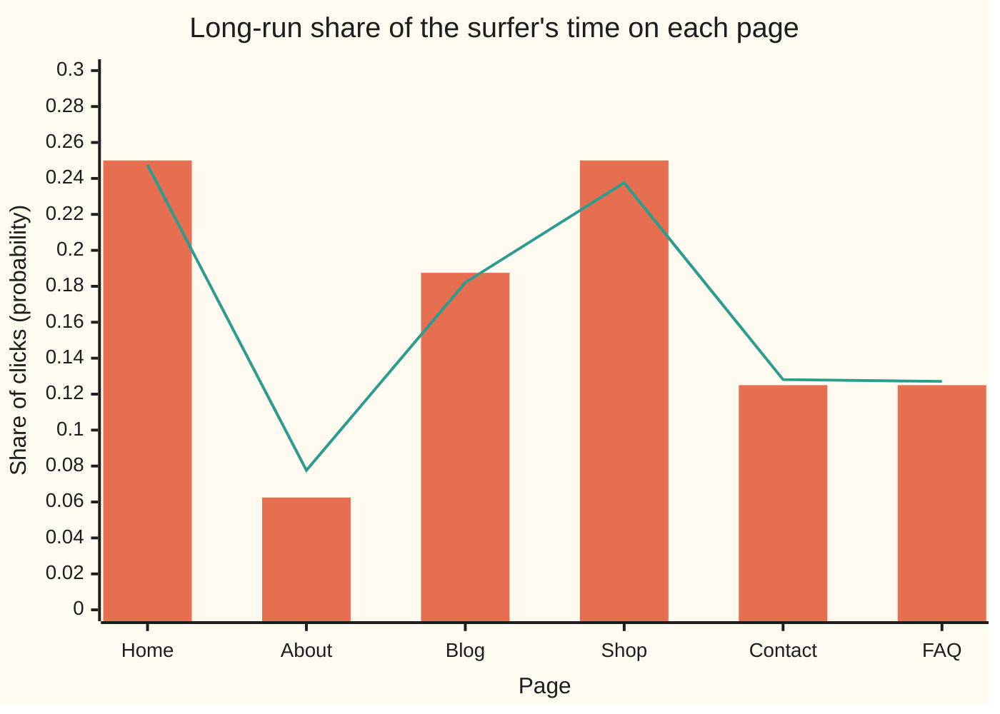
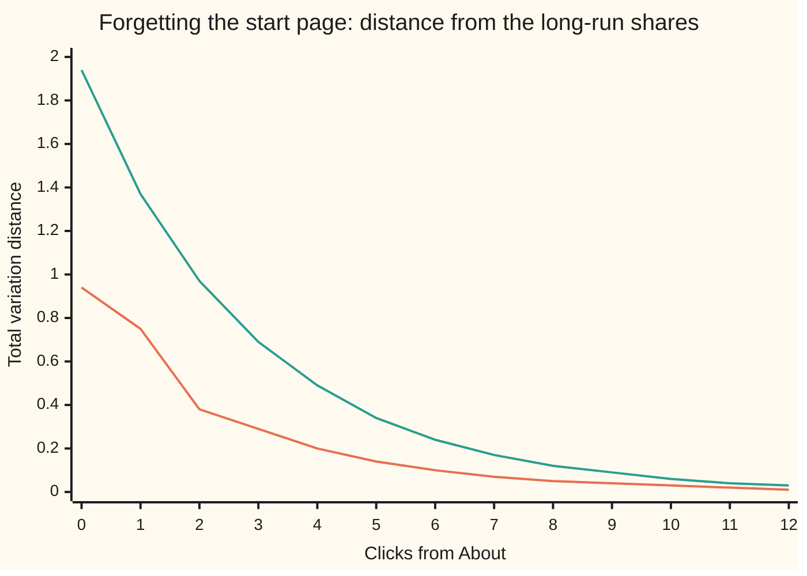

# Random walks on a graph: where a wanderer ends up, and how fast

[Syllabus](../../../SYLLABUS.md) → [Probability and statistics](../../../SYLLABUS.md#w09) → [Random Graphs and the Probabilistic Method](../../../SYLLABUS.md#w09-s14) → Random walks on a graph

---

## General Overview

A small business runs a website of six pages: Home, About, Blog, Shop, Contact and FAQ. Eight links join them, and every link works both ways: Home links to About, and About links back to Home. Home has 4 links, Shop 4, Blog 3, Contact 2, FAQ 2 and About just 1.

A visitor lands on About and never types an address. On each page the visitor clicks one of that page's links, each equally likely, and keeps going. Call this visitor the random surfer. After a few clicks, where is the surfer likely to be? After thousands, what share of the time is spent on each page?

The answer needs no simulation. In the long run the surfer spends on each page a share equal to its number of links divided by twice the total number of links: Home 4 out of 16, a quarter of the time; About 1 out of 16. The starting page is forgotten, and on this site it is forgotten after 4 clicks, by the standard yardstick defined below. From here on the surfer's path has its real name: a **random walk on a graph**, where the graph is the pages (dots) and the links (lines) between them.

The same walk, with one change, is PageRank, the ranking Google was founded on. The card computes the long-run shares three ways, measures how fast the start is forgotten, and turns the walk into PageRank.

**On a connected two-way network a random walk spends a share of time on each dot equal to its number of links over twice the number of links, whatever the start; if the network also has a loop of odd length, the chance of being on each dot settles to those same shares, and how many steps that takes is the mixing time, set by the walk's second-largest eigenvalue size.**

**What kind of fact this is:** a theorem, proved on this card in Why it works; the mixing time is a definition, and the bound on it is proved in a folded Detailed proof. The return-time rule in Step 4 is checked by simulation here and proved on [Stationary distributions](../../11-Stochastic%20processes%20and%20calculus/03-Markov%20Chains/04-stationary-distributions.md).

### The picture: the six-page site



Home, Blog and Shop form a triangle, a loop of three links. That odd loop matters in Why it works.

---

## The formula

Notation first, in words. Number the pages; $i$ and $j$ name two of them. The **degree** of page $i$, written deg(i), is its number of links. A table $P$ holds the click chances: the entry in row $i$ and column $j$, written $P_{ij}$, is the chance the next click goes to $j$ given the surfer is on $i$, a conditional probability ([Conditional probability](../01-Chance%20and%20Events/05-conditional-probability.md)). The walk is a **Markov chain**: the next page depends on the current page only, not on the path that led there. Each row of $P$ adds to 1.

$$P_{ij} = \frac{1}{\deg(i)} \text{ if } i \text{ and } j \text{ are linked, else } 0, \qquad \pi(i) = \frac{\deg(i)}{2m}$$

**Read it aloud:** from any page, each link is clicked with the same chance; in the long run a page holds its links' share of all link ends.

Here $m$ is the number of links, 8, and $2m$ = 16 counts link ends, since each link has two. The list $\pi$ (the Greek letter pi, here a list of shares, not the circle constant) is the **stationary distribution**: the shares of time, and also the one spread of chances that one more click leaves unchanged. In matrix form, with $\pi$ as a row, $\pi P = \pi$.

Where the surfer is after $t$ clicks is a row of six chances, $p_t$; one click multiplies it by $P$, so $p_t = p_0 P^t$, where $p_0$ puts chance 1 on the start page. How far $p_t$ is from $\pi$ is measured by the **total variation distance**: half the sum of the gaps, page by page.

$$\operatorname{TV}(p_t, \pi) = \tfrac12 \sum_j \lvert p_t(j) - \pi(j) \rvert, \qquad t_{\text{mix}} = \text{the first } t \text{ at which } \max_{\text{start}} \operatorname{TV}(p_t, \pi) \le \tfrac14$$

**Read it aloud:** the distance is the largest amount of chance any set of pages has too much of; the mixing time is the number of clicks after which, from the worst start, that distance is at most a quarter.

The quarter is a convention. After $k$ stretches of $t_{\text{mix}}$ clicks the distance is at most 1/2 to the power $k$, because each stretch at least halves the largest gap between walks begun on any two pages (Levin and Peres, section 4.5, in Sources); so a smaller target costs only a few more stretches.

| Symbol | Plain meaning | In our example | Push it up and the answer… |
| --- | --- | --- | --- |
| $i$, $j$ | two pages | Home, About, … | — |
| $n$, $m$ | pages; links, each two-way | 6 and 8 | each page's share is its own links over 2m |
| deg(i) | page $i$'s number of links | Home 4, About 1 | that page's share rises |
| $P$, $P_{ij}$ | the click-chance table; its row $i$, column $j$ entry | from Home, each of 4 links 1/4 | — |
| $\pi$, $\pi(i)$ | the stationary distribution: long-run share of time on page $i$ | Home 0.2500, About 0.0625 | — |
| $t$, $p_t$, $p_0$ | clicks so far; the chances of each page after $t$ clicks, and at the start | from About, Home after 3 clicks 0.5208 | more clicks: $p_t$ closer to $\pi$ |
| TV | total variation distance between two spreads of chance | 0.2917 after 3 clicks from About | — |
| $t_{\text{mix}}$ | mixing time: clicks until the worst start is within a quarter | 4 clicks | — |
| $\lambda_k$, $\lambda_*$ | eigenvalues of $P$; the largest size among all but the top one | 1, 0.4193, …, −0.7077; $\lambda_*$ = 0.7077 | $\lambda_*$ near 1: slow mixing |
| $S$, $D$, $\varphi_k$, $f$, $k$ | in the proofs: the symmetric twin of $P$; the diagonal table of degrees; the eigenvectors of $S$, numbered by $k$; a trial list of page values | — | — |
| $d$ | PageRank's damping: the chance the surfer clicks a link rather than jumping | 0.85 | nearer 1: closer to the plain walk |
| $r$, $r(i)$ | PageRank: the stationary distribution of the walk with jumps | Home 0.2475, About 0.0776 | — |

### When it holds

- **Links work both ways.** On a site with one-way links the degree rule fails. Make FAQ link only to Home and the true shares come out with FAQ at 0.0955, while its share of incoming links says 0.1333.
- **The site is connected.** Every page reachable from every other. Split the site into two pieces and the surfer never crosses: each piece has its own long-run shares and the start decides which one applies.
- **Some loop has an odd number of links.** Here Home, Blog and Shop make a triangle. On six pages joined in a ring every loop is even, the surfer alternates between two halves, and the distance from the even shares stays at 0.5000 after 60 clicks and after 61. The long-run time shares are still degree over $2m$; only the snapshot fails to settle.
- **Each link is equally likely.** With weighted links, clicks proportional to weight, the same proof gives each page its total link weight over twice the total weight.

---

## Why it works

### Step 0: balance each link, and the whole site balances

In the long run, how often does the surfer cross the Home–Blog link from Home? The surfer is on Home a share $\pi$(Home) of the time and then picks that link with chance 1/deg(Home). Try $\pi(i)$ = deg(i)/2m. Then the traffic across a link in one direction is

$$\pi(i)\,P_{ij} = \frac{\deg(i)}{2m} \cdot \frac{1}{\deg(i)} = \frac{1}{2m}.$$

The degree cancels. Every link carries 1/16 = 0.0625 of the clicks in each direction, whichever page it leaves. A link that carries as much one way as the other is in **detailed balance**, and a site where every link balances cannot pile the surfer up anywhere.

### Step 1: balanced links give the stationary distribution

The chance of being on page $j$ after one more click is the sum, over the pages $i$ linked to $j$, of $\pi(i) P_{ij}$. Each term is 1/2m, and there are deg(j) of them. The total is deg(j)/2m = $\pi(j)$. So one click leaves $\pi$ unchanged: $\pi P = \pi$. The shares also add to 1, since the degrees add to $2m$ (the handshake count: each link adds 1 to two degrees).

For Home: About, Blog, Shop and Contact each send 1/16, and 4/16 = 0.25 is Home's share.

### Step 2: the start is forgotten, if the site is connected and has an odd loop

Step 1 shows $\pi$ is *a* resting point. The theorem says more: from any start, $p_t$ approaches $\pi$. The tool is the eigenvalues of $P$ ([Eigenvalues and eigenvectors](../../03-Algebra/07-Eigenvalues%20and%20Symmetric%20Matrices/02-eigenvalues-and-eigenvectors.md)): the stretch factors of the directions a table only stretches, never turns ([The adjacency matrix](../../04-Combinatorics%20and%20graphs/09-Graphs%20-%20Dots%20and%20Lines/07-adjacency-matrix-and-walk-counting.md) reads walks off powers of a matrix; here each power carries chances instead of counts).

$P$ is not symmetric: from About to Home is 1, from Home to About 1/4. But rescaling each row by the square root of its page's degree and each column by the inverse gives a symmetric table $S$, with entries $1/\sqrt{\deg(i)\deg(j)}$ on each link. $S$ and $P$ share their eigenvalues: $S = D^{1/2} P D^{-1/2}$, with $D$ the diagonal table of degrees, so $S f = \lambda f$ exactly when $P (D^{-1/2} f) = \lambda D^{-1/2} f$. The spectral theorem ([The spectral theorem](../../03-Algebra/07-Eigenvalues%20and%20Symmetric%20Matrices/04-spectral-theorem.md): a symmetric table has real eigenvalues and perpendicular eigenvector directions) applies to $S$. For this site they are

1.0000, 0.4193, 0.1094, −0.3210, −0.5000, −0.7077.

The top one, 1, is $\pi$ itself. Every other direction in which $p_t$ can differ from $\pi$ is multiplied by its eigenvalue at each click, so it shrinks at least as fast as $\lambda_*^t$, where $\lambda_*$ is the largest size among the rest: here 0.7077, from the eigenvalue −0.7077. Its minus sign says the slowest leftover pattern flips each click: too much chance on Home, then too little.

Three facts make $\lambda_*$ less than 1. No eigenvalue is bigger than 1 in size: a click replaces each page's value by an average of its neighbours' values, never bigger in size than the list's largest value, so no list is stretched by more than 1. A connected site has only one eigenvalue equal to 1: any other list of page values left unchanged by a click would be an average of its neighbours everywhere, and on a connected site that forces every value equal. A site with an odd loop has no eigenvalue −1: a list flipped in sign by each click alternates sign along every link, which an odd loop cannot do. The ring of six has that −1, and that is why its snapshot never settles. Its time shares still do: $(-1)^t$ averages to about 0 over many clicks, so the average of $p_t$, the expected share of time on each page, tends to $\pi$.

<details>
<summary>Detailed proof: every eigenvalue between −1 and 1, one at 1, none at −1, and the distance bound</summary>

**Sizes at most 1.** Suppose $Pf = \lambda f$ for a list $f$ that is not all zero. At the page where $\lvert f \rvert$ is largest, $\lvert \lambda \rvert \lvert f \rvert$ is the size of an average of neighbours' values, each at most that largest size. So $\lvert \lambda \rvert \le 1$.

**Only one 1.** Suppose $Pf = f$ for a list $f$ of page values: each page's value is the average of its neighbours' values. Take the page where $f$ is largest. An average equals its maximum only if every term does, so every neighbour has the same value, and their neighbours too. A connected site spreads this to every page: $f$ is constant. So the eigenvalue 1 has one direction only.

**No −1.** Suppose $Pf = -f$. At the page where $\lvert f \rvert$ is largest, say $f = c > 0$ for some number c (flip the sign of $f$ if needed), the neighbours average to $-c$, so every neighbour is $-c$, their neighbours $+c$, and so on. Around a loop of odd length the signs would have to flip an odd number of times and return to the start, so $c = -c$ and $c = 0$.

**The bound.** Write $S = D^{1/2} P D^{-1/2}$, with $D$ the diagonal table of degrees, so $P^t = D^{-1/2} S^t D^{1/2}$. The spectral theorem gives $S^t = \sum_k \lambda_k^t \varphi_k \varphi_k^{\mathsf T}$ with perpendicular unit eigenvectors, and the top one is $\varphi_1(i) = \sqrt{\pi(i)}$. Starting from page $x$,
$$\frac{P^t_{xj}}{\pi(j)} - 1 = \sum_{k \ge 2} \lambda_k^t \frac{\varphi_k(x)\varphi_k(j)}{\sqrt{\pi(x)\pi(j)}}.$$
Square, weight by $\pi(j)$ and add over $j$; the eigenvectors are perpendicular, so the cross terms vanish and
$$\sum_j \pi(j)\Big(\frac{P^t_{xj}}{\pi(j)} - 1\Big)^2 = \frac{1}{\pi(x)}\sum_{k\ge2}\lambda_k^{2t}\varphi_k(x)^2 \le \lambda_*^{2t}\,\frac{1 - \pi(x)}{\pi(x)},$$
since the squares $\varphi_k(x)^2$ over all $k$ add to 1 and the $k = 1$ term is $\pi(x)$. The distance is $\tfrac12\sum_j \pi(j)\lvert P^t_{xj}/\pi(j) - 1\rvert$, a $\pi$-weighted average of sizes, which is at most the square root of the weighted average of squares. So
$$\operatorname{TV}(p_t, \pi) \le \tfrac12\,\lambda_*^t \sqrt{\frac{1}{\pi(x)} - 1}.$$

</details>

### Step 3: the start is forgotten within 4 clicks

The worst start on this site is About, the page with one link: the surfer is certain to be on Home after one click, and the six chances stay lopsided for a few more. The distance from About's start falls 0.9375, 0.7500, 0.3750, 0.2917, 0.1979: under a quarter at 4 clicks, so $t_{\text{mix}}$ = 4.

The bound from Step 2, starting at About where $\pi$ = 0.0625, is $\tfrac12 \cdot 0.7077^t \sqrt{15}$. It is 1.9365 at the start, useless there, and first falls below a quarter at 6 clicks, 0.2433. A bound is a guarantee, not a forecast: it promises 6 clicks, the truth is 4, and on a site of a million pages, where the table cannot be powered by hand, the guarantee is what is available. How big $1 - \lambda_*$ (the **spectral gap**) can be kept on large, sparse sites is the subject of Expanders.

### Step 4: time on a page is the flip side of the wait to return

If the surfer spends a quarter of the clicks on Home, visits to Home are on average 4 clicks apart. In general the average number of clicks to return to page $i$, having left it, is $1/\pi(i)$ = 2m/deg(i), a result known as Kac's lemma, proved on [Stationary distributions](../../11-Stochastic%20processes%20and%20calculus/03-Markov%20Chains/04-stationary-distributions.md). For About that is 16 clicks. Starting at About, the surfer goes to Home, wanders, and on average makes 16 clicks before About comes round again. The simulation in the code measures 16.01 with standard error 0.12.

### Step 5: PageRank is the same walk with a restart

Real web links are one-way, many pages have no links out, and some groups of pages link only among themselves; a plain walk gets stuck. Sergey Brin and Larry Page's 1998 fix: at each click, with chance $d$ = 0.85 the surfer follows a random link, and otherwise jumps to a page chosen uniformly from all $n$. The walk's stationary distribution is **PageRank**, $r$:

$$r(j) = \frac{1-d}{n} + d \sum_i r(i)\,P_{ij}.$$

**Read it aloud:** a page's rank is its share of the random jumps plus 85% of the rank flowing in along its links.

From a page with no links out there is no link to follow, so there the surfer always jumps: that page's row of $P$ is set to 1/n in every column, as if it linked to every page. Without that rule the formula's ranks add to less than 1 and are not a distribution. The jump reaches every page from every page, so the walk with jumps is connected and has odd loops (a page can jump to itself). Once every page has a next step, one stationary distribution exists, whatever the links. The same jump makes it mix fast: the jump lands in the same place whatever the start, so each click erases at least 15% of the difference between two starts.

On the six-page site, where links are two-way, the answer is close to the degree shares:



Orange bars: the plain walk, degree over 16. Teal line: PageRank with $d$ = 0.85. The jumps pull every share towards the even 1/6: About rises from 0.0625 to 0.0776, Home falls from 0.2500 to 0.2475. Home now edges out Shop, though both have 4 links: About's rank, lifted by the jumps, all flows to Home. With $d$ = 1 PageRank on a two-way site is exactly the degree shares. How PageRank is computed at the scale of the web and read as a ranking is Centrality.

A second road to the stationary distribution skips the degrees: write $\pi P = \pi$ as six equations, replace one by "the shares add to 1", and solve. The code does that, and gets the same six numbers.

---

## Worked numbers, by hand

| Step | Arithmetic | Value |
| --- | --- | --- |
| degrees | count each page's links | Home 4, About 1, Blog 3, Shop 4, Contact 2, FAQ 2 |
| link ends | 4 + 1 + 3 + 4 + 2 + 2 = 2 × 8 | 16 |
| shares | each degree over 16 | 0.2500, 0.0625, 0.1875, 0.2500, 0.1250, 0.1250 |
| traffic on a link, each way | $\pi(i)$ / deg(i), e.g. 0.1875 / 3 | 0.0625 on every link |
| Home's inflow | four links × 0.0625 | 0.25, Home's own share |
| from About, 1 click | About's only link | Home 1.0000 |
| from About, 2 clicks | Home's four links | About, Blog, Shop, Contact 0.2500 each |
| from About, 3 clicks: Home | 1/4 + 1/4 × 1/3 + 1/4 × 1/4 + 1/4 × 1/2 = 25/48 | 0.5208 |
| distance after 3 clicks | half the sum of the six gaps | 0.2917 |
| **long-run share on About** | 1 / 16 | **0.0625** |
| **average clicks between visits to About** | 16 / 1 | **16** |

About one click in 16 lands on About, and a surfer who leaves it takes 16 clicks on average to come back. After 3 clicks from About the surfer is on Home with chance 0.5208, just over twice Home's long-run share: the start is still showing.

### What breaks if you drop a piece

| Mistake | Comes out at | What went wrong |
| --- | --- | --- |
| Degree rule on one-way links (FAQ links only to Home) | FAQ 0.1333 by incoming links; truth 0.0955 | One-way links break detailed balance; the true shares need $\pi P = \pi$ solved |
| A site with no odd loop: six pages in a ring | distance 0.5000 after 60 clicks and after 61 | Eigenvalue −1: the surfer alternates halves; waiting on the spot half the time (the lazy walk) gives 0.0000 |
| Reading the shares after a few clicks | Home 0.5208 after 3 clicks from About, not 0.2500 | The start is not yet forgotten; 3 is below $t_{\text{mix}}$ = 4 |

The code prints all three.

---

## How the start is forgotten, click by click

The mystery: the surfer who starts on About and the surfer who starts on Home end up indistinguishable, yet nothing pushes either one anywhere. The forgetting is the averaging: each click mixes the chances along the links, and averaging wipes out a lopsided start the way stirring wipes out a drop of dye.

| Clicks | Home | About | Blog | Shop | Contact | FAQ | Distance |
| --- | --- | --- | --- | --- | --- | --- | --- |
| 0 | 0.0000 | 1.0000 | 0.0000 | 0.0000 | 0.0000 | 0.0000 | 0.9375 |
| 1 | 1.0000 | 0.0000 | 0.0000 | 0.0000 | 0.0000 | 0.0000 | 0.7500 |
| 2 | 0.0000 | 0.2500 | 0.2500 | 0.2500 | 0.2500 | 0.0000 | 0.3750 |
| 3 | 0.5208 | 0.0000 | 0.0625 | 0.2083 | 0.0625 | 0.1458 | 0.2917 |
| long run | 0.2500 | 0.0625 | 0.1875 | 0.2500 | 0.1250 | 0.1250 | 0 |

Home swings from 1 to 0 to 0.5208: the flip of the eigenvalue −0.7077, dying out.

```
distance from the long-run shares, starting on About (each █ = 0.025)
t = 0   ██████████████████████████████████████ 0.9375
t = 1   ██████████████████████████████         0.7500
t = 2   ███████████████                        0.3750
t = 3   ████████████                           0.2917
t = 4   ████████                               0.1979
t = 5   ██████                                 0.1441
t = 6   ████                                   0.1005
```

The measured distance against the guarantee from Step 2:



Orange: the true distance, starting on About, which is also the worst start at every click; both are plotted to two decimals. Teal: the bound $\tfrac12 \cdot 0.7077^t \sqrt{15}$. The bound sits above the truth at every click and falls at the same rate: from 6 clicks on, each click cuts both by roughly the factor 0.7077.

---

## Code, from first principles, and it actually runs

Only `math` is imported in Python, nothing in Rust. The long-run shares come by three roads: the degree formula, solving $\pi P = \pi$ by Gaussian elimination, and 20,000 simulated surfers of 40 clicks each, drawn from a SplitMix64 generator written out in both languages with seed 2026. Kac's 16 clicks is checked by one long simulated walk, cut into 20,000 return trips to About; trips between returns are independent, so their average has an honest standard error. The distances are computed by pushing all six starts through 12 clicks, and again exactly in whole numbers, since every degree divides 12, which checks the distances, the worst start and $t_{\text{mix}}$ with no rounding. $\lambda_*$ comes by two roads, Jacobi rotations (turning the symmetric table until it is diagonal) and power iteration (multiplying by the table again and again) with the top direction removed; a third check matches the sum of squared eigenvalues against a count over links, 2/(deg(i) deg(j)) per link, which is the sum of the diagonal of $P^2$. PageRank is iterated and also solved exactly. The one-way shares are also reached by 500 clicks, FAQ's also by Kac's rule (one click to Home, then the two-way walk back to FAQ), and the ring's eigenvalue −1 and distance of a half are checked.

### Python

```python
# Random walks on a graph -- the check behind the card.  Only math is imported.
# A six-page website where every link works both ways.  A surfer clicks one of
# the current page's links, each equally likely.  Where does the surfer spend
# time, how fast does the starting page stop mattering, and what is PageRank?
import math
MASK = (1 << 64) - 1
NAMES = ["Home", "About", "Blog", "Shop", "Contact", "FAQ"]
EDGES = [(0, 1), (0, 2), (0, 3), (0, 4), (2, 3), (2, 5), (3, 4), (3, 5)]
class Rng:                                        # SplitMix64, written out
    def __init__(self, seed):
        self.s = seed
    def below(self, k):                           # a whole number 0 .. k-1, equally likely
        self.s = (self.s + 0x9E3779B97F4A7C15) & MASK
        z = ((self.s ^ (self.s >> 30)) * 0xBF58476D1CE4E5B9) & MASK
        z = ((z ^ (z >> 27)) * 0x94D049BB133111EB) & MASK
        return int(((z ^ (z >> 31)) >> 11) / 2.0 ** 53 * k)
step_matrix = lambda out: [[out[i].count(j) / len(out[i]) for j in range(6)] for i in range(6)]
advance = lambda p, P: [sum(p[i] * P[i][j] for i in range(6)) for j in range(6)]   # one click
tv = lambda p, q: 0.5 * sum(abs(a - b) for a, b in zip(p, q))   # total variation distance
def solve(M, b):                                  # Gaussian elimination with row swaps
    n, A = len(b), [M[i][:] + [b[i]] for i in range(len(b))]
    for c in range(n):
        r = max(range(c, n), key=lambda k: abs(A[k][c]))
        A[c], A[r] = A[r], A[c]
        for k in range(c + 1, n):
            A[k] = [x - A[k][c] / A[c][c] * y for x, y in zip(A[k], A[c])]
    x = [0.0] * n
    for c in range(n - 1, -1, -1):
        x[c] = (A[c][n] - sum(A[c][j] * x[j] for j in range(c + 1, n))) / A[c][c]
    return x
def stationary(P):                                # road two: pi P = pi, entries add to 1
    return solve([[P[j][i] - (i == j) for j in range(6)] for i in range(5)] + [[1.0] * 6], [0.0] * 5 + [1.0])
def jacobi(S):                                    # every eigenvalue of a symmetric matrix
    A = [row[:] for row in S]
    for _ in range(30):
        for p in range(5):
            for q in range(p + 1, 6):
                if abs(A[p][q]) < 1e-15:
                    continue
                th = 0.5 * math.atan2(2 * A[p][q], A[q][q] - A[p][p])
                c, s = math.cos(th), math.sin(th)
                for k in range(6):                # rotate columns p and q, then rows
                    A[k][p], A[k][q] = c * A[k][p] - s * A[k][q], s * A[k][p] + c * A[k][q]
                for k in range(6):
                    A[p][k], A[q][k] = c * A[p][k] - s * A[q][k], s * A[p][k] + c * A[q][k]
    return sorted((A[i][i] for i in range(6)), reverse=True)
f4 = lambda xs: " ".join(f"{x:.4f}" for x in xs)
out = [[b for a, b in EDGES if a == i] + [a for a, b in EDGES if b == i] for i in range(6)]
P, deg, m = step_matrix(out), [len(o) for o in out], len(EDGES)
pi_deg = [d / (2 * m) for d in deg]               # road one: degree over twice the links
pi_sol = stationary(P)
print(f"pages {' '.join(NAMES)}; links m = {m}, 2m = {2 * m}")
print("degrees", " ".join(str(d) for d in deg))
print("pi by degree / 2m ", f4(pi_deg))
print("pi by solving     ", f4(pi_sol))
print("flow along a link, each way, pi(i)/deg(i):", f4(pi_deg[i] / deg[i] for i in range(6)))
dist, d_all, d_about = [[float(i == j) for j in range(6)] for i in range(6)], [], []
V, tv_exact = [[int(i == j) for j in range(6)] for i in range(6)], []   # road two: 12^t P^t, whole numbers
for t in range(13):                               # every start page at once, 0 to 12 clicks
    if 1 <= t <= 3:
        print(f"from About, t = {t}:", f4(dist[1]), f"TV {tv(dist[1], pi_deg):.4f}")
    d_all.append(max(tv(row, pi_deg) for row in dist))
    d_about.append(tv(dist[1], pi_deg))
    tv_exact.append(max(sum(abs(2 * m * v[j] - deg[j] * 12 ** t) for j in range(6)) for v in V) / (4 * m * 12 ** t))
    dist = [advance(row, P) for row in dist]
    V = [[sum(v[i] * (12 // deg[i]) for i in range(6) if j in out[i]) for j in range(6)] for v in V]
t_mix = next(t for t in range(13) if d_all[t] <= 0.25)
print("TV from About, t = 0..12:  ", f4(d_about))
print("worst start TV, t = 0..12: ", f4(d_all))
print(f"mixing time t_mix(1/4) = {t_mix} clicks")
S = [[P[i][j] * math.sqrt(deg[i] / deg[j]) for j in range(6)] for i in range(6)]
eig = jacobi(S)
lam = max(abs(e) for e in eig[1:])
v, x = [math.sqrt(q) for q in pi_deg], [1.0, -2.0, 3.0, -1.0, 0.5, 2.0]
for _ in range(3000):                             # road two: power iteration, top direction removed
    x = [sum(S[i][j] * x[j] for j in range(6)) for i in range(6)]
    dot = sum(a * b for a, b in zip(v, x))
    x = [a - dot * b for a, b in zip(x, v)]
    nx = math.sqrt(sum(a * a for a in x))
    x = [a / nx for a in x]
lam_pow = math.sqrt(sum(sum(S[i][j] * x[j] for j in range(6)) ** 2 for i in range(6)))
sq_eig, sq_edges = sum(e * e for e in eig), sum(2 / (deg[a] * deg[b]) for a, b in EDGES)
print("eigenvalues of P:", f4(eig))
print(f"lambda* by Jacobi {lam:.4f}, by power iteration {lam_pow:.4f}")
print(f"sum of squared eigenvalues {sq_eig:.4f}; sum over links of 2/(deg deg) {sq_edges:.4f}")
bound = [0.5 * math.sqrt(1 / pi_deg[1] - 1) * lam ** t for t in range(13)]
print("bound from About, t = 0..12:", f4(bound))
print("figure, TV from About", " ".join(f"{x:.2f}" for x in d_about) + "\nfigure, bound        ", " ".join(f"{x:.2f}" for x in bound))
rng, N, CLICKS, count = Rng(2026), 20000, 40, [0] * 6   # road three: simulated surfers
for _ in range(N):
    page = 1
    for _ in range(CLICKS):
        page = out[page][rng.below(deg[page])]
    count[page] += 1
freq = [c / N for c in count]
se = [math.sqrt(f * (1 - f) / N) for f in freq]
print(f"{N} surfers, {CLICKS} clicks from About:", f4(freq))
print("  standard errors:                  ", f4(se))
page, steps, trips = 1, 0, []
while len(trips) < N:                             # return trips to About, on one long walk
    page, steps = out[page][rng.below(deg[page])], steps + 1
    if page == 1:
        trips.append(steps)
        steps = 0
mt = sum(trips) / N
st = math.sqrt(sum((a - mt) ** 2 for a in trips) / (N - 1) / N)
print(f"mean return time to About {mt:.2f} clicks (se {st:.2f}); 1/pi = {1 / pi_deg[1]:.2f}")
D, r = 0.85, [1 / 6] * 6                          # PageRank on the same site
for _ in range(200):
    r = [(1 - D) / 6 + D * y for y in advance(r, P)]
r_sol = solve([[float(i == j) - D * P[j][i] for j in range(6)] for i in range(6)], [(1 - D) / 6] * 6)
print("PageRank d = 0.85, iterated", f4(r))
print("PageRank d = 0.85, solved  ", f4(r_sol))
one_way = out[:5] + [[0]]                         # FAQ links to Home only; every other link kept
P1, pw = step_matrix(one_way), [1 / 6] * 6
pi_one, hit = stationary(P1), solve([[float(i == j) - P[i][j] * (j != 5) for j in range(6)] for i in range(6)], [1.0] * 6)
for _ in range(500): pw = advance(pw, P1)         # road two: 500 clicks from the even spread
indeg = [sum(o.count(j) for o in one_way) for j in range(6)]
print("one-way site, true pi:     ", f4(pi_one))
print(f"one-way site, in-degree/{sum(indeg)}:", f4(k / sum(indeg) for k in indeg))
ring = step_matrix([[(k - 1) % 6, (k + 1) % 6] for k in range(6)])
lazy = [[0.5 * ring[i][j] + 0.5 * (i == j) for j in range(6)] for i in range(6)]
a, b, flat = [1.0, 0, 0, 0, 0, 0], [1.0, 0, 0, 0, 0, 0], [1 / 6] * 6
for t in range(60):
    a, b = advance(a, ring), advance(b, lazy)
print(f"ring of six, TV after 60 clicks {tv(a, flat):.4f}, after 61 {tv(advance(a, ring), flat):.4f}; lazy walk after 60 {tv(b, flat):.4f}")
assert max(abs(x - y) for x, y in zip(pi_deg, pi_sol)) < 1e-12        # formula vs solving
assert all(abs(f - q) < 4 * s for f, q, s in zip(freq, pi_deg, se))    # simulation vs formula
assert abs(mt - 2 * m / deg[1]) < 4 * st                               # return time vs 2m/deg
assert abs(lam - lam_pow) < 1e-9                                       # two roads to lambda*
assert abs(sq_eig - sq_edges) < 1e-9                                   # Jacobi vs a link count
assert all(d <= bound[t] + 1e-12 for t, d in enumerate(d_about))        # the spectral bound holds
assert all(abs(d - e) + abs(a - e) < 1e-12 for d, a, e in zip(d_all, d_about, tv_exact))   # distances, two roads; About worst
assert t_mix == next(t for t, e in enumerate(tv_exact) if e <= 0.25)    # mixing time, two roads
assert max(abs(x - y) for x, y in zip(r, r_sol)) < 1e-12               # PageRank, two roads
assert max(abs(x - y) for x, y in zip(pi_one, pw)) < 1e-12             # one-way shares, two roads
assert abs(pi_one[5] * (1 + hit[0]) - 1) < 1e-12   # road three, Kac: FAQ clicks to Home, then hit[0] clicks back on the two-way site
assert abs(min(jacobi(ring)) + 1) < 1e-9                               # the ring's eigenvalue -1
assert abs(tv(a, flat) - 0.5) + abs(tv(advance(a, ring), flat) - 0.5) < 1e-12   # parity: all on one half, which holds 1/2
print("ALL CHECKS PASS")
```

**Ran 2026-10-07 on macOS, Python 3.14.6, standard library only. All checks passed. Output, pasted from the run:**

```
pages Home About Blog Shop Contact FAQ; links m = 8, 2m = 16
degrees 4 1 3 4 2 2
pi by degree / 2m  0.2500 0.0625 0.1875 0.2500 0.1250 0.1250
pi by solving      0.2500 0.0625 0.1875 0.2500 0.1250 0.1250
flow along a link, each way, pi(i)/deg(i): 0.0625 0.0625 0.0625 0.0625 0.0625 0.0625
from About, t = 1: 1.0000 0.0000 0.0000 0.0000 0.0000 0.0000 TV 0.7500
from About, t = 2: 0.0000 0.2500 0.2500 0.2500 0.2500 0.0000 TV 0.3750
from About, t = 3: 0.5208 0.0000 0.0625 0.2083 0.0625 0.1458 TV 0.2917
TV from About, t = 0..12:   0.9375 0.7500 0.3750 0.2917 0.1979 0.1441 0.1005 0.0718 0.0505 0.0359 0.0254 0.0180 0.0127
worst start TV, t = 0..12:  0.9375 0.7500 0.3750 0.2917 0.1979 0.1441 0.1005 0.0718 0.0505 0.0359 0.0254 0.0180 0.0127
mixing time t_mix(1/4) = 4 clicks
eigenvalues of P: 1.0000 0.4193 0.1094 -0.3210 -0.5000 -0.7077
lambda* by Jacobi 0.7077, by power iteration 0.7077
sum of squared eigenvalues 2.0417; sum over links of 2/(deg deg) 2.0417
bound from About, t = 0..12: 1.9365 1.3705 0.9699 0.6864 0.4858 0.3438 0.2433 0.1722 0.1219 0.0862 0.0610 0.0432 0.0306
figure, TV from About 0.94 0.75 0.38 0.29 0.20 0.14 0.10 0.07 0.05 0.04 0.03 0.02 0.01
figure, bound         1.94 1.37 0.97 0.69 0.49 0.34 0.24 0.17 0.12 0.09 0.06 0.04 0.03
20000 surfers, 40 clicks from About: 0.2512 0.0619 0.1863 0.2493 0.1240 0.1273
  standard errors:                   0.0031 0.0017 0.0028 0.0031 0.0023 0.0024
mean return time to About 16.01 clicks (se 0.12); 1/pi = 16.00
PageRank d = 0.85, iterated 0.2475 0.0776 0.1821 0.2376 0.1281 0.1271
PageRank d = 0.85, solved   0.2475 0.0776 0.1821 0.2376 0.1281 0.1271
one-way site, true pi:      0.3455 0.0864 0.1364 0.2000 0.1364 0.0955
one-way site, in-degree/15: 0.3333 0.0667 0.1333 0.2000 0.1333 0.1333
ring of six, TV after 60 clicks 0.5000, after 61 0.5000; lazy walk after 60 0.0000
ALL CHECKS PASS
```

### Rust

Same numbers, same labels, built with `rustc --edition 2021 -O`; the two outputs are byte-identical.

```rust
// Random walks on a graph -- the same check as the Python, in Rust.  No crates.
// A six-page website where every link works both ways.  A surfer clicks one of
// the current page's links, each equally likely.  Where does the surfer spend
// time, how fast does the starting page stop mattering, and what is PageRank?
type M = Vec<Vec<f64>>;
const NAMES: [&str; 6] = ["Home", "About", "Blog", "Shop", "Contact", "FAQ"];
const EDGES: [(usize, usize); 8] = [(0, 1), (0, 2), (0, 3), (0, 4), (2, 3), (2, 5), (3, 4), (3, 5)];
struct Rng { s: u64 }                             // SplitMix64, written out
impl Rng {
    fn below(&mut self, k: usize) -> usize {      // a whole number 0 .. k-1, equally likely
        self.s = self.s.wrapping_add(0x9E3779B97F4A7C15);
        let mut z = self.s;
        z = (z ^ (z >> 30)).wrapping_mul(0xBF58476D1CE4E5B9);
        z = (z ^ (z >> 27)).wrapping_mul(0x94D049BB133111EB);
        (((z ^ (z >> 31)) >> 11) as f64 / 9007199254740992.0 * k as f64) as usize
    }
}
fn step_matrix(out: &[Vec<usize>]) -> M {         // P[i][j]: chance one click goes from i to j
    (0..6).map(|i| (0..6).map(|j| out[i].iter().filter(|&&x| x == j).count() as f64
        / out[i].len() as f64).collect()).collect()
}
fn advance(p: &[f64], pm: &M) -> Vec<f64> { (0..6).map(|j| (0..6).map(|i| p[i] * pm[i][j]).sum()).collect() }   // one click
fn tv(p: &[f64], q: &[f64]) -> f64 { 0.5 * p.iter().zip(q).map(|(a, b)| (a - b).abs()).sum::<f64>() }   // total variation
fn solve(m: &M, b: &[f64]) -> Vec<f64> {          // Gaussian elimination with row swaps
    let n = b.len();
    let mut a: M = (0..n).map(|i| { let mut r = m[i].clone(); r.push(b[i]); r }).collect();
    for c in 0..n {
        let mut r = c;
        for k in c..n { if a[k][c].abs() > a[r][c].abs() { r = k } }
        a.swap(c, r);
        for k in c + 1..n {
            let f = a[k][c] / a[c][c];
            for j in 0..=n { a[k][j] -= f * a[c][j] }
        }
    }
    let mut x = vec![0.0; n];
    for c in (0..n).rev() {
        let s: f64 = (c + 1..n).map(|j| a[c][j] * x[j]).sum();
        x[c] = (a[c][n] - s) / a[c][c];
    }
    x
}
fn stationary(pm: &M) -> Vec<f64> {               // road two: pi P = pi, entries add to 1
    let m: M = (0..5).map(|i| (0..6).map(|j| pm[j][i] - (i == j) as i32 as f64).collect()).chain([vec![1.0; 6]]).collect();
    solve(&m, &[0.0, 0.0, 0.0, 0.0, 0.0, 1.0])
}
fn jacobi(s: &M) -> Vec<f64> {                    // every eigenvalue of a symmetric matrix
    let mut a = s.clone();
    for _ in 0..30 {
        for p in 0..5 {
            for q in p + 1..6 {
                if a[p][q].abs() < 1e-15 { continue }
                let th = 0.5 * (2.0 * a[p][q]).atan2(a[q][q] - a[p][p]);
                let (c, sn) = (th.cos(), th.sin());       // rotate columns p and q, then rows p and q
                for k in 0..6 { let (x, y) = (a[k][p], a[k][q]); (a[k][p], a[k][q]) = (c * x - sn * y, sn * x + c * y) }
                for k in 0..6 { let (x, y) = (a[p][k], a[q][k]); (a[p][k], a[q][k]) = (c * x - sn * y, sn * x + c * y) }
            }
        }
    }
    let mut e: Vec<f64> = (0..6).map(|i| a[i][i]).collect();
    e.sort_by(|x, y| y.partial_cmp(x).unwrap());
    e
}
fn f4(xs: &[f64]) -> String { xs.iter().map(|x| format!("{:.4}", x)).collect::<Vec<_>>().join(" ") }
fn main() {
    let out: Vec<Vec<usize>> = (0..6).map(|i| EDGES.iter().filter(|e| e.0 == i).map(|e| e.1)
        .chain(EDGES.iter().filter(|e| e.1 == i).map(|e| e.0)).collect()).collect();
    let (pm, m) = (step_matrix(&out), EDGES.len());
    let deg: Vec<usize> = out.iter().map(|o| o.len()).collect();
    let pi_deg: Vec<f64> = deg.iter().map(|&d| d as f64 / (2 * m) as f64).collect();   // road one
    let pi_sol = stationary(&pm);
    println!("pages {}; links m = {}, 2m = {}", NAMES.join(" "), m, 2 * m);
    println!("degrees {}", deg.iter().map(|d| d.to_string()).collect::<Vec<_>>().join(" "));
    println!("pi by degree / 2m  {}", f4(&pi_deg));
    println!("pi by solving      {}", f4(&pi_sol));
    println!("flow along a link, each way, pi(i)/deg(i): {}", f4(&(0..6).map(|i| pi_deg[i] / deg[i] as f64).collect::<Vec<_>>()));
    let mut dist: M = (0..6).map(|i| (0..6).map(|j| (i == j) as i32 as f64).collect()).collect();
    let mut vv: Vec<Vec<i64>> = (0..6).map(|i| (0..6).map(|j| (i == j) as i64).collect()).collect();   // road two: 12^t P^t, whole numbers
    let (mut d_all, mut d_about, mut tv_exact) = (vec![], vec![], vec![]);
    for t in 0..13 {                              // every start page at once, 0 to 12 clicks
        if (1..=3).contains(&t) {
            println!("from About, t = {}: {} TV {:.4}", t, f4(&dist[1]), tv(&dist[1], &pi_deg));
        }
        d_all.push(dist.iter().map(|r| tv(r, &pi_deg)).fold(0.0, f64::max));
        d_about.push(tv(&dist[1], &pi_deg));
        tv_exact.push(vv.iter().map(|v| (0..6).map(|j| (2 * m as i64 * v[j] - deg[j] as i64 * 12i64.pow(t)).abs()).sum::<i64>()).max().unwrap() as f64 / (4 * m as i64 * 12i64.pow(t)) as f64);
        dist = dist.iter().map(|r| advance(r, &pm)).collect();
        vv = vv.iter().map(|v| (0..6).map(|j| (0..6).filter(|&i| out[i].contains(&j)).map(|i| v[i] * (12 / deg[i] as i64)).sum()).collect()).collect();
    }
    let t_mix = (0..13).find(|&t| d_all[t] <= 0.25).unwrap();
    println!("TV from About, t = 0..12:   {}", f4(&d_about));
    println!("worst start TV, t = 0..12:  {}", f4(&d_all));
    println!("mixing time t_mix(1/4) = {} clicks", t_mix);
    let s: M = (0..6).map(|i| (0..6).map(|j| pm[i][j] * (deg[i] as f64 / deg[j] as f64).sqrt()).collect()).collect();
    let eig = jacobi(&s);
    let lam = eig[1..].iter().map(|e| e.abs()).fold(0.0, f64::max);
    let v: Vec<f64> = pi_deg.iter().map(|q| q.sqrt()).collect();
    let mut x = vec![1.0, -2.0, 3.0, -1.0, 0.5, 2.0];
    let mul = |x: &[f64]| -> Vec<f64> { (0..6).map(|i| (0..6).map(|j| s[i][j] * x[j]).sum()).collect() };
    for _ in 0..3000 {                            // road two: power iteration, top direction removed
        let y = mul(&x);
        let dot: f64 = v.iter().zip(&y).map(|(a, b)| a * b).sum();
        let z: Vec<f64> = y.iter().zip(&v).map(|(a, b)| a - dot * b).collect();
        let nx = z.iter().map(|a| a * a).sum::<f64>().sqrt();
        x = z.iter().map(|a| a / nx).collect();
    }
    let lam_pow = mul(&x).iter().map(|a| a * a).sum::<f64>().sqrt();
    let (sq_eig, sq_edges): (f64, f64) = (eig.iter().map(|e| e * e).sum(),
        EDGES.iter().map(|&(a, b)| 2.0 / (deg[a] * deg[b]) as f64).sum());
    println!("eigenvalues of P: {}", f4(&eig));
    println!("lambda* by Jacobi {:.4}, by power iteration {:.4}", lam, lam_pow);
    println!("sum of squared eigenvalues {:.4}; sum over links of 2/(deg deg) {:.4}", sq_eig, sq_edges);
    let bound: Vec<f64> = (0..13).map(|t| 0.5 * (1.0 / pi_deg[1] - 1.0).sqrt() * lam.powi(t)).collect();
    println!("bound from About, t = 0..12: {}", f4(&bound));
    let f2 = |xs: &[f64]| xs.iter().map(|x| format!("{:.2}", x)).collect::<Vec<_>>().join(" ");
    println!("figure, TV from About {}\nfigure, bound         {}", f2(&d_about), f2(&bound));
    let (mut rng, n, clicks) = (Rng { s: 2026 }, 20000usize, 40);   // road three: simulated surfers
    let mut count = [0usize; 6];
    for _ in 0..n {
        let mut page = 1;
        for _ in 0..clicks { page = out[page][rng.below(deg[page])] }
        count[page] += 1
    }
    let freq: Vec<f64> = count.iter().map(|&c| c as f64 / n as f64).collect();
    let se: Vec<f64> = freq.iter().map(|f| (f * (1.0 - f) / n as f64).sqrt()).collect();
    println!("{} surfers, {} clicks from About: {}", n, clicks, f4(&freq));
    println!("  standard errors:                   {}", f4(&se));
    let (mut page, mut steps, mut trips) = (1usize, 0usize, Vec::new());
    while trips.len() < n {                       // return trips to About, on one long walk
        (page, steps) = (out[page][rng.below(deg[page])], steps + 1);
        if page == 1 { trips.push(steps as f64); steps = 0 }
    }
    let mt = trips.iter().sum::<f64>() / n as f64;   // mean trip, then its standard error
    let st = (trips.iter().map(|a| (a - mt) * (a - mt)).sum::<f64>() / (n - 1) as f64 / n as f64).sqrt();
    println!("mean return time to About {:.2} clicks (se {:.2}); 1/pi = {:.2}", mt, st, 1.0 / pi_deg[1]);
    let (dd, mut r) = (0.85, vec![1.0 / 6.0; 6]);   // PageRank on the same site
    for _ in 0..200 { r = advance(&r, &pm).iter().map(|y| (1.0 - dd) / 6.0 + dd * y).collect() }
    let g: M = (0..6).map(|i| (0..6).map(|j| (i == j) as i32 as f64 - dd * pm[j][i]).collect()).collect();
    let r_sol = solve(&g, &[(1.0 - dd) / 6.0; 6]);
    println!("PageRank d = 0.85, iterated {}", f4(&r));
    println!("PageRank d = 0.85, solved   {}", f4(&r_sol));
    let one_way: Vec<Vec<usize>> = out[..5].iter().cloned().chain([vec![0]]).collect();   // FAQ links to Home only
    let (p1, mut pw) = (step_matrix(&one_way), vec![1.0 / 6.0; 6]);
    let (pi_one, hit) = (stationary(&p1), solve(&(0..6).map(|i| (0..6).map(|j| (i == j) as i32 as f64 - pm[i][j] * (j != 5) as i32 as f64).collect()).collect(), &[1.0; 6]));
    for _ in 0..500 { pw = advance(&pw, &p1) }       // road two: 500 clicks from the even spread
    let indeg: Vec<f64> = (0..6).map(|j| one_way.iter().flatten().filter(|&&x| x == j).count() as f64).collect();
    let tot: f64 = indeg.iter().sum();
    println!("one-way site, true pi:      {}", f4(&pi_one));
    println!("one-way site, in-degree/{}: {}", tot, f4(&indeg.iter().map(|k| k / tot).collect::<Vec<_>>()));
    let ring = step_matrix(&(0..6).map(|k| vec![(k + 5) % 6, (k + 1) % 6]).collect::<Vec<_>>());
    let lazy: M = (0..6).map(|i| (0..6).map(|j| 0.5 * ring[i][j] + 0.5 * (i == j) as i32 as f64).collect()).collect();
    let (mut a, mut b, flat) = (vec![1.0, 0.0, 0.0, 0.0, 0.0, 0.0], vec![1.0, 0.0, 0.0, 0.0, 0.0, 0.0], [1.0 / 6.0; 6]);
    for _ in 0..60 { a = advance(&a, &ring); b = advance(&b, &lazy) }
    println!("ring of six, TV after 60 clicks {:.4}, after 61 {:.4}; lazy walk after 60 {:.4}", tv(&a, &flat), tv(&advance(&a, &ring), &flat), tv(&b, &flat));
    let maxdiff = |x: &[f64], y: &[f64]| x.iter().zip(y).map(|(p, q)| (p - q).abs()).fold(0.0, f64::max);
    assert!(maxdiff(&pi_deg, &pi_sol) < 1e-12);                              // formula vs solving
    assert!((0..6).all(|i| (freq[i] - pi_deg[i]).abs() < 4.0 * se[i]));     // simulation vs formula
    assert!((mt - (2 * m) as f64 / deg[1] as f64).abs() < 4.0 * st);        // return time vs 2m/deg
    assert!((lam - lam_pow).abs() < 1e-9);                                  // two roads to lambda*
    assert!((sq_eig - sq_edges).abs() < 1e-9);                              // Jacobi vs a link count
    assert!((0..13).all(|t| d_about[t] <= bound[t] + 1e-12));               // the spectral bound holds
    assert!((0..13).all(|t| (d_all[t] - tv_exact[t]).abs() + (d_about[t] - tv_exact[t]).abs() < 1e-12));   // distances, two roads; About worst
    assert!(t_mix == (0..13).find(|&t| tv_exact[t] <= 0.25).unwrap());     // mixing time, two roads
    assert!(maxdiff(&r, &r_sol) < 1e-12);                                   // PageRank, two roads
    assert!(maxdiff(&pi_one, &pw) < 1e-12);                                 // one-way shares, two roads
    assert!((pi_one[5] * (1.0 + hit[0]) - 1.0).abs() < 1e-12);   // road three, Kac: FAQ clicks to Home, then hit[0] clicks back on the two-way site
    assert!((jacobi(&ring)[5] + 1.0).abs() < 1e-9);                         // the ring's eigenvalue -1
    assert!((tv(&a, &flat) - 0.5).abs() + (tv(&advance(&a, &ring), &flat) - 0.5).abs() < 1e-12);   // parity: all on one half, which holds 1/2
    println!("ALL CHECKS PASS");
}
```

**Ran 2026-10-07 on macOS, rustc 1.98.1, no crates. All checks passed. Output, pasted from the run:**

```
pages Home About Blog Shop Contact FAQ; links m = 8, 2m = 16
degrees 4 1 3 4 2 2
pi by degree / 2m  0.2500 0.0625 0.1875 0.2500 0.1250 0.1250
pi by solving      0.2500 0.0625 0.1875 0.2500 0.1250 0.1250
flow along a link, each way, pi(i)/deg(i): 0.0625 0.0625 0.0625 0.0625 0.0625 0.0625
from About, t = 1: 1.0000 0.0000 0.0000 0.0000 0.0000 0.0000 TV 0.7500
from About, t = 2: 0.0000 0.2500 0.2500 0.2500 0.2500 0.0000 TV 0.3750
from About, t = 3: 0.5208 0.0000 0.0625 0.2083 0.0625 0.1458 TV 0.2917
TV from About, t = 0..12:   0.9375 0.7500 0.3750 0.2917 0.1979 0.1441 0.1005 0.0718 0.0505 0.0359 0.0254 0.0180 0.0127
worst start TV, t = 0..12:  0.9375 0.7500 0.3750 0.2917 0.1979 0.1441 0.1005 0.0718 0.0505 0.0359 0.0254 0.0180 0.0127
mixing time t_mix(1/4) = 4 clicks
eigenvalues of P: 1.0000 0.4193 0.1094 -0.3210 -0.5000 -0.7077
lambda* by Jacobi 0.7077, by power iteration 0.7077
sum of squared eigenvalues 2.0417; sum over links of 2/(deg deg) 2.0417
bound from About, t = 0..12: 1.9365 1.3705 0.9699 0.6864 0.4858 0.3438 0.2433 0.1722 0.1219 0.0862 0.0610 0.0432 0.0306
figure, TV from About 0.94 0.75 0.38 0.29 0.20 0.14 0.10 0.07 0.05 0.04 0.03 0.02 0.01
figure, bound         1.94 1.37 0.97 0.69 0.49 0.34 0.24 0.17 0.12 0.09 0.06 0.04 0.03
20000 surfers, 40 clicks from About: 0.2512 0.0619 0.1863 0.2493 0.1240 0.1273
  standard errors:                   0.0031 0.0017 0.0028 0.0031 0.0023 0.0024
mean return time to About 16.01 clicks (se 0.12); 1/pi = 16.00
PageRank d = 0.85, iterated 0.2475 0.0776 0.1821 0.2376 0.1281 0.1271
PageRank d = 0.85, solved   0.2475 0.0776 0.1821 0.2376 0.1281 0.1271
one-way site, true pi:      0.3455 0.0864 0.1364 0.2000 0.1364 0.0955
one-way site, in-degree/15: 0.3333 0.0667 0.1333 0.2000 0.1333 0.1333
ring of six, TV after 60 clicks 0.5000, after 61 0.5000; lazy walk after 60 0.0000
ALL CHECKS PASS
```

> [!TIP]
> **Try changing**
> - **Remove the jumps.** Guess first: what does PageRank become with $d$ = 1? Set `D, r = 1.0, ...` in Python. The run stops at the solve with a division by zero: without jumps the equations lose the term that fixes their total, so they have endless solutions. Move the iterated print above the solve and it shows the degree shares, 0.2500 0.0625 0.1875 0.2500 0.1250 0.1250.
> - **Stop the surfers early.** Guess first: what do 20,000 surfers look like after 2 clicks? Set `CLICKS` to 2. The shares sit near the 2-click row, 0.0000 0.2500 0.2500 0.2500 0.2500 0.0000, and the simulation assert fails: the start is not forgotten.
> - **Change the seed.** Guess first: does the verdict move? Replace 2026 with 7. Every simulated share and the return time move by a standard error or two, and every assert still passes, since each allows four standard errors.
> - **Start the surfers on Home.** Guess first: do 40 clicks still forget the start? Change `page = 1` inside the surfer loop to `page = 0`. The shares, still labelled "from About", stay within sampling error of the degree shares and every assert passes; after 40 clicks both starts are long forgotten.

---

## The usual mistake

> [!warning]
> **Reading the long-run share as the chance right now.** $\pi$(Home) = 0.2500 is the chance of being on Home after the start is forgotten, or the share of a long stretch of clicks. Three clicks after landing on About the chance is 0.5208. The share is a statement about many clicks, not the next one, and it holds only after about $t_{\text{mix}}$ clicks.
>
> - **Counting incoming links on a one-way site.** In-degree shares put FAQ at 0.1333; the truth is 0.0955. The degree rule is for two-way links only.
> - **Assuming every connected site settles.** The ring of six has distance 0.5000 after 60 clicks and after 61; it needs an odd loop, or a lazy step.
> - **Taking the bound for the mixing time.** The spectral bound says at most 6 clicks from About; the truth is 4. A bound answers "how long at worst", not "how long".
> - **Treating consecutive visits as independent draws.** Clicks on one walk are linked; a standard error from counting visits on one walk as independent is too small. The code uses independent surfers, or whole return trips, which are independent.

---

## Where you meet it in real life

- **Search ranking.** PageRank is the stationary distribution of the surfer with jumps, computed over billions of pages by repeating one click on all of them at once (Centrality).
- **Sampling a huge network.** To pick a user of a social network at random without the full list, walk friend to friend and correct for degree: a walk lands on people in proportion to their friend counts. On a random network ([Random graphs](01-random-graphs-erdos-renyi.md)) the walk only reaches its own piece, which is why [The giant component](02-the-giant-component.md) matters.
- **Shuffling and simulation.** A shuffle of a deck is a random walk on the orderings of the deck; its mixing time is how many shuffles make the order random. Markov chain Monte Carlo draws samples by running a walk past its mixing time.
- **Mixing in networks.** Well-connected networks with few links, expanders, mix in a number of steps that grows only with the logarithm of their size (Expanders).

> **Say it back**
> A random walk on a graph moves from a dot to a randomly chosen neighbour at each step. Each link then carries the same traffic both ways, 1 over twice the number of links, so each dot's long-run share of time is its degree over twice the number of links. If the graph is connected and has an odd loop, the walk forgets its start; the mixing time counts the steps until it is within a quarter of the long-run shares, and the second-largest eigenvalue size bounds how fast that happens. PageRank is the same walk with a chance of jumping anywhere, which makes the answer unique on any web.

---

## What this builds on

- [Random graphs](01-random-graphs-erdos-renyi.md): graphs as dots and links drawn by chance, on which walks run.
- [Conditional probability](../01-Chance%20and%20Events/05-conditional-probability.md): each click chance is a chance given the current page.
- [The adjacency matrix](../../04-Combinatorics%20and%20graphs/09-Graphs%20-%20Dots%20and%20Lines/07-adjacency-matrix-and-walk-counting.md): the table of links, and walks read off its powers.

## Where this goes next

- [Stationary distributions](../../11-Stochastic%20processes%20and%20calculus/03-Markov%20Chains/04-stationary-distributions.md): Markov chains in general, with Kac's return-time rule proved.
- Centrality: PageRank at web scale, and other ways to rank the dots of a network.
- Expanders: sparse networks whose spectral gap stays large, so walks on them mix in a few steps.

The six-page site mixes in 4 clicks, but nothing here says how the mixing time grows as a network grows; which networks keep it small is the question Expanders answers.

---

## Sources

Verified 2026-09-29: every link below resolves to the publisher's or authors' page.

- Levin, David A., and Yuval Peres, with Elizabeth L. Wilmer. *Markov Chains and Mixing Times*, 2nd ed. American Mathematical Society, 2017. [Authors' page, with the full text](https://pages.uoregon.edu/dlevin/MARKOV/). Total variation distance, the mixing time with its quarter convention, and the spectral bound.
- Aldous, David, and James Allen Fill. *Reversible Markov Chains and Random Walks on Graphs*. [Authors' page, with the full text](https://www.stat.berkeley.edu/~aldous/RWG/book.html). Random walks on graphs, the degree formula, and return times.
- Brin, Sergey, and Lawrence Page. "The Anatomy of a Large-Scale Hypertextual Web Search Engine." *Computer Networks and ISDN Systems* 30 (1998): 107–117. [doi:10.1016/S0169-7552(98)00110-X](https://doi.org/10.1016/S0169-7552(98)00110-X). The random surfer and the damping factor 0.85.
