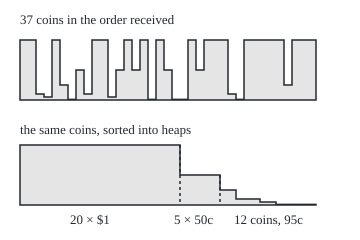

# Why a new integral: sort by value instead of position, and limits stop breaking

[Syllabus](../../../SYLLABUS.md) → [Measure and integration](../../../SYLLABUS.md#w10) → [Sets You Can Measure](../../../SYLLABUS.md#w10-s01) → Why a new integral

---

## General Overview

A laundromat closes for the night. Its change till holds 37 coins: twenty $1 coins, five 50c, two 25c, three 10c, two 5c and five 1c. There are two ways to total it.

Pick the coins up in the order they went in and keep a running total: $5.01 after ten coins, $10.58 after twenty, $17.20 after thirty, $23.45 at the end. Or tip the till out, sort the coins into heaps by denomination, count each heap and multiply by its face value: 20 × $1 is $20.00, 5 × 50c is $2.50, and the twelve smaller coins make $0.95. The total is $23.45 again.

For coins the choice is taste. For functions it is not. Riemann's integral ([The integral](../../06-Calculus%20and%20analysis/04-Integrals/01-riemann-integral.md)) is the first way: cut the time axis into slices, in order, and add height times width. Henri Lebesgue's integral, published in 1902, is the second: group the times by the value the function takes there, find how much time sits at each value, multiply, and add.

A meter shows where the difference bites. It logs one hour, minute 0 to minute 60, and reads 1 whenever the minute count is a rational number (a fraction of whole numbers, such as 2 or 1/2), 0 otherwise. Every slice of the hour, however thin, holds both readings, so Riemann's integral does not exist. Sorted by value there are two heaps: the rational times, reading 1, and the rest, reading 0. The rational times can be covered by intervals of total length as small as anyone names, so the first heap has size zero and the integral is 1 × 0 + 0 × 60 = 0.

The same sorting repairs limits. Switched on at only finitely many rational times, the meter has Riemann integral 0; switched on at all of them, it has none. Sorted by value, the limit's integral is 0, the limit of the zeros.

**Add a function up by value, each value times the size of the set that takes it, and the integral stops caring where the values sit; that one change integrates the rational-minute reading and lets integrals follow limits.**

**What kind of fact this is:** a method, adding by value instead of by position. The two facts it rests on here, that a finite sum ignores order and that the rational times fit inside intervals of total length below any positive number, are proved on this card in Why it works.

### The picture: one till, two orders

<p align="center"></p>

To scale: each coin is a bar 8 units wide and 0.6 units tall per cent. The top row is the till in the order received; the bottom row is the same bars, sorted. Sorting moves area around and never changes it: both shapes hold $23.45.

---

## The formula

Notation first, in words. $c_i$ is the value of coin number $i$ in the order received. $\sum$ means "add up"; $\#\{\dots\}$ counts a set's members. $\{t : f(t) = v\}$ is read "the set of times $t$ at which $f$ reads $v$". $\lambda(A)$, read "the length of A", is the size of a set $A$ of times: an interval's ordinary length, and for other sets the size this wing builds.

For the till:

$$\sum_{i=1}^{37} c_i \;=\; \sum_{v} v \times \#\{\,i : c_i = v\,\}$$

**Read it aloud:** adding the coins one by one in the order received gives the same as adding, over each denomination, the denomination times the number of coins of that denomination.

For a function $f$ of time that takes only finitely many values:

$$\int f \;=\; \sum_{v} v \times \lambda(\{\,t : f(t) = v\,\})$$

**Read it aloud:** the integral is each value times the length of the set of times that take it, added over the values.

For the rational-minute reading $r$ on the hour, with $R$ the set of rational times between 0 and 60:

$$\int_0^{60} r \;=\; 1 \times \lambda(R) \;+\; 0 \times \lambda([0,60] \setminus R) \;=\; 0, \qquad \text{because } \lambda(R) \le \varepsilon \text{ for every } \varepsilon > 0.$$

The backslash in $[0,60] \setminus R$ means "take away": the times in the hour that are not rational.

| Symbol | Plain meaning | In our example | Push it up and the answer… |
| --- | --- | --- | --- |
| $c_i$, $i$ | the value of coin number $i$, in order received | coin 1 is $1, coin 3 is 10c | a bigger coin, a bigger total |
| $v$ | one value the coin or function takes | $1, 50c, …, 1c; or 1 and 0 | a heap of higher value weighs more |
| $\sum$, $\#\{\dots\}$ | add up; how many members a set has | 20 coins of $1 | — |
| $f$, $t$ | a function of time, and the time in minutes | the meter's reading at minute $t$ | — |
| $\lambda(A)$, $A$ | the length of a set $A$ of times | 60 for the whole hour | — |
| $\{t : f(t) = v\}$ | the times at which $f$ reads $v$ | the rational times, for $v$ = 1 | — |
| $r$, $R$ | the rational-minute reading, and the set of rational times | $r$ is 1 on $R$, 0 off it | — |
| $\varepsilon$ | any positive length, however small | 1 minute, 0.01, 0.0001 | a looser cover |
| $q_j$, $j$, $I_j$ | the rational time in place $j$ of a queue of them, and the interval round it | place 62 holds 1/2 | — |
| $r_N$, $N$ | the reading switched on at the first $N$ rational times only | $N$ = 100 | more switched on, closer to $r$ |
| $n$ | the number of equal slices of the hour | 600 up to 600,000 | thinner slices |
| $\int f$ | the integral of $f$ over the hour | 0 for $r$ | — |

### When it holds

This is a method, and it is as good as the sizes it is fed.

- **Every value-set needs a size.** Sorting by value asks for the length of sets like $R$, which are not intervals. Not every set of times can be given a length that behaves: Giuseppe Vitali described one in 1905 that cannot ([Translation invariance and the Vitali set](../02-Length%20Done%20Properly/04-translation-invariance-and-the-vitali-set.md)). So the method needs a declared collection of sets that do have sizes.
- **Sizes must add up over a queue of pieces.** The argument for $R$ covers it with a queue of intervals and adds their lengths. A size that only adds up over finitely many pieces cannot see that $R$ is negligible.
- **No mixed signs, or absolute convergence.** For finitely many terms, or terms that are never negative, order never matters. With infinitely many terms of both signs it can: 1 − 1/2 + 1/3 − … is 0.6931 in order and 1.0397 with two positive terms taken per negative one.
- **Finitely many values here.** A function with infinitely many values is handled by narrow value bands, approximated from below ([The integral of a non-negative function](../04-The%20Lebesgue%20Integral/02-integral-of-a-nonnegative-function.md)).

---

## Why it works

### Step 0: only how much sits at each value matters

A finite sum ignores order and grouping, and sorting by value is one regrouping. What it needs is not where each value sits, only how much sits at each value: for coins a count, for times a length.

### Step 1: the till, heap by heap

Every coin lands in exactly one heap, the heap of its own denomination. So the heap totals, added, count every coin once and no coin twice, which is exactly what the running total does. Twenty $1 coins make $20.00, five 50c make $2.50, two 25c make $0.50, three 10c make $0.30, two 5c make $0.10 and five 1c make $0.05: $23.45, the till's own figure.

The running totals of $5.01, $10.58 and $17.20 at coins 10, 20 and 30 depend on the arrival order. The heaps do not.

### Step 2: a till is a step function

Lay the coins on a line in the order received, coin $i$ occupying the stretch from $i - 1$ to $i$, and let the height there be its value. That is a function taking six values, and its Riemann integral, slice by slice, is the running total. Sorting by value asks for the length of the stretch at each value: 20 units at 100c, 5 at 50c, and so on. Value times length, added, is the heap total. The picture above is this identity drawn: the bottom row is the top row with its bars rearranged.

So for step functions the two integrals agree.

### Step 3: position fails the rational-minute reading

Cut the hour into $n$ equal slices. Every slice holds a rational time, its midpoint for one, and an irrational time as well: [The integral](../../06-Calculus%20and%20analysis/04-Integrals/01-riemann-integral.md) proves this for its fraction rule, and the argument is the same here. So the highest reading on every slice is 1 and the lowest is 0. The upper sum, each slice's highest reading times its width, added, is 60 and the lower sum is 0, at every $n$. The gap never closes, and $r$ has no Riemann integral.

Sampling hides the failure. A Riemann sum tagged at each slice's midpoint gives 60.0000 at 6, 60 and 600 slices, because every midpoint is a fraction.

### Step 4: the reading-1 heap has size zero

The rational times can be queued ([Countable sets](../../01-Foundations/09-Sizes%20of%20Infinity/02-countable-sets.md)). Take the whole minutes first, then the halves, then thirds, skipping repeats: the whole minutes fill places 1 to 61, and place 62 is 1/2. Call the time in place $j$ by the name $q_j$.

Fix any positive length $\varepsilon$. Put an interval of length $\varepsilon/2$ round the first time in the queue, $\varepsilon/4$ round the second, $\varepsilon/8$ round the third, halving each time. Every rational time is covered, and the lengths add to less than $\varepsilon$: the first $N$ add to $\varepsilon$ times $1 - 1/2^N$. With $\varepsilon$ one minute, the first 10,000 widths add to 1.0000 minute at most, and because the first interval sticks out past minute 0, the part inside the hour is only 0.7500. With $\varepsilon$ at 0.01 the widths add to 0.01000000; at 0.0001, to 0.00010000.

A length that deserves the name should give the rational times no more than the intervals covering them. So $\lambda(R)$ is at most $\varepsilon$ for every positive $\varepsilon$, and a non-negative number below every positive number is 0. The integral by value is then 1 × 0 + 0 × 60 = 0.

<details>
<summary>Detailed proof</summary>

Assume only three things about the length $\lambda$: (a) an interval's length is its right end minus its left end; (b) a set inside another is no longer than it; (c) the length of a union of a queue of sets is at most the sum of their lengths. The measures card on this shelf makes these precise.

1. $R$ is countable ([Countable sets](../../01-Foundations/09-Sizes%20of%20Infinity/02-countable-sets.md)), so its members can be listed $q_1, q_2, q_3, \dots$ with each rational time appearing at some place $j$.
2. Fix $\varepsilon > 0$. Let $I_j$ be the interval centred on $q_j$ of length $\varepsilon/2^j$. By (a), $\lambda(I_j) = \varepsilon/2^j$.
3. Each point of $R$ is some $q_j$, which lies in $I_j$. So $R$ sits inside the union of all the $I_j$, and by (b) and (c), $\lambda(R) \le \sum_j \varepsilon/2^j$.
4. The partial sums of that series are $\varepsilon(1 - 2^{-N})$, by the geometric-series formula; they rise to $\varepsilon$ and never pass it. So $\lambda(R) \le \varepsilon$.
5. Lengths are not negative, so $0 \le \lambda(R) \le \varepsilon$ for every $\varepsilon > 0$. If $\lambda(R)$ were positive, choosing $\varepsilon$ as half of it would contradict step 4. So $\lambda(R) = 0$.
6. The hour splits into $R$ and the rest, with nothing shared. If lengths add over two such pieces, $60 = \lambda(R) + \lambda([0,60] \setminus R) = 0 + \lambda([0,60] \setminus R)$, so the rest has length 60.
7. By the value-sorted formula, $\int_0^{60} r = 1 \times 0 + 0 \times 60 = 0$.

Steps 1 to 5 use nothing about the rational times except that they can be queued: every countable set of times has length zero.

</details>

### Step 5: limits stop breaking

Let $r_N$ read 1 at the first $N$ rational times in the queue and 0 elsewhere. Finitely many points are harmless to Riemann: each one touches at most two slices, so the upper sum on $n$ slices is at most $2 \times N \times 60/n$. For $N$ = 100 the upper sums at 600, 6,000, 60,000 and 600,000 slices are 19.8000, 1.9800, 0.1980 and 0.0198, under the bounds 20.0000, 2.0000, 0.2000 and 0.0200. So every $r_N$ has Riemann integral 0.

As $N$ grows, each time's reading only ever rises, and every rational time is switched on eventually, so the readings $r_N$ climb to $r$. The integrals are 0, 0, 0, …, and their limit is 0. Riemann has no integral for $r$ to compare. Lebesgue's gives 0, the limit of the integrals. That is the monotone convergence theorem in miniature ([The monotone convergence theorem](../04-The%20Lebesgue%20Integral/03-monotone-convergence-theorem.md)): for readings that only rise, the integral of the limit is the limit of the integrals. Riemann's integral cannot promise this, because its limit may not be integrable at all.

### Step 6: what the wing has to build

Steps 4 and 5 leaned on three things the wing builds.

1. **Which sets have a size.** Vitali's set shows that no length can be given to every set of times while matching (a), adding up exactly over a queue of disjoint pieces, and staying the same when a set slides along the line. So a size is promised only to a declared collection of sets, closed under the operations the arguments use: complements (everything outside a set) and unions of a queue of sets. That collection is a sigma-algebra: [Sigma-algebras](02-sigma-algebras.md), with the everyday one, the Borel sets, in [Generated sigma-algebras and Borel sets](03-generated-and-borel-sigma-algebras.md).
2. **What the size is.** A rule giving each allowed set a size, never negative, adding up over a queue of disjoint pieces: a measure ([Measures](04-measures.md)). Property (c) above follows from it ([Continuity and subadditivity](05-continuity-of-measure.md)). Sets of size zero, such as $R$, get their own card ([Null sets and almost everywhere](07-null-sets-and-almost-everywhere.md)).
3. **How to add a function up against it.** Value times size for functions with finitely many values ([The integral of a simple function](../04-The%20Lebesgue%20Integral/01-integral-of-a-simple-function.md)), then limits from below for the rest ([The integral of a non-negative function](../04-The%20Lebesgue%20Integral/02-integral-of-a-nonnegative-function.md)).

The other road to Lebesgue's integral runs the other way: prove that it gives Riemann's answer whenever Riemann's exists, so nothing is lost. That is [Riemann meets Lebesgue](../04-The%20Lebesgue%20Integral/05-riemann-meets-lebesgue.md).

---

## Worked numbers, by hand

| Step | Arithmetic | Value |
| --- | --- | --- |
| $1 heap | 20 × $1 | $20.00 |
| 50c heap | 5 × 50c | $2.50 |
| small change | 2 × 25c + 3 × 10c + 2 × 5c + 5 × 1c | $0.95 in 12 coins |
| till by denomination | 20.00 + 2.50 + 0.95 | **$23.45** |
| till in the order received | running total, coin by coin | **$23.45** |
| rational reading, by position | upper sum 60, lower sum 0, at every $n$ | no integral |
| cover of the rational times | $\varepsilon$/2 + $\varepsilon$/4 + $\varepsilon$/8 + … | below $\varepsilon$ |
| length of the rational times | at most every positive $\varepsilon$ | 0 |
| rational reading, by value | 1 × 0 + 0 × 60 | **0** |

The till holds $23.45 however it is counted, and a meter that reads 1 at every rational minute adds up, over the hour, to nothing.

### What breaks if you drop a piece

| Mistake | Comes out at | What went wrong |
| --- | --- | --- |
| Counting the coins, not their value | 37 | The heaps were counted but never multiplied by face value |
| One coin per denomination | $1.91 | The size of each heap was dropped: value without size |
| Trusting samples of the reading | 60.0000 at 6, 60 and 600 slices | Every midpoint is a fraction, so every sample reads 1 |
| Every cover width 0.1 minute, first 1000 fractions | widths add to 100.0000; 54.2143 of the hour covered | Widths that do not shrink add to more than the hour; over the whole queue they add to infinity |
| Regrouping 1 − 1/2 + 1/3 − … | 1.0397 instead of 0.6931 | With both signs and infinitely many terms, order matters |

The code prints all five.

---

## Code, from first principles, and it actually runs

Nothing is imported. A SplitMix64 generator, written out in both languages with seed 2026, shuffles the till into its arrival order; the till is then totalled coin by coin and heap by heap. The rational times are queued by denominator. Upper sums for $r_N$ use exact whole-number arithmetic and are counted two ways: point by point, and slice by slice. The cover of the first 10,000 rational times is measured two ways: widths added, and intervals merged. The mixed-sign series is summed in two orders and checked against ln 2 from a different series. What the code shows: the till exactly, and finite covers and finite approximations. What only the proof shows: that all of $R$ has length zero, since the code never holds an irrational time and never reaches the end of the queue.

### Python

```python
# Why a new integral -- the check behind the card.  Nothing is imported.
# Part 1: a till of 37 coins, $23.45, totalled in the order received and by
# denomination.  Part 2: the rational-minute reading on one hour: 1 when the
# minute count t is a fraction p/q, 0 otherwise.  The code only ever holds
# fractions; what happens at the other times is the proof's job, not the code's.
MASK = (1 << 64) - 1

def splitmix(state):                        # SplitMix64, written out here
    state = (state + 0x9E3779B97F4A7C15) & MASK
    z = state
    z = ((z ^ (z >> 30)) * 0xBF58476D1CE4E5B9) & MASK
    z = ((z ^ (z >> 27)) * 0x94D049BB133111EB) & MASK
    return state, z ^ (z >> 31)

def usd(cents):                             # whole cents printed as dollars
    return f"${cents // 100}.{cents % 100:02d}"

def gcd(a, b):                              # Euclid's algorithm
    while b:
        a, b = b, a % b
    return a

def queue(count):                           # fractions in [0, 60]: denominator 1, then 2, 3...
    out, q = [], 1
    while len(out) < count:
        for p in range(60 * q + 1):
            if gcd(p, q) == 1 and len(out) < count:
                out.append((p, q))
        q += 1
    return out

def upper_sum(points, n):                   # Riemann upper sum of "1 at these points" on n slices
    touched = set()
    for p, q in points:
        k, r = divmod(p * n, 60 * q)        # the point p/q sits at slice position k + r/(60q)
        if k < n:
            touched.add(k)
        if r == 0 and k > 0:
            touched.add(k - 1)              # on a cut: it touches the slice on its left too
    return len(touched) * 60 / n

def upper_brute(points, n):                 # road two: slice by slice, exact integer comparison
    hit = [k for k in range(n) if any(k * 60 * q <= p * n <= (k + 1) * 60 * q for p, q in points)]
    return len(hit) * 60 / n

def cover(points, eps, fixed=None):         # an interval round each point; sum and clipped union
    width, total, spans = eps, 0.0, []
    for p, q in points:
        width = fixed if fixed else width / 2          # eps/2, eps/4, eps/8 ...
        total += width
        spans.append((max(0.0, p / q - width / 2), min(60.0, p / q + width / 2)))
    spans.sort()
    union, lo, hi = 0.0, spans[0][0], spans[0][1]
    for a, b in spans[1:]:
        if a > hi:
            union, lo, hi = union + hi - lo, a, b
        else:
            hi = max(hi, b)
    return total, union + hi - lo

DENOMS, COUNTS = [100, 50, 25, 10, 5, 1], [20, 5, 2, 3, 2, 5]
coins = [v for v, k in zip(DENOMS, COUNTS) for _ in range(k)]
state = 2026                                # seed for the order the coins arrived in
for i in range(len(coins) - 1, 0, -1):      # Fisher-Yates shuffle
    state, z = splitmix(state)
    j = z % (i + 1)
    coins[i], coins[j] = coins[j], coins[i]
running, marks = 0, []                      # road one: in the order received
for i, c in enumerate(coins):
    running += c
    if i + 1 in (10, 20, 30, 37):
        marks.append(running)
heaps = [(v, sum(1 for c in coins if c == v)) for v in DENOMS]
by_value = sum(v * k for v, k in heaps)     # road two: heaps, count times value
print(f"till: {len(coins)} coins; order received (cents): {coins[:19]}")
print(f"  ... continued: {coins[19:]}")
print("running total after 10, 20, 30, 37 coins: " + ", ".join(usd(m) for m in marks))
for v, k in heaps:
    print(f"heap of {v:>3}c coins: {k:>2} coins x {v:>3}c = {usd(k * v):>6}")
small = [(v, k) for v, k in heaps if v <= 25]
print(f"small change, 25c and below: {sum(k for _, k in small)} coins, {usd(sum(v * k for v, k in small))}")
print(f"by order received: {usd(running)}   by denomination: {usd(by_value)}")
print(f"mistake, counting coins not value: {len(coins)}; one coin per denomination: {usd(sum(DENOMS))}")
x = 20
print("figure, bar width 8, 0.6 px per cent; heap spans in x: "
      + ", ".join(f"{v}c {x + 8 * sum(k for _, k in heaps[:i])}-{x + 8 * sum(k for _, k in heaps[:i + 1])}"
                  for i, (v, _) in enumerate(heaps)))

fr = queue(10000)
halves = next(i for i, (p, q) in enumerate(fr) if q > 1)
print(f"fractions queued: first {', '.join(f'{p}/{q}' for p, q in fr[:3])}; whole minutes fill places 1 to {halves}; place {halves + 1} is {fr[halves][0]}/{fr[halves][1]}")
def reading(p, q):                          # any time the code can hold is p/q, a fraction: reads 1
    return 1
tagged = []
for n in (6, 60, 600):                      # midpoint of slice k is 60(2k+1)/(2n), a fraction
    tagged.append(sum(reading(60 * (2 * k + 1), 2 * n) * 60 / n for k in range(n)))
print("Riemann sums with midpoint tags, n = 6, 60, 600: " + ", ".join(f"{t:.4f}" for t in tagged))
first = fr[:100]
ups = [upper_sum(first, n) for n in (600, 6000, 60000, 600000)]
print("upper sums, reading switched on at the first 100 fractions, n = 600, 6000, 60000, 600000: "
      + ", ".join(f"{u:.4f}" for u in ups))
brute = [upper_brute(first, n) for n in (600, 6000)]
print("upper sums again, slice by slice, n = 600, 6000: " + ", ".join(f"{u:.4f}" for u in brute))
print("bound 2 x 100 x 60 / n:  " + ", ".join(f"{2 * 100 * 60 / n:.4f}" for n in (600, 6000, 60000, 600000)))
rows = [(N,) + cover(fr[:N], 1.0) for N in (61, 10000)]
print(f"cover of first 10000 fractions, eps = 1 minute: widths add to {rows[1][1]:.4f}, "
      f"at most 1: {'yes' if rows[1][1] <= 1.0 else 'no'}; union inside the hour {rows[1][2]:.4f}")
for eps in (0.01, 0.0001):
    s, u = cover(fr, eps)
    print(f"cover of first 10000 fractions, eps = {eps}: widths add to {s:.8f}, so 1 x size + 0 x rest <= {s:.8f}")
fs, fu = cover(fr[:1000], 1.0, fixed=0.1)
print(f"mistake, every width 0.1 for the first 1000: widths add to {fs:.4f}, union inside the hour {fu:.4f}")

in_order, regrouped, sign = 0.0, 0.0, 1.0   # 1 - 1/2 + 1/3 - ...: order matters once signs mix
for k in range(1, 200001):
    in_order += sign / k
    sign = -sign
odd, even = 1, 2
for _ in range(100000):                     # two positive terms, then one negative
    regrouped += 1 / odd + 1 / (odd + 2) - 1 / even
    odd, even = odd + 4, even + 2
ln2, t = 0.0, 1 / 3                         # ln 2 = 2 (t + t^3/3 + t^5/5 + ...), t = 1/3
for k in range(40):
    ln2 += 2 * t ** (2 * k + 1) / (2 * k + 1)
print(f"mistake, 1 - 1/2 + 1/3 - ... in order: {in_order:.4f}; two positives per negative: {regrouped:.4f}")
print(f"ln 2 by its own series: {ln2:.4f}; 1.5 x ln 2: {1.5 * ln2:.4f}")

assert running == by_value, "two roads to the till"
assert by_value == 2345, "the $23.45 counted in by the till"
assert all(abs(s - (1.0 - 0.5 ** N)) < 1e-12 and u <= s for N, s, u in rows), "halving widths: 1 - 2^-N"
assert all(a > b for a, b in zip(ups, ups[1:])) and all(u <= 12000 / n for u, n in zip(ups, (600, 6000, 60000, 600000)))
assert brute == ups[:2], "two roads to the upper sums"
assert abs(in_order - ln2) < 1e-5 and abs(regrouped - 1.5 * ln2) < 1e-5, "two orders, two sums"
print("ALL CHECKS PASS")
```

**Ran 2026-10-06 on macOS, Python 3.14.6, standard library only. All checks passed. Output, pasted from the run:**

```
till: 37 coins; order received (cents): [100, 100, 10, 5, 100, 25, 1, 50, 10, 100, 100, 5, 50, 100, 50, 100, 1, 100, 50]
  ... continued: [1, 1, 100, 50, 100, 100, 100, 10, 1, 100, 100, 100, 100, 100, 25, 100, 100, 100]
running total after 10, 20, 30, 37 coins: $5.01, $10.58, $17.20, $23.45
heap of 100c coins: 20 coins x 100c = $20.00
heap of  50c coins:  5 coins x  50c =  $2.50
heap of  25c coins:  2 coins x  25c =  $0.50
heap of  10c coins:  3 coins x  10c =  $0.30
heap of   5c coins:  2 coins x   5c =  $0.10
heap of   1c coins:  5 coins x   1c =  $0.05
small change, 25c and below: 12 coins, $0.95
by order received: $23.45   by denomination: $23.45
mistake, counting coins not value: 37; one coin per denomination: $1.91
figure, bar width 8, 0.6 px per cent; heap spans in x: 100c 20-180, 50c 180-220, 25c 220-236, 10c 236-260, 5c 260-276, 1c 276-316
fractions queued: first 0/1, 1/1, 2/1; whole minutes fill places 1 to 61; place 62 is 1/2
Riemann sums with midpoint tags, n = 6, 60, 600: 60.0000, 60.0000, 60.0000
upper sums, reading switched on at the first 100 fractions, n = 600, 6000, 60000, 600000: 19.8000, 1.9800, 0.1980, 0.0198
upper sums again, slice by slice, n = 600, 6000: 19.8000, 1.9800
bound 2 x 100 x 60 / n:  20.0000, 2.0000, 0.2000, 0.0200
cover of first 10000 fractions, eps = 1 minute: widths add to 1.0000, at most 1: yes; union inside the hour 0.7500
cover of first 10000 fractions, eps = 0.01: widths add to 0.01000000, so 1 x size + 0 x rest <= 0.01000000
cover of first 10000 fractions, eps = 0.0001: widths add to 0.00010000, so 1 x size + 0 x rest <= 0.00010000
mistake, every width 0.1 for the first 1000: widths add to 100.0000, union inside the hour 54.2143
mistake, 1 - 1/2 + 1/3 - ... in order: 0.6931; two positives per negative: 1.0397
ln 2 by its own series: 0.6931; 1.5 x ln 2: 1.0397
ALL CHECKS PASS
```

### Rust

Same numbers, same labels, built with `rustc --edition 2021 -O`.

```rust
// Why a new integral -- the same check as the Python, in Rust.  No crates.
// Part 1: a till of 37 coins, $23.45, totalled in the order received and by
// denomination.  Part 2: the rational-minute reading on one hour: 1 when the
// minute count t is a fraction p/q, 0 otherwise.  The code only ever holds
// fractions; what happens at the other times is the proof's job, not the code's.
fn splitmix(state: u64) -> (u64, u64) {             // SplitMix64, written out here
    let s = state.wrapping_add(0x9E3779B97F4A7C15);
    let mut z = s;
    z = (z ^ (z >> 30)).wrapping_mul(0xBF58476D1CE4E5B9);
    z = (z ^ (z >> 27)).wrapping_mul(0x94D049BB133111EB);
    (s, z ^ (z >> 31))
}

fn usd(cents: u64) -> String { format!("${}.{:02}", cents / 100, cents % 100) } // cents as dollars

fn gcd(mut a: u64, mut b: u64) -> u64 {             // Euclid's algorithm
    while b != 0 { (a, b) = (b, a % b) }
    a
}

fn queue(count: usize) -> Vec<(u64, u64)> {         // fractions in [0, 60]: denominator 1, then 2, 3...
    let (mut out, mut q) = (Vec::new(), 1u64);
    while out.len() < count {
        for p in 0..=60 * q {
            if gcd(p, q) == 1 && out.len() < count { out.push((p, q)) }
        }
        q += 1;
    }
    out
}

fn upper_sum(points: &[(u64, u64)], n: u64) -> f64 { // Riemann upper sum of "1 at these points"
    let mut touched = std::collections::BTreeSet::new();
    for &(p, q) in points {
        let (k, r) = (p * n / (60 * q), p * n % (60 * q));
        if k < n { touched.insert(k); }
        if r == 0 && k > 0 { touched.insert(k - 1); }  // on a cut: it touches the slice on its left too
    }
    touched.len() as f64 * 60.0 / n as f64
}

fn upper_brute(points: &[(u64, u64)], n: u64) -> f64 { // road two: slice by slice, exact integer comparison
    let hit = (0..n).filter(|&k| points.iter().any(|&(p, q)| k * 60 * q <= p * n && p * n <= (k + 1) * 60 * q)).count();
    hit as f64 * 60.0 / n as f64
}

fn cover(points: &[(u64, u64)], eps: f64, fixed: f64) -> (f64, f64) { // widths added, clipped union
    let (mut width, mut total, mut spans) = (eps, 0.0f64, Vec::new());
    for &(p, q) in points {
        width = if fixed > 0.0 { fixed } else { width / 2.0 };   // eps/2, eps/4, eps/8 ...
        total += width;
        let c = p as f64 / q as f64;
        spans.push(((c - width / 2.0).max(0.0), (c + width / 2.0).min(60.0)));
    }
    spans.sort_by(|x, y| x.partial_cmp(y).unwrap());
    let (mut union, mut lo, mut hi) = (0.0f64, spans[0].0, spans[0].1);
    for &(a, b) in &spans[1..] {
        if a > hi { union += hi - lo; lo = a; hi = b; } else { hi = hi.max(b); }
    }
    (total, union + hi - lo)
}

fn list(v: &[f64], dp: usize) -> String {
    v.iter().map(|x| format!("{:.*}", dp, x)).collect::<Vec<_>>().join(", ")
}

fn main() {
    let (denoms, counts) = ([100u64, 50, 25, 10, 5, 1], [20usize, 5, 2, 3, 2, 5]);
    let mut coins: Vec<u64> = Vec::new();
    for (v, k) in denoms.iter().zip(counts.iter()) { for _ in 0..*k { coins.push(*v) } }
    let mut state = 2026u64;                          // seed for the order the coins arrived in
    for i in (1..coins.len()).rev() {                 // Fisher-Yates shuffle
        let (s, z) = splitmix(state);
        state = s;
        coins.swap(i, (z % (i as u64 + 1)) as usize);
    }
    let (mut running, mut marks) = (0u64, Vec::new()); // road one: in the order received
    for (i, c) in coins.iter().enumerate() {
        running += c;
        if [10, 20, 30, 37].contains(&(i + 1)) { marks.push(running) }
    }
    let heaps: Vec<(u64, u64)> = denoms.iter().map(|&v| (v, coins.iter().filter(|&&c| c == v).count() as u64)).collect();
    let by_value: u64 = heaps.iter().map(|(v, k)| v * k).sum(); // road two: heaps, count times value
    println!("till: {} coins; order received (cents): {:?}", coins.len(), &coins[..19]);
    println!("  ... continued: {:?}", &coins[19..]);
    println!("running total after 10, 20, 30, 37 coins: {}", marks.iter().map(|&m| usd(m)).collect::<Vec<_>>().join(", "));
    for (v, k) in &heaps { println!("heap of {:>3}c coins: {:>2} coins x {:>3}c = {:>6}", v, k, v, usd(k * v)) }
    let small: Vec<&(u64, u64)> = heaps.iter().filter(|(v, _)| *v <= 25).collect();
    println!("small change, 25c and below: {} coins, {}", small.iter().map(|(_, k)| k).sum::<u64>(),
             usd(small.iter().map(|(v, k)| v * k).sum()));
    println!("by order received: {}   by denomination: {}", usd(running), usd(by_value));
    println!("mistake, counting coins not value: {}; one coin per denomination: {}", coins.len(), usd(denoms.iter().sum()));
    let mut spans = Vec::new();
    let mut x = 20u64;
    for (v, k) in &heaps { spans.push(format!("{}c {}-{}", v, x, x + 8 * k)); x += 8 * k; }
    println!("figure, bar width 8, 0.6 px per cent; heap spans in x: {}", spans.join(", "));

    let fr = queue(10000);
    let halves = fr.iter().position(|&(_, q)| q > 1).unwrap();
    println!("fractions queued: first {}; whole minutes fill places 1 to {}; place {} is {}/{}",
             fr[..3].iter().map(|(p, q)| format!("{}/{}", p, q)).collect::<Vec<_>>().join(", "),
             halves, halves + 1, fr[halves].0, fr[halves].1);
    let reading = |_p: u64, _q: u64| 1.0f64;          // any time the code can hold is p/q, a fraction: reads 1
    let tagged: Vec<f64> = [6u64, 60, 600].iter()     // midpoint of slice k is 60(2k+1)/(2n), a fraction
        .map(|&n| (0..n).map(|k| reading(60 * (2 * k + 1), 2 * n) * 60.0 / n as f64).sum()).collect();
    println!("Riemann sums with midpoint tags, n = 6, 60, 600: {}", list(&tagged, 4));
    let ns = [600u64, 6000, 60000, 600000];
    let ups: Vec<f64> = ns.iter().map(|&n| upper_sum(&fr[..100], n)).collect();
    println!("upper sums, reading switched on at the first 100 fractions, n = 600, 6000, 60000, 600000: {}", list(&ups, 4));
    let brute: Vec<f64> = ns[..2].iter().map(|&n| upper_brute(&fr[..100], n)).collect();
    println!("upper sums again, slice by slice, n = 600, 6000: {}", list(&brute, 4));
    let bounds: Vec<f64> = ns.iter().map(|&n| 2.0 * 100.0 * 60.0 / n as f64).collect();
    println!("bound 2 x 100 x 60 / n:  {}", list(&bounds, 4));
    let rows: Vec<(i32, f64, f64)> = [61usize, 10000].iter().map(|&n| { let (s, u) = cover(&fr[..n], 1.0, 0.0); (n as i32, s, u) }).collect();
    println!("cover of first 10000 fractions, eps = 1 minute: widths add to {:.4}, at most 1: {}; union inside the hour {:.4}",
             rows[1].1, if rows[1].1 <= 1.0 { "yes" } else { "no" }, rows[1].2);
    for eps in [0.01f64, 0.0001] {
        let (s, _) = cover(&fr, eps, 0.0);
        println!("cover of first 10000 fractions, eps = {}: widths add to {:.8}, so 1 x size + 0 x rest <= {:.8}", eps, s, s);
    }
    let (fs, fu) = cover(&fr[..1000], 1.0, 0.1);
    println!("mistake, every width 0.1 for the first 1000: widths add to {:.4}, union inside the hour {:.4}", fs, fu);

    let (mut in_order, mut regrouped, mut sign) = (0.0f64, 0.0f64, 1.0f64); // order matters once signs mix
    for k in 1..=200000u32 { in_order += sign / k as f64; sign = -sign; }
    let (mut odd, mut even) = (1.0f64, 2.0f64);
    for _ in 0..100000 {                              // two positive terms, then one negative
        regrouped += 1.0 / odd + 1.0 / (odd + 2.0) - 1.0 / even;
        odd += 4.0; even += 2.0;
    }
    let (mut ln2, t) = (0.0f64, 1.0f64 / 3.0);         // ln 2 = 2 (t + t^3/3 + t^5/5 + ...), t = 1/3
    for k in 0..40 { ln2 += 2.0 * t.powi(2 * k + 1) / (2 * k + 1) as f64; }
    println!("mistake, 1 - 1/2 + 1/3 - ... in order: {:.4}; two positives per negative: {:.4}", in_order, regrouped);
    println!("ln 2 by its own series: {:.4}; 1.5 x ln 2: {:.4}", ln2, 1.5 * ln2);

    assert!(running == by_value, "two roads to the till");
    assert!(by_value == 2345, "the $23.45 counted in by the till");
    assert!(rows.iter().all(|&(n, s, u)| (s - (1.0 - 0.5f64.powi(n))).abs() < 1e-12 && u <= s), "halving widths");
    assert!(ups.windows(2).all(|w| w[0] > w[1]) && ups.iter().zip(ns.iter()).all(|(u, &n)| *u <= 12000.0 / n as f64));
    assert!(brute[..] == ups[..2], "two roads to the upper sums");
    assert!((in_order - ln2).abs() < 1e-5 && (regrouped - 1.5 * ln2).abs() < 1e-5, "two orders, two sums");
    println!("ALL CHECKS PASS");
}
```

**Ran 2026-10-06 on macOS, rustc 1.98.1, no crates. All checks passed. Output, pasted from the run:**

```
till: 37 coins; order received (cents): [100, 100, 10, 5, 100, 25, 1, 50, 10, 100, 100, 5, 50, 100, 50, 100, 1, 100, 50]
  ... continued: [1, 1, 100, 50, 100, 100, 100, 10, 1, 100, 100, 100, 100, 100, 25, 100, 100, 100]
running total after 10, 20, 30, 37 coins: $5.01, $10.58, $17.20, $23.45
heap of 100c coins: 20 coins x 100c = $20.00
heap of  50c coins:  5 coins x  50c =  $2.50
heap of  25c coins:  2 coins x  25c =  $0.50
heap of  10c coins:  3 coins x  10c =  $0.30
heap of   5c coins:  2 coins x   5c =  $0.10
heap of   1c coins:  5 coins x   1c =  $0.05
small change, 25c and below: 12 coins, $0.95
by order received: $23.45   by denomination: $23.45
mistake, counting coins not value: 37; one coin per denomination: $1.91
figure, bar width 8, 0.6 px per cent; heap spans in x: 100c 20-180, 50c 180-220, 25c 220-236, 10c 236-260, 5c 260-276, 1c 276-316
fractions queued: first 0/1, 1/1, 2/1; whole minutes fill places 1 to 61; place 62 is 1/2
Riemann sums with midpoint tags, n = 6, 60, 600: 60.0000, 60.0000, 60.0000
upper sums, reading switched on at the first 100 fractions, n = 600, 6000, 60000, 600000: 19.8000, 1.9800, 0.1980, 0.0198
upper sums again, slice by slice, n = 600, 6000: 19.8000, 1.9800
bound 2 x 100 x 60 / n:  20.0000, 2.0000, 0.2000, 0.0200
cover of first 10000 fractions, eps = 1 minute: widths add to 1.0000, at most 1: yes; union inside the hour 0.7500
cover of first 10000 fractions, eps = 0.01: widths add to 0.01000000, so 1 x size + 0 x rest <= 0.01000000
cover of first 10000 fractions, eps = 0.0001: widths add to 0.00010000, so 1 x size + 0 x rest <= 0.00010000
mistake, every width 0.1 for the first 1000: widths add to 100.0000, union inside the hour 54.2143
mistake, 1 - 1/2 + 1/3 - ... in order: 0.6931; two positives per negative: 1.0397
ln 2 by its own series: 0.6931; 1.5 x ln 2: 1.0397
ALL CHECKS PASS
```

The two outputs match line for line.

> [!TIP]
> **Try changing**
> Guess first, then run it. The asserts are pinned to the till and to halving widths, so some changes stop the program.
> - **Another arrival order.** Change the seed `2026` to any other number. The running totals after 10, 20 and 30 coins change; the final total and every heap do not.
> - **Widths that shrink too slowly.** Replace `width / 2` with `width / 1.9`. The widths now add to more than 1 minute and the third assert stops it: with the first width a fixed fraction of $\varepsilon$ and each later width that same fraction of the one before, the total stays at most $\varepsilon$ only if the fraction is at most a half.
> - **More points switched on.** Change `fr[:100]` to `fr[:1000]`. The upper sums rise, since each point can touch two slices, and pass the bound pinned to 100 points, so the fourth assert stops it.
> - **A different till.** Change a coin count in `COUNTS`: both roads move together, and only the pinned $23.45 assert stops it.

---

## The usual mistake

> [!warning]
> **Reading "everywhere in the hour" as "most of the hour".** The rational times sit in every slice, however thin, and there are infinitely many of them. Their length is still zero, because they can be queued and covered by intervals whose lengths add to less than any positive number. Being spread everywhere and taking up room are different properties, and measure only counts the second.
>
> - **Counting the heaps, not their value.** Counting the coins gives 37, not $23.45: each heap's count must be multiplied by its face value.
> - **Value without size.** One coin per denomination gives $1.91: the size of each heap was dropped.
> - **Trusting samples.** Midpoint-tagged Riemann sums give 60.0000 at 6, 60 and 600 slices, because every midpoint is a fraction; the upper and lower sums stay 60 and 0.

---

## Where you meet it in real life

- **Counting cash.** Banks and tills count by denomination, heap by heap, for the reason in Step 0: the count per denomination is all the total needs.
- **Expected value.** Adding each possible payout times its probability is sorting by value: probability plays the part of length. The measure version is [Expectation as an integral](../04-The%20Lebesgue%20Integral/06-expectation-as-an-integral.md).
- **Pricing under changed odds.** Finance averages a payoff against probabilities other than the real ones ([The risk-neutral probability](../../12-Financial%20mathematics/04-Binomial%20Trees/02-risk-neutral-probability.md)); that needs integrals taken against a measure.

> **Say it back**
> Riemann adds a function slice by slice along the line; Lebesgue sorts the line by the value the function takes and adds each value times the size of the set that takes it. For a till the two agree: $23.45 either way. For the meter reading 1 at rational minutes they part: every slice holds both readings, so Riemann's sums never settle, while the rational times can be covered by intervals of total length as small as wished, so the value-sorted integral is 0. The same sorting makes the integral of a rising limit equal the limit of the integrals. To make it work the wing must build which sets have a size, what the size is, and how to add a function up against it.

---

## What this builds on

- [The integral](../../06-Calculus%20and%20analysis/04-Integrals/01-riemann-integral.md): upper and lower sums, and the fraction rule that has none.
- [Countable sets](../../01-Foundations/09-Sizes%20of%20Infinity/02-countable-sets.md): why the rational times fit in one queue.

## Where this goes next

- [Sigma-algebras](02-sigma-algebras.md): the collection of sets allowed a size.
- [Generated sigma-algebras and Borel sets](03-generated-and-borel-sigma-algebras.md): the Borel sets, built from intervals.
- [Measures](04-measures.md): the size itself, adding up over a queue of pieces.
- [Continuity and subadditivity](05-continuity-of-measure.md): the covering bound of Step 4, proved from the definition.
- [Pi-systems and Dynkin's theorem](06-pi-systems-and-uniqueness.md): why fixing the length of intervals fixes the length of every Borel set.
- [Null sets and almost everywhere](07-null-sets-and-almost-everywhere.md): sets of size zero, and why the reading is 0 almost everywhere.
- [Riemann meets Lebesgue](../04-The%20Lebesgue%20Integral/05-riemann-meets-lebesgue.md): Lebesgue's integral agrees with Riemann's wherever Riemann's exists.

Adding by value needs a size for sets like the rational times, and not every set can be given one; which sets may is what the next card, sigma-algebras, settles.

---

## Sources

Verified 29 Sep 2026: every link below resolves to the publisher's or author's page.

- Lebesgue, Henri. "Intégrale, longueur, aire." *Annali di Matematica Pura ed Applicata* 7 (1902): 231–359. [doi:10.1007/BF02420592](https://doi.org/10.1007/BF02420592). The thesis that defined measure and the integral by value.
- Axler, Sheldon. *Measure, Integration & Real Analysis*. Graduate Texts in Mathematics 282, Springer, 2020. [doi:10.1007/978-3-030-33143-6](https://doi.org/10.1007/978-3-030-33143-6); free edition at the [author's page](https://measure.axler.net/). Opens with the Riemann integral's shortcomings, then proves countable sets have outer measure zero.
- Tao, Terence. *An Introduction to Measure Theory*. Graduate Studies in Mathematics 126, American Mathematical Society, 2011. [Author's page, with a free draft](https://terrytao.wordpress.com/books/an-introduction-to-measure-theory/). Starts from the Riemann integral and Jordan measure and shows why Lebesgue measure is needed.
