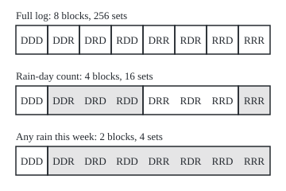

# Sigma-algebras: the family of sets you are allowed to measure, closed under complements and countable unions

[Syllabus](../../../SYLLABUS.md) → [Measure and integration](../README.md) → [Sets You Can Measure](../README.md#s01) → Sigma-algebras

---

## General Overview

A weather station on a hill logs one letter a day for three days: R for rain, D for dry. A week's record is a three-letter word such as RDR, rain on day one, dry on day two, rain on day three. There are 2 × 2 × 2 = 8 possible words, from DDD to RRR.

Every yes/no question about the three days picks out the words that answer yes. "Did it rain on day two?" picks out DRD, DRR, RRD and RRR. So a question is a set of words, and a set of words is a question. The 8 words have 256 subsets ([Subsets and the power set](../../01-Foundations/07-Sets/02-subsets-and-power-set.md)), so the full log can settle 256 questions.

A second station, down in the valley, sends one line a week: "any rain" or "no rain". From that line alone it settles exactly four questions: "no rain all week", "some rain this week", the question that is always yes and the question that is always no. It cannot settle "did it rain on day two?". DDR and DRD both send "any rain", and they disagree about day two.

The valley station's four questions have a shape. If a question can be settled, so can its opposite. If each question in a list can be settled, so can "is at least one of them true?". A family of sets with those two properties, plus the whole space, is a **sigma-algebra**, the word used from here on. It is the family of sets a measure is allowed to give a size to, and it is what the measure cards of this wing are built on.

**A sigma-algebra is a family of sets that contains everything, contains the opposite of each of its sets, and contains the union of any countable list of its sets; the questions any record can settle always form one, and on a finite space every one is what some record settles.**

**What kind of fact this is:** a definition; the facts drawn from it on this card (the empty set is always in, a finite sigma-algebra is a set of blocks with a power of 2 as its size) are theorems, proved in Why it works.

### The picture: three stations, three ways to group the same eight weeks

<p align="center"></p>

The weeks are ordered by how many days it rained. Each box is a block: weeks the station cannot tell apart. The top row is the full log, each week alone. The middle row is a station that reports only how many days it rained: 0, 1, 2 or 3. The bottom row is the valley station, labelled "any rain this week" in the code. Every box is drawn to scale, 40 units per week; the block edges are printed by both checks on the lines starting "figure,". A question can be settled exactly when it never cuts through a box.

---

## The formula

Notation first, in words. The space of all outcomes is written $\Omega$ (capital omega), and one outcome in it $\omega$ (small omega). A script letter such as $\mathcal{F}$ names a family of subsets of $\Omega$, read "the collection of sets we allow ourselves to measure". $A^c$, "the complement of A", is every outcome of $\Omega$ not in $A$. A list of sets that can be numbered first, second, third and on without end is a **countable** list ([Countable sets](../../01-Foundations/09-Sizes%20of%20Infinity/02-countable-sets.md)), written $A_1, A_2, A_3, \dots$ with $A_n$ the one in place $n$.

A family $\mathcal{F}$ of subsets of $\Omega$ is a sigma-algebra when it obeys three rules:

$$\text{(1)}\;\; \Omega \in \mathcal{F} \qquad \text{(2)}\;\; A \in \mathcal{F} \Rightarrow A^c \in \mathcal{F} \qquad \text{(3)}\;\; A_1, A_2, \dots \in \mathcal{F} \Rightarrow \bigcup_{n=1}^{\infty} A_n \in \mathcal{F}$$

**Read it aloud:** the whole space is in the family; the opposite of anything in the family is in the family; and whatever is in at least one set of a countable list from the family is a set in the family.

The pair $(\Omega, \mathcal{F})$ is a **measurable space**: a space together with the sets it allows to be measured. The sets in $\mathcal{F}$ are its **measurable sets**, or in probability its **events**.

Two sigma-algebras live on every space. The smallest is $\{\varnothing, \Omega\}$, where $\varnothing$ is the empty set. The largest is the power set $\mathcal{P}(\Omega)$, every subset ([Subsets and the power set](../../01-Foundations/07-Sets/02-subsets-and-power-set.md) writes it P; the script letter keeps plain P free for probability). On a finite space, one more formula counts any sigma-algebra: if it cuts $\Omega$ into $k$ blocks, it has $2^k$ members.

| Symbol | Plain meaning | In our example | Push it up and the answer… |
| --- | --- | --- | --- |
| $\Omega$ | the space: every outcome the model allows | the 8 three-day words, DDD to RRR | more outcomes, many more possible sets |
| $\omega$, $\omega'$, $\eta$ | outcomes | RDR, DDR, DRD | — |
| $A$, $B$, $A_n$, $A_m$ | sets of outcomes, each one yes/no question; $A_n$ is the one in place $n$ of a list | rain on day two: DRD, DRR, RRD, RRR | — |
| $n$ | a place in a countable list | 1, 2, 3, … | — |
| $A^c$ | the complement: outcomes not in $A$ | dry on day two | a bigger $A$ leaves a smaller $A^c$ |
| $\bigcup_n A_n$ | the union: outcomes in at least one $A_n$ | rain on day one or day two | — |
| $\mathcal{F}$ | a sigma-algebra: the sets allowed a size | the valley station's 4 sets | finer questions become answerable |
| $(\Omega, \mathcal{F})$ | a measurable space | 8 words with one station's sets | — |
| $\varnothing$ | the empty set: the question never answered yes | — | — |
| $\mathcal{P}(\Omega)$ | the power set: every subset | 256 sets | — |
| $a(\omega)$ | the block holding $\omega$: the smallest member of $\mathcal{F}$ containing it | $a(\text{DDR})$ = all 7 rainy weeks, for the valley station | — |
| $k$ | the number of blocks a finite sigma-algebra makes | 2 for the valley station | each extra block doubles the count |
| $2^k$ | the size of a finite sigma-algebra with $k$ blocks | 4 | — |

### When it holds

A definition does not hold or fail; a family passes the rules or does not. What each rule buys:

- **Rule 1, the whole space.** Without it the empty family passes rules 2 and 3 and allows nothing to be measured; a probability needs $\Omega$ to give the total, 1.
- **Rule 2, complements.** Without it a family could hold "some rain" but not "no rain", so a size for one would not give a size for the other.
- **Rule 3, countable unions.** With finite unions only, limits escape: the union of infinitely many allowed sets may be missing, and measure is about limits. Step 5 below shows the failure on the days of a season.

---

## Why it works

### Step 0: the rules are the logic of settled questions

A record settles a question when, whatever the outcome, the record says whether the answer is yes. The three rules are what any record passes. "Is the outcome in $\Omega$?" is always yes, so it is settled. If "in $A$?" is settled, "not in $A$?" is too: flip the answer. If each of $A_1, A_2, \dots$ is settled, so is "in at least one?": the record answers each and says yes if any said yes. A sigma-algebra is this closure, written as rules on sets so it can be used where there is no record at all.

### Step 1: the rules give the other operations for free

Rule 1 puts $\Omega$ in; rule 2 then puts its complement, $\varnothing$, in. A finite union $A \cup B$ is the countable union of the list $A, B, \varnothing, \varnothing, \dots$, so rule 3 covers it. Intersections come from De Morgan's law ([Set operations](../../01-Foundations/07-Sets/03-set-operations.md)): the outcomes in every $A_n$ are the outcomes not in any $A_n^c$, so

$$\bigcap_{n} A_n = \Big(\bigcup_{n} A_n^c\Big)^c,$$

three uses of the rules. A difference, "in $A$ but not $B$", is $A \cap B^c$. So a sigma-algebra is closed under every operation of set logic used a countable number of times.

### Step 2: the smallest and the largest

$\{\varnothing, \Omega\}$ passes: each is the other's complement, and any union of them is one of them. Read as a record, it is the station that sends nothing: it settles only "always yes" and "always no". The power set passes because every complement and every union of subsets is again a subset: that is the full log.

Every sigma-algebra sits between the two: Step 1 put $\varnothing$ and $\Omega$ in every one, and every one is a family of subsets. The code's six stations run from 2 sets (no report) to 256 (the full log). They nest along two chains, which the code checks: no report, day 1 so far, days 1-2 so far, full log; and no report, any rain this week, rain-day count, full log. One station's family sits inside another's exactly when the lesser report can be worked out from the greater one. If it can, outcomes that share the greater message share the lesser one, so whatever the lesser settles, the greater settles too. If it cannot, two outcomes share the greater message but not the lesser, and the lesser's block holding one of them is a set the greater does not settle.

Across the two chains nesting can fail both ways. The 4-set day-1 station settles "rain on day 1", which the 16-set rain-day count does not: DDR and RDD both report one rainy day, and they disagree about day 1. The count settles "no rain all week", which the day-1 station does not: DDD and DDR both report a dry day 1, and only DDD is dry all week. So a station that settles more sets need not settle everything a lesser one does.

### Step 3: whatever a record decides is a sigma-algebra

Let a report be any rule that sends each outcome to a message. Call a set $A$ **settled by the report** when two outcomes with the same message are either both in $A$ or both out of it. Then the settled sets form a sigma-algebra, on any space, finite or not.

Rule 1: every outcome is in $\Omega$, so no two disagree. Rule 2: if two outcomes with one message agree about $A$, they agree about $A^c$. Rule 3: take $\omega$ in $\bigcup_n A_n$, say in $A_m$, and $\omega'$ with the same message. $A_m$ is settled, so $\omega'$ is in $A_m$, hence in the union. Swapping the roles covers $\omega$ outside the union.

For the valley station, "rain on day two" fails the test: DDR and DRD send the same line and disagree. The code finds that pair by search.

### Step 4: on a finite space, a sigma-algebra is a set of blocks

In the picture, every settled set is a union of whole boxes. That is always so on a finite space. The idea: for each outcome, intersect all the sets of $\mathcal{F}$ that contain it. The result is in $\mathcal{F}$ (Step 1, a finite intersection) and is the smallest member holding that outcome: its **block**, also called an atom. Two blocks never partly overlap, so the blocks cut $\Omega$ into pieces. Each member of $\mathcal{F}$ is the union of the blocks of its own outcomes, and each union of blocks is in $\mathcal{F}$ by rule 3. So choosing a member of $\mathcal{F}$ is choosing, block by block, in or out: $2^k$ choices for $k$ blocks.

The valley station has 2 blocks, so 4 sets. The rain-day count has 4 blocks, so 16. The full log has 8 blocks of one word each, so 256. A family on a finite space whose size is not a power of 2 is never a sigma-algebra.

So on a finite space every sigma-algebra is what some record settles: report which block the outcome is in. On an infinite space that fails. By Step 3's definition, a record's settled sets are the unions of its blocks (the groups of outcomes sharing one message), any number of blocks, not only countably many. So a record that settles every single point settles every subset. The Borel sets of the line ([Generated sigma-algebras and Borel sets](03-generated-and-borel-sigma-algebras.md)) hold every single point and are not every subset, so no record settles exactly them. There the record reading is a guide, not a theorem.

<details>
<summary>Detailed proof: finite sigma-algebras are exactly the ways to cut into blocks</summary>

Let $\Omega$ be finite and $\mathcal{F}$ a sigma-algebra on it. For an outcome $\omega$, let $a(\omega)$ be the intersection of all members of $\mathcal{F}$ that contain $\omega$. There are finitely many of them and $\Omega$ is one, so $a(\omega)$ is a finite intersection of members and lies in $\mathcal{F}$ by Step 1. It contains $\omega$ and sits inside every member that contains $\omega$.

*Blocks that meet are equal.* Suppose $\eta$ lies in $a(\omega)$. If $\omega$ were not in $a(\eta)$, then $a(\omega) \cap a(\eta)^c$ would be a member of $\mathcal{F}$ (rule 2 and Step 1) containing $\omega$, so $a(\omega)$ would sit inside it, and then $\eta$, which is in $a(\eta)$, could not be in $a(\omega)$: a contradiction. So $\omega \in a(\eta)$, which makes $a(\eta)$ a member holding $\omega$, so $a(\omega) \subseteq a(\eta)$. And $\eta \in a(\omega)$ makes $a(\omega)$ a member holding $\eta$, so $a(\eta) \subseteq a(\omega)$. Equal. Now if $a(\omega)$ and $a(\omega')$ share an outcome $\eta$, both equal $a(\eta)$. So the distinct blocks are disjoint and, each holding its own outcome, cover $\Omega$.

*Members are unions of blocks.* If $A \in \mathcal{F}$ and $\omega \in A$, then $a(\omega) \subseteq A$ by definition, so $A$ is the union of the blocks of its outcomes. Conversely a union of blocks is a finite union of members, in $\mathcal{F}$ by Step 1. Different sets of blocks give different unions, because blocks are disjoint and none is empty. So $\mathcal{F}$ matches the subsets of the $k$ blocks one for one, and has $2^k$ members.

*Every cut gives one.* Given any way to cut $\Omega$ into blocks, the unions of blocks pass the rules: $\Omega$ is the union of all of them, the complement of a union of blocks is the union of the other blocks, and a union of unions of blocks is a union of blocks. Different cuts give different families, since the cut can be read back as the smallest nonempty members. So on a finite space, sigma-algebras and ways to cut into blocks match one for one.

The number of ways to cut $n$ points into blocks is the $n$-th Bell number. The code counts those by the recurrence "choose which other points share a block with the last point, then cut the rest", and separately tests every family of subsets on 1 to 4 points against the three rules: 1, 2, 5 and 15 both ways. On the station's 8 words, the count is 4140 different sigma-algebras: 4140 different levels of information a report could carry.

</details>

### Step 5: why countable unions, not only finite ones

On a finite space, rule 3 asks for nothing beyond finite unions. A countable list of subsets of 8 words has at most 256 different members, and its union is the union of those. The word "countable" earns its place only when $\Omega$ is infinite.

So take a season with no end. Let the outcome be the day number of the season's first rain: 1, 2, 3, and so on. Let the family hold every set of days that is finite, like "first rain on day 2", and every set whose complement is finite, like "first rain after day 10". Complements swap the two kinds. A union of two finite sets is finite; a union involving a set with finite complement has finite complement. So the family passes rule 1, rule 2 and rule 3 for finite lists. Such a family is called an **algebra of sets**.

Now list the allowed questions "first rain on day 2", "on day 4", "on day 6", and on. Their union, "first rain on an even day", holds infinitely many days and leaves out infinitely many, so it is neither kind. The algebra cannot ask it. The code can only count within the first 10, 100 and 1000 days: 5, 50 and 500 in, the same numbers out, both growing without bound, which the argument turns into "infinitely many".

Measure needs such questions: a length is reached by covering a set with countably many intervals, a limit an algebra cannot hold.

### Step 6: why not always take every subset

On a finite space the power set is the natural choice. On the line it is not available: no rule giving intervals their lengths, unchanged by sliding, and adding over countable disjoint lists can give a size to every subset of [0, 1]. The witness is the Vitali set, a set built by a choice rule and described in [Translation invariance and the Vitali set](../02-Length%20Done%20Properly/04-translation-invariance-and-the-vitali-set.md); [Caratheodory's criterion](../02-Length%20Done%20Properly/02-caratheodory-measurable-sets.md) builds the sigma-algebra that length does fit. That is the reason a measure comes with a sigma-algebra at all: it names the sets the measure promises to size, and says nothing about the rest.

A second road to the same families starts from a handful of questions and adds whatever the rules force, until nothing new appears. The code takes that road for every station and lands on the same sets; the general construction is [Generated sigma-algebras and Borel sets](03-generated-and-borel-sigma-algebras.md).

---

## Worked numbers, by hand

| Step | Arithmetic | Value |
| --- | --- | --- |
| outcomes | 2 × 2 × 2 choices of R or D | 8 |
| questions the full log settles | every subset: 2 multiplied in 8 times | **256** |
| blocks of the rain-day count | 0, 1, 2 or 3 rainy days | 4 |
| questions the count settles | 2 multiplied in 4 times | **16** |
| blocks of the valley station | DDD alone; the other 7 together | 2 |
| questions the valley station settles | 2 × 2 | **4** |
| those four | none; DDD; the 7 rainy weeks; all 8 | 4 sets |
| sigma-algebras on 8 outcomes | Bell number, from the recurrence | **4140** |

The valley station can put a size on 4 sets of weeks and on no other: a chance for "rain on day two" is not small or zero there, it is undefined.

### What breaks if you drop a piece

| Mistake | Comes out at | What went wrong |
| --- | --- | --- |
| Taking none, all, rain on day one, rain on day two as a sigma-algebra | 4 sets; 2 complements and 1 union missing | Rule 2 fails first; closing it up gives 16 sets |
| Crediting the valley station with every subset | 256 claimed, 4 settled | Only unions of its 2 blocks are settled |
| Counting blocks as the sets of the rain-day count | 4 claimed, 16 settled | $k$ blocks give $2^k$ sets |
| Finite unions only, on a season with no end | first rain on an even day: 5/50/500 days in and out of 10/100/1000 | The union of countably many allowed sets is missing |

The code prints every row.

---

## Code, from first principles, and it actually runs

Nothing is imported. Each station's family is reached three ways that share no step: test all 256 sets against the report (Step 3's definition of settled); start from the station's natural yes/no questions and apply the rules until nothing new appears; and count the report's blocks and raise 2 to that power (Step 4). A separate brute force tests every family of subsets of a 1-, 2-, 3- and 4-point space against the rules, and compares the count with Bell numbers computed from their recurrence. The code shows these finite instances; the statements about every space, including infinite ones, rest on the proofs above.

### Python

```python
# Sigma-algebras -- the check behind the card.  Nothing is imported.
# A weather station logs rain (R) or dry (D) on each of three days: 8 outcomes.
# A set of outcomes is an 8-bit mask, bit i for outcome W[i]; a family of sets
# is a Python set of masks.  Three roads to each station's family: (1) test all
# 256 sets against the report, (2) close its yes/no questions under the rules,
# (3) count the report's blocks and raise 2 to that power.  Then every family on
# 1 to 4 points is tested against the rules, beside the count of partitions.
W = sorted((a + b + c for a in "DR" for b in "DR" for c in "DR"), key=lambda w: w.count("R"))
N, FULL = len(W), (1 << len(W)) - 1

def where(test):                              # the set of outcomes passing a test
    return sum(1 << i for i in range(N) if test(W[i]))

def show(mask):
    return "{" + " ".join(W[i] for i in range(N) if mask >> i & 1) + "}"

def broken_rule(fam, full):                   # the three rules, in order
    if full not in fam:
        return "rule 1, whole space missing"
    if any(full ^ a not in fam for a in fam):
        return "rule 2, a complement missing"
    if any(a | b not in fam for a in fam for b in fam):
        return "rule 3, a union missing"
    return "none"

def settled(report):                          # road 1: the sets the report decides
    same = [(i, j) for i in range(N) for j in range(N) if report(W[i]) == report(W[j])]
    return {s for s in range(FULL + 1) if all(s >> i & 1 == s >> j & 1 for i, j in same)}

def close(questions):                         # road 2: apply rules 1-3 until nothing is new
    fam = set(questions) | {FULL}
    while True:
        new = {FULL ^ a for a in fam} | {a | b for a in fam for b in fam}
        if new <= fam:
            return fam
        fam |= new

def blocks(report):                           # road 3: outcomes grouped by what is reported
    return len({report(w) for w in W})

def edges(report):                            # figure: block edges, 40 units per outcome
    xs = [20]
    for i in range(N):
        if i == N - 1 or report(W[i]) != report(W[i + 1]):
            xs.append(20 + 40 * (i + 1))
    return xs

rain = [where(lambda w, d=d: w[d] == "R") for d in range(3)]
at_least = [where(lambda w, k=k: w.count("R") >= k) for k in (1, 2, 3)]
week = lambda w: "R" in w
stations = [("no report", lambda w: "", []),
            ("day 1 so far", lambda w: w[:1], rain[:1]),
            ("days 1-2 so far", lambda w: w[:2], rain[:2]),
            ("full log", lambda w: w, rain),
            ("rain-day count", lambda w: w.count("R"), at_least),
            ("any rain this week", week, at_least[:1])]
print("outcomes, by rain days:", " ".join(W))
print(f"{'station':<20}{'blocks':>7}{'road 1':>8}{'road 2':>8}{'2^blocks':>10}  rule broken")
fams, reports = {}, {}
for name, report, questions in stations:
    f1, f2, k = settled(report), close(questions), blocks(report)
    fams[name], reports[name] = f1, report
    print(f"{name:<20}{k:>7}{len(f1):>8}{len(f2):>8}{2 ** k:>10}  {broken_rule(f1, FULL)}")
    assert f1 == f2, name                          # decided-by-report equals closed-up questions
    assert len(f1) == 2 ** k, name                 # the block count predicts the size
    assert broken_rule(f1, FULL) == "none", name   # and the three rules hold
print("the weekly station settles:")
for s in sorted(fams["any rain this week"], key=lambda s: bin(s).count("1")):
    print("   ", show(s))
i, j = next((i, j) for i in range(N) for j in range(i + 1, N)
            if week(W[i]) == week(W[j]) and (rain[1] >> i & 1) != (rain[1] >> j & 1))
print(f"'rain on day 2' is not settled weekly: {W[i]} and {W[j]} report alike, differ on day 2")
assert rain[1] not in fams["any rain this week"]
for chain in (["no report", "day 1 so far", "days 1-2 so far", "full log"],
              ["no report", "any rain this week", "rain-day count", "full log"]):
    nested = all(fams[a] <= fams[b] for a, b in zip(chain, chain[1:]))
    print("nested:", " inside ".join(str(len(fams[c])) for c in chain), "->", "yes" if nested else "no")
    assert nested                             # more information settles more

bad = {0, FULL, rain[0], rain[1]}
miss_c = sum(FULL ^ a not in bad for a in bad)
miss_u = len({a | b for a in bad for b in bad} - bad)
print(f"non-example (empty, whole, rain day 1, rain day 2): {broken_rule(bad, FULL)}")
print(f"  {miss_c} complements and {miss_u} union missing; closed up it has {len(close(bad))} sets,"
      f" the days 1-2 family: {'yes' if close(bad) == fams['days 1-2 so far'] else 'no'}")
assert (miss_c, miss_u) == (2, 1) and close(bad) == fams["days 1-2 so far"]
print(f"mistake, crediting the weekly station with every set: {FULL + 1} claimed, "
      f"{len(fams['any rain this week'])} settled")
print(f"mistake, counting blocks as sets for the rain-day count: {blocks(reports['rain-day count'])}"
      f" claimed, {len(fams['rain-day count'])} settled")

def binom(n, k):
    out = 1
    for t in range(k):
        out = out * (n - t) // (t + 1)
    return out

bell = [1]                                    # partitions of n points, by recurrence
for n in range(8):
    bell.append(sum(binom(n, k) * bell[k] for k in range(n + 1)))

def count_sigma(n):                           # test every family of subsets of n points
    m = 1 << n
    return sum(broken_rule({s for s in range(m) if code >> s & 1}, m - 1) == "none"
               for code in range(1 << m))

brute = [count_sigma(n) for n in range(1, 5)]
print("families tested on 1, 2, 3, 4 points:", [1 << (1 << n) for n in range(1, 5)])
print("sigma-algebras found by testing:     ", brute)
print("partitions of 1 to 8 points:         ", bell[1:])
print(f"sigma-algebras on the station's 8 outcomes: {bell[8]}")
assert brute == bell[1:5]                     # rule-testing and partition-counting agree

ins = [sum(1 for d in range(1, n + 1) if d % 2 == 0) for n in (10, 100, 1000)]
print("first rain on an even day, days 1-10/100/1000: in",
      "/".join(map(str, ins)), "out", "/".join(str(n - e) for n, e in zip((10, 100, 1000), ins)))
for name, report in (("try: rain count on days 1-2", lambda w: w[:2].count("R")),
                     ("try: rain on at least two days", lambda w: w.count("R") >= 2),
                     ("try: day 3 only reported", lambda w: w[2])):
    print(f"{name:<32} blocks {blocks(report)}, sets {len(settled(report))}")
for name in ("full log", "rain-day count", "any rain this week"):
    print(f"figure, {name}: block edges at x =", " ".join(map(str, edges(reports[name]))))
print("ALL CHECKS PASS")
```

**Ran 2026-09-29 on macOS, Python 3.14.6, standard library only. All checks passed. Output, pasted from the run:**

```
outcomes, by rain days: DDD DDR DRD RDD DRR RDR RRD RRR
station              blocks  road 1  road 2  2^blocks  rule broken
no report                 1       2       2         2  none
day 1 so far              2       4       4         4  none
days 1-2 so far           4      16      16        16  none
full log                  8     256     256       256  none
rain-day count            4      16      16        16  none
any rain this week        2       4       4         4  none
the weekly station settles:
    {}
    {DDD}
    {DDR DRD RDD DRR RDR RRD RRR}
    {DDD DDR DRD RDD DRR RDR RRD RRR}
'rain on day 2' is not settled weekly: DDR and DRD report alike, differ on day 2
nested: 2 inside 4 inside 16 inside 256 -> yes
nested: 2 inside 4 inside 16 inside 256 -> yes
non-example (empty, whole, rain day 1, rain day 2): rule 2, a complement missing
  2 complements and 1 union missing; closed up it has 16 sets, the days 1-2 family: yes
mistake, crediting the weekly station with every set: 256 claimed, 4 settled
mistake, counting blocks as sets for the rain-day count: 4 claimed, 16 settled
families tested on 1, 2, 3, 4 points: [4, 16, 256, 65536]
sigma-algebras found by testing:      [1, 2, 5, 15]
partitions of 1 to 8 points:          [1, 2, 5, 15, 52, 203, 877, 4140]
sigma-algebras on the station's 8 outcomes: 4140
first rain on an even day, days 1-10/100/1000: in 5/50/500 out 5/50/500
try: rain count on days 1-2      blocks 3, sets 8
try: rain on at least two days   blocks 2, sets 4
try: day 3 only reported         blocks 2, sets 4
figure, full log: block edges at x = 20 60 100 140 180 220 260 300 340
figure, rain-day count: block edges at x = 20 60 180 300 340
figure, any rain this week: block edges at x = 20 60 340
ALL CHECKS PASS
```

### Rust

Same numbers, same labels, built with `rustc --edition 2021 -O`. Families are tables of true and false over all 256 sets, and the binomial numbers come from Pascal's triangle.

```rust
// Sigma-algebras -- the same check as the Python, in Rust.  No crates.
// A weather station logs rain (R) or dry (D) on each of three days: 8 outcomes.
// A set of outcomes is an 8-bit mask, bit i for outcome w[i]; a family of sets
// is a membership table over every mask.  Three roads to each station's family:
// (1) test all 256 sets against the report, (2) close its yes/no questions under
// the rules, (3) count the report's blocks and raise 2 to that power.  Then every
// family on 1 to 4 points is tested against the rules, beside the partitions.
type Report = fn(&str) -> String;

fn broken_rule(fam: &[bool]) -> &'static str {         // the three rules, in order
    let full = fam.len() - 1;
    let sets: Vec<usize> = (0..fam.len()).filter(|&s| fam[s]).collect();
    if !fam[full] { return "rule 1, whole space missing"; }
    if sets.iter().any(|&a| !fam[full ^ a]) { return "rule 2, a complement missing"; }
    if sets.iter().any(|&a| sets.iter().any(|&b| !fam[a | b])) { return "rule 3, a union missing"; }
    "none"
}

fn size(fam: &[bool]) -> usize { fam.iter().filter(|&&x| x).count() }

fn settled(w: &[String], report: Report) -> Vec<bool> {  // road 1: the sets the report decides
    let n = w.len();
    let mut same = Vec::new();
    for i in 0..n { for j in 0..n { if report(&w[i]) == report(&w[j]) { same.push((i, j)) } } }
    (0..1usize << n).map(|s| same.iter().all(|&(i, j)| (s >> i & 1) == (s >> j & 1))).collect()
}

fn close(questions: &[usize], full: usize) -> Vec<bool> { // road 2: apply rules 1-3 until nothing is new
    let mut fam = vec![false; full + 1];
    fam[full] = true;
    for &q in questions { fam[q] = true; }
    loop {
        let sets: Vec<usize> = (0..=full).filter(|&s| fam[s]).collect();
        let mut grew = false;
        for &a in &sets {
            let mut add = vec![full ^ a];
            for &b in &sets { add.push(a | b); }
            for c in add { if !fam[c] { fam[c] = true; grew = true; } }
        }
        if !grew { return fam; }
    }
}

fn blocks(w: &[String], report: Report) -> usize {      // road 3: outcomes grouped by report
    let mut seen: Vec<String> = w.iter().map(|x| report(x)).collect();
    seen.sort();
    seen.dedup();
    seen.len()
}

fn show(w: &[String], mask: usize) -> String {
    let names: Vec<&str> = (0..w.len()).filter(|&i| mask >> i & 1 == 1).map(|i| w[i].as_str()).collect();
    format!("{{{}}}", names.join(" "))
}

fn nothing(_: &str) -> String { String::new() }
fn day1(w: &str) -> String { w[..1].to_string() }
fn days12(w: &str) -> String { w[..2].to_string() }
fn whole(w: &str) -> String { w.to_string() }
fn count(w: &str) -> String { w.matches('R').count().to_string() }
fn week(w: &str) -> String { w.contains('R').to_string() }
fn count12(w: &str) -> String { w[..2].matches('R').count().to_string() }
fn two_plus(w: &str) -> String { (w.matches('R').count() >= 2).to_string() }
fn day3(w: &str) -> String { w[2..3].to_string() }

fn count_sigma(n: usize) -> usize {                     // test every family of subsets of n points
    let m = 1usize << n;
    (0..1usize << m).filter(|code| {
        let fam: Vec<bool> = (0..m).map(|s| code >> s & 1 == 1).collect();
        broken_rule(&fam) == "none"
    }).count()
}

fn main() {
    let mut w: Vec<String> = Vec::new();
    for a in ['D', 'R'] { for b in ['D', 'R'] { for c in ['D', 'R'] { w.push(format!("{}{}{}", a, b, c)) } } }
    w.sort_by_key(|x| x.matches('R').count());           // stable, as Python's sorted
    let n = w.len();
    let full = (1usize << n) - 1;
    let where_ = |t: &dyn Fn(&str) -> bool| -> usize { (0..n).filter(|&i| t(&w[i])).map(|i| 1usize << i).sum() };
    let rain: Vec<usize> = (0..3).map(|d| where_(&|x: &str| x.as_bytes()[d] == b'R')).collect();
    let at_least: Vec<usize> = (1..4).map(|k| where_(&|x: &str| x.matches('R').count() >= k)).collect();
    let stations: Vec<(&str, Report, Vec<usize>)> = vec![
        ("no report", nothing, vec![]),
        ("day 1 so far", day1, rain[..1].to_vec()),
        ("days 1-2 so far", days12, rain[..2].to_vec()),
        ("full log", whole, rain.clone()),
        ("rain-day count", count, at_least.clone()),
        ("any rain this week", week, at_least[..1].to_vec())];
    println!("outcomes, by rain days: {}", w.join(" "));
    println!("{:<20}{:>7}{:>8}{:>8}{:>10}  rule broken", "station", "blocks", "road 1", "road 2", "2^blocks");
    let mut fams: Vec<(&str, Vec<bool>)> = Vec::new();
    for (name, report, questions) in &stations {
        let (f1, f2, k) = (settled(&w, *report), close(questions, full), blocks(&w, *report));
        println!("{:<20}{:>7}{:>8}{:>8}{:>10}  {}", name, k, size(&f1), size(&f2), 1usize << k, broken_rule(&f1));
        assert!(f1 == f2, "{}", name);                   // decided-by-report equals closed-up questions
        assert!(size(&f1) == 1usize << k, "{}", name);   // the block count predicts the size
        assert!(broken_rule(&f1) == "none", "{}", name); // and the three rules hold
        fams.push((name, f1));
    }
    let fam = |name: &str| -> Vec<bool> { fams.iter().find(|p| p.0 == name).unwrap().1.clone() };
    println!("the weekly station settles:");
    let wk = fam("any rain this week");
    let mut members: Vec<usize> = (0..=full).filter(|&s| wk[s]).collect();
    members.sort_by_key(|s| s.count_ones());
    for s in members { println!("    {}", show(&w, s)); }
    let (mut wi, mut wj) = (0, 0);
    'search: for i in 0..n { for j in i + 1..n {
        if week(&w[i]) == week(&w[j]) && (rain[1] >> i & 1) != (rain[1] >> j & 1) { wi = i; wj = j; break 'search; }
    } }
    println!("'rain on day 2' is not settled weekly: {} and {} report alike, differ on day 2", w[wi], w[wj]);
    assert!(!wk[rain[1]]);
    for chain in [["no report", "day 1 so far", "days 1-2 so far", "full log"],
                  ["no report", "any rain this week", "rain-day count", "full log"]] {
        let nested = (0..3).all(|t| { let (a, b) = (fam(chain[t]), fam(chain[t + 1])); (0..=full).all(|s| !a[s] || b[s]) });
        let sizes: Vec<String> = chain.iter().map(|c| size(&fam(c)).to_string()).collect();
        println!("nested: {} -> {}", sizes.join(" inside "), if nested { "yes" } else { "no" });
        assert!(nested);                                     // more information settles more
    }

    let bad_list = [0, full, rain[0], rain[1]];
    let mut bad = vec![false; full + 1];
    for &s in &bad_list { bad[s] = true; }
    let miss_c = bad_list.iter().filter(|&&a| !bad[full ^ a]).count();
    let mut unions: Vec<usize> = Vec::new();
    for &a in &bad_list { for &b in &bad_list { if !bad[a | b] && !unions.contains(&(a | b)) { unions.push(a | b) } } }
    let closed = close(&bad_list, full);
    println!("non-example (empty, whole, rain day 1, rain day 2): {}", broken_rule(&bad));
    println!("  {} complements and {} union missing; closed up it has {} sets, the days 1-2 family: {}",
             miss_c, unions.len(), size(&closed), if closed == fam("days 1-2 so far") { "yes" } else { "no" });
    assert!(miss_c == 2 && unions.len() == 1 && closed == fam("days 1-2 so far"));
    println!("mistake, crediting the weekly station with every set: {} claimed, {} settled", full + 1, size(&wk));
    println!("mistake, counting blocks as sets for the rain-day count: {} claimed, {} settled",
             blocks(&w, count), size(&fam("rain-day count")));

    let mut binom = vec![vec![0u64; 9]; 9];                  // Pascal's triangle, written out
    for a in 0..9 { binom[a][0] = 1; for b in 1..=a { binom[a][b] = binom[a - 1][b - 1] + if b < a { binom[a - 1][b] } else { 0 }; } }
    let mut bell: Vec<u64> = vec![1];                        // partitions of n points, by recurrence
    for m in 0..8 { let next = (0..=m).map(|k| binom[m][k] * bell[k]).sum(); bell.push(next); }
    let brute: Vec<u64> = (1..5).map(|m| count_sigma(m) as u64).collect();
    let tested: Vec<u64> = (1..5).map(|m| 1u64 << (1u64 << m)).collect();
    println!("families tested on 1, 2, 3, 4 points: {:?}", tested);
    println!("sigma-algebras found by testing:      {:?}", brute);
    println!("partitions of 1 to 8 points:          {:?}", &bell[1..]);
    println!("sigma-algebras on the station's 8 outcomes: {}", bell[8]);
    assert!(brute[..] == bell[1..5]);                        // rule-testing and partition-counting agree

    let days = [10u32, 100, 1000];
    let ins: Vec<u32> = days.iter().map(|&m| (1..=m).filter(|d| d % 2 == 0).count() as u32).collect();
    let outs: Vec<String> = days.iter().zip(&ins).map(|(m, e)| (m - e).to_string()).collect();
    let ins_s: Vec<String> = ins.iter().map(|e| e.to_string()).collect();
    println!("first rain on an even day, days 1-10/100/1000: in {} out {}", ins_s.join("/"), outs.join("/"));
    for (name, report) in [("try: rain count on days 1-2", count12 as Report),
                           ("try: rain on at least two days", two_plus), ("try: day 3 only reported", day3)] {
        println!("{:<32} blocks {}, sets {}", name, blocks(&w, report), size(&settled(&w, report)));
    }
    for (name, report) in [("full log", whole as Report), ("rain-day count", count), ("any rain this week", week)] {
        let mut xs = vec![20];
        for i in 0..n { if i == n - 1 || report(&w[i]) != report(&w[i + 1]) { xs.push(20 + 40 * (i + 1)); } }
        let xs: Vec<String> = xs.iter().map(|x| x.to_string()).collect();
        println!("figure, {}: block edges at x = {}", name, xs.join(" "));
    }
    println!("ALL CHECKS PASS");
}
```

**Ran 2026-09-29 on macOS, rustc 1.98.1, no crates. All checks passed. Output, pasted from the run:**

```
outcomes, by rain days: DDD DDR DRD RDD DRR RDR RRD RRR
station              blocks  road 1  road 2  2^blocks  rule broken
no report                 1       2       2         2  none
day 1 so far              2       4       4         4  none
days 1-2 so far           4      16      16        16  none
full log                  8     256     256       256  none
rain-day count            4      16      16        16  none
any rain this week        2       4       4         4  none
the weekly station settles:
    {}
    {DDD}
    {DDR DRD RDD DRR RDR RRD RRR}
    {DDD DDR DRD RDD DRR RDR RRD RRR}
'rain on day 2' is not settled weekly: DDR and DRD report alike, differ on day 2
nested: 2 inside 4 inside 16 inside 256 -> yes
nested: 2 inside 4 inside 16 inside 256 -> yes
non-example (empty, whole, rain day 1, rain day 2): rule 2, a complement missing
  2 complements and 1 union missing; closed up it has 16 sets, the days 1-2 family: yes
mistake, crediting the weekly station with every set: 256 claimed, 4 settled
mistake, counting blocks as sets for the rain-day count: 4 claimed, 16 settled
families tested on 1, 2, 3, 4 points: [4, 16, 256, 65536]
sigma-algebras found by testing:      [1, 2, 5, 15]
partitions of 1 to 8 points:          [1, 2, 5, 15, 52, 203, 877, 4140]
sigma-algebras on the station's 8 outcomes: 4140
first rain on an even day, days 1-10/100/1000: in 5/50/500 out 5/50/500
try: rain count on days 1-2      blocks 3, sets 8
try: rain on at least two days   blocks 2, sets 4
try: day 3 only reported         blocks 2, sets 4
figure, full log: block edges at x = 20 60 100 140 180 220 260 300 340
figure, rain-day count: block edges at x = 20 60 180 300 340
figure, any rain this week: block edges at x = 20 60 340
ALL CHECKS PASS
```

The two outputs match line for line.

> [!TIP]
> **Try changing**
> Guess first, then run it. The "try" lines are printed by both programs.
> - **Report rain days on days one and two only.** Guess the blocks. The count 0, 1 or 2 gives 3 blocks, so 8 sets: the line `try: rain count on days 1-2`.
> - **Report only "rain on at least two days".** Two blocks, so 4 sets: the same size as the valley station, a different family.
> - **Drop rule 1 from the closure.** In `close`, remove `| {FULL}`. The station with no report now closes up to no sets at all, road 2 disagrees with road 1, and the first assert stops the run.

---

## The usual mistake

> [!warning]
> **Reading "not in the sigma-algebra" as "probability zero".** For the valley station, "rain on day two" is not an event. It has no size at all, not a size of zero. A measure is defined on its sigma-algebra and nowhere else; asking it about another set is like asking a thermometer for the wind speed.
>
> - **Assuming every subset is allowed.** 256 subsets exist; the valley station settles 4.
> - **Checking finite unions only.** On an infinite space that gives an algebra, which can miss "first rain on an even day".
> - **Counting blocks, not sets.** The rain-day count has 4 blocks and 16 sets.

---

## Where you meet it in real life

- **Probability.** The events of a probability model are the sets of a sigma-algebra; the rules are why "not A" and "A or B" always have probabilities when A and B do. [Measures](04-measures.md) attaches the sizes.
- **Information arriving over time.** The full log read day by day settles 2, 4, 16 and then 256 questions: a growing chain of sigma-algebras, one per day. Such a chain, called a filtration, is how probability models what is known by a given date; the finance wing prices contracts against it ([American options](../../12-Financial%20mathematics/15-American%20and%20Bermudan%20exercise/01-american-options-and-early-exercise.md)).
- **Published totals.** An agency that releases only totals, like the rain-day count, lets readers settle unions of its blocks and nothing finer: coarsening data is choosing a smaller sigma-algebra.
- **Lengths, areas and volumes.** The sets that can carry a length on the line form a sigma-algebra far larger than the intervals and smaller than every subset: [Caratheodory's criterion](../02-Length%20Done%20Properly/02-caratheodory-measurable-sets.md).

> **Say it back**
> A sigma-algebra is a family of subsets of a space that holds the whole space, the complement of each member, and the union of any countable list of members. Whatever a record can settle forms one; on a finite space every sigma-algebra arises that way, but on an infinite space the record reading is a guide, not a theorem. The smallest is the empty set with the whole space, the largest is every subset. On a finite space it is a way of cutting the space into blocks, and with $k$ blocks it has $2^k$ members: the valley station's 2 blocks give 4 settled questions out of 256. Countable unions matter only on infinite spaces, where measure needs its limits.

---

## What this builds on

- [Set operations](../../01-Foundations/07-Sets/03-set-operations.md): complements, unions, intersections and De Morgan's law, the operations the rules close under.
- [Subsets and the power set](../../01-Foundations/07-Sets/02-subsets-and-power-set.md): the power set, the largest sigma-algebra, and why 8 outcomes have 256 subsets.
- [Countable sets](../../01-Foundations/09-Sizes%20of%20Infinity/02-countable-sets.md): what "countable" means in rule 3.

## Where this goes next

- [Generated sigma-algebras and Borel sets](03-generated-and-borel-sigma-algebras.md): the smallest sigma-algebra holding a chosen list of sets, and the Borel sets of the line built that way from intervals.
- [Measures](04-measures.md): a size for every set in a sigma-algebra, adding up over countable disjoint lists.
- [Caratheodory's criterion](../02-Length%20Done%20Properly/02-caratheodory-measurable-sets.md): the sigma-algebra that length actually lives on.

This card says which sets may be measured, not how big they are; the measures card gives each allowed set its size and shows why countable unions are exactly what adding sizes needs.

---

## Sources

Verified 29 Sep 2026: every link below resolves to the publisher's or maintainer's page, and each page names the work.

- Williams, David. *Probability with Martingales*. Cambridge University Press, 1991. [Publisher page](https://www.cambridge.org/core/books/probability-with-martingales/B4CFCE0D08930FB46C6E93E775503926). Defines algebras and sigma-algebras in its first chapter and reads a sigma-algebra as information throughout; the source of the settled-questions view.
- Folland, Gerald B. *Real Analysis: Modern Techniques and Their Applications*, 2nd ed. Wiley, 1999. [Publisher page](https://www.wiley.com/en-us/Real+Analysis%3A+Modern+Techniques+and+Their+Applications%2C+2nd+Edition-p-9780471317166). Section 1.2 gives the definition, algebras of sets, and the finite-space facts.
- The On-Line Encyclopedia of Integer Sequences. "A000110: Bell or exponential numbers." [Sequence page](https://oeis.org/A000110). The Bell numbers 1, 2, 5, 15, 52, 203, 877, 4140 and their recurrence.
