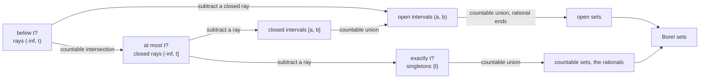
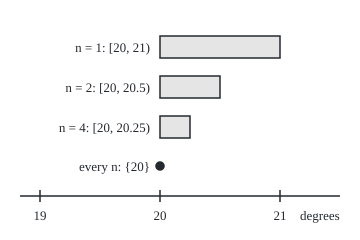

# Generated sigma-algebras and Borel sets: the smallest family containing your chosen sets, and the default family on the real line

[Syllabus](../../../SYLLABUS.md) → [Measure and integration](../../../SYLLABUS.md#w10) → [Sets You Can Measure](../../../SYLLABUS.md#w10-s01) → Generated sigma-algebras and Borel sets

---

## General Overview

A thermometer answers one kind of question: "is the temperature below t degrees?" It answers it for every threshold t, whole or not: below 20, below 20.3, below 1.414214. It never states a reading outright.

Yet it settles far more. "Is it exactly 20 degrees?" Ask "below 20 + 1/n?" for n = 1, 2, 4, 10, and so on. A reading of 20.3 fails the question from n = 4 on; a reading of 20.0007 fails from n = 1429 on. Only a reading of 20 or less passes every time. Remove the readings below 20, one more question, and exactly 20 remains. "Between 18 and 20?" is "below 20?" with "at most 18?" removed. A region made of open bands, however many, is a countable pile of bands with fractional edges.

A **sigma-algebra** is a family of sets that holds the whole space and is closed under complements and countable unions, so it holds the empty set too ([Sigma-algebras](02-sigma-algebras.md)); read it as the list of yes/no questions that can be settled. Start from any chosen sets. The smallest sigma-algebra that holds them all is the **generated sigma-algebra**: everything the rules force. Start from the thermometer's questions on the real line and what comes out is the family of **Borel sets**, named after Émile Borel. Every interval, every exact reading, every countable list of readings and every open set is in it.

**The generated sigma-algebra is everything the rules force once the chosen sets are in; the Borel sets are what the rules force from "below t?" alone, and the same family comes from open intervals, closed intervals or open sets.**

**What kind of fact this is:** two definitions (the generated sigma-algebra and the Borel sets) and a theorem proved on this card in Why it works: rays, open intervals, closed intervals and open sets all generate the same Borel sets, and singletons, countable sets and open sets are Borel.

### The picture: what the thermometer's questions reach

Write $(-\infty, t)$ for the readings below $t$ and $(-\infty, t]$ for those at most $t$: a round bracket leaves the end out, a square bracket keeps it in. $\{t\}$ is the single reading $t$. An **open set** is one in which every point has some room on both sides still inside the set: $(0, \sqrt 2)$ is open, $[0, 1]$ is not, since 1 has no room on its right.



Every arrow is one of the sigma-algebra's rules, applied countably often at most.

---

## The formula

Notation first, in words. A script capital such as $\mathcal{C}$ names a family of sets. $\sigma(\mathcal{C})$ is read "the sigma-algebra generated by C". $\mathcal{B}(\mathbb{R})$ is read "the Borel sets of the real line". $\Omega$ is the space of all possible outcomes.

$$\sigma(\mathcal{C}) \;=\; \bigcap \,\{\, \mathcal{G} \;:\; \mathcal{G} \text{ is a sigma-algebra on } \Omega \text{ and } \mathcal{C} \subseteq \mathcal{G} \,\}$$

**Read it aloud:** list every sigma-algebra on the space that holds all the chosen sets, and keep only the sets that every one of them holds.

$$\mathcal{B}(\mathbb{R}) \;=\; \sigma(\text{open sets}) \;=\; \sigma\{(-\infty, t) : t \in \mathbb{R}\} \;=\; \sigma\{(a, b) : a < b\} \;=\; \sigma\{[a, b] : a \le b\}$$

**Read it aloud:** the Borel sets are generated by the open sets, and equally by the rays below each threshold, by the open intervals, or by the closed intervals.

The first equality is the definition. The other three are the theorem.

| Symbol | Plain meaning | In our example | Push it up and the answer… |
| --- | --- | --- | --- |
| $\Omega$, $\mathbb{R}$ | the space: every possible outcome; $\mathbb{R}$ is the real line | every reading; the small model uses 17, 18, 19, 20 | a bigger space has more sets to settle |
| $\mathcal{C}$, $\mathcal{D}$ | chosen families of sets, called generators | the thermometer's rays | more generators: the family can only grow |
| $\mathcal{G}$ | any sigma-algebra that holds every generator | the family of all subsets always qualifies | — |
| $\sigma(\mathcal{C})$ | the smallest sigma-algebra holding every generator | the Borel sets | grows with $\mathcal{C}$, never shrinks |
| $\bigcap$, $\bigcup$, $\setminus$ | keep what all share; pool everything; remove | $(-\infty,20] \setminus (-\infty,20)$ is the reading 20 | — |
| $A$, $B$, $\subseteq$, $\in$ | sets in the space; "is contained in"; "is a member of" | the rays $\subseteq$ the Borel sets | — |
| $\mathcal{B}(\mathbb{R})$ | the Borel sets: $\sigma$ of the open sets | every question the rules force from the thermometer's questions | — |
| $t$, $\{t\}$ | a threshold; the set holding the single reading $t$ | 20 degrees; the exact reading 20 | the ray grows |
| $(-\infty, t)$, $(-\infty, t]$ | a ray: every number below $t$; below or equal to $t$ | "below 20?"; "at most 20?" | the ray grows |
| $a$, $b$, $U$ | an interval's ends; an open set | $(18, 20)$; the band $(0, \sqrt 2)$ | — |
| $n$ | a counter in the shrinking rays $(-\infty, 20 + 1/n)$ | 1, 2, 4, 10, 100, 1000 | the ray closes in on $(-\infty, 20]$ |
| $\mathbb{Q}$, $p$, $q$ | the rational numbers, fractions $p/q$ of whole numbers | $p/q = 141/100$ | more fractions: finer approximations |
| $x$, $d$, $r$ | a point; its gap above a threshold, $d = x - t$; a radius of room around a point of an open set | the reading 20.3 sits $d$ = 0.3 above 20 | — |
| $u$, $z$, $j$, $m$ | rational ends either side of $x$; a number of decimal places; $10^j x$ rounded down to a whole number | $x$ = 1.4 in $(0, \sqrt 2)$, room $r$ = 0.01: $j$ = 3, $m$ = 1400, $u$ = 1.399, $z$ = 1.401 | — |
| $x_k$, $k$ | the member in place $k$ of a countable list | the rationals, listed one after another | — |

### When it holds

- **The generators are sets in one space.** $\sigma(\mathcal{C})$ exists for any family of subsets of $\Omega$, however strange; nothing else is assumed.
- **Countable operations only.** The rules allow countable unions. Allow any union at all and every set becomes a union of single points, so the family collapses to all subsets. Taken as a record of all its answers at once, the thermometer tells any two readings apart, so in the sense of [Sigma-algebras](02-sigma-algebras.md) Step 4 it settles every subset; on this card, a question the thermometer settles means one the rules force from its answers, and those stop at the Borel sets.
- **Every threshold, or at least a dense set of them.** Rays at every rational $t$ already generate the Borel sets. Rays at whole degrees only do not: they can never settle "below 20.5?".
- **Rational points everywhere on the line.** The step from intervals to open sets uses that every open set is a countable union of intervals with rational ends. That holds on the line, in the plane and in higher dimensions; general spaces are wing 17's business.

---

## Why it works

### Step 0: a family defined by what it must hold

A sigma-algebra's rules survive intersection: if several families each obey them, so does the collection of sets they all share. So the sets forced by the generators can be found without building them. Take every family that obeys the rules and holds the generators, and keep what they have in common.

### Step 1: the generated family exists and is the smallest

The family of all subsets of $\Omega$ holds the generators and obeys the rules, so the list in the formula is never empty. The shared part holds every generator. It is a sigma-algebra, since each rule is passed down from every family in the list. It sits inside every sigma-algebra that holds the generators, since it is their common part. That is what "smallest" means.

One consequence does most of the work below. **To show $\sigma(\mathcal{C}) \subseteq \sigma(\mathcal{D})$, it is enough to show each generator in $\mathcal{C}$ lies in $\sigma(\mathcal{D})$**: then $\sigma(\mathcal{D})$ is one of the families in the list for $\mathcal{C}$.

A small world shows it in full. Keep four whole-degree readings, 17, 18, 19 and 20: 16 subsets, and 15 sigma-algebras, one per way of cutting the readings into blocks (the Bell number, 15). The code builds each generated family three ways: repeat complements and unions until nothing changes; group the readings no generator can tell apart, called **atoms**, and take every union of atoms; intersect all the sigma-algebras that hold the generators. The three always agree.

The thermometer's rays give all 16 subsets. A cruder gauge that only asks "below 18?" and "below 20?" generates 8 sets. Its atoms are $\{17\}$, $\{18, 19\}$ and $\{20\}$: no answer to either question tells 18 from 19. The gauge settles "exactly 20?" but not "exactly 19?". The generators $\{17\}$ and $\{17, 18, 19\}$ are no sigma-algebra themselves, since the complement of $\{17\}$ is missing; the 8 sets they generate are one.

### Step 2: "at most t" from "below t"

The ray $(-\infty, 20]$ is the countable intersection of the rays $(-\infty, 20 + 1/n)$, for $n = 1, 2, 3, \ldots$ A reading of 20 or less lies in every one. A reading above 20 sits some positive gap above it, and $1/n$ drops below any positive gap once $n$ is large: for the reading 20.3, from $n = 4$ on, since 20 + 1/3 = 20.3333 is above 20.3 and 20 + 1/4 = 20.25 is not.

The picture shows what each stage adds on top of $(-\infty, 20)$: the sliver from 20 up to $20 + 1/n$, its left end kept, its right end left out.

<p align="center"></p>

To scale: 120 units per degree, 19 degrees at 40 and 20 at 160; the three slivers end at 280, 220 and 190. Their lengths, 1, 0.5 and 0.25, halve each time and never reach 0 at any finite stage.

### Step 3: exact readings and intervals

Differences of two members stay inside a sigma-algebra: remove a set by intersecting with its complement. So from rays and closed rays:

- the exact reading, $\{20\} = (-\infty, 20] \setminus (-\infty, 20)$;
- the open interval, $(18, 20) = (-\infty, 20) \setminus (-\infty, 18]$;
- the closed interval, $[18, 20] = (-\infty, 20] \setminus (-\infty, 18)$.

Half-open intervals such as $[18, 20)$ come the same way. The code tests all three identities at 21 exact rational points, including 18 and 20 and points a thousandth either side of each.

### Step 4: every open set from countably many intervals

The rules allow only countable unions, and an open set is naturally a union of uncountably many intervals. The rationals fix this: they can be listed one after another ([Countable sets](../../01-Foundations/09-Sizes%20of%20Infinity/02-countable-sets.md)), so the intervals with rational ends can be too. Each point of an open set $U$ has room around it, and a rational lies between any two numbers, so each point sits in a rational-end interval inside $U$. Those intervals, countably many, make up all of $U$.

The band $U = (0, \sqrt 2)$ has an irrational right edge, the square root of 2, 1.414214 by bisection. Using fractions with denominator $q$, the intervals $(0, p/q)$ inside $U$ reach up to the largest $p$ with $(p/q)^2 < 2$. At $q = 100$ that is $p = 141$, since 141 × 141 = 19881 is below 20000 and 142 × 142 = 20164 is above. The part of $U$ still uncovered shrinks from 0.414214 at $q = 1$ to 0.014214, 0.004214 and 0.000214 at $q$ = 10, 100 and 1000. Every point of $U$ is covered at some stage, and there are countably many stages.

### Step 5: four generators, one family

Apply Step 1's comparison rule both ways. Rays are open, so they generate nothing beyond the Borel sets; Steps 2 to 4 put every open set among what rays generate, so they generate at least the Borel sets. Open intervals go the same way. A closed interval is the complement of an open set, and $(a, b)$ is the union of the closed intervals $[a + 1/n, b - 1/n]$, so closed intervals do too. On the four-reading world, rays, open intervals and closed intervals each generate all 16 subsets.

### Step 6: what else is Borel

- **Singletons**, from Step 3.
- **Countable sets**: a countable union of singletons. So the rationals $\mathbb{Q}$ are Borel, and so are the irrationals, their complement.
- **Open and closed sets**: open sets by definition, closed sets as their complements.

The rationals are neither open nor closed. Borel sets reach far beyond both.

<details>
<summary>Detailed proof</summary>

**Claim 1: the intersection of sigma-algebras is a sigma-algebra.** Let each $\mathcal{G}$ in a nonempty list obey the rules, and call a set shared when it is in all of them. The whole space $\Omega$ is in each $\mathcal{G}$, so it is shared. If $A$ is shared, it is in each $\mathcal{G}$, so its complement is in each $\mathcal{G}$ by that family's rule, so the complement is shared. If $A_1, A_2, \ldots$ are shared, each is in every $\mathcal{G}$, so their union is in every $\mathcal{G}$, so it is shared.

**Claim 2: $\sigma(\mathcal{C})$ is the smallest sigma-algebra holding $\mathcal{C}$.** The list is nonempty: all subsets of $\Omega$ qualify. By Claim 1 the intersection is a sigma-algebra; it holds $\mathcal{C}$, as every family in the list does; and it lies inside each such $\mathcal{G}$, which is in the list. Hence: if $\mathcal{C} \subseteq \mathcal{G}$ and $\mathcal{G}$ is a sigma-algebra, then $\sigma(\mathcal{C}) \subseteq \mathcal{G}$. Taking $\mathcal{G} = \sigma(\mathcal{D})$ gives the comparison rule of Step 1.

**Claim 3: $(-\infty, t] = \bigcap_n (-\infty, t + 1/n)$.** If $x \le t$ then $x < t + 1/n$ for every $n$. If $x > t$, let $d = x - t > 0$; there is a whole number $n \ge 1/d$ (the whole numbers have no upper bound), and then $t + 1/n \le t + d = x$, so $x$ is outside that ray. A countable intersection of members is a member, being the complement of the countable union of their complements.

**Claim 4: singletons and intervals are in $\sigma(\text{rays})$.** A difference $A \setminus B$ is $A$ intersected with the complement of $B$. So $\{t\} = (-\infty, t] \setminus (-\infty, t)$, $(a, b) = (-\infty, b) \setminus (-\infty, a]$, $[a, b] = (-\infty, b] \setminus (-\infty, a)$, each a member by Claim 3.

**Claim 5: every open $U$ is a countable union of open intervals with rational ends.** For $x$ in $U$ there is $r > 0$ with $(x - r, x + r) \subseteq U$, by openness. Rationals $u$ and $z$ with $x - r < u < x < z < x + r$ exist. Take a whole number $j$ with $10^{-j} < r/2$ (the whole numbers have no upper bound, as in Claim 3), and let $m$ be $10^j x$ rounded down to a whole number, negative if need be, so $m \le 10^j x < m + 1$. Put $u = (m - 1)/10^j$ and $z = (m + 1)/10^j$. Then $u \le x - 10^{-j} < x$ and $u > x - 2 \cdot 10^{-j} > x - r$; likewise $z > x$ and $z \le x + 10^{-j} < x + r$. So $x \in (u, z) \subseteq U$. Take all the rational-end intervals contained in $U$; their union contains every $x$ of $U$ and lies inside $U$, so it equals $U$. Each such interval is named by a pair of rationals, and the pairs drawn from a countable set are countable, so there are countably many intervals.

**Claim 6: the four generators give one family.** Rays are open, so $\sigma(\text{rays}) \subseteq \mathcal{B}(\mathbb{R})$ by Claim 2. Every open set is in $\sigma(\text{rays})$ by Claims 4 and 5, so $\mathcal{B}(\mathbb{R}) \subseteq \sigma(\text{rays})$ by Claim 2. Open intervals are open, and by Claim 5 every open set is a countable union of them: same two inclusions. A closed interval $[a, b]$ is the complement of the open set $(-\infty, a) \cup (b, \infty)$, so it is Borel; and $(a, b) = \bigcup_{n} [a + 1/n, b - 1/n]$, the union over the $n$ with $2/n < b - a$, since a point $x$ with $a < x < b$ is at least $1/n$ from both ends once $n$ is large (Claim 3's argument). So both inclusions hold for closed intervals too.

**Claim 7: countable sets are Borel.** A countable set, listed as $x_1, x_2, \ldots$, is the countable union of the singletons $\{x_k\}$, each Borel by Claim 4.

</details>

Two variants, used by the pi-systems card: rays of the form $(-\infty, t]$ also generate the Borel sets, since each is Borel (the complement of the open set $(t, \infty)$) and $(-\infty, t) = \bigcup_n (-\infty, t - 1/n]$ by Claim 3's argument, so Step 1's comparison rule gives both inclusions; and so do rays at rational thresholds only, since $(-\infty, t)$ is the union of the rays at the rational thresholds below $t$ ([Pi-systems and Dynkin's theorem](06-pi-systems-and-uniqueness.md)).

---

## Worked numbers, by hand

| Step | Arithmetic | Value |
| --- | --- | --- |
| gauge "below 18?", "below 20?" on 17 to 20 | readings answering both alike form one atom | $\{17\}$, $\{18, 19\}$, $\{20\}$ |
| sets the gauge settles | every union of the atoms | **8** |
| "exactly 19?" under the gauge | $\{19\}$ splits the atom $\{18, 19\}$ | not settled |
| reading 20.3 against $(-\infty, 20 + 1/n)$ | 20.3333 is above it, 20.25 is not | left out from $n = 4$ |
| the exact reading 20 | $(-\infty, 20] \setminus (-\infty, 20)$ | $\{20\}$ |
| the band $(0, \sqrt 2)$ at $q = 100$ | 141 × 141 = 19881 below 20000, 142 × 142 = 20164 above | reach 1.4100 |
| uncovered part at $q = 100$ | 1.414214 − 1.4100 | **0.004214** |

A thermometer that only ever answers "below t?" settles whether the reading is exactly 20, and whether it lies in any open band, even one with an irrational edge.

### What breaks if you drop a piece

| Mistake | Comes out at | What went wrong |
| --- | --- | --- |
| Finitely many unions and complements only | slivers $[20, 20 + 1/n)$ of length 1, 0.1, 0.01, 0.001, never one point | $\{20\}$ needs a countable intersection |
| Too few thresholds: the gauge at 18 and 20 | 8 sets, not 16; "exactly 19?" not settled | the generators must separate the readings |
| One round of complements and unions from the rays | 8 sets after one round, not 16 | the rules must be applied until nothing changes: rounds 5, 8, 11, 14, 16 |
| Any union allowed, however large | every subset of the line | the family is then too big to carry a length ([Translation invariance and the Vitali set](../02-Length%20Done%20Properly/04-translation-invariance-and-the-vitali-set.md)) |

The code prints the first three. The fourth is an argument about uncountably many sets, and no code builds it.

---

## Code, from first principles, and it actually runs

Part one lists every sigma-algebra on the four readings and builds each generated family by three roads: closure under complements and unions, unions of atoms, and the intersection of all 15 sigma-algebras holding the generators. Part two checks the real-line steps at exact rational points: the first $n$ that leaves each reading out of the shrinking rays, found by search and by formula; the three identities of Step 3; and the rational reach into $(0, \sqrt 2)$, found by whole-number search and by a bisection root. The code checks instances and finite stages; that every open set is Borel, for every $t$, is what the proof shows.

### Python

```python
# Generated sigma-algebras and Borel sets -- the check behind the card.
# Standard library only.  Part 1 works on a world of four whole-degree readings,
# where every family can be listed, and builds each generated sigma-algebra by
# three roads that share no code.  Part 2 checks the real-line steps at exact
# rational points; it shows instances, the proofs on the card cover every t.
from fractions import Fraction as Fr
from math import ceil, floor

R = [17, 18, 19, 20]                     # the four readings; a set is a 4-bit mask
FULL = 15

def show(m):
    return "{" + ", ".join(str(r) for i, r in enumerate(R) if m >> i & 1) + "}"

def mask(test):
    return sum(1 << i for i, r in enumerate(R) if test(r))

def closure(C):                          # road 1: add complements and unions until nothing new
    S, rounds = set(C), [len(set(C))]
    while True:
        new = S | {FULL ^ m for m in S} | {a | b for a in S for b in S}
        if new == S:
            return S, rounds
        S = new
        rounds.append(len(S))

def by_atoms(C):                         # road 2: group readings no generator can tell apart
    groups = {}
    for i in range(4):
        groups.setdefault(tuple(g >> i & 1 for g in C), []).append(i)
    atoms = [sum(1 << i for i in g) for g in groups.values()]
    unions = {sum(a for j, a in enumerate(atoms) if k >> j & 1) for k in range(1 << len(atoms))}
    return unions, sorted(atoms)

def is_sigma(fam):                       # the three rules, on a family of subsets
    mem = [s for s in range(16) if fam >> s & 1]
    return (fam & 1 and all(fam >> (FULL ^ m) & 1 for m in mem)
            and all(fam >> (a | b) & 1 for a in mem for b in mem))

SIGMAS = [f for f in range(1 << 16) if is_sigma(f)]

def by_intersection(C):                  # road 3: intersect every sigma-algebra holding C
    out = (1 << 16) - 1
    for f in SIGMAS:
        if all(f >> c & 1 for c in C):
            out &= f
    return {s for s in range(16) if out >> s & 1}

bell = [1]                               # Bell numbers count the ways to split a set into blocks
for n in range(4):
    row = [1]
    for k in range(1, n + 1):
        row.append(row[-1] * (n - k + 1) // k)
    bell.append(sum(row[k] * bell[k] for k in range(n + 1)))

families = [
    ("rays below t", sorted({mask(lambda r: r < t) for t in range(16, 22)})),
    ("open intervals", sorted({mask(lambda r: a < 2 * r < b) for a in range(32, 43) for b in range(32, 43) if a < b})),
    ("closed intervals", sorted({mask(lambda r: a <= r <= b) for a in R for b in R if a <= b})),
    ("gauge, t = 18, 20", [mask(lambda r: r < 18), mask(lambda r: r < 20)]),
]
print(f"four readings {R}: subsets 16, sigma-algebras {len(SIGMAS)}, Bell number {bell[4]}")
print("family             | generators | closure | atoms | intersection | rounds")
results = {}
for name, C in families:
    s1, rounds = closure(C)
    s2, atoms = by_atoms(C)
    s3 = by_intersection(C)
    assert s1 == s2 == s3, name                                    # three roads, one family
    results[name] = (s1, atoms)
    print(f"{name:18} | {len(C):10} | {len(s1):7} | {len(s2):5} | {len(s3):12} | {' -> '.join(map(str, rounds))}")
gs, gatoms = results["gauge, t = 18, 20"]
print("gauge atoms: " + " | ".join(show(a) for a in gatoms))
print(f"gauge settles 'exactly 19': {'yes' if mask(lambda r: r == 19) in gs else 'no'}; "
      f"'exactly 20': {'yes' if mask(lambda r: r == 20) in gs else 'no'}")
assert len(SIGMAS) == bell[4] == 15
assert mask(lambda r: r == 19) not in gs and mask(lambda r: r == 20) in gs and len(gs) == 2 ** len(gatoms) == 8

# ---- Part 2: the real line, at exact rational points ----
print("closed ray (-inf, 20] from open rays (-inf, 20 + 1/n): first n that leaves each point out")
for x in [Fr(41, 2), Fr(203, 10), Fr(2001, 100), Fr(200007, 10000)]:
    n = 1
    while x < 20 + Fr(1, n):              # search: shrink the ray until x falls outside
        n += 1
    formula = ceil(1 / (x - 20))           # formula: 20 + 1/n <= x exactly when n >= 1/(x - 20)
    assert n == formula
    print(f"  reading {float(x)}: search n = {n}, formula n = {formula}")
print(f"  by hand, reading 20.3: 20 + 1/3 = {float(20 + Fr(1, 3)):.4f} is above it, 20 + 1/4 = {float(20 + Fr(1, 4))} is not")
print("  reading 20: inside every ray, so inside (-inf, 20]")
print("sliver [20, 20 + 1/n) = (-inf, 20 + 1/n) minus (-inf, 20), length by n: "
      + ", ".join(f"n={n} {1 / n:g}" for n in [1, 2, 4, 10, 100, 1000]))

grid = [Fr(k, 4) for k in range(68, 85)] + [18 + Fr(s, 1000) for s in (-1, 1)] + [20 + Fr(s, 1000) for s in (-1, 1)]
below = lambda t: (lambda x: x < t)                          # the thermometer's question
closed_below = lambda t: (lambda x: all(x < t + Fr(1, n) for n in range(1, 10001)))
built = {
    "{20}": (lambda x: x == 20, lambda x: closed_below(20)(x) and not below(20)(x)),
    "(18, 20)": (lambda x: 18 < x < 20, lambda x: below(20)(x) and not closed_below(18)(x)),
    "[18, 20]": (lambda x: 18 <= x <= 20, lambda x: closed_below(20)(x) and not below(18)(x)),
}
for name, (direct, from_rays) in built.items():
    agree = sum(direct(x) == from_rays(x) for x in grid)
    assert agree == len(grid), name
    print(f"  {name:9} built from rays agrees with its definition at {agree} of {len(grid)} exact points")
print("  (a closed ray (-inf, t] is tested as the rays (-inf, t + 1/n) for n = 1 to 10000)")

lo, hi = 1.0, 2.0                        # square root of 2 by bisection, written out
for _ in range(60):
    mid = (lo + hi) / 2
    lo, hi = (mid, hi) if mid * mid < 2 else (lo, mid)
print(f"band (0, sqrt 2), sqrt 2 = {lo:.6f} by bisection; union of rational intervals (0, p/q) inside it")
for q in [1, 10, 100, 1000]:
    p = 0
    while (p + 1) * (p + 1) < 2 * q * q:  # search: largest p with (p/q)^2 < 2, integers only
        p += 1
    assert p == floor(q * lo)             # the bisection root gives the same p
    print(f"  q = {q:4}: p = {p:4}, reach p/q = {p / q:.4f}, uncovered [p/q, sqrt 2) length {lo - p / q:.6f}")

print(f"  by hand, q = 100: 141*141 = {141 * 141} < 2*100*100 = {2 * 100 * 100} < 142*142 = {142 * 142}")
x = lambda t: 40 + 120 * (t - 19)          # the picture: 120 units per degree, 19 degrees at 40
print("figure, x(19) = %g, x(20) = %g, x(21) = %g, sliver right ends n=1,2,4: %g, %g, %g"
      % (x(19), x(20), x(21), x(20 + 1), x(20 + 1 / 2), x(20 + 1 / 4)))
print("ALL CHECKS PASS")
```

**Ran 2026-09-29 on macOS, Python 3.14.6, standard library only. All checks passed. Output, pasted from the run:**

```
four readings [17, 18, 19, 20]: subsets 16, sigma-algebras 15, Bell number 15
family             | generators | closure | atoms | intersection | rounds
rays below t       |          5 |      16 |    16 |           16 | 5 -> 8 -> 11 -> 14 -> 16
open intervals     |         11 |      16 |    16 |           16 | 11 -> 16
closed intervals   |         10 |      16 |    16 |           16 | 10 -> 16
gauge, t = 18, 20  |          2 |       8 |     8 |            8 | 2 -> 4 -> 6 -> 8
gauge atoms: {17} | {18, 19} | {20}
gauge settles 'exactly 19': no; 'exactly 20': yes
closed ray (-inf, 20] from open rays (-inf, 20 + 1/n): first n that leaves each point out
  reading 20.5: search n = 2, formula n = 2
  reading 20.3: search n = 4, formula n = 4
  reading 20.01: search n = 100, formula n = 100
  reading 20.0007: search n = 1429, formula n = 1429
  by hand, reading 20.3: 20 + 1/3 = 20.3333 is above it, 20 + 1/4 = 20.25 is not
  reading 20: inside every ray, so inside (-inf, 20]
sliver [20, 20 + 1/n) = (-inf, 20 + 1/n) minus (-inf, 20), length by n: n=1 1, n=2 0.5, n=4 0.25, n=10 0.1, n=100 0.01, n=1000 0.001
  {20}      built from rays agrees with its definition at 21 of 21 exact points
  (18, 20)  built from rays agrees with its definition at 21 of 21 exact points
  [18, 20]  built from rays agrees with its definition at 21 of 21 exact points
  (a closed ray (-inf, t] is tested as the rays (-inf, t + 1/n) for n = 1 to 10000)
band (0, sqrt 2), sqrt 2 = 1.414214 by bisection; union of rational intervals (0, p/q) inside it
  q =    1: p =    1, reach p/q = 1.0000, uncovered [p/q, sqrt 2) length 0.414214
  q =   10: p =   14, reach p/q = 1.4000, uncovered [p/q, sqrt 2) length 0.014214
  q =  100: p =  141, reach p/q = 1.4100, uncovered [p/q, sqrt 2) length 0.004214
  q = 1000: p = 1414, reach p/q = 1.4140, uncovered [p/q, sqrt 2) length 0.000214
  by hand, q = 100: 141*141 = 19881 < 2*100*100 = 20000 < 142*142 = 20164
figure, x(19) = 40, x(20) = 160, x(21) = 280, sliver right ends n=1,2,4: 280, 220, 190
ALL CHECKS PASS
```

### Rust

Same numbers, same labels, built with `rustc --edition 2021 -O`.

```rust
// Generated sigma-algebras and Borel sets -- the same check as the Python, in
// Rust, std only.  Part 1: a world of four whole-degree readings, each generated
// sigma-algebra built by three roads.  Part 2: the real-line steps at exact
// rational points, written as integer numerator and denominator pairs.
use std::collections::{BTreeMap, BTreeSet};

const R: [i64; 4] = [17, 18, 19, 20]; // the four readings; a set is a 4-bit mask
const FULL: u32 = 15;

fn show(m: u32) -> String {
    let v: Vec<String> = (0..4).filter(|i| m >> i & 1 == 1).map(|i| R[i].to_string()).collect();
    format!("{{{}}}", v.join(", "))
}
fn mask<F: Fn(i64) -> bool>(test: F) -> u32 {
    (0..4).filter(|&i| test(R[i])).map(|i| 1u32 << i).sum()
}
// road 1: add complements and unions until nothing new
fn closure(c: &[u32]) -> (BTreeSet<u32>, Vec<usize>) {
    let mut s: BTreeSet<u32> = c.iter().copied().collect();
    let mut rounds = vec![s.len()];
    loop {
        let mut new = s.clone();
        for &a in &s {
            new.insert(FULL ^ a);
            for &b in &s { new.insert(a | b); }
        }
        if new == s { return (s, rounds); }
        s = new;
        rounds.push(s.len());
    }
}
// road 2: group readings no generator can tell apart
fn by_atoms(c: &[u32]) -> (BTreeSet<u32>, Vec<u32>) {
    let mut groups: BTreeMap<Vec<u32>, u32> = BTreeMap::new();
    for i in 0..4 {
        let sig: Vec<u32> = c.iter().map(|g| g >> i & 1).collect();
        *groups.entry(sig).or_insert(0) |= 1 << i;
    }
    let mut atoms: Vec<u32> = groups.values().copied().collect();
    atoms.sort();
    let unions = (0..1u32 << atoms.len())
        .map(|k| (0..atoms.len()).filter(|j| k >> j & 1 == 1).map(|j| atoms[j]).sum())
        .collect();
    (unions, atoms)
}
// the three rules, on a family of subsets
fn is_sigma(f: u32) -> bool {
    let mem: Vec<u32> = (0..16).filter(|s| f >> s & 1 == 1).collect();
    f & 1 == 1 && mem.iter().all(|&m| f >> (FULL ^ m) & 1 == 1)
        && mem.iter().all(|&a| mem.iter().all(|&b| f >> (a | b) & 1 == 1))
}
// road 3: intersect every sigma-algebra holding C
fn by_intersection(c: &[u32], sigmas: &[u32]) -> BTreeSet<u32> {
    let mut out: u32 = 0xFFFF;
    for &f in sigmas {
        if c.iter().all(|&g| f >> g & 1 == 1) { out &= f; }
    }
    (0..16).filter(|s| out >> s & 1 == 1).collect()
}
// x = (num, den) with den > 0: is x below t + 1/n?
fn below(x: (i64, i64), t: i64, n: i64) -> bool { x.0 * n < (t * n + 1) * x.1 }
fn open_below(x: (i64, i64), t: i64) -> bool { x.0 < t * x.1 }
fn closed_below(x: (i64, i64), t: i64) -> bool { (1..=10000).all(|n| below(x, t, n)) }

fn main() {
    let sigmas: Vec<u32> = (0..1u32 << 16).filter(|&f| is_sigma(f)).collect();
    let mut bell = vec![1u64]; // Bell numbers: ways to split a set into blocks
    for n in 0..4u64 {
        let mut row = vec![1u64];
        for k in 1..=n { let last = row[row.len() - 1]; row.push(last * (n - k + 1) / k); }
        bell.push((0..=n as usize).map(|k| row[k] * bell[k]).sum());
    }
    let rays: BTreeSet<u32> = (16..22).map(|t| mask(|r| r < t)).collect();
    let mut open = BTreeSet::new();
    for a in 32..43 { for b in (a + 1)..43 { open.insert(mask(|r| a < 2 * r && 2 * r < b)); } }
    let mut closed = BTreeSet::new();
    for &a in &R { for &b in &R { if a <= b { closed.insert(mask(|r| a <= r && r <= b)); } } }
    let families: Vec<(&str, Vec<u32>)> = vec![
        ("rays below t", rays.into_iter().collect()),
        ("open intervals", open.into_iter().collect()),
        ("closed intervals", closed.into_iter().collect()),
        ("gauge, t = 18, 20", vec![mask(|r| r < 18), mask(|r| r < 20)]),
    ];
    println!("four readings [17, 18, 19, 20]: subsets 16, sigma-algebras {}, Bell number {}", sigmas.len(), bell[4]);
    println!("family             | generators | closure | atoms | intersection | rounds");
    let (mut gs, mut gatoms) = (BTreeSet::new(), vec![]);
    for (name, c) in &families {
        let (s1, rounds) = closure(c);
        let (s2, atoms) = by_atoms(c);
        let s3 = by_intersection(c, &sigmas);
        assert!(s1 == s2 && s2 == s3, "{}", name); // three roads, one family
        let r: Vec<String> = rounds.iter().map(|x| x.to_string()).collect();
        println!("{:18} | {:10} | {:7} | {:5} | {:12} | {}", name, c.len(), s1.len(), s2.len(), s3.len(), r.join(" -> "));
        if name.starts_with("gauge") { gs = s1; gatoms = atoms; }
    }
    let a: Vec<String> = gatoms.iter().map(|&m| show(m)).collect();
    println!("gauge atoms: {}", a.join(" | "));
    let yn = |b: bool| if b { "yes" } else { "no" };
    println!("gauge settles 'exactly 19': {}; 'exactly 20': {}",
             yn(gs.contains(&mask(|r| r == 19))), yn(gs.contains(&mask(|r| r == 20))));
    assert!(sigmas.len() as u64 == bell[4] && bell[4] == 15);
    assert!(!gs.contains(&mask(|r| r == 19)) && gs.contains(&mask(|r| r == 20)) && gs.len() == 1 << gatoms.len() && gs.len() == 8);

    // ---- Part 2: the real line, at exact rational points ----
    println!("closed ray (-inf, 20] from open rays (-inf, 20 + 1/n): first n that leaves each point out");
    for x in [(41i64, 2i64), (203, 10), (2001, 100), (200007, 10000)] {
        let mut n = 1;
        while below(x, 20, n) { n += 1; } // search: shrink the ray until x falls outside
        let (d_num, d_den) = (x.0 - 20 * x.1, x.1); // x - 20 as a fraction
        let formula = (d_den + d_num - 1) / d_num;  // ceiling of 1/(x - 20), integers only
        assert_eq!(n, formula);
        println!("  reading {}: search n = {}, formula n = {}", x.0 as f64 / x.1 as f64, n, formula);
    }
    println!("  by hand, reading 20.3: 20 + 1/3 = {:.4} is above it, 20 + 1/4 = {} is not", 20.0 + 1.0 / 3.0, 20.0 + 1.0 / 4.0);
    println!("  reading 20: inside every ray, so inside (-inf, 20]");
    let sl: Vec<String> = [1, 2, 4, 10, 100, 1000].iter().map(|&n| format!("n={} {}", n, 1.0 / n as f64)).collect();
    println!("sliver [20, 20 + 1/n) = (-inf, 20 + 1/n) minus (-inf, 20), length by n: {}", sl.join(", "));

    let mut grid: Vec<(i64, i64)> = (68..85).map(|k| (k, 4)).collect();
    for s in [-1, 1] { grid.push((18000 + s, 1000)); }
    for s in [-1, 1] { grid.push((20000 + s, 1000)); }
    type Test = Box<dyn Fn((i64, i64)) -> bool>;
    let built: Vec<(&str, Test, Test)> = vec![
        ("{20}", Box::new(|x: (i64, i64)| x.0 == 20 * x.1),
         Box::new(|x| closed_below(x, 20) && !open_below(x, 20))),
        ("(18, 20)", Box::new(|x: (i64, i64)| 18 * x.1 < x.0 && x.0 < 20 * x.1),
         Box::new(|x| open_below(x, 20) && !closed_below(x, 18))),
        ("[18, 20]", Box::new(|x: (i64, i64)| 18 * x.1 <= x.0 && x.0 <= 20 * x.1),
         Box::new(|x| closed_below(x, 20) && !open_below(x, 18))),
    ];
    for (name, direct, from_rays) in &built {
        let agree = grid.iter().filter(|&&x| direct(x) == from_rays(x)).count();
        assert_eq!(agree, grid.len(), "{}", name);
        println!("  {:9} built from rays agrees with its definition at {} of {} exact points", name, agree, grid.len());
    }
    println!("  (a closed ray (-inf, t] is tested as the rays (-inf, t + 1/n) for n = 1 to 10000)");

    let (mut lo, mut hi) = (1.0f64, 2.0f64); // square root of 2 by bisection, written out
    for _ in 0..60 {
        let mid = (lo + hi) / 2.0;
        if mid * mid < 2.0 { lo = mid } else { hi = mid }
    }
    println!("band (0, sqrt 2), sqrt 2 = {:.6} by bisection; union of rational intervals (0, p/q) inside it", lo);
    for q in [1i64, 10, 100, 1000] {
        let mut p = 0i64;
        while (p + 1) * (p + 1) < 2 * q * q { p += 1; } // search: largest p with (p/q)^2 < 2
        assert_eq!(p, (q as f64 * lo).floor() as i64);  // the bisection root gives the same p
        let r = p as f64 / q as f64;
        println!("  q = {:4}: p = {:4}, reach p/q = {:.4}, uncovered [p/q, sqrt 2) length {:.6}", q, p, r, lo - r);
    }
    println!("  by hand, q = 100: 141*141 = {} < 2*100*100 = {} < 142*142 = {}", 141 * 141, 2 * 100 * 100, 142 * 142);
    let x = |t: f64| 40.0 + 120.0 * (t - 19.0); // the picture: 120 units per degree
    println!("figure, x(19) = {}, x(20) = {}, x(21) = {}, sliver right ends n=1,2,4: {}, {}, {}",
             x(19.0), x(20.0), x(21.0), x(21.0), x(20.5), x(20.25));
    println!("ALL CHECKS PASS");
}
```

**Ran 2026-09-29 on macOS, rustc 1.98.1, no crates. All checks passed. Output, pasted from the run:**

```
four readings [17, 18, 19, 20]: subsets 16, sigma-algebras 15, Bell number 15
family             | generators | closure | atoms | intersection | rounds
rays below t       |          5 |      16 |    16 |           16 | 5 -> 8 -> 11 -> 14 -> 16
open intervals     |         11 |      16 |    16 |           16 | 11 -> 16
closed intervals   |         10 |      16 |    16 |           16 | 10 -> 16
gauge, t = 18, 20  |          2 |       8 |     8 |            8 | 2 -> 4 -> 6 -> 8
gauge atoms: {17} | {18, 19} | {20}
gauge settles 'exactly 19': no; 'exactly 20': yes
closed ray (-inf, 20] from open rays (-inf, 20 + 1/n): first n that leaves each point out
  reading 20.5: search n = 2, formula n = 2
  reading 20.3: search n = 4, formula n = 4
  reading 20.01: search n = 100, formula n = 100
  reading 20.0007: search n = 1429, formula n = 1429
  by hand, reading 20.3: 20 + 1/3 = 20.3333 is above it, 20 + 1/4 = 20.25 is not
  reading 20: inside every ray, so inside (-inf, 20]
sliver [20, 20 + 1/n) = (-inf, 20 + 1/n) minus (-inf, 20), length by n: n=1 1, n=2 0.5, n=4 0.25, n=10 0.1, n=100 0.01, n=1000 0.001
  {20}      built from rays agrees with its definition at 21 of 21 exact points
  (18, 20)  built from rays agrees with its definition at 21 of 21 exact points
  [18, 20]  built from rays agrees with its definition at 21 of 21 exact points
  (a closed ray (-inf, t] is tested as the rays (-inf, t + 1/n) for n = 1 to 10000)
band (0, sqrt 2), sqrt 2 = 1.414214 by bisection; union of rational intervals (0, p/q) inside it
  q =    1: p =    1, reach p/q = 1.0000, uncovered [p/q, sqrt 2) length 0.414214
  q =   10: p =   14, reach p/q = 1.4000, uncovered [p/q, sqrt 2) length 0.014214
  q =  100: p =  141, reach p/q = 1.4100, uncovered [p/q, sqrt 2) length 0.004214
  q = 1000: p = 1414, reach p/q = 1.4140, uncovered [p/q, sqrt 2) length 0.000214
  by hand, q = 100: 141*141 = 19881 < 2*100*100 = 20000 < 142*142 = 20164
figure, x(19) = 40, x(20) = 160, x(21) = 280, sliver right ends n=1,2,4: 280, 220, 190
ALL CHECKS PASS
```

> [!TIP]
> **Try changing**
> - **Add a third gauge question.** Guess first: with thresholds 18, 19 and 20, does the gauge settle "exactly 19?"? Change the gauge to `[mask(lambda r: r < 18), mask(lambda r: r < 19), mask(lambda r: r < 20)]`. Answer: yes; every reading becomes its own atom, the closure, atoms and intersection columns reach 16 like the rays', and the gauge assert, pinned to the two-question gauge's 8 sets, stops the run.
> - **Move the reading closer.** Guess first: how does the first $n$ change for 20.00007 instead of 20.0007? Add `Fr(2000007, 100000)` to the list. Answer: the search and the formula both land ten times further out, since $n$ is the whole number just at or above one over the gap.
> - **Drop the union rule.** Guess first: without it, how many families pass `is_sigma`? Remove the test `all(fam >> (a | b) & 1 for a in mem for b in mem)` from it. Answer: 128 families pass, the intersection road shrinks, and the three-roads assert stops the run on the rays, before the Bell-number assert is reached.

---

## The usual mistake

> [!warning]
> **Treating $\sigma(\mathcal{C})$ as the generators plus one round of complements and unions.** From the four-reading rays, one round gives 8 sets; the full 16 arrive only after rounds 5, 8, 11, 14, 16. On the line, even countably many rounds of countable operations miss some Borel sets (a theorem of descriptive set theory, not proved here). The definition by intersection never counts rounds.
>
> - **"Borel" read as "open or closed".** The rationals are Borel, yet neither open nor closed.
> - **"Borel" read as "every subset".** The Vitali set is not Borel; it has no length at all.
> - **Generators read as atoms.** The gauge's generators $\{17\}$ and $\{17, 18, 19\}$ overlap; its atoms are $\{17\}$, $\{18, 19\}$, $\{20\}$.
> - **"Measurable" without naming the family.** $\{19\}$ is in the sigma-algebra the rays generate, and not in the one the gauge generates: the same set is settled by one instrument and not the other.

---

## Where you meet it in real life

- **Distribution functions.** A reading's chance of being at most $t$, for every $t$, pins down its chance of landing in every Borel set, because rays generate the Borel sets: [Pi-systems and Dynkin's theorem](06-pi-systems-and-uniqueness.md).
- **Checking a function is measurable.** Only the questions "is the value below a?" need checking, for the same reason: [Measurable functions](../03-Measurable%20Functions/01-measurable-functions.md).
- **What a measurement tells.** The questions a quantity answers generate a sigma-algebra, its information: the gauge's 8 sets against the rays' 16. [Random variables as measurable maps](../03-Measurable%20Functions/04-random-variables-and-their-information.md).
- **Two or more readings at once.** Rectangles generate the sets of the plane, the same construction one dimension up: [Product sigma-algebras](../06-Product%20Measures%20and%20Fubini/01-product-sigma-algebras.md).

> **Say it back**
> The sigma-algebra generated by chosen sets is everything complements and countable unions force from them: the common part of every sigma-algebra that holds them. On the line, the questions "below t?" generate the Borel sets. Countable intersections turn "below" into "at most", differences give exact readings and intervals, and rational ends give every open set. Open intervals, closed intervals and open sets generate the same family. Singletons, countable, open and closed sets are Borel; not every set is.

---

## What this builds on

- [Sigma-algebras](02-sigma-algebras.md): the three rules, and a sigma-algebra read as the questions it settles.
- [The number line and inequalities](../../01-Foundations/02-The%20Number%20Line/02-number-line-and-inequalities.md): intervals and their ends, and a fraction between any two fractions; Claim 5 puts one between any two numbers.
- [Countable sets](../../01-Foundations/09-Sizes%20of%20Infinity/02-countable-sets.md): the rationals, and pairs of them, fit in one queue, so the rational-end intervals are countably many.
- [Sequences](../../06-Calculus%20and%20analysis/01-Limits%20and%20Continuity/03-sequences-and-limits.md): $1/n$ dropping below any positive gap, which closes the ray in Step 2.

## Where this goes next

- [Pi-systems and Dynkin's theorem](06-pi-systems-and-uniqueness.md): two measures that agree on the rays agree on every Borel set.
- [Measurable functions](../03-Measurable%20Functions/01-measurable-functions.md): the single test "below a?" for measurability, inherited from this card's generation theorem.
- [Product sigma-algebras](../06-Product%20Measures%20and%20Fubini/01-product-sigma-algebras.md): families generated by rectangles on a product of spaces.

The family of sets is now fixed; what size to give each Borel set, and the rules that size must obey, is [Measures](04-measures.md).

---

## Sources

Verified 2026-09-29: every link below resolves to the publisher's page.

- Axler, Sheldon. *Measure, Integration & Real Analysis*. Springer, Graduate Texts in Mathematics, 2020, open access. [Author's page with the free PDF](https://measure.axler.net/). Section 2B builds the generated sigma-algebra and the Borel sets and proves the interval and ray generators.
- Billingsley, Patrick. *Probability and Measure*, Anniversary Edition. Wiley, 2012. [Publisher page](https://www.wiley.com/en-us/Probability+and+Measure%2C+Anniversary+Edition-p-9781118122372). Section 2 generates the Borel sets from intervals and rays, with the probability reading.
- Folland, Gerald B. *Real Analysis: Modern Techniques and Their Applications*, 2nd ed. Wiley, 1999. [Publisher page](https://www.wiley.com/en-us/Real+Analysis%3A+Modern+Techniques+and+Their+Applications%2C+2nd+Edition-p-9780471317166). Section 1.2: the generated sigma-algebra by intersection and the list of Borel generators.
- Williams, David. *Probability with Martingales*. Cambridge University Press, 1991. [Publisher page](https://www.cambridge.org/core/books/probability-with-martingales/B4CFCE0D08930FB46C6E93E775503926). Chapters 1 and 3: generated sigma-algebras, the Borel sets, and a sigma-algebra read as the information a quantity carries.
