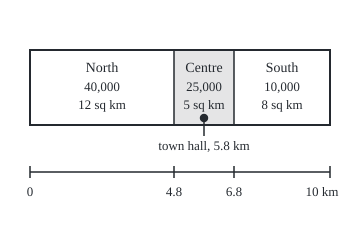

# Measures: a non-negative size that adds over countably many disjoint pieces, from counting to length to probability

Measure and integration → Sets You Can Measure → Additive size → Measures

---

## General Overview

A city has three districts. North has 40,000 residents, Centre 25,000, South 10,000. North covers 12 square km, Centre 5, South 8. The town hall stands in Centre.

Ask "how big is North and South together?" and there are several honest answers. Two districts. 50,000 residents. Two thirds of the city's people. 20 square km. No town hall. Each answer is a different notion of size, and each obeys the same bookkeeping: cut a region into pieces that do not overlap, size each piece, add. North and South hold 40,000 + 10,000 residents because no resident lives in both.

That bookkeeping is the whole idea of a **measure**: a rule that gives each allowed set a size of zero or more, possibly infinite, so that sizes of non-overlapping pieces add. "Allowed" means the set belongs to a sigma-algebra, the collection of sets the rule agrees to size ([sigma-algebras](02-sigma-algebras.md)). The one demand beyond everyday arithmetic is that the adding must work for a countable list of pieces, not only for two or three. That demand lets length on the whole line, which is infinite, be built from unit stretches, and it is what lets limits pass through sizes later in the wing.

**A measure assigns each set in a sigma-algebra a size in [0, ∞], gives the empty set size 0, and adds sizes over any countable list of pieces that do not overlap.**

**What kind of fact this is:** a definition; the facts built on it here (every weighted count is a measure, finite adding follows from countable adding, dividing by a finite total gives a probability, and which measures are sigma-finite) are theorems, proved on this card in Why it works.

### The picture: one city, several sizes

The strip below is the city drawn to scale, 10 km long and 2.5 km wide: 30 drawing units per km. Each district shows its residents and its area. The dot is the town hall at 5.8 km along; Centre is shaded.

<p align="center"></p>

Caption: each district shows residents, then area. Widths are to scale, so area reads straight off the strip; residents do not, which is why area and head count are two measures on the same sets.

---

## The formula

Notation first, in words. The space $\Omega$ (capital omega) is the set of all points; here the three districts. A sigma-algebra on it is written with a script letter, $\mathcal F$, read "the collection of sets we allow ourselves to measure"; here all 8 sets of districts. A measure is written $\mu$ (mu). The interval [0, ∞] means every number from 0 up, plus the value $\infty$ (infinity), with the rule that anything added to infinity is infinity. Sets that do not overlap are called **disjoint**.

$$\mu:\mathcal F\to[0,\infty],\qquad \mu(\varnothing)=0,\qquad \mu\Big(\bigcup_{i=1}^{\infty}A_i\Big)=\sum_{i=1}^{\infty}\mu(A_i)\ \text{ whenever } A_1, A_2, \ldots \in\mathcal F \text{ are pairwise disjoint.}$$

**Read it aloud:** a measure takes each allowed set to a size of zero or more, maybe infinite; the empty set has size zero; and when a countable list of allowed sets never overlap, the size of their union is the sum of their sizes.

The sum on the right has only non-negative terms, so its partial sums rise. Rising totals either settle at a finite limit or pass every number ([sequences-and-limits](../../06-Calculus%20and%20analysis/01-Limits%20and%20Continuity/03-sequences-and-limits.md)). In the second case this card takes the sum to be $\infty$. That is a convention of measure theory: [series-convergence](../../06-Calculus%20and%20analysis/06-Series/01-series-convergence.md) calls such a series divergent, with no sum. The second rule is called **countable additivity**.

The workhorse example gives each point $\omega$ (small omega) a weight $w(\omega)$ of zero or more and adds the weights of the points in a set $A$:

$$\mu(A)=\sum_{\omega\in A} w(\omega)$$

**Read it aloud:** the size of a set is the total weight of the points inside it.

With every weight 1 this is **counting measure**. With weight 1 on one point and 0 elsewhere it is a **point mass** at that point, written $\delta_c$ for the point c: size 1 if the set holds c, 0 if not. Weights of 40,000, 25,000 and 10,000 give head count. A measure whose total $\mu(\Omega)$ is 1 is a **probability measure**, written $P$; share of residents is one. Length on the real line, written $\lambda$ (lambda), gives each interval its length.

A measure is **finite** when $\mu(\Omega)<\infty$. It is **sigma-finite** when the space is a countable union of allowed sets of finite size:

$$\Omega=\bigcup_{n=1}^{\infty}E_n,\qquad \mu(E_n)<\infty \text{ for every } n.$$

The **measure space** is the triple $(\Omega,\mathcal F,\mu)$: the points, the sets that may be sized, and the sizing rule. When the rule is a probability measure the triple is a **probability space**.

| Symbol | Plain meaning | In our example | Push it up and the answer… |
| --- | --- | --- | --- |
| $\Omega$ | the space: every point under discussion | the districts N, C, S | more points, more sets to size |
| $\mathcal F$ | the sigma-algebra: the sets that may be sized | all 8 sets of districts | a bigger collection asks more of the rule |
| $\mu$ | a measure: the sizing rule | head count, area, share | — |
| $A$, $B$, $A_i$ | sets in the sigma-algebra; the $A_i$ are a countable list of pieces | N,S is 50,000 residents | a larger set never has a smaller size |
| $\omega$ | a single point of the space | the district C | — |
| $w$ | the weight of each point, $w(\omega)$ | 40,000, 25,000, 10,000 residents | the sizes of every set holding that point rise by the same amount |
| $\delta_c$ | point mass at c: 1 if the set holds c, else 0 | the town hall rule, c = C | — |
| $P$ | a probability measure: total size 1 | share of residents | cannot exceed 1 on any set |
| $\lambda$ | length on the real line | the interval [0, 1) has length 1 | — |
| $E_n$ | the n-th piece of a cover by finite-size sets | the unit interval [n, n+1) | — |
| $\varnothing$ | the empty set | no districts | — |
| $\infty$ | the size "without bound" | the whole line's length | — |

### When it holds

A definition does not hold or fail: a rule is a measure or is not. The theorems here have short hypotheses:

- **Weighted counts need weights of zero or more.** A negative weight makes some sizes negative; a signed rule is a different object, a signed measure.
- **Dividing by the total needs a total that is finite and not zero.** Head count over 75,000 is a probability; length on the whole line has no finite total to divide by.
- **Countable adding needs the pieces disjoint.** Residents of N,C plus residents of C,S is 100,000, not the city's 75,000: Centre was counted twice.

---

## Why it works

### Step 0: size is bookkeeping, and the bookkeeping must survive a countable list

Every rule on this card cuts into non-overlapping pieces, sizes the pieces and adds. What separates a measure from other additive rules is how far the adding reaches. The whole line is the union of the unit intervals [n, n+1), one for each whole number n, positive or negative: a countable list ([countable-sets](../../01-Foundations/09-Sizes%20of%20Infinity/02-countable-sets.md)). Every limit in the later shelves comes as a countable list too. A measure promises the adding still works there. It does not promise anything for uncountable lists: every single point on the line has length 0, yet [0, 1] has length 1.

### Step 1: finite adding and an empty set of size zero follow

Two disjoint sets A and B form a countable list A, B, ∅, ∅, … with empty sets after them. Countable additivity gives μ(A ∪ B) = μ(A) + μ(B) + 0 + 0 + …, which is finite additivity. The same padding works for any finite list.

The rule μ(∅) = 0 is nearly forced. Take the list ∅, ∅, ∅, …: its union is ∅, so μ(∅) equals an infinite sum of copies of μ(∅). A sum of infinitely many copies of a positive number is infinite, so μ(∅) is 0 or ∞. It can be ∞ only if every set has size ∞, because A = A ∪ ∅ ∪ ∅ ∪ … gives μ(A) = μ(A) + μ(∅) + …. So the empty-set rule only rules out the rule "everything is infinite".

One more consequence: if A sits inside B, then B is A plus the part of B outside A, two disjoint pieces, so μ(B) = μ(A) + μ(B minus A), at least μ(A). Subadditivity and limits follow in [continuity-of-measure](05-continuity-of-measure.md).

### Step 2: every weighted count is a measure

Theorem: on any space with the collection of all its subsets, and any weights w of zero or more, the rule μ(A) = sum of w(ω) over the points ω in A is a measure. When A is uncountable, the sum means the least upper bound of the sums over finite sets of its points. Counting measure, point masses, head count and area by district are all cases of it.

The idea of the proof: in a disjoint union each point lies in exactly one piece. Adding weights point by point, or piece by piece and then adding the totals, adds the same non-negative numbers in a different order and grouping, and for non-negative terms order and grouping never change the sum.

<details>
<summary>Detailed proof</summary>

Let the space be any set, the sigma-algebra all its subsets, and each weight at least 0. First, μ(∅) is an empty sum, 0. Every μ(A) is a sum of non-negative terms, so it lies in [0, ∞].

Now take pairwise disjoint sets A_1, A_2, … with union A. Every sum in this proof is the least upper bound of the sums over finite sets of its terms. For an uncountable set of points that is the definition. For a non-negative series it follows: the partial sums rise, so they settle at their least upper bound or pass every number ([sequences-and-limits](../../06-Calculus%20and%20analysis/01-Limits%20and%20Continuity/03-sequences-and-limits.md)); each partial sum is a finite-set sum, and each finite set of terms lies inside some long enough partial sum. No order was used, so the value is the same in any order. For a finite value this is the reordering rule for absolutely convergent series ([alternating-and-conditional-convergence](../../06-Calculus%20and%20analysis/06-Series/03-alternating-and-conditional-convergence.md)); a sum of ∞ stays ∞ in any order, since its finite-set sums pass every number.

*The sum of the pieces is at most the whole.* Take the first k pieces and a finite set of points in each. Those points are distinct, since the pieces are disjoint, and all lie in A. So their total weight is at most μ(A). Take the least upper bound over the finite sets, piece by piece: μ(A_1) + … + μ(A_k) ≤ μ(A). Let k grow: the sum of all μ(A_i) is at most μ(A).

*The whole is at most the sum of the pieces.* Take any finite set of points in A. Each lies in exactly one piece, and only finitely many pieces are touched, say among the first k. Grouping the points by piece, their total weight is at most μ(A_1) + … + μ(A_k), which is at most the sum of all μ(A_i). The least upper bound over finite sets gives μ(A) ≤ the sum of all μ(A_i).

The two inequalities give equality, including the case where both sides are ∞. No step subtracted anything, so infinite values caused no trouble.

</details>

In the code, every one of the 27 ordered pairs of disjoint sets of districts is checked against each weighted rule. On a finite space a countable disjoint list has only finitely many non-empty members, so those pair checks, repeated, cover every list.

### Step 3: dividing by a finite total gives a probability

Theorem: if μ is a measure with total μ(Ω) finite and not zero, then P(A) = μ(A) / μ(Ω) is a probability measure.

Dividing every size by the same positive number keeps sizes at zero or more, keeps μ(∅) at 0, and divides both sides of the countable-adding equation by the same number, so the equation still holds. The total becomes μ(Ω) / μ(Ω) = 1. Share of residents is head count divided by 75,000: North and South have share 50,000 / 75,000, about 0.6667. Area divided by 25 is another probability measure on the same sets: the chance that a point dropped uniformly on the map lands in the set.

By the same argument a sum of measures, or a measure times a number of zero or more, is a measure: head count is 40,000 times the point mass at N, plus 25,000 times the one at C, plus 10,000 times the one at S.

Probability is the special case, not the model: the rules for chance used throughout wing 09 are these two rules with the total fixed at 1.

### Step 4: countable adding is strictly stronger than finite adding

On the whole numbers 0, 1, 2, …, with every subset allowed, define the finite-or-not rule: size 0 for a finite set, ∞ for an infinite one.

It adds over any two disjoint sets. Two finite sets have a finite union: 0 + 0 = 0. If either is infinite, so is the union: ∞ = ∞. Padding again, it adds over any finite list.

It fails for a countable list. The singletons {0}, {1}, {2}, … are disjoint, each of size 0, so their sizes sum to 0. Their union is all the whole numbers, of size ∞. A rule that adds only over finite lists is called **finitely additive**; this one is finitely additive and not a measure. The code stores some infinite sets exactly: the members below 12 listed, and from 12 on a pattern of remainders on division by 6. On 3,000 random disjoint pairs of such sets, finite and infinite, the rule adds every time. That run illustrates the rule and does not test it: in this encoding a union is infinite exactly when one of its parts is, so no pair could fail. The failure lives only in the infinite union, which the argument above settles.

### Step 5: finite, sigma-finite, and too big to cut up

Head count, share and area are **finite**: their totals are 75,000, 1 and 25.

Length on the real line is not finite. The interval [−k, k) is the union of the 2k unit intervals [n, n+1) from n = −k to k − 1, so its length is 2k. The whole line contains it, so by Step 1 the line's length is at least 2k for every k: it is ∞. Yet the unit intervals are countably many, each of length 1, and they cover the line. Length is **sigma-finite**: infinite, but cut into countably many finite pieces. That length extends from intervals to a measure on the Borel sets, the sets built from intervals by countable steps ([generated-and-borel-sigma-algebras](03-generated-and-borel-sigma-algebras.md)), is a theorem proved on shelf 02 ([lebesgue-measure](../02-Length%20Done%20Properly/03-lebesgue-measure.md)); this card uses only the lengths of intervals.

Counting measure on the whole numbers is sigma-finite too: the singletons {0}, {1}, … have size 1 each and cover.

Two measures are too big to cut up.

- **The never-finite rule on the city**: 0 for the empty set, ∞ for every other set. It is a measure: a disjoint list with a non-empty member has a non-empty union, and ∞ = ∞. Its only set of finite size is ∅, and unions of ∅ never cover the city.
- **Counting measure on the real line**, every subset allowed: size = the number of points, a measure by Step 2 with every weight 1. A set of finite size is a finite set, a countable union of finite sets is countable ([countable-sets](../../01-Foundations/09-Sizes%20of%20Infinity/02-countable-sets.md)), and the line is uncountable, so no countable list of finite-size sets covers it.

Sigma-finiteness matters later: swapping the order of a double integral, and writing one measure as a density against another, both need it.

### Step 6: the triple, and why the sigma-algebra is part of it

A measure is defined only on its sigma-algebra. Suppose a survey records only whether a resident lives in North. Its sigma-algebra is the 4 sets ∅, N, "C or S" and the whole city. Head count restricted there gives 0, 40,000, 35,000 and 75,000 and is a measure; the question "how many in Centre?" has no answer in that measure space, because C is not one of its sets. Same points, same counts, smaller triple. Keeping all three parts in view is why the measure space is written $(\Omega,\mathcal F,\mu)$ and not just $\mu$.

---

## Worked numbers, by hand

The set N,S (North and South together) under each rule.

| Step | Arithmetic | Value |
| --- | --- | --- |
| districts (counting measure) | 1 + 1 | 2 |
| residents | 40,000 + 10,000 | 50,000 |
| share of residents | 50,000 / 75,000 | **0.6667** |
| area | 12 + 8 | 20 sq km |
| town hall (point mass at C) | 0 + 0 | 0 |
| the complement, C alone | 25,000 residents, share 0.3333, 5 sq km, town hall 1 | sizes of N,S and C add to the city's |
| the city | 75,000 residents, share 1.0000, 25 sq km | the totals |
| length of [−3, 3) | 6 unit intervals of length 1 | **6** |

Two thirds of the residents live outside Centre, on 20 of the city's 25 square km. Each rule sizes the same set; each adds over the same pieces.

### What breaks if you drop a piece

| Mistake | Comes out at | What went wrong |
| --- | --- | --- |
| Population density as a size | N,C has 3,823.53 per sq km, but N and C add to 8,333.33 | A ratio is an average, not a total; it fails on all 12 pairs of non-empty disjoint sets |
| Largest district's residents as a size | N,C gives 40,000, but N and C add to 65,000 | A maximum does not add; it fails on the same 12 pairs |
| Residents minus 30,000 | the empty set gets −30,000 | Sizes must be zero or more with μ(∅) = 0; fails on all 27 disjoint pairs |
| The finite-or-not rule on whole numbers | singletons add to 0, their union is ∞ | Finitely additive only; countable adding fails |

The code prints all four.

---

## Code, from first principles, and it actually runs

Road one computes each rule on all 8 sets of districts by adding the weights of the points. Road two measures each union directly, without adding pieces: area by counting 0.01 sq km cells of a 0.1 km grid laid on the strip, share by drawing 20,000 residents at random with a SplitMix64 generator (seed 20260929) written out in both languages, and the town hall by its position, 5.8 km. Road three checks additivity on all 27 ordered pairs of disjoint sets, for the six rules that pass and the three that fail. Then the finite-or-not rule, the unit intervals, and the picture coordinates.

The code checks instances on finite sets and finite stages. It cannot check a countable list of infinitely many non-empty pieces, an uncountable line, or every weighting; Steps 2, 4 and 5 prove those.

### Python

```python
# Measures -- the check behind the card.  Standard library only; fractions keeps
# the shares exact.  A city of three districts, N, C and S.  Every set of
# districts gets a size under several rules.  Road one adds the pieces'
# weights; road two measures each union directly (a 0.1 km grid, a random
# sample of residents, the town hall's position); road three checks
# additivity on every pair of disjoint sets, for rules that pass and fail.
from fractions import Fraction

NAMES = ["N", "C", "S"]
PEOPLE = [40000, 25000, 10000]          # residents per district
AREA = [12, 5, 8]                       # square km per district
EDGE = [0, 48, 68, 100]                 # district edges along the strip, in 0.1 km
HALL = 58                               # town hall at 5.8 km, inside C
TOTAL = sum(PEOPLE)
INF = float("inf")

def label(m):
    return ",".join(NAMES[i] for i in range(3) if m >> i & 1) or "empty"

def weighted(w):                        # road one: add the weights of the points
    return lambda m: sum(w[i] for i in range(3) if m >> i & 1)

rules = {
    "districts": weighted([1, 1, 1]),                     # counting measure
    "residents": weighted(PEOPLE),
    "share": lambda m: Fraction(weighted(PEOPLE)(m), TOTAL),
    "area": weighted(AREA),
    "town hall": weighted([0, 1, 0]),                     # point mass at C
    "never-finite": lambda m: INF if m else 0,
}
broken = {
    "density": lambda m: Fraction(rules["residents"](m), rules["area"](m)) if m else 0,
    "largest district": lambda m: max([PEOPLE[i] for i in range(3) if m >> i & 1] or [0]),
    "residents minus 30000": lambda m: rules["residents"](m) - 30000,
}

def district_of(x):                     # which district holds position x (0.1 km)
    return next(i for i in range(3) if EDGE[i] <= x < EDGE[i + 1])

def grid_area(m):                       # road two for area: count 0.01 km2 cells
    cells = sum(1 for col in range(100) for row in range(25) if m >> district_of(col) & 1)
    return Fraction(cells, 100)

state = 20260929                        # SplitMix64, seed 20260929
def draw():
    global state
    state = (state + 0x9E3779B97F4A7C15) % 2**64
    z = state
    z = ((z ^ (z >> 30)) * 0xBF58476D1CE4E5B9) % 2**64
    z = ((z ^ (z >> 27)) * 0x94D049BB133111EB) % 2**64
    return z ^ (z >> 31)

DRAWS = 20000
hits = [0, 0, 0]
for _ in range(DRAWS):                  # a resident picked at random, by register number
    k = draw() % TOTAL
    hits[0 if k < PEOPLE[0] else (1 if k < PEOPLE[0] + PEOPLE[1] else 2)] += 1

print(f"{'set':<8}{'districts':>10}{'residents':>11}{'share':>8}{'area km2':>10}{'town hall':>11}")
for m in range(8):
    r = rules
    print(f"{label(m):<8}{r['districts'](m):>10}{r['residents'](m):>11}"
          f"{float(r['share'](m)):>8.4f}{r['area'](m):>10}{r['town hall'](m):>11}")
grid = [grid_area(m) for m in range(8)]
assert all(grid[m] == rules["area"](m) for m in range(8))
print("area counted on a 0.1 km grid:", ", ".join(str(g) for g in grid))
est = [sum(hits[i] for i in range(3) if m >> i & 1) / DRAWS for m in range(8)]
for m in range(8):
    p = float(rules["share"](m))
    assert abs(est[m] - p) <= 4 * (p * (1 - p) / DRAWS) ** 0.5 + 1e-12
print(f"share from {DRAWS} random residents:", ", ".join(f"{e:.4f}" for e in est))
hall = [int(m >> district_of(HALL) & 1) for m in range(8)]
assert hall == [rules["town hall"](m) for m in range(8)]
print("town hall found by position:", ", ".join(str(h) for h in hall))
print("city strip: 10 km by 2.5 km; edges at", ", ".join(f"{e / 10:g}" for e in EDGE),
      f"km; town hall at {HALL / 10:g} km; draws from SplitMix64, seed 20260929")
SURVEY = [0, 1, 6, 7]                   # a survey that records only "lives in North?"
assert all(7 ^ a in SURVEY and a | b in SURVEY for a in SURVEY for b in SURVEY)
print("survey recording only North: sets", ", ".join(label(m) for m in SURVEY) + "; residents",
      ", ".join(str(rules["residents"](m)) for m in SURVEY))

pairs = [(a, b) for a in range(8) for b in range(8) if a & b == 0]
def failures(f):
    return sum(1 for a, b in pairs if f(a | b) != f(a) + f(b))
print("disjoint pairs checked per rule:", len(pairs))
print("additivity failures:", ", ".join(f"{n} {failures(f)}" for n, f in rules.items()))
print("additivity failures:", ", ".join(f"{n} {failures(f)}" for n, f in broken.items()))
assert all(failures(f) == 0 for f in rules.values())
assert [failures(f) for f in broken.values()] == [12, 12, 27]
d = broken["density"]
print(f"density of N, C and N,C: {float(d(1)):.2f}, {float(d(2)):.2f}, {float(d(3)):.2f}"
      f" (parts add to {float(d(1) + d(2)):.2f})")
g = broken["largest district"]
print(f"largest district in N, C and N,C: {g(1)}, {g(2)}, {g(3)} (parts add to {g(1) + g(2)})")
print("residents minus 30000 on the empty set:", broken["residents minus 30000"](0))
print("residents of N,C plus residents of C,S:", rules["residents"](3) + rules["residents"](6),
      "against the whole city", rules["residents"](7))

# finite-or-not rule on whole numbers.  A set is stored exactly in 18 bits: bits
# 0-11 are its members below 12; bits 12-17 are the remainders mod 6 of its
# members from 12 on.  It is infinite exactly when one of bits 12-17 is set.
def finite_or_not(s):                   # 0 on a finite set, inf on an infinite one
    return INF if s >> 12 else 0
kinds, fails = [0, 0, 0], 0
for _ in range(3000):                   # random disjoint pairs, finite and infinite
    x, y, u, v = draw(), draw(), draw(), draw()
    a = x % 2 ** (12 + 6 * (u % 2))
    b = y % 2 ** (12 + 6 * (v % 2)) & ~a
    kinds[(a >> 12 > 0) + (b >> 12 > 0)] += 1
    fails += finite_or_not(a | b) != finite_or_not(a) + finite_or_not(b)
assert fails == 0 and min(kinds) > 0
print(f"finite-or-not rule: 3000 random disjoint pairs (both finite {kinds[0]}, one infinite"
      f" {kinds[1]}, both infinite {kinds[2]}), additivity failures {fails}")
print(f"finite-or-not rule: each singleton {finite_or_not(1)}, union of {{0}} to {{11}}"
      f" {finite_or_not(2**12 - 1)}, all whole numbers {finite_or_not(2**18 - 1)}")
finite = [m for m in range(8) if rules["never-finite"](m) < INF]
cover = 0
for m in finite:
    cover |= m
assert cover != 7
print("never-finite rule: sets of finite size:", ", ".join(label(m) for m in finite)
      + "; their union:", label(cover) + ", not the whole city")

for k in (1, 2, 3, 5, 10, 100):         # unit intervals [n, n+1), n = -k .. k-1
    pieces = [(n, n + 1) for n in range(-k, k)]
    runs = []
    for a, b in sorted(pieces):         # merge touching pieces into runs
        if runs and runs[-1][1] == a:
            runs[-1] = (runs[-1][0], b)
        else:
            runs.append((a, b))
    assert len(runs) == 1 and runs[0][1] - runs[0][0] == sum(b - a for a, b in pieces) == 2 * k
    print(f"unit intervals from {-k} to {k}: {len(pieces)} pieces, lengths add to {2 * k},"
          f" merged run [{runs[0][0]}, {runs[0][1]}) has length {runs[0][1] - runs[0][0]}")
print("figure, city strip: 30 units per km, edges x =",
      ", ".join(str(30 + 3 * e) for e in EDGE) + f"; town hall x = {30 + 3 * HALL}; height 75 = 2.5 km")
print("ALL CHECKS PASS")
```

**Ran 2026-09-29 on macOS, Python 3.14.6, standard library only. All checks passed. Output, pasted from the run:**

```
set      districts  residents   share  area km2  town hall
empty            0          0  0.0000         0          0
N                1      40000  0.5333        12          0
C                1      25000  0.3333         5          1
N,C              2      65000  0.8667        17          1
S                1      10000  0.1333         8          0
N,S              2      50000  0.6667        20          0
C,S              2      35000  0.4667        13          1
N,C,S            3      75000  1.0000        25          1
area counted on a 0.1 km grid: 0, 12, 5, 17, 8, 20, 13, 25
share from 20000 random residents: 0.0000, 0.5300, 0.3346, 0.8646, 0.1354, 0.6654, 0.4700, 1.0000
town hall found by position: 0, 0, 1, 1, 0, 0, 1, 1
city strip: 10 km by 2.5 km; edges at 0, 4.8, 6.8, 10 km; town hall at 5.8 km; draws from SplitMix64, seed 20260929
survey recording only North: sets empty, N, C,S, N,C,S; residents 0, 40000, 35000, 75000
disjoint pairs checked per rule: 27
additivity failures: districts 0, residents 0, share 0, area 0, town hall 0, never-finite 0
additivity failures: density 12, largest district 12, residents minus 30000 27
density of N, C and N,C: 3333.33, 5000.00, 3823.53 (parts add to 8333.33)
largest district in N, C and N,C: 40000, 25000, 40000 (parts add to 65000)
residents minus 30000 on the empty set: -30000
residents of N,C plus residents of C,S: 100000 against the whole city 75000
finite-or-not rule: 3000 random disjoint pairs (both finite 814, one infinite 1587, both infinite 599), additivity failures 0
finite-or-not rule: each singleton 0, union of {0} to {11} 0, all whole numbers inf
never-finite rule: sets of finite size: empty; their union: empty, not the whole city
unit intervals from -1 to 1: 2 pieces, lengths add to 2, merged run [-1, 1) has length 2
unit intervals from -2 to 2: 4 pieces, lengths add to 4, merged run [-2, 2) has length 4
unit intervals from -3 to 3: 6 pieces, lengths add to 6, merged run [-3, 3) has length 6
unit intervals from -5 to 5: 10 pieces, lengths add to 10, merged run [-5, 5) has length 10
unit intervals from -10 to 10: 20 pieces, lengths add to 20, merged run [-10, 10) has length 20
unit intervals from -100 to 100: 200 pieces, lengths add to 200, merged run [-100, 100) has length 200
figure, city strip: 30 units per km, edges x = 30, 174, 234, 330; town hall x = 204; height 75 = 2.5 km
ALL CHECKS PASS
```

### Rust

Same rows, same labels, built with `rustc --edition 2021 -O`. The fractions are written by hand as a numerator and denominator in lowest terms. The random draws match the Python bit for bit, so the two outputs are identical.

```rust
// Measures -- the same check as the Python, in Rust.  No crates; exact fractions
// are written by hand.  A city of three districts, N, C and S.  Every set of
// districts gets a size under several rules.  Road one adds the pieces'
// weights; road two measures each union directly (a 0.1 km grid, a random
// sample of residents, the town hall's position); road three checks
// additivity on every pair of disjoint sets, for rules that pass and fail.
const NAMES: [&str; 3] = ["N", "C", "S"];
const PEOPLE: [i128; 3] = [40000, 25000, 10000]; // residents per district
const AREA: [i128; 3] = [12, 5, 8]; // square km per district
const EDGE: [i128; 4] = [0, 48, 68, 100]; // district edges along the strip, in 0.1 km
const HALL: i128 = 58; // town hall at 5.8 km, inside C
const TOTAL: i128 = PEOPLE[0] + PEOPLE[1] + PEOPLE[2];
const DRAWS: u64 = 20000;

#[derive(Clone, Copy, PartialEq, Debug)]
struct Q { n: i128, d: i128 } // a fraction n/d in lowest terms; d = 0 means infinity

fn gcd(a: i128, b: i128) -> i128 { if b == 0 { a.abs() } else { gcd(b, a % b) } }
fn q(n: i128, d: i128) -> Q {
    if d == 0 { return Q { n: 1, d: 0 }; }
    let g = gcd(n, d).max(1);
    Q { n: n / g, d: d / g }
}
fn add(a: Q, b: Q) -> Q { if a.d == 0 || b.d == 0 { q(1, 0) } else { q(a.n * b.d + b.n * a.d, a.d * b.d) } }
fn f(x: Q) -> f64 { x.n as f64 / x.d as f64 }
fn has(m: usize, i: usize) -> bool { m >> i & 1 == 1 }
fn label(m: usize) -> String {
    let v: Vec<&str> = (0..3).filter(|&i| has(m, i)).map(|i| NAMES[i]).collect();
    if v.is_empty() { "empty".to_string() } else { v.join(",") }
}
fn weighted(w: [i128; 3], m: usize) -> i128 { (0..3).filter(|&i| has(m, i)).map(|i| w[i]).sum() }
fn rule(name: &str, m: usize) -> Q { // road one: add the weights of the points
    match name {
        "districts" => q(weighted([1, 1, 1], m), 1),
        "residents" => q(weighted(PEOPLE, m), 1),
        "share" => q(weighted(PEOPLE, m), TOTAL),
        "area" => q(weighted(AREA, m), 1),
        "town hall" => q(weighted([0, 1, 0], m), 1),
        "never-finite" => if m == 0 { q(0, 1) } else { q(1, 0) },
        "density" => if m == 0 { q(0, 1) } else { q(weighted(PEOPLE, m), weighted(AREA, m)) },
        "largest district" => q((0..3).filter(|&i| has(m, i)).map(|i| PEOPLE[i]).max().unwrap_or(0), 1),
        _ => q(weighted(PEOPLE, m) - 30000, 1), // residents minus 30000
    }
}
fn district_of(x: i128) -> usize { (0..3).find(|&i| EDGE[i] <= x && x < EDGE[i + 1]).unwrap() }
fn grid_area(m: usize) -> Q { // road two for area: count 0.01 km2 cells
    let mut cells = 0;
    for col in 0..100 { for _row in 0..25 { if has(m, district_of(col)) { cells += 1; } } }
    q(cells, 100)
}
fn show(x: Q) -> String { if x.d == 0 { "inf".to_string() } else if x.d == 1 { x.n.to_string() } else { format!("{}/{}", x.n, x.d) } }

fn main() {
    let mut state: u64 = 20260929; // SplitMix64, seed 20260929
    let mut draw = || {
        state = state.wrapping_add(0x9E3779B97F4A7C15);
        let mut z = state;
        z = (z ^ (z >> 30)).wrapping_mul(0xBF58476D1CE4E5B9);
        z = (z ^ (z >> 27)).wrapping_mul(0x94D049BB133111EB);
        z ^ (z >> 31)
    };
    let mut hits = [0u64; 3];
    for _ in 0..DRAWS { // a resident picked at random, by register number
        let k = (draw() % TOTAL as u64) as i128;
        hits[if k < PEOPLE[0] { 0 } else if k < PEOPLE[0] + PEOPLE[1] { 1 } else { 2 }] += 1;
    }
    println!("{:<8}{:>10}{:>11}{:>8}{:>10}{:>11}", "set", "districts", "residents", "share", "area km2", "town hall");
    for m in 0..8 {
        println!("{:<8}{:>10}{:>11}{:>8.4}{:>10}{:>11}", label(m), show(rule("districts", m)), show(rule("residents", m)),
                 f(rule("share", m)), show(rule("area", m)), show(rule("town hall", m)));
    }
    let grid: Vec<Q> = (0..8).map(grid_area).collect();
    assert!((0..8).all(|m| grid[m] == rule("area", m)));
    println!("area counted on a 0.1 km grid: {}", grid.iter().map(|&g| show(g)).collect::<Vec<_>>().join(", "));
    let est: Vec<f64> = (0..8).map(|m| (0..3).filter(|&i| has(m, i)).map(|i| hits[i]).sum::<u64>() as f64 / DRAWS as f64).collect();
    for m in 0..8 {
        let p = f(rule("share", m));
        assert!((est[m] - p).abs() <= 4.0 * (p * (1.0 - p) / DRAWS as f64).sqrt() + 1e-12);
    }
    println!("share from {} random residents: {}", DRAWS, est.iter().map(|e| format!("{:.4}", e)).collect::<Vec<_>>().join(", "));
    let hall: Vec<i128> = (0..8).map(|m| has(m, district_of(HALL)) as i128).collect();
    assert!((0..8).all(|m| q(hall[m], 1) == rule("town hall", m)));
    println!("town hall found by position: {}", hall.iter().map(|h| h.to_string()).collect::<Vec<_>>().join(", "));
    println!("city strip: 10 km by 2.5 km; edges at {} km; town hall at {} km; draws from SplitMix64, seed 20260929",
             EDGE.iter().map(|&e| (e as f64 / 10.0).to_string()).collect::<Vec<_>>().join(", "), HALL as f64 / 10.0);
    let survey = [0usize, 1, 6, 7]; // a survey that records only "lives in North?"
    assert!(survey.iter().all(|&a| survey.contains(&(7 ^ a)) && survey.iter().all(|&b| survey.contains(&(a | b)))));
    println!("survey recording only North: sets {}; residents {}", survey.iter().map(|&m| label(m)).collect::<Vec<_>>().join(", "),
             survey.iter().map(|&m| rule("residents", m).n.to_string()).collect::<Vec<_>>().join(", "));

    let pairs: Vec<(usize, usize)> = (0..8).flat_map(|a| (0..8).map(move |b| (a, b))).filter(|&(a, b)| a & b == 0).collect();
    let failures = |r: &str| pairs.iter().filter(|&&(a, b)| rule(r, a | b) != add(rule(r, a), rule(r, b))).count();
    let good = ["districts", "residents", "share", "area", "town hall", "never-finite"];
    let bad = ["density", "largest district", "residents minus 30000"];
    println!("disjoint pairs checked per rule: {}", pairs.len());
    let line = |rs: &[&str]| rs.iter().map(|r| format!("{} {}", r, failures(r))).collect::<Vec<_>>().join(", ");
    println!("additivity failures: {}", line(&good));
    println!("additivity failures: {}", line(&bad));
    assert!(good.iter().all(|r| failures(r) == 0));
    assert_eq!(bad.iter().map(|r| failures(r)).collect::<Vec<_>>(), vec![12, 12, 27]);
    let d = |m| rule("density", m);
    println!("density of N, C and N,C: {:.2}, {:.2}, {:.2} (parts add to {:.2})", f(d(1)), f(d(2)), f(d(3)), f(add(d(1), d(2))));
    let g = |m| rule("largest district", m).n;
    println!("largest district in N, C and N,C: {}, {}, {} (parts add to {})", g(1), g(2), g(3), g(1) + g(2));
    println!("residents minus 30000 on the empty set: {}", rule("residents minus 30000", 0).n);
    println!("residents of N,C plus residents of C,S: {} against the whole city {}",
             rule("residents", 3).n + rule("residents", 6).n, rule("residents", 7).n);

    // finite-or-not rule on whole numbers.  A set is stored exactly in 18 bits: bits
    // 0-11 are its members below 12; bits 12-17 are the remainders mod 6 of its
    // members from 12 on.  It is infinite exactly when one of bits 12-17 is set.
    let finite_or_not = |s: u64| if s >> 12 != 0 { f64::INFINITY } else { 0.0 };
    let (mut kinds, mut fails) = ([0u32; 3], 0);
    for _ in 0..3000 { // random disjoint pairs, finite and infinite
        let (x, y, u, v) = (draw(), draw(), draw(), draw());
        let a = x % (1u64 << (12 + 6 * (u % 2)));
        let b = y % (1u64 << (12 + 6 * (v % 2))) & !a;
        kinds[(a >> 12 > 0) as usize + (b >> 12 > 0) as usize] += 1;
        if finite_or_not(a | b) != finite_or_not(a) + finite_or_not(b) { fails += 1; }
    }
    assert!(fails == 0 && kinds.iter().all(|&k| k > 0));
    println!("finite-or-not rule: 3000 random disjoint pairs (both finite {}, one infinite {}, both infinite {}), additivity failures {}",
             kinds[0], kinds[1], kinds[2], fails);
    println!("finite-or-not rule: each singleton {}, union of {{0}} to {{11}} {}, all whole numbers {}",
             finite_or_not(1), finite_or_not((1 << 12) - 1), finite_or_not((1 << 18) - 1));
    let finite: Vec<usize> = (0..8).filter(|&m| rule("never-finite", m).d != 0).collect();
    let cover = finite.iter().fold(0, |c, &m| c | m);
    assert!(cover != 7);
    println!("never-finite rule: sets of finite size: {}; their union: {}, not the whole city",
             finite.iter().map(|&m| label(m)).collect::<Vec<_>>().join(", "), label(cover));

    for k in [1i64, 2, 3, 5, 10, 100] { // unit intervals [n, n+1), n = -k .. k-1
        let pieces: Vec<(i64, i64)> = (-k..k).map(|n| (n, n + 1)).collect();
        let mut runs: Vec<(i64, i64)> = Vec::new();
        for &(a, b) in &pieces { // merge touching pieces into runs
            match runs.last_mut() { Some(r) if r.1 == a => r.1 = b, _ => runs.push((a, b)) }
        }
        let sum: i64 = pieces.iter().map(|&(a, b)| b - a).sum();
        assert!(runs.len() == 1 && runs[0].1 - runs[0].0 == sum && sum == 2 * k);
        println!("unit intervals from {} to {}: {} pieces, lengths add to {}, merged run [{}, {}) has length {}",
                 -k, k, pieces.len(), 2 * k, runs[0].0, runs[0].1, runs[0].1 - runs[0].0);
    }
    println!("figure, city strip: 30 units per km, edges x = {}; town hall x = {}; height 75 = 2.5 km",
             EDGE.iter().map(|e| (30 + 3 * e).to_string()).collect::<Vec<_>>().join(", "), 30 + 3 * HALL);
    println!("ALL CHECKS PASS");
}
```

**Ran 2026-09-29 on macOS, rustc 1.98.1, no crates. All checks passed. Output, pasted from the run:**

```
set      districts  residents   share  area km2  town hall
empty            0          0  0.0000         0          0
N                1      40000  0.5333        12          0
C                1      25000  0.3333         5          1
N,C              2      65000  0.8667        17          1
S                1      10000  0.1333         8          0
N,S              2      50000  0.6667        20          0
C,S              2      35000  0.4667        13          1
N,C,S            3      75000  1.0000        25          1
area counted on a 0.1 km grid: 0, 12, 5, 17, 8, 20, 13, 25
share from 20000 random residents: 0.0000, 0.5300, 0.3346, 0.8646, 0.1354, 0.6654, 0.4700, 1.0000
town hall found by position: 0, 0, 1, 1, 0, 0, 1, 1
city strip: 10 km by 2.5 km; edges at 0, 4.8, 6.8, 10 km; town hall at 5.8 km; draws from SplitMix64, seed 20260929
survey recording only North: sets empty, N, C,S, N,C,S; residents 0, 40000, 35000, 75000
disjoint pairs checked per rule: 27
additivity failures: districts 0, residents 0, share 0, area 0, town hall 0, never-finite 0
additivity failures: density 12, largest district 12, residents minus 30000 27
density of N, C and N,C: 3333.33, 5000.00, 3823.53 (parts add to 8333.33)
largest district in N, C and N,C: 40000, 25000, 40000 (parts add to 65000)
residents minus 30000 on the empty set: -30000
residents of N,C plus residents of C,S: 100000 against the whole city 75000
finite-or-not rule: 3000 random disjoint pairs (both finite 814, one infinite 1587, both infinite 599), additivity failures 0
finite-or-not rule: each singleton 0, union of {0} to {11} 0, all whole numbers inf
never-finite rule: sets of finite size: empty; their union: empty, not the whole city
unit intervals from -1 to 1: 2 pieces, lengths add to 2, merged run [-1, 1) has length 2
unit intervals from -2 to 2: 4 pieces, lengths add to 4, merged run [-2, 2) has length 4
unit intervals from -3 to 3: 6 pieces, lengths add to 6, merged run [-3, 3) has length 6
unit intervals from -5 to 5: 10 pieces, lengths add to 10, merged run [-5, 5) has length 10
unit intervals from -10 to 10: 20 pieces, lengths add to 20, merged run [-10, 10) has length 20
unit intervals from -100 to 100: 200 pieces, lengths add to 200, merged run [-100, 100) has length 200
figure, city strip: 30 units per km, edges x = 30, 174, 234, 330; town hall x = 204; height 75 = 2.5 km
ALL CHECKS PASS
```

> [!TIP]
> **Try changing**
> - **Guess first:** give Centre 30,000 residents. Which columns change? Answer: residents and share only. N,S keeps its 50,000 residents, but its share falls to 50,000 / 80,000, because the total grew; area and the town hall do not notice.
> - **Guess first:** set `HALL = 48`, the North–Centre border. Answer: the grid puts position 48 in Centre (edges are inclusive on the left), so the table and every check are unchanged; only the two position lines move, to 4.8 km and x = 174; `HALL = 47` moves the hall to North and the position check fails until the town hall weights move to North as well.
> - **Guess first:** give South a weight of −10,000 residents. Answer: the table shows a negative head count and a negative share for S, and the sampling check fails, since no register holds a negative number of people. A weighted sum with a negative weight still adds; it is the "zero or more" rule that breaks.

---

## The usual mistake

> [!warning]
> **Thinking a measure must total 1.** Probability is the special case. Head count totals 75,000, area 25, length on the line ∞, and all are measures. Dividing by the total needs it finite and not zero, which is why the whole line carries no uniform probability.
>
> - **Adding overlapping sets.** N,C plus C,S is 100,000 residents, not 75,000: Centre is counted twice.
> - **Taking an average as a size.** Density gives 3,823.53 for N,C against 8,333.33 for its parts.
> - **Reading sigma-finite as finite.** Length on the line is sigma-finite with total ∞; sigma-finite speaks of the pieces, not the total.

---

## Where you meet it in real life

- **Censuses and maps.** Head count and land area are measures on the same regions; population density is their ratio, and not a measure.
- **Probability.** Every probability model is a measure space with total 1. Wing 09 used it without the name.
- **Counting and sums.** Summing a sequence is integrating against counting measure on the whole numbers, which is how series and integrals become one theory from [integral-of-a-simple-function](../04-The%20Lebesgue%20Integral/01-integral-of-a-simple-function.md) on.
- **Physics.** A mass distribution is a measure: a point mass for a particle, density times length for a rod.
- **Pricing.** Risk-neutral pricing weights the same future scenarios with a second probability measure, built in the finance wing.

> **Say it back**
> A measure gives each allowed set a size of zero or more, possibly infinite, with the empty set at zero. Sizes of non-overlapping pieces add, even over a countable list. Counting, a point mass, head count and area are weighted counts, and every weighted count is a measure; a finite measure divided by its total is a probability. A measure is finite, sigma-finite (countably many finite pieces cover the space) or neither. The measure space is the triple of points, allowed sets and sizing rule.

---

## What this builds on

- [sigma-algebras](02-sigma-algebras.md): the collection of sets a measure is defined on, and why it is closed under countable unions.
- [countable-sets](../../01-Foundations/09-Sizes%20of%20Infinity/02-countable-sets.md): what "countably many" means, and why a countable union of finite sets cannot cover the line.
- [sequences-and-limits](../../06-Calculus%20and%20analysis/01-Limits%20and%20Continuity/03-sequences-and-limits.md): rising totals settle at their least upper bound or pass every number, which is why a non-negative sum has one value in any order.
- [series-convergence](../../06-Calculus%20and%20analysis/06-Series/01-series-convergence.md): an infinite sum as the limit of its partial sums; this card adds the convention that a non-negative series with no finite limit sums to ∞.

## Where this goes next

- [continuity-of-measure](05-continuity-of-measure.md): bigger sets are bigger, a countable pile weighs at most the sum, and rising or shrinking sets have limiting sizes.
- [pi-systems-and-uniqueness](06-pi-systems-and-uniqueness.md): when agreeing on a few sets forces two measures to agree on all of them.
- [null-sets-and-almost-everywhere](07-null-sets-and-almost-everywhere.md): sets of size zero, and what may be ignored on them.
- [integral-of-a-simple-function](../04-The%20Lebesgue%20Integral/01-integral-of-a-simple-function.md): a function taking a few values, integrated by weighting each value by the measure of the set where it is taken.
- spectral-theorem-for-bounded-self-adjoint-operators: a measure whose sizes are projections instead of numbers.

The definition says what sizes of pieces must do, but not what happens to sizes along a rising or shrinking sequence of sets; [continuity-of-measure](05-continuity-of-measure.md) draws that out of countable additivity, and finds the one place it needs a finite size.

---

## Sources

Verified 2026-09-29: every link below resolves to the publisher's page.

- Billingsley, Patrick. *Probability and Measure*, Anniversary Edition. Wiley, 2012. [Publisher page](https://www.wiley.com/en-us/Probability+and+Measure%2C+Anniversary+Edition-p-9781118122372). Section 10 defines general measures, finite and sigma-finite, with counting and point-mass examples.
- Williams, David. *Probability with Martingales*. Cambridge University Press, 1991. [Publisher page](https://www.cambridge.org/core/books/probability-with-martingales/B4CFCE0D08930FB46C6E93E775503926). Chapter 1 reads the measure space as a triple and the probability space as its total-one case.
- Folland, Gerald B. *Real Analysis: Modern Techniques and Their Applications*, 2nd ed. Wiley, 1999. [Publisher page](https://www.wiley.com/en-us/Real+Analysis%3A+Modern+Techniques+and+Their+Applications%2C+2nd+Edition-p-9780471317166). Section 1.3 defines measures, with counting measure, point masses and weighted counts as the first examples.
- Tao, Terence. *An Introduction to Measure Theory*. American Mathematical Society, 2011. [Author's page, with the book's text](https://terrytao.wordpress.com/books/an-introduction-to-measure-theory/). Section 1.4, on abstract measure spaces, separates finitely additive from countably additive measures.
