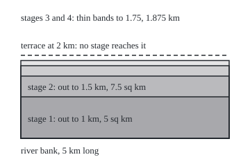
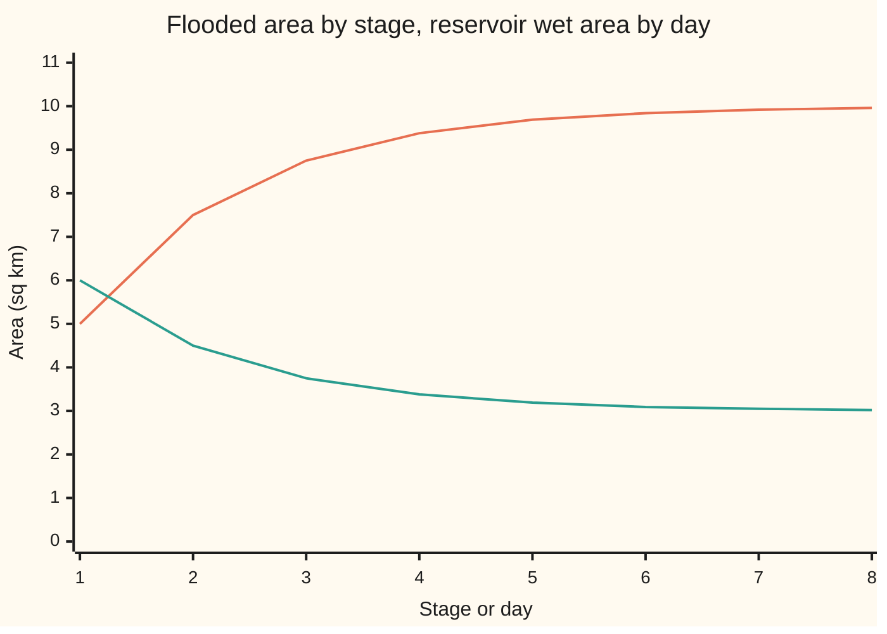

# Continuity and subadditivity: bigger sets are bigger, a countable pile weighs at most the sum, and rising or shrinking sets have limiting sizes

[Syllabus](../../../SYLLABUS.md) → [Measure and integration](../README.md) → [Sets You Can Measure](../README.md#s01) → Continuity and subadditivity

---

## General Overview

A river runs along one edge of a flat valley floor 5 km long. A flood spreads across the floor in stages. After stage 1 the water reaches 1 km from the bank. Each later stage covers half the remaining distance to a terrace 2 km out: 1.5 km, then 1.75 km, then 1.875 km. No stage reaches the terrace.

Each stage floods a rectangle: 5 sq km, then 7.5, 8.75, 9.375. Every point short of the terrace goes under at some stage, so the stages together cover a strip of 10 sq km. The stage areas climb towards 10 and never arrive. Nothing yet says that the limit of the stage areas is the area of everything the flood ever reached.

It is, and three companion facts come with it. A set inside another is no bigger. Adding the sizes of overlapping pieces can only overcount the whole. And the wet ground of a reservoir drying in a drought has areas that fall to the area of what stays wet, provided the reservoir started with finite area. Drop that proviso and the rule fails: the whole numbers from n onward are infinitely many for every n, yet no number lies in all of them.

**Every measure respects inclusion, overcounts overlaps rather than undercounting them, and passes to the limit along rising sets and along shrinking sets that start finite; all four facts come from countable additivity, by cutting sets into disjoint pieces.**

**What kind of fact this is:** a theorem, four results in one, proved on this card in Why it works; the finite-size condition is part of the statement.

### The picture: the flood, stage by stage

<p align="center"></p>

Drawn to scale, 60 pixels to the km. The bottom edge is the river bank; each shaded rectangle is one stage, so ground near the bank, under every stage, reads darkest. The dashed line is the terrace.

---

## The formula

Notation first. From [Measures](04-measures.md): a measure space $(\Omega, \mathcal{F}, \mu)$ is a whole space $\Omega$, a sigma-algebra $\mathcal{F}$ (the collection of sets we allow ourselves to measure), and a measure $\mu$, which gives each set in $\mathcal{F}$ a size from 0 up to infinity, gives the empty set size 0, and is **countably additive**: the sizes of countably many sets that pairwise share no point add up to the size of their union. Here $\Omega$ is the valley floor and $\mu$ is area in sq km, built properly on shelf 02. From the sets wing: $B \setminus A$, read "B minus A", is the points of B not in A; $\bigcup_{n=1}^{\infty} E_n$ is the points lying in at least one of the sets; $\bigcap_{n=1}^{\infty} F_n$ is the points lying in all of them.

Every set below belongs to $\mathcal{F}$. Four results:

$$A \subseteq B \;\Longrightarrow\; \mu(A) \le \mu(B), \quad\text{and}\quad \mu(B \setminus A) = \mu(B) - \mu(A) \text{ when } \mu(A) < \infty$$

**Read it aloud:** a set inside another has no larger size, and when the smaller size is finite, the difference of sizes is the size of the difference.

$$\mu\Big(\bigcup_{k=1}^{\infty} A_k\Big) \;\le\; \sum_{k=1}^{\infty} \mu(A_k)$$

**Read it aloud:** the size of a countable pile is at most the sizes of its pieces added up, overlaps and all. This is **countable subadditivity**.

$$E_1 \subseteq E_2 \subseteq E_3 \subseteq \cdots \;\Longrightarrow\; \mu\Big(\bigcup_{n=1}^{\infty} E_n\Big) = \lim_{n\to\infty} \mu(E_n)$$

**Read it aloud:** when each set lies inside the next, the sizes approach the size of everything they ever cover. This is **continuity from below**.

$$F_1 \supseteq F_2 \supseteq F_3 \supseteq \cdots \text{ and } \mu(F_1) < \infty \;\Longrightarrow\; \mu\Big(\bigcap_{n=1}^{\infty} F_n\Big) = \lim_{n\to\infty} \mu(F_n)$$

**Read it aloud:** when each set lies inside the one before and the first has finite size, the sizes approach the size of what lies in every one. This is **continuity from above**.

| Symbol | Plain meaning | In our example | Push it up and the answer… |
| --- | --- | --- | --- |
| $\Omega$ | the whole space | the valley floor | — |
| $\mathcal{F}$ | the sigma-algebra: the sets allowed a size | the regions with a well-defined area | more sets to compare, same four rules |
| $\mu$ | the measure: a size from 0 to infinity for each set in $\mathcal{F}$ | area in sq km | — |
| $A$, $B$ | two sets, the first inside the second | flood stages 2 and 3: 7.5 and 8.75 sq km | a bigger outer set, a size no smaller |
| $B \setminus A$ | B minus A: the points of B not in A | the band from 1.5 to 1.75 km: 1.25 sq km | — |
| $A_k$ | a countable list of sets, overlaps allowed | survey photograph k: 4, 2, 1, 0.5 sq km … | more overlap, a looser bound |
| $B_k$ | the new piece of $A_k$: the part no earlier set covered | 4, 1, 0.5, 0.25 sq km … | — |
| $E_n$ | a rising list: each set inside the next | flooded after stage n: 5, 7.5, 8.75 sq km … | later stage, closer to the union's size |
| $D_n$ | the layer new at stage n: stage n minus stage n − 1 | 5, 2.5, 1.25 sq km … | — |
| $F_n$ | a shrinking list: each set inside the one before | reservoir wet on day n: 6, 4.5, 3.75 sq km … | later day, closer to the pool's size |
| $G_n$ | $F_1 \setminus F_n$: the ground dried by day n, a rising list | 6 minus the wet area: 6 − 4.5, then 6 − 3.75 sq km … | later day, closer to the area that ever dries |
| $n$, $k$, $j$ | whole-number counters 1, 2, 3, … | stage or day; survey flight; an earlier stage | — |
| $\nu$ | counting measure: the number of points in a set | the numbers from n onward: infinitely many | — |
| $T_n$ | the tail from n: the whole numbers n, n + 1, n + 2, … | infinitely many members for every n | later n, a smaller tail, still infinite |

The limits exist before anyone computes them. Sizes that never fall either have a ceiling, and settle by the monotone convergence theorem of [Sequences](../../06-Calculus%20and%20analysis/01-Limits%20and%20Continuity/03-sequences-and-limits.md), or pass every number, and the limit is infinity. Sizes that never rise are held up by 0 and settle too.

### When it holds

- **Sets inside the sigma-algebra.** Outside $\mathcal{F}$ there is no size to compare; the Vitali set of shelf 02 has no length at all.
- **Countable additivity, not just finite.** A rule that adds only finitely many pieces can fail continuity from below. The "density" of a set of whole numbers, the limit of the share of 1 to N it holds as N grows (for sets where that share settles), is 0 for every finite set, yet the sets from 1 to n rise to all whole numbers, of density 1.
- **Nesting, for both limits.** Flood the band within 1 km of the bank at odd stages and the band from 1 to 2 km at even ones: every size is 5 sq km, the union 10, the common part 0.
- **A finite start, for continuity from above.** The proof subtracts from a finite size; Step 5 shows the failure without one.
- Monotonicity and subadditivity need only the first two. When the sum is finite, subadditivity is an equality exactly when the overlaps have size zero; an infinite sum can equal the union's size with overlaps everywhere, as when one half-line is listed forever.

---

## Why it works

### Step 0: cut into disjoint pieces, then add

Countable additivity speaks only about sets that share no point. So every proof below first cuts nested or overlapping sets into disjoint pieces with the same union, adds those, and compares.

On the flood the pieces are layers. The layer new at stage n is stage n minus stage n − 1: a band 1 km wide at stage 1, then 0.5 km, then 0.25 km. The layers never overlap, and stacking the first n of them rebuilds stage n.

### Step 1: a set inside another is no bigger

Stage 2 lies inside stage 3. Stage 3 splits into stage 2 and the band between 1.5 and 1.75 km from the bank, and the two parts share no point. Additivity gives 8.75 = 7.5 + 1.25.

In general $B$ is $A$ together with $B \setminus A$, disjoint, so $\mu(B) = \mu(A) + \mu(B \setminus A)$. The second term is at least 0, so $\mu(B) \ge \mu(A)$. When $\mu(A)$ is finite, subtracting it gives the size of the difference. When $\mu(A)$ is infinite, so is $\mu(B)$, and infinity minus infinity has no value. That gap returns in Step 4.

### Step 2: overlaps only overcount

Survey aircraft photograph the flooded strip, 2 km wide. Flight 1 covers the first 2 km along the river: 4 sq km. Each later flight starts three-quarters of the way along the previous photograph and covers half its length: 1.5 to 2.5 km, then 2.25 to 2.75 km, and so on. The photographs weigh 4, 2, 1, 0.5 sq km …, adding to 8 sq km. The ground they show is the stretch from 0 to 3 km, 6 sq km. The missing 2 sq km is ground photographed twice.

Cut each photograph down to its new piece: the part no earlier flight covered. The new pieces weigh 4, 1, 0.5, 0.25 sq km …, adding to 6. They share no point and cover the same ground, so their sum is the whole; each lies inside its own photograph, so by Step 1 each weighs no more.

### Step 3: rising sets reach the size of their union

The flooded area after stage n is the sum of the first n layers: 5 + 2.5 + 1.25 + …, which is 10 − 10/2^n. The flood's whole reach is the union of all the layers, so by countable additivity its area is the infinite sum of layer areas. An infinite sum is by definition the limit of its partial sums, and the partial sums are the stage areas. So the stage areas approach the area of the union: 10 sq km.

Nothing here used the shape of the flood. For any rising list, the layers are disjoint, the first n rebuild $E_n$, and all of them rebuild the union. If the sizes climb without bound, the union has infinite size and the rule still holds.

### Step 4: shrinking sets, if they start finite

A reservoir 3 km long dries in a drought. On day 1 it is wet 2 km out from the dam wall; each day the wet width loses half its excess over 1 km: 1.5, then 1.25, then 1.125. A pool 1 km wide never dries. The wet areas are 6, 4.5, 3.75, 3.375 sq km, which is 3 + 6/2^n on day n. The ground wet on every day is the pool, 3 sq km.

Turn the shrinking list into a rising one. The ground dried by day n grows day by day, and its union is day 1's wet ground minus the pool. Step 3 says the dried area approaches that union's area. Step 1 says each wet area is 6 minus the dried area, a subtraction allowed because 6 is finite. So the wet areas approach 6 minus the area that ever dries: the pool's 3.

### Step 5: why the finite start cannot be dropped

Counting measure $\nu$ gives a set of whole numbers its number of members. The tails, all whole numbers from n onward, shrink as n grows. Each has infinitely many members. No number lies in all of them: each whole number is missing from the tail that starts one after it. So the sizes are infinity at every stage, and the size of what lies in every tail is 0.

Step 4 breaks exactly where it subtracted: the first set is now infinite, and infinity minus infinity has no value. Length fails the same way. The half-lines $[n, \infty)$, all points from n onward, each have infinite length, and no point lies in all of them. The code prints the length of $[n, N]$ for N = 1,000 and 100,000: it grows with N, so no finite number is the length of a half-line.

One finite set anywhere in the list is enough: start the list there. A probability measure gives the whole space size 1, so every shrinking list of events qualifies.

<details>
<summary>Detailed proof</summary>

Throughout, sizes lie in $[0, \infty]$, with $a + \infty = \infty$; a series of non-negative terms is the limit of its partial sums, which never fall, so it exists in $[0, \infty]$ (monotone convergence for sequences, from [Sequences](../../06-Calculus%20and%20analysis/01-Limits%20and%20Continuity/03-sequences-and-limits.md), plus the convention that an unbounded rising list has limit infinity). Every set named is in $\mathcal{F}$: differences, finite unions and countable unions of sets in $\mathcal{F}$ are again in it ([Sigma-algebras](02-sigma-algebras.md)).

**Finite additivity.** For disjoint $A$ and $B$, take the list $A, B, \emptyset, \emptyset, \dots$; the sets are pairwise disjoint, so countable additivity and $\mu(\emptyset) = 0$ give $\mu(A \cup B) = \mu(A) + \mu(B)$.

**Monotonicity.** If $A \subseteq B$, then $B = A \cup (B \setminus A)$, disjoint, so $\mu(B) = \mu(A) + \mu(B \setminus A) \ge \mu(A)$. If $\mu(A) < \infty$, subtract it from both sides.

**Countable subadditivity.** Put $B_1 = A_1$ and $B_k = A_k \setminus (A_1 \cup \dots \cup A_{k-1})$ for $k \ge 2$. Each $B_k$ excludes every earlier set in the list, and each earlier new piece lies inside its own set, so the $B_k$ are pairwise disjoint. A point of $\bigcup A_k$ has a least index $k$ with the point in $A_k$; it lies in that $B_k$. Hence $\bigcup B_k = \bigcup A_k$. Since $B_k \subseteq A_k$, monotonicity gives $\mu(B_k) \le \mu(A_k)$. Countable additivity then gives $\mu(\bigcup A_k) = \sum \mu(B_k) \le \sum \mu(A_k)$, comparing partial sums term by term and passing to the limit.

**Continuity from below.** Put $D_1 = E_1$ and $D_n = E_n \setminus E_{n-1}$. For $j < n$, $D_n$ excludes $E_{n-1}$, which contains $E_j \supseteq D_j$, so the $D_n$ are pairwise disjoint. Because the list rises, the least index at which a point enters places it in exactly one layer, so $E_n = D_1 \cup \dots \cup D_n$ and $\bigcup E_n = \bigcup D_n$. Finite additivity gives $\mu(E_n) = \sum_{j \le n} \mu(D_j)$; countable additivity gives $\mu(\bigcup E_n) = \sum_{j=1}^{\infty} \mu(D_j)$, the limit of those partial sums.

**Continuity from above.** Put $G_n = F_1 \setminus F_n$. Since the $F_n$ shrink, the sets $F_1 \setminus F_n$ rise, and $\bigcup G_n = F_1 \setminus \bigcap F_n$: a point of the first set fails to be in every $F_n$ exactly when it is missing from some $F_n$. Continuity from below gives $\mu(G_n) \to \mu(F_1 \setminus \bigcap F_n)$. Each $F_n$ and $\bigcap F_n$ lie inside the first set, whose size $\mu(F_1)$ is finite, so monotonicity's subtraction applies: $\mu(F_n) = \mu(F_1) - \mu(G_n) \to \mu(F_1) - \mu(F_1 \setminus \bigcap F_n) = \mu(\bigcap F_n)$. If instead only some later set in the list has finite size, apply the same argument to the list from that set on; dropping finitely many sets changes neither the limit nor the intersection.

**The caveat is needed.** With $\nu$ counting whole numbers and $T_n = \{n, n+1, \dots\}$, each $\nu(T_n)$ is infinite, while each whole number is missing from the tail that starts one after it, so $\bigcap T_n$ is empty and has size 0.

</details>

---

## Worked numbers, by hand

| Step | Arithmetic | Value |
| --- | --- | --- |
| stage 1 | 5 km × 1 km | 5 sq km |
| stage 3 by layers | 5 + 2.5 + 1.25 | 8.75 sq km |
| stage 3 by monotonicity | stage 2 plus the band: 7.5 + 1.25 | 8.75 sq km |
| stage 10 | 10 − 10/2^10 | 9.990234375 sq km |
| the union | 5 km × 2 km, the strip short of the terrace | **10 sq km** |
| three survey photographs | 4 + 2 + 1 | 7 sq km, summed |
| the ground they show | new pieces 4 + 1 + 0.5 | 5.5 sq km |
| reservoir, day 4 | 3 + 6/2^4 | 3.375 sq km |
| the pool | 3 km × 1 km | **3 sq km** |

The flood's reach is 10 sq km, a number no stage attains and every stage approaches; the pool that never dries is 3 sq km, the limit of the wet areas.

### The picture: two lists of areas, one rising and one falling



The rising line is the flood, closing on 10 sq km, the area of the union. The falling line is the reservoir, closing on 3 sq km, the area of the pool.

### What breaks if you drop a piece

| Mistake | Comes out at | What went wrong |
| --- | --- | --- |
| Drop the finite start | tails of the whole numbers: infinitely many members at every n, 0 numbers in all of them | Step 4 subtracts infinity from infinity |
| Drop the nesting | the band within 1 km of the bank, the band from 1 to 2 km, the first band again …: 5 sq km every time; union 10, common part 0 | the sizes settle on neither the union nor the intersection |
| Add overlapping photographs as if disjoint | 8 sq km for 6 sq km of ground | the 2 sq km of overlap is counted twice |

---

## Code, from first principles, and it actually runs

Every area is found by two roads that share no arithmetic. The first adds disjoint layers or new pieces, as the proofs do. The second lays a grid of squares 1/32 km on a side over the floor and counts the squares whose centres lie in the set. For the flood and the reservoir the closed-form geometric sum is a third road. Python keeps exact fractions; Rust keeps every length and area as a whole number of 2^-20 units, so neither rounds. The code checks finite stages exactly; that the sizes reach the union's size for every rising list in every measure space is the proof's work.

### Python

```python
# Continuity and subadditivity -- the check behind the card.  Standard library
# only; fractions keeps every area exact.  Lengths in km, areas in km^2.
# Road 1: add disjoint layers, as the proof does.  Road 2: count grid cells
# 1/32 km on a side whose centres lie in the set; it never sees a layer.
# Road 3, for the flood and the reservoir: the closed-form geometric sums.
# The code checks finite stages exactly; only the proof covers every stage.
from fractions import Fraction as Q

def show(x):                                   # 5 not 5.0; exact dyadics as decimals
    return str(x.numerator) if x.denominator == 1 else repr(float(x))

def cells(inside):                             # road 2: grid 2 km across, 5 km along
    hits = sum(1 for i in range(64) for j in range(160) if inside(2 * i + 1, 2 * j + 1))
    return Q(hits, 1024)                       # each cell is (1/32 km)^2

def strip(x0, x1, y0, y1):                     # closed rectangle; centres in 1/64-km units
    return lambda cx, cy: 64 * x0 <= cx <= 64 * x1 and 64 * y0 <= cy <= 64 * y1

edge = lambda n: 2 - Q(2, 2 ** n)              # flood edge after stage n, km from the bank
wet = lambda n: 1 + Q(2, 2 ** n)               # reservoir wet width on day n, km

print("flood, stage n: edge km | area by layers | 10 - 10/2^n | by cells | short of 10")
flood = []
for n in range(1, 11):
    by_layers = sum(5 * (edge(j) - edge(j - 1)) for j in range(1, n + 1))
    closed = 10 - Q(10, 2 ** n)
    grid = cells(strip(0, edge(n), 0, 5)) if n <= 6 else None
    assert by_layers == closed                 # layers against the geometric sum
    assert grid is None or grid == by_layers   # layers against counted cells
    flood.append(by_layers)
    g = "-" if grid is None else show(grid)
    print(f"flood, stage {n}: {show(edge(n))} | {show(by_layers)} | {show(closed)} | {g} | {show(10 - by_layers)}")
union = cells(lambda cx, cy: any(strip(0, edge(n), 0, 5)(cx, cy) for n in range(1, 21)))
assert union == 10                             # cells under some stage 1 to 20: the union
assert 10 - flood[-1] < Q(1, 100)              # stage 10 is within 0.01 of the union
print(f"flood, union of stages 1 to 20 (the strip short of 2 km), by cells: {show(union)}")

band = cells(lambda cx, cy: strip(0, edge(3), 0, 5)(cx, cy) and not strip(0, edge(2), 0, 5)(cx, cy))
assert band == flood[2] - flood[1]             # monotonicity: mu(B) = mu(A) + mu(B minus A)
print(f"monotone: stage 2 inside stage 3, {show(flood[1])} <= {show(flood[2])}; band between, by cells: {show(band)}")

print("survey, flight k: km along | patch area | new piece | union by pieces | union by cells | sum of areas")
s, L, covered, by_pieces, total, rects = Q(0), Q(2), Q(0), Q(0), Q(0), []
for k in range(1, 21):
    rects.append(strip(0, 2, s, s + L))
    new = 2 * max(Q(0), s + L - max(s, covered))   # B_k: patch k minus all earlier patches
    covered, by_pieces, total = max(covered, s + L), by_pieces + new, total + 2 * L
    assert by_pieces == 6 - Q(4, 2 ** k) and total == 8 - Q(8, 2 ** k)
    if k <= 6:
        grid = cells(lambda cx, cy: any(r(cx, cy) for r in rects))
        assert grid == by_pieces               # new pieces against counted cells
        print(f"survey, flight {k}: {show(s)} to {show(s + L)} | {show(2 * L)} | {show(new)} | "
              f"{show(by_pieces)} | {show(grid)} | {show(total)}")
    s, L = s + 3 * L / 4, L / 2
print(f"survey, after 20 flights: union {show(by_pieces)}; sum {show(total)}; overlap {show(total - by_pieces)}")
print("survey, closed forms held for k = 1 to 20: union 6 - 4/2^k, limit 6; sum 8 - 8/2^k, limit 8; overlap 2")

print("reservoir, day n: wet width km | 6 - dried layers | 3 + 6/2^n | by cells | above 3")
res = []
for n in range(1, 11):
    dried = sum(3 * (wet(j - 1) - wet(j)) for j in range(2, n + 1))   # F_1 minus F_n, layer by layer
    closed = 3 + Q(6, 2 ** n)
    grid = cells(strip(0, wet(n), 0, 3)) if n <= 6 else None
    assert 6 - dried == closed
    assert grid is None or grid == closed
    res.append(closed)
    g = "-" if grid is None else show(grid)
    print(f"reservoir, day {n}: {show(wet(n))} | {show(6 - dried)} | {show(closed)} | {g} | {show(closed - 3)}")
pool = cells(lambda cx, cy: all(strip(0, wet(n), 0, 3)(cx, cy) for n in range(1, 21)))
assert pool == 3
print(f"reservoir, wet on every day 1 to 20 (the pool that never dries), by cells: {show(pool)}")

for N in (1000, 100000):
    counts = [sum(1 for m in range(1, N + 1) if m >= n) for n in (1, 10, 100)]
    assert counts == [N - n + 1 for n in (1, 10, 100)]
    print(f"tails, counting measure of {{n, n+1, ...}} seen up to {N}: n=1: {counts[0]}, n=10: {counts[1]}, n=100: {counts[2]}")
    lengths = [sum(1 for m in range(n, N)) for n in (1, 10, 100)]   # [n, N] as unit pieces [m, m+1)
    assert lengths == [N - n for n in (1, 10, 100)]
    print(f"tails, length of [n, {N}] from unit pieces: n=1: {lengths[0]}, n=10: {lengths[1]}, n=100: {lengths[2]}")
survivors = [m for m in range(1, 1001) if all(m >= n for n in range(1, 1002))]
assert survivors == []
print(f"tails, numbers 1 to 1000 lying in every tail: {len(survivors)}")

near, far = strip(0, 1, 0, 5), strip(1, 2, 0, 5)   # bands 0 to 1 km and 1 to 2 km from the bank
halves = [cells(near), cells(far), cells(lambda cx, cy: near(cx, cy) or far(cx, cy)),
          cells(lambda cx, cy: near(cx, cy) and far(cx, cy))]
assert halves == [5, 5, 10, 0]
print(f"not nested, band 0 to 1 km then band 1 to 2 km from the bank: each {show(halves[0])} and {show(halves[1])}; "
      f"union {show(halves[2])}; common part {show(halves[3])}")

print("figure, flood edge y-pixels, stages 1-4:", " ".join(show(200 - 60 * edge(n)) for n in range(1, 5)),
      "| limit 80 | bank 200 | plain x 30 to 330")
print("chart, flooded area km^2:", " ".join(f"{float(a):.2f}" for a in flood[:8]))
print("chart, reservoir wet area km^2:", " ".join(f"{float(a):.2f}" for a in res[:8]))
print("ALL CHECKS PASS")
```

**Ran 2026-10-06 on macOS, Python 3.14.6, standard library only. All checks passed. Output, pasted from the run:**

```
flood, stage n: edge km | area by layers | 10 - 10/2^n | by cells | short of 10
flood, stage 1: 1 | 5 | 5 | 5 | 5
flood, stage 2: 1.5 | 7.5 | 7.5 | 7.5 | 2.5
flood, stage 3: 1.75 | 8.75 | 8.75 | 8.75 | 1.25
flood, stage 4: 1.875 | 9.375 | 9.375 | 9.375 | 0.625
flood, stage 5: 1.9375 | 9.6875 | 9.6875 | 9.6875 | 0.3125
flood, stage 6: 1.96875 | 9.84375 | 9.84375 | 9.84375 | 0.15625
flood, stage 7: 1.984375 | 9.921875 | 9.921875 | - | 0.078125
flood, stage 8: 1.9921875 | 9.9609375 | 9.9609375 | - | 0.0390625
flood, stage 9: 1.99609375 | 9.98046875 | 9.98046875 | - | 0.01953125
flood, stage 10: 1.998046875 | 9.990234375 | 9.990234375 | - | 0.009765625
flood, union of stages 1 to 20 (the strip short of 2 km), by cells: 10
monotone: stage 2 inside stage 3, 7.5 <= 8.75; band between, by cells: 1.25
survey, flight k: km along | patch area | new piece | union by pieces | union by cells | sum of areas
survey, flight 1: 0 to 2 | 4 | 4 | 4 | 4 | 4
survey, flight 2: 1.5 to 2.5 | 2 | 1 | 5 | 5 | 6
survey, flight 3: 2.25 to 2.75 | 1 | 0.5 | 5.5 | 5.5 | 7
survey, flight 4: 2.625 to 2.875 | 0.5 | 0.25 | 5.75 | 5.75 | 7.5
survey, flight 5: 2.8125 to 2.9375 | 0.25 | 0.125 | 5.875 | 5.875 | 7.75
survey, flight 6: 2.90625 to 2.96875 | 0.125 | 0.0625 | 5.9375 | 5.9375 | 7.875
survey, after 20 flights: union 5.999996185302734; sum 7.999992370605469; overlap 1.9999961853027344
survey, closed forms held for k = 1 to 20: union 6 - 4/2^k, limit 6; sum 8 - 8/2^k, limit 8; overlap 2
reservoir, day n: wet width km | 6 - dried layers | 3 + 6/2^n | by cells | above 3
reservoir, day 1: 2 | 6 | 6 | 6 | 3
reservoir, day 2: 1.5 | 4.5 | 4.5 | 4.5 | 1.5
reservoir, day 3: 1.25 | 3.75 | 3.75 | 3.75 | 0.75
reservoir, day 4: 1.125 | 3.375 | 3.375 | 3.375 | 0.375
reservoir, day 5: 1.0625 | 3.1875 | 3.1875 | 3.1875 | 0.1875
reservoir, day 6: 1.03125 | 3.09375 | 3.09375 | 3.09375 | 0.09375
reservoir, day 7: 1.015625 | 3.046875 | 3.046875 | - | 0.046875
reservoir, day 8: 1.0078125 | 3.0234375 | 3.0234375 | - | 0.0234375
reservoir, day 9: 1.00390625 | 3.01171875 | 3.01171875 | - | 0.01171875
reservoir, day 10: 1.001953125 | 3.005859375 | 3.005859375 | - | 0.005859375
reservoir, wet on every day 1 to 20 (the pool that never dries), by cells: 3
tails, counting measure of {n, n+1, ...} seen up to 1000: n=1: 1000, n=10: 991, n=100: 901
tails, length of [n, 1000] from unit pieces: n=1: 999, n=10: 990, n=100: 900
tails, counting measure of {n, n+1, ...} seen up to 100000: n=1: 100000, n=10: 99991, n=100: 99901
tails, length of [n, 100000] from unit pieces: n=1: 99999, n=10: 99990, n=100: 99900
tails, numbers 1 to 1000 lying in every tail: 0
not nested, band 0 to 1 km then band 1 to 2 km from the bank: each 5 and 5; union 10; common part 0
figure, flood edge y-pixels, stages 1-4: 140 110 95 87.5 | limit 80 | bank 200 | plain x 30 to 330
chart, flooded area km^2: 5.00 7.50 8.75 9.38 9.69 9.84 9.92 9.96
chart, reservoir wet area km^2: 6.00 4.50 3.75 3.38 3.19 3.09 3.05 3.02
ALL CHECKS PASS
```

### Rust

Same numbers, same labels, built with `rustc --edition 2021 -O`.

```rust
// Continuity and subadditivity -- the same check as the Python, in Rust, no
// crates.  Exact arithmetic by hand: every length and area is a whole number
// of 2^-20 units (km or km^2), so nothing is rounded.
// Road 1: add disjoint layers, as the proof does.  Road 2: count grid cells
// 1/32 km on a side whose centres lie in the set; it never sees a layer.
// Road 3, for the flood and the reservoir: the closed-form geometric sums.
// The code checks finite stages exactly; only the proof covers every stage.
const D: i64 = 1 << 20; // one km, or one km^2, in 2^-20 units

fn show(x: i64) -> String {              // 5 not 5.0; exact dyadics as decimals
    if x % D == 0 { format!("{}", x / D) } else { format!("{}", x as f64 / D as f64) }
}

fn cells(inside: &dyn Fn(i64, i64) -> bool) -> i64 { // road 2: grid 2 km across, 5 km along
    let mut hits = 0;
    for i in 0..64 { for j in 0..160 { if inside(2 * i + 1, 2 * j + 1) { hits += 1 } } }
    hits * (D / 1024)                     // each cell is (1/32 km)^2
}

fn inr(r: (i64, i64, i64, i64), cx: i64, cy: i64) -> bool { // closed rectangle, centres in 1/64 km
    64 * r.0 <= cx * D && cx * D <= 64 * r.1 && 64 * r.2 <= cy * D && cy * D <= 64 * r.3
}

fn edge(n: u32) -> i64 { 2 * D - ((2 * D) >> n) } // flood edge after stage n, km from the bank
fn wet(n: u32) -> i64 { D + ((2 * D) >> n) }      // reservoir wet width on day n, km
fn dash(g: Option<i64>) -> String { g.map_or("-".to_string(), show) }

fn main() {
    println!("flood, stage n: edge km | area by layers | 10 - 10/2^n | by cells | short of 10");
    let mut flood = Vec::new();
    for n in 1..=10u32 {
        let by_layers: i64 = (1..=n).map(|j| 5 * (edge(j) - edge(j - 1))).sum();
        let closed = 10 * D - ((10 * D) >> n);
        let grid = if n <= 6 { Some(cells(&|cx, cy| inr((0, edge(n), 0, 5 * D), cx, cy))) } else { None };
        assert_eq!(by_layers, closed);                 // layers against the geometric sum
        assert!(grid.map_or(true, |g| g == by_layers)); // layers against counted cells
        flood.push(by_layers);
        println!("flood, stage {}: {} | {} | {} | {} | {}", n, show(edge(n)), show(by_layers),
                 show(closed), dash(grid), show(10 * D - by_layers));
    }
    let union = cells(&|cx, cy| (1..=20u32).any(|n| inr((0, edge(n), 0, 5 * D), cx, cy)));
    assert_eq!(union, 10 * D);                         // cells under some stage 1 to 20: the union
    assert!(100 * (10 * D - flood[9]) < D);            // stage 10 is within 0.01 of the union
    println!("flood, union of stages 1 to 20 (the strip short of 2 km), by cells: {}", show(union));

    let band = cells(&|cx, cy| inr((0, edge(3), 0, 5 * D), cx, cy) && !inr((0, edge(2), 0, 5 * D), cx, cy));
    assert_eq!(band, flood[2] - flood[1]);             // monotonicity: mu(B) = mu(A) + mu(B minus A)
    println!("monotone: stage 2 inside stage 3, {} <= {}; band between, by cells: {}",
             show(flood[1]), show(flood[2]), show(band));

    println!("survey, flight k: km along | patch area | new piece | union by pieces | union by cells | sum of areas");
    let (mut s, mut l, mut covered, mut by_pieces, mut total) = (0i64, 2 * D, 0i64, 0i64, 0i64);
    let mut rects: Vec<(i64, i64, i64, i64)> = Vec::new();
    for k in 1..=20u32 {
        rects.push((0, 2 * D, s, s + l));
        let new = 2 * (s + l - s.max(covered)).max(0);  // B_k: patch k minus all earlier patches
        covered = covered.max(s + l);
        by_pieces += new;
        total += 2 * l;
        assert!(by_pieces == 6 * D - ((4 * D) >> k) && total == 8 * D - ((8 * D) >> k));
        if k <= 6 {
            let grid = cells(&|cx, cy| rects.iter().any(|&r| inr(r, cx, cy)));
            assert_eq!(grid, by_pieces);               // new pieces against counted cells
            println!("survey, flight {}: {} to {} | {} | {} | {} | {} | {}", k, show(s), show(s + l),
                     show(2 * l), show(new), show(by_pieces), show(grid), show(total));
        }
        s += 3 * l / 4;
        l /= 2;
    }
    println!("survey, after 20 flights: union {}; sum {}; overlap {}", show(by_pieces), show(total),
             show(total - by_pieces));
    println!("survey, closed forms held for k = 1 to 20: union 6 - 4/2^k, limit 6; sum 8 - 8/2^k, limit 8; overlap 2");

    println!("reservoir, day n: wet width km | 6 - dried layers | 3 + 6/2^n | by cells | above 3");
    let mut res = Vec::new();
    for n in 1..=10u32 {
        let dried: i64 = (2..=n).map(|j| 3 * (wet(j - 1) - wet(j))).sum(); // F_1 minus F_n, by layers
        let closed = 3 * D + ((6 * D) >> n);
        let grid = if n <= 6 { Some(cells(&|cx, cy| inr((0, wet(n), 0, 3 * D), cx, cy))) } else { None };
        assert_eq!(6 * D - dried, closed);
        assert!(grid.map_or(true, |g| g == closed));
        res.push(closed);
        println!("reservoir, day {}: {} | {} | {} | {} | {}", n, show(wet(n)), show(6 * D - dried),
                 show(closed), dash(grid), show(closed - 3 * D));
    }
    let pool = cells(&|cx, cy| (1..=20u32).all(|n| inr((0, wet(n), 0, 3 * D), cx, cy)));
    assert_eq!(pool, 3 * D);
    println!("reservoir, wet on every day 1 to 20 (the pool that never dries), by cells: {}", show(pool));

    for big_n in [1000i64, 100000] {
        let counts: Vec<i64> = [1i64, 10, 100].iter().map(|&n| (1..=big_n).filter(|&m| m >= n).count() as i64).collect();
        assert_eq!(counts, vec![big_n, big_n - 9, big_n - 99]);
        println!("tails, counting measure of {{n, n+1, ...}} seen up to {}: n=1: {}, n=10: {}, n=100: {}",
                 big_n, counts[0], counts[1], counts[2]);
        let lengths: Vec<i64> = [1i64, 10, 100].iter().map(|&n| (n..big_n).count() as i64).collect(); // unit pieces
        assert_eq!(lengths, vec![big_n - 1, big_n - 10, big_n - 100]);
        println!("tails, length of [n, {}] from unit pieces: n=1: {}, n=10: {}, n=100: {}",
                 big_n, lengths[0], lengths[1], lengths[2]);
    }
    let survivors: Vec<i64> = (1..=1000i64).filter(|&m| (1..=1001i64).all(|n| m >= n)).collect();
    assert!(survivors.is_empty());
    println!("tails, numbers 1 to 1000 lying in every tail: {}", survivors.len());

    let (near, far) = ((0, D, 0, 5 * D), (D, 2 * D, 0, 5 * D)); // bands 0 to 1 km and 1 to 2 km from the bank
    let halves = [cells(&|cx, cy| inr(near, cx, cy)), cells(&|cx, cy| inr(far, cx, cy)),
                  cells(&|cx, cy| inr(near, cx, cy) || inr(far, cx, cy)),
                  cells(&|cx, cy| inr(near, cx, cy) && inr(far, cx, cy))];
    assert_eq!(halves, [5 * D, 5 * D, 10 * D, 0]);
    println!("not nested, band 0 to 1 km then band 1 to 2 km from the bank: each {} and {}; union {}; common part {}",
             show(halves[0]), show(halves[1]), show(halves[2]), show(halves[3]));

    let px: Vec<String> = (1..=4u32).map(|n| show(200 * D - 60 * edge(n))).collect();
    println!("figure, flood edge y-pixels, stages 1-4: {} | limit 80 | bank 200 | plain x 30 to 330", px.join(" "));
    let f2 = |v: &[i64]| v[..8].iter().map(|&a| format!("{:.2}", a as f64 / D as f64)).collect::<Vec<_>>().join(" ");
    println!("chart, flooded area km^2: {}", f2(&flood));
    println!("chart, reservoir wet area km^2: {}", f2(&res));
    println!("ALL CHECKS PASS");
}
```

**Ran 2026-10-06 on macOS, rustc 1.98.1, no crates. All checks passed. Output, pasted from the run:**

```
flood, stage n: edge km | area by layers | 10 - 10/2^n | by cells | short of 10
flood, stage 1: 1 | 5 | 5 | 5 | 5
flood, stage 2: 1.5 | 7.5 | 7.5 | 7.5 | 2.5
flood, stage 3: 1.75 | 8.75 | 8.75 | 8.75 | 1.25
flood, stage 4: 1.875 | 9.375 | 9.375 | 9.375 | 0.625
flood, stage 5: 1.9375 | 9.6875 | 9.6875 | 9.6875 | 0.3125
flood, stage 6: 1.96875 | 9.84375 | 9.84375 | 9.84375 | 0.15625
flood, stage 7: 1.984375 | 9.921875 | 9.921875 | - | 0.078125
flood, stage 8: 1.9921875 | 9.9609375 | 9.9609375 | - | 0.0390625
flood, stage 9: 1.99609375 | 9.98046875 | 9.98046875 | - | 0.01953125
flood, stage 10: 1.998046875 | 9.990234375 | 9.990234375 | - | 0.009765625
flood, union of stages 1 to 20 (the strip short of 2 km), by cells: 10
monotone: stage 2 inside stage 3, 7.5 <= 8.75; band between, by cells: 1.25
survey, flight k: km along | patch area | new piece | union by pieces | union by cells | sum of areas
survey, flight 1: 0 to 2 | 4 | 4 | 4 | 4 | 4
survey, flight 2: 1.5 to 2.5 | 2 | 1 | 5 | 5 | 6
survey, flight 3: 2.25 to 2.75 | 1 | 0.5 | 5.5 | 5.5 | 7
survey, flight 4: 2.625 to 2.875 | 0.5 | 0.25 | 5.75 | 5.75 | 7.5
survey, flight 5: 2.8125 to 2.9375 | 0.25 | 0.125 | 5.875 | 5.875 | 7.75
survey, flight 6: 2.90625 to 2.96875 | 0.125 | 0.0625 | 5.9375 | 5.9375 | 7.875
survey, after 20 flights: union 5.999996185302734; sum 7.999992370605469; overlap 1.9999961853027344
survey, closed forms held for k = 1 to 20: union 6 - 4/2^k, limit 6; sum 8 - 8/2^k, limit 8; overlap 2
reservoir, day n: wet width km | 6 - dried layers | 3 + 6/2^n | by cells | above 3
reservoir, day 1: 2 | 6 | 6 | 6 | 3
reservoir, day 2: 1.5 | 4.5 | 4.5 | 4.5 | 1.5
reservoir, day 3: 1.25 | 3.75 | 3.75 | 3.75 | 0.75
reservoir, day 4: 1.125 | 3.375 | 3.375 | 3.375 | 0.375
reservoir, day 5: 1.0625 | 3.1875 | 3.1875 | 3.1875 | 0.1875
reservoir, day 6: 1.03125 | 3.09375 | 3.09375 | 3.09375 | 0.09375
reservoir, day 7: 1.015625 | 3.046875 | 3.046875 | - | 0.046875
reservoir, day 8: 1.0078125 | 3.0234375 | 3.0234375 | - | 0.0234375
reservoir, day 9: 1.00390625 | 3.01171875 | 3.01171875 | - | 0.01171875
reservoir, day 10: 1.001953125 | 3.005859375 | 3.005859375 | - | 0.005859375
reservoir, wet on every day 1 to 20 (the pool that never dries), by cells: 3
tails, counting measure of {n, n+1, ...} seen up to 1000: n=1: 1000, n=10: 991, n=100: 901
tails, length of [n, 1000] from unit pieces: n=1: 999, n=10: 990, n=100: 900
tails, counting measure of {n, n+1, ...} seen up to 100000: n=1: 100000, n=10: 99991, n=100: 99901
tails, length of [n, 100000] from unit pieces: n=1: 99999, n=10: 99990, n=100: 99900
tails, numbers 1 to 1000 lying in every tail: 0
not nested, band 0 to 1 km then band 1 to 2 km from the bank: each 5 and 5; union 10; common part 0
figure, flood edge y-pixels, stages 1-4: 140 110 95 87.5 | limit 80 | bank 200 | plain x 30 to 330
chart, flooded area km^2: 5.00 7.50 8.75 9.38 9.69 9.84 9.92 9.96
chart, reservoir wet area km^2: 6.00 4.50 3.75 3.38 3.19 3.09 3.05 3.02
ALL CHECKS PASS
```

The two outputs match line for line.

> [!TIP]
> **Try changing**
> Guess first, then run the Python.
> - **Photographs that only touch.** Change `s + 3 * L / 4` to `s + L`, so each flight starts where the last ended. Guess: no overlap, so the union equals the summed areas, 6 sq km after two flights instead of 5. The closed-form assert, pinned to the overlapping flights, stops the run at flight 2.
> - **A reservoir that dries out.** Change `wet` to `lambda n: Q(2, 2 ** n)`, so no pool survives. Guess: the layer road still agrees with 3 + 6/2^n, since only differences of widths enter it, but the grid sees a strip 1 km wide, 3 sq km, on day 1 and the cell assert stops it.
> - **Look further along the tails.** Add `1000000` to the list of cutoffs. Guess: 1000000, 999991 and 999901 members, and lengths 999999, 999990 and 999900. Each tail keeps growing with the cutoff; no finite number is its size.

---

## The usual mistake

> [!warning]
> **Believing that shrinking sets always shrink to the size of their intersection.** They do only when some set in the list has finite size. The tails of the whole numbers each have infinitely many members and share none; the half-lines from n to infinity each have infinite length and share no point. Probability never meets the failure only because its whole space has size 1.
>
> - **Reading the limit as a stage.** No stage floods 10 sq km; stage 10 floods 9.990234375. The union is not the last set, because there is no last set.
> - **Adding overlapping sizes as if disjoint.** The survey photographs add to 8 sq km for 6 sq km of ground. Subadditivity is an inequality, and the gap is the overlap.
> - **Subtracting infinite sizes.** $\mu(B \setminus A) = \mu(B) - \mu(A)$ needs $\mu(A)$ finite; infinity minus infinity is not 0, and treating it so proves the false version of continuity from above.

---

## Where you meet it in real life

- **Distribution functions.** The chance that a rainfall total is at most x millimetres is continuous from the right in x, because the events "at most x + 1/n" shrink to "at most x" inside a space of size 1. Every such function builds a measure: [Distribution functions and Lebesgue-Stieltjes measures](../02-Length%20Done%20Properly/06-lebesgue-stieltjes-measures.md).
- **Union bounds in risk and reliability.** The chance that any of many failures happens is at most the sum of their chances, with no independence assumed. Countable subadditivity extends the finite bound of [Stopping the sieve early](../../04-Combinatorics%20and%20graphs/04-Inclusion-Exclusion%20and%20Pigeonhole/04-union-bound-and-bonferroni.md) to endless lists.
- **Sets of size zero.** Countably many sets of size zero have union of size zero, by subadditivity; the rationals in [0, 1] have length 0 for this reason. See [Null sets and almost everywhere](07-null-sets-and-almost-everywhere.md).
- **Events that happen infinitely often.** If the chances of a list of events add to a finite number, only finitely many of them happen, with probability 1: subadditivity on the tail events, then continuity from above. See [The Borel-Cantelli lemmas](../10-The%20Limit%20Theorems%2C%20Proved/01-borel-cantelli-lemmas.md).

> **Say it back**
> A measure never gives a smaller set a bigger size, since the bigger set is the smaller plus a disjoint remainder. Adding the sizes of overlapping sets overcounts: cut each to its new piece and the pieces add exactly to the union. Rising sets have sizes that approach the size of their union, because those sizes are the partial sums of disjoint layers. Shrinking sets do the same towards their intersection, but only if one of them has finite size, since the proof subtracts from it. The tails of the whole numbers, each infinite and with nothing in common, show the condition cannot go.

---

## What this builds on

- [Measures](04-measures.md): the measure space, and countable additivity, from which every result here follows.
- [Sequences](../../06-Calculus%20and%20analysis/01-Limits%20and%20Continuity/03-sequences-and-limits.md): why a list that never falls and has a ceiling settles, so the limits on this card exist.

## Where this goes next

- [Null sets and almost everywhere](07-null-sets-and-almost-everywhere.md): subadditivity makes countable unions of size-zero sets size zero, which is what "almost everywhere" relies on.
- [Distribution functions and Lebesgue-Stieltjes measures](../02-Length%20Done%20Properly/06-lebesgue-stieltjes-measures.md): continuity from above is why a distribution function is continuous from the right.
- [The monotone convergence theorem](../04-The%20Lebesgue%20Integral/03-monotone-convergence-theorem.md): continuity from below, promoted from sets to functions that rise.
- [Signed measures](../08-Densities%20and%20Changing%20Measure/02-signed-measures-and-hahn-jordan.md): sizes that may be negative, where continuity survives and monotonicity does not.
- [The Borel-Cantelli lemmas](../10-The%20Limit%20Theorems%2C%20Proved/01-borel-cantelli-lemmas.md): subadditivity and continuity from above, combined to show which events happen only finitely often.

This card leaves open whether two measures that agree on a simple family of sets, such as intervals, must agree on every set; [Pi-systems and Dynkin's theorem](06-pi-systems-and-uniqueness.md) proves they must, when their totals are equal and finite, using continuity from below.

---

## Sources

Verified 29 Sep 2026: every link below resolves to the publisher's page.

- Axler, Sheldon. *Measure, Integration & Real Analysis*. Springer Graduate Texts in Mathematics, 2020, open access. [Author's page with the free edition](https://measure.axler.net/). Chapter 2 proves the order, subadditivity and both limit properties of a measure.
- Billingsley, Patrick. *Probability and Measure*, Anniversary Edition. Wiley, 2012. [Publisher page](https://www.wiley.com/en-us/Probability+and+Measure%2C+Anniversary+Edition-p-9781118122372). Continuity from below and above for probability measures, then for general measures with the finite-size condition.
- Williams, David. *Probability with Martingales*. Cambridge University Press, 1991. [Publisher page](https://www.cambridge.org/core/books/probability-with-martingales/B4CFCE0D08930FB46C6E93E775503926). Chapter 1 gives both limit properties and why the decreasing one needs a finite start.
- Folland, Gerald B. *Real Analysis: Modern Techniques and Their Applications*, 2nd ed. Wiley, 1999. [Publisher page](https://www.wiley.com/en-us/Real+Analysis%3A+Modern+Techniques+and+Their+Applications%2C+2nd+Edition-p-9780471317166). Section 1.3 collects monotonicity, subadditivity and both continuity results in one theorem.
