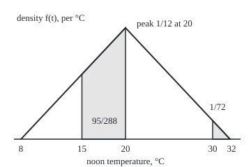
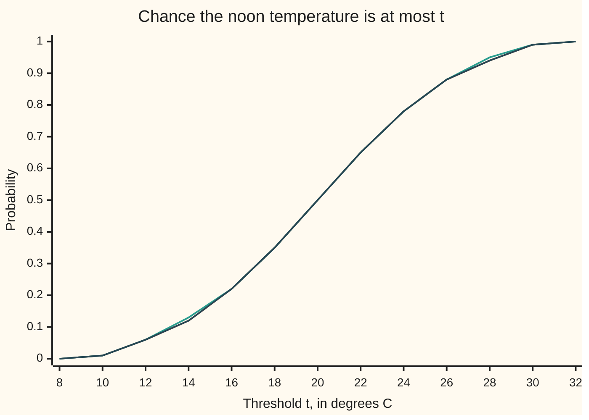

# Pi-systems and Dynkin's theorem: check two measures on the easy sets and they agree everywhere

Measure and integration → Sets You Can Measure → Proving two measures equal → Pi-systems and Dynkin's theorem

---

## General Overview

Two weather services forecast tomorrow's noon temperature. Model A is built from physics: a base of 8 °C plus two independent swings, each anywhere from 0 to 12 degrees with every value equally likely. Model B is built from statistics: it draws one number between 0 and 1 and reads the temperature off a fitted curve. The two recipes share no machinery.

Both services publish one kind of answer: the chance that the temperature is at or below t, for every threshold t. At 15 °C both say 0.170139. At 20 °C both say 0.5. At 30 °C both say 0.986111. They agree at every t.

A farmer needs a different number: the chance of "between 15 and 20, or above 30". Neither service publishes it. Model A's recipe gives 0.34375. Must model B give the same? It must, and this card proves why.

The published questions have one property: two of them overlap in another of the same kind. "At or below 20" and "at or below 30" overlap in "at or below 20". A family of sets with that property is a **pi-system**, the term used from here on. Dynkin's theorem says two probability models that agree on a pi-system agree on every set it generates; for the half-lines "at or below t" that is every Borel set.

**Two finite measures with the same total that agree on a family of sets closed under overlap agree on every set in the sigma-algebra that family generates.**

**What kind of fact this is:** a theorem, proved on this card in Why it works; the pi-system and the lambda-system it uses are definitions.

### The picture: the farmer's event under the forecast curve

The curve is model A's density: how thickly probability lies over each degree, peaking at 1/12 per degree at 20 °C. The farmer's event E is the two shaded pieces, of areas 95/288 and 1/72, together 0.34375. Drawn to scale.

<p align="center"></p>

Each published number is the area left of one vertical line. The shaded pieces are not of that shape, yet the theorem fixes their areas.

---

## The formula

Notation first, in words. A script letter names a collection of sets. $\Omega$ is the space of all outcomes, here every possible temperature. $\sigma(\mathcal{P})$, read "the sigma-algebra generated by P", is the smallest collection of sets that contains every set in $\mathcal{P}$ and is closed under complements and countable unions ([generated-and-borel-sigma-algebras](03-generated-and-borel-sigma-algebras.md)). $\mu$ and $\nu$ are two measures: rules that give each allowed set a size, adding up over countably many pieces that do not overlap ([measures](04-measures.md)).

Two definitions carry the card.

A **pi-system** $\mathcal{P}$ is a non-empty collection of subsets of $\Omega$ in which the overlap of any two members is again a member: $A$ and $B$ in $\mathcal{P}$ give $A \cap B$ in $\mathcal{P}$.

A **lambda-system** $\mathcal{L}$, also called a Dynkin system, is a collection of subsets of $\Omega$ with three properties:
1. it contains $\Omega$;
2. it is closed under proper differences: if $A \subseteq B$ are both in it, so is $B \setminus A$, the part of $B$ outside $A$;
3. it is closed under increasing unions: if $A_1 \subseteq A_2 \subseteq \dots$ are all in it, so is their union.

The engine, Dynkin's pi-lambda theorem:

$$\mathcal{P} \text{ a pi-system}, \quad \mathcal{L} \text{ a lambda-system}, \quad \mathcal{P} \subseteq \mathcal{L} \;\Longrightarrow\; \sigma(\mathcal{P}) \subseteq \mathcal{L}$$

**Read it aloud:** a lambda-system that holds every set of a pi-system holds every set the pi-system generates.

The use, uniqueness of measures:

$$\mu(A) = \nu(A) \text{ for every } A \in \mathcal{P}, \quad \mu(\Omega) = \nu(\Omega) < \infty \;\Longrightarrow\; \mu(A) = \nu(A) \text{ for every } A \in \sigma(\mathcal{P})$$

**Read it aloud:** two measures with the same finite total that agree on a pi-system agree on everything it generates.

For the weather, $\mathcal{P}$ is the half-lines "at or below t", $\sigma(\mathcal{P})$ is the Borel sets $\mathcal{B}(\mathbb{R})$, and the published numbers are the distribution function F. Write T for the noon temperature and $P_A$, $P_B$ for the two models' probabilities:

$$F(t) = P_A(T \le t) = P_B(T \le t) \text{ for every } t \;\Longrightarrow\; P_A(E) = P_B(E) \text{ for every Borel set } E$$

| Symbol | Plain meaning | In our example | Push it up and the answer… |
| --- | --- | --- | --- |
| $\Omega$ | the space of all outcomes | every temperature, the real line | — |
| $\mathcal{P}$ | a pi-system: a family closed under overlap of two members | the half-lines "at or below t" | a bigger family pins down more, if it stays closed under overlap |
| $\mathcal{L}$ | a lambda-system: holds $\Omega$, proper differences, increasing unions | the sets where models A and B give equal chances | — |
| $\sigma(\mathcal{P})$ | the smallest sigma-algebra holding $\mathcal{P}$ | the Borel sets | — |
| $\mathcal{B}(\mathbb{R})$ | the Borel sets: everything built from intervals by complements and countable unions | "15 to 20, or above 30" is one | — |
| $\mu$, $\nu$ | two measures on the same sets | models A and B as probability rules | — |
| $P_A$, $P_B$ | the two weather models' probabilities | A: 8 plus two uniform swings of 12; B: one uniform read through a curve | — |
| $T$, $t$ | the noon temperature, and a threshold for it | t = 15, 20, 30 | a higher t raises the chance of "at or below t" |
| $F$, $f$ | the distribution function, the chance of "at or below t"; and its slope, the density | F(20) = 1/2; f(20) = 1/12 per degree | F only rises with t |
| $E$ | the farmer's event | 15 < T ≤ 20, or T > 30 | — |
| $A$, $B$, $C$, $A_1$, $A_n$, $B_n$ | sets in the families above | "at or below 20", "at or below 30" | — |
| $d(\mathcal{P})$ | the smallest lambda-system holding $\mathcal{P}$ (Step 3) | for the six-band half-lines, all 64 sets | — |
| $\mathcal{D}$, $\mathcal{D}_1$, $\mathcal{D}_2$ | collections built inside the Detailed proof: one that is both pi and lambda; the members of $d(\mathcal{P})$ whose overlap with a fixed set stays in $d(\mathcal{P})$ | — | — |
| $\mathcal{H}$, $g$ | a collection of bounded functions, and one of them (function version, Step 6) | heating degrees, 18 minus the temperature when positive | — |
| $1_A$ | the indicator of $A$: one on $A$, zero off it | $1_E$ is 1 when the farmer's event happens | — |

Model A's distribution function has a formula. Write s for (t − 8)/12, the temperature above the base in units of one swing. Then F(t) = s^2/2 for s from 0 to 1, and 1 − (2 − s)^2/2 for s from 1 to 2: the chance two uniform swings add to at most s, a corner of a unit square.

### When it holds

- **The family is closed under overlap.** Drop that and two different models can agree on the family and still differ: the four-band case in What breaks agrees on 6 of 16 sets and gives "mild" 0.25 against 0.50.
- **The measures are finite and have the same total.** Subtraction is the step that needs it: an infinite size minus an infinite size has no value. Counting the rationals and counting them twice agree on the empty set and on every interval (a, b] with a < b, each such interval of infinite size, and disagree at the single point 1/2.
- **The family generates the sigma-algebra in question.** Agreement reaches $\sigma(\mathcal{P})$ and no further. Half-lines at whole degrees only generate a smaller sigma-algebra, and a model that rounds temperatures up agrees on them while giving "at or below 15.5" 0.1701 against 0.1953.
- **Probability measures on the line meet all three.** Half-lines overlap in half-lines, totals are 1, and half-lines generate the Borel sets, so a distribution function fixes a law.

---

## Why it works

### Step 0: the sets where two measures agree form a lambda-system, and may be no more

Take any two measures $\mu$ and $\nu$ with the same finite total and collect every set on which they give the same size. Call that collection the agreement sets. Three facts hold for it at once.

It contains $\Omega$, since the totals match. If $A \subseteq B$ both agree, then $\mu(B \setminus A) = \mu(B) - \mu(A) = \nu(B) - \nu(A) = \nu(B \setminus A)$, so the difference agrees; the subtraction is allowed because the sizes are finite. If $A_1 \subseteq A_2 \subseteq \dots$ all agree, the sizes of the union are the limits of $\mu(A_n)$ and $\nu(A_n)$, by continuity from below ([continuity-of-measure](05-continuity-of-measure.md)), and equal sequences have equal limits.

So the agreement sets are always a lambda-system, but need not be a sigma-algebra. Knowing $\mu(A) = \nu(A)$ and $\mu(B) = \nu(B)$ says nothing about the overlap $A \cap B$: each measure can split the sizes between overlap and rest its own way. Pi-systems exist to close that gap.

### Step 1: an example of each, small enough to list

Split the temperatures into four bands: cold, mild, warm, hot. A model is four chances adding to 1.

- **A lambda-system that is not a pi-system.** The six sets ∅, cold-or-mild, mild-or-warm, warm-or-hot, cold-or-hot and everything. Each is the complement of another, and no proper difference leaves the list. But cold-or-mild overlaps mild-or-warm in "mild", which is missing.
- **A pi-system that is not a lambda-system.** Cut the temperatures at 10, 15, 20, 25 and 30 into six bands. The half-lines "at or below 10", …, "at or below 30", with ∅, overlap in the lower of the two. But the family lacks the whole space, so complements such as "above 10" are missing.

The code adds the whole space to each family, closes it under proper differences and counts. The six-band half-lines reach 64 sets, every subset. The two four-band sets cold-or-mild and mild-or-warm stop at 6, though they generate 16. Add their overlap "mild" and the closure reaches 16.

### Step 2: pi plus lambda is sigma

A collection that is both a pi-system and a lambda-system is a sigma-algebra. Complements: $\Omega \setminus A$ is a proper difference. Unions of two: $A \cup B$ is the complement of the overlap of the two complements, and overlaps are allowed. Countable unions: $A_1$, $A_1 \cup A_2$, $A_1 \cup A_2 \cup A_3$, … is an increasing sequence, and its union is the union of all the $A_n$.

### Step 3: the smallest lambda-system over a pi-system is itself a pi-system

Write $d(\mathcal{P})$ for the smallest lambda-system containing $\mathcal{P}$: the sets common to every lambda-system that holds $\mathcal{P}$. The claim is that $d(\mathcal{P})$ is closed under overlap. The proof passes over it twice.

First pass: fix one set $A$ of the pi-system and collect the members of $d(\mathcal{P})$ whose overlap with $A$ stays in $d(\mathcal{P})$. That collection is a lambda-system and holds $\mathcal{P}$, so it is all of $d(\mathcal{P})$. Second pass: fix any member of $d(\mathcal{P})$ and do the same; the first pass supplies the pi-system sets, and the same argument fills in the rest.

### Step 4: the theorem

Now $d(\mathcal{P})$ is both a pi-system (Step 3) and a lambda-system, so it is a sigma-algebra (Step 2). It holds $\mathcal{P}$, so it holds $\sigma(\mathcal{P})$, the smallest such sigma-algebra. And any lambda-system $\mathcal{L}$ holding $\mathcal{P}$ holds $d(\mathcal{P})$, the smallest one. So $\sigma(\mathcal{P}) \subseteq d(\mathcal{P}) \subseteq \mathcal{L}$.

For uniqueness, take $\mathcal{L}$ to be the agreement sets of Step 0. They hold $\mathcal{P}$ by hypothesis, so they hold $\sigma(\mathcal{P})$.

<details>
<summary>Detailed proof</summary>

**Setting.** $\mathcal{P}$ is a pi-system on $\Omega$. $d(\mathcal{P})$ is the intersection of all lambda-systems containing $\mathcal{P}$; the power set of $\Omega$ is one, so the intersection is over a non-empty family, and an intersection of lambda-systems is a lambda-system (each of the three conditions holds in every member, so in the intersection).

**Lemma 1 (pi and lambda give sigma).** Let $\mathcal{D}$ be both. (a) $\Omega \in \mathcal{D}$ and $A \subseteq \Omega$, so $\Omega \setminus A \in \mathcal{D}$ by proper differences. (b) For $A, B \in \mathcal{D}$: $A \cup B = \Omega \setminus \big((\Omega \setminus A) \cap (\Omega \setminus B)\big)$, which is in $\mathcal{D}$ by (a), then closure under overlap, then (a). (c) For $A_1, A_2, \dots \in \mathcal{D}$: $B_n = A_1 \cup \dots \cup A_n$ is in $\mathcal{D}$ by (b) and induction, $B_1 \subseteq B_2 \subseteq \dots$, and $\bigcup_n B_n = \bigcup_n A_n$, which is in $\mathcal{D}$ by increasing unions. So $\mathcal{D}$ is a sigma-algebra.

**Lemma 2 (first pass).** Fix $A \in \mathcal{P}$ and let $\mathcal{D}_1 = \{B \in d(\mathcal{P}) : B \cap A \in d(\mathcal{P})\}$. Then $\Omega \in \mathcal{D}_1$, since $\Omega \cap A = A \in \mathcal{P}$. If $B \subseteq C$ are in $\mathcal{D}_1$, then $(C \setminus B) \cap A = (C \cap A) \setminus (B \cap A)$ with $B \cap A \subseteq C \cap A$, both in $d(\mathcal{P})$, so the difference is in $d(\mathcal{P})$. If $B_1 \subseteq B_2 \subseteq \dots$ are in $\mathcal{D}_1$, then $(\bigcup_n B_n) \cap A = \bigcup_n (B_n \cap A)$, an increasing union of members of $d(\mathcal{P})$. So $\mathcal{D}_1$ is a lambda-system. It contains $\mathcal{P}$, because $\mathcal{P}$ is closed under overlap. Being inside $d(\mathcal{P})$ and a lambda-system holding $\mathcal{P}$, it equals $d(\mathcal{P})$. Conclusion: $B \cap A \in d(\mathcal{P})$ for every $B \in d(\mathcal{P})$ and every $A \in \mathcal{P}$.

**Lemma 3 (second pass).** Fix $C \in d(\mathcal{P})$ and let $\mathcal{D}_2 = \{B \in d(\mathcal{P}) : B \cap C \in d(\mathcal{P})\}$. The three checks of Lemma 2 go through word for word with $C$ in place of $A$ ($\Omega \cap C = C \in d(\mathcal{P})$). By Lemma 2, every $A \in \mathcal{P}$ is in $\mathcal{D}_2$. So $\mathcal{D}_2 = d(\mathcal{P})$, and $d(\mathcal{P})$ is a pi-system.

**The pi-lambda theorem.** By Lemmas 1 and 3, $d(\mathcal{P})$ is a sigma-algebra containing $\mathcal{P}$, so $\sigma(\mathcal{P}) \subseteq d(\mathcal{P})$. If $\mathcal{L}$ is a lambda-system containing $\mathcal{P}$, then $d(\mathcal{P}) \subseteq \mathcal{L}$ by the definition of $d(\mathcal{P})$ as an intersection. So $\sigma(\mathcal{P}) \subseteq \mathcal{L}$.

**Uniqueness.** Let $\mu, \nu$ be measures on $\sigma(\mathcal{P})$ with $\mu(\Omega) = \nu(\Omega) < \infty$ and $\mu = \nu$ on $\mathcal{P}$. Let $\mathcal{L} = \{A \in \sigma(\mathcal{P}) : \mu(A) = \nu(A)\}$. Step 0 shows $\mathcal{L}$ is a lambda-system: the total matches; for $A \subseteq B$, additivity on the disjoint pieces $A$ and $B \setminus A$ gives $\mu(B \setminus A) = \mu(B) - \mu(A)$, a finite subtraction, and likewise for $\nu$; for increasing unions, continuity from below. $\mathcal{P} \subseteq \mathcal{L}$ by hypothesis. By the theorem, $\sigma(\mathcal{P}) \subseteq \mathcal{L}$: $\mu = \nu$ on $\sigma(\mathcal{P})$.

**Distribution functions.** On $\Omega = \mathbb{R}$, the half-lines $(-\infty, t]$ overlap in $(-\infty, \min(s, t)]$, so they are a pi-system. They generate $\mathcal{B}(\mathbb{R})$: each is Borel, and each open ray $(-\infty, t)$ is the union of the closed half-lines $(-\infty, t - 1/n]$ for n = 1, 2, 3, …, so they generate the open rays, which generate the Borel sets (generated card). Two probability measures have total 1. Equal distribution functions therefore give equal probabilities on every Borel set.

</details>

### Step 5: the weather, read back

The half-lines "at or below t" are a pi-system. They generate the Borel sets. Both models have total 1. So $P_A$ and $P_B$ are the same measure on the Borel sets, and $P_B(E) = P_A(E) = 0.34375$.

The arithmetic follows the proof. The band is a proper difference of half-lines: F(20) − F(15). The tail is a complement: 1 − F(30). E joins the two, itself a proper difference: everything minus the part of "not the band" outside the tail. Only lambda-system moves are used, and only published numbers.

### Step 6: the function version, the monotone class theorem

The same argument works for averages. Let $\mathcal{H}$ be a collection of bounded functions on $\Omega$ that contains the constant 1, is closed under adding two members and scaling by a number, and holds the limit of any increasing sequence of non-negative members when that limit is bounded. If $\mathcal{H}$ holds the indicator $1_A$ (one on $A$, zero off it) of every $A$ in a pi-system $\mathcal{P}$, then it holds every bounded function $g$ whose sets "g at most c" all lie in $\sigma(\mathcal{P})$.

Outline: the sets whose indicators lie in $\mathcal{H}$ form a lambda-system, since $1_{B \setminus A} = 1_B - 1_A$ and indicators of an increasing union increase to its indicator. By the theorem they include $\sigma(\mathcal{P})$. Sums of scaled indicators follow by the closure rules, and every bounded such function is an increasing limit of those after adding a constant; shelf 03 of this wing builds that staircase.

Take $\mathcal{H}$ to be the bounded functions with the same average under both models; it meets the limit rule by monotone convergence, proved in shelf 04. The weather version: heating degrees, 18 minus the temperature when that is positive, never above 10 since both models keep T above 8, average 125/108 = 1.157407 degrees under model A, so model B must give the same. The simulation gives 1.1591 and 1.1558, each within one standard error of 0.0047.

An older road uses an algebra (closed under complements and finite unions) and a monotone class (closed under increasing unions and decreasing intersections): a monotone class that holds an algebra holds the sigma-algebra it generates, the monotone class theorem (Billingsley, Theorem 3.4).

---

## Worked numbers, by hand

Model A's published values come from s = (t − 8)/12 and the two-piece formula for F.

| Step | Arithmetic | Value |
| --- | --- | --- |
| F(15), a half-line | s = 7/12; s^2/2 | 49/288 = 0.170139 |
| F(20), a half-line | s = 1; s^2/2 | 1/2 |
| F(30), a half-line | s = 11/6; 1 − (1/6)^2/2 | 71/72 = 0.986111 |
| band 15 to 20: proper difference | 1/2 − 49/288 | 95/288 = 0.329861 |
| above 30: complement | 1 − 71/72 | 1/72 = 0.013889 |
| E: the two disjoint pieces | 95/288 + 1/72 | **11/32 = 0.34375** |

The farmer's chance is 0.34375 under model A, and under model B without asking its authors anything more.

### What breaks if you drop a piece

| Mistake | Comes out at | What went wrong |
| --- | --- | --- |
| Check cold-or-mild and mild-or-warm, not their overlap | both models give each 0.50, yet "mild" gets 0.25 and 0.50; they agree on 6 of 16 sets | The family is not a pi-system; the agreement sets stop at a lambda-system of 6 |
| Two infinite measures: counting rationals once and twice | intervals in (0, 1] with denominators up to 10, 100, 1000 hold 32, 3044, 304192 against 64, 6088, 608384, both growing without bound; the point 1/2 gets 1 against 2 | Both give every interval (a, b] with a < b an infinite size, and infinite minus infinite has no value |
| Check half-lines at whole degrees only | model C, A's reading rounded up, gives "at or below 15.5" 0.1701; model A gives 0.1953 | Whole-degree half-lines generate a smaller sigma-algebra that does not hold "at or below 15.5" |

The first row's two models are 0.25 on each band, and 0 on cold and warm with 0.5 on mild and hot. The code prints all three rows.

---

## Code, from first principles, and it actually runs

Four roads reach the farmer's 11/32. One: published values of F and lambda-system moves, in exact fractions. Two: Simpson's rule on the density, exact because the density is straight on each piece, never touching F. Three and four: 200,000 draws from each model, using SplitMix64, a small random-number generator written out in both languages with fixed seeds. Then the finite families are closed, every set listed, and the three failures of What breaks computed.

What the code shows: instances, finite closures and simulated agreement within a few standard errors. What only the proof shows: that agreement on the half-lines forces agreement on every Borel set, of which there are uncountably many.

### Python

```python
# Pi-systems and Dynkin's theorem -- the check behind the card.  Standard
# library only: fractions for exact arithmetic, math.sqrt for one square root.
# Tomorrow's noon temperature T, in degrees C, under two rival models:
#   A: T = 8 + 12*U1 + 12*U2, two independent uniform swings (U from 0 to 1);
#   B: one uniform U read backwards through the distribution function F.
# Roads: F through Dynkin moves; the density integrated exactly by Simpson;
# a SplitMix64 simulation of each model; closures listed on finite spaces.
from fractions import Fraction as Fr
from math import sqrt, gcd

def F(t):                                    # P(T <= t), exact
    s = (Fr(t) - 8) / 12
    if s <= 0: return Fr(0)
    if s <= 1: return s * s / 2
    if s <= 2: return 1 - (2 - s) ** 2 / 2
    return Fr(1)

def dens(t):                                 # the triangle under F, peak 1/12 at 20
    return max(Fr(0), (t - 8) / 144 if t <= 20 else (32 - t) / 144)

def simpson(g, a, b, n=20):                  # exact on pieces of degree <= 3
    a, b = Fr(a), Fr(b); h = (b - a) / n
    s = g(a) + g(b) + sum((4 if i % 2 else 2) * g(a + i * h) for i in range(1, n))
    return s * h / 3

MASK = (1 << 64) - 1
def splitmix(seed):                          # SplitMix64, uniform in [0, 1)
    s = seed
    while True:
        s = (s + 0x9E3779B97F4A7C15) & MASK
        z = ((s ^ (s >> 30)) * 0xBF58476D1CE4E5B9) & MASK
        z = ((z ^ (z >> 27)) * 0x94D049BB133111EB) & MASK
        yield ((z ^ (z >> 31)) >> 11) / 2 ** 53

def model_b(u):                              # F read backwards
    return 8 + 12 * sqrt(2 * u) if u < 0.5 else 32 - 12 * sqrt(2 * (1 - u))

def closure(gens, full, sigma):              # smallest lambda- or sigma-system
    S = set(gens) | {full}
    while True:
        new = {b & ~a for a in S for b in S if a & b == a}          # proper differences
        if sigma: new |= {a | b for a in S for b in S} | {full & ~a for a in S}
        if new <= S: return S
        S |= new

def f4(x): return f"{float(x):.4f}"
def fr(x): return f"{x.numerator}/{x.denominator} = {float(x):.6f}"

# ---- road 1: the event from half-line values only, by Dynkin moves ----
F15, F20, F30 = F(15), F(20), F(30)
band = F20 - F15                             # (15, 20] = (-inf, 20] minus (-inf, 15]
above = 1 - F30                              # (30, inf) = everything minus (-inf, 30]
p_dynkin = 1 - ((1 - band) - above)          # E = everything minus ((not band) minus above)
print(f"F(15) = {fr(F15)}; F(20) = {fr(F20)}; F(30) = {fr(F30)}")
print("density f at 15, 20, 30: " + ", ".join(f"{d.numerator}/{d.denominator}" for d in map(dens, (Fr(15), Fr(20), Fr(30)))))
print(f"band (15, 20]: {fr(band)}; above 30: {fr(above)}")
print(f"P(E) by Dynkin moves on F alone: {fr(p_dynkin)}")
# ---- road 2: the density integrated, never touching F ----
p_dens = simpson(dens, 15, 20) + simpson(dens, 30, 32)
print(f"P(E) by integrating the density: {fr(p_dens)}")
# ---- roads 3 and 4: simulate both models ----
N, TS = 200000, list(range(8, 33, 2))
ga, gb = splitmix(2026), splitmix(29)
cnt = {"A": [0] * len(TS), "B": [0] * len(TS)}
hitE, heat, heat2 = {"A": 0, "B": 0}, {"A": 0.0, "B": 0.0}, {"A": 0.0, "B": 0.0}
ceil15 = 0
for _ in range(N):
    ta = 8 + 12 * next(ga) + 12 * next(ga)
    tb = model_b(next(gb))
    ceil15 += -int(-ta // 1) <= 15           # model C: A's reading rounded up
    for m, t in (("A", ta), ("B", tb)):
        hitE[m] += (15 < t <= 20) or t > 30
        g = max(18 - t, 0.0); heat[m] += g; heat2[m] += g * g
        for i, x in enumerate(TS): cnt[m][i] += t <= x
se = sqrt(float(p_dens) * (1 - float(p_dens)) / N)
for m in "AB":
    print(f"P(E), model {m} simulated, {N} draws: {hitE[m] / N:.4f}")
print(f"standard error of one simulated P(E): {se:.4f}")
print("chart, t:", ", ".join(str(x) for x in TS))
print("chart, F exact:", ", ".join(f"{float(F(x)):.2f}" for x in TS))
for m in "AB":
    print(f"chart, model {m}:", ", ".join(f"{c / N:.2f}" for c in cnt[m]))
# ---- the function version: heating degrees max(18 - T, 0) ----
h_exact = simpson(lambda t: (18 - t) * dens(t), 8, 18)
print(f"E[max(18 - T, 0)] exact: {fr(h_exact)}")
hse = {}
for m in "AB":
    mean = heat[m] / N; hse[m] = sqrt((heat2[m] / N - mean * mean) / N)
    print(f"E[max(18 - T, 0)], model {m} simulated: {mean:.4f} (se {hse[m]:.4f})")
# ---- finite spaces, every set listed ----
full6, H = 0b111111, [0b1, 0b11, 0b111, 0b1111, 0b11111]      # six 5-degree bands
d6, s6 = closure(H + [0], full6, False), closure(H + [0], full6, True)
print(f"six bands, half-lines at 10..30: lambda closure {len(d6)} sets, sigma closure {len(s6)} sets")
C = [0b0011, 0b0110]                         # cold-or-mild, mild-or-warm
mu, nu = [Fr(1, 4)] * 4, [Fr(0), Fr(1, 2), Fr(0), Fr(1, 2)]
meas = lambda w, A: sum(w[i] for i in range(4) if A >> i & 1)
good = {A for A in range(16) if meas(mu, A) == meas(nu, A)}
dC, sC = closure(C, 15, False), closure(C, 15, True)
print(f"four bands, not a pi-system: lambda closure {len(dC)} sets, sigma closure {len(sC)} sets")
print(f"sets where the two four-band models agree: {len(good)} of 16; 'mild' gets {float(meas(mu, 2)):.2f} and {float(meas(nu, 2)):.2f}")
print(f"add the overlap 'mild' and the lambda closure has {len(closure(C + [0b0010], 15, False))} sets")
# ---- what breaks ----
q = {n: sum(1 for d in range(1, n + 1) for k in range(1, d + 1) if gcd(k, d) == 1) for n in (10, 100, 1000)}
print("rationals in (0, 1] with denominator <= 10, 100, 1000: " + ", ".join(str(q[n]) for n in q)
      + "; doubled: " + ", ".join(str(2 * q[n]) for n in q) + "; at the point 1/2: 1 against 2")
print(f"model C (A rounded up), whole degrees only: at 15 both {f4(F15)}; at 15.5 C {f4(F15)}"
      f" (simulated {ceil15 / N:.4f}), A {f4(F(Fr(31, 2)))}")
print("figure, x = 30 + 12.5(t - 8), y = 200 - 1920 f(t):",
      "; ".join(f"t={x} ({float(30 + Fr(25, 2) * (x - 8)):.2f}, {float(200 - 1920 * dens(Fr(x))):.2f})"
                for x in (8, 15, 20, 30, 32)))
assert p_dynkin == p_dens == Fr(11, 32)                       # F alone against the density
assert all(abs(hitE[m] / N - float(p_dens)) < 4 * se for m in "AB")
assert d6 == s6 and len(s6) == 64                              # pi-system: lambda closure is everything
assert good == dC and len(dC) == 6 and len(sC) == 16           # not pi: agreement stops short
assert h_exact == Fr(125, 108) and all(abs(heat[m] / N - 125 / 108) < 4 * hse[m] for m in "AB")
se15 = sqrt(float(F15) * (1 - float(F15)) / N)                  # model C: agrees at 15, not at 15.5
assert abs(ceil15 / N - float(F15)) < 4 * se15 and F(Fr(31, 2)) - F15 > 8 * se15
print("ALL CHECKS PASS")
```

**Ran 2026-09-29 on macOS, Python 3.14.6, standard library only. All checks passed. Output, pasted from the run:**

```
F(15) = 49/288 = 0.170139; F(20) = 1/2 = 0.500000; F(30) = 71/72 = 0.986111
density f at 15, 20, 30: 7/144, 1/12, 1/72
band (15, 20]: 95/288 = 0.329861; above 30: 1/72 = 0.013889
P(E) by Dynkin moves on F alone: 11/32 = 0.343750
P(E) by integrating the density: 11/32 = 0.343750
P(E), model A simulated, 200000 draws: 0.3443
P(E), model B simulated, 200000 draws: 0.3463
standard error of one simulated P(E): 0.0011
chart, t: 8, 10, 12, 14, 16, 18, 20, 22, 24, 26, 28, 30, 32
chart, F exact: 0.00, 0.01, 0.06, 0.12, 0.22, 0.35, 0.50, 0.65, 0.78, 0.88, 0.94, 0.99, 1.00
chart, model A: 0.00, 0.01, 0.06, 0.13, 0.22, 0.35, 0.50, 0.65, 0.78, 0.88, 0.95, 0.99, 1.00
chart, model B: 0.00, 0.01, 0.06, 0.12, 0.22, 0.35, 0.50, 0.65, 0.78, 0.88, 0.94, 0.99, 1.00
E[max(18 - T, 0)] exact: 125/108 = 1.157407
E[max(18 - T, 0)], model A simulated: 1.1591 (se 0.0047)
E[max(18 - T, 0)], model B simulated: 1.1558 (se 0.0047)
six bands, half-lines at 10..30: lambda closure 64 sets, sigma closure 64 sets
four bands, not a pi-system: lambda closure 6 sets, sigma closure 16 sets
sets where the two four-band models agree: 6 of 16; 'mild' gets 0.25 and 0.50
add the overlap 'mild' and the lambda closure has 16 sets
rationals in (0, 1] with denominator <= 10, 100, 1000: 32, 3044, 304192; doubled: 64, 6088, 608384; at the point 1/2: 1 against 2
model C (A rounded up), whole degrees only: at 15 both 0.1701; at 15.5 C 0.1701 (simulated 0.1703), A 0.1953
figure, x = 30 + 12.5(t - 8), y = 200 - 1920 f(t): t=8 (30.00, 200.00); t=15 (117.50, 106.67); t=20 (180.00, 40.00); t=30 (305.00, 173.33); t=32 (330.00, 200.00)
ALL CHECKS PASS
```

### Rust

Same numbers, same labels, built with `rustc --edition 2021 -O`.

```rust
// Pi-systems and Dynkin's theorem -- the same check as the Python, in Rust.
// No crates.  Exact fractions are done by hand in i128 (Q below).  Two rival
// models for tomorrow's noon temperature T, in degrees C:
//   A: T = 8 + 12*U1 + 12*U2;  B: one uniform U read backwards through F.
use std::collections::BTreeSet;

#[derive(Clone, Copy, PartialEq, Debug)]
struct Q(i128, i128);                        // numerator, denominator > 0, lowest terms
fn g(a: i128, b: i128) -> i128 { if b == 0 { a.abs() } else { g(b, a % b) } }
fn q(n: i128, d: i128) -> Q { let k = g(n, d) * d.signum(); Q(n / k, d / k) }
impl Q {
    fn add(self, o: Q) -> Q { q(self.0 * o.1 + o.0 * self.1, self.1 * o.1) }
    fn sub(self, o: Q) -> Q { q(self.0 * o.1 - o.0 * self.1, self.1 * o.1) }
    fn mul(self, o: Q) -> Q { q(self.0 * o.0, self.1 * o.1) }
    fn le(self, o: Q) -> bool { self.0 * o.1 <= o.0 * self.1 }
    fn f(self) -> f64 { self.0 as f64 / self.1 as f64 }
}
fn z(n: i128) -> Q { Q(n, 1) }
fn cdf(t: Q) -> Q {                          // P(T <= t), exact
    let s = t.sub(z(8)).mul(q(1, 12));
    if s.le(z(0)) { z(0) } else if s.le(z(1)) { s.mul(s).mul(q(1, 2)) }
    else if s.le(z(2)) { let r = z(2).sub(s); z(1).sub(r.mul(r).mul(q(1, 2))) } else { z(1) }
}
fn dens(t: Q) -> Q {                         // the triangle under F, peak 1/12 at 20
    let v = if t.le(z(20)) { t.sub(z(8)) } else { z(32).sub(t) };
    if v.le(z(0)) { z(0) } else { v.mul(q(1, 144)) }
}
fn simpson(h: &dyn Fn(Q) -> Q, a: i128, b: i128) -> Q {    // exact on degree <= 3
    let (n, w) = (20, q(b - a, 20));
    let mut s = h(z(a)).add(h(z(b)));
    for i in 1..n { s = s.add(z(if i % 2 == 1 { 4 } else { 2 }).mul(h(z(a).add(w.mul(z(i)))))); }
    s.mul(w).mul(q(1, 3))
}
struct Mix(u64);                             // SplitMix64, uniform in [0, 1)
impl Mix {
    fn next(&mut self) -> f64 {
        self.0 = self.0.wrapping_add(0x9E3779B97F4A7C15);
        let mut x = (self.0 ^ (self.0 >> 30)).wrapping_mul(0xBF58476D1CE4E5B9);
        x = (x ^ (x >> 27)).wrapping_mul(0x94D049BB133111EB);
        ((x ^ (x >> 31)) >> 11) as f64 / 9007199254740992.0
    }
}
fn model_b(u: f64) -> f64 { if u < 0.5 { 8.0 + 12.0 * (2.0 * u).sqrt() } else { 32.0 - 12.0 * (2.0 * (1.0 - u)).sqrt() } }
fn closure(gens: &[u32], full: u32, sigma: bool) -> BTreeSet<u32> {    // smallest lambda- or sigma-system
    let mut s: BTreeSet<u32> = gens.iter().cloned().collect();
    s.insert(full);
    loop {
        let mut new = BTreeSet::new();
        for &a in &s { for &b in &s {
            if a & b == a { new.insert(b & !a); }                 // proper differences
            if sigma { new.insert(a | b); new.insert(full & !a); }
        } }
        if new.is_subset(&s) { return s; }
        s.extend(new);
    }
}
fn fr(x: Q) -> String { format!("{}/{} = {:.6}", x.0, x.1, x.f()) }
fn join<T: std::fmt::Display>(v: &[T]) -> String { v.iter().map(|x| x.to_string()).collect::<Vec<_>>().join(", ") }

fn main() {
    // ---- road 1: the event from half-line values only, by Dynkin moves ----
    let (f15, f20, f30) = (cdf(z(15)), cdf(z(20)), cdf(z(30)));
    let band = f20.sub(f15);                 // (15, 20] = (-inf, 20] minus (-inf, 15]
    let above = z(1).sub(f30);               // (30, inf) = everything minus (-inf, 30]
    let p_dynkin = z(1).sub(z(1).sub(band).sub(above));
    println!("F(15) = {}; F(20) = {}; F(30) = {}", fr(f15), fr(f20), fr(f30));
    let dv: Vec<String> = [15, 20, 30].iter().map(|&x| { let d = dens(z(x)); format!("{}/{}", d.0, d.1) }).collect();
    println!("density f at 15, 20, 30: {}", dv.join(", "));
    println!("band (15, 20]: {}; above 30: {}", fr(band), fr(above));
    println!("P(E) by Dynkin moves on F alone: {}", fr(p_dynkin));
    // ---- road 2: the density integrated, never touching F ----
    let p_dens = simpson(&dens, 15, 20).add(simpson(&dens, 30, 32));
    println!("P(E) by integrating the density: {}", fr(p_dens));
    // ---- roads 3 and 4: simulate both models ----
    let n = 200000usize;
    let ts: Vec<i32> = (8..33).step_by(2).collect();
    let (mut ga, mut gb) = (Mix(2026), Mix(29));
    let mut cnt = [vec![0usize; ts.len()], vec![0usize; ts.len()]];
    let (mut hit, mut heat, mut heat2, mut ceil15) = ([0usize; 2], [0f64; 2], [0f64; 2], 0usize);
    for _ in 0..n {
        let (u1, u2) = (ga.next(), ga.next());
        let ta = 8.0 + 12.0 * u1 + 12.0 * u2;
        let tb = model_b(gb.next());
        if ta.ceil() <= 15.0 { ceil15 += 1; }            // model C: A's reading rounded up
        for (m, t) in [(0, ta), (1, tb)] {
            if (15.0 < t && t <= 20.0) || t > 30.0 { hit[m] += 1; }
            let h = (18.0 - t).max(0.0); heat[m] += h; heat2[m] += h * h;
            for (i, &x) in ts.iter().enumerate() { if t <= x as f64 { cnt[m][i] += 1; } }
        }
    }
    let pe = p_dens.f();
    let se = (pe * (1.0 - pe) / n as f64).sqrt();
    let nm = ["A", "B"];
    for m in 0..2 { println!("P(E), model {} simulated, {} draws: {:.4}", nm[m], n, hit[m] as f64 / n as f64); }
    println!("standard error of one simulated P(E): {:.4}", se);
    println!("chart, t: {}", join(&ts));
    let fx: Vec<String> = ts.iter().map(|&x| format!("{:.2}", cdf(z(x as i128)).f())).collect();
    println!("chart, F exact: {}", fx.join(", "));
    for m in 0..2 {
        let v: Vec<String> = cnt[m].iter().map(|&c| format!("{:.2}", c as f64 / n as f64)).collect();
        println!("chart, model {}: {}", nm[m], v.join(", "));
    }
    // ---- the function version: heating degrees max(18 - T, 0) ----
    let h_exact = simpson(&|t: Q| z(18).sub(t).mul(dens(t)), 8, 18);
    println!("E[max(18 - T, 0)] exact: {}", fr(h_exact));
    let mut hse = [0f64; 2];
    for m in 0..2 {
        let mean = heat[m] / n as f64;
        hse[m] = ((heat2[m] / n as f64 - mean * mean) / n as f64).sqrt();
        println!("E[max(18 - T, 0)], model {} simulated: {:.4} (se {:.4})", nm[m], mean, hse[m]);
    }
    // ---- finite spaces, every set listed ----
    let hl = [0b1u32, 0b11, 0b111, 0b1111, 0b11111, 0];         // six 5-degree bands
    let (d6, s6) = (closure(&hl, 0b111111, false), closure(&hl, 0b111111, true));
    println!("six bands, half-lines at 10..30: lambda closure {} sets, sigma closure {} sets", d6.len(), s6.len());
    let c = [0b0011u32, 0b0110];                 // cold-or-mild, mild-or-warm
    let (mu, nu) = ([q(1, 4); 4], [z(0), q(1, 2), z(0), q(1, 2)]);
    let meas = |w: &[Q; 4], a: u32| (0..4).filter(|i| a >> i & 1 == 1).fold(z(0), |s, i| s.add(w[i]));
    let good: BTreeSet<u32> = (0..16).filter(|&a| meas(&mu, a) == meas(&nu, a)).collect();
    let (dc, sc) = (closure(&c, 15, false), closure(&c, 15, true));
    println!("four bands, not a pi-system: lambda closure {} sets, sigma closure {} sets", dc.len(), sc.len());
    println!("sets where the two four-band models agree: {} of 16; 'mild' gets {:.2} and {:.2}", good.len(), meas(&mu, 2).f(), meas(&nu, 2).f());
    println!("add the overlap 'mild' and the lambda closure has {} sets", closure(&[0b0011, 0b0110, 0b0010], 15, false).len());
    // ---- what breaks ----
    let qn: Vec<usize> = [10i128, 100, 1000].iter()
        .map(|&m| (1..=m).map(|d| (1..=d).filter(|&k| g(k, d) == 1).count()).sum()).collect();
    let dbl: Vec<usize> = qn.iter().map(|x| 2 * x).collect();
    println!("rationals in (0, 1] with denominator <= 10, 100, 1000: {}; doubled: {}; at the point 1/2: 1 against 2", join(&qn), join(&dbl));
    println!("model C (A rounded up), whole degrees only: at 15 both {:.4}; at 15.5 C {:.4} (simulated {:.4}), A {:.4}",
             f15.f(), f15.f(), ceil15 as f64 / n as f64, cdf(q(31, 2)).f());
    let fig: Vec<String> = [8i128, 15, 20, 30, 32].iter().map(|&x| format!("t={} ({:.2}, {:.2})", x,
        z(30).add(q(25, 2).mul(z(x - 8))).f(), z(200).sub(z(1920).mul(dens(z(x)))).f())).collect();
    println!("figure, x = 30 + 12.5(t - 8), y = 200 - 1920 f(t): {}", fig.join("; "));
    assert!(p_dynkin == p_dens && p_dens == q(11, 32));            // F alone against the density
    for m in 0..2 { assert!((hit[m] as f64 / n as f64 - pe).abs() < 4.0 * se); }
    assert!(d6 == s6 && s6.len() == 64);                            // pi-system: lambda closure is everything
    assert!(good == dc && dc.len() == 6 && sc.len() == 16);         // not pi: agreement stops short
    assert!(h_exact == q(125, 108));
    for m in 0..2 { assert!((heat[m] / n as f64 - 125.0 / 108.0).abs() < 4.0 * hse[m]); }
    let se15 = (f15.f() * (1.0 - f15.f()) / n as f64).sqrt();       // model C: agrees at 15, not at 15.5
    assert!((ceil15 as f64 / n as f64 - f15.f()).abs() < 4.0 * se15 && cdf(q(31, 2)).f() - f15.f() > 8.0 * se15);
    println!("ALL CHECKS PASS");
}
```

**Ran 2026-09-29 on macOS, rustc 1.98.1, no crates. All checks passed. Output, pasted from the run:**

```
F(15) = 49/288 = 0.170139; F(20) = 1/2 = 0.500000; F(30) = 71/72 = 0.986111
density f at 15, 20, 30: 7/144, 1/12, 1/72
band (15, 20]: 95/288 = 0.329861; above 30: 1/72 = 0.013889
P(E) by Dynkin moves on F alone: 11/32 = 0.343750
P(E) by integrating the density: 11/32 = 0.343750
P(E), model A simulated, 200000 draws: 0.3443
P(E), model B simulated, 200000 draws: 0.3463
standard error of one simulated P(E): 0.0011
chart, t: 8, 10, 12, 14, 16, 18, 20, 22, 24, 26, 28, 30, 32
chart, F exact: 0.00, 0.01, 0.06, 0.12, 0.22, 0.35, 0.50, 0.65, 0.78, 0.88, 0.94, 0.99, 1.00
chart, model A: 0.00, 0.01, 0.06, 0.13, 0.22, 0.35, 0.50, 0.65, 0.78, 0.88, 0.95, 0.99, 1.00
chart, model B: 0.00, 0.01, 0.06, 0.12, 0.22, 0.35, 0.50, 0.65, 0.78, 0.88, 0.94, 0.99, 1.00
E[max(18 - T, 0)] exact: 125/108 = 1.157407
E[max(18 - T, 0)], model A simulated: 1.1591 (se 0.0047)
E[max(18 - T, 0)], model B simulated: 1.1558 (se 0.0047)
six bands, half-lines at 10..30: lambda closure 64 sets, sigma closure 64 sets
four bands, not a pi-system: lambda closure 6 sets, sigma closure 16 sets
sets where the two four-band models agree: 6 of 16; 'mild' gets 0.25 and 0.50
add the overlap 'mild' and the lambda closure has 16 sets
rationals in (0, 1] with denominator <= 10, 100, 1000: 32, 3044, 304192; doubled: 64, 6088, 608384; at the point 1/2: 1 against 2
model C (A rounded up), whole degrees only: at 15 both 0.1701; at 15.5 C 0.1701 (simulated 0.1703), A 0.1953
figure, x = 30 + 12.5(t - 8), y = 200 - 1920 f(t): t=8 (30.00, 200.00); t=15 (117.50, 106.67); t=20 (180.00, 40.00); t=30 (305.00, 173.33); t=32 (330.00, 200.00)
ALL CHECKS PASS
```

The two outputs are identical line for line.

### The picture: both models, and the published curve



Orange is the published F, exact; teal is model A simulated; dark blue is model B simulated. They lie on top of each other: that is the hypothesis, and the theorem turns this one curve into every other probability.

> [!TIP]
> **Try changing**
> Guess first, then run.
> - **Ask only for the band.** Drop the tail from the event, so E is 15 < T ≤ 20. Guess: one proper difference, no complement. Answer: 95/288 = 0.329861, the band line of the output.
> - **Give the four-band family its overlap.** Add `0b0010` ("mild") to `C` before closing it. Guess: does agreement now spread? Answer: the closure reaches all 16 sets, the two four-band models now disagree on a set in the family, and the fourth assert fails, as it should.
> - **Swap the rival four-band model.** Set `nu` to 0.125, 0.375, 0.125, 0.375. Guess: more or fewer agreement sets? Answer: exactly the same 6. Any pair agreeing on the two easy sets must agree on those 6; this pair agrees on nothing more.
> - **Change model B's seed.** Replace 29 by any other seed. Guess: does B's simulated P(E) stay put? Answer: it moves, staying within a few standard errors of 0.0011 of 0.34375; the exact roads do not move.

---

## The usual mistake

> [!warning]
> **Checking a family that generates the sigma-algebra and stopping there.** Generating is not enough. Cold-or-mild and mild-or-warm generate all 16 sets of the four-band space, and still two different models agree on both. The checked family must also be closed under overlap, because agreement does not pass to overlaps by itself.
>
> - **Reading a lambda-system as a sigma-algebra.** The six four-band sets pass every lambda test, yet cold-or-mild joined with mild-or-warm is missing.
> - **Forgetting the total.** Unless $\Omega$ is in the family, equal totals are a separate hypothesis. Probability hides it: both totals are 1.
> - **Infinite measures.** Counting rationals once and twice agree on every interval (a, b] with a < b and give the point 1/2 the sizes 1 and 2. The repair is a pi-system of finite-size sets covering $\Omega$ in countably many pieces, such as unit intervals for length.
> - **Expecting existence.** The theorem gives at most one measure with the given values, not that one exists.

---

## Where you meet it in real life

- **Distribution functions.** Statistics describes a law by its distribution function ([densities-and-cdfs](../../09-Probability%20and%20statistics/04-Continuous%20Distributions/01-densities-and-cdfs.md)); this theorem is why nothing is lost.
- **Independence.** Chances must multiply on every pair of events; pairs of half-lines, a pi-system, are enough, as [independence-as-a-product-measure](../06-Product%20Measures%20and%20Fubini/04-independence-as-a-product-measure.md) proves.
- **Length.** A measure giving every interval its length is unique on the Borel sets, by the finite-pieces repair ([lebesgue-measure](../02-Length%20Done%20Properly/03-lebesgue-measure.md)).
- **Option prices.** Call prices at every strike fix the pricing distribution function of the stock, hence its whole law ([butterfly-and-the-implied-density](../../12-Financial%20mathematics/10-Digitals%20and%20the%20implied%20density/05-butterfly-and-the-implied-density.md)).

> **Say it back**
> The sets on which two finite measures with equal totals agree are always closed under proper differences and increasing unions: a lambda-system. They need not be closed under overlaps. Dynkin's theorem says a lambda-system that holds a family closed under overlaps, a pi-system, holds everything that family generates. Half-lines are such a family and generate the Borel sets. So two weather models that agree on every "at or below t" agree on every event, and the farmer's 0.34375 is the same under both.

---

## What this builds on

- [generated-and-borel-sigma-algebras](03-generated-and-borel-sigma-algebras.md): the smallest sigma-algebra holding a family, and the half-lines generating the Borel sets.
- [measures](04-measures.md): additivity, which turns a proper difference into a subtraction.
- [continuity-of-measure](05-continuity-of-measure.md): continuity from below, which carries agreement through increasing unions, and the subtraction rule that needs a finite size.
- [set-operations](../../01-Foundations/07-Sets/03-set-operations.md): overlaps, differences and complements, and the rule that a union is the complement of the overlap of complements.

## Where this goes next

- [lebesgue-measure](../02-Length%20Done%20Properly/03-lebesgue-measure.md): length on the Borel sets, unique by this card.
- [caratheodory-extension-theorem](../02-Length%20Done%20Properly/05-caratheodory-extension-theorem.md): the existence half, building a measure from its values on intervals.
- [pushforward-and-the-law](../03-Measurable%20Functions/05-pushforward-and-the-law.md): the law of a random quantity, pinned down by its distribution function.
- [product-measure](../06-Product%20Measures%20and%20Fubini/02-product-measure.md): the measure on pairs, unique because rectangles form a pi-system.
- [independence-as-a-product-measure](../06-Product%20Measures%20and%20Fubini/04-independence-as-a-product-measure.md): independence checked on half-lines only.

The theorem says at most one measure takes given values on a pi-system; whether any measure takes them, so that a distribution function or a length on intervals really defines something, is the question [caratheodory-extension-theorem](../02-Length%20Done%20Properly/05-caratheodory-extension-theorem.md) answers.

---

## Sources

Verified 2026-09-29: every link below resolves to the publisher's or author's page.

- Billingsley, Patrick. *Probability and Measure*, Anniversary Edition. Wiley, 2012. [Publisher page](https://www.wiley.com/en-us/Probability+and+Measure%2C+Anniversary+Edition-p-9781118122372). Section 3 proves the pi-lambda theorem and the uniqueness of measures that agree on a pi-system, and, as Theorem 3.4, the monotone class theorem.
- Williams, David. *Probability with Martingales*. Cambridge University Press, 1991. [Publisher page](https://www.cambridge.org/highereducation/books/probability-with-martingales/B4CFCE0D08930FB46C6E93E775503926). Pi-systems and the uniqueness lemma in chapter 1, Dynkin's lemma proved in the appendix to that chapter, and the monotone class theorem for functions in chapter 3.
- Durrett, Rick. *Probability: Theory and Examples*, 5th ed. [Author's page, with the full text](https://sites.math.duke.edu/~rtd/PTE/pte.html). States the pi-lambda theorem as Theorem 2.1.6, where independence first needs it, and proves it in Section A.1 of the appendix.
