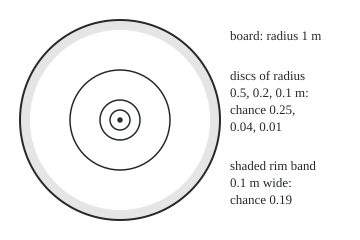
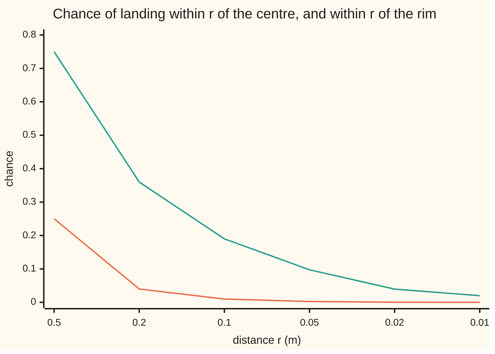

# Null sets and almost everywhere: sets of size zero, why countably many still weigh nothing, and completing a measure

[Syllabus](../../../SYLLABUS.md) → [Measure and integration](../../../SYLLABUS.md#w10) → [Sets You Can Measure](../../../SYLLABUS.md#w10-s01) → Null sets and almost everywhere

---

## General Overview

A dartboard has radius 1 m, so its area is π, about 3.141593 square metres. A dart is thrown so that it always hits the board, and the chance of landing in any region is that region's area divided by π. The chance of landing within 0.1 m of the centre is 0.01. Within 0.01 m it is 0.0001. The chance of hitting the exact centre is no bigger than any of these, so it is 0.

Yet the dart lands somewhere, and wherever it lands was a single point, with chance 0. Chance zero is not the same as impossible. Hitting the board is certain; hitting any one named point of it has chance 0.

Mark every point whose two coordinates are both fractions: the rational points. Every patch of the board, however small, holds infinitely many. Still, "the dart lands off every rational point" has chance 1, because the rational points can be listed, and a list of zero-chance events has zero chance in total. The board is also a union of zero-chance points, with chance 1; its points cannot be listed.

A set of size zero is called a **null set**. A statement that holds everywhere except on a null set holds **almost everywhere**, written a.e., or, when the measure is a probability, **almost surely**, written a.s.

**A null set is a measurable set of measure zero; countably many null sets together are still null, uncountably many need not be; and a measure can always be extended so that every piece of a null set is measurable and null too.**

**What kind of fact this is:** three definitions (null set, almost everywhere, completion) and two main theorems, proved in Why it works: a countable union of null sets is null, and every measure has a completion. Two supporting facts are proved beside them: the board's points cannot be listed, and the diameter is uncountable yet null.

### The picture: shrinking regions around a point and a circle

The board is drawn to scale, 100 units to the metre. Three discs around the centre have radius 0.5 m, 0.2 m and 0.1 m, with chances 0.25, 0.04 and 0.01. The shaded ring is every point within 0.1 m of the rim, chance 0.19. Both the centre point and the rim circle sit inside regions of chance as small as wished, so both are null.

<p align="center"></p>

As the radius r shrinks, the chance near the centre falls like r times r, and the chance near the rim falls like 2 times r. Both reach zero.



Orange: within r of the centre, exactly r times r. Green: within r of the rim, exactly 1 minus (1 − r) times (1 − r). The code prints both next to a simulated dart.

---

## The formula

Notation first, in words. A **measure space** $(\Omega, \mathcal{F}, \mu)$ is a set of outcomes, the collection of its subsets we allow ourselves to measure, and a measure that gives each of them a size ([Measures](04-measures.md)). Here the outcomes are the points of the board, the sizes are areas, and the probability is area divided by π.

A **null set** is a set we may measure whose measure is zero:

$$N \in \mathcal{F} \quad\text{and}\quad \mu(N) = 0$$

**Read it aloud:** N is one of the measurable sets, and its size is zero.

A property of outcomes holds **almost everywhere**, or **μ-a.e.**, when the outcomes where it fails fit inside a null set:

$$\{\omega \in \Omega : \text{the property fails at } \omega\} \subseteq N \quad\text{for some null set } N$$

**Read it aloud:** the property can fail only inside some set of size zero.

The main theorem: countably many null sets make a null set.

$$\mu\Big(\bigcup_{k=1}^{\infty} N_k\Big) \;\le\; \sum_{k=1}^{\infty} \mu(N_k) \;=\; 0$$

**Read it aloud:** the size of the union of a list of null sets is at most the sum of their sizes, and that sum is zero.

The **completion** adds every piece of a null set:

$$\bar{\mathcal{F}} = \{A \cup M : A \in \mathcal{F},\ M \subseteq N \text{ for some null } N\}, \qquad \bar\mu(A \cup M) = \mu(A)$$

**Read it aloud:** take a measurable set and glue on any piece of a null set; the new set gets the old set's size.

| Symbol | Plain meaning | In our example | Push it up and the answer… |
| --- | --- | --- | --- |
| $\Omega$ | the set of all outcomes | every point of the board | — |
| $\mathcal{F}$ | the sets we allow ourselves to measure (a sigma-algebra) | discs, rings, squares, single points, and everything built from them by countable unions and complements | more sets, more that can be null |
| $\mu$, $\nu$ | measures: each gives every set in $\mathcal{F}$ a size, zero or more | area, or the chance area divided by π | a bigger measure has fewer null sets |
| $P$ | a probability: a measure whose whole space has size 1; here area divided by π | a disc of radius r: π r r / π | — |
| $\omega$, $p$ | one outcome; a point of the board | the point where the dart lands | — |
| $N$ | a null set | the centre; the rim; the rational points | — |
| $N_k$ | the k-th null set in a list, k = 1, 2, 3, … | the k-th rational point | a longer list is still null |
| $\varepsilon$ | any positive size, however small (say "epsilon") | 0.001 square metres | a looser cover |
| $r$ | a distance, in metres | 0.1 m from the centre or the rim | chance near the centre r r, near the rim about 2 r |
| $A$, $B$, $A_k$, $E$ | sets in $\mathcal{F}$; $E$ any set being tested | $A$ = the whole board | — |
| $M$, $M_k$, $S$ | pieces of null sets, measurable or not | $M$ = the centre alone | — |
| $\bar{\mathcal{F}}$, $\bar\mu$ | the completed collection and its measure | adds every subset of a null set | — |

### When it holds

- **Null means measurable and zero.** A set outside $\mathcal{F}$ has no size at all, so it is not null, even when it sits inside a null set. Completion is the repair.
- **Null is relative to a measure.** Under area the centre is null; under counting measure, which gives each point size 1, it is not. Every "a.e." carries its measure, even when unnamed.
- **Countably many, not uncountably many.** The theorem rests on countable subadditivity. The board is a union of null points and has chance 1, because its points cannot be listed.
- **Completion needs nothing.** Every measure space has a completion; there are no hypotheses to check.

---

## Why it works

### Step 0: a null set can be covered by sets of any small total size

Size zero means smaller than every positive number. To show a set is null, cover it by measurable pieces whose total size is below any chosen $\varepsilon$. The trick for a list is to spend half of $\varepsilon$ on the first item, a quarter on the second, an eighth on the third, and so on. The spending never exceeds $\varepsilon$, however long the list.

### Step 1: every single point is null

Put a disc of radius r around the centre. The dart's chance of landing in it is π r r divided by π, which is r times r. The centre lies inside every such disc, and a set inside another cannot be bigger (monotonicity, [Continuity and subadditivity](05-continuity-of-measure.md)). So the centre's chance is at most 0.01, at most 0.0001, at most r times r for every r. The only number that small is 0.

The same argument works at any point of the board. The rim circle, a closed set and so in $\mathcal{F}$, is null too: it lies inside the ring of points within r of it, of chance 1 − (1 − r)(1 − r), which falls to 0.

### Step 2: countably many null sets make a null set

A countable set is one whose members can be listed first, second, third ([Countable sets](../../01-Foundations/09-Sizes%20of%20Infinity/02-countable-sets.md)). The rational points of the board are countable: list them by the size of their denominators. The code lists the 225 rational points of the board with denominator at most 6.

Give the k-th point a small square of area $\varepsilon$ divided by 2 to the power k. After K points the squares' total area is $\varepsilon$ times (1 − 1/2^K), below $\varepsilon$ for every K. With $\varepsilon$ = 0.001 square metres, the chance of landing on some rational point is at most 0.001/π, about 0.0003183099. Since $\varepsilon$ was any positive number, that chance is 0.

The general statement needs no squares. The union of null sets $N_1, N_2, \ldots$ is measurable, since a sigma-algebra is closed under countable unions. Its size is at most the sum of their sizes (countable subadditivity, [Continuity and subadditivity](05-continuity-of-measure.md)). The sum of zeros is zero.

Turn it round. If each of countably many properties holds almost everywhere, they all hold together almost everywhere: the outcomes where some property fails form a countable union of null sets. "The dart lands off the first rational point" holds a.s., and so does each of the rest; so "off every rational point" holds a.s.

<details>
<summary>Detailed proof</summary>

**Theorem 1.** In a measure space $(\Omega, \mathcal{F}, \mu)$, if $N_1, N_2, \ldots$ are null sets, their union $N$ is null.

*Proof.* Each $N_k$ is in $\mathcal{F}$, and a sigma-algebra holds every countable union of its members, so $N$ is in $\mathcal{F}$. Countable subadditivity (proved from countable additivity on [Continuity and subadditivity](05-continuity-of-measure.md)) gives $\mu(N) \le \sum_k \mu(N_k) = 0$. A measure is never negative, so $\mu(N) = 0$.

**Corollary.** If each property in a list holds $\mu$-a.e., they hold together $\mu$-a.e. *Proof.* Property number k fails only inside a null set $N_k$. An outcome where some property fails lies in the union of the $N_k$, null by Theorem 1.

**Theorem 2 (the board is not a countable set).** *Proof.* Every point $p$ of the board lies in the disc of radius r around it, of chance at most r r, so $P(\{p\}) \le r r$ for every r > 0, and $P(\{p\}) = 0$. If the points could be listed, Theorem 1 would make the board null, but $P(\text{board}) = 1$. So they cannot be listed. The diagonal argument ([Cantor's diagonal](../../01-Foundations/09-Sizes%20of%20Infinity/03-cantors-diagonal-argument.md)) reaches the same conclusion with no measure at all.

**Theorem 3 (an uncountable null set).** The horizontal diameter is uncountable, since its points match the numbers from −1 to 1. It is a closed segment, so it is in $\mathcal{F}$. It lies inside n squares of side 2/n laid along it, of total area n times (2/n)(2/n) = 4/n. That falls below any $\varepsilon$, so the diameter is null.

**Theorem 4 (completion).** Let $\bar{\mathcal{F}}$ and $\bar\mu$ be as in The formula. Then (a) $\bar{\mathcal{F}}$ is a sigma-algebra containing $\mathcal{F}$; (b) $\bar\mu$ is well defined; (c) $\bar\mu$ is a measure that agrees with $\mu$ on $\mathcal{F}$; (d) every subset of a $\bar\mu$-null set is in $\bar{\mathcal{F}}$; (e) no other measure on $\bar{\mathcal{F}}$ extends $\mu$.

(a) Taking $M$ empty puts every set of $\mathcal{F}$ in $\bar{\mathcal{F}}$. Countable unions: the union of the sets $A_k \cup M_k$, with $M_k \subseteq N_k$, is the union of the $A_k$ glued to the union of the $M_k$; the first is in $\mathcal{F}$, and the second sits inside the union of the $N_k$, null by Theorem 1. Complements: if $M \subseteq N$, an outcome is outside $A \cup M$ exactly when it is outside $A \cup N$, or inside $N$ but outside both $A$ and $M$. The first set is in $\mathcal{F}$ and the second is a piece of $N$, so the complement has the required form.

(b) Suppose $A \cup M = B \cup M'$ with $M \subseteq N$, $M' \subseteq N'$ and $N$, $N'$ null. Then $A \subseteq B \cup N'$, so $\mu(A) \le \mu(B) + \mu(N') = \mu(B)$. Swapping the roles gives $\mu(B) \le \mu(A)$. The value does not depend on how the set was written.

(c) If the sets $A_k \cup M_k$ do not overlap, neither do the $A_k$. Then $\bar\mu$ of the union is $\mu$ of the union of the $A_k$, which is $\sum_k \mu(A_k)$ by countable additivity of $\mu$. On $\mathcal{F}$, $\bar\mu(A) = \bar\mu(A \cup \emptyset) = \mu(A)$.

(d) If $\bar\mu(A \cup M) = 0$ then $\mu(A) = 0$, and $A \cup M$ sits inside $A \cup N$, a null set of $\mathcal{F}$. Any subset $S$ of it is then $\emptyset \cup S$, which has the required form.

(e) If $\nu$ is a measure on $\bar{\mathcal{F}}$ equal to $\mu$ on $\mathcal{F}$, monotonicity gives $\mu(A) = \nu(A) \le \nu(A \cup M) \le \nu(A \cup N) \le \mu(A) + \mu(N) = \mu(A)$.

**Sandwich form.** A set $E$ is in $\bar{\mathcal{F}}$ exactly when some $A$ and $B$ in $\mathcal{F}$ satisfy $A \subseteq E \subseteq B$ with $B$ minus $A$ null. Given $A \cup M$ with $M \subseteq N$, take $B = A \cup N$. Given a sandwich, $E$ is $A$ glued to $E$ minus $A$, a piece of the null set $B$ minus $A$.

</details>

### Step 3: uncountably many null sets need not be null

The whole board is the union of its points. Every point is null (Step 1), and the board has chance 1. The theorem of Step 2 does not apply, because the board's points cannot be listed: the list would make the board null. This is a second proof, by measure, that the board is uncountable.

Uncountable does not force positive size either. The diameter, a closed segment and so measurable, fits inside n squares of side 2/n, total area 4/n: 0.4 square metres for n = 10, 0.004 for n = 1000. It is uncountable and null. Countable is enough for null, not needed.

### Step 4: completion fills in the pieces of null sets

A null set can have pieces that the sigma-algebra does not contain. Such a piece has no size at all, which is awkward: a set inside a set of size zero ought to have size zero.

A four-point example shows the gap. Split the board into four outcomes: the centre dot, the rim line, the inner part of the board, the outer part. A cheap scoring machine records only whether the dart hit a painted mark (centre or rim) or not. Its sigma-algebra has four sets: nothing, {centre, rim}, {inner, outer}, everything. The marks have chance 0 and the rest chance 1. The set {centre} is a piece of the null set {centre, rim}, and the machine cannot measure it.

Completion adds every piece of a null set, glued to any measurable set, and gives the glued set the measurable set's size. The machine's four sets become eight: the four subsets of {centre, rim} with chance 0, and {inner, outer} with each of those four glued on, chance 1. The set {inner} stays out: splitting inner from outer is new information, not a piece of a null set. The code builds the eight twice, by gluing and by the sandwich form of the Detailed proof.

The same move applied to area on the Borel sets, the sigma-algebra generated by open sets ([Generated sigma-algebras and Borel sets](03-generated-and-borel-sigma-algebras.md)), gives the Lebesgue measurable sets, built on [Lebesgue measure](../02-Length%20Done%20Properly/03-lebesgue-measure.md).

<details>
<summary>Why completion adds so much</summary>

The diameter is null and has as many points as the whole line. Every one of its subsets is a piece of a null set, so every one is measurable after completion. There are more such subsets than Borel sets, so completion genuinely enlarges the collection. A counting argument, not given here, shows there are only as many Borel sets as real numbers ([Lebesgue measure](../02-Length%20Done%20Properly/03-lebesgue-measure.md) states it); the diameter, as large as the line, has more subsets than that, because every set is smaller than its collection of subsets ([Comparing infinities](../../01-Foundations/09-Sizes%20of%20Infinity/04-comparing-infinities.md)). The added sets all have size zero.

</details>

A second road to null sets starts from covers instead of a measure: a set is null when it fits inside countably many rectangles of total area below every $\varepsilon$. That definition needs no sigma-algebra and makes completeness automatic; it is built on [Outer measure](../02-Length%20Done%20Properly/01-lebesgue-outer-measure.md).

---

## Worked numbers, by hand

| Step | Arithmetic | Value |
| --- | --- | --- |
| board area, square metres | π times 1 times 1 | 3.141593 |
| within 0.1 m of the centre | 0.1 × 0.1 | 0.01 |
| within 0.01 m of the centre | 0.01 × 0.01 | 0.0001 |
| the exact centre | at most r × r for every r | **0** |
| within 0.01 m of the rim | 1 − 0.99 × 0.99 | 0.0199 |
| the rim circle | at most 1 − (1 − r)(1 − r) for every r | **0** |
| cover of the first 5 rational points, $\varepsilon$ = 0.001 | 0.001 × (1 − 1/32) | 0.00096875 |
| cover of all rational points | at most 0.001, as a chance 0.001/π | 0.0003183099 |
| every rational point, $\varepsilon$ as small as wished | at most every positive number | **0** |
| off every rational point | 1 − 0 | **1** |

The dart can land on a rational point, and it lands off every one of them almost surely.

### What breaks if you drop a piece

| Mistake | Comes out at | What went wrong |
| --- | --- | --- |
| Countable dropped: every point is null, so the board is | chance 1, area 3.141593, not 0 | the board's points cannot be listed |
| Null read as impossible | 0 of 200000 darts hit the centre, yet every dart hit a point of chance 0 | chance zero is not emptiness |
| Small read as null | the rim band 0.01 m wide has chance 0.0199 | null means below every positive number, not below one |
| Measuring {centre} with the scorer's four sets | no value at all; after completion, 0 | a piece of a null set need not be measurable until the measure is completed |
| Testing "off every rational point" by simulation | 1000 of 1000 simulated coordinates are rational | a computer number is a whole number over a power of 2 |

The code prints all five.

---

## Code, from first principles, and it actually runs

The code checks instances and finite stages; statements about every point of the board rest on the proofs. Four pairs of independent roads: the board's area by Machin's series for π (a fast-converging sum of arctangent terms) and by counting 1-micron cells inside and over a quarter board; chances near centre and rim by exact formula and by 200000 simulated darts (a SplitMix64 generator written out in both languages, seed 20260929); the rational points counted by reducing fractions and by a greatest-common-divisor test, their cover summed square by square and in closed form; the scorer's completion built by gluing and by the sandwich test.

### Python

```python
# Null sets and almost everywhere -- the check behind the card.  Standard
# library only.  A dart lands uniformly on a board of radius 1 m, so the
# chance of a region is its area divided by pi.  Four roads: exact chances
# against a simulated dart, a countable cover by list against its closed form,
# pi by a series against a grid count, and a completion built two ways.
from fractions import Fraction

MASK = (1 << 64) - 1

def splitmix64(state):                   # small generator, identical in Rust
    state = (state + 0x9E3779B97F4A7C15) & MASK
    z = state
    z = ((z ^ (z >> 30)) * 0xBF58476D1CE4E5B9) & MASK
    z = ((z ^ (z >> 27)) * 0x94D049BB133111EB) & MASK
    return state, z ^ (z >> 31)

def gcd(a, b):
    a, b = abs(a), abs(b)
    while b:
        a, b = b, a % b
    return a

def arctan_inv(n):                       # arctan(1/n) by its alternating series
    total, term, k, sign = 0.0, 1.0 / n, 1, 1
    while term > 1e-18:
        total += sign * term / k
        term, k, sign = term / (n * n), k + 2, -sign
    return total

# road one to pi: Machin's series.  road two: count grid cells inside a circle.
pi_series = 16 * arctan_inv(5) - 4 * arctan_inv(239)
R, x, cells = 1_000_000, 1_000_000, 0
for y in range(R):                       # cells in one quarter, row by row
    while x * x + y * y >= R * R:
        x -= 1
    cells += x + 1
pi_upper = 4 * cells / (R * R)           # cells with a corner inside: cover the disc
pi_lower = 4 * (cells - 2 * R) / (R * R) # cells wholly inside: fit in the disc
print(f"board area by Machin's series: {pi_series:.6f} m^2")
print(f"board area by 1-micron cells: between {pi_lower:.6f} and {pi_upper:.6f} m^2")

# a simulated dart: uniform in the 2 m square, kept only if it hits the board
N, radii = 200_000, [0.5, 0.2, 0.1, 0.05, 0.02, 0.01]
state, darts = 20260929, []
while len(darts) < N:
    state, a = splitmix64(state)
    state, b = splitmix64(state)
    px, py = 2 * (a >> 11) / 2**53 - 1, 2 * (b >> 11) / 2**53 - 1
    if px * px + py * py <= 1:
        darts.append(px * px + py * py)
exact_centre = [r * r for r in radii]                    # area pi r^2 over pi
exact_rim = [1 - (1 - r) * (1 - r) for r in radii]      # annulus over pi
print(f"darts thrown {N}, seed 20260929")
print("r, P(within r of centre) exact, simulated, P(within r of rim) exact, simulated")
worst = 0.0
for r, c, m in zip(radii, exact_centre, exact_rim):
    sc = sum(1 for d in darts if d < r * r) / N
    sm = sum(1 for d in darts if d > (1 - r) * (1 - r)) / N
    for e, s in ((c, sc), (m, sm)):
        worst = max(worst, abs(s - e) / (e * (1 - e) / N) ** 0.5)
    print(f"{r:.2f}, {c:.4f}, {sc:.4f}, {m:.4f}, {sm:.4f}")
print(f"largest gap, in standard errors: {worst:.2f}")
print(f"darts landing exactly on the centre: {sum(1 for d in darts if d == 0)} of {N}")

# rational points on the board, listed by denominator: a countable list
eps, listed, seen, grid_count = Fraction(1, 1000), [], set(), 0
print("eps = 0.001; denominator up to D, rational points listed K, cover area total")
for D in range(1, 7):                    # points p1/D, p2/D on the board
    for p1 in range(-D, D + 1):
        for p2 in range(-D, D + 1):
            if p1 * p1 + p2 * p2 <= D * D:
                pt = (Fraction(p1, D), Fraction(p2, D))           # road one: reduce
                if pt not in seen:
                    seen.add(pt)
                    listed.append(pt)
                if gcd(gcd(p1, p2), D) == 1:                     # road two: gcd test
                    grid_count += 1
    K = len(listed)
    by_list = sum(eps / 2**k for k in range(1, K + 1))          # square k: eps/2^k
    closed = eps * (1 - Fraction(1, 2**K))
    assert by_list == closed and K == grid_count
    print(f"D={D}, K={K}, cover {float(by_list):.10f} m^2, chance at most {float(by_list) / pi_series:.10f}")

# uncountable but null: the diameter, covered by n squares of side 2/n
print("diameter covered by n squares of side 2/n: n, total area 4/n, chance at most")
for n in (10, 100, 1000):
    print(f"n={n}, {4 / n:.4f} m^2, {4 / n / pi_series:.6f}")

# the scorer's record: centre dot, rim line, inner, outer (bits 1, 2, 4, 8)
names = ["centre", "rim", "inner", "outer"]
F = {0: Fraction(0), 3: Fraction(0), 12: Fraction(1), 15: Fraction(1)}
nulls = [A for A, p in F.items() if p == 0]
pairs = {(A | M, F[A]) for A in F for Nn in nulls for M in range(16) if M & ~Nn == 0}
road1 = dict(pairs)                      # well defined: one value per set
road2 = {E: F[A] for E in range(16) for A in F for B in F
         if A & ~E == 0 and E & ~B == 0 and (B & ~A) in F and F[B & ~A] == 0}
closed_up = all((15 ^ E) in road1 and (E | G) in road1 for E in road1 for G in road1)
label = lambda E: "{" + ", ".join(names[i] for i in range(4) if E >> i & 1) + "}"
print(f"scorer's sigma-algebra: {len(F)} sets; its completion: {len(road1)} sets of 16")
for E in sorted(road1):
    print(f"  {label(E)}: {road1[E]}")
print(f"completion closed under complement and union: {'yes' if closed_up else 'no'}")
print(f"not in the completion: {label(4)}, {label(8)}, {label(5)}")

# the usual mistake: every simulated coordinate is a fraction over 2^53
on_rational = 0
for i in range(1000):
    v = 2 * (splitmix64(i)[1] >> 11) / 2**53 - 1
    on_rational += Fraction(v).denominator <= 2**53      # a whole number over 2^53
print(f"simulated coordinates that are rational: {on_rational} of 1000")
print("figure, board r=100px at (120,120); centre discs 50, 20, 10 px; rim band 90-100 px")

assert pi_lower < pi_series < pi_upper                   # two roads to the area
assert worst < 4.0                                       # simulation within 4 SE
assert road1 == road2 and len(pairs) == len(road1) == 8 and closed_up  # one value each
```

**Ran 2026-10-06 on macOS, Python 3.14.6, standard library only. All checks passed. Output, pasted from the run:**

```
board area by Machin's series: 3.141593 m^2
board area by 1-micron cells: between 3.141589 and 3.141597 m^2
darts thrown 200000, seed 20260929
r, P(within r of centre) exact, simulated, P(within r of rim) exact, simulated
0.50, 0.2500, 0.2494, 0.7500, 0.7506
0.20, 0.0400, 0.0396, 0.3600, 0.3601
0.10, 0.0100, 0.0097, 0.1900, 0.1900
0.05, 0.0025, 0.0024, 0.0975, 0.0978
0.02, 0.0004, 0.0004, 0.0396, 0.0393
0.01, 0.0001, 0.0001, 0.0199, 0.0200
largest gap, in standard errors: 1.33
darts landing exactly on the centre: 0 of 200000
eps = 0.001; denominator up to D, rational points listed K, cover area total
D=1, K=5, cover 0.0009687500 m^2, chance at most 0.0003083627
D=2, K=13, cover 0.0009998779 m^2, chance at most 0.0003182710
D=3, K=37, cover 0.0010000000 m^2, chance at most 0.0003183099
D=4, K=73, cover 0.0010000000 m^2, chance at most 0.0003183099
D=5, K=149, cover 0.0010000000 m^2, chance at most 0.0003183099
D=6, K=225, cover 0.0010000000 m^2, chance at most 0.0003183099
diameter covered by n squares of side 2/n: n, total area 4/n, chance at most
n=10, 0.4000 m^2, 0.127324
n=100, 0.0400 m^2, 0.012732
n=1000, 0.0040 m^2, 0.001273
scorer's sigma-algebra: 4 sets; its completion: 8 sets of 16
  {}: 0
  {centre}: 0
  {rim}: 0
  {centre, rim}: 0
  {inner, outer}: 1
  {centre, inner, outer}: 1
  {rim, inner, outer}: 1
  {centre, rim, inner, outer}: 1
completion closed under complement and union: yes
not in the completion: {inner}, {outer}, {centre, inner}
simulated coordinates that are rational: 1000 of 1000
figure, board r=100px at (120,120); centre discs 50, 20, 10 px; rim band 90-100 px
```

### Rust

```rust
// Null sets and almost everywhere -- the check behind the card.  Rust std
// only.  A dart lands uniformly on a board of radius 1 m, so the chance of a
// region is its area divided by pi.  Four roads: exact chances against a
// simulated dart, a countable cover by list against its closed form, pi by a
// series against a grid count, and a completion built two ways.
use std::collections::{BTreeMap, BTreeSet, HashSet};

fn splitmix64(state: u64) -> (u64, u64) {
    let s = state.wrapping_add(0x9E3779B97F4A7C15);
    let mut z = s;
    z = (z ^ (z >> 30)).wrapping_mul(0xBF58476D1CE4E5B9);
    z = (z ^ (z >> 27)).wrapping_mul(0x94D049BB133111EB);
    (s, z ^ (z >> 31))
}

fn gcd(a: i64, b: i64) -> i64 {
    let (mut a, mut b) = (a.abs(), b.abs());
    while b != 0 {
        let t = a % b;
        a = b;
        b = t;
    }
    a
}

fn arctan_inv(n: f64) -> f64 {
    let (mut total, mut term, mut k, mut sign) = (0.0, 1.0 / n, 1.0, 1.0);
    while term > 1e-18 {
        total += sign * term / k;
        term /= n * n;
        k += 2.0;
        sign = -sign;
    }
    total
}

fn unit(bits: u64) -> f64 {
    (2 * (bits >> 11)) as f64 / 9007199254740992.0 - 1.0
}

fn main() {
    let pi_series = 16.0 * arctan_inv(5.0) - 4.0 * arctan_inv(239.0);
    let r_big: i64 = 1_000_000;
    let (mut x, mut cells) = (r_big, 0i64);
    for y in 0..r_big {
        while x * x + y * y >= r_big * r_big {
            x -= 1;
        }
        cells += x + 1;
    }
    let pi_upper = 4.0 * cells as f64 / (r_big * r_big) as f64; // corner inside
    let pi_lower = 4.0 * (cells - 2 * r_big) as f64 / (r_big * r_big) as f64; // wholly inside
    println!("board area by Machin's series: {:.6} m^2", pi_series);
    println!("board area by 1-micron cells: between {:.6} and {:.6} m^2", pi_lower, pi_upper);

    let n = 200_000usize;
    let radii = [0.5, 0.2, 0.1, 0.05, 0.02, 0.01];
    let (mut state, mut darts) = (20260929u64, Vec::new());
    while darts.len() < n {
        let (s1, a) = splitmix64(state);
        let (s2, b) = splitmix64(s1);
        state = s2;
        let (px, py) = (unit(a), unit(b));
        if px * px + py * py <= 1.0 {
            darts.push(px * px + py * py);
        }
    }
    println!("darts thrown {}, seed 20260929", n);
    println!("r, P(within r of centre) exact, simulated, P(within r of rim) exact, simulated");
    let mut worst: f64 = 0.0;
    for &r in radii.iter() {
        let (c, m) = (r * r, 1.0 - (1.0 - r) * (1.0 - r));
        let sc = darts.iter().filter(|&&d| d < r * r).count() as f64 / n as f64;
        let sm = darts.iter().filter(|&&d| d > (1.0 - r) * (1.0 - r)).count() as f64 / n as f64;
        for (e, s) in [(c, sc), (m, sm)] {
            worst = worst.max((s - e).abs() / (e * (1.0 - e) / n as f64).sqrt());
        }
        println!("{:.2}, {:.4}, {:.4}, {:.4}, {:.4}", r, c, sc, m, sm);
    }
    println!("largest gap, in standard errors: {:.2}", worst);
    let at_centre = darts.iter().filter(|&&d| d == 0.0).count();
    println!("darts landing exactly on the centre: {} of {}", at_centre, n);

    let eps = 0.001f64;
    let (mut seen, mut listed, mut grid_count) = (HashSet::new(), 0usize, 0usize);
    println!("eps = 0.001; denominator up to D, rational points listed K, cover area total");
    for q in 1..7i64 {
        for p1 in -q..=q {
            for p2 in -q..=q {
                if p1 * p1 + p2 * p2 <= q * q {
                    let (g1, g2) = (gcd(p1, q), gcd(p2, q)); // road one: reduce
                    if seen.insert((p1 / g1, q / g1, p2 / g2, q / g2)) {
                        listed += 1;
                    }
                    if gcd(gcd(p1, p2), q) == 1 {
                        grid_count += 1; // road two: gcd test
                    }
                }
            }
        }
        let by_list: f64 = (1..=listed).map(|k| eps / 2f64.powi(k as i32)).sum();
        let closed = eps * (1.0 - 1.0 / 2f64.powi(listed as i32));
        assert!((by_list - closed).abs() < 1e-18 && listed == grid_count);
        println!("D={}, K={}, cover {:.10} m^2, chance at most {:.10}", q, listed, by_list, by_list / pi_series);
    }

    println!("diameter covered by n squares of side 2/n: n, total area 4/n, chance at most");
    for k in [10.0f64, 100.0, 1000.0] {
        println!("n={}, {:.4} m^2, {:.6}", k, 4.0 / k, 4.0 / k / pi_series);
    }

    let names = ["centre", "rim", "inner", "outer"];
    let f: BTreeMap<u8, u8> = [(0, 0), (3, 0), (12, 1), (15, 1)].iter().cloned().collect();
    let nulls: Vec<u8> = f.iter().filter(|&(_, &p)| p == 0).map(|(&a, _)| a).collect();
    let mut pairs = BTreeSet::new();
    for (&a, &p) in f.iter() {
        for &nn in nulls.iter() {
            for m in 0..16u8 {
                if m & !nn == 0 {
                    pairs.insert((a | m, p));
                }
            }
        }
    }
    let road1: BTreeMap<u8, u8> = pairs.iter().cloned().collect();
    let mut road2 = BTreeMap::new();
    for e in 0..16u8 {
        for (&a, &p) in f.iter() {
            for &b in f.keys() {
                let gap = b & !a;
                if a & !e == 0 && e & !b == 0 && f.get(&gap) == Some(&0) {
                    road2.insert(e, p);
                }
            }
        }
    }
    let closed_up = road1.keys().all(|&e| road1.keys().all(|&g| road1.contains_key(&(15 ^ e)) && road1.contains_key(&(e | g))));
    let label = |e: u8| format!("{{{}}}", (0..4).filter(|i| e >> i & 1 == 1).map(|i| names[i]).collect::<Vec<_>>().join(", "));
    println!("scorer's sigma-algebra: {} sets; its completion: {} sets of 16", f.len(), road1.len());
    for (&e, &p) in road1.iter() {
        println!("  {}: {}", label(e), p);
    }
    println!("completion closed under complement and union: {}", if closed_up { "yes" } else { "no" });
    println!("not in the completion: {}, {}, {}", label(4), label(8), label(5));

    let mut on_rational = 0;
    for i in 0..1000u64 {
        let v = unit(splitmix64(i).1);
        if (v * 9007199254740992.0).fract() == 0.0 {
            on_rational += 1; // a whole number over 2^53
        }
    }
    println!("simulated coordinates that are rational: {} of 1000", on_rational);
    println!("figure, board r=100px at (120,120); centre discs 50, 20, 10 px; rim band 90-100 px");

    assert!(pi_lower < pi_series && pi_series < pi_upper); // two roads to the area
    assert!(worst < 4.0); // simulation within 4 SE
    assert!(road1 == road2 && pairs.len() == 8 && road1.len() == 8 && closed_up); // one value each
}
```

**Ran 2026-10-06 on macOS, rustc 1.98.1, no crates. All checks passed. Output, pasted from the run:**

```
board area by Machin's series: 3.141593 m^2
board area by 1-micron cells: between 3.141589 and 3.141597 m^2
darts thrown 200000, seed 20260929
r, P(within r of centre) exact, simulated, P(within r of rim) exact, simulated
0.50, 0.2500, 0.2494, 0.7500, 0.7506
0.20, 0.0400, 0.0396, 0.3600, 0.3601
0.10, 0.0100, 0.0097, 0.1900, 0.1900
0.05, 0.0025, 0.0024, 0.0975, 0.0978
0.02, 0.0004, 0.0004, 0.0396, 0.0393
0.01, 0.0001, 0.0001, 0.0199, 0.0200
largest gap, in standard errors: 1.33
darts landing exactly on the centre: 0 of 200000
eps = 0.001; denominator up to D, rational points listed K, cover area total
D=1, K=5, cover 0.0009687500 m^2, chance at most 0.0003083627
D=2, K=13, cover 0.0009998779 m^2, chance at most 0.0003182710
D=3, K=37, cover 0.0010000000 m^2, chance at most 0.0003183099
D=4, K=73, cover 0.0010000000 m^2, chance at most 0.0003183099
D=5, K=149, cover 0.0010000000 m^2, chance at most 0.0003183099
D=6, K=225, cover 0.0010000000 m^2, chance at most 0.0003183099
diameter covered by n squares of side 2/n: n, total area 4/n, chance at most
n=10, 0.4000 m^2, 0.127324
n=100, 0.0400 m^2, 0.012732
n=1000, 0.0040 m^2, 0.001273
scorer's sigma-algebra: 4 sets; its completion: 8 sets of 16
  {}: 0
  {centre}: 0
  {rim}: 0
  {centre, rim}: 0
  {inner, outer}: 1
  {centre, inner, outer}: 1
  {rim, inner, outer}: 1
  {centre, rim, inner, outer}: 1
completion closed under complement and union: yes
not in the completion: {inner}, {outer}, {centre, inner}
simulated coordinates that are rational: 1000 of 1000
figure, board r=100px at (120,120); centre discs 50, 20, 10 px; rim band 90-100 px
```

The two outputs are identical line for line.

> [!TIP]
> **Try changing**
> - **The seed.** Guess first: does any gap reach 4 standard errors? Change 20260929 in both files. The simulated columns move in the fourth decimal place; in seeds 1 to 20 the largest gap never passed 3.
> - **The cover size.** Guess first: what happens to the cover totals when eps drops from 0.001 to 0.000001? Every cover total shrinks by a factor of 1000, and the list of points is unchanged: the cover can be made as small as wished for the same countable set.
> - **A finer scorer.** Guess first: with {centre} and {rim} as separate sets in the scorer's sigma-algebra, eight sets in all, what is its completion? The same eight sets: every piece of a null set is already there, so the measure was already complete.
> - **A smaller radius.** Add 0.001 to the list of radii in both files. The rim column reads 0.0020, about 2 times r; the centre chance, 0.000001, prints as 0.0000. The centre column falls a hundredfold per tenfold step in r, the rim column tenfold: a circle is longer than a point, and both are null.

---

## The usual mistake

> [!warning]
> **Reading "chance zero" as "impossible".** The dart lands on exactly one point, and that point had chance 0. Null sets can be non-empty, and in continuous models every outcome that happens lies in one. "Almost surely" promises chance 1, not every outcome.
>
> - **Merging uncountably many null sets.** Every point of the board is null, yet the board has chance 1 and area 3.141593.
> - **Calling a small set null.** The rim band 0.01 m wide has chance 0.0199: small, not zero.
> - **Measuring a piece of a null set before completing.** The scorer's four sets give {centre} no value at all; after completion it gets 0.
> - **Trusting a simulation on a null set.** 1000 of 1000 simulated coordinates are rational, though the rational points have chance 0.

---

## Where you meet it in real life

- **Probability.** "Almost surely" is the working vocabulary of limit theorems: an average of repeated measurements settles down except on an event of chance 0. The ways a random sequence can converge, almost surely among them, are compared on [Modes of convergence](../05-Swapping%20Limits%20and%20Integrals/04-modes-of-convergence.md).
- **Integration.** A score of 1 on every rational point and 0 elsewhere has no Riemann integral ([Why a new integral](01-why-a-new-integral.md)); it equals the zero function almost everywhere, and the new integral gives both the value 0.
- **Signal processing.** The Fourier series of a square-integrable signal converges back to it almost everywhere, not everywhere; the exceptions are null (Carleson's theorem in outline).
- **Pricing with two sets of odds.** Two measures that agree on which events are null can be converted into each other; that is the condition behind changing to risk-neutral odds ([Absolutely continuous and singular measures](../08-Densities%20and%20Changing%20Measure/01-absolutely-continuous-and-singular-measures.md)).
- **Numerical computing.** Floating-point numbers are all fractions over powers of 2, a countable and so null set. A statement true almost surely can fail at every number a computer can produce.

> **Say it back**
> A null set is a measurable set of size zero: the centre of the dartboard, its rim, its rational points. Chance zero is not impossible; the dart always lands on a point of chance zero. A list of null sets is null, because countable subadditivity adds their zeros, so countably many almost-sure statements hold together almost surely. An uncountable union can be the whole board, or can still be null, like the diameter. Completing a measure adds every piece of a null set, with size zero, and changes nothing else.

---

## What this builds on

- [Measures](04-measures.md): the measure space and countable additivity.
- [Continuity and subadditivity](05-continuity-of-measure.md): monotonicity, and countable subadditivity, the one inequality the union theorem needs.
- [Countable sets](../../01-Foundations/09-Sizes%20of%20Infinity/02-countable-sets.md): why the rational points can be listed.
- [Cantor's diagonal](../../01-Foundations/09-Sizes%20of%20Infinity/03-cantors-diagonal-argument.md): why the board's points and the diameter's cannot.

## Where this goes next

- [Outer measure](../02-Length%20Done%20Properly/01-lebesgue-outer-measure.md): null sets defined directly by covers of small total length.
- [Lebesgue measure](../02-Length%20Done%20Properly/03-lebesgue-measure.md): length and area built, and the Lebesgue sets as the completion of the Borel sets.
- [Modes of convergence](../05-Swapping%20Limits%20and%20Integrals/04-modes-of-convergence.md): convergence almost surely against its weaker cousins.
- [Absolutely continuous and singular measures](../08-Densities%20and%20Changing%20Measure/01-absolutely-continuous-and-singular-measures.md): comparing two measures by their null sets.
- Baire category theorem: a different notion of "small", which can disagree with null.
- Boundary values and compactness: giving a function boundary values although the boundary is null.
- Carleson's theorem in outline: Fourier series converging almost everywhere.
- Calderon-Zygmund decomposition: splitting a function into good and bad parts, with inequalities that hold almost everywhere.
- Restriction and Kakeya in outline: sets that hold a needle in every direction yet can have size zero.

The dart's rule "chance equals area over π" was taken on trust here; building area so that it exists on every Borel set, and proving that its completion gives the Lebesgue sets, is [Lebesgue measure](../02-Length%20Done%20Properly/03-lebesgue-measure.md).

---

## Sources

Verified 2026-09-29: every link below resolves to the publisher's or author's page for the book named.

- Axler, Sheldon. *Measure, Integration & Real Analysis*. Springer, Graduate Texts in Mathematics 282, 2020. [Author's page with free edition](https://measure.axler.net/). Chapter 2 shows that countable sets of reals have outer measure 0 and builds Lebesgue measure.
- Folland, Gerald B. *Real Analysis: Modern Techniques and Their Applications*, 2nd ed. Wiley, 1999. [Publisher page](https://www.wiley.com/en-us/Real+Analysis%3A+Modern+Techniques+and+Their+Applications%2C+2nd+Edition-p-9780471317166). Section 1.3 defines null sets and complete measures and proves the completion theorem.
- Billingsley, Patrick. *Probability and Measure*, Anniversary ed. Wiley, 2012. [Publisher page](https://www.wiley.com/en-us/Probability+and+Measure%2C+Anniversary+Edition-p-9781118122372). Null sets and "almost surely" in probability, with completion.
- Tao, Terence. *An Introduction to Measure Theory*. American Mathematical Society, Graduate Studies in Mathematics 126, 2011. [Author's page](https://terrytao.wordpress.com/books/an-introduction-to-measure-theory/). Null sets, "almost everywhere", and the completion of a measure.
