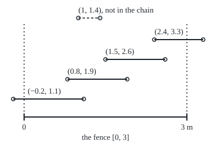

# Outer measure: cover a set with intervals, take the cheapest total, and every set gets a provisional size

Measure and integration → Length Done Properly → Sizing by covers → Outer measure

---

## General Overview

A wooden fence runs 3 metres. Someone marks 100 rust spots on it, one every 3 centimetres, the last on the end post. Each spot is a single point: a position, with no width.

How long are the spots, taken together? The fence? The fence with the spots taken out? A ruler measures intervals, and the fence without its spots is 100 pieces with holes between them. Worse, the rational numbers between 0 and 1 (the fractions, such as 1/2 and 3/7) are scattered everywhere with no stretch of their own. A ruler has no answer for them.

The fix is to measure from outside. Think of paying for tape: wrap the set in open intervals (stretches of the line without their end points), as many pieces as needed, one after another in a list, and pay for the total length. The cheapest total, or the limit of ever-cheaper totals when no cheapest exists, is the set's **outer measure**, the name used from here on.

The answers come out as 0 for the spots, 3 for the fence, and 3 for the fence without its spots. The rationals in [0, 1] fit inside intervals totalling 0.01, and then inside intervals totalling any positive amount, so their outer measure is 0.

**Every set of real numbers gets a size: the cheapest total length of a list of open intervals that covers it, or the limit of ever-cheaper lists when no cheapest exists; this size never shrinks when the set grows, never exceeds the sum of its pieces' sizes, and gives an interval its length.**

**What kind of fact this is:** a definition; its three properties, and the fact that an interval's outer measure is its length, are theorems, proved on this card in Why it works.

### The picture: five tapes over the fence

<p align="center"></p>

Drawn to scale, in metres. Open circles mark end points the intervals leave out. The four solid tapes form a chain: each starts before the last one ends. Their lengths total 4.4 m, all five total 4.8 m, and both exceed the fence's 3 m. Why every cover of the fence must total at least 3 is Step 4 below.

---

## The formula

Notation first, in words. An **open interval** $(c, d)$ is every point strictly between $c$ and $d$; its **length** $\ell\big((c, d)\big)$ is $d - c$. A **cover** of a set $A$ is a list $I_1, I_2, I_3, \dots$ of open intervals whose union (the points lying in at least one of them) contains every point of $A$. The symbol $\inf$ is the infimum: the greatest number lying at or below every member of a collection ([supremum-and-completeness](../../06-Calculus%20and%20analysis/01-Limits%20and%20Continuity/02-supremum-and-completeness.md)). A star on lambda, $\lambda^*$, read "lambda star", names outer measure.

$$\lambda^*(A) \;=\; \inf\Big\{\, \sum_{k=1}^{\infty} \ell(I_k) \;:\; I_1, I_2, \dots \text{ open intervals with } A \subseteq \bigcup_{k=1}^{\infty} I_k \Big\}$$

**Read it aloud:** list every way to cover the set with a sequence of open intervals, add up each list's lengths, and take the greatest number at or below all those totals.

A total may be infinite, and so may $\lambda^*(A)$; the whole line has outer measure infinity. A finite list counts as a sequence padded with empty intervals of length 0.

Three properties do the work on this card and the rest of the shelf.

$$A \subseteq B \;\Rightarrow\; \lambda^*(A) \le \lambda^*(B) \qquad \lambda^*\Big(\bigcup_{n=1}^{\infty} A_n\Big) \;\le\; \sum_{n=1}^{\infty} \lambda^*(A_n) \qquad \lambda^*\big([a, b]\big) = b - a$$

**Read it aloud:** a bigger set is never smaller; a union of a sequence of sets is at most the sum of their sizes; and a closed interval's size is its length.

The first is **monotonicity**, the second **countable subadditivity** ("countable": the pieces can be listed first, second, third, and on).

| Symbol | Plain meaning | In our example | Push it up and the answer… |
| --- | --- | --- | --- |
| $\lambda^*(A)$ | outer measure: the greatest number every cover's total reaches or beats | 0 for the spots, 3 for the fence | — |
| $A$, $B$, $A_n$ | sets of real numbers; $A_n$ the $n$-th in a list | the spots, the fence | a bigger set has outer measure at least as big |
| $I_k$, $k$, $n$ | the $k$-th open interval of a cover; $k$ and $n$ count positions in a list | (−0.2, 1.1), first in the picture | — |
| $\ell(I)$ | length of an interval: right end minus left end | 1.1 − (−0.2) for the first tape | the cover's total rises |
| $\sum$, $\bigcup$ | add up a list; join a list of sets into one | 4.8 m for the five tapes | — |
| $\inf$ | greatest number at or below every total | 3 over all covers of the fence | — |
| $\varepsilon$ | epsilon: any positive allowance, as small as wished | 0.01 m | the covers built from it get dearer |
| $F$ | the fence, the closed interval [0, 3] in metres | length 3 | — |
| $S$ | the 100 rust spots at 0.03, 0.06, … , 3 | outer measure 0 | — |
| $\mathbb{Q}$, $q_k$ | the rationals; $q_k$ the $k$-th in a fixed list | the third is 1/2 | — |
| $a$, $b$, $c$, $d$, $s$, $x$, $y$ | points on the line: interval ends; $x$ a spot or a reachable point, $s$ a supremum, $y$ a point past it | 0 and 3 | $b - a$ rises with $b$ |
| $\lambda$ | Lebesgue measure: outer measure kept on the well-behaved sets | 3 for the fence | — |

### When it holds

The formula is a definition, so it holds for every set of real numbers by fiat; its properties carry conditions.

- **Countably many intervals, not finitely many.** Allow only finite lists and the rationals in [0, 1] get 1, not 0: a finite cover of them must cover all but finitely many points of [0, 1].
- **Countable unions in subadditivity, not arbitrary ones.** The fence is the union of its uncountably many points, each of outer measure 0; adding those zeros "gives" 0, and the fence is 3.
- **Closed and bounded for the finite-subcover step.** Step 4 needs [a, b] to include its ends and stop somewhere. The rationals in [0, 1] have a cover totalling 0.01 with no finite part that covers them.
- **Subadditive, not additive.** Two sets with no point in common can have outer measures summing to more than their union's. No such pair can be written down explicitly; [translation-invariance-and-the-vitali-set](04-translation-invariance-and-the-vitali-set.md) argues that one exists. Sets on which additivity does hold are the subject of [caratheodory-measurable-sets](02-caratheodory-measurable-sets.md).

---

## Why it works

### Step 0: measure from outside, and allow a list of pieces

Length is known for intervals, so any other set is wrapped in them. The infimum is the price of the best wrapping, or the limit of better and better ones when no best exists. An endless list makes a scattered set cheap: the $k$-th piece shrinks as $k$ grows, so the total stays small.

### Step 1: a point, a finite set and a countable set each have outer measure 0

A single rust spot at $x$ sits inside the interval from $x - \varepsilon/2$ to $x + \varepsilon/2$, of length $\varepsilon$. So 0 ≤ $\lambda^*$ of the spot ≤ $\varepsilon$ for every positive $\varepsilon$, and a number between 0 and every positive number is 0.

All 100 spots: give each an interval of length $\varepsilon/100$. The total is $\varepsilon$, so again the outer measure is 0. With $\varepsilon$ = 0.01 m, each interval is 0.0001 m long.

The rationals in [0, 1] can be listed: by denominator, 0, 1, 1/2, 1/3, 2/3, 1/4, 3/4, 1/5, … . Give the $k$-th rational $q_k$ an interval of length $\varepsilon/2^k$. The lengths are $\varepsilon/2 + \varepsilon/4 + \varepsilon/8 + \cdots$, a geometric series summing to $\varepsilon$ ([series-convergence](../../06-Calculus%20and%20analysis/06-Series/01-series-convergence.md)). With $\varepsilon$ = 0.01, every rational in [0, 1] lies inside intervals totalling 0.01, and the argument works for every $\varepsilon$, so $\lambda^*(\mathbb{Q} \cap [0, 1]) = 0$. A set of outer measure 0 is a null set ([null-sets-and-almost-everywhere](../01-Sets%20You%20Can%20Measure/07-null-sets-and-almost-everywhere.md)); this card supplies the length that sentence was measured with.

### Step 2: a bigger set is never smaller

Take $A$ inside $B$. Every cover of $B$ covers $A$, so $A$ has all of $B$'s totals and perhaps cheaper ones. An infimum over more options is no higher: $\lambda^*(A) \le \lambda^*(B)$.

On the fence: the fence minus its spots lies inside the fence, so its outer measure is at most 3.

### Step 3: a union costs at most the sum of its pieces

Cover each piece $A_n$ almost as cheaply as possible, allowing an overshoot of $\varepsilon/2^n$ on the $n$-th piece. Pool every interval from every cover into one list. That list covers the union, and its total is at most the sum of the $\lambda^*(A_n)$ plus $\varepsilon/2 + \varepsilon/4 + \cdots = \varepsilon$. Since $\varepsilon$ is arbitrary, the union's outer measure is at most the sum.

On the fence, with $F \setminus S$ read "the fence minus the spots": the fence is $F \setminus S$ joined with $S$, so 3 ≤ $\lambda^*(F \setminus S)$ + 0, using the fence's outer measure 3 from Step 4. Step 2 gave at most 3, so the fence without its spots has outer measure exactly 3. Removing 100 points costs nothing.

<details>
<summary>Detailed proof: countable subadditivity</summary>

If some $\lambda^*(A_n)$ is infinite, or the sum is, the right side is infinite and there is nothing to prove. Otherwise fix $\varepsilon > 0$.

For each $n$, the number $\lambda^*(A_n) + \varepsilon/2^n$ is above the infimum, so it is not a lower bound for the totals: some cover $I_{n,1}, I_{n,2}, \dots$ of $A_n$ has total at most $\lambda^*(A_n) + \varepsilon/2^n$ (definition of infimum).

The intervals $I_{n,k}$, over all $n$ and $k$, can be put in one list by walking the diagonals $n + k = 2, 3, 4, \dots$; each interval appears once. Any point of the union lies in some $A_n$, so in some $I_{n,k}$: the list covers the union.

Its total is a series of non-negative terms. Any first stretch of the list uses finitely many of the $I_{n,k}$, drawn from finitely many of the covers. The intervals it takes from any one cover total at most that cover's whole total, so the stretch totals at most $\sum_n \big(\lambda^*(A_n) + \varepsilon/2^n\big) = \sum_n \lambda^*(A_n) + \varepsilon$. The partial sums never pass that bound, so neither does their limit, the series' sum ([series-convergence](../../06-Calculus%20and%20analysis/06-Series/01-series-convergence.md)).

So $\lambda^*$ of the union is at most $\sum_n \lambda^*(A_n) + \varepsilon$ for every $\varepsilon > 0$, hence at most $\sum_n \lambda^*(A_n)$.

</details>

### Step 4: a closed interval's outer measure is its length

This step makes outer measure agree with the ruler, and it is the only hard one.

**At most $b - a$.** The single interval $(a - \varepsilon, b + \varepsilon)$ covers $[a, b]$ and has length $b - a + 2\varepsilon$. For the fence with $\varepsilon$ = 0.001, the cover (−0.001, 3.001) totals 3.002 m. Every $\varepsilon$ works, so $\lambda^*([a, b]) \le b - a$.

**At least $b - a$.** Take any cover of $[a, b]$ by open intervals. Two facts finish it.

1. *Finitely many of the intervals already cover $[a, b]$.* This is the finite-subcover property of a closed, bounded interval, often called the Heine–Borel theorem. It fails for the rationals in [0, 1], and that failure is exactly why they can be cheap.
2. *Finitely many open intervals covering $[a, b]$ total more than $b - a$.* From $a$, take the interval reaching furthest right; from its right end, which it leaves out, take the next; and so on past $b$. Each link starts before the last one ends, so the chain's lengths exceed $b - a$.

In the picture the chain is (−0.2, 1.1), (0.8, 1.9), (1.5, 2.6), (2.4, 3.3), totalling 4.4 m, with (1, 1.4) skipped. Every cover totals more than $b - a$, so the infimum is at least $b - a$.

<details>
<summary>Detailed proof: the finite-subcover step</summary>

Let $I_1, I_2, \dots$ be open intervals covering $[a, b]$. Call a point $x$ of $[a, b]$ *reachable* if $[a, x]$ is covered by finitely many of the $I_k$. The point $a$ is reachable: it lies in some $I_k$. Reachable points are bounded above by $b$, so they have a supremum $s$, with $a \le s \le b$ (completeness, [supremum-and-completeness](../../06-Calculus%20and%20analysis/01-Limits%20and%20Continuity/02-supremum-and-completeness.md)).

The point $s$ lies in $[a, b]$, so in one of the intervals, say $(c, d)$, with $c < s < d$. Since $s$ is the least upper bound, some reachable $x$ has $c < x \le s$. Finitely many intervals cover $[a, x]$; add $(c, d)$ and they cover $[a, y]$ for every $y$ in $[a, b]$ with $y < d$.

If $s < b$, pick $y$ with $s < y < \min(d, b)$: $y$ is reachable and larger than $s$, a contradiction. So $s = b$, and taking $y = b$ (allowed, since $b = s < d$) shows $[a, b]$ is covered by finitely many intervals.

</details>

<details>
<summary>Detailed proof: finitely many open intervals covering [a, b] total more than b − a</summary>

Induction on the number $n$ of intervals. With $n = 1$, one interval $(c, d)$ contains $[a, b]$, so $c < a$ and $d > b$, and $d - c > b - a$.

Suppose it holds for every cover by $n - 1$ intervals, and let $n$ open intervals cover $[a, b]$. The point $a$ lies in one of them, $(c_1, d_1)$, with $c_1 < a < d_1$. If $d_1 > b$, that interval alone has length $d_1 - c_1 > b - a$. Otherwise $a < d_1 \le b$. No point of $[d_1, b]$ lies in $(c_1, d_1)$, so the other $n - 1$ intervals cover $[d_1, b]$, and by the induction hypothesis their lengths total more than $b - d_1$. Adding: total $> (b - d_1) + (d_1 - c_1) = b - c_1 > b - a$.

</details>

**Other intervals.** An open or half-open interval from $a$ to $b$ sits between $[a + \varepsilon, b - \varepsilon]$ and $[a, b]$, so by Step 2 its outer measure lies between $b - a - 2\varepsilon$ and $b - a$, hence equals $b - a$. An interval running to infinity contains closed intervals of every length, so its outer measure is infinite.

The code checks instances: the covers above, and 1,292 random covers of the fence, each totalling more than 3. Only the proof reaches every cover, endless lists included.

A second road to the same outer measure starts from length on half-open intervals and extends it by a general theorem; that is [caratheodory-extension-theorem](05-caratheodory-extension-theorem.md). Using closed or half-open intervals in the cover, in place of open ones, gives the same numbers: each can be swapped for a slightly longer open interval at a cost of $\varepsilon/2^k$.

---

## Worked numbers, by hand

| Step | Arithmetic | Value |
| --- | --- | --- |
| fence, from above | cover (−0.001, 3.001) | 3.002 m |
| fence, from below | Step 4: every cover totals more than 3 | 3 m, so **λ\*(fence) = 3** |
| the 100 spots | 100 intervals × 0.0001 m | 0.01 m, and any positive amount, so **0** |
| fence minus spots, from above | 99 gaps between spots, plus (−0.001, 0.03) | 3.001 m |
| fence minus spots, from below | 3 − 0.01 by subadditivity | 2.99 m |
| shrink both allowances | start overhang cut to one micrometre; the 100 spot intervals total 0.0002 m | 3.000001 above, 3 − 0.0002 = 2.9998 below |
| fence minus spots | squeezed between the two | **3** |
| rationals in [0, 1] | 0.01/2 + 0.01/4 + … , 40 terms | 0.009999999999990, cut off at 15 places |
| rationals in [0, 1] | same for every allowance | **0** |

The spots take up no length, so a paint quote for the fence without its spots is a quote for 3 m.

The gap cover works because the open gaps between spots leave out exactly their end points, which are the spots.

### What breaks if you drop a piece

| Mistake | Comes out at | What went wrong |
| --- | --- | --- |
| Finitely many intervals only | rationals in [0, 1] get 1, not 0; the first 10 of the 0.01 cover already miss 4/5, the first 40 miss 8/11 | a finite list cannot shrink its pieces endlessly |
| Adding overlapping pieces as if separate | (0, 2) and (1, 3): 2 + 2 = 4 m for a 3 m union | subadditivity is "at most", not "equal" |
| "No stretch inside, so size 0" | irrationals in [0, 1] would get 0; they are at least 1 − 0.01 = 0.99, then 0.9999, 0.999999: in fact 1 | a set can be full of holes and still have full size |

The code prints all three.

---

## Code, from first principles, and it actually runs

Whole micrometres on the fence and exact fractions for the rationals keep rounding out. The covers of Steps 1 to 3 are totalled exactly, and the points the gap cover misses are found by merging intervals and must be the spots. The rational cover is summed term by term and against the geometric-series formula. For Step 4, 20,000 random families of six open intervals are tested for covering the fence by two roads, merging them into one union and walking the proof's chain from 0; the roads must agree, and every cover must total more than 3 m. Two tapes meeting at 1.5 m must fail both tests, since neither holds that point, and so must a single tape that stops exactly at either end of the fence. SplitMix64 with seed 2026, written out in both languages, makes the two outputs identical.

### Python

```python
# Outer measure -- the check behind the card.  Standard library only: exact
# fractions for the rationals, whole micrometres (um) on the fence, and random
# covers from SplitMix64 written out here.  The fence is [0, 3000000] um.
from fractions import Fraction as Fr

M, MASK = 10**6, (1 << 64) - 1
SPOTS = [30000 * k for k in range(1, 101)]              # a rust spot every 3 cm

def metres(um):                                          # whole um as metres, zeros trimmed
    s = f"{abs(um) // M}.{abs(um) % M:06d}".rstrip("0").rstrip(".")
    return "-" + s if um < 0 else s

def dec(num, den, digits):                               # long division, no float; cuts off, never rounds
    out = f"{num // den}."
    for _ in range(digits):
        num = num % den * 10
        out += str(num // den)
    return out

def merge(ivs):                        # road one: the union as disjoint open pieces
    out = []
    for c, d in sorted(ivs):
        if out and c < out[-1][1]:     # open ends that only touch leave that point out
            out[-1][1] = max(out[-1][1], d)
        else:
            out.append([c, d])
    return out

def covers(ivs, a, b):
    return any(c < a and d > b for c, d in merge(ivs))

def chain(ivs, a, b):                  # road two: the proof's walk, furthest reach each time
    x, used = a, []
    while True:
        here = [iv for iv in ivs if iv[0] < x < iv[1]]
        if not here:
            return None
        best = max(here, key=lambda iv: (iv[1], iv[0]))
        used.append(best)
        if best[1] > b:
            return used
        x = best[1]

def rationals(count):                  # 0, 1, 1/2, 1/3, 2/3, 1/4, ... each once
    out, q = [], 1
    while len(out) < count:
        out += [Fr(p, q) for p in range(q + 1) if Fr(p, q).denominator == q]
        q += 1
    return out[:count]

def splitmix(state):
    state = (state + 0x9E3779B97F4A7C15) & MASK
    z = state
    z = ((z ^ (z >> 30)) * 0xBF58476D1CE4E5B9) & MASK
    z = ((z ^ (z >> 27)) * 0x94D049BB133111EB) & MASK
    return state, z ^ (z >> 31)

fence = [(-1000, 3001000)]
spot_cover = [(s - 50, s + 50) for s in SPOTS]
gap_cover = [(-1000, 30000)] + [(s - 30000, s) for s in SPOTS[1:]]
size = lambda ivs: sum(d - c for c, d in ivs)
pieces = merge(gap_cover)
holes = [(0, pieces[0][0])] * (pieces[0][0] >= 0) + [(pieces[-1][1], 3 * M)]
holes[-1:-1] = [(d, c2) for (c, d), (c2, d2) in zip(pieces, pieces[1:])]
missed = [d for d, c2 in holes if d == c2]                   # holes of one point each
print(f"fence [0, 3] m; {len(SPOTS)} rust spots at 0.03, 0.06, ..., {metres(SPOTS[-1])} m")
print(f"cover of the fence: (-0.001, 3.001), total {metres(size(fence))} m")
print(f"cover of the spots: 100 intervals of {metres(100)} m, total {metres(size(spot_cover))} m")
print(f"cover of the fence minus the spots: {len(gap_cover)} gaps, total {metres(size(gap_cover))} m")
print(f"points of the fence the gap cover misses: {len(missed)}, exactly the spots: "
      f"{'yes' if missed == SPOTS else 'no'}")
print(f"fence minus spots, lower bound by subadditivity: 3 - 0.01 = {metres(3 * M - size(spot_cover))} m")
tiny_gaps = [(-1, 30000)] + gap_cover[1:]
tiny_spots = [(s - 1, s + 1) for s in SPOTS]
print(f"shrunk: gap cover {metres(size(tiny_gaps))} m above, 3 - {metres(size(tiny_spots))} = "
      f"{metres(3 * M - size(tiny_spots))} m below")

qs = rationals(40)
print("rationals in [0, 1], first ten: " + ", ".join(str(q) for q in qs[:10]))
print("rational number k gets an interval of length 0.01 / 2^k around it")
for n in (10, 20, 40):
    by_terms = sum(Fr(1, 100 * 2**k) for k in range(1, n + 1))
    closed = Fr(2**n - 1, 100 * 2**n)
    assert by_terms == closed                                  # geometric series, two roads
    print(f"total after {n} intervals: {dec(by_terms.numerator, by_terms.denominator, 15)}, "
          f"short of 0.01 by 0.01 / 2^{n}")

example = [(-200000, 1100000), (800000, 1900000), (1000000, 1400000),
           (1500000, 2600000), (2400000, 3300000)]
x = lambda um: 40 + 9 * um // 100000                          # 90 figure units per metre
print("figure, fence 0 to 3 m drawn from x=40 to x=310, 90 units per metre")
print("figure, " + "; ".join(f"({metres(c)}, {metres(d)}) m at x {x(c)} to {x(d)}" for c, d in example))
walk = chain(example, 0, 3 * M)
print("chain from the proof: " + ", ".join(f"({metres(c)}, {metres(d)})" for c, d in walk)
      + f"; chain total {metres(size(walk))} m, all five {metres(size(example))} m")
assert walk == [example[i] for i in (0, 1, 3, 4)] and size(walk) == 4400000   # the figure

seed, per, trials = 2026, 6, 20000                            # seed, tapes per family, families
state, hits, agree, low_total, low_chain = seed, 0, True, None, None
for _ in range(trials):
    fam = []
    for _ in range(per):
        state, r1 = splitmix(state)
        state, r2 = splitmix(state)
        c = -300000 + r1 % 3200001
        fam.append((c, c + 300000 + r2 % 1200001))
    walked = chain(fam, 0, 3 * M)
    agree = agree and (walked is not None) == covers(fam, 0, 3 * M)
    if walked is not None:
        hits += 1
        assert size(fam) >= size(walked) > 3 * M              # the theorem, one cover at a time
        low_total = size(fam) if low_total is None else min(low_total, size(fam))
        low_chain = size(walked) if low_chain is None else min(low_chain, size(walked))
print(f"random families of {per} open intervals (SplitMix64, seed {seed}): {trials}")
print(f"families covering [0, 3]: {hits}; union test and chain walk agree on every one: {'yes' if agree else 'no'}")
print(f"smallest total among covers: {metres(low_total)} m; smallest chain total: {metres(low_chain)} m")

first = lambda n: next(q for q in rationals(n + 60) if all(abs(q - c) >= Fr(1, 200 * 2**k)
                       for k, c in enumerate(qs[:n], start=1)))
print(f"mistake 1, finitely many intervals: the first 10 miss {first(10)}, the first 40 miss {first(40)}; "
      "a finite cover of every rational in [0, 1] totals at least 1")
print(f"mistake 2, adding overlapping pieces: (0, 2) and (1, 3) give 2 + 2 = 4 m; "
      f"their union is {metres(size(merge([(0, 2 * M), (M, 3 * M)])))} m")
print("mistake 3, 'no interval inside, so size 0': irrationals in [0, 1] at least "
      + ", ".join(f"1 - {metres(e)} = {metres(M - e)}" for e in (10000, 100, 1)))
assert agree and hits > 0                                     # two roads to "is it a cover"
assert missed == SPOTS and len(holes) == len(missed)          # the gaps miss exactly the spots
assert size(merge([(0, 2 * M), (M, 3 * M)])) == 3 * M          # the union is (0, 3)
touch = [(-M, 3 * M // 2), (3 * M // 2, 4 * M)]                # meet at 1.5 m, leave it out
assert chain(touch, 0, 3 * M) is None and not covers(touch, 0, 3 * M)
for bare in ((0, 3 * M + 1000), (-1000, 3 * M)):               # one tape, one fence end left out
    assert chain([bare], 0, 3 * M) is None and not covers([bare], 0, 3 * M)
print("ALL CHECKS PASS")
```

**Ran 2026-10-06 on macOS, Python 3.14.6, standard library only. All checks passed. Output, pasted from the run:**

```
fence [0, 3] m; 100 rust spots at 0.03, 0.06, ..., 3 m
cover of the fence: (-0.001, 3.001), total 3.002 m
cover of the spots: 100 intervals of 0.0001 m, total 0.01 m
cover of the fence minus the spots: 100 gaps, total 3.001 m
points of the fence the gap cover misses: 100, exactly the spots: yes
fence minus spots, lower bound by subadditivity: 3 - 0.01 = 2.99 m
shrunk: gap cover 3.000001 m above, 3 - 0.0002 = 2.9998 m below
rationals in [0, 1], first ten: 0, 1, 1/2, 1/3, 2/3, 1/4, 3/4, 1/5, 2/5, 3/5
rational number k gets an interval of length 0.01 / 2^k around it
total after 10 intervals: 0.009990234375000, short of 0.01 by 0.01 / 2^10
total after 20 intervals: 0.009999990463256, short of 0.01 by 0.01 / 2^20
total after 40 intervals: 0.009999999999990, short of 0.01 by 0.01 / 2^40
figure, fence 0 to 3 m drawn from x=40 to x=310, 90 units per metre
figure, (-0.2, 1.1) m at x 22 to 139; (0.8, 1.9) m at x 112 to 211; (1, 1.4) m at x 130 to 166; (1.5, 2.6) m at x 175 to 274; (2.4, 3.3) m at x 256 to 337
chain from the proof: (-0.2, 1.1), (0.8, 1.9), (1.5, 2.6), (2.4, 3.3); chain total 4.4 m, all five 4.8 m
random families of 6 open intervals (SplitMix64, seed 2026): 20000
families covering [0, 3]: 1292; union test and chain walk agree on every one: yes
smallest total among covers: 4.287638 m; smallest chain total: 3.185503 m
mistake 1, finitely many intervals: the first 10 miss 4/5, the first 40 miss 8/11; a finite cover of every rational in [0, 1] totals at least 1
mistake 2, adding overlapping pieces: (0, 2) and (1, 3) give 2 + 2 = 4 m; their union is 3 m
mistake 3, 'no interval inside, so size 0': irrationals in [0, 1] at least 1 - 0.01 = 0.99, 1 - 0.0001 = 0.9999, 1 - 0.000001 = 0.999999
ALL CHECKS PASS
```

### Rust

Same numbers, same labels, built with `rustc --edition 2021 -O`.

```rust
// Outer measure -- the same check as the Python, in Rust.  No crates.  Exact
// rationals by hand on small integers, whole micrometres (um) on the fence, and
// random covers from SplitMix64 written out here.  The fence is [0, 3000000] um.
const M: i64 = 1_000_000;
type Iv = (i64, i64);

fn metres(um: i64) -> String {                           // whole um as metres, zeros trimmed
    let s = format!("{}.{:06}", um.abs() / M, um.abs() % M);
    let s = s.trim_end_matches('0').trim_end_matches('.').to_string();
    if um < 0 { format!("-{}", s) } else { s }
}

fn dec(mut num: u128, den: u128, digits: usize) -> String {   // long division, no float; cuts off, never rounds
    let mut out = format!("{}.", num / den);
    for _ in 0..digits {
        num = num % den * 10;
        out += &(num / den).to_string();
    }
    out
}

fn merge(ivs: &[Iv]) -> Vec<Iv> {      // road one: the union as disjoint open pieces
    let mut v = ivs.to_vec();
    v.sort();
    let mut out: Vec<Iv> = Vec::new();
    for (c, d) in v {
        match out.last_mut() {
            Some(last) if c < last.1 => last.1 = last.1.max(d),   // touching ends leave a point out
            _ => out.push((c, d)),
        }
    }
    out
}

fn covers(ivs: &[Iv], a: i64, b: i64) -> bool {
    merge(ivs).iter().any(|&(c, d)| c < a && d > b)
}

fn chain(ivs: &[Iv], a: i64, b: i64) -> Option<Vec<Iv>> {   // road two: the proof's walk
    let (mut x, mut used) = (a, Vec::new());
    loop {
        let best = *ivs.iter().filter(|iv| iv.0 < x && x < iv.1).max_by_key(|iv| (iv.1, iv.0))?;
        used.push(best);
        if best.1 > b { return Some(used) }
        x = best.1;
    }
}

fn gcd(a: i64, b: i64) -> i64 { if b == 0 { a } else { gcd(b, a % b) } }

fn rationals(count: usize) -> Vec<(i64, i64)> {         // 0, 1, 1/2, 1/3, 2/3, ... each once
    let (mut out, mut q) = (Vec::new(), 1);
    while out.len() < count {
        for p in 0..=q { if gcd(p, q) == 1 { out.push((p, q)) } }
        q += 1;
    }
    out.truncate(count);
    out
}

fn show(r: (i64, i64)) -> String { if r.1 == 1 { r.0.to_string() } else { format!("{}/{}", r.0, r.1) } }

fn splitmix(state: &mut u64) -> u64 {
    *state = state.wrapping_add(0x9E3779B97F4A7C15);
    let mut z = *state;
    z = (z ^ (z >> 30)).wrapping_mul(0xBF58476D1CE4E5B9);
    z = (z ^ (z >> 27)).wrapping_mul(0x94D049BB133111EB);
    z ^ (z >> 31)
}

fn size(ivs: &[Iv]) -> i64 { ivs.iter().map(|&(c, d)| d - c).sum() }

fn join(ivs: &[Iv]) -> String {
    ivs.iter().map(|&(c, d)| format!("({}, {})", metres(c), metres(d))).collect::<Vec<_>>().join(", ")
}

fn main() {
    let spots: Vec<i64> = (1..=100).map(|k| 30000 * k).collect();   // a rust spot every 3 cm
    let fence = [(-1000, 3001000)];
    let spot_cover: Vec<Iv> = spots.iter().map(|&s| (s - 50, s + 50)).collect();
    let mut gap_cover: Vec<Iv> = vec![(-1000, 30000)];
    gap_cover.extend(spots[1..].iter().map(|&s| (s - 30000, s)));
    let pieces = merge(&gap_cover);
    let mut holes: Vec<Iv> = if pieces[0].0 >= 0 { vec![(0, pieces[0].0)] } else { vec![] };
    holes.extend(pieces.windows(2).map(|w| (w[0].1, w[1].0)));
    holes.push((pieces[pieces.len() - 1].1, 3 * M));
    let missed: Vec<i64> = holes.iter().filter(|h| h.0 == h.1).map(|h| h.0).collect();
    println!("fence [0, 3] m; {} rust spots at 0.03, 0.06, ..., {} m", spots.len(), metres(spots[99]));
    println!("cover of the fence: (-0.001, 3.001), total {} m", metres(size(&fence)));
    println!("cover of the spots: 100 intervals of {} m, total {} m", metres(100), metres(size(&spot_cover)));
    println!("cover of the fence minus the spots: {} gaps, total {} m", gap_cover.len(), metres(size(&gap_cover)));
    println!("points of the fence the gap cover misses: {}, exactly the spots: {}",
             missed.len(), if missed == spots { "yes" } else { "no" });
    println!("fence minus spots, lower bound by subadditivity: 3 - 0.01 = {} m", metres(3 * M - size(&spot_cover)));
    let mut tiny_gaps = gap_cover.clone();
    tiny_gaps[0] = (-1, 30000);
    let tiny_spots: Vec<Iv> = spots.iter().map(|&s| (s - 1, s + 1)).collect();
    println!("shrunk: gap cover {} m above, 3 - {} = {} m below",
             metres(size(&tiny_gaps)), metres(size(&tiny_spots)), metres(3 * M - size(&tiny_spots)));

    let qs = rationals(40);
    println!("rationals in [0, 1], first ten: {}", qs[..10].iter().map(|&q| show(q)).collect::<Vec<_>>().join(", "));
    println!("rational number k gets an interval of length 0.01 / 2^k around it");
    for n in [10u32, 20, 40] {
        let den: u128 = 100 << n;                                  // 100 * 2^n
        let by_terms: u128 = (1..=n).map(|k| 1u128 << (n - k)).sum();
        let closed: u128 = (1u128 << n) - 1;
        assert!(by_terms == closed);                               // geometric series, two roads
        println!("total after {} intervals: {}, short of 0.01 by 0.01 / 2^{}", n, dec(by_terms, den, 15), n);
    }

    let example: [Iv; 5] = [(-200000, 1100000), (800000, 1900000), (1000000, 1400000),
                            (1500000, 2600000), (2400000, 3300000)];
    let x = |um: i64| 40 + (9 * um).div_euclid(100000);          // 90 figure units per metre
    println!("figure, fence 0 to 3 m drawn from x=40 to x=310, 90 units per metre");
    println!("figure, {}", example.iter().map(|&(c, d)| format!("({}, {}) m at x {} to {}", metres(c), metres(d), x(c), x(d)))
             .collect::<Vec<_>>().join("; "));
    let walk = chain(&example, 0, 3 * M).unwrap();
    println!("chain from the proof: {}; chain total {} m, all five {} m", join(&walk), metres(size(&walk)), metres(size(&example)));
    assert!(walk == [example[0], example[1], example[3], example[4]] && size(&walk) == 4_400_000);  // the figure

    let (seed, per, trials) = (2026u64, 6, 20000);                 // seed, tapes per family, families
    let (mut state, mut hits, mut agree) = (seed, 0, true);
    let (mut low_total, mut low_chain) = (i64::MAX, i64::MAX);
    for _ in 0..trials {
        let mut fam: Vec<Iv> = Vec::new();
        for _ in 0..per {
            let (r1, r2) = (splitmix(&mut state), splitmix(&mut state));
            let c = -300000 + (r1 % 3200001) as i64;
            fam.push((c, c + 300000 + (r2 % 1200001) as i64));
        }
        let walked = chain(&fam, 0, 3 * M);
        agree = agree && (walked.is_some() == covers(&fam, 0, 3 * M));
        if let Some(w) = walked {
            hits += 1;
            assert!(size(&fam) >= size(&w) && size(&w) > 3 * M);  // the theorem, one cover at a time
            low_total = low_total.min(size(&fam));
            low_chain = low_chain.min(size(&w));
        }
    }
    println!("random families of {} open intervals (SplitMix64, seed {}): {}", per, seed, trials);
    println!("families covering [0, 3]: {}; union test and chain walk agree on every one: {}", hits, if agree { "yes" } else { "no" });
    println!("smallest total among covers: {} m; smallest chain total: {} m", metres(low_total), metres(low_chain));

    let first = |n: usize| -> (i64, i64) {                     // |a/b - p/r| >= 1 / (200 * 2^k)
        *rationals(n + 60).iter().find(|&&(a, b)| qs[..n].iter().enumerate().all(|(i, &(p, r))|
            ((a * r - p * b).abs() as i128) * (200i128 << (i + 1)) >= (b * r) as i128)).unwrap()
    };
    println!("mistake 1, finitely many intervals: the first 10 miss {}, the first 40 miss {}; \
              a finite cover of every rational in [0, 1] totals at least 1", show(first(10)), show(first(40)));
    let overlap = merge(&[(0, 2 * M), (M, 3 * M)]);
    println!("mistake 2, adding overlapping pieces: (0, 2) and (1, 3) give 2 + 2 = 4 m; their union is {} m", metres(size(&overlap)));
    println!("mistake 3, 'no interval inside, so size 0': irrationals in [0, 1] at least {}",
             [10000, 100, 1].iter().map(|&e| format!("1 - {} = {}", metres(e), metres(M - e))).collect::<Vec<_>>().join(", "));
    assert!(agree && hits > 0);                                    // two roads to "is it a cover"
    assert!(missed == spots && holes.len() == missed.len());        // the gaps miss exactly the spots
    assert!(size(&overlap) == 3 * M);                               // the union is (0, 3)
    let touch = [(-M, 3 * M / 2), (3 * M / 2, 4 * M)];              // meet at 1.5 m, leave it out
    assert!(chain(&touch, 0, 3 * M).is_none() && !covers(&touch, 0, 3 * M));
    for bare in [(0, 3 * M + 1000), (-1000, 3 * M)] {                // one tape, one fence end left out
        assert!(chain(&[bare], 0, 3 * M).is_none() && !covers(&[bare], 0, 3 * M));
    }
    println!("ALL CHECKS PASS");
}
```

**Ran 2026-10-06 on macOS, rustc 1.98.1, no crates. All checks passed. Output, pasted from the run:**

```
fence [0, 3] m; 100 rust spots at 0.03, 0.06, ..., 3 m
cover of the fence: (-0.001, 3.001), total 3.002 m
cover of the spots: 100 intervals of 0.0001 m, total 0.01 m
cover of the fence minus the spots: 100 gaps, total 3.001 m
points of the fence the gap cover misses: 100, exactly the spots: yes
fence minus spots, lower bound by subadditivity: 3 - 0.01 = 2.99 m
shrunk: gap cover 3.000001 m above, 3 - 0.0002 = 2.9998 m below
rationals in [0, 1], first ten: 0, 1, 1/2, 1/3, 2/3, 1/4, 3/4, 1/5, 2/5, 3/5
rational number k gets an interval of length 0.01 / 2^k around it
total after 10 intervals: 0.009990234375000, short of 0.01 by 0.01 / 2^10
total after 20 intervals: 0.009999990463256, short of 0.01 by 0.01 / 2^20
total after 40 intervals: 0.009999999999990, short of 0.01 by 0.01 / 2^40
figure, fence 0 to 3 m drawn from x=40 to x=310, 90 units per metre
figure, (-0.2, 1.1) m at x 22 to 139; (0.8, 1.9) m at x 112 to 211; (1, 1.4) m at x 130 to 166; (1.5, 2.6) m at x 175 to 274; (2.4, 3.3) m at x 256 to 337
chain from the proof: (-0.2, 1.1), (0.8, 1.9), (1.5, 2.6), (2.4, 3.3); chain total 4.4 m, all five 4.8 m
random families of 6 open intervals (SplitMix64, seed 2026): 20000
families covering [0, 3]: 1292; union test and chain walk agree on every one: yes
smallest total among covers: 4.287638 m; smallest chain total: 3.185503 m
mistake 1, finitely many intervals: the first 10 miss 4/5, the first 40 miss 8/11; a finite cover of every rational in [0, 1] totals at least 1
mistake 2, adding overlapping pieces: (0, 2) and (1, 3) give 2 + 2 = 4 m; their union is 3 m
mistake 3, 'no interval inside, so size 0': irrationals in [0, 1] at least 1 - 0.01 = 0.99, 1 - 0.0001 = 0.9999, 1 - 0.000001 = 0.999999
ALL CHECKS PASS
```

The two outputs match line for line.

> [!TIP]
> **Try changing**
> Guess first, then run it.
> - **Leave the end post bare.** In `gap_cover`, change `(-1000, 30000)` to `(0, 30000)`. The point 0 is now uncovered: the run reports 101 missed points and the spots assert stops it.
> - **Close the ends.** In `merge`, change `c < out[-1][1]` to `c <=`. Touching gaps now fuse as if they covered the spot between them: 1 missed point, and the same assert stops it. Open intervals leave their ends out, and the whole gap cover depends on it.
> - **Fewer tapes.** Set `per` to 4 in place of 6. Far fewer families cover the fence, and every one that does still totals more than 3 m.
> - **Another seed.** Change `seed` from 2026. The counts and the cheapest totals move; every assert still holds, because Step 4 is about every cover, not these.

---

## The usual mistake

> [!warning]
> **Reading outer measure as a measure.** It is defined for every set and it is subadditive, but it is not additive: two sets with no common point can have outer measures summing to more than their union's. The sets where it does add up are picked out on [caratheodory-measurable-sets](02-caratheodory-measurable-sets.md), and on them it becomes Lebesgue measure $\lambda$.
>
> - **Finite covers only.** That is an older notion, Jordan content, and it gives the rationals in [0, 1] size 1, not 0.
> - **Size 0 means few points.** Outer measure 0 is about length, not count. Countable sets have it, but so do some uncountable sets: [the-cantor-set](07-the-cantor-set.md).
> - **No stretch inside, so size 0.** The irrationals in [0, 1] contain no interval, yet their outer measure is 1: 1 ≤ λ\*(irrationals) + 0.
> - **The cheapest cover exists.** The infimum need not be reached. No cover of the fence totals exactly 3; every one totals more.

---

## Where you meet it in real life

- **Probability of an exact value.** A dart landing uniformly on [0, 1] hits a rational with probability 0, the outer measure of the rationals there. Why that sentence is allowed is [null-sets-and-almost-everywhere](../01-Sets%20You%20Can%20Measure/07-null-sets-and-almost-everywhere.md).
- **Lebesgue measure itself.** Restricted to the well-behaved sets, outer measure is Lebesgue measure: [lebesgue-measure](03-lebesgue-measure.md).
- **Weighted lengths.** Replace an interval's length by the rise of a distribution function across it and the same cheapest-cover recipe builds probability laws on the line: [lebesgue-stieltjes-measures](06-lebesgue-stieltjes-measures.md).
- **Fractal size.** Covering by small pieces and taking the cheapest total, with each piece's length raised to a power, is how the dimension of a coastline or the Cantor set is defined.

> **Say it back**
> Outer measure sizes any set of reals from outside: cover it with a list of open intervals and take the greatest number every such total reaches or beats. A bigger set never gets a smaller size, and a union of a list of sets costs at most the sum of their sizes. A closed interval gets its length, because finitely many of any cover already span it and a chain of them overlaps its way across. Points, finite sets and the rationals all get 0, so the fence without its 100 rust spots is still 3 m.

---

## What this builds on

- [null-sets-and-almost-everywhere](../01-Sets%20You%20Can%20Measure/07-null-sets-and-almost-everywhere.md): the idea of a set of size zero, which this card makes precise on the line.
- [series-convergence](../../06-Calculus%20and%20analysis/06-Series/01-series-convergence.md): the geometric series behind every $\varepsilon/2^k$ cover, and a series' sum as the limit of its partial sums.
- [supremum-and-completeness](../../06-Calculus%20and%20analysis/01-Limits%20and%20Continuity/02-supremum-and-completeness.md): the infimum in the definition, and the supremum in the finite-subcover proof.

## Where this goes next

- [caratheodory-measurable-sets](02-caratheodory-measurable-sets.md): the test that picks out the sets on which outer measure adds up.

Outer measure does not add up on every pair of sets with no common point; which sets it does add up on is the question [caratheodory-measurable-sets](02-caratheodory-measurable-sets.md) answers.

---

## Sources

Verified 2026-09-29: each link opens a page naming the cited work (DOIs checked against Crossref).

- Axler, Sheldon. *Measure, Integration & Real Analysis*. Graduate Texts in Mathematics 282, Springer, 2020. [Publisher page](https://doi.org/10.1007/978-3-030-33143-6); [free edition from the author](https://measure.axler.net/). Chapter 2 defines outer measure with open intervals and proves an interval's outer measure is its length through Heine–Borel.
- Folland, Gerald B. *Real Analysis: Modern Techniques and Their Applications*, 2nd ed. Wiley, 1999. [Publisher page](https://www.wiley.com/en-us/Real+Analysis%3A+Modern+Techniques+and+Their+Applications%2C+2nd+Edition-p-9780471317166). Chapter 1 builds outer measures in general and Lebesgue measure from them.
- Lebesgue, Henri. "Intégrale, longueur, aire." *Annali di Matematica Pura ed Applicata* 7 (1902). [DOI](https://doi.org/10.1007/BF02420592). The thesis that measured sets by countable covers of intervals.
