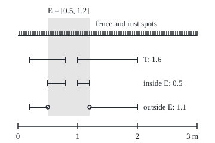
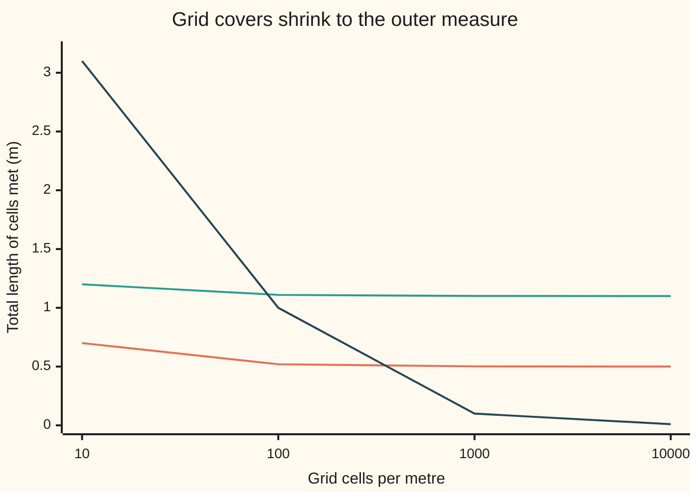

# Caratheodory's criterion: keep the sets that split every other set cleanly, and outer measure adds up on them

[Syllabus](../../../SYLLABUS.md) → [Measure and integration](../README.md) → [Length Done Properly](../README.md#s02) → Caratheodory's criterion

---

## General Overview

A wooden fence runs 3 metres, with 100 rust spots marked on it, one every 3 centimetres, the last on the end post. Outer measure ([Outer measure](01-lebesgue-outer-measure.md)) gave every set of points on the fence a size: the cheapest total length of open intervals covering it. The spots came out at 0, the fence at 3, the fence without its spots at 3. Here 0 + 3 = 3: the sizes of two non-overlapping parts add up to the size of the whole.

Outer measure does not promise that. It promises only that the parts' sizes add to *at least* the whole's size: covers are bought for each part separately, and two tangled parts can each need tape the other also needs. Such sets exist on the line: the Vitali set ([Translation invariance and the Vitali set](04-translation-invariance-and-the-vitali-set.md)) fails the test below, so some set splits across it into two parts whose outer measures add to more than the whole's.

Which sets can be trusted? Constantin Carathéodory's answer, from 1914, is a test. Take the stretch E from 0.5 m to 1.2 m, and a test set T: the fence from 0.2 to 0.8 and from 1.0 to 2.0, of outer measure 0.6 + 1.0 = 1.6. Cut T with E. The part inside E measures 0.5; the part outside measures 1.1; and 0.5 + 1.1 = 1.6. Nothing was lost or double-charged. E passes if this happens for *every* test set. The rust spots pass too: they split the same T into 0 and 1.6.

The sizes 1.6, 0.5 and 1.1 are pinned from both sides, not assumed. T and the gap (0.8, 1.0) make up [0.2, 2.0], of outer measure 1.8, so subadditivity puts T at no less than 1.8 − 0.2 = 1.6, and covering its two pieces puts it at no more. The same squeeze, with the gaps (0.8, 1.0) and E, gives 0.5 and 1.1.

The sets that pass form a sigma-algebra: a collection closed under complements and countable unions ([Sigma-algebras](../01-Sets%20You%20Can%20Measure/02-sigma-algebras.md)).

**Keep only the sets that split every test set with no loss; they form a sigma-algebra, outer measure adds up countably on them, and for length on the line every interval and every set of size zero is among them.**

**What kind of fact this is:** a definition (the splitting test) and a theorem about the sets that pass it, proved on this card in Why it works, with the full proof in a folded callout.

### The picture: one test set, cut by E

<p align="center"></p>

Drawn to scale, 100 units per metre. The comb on the fence line is the 100 rust spots, 3 units apart. Open circles mark the two ends that the outside part leaves out. The pieces inside E total 0.3 + 0.2, the pieces outside 0.3 + 0.8, and together they give back T's 1.6.

---

## The formula

Notation first, in words. An **outer measure** $\mu^*$, read "mu star", is any rule giving every subset of a space $\Omega$ (omega, the set of all points in play) a size from 0 to infinity, such that the empty set gets 0, a bigger set never gets less, and a list of sets together never gets more than the sum of their sizes (**countable subadditivity**). Lebesgue outer measure $\lambda^*$ on the line is one such rule. For sets, $T \cap E$ is the part of $T$ inside $E$, $E^c$ is the **complement** of $E$ (every point of $\Omega$ not in $E$), and $T \cap E^c$, also written $T \setminus E$, is the part of $T$ outside $E$.

$$\mu^*(T) = \mu^*(T \cap E) + \mu^*(T \cap E^c) \qquad \text{for every } T \subseteq \Omega$$

**Read it aloud:** whatever set is cut by E, the size of the part inside plus the size of the part outside is exactly the size of the whole.

A set $E$ passing this test is **Carathéodory measurable**, or measurable for $\mu^*$. The script letter $\mathcal{M}$ names the collection of all of them. The theorem, for pieces $E_1, E_2, E_3, \dots$ in $\mathcal{M}$ with no point in two of them:

$$\mathcal{M} \text{ is a sigma-algebra, and } \ \mu^*\Big(\bigcup_{i} E_i\Big) = \sum_{i} \mu^*(E_i).$$

**Read it aloud:** the passing sets survive complements and countable unions, and on them the size of a union of separate pieces is the sum of their sizes.

For Lebesgue outer measure on the line, two families pass: every interval, and every set with $\lambda^*$ equal to 0. The rule $\lambda^*$ kept only on $\mathcal{M}$ is Lebesgue measure $\lambda$ ([Lebesgue measure](03-lebesgue-measure.md)).

| Symbol | Plain meaning | In our example | Push it up and the answer… |
| --- | --- | --- | --- |
| $\Omega$ | the space: every point in play | the fence [0, 3] | more room for test sets |
| $\mu^*$ | an outer measure: a size for every subset, subadditive | the board bill on the toy fence in Worked numbers | — |
| $\lambda^*$ | Lebesgue outer measure: cheapest cover by open intervals | $\lambda^*(T)$ = 1.6 | — |
| $E$, $F$ | the set on trial; $F$ a second set in $\mathcal{M}$ | [0.5, 1.2] | a longer E takes more of T inside |
| $T$ | a test set: any subset of $\Omega$ | [0.2, 0.8] and [1.0, 2.0] | both parts grow, their sum stays $\lambda^*(T)$ |
| $E^c$ | the complement: points of $\Omega$ not in $E$ | [0, 0.5) and (1.2, 3] | — |
| $\mathcal{M}$ | the sets passing the test | contains E and the rust spots | — |
| $R$ | the rust-spot set | 100 points, 0.03 to 3.00 | still size 0 at any finite count |
| $E_i$, $F_i$, $i$ | a list of sets in $\mathcal{M}$, and its non-overlapping version; $i$ counts the list | — | — |
| $B_k$, $B$ | the union of the first $k$ pieces of the list; the union of all of them | — | — |
| $I_k$, $k$, $\ell$ | the intervals of one cover; $k$ counts them; $\ell(I_k)$ is the length of $I_k$ | two open intervals around T's pieces | — |
| $H$, $c$, $a$, $b$ | a half-line, every point beyond the cut point $c$; $a$ and $b$ are interval ends | $c$ = 0.5 | — |
| $N$ | any set of outer measure 0 | the rust spots R | — |
| $\varepsilon$ | the slack a cover is allowed over the cheapest total | 0.01 | a looser cover, a weaker bound |
| $\lambda$ | Lebesgue measure: $\lambda^*$ kept on $\mathcal{M}$ | $\lambda$(E) = 0.7 | — |

### When it holds

- **$\mu^*$ must be an outer measure.** Countable subadditivity supplies the "no less than" half of every equality in the proof; without it Steps 2 and 3 lose their footing.
- **Every test set, not a favourite one.** On the toy fence in Worked numbers, the set b passes the test with the whole fence as T but fails with T = bc, and outer measure does not add on it.
- **Countable unions, not arbitrary ones.** Each single point of the fence passes, having size 0, yet every subset of the fence is a union of single points, the Vitali set included. The proof's limit step runs down a list, and an uncountable union is no list.
- **Intervals pass for $\lambda^*$ because $\lambda^*$ is built from interval lengths.** For another outer measure an interval may fail: on the toy fence, a stretch of two panels such as bc fails.

---

## Why it works

### Step 0: half of the test is free

Subadditivity already says the two parts of T measure at least T: $\mu^*(T) \le \mu^*(T \cap E) + \mu^*(T \cap E^c)$. So only one direction is ever in question: cutting T along E must waste nothing. Each step below proves a "no more than"; subadditivity supplies the rest.

### Step 1: complements pass

Swapping E and its complement swaps the two terms of the sum. So when E passes, so does the fence minus E.

### Step 2: unions of two pass

Take E and F in $\mathcal{M}$. Cut T by E, then cut the outside part again by F: three parts whose sizes add to exactly $\mu^*(T)$. The first two together make the part of T inside E or F, and by subadditivity their sizes add to at least its size. So the parts inside and outside the union add to no more than $\mu^*(T)$. With Step 1, overlaps and differences pass too.

### Step 3: countable unions pass, and sizes add

For separate pieces $E_1, E_2, \dots$ in $\mathcal{M}$, cut T by the first piece, then the rest by the second, and so on. Each cut is exact, so the parts of T in the first few pieces, plus the part outside all of them, add to at most $\mu^*(T)$. Let the number of pieces grow: the sum becomes a series, and by subadditivity the series is at least the size of the part of T in the whole union. So the union passes. An overlapping list is first made separate, keeping from each set only what earlier ones missed. So $\mathcal{M}$ is a sigma-algebra. Taking the union itself as T gives countable additivity: $\mu^*$ is a measure on $\mathcal{M}$, in the sense of [Measures](../01-Sets%20You%20Can%20Measure/04-measures.md).

### Step 4: sets of size zero pass

For the rust spots R, the part of any T inside R measures 0, since it sits inside R. The part outside measures at most $\lambda^*(T)$, since it sits inside T. On the fence: 0 + 1.6.

### Step 5: every interval passes Lebesgue outer measure

Start with a half-line: every point beyond a cut point. Cover T by open intervals $I_k$ whose lengths total at most $\lambda^*(T) + \varepsilon$. Cut each $I_k$ at the cut point: two intervals whose lengths add to exactly the length of $I_k$. The inside pieces cover the part of T in the half-line, the outside pieces cover the rest, so the two parts measure at most $\lambda^*(T) + \varepsilon$ together, for every slack $\varepsilon$. On the fence, a cover of T totalling 1.61 cuts at 0.5 and 1.2 into 0.505 inside E and 1.105 outside.

Complements of half-lines pass by Step 1. E = [0.5, 1.2] is the overlap of "from 0.5 on" and "up to 1.2", so it passes by Step 2. Every interval is built the same way, open ones as countable unions, so every Borel set passes ([Generated sigma-algebras and Borel sets](../01-Sets%20You%20Can%20Measure/03-generated-and-borel-sigma-algebras.md)).

<details>
<summary>Detailed proof</summary>

Here $\mu^*$ is an outer measure on $\Omega$. By subadditivity on $T = (T \cap E) \cup (T \cap E^c)$, a set $E$ is in $\mathcal{M}$ once $\mu^*(T) \ge \mu^*(T \cap E) + \mu^*(T \cap E^c)$ for every $T$ of finite outer measure; for infinite $\mu^*(T)$ there is nothing to prove.

**1. Complements.** The condition for $E$ is the condition for $E^c$, since $(E^c)^c = E$. The empty set passes: $\mu^*(T \cap \emptyset) + \mu^*(T) = 0 + \mu^*(T)$.

**2. Finite unions.** Let $E, F \in \mathcal{M}$. Testing $E$ with $T$, then $F \in \mathcal{M}$ with $T \cap E^c$:
$$\mu^*(T) = \mu^*(T \cap E) + \mu^*(T \cap E^c \cap F) + \mu^*(T \cap E^c \cap F^c).$$
Since $T \cap (E \cup F) = (T \cap E) \cup (T \cap E^c \cap F)$, subadditivity bounds the first two terms below by $\mu^*\big(T \cap (E \cup F)\big)$; and $E^c \cap F^c = (E \cup F)^c$. Hence $\mu^*(T) \ge \mu^*\big(T \cap (E \cup F)\big) + \mu^*\big(T \cap (E \cup F)^c\big)$. With 1, $E \cap F = (E^c \cup F^c)^c$ and $E \setminus F = E \cap F^c$ lie in $\mathcal{M}$.

**3. Additivity inside a test set.** Let $E_1, E_2, \dots \in \mathcal{M}$ be pairwise disjoint, $B_k = E_1 \cup \dots \cup E_k$, and $B = \bigcup_i E_i$. Testing $E_k \in \mathcal{M}$ with $T \cap B_k$, whose parts inside and outside it are $T \cap E_k$ and $T \cap B_{k-1}$, gives $\mu^*(T \cap B_k) = \mu^*(T \cap E_k) + \mu^*(T \cap B_{k-1})$, so by induction $\mu^*(T \cap B_k) = \sum_{i \le k} \mu^*(T \cap E_i)$.

**4. Countable unions.** Each $B_k \in \mathcal{M}$ by 2, and $B^c \subseteq B_k^c$, so by monotonicity and 3
$$\mu^*(T) = \mu^*(T \cap B_k) + \mu^*(T \cap B_k^c) \ge \sum_{i \le k} \mu^*(T \cap E_i) + \mu^*(T \cap B^c).$$
Let $k \to \infty$, then apply subadditivity to $T \cap B = \bigcup_i (T \cap E_i)$:
$$\mu^*(T) \ge \sum_{i=1}^{\infty} \mu^*(T \cap E_i) + \mu^*(T \cap B^c) \ge \mu^*(T \cap B) + \mu^*(T \cap B^c).$$
So $B \in \mathcal{M}$. For an arbitrary list in $\mathcal{M}$, the sets $F_1 = E_1$ and $F_i = E_i \setminus (E_1 \cup \dots \cup E_{i-1})$ lie in $\mathcal{M}$ by 2, are pairwise disjoint and have the same union. So $\mathcal{M}$ is a sigma-algebra.

**5. Countable additivity.** Put $T = B$ in the middle inequality of 4: $\mu^*(B) \ge \sum_i \mu^*(E_i)$, and subadditivity gives the reverse.

**6. Null sets.** If $\mu^*(N) = 0$, monotonicity gives $\mu^*(T \cap N) = 0$ and $\mu^*(T \cap N^c) \le \mu^*(T)$ for every $T$, so $N \in \mathcal{M}$.

**7. Half-lines for $\lambda^*$.** Let $H = (c, \infty)$ and $\varepsilon > 0$. As $\lambda^*(T)$ is a greatest lower bound, some open intervals $I_1, I_2, \dots$ cover $T$ with $\sum_k \ell(I_k) \le \lambda^*(T) + \varepsilon$, where $\ell(I_k)$ is the length of $I_k$. The sets $I_k \cap H$ and $I_k \cap H^c$ are intervals, possibly empty, with $\ell(I_k \cap H) + \ell(I_k \cap H^c) = \ell(I_k)$; the first family covers $T \cap H$ and the second covers $T \cap H^c$. An interval's outer measure is its length ([Outer measure](01-lebesgue-outer-measure.md)), so by subadditivity
$$\lambda^*(T \cap H) + \lambda^*(T \cap H^c) \le \sum_k \ell(I_k \cap H) + \sum_k \ell(I_k \cap H^c) = \sum_k \ell(I_k) \le \lambda^*(T) + \varepsilon.$$
The slack is arbitrary, so $H \in \mathcal{M}$. Then $(-\infty, c] = H^c$, $(a, b] = (a, \infty) \cap (-\infty, b]$, $\{b\} = \bigcap_k (b - 1/k, b]$ and $(a, b) = \bigcup_k (a, b - 1/k]$ put every interval in $\mathcal{M}$ by 1, 2 and 4, and with them the sigma-algebra they generate: the Borel sets.

</details>

The same filter builds more than length. Start from any rule that sizes the sets of a simple family, form its outer measure by cheapest covers, and keep the sets that pass: that is [Caratheodory's extension theorem](05-caratheodory-extension-theorem.md).

---

## Worked numbers, by hand

On the fence, with E = [0.5, 1.2], the rust spots R and the test set T = [0.2, 0.8] and [1.0, 2.0]:

| Step | Arithmetic | Value |
| --- | --- | --- |
| size of T | 0.6 + 1.0 at most; 1.8 − 0.2 at least, as T and (0.8, 1.0) make [0.2, 2.0] | 1.6 |
| T inside E | [0.5, 0.8] and [1.0, 1.2]: 0.3 + 0.2 at most; 0.7 − 0.2 at least | 0.5 |
| T outside E | [0.2, 0.5) and (1.2, 2.0]: 0.3 + 0.8 at most; 1.8 − 0.7 at least | 1.1 |
| E's test | 0.5 + 1.1 | **1.6**, equal to T |
| spots in T | 0.21 to 0.78 gives 20, 1.02 to 1.98 gives 33 | 53 points, size 0 |
| R's test | 0 + 1.6 | **1.6**, equal to T |

Neither cut wastes length for this T; the code repeats the interval bookkeeping on 1000 more test sets, and Steps 4 and 5 cover every test set.

A toy fence shows a set that fails. Four panels a, b, c, d; three repair boards, one over a, one over b and c, one over c and d, each costing 1. The outer measure of a set of panels is the cheapest bill of boards covering it. It is an outer measure: the empty set costs 0, more panels never cost less, and the boards for two sets together cover their union. So bc costs 1 (one board), bd costs 2, abcd costs 3. A dash, -, names the empty set.

| Step | Arithmetic | Value |
| --- | --- | --- |
| a against every test set | 16 tests, all pass | a is in $\mathcal{M}$ |
| sets that pass | out of 16 | -, a, bcd, abcd |
| adding up on them | bill(a) + bill(bcd) = 1 + 2 | **3** = bill(abcd) |
| b against T = bc | bill(b) + bill(c) = 1 + 1 | 2, but bill(bc) = 1 |

The panel b fails because one board charges b and c together. Here the passing sets are exactly the unions of the blocks a and bcd that the boards glue together.

### What breaks if you drop a piece

| Mistake | Comes out at | What went wrong |
| --- | --- | --- |
| Test only with the whole toy fence | b passes: 1 + 2 = 3, yet fails T = bc | One test set cannot see a cut inside a board |
| Add outer measure on sets that fail | bill(b) + bill(c) = 2, bill(bc) = 1 | Additivity is the theorem's conclusion, only on $\mathcal{M}$ |
| Judge a set by one coarse cover | at 10 cells per metre the spots cover 3.1 m and E cuts T into 0.7 + 1.2 = 1.9 | Outer measure is the cheapest cover, a limit, not one cover |

The code prints all three.

---

## Code, from first principles, and it actually runs

The code takes four roads to the fence's numbers. Road 1 cuts intervals and adds lengths exactly, fractions in Python and whole tenth-millimetres in Rust: each sum is an upper bound for the outer measure, and subtracting the gaps gives the matching lower bound, the squeeze from the overview. Road 2 uses no interval lengths: it counts the grid cells each set meets as the cells shrink. Road 3 cuts one cover of T at the ends of E, the move in Step 5. Road 4 repeats the interval bookkeeping of E's test and the rust spots' test on 1000 random two-piece test sets; it checks the cutting, while Steps 4 and 5 carry the criterion itself. The toy fence is enumerated in full, 16 sets against 16 test sets, and its passing sets are found a second way, by gluing panels that share a board. The code checks instances and a finite toy; only the proof covers every test set on the line.

### Python

```python
# Caratheodory's criterion -- the check behind the card.  Standard library only.
# A 3 m fence, lengths in metres as exact fractions.  E = [0.5, 1.2]; R = 100
# rust spots at 0.03, 0.06, ..., 3.00.  The test set T = [0.2, 0.8] and [1.0, 2.0].
# Four roads: exact interval lengths, grid cells that meet a set, one cover of T cut
# at the ends of E, and 1000 random test sets.  Then a toy fence of four panels.
from fractions import Fraction as F
from math import floor

def iv(a, b, lc=True, rc=True):              # interval a..b; lc, rc: ends included?
    return (F(a), F(b), lc, rc)

def length(pieces):                          # merge overlaps, add the lengths
    total, reach = F(0), None
    for a, b, _, _ in sorted(pieces):
        if reach is None or a > reach: total, reach = total + b - a, b
        elif b > reach: total, reach = total + b - reach, b
    return total

def meet(pieces, e):                         # the part of the pieces inside e
    out = []
    for a, b, lc, rc in pieces:
        lo, l2 = (a, lc) if a > e[0] else (e[0], e[2] and (lc or a < e[0]))
        hi, r2 = (b, rc) if b < e[1] else (e[1], e[3] and (rc or b > e[1]))
        if lo < hi: out.append((lo, hi, l2, r2))
    return out

def minus(pieces, e):                        # the part outside e: cut left and right
    left = meet(pieces, (F(-1), e[0], True, not e[2]))
    return left + meet(pieces, (e[1], F(10), not e[3], True))

def cells(pieces, n):                        # grid cells of width 1/n meeting the pieces
    got = set()
    for a, b, lc, rc in pieces:
        hi = b * n - 1 if (b * n).denominator == 1 and not rc else floor(b * n)
        got.update(range(floor(a * n), int(hi) + 1))
    return len(got)

def m(x):                                    # print a length to 4 decimals, exactly
    v = int(x * 10000)
    return f"{v // 10000}.{v % 10000:04d}"

E = iv("0.5", "1.2")
T = [iv("0.2", "0.8"), iv("1.0", "2.0")]
spots = [F(3 * k, 100) for k in range(1, 101)]
inT = [s for s in spots if any(a <= s <= b for a, b, _, _ in T)]
TminusR = T
for s in inT:
    TminusR = minus(TminusR, (s, s, True, True))
tE, tnE, tnR = length(meet(T, E)), length(minus(T, E)), length(TminusR)
tR = length([(s, s, True, True) for s in inT])     # 53 points: no length at all
print(f"fence [0, 3] m; E = [0.5, 1.2], size {m(length([E]))}; rust spots R = 0.03, 0.06, ..., 3.00 (100 points)")
print("test set T = [0.2, 0.8] and [1.0, 2.0]")
parts = lambda ps: " + ".join(m(length([p])) for p in ps)
print(f"road 1, exact lengths, an upper bound for outer measure: T = {parts(T)} = {m(length(T))}")
print(f"  E splits T: inside {parts(meet(T, E))} = {m(tE)}, outside {parts(minus(T, E))} = {m(tnE)}; total {m(tE + tnE)}")
per = " + ".join(str(sum(a <= s <= b for s in spots)) for a, b, _, _ in T)
print(f"  R splits T: inside {m(tR)} ({per} = {len(inT)} spots), outside {m(tnR)}; total {m(tR + tnR)}")
gap, hull = iv("0.8", "1.0", False, False), iv("0.2", "2.0")     # T and the gap make [0.2, 2.0]
lows = [(length([hull]), length([gap])), (length([E]), length([gap])), (length([hull]), length([E]))]
print("  lower bounds by subadditivity, gaps (0.8, 1.0) and E: " + ", ".join(
      f"{w} >= {m(a)} - {m(b)} = {m(a - b)}" for w, (a, b) in zip(("T", "inside", "outside"), lows)))
print("road 2, grid cells meeting each set, times cell width:")
print("  cells per metre | T | T and E | T minus E | sum | T and R | all of R")
grid = {}
for n in (10, 100, 1000, 10000):
    row = [F(c, n) for c in (cells(T, n), cells(meet(T, E), n), cells(minus(T, E), n))]
    rr = [F(len({floor(s * n) for s in inT}), n), F(len({floor(s * n) for s in spots}), n)]
    grid[n] = row + rr
    print(f"  {n:>5} | {m(row[0])} | {m(row[1])} | {m(row[2])} | {m(row[1] + row[2])} | {m(rr[0])} | {m(rr[1])}")
eps = F(1, 100)
cover = [iv(a - eps / 4, b + eps / 4, False, False) for a, b, _, _ in T]
ci, co = length(meet(cover, E)), length(minus(cover, E))
print(f"road 3, one cover of T, total {m(length(cover))} = outer(T) + {m(eps)}, cut at 0.5 and 1.2:")
print(f"  pieces inside E {m(ci)} + pieces outside E {m(co)} = {m(ci + co)}")
seed = state = 2026
def rand(k):                                 # SplitMix64, written out, then mod k
    global state
    state = (state + 0x9E3779B97F4A7C15) % 2**64
    z = state
    z = ((z ^ (z >> 30)) * 0xBF58476D1CE4E5B9) % 2**64
    z = ((z ^ (z >> 27)) * 0x94D049BB133111EB) % 2**64
    return (z ^ (z >> 31)) % k
bad_E = bad_R = 0
for _ in range(1000):
    ends = [F(rand(30001), 10000) for _ in range(4)]
    S = [iv(*sorted(ends[:2])), iv(*sorted(ends[2:]))]
    bad_E += length(meet(S, E)) + length(minus(S, E)) != length(S)
    sR = [s for s in spots if any(a <= s <= b for a, b, _, _ in S)]
    rest = S
    for s in sR:
        rest = minus(rest, (s, s, True, True))
    bad_R += length(rest) != length(S)
print(f"road 4, 1000 random two-piece test sets (SplitMix64, seed {seed}): E fails {bad_E}, R fails {bad_R}")
names = ["-", "a", "b", "ab", "c", "ac", "bc", "abc", "d", "ad", "bd", "abd", "cd", "acd", "bcd", "abcd"]
boards = [1, 6, 12]                          # boards over {a}, {b, c}, {c, d}; each costs 1
def covered(k):                              # the panels under the boards chosen by k
    out = 0
    for i, bd in enumerate(boards):
        out |= bd if k >> i & 1 else 0
    return out
def bill(A):                                 # cheapest set of boards covering A
    return min(bin(k).count("1") for k in range(2 ** len(boards)) if A & ~covered(k) == 0)
ok = [A for A in range(16) if all(bill(X) == bill(X & A) + bill(X & ~A & 15) for X in range(16))]
print("toy fence, panels a b c d; boards over a, over b c, over c d; each board costs 1")
print("  cheapest bill: " + " ".join(f"{names[A]}:{bill(A)}" for A in range(16)))
print("  sets passing all 16 tests: " + ", ".join(names[A] for A in ok))
blocks = []                                  # road two: glue panels that share a board
for bd in boards:
    blocks = [b for b in blocks if not b & bd] + [bd | sum(b for b in blocks if b & bd)]
unions = sorted(sum(b for i, b in enumerate(blocks) if k >> i & 1) for k in range(2 ** len(blocks)))
print(f"  glued blocks {', '.join(names[b] for b in blocks)}; their unions: " + ", ".join(names[A] for A in unions))
closed = all(15 & ~A in ok and A | B in ok and A & B in ok for A in ok for B in ok)
print(f"  closed under complement, union, overlap: {'yes' if closed else 'no'}")
print(f"  additive on them: {bill(1)} + {bill(14)} = {bill(15)}")
print(f"what breaks: b passes the whole-fence test, {bill(2)} + {bill(13)} = {bill(15)},"
      f" but fails T = bc: {bill(2)} + {bill(4)} vs {bill(6)}")
print(f"  outer measure off the passing sets: bill(b) + bill(c) = {bill(2) + bill(4)}, bill(bc) = {bill(6)}")
def fx(ps):                                  # figure x-coordinates: 30 + 100 per metre
    return " and ".join(f"{int(30 + 100 * a)} to {int(30 + 100 * b)}" for a, b, _, _ in ps)
print(f"figure, x = 30 + 100 * metres: fence {fx([iv(0, 3)])}; E {fx([E])}; T {fx(T)};"
      f" T and E {fx(meet(T, E))}; T minus E {fx(minus(T, E))}; spots every 3")
assert tE + tnE == length(T) == F(8, 5) and tR + tnR == length(T)     # road 1 against the hand sum
assert [a - b for a, b in lows] == [length(T), tE, tnE]              # the squeeze: lower bounds meet the sums
assert grid[10][:3] == [F(9, 5), F(7, 10), F(6, 5)]                 # the coarse row quoted in What breaks
g = grid[10000]
assert all(0 <= g[i] - x <= F(2, 10000) for i, x in enumerate((length(T), tE, tnE)))  # one cell per piece
assert bad_E == 0 and bad_R == 0 and ci + co == length(cover)
assert ok == unions and closed and bill(1) + bill(14) == bill(15)  # toy: two roads, one family
assert bill(2) + bill(13) == bill(15) and bill(2) + bill(4) > bill(6)
print("ALL CHECKS PASS")
```

**Ran 2026-10-06 on macOS, Python 3.14.6, standard library only. All checks passed. Output, pasted from the run:**

```
fence [0, 3] m; E = [0.5, 1.2], size 0.7000; rust spots R = 0.03, 0.06, ..., 3.00 (100 points)
test set T = [0.2, 0.8] and [1.0, 2.0]
road 1, exact lengths, an upper bound for outer measure: T = 0.6000 + 1.0000 = 1.6000
  E splits T: inside 0.3000 + 0.2000 = 0.5000, outside 0.3000 + 0.8000 = 1.1000; total 1.6000
  R splits T: inside 0.0000 (20 + 33 = 53 spots), outside 1.6000; total 1.6000
  lower bounds by subadditivity, gaps (0.8, 1.0) and E: T >= 1.8000 - 0.2000 = 1.6000, inside >= 0.7000 - 0.2000 = 0.5000, outside >= 1.8000 - 0.7000 = 1.1000
road 2, grid cells meeting each set, times cell width:
  cells per metre | T | T and E | T minus E | sum | T and R | all of R
     10 | 1.8000 | 0.7000 | 1.2000 | 1.9000 | 1.6000 | 3.1000
    100 | 1.6200 | 0.5200 | 1.1100 | 1.6300 | 0.5300 | 1.0000
   1000 | 1.6020 | 0.5020 | 1.1010 | 1.6030 | 0.0530 | 0.1000
  10000 | 1.6002 | 0.5002 | 1.1001 | 1.6003 | 0.0053 | 0.0100
road 3, one cover of T, total 1.6100 = outer(T) + 0.0100, cut at 0.5 and 1.2:
  pieces inside E 0.5050 + pieces outside E 1.1050 = 1.6100
road 4, 1000 random two-piece test sets (SplitMix64, seed 2026): E fails 0, R fails 0
toy fence, panels a b c d; boards over a, over b c, over c d; each board costs 1
  cheapest bill: -:0 a:1 b:1 ab:2 c:1 ac:2 bc:1 abc:2 d:1 ad:2 bd:2 abd:3 cd:1 acd:2 bcd:2 abcd:3
  sets passing all 16 tests: -, a, bcd, abcd
  glued blocks a, bcd; their unions: -, a, bcd, abcd
  closed under complement, union, overlap: yes
  additive on them: 1 + 2 = 3
what breaks: b passes the whole-fence test, 1 + 2 = 3, but fails T = bc: 1 + 1 vs 1
  outer measure off the passing sets: bill(b) + bill(c) = 2, bill(bc) = 1
figure, x = 30 + 100 * metres: fence 30 to 330; E 80 to 150; T 50 to 110 and 130 to 230; T and E 80 to 110 and 130 to 150; T minus E 50 to 80 and 150 to 230; spots every 3
ALL CHECKS PASS
```

### Rust

Same rows, same labels, built with `rustc --edition 2021 -O`.

```rust
// Caratheodory's criterion -- the same check as the Python, in Rust.  No crates.
// Lengths are whole numbers of tenth-millimetres (1 m = 10000), so every sum is
// exact.  E = [0.5, 1.2]; R = 100 rust spots at 0.03, ..., 3.00; T = [0.2, 0.8] and
// [1.0, 2.0].  Four roads, then the toy fence of four panels.
use std::collections::BTreeSet;
type Iv = (i64, i64, bool, bool);            // a..b in tenth-mm; are the ends included?

fn length(pieces: &[Iv]) -> i64 {            // merge overlaps, add the lengths
    let mut v = pieces.to_vec();
    v.sort_by_key(|p| (p.0, p.1));
    let (mut total, mut reach) = (0, i64::MIN);
    for &(a, b, _, _) in &v {
        if a > reach { total += b - a; reach = b } else if b > reach { total += b - reach; reach = b }
    }
    total
}

fn meet(pieces: &[Iv], e: Iv) -> Vec<Iv> {   // the part of the pieces inside e
    let mut out = vec![];
    for &(a, b, lc, rc) in pieces {
        let (lo, l2) = if a > e.0 { (a, lc) } else { (e.0, e.2 && (lc || a < e.0)) };
        let (hi, r2) = if b < e.1 { (b, rc) } else { (e.1, e.3 && (rc || b > e.1)) };
        if lo < hi { out.push((lo, hi, l2, r2)) }
    }
    out
}

fn minus(pieces: &[Iv], e: Iv) -> Vec<Iv> { // the part outside e: cut left and right
    let mut out = meet(pieces, (-10000, e.0, true, !e.2));
    out.extend(meet(pieces, (e.1, 100000, !e.3, true)));
    out
}

fn cells(pieces: &[Iv], w: i64) -> i64 {     // grid cells of width w meeting the pieces
    let mut got = BTreeSet::new();
    for &(a, b, _, rc) in pieces {
        let hi = if b % w == 0 && !rc { b / w - 1 } else { b / w };
        for c in a / w..=hi { got.insert(c); }
    }
    got.len() as i64
}

fn m(v: i64) -> String { format!("{}.{:04}", v / 10000, v % 10000) }

fn inside(s: i64, set: &[Iv]) -> bool { set.iter().any(|p| p.0 <= s && s <= p.1) }

fn cut_out(set: &[Iv], pts: &[i64]) -> Vec<Iv> {
    let mut rest = set.to_vec();
    for &s in pts { rest = minus(&rest, (s, s, true, true)) }
    rest
}

struct Rng(u64);                             // SplitMix64, written out
impl Rng {
    fn next(&mut self, k: u64) -> i64 {
        self.0 = self.0.wrapping_add(0x9E3779B97F4A7C15);
        let mut z = self.0;
        z = (z ^ (z >> 30)).wrapping_mul(0xBF58476D1CE4E5B9);
        z = (z ^ (z >> 27)).wrapping_mul(0x94D049BB133111EB);
        ((z ^ (z >> 31)) % k) as i64
    }
}

const BOARDS: [u32; 3] = [1, 6, 12];         // boards over {a}, {b, c}, {c, d}; each costs 1
fn covered(k: u32) -> u32 {                  // the panels under the boards chosen by k
    (0..BOARDS.len()).filter(|i| k >> i & 1 == 1).fold(0, |u, i| u | BOARDS[i])
}
fn bill(a: u32) -> u32 {                     // cheapest set of boards covering a
    (0..1u32 << BOARDS.len()).filter(|&k| a & !covered(k) == 0).map(|k| k.count_ones()).min().unwrap()
}

fn main() {
    let e: Iv = (5000, 12000, true, true);
    let t: Vec<Iv> = vec![(2000, 8000, true, true), (10000, 20000, true, true)];
    let spots: Vec<i64> = (1..=100).map(|k| 300 * k).collect();
    let in_t: Vec<i64> = spots.iter().copied().filter(|&s| inside(s, &t)).collect();
    let (te, tne) = (length(&meet(&t, e)), length(&minus(&t, e)));
    let tr = length(&in_t.iter().map(|&s| (s, s, true, true)).collect::<Vec<Iv>>());
    let tnr = length(&cut_out(&t, &in_t));
    println!("fence [0, 3] m; E = [0.5, 1.2], size {}; rust spots R = 0.03, 0.06, ..., 3.00 (100 points)", m(length(&[e])));
    println!("test set T = [0.2, 0.8] and [1.0, 2.0]");
    let parts = |ps: &[Iv]| ps.iter().map(|&p| m(length(&[p]))).collect::<Vec<_>>().join(" + ");
    println!("road 1, exact lengths, an upper bound for outer measure: T = {} = {}", parts(&t), m(length(&t)));
    println!("  E splits T: inside {} = {}, outside {} = {}; total {}", parts(&meet(&t, e)), m(te),
             parts(&minus(&t, e)), m(tne), m(te + tne));
    let per: Vec<String> = t.iter().map(|p| spots.iter().filter(|&&s| p.0 <= s && s <= p.1).count().to_string()).collect();
    println!("  R splits T: inside {} ({} = {} spots), outside {}; total {}", m(tr), per.join(" + "), in_t.len(), m(tnr), m(tr + tnr));
    let (gap, hull): (Iv, Iv) = ((8000, 10000, false, false), (2000, 20000, true, true));  // T and the gap make [0.2, 2.0]
    let lows = [(length(&[hull]), length(&[gap])), (length(&[e]), length(&[gap])), (length(&[hull]), length(&[e]))];
    let low_txt: Vec<String> = ["T", "inside", "outside"].iter().zip(lows.iter())
        .map(|(w, &(a, b))| format!("{} >= {} - {} = {}", w, m(a), m(b), m(a - b))).collect();
    println!("  lower bounds by subadditivity, gaps (0.8, 1.0) and E: {}", low_txt.join(", "));
    println!("road 2, grid cells meeting each set, times cell width:");
    println!("  cells per metre | T | T and E | T minus E | sum | T and R | all of R");
    let (mut coarse, mut last) = ([0i64; 3], [0i64; 3]);
    for n in [10i64, 100, 1000, 10000] {
        let w = 10000 / n;
        let row = [cells(&t, w) * w, cells(&meet(&t, e), w) * w, cells(&minus(&t, e), w) * w];
        let pts = |p: &[i64]| p.iter().map(|s| s / w).collect::<BTreeSet<i64>>().len() as i64 * w;
        println!("  {:>5} | {} | {} | {} | {} | {} | {}", n, m(row[0]), m(row[1]), m(row[2]),
                 m(row[1] + row[2]), m(pts(&in_t)), m(pts(&spots)));
        if n == 10 { coarse = row }
        last = row;
    }
    let eps = 100;
    let cover: Vec<Iv> = t.iter().map(|p| (p.0 - eps / 4, p.1 + eps / 4, false, false)).collect();
    let (ci, co) = (length(&meet(&cover, e)), length(&minus(&cover, e)));
    println!("road 3, one cover of T, total {} = outer(T) + {}, cut at 0.5 and 1.2:", m(length(&cover)), m(eps));
    println!("  pieces inside E {} + pieces outside E {} = {}", m(ci), m(co), m(ci + co));
    let seed = 2026;
    let mut rng = Rng(seed);
    let (mut bad_e, mut bad_r) = (0, 0);
    for _ in 0..1000 {
        let v: Vec<i64> = (0..4).map(|_| rng.next(30001)).collect();
        let s: Vec<Iv> = vec![(v[0].min(v[1]), v[0].max(v[1]), true, true), (v[2].min(v[3]), v[2].max(v[3]), true, true)];
        if length(&meet(&s, e)) + length(&minus(&s, e)) != length(&s) { bad_e += 1 }
        let s_r: Vec<i64> = spots.iter().copied().filter(|&p| inside(p, &s)).collect();
        if length(&cut_out(&s, &s_r)) != length(&s) { bad_r += 1 }
    }
    println!("road 4, 1000 random two-piece test sets (SplitMix64, seed {}): E fails {}, R fails {}", seed, bad_e, bad_r);
    let names = ["-", "a", "b", "ab", "c", "ac", "bc", "abc", "d", "ad", "bd", "abd", "cd", "acd", "bcd", "abcd"];
    let ok: Vec<u32> = (0..16).filter(|&a| (0..16).all(|x| bill(x) == bill(x & a) + bill(x & !a & 15))).collect();
    println!("toy fence, panels a b c d; boards over a, over b c, over c d; each board costs 1");
    let bills: Vec<String> = (0..16).map(|a| format!("{}:{}", names[a as usize], bill(a))).collect();
    println!("  cheapest bill: {}", bills.join(" "));
    let nm = |v: &[u32]| v.iter().map(|&a| names[a as usize]).collect::<Vec<_>>().join(", ");
    println!("  sets passing all 16 tests: {}", nm(&ok));
    let mut blocks: Vec<u32> = vec![];          // road two: glue panels that share a board
    for bd in BOARDS {
        let glued = blocks.iter().filter(|&&b| b & bd != 0).fold(bd, |u, b| u | b);
        blocks.retain(|&b| b & bd == 0);
        blocks.push(glued);
    }
    let mut unions: Vec<u32> = (0..1u32 << blocks.len())
        .map(|k| (0..blocks.len()).filter(|i| k >> i & 1 == 1).fold(0, |u, i| u | blocks[i])).collect();
    unions.sort();
    println!("  glued blocks {}; their unions: {}", nm(&blocks), nm(&unions));
    let closed = ok.iter().all(|&a| ok.iter().all(|&b| ok.contains(&(15 & !a)) && ok.contains(&(a | b)) && ok.contains(&(a & b))));
    println!("  closed under complement, union, overlap: {}", if closed { "yes" } else { "no" });
    println!("  additive on them: {} + {} = {}", bill(1), bill(14), bill(15));
    println!("what breaks: b passes the whole-fence test, {} + {} = {}, but fails T = bc: {} + {} vs {}",
             bill(2), bill(13), bill(15), bill(2), bill(4), bill(6));
    println!("  outer measure off the passing sets: bill(b) + bill(c) = {}, bill(bc) = {}", bill(2) + bill(4), bill(6));
    let fx = |ps: &[Iv]| ps.iter().map(|p| format!("{} to {}", 30 + p.0 / 100, 30 + p.1 / 100))
        .collect::<Vec<_>>().join(" and ");        // figure x-coordinates: 30 + 100 per metre
    println!("figure, x = 30 + 100 * metres: fence {}; E {}; T {}; T and E {}; T minus E {}; spots every 3",
             fx(&[(0, 30000, true, true)]), fx(&[e]), fx(&t), fx(&meet(&t, e)), fx(&minus(&t, e)));
    assert!(te + tne == length(&t) && length(&t) == 16000 && tr + tnr == length(&t));
    assert!(lows.iter().map(|&(a, b)| a - b).collect::<Vec<i64>>() == vec![length(&t), te, tne]);  // the squeeze
    assert!(coarse == [18000, 7000, 12000]);    // the coarse row quoted in What breaks
    assert!([length(&t), te, tne].iter().zip(last).all(|(x, g)| 0 <= g - x && g - x <= 2)); // one cell per piece
    assert!(bad_e == 0 && bad_r == 0 && ci + co == length(&cover));
    assert!(ok == unions && closed && bill(1) + bill(14) == bill(15));
    assert!(bill(2) + bill(13) == bill(15) && bill(2) + bill(4) > bill(6));
    println!("ALL CHECKS PASS");
}
```

**Ran 2026-10-06 on macOS, rustc 1.98.1, no crates. All checks passed. Output, pasted from the run:**

```
fence [0, 3] m; E = [0.5, 1.2], size 0.7000; rust spots R = 0.03, 0.06, ..., 3.00 (100 points)
test set T = [0.2, 0.8] and [1.0, 2.0]
road 1, exact lengths, an upper bound for outer measure: T = 0.6000 + 1.0000 = 1.6000
  E splits T: inside 0.3000 + 0.2000 = 0.5000, outside 0.3000 + 0.8000 = 1.1000; total 1.6000
  R splits T: inside 0.0000 (20 + 33 = 53 spots), outside 1.6000; total 1.6000
  lower bounds by subadditivity, gaps (0.8, 1.0) and E: T >= 1.8000 - 0.2000 = 1.6000, inside >= 0.7000 - 0.2000 = 0.5000, outside >= 1.8000 - 0.7000 = 1.1000
road 2, grid cells meeting each set, times cell width:
  cells per metre | T | T and E | T minus E | sum | T and R | all of R
     10 | 1.8000 | 0.7000 | 1.2000 | 1.9000 | 1.6000 | 3.1000
    100 | 1.6200 | 0.5200 | 1.1100 | 1.6300 | 0.5300 | 1.0000
   1000 | 1.6020 | 0.5020 | 1.1010 | 1.6030 | 0.0530 | 0.1000
  10000 | 1.6002 | 0.5002 | 1.1001 | 1.6003 | 0.0053 | 0.0100
road 3, one cover of T, total 1.6100 = outer(T) + 0.0100, cut at 0.5 and 1.2:
  pieces inside E 0.5050 + pieces outside E 1.1050 = 1.6100
road 4, 1000 random two-piece test sets (SplitMix64, seed 2026): E fails 0, R fails 0
toy fence, panels a b c d; boards over a, over b c, over c d; each board costs 1
  cheapest bill: -:0 a:1 b:1 ab:2 c:1 ac:2 bc:1 abc:2 d:1 ad:2 bd:2 abd:3 cd:1 acd:2 bcd:2 abcd:3
  sets passing all 16 tests: -, a, bcd, abcd
  glued blocks a, bcd; their unions: -, a, bcd, abcd
  closed under complement, union, overlap: yes
  additive on them: 1 + 2 = 3
what breaks: b passes the whole-fence test, 1 + 2 = 3, but fails T = bc: 1 + 1 vs 1
  outer measure off the passing sets: bill(b) + bill(c) = 2, bill(bc) = 1
figure, x = 30 + 100 * metres: fence 30 to 330; E 80 to 150; T 50 to 110 and 130 to 230; T and E 80 to 110 and 130 to 150; T minus E 50 to 80 and 150 to 230; spots every 3
ALL CHECKS PASS
```

The two outputs match line for line.

The grid road, drawn: each line is a set's cell count times cell width, as the cells shrink.



Orange: the part of T inside E, falling to 0.5. Green: the part outside E, falling to 1.1. Dark: all 100 rust spots, falling to 0.

> [!TIP]
> **Try changing**
> Guess first, then run it.
> - **Another seed.** Set `seed = state = 7`. E fails 0 times and R fails 0 times again: Steps 4 and 5 say no test set can make either fail.
> - **A tight cover.** Set `eps = F(0)`. Road 3 prints 0.5000 + 1.1000 = 1.6000, E's test exactly. The open intervals now miss T's four end points, which have size 0.
> - **Glue everything.** Set `boards = [1, 6, 12, 3]`, adding a board over a and b. Only - and abcd pass, bill(abcd) drops to 2, and the additivity assert stops the run: bill(a) + bill(bcd) is 3, bill(abcd) is 2.
> - **Unglue b.** Set `boards = [1, 2, 12]`. Eight sets pass, the unions of a, b and cd; b now passes, so the last assert stops the run.

---

## The usual mistake

> [!warning]
> **Reading "measurable" as "has a size".** Every set has an outer measure; that is the point of outer measure. Measurable means the size behaves: it adds up with the sizes of the other pieces. On the toy fence b has size 1 and c has size 1, yet b and c together cost 1, not 2.
>
> - **Testing with one convenient set.** For a general outer measure the whole space is the obvious test set and the weakest one: b passes it with 1 + 2 = 3 and still fails with bc. For length on a bounded stretch such as the fence, the whole-stretch test happens to suffice, because it forces the tightest wrappings of the set from outside and from inside to have equal length ([Lebesgue measure](03-lebesgue-measure.md)).
> - **Taking one cover as the size.** A grid of 10 cells per metre makes the rust spots look 3.1 m long; the cheapest cover is what counts, and it gives 0.
> - **Stretching "countable" to "any".** Every single point passes; the Vitali set, a union of points, does not.

---

## Where you meet it in real life

- **Length, area and volume.** Lebesgue measure is Lebesgue outer measure kept on the sets passing this test ([Lebesgue measure](03-lebesgue-measure.md)); area and volume come the same way from rectangles and boxes.
- **Probability distributions on the line.** Every running-total function of a distribution builds its measure through the same filter ([Distribution functions and Lebesgue-Stieltjes measures](06-lebesgue-stieltjes-measures.md)).
- **Sets with no interior.** The Cantor set passes because it is closed, and its size, 0, is read from lengths removed ([The Cantor set](07-the-cantor-set.md)).
- **Fractal sizes.** Hausdorff measure, which gives fractional dimensions to fractals, starts as an outer measure and becomes a measure through this same test.

> **Say it back**
> Outer measure gives every set a size, but those sizes only promise to add up to at least the whole. Carathéodory keeps a set when it cuts every test set into two parts whose sizes add exactly to the test set's size. The kept sets form a sigma-algebra, and on them outer measure adds up over any list of separate pieces. For length on the line, every interval and every set of size zero is kept. On the fence, E = [0.5, 1.2] cuts the test set of size 1.6 into 0.5 and 1.1.

---

## What this builds on

- [Outer measure](01-lebesgue-outer-measure.md): sizes by cheapest covers, subadditivity, and an interval's outer measure equal to its length.
- [Sigma-algebras](../01-Sets%20You%20Can%20Measure/02-sigma-algebras.md): the closure rules the passing sets turn out to obey.

## Where this goes next

- [Lebesgue measure](03-lebesgue-measure.md): the measure this card produces on the line, squeezed between open and closed sets.
- [Caratheodory's extension theorem](05-caratheodory-extension-theorem.md): the same filter applied to any rule that sizes a simple family of sets.

The criterion gives a measure on a sigma-algebra; exactly which sets of the line it holds, and how tightly open and closed sets pin them, is the question [Lebesgue measure](03-lebesgue-measure.md) answers.

---

## Sources

Verified 29 Sep 2026: every link below resolves to the publisher's or author's page.

- Folland, Gerald B. *Real Analysis: Modern Techniques and Their Applications*, 2nd ed. Wiley, 1999. [Publisher page](https://www.wiley.com/en-us/Real+Analysis%3A+Modern+Techniques+and+Their+Applications%2C+2nd+Edition-p-9780471317166). Section 1.4 states and proves Carathéodory's theorem in the form used here.
- Tao, Terence. *An Introduction to Measure Theory*. American Mathematical Society, Graduate Studies in Mathematics 126, 2011. [Author's page, with a free draft](https://terrytao.wordpress.com/books/an-introduction-to-measure-theory/). Builds Lebesgue measure from outer measure and proves the Carathéodory criterion step by step.
- O'Connor, J. J., and E. F. Robertson. "Constantin Carathéodory." MacTutor Archive, University of St Andrews. [Biography](https://mathshistory.st-andrews.ac.uk/Biographies/Caratheodory/). His life, and his work on the measure of point sets.
