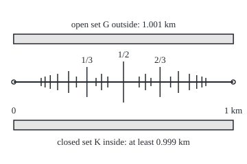
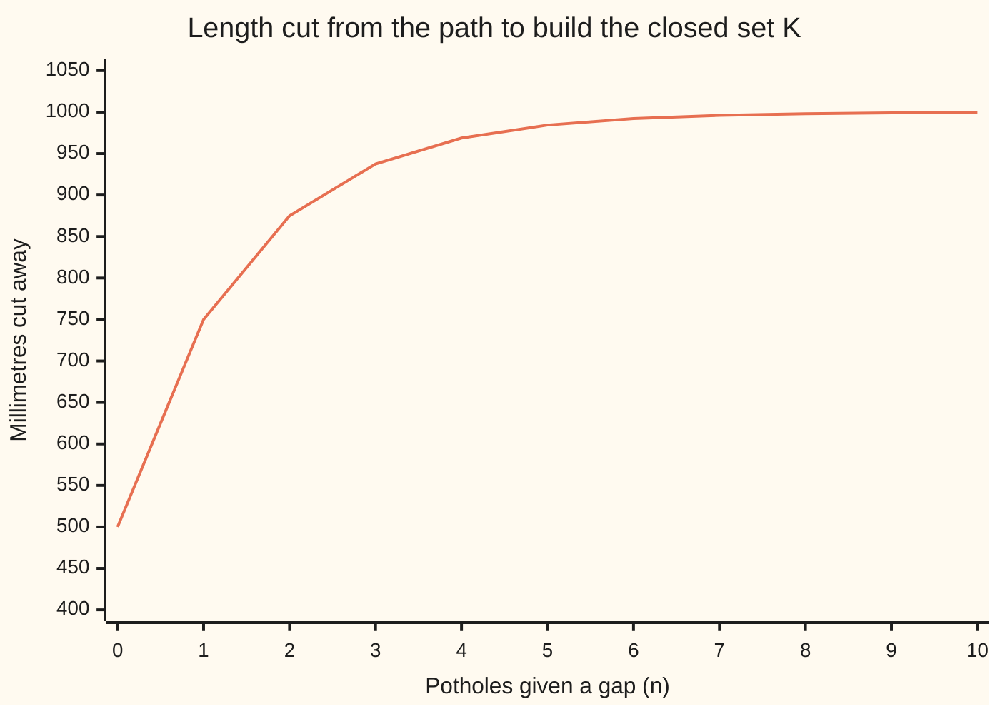

# Lebesgue measure: the length of every Borel set and more, squeezed between open sets outside and closed sets inside

Measure and integration → Length Done Properly → Squeezing a set between open and closed → Lebesgue measure

---

## General Overview

A cycle path runs 1 km, endpoints left out. There is a pothole at every point whose distance from the start is a fraction of a kilometre: half-way, a third of the way, two-thirds, a quarter, and so on for every fraction p/q between 0 and 1. How much smooth path is left?

The old tools give no answer. Every stretch, however short, holds a pothole: between 0.3 and 0.3001 km sits 301/1003. So no interval fits inside the smooth part, and length measured from inside by intervals is 0 km. From outside, any finite set of intervals covering the smooth part has total length at least 1 km. The length behind the Riemann integral stops at that disagreement.

Lebesgue's answer is 1 km, pinned from both sides. An open set of 1.001 km covers the smooth path from outside. A closed set of at least 0.999 km sits inside it, though it contains no interval at all. The slack, 0.001 km, can be made as small as wished. The potholes, infinitely many and everywhere, take up no length.

This card assembles the length rule behind that answer, called **Lebesgue measure** from here on and written $\lambda$ (the Greek letter lambda).

**Lebesgue measure is outer length kept on the sets that split every other set cleanly; it measures every Borel set, squeezes every set it measures between open sets outside and closed sets inside, and is the only measure on Borel sets that gives intervals their lengths.**

**What kind of fact this is:** a definition carrying four theorems (Borel sets are measured; regularity, the squeeze from outside and inside; the completion description; uniqueness), all proved on this card in Why it works.

### The picture: the path, its potholes, and the two squeezing sets

<p align="center"></p>

Drawn to scale: 0 km at 20 px, 1 km at 340 px. The ticks are the 21 potholes whose fraction has a denominator up to 8; taller ticks have smaller denominators. Infinitely many more crowd between every pair. G runs from 19.84 to 340.16 px; K from 20.08 to 339.92 px, with a gap round every pothole, the widest 25 cm. The gaps are too thin to draw: K looks like the whole path and contains no fraction.

---

## The formula

Notation first. $\lambda^*$ is the **outer measure** from [lebesgue-outer-measure](01-lebesgue-outer-measure.md): the cheapest total length of countably many open intervals $(c_k, d_k)$ covering a set. $\mathcal B(\mathbb R)$ is the Borel sets, the smallest sigma-algebra holding every open set (a sigma-algebra: the collection of sets allowed to be measured, closed under complements and countable unions). $\mathcal L$, a script L, is the collection this card calls the **Lebesgue sets**.

$$\lambda^*(E) = \inf\Big\{\sum_{k \ge 1} (d_k - c_k) \;:\; E \subseteq \bigcup_{k \ge 1} (c_k, d_k)\Big\}$$

$$\mathcal L = \big\{E \;:\; \lambda^*(A) = \lambda^*(A \cap E) + \lambda^*(A \setminus E) \text{ for every } A \subseteq \mathbb R\big\}, \qquad \lambda = \lambda^* \text{ kept on } \mathcal L$$

**Read it aloud:** the length of a set is the cheapest way to cover it with open intervals, kept only for the sets that cut every other set into two pieces whose lengths add up.

The four theorems:

$$\text{(i)}\quad \mathcal B(\mathbb R) \subseteq \mathcal L, \qquad \lambda\big((a, b]\big) = b - a$$

$$\text{(ii)}\quad \text{for every } E \in \mathcal L \text{ and } \varepsilon > 0:\ \text{open } G \supseteq E \text{ with } \lambda(G \setminus E) < \varepsilon, \ \text{closed } K \subseteq E \text{ with } \lambda(E \setminus K) < \varepsilon$$

$$\text{(iii)}\quad E \in \mathcal L \iff M \subseteq E \subseteq H \text{ for some Borel } M, H \text{ with } \lambda(H \setminus M) = 0$$

$$\text{(iv)}\quad \mu\big((a, b]\big) = b - a \text{ for all } a < b \implies \mu = \lambda \text{ on } \mathcal B(\mathbb R)$$

**Read them aloud:** every Borel set has a length, and intervals get the usual one; every Lebesgue set sits between an open set and a closed set with as little slack as wished; a Lebesgue set is a Borel set give or take part of a null set; any measure on Borel sets giving intervals their lengths is $\lambda$.

| Symbol | Plain meaning | In our example | Push it up and the answer… |
| --- | --- | --- | --- |
| $\lambda$, $\lambda_n$ | Lebesgue measure; $\lambda_n$ is it kept to the stretch (n, n + 1] | 1 km for the smooth path | — |
| $\lambda^*$ | outer measure: cheapest countable cover by intervals, for every set | 1 km for the smooth path | — |
| $E$, $E_n$ | the set measured, here the smooth path; $E_n$ its part in (n, n + 1] | (0, 1) km minus the fractions | bigger set, bigger length |
| $N$ | the potholes: every fraction p/q in (0, 1) | 1/2, 1/3, 2/3, … | still length 0 |
| $Z$ | a set of outer measure 0 | the potholes | — |
| $G$, $G_n$, $G_m$ | open sets covering $E$ from outside | (−0.0005, 1.0005), 1.001 km | more overhang, more slack |
| $K$, $K_m$ | closed sets inside $E$ | ends trimmed 0.25 m, gaps round every pothole: at least 0.999 km | wider gaps, less length |
| $\varepsilon$, $\delta$ | slack allowed; $\delta$ is spare slack inside a proof | 0.001 km | a looser squeeze |
| $q_k$, $\varepsilon_k$ | the k-th pothole in the list, and the width of its gap | $q_1 = 1/2$ with a 25 cm gap | later gaps halve |
| $c_k$, $d_k$, $a$, $b$, $c$, $d$ | interval ends; $(c_k, d_k)$ is the k-th interval of a cover | (−0.0005, 1.0005) for G | — |
| $k$, $m$, $n$ | counters; $n$ runs over all integers | $k$ = 1 for 1/2 | — |
| $A$, $B$ | a test set to be split; a Borel set | any subset of the line | — |
| $\mathcal B(\mathbb R)$, $\mathcal L$ | Borel sets; Lebesgue sets | the path is in both | — |
| $M$, $H$ | Borel sets squeezing $E$ with a null difference | $H$ = (0, 1) | — |
| $\mu$, $\nu$, $\mu_n$ | other measures set against $\lambda$ | four points: 0.25 each; 0.5 on two | — |

### When it holds

- **Intervals as the starting sizes, on the line.** Area and volume come from products of $\lambda$ ([product-measure](../06-Product%20Measures%20and%20Fubini/02-product-measure.md)); other starting sizes give [lebesgue-stieltjes-measures](06-lebesgue-stieltjes-measures.md).
- **Countable covers, not finite ones.** With finite covers the potholes cost 1 km from outside; with countable covers they cost nothing.
- **Slack measured by the leftover, not the total.** On a set of infinite length, "$\lambda(G)$ within $\varepsilon$ of $\lambda(E)$" says nothing; $\lambda(G \setminus E) < \varepsilon$ still does.
- **Uniqueness needs agreement on a pi-system**, a class closed under overlaps. On four points, two measures agree on {1, 2} and {1, 3} at 0.5 each and give {1} the values 0.25 and 0.5.
- **Not every subset of the line.** Sets outside $\mathcal L$ exist: [translation-invariance-and-the-vitali-set](04-translation-invariance-and-the-vitali-set.md).

---

## Why it works

### Step 0: an interval cut at a point loses no length

Take the whole path, endpoint 1 km included, and cut it at 1/2. The two pieces are 0.5 km each, and they add back to 1 km. Nothing is lost at the cut.

That is the engine. Lebesgue measure covers from outside, and keeps a set exactly when cutting by it loses no length. A half-line cuts every interval of a cover into two intervals whose lengths add, so half-lines are kept. The rest is bookkeeping: which sets follow from half-lines, how tightly a kept set can be squeezed, and why no other length rule can differ.

### Step 1: assemble the measure

[lebesgue-outer-measure](01-lebesgue-outer-measure.md) defines $\lambda^*$ for every subset of the line, shows it grows with the set and is at most the sum over any countable cover, and proves $\lambda^*([a, b]) = b - a$; a single point costs nothing, so $(a, b]$ has the same outer measure. [caratheodory-measurable-sets](02-caratheodory-measurable-sets.md) proves that the sets splitting every test set cleanly form a sigma-algebra on which the outer measure adds over disjoint pieces. For $\lambda^*$ that sigma-algebra is $\mathcal L$ and the measure is $\lambda$.

A set $Z$ of outer measure 0 always splits cleanly: for any test set $A$, the piece inside $Z$ costs 0 and the piece outside costs no more than $A$.

### Step 2: every Borel set is a Lebesgue set

Take the half-line (a, ∞) and any test set $A$. Cover $A$ nearly as cheaply as possible and cut each interval at a. The right-hand pieces cover the part of $A$ in the half-line, the left-hand pieces the rest, and each pair of pieces adds back to its interval, give or take a sliver as small as wished. So the two parts of $A$ cost no more than $A$: the half-line splits it cleanly. $\mathcal L$ is a sigma-algebra, so it holds every set built from half-lines, and that is every Borel set.

<details>
<summary>Detailed proof</summary>

Fix a real a and a test set $A$ with $\lambda^*(A)$ finite (if infinite, the split inequality below is trivial). Fix $\delta > 0$. By the definition of $\lambda^*$, open intervals $(c_k, d_k)$ cover $A$ with $\sum_k (d_k - c_k) \le \lambda^*(A) + \delta$.

Cut each at a. The right piece $(\max(c_k, a), d_k)$ is open, or empty. The left piece $(c_k, \min(d_k, a)]$ lies inside the open interval $(c_k, \min(d_k, a) + \delta 2^{-k})$. When $c_k < a < d_k$ the two lengths sum to $(d_k - a) + (a - c_k) + \delta 2^{-k}$; otherwise one piece is empty. Either way the pair costs at most $d_k - c_k + \delta 2^{-k}$.

The right pieces cover $A \cap (a, \infty)$, the left ones cover $A \setminus (a, \infty)$. By the definition of $\lambda^*$, the two parts' outer measures sum to at most $\lambda^*(A) + 2\delta$. Let $\delta \to 0$; the reverse inequality is subadditivity. So $(a, \infty) \in \mathcal L$.

$\mathcal L$ is a sigma-algebra (Carathéodory card), so it holds $(a, b] = (a, \infty) \setminus (b, \infty)$ and $(a, b) = \bigcup_n (a, b - 1/n]$. Every open set is a countable union of open intervals with rational endpoints, so every open set is in $\mathcal L$, and so is the smallest sigma-algebra holding them, $\mathcal B(\mathbb R)$.

</details>

### Step 3: squeeze from outside by open sets

The definition of $\lambda^*$ already covers from outside by open intervals, and a union of open intervals is open. So a set of finite length has an open set around it with as little to spare as wished. For a set of infinite length, do this separately on each stretch (n, n + 1] with a shrinking share of the slack, and join the results.

On the path, the open set is (−0.0005, 1.0005) km: 1.001 km, of which the two overhangs and the potholes lie outside the smooth path, 0.0005 + 0.0005 + 0 = 0.001 km.

<details>
<summary>Detailed proof</summary>

*Finite length.* Take open intervals $(c_k, d_k)$ covering $E$ with $\sum_k (d_k - c_k) < \lambda(E) + \varepsilon$, and let $G$ be their union. It is open and holds $E$; by subadditivity $\lambda(G) < \lambda(E) + \varepsilon$. Both sets are in $\mathcal L$ and $\lambda(E)$ is finite, so $\lambda(G \setminus E) = \lambda(G) - \lambda(E) < \varepsilon$.

*Any length.* For every integer n, negative ones included, the finite case gives an open $G_n$ holding $E_n = E \cap (n, n + 1]$ with $\lambda(G_n \setminus E_n) < \varepsilon 2^{-|n| - 2}$. Let $G = \bigcup_n G_n$. Then $G \setminus E$ lies inside $\bigcup_n (G_n \setminus E_n)$, so $\lambda(G \setminus E) < \varepsilon (1/4 + 1/4 + 1/4) < \varepsilon$, the three quarters coming from n = 0, the positive n and the negative n.

</details>

### Step 4: squeeze from inside by closed sets

Turn Step 3 inside out. The complement of $E$ is a Lebesgue set, so an open $G$ holds it with less than $\varepsilon$ to spare. Everything outside $G$ is a closed set $K$ inside $E$, and $E$ beyond $K$ is exactly $G$ beyond the complement: less than $\varepsilon$.

On the path the complement is the potholes plus everything outside (0, 1). List the potholes by denominator, $q_1 = 1/2$, $q_2 = 1/3$, $q_3 = 2/3$, $q_4 = 1/4$, and so on, and cut round $q_k$ an open gap of width $\varepsilon_k = 0.0005 \times 2^{-k}$ km: 25 cm, 12.5 cm, 6.25 cm, 3.125 cm, halving each time. Trim 0.25 m from each end as well:

$$K = [0.00025,\ 0.99975] \setminus \bigcup_{k \ge 1} \big(q_k - \tfrac12 \varepsilon_k,\ q_k + \tfrac12 \varepsilon_k\big)$$

It is a closed interval of 0.9995 km with open gaps removed, so closed. Every fraction sits in its own gap, so $K$ lies inside the smooth path. The gaps total at most 0.0005 km, so $K$ has length at least 0.999 km.

<details>
<summary>Detailed proof</summary>

The complement $E^c$ is in $\mathcal L$. Step 3 gives an open $G$ holding $E^c$ with $\lambda(G \setminus E^c) < \varepsilon$. Let $K$ be the complement of $G$: closed, and inside $E$. Then $E \setminus K = E \cap G = G \setminus E^c$, which has length below $\varepsilon$.

Additivity gives $\lambda(E) = \lambda(K) + \lambda(E \setminus K)$. If $\lambda(E)$ is finite, $\lambda(K) > \lambda(E) - \varepsilon$; if infinite, so is $\lambda(K)$. Either way $\lambda(E)$ is the supremum of $\lambda(K)$ over closed $K$ inside $E$, and just as Step 3 makes it the infimum of $\lambda(G)$ over open $G$ holding $E$.

On the path, subadditivity bounds the gaps by $\sum_k 0.0005 \times 2^{-k} = 0.0005$ km, so $\lambda(K) \ge 0.9995 - 0.0005 = 0.999$ km.

</details>

### Step 5: Lebesgue sets are Borel sets up to a null set

Squeeze with slack 1, then 1/2, then 1/3, and so on. The open sets meet in a Borel set $H$ and the closed sets join into a Borel set $M$, with $M \subseteq E \subseteq H$ and $H \setminus M$ smaller than every slack, so of length 0. Conversely, a set trapped like that is a Borel set plus a piece of a null set, and null sets split cleanly (Step 1). So $\mathcal L$ is the **completion** of $\mathcal B(\mathbb R)$ under $\lambda$: the Borel sets with every subset of a Borel null set added, as [null-sets-and-almost-everywhere](../01-Sets%20You%20Can%20Measure/07-null-sets-and-almost-everywhere.md) defines it. On the path, $H$ is (0, 1) and the difference is the potholes.

On four points, with the sets ∅, {1, 2}, {3, 4} and all four, the block {1, 2} of size 0 and {3, 4} of size 2, completion adds the subsets of the null block and nothing else: 4 old sets become 8, and {3} stays out.

<details>
<summary>Detailed proof</summary>

*Forward.* For each m = 1, 2, 3, …, Steps 3 and 4 give open $G_m$ and closed $K_m$ with $K_m \subseteq E \subseteq G_m$ and both leftovers below 1/m. Let $H = \bigcap_m G_m$ and $M = \bigcup_m K_m$, Borel as a countable intersection of open sets and a countable union of closed ones. For each m, $H \setminus M$ lies inside $(G_m \setminus E) \cup (E \setminus K_m)$, of length below 2/m. So $\lambda(H \setminus M) = 0$.

*Backward.* $E \setminus M$ lies inside $H \setminus M$, so its outer measure is 0 and it is in $\mathcal L$ (Step 1). So $E = M \cup (E \setminus M)$ is in $\mathcal L$, with $\lambda(E) = \lambda(M)$.

*Completion.* The completion holds the sets $B \cup Z$ with $B$ Borel and $Z$ inside a Borel null set; such a set is squeezed by $B$ and $B$ joined with that null set. Conversely a squeezed $E$ is $M$ joined with $E \setminus M$, which lies inside the Borel null set $H \setminus M$.

</details>

### Step 6: no other measure on Borel sets gives intervals their lengths

Suppose $\mu$ on $\mathcal B(\mathbb R)$ gives every (a, b] the length b − a. The half-open intervals, with the empty set, form a pi-system: two of them overlap in another or not at all. They generate the Borel sets. On each stretch (n, n + 1] both measures have total 1 and agree on the pi-system, so they agree on every Borel set there, by [pi-systems-and-uniqueness](../01-Sets%20You%20Can%20Measure/06-pi-systems-and-uniqueness.md). The stretches fill the line without overlap, so $\mu = \lambda$.

The overlap rule matters. On four points put 0.25 on each point for $\mu$, and 0.5 on each of 1 and 4 for $\nu$. They agree on {1, 2} and {1, 3}, 0.5 each, and those two sets generate all 16 subsets. On their overlap {1}, $\mu$ gives 0.25 and $\nu$ gives 0.5; they disagree on 10 of the 16.

<details>
<summary>Detailed proof</summary>

Two half-open intervals overlap in $(\max(a, c), \min(b, d)]$ or not at all, so with the empty set they form a pi-system. The sigma-algebra they generate holds each $(a, \infty) = \bigcup_n (a, a + n]$, hence every Borel set by Step 2's argument, and lies inside $\mathcal B(\mathbb R)$: they generate $\mathcal B(\mathbb R)$.

For every integer n, negative ones included, let $\mu_n(B) = \mu(B \cap (n, n + 1])$ and $\lambda_n(B) = \lambda(B \cap (n, n + 1])$. Both are measures of total 1 on $\mathcal B(\mathbb R)$, and they agree on the pi-system, since an interval cut to (n, n + 1] is again one. Finite measures with equal totals that agree on a pi-system agree on what it generates (pi-systems card), so $\mu_n = \lambda_n$. Countable additivity over the disjoint stretches gives $\mu(B) = \sum_n \mu_n(B) = \sum_n \lambda_n(B) = \lambda(B)$.

</details>

The same measure also comes from extending lengths off the finite unions of intervals, [caratheodory-extension-theorem](05-caratheodory-extension-theorem.md), or from the distribution function F(x) = x, [lebesgue-stieltjes-measures](06-lebesgue-stieltjes-measures.md); Step 6 says every route lands on this $\lambda$.

<details>
<summary>Is every Lebesgue set a Borel set?</summary>

No. The Cantor set is closed, of length 0, and as large as the line, so all its subsets are Lebesgue sets by Step 5. A counting argument, not proved here, shows there are only as many Borel sets as real numbers, far fewer than those subsets. See [the-cantor-set](07-the-cantor-set.md).

</details>

---

## Worked numbers, by hand

| Step | Arithmetic | Value |
| --- | --- | --- |
| potholes, in order | fractions p/q in (0, 1) by denominator, then numerator | 1/2, 1/3, 2/3, 1/4, 3/4, 1/5, 2/5, 3/5, … |
| gap round pothole k | 0.0005 km × 2^(−k) | 25, 12.5, 6.25, 3.125 cm, … |
| all gaps together | 0.0005 × (1/2 + 1/4 + …) | at most 0.0005 km |
| length of the potholes | inside the gaps, and the slack can shrink | 0 km |
| outer open set G | (−0.0005, 1.0005) | 1.001 km |
| G beyond the path | 0.0005 + 0.0005 + 0 | 0.001 km |
| ends trimmed | [0.00025, 0.99975] | 0.9995 km |
| inner closed set K | 0.9995 − at most 0.0005 | at least 0.999 km |
| squeeze | 0.999 ≤ length of path ≤ 1.001, for every slack | **1 km** |

The smooth path is 1 km long: the potholes are everywhere and cost nothing, and a closed set with no interval in it still fills all but 0.001 km of the path.

### The picture: the gaps never cost more than their budget

Each gap takes half of what is left of the budget. The chart counts millimetres cut from the kilometre after the two end trims and the first n gaps; it climbs toward one metre, 0.001 km, and never reaches it.



The one line is the total cut: 500 mm for the two end trims, then each gap adding half the distance left to one metre. The code finds the same numbers two ways, by merging the gaps and by the geometric sum.

### What breaks if you drop a piece

| Mistake | Comes out at | What went wrong |
| --- | --- | --- |
| Squeezing from inside by intervals only | 0 km | Every stretch holds a pothole: 301/1003 sits inside (0.3, 0.3001) |
| Flat 0.5 m gaps instead of halving ones | K is 0.989 km after 21 potholes, and empty once every fraction has a gap | Every point lies within 0.25 m of some fraction, so equal gaps cover the whole path |
| Uniqueness checked on {1, 2} and {1, 3} only | {1} gets 0.25 from one measure, 0.5 from the other | The class is not a pi-system; it misses the overlap |
| Completion read as "every subset" | {3} stays out of the 8 completed sets | Only pieces of null sets are added |

The code prints all four.

---

## Code, from first principles, and it actually runs

The code finds the length of the closed set $K$ after its first gaps by three independent roads: sorting and merging the gaps, the geometric sum of their widths, and 200000 random darts from a SplitMix64 generator written out in full. Python uses exact fractions; Rust counts whole units of a small fraction of a kilometre. The code also prints the four failures and builds the four-point completion two ways, by the definition and as the sets whose part in {3, 4} is empty or whole. The darts are themselves fractions with denominator 2^64, so they test the stage of $K$ with 21 gaps, not the path.

The code checks 21 potholes, finite stages of $K$ and four-point examples; that the full $K$ stays above 0.999 km and holds no fraction, and every statement about all Lebesgue sets, only the proof shows.

### Python

```python
# Lebesgue measure -- the check behind the card.  Standard library only.
# The cycle path is the open stretch (0, 1) km with a pothole at every fraction
# p/q strictly between 0 and 1.  Its length is squeezed between an open set
# outside and a closed set inside.  Exact fractions throughout; the darts come
# from SplitMix64, written out below, so the Rust check prints the same bytes.
from fractions import Fraction as Fr

def dec(x, d):                           # exact decimal, rounded half up, for x >= 0
    n = (x.numerator * 10 ** d * 2 + x.denominator) // (2 * x.denominator)
    s = str(n).rjust(d + 1, "0")
    return s[:-d] + "." + s[-d:] if d else s

def potholes(qmax):                      # fractions p/q in (0, 1), lowest terms, by q then p
    return [Fr(p, q) for q in range(2, qmax + 1) for p in range(1, q) if Fr(p, q).denominator == q]

def cuts(eps, n, halving=True):          # open gap k is (eps/2) * 2^-k wide, or eps/2 flat
    ws = [eps / 2 / 2 ** k if halving else eps / 2 for k in range(1, n + 1)]
    return [(q - w / 2, q + w / 2) for q, w in zip(potholes(8)[:n], ws)]

def inner_by_merging(eps, n, halving=True):   # road 1: sort the gaps, merge, subtract
    a, b = eps / 4, 1 - eps / 4
    covered, end = Fr(0), a
    for lo, hi in sorted(cuts(eps, n, halving)):
        lo, hi = max(lo, end), min(hi, b)
        if hi > lo:
            covered += hi - lo
            end = hi
    return (b - a) - covered

def inner_by_formula(eps, n, halving=True):   # road 2: gaps never overlap, so add their widths
    return 1 - eps / 2 - (eps / 2 * (1 - Fr(1, 2 ** n)) if halving else n * eps / 2)

M64 = 2 ** 64 - 1
def splitmix(s):
    s = (s + 0x9E3779B97F4A7C15) & M64
    z = ((s ^ (s >> 30)) * 0xBF58476D1CE4E5B9) & M64
    z = ((z ^ (z >> 27)) * 0x94D049BB133111EB) & M64
    return s, z ^ (z >> 31)

def inner_by_darts(eps, n, draws, seed):      # road 3: dart r / 2^64 in [0, 1); count hits on K_n
    fl = lambda x: x.numerator * 2 ** 64 // x.denominator
    ce = lambda x: -(-x.numerator * 2 ** 64 // x.denominator)
    lo_a, hi_b = ce(eps / 4), fl(1 - eps / 4)
    gaps = [(fl(lo), ce(hi)) for lo, hi in cuts(eps, n)]
    hits, s = 0, seed
    for _ in range(draws):
        s, r = splitmix(s)
        if lo_a <= r <= hi_b and not any(t < r < u for t, u in gaps):
            hits += 1
    return hits

EPS, N, DRAWS, SEED = Fr(1, 1000), 21, 200000, 20260929
Q = potholes(8)
print("Lebesgue measure: the cycle path (0, 1) km minus a pothole at every fraction")
print("potholes, first 8 in order:", " ".join(f"{q.numerator}/{q.denominator}" for q in Q[:8]))
print("potholes with denominator up to 8:", len(Q))
print("gap around pothole k, k = 1..4 (cm):", " ".join(dec(EPS / 2 / 2 ** k * 100000, 3) for k in range(1, 5)))
print(f"outer, G = (-{dec(EPS / 2, 4)}, {dec(1 + EPS / 2, 4)}) km: length {dec(1 + EPS, 3)} km; G minus path {dec(EPS, 3)} km")
print(f"inner, ends trimmed {dec(EPS / 4 * 1000, 2)} m each: [{dec(EPS / 4, 5)}, {dec(1 - EPS / 4, 5)}] = {dec(1 - EPS / 2, 4)} km")
print(f"inner, all gaps together: at most {dec(EPS / 2, 4)} km, so K has length at least {dec(1 - EPS, 3)} km")
print(f"squeeze, eps = {dec(EPS, 3)}: {dec(1 - EPS, 3)} km <= length of path <= {dec(1 + EPS, 3)} km; shrinking eps leaves {dec(Fr(1), 0)} km")
for n in (1, 2, 3, 5, 10, 21):
    m, f = inner_by_merging(EPS, n), inner_by_formula(EPS, n)
    assert m == f, (n, m, f)             # sorted-merge length equals the geometric sum: no gap overlaps
    assert m >= 1 - EPS                  # every stage stays above the proved floor
    print(f"stage n={n}: merging {dec(m, 13)} km, formula {dec(f, 13)} km")
hits = inner_by_darts(EPS, N, DRAWS, SEED)
exact = inner_by_merging(EPS, N)
se = (float(exact) * (1 - float(exact)) / DRAWS) ** 0.5
assert abs(hits / DRAWS - float(exact)) < 4 * se, hits
print(f"darts, {DRAWS} throws, seed {SEED}: {hits} hits, estimate {dec(Fr(hits, DRAWS), 5)} km, standard error {se:.6f}")
cut_mm = [dec((1 - inner_by_merging(EPS, n)) * 1000000, 2) for n in range(11)]
print("chart, mm cut away after n = 0..10 potholes:", " ".join(cut_mm))
px = lambda x: 20 + 320 * x               # the picture: 0 km at x = 20 px, 1 km at x = 340 px
print(f"figure, px: G {dec(px(-EPS / 2), 2)} to {dec(px(1 + EPS / 2), 2)}, K {dec(px(EPS / 4), 2)} to {dec(px(1 - EPS / 4), 2)}, potholes",
      " ".join(dec(px(q), 1) for q in Q))
q = 1
while not 10000 * ((3 * q) // 10 + 1) < 3001 * q:
    q += 1
p = (3 * q) // 10 + 1
inside = lambda a, b: 3 * b < 10 * a and 10000 * a < 3001 * b
assert inside(p, q) and not any(inside(a, b) for b in range(1, q) for a in range(b + 1))
print(f"breaks, intervals only: pothole {p}/{q} sits inside (0.3, 0.3001), so no interval fits and inside length is 0 km")
fm, ff = inner_by_merging(EPS, N, False), inner_by_formula(EPS, N, False)
assert fm == ff
print(f"breaks, flat {dec(EPS / 2 * 1000, 1)} m gaps: {N} potholes cut {dec(N * EPS / 2 * 1000, 1)} m, K is {dec(fm, 3)} km; gap every fraction and K is empty")
mu, nu = [1, 1, 1, 1], [2, 0, 0, 2]      # in quarters: mu 0.25 on each point, nu 0.5 on 1 and 4
size = lambda m, s: Fr(sum(m[i] for i in range(4) if s >> i & 1), 4)
C = [0b0011, 0b0101]                     # {1, 2} and {1, 3}
sig = {0, 15} | set(C)
while True:
    grow = {15 ^ s for s in sig} | {s | t for s in sig for t in sig}
    if grow <= sig:
        break
    sig |= grow
bad = [s for s in sig if size(mu, s) != size(nu, s)]
assert all(size(mu, c) == size(nu, c) for c in C)   # they agree on the class C
assert len(sig) == 16 and len(bad) == 16 - sum([1, 2, 1][a] ** 2 for a in range(3))
print(f"breaks, four points: sigma(C) has {len(sig)} sets; on {{1,2}} and {{1,3}} both give "
      f"{dec(size(mu, 3), 1)}; on {{1}} {dec(size(mu, 1), 2)} vs {dec(size(nu, 1), 1)}; disagree on {len(bad)}")
F = {0: 0, 3: 0, 12: 2, 15: 2}           # blocks {1,2} of size 0 and {3,4} of size 2
nulls = [s for s in F if F[s] == 0]
done, reps = {}, 0
for e in range(16):
    for b, m in F.items():
        if any((e ^ b) & (15 ^ z) == 0 for z in nulls):
            done.setdefault(e, set()).add(m)
            reps += 1
assert sorted(done) == [e for e in range(16) if e & 12 in (0, 12)] and reps == 16
assert all(len(v) == 1 for v in done.values())
print(f"completion, four points: {len(F)} old sets, {len(done)} completed, {reps} representatives, "
      f"{{3}} included: {4 in done}")
t = Fr(1, 100)
print(f"try, eps = {dec(t, 2)}: stage n=21 closed set {dec(inner_by_merging(t, N), 13)} km, floor {dec(1 - t, 2)} km")
print("All checks passed.")
```

**Ran 2026-09-29 on macOS, Python 3.14.6, standard library only. All checks passed. Output, pasted from the run:**

```
Lebesgue measure: the cycle path (0, 1) km minus a pothole at every fraction
potholes, first 8 in order: 1/2 1/3 2/3 1/4 3/4 1/5 2/5 3/5
potholes with denominator up to 8: 21
gap around pothole k, k = 1..4 (cm): 25.000 12.500 6.250 3.125
outer, G = (-0.0005, 1.0005) km: length 1.001 km; G minus path 0.001 km
inner, ends trimmed 0.25 m each: [0.00025, 0.99975] = 0.9995 km
inner, all gaps together: at most 0.0005 km, so K has length at least 0.999 km
squeeze, eps = 0.001: 0.999 km <= length of path <= 1.001 km; shrinking eps leaves 1 km
stage n=1: merging 0.9992500000000 km, formula 0.9992500000000 km
stage n=2: merging 0.9991250000000 km, formula 0.9991250000000 km
stage n=3: merging 0.9990625000000 km, formula 0.9990625000000 km
stage n=5: merging 0.9990156250000 km, formula 0.9990156250000 km
stage n=10: merging 0.9990004882813 km, formula 0.9990004882813 km
stage n=21: merging 0.9990000002384 km, formula 0.9990000002384 km
darts, 200000 throws, seed 20260929: 199809 hits, estimate 0.99905 km, standard error 0.000071
chart, mm cut away after n = 0..10 potholes: 500.00 750.00 875.00 937.50 968.75 984.38 992.19 996.09 998.05 999.02 999.51
figure, px: G 19.84 to 340.16, K 20.08 to 339.92, potholes 180.0 126.7 233.3 100.0 260.0 84.0 148.0 212.0 276.0 73.3 286.7 65.7 111.4 157.1 202.9 248.6 294.3 60.0 140.0 220.0 300.0
breaks, intervals only: pothole 301/1003 sits inside (0.3, 0.3001), so no interval fits and inside length is 0 km
breaks, flat 0.5 m gaps: 21 potholes cut 10.5 m, K is 0.989 km; gap every fraction and K is empty
breaks, four points: sigma(C) has 16 sets; on {1,2} and {1,3} both give 0.5; on {1} 0.25 vs 0.5; disagree on 10
completion, four points: 4 old sets, 8 completed, 16 representatives, {3} included: False
try, eps = 0.01: stage n=21 closed set 0.9900000023842 km, floor 0.99 km
All checks passed.
```

### Rust

```rust
// Lebesgue measure -- the check behind the card.  Rust std only.
// The cycle path is the open stretch (0, 1) km with a pothole at every fraction
// p/q strictly between 0 and 1.  Every length is an exact integer count of
// 1/D km, with D = 840 * 4000 * 2^22, so each pothole and gap edge is a whole
// count.  The darts come from the same SplitMix64 as the Python check.
use std::collections::{BTreeMap, BTreeSet};

const D: i128 = 840 * 4000 * (1 << 22);

fn dec(num: i128, den: i128, d: u32) -> String { // exact decimal, rounded half up
    let n = (num * 10i128.pow(d) * 2 + den) / (2 * den);
    let s = format!("{:0>w$}", n, w = d as usize + 1);
    let k = s.len() - d as usize;
    if d == 0 { s } else { format!("{}.{}", &s[..k], &s[k..]) }
}
fn gcd(a: i128, b: i128) -> i128 { if b == 0 { a } else { gcd(b, a % b) } }
fn potholes() -> Vec<(i128, i128)> {             // p/q in lowest terms, by q then p
    let mut v = Vec::new();
    for q in 2..=8 { for p in 1..q { if gcd(p, q) == 1 { v.push((p, q)); } } }
    v
}
// eps = 1/e km.  Gap k is (eps/2) * 2^-k wide, or eps/2 wide when flat.
fn cuts(e: i128, n: usize, halving: bool) -> Vec<(i128, i128)> {
    potholes().iter().take(n).enumerate().map(|(i, &(p, q))| {
        let half = if halving { D / (4 * e) >> (i + 1) } else { D / (4 * e) };
        (D * p / q - half, D * p / q + half)
    }).collect()
}
fn inner_by_merging(e: i128, n: usize, halving: bool) -> i128 { // road 1
    let (a, b) = (D / (4 * e), D - D / (4 * e));
    let mut c = cuts(e, n, halving);
    c.sort();
    let (mut covered, mut end) = (0, a);
    for (lo, hi) in c {
        let (lo, hi) = (lo.max(end), hi.min(b));
        if hi > lo { covered += hi - lo; end = hi; }
    }
    (b - a) - covered
}
fn inner_by_formula(e: i128, n: usize, halving: bool) -> i128 { // road 2
    let half = D / (2 * e);
    D - half - if halving { half - (half >> n) } else { n as i128 * half }
}
fn splitmix(s: &mut u64) -> u64 {
    *s = s.wrapping_add(0x9E3779B97F4A7C15);
    let mut z = *s;
    z = (z ^ (z >> 30)).wrapping_mul(0xBF58476D1CE4E5B9);
    z = (z ^ (z >> 27)).wrapping_mul(0x94D049BB133111EB);
    z ^ (z >> 31)
}
fn inner_by_darts(e: i128, n: usize, draws: u32, seed: u64) -> u32 { // road 3
    let fl = |x: i128| ((x as u128) << 64) / D as u128;
    let ce = |x: i128| (((x as u128) << 64) + D as u128 - 1) / D as u128;
    let (lo_a, hi_b) = (ce(D / (4 * e)), fl(D - D / (4 * e)));
    let gaps: Vec<(u128, u128)> = cuts(e, n, true).iter().map(|&(l, h)| (fl(l), ce(h))).collect();
    let (mut hits, mut s) = (0, seed);
    for _ in 0..draws {
        let r = splitmix(&mut s) as u128;
        if lo_a <= r && r <= hi_b && !gaps.iter().any(|&(t, u)| t < r && r < u) { hits += 1; }
    }
    hits
}
fn main() {
    let (e, n, draws, seed) = (1000i128, 21usize, 200000u32, 20260929u64);
    let q = potholes();
    println!("Lebesgue measure: the cycle path (0, 1) km minus a pothole at every fraction");
    let first: Vec<String> = q[..8].iter().map(|(p, q)| format!("{}/{}", p, q)).collect();
    println!("potholes, first 8 in order: {}", first.join(" "));
    println!("potholes with denominator up to 8: {}", q.len());
    let g: Vec<String> = (1..5).map(|k| dec(100000, 2 * e * (1 << k), 3)).collect();
    println!("gap around pothole k, k = 1..4 (cm): {}", g.join(" "));
    println!("outer, G = (-{}, {}) km: length {} km; G minus path {} km",
        dec(1, 2 * e, 4), dec(2 * e + 1, 2 * e, 4), dec(e + 1, e, 3), dec(1, e, 3));
    println!("inner, ends trimmed {} m each: [{}, {}] = {} km",
        dec(1000, 4 * e, 2), dec(1, 4 * e, 5), dec(4 * e - 1, 4 * e, 5), dec(2 * e - 1, 2 * e, 4));
    println!("inner, all gaps together: at most {} km, so K has length at least {} km",
        dec(1, 2 * e, 4), dec(e - 1, e, 3));
    println!("squeeze, eps = {}: {} km <= length of path <= {} km; shrinking eps leaves {} km",
        dec(1, e, 3), dec(e - 1, e, 3), dec(e + 1, e, 3), dec(1, 1, 0));
    for &k in &[1usize, 2, 3, 5, 10, 21] {
        let (m, f) = (inner_by_merging(e, k, true), inner_by_formula(e, k, true));
        assert_eq!(m, f);                        // no two gaps overlap
        assert!(m * e >= D * (e - 1));           // above the proved floor 1 - eps
        println!("stage n={}: merging {} km, formula {} km", k, dec(m, D, 13), dec(f, D, 13));
    }
    let hits = inner_by_darts(e, n, draws, seed);
    let exact = inner_by_merging(e, n, true) as f64 / D as f64;
    let se = (exact * (1.0 - exact) / draws as f64).sqrt();
    assert!((hits as f64 / draws as f64 - exact).abs() < 4.0 * se);
    println!("darts, {} throws, seed {}: {} hits, estimate {} km, standard error {:.6}",
        draws, seed, hits, dec(hits as i128, draws as i128, 5), se);
    let mm: Vec<String> = (0..11).map(|k| dec((D - inner_by_merging(e, k, true)) * 1000000, D, 2)).collect();
    println!("chart, mm cut away after n = 0..10 potholes: {}", mm.join(" "));
    let fig: Vec<String> = q.iter().map(|&(p, q)| dec(20 * q + 320 * p, q, 1)).collect(); // 0 km at 20 px, 1 km at 340 px
    println!("figure, px: G {} to {}, K {} to {}, potholes {}", dec(40 * e - 320, 2 * e, 2), dec(680 * e + 320, 2 * e, 2),
        dec(80 * e + 320, 4 * e, 2), dec(1360 * e - 320, 4 * e, 2), fig.join(" "));
    let mut d = 1i128;
    while !(10000 * ((3 * d) / 10 + 1) < 3001 * d) { d += 1; }
    let p = (3 * d) / 10 + 1;
    let inside = |a: i128, b: i128| 3 * b < 10 * a && 10000 * a < 3001 * b;
    assert!(inside(p, d) && !(1..d).any(|b| (0..=b).any(|a| inside(a, b))));
    println!("breaks, intervals only: pothole {}/{} sits inside (0.3, 0.3001), so no interval fits and inside length is 0 km", p, d);
    let (fm, ff) = (inner_by_merging(e, n, false), inner_by_formula(e, n, false));
    assert_eq!(fm, ff);
    println!("breaks, flat {} m gaps: {} potholes cut {} m, K is {} km; gap every fraction and K is empty",
        dec(1000, 2 * e, 1), n, dec(1000 * n as i128, 2 * e, 1), dec(fm, D, 3));
    let (mu, nu) = ([1i128, 1, 1, 1], [2i128, 0, 0, 2]); // in quarters
    let size = |m: &[i128; 4], s: u8| (0..4).filter(|i| s >> i & 1 == 1).map(|i| m[i]).sum::<i128>();
    let mut sig: BTreeSet<u8> = [0u8, 15, 0b0011, 0b0101].iter().copied().collect();
    loop {
        let mut grow: BTreeSet<u8> = sig.iter().map(|s| 15 ^ s).collect();
        for s in &sig { for t in &sig { grow.insert(s | t); } }
        if grow.is_subset(&sig) { break; }
        sig.extend(grow);
    }
    let bad = sig.iter().filter(|&&s| size(&mu, s) != size(&nu, s)).count();
    assert!([3u8, 5].iter().all(|&c| size(&mu, c) == size(&nu, c))); // they agree on the class C
    assert!(sig.len() == 16 && bad == 16 - [1usize, 2, 1].iter().map(|c| c * c).sum::<usize>());
    println!("breaks, four points: sigma(C) has {} sets; on {{1,2}} and {{1,3}} both give {}; on {{1}} {} vs {}; disagree on {}",
        sig.len(), dec(size(&mu, 3), 4, 1), dec(size(&mu, 1), 4, 2), dec(size(&nu, 1), 4, 1), bad);
    let f: BTreeMap<u8, i128> = [(0u8, 0i128), (3, 0), (12, 2), (15, 2)].iter().copied().collect();
    let nulls: Vec<u8> = f.iter().filter(|(_, &m)| m == 0).map(|(&s, _)| s).collect();
    let mut done: BTreeMap<u8, BTreeSet<i128>> = BTreeMap::new();
    let mut reps = 0;
    for x in 0u8..16 {
        for (&b, &m) in &f {
            if nulls.iter().any(|z| (x ^ b) & (15 ^ z) == 0) { done.entry(x).or_default().insert(m); reps += 1; }
        }
    }
    let two_block: Vec<u8> = (0u8..16).filter(|x| x & 12 == 0 || x & 12 == 12).collect();
    assert!(done.keys().copied().collect::<Vec<u8>>() == two_block && reps == 16);
    assert!(done.values().all(|v| v.len() == 1));
    println!("completion, four points: {} old sets, {} completed, {} representatives, {{3}} included: {}",
        f.len(), done.len(), reps, if done.contains_key(&4) { "True" } else { "False" });
    println!("try, eps = {}: stage n=21 closed set {} km, floor {} km",
        dec(1, 100, 2), dec(inner_by_merging(100, n, true), D, 13), dec(99, 100, 2));
    println!("All checks passed.");
}
```

**Ran 2026-10-06 on macOS, rustc 1.98.1, no crates. All checks passed. Output, pasted from the run:**

```
Lebesgue measure: the cycle path (0, 1) km minus a pothole at every fraction
potholes, first 8 in order: 1/2 1/3 2/3 1/4 3/4 1/5 2/5 3/5
potholes with denominator up to 8: 21
gap around pothole k, k = 1..4 (cm): 25.000 12.500 6.250 3.125
outer, G = (-0.0005, 1.0005) km: length 1.001 km; G minus path 0.001 km
inner, ends trimmed 0.25 m each: [0.00025, 0.99975] = 0.9995 km
inner, all gaps together: at most 0.0005 km, so K has length at least 0.999 km
squeeze, eps = 0.001: 0.999 km <= length of path <= 1.001 km; shrinking eps leaves 1 km
stage n=1: merging 0.9992500000000 km, formula 0.9992500000000 km
stage n=2: merging 0.9991250000000 km, formula 0.9991250000000 km
stage n=3: merging 0.9990625000000 km, formula 0.9990625000000 km
stage n=5: merging 0.9990156250000 km, formula 0.9990156250000 km
stage n=10: merging 0.9990004882813 km, formula 0.9990004882813 km
stage n=21: merging 0.9990000002384 km, formula 0.9990000002384 km
darts, 200000 throws, seed 20260929: 199809 hits, estimate 0.99905 km, standard error 0.000071
chart, mm cut away after n = 0..10 potholes: 500.00 750.00 875.00 937.50 968.75 984.38 992.19 996.09 998.05 999.02 999.51
figure, px: G 19.84 to 340.16, K 20.08 to 339.92, potholes 180.0 126.7 233.3 100.0 260.0 84.0 148.0 212.0 276.0 73.3 286.7 65.7 111.4 157.1 202.9 248.6 294.3 60.0 140.0 220.0 300.0
breaks, intervals only: pothole 301/1003 sits inside (0.3, 0.3001), so no interval fits and inside length is 0 km
breaks, flat 0.5 m gaps: 21 potholes cut 10.5 m, K is 0.989 km; gap every fraction and K is empty
breaks, four points: sigma(C) has 16 sets; on {1,2} and {1,3} both give 0.5; on {1} 0.25 vs 0.5; disagree on 10
completion, four points: 4 old sets, 8 completed, 16 representatives, {3} included: False
try, eps = 0.01: stage n=21 closed set 0.9900000023842 km, floor 0.99 km
All checks passed.
```

The two outputs are identical, byte for byte.

> [!TIP]
> **Try changing**
> - **Guess first:** with a slack of 0.01 km instead of 0.001, how long is the closed set after 21 potholes? Change `t` in the last lines, or set `EPS = Fr(1, 100)`. Answer: 0.9900000023842 km, above its floor of 0.99 km.
> - **Guess first:** what happens to the floor check if the gaps stop halving? Pass `False` as the last argument to both roads in the stage loop. Answer: the roads still agree with each other, and the floor assert fails at stage n=2, since two flat gaps and the end trims already cut more than the slack.
> - **Guess first:** if $\nu$ puts 0.25 on every point, like $\mu$, do the two measures still disagree anywhere? Set `nu` to `[1, 1, 1, 1]`. Answer: they agree on every set, and the assert expecting 10 disagreements fails, as it should.
> - **Guess first:** does a different seed move the dart estimate far? Change `SEED`. Answer: the hit count moves by a few tens; the estimate stays within four standard errors of 0.000071 of the exact length.

---

## The usual mistake

> [!warning]
> **Reading "length 0" as "few points" or "nowhere".** The potholes are infinitely many and sit in every stretch of the path, however short, yet their length is 0 km. Length counts room, not points: countably many points can be packed into gaps of total width as small as wished.
>
> - **Squeezing from inside with open sets.** The smooth path holds no interval, so the only open set inside it is empty: 0 km. Inside needs closed sets.
> - **Stating regularity as "total within ε".** On a set of infinite length the totals say nothing; the leftover $\lambda(G \setminus E)$ is what shrinks.
> - **Taking Lebesgue sets to be Borel sets.** Completion adds every subset of every Borel null set; most subsets of the Cantor set are Lebesgue sets and not Borel.
> - **Taking every subset to be a Lebesgue set.** In the four-point completion {3} stays out; on the line the Vitali set stays out.

---

## Where you meet it in real life

- **A number drawn uniformly from 0 to 1.** Lebesgue measure on [0, 1] is the uniform law. The chance that the draw is a fraction is the length of the potholes: 0.
- **Monte Carlo estimates.** Throwing random points and counting hits estimates a length, an area or a probability; here 199809 hits of 200000 estimate 0.99905 km with a standard error of 0.000071.
- **Pixels and sampled regions.** Up to any slack, a set of finite length is a finite union of intervals: take the open set of Step 3, a countable union of intervals, and keep enough of them. So a measurable region can be drawn in pixels with as small an error as wished.
- **A coin tossed forever.** The binary digits of a uniform draw from [0, 1] are fair coin tosses, so $\lambda$ on [0, 1] is the law of an infinite coin sequence: [infinite-sequences-and-kolmogorov-extension](../06-Product%20Measures%20and%20Fubini/07-infinite-sequences-and-kolmogorov-extension.md).

> **Say it back**
> Lebesgue measure is the cheapest countable cover by intervals, kept on the sets that split every other set without losing length. An interval cut at a point keeps its length, so half-lines split cleanly and every Borel set is measured. Every measured set sits between an open set and a closed set with as little slack as wished, so it is a Borel set give or take part of a null set. Intervals form a pi-system, so no other measure on Borel sets gives them their lengths. The path with a pothole at every fraction is 1 km, squeezed between 1.001 km and 0.999 km.

---

## What this builds on

- [caratheodory-measurable-sets](02-caratheodory-measurable-sets.md): the clean-split test, and the proof that the sets passing it form a sigma-algebra on which outer measure adds.
- [pi-systems-and-uniqueness](../01-Sets%20You%20Can%20Measure/06-pi-systems-and-uniqueness.md): two finite measures agreeing on a pi-system agree on what it generates, used in Step 6.
- [null-sets-and-almost-everywhere](../01-Sets%20You%20Can%20Measure/07-null-sets-and-almost-everywhere.md): null sets and the completion of a measure, which Step 5 identifies with the Lebesgue sets.

## Where this goes next

- [translation-invariance-and-the-vitali-set](04-translation-invariance-and-the-vitali-set.md): sliding a set keeps its length, and that forces a set with no length at all.
- [the-cantor-set](07-the-cantor-set.md): a closed set of length 0 with as many points as the line.
- [product-measure](../06-Product%20Measures%20and%20Fubini/02-product-measure.md): area and volume as products of $\lambda$.
- [infinite-sequences-and-kolmogorov-extension](../06-Product%20Measures%20and%20Fubini/07-infinite-sequences-and-kolmogorov-extension.md): $\lambda$ on [0, 1] as a coin tossed forever.
- [lebesgue-differentiation-theorem](../11-Derivatives%20Meet%20the%20Lebesgue%20Integral/02-lebesgue-differentiation-theorem.md): averages over shrinking intervals recover a function at almost every point, with regularity doing the covering.
- hardy-littlewood-maximal-function: the largest local average, bounded through $\lambda$ of the set where it is big.
- calderon-zygmund-decomposition-in-outline: splitting a function by cutting the line into intervals measured by $\lambda$.
- restriction-and-kakeya-in-outline: how small a set can be while holding a segment in every direction, measured by $\lambda$ in the plane.

Every Borel set now has a length, and so does everything a null set away from one; whether every subset of the line has one is what [translation-invariance-and-the-vitali-set](04-translation-invariance-and-the-vitali-set.md) settles, and the answer is no.

---

## Sources

Verified 2026-09-29: every link below resolves to the publisher's or author's page.

- Axler, Sheldon. *Measure, Integration & Real Analysis*. Springer, open access. [Author's page](https://measure.axler.net/). Builds outer measure and Lebesgue measure, with approximation by open and closed sets, in its chapter on measures; free and complete.
- Tao, Terence. *An Introduction to Measure Theory*. American Mathematical Society, 2011. [Author's page](https://terrytao.wordpress.com/books/an-introduction-to-measure-theory/). Defines a Lebesgue set by the open-outside squeeze of Step 3 and proves the closed-inside one.
- Folland, Gerald B. *Real Analysis: Modern Techniques and Their Applications*, 2nd ed. Wiley, 1999. [Publisher page](https://www.wiley.com/en-us/Real+Analysis%3A+Modern+Techniques+and+Their+Applications%2C+2nd+Edition-p-9780471317166). Borel measures on the line, regularity, and completion, as in Steps 3 to 5.
- Billingsley, Patrick. *Probability and Measure*, Anniversary Edition. Wiley, 2012. [Publisher page](https://www.wiley.com/en-us/Probability+and+Measure%2C+Anniversary+Edition-p-9781118122372). Uniqueness of measures from a pi-system, and Lebesgue measure on the unit interval as the law of a uniform draw.
