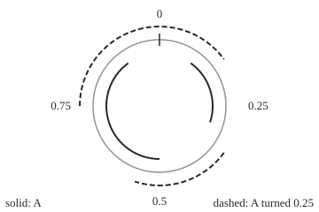
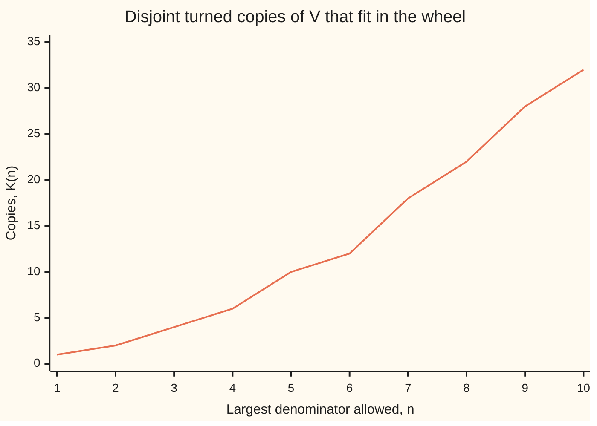

# Translation invariance and the Vitali set: sliding never changes length, and that rule alone forces some set to have no length at all

[Syllabus](../../../SYLLABUS.md) → [Measure and integration](../../../SYLLABUS.md#w10) → [Length Done Properly](../../../SYLLABUS.md#w10-s02) → Translation invariance and the Vitali set

---

## General Overview

A roulette wheel has a rim of circumference 1. Mark one point on the rim as 0 and name every other point by how far round it sits, clockwise: a number from 0 up to, but not including, 1. Paint two arcs, from 0.1 to 0.3 and from 0.5 to 0.9. The paint covers length 0.2 + 0.4 = 0.6. Turn the wheel a quarter, by 0.25. The paint now sits from 0.35 to 0.55, from 0.75 round to the mark, and from the mark to 0.15. Three pieces instead of two, and still length 0.6.

Sliding a set never changes its length. That rule is called **translation invariance** (a translation is a slide). Stretching a set by a factor multiplies its length by the size of that factor (−2 counts as 2). Lebesgue measure, the careful notion of length built on this shelf, obeys both rules for every set it measures.

Can every set of points on the rim get a length that obeys the sliding rule and adds up over infinitely many separate pieces? Giuseppe Vitali showed in 1905 that it cannot. Put two points in the same group when the gap between them is a fraction (a rational number, such as 1/4 or 3/7). Choose one point from every group. Turn the chosen set by every fraction from 0 up to 1. The copies are countably many (they can be listed one after another), never overlap, and cover the rim exactly once. The rim has length 1. Copies of length 0 add to 0; copies of any positive length add to infinity. No number works.

So Lebesgue measure cannot be defined on every set of points. It lives on a restricted collection, a sigma-algebra (the collection of sets we allow ourselves to measure): the measurable sets of [Caratheodory's criterion](02-caratheodory-measurable-sets.md). That restriction is forced, not fussy.

**Length that ignores sliding and adds up over countably many pieces cannot be given to every set: a set chosen one point per group of rational rotations tiles the wheel with countably many equal copies, and no length fits.**

**What kind of fact this is:** two theorems, both proved on this card in Why it works: the slide and stretch rules, and the non-measurability of the chosen set, which rests on the axiom of choice.

### The picture: one set, turned a quarter

<p align="center"></p>

The faint circle is the rim, drawn to scale; positions run clockwise from the tick at 0. The solid inner arcs are the painted set, 0.1 to 0.3 and 0.5 to 0.9. The dashed outer arcs are the same set turned by 0.25. The long dashed arc crosses the mark at 0, so as a set of positions it is two pieces, 0.75 to 1 and 0 to 0.15. Total length on both rings: 0.6.

---

## The formula

Notation first, in words. $\lambda$ is Lebesgue measure: the length of a Lebesgue-measurable set ([Lebesgue measure](03-lebesgue-measure.md)). $\lambda^*$ is outer measure: the smallest total length of countably many intervals that cover a set, defined for every set ([Outer measure](01-lebesgue-outer-measure.md)). For a set $E$ and a number $t$, $E + t$ is every point of $E$ moved $t$ to the right: "E slid by t". For a number $c$, $cE$ is every point of $E$ multiplied by $c$: "E stretched by c".

$$\lambda(E + t) = \lambda(E), \qquad \lambda(cE) = |c|\,\lambda(E)$$

**Read it aloud:** sliding a set leaves its length alone; stretching it by c multiplies its length by the size of c, sign ignored.

Both rules also hold for $\lambda^*$ on every set, measurable or not.

On the wheel, $E \oplus q$ means $E$ turned by $q$: add $q$ to each point and drop a whole turn if the sum reaches 1. $\mathbb{Q}$ is the set of rational numbers, the fractions. Write $x \sim y$, "x and y are in the same group", when $x - y$ is rational. The **Vitali set** $V$ holds exactly one point of each group. Then

$$[0,1) = \bigcup_{q \in \mathbb{Q} \cap [0,1)} (V \oplus q), \quad \text{the copies pairwise disjoint}, \quad\text{so}\quad 1 = \sum_{q \in \mathbb{Q} \cap [0,1)} \lambda(V) \ \text{ if } V \text{ were measurable.}$$

**Read it aloud:** the chosen set, turned by every fraction, fills the wheel without overlap, so its length added to itself infinitely often would have to make 1.

That last sum is 0 when $\lambda(V) = 0$ and infinite when $\lambda(V) > 0$. It is never 1. So $V$ has no length.

| Symbol | Plain meaning | In our example | Push it up and the answer… |
| --- | --- | --- | --- |
| $\lambda$, $\mu$ | Lebesgue measure, length for measurable sets; $\mu$ a general measure in the tip | 0.6 for the painted set | — |
| $\lambda^*$, $\ell$ | outer measure: cheapest cover by intervals, for any set; $\ell$ an interval's length | positive for $V$ (Step 6) | — |
| $E$, $A$, $T$, $E_1$, $E_2$ | sets of points: $A$ painted, $T$ a test set, $E_1$ and $E_2$ the parts of $E$ before and after the cut at $1 - q$ | $A$ = 0.1 to 0.3 with 0.5 to 0.9 | more points, more length |
| $t$ | slide amount | 0.25 | length unchanged |
| $c$ | stretch factor, any nonzero number | 3 and −2 | length grows with the size of $c$ |
| $E + t$, $cE$ | the slid set, the stretched set | $A$ stretched by 3 has length 1.8 | — |
| $E \oplus q$ | $E$ turned round the wheel by $q$ | $A \oplus 0.25$, length 0.6 | length unchanged |
| $q$, $\mathbb{Q}$, $Q_1$ | a rational turn; all fractions; the fractions in [0, 1) | $q$ = 0.25 | — |
| $x \sim y$, $y$ | x and y differ by a fraction: same group | 0.1 and 0.35 | — |
| $V$, $v$ | the Vitali set: one chosen point per group; $v$ one of its points | not computable; described only | — |
| $K(n)$, $n$, $m$ | how many distinct fractions in [0, 1) have denominator at most n; $m$ a whole number of copies | $K(10)$ = 32 | bound $1/K(n)$ on $\lambda(V)$ falls |

### When it holds

- **The slide and stretch rules** hold for every set's outer measure and every measurable set, with $c$ any nonzero number. At $c = 0$ a non-empty set collapses to the point 0, of length 0.
- **Countable additivity.** The Vitali argument adds infinitely many copies. With only finite additivity (lengths add for finitely many separate pieces), Stefan Banach showed in 1923 that a slide-proof length exists on every subset of the line. No contradiction then.
- **The sliding rule itself.** Drop it and every set can be measured: the point mass at 0 gives a set size 1 if it contains 0, and 0 if not. It is a measure, but it is not length.
- **The axiom of choice.** $V$ needs one point picked from each of uncountably many groups with no rule to pick by. Robert Solovay showed in 1970 that, keeping only a weaker form of choice and assuming it is consistent that an inaccessible cardinal exists (a size of infinity too large for the usual axioms to reach), no such set can be proved to exist.
- **A wheel of positive, finite length.** The zero measure (every set has size 0) measures everything and ignores sliding; the argument needs the whole wheel to have length 1.

---

## Why it works

### Step 0: covers slide with the set

Outer measure is built from covers: countably many intervals whose union contains the set. Slide a cover with its set and it still covers, at the same cost; stretch it and the cost scales by $|c|$. That gives the two rules. Vitali's argument then turns the sliding rule against countable additivity, using a set that tiles the wheel with countably many equal copies.

### Step 1: outer measure ignores slides and scales with stretches

A cover of $E$, slid by $t$, covers $E + t$ at the same cost, so $\lambda^*(E + t) \le \lambda^*(E)$. Sliding back by $-t$ gives the reverse. A stretch by $c$ multiplies every interval's length by $|c|$, and stretching back by $1/c$ gives the reverse inequality.

### Step 2: measurable sets stay measurable

Carathéodory's test asks that every test set $T$ split cleanly across $E$: the outer measures of its part inside $E$ and its part outside add back to $\lambda^*(T)$. To test $E + t$, slide the test set back by $t$, test it against $E$, and slide the two pieces forward; Step 1 says no slide changes their outer measures. Stretches work the same way.

### Step 3: turning the wheel keeps length

Turning by $q$ is a slide with one cut. The part of $E$ before position $1 - q$ slides forward by $q$. The part from $1 - q$ on slides by $q - 1$, past the mark to the start of the wheel. The two slid parts land in $[q, 1)$ and $[0, q)$, so they do not overlap. Each keeps its length, and the lengths add back to $\lambda(E)$. The painted set shows it: 0.2 + 0.25 + 0.15 = 0.6. The same holds for outer measure of any set, because $[0, 1 - q)$ passes Carathéodory's test.

### Step 4: the groups

The relation $x \sim y$ is reflexive ($x - x = 0$), symmetric and transitive (a sum of two fractions is a fraction). So the groups partition the wheel ([Equivalence relations and partitions](../../01-Foundations/08-Relations%20and%20Functions/06-equivalence-relations-and-partitions.md)). The group of $x$ is $x$ turned by every rational amount, so each group is countable. The wheel is uncountable, and countably many countable groups would make it countable ([Countable sets](../../01-Foundations/09-Sizes%20of%20Infinity/02-countable-sets.md)). So there are uncountably many groups.

### Step 5: choose one point per group, then turn

The axiom of choice supplies a set $V$ with exactly one point from each group ([The axiom of choice](../../01-Foundations/09-Sizes%20of%20Infinity/05-axiom-of-choice.md)); no formula names the points. Turn $V$ by each rational $q$ in $[0, 1)$. Every point of the wheel lands in some copy: its group's chosen point differs from it by a fraction. No point lands in two copies: two chosen points reaching it would differ by a fraction, so share a group, so be the same point.

### Step 6: no length fits

Suppose $V$ were measurable. By Step 3 every copy has length $\lambda(V)$. Countable additivity then says $1 = \lambda(V) + \lambda(V) + \dots$, countably infinitely many terms. If $\lambda(V) = 0$ the right side is 0. If $\lambda(V) > 0$ it is infinite. Either way it is not 1. So $V$ is not measurable. It is not small, either: the copies cover the wheel, so $1 \le \lambda^*(V) + \lambda^*(V) + \dots$, which forces $\lambda^*(V) > 0$.

A second road to $\lambda(V) = 0$, the one the code prints: the fractions in $[0, 1)$ with denominator at most $n$ are $K(n)$ in number, and turning $V$ by each gives $K(n)$ disjoint copies inside the wheel. So $K(n)\,\lambda(V) \le 1$. At $n = 10$, $K(10)$ = 32 and $\lambda(V) \le 0.03125$. At $n = 100$, 3044 copies force $\lambda(V) \le 0.000329$. $K(n)$ grows without bound, so $\lambda(V) = 0$, and the full countable union then has length 0, not 1.

<details>
<summary>Detailed proof</summary>

**Theorem 1.** For every $E \subseteq \mathbb{R}$, every real $t$ and every $c \ne 0$: $\lambda^*(E+t) = \lambda^*(E)$ and $\lambda^*(cE) = |c|\,\lambda^*(E)$. If $E$ is Lebesgue measurable, so are $E + t$ and $cE$, and the same equalities hold for $\lambda$.

*Proof.* (1) By definition $\lambda^*(E) = \inf \{ \sum_k \ell(I_k) : E \subseteq \bigcup_k I_k \}$ over countable families of open intervals, $\ell$ the length. If $E \subseteq \bigcup_k I_k$ then $E + t \subseteq \bigcup_k (I_k + t)$ and $\ell(I_k + t) = \ell(I_k)$, since $(a,b) + t = (a+t, b+t)$. Taking the infimum, $\lambda^*(E+t) \le \lambda^*(E)$. Applied to $E + t$ and $-t$: $\lambda^*(E) \le \lambda^*(E+t)$.
(2) For $c \ne 0$, $c \cdot I_k$ is an open interval of length $|c|\,\ell(I_k)$, and $cE \subseteq \bigcup_k c \cdot I_k$. So $\lambda^*(cE) \le |c|\,\lambda^*(E)$. Applied to $cE$ and $1/c$: $\lambda^*(E) \le |1/c|\,\lambda^*(cE)$. Multiply by $|c|$.
(3) Let $E$ satisfy Carathéodory's criterion and $T$ be any set. Then $T \cap (E + t) = ((T - t) \cap E) + t$ and $T \setminus (E+t) = ((T - t) \setminus E) + t$. By (1) and the criterion for $E$ with test set $T - t$: $\lambda^*(T \cap (E+t)) + \lambda^*(T \setminus (E+t)) = \lambda^*((T-t) \cap E) + \lambda^*((T-t) \setminus E) = \lambda^*(T - t) = \lambda^*(T)$. The same computation with $T/c$ in place of $T - t$ and (2) handles $cE$; the factor $|c|$ appears on both sides and cancels. ∎

**Lemma (rotation).** For $E \subseteq [0,1)$ and $q \in [0,1)$ let $E \oplus q = \{ x + q - \lfloor x + q \rfloor : x \in E \}$. Then $\lambda^*(E \oplus q) = \lambda^*(E)$, and $E \oplus q$ is measurable when $E$ is.

*Proof.* Put $E_1 = E \cap [0, 1-q)$ and $E_2 = E \cap [1-q, 1)$. Then $E \oplus q = (E_1 + q) \cup (E_2 + q - 1)$, with $E_1 + q \subseteq [q, 1)$ and $E_2 + q - 1 \subseteq [0, q)$. Intervals are measurable, so Carathéodory's criterion with test set $E$ and the measurable set $[0, 1-q)$ gives $\lambda^*(E) = \lambda^*(E_1) + \lambda^*(E_2)$. With test set $E \oplus q$ and the measurable set $[q, 1)$ it gives $\lambda^*(E \oplus q) = \lambda^*(E_1 + q) + \lambda^*(E_2 + q - 1)$. By Theorem 1 the right sides agree. If $E$ is measurable, $E_1$, $E_2$ are, so their slides are (Theorem 1), and so is their union. ∎

**Theorem 2 (Vitali).** Assume the axiom of choice. There is a set $V \subseteq [0,1)$ that is not Lebesgue measurable, and $\lambda^*(V) > 0$.

*Proof.* (1) The relation $x \sim y \iff x - y \in \mathbb{Q}$ on $[0,1)$ is reflexive, symmetric and transitive, since $\mathbb{Q}$ contains 0 and is closed under negation and addition. Its classes partition $[0,1)$.
(2) By the axiom of choice there is a function picking one member from each class; let $V$ be its set of values. Let $Q_1 = \mathbb{Q} \cap [0,1)$, a countable set.
(3) Cover: for $y \in [0,1)$ let $v \in V$ be the chosen member of its class. Then $y - v \in \mathbb{Q} \cap (-1, 1)$; put $q = y - v$ if this is $\ge 0$ and $q = y - v + 1$ otherwise. Then $q \in Q_1$ and $y = v \oplus q$.
(4) Disjoint: if $v \oplus q = w \oplus r$ with $v, w \in V$ and $q, r \in Q_1$, then $v - w - (r - q)$ is an integer, so $v - w \in \mathbb{Q}$, so $v \sim w$; one member per class gives $v = w$; then $q - r$ is an integer in $(-1,1)$, so $q = r$.
(5) Suppose $V$ measurable. By the Lemma each $V \oplus q$ is measurable with $\lambda(V \oplus q) = \lambda(V)$. By (3), (4) and countable additivity, $1 = \lambda([0,1)) = \sum_{q \in Q_1} \lambda(V)$. $Q_1$ is infinite, so the sum is $0$ if $\lambda(V) = 0$ and $+\infty$ if $\lambda(V) > 0$. Contradiction.
(6) By (3), countable subadditivity of $\lambda^*$ and the Lemma, $1 \le \sum_{q \in Q_1} \lambda^*(V \oplus q) = \sum_{q \in Q_1} \lambda^*(V)$, so $\lambda^*(V) > 0$. ∎

</details>

<details>
<summary>Why length is the only slide-proof candidate</summary>

Suppose a measure $\mu$ on the Borel sets ignores slides and gives $[0,1)$ the value 1. The interval $[0,1)$ is $n$ slid copies of $[0, 1/n)$ laid end to end, so $\mu([0,1/n)) = 1/n$. Then $m$ copies give $\mu([0, m/n)) = m/n$, and any interval $[a, b)$ is squeezed between intervals with rational ends, so $\mu([a,b)) = b - a$. The line is countably many slid copies of $[0,1)$, each of size 1. On each copy, $\mu$ and $\lambda$ have the same finite total and agree on the half-open intervals inside it, a family closed under overlaps, so they agree on every Borel set in that copy ([Pi-systems and Dynkin's theorem](../01-Sets%20You%20Can%20Measure/06-pi-systems-and-uniqueness.md)); adding over the copies, they agree on every Borel set. So the sliding rule does not merely hold for length; it pins length down.

</details>

Another road, on the line instead of the wheel: slide $V$ by every rational in $[-1, 1]$. The copies are disjoint, they all lie in $[-1, 2)$, and they cover $[0, 1)$. A measurable $V$ would give $1 \le \lambda(V) + \lambda(V) + \dots \le 3$, again impossible.

---

## Worked numbers, by hand

| Step | Arithmetic | Value |
| --- | --- | --- |
| 1. Length of the painted set $A$ | (0.3 − 0.1) + (0.9 − 0.5) = 0.2 + 0.4 | 0.6 |
| 2. Turn by 0.25: first arc | 0.1 to 0.3 becomes 0.35 to 0.55 | 0.2 |
| 3. Second arc crosses the mark | 0.5 to 0.9 becomes 0.75 to 1, then 0 to 0.15 | 0.25 + 0.15 |
| 4. Length after turning | 0.2 + 0.25 + 0.15 | 0.6 |
| 5. Stretch by 3 | 0.3 to 0.9 and 1.5 to 2.7: 0.6 + 1.2 | 1.8 = 3 × 0.6 |
| 6. Stretch by −2 | −0.6 to −0.2 and −1.8 to −1: 0.4 + 0.8 | 1.2 = 2 × 0.6, the size of −2 times the length |
| 7. Fractions in [0, 1) with denominator at most 10 | 1 + 1 + 2 + 2 + 4 + 2 + 6 + 4 + 6 + 4 | 32 copies of $V$ fit |
| 8. Most length $V$ could have | 1 / 32 | 0.03125 |
| 9. Denominators up to 100 | 3044 copies fit; 1 / 3044 | 0.000329 |
| 10. The bound keeps falling | measurable $V$ would need length 0; its copies then add to 0 | **0, not 1: $V$ has no length** |

Row 7 adds, for each denominator 1 to 10, the numerators that share no factor with it (Euler's totient). On the wheel: a fair spin has no probability of stopping in $V$. The question "how likely" has no answer for that set.

### What breaks if you drop a piece

| Mistake | Comes out at | What went wrong |
| --- | --- | --- |
| Only finitely many turns: a 360-position wheel turned in steps of 30 | a choice set of 30 points, size 0.0833; 12 copies total exactly 1 | nothing breaks, because 12 copies of 1/12 make 1; Vitali's contradiction needs infinitely many copies |
| A measure that ignores the sliding rule: point mass at 0 | $V$ gets 1, $V$ turned by 30 gets 0; the copies total 1 | every set gets a size, but it is not length |
| Give $V$ the size 0.001 | the copies pass 1 after 1001 of them, then grow without bound | any positive size times infinitely many copies is infinite |
| Give $V$ the size 0 | the copies total 0 after one million of them | 0 + 0 + … never reaches 1 |
| Stretch by −2 using $c$ instead of its size | −1.2 | a length cannot be negative; the true value is 1.2 |

The finite wheel mirrors Vitali's construction: 30 groups of 12 points, one chosen per group, and two different choices both tile it. The contradiction needs infinitely many turns.

---

## Code, from first principles, and it actually runs

The scripts measure the painted set before and after turning and stretching by two roads (merging exact intervals; counting grid cells of width 1/400), tile a finite 360-position wheel with two choice sets, count the fractions with denominator at most 10 and 100 by two roads (listing distinct fractions; summing Euler's totient from a sieve), and print what sizes 0.1, 0.01, 0.001 and 0 would add to. Python uses exact fractions; Rust works in whole twentieths. **What the code shows:** instances, a finite analogue and a shrinking bound. **What only the proof shows:** the rules for every set, and that $V$ has no length; $V$ itself cannot be listed by any program, so the code never pretends to build it.

### Python

```python
# Translation invariance and the Vitali set: what a computer can check.
# Road 1 merges exact intervals; road 2 counts grid cells. Road 1 counts
# distinct fractions; road 2 sums Euler's totient from a sieve.
from fractions import Fraction as F
from math import sin, cos, pi

def length_by_merging(pieces):          # pieces: list of [a, b) with exact ends
    total, reach = F(0), None
    for a, b in sorted(pieces):
        if reach is None or a >= reach:
            total += b - a; reach = b
        elif b > reach:
            total += b - reach; reach = b
    return total

def length_by_grid(pieces, n=400):      # count cells of width 1/n whose midpoint is inside
    lo = min(min(a, b) for a, b in pieces); hi = max(max(a, b) for a, b in pieces)
    hits = 0
    for k in range(int(lo * n) - 1, int(hi * n) + 1):
        mid = F(2 * k + 1, 2 * n)
        if any(min(a, b) <= mid < max(a, b) for a, b in pieces): hits += 1
    return F(hits, n)

def rotate(pieces, q):                  # slide round the wheel, cutting at the seam 0
    out = []
    for a, b in pieces:
        a2, b2 = a + q, b + q
        if b2 <= 1: out.append((a2, b2))
        elif a2 >= 1: out.append((a2 - 1, b2 - 1))
        else: out += [(a2, F(1)), (F(0), b2 - 1)]
    return out

def show(pieces, l="[", r=")"): return " ".join(f"{l}{float(a):g},{float(b):g}{r}" for a, b in pieces)
A = [(F(1, 10), F(3, 10)), (F(1, 2), F(9, 10))]
lenA = length_by_merging(A)
print(f"set A {show(A)}, length by merging {float(lenA):g}, by grid {float(length_by_grid(A)):g}")
R = rotate(A, F(1, 4))
print(f"A rotated by 0.25: {show(R)}, length by merging {float(length_by_merging(R)):g}, by grid {float(length_by_grid(R)):g}")
assert length_by_grid(A) == lenA and length_by_grid(R) == lenA
spread = {length_by_grid(rotate(A, F(k, 20))) for k in range(20)}
print(f"A rotated by k/20, k = 0..19: {len(spread)} distinct length(s), {float(min(spread)):g} to {float(max(spread)):g}")
assert spread == {lenA}
S3 = [(3 * a, 3 * b) for a, b in A]
print(f"A stretched by 3: {show(S3)}, length {float(length_by_merging(S3)):g} = 3 x {float(lenA):g}")
assert length_by_grid(S3) == 3 * length_by_grid(A)
Sm = [(-2 * b, -2 * a) for a, b in A]
print(f"A stretched by -2: {show(Sm, "(", "]")}, length {float(length_by_merging(Sm)):g}; c times length gives {float(-2 * lenA):g}")
assert length_by_merging(Sm) == length_by_grid(Sm) == 2 * lenA

# A finite wheel of 360 positions and 12 rotations (steps of 30): choice sets tile it.
N, STEP = 360, 30
for name, pick in (("smallest in each group", lambda r: r), ("scrambled choice", lambda r: r + STEP * ((7 * r) % 12))):
    V = [pick(r) for r in range(STEP)]
    cover = [0] * N
    for j in range(N // STEP):
        for v in V: cover[(v + STEP * j) % N] += 1
    assert all(c == 1 for c in cover)
    print(f"finite wheel, {name}: {len(V)} points, size {len(V) / N:.4f}, 12 copies cover every position exactly {min(cover)} time(s), total {12 * F(len(V), N)}")
V = list(range(STEP))
d0 = [1 if 0 in {(v + STEP * j) % N for v in V} else 0 for j in range(12)]
print(f"point mass at 0: gives V {d0[0]}, V rotated by 30 {d0[1]}, sum over 12 copies {sum(d0)}")

# The real wheel: rational rotations with denominator <= n that fit as disjoint copies.
def by_fractions(n): return len({F(a, d) for d in range(1, n + 1) for a in range(d)})
def by_totient(n):
    phi = list(range(n + 1))
    for p in range(2, n + 1):
        if phi[p] == p:
            for m in range(p, n + 1, p): phi[m] -= phi[m] // p
    return sum(phi[1:])
for n in list(range(1, 11)) + [100]:
    k1, k2 = by_fractions(n), by_totient(n)
    assert k1 == k2
    print(f"denominators <= {n}: {k1} disjoint copies of V fit, so a measurable V would have length <= 1/{k1} = {1 / k1:.6f}")

# Any positive size c: total of the copies passes 1; size 0: total stays 0.
for num, den in ((1, 10), (1, 100), (1, 1000)):
    c, total, copies = F(num, den), F(0), 0
    while total <= 1: total += c; copies += 1
    assert copies == den // num + 1
    print(f"size {float(c):g}: total passes 1 after {copies} copies, and grows without bound")
print(f"size 0: total after 1000000 copies {sum(F(0) for _ in range(10 ** 6))}")

# figure: wheel of radius 75 at (180,120); A on radius 60, A rotated by 0.25 on radius 90.
def pt(r, x): return f"({180 + r * sin(2 * pi * x):.1f},{120 - r * cos(2 * pi * x):.1f})"
for r, arcs in ((60, [(0.1, 0.3), (0.5, 0.9)]), (90, [(0.35, 0.55), (0.75, 1.15)])):
    print("figure," + ",".join(f" r={r} arc {a:g}-{b:g} from {pt(r, a)} to {pt(r, b)}" for a, b in arcs))
```

**Ran 2026-10-06 on macOS, Python 3.14.6, standard library only. All checks passed. Output, pasted from the run:**

```
set A [0.1,0.3) [0.5,0.9), length by merging 0.6, by grid 0.6
A rotated by 0.25: [0.35,0.55) [0.75,1) [0,0.15), length by merging 0.6, by grid 0.6
A rotated by k/20, k = 0..19: 1 distinct length(s), 0.6 to 0.6
A stretched by 3: [0.3,0.9) [1.5,2.7), length 1.8 = 3 x 0.6
A stretched by -2: (-0.6,-0.2] (-1.8,-1], length 1.2; c times length gives -1.2
finite wheel, smallest in each group: 30 points, size 0.0833, 12 copies cover every position exactly 1 time(s), total 1
finite wheel, scrambled choice: 30 points, size 0.0833, 12 copies cover every position exactly 1 time(s), total 1
point mass at 0: gives V 1, V rotated by 30 0, sum over 12 copies 1
denominators <= 1: 1 disjoint copies of V fit, so a measurable V would have length <= 1/1 = 1.000000
denominators <= 2: 2 disjoint copies of V fit, so a measurable V would have length <= 1/2 = 0.500000
denominators <= 3: 4 disjoint copies of V fit, so a measurable V would have length <= 1/4 = 0.250000
denominators <= 4: 6 disjoint copies of V fit, so a measurable V would have length <= 1/6 = 0.166667
denominators <= 5: 10 disjoint copies of V fit, so a measurable V would have length <= 1/10 = 0.100000
denominators <= 6: 12 disjoint copies of V fit, so a measurable V would have length <= 1/12 = 0.083333
denominators <= 7: 18 disjoint copies of V fit, so a measurable V would have length <= 1/18 = 0.055556
denominators <= 8: 22 disjoint copies of V fit, so a measurable V would have length <= 1/22 = 0.045455
denominators <= 9: 28 disjoint copies of V fit, so a measurable V would have length <= 1/28 = 0.035714
denominators <= 10: 32 disjoint copies of V fit, so a measurable V would have length <= 1/32 = 0.031250
denominators <= 100: 3044 disjoint copies of V fit, so a measurable V would have length <= 1/3044 = 0.000329
size 0.1: total passes 1 after 11 copies, and grows without bound
size 0.01: total passes 1 after 101 copies, and grows without bound
size 0.001: total passes 1 after 1001 copies, and grows without bound
size 0: total after 1000000 copies 0
figure, r=60 arc 0.1-0.3 from (215.3,71.5) to (237.1,138.5), r=60 arc 0.5-0.9 from (180.0,180.0) to (144.7,71.5)
figure, r=90 arc 0.35-0.55 from (252.8,172.9) to (152.2,205.6), r=90 arc 0.75-1.15 from (90.0,120.0) to (252.8,67.1)
```

### Rust

```rust
// Translation invariance and the Vitali set: what a computer can check.
// Exact work in whole units: interval ends in twentieths, the grid in 400ths.
// Road 1 merges intervals; road 2 counts grid cells. Road 1 counts distinct
// reduced fractions; road 2 sums Euler's totient from a sieve.
use std::collections::HashSet;

fn gcd(a: i64, b: i64) -> i64 { if b == 0 { a.abs() } else { gcd(b, a % b) } }

fn length_by_merging(pieces: &[(i64, i64)]) -> i64 { // ends in twentieths, [a, b)
    let mut p = pieces.to_vec();
    p.sort();
    let (mut total, mut reach) = (0, i64::MIN);
    for (a, b) in p {
        if a >= reach { total += b - a; reach = b; }
        else if b > reach { total += b - reach; reach = b; }
    }
    total
}

fn length_by_grid(pieces: &[(i64, i64)]) -> i64 { // cells of width 1/400 = 1/20 of a twentieth
    let lo = pieces.iter().map(|p| p.0.min(p.1)).min().unwrap() * 20;
    let hi = pieces.iter().map(|p| p.0.max(p.1)).max().unwrap() * 20;
    let mut hits = 0;
    for k in (lo - 1)..(hi + 1) {
        let mid = 2 * k + 1; // midpoint in 800ths; an end a/20 is 40a/800
        if pieces.iter().any(|&(a, b)| 40 * a.min(b) <= mid && mid < 40 * a.max(b)) { hits += 1; }
    }
    hits // in 400ths
}

fn rotate(pieces: &[(i64, i64)], q: i64) -> Vec<(i64, i64)> { // wheel of 20 twentieths
    let mut out = vec![];
    for &(a, b) in pieces {
        let (a2, b2) = (a + q, b + q);
        if b2 <= 20 { out.push((a2, b2)); }
        else if a2 >= 20 { out.push((a2 - 20, b2 - 20)); }
        else { out.push((a2, 20)); out.push((0, b2 - 20)); }
    }
    out
}

fn tw(x: i64) -> f64 { x as f64 / 20.0 }
fn show(p: &[(i64, i64)], l: &str, r: &str) -> String {
    p.iter().map(|&(a, b)| format!("{}{},{}{}", l, tw(a), tw(b), r)).collect::<Vec<_>>().join(" ")
}

fn by_fractions(n: i64) -> usize {
    let mut seen = HashSet::new();
    for d in 1..=n { for a in 0..d { let g = gcd(a, d); seen.insert((a / g, d / g)); } }
    seen.len()
}

fn by_totient(n: usize) -> usize {
    let mut phi: Vec<usize> = (0..=n).collect();
    for p in 2..=n {
        if phi[p] == p { let mut m = p; while m <= n { phi[m] -= phi[m] / p; m += p; } }
    }
    phi[1..].iter().sum()
}

fn pt(r: f64, x: f64) -> String {
    let t = 2.0 * std::f64::consts::PI * x;
    format!("({:.1},{:.1})", 180.0 + r * t.sin(), 120.0 - r * t.cos())
}

fn main() {
    let a = vec![(2, 6), (10, 18)];
    let len_a = length_by_merging(&a);
    println!("set A {}, length by merging {}, by grid {}", show(&a, "[", ")"), tw(len_a), length_by_grid(&a) as f64 / 400.0);
    let r = rotate(&a, 5);
    println!("A rotated by 0.25: {}, length by merging {}, by grid {}", show(&r, "[", ")"), tw(length_by_merging(&r)), length_by_grid(&r) as f64 / 400.0);
    assert!(length_by_grid(&a) == 20 * len_a && length_by_grid(&r) == 20 * len_a);
    let spread: HashSet<i64> = (0..20).map(|k| length_by_grid(&rotate(&a, k))).collect();
    let (mn, mx) = (*spread.iter().min().unwrap(), *spread.iter().max().unwrap());
    println!("A rotated by k/20, k = 0..19: {} distinct length(s), {} to {}", spread.len(), mn as f64 / 400.0, mx as f64 / 400.0);
    assert!(spread.len() == 1 && mn == 20 * len_a);
    let s3: Vec<(i64, i64)> = a.iter().map(|&(x, y)| (3 * x, 3 * y)).collect();
    println!("A stretched by 3: {}, length {} = 3 x {}", show(&s3, "[", ")"), tw(length_by_merging(&s3)), tw(len_a));
    assert!(length_by_grid(&s3) == 3 * length_by_grid(&a));
    let sm: Vec<(i64, i64)> = a.iter().map(|&(x, y)| (-2 * y, -2 * x)).collect();
    println!("A stretched by -2: {}, length {}; c times length gives {}", show(&sm, "(", "]"), tw(length_by_merging(&sm)), tw(-2 * len_a));
    assert!(length_by_merging(&sm) == 2 * len_a && length_by_grid(&sm) == 40 * len_a);

    // A finite wheel of 360 positions and 12 rotations (steps of 30): choice sets tile it.
    let (n, step) = (360usize, 30usize);
    let picks: [(&str, fn(usize) -> usize); 2] = [("smallest in each group", |r| r), ("scrambled choice", |r| r + 30 * ((7 * r) % 12))];
    for (name, pick) in picks.iter() {
        let v: Vec<usize> = (0..step).map(|r| pick(r)).collect();
        let mut cover = vec![0; n];
        for j in 0..n / step { for &x in &v { cover[(x + step * j) % n] += 1; } }
        assert!(cover.iter().all(|&c| c == 1));
        let g = gcd((12 * v.len()) as i64, n as i64);
        let (tn, td) = ((12 * v.len()) as i64 / g, n as i64 / g);
        let total = if td == 1 { format!("{}", tn) } else { format!("{}/{}", tn, td) };
        println!("finite wheel, {}: {} points, size {:.4}, 12 copies cover every position exactly {} time(s), total {}",
            name, v.len(), v.len() as f64 / n as f64, cover.iter().min().unwrap(), total);
    }
    let d0: Vec<u32> = (0..12).map(|j| if (0..step).any(|x| (x + step * j) % n == 0) { 1 } else { 0 }).collect();
    println!("point mass at 0: gives V {}, V rotated by 30 {}, sum over 12 copies {}", d0[0], d0[1], d0.iter().sum::<u32>());

    // The real wheel: rational rotations with denominator <= n that fit as disjoint copies.
    for m in (1..=10).chain(std::iter::once(100)) {
        let (k1, k2) = (by_fractions(m as i64), by_totient(m));
        assert_eq!(k1, k2);
        println!("denominators <= {}: {} disjoint copies of V fit, so a measurable V would have length <= 1/{} = {:.6}", m, k1, k1, 1.0 / k1 as f64);
    }

    // Any positive size c: total of the copies passes 1; size 0: total stays 0.
    for (num, den) in [(1i64, 10i64), (1, 100), (1, 1000)] {
        let (mut total, mut copies) = (0i64, 0i64); // total in units of 1/den
        while total <= den { total += num; copies += 1; }
        assert_eq!(copies, den / num + 1);
        println!("size {}: total passes 1 after {} copies, and grows without bound", num as f64 / den as f64, copies);
    }
    let zero: i64 = (0..1_000_000).map(|_| 0i64).sum();
    println!("size 0: total after 1000000 copies {}", zero);

    // figure: wheel of radius 75 at (180,120); A on radius 60, A rotated by 0.25 on radius 90.
    for (rad, arcs) in [(60.0, [(0.1, 0.3), (0.5, 0.9)]), (90.0, [(0.35, 0.55), (0.75, 1.15)])] {
        let parts: Vec<String> = arcs.iter().map(|&(x, y)| format!(" r={} arc {}-{} from {} to {}", rad, x, y, pt(rad, x), pt(rad, y))).collect();
        println!("figure,{}", parts.join(","));
    }
}
```

**Ran 2026-10-06 on macOS, rustc 1.98.1, no crates. All checks passed. Output, pasted from the run:**

```
set A [0.1,0.3) [0.5,0.9), length by merging 0.6, by grid 0.6
A rotated by 0.25: [0.35,0.55) [0.75,1) [0,0.15), length by merging 0.6, by grid 0.6
A rotated by k/20, k = 0..19: 1 distinct length(s), 0.6 to 0.6
A stretched by 3: [0.3,0.9) [1.5,2.7), length 1.8 = 3 x 0.6
A stretched by -2: (-0.6,-0.2] (-1.8,-1], length 1.2; c times length gives -1.2
finite wheel, smallest in each group: 30 points, size 0.0833, 12 copies cover every position exactly 1 time(s), total 1
finite wheel, scrambled choice: 30 points, size 0.0833, 12 copies cover every position exactly 1 time(s), total 1
point mass at 0: gives V 1, V rotated by 30 0, sum over 12 copies 1
denominators <= 1: 1 disjoint copies of V fit, so a measurable V would have length <= 1/1 = 1.000000
denominators <= 2: 2 disjoint copies of V fit, so a measurable V would have length <= 1/2 = 0.500000
denominators <= 3: 4 disjoint copies of V fit, so a measurable V would have length <= 1/4 = 0.250000
denominators <= 4: 6 disjoint copies of V fit, so a measurable V would have length <= 1/6 = 0.166667
denominators <= 5: 10 disjoint copies of V fit, so a measurable V would have length <= 1/10 = 0.100000
denominators <= 6: 12 disjoint copies of V fit, so a measurable V would have length <= 1/12 = 0.083333
denominators <= 7: 18 disjoint copies of V fit, so a measurable V would have length <= 1/18 = 0.055556
denominators <= 8: 22 disjoint copies of V fit, so a measurable V would have length <= 1/22 = 0.045455
denominators <= 9: 28 disjoint copies of V fit, so a measurable V would have length <= 1/28 = 0.035714
denominators <= 10: 32 disjoint copies of V fit, so a measurable V would have length <= 1/32 = 0.031250
denominators <= 100: 3044 disjoint copies of V fit, so a measurable V would have length <= 1/3044 = 0.000329
size 0.1: total passes 1 after 11 copies, and grows without bound
size 0.01: total passes 1 after 101 copies, and grows without bound
size 0.001: total passes 1 after 1001 copies, and grows without bound
size 0: total after 1000000 copies 0
figure, r=60 arc 0.1-0.3 from (215.3,71.5) to (237.1,138.5), r=60 arc 0.5-0.9 from (180.0,180.0) to (144.7,71.5)
figure, r=90 arc 0.35-0.55 from (252.8,172.9) to (152.2,205.6), r=90 arc 0.75-1.15 from (90.0,120.0) to (252.8,67.1)
```

The two outputs are identical line for line.



The one line is $K(n)$, the number of distinct fractions in [0, 1) with denominator at most $n$. A measurable $V$ would have length at most $1/K(n)$, so the climb of this line is the fall of that bound.

> [!TIP]
> **Try changing**
> - **Turn by a different amount.** Guess first: does any turn $k/20$ change the length? Change the range in the `spread` line. Answer: the line reports 1 distinct length, 0.6, for all twenty turns.
> - **Choose differently.** Guess first: does a stranger choice still tile the finite wheel? Replace the 7 in the scrambled choice by any whole number. Answer: every position is still covered exactly once, because any choice of one point per group works.
> - **Forget the seam.** Guess first: what happens if `rotate` keeps only the first piece of an arc that crosses the mark? Delete the second piece. Answer: the grid assert fails, because the turned set has lost length 0.15.

---

## The usual mistake

> [!warning]
> **Reading "not measurable" as "length zero".** $V$ is not a thin set. Its outer measure is positive (Step 6), and yet no single number can serve as its length. Countable additivity breaks on its copies: their outer measures add to infinity while their union has length 1. The Cantor set ([The Cantor set](07-the-cantor-set.md)) is the opposite case: uncountable, measurable, length 0.
>
> - **Blaming the rationals.** The fractions in [0, 1) form a measurable set of length 0. The trouble is the chosen set, not the fractions used to turn it.
> - **Expecting to compute $V$.** No program lists it and no formula defines it; the axiom of choice guarantees it exists and says nothing more.
> - **Stretching with a sign.** Stretching by −2 flips the set; its length is 1.2, not −1.2.
> - **Taking the sigma-algebra for paperwork.** Measuring every set is not a convenience given up for tidiness. It is impossible, and this card is the proof.

---

## Where you meet it in real life

- **Probability on a spinner.** A fair spin of the wheel is Lebesgue measure on [0, 1). The event "the spin stops in $V$" has no probability, which is why every probability model states which events it measures: a sigma-algebra, the collection of sets it allows itself to measure ([Caratheodory's criterion](02-caratheodory-measurable-sets.md)).
- **The Banach–Tarski paradox.** A solid ball can be cut into five pieces and reassembled, by rotations and slides alone, into two balls of the original size. The pieces are chosen with the axiom of choice and have no volume, exactly as $V$ has no length.
- **Foundations of mathematics.** Analysts keep the axiom of choice and pay with sets like $V$; in Solovay's model, without full choice, every set of reals is measurable.

> **Say it back**
> Sliding a set leaves its length unchanged, and stretching multiplies its length by the size of the stretch. On a wheel of circumference 1, group points that differ by a fraction and choose one from each group. The chosen set, turned by every fraction, covers the wheel with countably many non-overlapping copies of equal length. Their lengths would have to add to 1, but equal lengths added infinitely often give 0 or infinity. So some sets have no length, and measure must be restricted to a sigma-algebra.

---

## What this builds on

- [Lebesgue measure](03-lebesgue-measure.md): the measure whose slide rule this card proves, and its countable additivity.
- [The axiom of choice](../../01-Foundations/09-Sizes%20of%20Infinity/05-axiom-of-choice.md): the axiom that picks one point per group.
- [Equivalence relations and partitions](../../01-Foundations/08-Relations%20and%20Functions/06-equivalence-relations-and-partitions.md): why the groups cover the wheel without overlapping.
- [Countable sets](../../01-Foundations/09-Sizes%20of%20Infinity/02-countable-sets.md): the fractions can be listed; the groups cannot.

## Where this goes next

- [Caratheodory's extension theorem](05-caratheodory-extension-theorem.md): builds a measure from its values on intervals, on the sigma-algebra this card shows is needed.
- [Distribution functions and Lebesgue-Stieltjes measures](06-lebesgue-stieltjes-measures.md): lengths that do change under sliding, weighted by a distribution function.
- [The Cantor set](07-the-cantor-set.md): an uncountable set that is measurable and has length 0.

Once some sets must go unmeasured, the question is how to build a measure on the sets that remain from nothing more than the lengths of intervals, and [Caratheodory's extension theorem](05-caratheodory-extension-theorem.md) answers it.

---

## Sources

Verified 2026-09-29: every link below resolves to the publisher's page.

- Axler, Sheldon. *Measure, Integration & Real Analysis*. Springer, Graduate Texts in Mathematics 282, 2020. [Publisher page](https://link.springer.com/book/10.1007/978-3-030-33143-6); free edition at [measure.axler.net](https://measure.axler.net/). Chapter 2 proves that outer measure is not additive and that no slide-proof measure exists on every subset of the line.
- Folland, Gerald B. *Real Analysis: Modern Techniques and Their Applications*, 2nd ed. Wiley, 1999. [Publisher page](https://www.wiley.com/en-us/Real+Analysis%3A+Modern+Techniques+and+Their+Applications%2C+2nd+Edition-p-9780471317166). Section 1.1 gives the rational-rotation construction on the circle as the reason for sigma-algebras.
- Solovay, Robert M. "A Model of Set-Theory in Which Every Set of Reals is Lebesgue Measurable." *Annals of Mathematics* 92 (1970), 1–56. [doi:10.2307/1970696](https://doi.org/10.2307/1970696). Shows the axiom of choice cannot be dropped from Vitali's construction.
