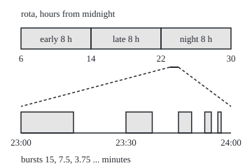
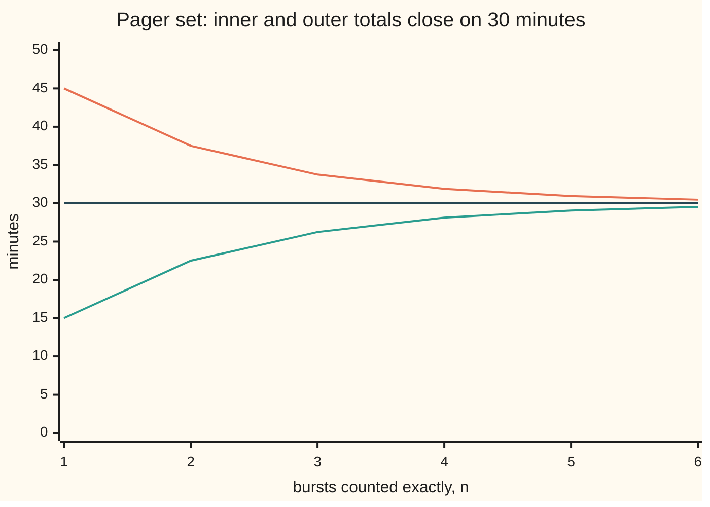

# Caratheodory's extension theorem: size the simple sets consistently and a measure on the generated sigma-algebra follows, unique when sigma-finite

Measure and integration → Length Done Properly → From premeasure to measure → Caratheodory's extension theorem

---

## General Overview

A rota has three shifts: early from 06:00 to 14:00, late from 14:00 to 22:00, night from 22:00 to 06:00 the next morning. Count hours from midnight, so night runs from hour 22 to hour 30. Each shift includes its start and excludes its end, so the handover instant 14:00 belongs to late alone. Every shift lasts 8 hours, and durations add: early and night together make 16.

In the last hour before midnight a pager fires in bursts: 15 minutes from 23:00, 7.5 from 23:30, 3.75 from 23:45, each burst half the last and starting halfway through what remains of the hour. How long did it sound? There are infinitely many bursts, so adding shift lengths never finishes. And how long is the closed stretch 06:00 to 14:00, both ends included, or the single instant 14:00? Neither is a shift.

The answers are 30 minutes, 8 hours and 0, and this theorem is what makes them answers. It starts from a rule that sizes only finite unions of shifts, the **simple sets** here. If the rule passes one consistency test, it extends to a measure (a size that adds over countably many disjoint pieces) on every set built from shifts by countable operations. When the timeline splits into countably many pieces of finite size, as it does into single hours, the extension is the only one.

**Size the simple sets so that sizes add even over countably many pieces, and the sizing extends to a measure on the whole generated sigma-algebra; when the space is a countable union of finite-size simple sets, the extension is unique.**

**What kind of fact this is:** a theorem, proved on this card in Why it works, with the full proof in a folded callout; algebra, premeasure and sigma-finite are definitions.

### The picture: the rota, and the pager's last hour

Top band: the three shifts, 12.5 units per hour. Bottom band: the hour 23:00 to 24:00 blown up to 300 units per hour, with the first five bursts drawn. Both bands are to scale.

<p align="center"></p>

The short bar under the night shift marks 23:00 to 24:00. The tail of bursts past the fifth is too thin to draw, and it is exactly what the theorem has to handle.

---

## The formula

Notation first, in words. A **shift** is a half-open stretch of time $[a, b)$: it contains its start $a$ and every instant up to, but not including, its end $b$; the start may be minus infinity and the end plus infinity. An **algebra** of sets, written $\mathcal{A}$, is a collection that contains the whole space $\Omega$ and is closed under complements and finite unions; its members are the simple sets. A sigma-algebra (the collection of sets we allow ourselves to measure) asks the same with countable unions. $\sigma(\mathcal{A})$ is the sigma-algebra generated by $\mathcal{A}$: the smallest one containing it. A **premeasure** $\mu_0$ gives each set in the algebra a size in $[0, \infty]$, gives the empty set 0, and adds over countably many disjoint pieces whenever their union is itself in the algebra.

Outer measure sizes any set $E$ by the cheapest countable cover of simple sets:

$$\mu^*(E) = \inf\Big\{\sum_{i=1}^{\infty} \mu_0(A_i) \;:\; A_1, A_2, \ldots \in \mathcal{A},\; E \subseteq \bigcup_{i=1}^{\infty} A_i\Big\}$$

**Read it aloud:** cover the set with countably many simple sets, add their sizes, and take the smallest total any cover can reach.

The theorem: if $\mu_0$ is a premeasure on the algebra $\mathcal{A}$, then

$$\mu = \mu^* \text{ restricted to } \sigma(\mathcal{A}) \text{ is a measure, and } \mu(A) = \mu_0(A) \text{ for every } A \in \mathcal{A}.$$

**Read it aloud:** outer measure, kept to the sets the algebra generates, is a genuine measure that agrees with the premeasure on every simple set.

Uniqueness: if $\Omega = \Omega_1 \cup \Omega_2 \cup \cdots$ with each $\Omega_n \in \mathcal{A}$ and $\mu_0(\Omega_n) < \infty$ (the premeasure is **sigma-finite**), then any measure $\nu$ on $\sigma(\mathcal{A})$ with $\nu(A) = \mu_0(A)$ on the algebra equals $\mu$ everywhere on $\sigma(\mathcal{A})$.

| Symbol | Plain meaning | In our example | Push it up and the answer… |
| --- | --- | --- | --- |
| $\Omega$, $\Omega_n$ | the space; its countably many finite-size pieces | the timeline of hours; $\Omega_n$ the hour-long shifts | — |
| $a$, $b$ | start and end of a shift, start included, end excluded | 6 and 14 for early | longer shift, bigger size |
| $\mathcal{A}$ | the algebra: finite unions of shifts | early together with night | more sets sized directly |
| $A$, $B$ | members of the algebra | $A$ = early, $B$ = [6, 10) inside it | — |
| $\mu_0$ | the premeasure: total duration on the algebra | 8 hours for early | every size scales with it |
| $A_i$, $B_i$, $i$ | the $i$-th set of a countable cover or split; $B_i$ a trimmed piece | the cover [14, 14 + 1/n) | — |
| $E$, $T$ | any set of instants; $T$ is a test set the criterion splits | the pager set; $T$ = [0, 6) | bigger set, bigger outer measure |
| $\mu^*$ | outer measure: cheapest total of a countable cover | 1/2 hour for the pager set | — |
| $\sigma(\mathcal{A})$ | the generated sigma-algebra | the Borel sets of the line | — |
| $\mu$, $\lambda$ | the extension; for durations it is Lebesgue measure $\lambda$ | $\lambda$ of the pager set, 30 minutes | — |
| $\nu$ | any other measure matching $\mu_0$ on the algebra | twice the duration on [0, 6) and [12, 18) | — |
| $\varepsilon$, $n$, $k$ | slack in a cover; a stage count; a burst number | the cover's slack 1/n | smaller slack, tighter cover |

The definitions each have a case that meets them and one that does not.

- **Algebra.** Finite unions of shifts form one: the complement of early is $(-\infty, 6) \cup [14, \infty)$, two shifts. Single shifts alone do not: early together with night is no single $[a, b)$. The pager set, with infinitely many bursts, is outside the algebra but inside $\sigma(\mathcal{A})$.
- **Premeasure.** Duration is one: cutting early into 4, 2, 1, 1/2 … hours gives partial sums rising to exactly 8. On the day [0, 24), the end flag, scoring 1 for a set that runs right up to midnight and 0 otherwise, adds over finitely many pieces but not countably many, so it is not.
- **Sigma-finite.** Duration is: the hours $[n, n + 1)$, each of size 1, cover the timeline. The rule "infinite on every nonempty shift" is not.

### When it holds

- **The algebra is closed under complements and finite unions.** The proof cuts cover pieces along a simple set; without closure the parts have no size.
- **The premeasure adds over countably many pieces.** Finitely many is not enough: cut the day into countably many halving pieces and each scores 0 on the end flag, while the day scores 1. No measure extends it.
- **For uniqueness, the premeasure is sigma-finite.** Without it, counting rational times and twice that both put infinity on every shift, yet give the instant 14:00 the sizes 1 and 2.
- **Uniqueness needs agreement on a family closed under overlaps.** Duration and a second measure agree on [0, 12), [6, 18) and the day, and still give [6, 12) the sizes 6 and 0.

---

## Why it works

The code can check each step on shifts and finite stages. Only the proof covers every set in $\sigma(\mathcal{A})$ at once.

### Step 0: build from outside, then keep the sets that split cleanly

Any set of instants can be covered by countably many shifts, and the cheapest total is its outer measure. That sizes everything, but can fail to add. Caratheodory's criterion from [caratheodory-measurable-sets](02-caratheodory-measurable-sets.md) picks out the sets on which it does add. The theorem's whole job is to show that every simple set passes that criterion and keeps its original size.

### Step 1: outer measure is an outer measure

It gives the empty set 0, grows with the set, and sizes a countable union at most by the sum of the sizes. The proof is the one in [lebesgue-outer-measure](01-lebesgue-outer-measure.md), word for word, with shifts in place of intervals: cover the $i$-th set to within $\varepsilon / 2^i$ and pool the covers.

On the rota, the instant 14:00 sits inside $[14, 14 + 1/n)$, of size $1/n$: 1, then 1/10, then 1/1000. No positive number survives every cover, so its outer measure is 0. The closed stretch [6, 14] sits inside $[6, 14 + 1/n)$, sizes 9, 81/10, 8001/1000; it contains early, whose outer measure is 8 by Step 2, so it is at least 8. Its outer measure is 8.

### Step 2: on a simple set, outer measure gives back the premeasure

A simple set covers itself, so the outer measure is at most its premeasure. The reverse needs countable additivity. Take any countable cover of a simple set $A$ by simple sets. Trim each cover piece to the part inside $A$ not already covered by earlier pieces. The trimmed pieces are simple, share nothing, and together make up $A$. Countable additivity of $\mu_0$ says their sizes add up to $\mu_0(A)$, and each trimmed piece is no bigger than the cover piece it came from. So every cover costs at least $\mu_0(A)$.

The end flag fails exactly here. Covering the day by its countably many pieces costs 0, so the outer measure of the day would be 0, not the flag's 1.

### Step 3: every simple set splits every set cleanly

Fix a simple set $A$ and any test set $T$. Cover $T$ to within $\varepsilon$. Cut each cover piece into its part inside $A$ and its part outside; the premeasure adds over those two parts. The inside parts cover $T$ inside $A$; the outside parts cover $T$ outside $A$. So the two outer measures add to at most the outer measure of $T$ plus $\varepsilon$, for every $\varepsilon$. Subadditivity, Step 1's third property, gives the other direction. That is Caratheodory's criterion, passed.

The small algebra in the code shows both sides. Cut the day at 6, 14 and 22 and take every union of the four blocks: 16 sets. Each of them splits each test set cleanly: 336 checks out of 336. The stretch [0, 3) is not one of the 16. With only those blocks to cover it, its outer measure is 6, and splitting [0, 6) along it costs 6 + 6 = 12, not 6. It fails the criterion, and the extension from this small algebra says nothing about it.

### Step 4: Caratheodory's theorem finishes the existence

[caratheodory-measurable-sets](02-caratheodory-measurable-sets.md) proves that the sets passing the criterion form a sigma-algebra and that outer measure adds over countably many disjoint ones there. Step 3 put every simple set in that sigma-algebra. A sigma-algebra that contains $\mathcal{A}$ contains the smallest one that does, $\sigma(\mathcal{A})$. Restricted there, outer measure is a measure, and Step 2 says it matches $\mu_0$.

### Step 5: sigma-finite makes it the only one

The simple sets are closed under overlaps: the overlap of two finite unions of shifts is a finite union of shifts. A family with that property is a pi-system, and [pi-systems-and-uniqueness](../01-Sets%20You%20Can%20Measure/06-pi-systems-and-uniqueness.md) proves that two finite measures with the same total that agree on a pi-system agree on everything it generates. Durations are not finite on the whole timeline, so apply that result one window at a time: inside the window from hour $-n$ to hour $n$, both measures are finite and agree on shifts. Let the window grow. A measure of a growing union is the limit of the measures, so the two agree everywhere.

<details>
<summary>Detailed proof</summary>

**Setting.** $\mathcal{A}$ is an algebra on $\Omega$ and $\mu_0$ a premeasure on it. Define $\mu^*$ by the formula above.

**(a) $\mu^*$ is an outer measure.** The proof in [lebesgue-outer-measure](01-lebesgue-outer-measure.md) applies word for word, with members of $\mathcal{A}$ in place of intervals and $\mu_0$ in place of length.

**(b) $\mu_0$ is monotone on $\mathcal{A}$.** If $B \subseteq A$, both in $\mathcal{A}$, then $A \setminus B = A \cap B^c \in \mathcal{A}$ and $\mu_0(A) = \mu_0(B) + \mu_0(A \setminus B) \ge \mu_0(B)$, by finite additivity (countable additivity with all but two pieces empty).

**(c) $\mu^* = \mu_0$ on $\mathcal{A}$.** Let $A \in \mathcal{A}$. Taking $A_1 = A$ and $A_i = \emptyset$ after gives $\mu^*(A) \le \mu_0(A)$. Conversely let $A \subseteq \bigcup_i A_i$ with $A_i \in \mathcal{A}$. Put $B_i = A \cap A_i \setminus (A_1 \cup \cdots \cup A_{i-1})$. Each $B_i$ is in $\mathcal{A}$ (finitely many algebra operations), the $B_i$ are disjoint, and their union is $A$. Countable additivity of $\mu_0$ and (b) give $\mu_0(A) = \sum_i \mu_0(B_i) \le \sum_i \mu_0(A_i)$. Taking the infimum over covers, $\mu_0(A) \le \mu^*(A)$.

**(d) Every $A \in \mathcal{A}$ satisfies Caratheodory's criterion:** $\mu^*(T) = \mu^*(T \cap A) + \mu^*(T \setminus A)$ for every $T \subseteq \Omega$. One direction is subadditivity, (a). For the other, if $\mu^*(T) = \infty$ there is nothing to prove; otherwise fix $\varepsilon > 0$ and a cover $A_i$ of $T$ with $\sum_i \mu_0(A_i) \le \mu^*(T) + \varepsilon$. The sets $A_i \cap A$ lie in $\mathcal{A}$ and cover $T \cap A$; the sets $A_i \setminus A$ lie in $\mathcal{A}$ and cover $T \setminus A$. By finite additivity $\mu_0(A_i) = \mu_0(A_i \cap A) + \mu_0(A_i \setminus A)$, so
$$\mu^*(T \cap A) + \mu^*(T \setminus A) \le \sum_i \mu_0(A_i \cap A) + \sum_i \mu_0(A_i \setminus A) = \sum_i \mu_0(A_i) \le \mu^*(T) + \varepsilon.$$
Let $\varepsilon \to 0$.

**(e) Existence.** By Caratheodory's theorem ([caratheodory-measurable-sets](02-caratheodory-measurable-sets.md)) the sets satisfying the criterion form a sigma-algebra $\mathcal{M}$, and $\mu^*$ restricted to $\mathcal{M}$ is a measure. By (d), $\mathcal{A} \subseteq \mathcal{M}$, so $\sigma(\mathcal{A}) \subseteq \mathcal{M}$. A measure restricted to a smaller sigma-algebra is still a measure, so $\mu$ is one, and by (c) it extends $\mu_0$.

**(f) Uniqueness.** Let $\nu$ be a measure on $\sigma(\mathcal{A})$ with $\nu = \mu_0$ on $\mathcal{A}$, and let $\Omega = \bigcup_n \Omega_n$ with $\Omega_n \in \mathcal{A}$, $\mu_0(\Omega_n) < \infty$. Replace $\Omega_n$ by $\Omega_1 \cup \cdots \cup \Omega_n$: still in $\mathcal{A}$, still of finite size by finite subadditivity, and now increasing. Fix $n$ and define $\mu_n(E) = \mu(E \cap \Omega_n)$ and $\nu_n(E) = \nu(E \cap \Omega_n)$ on $\sigma(\mathcal{A})$. Both are finite measures. For $A \in \mathcal{A}$, $A \cap \Omega_n \in \mathcal{A}$, so $\mu_n(A) = \mu_0(A \cap \Omega_n) = \nu_n(A)$; in particular the totals $\mu_n(\Omega) = \nu_n(\Omega)$ agree. $\mathcal{A}$ is closed under finite intersections, so it is a pi-system, and by [pi-systems-and-uniqueness](../01-Sets%20You%20Can%20Measure/06-pi-systems-and-uniqueness.md) $\mu_n = \nu_n$ on $\sigma(\mathcal{A})$. For any $E \in \sigma(\mathcal{A})$ the sets $E \cap \Omega_n$ increase to $E$, so continuity from below gives $\mu(E) = \lim_n \mu_n(E) = \lim_n \nu_n(E) = \nu(E)$. ∎

</details>

### Step 6: duration on shifts is a premeasure, so Lebesgue measure follows

Every step above assumed the premeasure. For durations it has to be earned, and the hard half is countable additivity. The picture to keep: if a shift is chopped into countably many shifts, their durations cannot add to less than the whole, because a closed stretch covered by open stretches is covered by finitely many of them (the finite-subcover property, often called the Heine-Borel theorem, proved on [lebesgue-outer-measure](01-lebesgue-outer-measure.md)), and for finitely many the durations visibly add up.

<details>
<summary>Detailed proof: duration is a premeasure on finite unions of shifts</summary>

**Well defined.** A finite union of shifts can be written as a disjoint union in many ways. Any two ways have a common refinement, found by cutting at every endpoint of both, and cutting a shift $[a, b)$ at a point c inside it gives (c − a) + (b − c) = b − a. So the total does not depend on the way chosen. Finite additivity follows the same way.

**Countable additivity, one bounded shift.** Let $[a, b) = \bigcup_i [a_i, b_i)$, disjoint, with $a < b$ finite. For each $n$ the first $n$ pieces sit disjointly in $[a, b)$, so $\sum_{i \le n} (b_i - a_i) \le b - a$ by finite additivity and monotonicity; let $n \to \infty$. For the other direction fix $0 < \varepsilon < b - a$. The open stretches $(a_i - \varepsilon/2^i,\, b_i)$ cover the closed stretch $[a, b - \varepsilon]$. By Heine-Borel, finitely many of them do. A closed stretch covered by finitely many open stretches has length at most the sum of their lengths (sort the stretches by left end and walk along). Hence $b - a - \varepsilon \le \sum_i (b_i - a_i + \varepsilon/2^i) \le \sum_i (b_i - a_i) + \varepsilon$, so $b - a \le \sum_i (b_i - a_i) + 2\varepsilon$ for every $\varepsilon$.

**Unbounded shifts and finite unions.** If $[a, \infty)$ is a disjoint union of shifts, then for each length M the pieces cut down to $[a, a + M)$ are shifts whose union is $[a, a + M)$, so their durations add to M and the full sum is at least M for every M: infinite, as it should be. The same trimming handles $(-\infty, b)$. A general member of $\mathcal{A}$ is a finite disjoint union of shifts; cut every piece along it and apply the one-shift case to each, adding sums of nonnegative terms in any order.

**Sigma-finite and generated sets.** The hours $[n, n + 1)$ for whole numbers $n$ cover the line, each of duration 1. Every open stretch $(a, b)$ is the union of the shifts $[a + 1/m, b)$, and every shift $[a, b)$ is the intersection of the open stretches $(a - 1/m, b)$, so $\sigma(\mathcal{A})$ is the Borel sets. The theorem gives exactly one measure on the Borel sets that gives every shift its duration: Lebesgue measure $\lambda$.

</details>

The same measure was reached another way in [lebesgue-measure](03-lebesgue-measure.md), covering by open intervals instead of shifts. Step 5 is why the two routes cannot disagree on a Borel set: both give every shift its duration, and duration is sigma-finite.

---

## Worked numbers, by hand

| Step | Arithmetic | Value |
| --- | --- | --- |
| early shift | 14 − 6 | 8 h |
| early cut into halves of what is left | 4 + 2 + 1 + 1/2 + 1/4 + 1/8 | 63/8 h after 6 pieces |
| left over after 30 pieces | 8 / 2^30 | 1/134217728 h |
| the instant 14:00 | covers of size 1, 1/10, 1/100, 1/1000 | 0 |
| closed stretch [6, 14] | at least 8, at most 8 + 1/n for every n | 8 h |
| pager bursts | 1/4 + 1/8 + 1/16 + … = (1/4) / (1 − 1/2) | 1/2 h |
| after 6 bursts, squeezed | 29.53 min covered exactly; add one last shift holding every later burst | between 29.53 and 30.47 min |
| the pager's total | 60 × 1/2 | **30 min** |

The pager sounded for exactly half an hour, and the handover instant costs no time at all: the extension settles both without a single new rule.

### What breaks if you drop a piece

| Mistake | Comes out at | What went wrong |
| --- | --- | --- |
| Sizing that adds only over finitely many pieces (the end flag) | every halving piece of the day scores 0 (first 20 printed); the day scores 1 | Step 2 fails: no measure extends it |
| No sigma-finiteness (infinite on every nonempty shift) | counting rational times gives 14:00 size 1; doubling gives 2 | two measures extend one premeasure |
| Agreement checked on [0, 12), [6, 18) and the day only | both measures give 12, 12, 24; on [6, 12) they give 6 and 0 | that family is not closed under overlaps |

The code prints all three.

### The picture: squeezing the pager set

Inner total: the first n bursts, exactly. Outer total: those bursts plus one last shift from 24 − 2^(−n) hours to 24, which holds every later burst. Outer measure sits between the two at every stage.



Orange: the outer total, a genuine cover, falling. Green: the inner total, rising. Dark: the 30 minutes the geometric series gives. The gap halves at every stage; after 40 bursts it is 1/1099511627776 hour.

---

## Code, from first principles, and it actually runs

The Python keeps every duration exact with Fraction; the Rust writes its own rationals on 128-bit integers. They reach the pager's 30 minutes by three roads: the geometric series, the inner and outer covers squeezing from both sides, and 200,000 random instants from a SplitMix64 generator written out in both languages. They list a 16-set algebra in full to test Caratheodory's criterion, and print the three counterexamples. What the code shows: finite stages, finite algebras and exact instances. What only the proof shows: that the limit is the measure of every Borel set.

### Python

```python
# Caratheodory's extension theorem -- the check behind the card.  Standard
# library only; Fraction keeps every duration exact.  A shift is a half-open
# stretch of hours [a, b), and the premeasure gives each its duration.  Roads:
# exact sums on the algebra, outer covers squeezing a set from outside, a
# seeded random sample, a small algebra listed in full, three counterexamples.
from fractions import Fraction as F

def dur(pieces):                         # the premeasure: add durations of disjoint shifts
    return sum((F(b) - F(a) for a, b in pieces), F(0))

def merge(pieces):                       # the same set written as few shifts as possible
    out = []
    for a, b in sorted((F(a), F(b)) for a, b in pieces):
        if out and a <= out[-1][1]:
            out[-1] = (out[-1][0], max(out[-1][1], b))
        else:
            out.append((a, b))
    return out

def inter(p, q):                         # intersection of two finite unions of shifts
    return [(max(a, c), min(b, d)) for a, b in p for c, d in q if max(a, c) < min(b, d)]

def comp(q):                             # complement inside the day [0, 24)
    out, x = [], F(0)
    for a, b in merge(q):
        if x < a:
            out.append((x, a))
        x = max(x, b)
    return out + ([(x, F(24))] if x < 24 else [])

def split(a, b, n):                      # [a, b) cut into halves of what is left: n pieces
    cuts = [F(b) - (F(b) - F(a)) / 2 ** k for k in range(n + 1)]
    return [(cuts[k], cuts[k + 1]) for k in range(n)]

def fmt2(x):                             # exact rational to two decimals, halves rounded up
    q = (x * 100 + F(1, 2)) // 1
    return f"{q // 100}.{q % 100:02d}"

def num(x):                              # dyadic coordinate, printed the same way in Rust
    return str(int(x)) if x.denominator == 1 else repr(float(x))

def burst(k):                            # pager burst k: first half of [24 - 2^(1-k), 24 - 2^-k)
    s = 24 - F(2) ** (1 - k)
    return (s, s + F(1, 2 ** (k + 1)))

def in_pager(t):                         # float road: find t's slot in [23, 24), then its half
    k = 1
    while t >= 24.0 - 0.5 ** k and k < 60:
        k += 1
    return t < 24.0 - 2.0 * 0.5 ** k + 0.5 ** (k + 1)

MASK = (1 << 64) - 1
def splitmix(s):                         # SplitMix64, written out; returns (state, draw)
    s = (s + 0x9E3779B97F4A7C15) & MASK
    z = ((s ^ (s >> 30)) * 0xBF58476D1CE4E5B9) & MASK
    z = ((z ^ (z >> 27)) * 0x94D049BB133111EB) & MASK
    return s, z ^ (z >> 31)

early, late, night = (6, 14), (14, 22), (22, 30)
print(f"shift durations: early {dur([early])}, late {dur([late])}, night {dur([night])} hours")
one_way, other_way = dur([early, late]), dur(merge([early, late]))
print(f"early and night together: {dur([early, night])}; [6, 22) as two shifts {one_way}, as one {other_way}")
cut8 = split(6, 14, 30)
sums = [dur(cut8[:n]) for n in range(1, 7)]
print("early shift cut into halves of what is left, sums after 1..6 pieces:", ", ".join(map(str, sums)))
print(f"left over after 30 pieces: {F(8) - dur(cut8)} hours")
for n in (1, 10, 100, 1000):
    print(f"cover n={n}: instant 14 inside [14, 14 + 1/n) -> {dur([(14, 14 + F(1, n))])}; "
          f"closed [6, 14] inside [6, 14 + 1/n) -> {dur([(6, 14 + F(1, n))])}")
print("first five bursts, minutes long: " + ", ".join(num(60 * dur([burst(k)])) for k in range(1, 6))
      + "; starting at minute " + ", ".join(num(60 * (burst(k)[0] - 23)) for k in range(1, 6)))
inner = {n: dur([burst(k) for k in range(1, n + 1)]) for n in range(1, 41)}
outer = {n: inner[n] + dur([(24 - F(1, 2 ** n), 24)]) for n in range(1, 41)}
for n in range(1, 7):
    print(f"chart, n={n}: inner {fmt2(60 * inner[n])} min, outer {fmt2(60 * outer[n])} min")
geometric = F(1, 4) / (1 - F(1, 2))      # first burst 1/4 hour, each next one half as long
print(f"pager set: geometric sum {geometric} hour = {60 * geometric} min; after 40 bursts the gap is {outer[40] - inner[40]}")
SEED = 20260929
state, hits, N = SEED, 0, 200000
for _ in range(N):
    state, z = splitmix(state)
    hits += in_pager(23.0 + (z >> 11) / 2.0 ** 53)
tol = 4 * 60 * (0.25 / N) ** 0.5                                                  # four standard errors
print(f"random sample, {N} times in [23, 24), seed {SEED}: {hits} hits, {60 * hits / N:.3f} min, allowed {tol:.3f}")
atoms = [(0, 6), (6, 14), (14, 22), (22, 24)]
algebra = [[atoms[i] for i in range(4) if m >> i & 1] for m in range(16)]
def outer_fin(p):                        # outer measure from the small algebra: atoms p touches
    return sum((dur([at]) for at in atoms if inter(p, [at])), F(0))
tests = algebra + [[(0, 3)], [(3, 6)], [(5, 15)], [(13, 23)], [(1, 2), (20, 21)]]
good = sum(outer_fin(inter(t, a)) + outer_fin(inter(t, comp(a))) == outer_fin(t) for a in algebra for t in tests)
e, t = [(0, 3)], [(0, 6)]
split_sum = outer_fin(inter(t, e)) + outer_fin(inter(t, comp(e)))
print(f"small algebra from the rota's day boundaries: {len(algebra)} sets; criterion holds {good} of {16 * len(tests)}")
print(f"[0, 3) is not in it: outer {outer_fin(e)}; splitting [0, 6) gives {split_sum}, not {outer_fin(t)}")
flag = lambda p: 1 if any(b == 24 for a, b in merge(p)) else 0     # 1 when the set runs up to 24
cut24 = split(0, 24, 20)
print(f"end flag: first {len(cut24)} halving pieces of the day score {sum(flag([p]) for p in cut24)}, the day scores {flag([(0, 24)])}, "
      f"[0, 12) and [12, 24) score {flag([(0, 12)])} + {flag([(12, 24)])}; pieces fill 24 - {24 - dur(cut24)} hours")
counts = [len({F(p, q) for q in range(1, Q + 1) for p in range(6 * q, 14 * q)}) for Q in (1, 2, 4, 8, 16)]
print(f"rational times in [6, 14) with denominator up to 1, 2, 4, 8, 16: {counts}; doubled {[2 * c for c in counts]}")
at14 = len({F(p, q) for q in range(1, 17) for p in range(14 * q, 14 * q + 1)})
print(f"instant 14: counting rational times {at14}, doubled {2 * at14}")
nu = lambda p: 2 * dur(inter(p, [(0, 6), (12, 18)]))
for name, p in (("[0, 12)", [(0, 12)]), ("[6, 18)", [(6, 18)]), ("[0, 24)", [(0, 24)]), ("[6, 12)", [(6, 12)])):
    print(f"two measures on {name}: duration {dur(p)}, other {nu(p)}")
x = lambda h: 30 + F(25, 2) * (F(h) - 6)
z = lambda h: 30 + 300 * (F(h) - 23)
print("figure, rota:", ", ".join(f"{num(x(a))}-{num(x(b))}" for a, b in (early, late, night, (23, 24))))
print("figure, zoom:", ", ".join(f"{num(z(a))}-{num(z(b))}" for a, b in map(burst, range(1, 6))))
assert all(sums[n - 1] == 8 - F(8, 2 ** n) for n in range(1, 7)) and one_way == other_way == 16
assert all(inner[n] + F(1, 2 ** (n + 1)) == geometric for n in range(1, 41))     # loop sum vs series
assert abs(60 * hits / N - 60 * geometric) < tol                                  # sample vs series
assert good == 16 * len(tests) and split_sum == 12 != outer_fin(t)
assert sum(flag([p]) for p in cut24) == 0 != flag([(0, 24)]) and 24 - dur(cut24) == F(24, 2 ** len(cut24))
assert nu([(0, 12)]) == 12 and nu([(6, 18)]) == 12 and nu([(6, 12)]) != dur([(6, 12)])
print("ALL CHECKS PASS")
```

**Ran 2026-09-29 on macOS, Python 3.14.6, standard library only. All checks passed. Output, pasted from the run:**

```
shift durations: early 8, late 8, night 8 hours
early and night together: 16; [6, 22) as two shifts 16, as one 16
early shift cut into halves of what is left, sums after 1..6 pieces: 4, 6, 7, 15/2, 31/4, 63/8
left over after 30 pieces: 1/134217728 hours
cover n=1: instant 14 inside [14, 14 + 1/n) -> 1; closed [6, 14] inside [6, 14 + 1/n) -> 9
cover n=10: instant 14 inside [14, 14 + 1/n) -> 1/10; closed [6, 14] inside [6, 14 + 1/n) -> 81/10
cover n=100: instant 14 inside [14, 14 + 1/n) -> 1/100; closed [6, 14] inside [6, 14 + 1/n) -> 801/100
cover n=1000: instant 14 inside [14, 14 + 1/n) -> 1/1000; closed [6, 14] inside [6, 14 + 1/n) -> 8001/1000
first five bursts, minutes long: 15, 7.5, 3.75, 1.875, 0.9375; starting at minute 0, 30, 45, 52.5, 56.25
chart, n=1: inner 15.00 min, outer 45.00 min
chart, n=2: inner 22.50 min, outer 37.50 min
chart, n=3: inner 26.25 min, outer 33.75 min
chart, n=4: inner 28.13 min, outer 31.88 min
chart, n=5: inner 29.06 min, outer 30.94 min
chart, n=6: inner 29.53 min, outer 30.47 min
pager set: geometric sum 1/2 hour = 30 min; after 40 bursts the gap is 1/1099511627776
random sample, 200000 times in [23, 24), seed 20260929: 100010 hits, 30.003 min, allowed 0.268
small algebra from the rota's day boundaries: 16 sets; criterion holds 336 of 336
[0, 3) is not in it: outer 6; splitting [0, 6) gives 12, not 6
end flag: first 20 halving pieces of the day score 0, the day scores 1, [0, 12) and [12, 24) score 0 + 1; pieces fill 24 - 3/131072 hours
rational times in [6, 14) with denominator up to 1, 2, 4, 8, 16: [8, 16, 48, 176, 640]; doubled [16, 32, 96, 352, 1280]
instant 14: counting rational times 1, doubled 2
two measures on [0, 12): duration 12, other 12
two measures on [6, 18): duration 12, other 12
two measures on [0, 24): duration 24, other 24
two measures on [6, 12): duration 6, other 0
figure, rota: 30-130, 130-230, 230-330, 242.5-255
figure, zoom: 30-105, 180-217.5, 255-273.75, 292.5-301.875, 311.25-315.9375
ALL CHECKS PASS
```

### Rust

Same rows, same labels, built with `rustc --edition 2021 -O`.

```rust
// Caratheodory's extension theorem -- the same check as the Python, in Rust.
// No crates.  Durations are exact rationals, written out by hand on i128.  A
// shift is a half-open stretch of hours [a, b), and the premeasure gives each
// its duration.  Same roads, same rows, same labels as the Python.
use std::cmp::Ordering;
use std::collections::BTreeSet;
use std::ops::{Add, Div, Mul, Sub};

#[derive(Clone, Copy, Debug)]
struct R(i128, i128);                                // numerator, denominator > 0, lowest terms
fn gcd(a: i128, b: i128) -> i128 { if b == 0 { a.abs() } else { gcd(b, a % b) } }
fn r(n: i128, d: i128) -> R {
    let (g, s) = (gcd(n, d).max(1), if d < 0 { -1 } else { 1 });
    R(s * n / g, s * d / g)
}
fn ri(n: i128) -> R { R(n, 1) }
fn p2(k: i32) -> R { if k >= 0 { R(1 << k, 1) } else { R(1, 1 << -k) } }   // 2 to the power k
impl Add for R { type Output = R; fn add(self, o: R) -> R { r(self.0 * o.1 + o.0 * self.1, self.1 * o.1) } }
impl Sub for R { type Output = R; fn sub(self, o: R) -> R { r(self.0 * o.1 - o.0 * self.1, self.1 * o.1) } }
impl Mul for R { type Output = R; fn mul(self, o: R) -> R { r(self.0 * o.0, self.1 * o.1) } }
impl Div for R { type Output = R; fn div(self, o: R) -> R { r(self.0 * o.1, self.1 * o.0) } }
impl PartialEq for R { fn eq(&self, o: &R) -> bool { self.0 * o.1 == o.0 * self.1 } }
impl Eq for R {}
impl PartialOrd for R { fn partial_cmp(&self, o: &R) -> Option<Ordering> { Some(self.cmp(o)) } }
impl Ord for R { fn cmp(&self, o: &R) -> Ordering { (self.0 * o.1).cmp(&(o.0 * self.1)) } }
impl std::fmt::Display for R {
    fn fmt(&self, f: &mut std::fmt::Formatter) -> std::fmt::Result {
        if self.1 == 1 { write!(f, "{}", self.0) } else { write!(f, "{}/{}", self.0, self.1) }
    }
}
type Iv = (R, R);

fn dur(p: &[Iv]) -> R { p.iter().fold(ri(0), |s, &(a, b)| s + (b - a)) }   // the premeasure
fn merge(p: &[Iv]) -> Vec<Iv> {                      // the same set as few shifts as possible
    let mut v = p.to_vec();
    v.sort();
    let mut out: Vec<Iv> = Vec::new();
    for (a, b) in v {
        if let Some(last) = out.last_mut() {
            if a <= last.1 { last.1 = last.1.max(b); continue; }
        }
        out.push((a, b));
    }
    out
}
fn inter(p: &[Iv], q: &[Iv]) -> Vec<Iv> {            // intersection of two finite unions
    let mut out = Vec::new();
    for &(a, b) in p { for &(c, d) in q { if a.max(c) < b.min(d) { out.push((a.max(c), b.min(d))) } } }
    out
}
fn comp(q: &[Iv]) -> Vec<Iv> {                       // complement inside the day [0, 24)
    let (mut out, mut x) = (Vec::new(), ri(0));
    for (a, b) in merge(q) { if x < a { out.push((x, a)) } x = x.max(b) }
    if x < ri(24) { out.push((x, ri(24))) }
    out
}
fn split(a: i128, b: i128, n: i32) -> Vec<Iv> {      // [a, b) cut into halves of what is left
    let cuts: Vec<R> = (0..=n).map(|k| ri(b) - ri(b - a) * p2(-k)).collect();
    (0..n as usize).map(|k| (cuts[k], cuts[k + 1])).collect()
}
fn fmt2(x: R) -> String {                            // exact rational to two decimals, halves up
    let y = x * ri(100) + r(1, 2);
    let q = y.0.div_euclid(y.1);
    format!("{}.{:02}", q / 100, q % 100)
}
fn num(x: R) -> String { if x.1 == 1 { format!("{}", x.0) } else { format!("{}", x.0 as f64 / x.1 as f64) } }
fn burst(k: i32) -> Iv { let s = ri(24) - p2(1 - k); (s, s + p2(-(k + 1))) }
fn in_pager(t: f64) -> bool {                        // float road: find t's slot, then its half
    let mut k = 1;
    while t >= 24.0 - 0.5f64.powi(k) && k < 60 { k += 1 }
    t < 24.0 - 2.0 * 0.5f64.powi(k) + 0.5f64.powi(k + 1)
}
fn splitmix(s: u64) -> (u64, u64) {                  // SplitMix64, written out
    let s = s.wrapping_add(0x9E3779B97F4A7C15);
    let z = (s ^ (s >> 30)).wrapping_mul(0xBF58476D1CE4E5B9);
    let z = (z ^ (z >> 27)).wrapping_mul(0x94D049BB133111EB);
    (s, z ^ (z >> 31))
}
fn iv(a: i128, b: i128) -> Iv { (ri(a), ri(b)) }
fn join(v: &[R]) -> String { v.iter().map(|x| x.to_string()).collect::<Vec<_>>().join(", ") }

fn main() {
    let (early, late, night) = (iv(6, 14), iv(14, 22), iv(22, 30));
    println!("shift durations: early {}, late {}, night {} hours", dur(&[early]), dur(&[late]), dur(&[night]));
    let (one_way, other_way) = (dur(&[early, late]), dur(&merge(&[early, late])));
    println!("early and night together: {}; [6, 22) as two shifts {}, as one {}", dur(&[early, night]), one_way, other_way);
    let cut8 = split(6, 14, 30);
    let sums: Vec<R> = (1..=6).map(|n| dur(&cut8[..n])).collect();
    println!("early shift cut into halves of what is left, sums after 1..6 pieces: {}", join(&sums));
    println!("left over after 30 pieces: {} hours", ri(8) - dur(&cut8));
    for n in [1, 10, 100, 1000] {
        println!("cover n={}: instant 14 inside [14, 14 + 1/n) -> {}; closed [6, 14] inside [6, 14 + 1/n) -> {}",
                 n, dur(&[(ri(14), ri(14) + r(1, n))]), dur(&[(ri(6), ri(14) + r(1, n))]));
    }
    let mins = |f: &dyn Fn(i32) -> R| (1..=5).map(|k| num(ri(60) * f(k))).collect::<Vec<_>>().join(", ");
    println!("first five bursts, minutes long: {}; starting at minute {}",
             mins(&|k| dur(&[burst(k)])), mins(&|k| burst(k).0 - ri(23)));
    let inner: Vec<R> = (0..=40).map(|n| dur(&(1..=n).map(burst).collect::<Vec<_>>())).collect();
    let outer: Vec<R> = (0..=40).map(|n| inner[n as usize] + dur(&[(ri(24) - p2(-n), ri(24))])).collect();
    for n in 1..=6 {
        println!("chart, n={}: inner {} min, outer {} min", n, fmt2(ri(60) * inner[n]), fmt2(ri(60) * outer[n]));
    }
    let geometric = r(1, 4) / (ri(1) - r(1, 2));     // first burst 1/4 hour, each next half as long
    println!("pager set: geometric sum {} hour = {} min; after 40 bursts the gap is {}",
             geometric, ri(60) * geometric, outer[40] - inner[40]);
    let seed = 20260929u64;
    let (mut state, mut hits, big_n) = (seed, 0u64, 200000u64);
    for _ in 0..big_n {
        let (s, z) = splitmix(state);
        state = s;
        if in_pager(23.0 + (z >> 11) as f64 / 2f64.powi(53)) { hits += 1 }
    }
    let minutes = (60 * hits) as f64 / big_n as f64;
    let tol = 4.0 * 60.0 * (0.25 / big_n as f64).sqrt();                     // four standard errors
    println!("random sample, {} times in [23, 24), seed {}: {} hits, {:.3} min, allowed {:.3}", big_n, seed, hits, minutes, tol);
    let atoms = [iv(0, 6), iv(6, 14), iv(14, 22), iv(22, 24)];
    let algebra: Vec<Vec<Iv>> = (0..16).map(|m| (0..4).filter(|i| m >> i & 1 == 1).map(|i| atoms[i]).collect()).collect();
    let outer_fin = |p: &[Iv]| atoms.iter().filter(|at| !inter(p, &[**at]).is_empty()).fold(ri(0), |s, at| s + dur(&[*at]));
    let mut tests = algebra.clone();
    for t in [vec![iv(0, 3)], vec![iv(3, 6)], vec![iv(5, 15)], vec![iv(13, 23)], vec![iv(1, 2), iv(20, 21)]] { tests.push(t) }
    let mut good = 0;
    for a in &algebra { for t in &tests {
        if outer_fin(&inter(t, a)) + outer_fin(&inter(t, &comp(a))) == outer_fin(t) { good += 1 }
    } }
    let (e, t) = (vec![iv(0, 3)], vec![iv(0, 6)]);
    let split_sum = outer_fin(&inter(&t, &e)) + outer_fin(&inter(&t, &comp(&e)));
    println!("small algebra from the rota's day boundaries: {} sets; criterion holds {} of {}", algebra.len(), good, 16 * tests.len());
    println!("[0, 3) is not in it: outer {}; splitting [0, 6) gives {}, not {}", outer_fin(&e), split_sum, outer_fin(&t));
    let flag = |p: &[Iv]| if merge(p).iter().any(|&(_, b)| b == ri(24)) { 1 } else { 0 };
    let cut24 = split(0, 24, 20);
    let flag_sum: i32 = cut24.iter().map(|&p| flag(&[p])).sum();
    println!("end flag: first {} halving pieces of the day score {}, the day scores {}, [0, 12) and [12, 24) score {} + {}; pieces fill 24 - {} hours",
             cut24.len(), flag_sum, flag(&[iv(0, 24)]), flag(&[iv(0, 12)]), flag(&[iv(12, 24)]), ri(24) - dur(&cut24));
    let count = |lo: i128, hi: i128, qmax: i128| -> usize {   // distinct rationals p/q in [lo, hi]
        let mut s: BTreeSet<R> = BTreeSet::new();
        for q in 1..=qmax { for p in lo * q..=hi * q { s.insert(r(p, q)); } }
        s.len()
    };
    let counts: Vec<usize> = [1, 2, 4, 8, 16].iter().map(|&q| count(6, 14, q) - 1).collect();   // drop 14 itself
    println!("rational times in [6, 14) with denominator up to 1, 2, 4, 8, 16: {:?}; doubled {:?}",
             counts, counts.iter().map(|c| 2 * c).collect::<Vec<_>>());
    let at14 = count(14, 14, 16);
    println!("instant 14: counting rational times {}, doubled {}", at14, 2 * at14);
    let nu = |p: &[Iv]| ri(2) * dur(&inter(p, &[iv(0, 6), iv(12, 18)]));
    for (name, p) in [("[0, 12)", iv(0, 12)), ("[6, 18)", iv(6, 18)), ("[0, 24)", iv(0, 24)), ("[6, 12)", iv(6, 12))] {
        println!("two measures on {}: duration {}, other {}", name, dur(&[p]), nu(&[p]));
    }
    let x = |h: i128| ri(30) + r(25, 2) * (ri(h) - ri(6));
    let z = |h: R| ri(30) + ri(300) * (h - ri(23));
    let rota: Vec<String> = [early, late, night, iv(23, 24)].iter().map(|&(a, b)| format!("{}-{}", num(x(a.0)), num(x(b.0)))).collect();
    let zoom: Vec<String> = (1..=5).map(burst).map(|(a, b)| format!("{}-{}", num(z(a)), num(z(b)))).collect();
    println!("figure, rota: {}", rota.join(", "));
    println!("figure, zoom: {}", zoom.join(", "));
    assert!((1..=6).all(|n| sums[n - 1] == ri(8) - ri(8) * p2(-(n as i32))) && one_way == other_way && one_way == ri(16));
    assert!((1..=40).all(|n| inner[n] + p2(-(n as i32 + 1)) == geometric));          // loop sum vs series
    assert!((minutes - 30.0).abs() < tol);                                              // sample vs series
    assert!(good == 16 * tests.len() && split_sum == ri(12) && split_sum != outer_fin(&t));
    assert!(flag_sum == 0 && flag(&[iv(0, 24)]) == 1 && ri(24) - dur(&cut24) == ri(24) * p2(-(cut24.len() as i32)));
    assert!(nu(&[iv(0, 12)]) == ri(12) && nu(&[iv(6, 18)]) == ri(12) && nu(&[iv(6, 12)]) != ri(6));
    println!("ALL CHECKS PASS");
}
```

**Ran 2026-09-29 on macOS, rustc 1.98.1, no crates. All checks passed. Output, pasted from the run:**

```
shift durations: early 8, late 8, night 8 hours
early and night together: 16; [6, 22) as two shifts 16, as one 16
early shift cut into halves of what is left, sums after 1..6 pieces: 4, 6, 7, 15/2, 31/4, 63/8
left over after 30 pieces: 1/134217728 hours
cover n=1: instant 14 inside [14, 14 + 1/n) -> 1; closed [6, 14] inside [6, 14 + 1/n) -> 9
cover n=10: instant 14 inside [14, 14 + 1/n) -> 1/10; closed [6, 14] inside [6, 14 + 1/n) -> 81/10
cover n=100: instant 14 inside [14, 14 + 1/n) -> 1/100; closed [6, 14] inside [6, 14 + 1/n) -> 801/100
cover n=1000: instant 14 inside [14, 14 + 1/n) -> 1/1000; closed [6, 14] inside [6, 14 + 1/n) -> 8001/1000
first five bursts, minutes long: 15, 7.5, 3.75, 1.875, 0.9375; starting at minute 0, 30, 45, 52.5, 56.25
chart, n=1: inner 15.00 min, outer 45.00 min
chart, n=2: inner 22.50 min, outer 37.50 min
chart, n=3: inner 26.25 min, outer 33.75 min
chart, n=4: inner 28.13 min, outer 31.88 min
chart, n=5: inner 29.06 min, outer 30.94 min
chart, n=6: inner 29.53 min, outer 30.47 min
pager set: geometric sum 1/2 hour = 30 min; after 40 bursts the gap is 1/1099511627776
random sample, 200000 times in [23, 24), seed 20260929: 100010 hits, 30.003 min, allowed 0.268
small algebra from the rota's day boundaries: 16 sets; criterion holds 336 of 336
[0, 3) is not in it: outer 6; splitting [0, 6) gives 12, not 6
end flag: first 20 halving pieces of the day score 0, the day scores 1, [0, 12) and [12, 24) score 0 + 1; pieces fill 24 - 3/131072 hours
rational times in [6, 14) with denominator up to 1, 2, 4, 8, 16: [8, 16, 48, 176, 640]; doubled [16, 32, 96, 352, 1280]
instant 14: counting rational times 1, doubled 2
two measures on [0, 12): duration 12, other 12
two measures on [6, 18): duration 12, other 12
two measures on [0, 24): duration 24, other 24
two measures on [6, 12): duration 6, other 0
figure, rota: 30-130, 130-230, 230-330, 242.5-255
figure, zoom: 30-105, 180-217.5, 255-273.75, 292.5-301.875, 311.25-315.9375
ALL CHECKS PASS
```

The two outputs match line for line, including the random sample: both generators run the same 64-bit arithmetic.

> [!TIP]
> **Try changing**
> Guess first, then run it.
> - **Shorter bursts.** In `burst`, change `2 ** (k + 1)` to `2 ** (k + 2)`. Guess the total: each burst now fills a quarter of its slot, so 15 minutes. The second assert stops the run, because the series it compares against still starts at a quarter hour.
> - **Another seed.** Set the seed to 1. The sample gives 99965 hits, 29.989 minutes; the assert allows four standard errors, 0.268 minutes either side of 30.
> - **More pieces for the end flag.** Change `split(0, 24, 20)` to `split(0, 24, 40)`. The pieces still score 0 and the day still 1; they now fall short of the day by 3/137438953472 hour. No number of pieces rescues the flag.

---

## The usual mistake

> [!warning]
> **Treating finite additivity as enough.** A sizing can add over any two disjoint pieces and still fail over countably many, and then no measure extends it. The end flag adds over finitely many shifts, yet the day's countably many halving pieces each score 0 against the day's 1. The theorem needs countable additivity on the algebra; for durations, Step 6 earns it by Heine-Borel.
>
> - **Assuming the extension reaches every set.** It reaches $\sigma(\mathcal{A})$ and the sets passing Caratheodory's criterion, no more. From the 16-set algebra, [0, 3) gets outer measure 6 and splitting [0, 6) along it costs 12, not 6. On the whole line, the Vitali set in [translation-invariance-and-the-vitali-set](04-translation-invariance-and-the-vitali-set.md) has no duration at all.
> - **Closed or open ends changing the answer.** Shifts are half-open for bookkeeping, so that early and late share no instant. The closed stretch [6, 14] still has duration 8: a single instant costs 0.

---

## Where you meet it in real life

- **Lebesgue measure.** Length on the Borel sets is Step 6: durations on shifts, extended once and for all.
- **Distribution functions.** Give each half-open stretch (a, b] the size F(b) − F(a) for a rising, right-continuous function F instead of $b - a$, and the same theorem gives a measure; on shifts $[a, b)$ the matching rule needs a left-continuous F. [lebesgue-stieltjes-measures](06-lebesgue-stieltjes-measures.md) works it through.
- **A coin tossed forever.** Events fixed by the first few tosses form an algebra with obvious probabilities. The extension theorem turns them into a probability on every event in the sigma-algebra those events generate, such as "heads appears infinitely often".
- **Area.** Finite unions of rectangles made of shifts, sized by width times height, form an algebra on the plane; area is their extension.
- **Fractal sets.** The Cantor set of [the-cantor-set](07-the-cantor-set.md) is a Borel set, so the extension gives it a size, 0, although no finite union of shifts matches it.

> **Say it back**
> A premeasure sizes the simple sets of an algebra and adds even over countably many pieces. Outer measure sizes any set by its cheapest countable cover of simple sets. Every simple set splits every set cleanly and keeps its size, so Caratheodory's theorem gives a measure on the generated sigma-algebra that extends the premeasure. When the space is a countable union of finite-size simple sets, agreement on the algebra forces agreement everywhere, so the extension is unique. Durations of shifts give Lebesgue measure this way: the pager's infinitely many bursts total 30 minutes and the instant 14:00 costs nothing.

---

## What this builds on

- [caratheodory-measurable-sets](02-caratheodory-measurable-sets.md): the splitting criterion, and the theorem that the sets passing it carry a measure.
- [pi-systems-and-uniqueness](../01-Sets%20You%20Can%20Measure/06-pi-systems-and-uniqueness.md): two finite measures agreeing on a family closed under overlaps agree on what it generates.

## Where this goes next

- [lebesgue-stieltjes-measures](06-lebesgue-stieltjes-measures.md): swaps duration b − a for F(b) − F(a) on stretches (a, b] and gets one measure for every rising, right-continuous function F; this is which sizings of shifts are consistent, and so which measures on the line exist.

---

## Sources

Verified 2026-09-29: every link below opens a page naming the cited work.

- Billingsley, Patrick. *Probability and Measure*, Anniversary Edition. Wiley, 2012. [Publisher page](https://www.wiley.com/en-us/Probability+and+Measure%2C+Anniversary+Edition-p-9781118122372). Algebras, premeasures and the extension theorem, built for probability.
- Folland, Gerald B. *Real Analysis: Modern Techniques and Their Applications*, 2nd ed. Wiley, 1999. [Publisher page](https://www.wiley.com/en-us/Real+Analysis%3A+Modern+Techniques+and+Their+Applications%2C+2nd+Edition-p-9780471317166). Premeasures on half-open intervals and the outer-measure proof used here.
- Tao, Terence. *An Introduction to Measure Theory*. American Mathematical Society, 2011. [Author's page with the full text](https://terrytao.wordpress.com/books/an-introduction-to-measure-theory/). The same theorem under the name Hahn-Kolmogorov, with exercises.
- O'Connor, J. J., and E. F. Robertson. "Constantin Carathéodory." MacTutor Archive, University of St Andrews. [Biography](https://mathshistory.st-andrews.ac.uk/Biographies/Caratheodory/). His work on measure and functions of a real variable.
