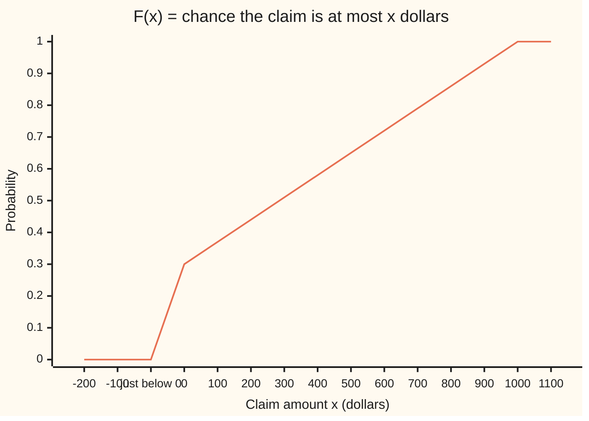

# Distribution functions and Lebesgue-Stieltjes measures: every increasing right-continuous function names one measure, and every probability law on the line has one

[Syllabus](../../../SYLLABUS.md) → [Measure and integration](../README.md) → [Length Done Properly](../README.md#s02) → Distribution functions and Lebesgue-Stieltjes measures

---

## General Overview

A household insurer looks at next year's claim on one policy. With probability 0.3 there is no claim, and the payout is \$0. Otherwise the payout is spread evenly over \$0 to \$1,000: every stretch of \$100 is as likely as every other. The pricing team wants three numbers. The chance the payout lands in (\$200, \$500]. The chance it is exactly \$0. The chance it is exactly \$350.

The old tools split. A density (a curve whose area over a stretch is its probability, [Densities](../../09-Probability%20and%20statistics/04-Continuous%20Distributions/01-densities-and-cdfs.md)) has no area to give a single point, so it loses the 0.3 at zero. A list of point probabilities has nothing to say about the even spread. The claim is neither kind, and a mix of the two needs one description that covers both.

That description is a running total. For each dollar amount x, record the chance the payout is at most x. Call it F(x). It reads 0 below zero, jumps to 0.3 at zero, then climbs in a straight line to 1 at \$1,000. Every question above is read off it. (\$200, \$500] gets F(500) − F(200) = 0.65 − 0.44 = 0.21. Exactly \$0 gets the height of the jump, 0.3. Exactly \$350 gets no jump, so 0. From here on the running total is the **distribution function**, and the rule that turns it into probabilities for every reasonable set is its **Lebesgue-Stieltjes measure**.

**A probability law on the real line and its distribution function carry the same information: the law gives an increasing, right-continuous function running from 0 to 1, and every such function gives back exactly one law, with each jump the probability of a single point.**

**What kind of fact this is:** a theorem, proved on this card in Why it works, with the extension step taken from [Caratheodory's extension theorem](05-caratheodory-extension-theorem.md).

### The picture: the claim's distribution function



One line, the distribution function F. It is 0 up to just below zero, 0.30 at zero (the step between those two points is the jump), and 1.00 from \$1,000 on. The rise from 0.44 at \$200 to 0.65 at \$500 is the 0.21 asked for. At the jump F takes the upper value, since "at most \$0" includes the \$0 claims. The chart's points are not evenly spaced: "just below 0" sits right beside 0.

---

## The formula

Notation first, in words. A **half-open interval** $(a, b]$ is every number above $a$ and at most $b$. The **Borel sets** $\mathcal{B}(\mathbb{R})$ are the sets of reals built from intervals by complements and countable unions ([Generated sigma-algebras and Borel sets](../01-Sets%20You%20Can%20Measure/03-generated-and-borel-sigma-algebras.md)). A measure $\mu$ gives each Borel set a size and adds up over countable disjoint unions. The **left limit** $F(x-)$ is the value F approaches from the left of x: $F(x-) = \lim_{t \uparrow x} F(t)$, read "the limit of F(t) as t rises to x".

A function F on the real line is a **distribution function** in the broad sense when it is increasing (never goes down) and **right-continuous**: $F(x) = \lim_{t \downarrow x} F(t)$ at every x, so approaching from the right lands on the value itself.

$$\mu_F\big((a, b]\big) \;=\; F(b) - F(a) \qquad \text{for all } a < b$$

**Read it aloud:** the mass of the stretch above a, up to and including b, is how much F rises from a to b.

The theorem has three parts.

1. **From a law to a function.** If $\mu$ is a probability measure on $\mathcal{B}(\mathbb{R})$, then $F(x) = \mu\big((-\infty, x]\big)$ is increasing and right-continuous, with $F(x) \to 0$ as $x \to -\infty$ and $F(x) \to 1$ as $x \to \infty$.
2. **From a function to a measure.** If F is increasing and right-continuous, exactly one measure $\mu_F$ on $\mathcal{B}(\mathbb{R})$ satisfies the display above. It is the **Lebesgue-Stieltjes measure** of F.
3. **Jumps are points, and the match is one to one.** $\mu_F(\{x\}) = F(x) - F(x-)$ for every x. When F runs from 0 to 1, $\mu_F$ is a probability measure whose distribution function is F again.

$$\mu_F(\{x\}) \;=\; F(x) - F(x-)$$

**Read it aloud:** the mass sitting exactly on x is the height F jumps at x.

On the claim: $\mu_F(\{0\}) = 0.3 - 0 = 0.3$, and $\mu_F(\{350\}) = 0$.

| Symbol | Plain meaning | In our example | Push it up and the answer… |
| --- | --- | --- | --- |
| $F$ | distribution function: chance of at most x | 0.44 at \$200, 0.65 at \$500 | a steeper rise puts more mass there |
| $F(x-)$ | left limit: the value F approaches from below x | 0 at x = 0 | a lower left limit means a taller jump |
| $\mu$, $\mu_F$ | a measure; the one built from F | $\mu_F\big((200, 500]\big)$ = 0.21 | — |
| $a$, $b$, $a_k$, $b_k$ | interval ends; $a_k$, $b_k$ those of the $k$-th piece in a list | 200 and 500 | $b$ up adds mass |
| $\mathcal{B}(\mathbb{R})$ | Borel sets: built from intervals by complements and countable unions | (\$200, \$500], {0} | — |
| $\mu_0$, $\mathcal{A}$ | the mass on finite unions of half-open intervals; that collection of sets | $\mu_0$ of (\$200, \$500] = 0.21 | — |
| $X$, $P$ | the claim in dollars; probability | $P(X = 0)$ = 0.3 | — |
| $\lambda$, $\Omega$, $\omega$ | Lebesgue measure (length); the interval [0, 1) used as a source of chance; a point of it | cell of width 0.0001 | — |
| $G$, $H$ | broken candidates: left-continuous, and dipping | $G(0)$ = 0; $H$ drops 0.1 at 400 | — |
| $\varepsilon$, $\delta$, $\delta_k$ | small positive allowances | any positive amount | — |
| $n$, $k$ | counters in a list | first 40 pieces | — |

### When it holds

- **Increasing.** A dip hands some interval negative mass. Take F and subtract 0.1 from \$400 on: the stretch (\$350, \$400] gets −0.065, and no measure is negative.
- **Right-continuous.** With the left-continuous version G(x) = P(X < x), the stretch (\$0, \$500] gets G(500) − G(0) = 0.65, yet cut into countably many pieces it gets 0.35. Countable additivity fails by the jump, 0.3.
- **Half-open intervals.** The formula prices (a, b], not [a, b]. The closed interval [0, 500] has mass F(500) − F(0−) = 0.65; F(500) − F(0) = 0.35 drops the jump.
- **Limits 0 and 1, only for a probability.** F(x) = x is increasing and right-continuous and builds Lebesgue measure, with total mass infinite ([Lebesgue measure](03-lebesgue-measure.md)). Adding a constant to F changes nothing: F and F + 5 build the same measure. The limit 0 at the far left picks one function out of that family.

---

## Why it works

### Step 0: mass is the rise of a running total

A probability law gives mass to sets. The running total $F(x) = \mu\big((-\infty, x]\big)$ keeps only the masses of the half-lines. Going from law to F is bookkeeping; the facts about F follow from monotonicity and continuity of a measure. Going back is the real work. The rise $F(b) - F(a)$ prices every half-open interval, the way length prices intervals on [Outer measure](01-lebesgue-outer-measure.md). The extension theorem then turns a price list on intervals into a measure on every Borel set, provided the price list is countably additive. Right-continuity is exactly what makes it so.

### Step 1: a law's distribution function rises, is right-continuous, and runs from 0 to 1

**Increasing.** If $s \le t$, the half-line $(-\infty, s]$ sits inside $(-\infty, t]$, so $F(s) \le F(t)$ by monotonicity.

**Right-continuous.** Take x and the shrinking half-lines $(-\infty, x + 1/n]$. They shrink to $(-\infty, x]$: a number at most $x + 1/n$ for every $n$ is at most x. They have finite mass, so continuity from above ([Continuity and subadditivity](../01-Sets%20You%20Can%20Measure/05-continuity-of-measure.md)) gives $F(x + 1/n) \to F(x)$. F is increasing, so the limit along every sequence falling to x is the same.

**Limits.** The half-lines $(-\infty, n]$ rise to the whole line, so $F(n) \to 1$ by continuity from below. The half-lines $(-\infty, -n]$ shrink to the empty set, so $F(-n) \to 0$ by continuity from above.

**Left limits.** The half-lines $(-\infty, x - 1/n]$ rise to $(-\infty, x)$, which leaves out x. So $F(x-) = \mu\big((-\infty, x)\big)$, and not $F(x)$. The two differ by $\mu(\{x\})$.

On the claim, the code prints $F(0 + 1/2^n)$ for n = 1, 5, 10: 0.30035, 0.300021875, 0.30000068359375, falling to F(0) = 0.3. From the left the values are all 0: the limit from the left is 0, not 0.3.

### Step 2: the rise of F prices finite unions of half-open intervals

Now start from any increasing, right-continuous F. Let $\mathcal{A}$ be the collection of finite disjoint unions of half-open intervals $(a, b]$, allowing $a = -\infty$ or $b = \infty$ (read as the open end $(a, \infty)$). It is an **algebra**: closed under complements and finite unions. The complement of (\$200, \$500] is $(-\infty, 200] \cup (500, \infty)$, again in $\mathcal{A}$.

Set $\mu_0\big((a, b]\big) = F(b) - F(a)$, with $F(-\infty)$ and $F(\infty)$ the limits of F at the two ends, and add over the disjoint pieces of a union. This is well defined. Cutting (a, b] at a point c gives $\big(F(c) - F(a)\big) + \big(F(b) - F(c)\big) = F(b) - F(a)$: the sum telescopes, so any two ways of cutting a set into intervals agree. The same telescoping makes $\mu_0$ finitely additive. F is increasing, so $\mu_0 \ge 0$, and a union of finitely many sets costs at most the sum of their costs.

### Step 3: right-continuity makes the price countably additive

This is the step that needs right-continuity, and the only hard one.

Suppose $(a, b]$ is cut into countably many disjoint pieces $(a_k, b_k]$. The claim is $F(b) - F(a) = \sum_k \big(F(b_k) - F(a_k)\big)$.

**At least the sum.** The first n pieces sit inside $(a, b]$ without overlapping, with gaps between them. The gaps have mass at least 0, so the first n prices add to at most $F(b) - F(a)$. Let n grow.

**At most the sum.** Shrink the target and fatten the pieces. Right-continuity at a gives a small $\delta$ with $F(a + \delta)$ within $\varepsilon$ of $F(a)$. Right-continuity at each $b_k$ gives $\delta_k$ with $F(b_k + \delta_k)$ within $\varepsilon/2^k$ of $F(b_k)$. The closed interval $[a + \delta, b]$ is covered by the open intervals $(a_k, b_k + \delta_k)$, so finitely many of them cover it (the finite-subcover property of a closed, bounded interval, proved on [Outer measure](01-lebesgue-outer-measure.md)). Finite subadditivity from Step 2 then says the rise from $a + \delta$ to b is at most the sum of the fattened prices. Each fattened price exceeds the true one by less than $\varepsilon/2^k$, and those allowances add to $\varepsilon$. Putting back the $\varepsilon$ lost at a, $F(b) - F(a)$ is at most the sum plus $2\varepsilon$, for every $\varepsilon$.

On the claim, cut (\$0, \$500] in halves towards zero: (\$250, \$500], (\$125, \$250], and on. The code sums the first 10, 20 and 40 pieces: 0.349658203125, 0.349999666213989, 0.349999999999681. They approach F(500) − F(0) = 0.35. With the left-continuous G the same pieces give the same sums, but G(500) − G(0) = 0.65. The δ step fails at a = 0: no small δ brings G(0 + δ) near G(0), since G jumps there.

<details>
<summary>Detailed proof: countable additivity of the price on half-open intervals</summary>

Let $(a, b]$, with a and b finite, be the disjoint union of $(a_k, b_k]$, k = 1, 2, … .

*Lower bound.* Fix n. Order the first n pieces left to right. They and the gaps between them, and the gaps at the two ends, are finitely many disjoint half-open intervals making up $(a, b]$. By finite additivity (Step 2), $F(b) - F(a)$ equals the sum of the n prices plus the gap prices. Gap prices are at least 0 because F is increasing. So $\sum_{k \le n} \big(F(b_k) - F(a_k)\big) \le F(b) - F(a)$ for every n, hence for the infinite sum.

*Upper bound.* Fix $\varepsilon > 0$. F is right-continuous at a, so there is $\delta$ with $0 < \delta < b - a$ and $F(a + \delta) - F(a) < \varepsilon$. For each k, F is right-continuous at $b_k$, so there is $\delta_k > 0$ with $F(b_k + \delta_k) - F(b_k) < \varepsilon/2^k$.

Every point of $[a + \delta, b]$ lies in $(a, b]$, so in some $(a_k, b_k]$, so in the open interval $(a_k, b_k + \delta_k)$. By the finite-subcover property, some finite list $k_1, \dots, k_m$ already covers $[a + \delta, b]$. Then the half-open intervals $(a_{k_i}, b_{k_i} + \delta_{k_i}]$ cover $(a + \delta, b]$.

By Step 2, $\mu_0$ is monotone and finitely subadditive on $\mathcal{A}$. So
$F(b) - F(a + \delta) \le \sum_{i \le m} \big(F(b_{k_i} + \delta_{k_i}) - F(a_{k_i})\big) \le \sum_{k} \big(F(b_k) - F(a_k) + \varepsilon/2^k\big) = \sum_k \big(F(b_k) - F(a_k)\big) + \varepsilon.$

Adding $F(a + \delta) - F(a) < \varepsilon$ to both sides: $F(b) - F(a) < \sum_k \big(F(b_k) - F(a_k)\big) + 2\varepsilon$. This holds for every $\varepsilon > 0$.

*Unbounded intervals and finite unions.* If $a = -\infty$ or $b = \infty$, apply the bounded case to $(\max(a, -M), \min(b, M)]$, cut by the pieces meeting it, and let M grow; both sides converge to the stated values by the definition of $F(\pm\infty)$ as limits. A set in $\mathcal{A}$ that is a finite disjoint union of intervals is handled interval by interval, since each piece of a countable cut can be split among them.

</details>

### Step 4: extend, and the extension is the only one

Step 3 makes $\mu_0$ a **pre-measure** on the algebra $\mathcal{A}$: countably additive wherever a countable disjoint union stays in $\mathcal{A}$. Carathéodory's extension theorem ([Caratheodory's extension theorem](05-caratheodory-extension-theorem.md)) extends it to a measure on the sets that $\mathcal{A}$ generates, and those are the Borel sets. Concretely, the extension is the cheapest-cover recipe of [Outer measure](01-lebesgue-outer-measure.md) with length replaced by rise:
$\mu_F^*(A) = \inf \sum_k \big(F(b_k) - F(a_k)\big)$ over lists of half-open intervals covering A.

The extension is unique. The line is the union of the stretches $(-n, n]$, each of finite mass $F(n) - F(-n)$. So $\mu_0$ is σ-finite (the line splits into countably many pieces of finite mass), and the extension theorem's uniqueness clause applies: two measures that agree on half-open intervals and are finite on each $(-n, n]$ agree on every Borel set. The same fact, argued through π-systems (collections closed under finite intersections), is [Pi-systems and Dynkin's theorem](../01-Sets%20You%20Can%20Measure/06-pi-systems-and-uniqueness.md).

### Step 5: jumps are single points

The half-open intervals $(x - 1/n, x]$ shrink to the single point x, and each has finite mass. Continuity from above gives

$\mu_F(\{x\}) = \lim_n \big(F(x) - F(x - 1/n)\big) = F(x) - F(x-)$.

At the claim's zero: $F(0) - F(0 - 1/2^n)$ is 0.3 for n = 1, 5, 10, and the point mass is 0.3. At \$350: $F(350) - F(350 - 1/2^n)$ is 0.00035, 0.000021875, 0.00000068359375, falling to 0. F is continuous at x exactly when x carries no mass.

A probability law has at most n points of mass above 1/n, or they would total more than 1. So the jumps can be listed: at most countably many.

### Step 6: the match is one to one

**Law, then function, then law.** Start from a probability law $\mu$ and its F from Step 1. For $a < b$, $(-\infty, b]$ is $(-\infty, a]$ plus $(a, b]$, so $\mu\big((a, b]\big) = F(b) - F(a)$. Thus $\mu$ and $\mu_F$ agree on half-open intervals, and by Step 4's uniqueness they are the same measure. Two laws with the same distribution function are equal.

**Function, then law, then function.** Start from F running from 0 to 1. Then $\mu_F$ of the whole line is $F(\infty) - F(-\infty) = 1$, a probability measure. Its distribution function at x is $\mu_F\big((-\infty, x]\big)$. The stretches $(-n, x]$ rise to $(-\infty, x]$, so by continuity from below it equals $\lim_n \big(F(x) - F(-n)\big) = F(x) - 0 = F(x)$.

So laws on $\mathcal{B}(\mathbb{R})$ and increasing right-continuous functions from 0 to 1 pair off exactly.

### What the code shows and what only the proof shows

The code checks this one claim: the formula against two other roads to the same masses, the jump and no-jump sequences, and the countable cut of (\$0, \$500]. The proof covers every increasing right-continuous F and every Borel set, which no program can list.

A second road to existence, for F running from 0 to 1, builds a random variable directly. Take a point $\omega$ drawn evenly from $\Omega$ = [0, 1), with length $\lambda$ as its probability. For $\omega > 0$, set $X(\omega)$ to the smallest x with $F(x) \ge \omega$; it exists because F is increasing, right-continuous and runs from 0 to 1. The single point $\omega = 0$ has length 0 and can go anywhere. Then $X \le x$ exactly when $\omega \le F(x)$, which has probability F(x). For the claim, $\omega$ below 0.3 gives \$0, and $\omega$ above it gives \$1,000 × (ω − 0.3)/0.7. The code uses this as its second road; how a function carries a measure along is [The law of a random variable](../03-Measurable%20Functions/05-pushforward-and-the-law.md).

---

## Worked numbers, by hand

| Step | Arithmetic | Value |
| --- | --- | --- |
| F at \$200 | 0.3 + 0.7 × 200/1000 | 0.44 |
| F at \$500 | 0.3 + 0.7 × 500/1000 | 0.65 |
| mass of (\$200, \$500] | 0.65 − 0.44 | **0.21** |
| left limit at 0 | F is 0 on every negative amount | 0 |
| mass of exactly \$0 | F(0) − F(0−) = 0.3 − 0 | **0.3** |
| mass of exactly \$350 | F continuous at 350 | **0** |
| mass of (\$0, \$500] | 0.65 − 0.3 | 0.35 |
| mass of [\$0, \$500] | 0.65 − 0 | 0.65 |
| claim above a \$200 deductible | 1 − 0.44 | **0.56** |

Out of every 100 such policies, about 21 pay between \$200 and \$500, including \$500 itself, and about 30 pay nothing.

The other two roads agree. On a grid of 10,000 cells of [0, 1), 2,100 cells send the claim into (\$200, \$500] and 3,000 send it to \$0. Of 100,000 simulated claims, 21,067 land in (\$200, \$500] and 29,968 at \$0, shares 0.21067 and 0.29968, each within four standard errors (0.00515 and 0.00580).

### What breaks if you drop a piece

| Mistake | Comes out at | What went wrong |
| --- | --- | --- |
| Left-continuous G(x) = P(X < x) | (\$0, \$500] gets 0.65 whole, 0.35 in pieces | countable additivity fails by the jump, 0.3 |
| Closed interval priced as F(b) − F(a) | [0, 500] gets 0.35, true 0.65 | the jump at the left end is left out |
| Density only: sum the slope 0.0007 per dollar | total 0.7, missing 0.3 | a slope cannot see a jump |
| F with a dip: subtract 0.1 from \$400 on | (\$350, \$400] gets −0.065 | a decreasing stretch gives negative mass |

The code prints all four and asserts each.

---

## Code, from first principles, and it actually runs

The code takes three roads to the claim's masses. Road one is the formula F(b) − F(a) in exact fractions. Road two writes the claim as a function of a point in [0, 1), cuts [0, 1) into 10,000 equal cells, and counts the cells landing in each set: the law as length carried across by a function. Road three simulates 100,000 claims from the story itself, a 0.3 coin and then an even draw, using SplitMix64 with seed 2026 written out in both languages. It also prints the jump sequences, the countable cut of (\$0, \$500], the chart's points and the four broken versions. Python uses `fractions`; Rust does exact rationals by hand on 128-bit integers.

### Python

```python
# Lebesgue-Stieltjes measures -- the check behind the card.  Standard library
# only: exact fractions for F and for the grid on [0, 1), and SplitMix64 written
# out here for the simulated claims.  Money in dollars, probabilities as decimals.
from fractions import Fraction as Fr
from math import sqrt

MASK = (1 << 64) - 1
P0, TOP = Fr(3, 10), 1000                     # 0.3 chance of $0; else even on 0 to 1,000

def F(x):                                     # distribution function: P(claim <= x)
    x = Fr(x)
    if x < 0:
        return Fr(0)
    return P0 + (1 - P0) * x / TOP if x < TOP else Fr(1)

def G(x):                                     # the left-continuous version: P(claim < x)
    x = Fr(x)
    return Fr(0) if x <= 0 else F(x)

def mass(a, b, cdf=F):                        # road one: the formula on (a, b]
    return cdf(b) - cdf(a)

def dec(r, digits=15):                        # exact decimal, first 15 places, zeros trimmed
    r = Fr(r)
    sign, r = ("-" if r < 0 else ""), abs(r)
    out, num, den = f"{r.numerator // r.denominator}.", r.numerator % r.denominator, r.denominator
    for _ in range(digits):
        num *= 10
        out += str(num // den)
        num %= den
    return sign + out.rstrip("0").rstrip(".")

N = 10000                                     # road two: [0, 1) cut into N equal cells

def claim_of(w):                              # the claim as a function of a point w in [0, 1)
    return Fr(0) if w < P0 else TOP * (w - P0) / (1 - P0)

cells = [claim_of(Fr(2 * k + 1, 2 * N)) for k in range(N)]     # cell midpoints

def grid(test):                               # length of {w : test(claim(w))}, cell by cell
    return Fr(sum(1 for c in cells if test(c)), N)

def splitmix(state):
    state = (state + 0x9E3779B97F4A7C15) & MASK
    z = state
    z = ((z ^ (z >> 30)) * 0xBF58476D1CE4E5B9) & MASK
    z = ((z ^ (z >> 27)) * 0x94D049BB133111EB) & MASK
    return state, z ^ (z >> 31)

print("claim: $0 with probability 0.3, otherwise even over $0 to $1000")
print(f"F(-100) = {dec(F(-100))}, F(0) = {dec(F(0))}, F(200) = {dec(F(200))}, "
      f"F(500) = {dec(F(500))}, F(1000) = {dec(F(1000))}")
xs = [-200, -100, None, 0] + list(range(100, 1101, 100))
print("chart, F at -200, -100, just below 0, 0, 100, 200, ..., 1100: "
      + ", ".join(f"{float(F(-Fr(1, 10**9)) if x is None else F(x)):.2f}" for x in xs))
road1 = mass(200, 500)
road2 = grid(lambda c: 200 < c <= 500)
print(f"road 1, formula: mu((200, 500]) = F(500) - F(200) = {dec(road1)}")
print(f"road 2, length on [0, 1): {N} cells, {road2 * N} send the claim into (200, 500], mass {dec(road2)}")

state, n, hits, zeros = 2026, 100000, 0, 0
for _ in range(n):
    state, r1 = splitmix(state)
    state, r2 = splitmix(state)
    if (r1 >> 11) / 2**53 < 0.3:
        zeros += 1
        continue
    amount = 1000.0 * ((r2 >> 11) / 2**53)
    hits += 200.0 < amount <= 500.0
se = lambda p: sqrt(p * (1 - p) / n)
print(f"road 3, simulation (SplitMix64, seed 2026): {n} claims, {hits} in (200, 500], share "
      f"{dec(Fr(hits, n))}; 4 standard errors = {4 * se(0.21):.5f}")
print(f"         claims of exactly $0: {zeros}, share {dec(Fr(zeros, n))}; 4 standard errors = {4 * se(0.3):.5f}")

print("jump at 0: F(0) - F(0 - 1/2^n), n = 1, 5, 10: "
      + ", ".join(dec(F(0) - F(-Fr(1, 2**k))) for k in (1, 5, 10)) + f"; point mass {dec(F(0))}")
print(f"road 2, cells sending the claim to exactly $0: {grid(lambda c: c == 0) * N}, mass {dec(grid(lambda c: c == 0))}")
print("right limit at 0: F(0 + 1/2^n), n = 1, 5, 10: "
      + ", ".join(dec(F(Fr(1, 2**k))) for k in (1, 5, 10)))
print("no jump at 350: F(350) - F(350 - 1/2^n), n = 1, 5, 10: "
      + ", ".join(dec(F(350) - F(350 - Fr(1, 2**k))) for k in (1, 5, 10)))
print(f"claim above a $200 deductible: 1 - F(200) = {dec(1 - F(200))}")

pieces = lambda k: (Fr(500, 2**(k + 1)), Fr(500, 2**k))           # (0, 500] cut in halves
print("(0, 500] as the pieces (500/2^(k+1), 500/2^k], k = 0, 1, 2, ...")
for count in (10, 20, 40):
    total = sum(mass(*pieces(k)) for k in range(count))
    tail_free = Fr(7, 10) * (500 - Fr(500, 2**count)) / TOP        # the even part, measured directly
    assert total == tail_free                                     # two roads to a partial sum
    print(f"  sum of the first {count} pieces: {dec(total)}")
whole_F, whole_G = mass(0, 500), mass(0, 500, G)
open_left = grid(lambda c: 0 < c <= 500)
print(f"right-continuous F: F(500) - F(0) = {dec(whole_F)}; road 2 on the grid: {dec(open_left)}")
print(f"mistake 1, left-continuous G(x) = P(claim < x): G(500) - G(0) = {dec(whole_G)}, "
      f"pieces still sum to {dec(whole_F)}: additivity fails by {dec(whole_G - whole_F)}")
closed = grid(lambda c: 0 <= c <= 500)
print(f"mistake 2, closed [0, 500] as F(500) - F(0) = {dec(whole_F)}; "
      f"true F(500) - F(0-) = {dec(F(500) - F(-Fr(1, 10**9)))}; road 2: {dec(closed)}")
slopes = sum(F(x + 1) - F(x) for x in range(0, TOP))
print(f"mistake 3, density only: slope 0.0007 per dollar summed over (0, 1000) = {dec(slopes)}; "
      f"missing {dec(1 - slopes)}, the jump")
H = lambda x: F(x) - (Fr(1, 10) if Fr(x) >= 400 else 0)           # a function that dips at 400
print(f"mistake 4, a dip: H = F minus 0.1 from 400 on gives (350, 400] the mass {dec(mass(350, 400, H))}")

assert road1 == road2 and F(0) == grid(lambda c: c == 0)          # formula against pushforward
assert abs(Fr(hits, n) - road1) < 4 * se(0.21) and abs(Fr(zeros, n) - F(0)) < 4 * se(0.3)
assert whole_F == open_left and closed == F(500) and whole_G != open_left
assert mass(350, 400, H) < 0 and slopes == grid(lambda c: c > 0)   # mistakes 4 and 3: slopes vs the grid's spread
print("ALL CHECKS PASS")
```

**Ran 2026-10-06 on macOS, Python 3.14.6, standard library only. All checks passed. Output, pasted from the run:**

```
claim: $0 with probability 0.3, otherwise even over $0 to $1000
F(-100) = 0, F(0) = 0.3, F(200) = 0.44, F(500) = 0.65, F(1000) = 1
chart, F at -200, -100, just below 0, 0, 100, 200, ..., 1100: 0.00, 0.00, 0.00, 0.30, 0.37, 0.44, 0.51, 0.58, 0.65, 0.72, 0.79, 0.86, 0.93, 1.00, 1.00
road 1, formula: mu((200, 500]) = F(500) - F(200) = 0.21
road 2, length on [0, 1): 10000 cells, 2100 send the claim into (200, 500], mass 0.21
road 3, simulation (SplitMix64, seed 2026): 100000 claims, 21067 in (200, 500], share 0.21067; 4 standard errors = 0.00515
         claims of exactly $0: 29968, share 0.29968; 4 standard errors = 0.00580
jump at 0: F(0) - F(0 - 1/2^n), n = 1, 5, 10: 0.3, 0.3, 0.3; point mass 0.3
road 2, cells sending the claim to exactly $0: 3000, mass 0.3
right limit at 0: F(0 + 1/2^n), n = 1, 5, 10: 0.30035, 0.300021875, 0.30000068359375
no jump at 350: F(350) - F(350 - 1/2^n), n = 1, 5, 10: 0.00035, 0.000021875, 0.00000068359375
claim above a $200 deductible: 1 - F(200) = 0.56
(0, 500] as the pieces (500/2^(k+1), 500/2^k], k = 0, 1, 2, ...
  sum of the first 10 pieces: 0.349658203125
  sum of the first 20 pieces: 0.349999666213989
  sum of the first 40 pieces: 0.349999999999681
right-continuous F: F(500) - F(0) = 0.35; road 2 on the grid: 0.35
mistake 1, left-continuous G(x) = P(claim < x): G(500) - G(0) = 0.65, pieces still sum to 0.35: additivity fails by 0.3
mistake 2, closed [0, 500] as F(500) - F(0) = 0.35; true F(500) - F(0-) = 0.65; road 2: 0.65
mistake 3, density only: slope 0.0007 per dollar summed over (0, 1000) = 0.7; missing 0.3, the jump
mistake 4, a dip: H = F minus 0.1 from 400 on gives (350, 400] the mass -0.065
ALL CHECKS PASS
```

### Rust

Same numbers, same labels, built with `rustc --edition 2021 -O`.

```rust
// Lebesgue-Stieltjes measures -- the same check as the Python, in Rust.  No
// crates.  Exact rationals by hand on i128, and SplitMix64 written out here for
// the simulated claims.  Money in dollars, probabilities as decimals.
use std::cmp::Ordering;
use std::ops::{Add, Mul, Sub};

#[derive(Clone, Copy, Debug)]
struct Q { n: i128, d: i128 }                 // n / d, d > 0, in lowest terms

fn gcd(a: i128, b: i128) -> i128 { if b == 0 { a.abs() } else { gcd(b, a % b) } }
fn q(n: i128, d: i128) -> Q {
    let g = gcd(n, d).max(1) * d.signum();
    Q { n: n / g, d: d / g }
}
impl Add for Q { type Output = Q; fn add(self, o: Q) -> Q { q(self.n * o.d + o.n * self.d, self.d * o.d) } }
impl Sub for Q { type Output = Q; fn sub(self, o: Q) -> Q { q(self.n * o.d - o.n * self.d, self.d * o.d) } }
impl Mul for Q { type Output = Q; fn mul(self, o: Q) -> Q { q(self.n * o.n, self.d * o.d) } }
impl PartialEq for Q { fn eq(&self, o: &Q) -> bool { self.n * o.d == o.n * self.d } }
impl PartialOrd for Q { fn partial_cmp(&self, o: &Q) -> Option<Ordering> { (self.n * o.d).partial_cmp(&(o.n * self.d)) } }

fn int(n: i128) -> Q { q(n, 1) }
fn p0() -> Q { q(3, 10) }                     // 0.3 chance of $0; else even on 0 to 1,000
const TOP: i128 = 1000;

fn f(x: Q) -> Q {                             // distribution function: P(claim <= x)
    if x < int(0) { int(0) } else if x < int(TOP) { p0() + (int(1) - p0()) * x * q(1, TOP) } else { int(1) }
}
fn g(x: Q) -> Q { if x <= int(0) { int(0) } else { f(x) } }   // left-continuous: P(claim < x)
fn h(x: Q) -> Q { f(x) - if x >= int(400) { q(1, 10) } else { int(0) } }   // dips at 400
fn mass(a: Q, b: Q, cdf: fn(Q) -> Q) -> Q { cdf(b) - cdf(a) }   // road one: the formula on (a, b]

fn dec(r: Q) -> String {                      // exact decimal, first 15 places, zeros trimmed
    let (sign, mut num, den) = (if r.n < 0 { "-" } else { "" }, r.n.abs(), r.d);
    let mut out = format!("{}.", num / den);
    num %= den;
    for _ in 0..15 { num *= 10; out += &(num / den).to_string(); num %= den; }
    format!("{}{}", sign, out.trim_end_matches('0').trim_end_matches('.'))
}

const N: i128 = 10000;                        // road two: [0, 1) cut into N equal cells
fn claim_of(w: Q) -> Q { if w < p0() { int(0) } else { int(TOP) * (w - p0()) * q(10, 7) } }

fn splitmix(state: &mut u64) -> u64 {
    *state = state.wrapping_add(0x9E3779B97F4A7C15);
    let mut z = *state;
    z = (z ^ (z >> 30)).wrapping_mul(0xBF58476D1CE4E5B9);
    z = (z ^ (z >> 27)).wrapping_mul(0x94D049BB133111EB);
    z ^ (z >> 31)
}

fn join(v: Vec<String>) -> String { v.join(", ") }

fn main() {
    let cells: Vec<Q> = (0..N).map(|k| claim_of(q(2 * k + 1, 2 * N))).collect();   // cell midpoints
    let grid = |test: &dyn Fn(Q) -> bool| q(cells.iter().filter(|&&c| test(c)).count() as i128, N);
    let just_below = q(-1, 1_000_000_000);
    println!("claim: $0 with probability 0.3, otherwise even over $0 to $1000");
    println!("F(-100) = {}, F(0) = {}, F(200) = {}, F(500) = {}, F(1000) = {}",
             dec(f(int(-100))), dec(f(int(0))), dec(f(int(200))), dec(f(int(500))), dec(f(int(1000))));
    let mut xs = vec![int(-200), int(-100), just_below, int(0)];
    xs.extend((1..=11).map(|k| int(100 * k)));
    println!("chart, F at -200, -100, just below 0, 0, 100, 200, ..., 1100: {}",
             join(xs.iter().map(|&x| format!("{:.2}", f(x).n as f64 / f(x).d as f64)).collect()));
    let road1 = mass(int(200), int(500), f);
    let road2 = grid(&|c| int(200) < c && c <= int(500));
    println!("road 1, formula: mu((200, 500]) = F(500) - F(200) = {}", dec(road1));
    println!("road 2, length on [0, 1): {} cells, {} send the claim into (200, 500], mass {}", N, dec(road2 * int(N)), dec(road2));

    let (mut state, n, mut hits, mut zeros) = (2026u64, 100000i128, 0i128, 0i128);
    for _ in 0..n {
        let (r1, r2) = (splitmix(&mut state), splitmix(&mut state));
        if (r1 >> 11) as f64 / 9007199254740992.0 < 0.3 { zeros += 1; continue; }
        let amount = 1000.0 * ((r2 >> 11) as f64 / 9007199254740992.0);
        if 200.0 < amount && amount <= 500.0 { hits += 1; }
    }
    let se = |p: f64| (p * (1.0 - p) / n as f64).sqrt();
    println!("road 3, simulation (SplitMix64, seed 2026): {} claims, {} in (200, 500], share {}; 4 standard errors = {:.5}",
             n, hits, dec(q(hits, n)), 4.0 * se(0.21));
    println!("         claims of exactly $0: {}, share {}; 4 standard errors = {:.5}", zeros, dec(q(zeros, n)), 4.0 * se(0.3));

    let ks = [1u32, 5, 10];
    println!("jump at 0: F(0) - F(0 - 1/2^n), n = 1, 5, 10: {}; point mass {}",
             join(ks.iter().map(|&k| dec(f(int(0)) - f(q(-1, 1 << k)))).collect()), dec(f(int(0))));
    let atom = grid(&|c| c == int(0));
    println!("road 2, cells sending the claim to exactly $0: {}, mass {}", dec(atom * int(N)), dec(atom));
    println!("right limit at 0: F(0 + 1/2^n), n = 1, 5, 10: {}", join(ks.iter().map(|&k| dec(f(q(1, 1 << k)))).collect()));
    println!("no jump at 350: F(350) - F(350 - 1/2^n), n = 1, 5, 10: {}",
             join(ks.iter().map(|&k| dec(f(int(350)) - f(int(350) - q(1, 1 << k)))).collect()));
    println!("claim above a $200 deductible: 1 - F(200) = {}", dec(int(1) - f(int(200))));

    let piece = |k: u32| (q(500, 1 << (k + 1)), q(500, 1 << k));   // (0, 500] cut in halves
    println!("(0, 500] as the pieces (500/2^(k+1), 500/2^k], k = 0, 1, 2, ...");
    for count in [10u32, 20, 40] {
        let total = (0..count).fold(int(0), |s, k| { let (a, b) = piece(k); s + mass(a, b, f) });
        let tail_free = q(7, 10) * (int(500) - q(500, 1 << count)) * q(1, TOP);   // the even part, directly
        assert!(total == tail_free);                                 // two roads to a partial sum
        println!("  sum of the first {} pieces: {}", count, dec(total));
    }
    let (whole_f, whole_g) = (mass(int(0), int(500), f), mass(int(0), int(500), g));
    let open_left = grid(&|c| int(0) < c && c <= int(500));
    println!("right-continuous F: F(500) - F(0) = {}; road 2 on the grid: {}", dec(whole_f), dec(open_left));
    println!("mistake 1, left-continuous G(x) = P(claim < x): G(500) - G(0) = {}, pieces still sum to {}: additivity fails by {}",
             dec(whole_g), dec(whole_f), dec(whole_g - whole_f));
    let closed = grid(&|c| int(0) <= c && c <= int(500));
    println!("mistake 2, closed [0, 500] as F(500) - F(0) = {}; true F(500) - F(0-) = {}; road 2: {}",
             dec(whole_f), dec(f(int(500)) - f(just_below)), dec(closed));
    let slopes = (0..TOP).fold(int(0), |s, x| s + f(int(x + 1)) - f(int(x)));
    println!("mistake 3, density only: slope 0.0007 per dollar summed over (0, 1000) = {}; missing {}, the jump",
             dec(slopes), dec(int(1) - slopes));
    println!("mistake 4, a dip: H = F minus 0.1 from 400 on gives (350, 400] the mass {}", dec(mass(int(350), int(400), h)));

    assert!(road1 == road2 && f(int(0)) == atom);                     // formula against pushforward
    let (sh, sz) = (hits as f64 / n as f64, zeros as f64 / n as f64);
    assert!((sh - 0.21).abs() < 4.0 * se(0.21) && (sz - 0.3).abs() < 4.0 * se(0.3));
    assert!(whole_f == open_left && closed == f(int(500)) && whole_g != open_left);
    assert!(mass(int(350), int(400), h) < int(0) && slopes == grid(&|c| c > int(0)));   // mistakes 4, 3: slopes vs grid
    println!("ALL CHECKS PASS");
}
```

**Ran 2026-10-06 on macOS, rustc 1.98.1, no crates. All checks passed. Output, pasted from the run:**

```
claim: $0 with probability 0.3, otherwise even over $0 to $1000
F(-100) = 0, F(0) = 0.3, F(200) = 0.44, F(500) = 0.65, F(1000) = 1
chart, F at -200, -100, just below 0, 0, 100, 200, ..., 1100: 0.00, 0.00, 0.00, 0.30, 0.37, 0.44, 0.51, 0.58, 0.65, 0.72, 0.79, 0.86, 0.93, 1.00, 1.00
road 1, formula: mu((200, 500]) = F(500) - F(200) = 0.21
road 2, length on [0, 1): 10000 cells, 2100 send the claim into (200, 500], mass 0.21
road 3, simulation (SplitMix64, seed 2026): 100000 claims, 21067 in (200, 500], share 0.21067; 4 standard errors = 0.00515
         claims of exactly $0: 29968, share 0.29968; 4 standard errors = 0.00580
jump at 0: F(0) - F(0 - 1/2^n), n = 1, 5, 10: 0.3, 0.3, 0.3; point mass 0.3
road 2, cells sending the claim to exactly $0: 3000, mass 0.3
right limit at 0: F(0 + 1/2^n), n = 1, 5, 10: 0.30035, 0.300021875, 0.30000068359375
no jump at 350: F(350) - F(350 - 1/2^n), n = 1, 5, 10: 0.00035, 0.000021875, 0.00000068359375
claim above a $200 deductible: 1 - F(200) = 0.56
(0, 500] as the pieces (500/2^(k+1), 500/2^k], k = 0, 1, 2, ...
  sum of the first 10 pieces: 0.349658203125
  sum of the first 20 pieces: 0.349999666213989
  sum of the first 40 pieces: 0.349999999999681
right-continuous F: F(500) - F(0) = 0.35; road 2 on the grid: 0.35
mistake 1, left-continuous G(x) = P(claim < x): G(500) - G(0) = 0.65, pieces still sum to 0.35: additivity fails by 0.3
mistake 2, closed [0, 500] as F(500) - F(0) = 0.35; true F(500) - F(0-) = 0.65; road 2: 0.65
mistake 3, density only: slope 0.0007 per dollar summed over (0, 1000) = 0.7; missing 0.3, the jump
mistake 4, a dip: H = F minus 0.1 from 400 on gives (350, 400] the mass -0.065
ALL CHECKS PASS
```

The two outputs match line for line.

> [!TIP]
> **Try changing**
> Guess first, then run it.
> - **Make the jump open on the right.** In `F`, change `if x < 0:` to `if x <= 0:`. F(0) becomes 0 and F is no longer right-continuous at zero. The formula still gives 0.21 for (\$200, \$500], but the point mass at zero now reads 0 while the grid still finds 3,000 cells at \$0, and the formula-against-pushforward assert stops it.
> - **A bigger no-claim chance.** Set `P0` to `Fr(1, 2)` and the simulation's coin to `0.5`. Guess (\$200, \$500] first: 0.5 × 0.3 = 0.15. The countable-cut assert stops the run, because it measures the even part directly as `Fr(7, 10)` of the range; change that to `Fr(1, 2)` as well and every assert passes, with 1,500 cells in (\$200, \$500].
> - **A smaller dip.** Change the 0.1 in `H` to 0.05. Guess: (\$350, \$400] gets 0.035 − 0.05 = −0.015, still negative, still no measure.
> - **Another seed.** Change 2026 in the simulation. The counts move by tens to hundreds; the shares stay inside their bands, which a 4-standard-error band misses about once in 16,000 runs.

---

## The usual mistake

> [!warning]
> **Reading F(x) as the chance of exactly x.** F(x) is the chance of at most x. F(500) = 0.65 is the chance the claim is \$500 or less; the chance of exactly \$500 is F(500) − F(500−) = 0. Only a jump isolates a single value, and at zero that jump is 0.3.
>
> - **Pricing [a, b] with F(b) − F(a).** That is the price of (a, b]; [\$0, \$500] gets 0.65, not 0.35.
> - **Mixing conventions.** G(x) = P(X < x) is legitimate, but its rises price [a, b), not (a, b].
> - **Differentiating F to get a density.** The slope, 0.0007 per dollar, accounts for 0.7 of the mass; the 0.3 at a single point is invisible to it.
> - **Assuming every F is jumps plus a density.** The Cantor function rises from 0 to 1 continuously, with slope 0 almost everywhere: no jumps and no density ([The Cantor set](07-the-cantor-set.md)).

---

## Where you meet it in real life

- **Insurance losses.** Claim sizes with a mass at zero (no claim) and a spread above it are the everyday case. Deductibles and policy limits add more jumps: a \$1,000 limit piles every larger loss onto the single amount \$1,000.
- **Every random quantity on the line.** A random variable's law, the measure it carries across from the probability space, is fixed by its distribution function ([The law of a random variable](../03-Measurable%20Functions/05-pushforward-and-the-law.md)).
- **Length itself.** F(x) = x builds Lebesgue measure, the special case the shelf began with ([Lebesgue measure](03-lebesgue-measure.md)).
- **Simulation.** Setting X to the smallest x with F(x) at least a uniform draw, the second road here, is the standard general method software uses to draw from a law given by its distribution function.
- **Weighted sums and integrals.** Integrating against $\mu_F$ is the Stieltjes integral $\int g \, dF$, which averages a payout over a law with jumps and spreads alike ([The Lebesgue-Stieltjes integral](../11-Derivatives%20Meet%20the%20Lebesgue%20Integral/05-lebesgue-stieltjes-integral.md)).

> **Say it back**
> A distribution function is a running total: the chance of at most x. A probability law gives one that never falls, is continuous from the right, and runs from 0 to 1. Conversely, any increasing right-continuous F prices each half-open interval by its rise, right-continuity makes that price countably additive, and the extension theorem turns it into exactly one measure on the Borel sets. Each jump of F is the mass of a single point. The insurance claim's F jumps 0.3 at \$0 and gives (\$200, \$500] the mass 0.21.

---

## What this builds on

- [Caratheodory's extension theorem](05-caratheodory-extension-theorem.md): turns the countably additive price on half-open intervals into a measure on every Borel set, uniquely.
- [Continuity and subadditivity](../01-Sets%20You%20Can%20Measure/05-continuity-of-measure.md): the limits along rising and shrinking half-lines behind right-continuity, the end limits and the jump formula.
- [Densities](../../09-Probability%20and%20statistics/04-Continuous%20Distributions/01-densities-and-cdfs.md): the distribution function met without measure, for laws with a density.

## Where this goes next

- [The Cantor set](07-the-cantor-set.md): a continuous distribution function with no jumps and no density.
- [The law of a random variable](../03-Measurable%20Functions/05-pushforward-and-the-law.md): the law of a random variable as a measure carried across by a function.
- [Lebesgue decomposition](../08-Densities%20and%20Changing%20Measure/05-lebesgue-decomposition.md): every law splits into a part with a density, a jump part and a Cantor-like part.
- [Convergence in distribution](../10-The%20Limit%20Theorems%2C%20Proved/05-convergence-in-distribution.md): laws converging when their distribution functions converge at points without jumps.
- [The Lebesgue-Stieltjes integral](../11-Derivatives%20Meet%20the%20Lebesgue%20Integral/05-lebesgue-stieltjes-integral.md): integrating against $\mu_F$.
- The delta: the jump's "derivative" made into an object, a point mass.

The claim's law is a jump plus a spread, which suggests every law is; whether a continuous F can carry mass that no density describes is what [The Cantor set](07-the-cantor-set.md) answers.

---

## Sources

Verified 2026-09-29: every link below resolves to the publisher's page.

- Folland, Gerald B. *Real Analysis: Modern Techniques and Their Applications*, 2nd ed. Wiley, 1999. [Publisher page](https://www.wiley.com/en-us/Real+Analysis%3A+Modern+Techniques+and+Their+Applications%2C+2nd+Edition-p-9780471317166). Chapter 1 builds the measure with mass F(b) − F(a) on (a, b] from any increasing right-continuous F through a pre-measure on finite unions of half-open intervals.
- Billingsley, Patrick. *Probability and Measure*, Anniversary ed. Wiley, 2012. [Publisher page](https://www.wiley.com/en-us/Probability+and+Measure%2C+Anniversary+Edition-p-9781118122372). Matches distributions on the line to distribution functions and reads jumps as point masses.
- Durrett, Rick. *Probability: Theory and Examples*, 5th ed. Cambridge University Press, 2019. [Publisher page](https://doi.org/10.1017/9781108591034); [free edition from the author](https://sites.math.duke.edu/~rtd/PTE/pte.html). Chapter 1 constructs the measure from F and builds a random variable with a given F by the smallest-x road used here.
- Stieltjes, Thomas-Jan. "Recherches sur les fractions continues." *Annales de la Faculté des sciences de Toulouse* 8 (1894). [Numdam](https://www.numdam.org/item/AFST_1894_1_8_4_J1_0/). Introduced integration against an increasing function, a mass spread along a line with possible point loads.
