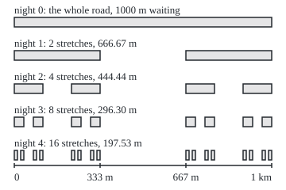
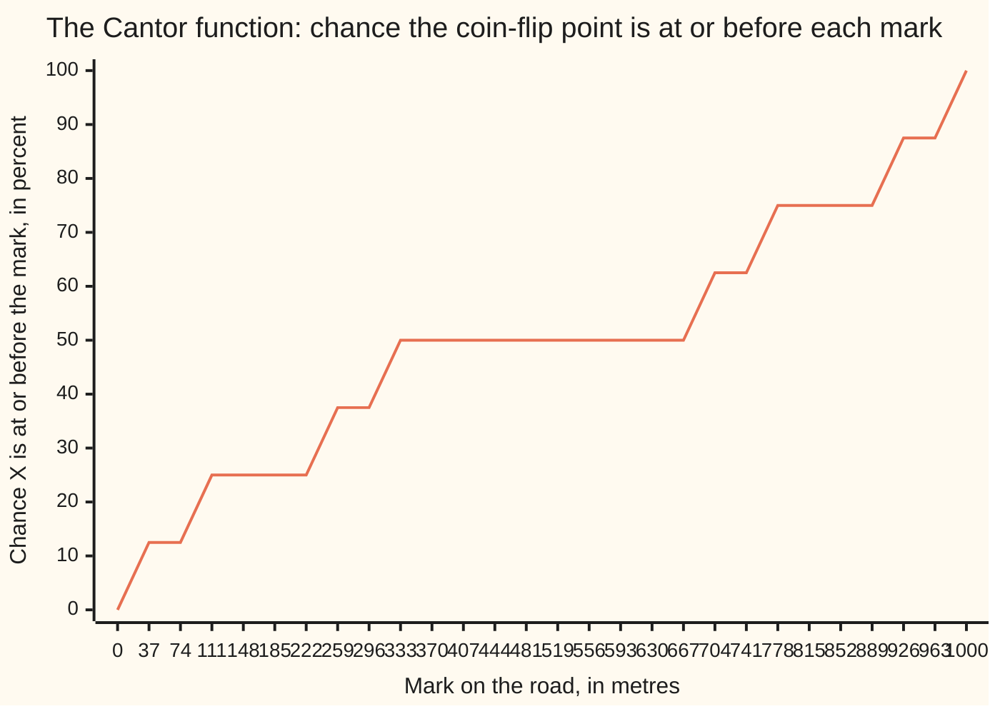

# The Cantor set: an uncountable set of length zero, and the staircase that climbs from 0 to 1 with slope zero almost everywhere

[Syllabus](../../../SYLLABUS.md) → [Measure and integration](../../../SYLLABUS.md#w10) → [Length Done Properly](../../../SYLLABUS.md#w10-s02) → The Cantor set

---

## General Overview

A council resurfaces a road exactly 1 km long by an odd rule. On night 1 the crew splits the road into thirds, resurfaces the middle third, from 333.33 m to 666.67 m, and skips the two outer thirds. Every later night it does the same to every stretch still waiting.

After night 1, 666.67 m waits, in 2 stretches; after night 2, 444.44 m, in 4; after night 10, 17.34 m, in 1024. Night 18 is the first with under a metre left. The resurfaced total climbs toward the whole 1000 m.

Let the rule run for ever. Some points are skipped every night: the ends of every stretch ever made, and points such as the 250 m mark, which is never an end. These points form the **Cantor set**, the name used from here on. Its length is zero, since the resurfacing reaches 1000 m. Yet it holds as many points as the whole road.

Now choose a point by coin tosses: each night its stretch splits into two kept pieces, and heads sends the point into the right one, tails into the left. That point lands in the Cantor set with certainty. The chance it lies at or before a mark climbs from 0 to 1 as a staircase, flat across every resurfaced gap: the **Cantor function**.

**Cutting out the open middle third of every remaining stretch, for ever, leaves a closed set of length zero with as many points as the whole road; the staircase that puts all its probability on that set is a continuous distribution function with no density.**

**What kind of fact this is:** the Cantor set and the Cantor function are definitions; that the set is closed, null and uncountable, and that the staircase is continuous, flat almost everywhere and has no density, are theorems, proved on this card in Why it works.

### The picture: the road after four nights

<p align="center"></p>

Drawn to scale, 324 units to the kilometre. Shaded bars are the stretches still waiting after each night; the blanks were resurfaced.

---

## The formula

Notation first, in words. $C_n$ is what still waits after night $n$: $2^n$ closed stretches, each $3^{-n}$ km long. The big cap, $\bigcap$, means "the points lying in every one of". Lebesgue measure $\lambda$ is length done properly ([Lebesgue measure](03-lebesgue-measure.md)).

$$C = \bigcap_{n=0}^{\infty} C_n \qquad\qquad \lambda(C_n) = 2^n \times 3^{-n} = \left(\tfrac{2}{3}\right)^n \longrightarrow 0$$

**Read it aloud:** the Cantor set is the points waiting after every night; each night keeps two thirds of the length, so the length shrinks to nothing.

Every point of the road also has a **base-3 address**, like a decimal with 3 in place of 10: the point $x$ km is written $0.a_1a_2a_3\ldots$, meaning $x = a_1/3 + a_2/9 + a_3/27 + \cdots$, each digit $a_k$ being 0, 1 or 2. The 250 m mark is $0.020202\ldots$, since 250 m is 1/4 km.

$$C = \Big\{\, \sum_{k=1}^{\infty} \frac{a_k}{3^k} \;:\; \text{every digit } a_k \text{ is } 0 \text{ or } 2 \,\Big\}$$

**Read it aloud:** the Cantor set is exactly the points with a base-3 address that uses no 1.

The staircase halves each digit and reads the result in base 2:

$$F\Big(\sum_{k=1}^{\infty} \frac{a_k}{3^k}\Big) = \sum_{k=1}^{\infty} \frac{a_k/2}{2^k} \quad \text{for points of } C, \qquad F \text{ constant across each resurfaced gap}$$

**Read it aloud:** swap every 2 in the address for a 1 and read it in base 2; across gaps, hold the value level.

The coin-flip point, with $b_k$ the $k$-th toss (1 for heads, 0 for tails):

$$X = \sum_{k=1}^{\infty} \frac{2\,b_k}{3^k} \qquad\qquad P(X \le x) = F(x)$$

**Read it aloud:** the tosses write the address of $X$, 2 for heads and 0 for tails, and the chance $X$ lies at or before $x$ is the staircase at $x$.

| Symbol | Plain meaning | In our example | Push it up and the answer… |
| --- | --- | --- | --- |
| $C$, $\bigcap$ | the Cantor set; the big cap keeps points lying in every set listed | holds 0, 250 m, 1 km | — |
| $C_n$ | what waits after night $n$: $2^n$ closed stretches | 666.67 m after night 1 | more nights, less length |
| $n$, $k$ | a night's number; a digit's place in an address | night 10; digit 2 | — |
| $\lambda$ | Lebesgue measure: length done properly | 0 for $C$, 1 km for the road | — |
| $a_k$, $s_k$ | the $k$-th base-3 digit of a point; $s_k$ the $k$-th address in a list | 250 m: 0, 2, 0, 2, … | a 1 anywhere puts the point in a gap |
| $F$, $F'$ | the Cantor function, a staircase; $F'$ its slope | $F$(250 m) = 1/3; $F'$ = 0 on every gap | $F$ never falls as the point moves right |
| $X$, $b_k$ | the coin-flip point; $b_k$ its $k$-th toss | $b_k$ = 1 writes digit 2 | — |
| $P$ | probability, a measure of total 1 | $P(X \le 500\text{ m})$ = 0.5 | — |
| $\mu_F$ | the Lebesgue-Stieltjes measure of $F$: the law of $X$ | gives $C$ all of its mass, 1 | — |
| $f$, $M$ | a density: a function whose area gives probabilities; $M$ a ceiling on it | none exists for $X$ | — |
| $x$, $y$, $a$, $b$ | points of the road, in km | 1/4 and 4/5 | $F(x)$ rises or stays level |
| $\varepsilon$ | any positive allowance, as small as wished | — | — |

### When it holds

- **Infinitely many nights.** After any finite night some length waits: 17.34 m after night 10.
- **A third of every stretch cut each night.** Cut only $1/4^n$ km from the middle of each stretch on night $n$ and the leftover set is still closed, uncountable and free of any stretch of road, yet 500.00 m long in the limit.
- **Open middles cut, ends kept.** That makes each $C_n$ a union of closed stretches, and so $C$ closed. Cut closed middles and the 333.33 m mark goes while points ever nearer to it stay: not closed.
- **For the staircase, one fair toss per night.** A biased coin gives a different staircase, still flat on every gap.

---

## Why it works

### Step 0: track each point by its address

Night $n$ reads only digit $n$ of a point's base-3 address: 0 is the left third of the current stretch, 2 the right third, 1 the middle, resurfaced that night. So a point survives every night exactly when its address avoids 1. Length is then counted through the gaps, and number through the addresses.

### Step 1: the waiting stretches are the addresses without a 1

Night 1 keeps $[0, 1/3]$, where addresses start with 0, and $[2/3, 1]$, where they start with 2. The resurfaced middle, ends left out, holds exactly the points whose every address starts with 1. The end 1/3 km survives: it is $0.1000\ldots$ but also $0.0222\ldots$.

Each night repeats this one digit further along. The 800 m mark is $0.21012101\ldots$; its first 1 is digit 2, so it was resurfaced on night 2, in the gap from 777.78 to 888.89 m. The 250 m mark, $0.020202\ldots$, never meets a 1, though it is no end of a stretch: ends have addresses finishing in all 0s or all 2s. The code builds the stretches by cutting and by reading addresses, and gets the same lists for nights 0 to 8.

<details>
<summary>Detailed proof: a point waits after night n exactly when it has an address whose first n digits avoid 1</summary>

Induction on $n$. For $n = 0$ every point of $[0, 1]$ waits and has an address; 1 km is $0.222\ldots$.

The rule treats every stretch alike, so $C_n$ is two copies of $C_{n-1}$ shrunk by a third: $x$ is in the left copy exactly when $x \le 1/3$ and $3x$ is in $C_{n-1}$, and in the right copy exactly when $x \ge 2/3$ and $3x - 2$ is in $C_{n-1}$. Multiplying by 3 shifts an address one place left: $0.0a_2a_3\ldots$ becomes $0.a_2a_3\ldots$, and so does $0.2a_2a_3\ldots$ after subtracting 2. By the induction hypothesis for $3x$ or $3x - 2$, $x$ waits after night $n$ exactly when it has an address starting 0 or 2 followed by $n - 1$ digits avoiding 1.

Nothing else is lost: a point strictly between 1/3 and 2/3 has no address starting 0, since those are at most $0.0222\ldots = 1/3$, and none starting 2, since those are at least 2/3. Now take every $n$ at once. A point of $C$ has, for each $n$, an address whose first $n$ digits avoid 1, and the address may change with $n$. But a point has at most two base-3 addresses, so one of them works for infinitely many $n$, and therefore for every $n$: it avoids 1 altogether. An address avoiding 1 passes every $n$. So $C$ is the set of points with an address avoiding 1.

</details>

### Step 2: the Cantor set is closed and contains no stretch of road

Each $C_n$ is a finite union of closed stretches, so it is closed. An intersection of closed sets is closed, since its complement is a union of open sets. So $C$ is closed, bounded, and not empty: 0 lies in every $C_n$.

$C$ contains no stretch of positive length. A stretch of length $\varepsilon$ would sit inside $C_n$ for every $n$, but the pieces of $C_n$ are $3^{-n}$ km long, shorter than $\varepsilon$ once $n$ is large. A closed set containing no interval is called **nowhere dense**.

### Step 3: the Cantor set has length zero

$C$ sits inside $C_n$, which is $2^n$ separate stretches of $3^{-n}$ km. Lebesgue measure adds over separate pieces, and a bigger set is never shorter, so

$$\lambda(C) \le \lambda(C_n) = \left(\tfrac{2}{3}\right)^n \quad\text{for every } n,$$

and a number at or below every $(2/3)^n$ is 0. $C$ is closed, hence a Borel set, so its length is defined, and it is 0: $C$ is a **null set**.

A second road counts the gaps: 1/3 km on night 1, two of 1/9 km on night 2, four of 1/27 km on night 3. The total is a geometric series:

$$\frac{1}{3} + \frac{2}{9} + \frac{4}{27} + \cdots = \frac{1/3}{1 - 2/3} = 1,$$

so the gaps take the whole kilometre. The code's night-12 build has 4095 gaps totalling 992.29 m and 4096 stretches totalling 7.71 m.

### Step 4: the Cantor set is uncountable

Addresses using only 0 and 2 are endless runs of two symbols, like coin tosses. Two different ones give different points: if they first differ at digit $k$, the points are at least $3^{-k}$ km apart.

Such runs cannot be listed: given any list, build a run whose $k$-th digit differs from that of the $k$-th listed run ([Cantor's diagonal](../../01-Foundations/09-Sizes%20of%20Infinity/03-cantors-diagonal-argument.md)). The code lists six addresses from its tosses, builds the diagonal $0.002000$, and finds it 10.97 m from the nearest.

A second road: the staircase maps $C$ onto all of $[0, 1]$, since every binary fraction is $F$ of the point whose digits are its digits doubled. So $C$ has at least as many points as the road ([Same size means pairable](../../01-Foundations/09-Sizes%20of%20Infinity/01-same-size-by-pairing.md)).

<details>
<summary>Detailed proof: different 0-and-2 addresses are different points, and there are uncountably many</summary>

Let two addresses using only 0 and 2 first differ at digit $k$, one with 0 and the other with 2 there. Up to digit $k - 1$ they agree. From digit $k$ on, the second point exceeds the first by at least $2/3^k$ at digit $k$, minus at most $\sum_{j > k} 2/3^j = 1/3^k$ that the later digits can claw back. The gap is at least $2/3^k - 1/3^k = 1/3^k > 0$.

So sending a run of 0s and 2s to its point matches the runs one for one with $C$ (Step 1). If $C$ were countable, the runs could be listed as $s_1, s_2, \ldots$. Let the run $d$ have $k$-th digit 2 minus the $k$-th digit of $s_k$. Then $d$ differs from each $s_k$ at digit $k$ and is on no list: a contradiction.

</details>

### Step 5: the staircase is continuous and flat almost everywhere

$F$ is well defined on $C$: by Step 4 each point of $C$ has one 0-and-2 address. Both ends of a gap get the same value: the first gap runs from $0.0222\ldots$ to $0.2000\ldots$, which read as $0.0111\ldots$ and $0.1000\ldots$ in base 2, both one half. So $F$ can be held level across each gap.

$F$ never falls: a larger 0-and-2 address gives a binary fraction no smaller. Each stretch of $C_n$ carries a rise of exactly $2^{-n}$, since its points share their first $n$ digits. On night 6 the code finds each of the 64 stretches rising by 1/64 and all 63 gaps level.

Continuity follows. Every gap cut on night $n$ or earlier is at least $3^{-n}$ km long, so two points less than $3^{-n}$ km apart cannot have a whole such gap between them. Between them $F$ crosses at most one stretch of $C_n$ and changes by at most $2^{-n}$, which shrinks to 0.

On every gap $F$ is constant, so its slope $F'$ is 0 there. The gaps total 1 km, so $F' = 0$ except on the null set $C$: **the slope is zero almost everywhere** ([Null sets and almost everywhere](../01-Sets%20You%20Can%20Measure/07-null-sets-and-almost-everywhere.md)). Yet $F$ climbs from 0 to 1, steeply, on $C$: from 0 to $3^{-n}$ km its average slope is $(3/2)^n$, which is 1.50, 7.59, 57.67 and 3325.26 for $n$ = 1, 5, 10, 20.

<details>
<summary>Detailed proof: F is continuous</summary>

Fix $n$. The $2^n$ stretches of $C_n$ and the gaps between them tile $[0, 1]$. Neighbouring stretches are separated by a gap cut on night $n$ or earlier, of length $3^{-m}$ for some $m \le n$, so at least $3^{-n}$.

Take $x < y$ with $y - x < 3^{-n}$. If $[x, y]$ met two different stretches of $C_n$, it would contain the whole gap between them, of length at least $3^{-n}$: impossible. So $[x, y]$ meets at most one stretch, and the rest of it lies in gaps, where $F$ is level. On that one stretch every point of $C$ has the same first $n$ digits, so $F$ moves between two binary fractions agreeing in their first $n$ places, a change of at most $2^{-n}$. Since $F$ never falls, $0 \le F(y) - F(x) \le 2^{-n}$.

Given $\varepsilon > 0$, choose $n$ with $2^{-n} < \varepsilon$; then any two points within $3^{-n}$ km have values within $\varepsilon$. So $F$ is continuous, uniformly along the road.

</details>

### The picture: the staircase at every 1/27 km



The line is $F$, in percent, at the 28 marks $k/27$ km, rounded to the metre on the axis. It is level across the first night's gap, 333 m to 667 m, and every later gap.

### Step 6: the coin-flip point lives on a set of length zero

Whatever the tosses, they write an address of 0s and 2s, so by Step 1 $X$ lies in $C$: $P(X \in C) = 1$. The first $n$ tosses fix which of the $2^n$ stretches of $C_n$ holds $X$, each with chance $2^{-n}$. In the code all 20000 simulated points fall inside a night-12 stretch; points spread evenly along the road fall inside a night-6 stretch at the rate 0.0857, against $(2/3)^6$ = 0.0878.

Its distribution function is $F$: for $x$ in $C$, $X \le x$ exactly when the tosses' address comes at or before $x$'s in dictionary order, and that chance is the binary fraction $F(x)$. Across a gap the chance stays level, since $X$ never lands there. At 250 m it is $0.010101\ldots$ in base 2, one third. The simulated shares are 0.3287, 0.5021 and 0.7517 at 250, 500 and 800 m, against 0.3333, 0.5000 and 0.7500.

No single point carries probability: $P(X = x) \le 2^{-n}$ for every $n$, so it is 0, and $F$ has no jumps. Nor has $X$ a density $f$, with $P(a < X \le b)$ the area under $f$ from $a$ to $b$. If $f$ stayed below a ceiling $M$, then $P(X \in C_n) \le M \times (2/3)^n$, below 1 for large $n$. For any density at all, the area over a set of length zero is zero (the integral that makes this exact is built on [The integral of a non-negative function](../04-The%20Lebesgue%20Integral/02-integral-of-a-nonnegative-function.md)), so $P(X \in C)$ would be 0, not 1.

In the language of [Distribution functions and Lebesgue-Stieltjes measures](06-lebesgue-stieltjes-measures.md): the measure $\mu_F$ giving each $(a, b]$ the rise $F(b) - F(a)$ is the law of $X$. It gives $C$ mass 1 and every single point 0, while $\lambda$ gives $C$ length 0. A measure with no point masses that lives on a null set is **singular continuous**.

The code checks instances: stretches up to night 12, the staircase at marks with short addresses, 20000 simulated points. That $C$ is uncountable and null, that $F$ is continuous and that $P(X \in C) = 1$ concern infinitely many nights and uncountably many points; only the proof reaches them.

---

## Worked numbers, by hand

| Step | Arithmetic | Value |
| --- | --- | --- |
| waiting after night 1 | 1000 × 2/3 | 666.67 m |
| waiting after night 10 | 1000 × (2/3)^10 | 17.34 m |
| first night under a metre | 1000 × (2/3)^18 | 0.68 m, night 18 |
| resurfaced in the limit | 1000 × (1/3 + 2/9 + 4/27 + …) = 1000 × (1/3) / (1 − 2/3) | **1000 m, so λ(C) = 0** |
| 250 m in base 3 | 1/4 = 0.020202… | no 1: **in C** |
| F at 250 m | digits halved: 0.010101… in base 2 | **0.3333** |
| 800 m in base 3 | 4/5 = 0.21012101… | first 1 at digit 2: gap 777.78 to 888.89 m |
| F at 800 m | digits before that 1 halved, then a 1: 0.11 in base 2 | **0.75** |

A coin-flip point lands at or before the 250 m mark one time in three, and in the Cantor set every time, although the Cantor set has no length.

### What breaks if you drop a piece

| Mistake | Comes out at | What went wrong |
| --- | --- | --- |
| Stopping after finitely many nights | 17.34 m still waiting after night 10 | Only the intersection over every night has length 0 |
| Cutting $1/4^n$ km from each middle instead of a third | 500.49 m after 10 nights, 500.00 m in the limit | Length 0 needs cuts that do not shrink too fast; a third each night is enough |
| Counting points to get length | 4096 stretches and 8192 end points, all in $C$, on 7.71 m | Count and length are different sizes |
| Adding up the slope to get the rise | slope 0 on gaps totalling 999.70 m after 20 nights; its integral 0, yet $F$ rises from 0 to 1 | Slope zero almost everywhere does not make a function constant |

The code prints all four.

---

## Code, from first principles, and it actually runs

Positions are whole numbers over $3^{12}$ and staircase values are exact fractions. The stretches are built by two roads sharing no arithmetic: cutting middle thirds night by night, and keeping addresses without a 1. The staircase has two roads: reading digits, and the rule that each outer third is a half-height copy of the whole. A third road simulates 20000 coin-flip points with SplitMix64, seed 2026, written out in both languages, and compares their shares with $F$ within four standard errors.

### Python

```python
# The Cantor set -- the check behind the card.  Standard library only.  The road
# is [0, 1] km.  Stretch ends are whole numbers over D = 3^12, so every night up
# to 12 is exact; staircase values are exact fractions; coin flips are SplitMix64.
from fractions import Fraction as Fr

N, MASK = 12, (1 << 64) - 1
D = 3 ** N

def dec(q, places):                          # exact fraction as a decimal, half up
    s = 10 ** places
    v = (q.numerator * s * 2 + q.denominator) // (2 * q.denominator)
    return f"{v // s}.{v % s:0{places}d}" if places else str(v)

def nights(n):                               # road one: cut out every middle third, n times
    pieces, gaps = [(0, D)], []
    for _ in range(n):
        nxt = []
        for lo, hi in pieces:
            w = (hi - lo) // 3
            nxt += [(lo, lo + w), (hi - w, hi)]
            gaps.append((lo + w, hi - w))
        pieces = nxt
    return pieces, gaps

def by_digits(n):                            # road two: keep stretches whose address has no 1
    w = 3 ** (N - n)
    return [(k * w, k * w + w) for k in range(3 ** n) if all(k // 3 ** j % 3 != 1 for j in range(n))]

def F_digits(x, m=40):                       # staircase, road A: ternary digits read in binary
    if x >= 1:
        return Fr(1)
    total, half = Fr(0), Fr(1, 2)
    for _ in range(m):
        x *= 3
        d = x.numerator // x.denominator
        x -= d
        if d == 1:                           # inside a resurfaced gap: flat from here
            return total + half
        total, half = total + half * (d // 2), half / 2
    return total

def F_self(x, depth=40):                     # staircase, road B: each outer third is a half-size copy
    if x <= 0 or depth == 0:
        return Fr(0)
    if x >= 1:
        return Fr(1)
    if 3 * x < 1:
        return F_self(3 * x, depth - 1) / 2
    return Fr(1, 2) if 3 * x <= 2 else Fr(1, 2) + F_self(3 * x - 2, depth - 1) / 2

def splitmix(state):
    state = (state + 0x9E3779B97F4A7C15) & MASK
    z = state
    z = ((z ^ (z >> 30)) * 0xBF58476D1CE4E5B9) & MASK
    z = ((z ^ (z >> 27)) * 0x94D049BB133111EB) & MASK
    return state, z ^ (z >> 31)

print("night  stretches  still waiting (m)  resurfaced (m)")
for n in (0, 1, 2, 3, 4, 5, 10, 12, 18, 20):
    wait = Fr(1000 * 2 ** n, 3 ** n)
    print(f"{n:>5}  {2 ** n:>9}  {dec(wait, 2):>17}  {dec(1000 - wait, 2):>14}")
under = next(n for n in range(60) if 1000 * 2 ** n < 3 ** n)
print(f"first night the waiting length drops under 1 m: {under}")
pieces, gaps = nights(N)
print(f"road one, night 12 built by cutting: {len(pieces)} stretches totalling "
      f"{dec(Fr(1000 * sum(h - l for l, h in pieces), D), 2)} m, {len(gaps)} gaps totalling "
      f"{dec(Fr(1000 * sum(h - l for l, h in gaps), D), 2)} m")
same = all(nights(n)[0] == by_digits(n) for n in range(9))
print(f"road two, stretches read from ternary addresses: same list as road one, nights 0 to 8: {'yes' if same else 'no'}")
tern = lambda x, n: "".join(str(int(x * 3 ** k) % 3) for k in range(1, n + 1))   # base-3 digits
inside = all(any(4 * lo < D < 4 * hi for lo, hi in nights(n)[0]) for n in range(N + 1))
print(f"250 m = 1/4 km = 0.{tern(Fr(1, 4), N)}... in base 3; strictly inside a waiting stretch "
      f"after each night 0 to 12: {'yes' if inside else 'no'}")
g800 = next(g for g in nights(2)[1] if 5 * g[0] < 4 * D < 5 * g[1])
print(f"800 m = 4/5 km = 0.{tern(Fr(4, 5), 8)}... in base 3; its first 1 is digit 2, and it lies in the night-2 gap "
      f"from {dec(Fr(1000 * g800[0], D), 2)} to {dec(Fr(1000 * g800[1], D), 2)} m")
xs = [Fr(k, 27) for k in range(28)]
FA, FB = [F_digits(x) for x in xs], [F_self(x) for x in xs]
print("chart x (m): " + ", ".join(dec(1000 * x, 0) for x in xs))
print("chart F (%): " + ", ".join(dec(100 * f, 2) for f in FA))
p6, g6 = nights(6)
flat = all(F_self(Fr(l, D)) == F_self(Fr(h, D)) for l, h in g6)
rise = {F_self(Fr(h, D)) - F_self(Fr(l, D)) for l, h in p6}
print(f"F equal at both ends of all {len(g6)} gaps of night 6: {'yes' if flat else 'no'}; "
      f"rise across each of the {len(p6)} waiting stretches: {', '.join(map(str, rise))}")
print(f"F(1/4) by digits and by copies, 40 steps: {dec(F_digits(Fr(1, 4)), 9)} and {dec(F_self(Fr(1, 4)), 9)}")
print("slope of F from 0 to 3^-n, which is (3/2)^n: " + ", ".join(
      f"n={n}: {dec(F_digits(Fr(1, 3 ** n)) * 3 ** n, 2)}" for n in (1, 5, 10, 20)))
T, state, D30 = 20000, 2026, 3 ** 30
below, in12, unif6, first = {250: 0, 500: 0, 800: 0}, 0, 0, []
for i in range(T):
    state, r = splitmix(state)
    num = sum(2 * (r >> j & 1) * 3 ** (29 - j) for j in range(30))   # X times 3^30, coin j gives digit j+1
    for m in below:
        below[m] += num * 1000 <= m * D30
    lo, hi = 0, len(pieces)                  # binary search among road one's night-12 stretches
    while hi - lo > 1:
        mid = (lo + hi) // 2
        lo, hi = (mid, hi) if pieces[mid][0] * 3 ** 18 <= num else (lo, mid)
    in12 += pieces[lo][0] * 3 ** 18 <= num <= pieces[lo][1] * 3 ** 18
    if i < 6:
        first.append([2 * (r >> j & 1) for j in range(6)])
    state, r = splitmix(state)
    unif6 += any(l <= r % D <= h for l, h in p6)
print(f"coin-flip points X (SplitMix64, seed 2026, 30 ternary digits each): {T}")
for m, c in below.items():
    print(f"share with X <= {m} m: {dec(Fr(c, T), 4)}; F({m} m) = {dec(F_digits(Fr(m, 1000)), 4)}")
print(f"X inside a night-12 stretch of road one: {in12} of {T}")
print(f"uniform points inside a night-6 stretch: {unif6} of {T}, share {dec(Fr(unif6, T), 4)}; "
      f"(2/3)^6 = {dec(Fr(64, 729), 4)}")
diag = [2 - first[k][k] for k in range(6)]
print("diagonal, listed addresses: " + ", ".join("0." + "".join(map(str, a)) for a in first))
value = lambda a: sum(Fr(d, 3 ** (k + 1)) for k, d in enumerate(a))
gapmin = min(abs(value(diag) - value(a)) for a in first)
print(f"diagonal, new address 0.{''.join(map(str, diag))}; nearest listed point {dec(1000 * gapmin, 2)} m away")
fat = [(0, 1 << 24)]                         # the fat version: at night n cut 1/4^n from each middle
for n in range(1, 11):
    half = (1 << 24) >> (2 * n + 1)
    fat = [p for lo, hi in fat for p in ((lo, (lo + hi) // 2 - half), ((lo + hi) // 2 + half, hi))]
fat_left = Fr(sum(h - l for l, h in fat), 1 << 24)
print(f"mistake, cut 1/4^n instead of a third: after 10 nights {len(fat)} stretches, "
      f"{dec(1000 * fat_left, 2)} m still waiting; the limit is 500.00 m")
print(f"mistake, count points for length: night 12 keeps {len(pieces)} stretches and {2 * len(pieces)} end points, "
      f"all in the set, on {dec(Fr(1000 * 2 ** 12, 3 ** 12), 2)} m")
print(f"mistake, add up the slope: F' = 0 on gaps totalling {dec(1000 - Fr(1000 * 2 ** 20, 3 ** 20), 2)} m "
      "after 20 nights, 1000 m in the limit; slope integral 0, yet F rises from 0 to 1")
print("figure, x = 18 + 324 t for t in km; night n drawn at y = 22 + 42 n, bars 12 high")
for n in range(5):
    print(f"figure, night {n}: width {324 // 3 ** n} at x " + ", ".join(str(18 + 324 * l // D) for l, h in nights(n)[0]))
assert same and inside and flat and in12 == T                  # the roads agree, stretch by stretch
assert sum(h - l for l, h in pieces) * 3 ** N == 2 ** N * D and sum(h - l for l, h in gaps) == D - 2 ** N
assert FA == FB and rise == {Fr(1, 64)} and all(F_digits(Fr(1, 3 ** n)) * 3 ** n == Fr(3, 2) ** n for n in (1, 5, 10, 20))
assert abs(F_self(Fr(1, 4)) - Fr(1, 3)) < Fr(1, 2 ** 39) and abs(F_digits(Fr(1, 4)) - Fr(1, 3)) < Fr(1, 2 ** 39)
for m, c in below.items():                                      # simulation within 4 standard errors
    p = float(F_digits(Fr(m, 1000)))
    assert abs(c / T - p) < 4 * (p * (1 - p) / T) ** 0.5
assert abs(unif6 / T - 64 / 729) < 4 * (64 / 729 * 665 / 729 / T) ** 0.5 and gapmin * 3 ** 6 >= 1
assert fat_left == Fr(1, 2) + Fr(1, 2 ** 11)
print("ALL CHECKS PASS")
```

**Ran 2026-09-29 on macOS, Python 3.14.6, standard library only. All checks passed. Output, pasted from the run:**

```
night  stretches  still waiting (m)  resurfaced (m)
    0          1            1000.00            0.00
    1          2             666.67          333.33
    2          4             444.44          555.56
    3          8             296.30          703.70
    4         16             197.53          802.47
    5         32             131.69          868.31
   10       1024              17.34          982.66
   12       4096               7.71          992.29
   18     262144               0.68          999.32
   20    1048576               0.30          999.70
first night the waiting length drops under 1 m: 18
road one, night 12 built by cutting: 4096 stretches totalling 7.71 m, 4095 gaps totalling 992.29 m
road two, stretches read from ternary addresses: same list as road one, nights 0 to 8: yes
250 m = 1/4 km = 0.020202020202... in base 3; strictly inside a waiting stretch after each night 0 to 12: yes
800 m = 4/5 km = 0.21012101... in base 3; its first 1 is digit 2, and it lies in the night-2 gap from 777.78 to 888.89 m
chart x (m): 0, 37, 74, 111, 148, 185, 222, 259, 296, 333, 370, 407, 444, 481, 519, 556, 593, 630, 667, 704, 741, 778, 815, 852, 889, 926, 963, 1000
chart F (%): 0.00, 12.50, 12.50, 25.00, 25.00, 25.00, 25.00, 37.50, 37.50, 50.00, 50.00, 50.00, 50.00, 50.00, 50.00, 50.00, 50.00, 50.00, 50.00, 62.50, 62.50, 75.00, 75.00, 75.00, 75.00, 87.50, 87.50, 100.00
F equal at both ends of all 63 gaps of night 6: yes; rise across each of the 64 waiting stretches: 1/64
F(1/4) by digits and by copies, 40 steps: 0.333333333 and 0.333333333
slope of F from 0 to 3^-n, which is (3/2)^n: n=1: 1.50, n=5: 7.59, n=10: 57.67, n=20: 3325.26
coin-flip points X (SplitMix64, seed 2026, 30 ternary digits each): 20000
share with X <= 250 m: 0.3287; F(250 m) = 0.3333
share with X <= 500 m: 0.5021; F(500 m) = 0.5000
share with X <= 800 m: 0.7517; F(800 m) = 0.7500
X inside a night-12 stretch of road one: 20000 of 20000
uniform points inside a night-6 stretch: 1714 of 20000, share 0.0857; (2/3)^6 = 0.0878
diagonal, listed addresses: 0.220002, 0.022200, 0.200200, 0.022202, 0.002022, 0.202202
diagonal, new address 0.002000; nearest listed point 10.97 m away
mistake, cut 1/4^n instead of a third: after 10 nights 1024 stretches, 500.49 m still waiting; the limit is 500.00 m
mistake, count points for length: night 12 keeps 4096 stretches and 8192 end points, all in the set, on 7.71 m
mistake, add up the slope: F' = 0 on gaps totalling 999.70 m after 20 nights, 1000 m in the limit; slope integral 0, yet F rises from 0 to 1
figure, x = 18 + 324 t for t in km; night n drawn at y = 22 + 42 n, bars 12 high
figure, night 0: width 324 at x 18
figure, night 1: width 108 at x 18, 234
figure, night 2: width 36 at x 18, 90, 234, 306
figure, night 3: width 12 at x 18, 42, 90, 114, 234, 258, 306, 330
figure, night 4: width 4 at x 18, 26, 42, 50, 90, 98, 114, 122, 234, 242, 258, 266, 306, 314, 330, 338
ALL CHECKS PASS
```

### Rust

Same numbers, same labels, built with `rustc --edition 2021 -O`.

```rust
// The Cantor set -- the same check as the Python, in Rust.  No crates.  The road
// is [0, 1] km.  Stretch ends are whole numbers over D = 3^12; staircase values
// are exact fractions written by hand on i128; coin flips are SplitMix64.
const N: u32 = 12;
const D: i128 = 531441; // 3^12
#[derive(Clone, Copy, PartialEq)]
struct Q { n: i128, d: i128 }
fn gcd(a: i128, b: i128) -> i128 { if b == 0 { a.abs() } else { gcd(b, a % b) } }
fn q(n: i128, d: i128) -> Q { let g = gcd(n, d).max(1); Q { n: n / g, d: d / g } }
fn add(a: Q, b: Q) -> Q { q(a.n * b.d + b.n * a.d, a.d * b.d) }
fn sub(a: Q, b: Q) -> Q { q(a.n * b.d - b.n * a.d, a.d * b.d) }
fn mulk(a: Q, k: i128) -> Q { q(a.n * k, a.d) }
fn divk(a: Q, k: i128) -> Q { q(a.n, a.d * k) }
fn below(a: Q, b: Q) -> bool { a.n * b.d < b.n * a.d }
fn p3(k: u32) -> i128 { 3i128.pow(k) }
fn dec(a: Q, places: u32) -> String {        // exact fraction as a decimal, half up
    let s = 10i128.pow(places);
    let v = (a.n * s * 2 + a.d) / (2 * a.d);
    if places == 0 { v.to_string() } else { format!("{}.{:0w$}", v / s, v % s, w = places as usize) }
}

fn nights(n: u32) -> (Vec<(i128, i128)>, Vec<(i128, i128)>) {   // road one: cut every middle third
    let (mut pieces, mut gaps) = (vec![(0, D)], Vec::new());
    for _ in 0..n {
        let mut nxt = Vec::new();
        for &(lo, hi) in &pieces {
            let w = (hi - lo) / 3;
            nxt.extend([(lo, lo + w), (hi - w, hi)]);
            gaps.push((lo + w, hi - w));
        }
        pieces = nxt;
    }
    (pieces, gaps)
}

fn by_digits(n: u32) -> Vec<(i128, i128)> {  // road two: keep stretches whose address has no 1
    let w = p3(N - n);
    (0..p3(n)).filter(|&k| (0..n).all(|j| k / p3(j) % 3 != 1)).map(|k| (k * w, k * w + w)).collect()
}

fn f_digits(mut x: Q, m: u32) -> Q {         // staircase, road A: ternary digits read in binary
    if !below(x, q(1, 1)) { return q(1, 1); }
    let (mut total, mut half) = (q(0, 1), q(1, 2));
    for _ in 0..m {
        x = mulk(x, 3);
        let d = x.n / x.d;
        x = sub(x, q(d, 1));
        if d == 1 { return add(total, half); }   // inside a resurfaced gap: flat from here
        total = add(total, mulk(half, d / 2));
        half = divk(half, 2);
    }
    total
}

fn f_self(x: Q, depth: u32) -> Q {           // staircase, road B: each outer third is a half-size copy
    if x.n <= 0 || depth == 0 { return q(0, 1); }
    if !below(x, q(1, 1)) { return q(1, 1); }
    let x3 = mulk(x, 3);
    if below(x3, q(1, 1)) { return divk(f_self(x3, depth - 1), 2); }
    if !below(q(2, 1), x3) { q(1, 2) } else { add(q(1, 2), divk(f_self(sub(x3, q(2, 1)), depth - 1), 2)) }
}

fn splitmix(state: &mut u64) -> u64 {
    *state = state.wrapping_add(0x9E3779B97F4A7C15);
    let mut z = *state;
    z = (z ^ (z >> 30)).wrapping_mul(0xBF58476D1CE4E5B9);
    z = (z ^ (z >> 27)).wrapping_mul(0x94D049BB133111EB);
    z ^ (z >> 31)
}

fn main() {
    println!("night  stretches  still waiting (m)  resurfaced (m)");
    for n in [0u32, 1, 2, 3, 4, 5, 10, 12, 18, 20] {
        let wait = q(1000 * 2i128.pow(n), p3(n));
        println!("{:>5}  {:>9}  {:>17}  {:>14}", n, 1u64 << n, dec(wait, 2), dec(sub(q(1000, 1), wait), 2));
    }
    let under = (0..60u32).find(|&n| 1000 * 2i128.pow(n) < p3(n)).unwrap();
    println!("first night the waiting length drops under 1 m: {}", under);
    let (pieces, gaps) = nights(N);
    let (plen, glen): (i128, i128) = (pieces.iter().map(|p| p.1 - p.0).sum(), gaps.iter().map(|p| p.1 - p.0).sum());
    println!("road one, night 12 built by cutting: {} stretches totalling {} m, {} gaps totalling {} m",
             pieces.len(), dec(q(1000 * plen, D), 2), gaps.len(), dec(q(1000 * glen, D), 2));
    let same = (0..9).all(|n| nights(n).0 == by_digits(n));
    println!("road two, stretches read from ternary addresses: same list as road one, nights 0 to 8: {}", if same { "yes" } else { "no" });
    let tern = |x: Q, n: u32| (1..=n).map(|k| (x.n * p3(k) / x.d % 3).to_string()).collect::<String>();   // base-3 digits
    let inside = (0..=N).all(|n| nights(n).0.iter().any(|&(lo, hi)| 4 * lo < D && D < 4 * hi));
    println!("250 m = 1/4 km = 0.{}... in base 3; strictly inside a waiting stretch after each night 0 to 12: {}",
             tern(q(1, 4), N), if inside { "yes" } else { "no" });
    let g800 = *nights(2).1.iter().find(|g| 5 * g.0 < 4 * D && 4 * D < 5 * g.1).unwrap();
    println!("800 m = 4/5 km = 0.{}... in base 3; its first 1 is digit 2, and it lies in the night-2 gap from {} to {} m",
             tern(q(4, 5), 8), dec(q(1000 * g800.0, D), 2), dec(q(1000 * g800.1, D), 2));
    let xs: Vec<Q> = (0..28).map(|k| q(k, 27)).collect();
    let fa: Vec<Q> = xs.iter().map(|&x| f_digits(x, 40)).collect();
    let fb: Vec<Q> = xs.iter().map(|&x| f_self(x, 40)).collect();
    println!("chart x (m): {}", xs.iter().map(|&x| dec(mulk(x, 1000), 0)).collect::<Vec<_>>().join(", "));
    println!("chart F (%): {}", fa.iter().map(|&f| dec(mulk(f, 100), 2)).collect::<Vec<_>>().join(", "));
    let (p6, g6) = nights(6);
    let flat = g6.iter().all(|&(l, h)| f_self(q(l, D), 40) == f_self(q(h, D), 40));
    let rises: Vec<Q> = p6.iter().map(|&(l, h)| sub(f_self(q(h, D), 40), f_self(q(l, D), 40))).collect();
    let one_rise = rises.iter().all(|&r| r == rises[0]);
    println!("F equal at both ends of all {} gaps of night 6: {}; rise across each of the {} waiting stretches: {}/{}",
             g6.len(), if flat { "yes" } else { "no" }, p6.len(), rises[0].n, rises[0].d);
    let (qa, qb) = (f_digits(q(1, 4), 40), f_self(q(1, 4), 40));
    println!("F(1/4) by digits and by copies, 40 steps: {} and {}", dec(qa, 9), dec(qb, 9));
    let slopes: Vec<Q> = [1u32, 5, 10, 20].iter().map(|&n| mulk(f_digits(q(1, p3(n)), 40), p3(n))).collect();
    println!("slope of F from 0 to 3^-n, which is (3/2)^n: {}", [1, 5, 10, 20].iter().zip(&slopes)
             .map(|(n, &s)| format!("n={}: {}", n, dec(s, 2))).collect::<Vec<_>>().join(", "));
    let (t, mut state, d30) = (20000i128, 2026u64, p3(30));
    let (marks, mut cnt, mut in12, mut unif6) = ([250i128, 500, 800], [0i128; 3], 0i128, 0i128);
    let mut first: Vec<Vec<i128>> = Vec::new();
    for i in 0..t {
        let r = splitmix(&mut state);
        let num: i128 = (0..30).map(|j| 2 * ((r >> j) & 1) as i128 * p3(29 - j)).sum();  // X times 3^30
        for (c, &m) in cnt.iter_mut().zip(&marks) { if num * 1000 <= m * d30 { *c += 1; } }
        let k = pieces.partition_point(|p| p.0 * p3(18) <= num) - 1;   // binary search, road one
        if pieces[k].0 * p3(18) <= num && num <= pieces[k].1 * p3(18) { in12 += 1; }
        if i < 6 { first.push((0..6).map(|j| 2 * ((r >> j) & 1) as i128).collect()); }
        let u = (splitmix(&mut state) % D as u64) as i128;
        if p6.iter().any(|&(l, h)| l <= u && u <= h) { unif6 += 1; }
    }
    println!("coin-flip points X (SplitMix64, seed 2026, 30 ternary digits each): {}", t);
    for (c, &m) in cnt.iter().zip(&marks) {
        println!("share with X <= {} m: {}; F({} m) = {}", m, dec(q(*c, t), 4), m, dec(f_digits(q(m, 1000), 40), 4));
    }
    println!("X inside a night-12 stretch of road one: {} of {}", in12, t);
    println!("uniform points inside a night-6 stretch: {} of {}, share {}; (2/3)^6 = {}", unif6, t, dec(q(unif6, t), 4), dec(q(64, 729), 4));
    let diag: Vec<i128> = (0..6).map(|k| 2 - first[k][k]).collect();
    let addr = |a: &Vec<i128>| a.iter().map(|d| d.to_string()).collect::<String>();
    let value = |a: &Vec<i128>| a.iter().enumerate().fold(q(0, 1), |s, (k, &d)| add(s, q(d, p3(k as u32 + 1))));
    println!("diagonal, listed addresses: {}", first.iter().map(|a| format!("0.{}", addr(a))).collect::<Vec<_>>().join(", "));
    let gapmin = first.iter().map(|a| { let g = sub(value(&diag), value(a)); q(g.n.abs(), g.d) })
        .fold(q(1, 1), |m, g| if below(g, m) { g } else { m });
    println!("diagonal, new address 0.{}; nearest listed point {} m away", addr(&diag), dec(mulk(gapmin, 1000), 2));
    let mut fat: Vec<(i64, i64)> = vec![(0, 1 << 24)];   // the fat version: at night n cut 1/4^n from each middle
    for n in 1..=10 {
        let half = (1i64 << 24) >> (2 * n + 1);
        fat = fat.iter().flat_map(|&(lo, hi)| { let m = (lo + hi) / 2; [(lo, m - half), (m + half, hi)] }).collect();
    }
    let fat_left = q(fat.iter().map(|p| (p.1 - p.0) as i128).sum(), 1 << 24);
    println!("mistake, cut 1/4^n instead of a third: after 10 nights {} stretches, {} m still waiting; the limit is 500.00 m",
             fat.len(), dec(mulk(fat_left, 1000), 2));
    println!("mistake, count points for length: night 12 keeps {} stretches and {} end points, all in the set, on {} m",
             pieces.len(), 2 * pieces.len(), dec(q(1000 * 2i128.pow(12), p3(12)), 2));
    println!("mistake, add up the slope: F' = 0 on gaps totalling {} m after 20 nights, 1000 m in the limit; slope integral 0, yet F rises from 0 to 1",
             dec(sub(q(1000, 1), q(1000 * 2i128.pow(20), p3(20))), 2));
    println!("figure, x = 18 + 324 t for t in km; night n drawn at y = 22 + 42 n, bars 12 high");
    for n in 0..5u32 {
        let xs: Vec<String> = nights(n).0.iter().map(|&(l, _)| (18 + 324 * l / D).to_string()).collect();
        println!("figure, night {}: width {} at x {}", n, 324 / p3(n), xs.join(", "));
    }
    assert!(same && inside && flat && in12 == t);                  // the roads agree, stretch by stretch
    assert!(plen * p3(N) == 2i128.pow(N) * D && glen == D - 2i128.pow(N));
    assert!(fa == fb && one_rise && rises[0] == q(1, 64));
    assert!([1u32, 5, 10, 20].iter().zip(&slopes).all(|(&n, &s)| s == q(p3(n), 2i128.pow(n))));
    let dist = |a: Q, b: Q| { let e = sub(a, b); q(e.n.abs(), e.d) };
    assert!(below(dist(qa, q(1, 3)), q(1, 1 << 39)) && below(dist(qb, q(1, 3)), q(1, 1 << 39)));
    for (c, &m) in cnt.iter().zip(&marks) {                        // simulation within 4 standard errors
        let f = f_digits(q(m, 1000), 40);
        let p = f.n as f64 / f.d as f64;
        assert!((*c as f64 / t as f64 - p).abs() < 4.0 * (p * (1.0 - p) / t as f64).sqrt());
    }
    let p = 64.0 / 729.0;
    assert!((unif6 as f64 / t as f64 - p).abs() < 4.0 * (p * (1.0 - p) / t as f64).sqrt());
    assert!(!below(mulk(gapmin, p3(6)), q(1, 1)));
    assert!(fat_left == add(q(1, 2), q(1, 1 << 11)));
    println!("ALL CHECKS PASS");
}
```

**Ran 2026-09-29 on macOS, rustc 1.98.1, no crates. All checks passed. Output, pasted from the run:**

```
night  stretches  still waiting (m)  resurfaced (m)
    0          1            1000.00            0.00
    1          2             666.67          333.33
    2          4             444.44          555.56
    3          8             296.30          703.70
    4         16             197.53          802.47
    5         32             131.69          868.31
   10       1024              17.34          982.66
   12       4096               7.71          992.29
   18     262144               0.68          999.32
   20    1048576               0.30          999.70
first night the waiting length drops under 1 m: 18
road one, night 12 built by cutting: 4096 stretches totalling 7.71 m, 4095 gaps totalling 992.29 m
road two, stretches read from ternary addresses: same list as road one, nights 0 to 8: yes
250 m = 1/4 km = 0.020202020202... in base 3; strictly inside a waiting stretch after each night 0 to 12: yes
800 m = 4/5 km = 0.21012101... in base 3; its first 1 is digit 2, and it lies in the night-2 gap from 777.78 to 888.89 m
chart x (m): 0, 37, 74, 111, 148, 185, 222, 259, 296, 333, 370, 407, 444, 481, 519, 556, 593, 630, 667, 704, 741, 778, 815, 852, 889, 926, 963, 1000
chart F (%): 0.00, 12.50, 12.50, 25.00, 25.00, 25.00, 25.00, 37.50, 37.50, 50.00, 50.00, 50.00, 50.00, 50.00, 50.00, 50.00, 50.00, 50.00, 50.00, 62.50, 62.50, 75.00, 75.00, 75.00, 75.00, 87.50, 87.50, 100.00
F equal at both ends of all 63 gaps of night 6: yes; rise across each of the 64 waiting stretches: 1/64
F(1/4) by digits and by copies, 40 steps: 0.333333333 and 0.333333333
slope of F from 0 to 3^-n, which is (3/2)^n: n=1: 1.50, n=5: 7.59, n=10: 57.67, n=20: 3325.26
coin-flip points X (SplitMix64, seed 2026, 30 ternary digits each): 20000
share with X <= 250 m: 0.3287; F(250 m) = 0.3333
share with X <= 500 m: 0.5021; F(500 m) = 0.5000
share with X <= 800 m: 0.7517; F(800 m) = 0.7500
X inside a night-12 stretch of road one: 20000 of 20000
uniform points inside a night-6 stretch: 1714 of 20000, share 0.0857; (2/3)^6 = 0.0878
diagonal, listed addresses: 0.220002, 0.022200, 0.200200, 0.022202, 0.002022, 0.202202
diagonal, new address 0.002000; nearest listed point 10.97 m away
mistake, cut 1/4^n instead of a third: after 10 nights 1024 stretches, 500.49 m still waiting; the limit is 500.00 m
mistake, count points for length: night 12 keeps 4096 stretches and 8192 end points, all in the set, on 7.71 m
mistake, add up the slope: F' = 0 on gaps totalling 999.70 m after 20 nights, 1000 m in the limit; slope integral 0, yet F rises from 0 to 1
figure, x = 18 + 324 t for t in km; night n drawn at y = 22 + 42 n, bars 12 high
figure, night 0: width 324 at x 18
figure, night 1: width 108 at x 18, 234
figure, night 2: width 36 at x 18, 90, 234, 306
figure, night 3: width 12 at x 18, 42, 90, 114, 234, 258, 306, 330
figure, night 4: width 4 at x 18, 26, 42, 50, 90, 98, 114, 122, 234, 242, 258, 266, 306, 314, 330, 338
ALL CHECKS PASS
```

The two outputs match line for line.

> [!TIP]
> **Try changing**
> Guess first, then run it.
> - **Another seed.** Change 2026 to 7. The shares become 0.3368, 0.5030 and 0.7483, still within four standard errors, and every assert holds.
> - **Cut more in the fat version.** Change `2 * n + 1` to `2 * n`. After 10 nights 0.98 m waits, not 500.49 m, and the last assert stops it.
> - **Forbid the wrong digit.** In `by_digits`, drop addresses with a 2 instead of a 1. The two roads to the stretches disagree and the first assert stops it.
> - **Move the middle step.** In `F_self`, return `Fr(1, 3)` on the middle third. The two staircases disagree and the third assert stops it.

---

## The usual mistake

> [!warning]
> **Reading "length zero" as "few points".** A null set can be as large as the whole road in count: $C$ has length 0 and as many points as $[0, 1]$. Length and count measure different things, and the Cantor set is where they part.
>
> - **Every point of $C$ is an end of some stretch.** The ends are countable; 250 m, at $0.020202\ldots$, is in $C$ and is no end.
> - **A continuous distribution function has a density.** $F$ is continuous and has none: all its probability sits on a set of length 0.
> - **Slope zero almost everywhere means constant.** $F'$ = 0 on gaps totalling 1 km, and $F$ still climbs from 0 to 1.
> - **Closed with no stretch inside means countable.** $C$ is closed and nowhere dense, and uncountable.

---

## Where you meet it in real life

- **Probability without densities or point masses.** Laws like that of $X$ are the third kind of distribution, beside discrete ones and ones with a density; splitting any law into the three is [Lebesgue decomposition](../08-Densities%20and%20Changing%20Measure/05-lebesgue-decomposition.md).
- **The fundamental theorem of calculus.** $F$ is continuous and never falls, its slope is 0 almost everywhere, and it rises by 1: recovering a function from its slope needs more than continuity, and [Absolutely continuous functions and the fundamental theorem](../11-Derivatives%20Meet%20the%20Lebesgue%20Integral/04-absolutely-continuous-functions-and-the-fundamental-theorem.md) names what it needs.
- **Topology.** A closed, nowhere dense, uncountable set with no isolated point: The test spaces.
- **Fractals.** Two copies at a third of the size is the simplest self-similar set; its dimension, between 0 and 1, comes from the cheapest-cover idea of [Outer measure](01-lebesgue-outer-measure.md).

> **Say it back**
> Cut the open middle third out of every remaining stretch, night after night, and the points never cut form the Cantor set. They are the points whose base-3 address avoids the digit 1. The set is closed, contains no stretch, and has length zero, because each night keeps two thirds. Yet its addresses are endless strings of 0s and 2s, which the diagonal argument shows cannot be listed. The staircase that halves those digits is a continuous distribution function, flat on every gap, and the coin-flip point it describes lands in a set of length zero with certainty.

---

## What this builds on

- [Lebesgue measure](03-lebesgue-measure.md): length that adds over separate pieces, never shrinks for a bigger set, and applies to closed sets.
- [Distribution functions and Lebesgue-Stieltjes measures](06-lebesgue-stieltjes-measures.md): a distribution function turned into a measure, here $\mu_F$.
- [Cantor's diagonal](../../01-Foundations/09-Sizes%20of%20Infinity/03-cantors-diagonal-argument.md): why endless strings of two symbols cannot be listed.
- [Same size means pairable](../../01-Foundations/09-Sizes%20of%20Infinity/01-same-size-by-pairing.md): comparing sizes of infinite sets by matching their members.

## Where this goes next

- [Lebesgue decomposition](../08-Densities%20and%20Changing%20Measure/05-lebesgue-decomposition.md): every law on the line splits into a part with a density, a part of point masses, and a singular continuous part like $\mu_F$.
- The test spaces: the Cantor set among the spaces that test topological definitions.

---

## Sources

Verified 2026-09-29: every link below resolves to the publisher's page.

- Axler, Sheldon. *Measure, Integration & Real Analysis*. Graduate Texts in Mathematics 282, Springer, 2020. [Publisher page](https://doi.org/10.1007/978-3-030-33143-6); [free edition from the author](https://measure.axler.net/). Section 2D builds the Cantor set and the Cantor function inside Lebesgue measure.
- Folland, Gerald B. *Real Analysis: Modern Techniques and Their Applications*, 2nd ed. Wiley, 1999. [Publisher page](https://www.wiley.com/en-us/Real+Analysis%3A+Modern+Techniques+and+Their+Applications%2C+2nd+Edition-p-9780471317166). Chapter 1 meets the Cantor set and its function among the Borel measures on the line.
- Cantor, Georg. "Ueber unendliche, lineare Punktmannichfaltigkeiten." *Mathematische Annalen* 21 (1883), 545–591. [DOI](https://doi.org/10.1007/BF01446819). The paper in which the middle-thirds set appears.
- Dovgoshey, O., O. Martio, V. Ryazanov and M. Vuorinen. "The Cantor function." *Expositiones Mathematicae* 24, no. 1 (2006), 1–37. [DOI](https://doi.org/10.1016/j.exmath.2005.05.002). A survey of the staircase's definitions and properties.
