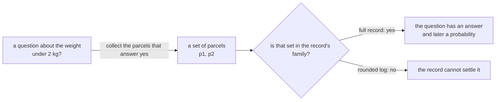
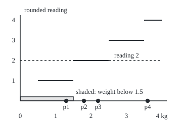

# Measurable functions: every "is it below a?" set is measurable, so every question about the values has an answer

[Syllabus](../../../SYLLABUS.md) → [Measure and integration](../../../SYLLABUS.md#w10) → [Measurable Functions](../../../SYLLABUS.md#w10-s03) → Measurable functions

---

## General Overview

Four parcels ride a warehouse belt across a scale. Parcel p1 weighs 1.3 kg, p2 1.8 kg, p3 2.2 kg, p4 3.6 kg. The shipping desk asks one question: which parcels are under 2 kg? The answer is a set of parcels, p1 and p2. Every question about weight works this way. It names a range of weights and hands back the parcels whose weight lands there: the **preimage** of that range ([Functions](../../01-Foundations/08-Relations%20and%20Functions/02-functions.md)).

Now suppose the desk never sees the scale. It sees a logbook, and the logbook keeps only each weight rounded to the nearest kilogram: 1, 2, 2 and 4. From the log, "under 1.5 kg?" is settled: only the parcel logged as 1 qualifies. "Under 2.5 kg?" is settled too. "Under 2 kg?" is not. Parcels p2 and p3 are both logged as 2, and one of them is under 2 kg while the other is over. The log cannot split them.

So whether a question about weight has an answer depends on two things: the weight function, and the family of parcel sets the record can settle. That family is a **sigma-algebra**: a collection of sets closed under complements and countable unions, read "the collection of sets we allow ourselves to measure" ([Sigma-algebras](../01-Sets%20You%20Can%20Measure/02-sigma-algebras.md)). A function is **measurable** when every question about its value pulls back to a set in that family. There are far too many questions to check one by one. This card proves that the single kind of question "is the value below a?", asked at every threshold a, is enough.

**A function is measurable when the set of inputs answering "is the value in B?" is always an allowed set; checking only the rays "is the value below a?" for every a settles all of them, and continuous functions, indicators of allowed sets and compositions with Borel functions pass.**

**What kind of fact this is:** a definition (measurability), and a theorem proved on this card in Why it works: the threshold test suffices, continuous and indicator functions pass it, and a Borel function of a measurable function is measurable.

### The picture: a question about the value becomes a set of inputs



The weight function is measurable for a record exactly when no question ends on the "cannot settle" branch.

---

## The formula

Notation first, in words. $\Omega$ is the set of inputs, here the parcels, and $\omega$ is one of them. $\mathcal{F}$ is a sigma-algebra on $\Omega$. $\mathcal{B}(\mathbb{R})$ is the Borel sets, the family generated by the rays "below t" on the real line ([Generated sigma-algebras and Borel sets](../01-Sets%20You%20Can%20Measure/03-generated-and-borel-sigma-algebras.md)). For a set $B$ of values, $f^{-1}(B)$ is its preimage: every input whose value lies in $B$. It needs no inverse function. The shorthand $\{f < a\}$ means the preimage of the ray below $a$, the inputs whose value is below $a$.

$$f \text{ is } \mathcal{F}\text{-measurable} \quad\text{when}\quad f^{-1}(B) = \{\omega \in \Omega : f(\omega) \in B\} \in \mathcal{F} \ \text{ for every } B \in \mathcal{B}(\mathbb{R}).$$

**Read it aloud:** for every Borel set of values, the inputs whose value lands in it form an allowed set.

$$f \text{ is } \mathcal{F}\text{-measurable} \quad\Longleftrightarrow\quad \{f < a\} \in \mathcal{F} \ \text{ for every real } a.$$

**Read it aloud:** it is enough to check that "is the value below a?" is an allowed question at every threshold a.

Three consequences, each proved below:

$$g \text{ continuous} \Rightarrow g \text{ Borel}; \qquad \mathbf{1}_A \text{ measurable} \iff A \in \mathcal{F}; \qquad (g \circ f)^{-1}(B) = f^{-1}\big(g^{-1}(B)\big).$$

A **Borel function** $g$ is one that is measurable from the line to the line, both sides carrying the Borel sets. The **indicator** $\mathbf{1}_A$ is read "one on A, zero off it". $g \circ f$ means "apply f, then g".

| Symbol | Plain meaning | In our example | Push it up and the answer… |
| --- | --- | --- | --- |
| $\Omega$, $\omega$ | the inputs; one input | the four parcels; p2 | more inputs, more sets to settle |
| $\mathcal{F}$ | a sigma-algebra: the sets a record can settle | the full record, 16 sets; the rounded log, 8 sets | a bigger family makes more functions measurable |
| $f$, $W$ | a real-valued function on the inputs; the weight | $W$(p2) = 1.8 kg | — |
| $R$, $k$ | the rounded reading; the smallest whole number at or above $a$ | $R$(p2) = 2; $k$ = 2 at $a$ = 2 | — |
| $a$, $n$ | a threshold; a counter in $a + 1/n$ | 2 kg; 1, 10, 1000 | $\{f < a\}$ grows with $a$ |
| $B$, $\mathcal{B}(\mathbb{R})$ | a set of values; the Borel sets of the line | the ray below 2; every interval | — |
| $f^{-1}(B)$, $\{f < a\}$ | the preimage: inputs whose value is in $B$; below $a$ | $\{W < 2\}$ = p1, p2 | grows as $B$ grows |
| $\mathcal{D}$ | the value sets whose preimage is allowed | used in the proof | — |
| $x$, $y$, ε, δ, $r$, $B_n$ | proof letters: points of the line; a tolerance and its window; the rounding map; a list of value sets | $r$(1.8) = 2, the reading of p2 | — |
| $g$, $g \circ f$ | a function on the line; f then g | rounding; $R$ = round of $W$ | — |
| $A$, $\mathbf{1}_A$ | an input set; its indicator, one on A, zero off it | "fragile", p2 and p3 | — |

### When it holds

- **A named sigma-algebra on the inputs.** Measurability is always "measurable for this family". The weight is measurable for the full record and not for the rounded log; drop the name and the claim has no content.
- **Every threshold, not just some.** The test needs "below a?" for every real a, or at least a dense set of them such as the rationals. A log of whole-kilogram floors passes at a = 1, 2, 3, 4 and still fails at 1.5.
- **Borel sets on the value side.** Demanding an allowed preimage for every subset of the line is too strong: on the line with its Borel sets, even $g(x) = x$ fails, because a non-Borel set is its own preimage.
- **Values that may be infinite.** The same test works with nothing added. The set where a function is plus infinity is the complement of the union of the sets $\{f < n\}$, and the set where it is minus infinity is the intersection of the sets $\{f < -n\}$, so both are allowed automatically; [Sums, products, sups and limits](02-limits-of-measurable-functions.md) uses extended values this way.

---

## Why it works

### Step 0: preimages respect every set operation

The whole card rests on one fact. Asking "is the value outside B?" collects exactly the inputs not collected by "is the value in B?". Asking "is the value in any of B1, B2, B3, …?" collects the inputs collected by at least one of them. So the preimage of a complement is the complement of the preimage, and the preimage of a countable union is the union of the preimages. Forward images do not behave this well; preimages do.

### Step 1: the good value-sets form a sigma-algebra

Collect every set of values whose preimage is allowed:

$$\mathcal{D} = \{\, B \subseteq \mathbb{R} : f^{-1}(B) \in \mathcal{F} \,\}.$$

By Step 0 this family is closed under complements and countable unions, and it holds the whole line, whose preimage is all of $\Omega$. So $\mathcal{D}$ is a sigma-algebra on the line. It is the list of questions about the value that the record can settle.

### Step 2: the threshold test is enough

If every ray below $a$ lies in $\mathcal{D}$, then $\mathcal{D}$ is a sigma-algebra holding every ray. The Borel sets are the smallest such family, so every Borel set lies in $\mathcal{D}$. That is measurability. The converse is free: rays are Borel.

This is where the generated sigma-algebra earns its keep. Nobody checks the uncountably many Borel sets. The rays generate them, and preimages carry the generation across.

On the parcels, the other questions come out as the generation card says they must. "At most 2.2 kg?" is the countable intersection of "below 2.2 + 1/n?"; at n = 1, 10 and 1000 the answer is p1, p2, p3 each time. "Exactly 2.2 kg?" is "at most 2.2" with "below 2.2" removed: p3.

### Step 3: the finite picture, in full

On four parcels there are 15 sigma-algebras, one for each way of cutting the parcels into blocks, called **atoms**: the smallest nonempty allowed sets. A function is measurable for such a family exactly when it is constant on each atom. If two parcels in one atom had different values, a threshold between them would select part of the atom, which is not an allowed set.

The rounded log has atoms p1 | p2, p3 | p4. The rounded reading $R$ (1, 2, 2, 4) is constant on each: measurable. The weight $W$ (1.3, 1.8, 2.2, 3.6) splits the middle atom: not measurable, and "under 2 kg?" is the question that shows it. The full record, with all 16 sets, makes every function measurable.

The code tests every one of the 81 ways to give four parcels weights of 1, 2 or 3 kg, against all 15 families, by three tests: every set of values, thresholds only, and constant on atoms. All three find 309 measurable pairs. A formula agrees: a family with k atoms admits 3 to the power k such functions. One family has 1 atom, seven have 2, six have 3 and one has 4: the Stirling numbers S(4, k), which count the ways to cut four things into k blocks. Summing over the families gives 1 × 3 + 7 × 9 + 6 × 27 + 1 × 81 = 309.

### Step 4: continuous functions pass

A continuous function $g$ has an open set $\{g < a\}$ for every $a$. Take a point $x$ with $g(x) < a$. The gap $a - g(x)$ is positive, and continuity ([Continuity](../../06-Calculus%20and%20analysis/01-Limits%20and%20Continuity/05-continuity.md)) gives a window around $x$ on which $g$ stays within that gap of $g(x)$, so still below $a$. Every point of the set has room around it: the set is open. Open sets are Borel, so the threshold test passes.

The shipping desk's distance from the declared 2 kg, the absolute value of $W - 2$, is continuous in the weight. Its set "below a" is the open interval from $2 - a$ to $2 + a$ when $a$ is positive and empty otherwise. The code checks that at 4469 exact point-threshold pairs.

### Step 5: indicators pass exactly when their set is allowed

Mark the fragile parcels, $A$ = p2, p3, with $\mathbf{1}_A$: 1 on them, 0 on the rest. Its set "below a" is empty when $a$ is 0 or less, the non-fragile parcels when $a$ lies in (0, 1], and everything above 1. So $\mathbf{1}_A$ is measurable exactly when $A$ is allowed, since a sigma-algebra holds a set when it holds its complement. For the rounded log, the 8 sets in it give 8 measurable indicators out of 16; the code checks all 16.

### Step 6: a measurable function of a measurable function

Rounding comes after weighing. The inputs whose rounded weight lies in $B$ are the inputs whose weight lies in the set of weights that round into $B$:

$$\{\, g(f) \in B \,\} = \{\, f \in g^{-1}(B) \,\}.$$

If $g$ is Borel, $g^{-1}(B)$ is a Borel set of weights; if $f$ is measurable, its preimage is allowed. So $g \circ f$ is measurable.

Rounding to the nearest kilogram, halves rounding up, is not continuous: it jumps from 1 to 2 at 1.5. It is Borel all the same. A rounded value below $a$ means a rounded value of at most $k - 1$, where $k$ is the smallest whole number at or above $a$, which means a weight below $k - 0.5$. So the set "round below a" is the ray below $k - 0.5$. For $a = 2$ that is the ray below 1.5: the rounded reading is below 2 exactly when the weight is below 1.5 kg. Hence the rounded sensor $R$, rounding applied after $W$, is measurable for any record that makes $W$ measurable. The converse fails: the rounded log makes $R$ measurable and not $W$.

### The picture: the rounding staircase and one preimage

<p align="center"></p>

To scale: 70 units per kilogram across (weight 0 at 40, 1 kg at 110) and 40 units per reading up (reading 1 at 160, reading 4 at 40). The steps jump at 75, 145, 215 and 285, the weights 0.5, 1.5, 2.5 and 3.5 kg; the reading-0 step lies on the axis. The parcels sit at 131, 166, 194 and 292. Every reading below the dashed line comes from the shaded weights, a ray, even though the staircase jumps.

<details>
<summary>Detailed proof</summary>

**Claim 1: preimages respect set operations.** For any function $f$ from $\Omega$ to the line, any value sets $B, B_1, B_2, \ldots$: $\omega \in f^{-1}(\mathbb{R} \setminus B)$ iff $f(\omega) \notin B$ iff $\omega \notin f^{-1}(B)$; and $\omega \in f^{-1}(\bigcup_n B_n)$ iff $f(\omega) \in B_n$ for some $n$ iff $\omega \in \bigcup_n f^{-1}(B_n)$. Also $f^{-1}(\mathbb{R}) = \Omega$.

**Claim 2: $\mathcal{D}$ is a sigma-algebra on the line.** $\mathbb{R} \in \mathcal{D}$ since $\Omega \in \mathcal{F}$. If $B \in \mathcal{D}$, the preimage of its complement is $\Omega \setminus f^{-1}(B)$ by Claim 1, in $\mathcal{F}$ by its complement rule. If each $B_n \in \mathcal{D}$, the preimage of the union is the union of the preimages by Claim 1, in $\mathcal{F}$ by its union rule.

**Claim 3: the threshold test.** Suppose $\{f < a\} \in \mathcal{F}$ for every real $a$. Then every ray $(-\infty, a)$ lies in $\mathcal{D}$. The rays generate $\mathcal{B}(\mathbb{R})$, and a generated sigma-algebra lies inside every sigma-algebra holding its generators ([Generated sigma-algebras and Borel sets](../01-Sets%20You%20Can%20Measure/03-generated-and-borel-sigma-algebras.md), Claims 2 and 6). By Claim 2, $\mathcal{D}$ is such a sigma-algebra, so $\mathcal{B}(\mathbb{R}) \subseteq \mathcal{D}$: every Borel preimage is allowed. Conversely, each ray is Borel, so a measurable $f$ passes the test. The same card shows rays at rational $a$ alone generate the Borel sets, so the test may be run at rational thresholds only.

**Claim 4: other questions.** $\{f \le a\} = \bigcap_n \{f < a + 1/n\}$, since a value above $a$ exceeds $a + 1/n$ once $1/n$ is below its gap; $\{f = a\} = \{f \le a\} \setminus \{f < a\}$; $\{a \le f < b\} = \{f < b\} \setminus \{f < a\}$. Each is built from allowed sets by countable operations.

**Claim 5: continuous functions are Borel.** Let $g$ be continuous and $g(x) < a$. With tolerance ε = $a - g(x) > 0$, continuity at $x$ gives δ > 0 such that $|g(y) - g(x)| < a - g(x)$ whenever $|y - x| < δ$; then $g(y) < a$. So $\{g < a\}$ contains an interval around each of its points: it is open, hence Borel ([Generated sigma-algebras and Borel sets](../01-Sets%20You%20Can%20Measure/03-generated-and-borel-sigma-algebras.md), Step 6). By Claim 3 with $\Omega = \mathbb{R}$ and $\mathcal{F} = \mathcal{B}(\mathbb{R})$, $g$ is Borel.

**Claim 6: indicators.** $\{\mathbf{1}_A < a\}$ is $\varnothing$ for $a \le 0$, $\Omega \setminus A$ for $0 < a \le 1$, and $\Omega$ for $a > 1$. If $A \in \mathcal{F}$, all three are in $\mathcal{F}$, so Claim 3 gives measurability. If $\mathbf{1}_A$ is measurable, $\Omega \setminus A = \{\mathbf{1}_A < 1/2\} \in \mathcal{F}$, so $A \in \mathcal{F}$ by the complement rule.

**Claim 7: composition.** Let $f$ be $\mathcal{F}$-measurable and $g$ Borel. For Borel $B$: $\omega \in (g \circ f)^{-1}(B)$ iff $g(f(\omega)) \in B$ iff $f(\omega) \in g^{-1}(B)$. The set $g^{-1}(B)$ is Borel because $g$ is Borel, so its preimage under $f$ is in $\mathcal{F}$.

**Claim 8: rounding is Borel.** Let $r(x)$ be the largest whole number at most $x + 1/2$. Fix $a$ and let $k$ be the smallest whole number at least $a$. Since $r(x)$ is whole, $r(x) < a$ iff $r(x) \le k - 1$ iff $x + 1/2 < k$ (the largest whole number at most $x + 1/2$ is at most $k - 1$ exactly when $x + 1/2 < k$) iff $x < k - 1/2$. So $\{r < a\}$ is the ray below $k - 1/2$, Borel; Claim 3 finishes. With Claim 7, $r \circ W$ is measurable whenever $W$ is.

</details>

Sums, products, maxima and limits of measurable functions are the next card's work: [Sums, products, sups and limits](02-limits-of-measurable-functions.md).

---

## Worked numbers, by hand

| Step | Arithmetic | Value |
| --- | --- | --- |
| rounded readings | 1.3, 1.8, 2.2, 3.6 to the nearest kg | 1, 2, 2, 4 |
| the log's atoms | parcels with equal readings | p1 \| p2, p3 \| p4 |
| sets the log settles | every union of some of the three atoms, 2 × 2 × 2 | **8** |
| "under 2 kg?" | $W$ below 2: p1 (1.3), p2 (1.8) | p1, p2: splits an atom, **not settled** |
| "under 1.5 kg?" | only 1.3 | p1: settled |
| "rounded reading below 2?" | $k = 2$, so weight below 2 − 0.5 | same set as "under 1.5 kg?": p1 |
| "exactly 2.2 kg?" | at most 2.2, remove below 2.2 | p3 |
| measurable pairs on four parcels | 1 × 3 + 7 × 9 + 6 × 27 + 1 × 81 | **309** |

The rounded log answers every question about the rounded reading and some questions about the weight, but never "under 2 kg?": the weight is not measurable for the log, and the reading is.

### What breaks if you drop a piece

| Mistake | Comes out at | What went wrong |
| --- | --- | --- |
| Testing whole thresholds only, on a log of floors (1, 1, 2, 3) | passes at 1, 2, 3, 4 kg; fails at 1.5: p1 alone is not in the log | the test needs every threshold, or a dense set |
| Calling the weight measurable without naming the family | measurable for the full record; for the rounded log, "under 2 kg" = p1, p2 is not settled | measurability belongs to a function and a sigma-algebra together |
| Rejecting the rounding sensor because it jumps | "rounded reading below 2" is the ray below 1.5, Borel | continuity is enough for measurability, not needed |

The code prints all three.

---

## Code, from first principles, and it actually runs

Part one searches all 65536 families of subsets of four parcels for sigma-algebras and finds the 15. For each, it tests all 81 functions three independent ways (preimage of every set of values, thresholds only, constant on atoms) and compares the count with a fourth road, the Stirling-number formula. Part two builds the rounded log by closing the reading's threshold sets under complements and unions, then asks the parcel questions of it and of the full record. Part three checks the rounding and distance preimage formulas at exact rational points on the line. The code checks finite families and finitely many points; that the threshold test works for every sigma-algebra and every function is what the proof shows.

### Python

```python
# Measurable functions -- the check behind the card.  Standard library only;
# fractions keeps every weight exact.  Four parcels on a belt scale weigh 1.3,
# 1.8, 2.2 and 3.6 kg.  Part 1 lists every sigma-algebra on four parcels and
# tests measurability three ways against a count by formula.  Part 2 asks the
# weight questions of the full record and of a log of rounded readings.  Part 3
# checks the preimage formulas on the line at exact rational points.
from fractions import Fraction as Fr
from math import floor, ceil

N, FULL = 4, 15
W = [Fr(13, 10), Fr(18, 10), Fr(22, 10), Fr(36, 10)]

def show(m): return "{" + ", ".join(f"p{i + 1}" for i in range(N) if m >> i & 1) + "}"
def kg(x): return f"{float(x):.3f}".rstrip("0").rstrip(".")
def yn(c): return "yes" if c else "no"
def pre(f, test): return sum(1 << i for i in range(N) if test(f[i]))    # preimage, as a bit mask
def rnd(x): return floor(x + Fr(1, 2))              # nearest whole kg, halves round up
def mem(fam): return [a for a in range(16) if fam >> a & 1]

def is_sigma(fam):                                  # fam: 16 bits, bit a set when set a is in
    ms = mem(fam)
    return fam & 1 and all(fam >> (FULL ^ a) & 1 for a in ms) and all(fam >> (a | b) & 1 for a in ms for b in ms)

def close(gens):                                    # complements and unions until nothing changes
    fam = {0, FULL} | set(gens)
    while True:
        new = fam | {FULL ^ a for a in fam} | {a | b for a in fam for b in fam}
        if new == fam: return sum(1 << a for a in fam)
        fam = new

def atoms(fam):                                     # the smallest member holding each parcel
    out = []
    for i in range(N):
        at = FULL
        for a in mem(fam):
            if a >> i & 1: at &= a
        if at not in out: out.append(at)
    return out

def by_definition(f, fam):                          # every set of values: 8 of them for 3 values
    vals = sorted(set(f))
    return all(fam >> pre(f, lambda v: v in [vals[j] for j in range(len(vals)) if s >> j & 1]) & 1
               for s in range(1 << len(vals)))
def by_threshold(f, fam, grid):                     # only the questions "below a?"
    return all(fam >> pre(f, lambda v: v < a) & 1 for a in grid)
def by_atoms(f, fam):                               # constant on every atom
    return all(len({f[i] for i in range(N) if at >> i & 1}) == 1 for at in atoms(fam))

# ---- part 1: every sigma-algebra on four parcels, every map to 1, 2 or 3 kg ----
sigmas = [fam for fam in range(1 << 16) if is_sigma(fam)]
maps = [(a, b, c, d) for a in (1, 2, 3) for b in (1, 2, 3) for c in (1, 2, 3) for d in (1, 2, 3)]
grid = [Fr(k, 4) for k in range(-2, 18)]
c_def = sum(by_definition(f, s) for s in sigmas for f in maps)
c_thr = sum(by_threshold(f, s, grid) for s in sigmas for f in maps)
c_atm = sum(by_atoms(f, s) for s in sigmas for f in maps)
S = [[1]]                                           # Stirling numbers: S(n, k) = k S(n-1, k) + S(n-1, k-1)
for n in range(1, N + 1):
    S.append([0] + [k * (S[n - 1][k] if k < n else 0) + S[n - 1][k - 1] for k in range(1, n + 1)])
by_k = {k: [s for s in sigmas if len(atoms(s)) == k] for k in range(1, N + 1)}
print(f"four parcels: {1 << 16} families searched, sigma-algebras {len(sigmas)}, Stirling sum {sum(S[N])}, maps {len(maps)}")
print("atoms k | sigma-algebras | Stirling S(4,k) | measurable maps to {1,2,3} in each")
for k in range(1, N + 1):
    per = sorted({sum(by_definition(f, s) for f in maps) for s in by_k[k]})
    print(f"      {k} | {len(by_k[k]):14} | {S[N][k]:15} | {per} (3^{k} = {3 ** k})")
stir = sum(S[N][k] * 3 ** k for k in range(1, N + 1))
print(f"measurable (sigma-algebra, map) pairs: definition {c_def}, threshold {c_thr}, atoms {c_atm}, formula {stir}")

# ---- part 2: the belt scale, the full record and the rounded log ----
R = [rnd(w) for w in W]
log = close([pre(R, lambda v, a=a: v < a) for a in range(0, 6)])
flog = close([pre([floor(w) for w in W], lambda v, a=a: v < a) for a in range(0, 6)])
full = (1 << 16) - 1
print(f"full record: {len(mem(full))} sets; ", end="")
print("weights " + ", ".join(f"p{i + 1} {kg(w)}" for i, w in enumerate(W)) + " kg; rounded readings " + str(R))
print(f"rounded log: {len(mem(log))} sets, atoms " + " | ".join(show(a) for a in atoms(log)) + f"; a sigma-algebra: {yn(log in sigmas)}")
for a in (Fr(3, 2), Fr(2), Fr(5, 2)):
    q = pre(W, lambda v: v < a)
    print(f"question 'under {kg(a)} kg': parcels {show(q)}; full record {yn(full >> q & 1)}; rounded log {yn(log >> q & 1)}")
print(f"W measurable for the full record: {yn(by_threshold(W, full, grid))}; for the rounded log: {yn(by_threshold(W, log, grid))}")
print(f"R measurable for the full record: {yn(by_threshold(R, full, grid))}; for the rounded log: {yn(by_threshold(R, log, grid))}")
agree = sum(pre(R, lambda v: v < a) == pre(W, lambda v: v < ceil(a) - Fr(1, 2)) for a in grid)
print(f"{{R < 2}} = {show(pre(R, lambda v: v < 2))}, and {{W < 1.5}} = {show(pre(W, lambda v: v < Fr(3, 2)))}; "
      f"{{R < a}} = {{W < ceil(a) - 0.5}} at {agree} of {len(grid)} thresholds")
st = [show(pre(W, lambda v: v < Fr(11, 5) + Fr(1, n))) for n in (1, 10, 1000)]
eq = pre(W, lambda v: v <= Fr(11, 5)) & (FULL ^ pre(W, lambda v: v < Fr(11, 5)))
print(f"{{W < 2.2 + 1/n}} at n = 1, 10, 1000: {', '.join(st)}; {{W = 2.2}} = {show(eq)}")
ind = sum(by_threshold([A >> i & 1 for i in range(N)], log, grid) == bool(log >> A & 1) for A in range(16))
print(f"indicator of A measurable for the log exactly when A is in it: {ind} of 16 sets, {len(mem(log))} measurable")

# ---- part 3: preimages on the line, at exact rational points ----
xs = [Fr(k, 16) for k in range(-16, 81)] + [Fr(2 * k + 1, 2) + e for k in range(-1, 5) for e in (Fr(-1, 1000), Fr(1, 1000))]
ts = [Fr(k, 8) for k in range(-8, 33)]
r_ok = sum((rnd(x) < a) == (x < ceil(a) - Fr(1, 2)) for x in xs for a in ts)
d_ok = sum((abs(x - 2) < a) == (a > 0 and 2 - a < x < 2 + a) for x in xs for a in ts)
print(f"line: {len(xs)} points x {len(ts)} thresholds = {len(xs) * len(ts)} pairs")
print(f"  round(x) < a  iff  x < ceil(a) - 0.5          : {r_ok} pairs agree")
print(f"  |x - 2| < a   iff  2 - a < x < 2 + a (a > 0)  : {d_ok} pairs agree")
print(f"  round jumps at 1.5: {rnd(Fr(3, 2) - Fr(1, 1000))} at 1.499, {rnd(Fr(3, 2))} at 1.5; still {{round < 2}} = (-inf, 1.5)")

# ---- what breaks ----
fl = [pre(W, lambda v, a=a: v < a) for a in range(1, 5)]
print(f"break 1, floor log, whole thresholds only: {{W < 1}}..{{W < 4}} all in it: {yn(all(flog >> q & 1 for q in fl))}; "
      f"{{W < 1.5}} = {show(pre(W, lambda v: v < Fr(3, 2)))} in it: {yn(flog >> pre(W, lambda v: v < Fr(3, 2)) & 1)}")
print(f"break 2, W against the rounded log: {{W < 2}} = {show(pre(W, lambda v: v < 2))} settled: {yn(log >> pre(W, lambda v: v < 2) & 1)}")
print(f"break 3, 'jumps, so not measurable': {{round < 2}} is the ray below {kg(ceil(Fr(2)) - Fr(1, 2))}, a Borel set")
print("figure, x = 40 + 70 w, y = 200 - 40 v; step ends " + ", ".join(str(40 + 70 * Fr(2 * k + 1, 2)) for k in range(4))
      + "; levels 1-4 at " + ", ".join(str(200 - 40 * v) for v in range(1, 5)) + "; parcels at " + ", ".join(str(40 + 70 * w) for w in W))
assert len(sigmas) == sum(S[N]) == 15                           # search against Stirling/Bell
assert c_def == c_thr == c_atm == stir == 309                    # three tests and a formula agree
assert r_ok == d_ok == len(xs) * len(ts) and agree == len(grid)  # preimage formulas on the line
assert not log >> pre(W, lambda v: v < 2) & 1 and log >> pre(W, lambda v: v < Fr(5, 2)) & 1 and ind == 16
assert by_threshold(R, log, grid) and not by_threshold(W, log, grid)  # R settled by the log, W not
print("ALL CHECKS PASS")
```

**Ran 2026-09-29 on macOS, Python 3.14.6, standard library only. All checks passed. Output, pasted from the run:**

```
four parcels: 65536 families searched, sigma-algebras 15, Stirling sum 15, maps 81
atoms k | sigma-algebras | Stirling S(4,k) | measurable maps to {1,2,3} in each
      1 |              1 |               1 | [3] (3^1 = 3)
      2 |              7 |               7 | [9] (3^2 = 9)
      3 |              6 |               6 | [27] (3^3 = 27)
      4 |              1 |               1 | [81] (3^4 = 81)
measurable (sigma-algebra, map) pairs: definition 309, threshold 309, atoms 309, formula 309
full record: 16 sets; weights p1 1.3, p2 1.8, p3 2.2, p4 3.6 kg; rounded readings [1, 2, 2, 4]
rounded log: 8 sets, atoms {p1} | {p2, p3} | {p4}; a sigma-algebra: yes
question 'under 1.5 kg': parcels {p1}; full record yes; rounded log yes
question 'under 2 kg': parcels {p1, p2}; full record yes; rounded log no
question 'under 2.5 kg': parcels {p1, p2, p3}; full record yes; rounded log yes
W measurable for the full record: yes; for the rounded log: no
R measurable for the full record: yes; for the rounded log: yes
{R < 2} = {p1}, and {W < 1.5} = {p1}; {R < a} = {W < ceil(a) - 0.5} at 20 of 20 thresholds
{W < 2.2 + 1/n} at n = 1, 10, 1000: {p1, p2, p3}, {p1, p2, p3}, {p1, p2, p3}; {W = 2.2} = {p3}
indicator of A measurable for the log exactly when A is in it: 16 of 16 sets, 8 measurable
line: 109 points x 41 thresholds = 4469 pairs
  round(x) < a  iff  x < ceil(a) - 0.5          : 4469 pairs agree
  |x - 2| < a   iff  2 - a < x < 2 + a (a > 0)  : 4469 pairs agree
  round jumps at 1.5: 1 at 1.499, 2 at 1.5; still {round < 2} = (-inf, 1.5)
break 1, floor log, whole thresholds only: {W < 1}..{W < 4} all in it: yes; {W < 1.5} = {p1} in it: no
break 2, W against the rounded log: {W < 2} = {p1, p2} settled: no
break 3, 'jumps, so not measurable': {round < 2} is the ray below 1.5, a Borel set
figure, x = 40 + 70 w, y = 200 - 40 v; step ends 75, 145, 215, 285; levels 1-4 at 160, 120, 80, 40; parcels at 131, 166, 194, 292
ALL CHECKS PASS
```

### Rust

Same numbers, same labels, built with `rustc --edition 2021 -O`. Weights are whole numbers of 1/2000 kg, so every comparison is exact.

```rust
// Measurable functions -- the same check as the Python, in Rust.  No crates.
// Exact arithmetic by hand: every weight and threshold is a whole number of
// units of 1/2000 kg.  Four parcels on a belt scale weigh 1.3, 1.8, 2.2 and
// 3.6 kg.  Part 1 lists every sigma-algebra on four parcels and tests
// measurability three ways against a count by formula.  Part 2 asks the weight
// questions of the full record and of a log of rounded readings.  Part 3
// checks the preimage formulas on the line at exact rational points.
const N: usize = 4;
const FULL: usize = 15;
const U: i64 = 2000; // units per kg

fn show(m: usize) -> String {
    let v: Vec<String> = (0..N).filter(|i| m >> i & 1 == 1).map(|i| format!("p{}", i + 1)).collect();
    format!("{{{}}}", v.join(", "))
}
fn kg(u: i64) -> String {
    let s = format!("{:.3}", u as f64 / U as f64);
    s.trim_end_matches('0').trim_end_matches('.').to_string()
}
fn yn(c: bool) -> &'static str { if c { "yes" } else { "no" } }
fn pre(f: &[i64], test: impl Fn(i64) -> bool) -> usize { // preimage, as a bit mask
    (0..N).filter(|&i| test(f[i])).map(|i| 1 << i).sum()
}
fn rnd(x: i64) -> i64 { (x + U / 2).div_euclid(U) } // nearest whole kg, halves round up
fn ceil_kg(a: i64) -> i64 { -((-a).div_euclid(U)) } // whole kg at or above a
fn has(fam: usize, a: usize) -> bool { fam >> a & 1 == 1 }
fn mem(fam: usize) -> Vec<usize> { (0..16).filter(|&a| has(fam, a)).collect() }

fn is_sigma(fam: usize) -> bool {
    let ms = mem(fam);
    has(fam, 0) && ms.iter().all(|&a| has(fam, FULL ^ a)) && ms.iter().all(|&a| ms.iter().all(|&b| has(fam, a | b)))
}
fn close(gens: &[usize]) -> usize { // complements and unions until nothing changes
    let mut fam: usize = 1 | 1 << FULL;
    for &g in gens { fam |= 1 << g }
    loop {
        let mut new = fam;
        for a in mem(fam) {
            new |= 1 << (FULL ^ a);
            for b in mem(fam) { new |= 1 << (a | b) }
        }
        if new == fam { return fam }
        fam = new;
    }
}
fn atoms(fam: usize) -> Vec<usize> { // the smallest member holding each parcel
    let mut out = vec![];
    for i in 0..N {
        let mut at = FULL;
        for a in mem(fam) { if a >> i & 1 == 1 { at &= a } }
        if !out.contains(&at) { out.push(at) }
    }
    out
}
fn by_definition(f: &[i64], fam: usize) -> bool { // every set of values
    let mut vals = f.to_vec();
    vals.sort();
    vals.dedup();
    (0..1usize << vals.len()).all(|s| {
        let chosen: Vec<i64> = (0..vals.len()).filter(|j| s >> j & 1 == 1).map(|j| vals[j]).collect();
        has(fam, pre(f, |v| chosen.contains(&v)))
    })
}
fn by_threshold(f: &[i64], fam: usize, grid: &[i64]) -> bool { // only "below a?"
    grid.iter().all(|&a| has(fam, pre(f, |v| v < a)))
}
fn by_atoms(f: &[i64], fam: usize) -> bool { // constant on every atom
    atoms(fam).iter().all(|&at| {
        let v: Vec<i64> = (0..N).filter(|i| at >> i & 1 == 1).map(|i| f[i]).collect();
        v.iter().all(|&x| x == v[0])
    })
}

fn main() {
    // ---- part 1: every sigma-algebra on four parcels, every map to 1, 2 or 3 kg ----
    let sigmas: Vec<usize> = (0..1usize << 16).filter(|&f| is_sigma(f)).collect();
    let mut maps: Vec<Vec<i64>> = vec![];
    for n in 0..81 { maps.push(vec![n / 27 % 3 + 1, n / 9 % 3 + 1, n / 3 % 3 + 1, n % 3 + 1].iter().map(|v| v * U).collect()) }
    let grid: Vec<i64> = (-2..18).map(|k| k * U / 4).collect();
    let count = |t: &dyn Fn(&[i64], usize) -> bool| -> usize {
        sigmas.iter().map(|&s| maps.iter().filter(|f| t(f, s)).count()).sum()
    };
    let c_def = count(&|f, s| by_definition(f, s));
    let c_thr = count(&|f, s| by_threshold(f, s, &grid));
    let c_atm = count(&|f, s| by_atoms(f, s));
    let mut st: Vec<Vec<i64>> = vec![vec![1]]; // Stirling numbers: S(n, k) = k S(n-1, k) + S(n-1, k-1)
    for n in 1..=N {
        let mut row = vec![0i64];
        for k in 1..=n { row.push(k as i64 * if k < n { st[n - 1][k] } else { 0 } + st[n - 1][k - 1]) }
        st.push(row);
    }
    let bell: i64 = st[N].iter().sum();
    println!("four parcels: {} families searched, sigma-algebras {}, Stirling sum {}, maps {}", 1 << 16, sigmas.len(), bell, maps.len());
    println!("atoms k | sigma-algebras | Stirling S(4,k) | measurable maps to {{1,2,3}} in each");
    for k in 1..=N {
        let with_k: Vec<usize> = sigmas.iter().copied().filter(|&s| atoms(s).len() == k).collect();
        let mut per: Vec<usize> = with_k.iter().map(|&s| maps.iter().filter(|f| by_definition(f, s)).count()).collect();
        per.sort();
        per.dedup();
        println!("      {} | {:14} | {:15} | {:?} (3^{} = {})", k, with_k.len(), st[N][k], per, k, 3i64.pow(k as u32));
    }
    let stir: i64 = (1..=N).map(|k| st[N][k] * 3i64.pow(k as u32)).sum();
    println!("measurable (sigma-algebra, map) pairs: definition {}, threshold {}, atoms {}, formula {}", c_def, c_thr, c_atm, stir);

    // ---- part 2: the belt scale, the full record and the rounded log ----
    let w: Vec<i64> = vec![2600, 3600, 4400, 7200];
    let r: Vec<i64> = w.iter().map(|&x| rnd(x)).collect();
    let fw: Vec<i64> = w.iter().map(|&x| x.div_euclid(U)).collect();
    let log = close(&(0..6).map(|a| pre(&r, |v| v < a)).collect::<Vec<_>>());
    let flog = close(&(0..6).map(|a| pre(&fw, |v| v < a)).collect::<Vec<_>>());
    let full = (1usize << 16) - 1;
    let r_units: Vec<i64> = r.iter().map(|v| v * U).collect();
    let ws: Vec<String> = (0..N).map(|i| format!("p{} {}", i + 1, kg(w[i]))).collect();
    println!("full record: {} sets; weights {} kg; rounded readings {:?}", mem(full).len(), ws.join(", "), r);
    let at: Vec<String> = atoms(log).iter().map(|&a| show(a)).collect();
    println!("rounded log: {} sets, atoms {}; a sigma-algebra: {}", mem(log).len(), at.join(" | "), yn(sigmas.contains(&log)));
    for a in [3000i64, 4000, 5000] {
        let q = pre(&w, |v| v < a);
        println!("question 'under {} kg': parcels {}; full record {}; rounded log {}", kg(a), show(q), yn(has(full, q)), yn(has(log, q)));
    }
    println!("W measurable for the full record: {}; for the rounded log: {}", yn(by_threshold(&w, full, &grid)), yn(by_threshold(&w, log, &grid)));
    println!("R measurable for the full record: {}; for the rounded log: {}", yn(by_threshold(&r_units, full, &grid)), yn(by_threshold(&r_units, log, &grid)));
    let agree = grid.iter().filter(|&&a| pre(&r_units, |v| v < a) == pre(&w, |v| v < ceil_kg(a) * U - U / 2)).count();
    println!("{{R < 2}} = {}, and {{W < 1.5}} = {}; {{R < a}} = {{W < ceil(a) - 0.5}} at {} of {} thresholds",
             show(pre(&r, |v| v < 2)), show(pre(&w, |v| v < 3000)), agree, grid.len());
    let stg: Vec<String> = [1i64, 10, 1000].iter().map(|n| show(pre(&w, |v| v < 4400 + U / n))).collect();
    let eq = pre(&w, |v| v <= 4400) & (FULL ^ pre(&w, |v| v < 4400));
    println!("{{W < 2.2 + 1/n}} at n = 1, 10, 1000: {}; {{W = 2.2}} = {}", stg.join(", "), show(eq));
    let ind = (0..16usize).filter(|&a| {
        let f: Vec<i64> = (0..N).map(|i| (a >> i & 1) as i64 * U).collect();
        by_threshold(&f, log, &grid) == has(log, a)
    }).count();
    println!("indicator of A measurable for the log exactly when A is in it: {} of 16 sets, {} measurable", ind, mem(log).len());

    // ---- part 3: preimages on the line, at exact rational points ----
    let mut xs: Vec<i64> = (-16..81).map(|k| k * U / 16).collect();
    for k in -1..5i64 { for e in [-2i64, 2] { xs.push((2 * k + 1) * U / 2 + e) } }
    let ts: Vec<i64> = (-8..33).map(|k| k * U / 8).collect();
    let (mut r_ok, mut d_ok) = (0, 0);
    for &x in &xs {
        for &a in &ts {
            if (rnd(x) * U < a) == (x < ceil_kg(a) * U - U / 2) { r_ok += 1 }
            if ((x - 2 * U).abs() < a) == (a > 0 && 2 * U - a < x && x < 2 * U + a) { d_ok += 1 }
        }
    }
    println!("line: {} points x {} thresholds = {} pairs", xs.len(), ts.len(), xs.len() * ts.len());
    println!("  round(x) < a  iff  x < ceil(a) - 0.5          : {} pairs agree", r_ok);
    println!("  |x - 2| < a   iff  2 - a < x < 2 + a (a > 0)  : {} pairs agree", d_ok);
    println!("  round jumps at 1.5: {} at 1.499, {} at 1.5; still {{round < 2}} = (-inf, 1.5)", rnd(2998), rnd(3000));

    // ---- what breaks ----
    let fl_ok = (1..5i64).all(|a| has(flog, pre(&w, |v| v < a * U)));
    println!("break 1, floor log, whole thresholds only: {{W < 1}}..{{W < 4}} all in it: {}; {{W < 1.5}} = {} in it: {}",
             yn(fl_ok), show(pre(&w, |v| v < 3000)), yn(has(flog, pre(&w, |v| v < 3000))));
    println!("break 2, W against the rounded log: {{W < 2}} = {} settled: {}", show(pre(&w, |v| v < 4000)), yn(has(log, pre(&w, |v| v < 4000))));
    println!("break 3, 'jumps, so not measurable': {{round < 2}} is the ray below {}, a Borel set", kg(ceil_kg(4000) * U - U / 2));
    let px = |u: i64| -> String { (40 + 70 * u / U).to_string() }; // every value here is a whole pixel
    let ends: Vec<String> = (0..4i64).map(|k| px((2 * k + 1) * U / 2)).collect();
    let lev: Vec<String> = (1..5i64).map(|v| (200 - 40 * v).to_string()).collect();
    let pw: Vec<String> = w.iter().map(|&u| px(u)).collect();
    println!("figure, x = 40 + 70 w, y = 200 - 40 v; step ends {}; levels 1-4 at {}; parcels at {}", ends.join(", "), lev.join(", "), pw.join(", "));
    assert!(sigmas.len() as i64 == bell && bell == 15); // search against Stirling/Bell
    assert!(c_def == c_thr && c_thr == c_atm && c_atm as i64 == stir && stir == 309); // three tests and a formula
    assert!(r_ok == xs.len() * ts.len() && d_ok == r_ok && agree == grid.len()); // preimage formulas
    assert!(!has(log, pre(&w, |v| v < 4000)) && has(log, pre(&w, |v| v < 5000)) && ind == 16);
    assert!(by_threshold(&r_units, log, &grid) && !by_threshold(&w, log, &grid)); // R settled by the log, W not
    println!("ALL CHECKS PASS");
}
```

**Ran 2026-09-29 on macOS, rustc 1.98.1, no crates. All checks passed. Output, pasted from the run:**

```
four parcels: 65536 families searched, sigma-algebras 15, Stirling sum 15, maps 81
atoms k | sigma-algebras | Stirling S(4,k) | measurable maps to {1,2,3} in each
      1 |              1 |               1 | [3] (3^1 = 3)
      2 |              7 |               7 | [9] (3^2 = 9)
      3 |              6 |               6 | [27] (3^3 = 27)
      4 |              1 |               1 | [81] (3^4 = 81)
measurable (sigma-algebra, map) pairs: definition 309, threshold 309, atoms 309, formula 309
full record: 16 sets; weights p1 1.3, p2 1.8, p3 2.2, p4 3.6 kg; rounded readings [1, 2, 2, 4]
rounded log: 8 sets, atoms {p1} | {p2, p3} | {p4}; a sigma-algebra: yes
question 'under 1.5 kg': parcels {p1}; full record yes; rounded log yes
question 'under 2 kg': parcels {p1, p2}; full record yes; rounded log no
question 'under 2.5 kg': parcels {p1, p2, p3}; full record yes; rounded log yes
W measurable for the full record: yes; for the rounded log: no
R measurable for the full record: yes; for the rounded log: yes
{R < 2} = {p1}, and {W < 1.5} = {p1}; {R < a} = {W < ceil(a) - 0.5} at 20 of 20 thresholds
{W < 2.2 + 1/n} at n = 1, 10, 1000: {p1, p2, p3}, {p1, p2, p3}, {p1, p2, p3}; {W = 2.2} = {p3}
indicator of A measurable for the log exactly when A is in it: 16 of 16 sets, 8 measurable
line: 109 points x 41 thresholds = 4469 pairs
  round(x) < a  iff  x < ceil(a) - 0.5          : 4469 pairs agree
  |x - 2| < a   iff  2 - a < x < 2 + a (a > 0)  : 4469 pairs agree
  round jumps at 1.5: 1 at 1.499, 2 at 1.5; still {round < 2} = (-inf, 1.5)
break 1, floor log, whole thresholds only: {W < 1}..{W < 4} all in it: yes; {W < 1.5} = {p1} in it: no
break 2, W against the rounded log: {W < 2} = {p1, p2} settled: no
break 3, 'jumps, so not measurable': {round < 2} is the ray below 1.5, a Borel set
figure, x = 40 + 70 w, y = 200 - 40 v; step ends 75, 145, 215, 285; levels 1-4 at 160, 120, 80, 40; parcels at 131, 166, 194, 292
ALL CHECKS PASS
```

The two outputs match line for line.

> [!TIP]
> **Try changing**
> - **Weigh p2 lighter.** Guess first: with `W[1]` set to `Fr(14, 10)`, can the rounded log now settle "under 2 kg?"? Answer: yes; the readings become 1, 1, 2, 4, the atoms p1, p2 | p3 | p4, and "under 2 kg" is the atom p1, p2. The fourth assert stops the run, since it pins the original log.
> - **Round down instead.** Guess first: does the ray formula survive `rnd` returning `floor(x)`? Answer: no; "below a" becomes the ray below k, not k − 0.5, and the third assert fails at the first half-kilogram point.
> - **Drop the union rule.** Remove `and all(fam >> (a | b) & 1 for a in ms for b in ms)` from `is_sigma`. Answer: more than 15 families pass, and the first assert fails.

---

## The usual mistake

> [!warning]
> **Calling a function measurable without saying for which sigma-algebra.** The weight 1.3, 1.8, 2.2, 3.6 is measurable for the full record and not for the rounded log, whose "under 2 kg?" set, p1 and p2, splits the atom p2, p3. Measurability is a property of the pair.
>
> - **Preimage read as inverse function.** The rounded reading 2 comes from two parcels, p2 and p3; the preimage is that set, and no inverse exists.
> - **Measurable read as continuous.** Rounding jumps at 1.5 and is Borel; its set "below 2" is the ray below 1.5.
> - **A few thresholds read as the test.** A log of floors passes at 1, 2, 3 and 4 kg and fails at 1.5.
> 
---

## Where you meet it in real life

- **Sensors and logs.** A measurement system settles a question about a quantity exactly when the quantity is measurable for what it records; rounded, binned or thresholded readings are Borel functions of the raw value, so they inherit measurability.
- **Probability.** A random variable is a measurable function on a probability space, so every question "is X below a?" has a probability: [Random variables as measurable maps](04-random-variables-and-their-information.md), and its distribution is [The law of a random variable](05-pushforward-and-the-law.md).
- **Integration.** Indicators of allowed sets and their finite combinations are where the integral starts: [Simple functions](03-simple-functions-and-approximation.md).
- **Pricing.** A payoff must be measurable for the information available when it is paid; the finance wing's changes of measure rest on it ([The fundamental theorems](../../12-Financial%20mathematics/05-Black-Scholes%20from%20the%20Ground%20Up/02-risk-neutral-measure-and-the-fundamental-theorems.md)).

> **Say it back**
> A question about a function's value names a set of values, and its answer is the preimage: the inputs whose value lands there. The function is measurable for a sigma-algebra when every such preimage is in it. Preimages respect complements and countable unions, and the rays generate the Borel sets, so checking "below a?" at every a is enough. Continuous functions, indicators of allowed sets and Borel functions of measurable functions all pass; rounding jumps and still passes. The rounded log settles "under 1.5 kg?" but not "under 2 kg?", because measurability depends on the record.

---

## What this builds on

- [Generated sigma-algebras and Borel sets](../01-Sets%20You%20Can%20Measure/03-generated-and-borel-sigma-algebras.md): the rays generate the Borel sets, and a generated family is the smallest one holding its generators.
- [Functions](../../01-Foundations/08-Relations%20and%20Functions/02-functions.md): inputs, outputs and the preimage of a set.
- [Continuity](../../06-Calculus%20and%20analysis/01-Limits%20and%20Continuity/05-continuity.md): the tolerance-and-window definition behind Step 4.

## Where this goes next

- [Sums, products, sups and limits](02-limits-of-measurable-functions.md): sums, products, suprema and limits of measurable functions stay measurable.
- [Random variables as measurable maps](04-random-variables-and-their-information.md): the family a reading settles, like the rounded log's 8 sets, as the information it carries.
- [Product sigma-algebras](../06-Product%20Measures%20and%20Fubini/01-product-sigma-algebras.md): measurability for functions of two readings at once.

One function passes the test; whether the total weight of a whole belt of parcels, or its heaviest parcel, passes too is [Sums, products, sups and limits](02-limits-of-measurable-functions.md).

---

## Sources

Verified 2026-09-29: every link below resolves to the publisher's page.

- Axler, Sheldon. *Measure, Integration & Real Analysis*. Springer, Graduate Texts in Mathematics, 2020, open access. [Author's page with the free PDF](https://measure.axler.net/). Section 2B: measurable functions, the threshold test, continuous and composed functions.
- Folland, Gerald B. *Real Analysis: Modern Techniques and Their Applications*, 2nd ed. Wiley, 1999. [Publisher page](https://www.wiley.com/en-us/Real+Analysis%3A+Modern+Techniques+and+Their+Applications%2C+2nd+Edition-p-9780471317166). Section 2.1: measurability through generators and the ray test.
- Billingsley, Patrick. *Probability and Measure*, Anniversary Edition. Wiley, 2012. [Publisher page](https://www.wiley.com/en-us/Probability+and+Measure%2C+Anniversary+Edition-p-9781118122372). Section 13: measurable mappings and the composition rule.
- Williams, David. *Probability with Martingales*. Cambridge University Press, 1991. [Publisher page](https://www.cambridge.org/core/books/probability-with-martingales/B4CFCE0D08930FB46C6E93E775503926). Chapter 3: random variables as measurable functions and the sigma-algebra a variable generates.
