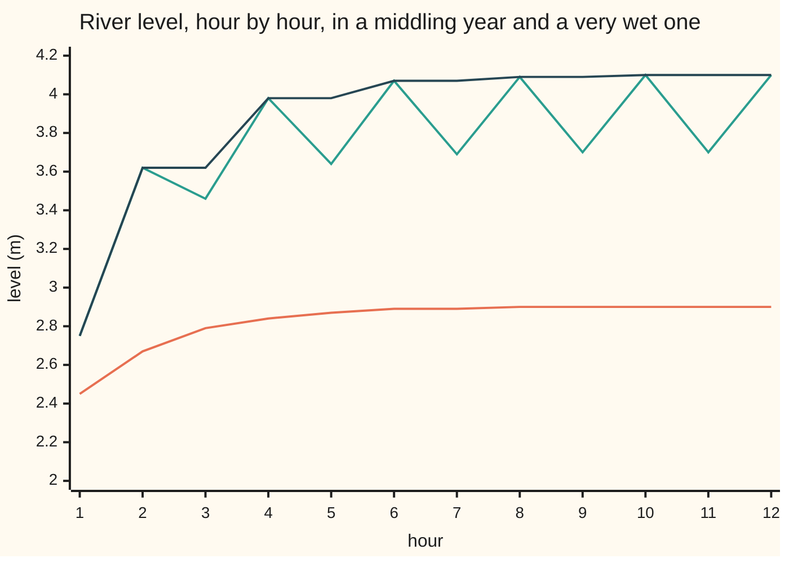
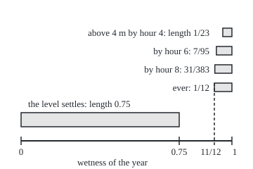

# Sums, products, sups and limits: everything you do to measurable functions gives back a measurable function

Measure and integration → Measurable Functions → Building new measurable functions → Sums, products, sups and limits

---

## General Overview

A gauge under a river bridge records the water level every hour, for years. People ask new questions of the readings. What is the highest level so far? Did the river ever pass the 4-metre flood mark? Does the level settle down in the long run, and in which years?

Each question builds a new quantity from the readings. The running maximum is the largest of the first few. "Ever above 4 m" looks at infinitely many readings at once. The long-run level is a limit. Before any of these gets a probability or an average, it must be a **measurable function**: a quantity whose threshold questions ("is it below 4 m?") are sets we are allowed to measure ([measurable-functions](01-measurable-functions.md)).

This card proves that nothing escapes, including the set of years where the long-run level exists. The Riemann integral has no such guarantee: a limit of functions it can integrate may be one it cannot.

**Sums, products, maxima, minima, sups, infs, upper and lower limits, and pointwise limits of measurable functions are measurable, and so is the set where a sequence converges, because every one of their threshold questions is a countable combination of the original threshold questions.**

**What kind of fact this is:** a theorem, proved on this card in Why it works, with the full proof in the folded Detailed proof.

### The picture: two years at the gauge

The model is a toy, chosen so every answer can be computed exactly. Each year's weather is one number, its wetness, from 0 up to 1, every value equally likely. The level climbs toward a resting height of 2 m plus twice the wetness. In the wettest years, wetness above 0.75, a flood-relief sluice upstream opens and shuts on alternate hours: it adds the excess wetness, in metres, on even hours and removes it on odd hours.



Orange: wetness 0.45, which settles at 2.90 m. Green: wetness 0.95, which swings for ever between about 3.70 and 4.10 m and has no long-run level. Dark: the running maximum of the wet year, which first passes the 4 m flood mark at hour 6. The code prints every point.

---

## The formula

Notation first, in words. A **measurable space** $(\Omega, \mathcal{F})$ is a set of outcomes with a sigma-algebra, the collection of its subsets we allow ourselves to measure ([sigma-algebras](../01-Sets%20You%20Can%20Measure/02-sigma-algebras.md)). Here an outcome is a year's wetness and the allowed sets are the Borel sets. Lebesgue measure $\lambda$, length, gives each set of wetness values its probability.

A function is measurable when every threshold set $\{f < c\}$, "the outcomes where f is below c", is allowed; the first card of this shelf proves that this test is enough. The gauge model, with the sluice swing written $s(\omega) = \max(0,\ \omega - 0.75)$, is

$$f_n(\omega) = 2 + 2\omega\,(1 - 0.5^{\,n}) + (-1)^n\, s(\omega)$$

**Read it aloud:** at hour n the level is 2 m, plus a rise that approaches twice the wetness, plus the sluice's swing, added on even hours and removed on odd ones.

The theorem. Let $f$, $g$ and $f_1, f_2, f_3, \ldots$ be measurable functions on the same measurable space. Then these are measurable:

$$f + g,\quad f\,g,\quad \max(f, g),\quad \min(f, g),\quad \sup_n f_n,\quad \inf_n f_n,\quad \limsup_{n} f_n,\quad \liminf_{n} f_n$$

and the set where the sequence has a finite limit is allowed:

$$L = \{\omega : \liminf_n f_n(\omega) = \limsup_n f_n(\omega) \text{ and both are finite}\} \in \mathcal{F}.$$

**Read it aloud:** everything built from measurable functions by arithmetic, by taking the largest or smallest, or by passing to a limit, is measurable, and "the sequence settles here" is a question with an answer we can measure.

The sup is the least number no reading exceeds, possibly $+\infty$ ([supremum-and-completeness](../../06-Calculus%20and%20analysis/01-Limits%20and%20Continuity/02-supremum-and-completeness.md)). The lim sup is the eventual ceiling, the sup of the readings from hour k on as k grows; the lim inf is the eventual floor. This card introduces both, and Claim 4 of the Detailed proof shows that a sequence converges exactly when the two meet at a finite value. Three identities carry the proof:

$$\{\sup_n f_n > c\} = \bigcup_{n=1}^{\infty} \{f_n > c\}, \qquad \limsup_n f_n = \inf_{k} \sup_{n \ge k} f_n,$$

$$\{f + g < a\} = \bigcup_{q \in \mathbb{Q}} \big(\{f < q\} \cap \{g < a - q\}\big).$$

In words: the record passes c exactly when some hour does; the eventual ceiling is the lowest tail ceiling; and two readings sum to less than a exactly when a rational fits between the first and a minus the second.

| Symbol | Plain meaning | In our example | Push it up and the answer… |
| --- | --- | --- | --- |
| $\Omega$ | the set of all outcomes | every wetness from 0 up to 1 | — |
| $\mathcal{F}$ | the allowed sets, a sigma-algebra | Borel sets of wetness values | more allowed sets, more measurable functions |
| $\lambda$ | Lebesgue measure: length, here a probability | the band above 22/23 has length 1/23 | — |
| $\omega$ | one outcome; the code writes w | a year of wetness 0.95 | wetter years, higher levels |
| $f_n$, $f$, $g$ | measurable functions; $f_n$ is the reading at hour n | hour 6 at wetness 0.95 reads 4.07 m | — |
| $n$, $k$, $m$, $N$ | whole numbers counting hours or steps | hour 6; the first N = 8 hours | — |
| $M_N$ | the running maximum, the largest of hours 1 to N | 4.07 m at N = 6, wetness 0.95 | never falls as N grows |
| $c$, $a$ | threshold levels, in metres | the flood mark c = 4 | fewer outcomes pass |
| $q$ | a rational number, a fraction of whole numbers | a reading to the centimetre, 2.92 | — |
| $s$ | the sluice swing, the wetness above 0.75 | 0.2 at wetness 0.95 | a wider swing, no limit |
| $L$ | the set of outcomes where the limit exists | wetness from 0 to 0.75, length 0.75 | — |
| $f_\infty$ | the limit, where it exists; 0 elsewhere | 2.90 m at wetness 0.45 | — |
| $h$, $h_k$, $t$, $\ell$, $u$, ε | proof letters: any measurable function; the tail sup from hour k on; a fixed positive multiplier; the lim inf and lim sup; a tolerance | at wetness 0.95, $\ell$ = 3.70 m and $u$ = 4.10 m | — |

### When it holds

- **Countably many functions.** Sups, infs and limits run over a list. Over an uncountable family the sup can fail: the indicators of the single points of a non-measurable set have that set's indicator as their sup ([translation-invariance-and-the-vitali-set](../02-Length%20Done%20Properly/04-translation-invariance-and-the-vitali-set.md)).
- **One sigma-algebra for all.** A function measurable for one collection plus a function measurable for another can be measurable for neither; the code prints a four-point case.
- **Finite values for sums and products.** Sups and upper and lower limits may be infinite and remain measurable, but $+\infty$ plus $-\infty$ has no value; restrict sums to finite functions, or fix a convention first.
- **Convergence everywhere, or a complete measure.** If the sequence converges only almost everywhere, the limit is measurable once it is set to 0 on the null set where convergence fails, or once the measure is completed ([null-sets-and-almost-everywhere](../01-Sets%20You%20Can%20Measure/07-null-sets-and-almost-everywhere.md)).

---

## Why it works

### Step 0: every new threshold question is a countable combination of old ones

A sigma-algebra survives complements, countable unions and countable intersections. So for each operation it is enough to write the new function's threshold sets, "above c" or "below c", using countably many threshold sets of the ingredients. The proof does nothing else, and countability is used at every step.

### Step 1: the record level and the running maximum

The running maximum passes the flood mark within N hours exactly when some hour up to N passes it:

$$\{M_N > 4\} = \{f_1 > 4\} \cup \{f_2 > 4\} \cup \cdots \cup \{f_N > 4\}.$$

A finite union of allowed sets is allowed. "Ever above 4 m" is the union over every hour, a countable union, so it is allowed too.

On the gauge each set is a band of wet years. Only even hours can pass 4 m, and hour n does so when the wetness exceeds 2.75 divided by (3 minus 2 to the power 1 − n). Within 4 hours the band is wetness above 22/23, length 1/23; within 6, above 88/95, length 7/95; within 8, above 352/383. The bands grow, and their union is wetness above 11/12, length 1/12, about 0.083333. Continuity of measure from below, along rising sets, says the lengths climb to that value ([continuity-of-measure](../01-Sets%20You%20Can%20Measure/05-continuity-of-measure.md)), and the printed stages do.

### Step 2: floors, and the larger or smaller of two

The lowest reading is minus the highest of the negated readings, and negation keeps measurability, since $\{-f > c\}$ is $\{f < -c\}$. The larger of f and g is the sup of the list f, g, g, g, …, and the smaller its inf.

### Step 3: upper and lower limits, and the limit set

The eventual ceiling is the inf over k of the tail sups. Each tail sup is measurable by Step 1, and the inf of that list by Step 2. The eventual floor works the same way.

The sequence settles at ω when floor and ceiling agree at a finite value. They disagree exactly when some rational number fits strictly between them. There are countably many rationals, so "the floor sits below q and the ceiling above q, for some rational q" is a countable union of allowed sets. Its complement, with the finite-value condition added, is L.

On the gauge the floor is the resting height minus the swing and the ceiling is the resting height plus it. They meet exactly when the swing is 0, for wetness up to 0.75. So L is the band from 0 to 0.75, length 0.75, and the limit there is 2 m plus twice the wetness: 2.90 m at wetness 0.45. The year at 0.95 has floor 3.70 m, ceiling 4.10 m, and no limit. The limit function, set to 0 off L, is measurable too (Claim 5 below).

### The picture: which years flood, and which settle

Drawn to scale, 300 units to one unit of wetness. The flood bands widen as the hours pass and stop growing at 11/12. The settling band ends where the sluice starts, at 0.75. The two never overlap: every year that ever floods is a year with no long-run level.

<p align="center"></p>

The code prints the four left edges and the 0.75 mark on its line starting "figure,": 317.0, 307.9, 305.7, 305.0 and 255.0.

### Step 4: sums, through the rationals

Uncountably many pairs of values add to less than a, so a direct description is useless; the rationals repair it. If $f(\omega) + g(\omega) < a$, the gap between $f(\omega)$ and $a - g(\omega)$ is positive and holds some rational q. Then $f(\omega) < q$ and $g(\omega) < a - q$, and conversely those two add to $f + g < a$. That is the third identity of The formula: a countable union.

The code watches the union fill up. Hours 2 and 3 sum to under 6 m exactly for wetness below 8/13, about 0.615385; the swing cancels. Measured on the grid, whole-number q catch a set of length 0.571433; exactly, it is the wetness below 4/7, about 0.571429. Rationals to one decimal place catch 0.600000; to two, 0.613333; to three, 0.615333. Each year in the set is caught at some precision, so the union over all rationals is the set.

### Step 5: products, through squares

A square is measurable: the set where the square exceeds c is everything when c is negative, and otherwise the outcomes where f is above the square root of c or below minus it. Multiplying by a fixed positive number rescales the threshold. Then

$$f\,g = \tfrac14\big((f + g)^2 - (f - g)^2\big),$$

a combination of sums, squares and a fixed multiple, each measurable.

### Step 6: the closure Riemann lacked

List the rationals between 0 and 1 by denominator: 0, 1, 1/2, 1/3, 2/3, 1/4, 3/4, 1/5, 2/5, 3/5, and on. Let the n-th function be 1 on the first n of them and 0 elsewhere. Each is Riemann integrable with integral 0. For the first ten, the upper sum (the total width of the equal pieces of [0, 1] that hold one of the ten points) is 0.9000 with 10 pieces, 0.1600 with 100 and 0.0160 with 1000; the lower sum is 0.

These functions converge at every point to the function that is 1 on every rational and 0 elsewhere. Every piece of every cut holds a rational and an irrational, so its upper sum is always 1 and its lower sum 0: no Riemann integral. The limit is still measurable, as the indicator of a countable union of points, a set of length 0. The Lebesgue integral gives it the 0 the approximations were heading for ([monotone-convergence-theorem](../04-The%20Lebesgue%20Integral/03-monotone-convergence-theorem.md)).

<details>
<summary>Detailed proof</summary>

**Setting.** $(\Omega, \mathcal{F})$ is a measurable space. Functions take values in the extended line, the reals with $+\infty$ and $-\infty$ added. A function h is measurable when $\{h < c\} \in \mathcal{F}$ for every real c, the threshold test of [measurable-functions](01-measurable-functions.md), taken as the definition for extended values too.

**Lemma 0 (other thresholds).** If h is measurable, so are the sets $\{h \le c\} = \bigcap_{m \ge 1} \{h < c + 1/m\}$ and its complement $\{h > c\}$. Conversely, if every $\{h > c\}$ is allowed, then $\{h < c\} = \bigcup_{m \ge 1} \{h \le c - 1/m\}$ is allowed, each $\{h \le c - 1/m\}$ being a complement. So either threshold form may be tested.

**Claim 1 (sup and inf).** $\{\sup_n f_n > c\} = \bigcup_n \{f_n > c\}$. If some $f_m(\omega) > c$, the sup is at least $f_m(\omega)$. If none exceeds c, then c is an upper bound, and the least upper bound is at most c. The union is countable, so allowed. Since $\{-h > c\} = \{h < -c\}$, $-h$ is measurable, and $\inf_n f_n = -\sup_n(-f_n)$.

**Claim 2 (max and min).** $\max(f, g)$ and $\min(f, g)$ are the sup and inf of the list f, g, g, …; the running maximum $M_N$ likewise.

**Claim 3 (lim sup and lim inf).** Each tail sup $h_k = \sup_{n \ge k} f_n$ is measurable by Claim 1. They fall as k grows, so their limit, the lim sup, is their inf: measurable by Claim 1. Likewise $\liminf_n f_n = \sup_k \inf_{n \ge k} f_n$.

**Claim 4 (the limit set).** Write $\ell = \liminf_n f_n$ and $u = \limsup_n f_n$, so $\ell \le u$. Then $\{\ell < u\} = \bigcup_{q \in \mathbb{Q}} (\{\ell < q\} \cap \{u > q\})$, because a rational lies strictly between any two different reals ([generated-and-borel-sigma-algebras](../01-Sets%20You%20Can%20Measure/03-generated-and-borel-sigma-algebras.md), Claim 5), or between a real and an infinite value. That union is countable, so $\{\ell = u\}$, its complement, is allowed. Also $\{u < \infty\} = \bigcup_m \{u < m\}$ and $\{\ell > -\infty\} = \bigcup_m \{\ell > -m\}$. A sequence of numbers converges exactly when its lim inf and lim sup are equal and finite. If $\ell(\omega) = u(\omega)$ is finite, take any tolerance ε > 0: that common value is the inf of the falling tail sups and the sup of the rising tail infs, so some tail sup is below it plus ε and some tail inf is above it minus ε, and from the later of those two hours on every $f_n(\omega)$ lies within ε of it, which is convergence ([sequences-and-limits](../../06-Calculus%20and%20analysis/01-Limits%20and%20Continuity/03-sequences-and-limits.md)). Conversely, if $f_n(\omega)$ converges to a number $f_\infty(\omega)$, then for each ε > 0 every reading past some cutoff lies within ε of it, so every later tail sup and tail inf does too, and $\ell(\omega)$ and $u(\omega)$ lie within ε of $f_\infty(\omega)$ for every ε: both equal it. So $L = \{\ell = u\} \cap \{u < \infty\} \cap \{\ell > -\infty\} \in \mathcal{F}$.

**Claim 5 (the limit function).** Set $f_\infty = u$ on L and 0 off L. Then $\{f_\infty > c\}$ is $L \cap \{u > c\}$, joined with the complement of L when $c < 0$. Both pieces are allowed. If the sequence converges at every ω, the limit is u itself.

**Claim 6 (sums).** Let f and g be real-valued. $\{f + g < a\} = \bigcup_{q \in \mathbb{Q}} (\{f < q\} \cap \{g < a - q\})$: if $f(\omega) < a - g(\omega)$, a rational q lies strictly between them; conversely $f(\omega) < q$ and $g(\omega) < a - q$ add to $f(\omega) + g(\omega) < a$. Countable union, so allowed. Also $f - g = f + (-g)$.

**Claim 7 (products).** For a fixed number $t > 0$, $\{t f > c\} = \{f > c/t\}$. For squares, $\{f^2 > c\}$ is $\Omega$ when $c < 0$ and otherwise $\{f > \sqrt{c}\} \cup \{f < -\sqrt{c}\}$. Expanding both squares gives $f g = \tfrac14((f + g)^2 - (f - g)^2)$, measurable by Claim 6.

**Where countability entered.** Claims 1, 4 and 6 each wrote a threshold set as a union over the hours or over the rationals. For an uncountable family the same union need not be allowed.

</details>

A second route to the same closure goes through continuous maps: a continuous function of two readings, applied to f and g, is measurable, which gives sums, products, max and min in one stroke. It needs the Borel sets of the plane and product sigma-algebras, which [product-sigma-algebras](../06-Product%20Measures%20and%20Fubini/01-product-sigma-algebras.md) takes up.

---

## Worked numbers, by hand

The gauge at wetness 0.95, then the events the card names.

| Step | Arithmetic | Value |
| --- | --- | --- |
| swing at wetness 0.95 | 0.95 − 0.75 | 0.2 m |
| hour 6 reading | 2 + 1.9 × (1 − 1/64) + 0.2 | 4.07 m |
| hour 4 reading | 2 + 1.9 × (1 − 1/16) + 0.2 | 3.98 m |
| running max, first 6 hours | largest of 2.75, 3.62, 3.46, 3.98, 3.64, 4.07 | 4.07 m |
| band passing 4 m by hour 4 | wetness above 2.75 / (3 − 1/8) = 22/23 | length 1/23 = 0.043478 |
| band passing 4 m ever | wetness above 2.75 / 3 = 11/12 | length **1/12 = 0.083333** |
| floor and ceiling at 0.95 | 3.9 − 0.2 and 3.9 + 0.2 | 3.70 and 4.10 m |
| set where the limit exists | swing is 0 exactly up to 0.75 | length **0.75** |
| long-run level at 0.45 | 2 + 2 × 0.45 | **2.90 m** |

One year in twelve passes the flood mark at some hour and three in four settle; both are measured sets because the operations behind them keep measurability.

### What breaks if you drop a piece

| Mistake | Comes out at | What went wrong |
| --- | --- | --- |
| Adding functions measurable for different sigma-algebras | f + g = (2, 1, 1, 0), allowed for neither; 36 of 81 such pairs fail | "Is the sum above 1?" picks out one point, which neither collection allows |
| Counting on Riemann to survive a pointwise limit | upper sum 1.0000, lower 0 on every cut | Riemann integrable functions are not closed under limits; measurable ones are |
| Writing "the record reaches 4" as "some hour reaches 4" | at wetness 11/12 the sup is 4, yet hour 10 is 0.00179036 short and hour 20 is 0.00000175 short | a sup need not be attained; only the strict form $\{\sup > c\}$ is a plain union |

The code prints all three.

---

## Code, from first principles, and it actually runs

Three roads. First, a four-point space whose allowed sets are unions of two blocks: all 81 functions with values 0, 1 and 2 are tested by threshold sets and, independently, by "one value on each block", then every sum, product, max and min of measurable pairs. Second, the gauge: each event is measured by an exact fraction and, separately, by running 60000 evenly spaced years hour by hour and counting; the limit set is read off as the years whose swing has died by hours 40 and 41. Third, Riemann's upper sums on the rationals, counted exactly in two independent ways. The code checks instances and finite stages; only the proof covers every measurable function on every space.

### Python

```python
# Sums, products, sups and limits of measurable functions -- the check behind the card.
# Standard library only.  Three roads.  (1) A four-point space: every function with
# values 0, 1, 2 is tested for measurability two ways, then every sum, product, max
# and min.  (2) A toy river gauge on [0, 1): the events the card names are measured
# by exact fractions and, separately, by counting a grid of 60000 years hour by hour.
# (3) The rationals: Riemann's upper sums on a pointwise limit that never settle.
from fractions import Fraction as Fr

# ---- road 1: a four-point space ----
B1, B2 = [{0, 1}, {2, 3}], [{0, 2}, {1, 3}]            # the blocks of two sigma-algebras
def events(blocks):                                     # every union of blocks
    return [set().union(*(b for j, b in enumerate(blocks) if m >> j & 1)) for m in range(4)]
F1, F2 = events(B1), events(B2)
def measurable(h, F):                                   # threshold test: {h > c} allowed, every cut c
    return all({w for w in range(4) if h[w] > c} in F for c in sorted(set(h)) + [min(h) - 1])
def block_constant(h, blocks):                          # second road: one value on each block
    return all(len({h[w] for w in b}) == 1 for b in blocks)
funcs = [(a, b, c, d) for a in range(3) for b in range(3) for c in range(3) for d in range(3)]
good = [h for h in funcs if measurable(h, F1)]
agree = all(measurable(h, F1) == block_constant(h, B1) for h in funcs)
ops = {"sum": lambda x, y: x + y, "product": lambda x, y: x * y, "max": max, "min": min}
closed = {k: all(measurable(tuple(map(op, f, g)), F1) for f in good for g in good) for k, op in ops.items()}
u, v = (0, 0, 1, 1), (2, 2, 1, 1)                       # f_n = v + (-1)^n u, both measurable
tail = [tuple(v[w] + (-1) ** n * u[w] for w in range(4)) for n in range(10, 12)]
lim_set = {w for w in range(4) if tail[0][w] == tail[1][w]}
f, g = (1, 1, 0, 0), (1, 0, 1, 0)                       # f fits F1, g fits F2
s = tuple(map(ops["sum"], f, g))
good2 = [h for h in funcs if measurable(h, F2)]
neither = sum(1 for a in good for b in good2
              if not measurable(tuple(map(ops["sum"], a, b)), F1) and not measurable(tuple(map(ops["sum"], a, b)), F2))
yn = lambda c: "yes" if c else "no"
print(f"four points, blocks {{0,1}} {{2,3}}: {len(funcs)} functions, {len(good)} measurable")
print(f"threshold test and block test agree on all {len(funcs)}: {yn(agree)}")
for k in ops:
    print(f"{k:8s} of all {len(good) ** 2} measurable pairs is measurable: {yn(closed[k])}")
print(f"f_n = v + (-1)^n u: limit exists on {sorted(lim_set)}, an allowed event: {yn(lim_set in F1)}")
print(f"mixing: f = {f} fits blocks {{0,1}} {{2,3}}, g = {g} fits {{0,2}} {{1,3}}, f + g = {s}")
print(f"  f + g measurable for the first: {yn(measurable(s, F1))}, for the second: {yn(measurable(s, F2))}")
print(f"  pairs (one of each kind) whose sum fits neither: {neither} of {len(good) * len(good2)}")

# ---- road 2: the river gauge, w = the year's wetness, uniform on [0, 1) ----
def level(w, n):                                        # metres at hour n
    s = max(0.0, w - 0.75)                              # the sluice swing, wettest years only
    return 2 + 2 * w * (1 - 0.5 ** n) + (s if n % 2 == 0 else -s)
def exact_flood(N):                                     # length of {max of hours 1..N > 4}
    n = N - N % 2                                       # only even hours can pass 4 m
    return max(Fr(0), 1 - Fr(11, 4) / (3 - Fr(2) ** (1 - n))) if n else Fr(0)
M, H = 60000, 41
first_hour, spread, f2f3, cover = [], [], [], {D: 0 for D in (1, 10, 100, 1000)}
for i in range(M):
    w = (i + 0.5) / M
    lv = [level(w, n) for n in range(1, H + 1)]
    first_hour.append(next((n for n in range(1, H) if lv[n - 1] > 4), None))
    spread.append(abs(lv[H - 1] - lv[H - 2]))          # the swing still present at hours 40, 41
    f2f3.append(lv[1] + lv[2] < 6)
    for D in cover:                                     # a rational k/D with f2 < k/D < 6 - f3?
        k = int(lv[1] * D) + 1
        cover[D] += k / D < 6 - lv[2]
print("\nhour          " + " ".join(f"{n:5d}" for n in range(1, 13)))
for w in (0.45, 0.95):
    print(f"level, w={w:.2f} " + " ".join(f"{level(w, n):5.2f}" for n in range(1, 13)))
print("running max   " + " ".join(f"{max(level(0.95, m) for m in range(1, n + 1)):5.2f}" for n in range(1, 13)))
print("\nlength of {highest of hours 1..N above 4 m}: exact fraction, then the grid")
grid_flood = {}
for N in (2, 4, 6, 8, 12, 20):
    grid_flood[N] = sum(1 for h in first_hour if h is not None and h <= N) / M
    e = exact_flood(N)
    print(f"  N = {N:2d}   {str(e):>16s} = {float(e):.6f}   grid {grid_flood[N]:.6f}   band w > {1 - e}")
print(f"  ever above 4 m, the union: 1 - 11/12 = {float(Fr(1, 12)):.6f}")
print(f"  w = 11/12: 4 minus hour 10 = {4 - level(11 / 12, 10):.8f}, 4 minus hour 20 = "
      f"{4 - level(11 / 12, 20):.8f}; sup 4, never reached")
grid_lim = sum(1 for d in spread if d < 1e-9) / M
print(f"length of the limit set: exact 3/4 = 0.750000, grid {grid_lim:.6f}")
print(f"long-run level where it exists, w = 0.45: {2 + 2 * 0.45:.2f} m;"
      f" w = 0.95 swings between {2 + 2 * 0.95 - 0.2:.2f} and {2 + 2 * 0.95 + 0.2:.2f} m")
grid_sum = sum(f2f3) / M
print(f"{{hour 2 + hour 3 < 6 m}}: exact 8/13 = {8 / 13:.6f}, grid {grid_sum:.6f}")
for D, c in cover.items():
    print(f"  covered by the union over k/{D:<4d} {c / M:.6f}")
whole = max(min(Fr(q - 2) / Fr(3, 2), Fr(4 - q) / Fr(7, 4)) for q in range(2, 5))   # w < 0.75: f2 = 2 + 1.5w, f3 = 2 + 1.75w
print(f"  the k/1 union exactly: wetness below {whole} = {float(whole):.6f}")
print(f"figure, x of w = 0.75, N = 4, 6, 8 and 11/12: " + ", ".join(
    f"{30 + 300 * t:.1f}" for t in (0.75, *(1 - float(exact_flood(N)) for N in (4, 6, 8)), 11 / 12)))

# ---- road 3: Riemann on the rationals of [0, 1], listed by denominator ----
rats = sorted({Fr(p, q) for q in range(1, 101) for p in range(q + 1)}, key=lambda x: (x.denominator, x))
def upper(points, N):                                   # pieces [i/N, (i+1)/N] holding a point, over N
    hit = set()
    for x in points:                                    # x = p/q sits in piece floor(xN), and in the
        i, r = divmod(x.numerator * N, x.denominator)   # piece before when xN is a whole number
        hit |= {j for j in (i, i - 1 if r == 0 else i) if 0 <= j < N}
    return Fr(len(hit), N)
def upper2(points, N):                                  # second road: test each closed piece directly
    return Fr(sum(any(j * x.denominator <= x.numerator * N <= (j + 1) * x.denominator for x in points)
                  for j in range(N)), N)
first10 = rats[:10]
print("\nfirst 10 rationals: " + ", ".join(str(x) for x in first10))
ups = {N: upper(first10, N) for N in (10, 100, 1000)}
for N, U in ups.items():
    print(f"upper sum of the 10-point indicator, {N:4d} pieces: {float(U):.4f}; lower 0")
print(f"upper sum of the indicator of all rationals, 100 pieces: {float(upper(rats, 100)):.4f}; lower 0")

assert agree and len(good) == 3 * 3                     # two tests agree; 3 values on each of 2 blocks
assert all(closed.values()) and lim_set in F1
assert not measurable(s, F1) and not measurable(s, F2) and neither > 0
for N, gf in grid_flood.items():                        # grid count vs exact fraction, each stage
    assert abs(gf - float(exact_flood(N))) < 2 / M
assert abs(grid_lim - 0.75) < 2 / M and abs(grid_sum - 8 / 13) < 2 / M
cv = list(cover.values())
assert all(a < b for a, b in zip(cv, cv[1:])) and cv[-1] / M <= grid_sum and grid_sum - cv[-1] / M < 0.01
assert abs(cv[0] / M - float(whole)) < 2 / M            # whole-number q: grid against the exact union
assert all(U <= Fr(20, N) and U == upper2(first10, N) for N, U in ups.items())
assert upper(rats, 100) == upper2(rats, 100) == 1
print("ALL CHECKS PASS")
```

**Ran 2026-10-06 on macOS, Python 3.14.6, standard library only. All checks passed. Output, pasted from the run:**

```
four points, blocks {0,1} {2,3}: 81 functions, 9 measurable
threshold test and block test agree on all 81: yes
sum      of all 81 measurable pairs is measurable: yes
product  of all 81 measurable pairs is measurable: yes
max      of all 81 measurable pairs is measurable: yes
min      of all 81 measurable pairs is measurable: yes
f_n = v + (-1)^n u: limit exists on [0, 1], an allowed event: yes
mixing: f = (1, 1, 0, 0) fits blocks {0,1} {2,3}, g = (1, 0, 1, 0) fits {0,2} {1,3}, f + g = (2, 1, 1, 0)
  f + g measurable for the first: no, for the second: no
  pairs (one of each kind) whose sum fits neither: 36 of 81

hour              1     2     3     4     5     6     7     8     9    10    11    12
level, w=0.45  2.45  2.67  2.79  2.84  2.87  2.89  2.89  2.90  2.90  2.90  2.90  2.90
level, w=0.95  2.75  3.62  3.46  3.98  3.64  4.07  3.69  4.09  3.70  4.10  3.70  4.10
running max    2.75  3.62  3.62  3.98  3.98  4.07  4.07  4.09  4.09  4.10  4.10  4.10

length of {highest of hours 1..N above 4 m}: exact fraction, then the grid
  N =  2                  0 = 0.000000   grid 0.000000   band w > 1
  N =  4               1/23 = 0.043478   grid 0.043483   band w > 22/23
  N =  6               7/95 = 0.073684   grid 0.073683   band w > 88/95
  N =  8             31/383 = 0.080940   grid 0.080933   band w > 352/383
  N = 12           511/6143 = 0.083184   grid 0.083183   band w > 5632/6143
  N = 20     131071/1572863 = 0.083333   grid 0.083333   band w > 1441792/1572863
  ever above 4 m, the union: 1 - 11/12 = 0.083333
  w = 11/12: 4 minus hour 10 = 0.00179036, 4 minus hour 20 = 0.00000175; sup 4, never reached
length of the limit set: exact 3/4 = 0.750000, grid 0.750000
long-run level where it exists, w = 0.45: 2.90 m; w = 0.95 swings between 3.70 and 4.10 m
{hour 2 + hour 3 < 6 m}: exact 8/13 = 0.615385, grid 0.615383
  covered by the union over k/1    0.571433
  covered by the union over k/10   0.600000
  covered by the union over k/100  0.613333
  covered by the union over k/1000 0.615333
  the k/1 union exactly: wetness below 4/7 = 0.571429
figure, x of w = 0.75, N = 4, 6, 8 and 11/12: 255.0, 317.0, 307.9, 305.7, 305.0

first 10 rationals: 0, 1, 1/2, 1/3, 2/3, 1/4, 3/4, 1/5, 2/5, 3/5
upper sum of the 10-point indicator,   10 pieces: 0.9000; lower 0
upper sum of the 10-point indicator,  100 pieces: 0.1600; lower 0
upper sum of the 10-point indicator, 1000 pieces: 0.0160; lower 0
upper sum of the indicator of all rationals, 100 pieces: 1.0000; lower 0
ALL CHECKS PASS
```

### Rust

Same roads, same labels. The exact fractions are reduced by hand with Euclid's algorithm on 128-bit integers.

```rust
// Sums, products, sups and limits of measurable functions -- the same check as the
// Python, in Rust, std only.  Three roads.  (1) A four-point space: every function
// with values 0, 1, 2 is tested for measurability two ways, then every sum, product,
// max and min.  (2) A toy river gauge on [0, 1): the card's events measured by exact
// fractions, reduced by hand, and by counting a grid of 60000 years hour by hour.
// (3) The rationals: Riemann's upper sums on a pointwise limit that never settle.

type F4 = [i32; 4];
const F1: [u8; 4] = [0b0000, 0b0011, 0b1100, 0b1111];   // unions of blocks {0,1} {2,3}
const F2: [u8; 4] = [0b0000, 0b0101, 0b1010, 0b1111];   // unions of blocks {0,2} {1,3}

fn mask<P: Fn(i32) -> bool>(h: &F4, p: P) -> u8 {
    (0..4).filter(|&w| p(h[w])).map(|w| 1u8 << w).sum()
}
fn measurable(h: &F4, f: &[u8; 4]) -> bool {            // threshold test: {h > c} allowed, every cut c
    let lo = *h.iter().min().unwrap() - 1;
    h.iter().copied().chain(std::iter::once(lo)).all(|c| f.contains(&mask(h, |x| x > c)))
}
fn block_constant(h: &F4) -> bool { h[0] == h[1] && h[2] == h[3] }   // second road
fn show(h: &F4) -> String { format!("({}, {}, {}, {})", h[0], h[1], h[2], h[3]) }
fn yn(c: bool) -> &'static str { if c { "yes" } else { "no" } }
fn gcd(a: i128, b: i128) -> i128 { if b == 0 { a.abs() } else { gcd(b, a % b) } }

fn level(w: f64, n: i32) -> f64 {                       // metres at hour n, w = the year's wetness
    let s = (w - 0.75).max(0.0);                        // the sluice swing, wettest years only
    2.0 + 2.0 * w * (1.0 - 0.5f64.powi(n)) + if n % 2 == 0 { s } else { -s }
}
fn exact_flood(big_n: i32) -> (i128, i128) {            // length of {max of hours 1..N > 4}, reduced
    let n = big_n - big_n % 2;                          // only even hours can pass 4 m
    let p = 1i128 << (n - 1).max(0);
    let (num, den) = (p - 4, 4 * (3 * p - 1));          // 1 - (11/4) / (3 - 2^(1-n)), by hand
    if num <= 0 || n == 0 { return (0, 1) }
    let g = gcd(num, den);
    (num / g, den / g)
}
fn frac(r: (i128, i128)) -> String { if r.1 == 1 { format!("{}", r.0) } else { format!("{}/{}", r.0, r.1) } }

fn upper(points: &[(i128, i128)], n: i128) -> i128 {   // pieces [i/N, (i+1)/N] holding a point
    let mut hit = vec![false; n as usize];
    for &(p, q) in points {
        let (i, r) = (p * n / q, p * n % q);
        for j in [i, if r == 0 { i - 1 } else { i }] { if j >= 0 && j < n { hit[j as usize] = true } }
    }
    hit.iter().filter(|&&b| b).count() as i128
}
fn upper2(points: &[(i128, i128)], n: i128) -> i128 {  // second road: test each closed piece directly
    (0..n).filter(|&j| points.iter().any(|&(p, q)| j * q <= p * n && p * n <= (j + 1) * q)).count() as i128
}

fn main() {
    // ---- road 1 ----
    let funcs: Vec<F4> = (0..81).map(|k| [k / 27, k / 9 % 3, k / 3 % 3, k % 3]).collect();
    let good: Vec<F4> = funcs.iter().filter(|h| measurable(h, &F1)).copied().collect();
    let good2: Vec<F4> = funcs.iter().filter(|h| measurable(h, &F2)).copied().collect();
    let agree = funcs.iter().all(|h| measurable(h, &F1) == block_constant(h));
    let names = ["sum", "product", "max", "min"];
    let op = |k: usize, x: i32, y: i32| match k { 0 => x + y, 1 => x * y, 2 => x.max(y), _ => x.min(y) };
    let comb = |k: usize, a: &F4, b: &F4| -> F4 { [0, 1, 2, 3].map(|w| op(k, a[w], b[w])) };
    let closed: Vec<bool> = (0..4).map(|k| good.iter().all(|a| good.iter().all(|b| measurable(&comb(k, a, b), &F1)))).collect();
    let (u, v): (F4, F4) = ([0, 0, 1, 1], [2, 2, 1, 1]);
    let at = |n: i32| -> F4 { [0, 1, 2, 3].map(|w| v[w] + (-1i32).pow(n as u32) * u[w]) };
    let lim_set: Vec<usize> = (0..4).filter(|&w| at(10)[w] == at(11)[w]).collect();
    let lim_mask: u8 = lim_set.iter().map(|&w| 1u8 << w).sum();
    let (f, g): (F4, F4) = ([1, 1, 0, 0], [1, 0, 1, 0]);
    let s = comb(0, &f, &g);
    let neither = good.iter().flat_map(|a| good2.iter().map(move |b| (a, b)))
        .filter(|(a, b)| { let t = comb(0, a, b); !measurable(&t, &F1) && !measurable(&t, &F2) }).count();
    println!("four points, blocks {{0,1}} {{2,3}}: {} functions, {} measurable", funcs.len(), good.len());
    println!("threshold test and block test agree on all {}: {}", funcs.len(), yn(agree));
    for k in 0..4 {
        println!("{:8} of all {} measurable pairs is measurable: {}", names[k], good.len() * good.len(), yn(closed[k]));
    }
    println!("f_n = v + (-1)^n u: limit exists on {:?}, an allowed event: {}", lim_set, yn(F1.contains(&lim_mask)));
    println!("mixing: f = {} fits blocks {{0,1}} {{2,3}}, g = {} fits {{0,2}} {{1,3}}, f + g = {}", show(&f), show(&g), show(&s));
    println!("  f + g measurable for the first: {}, for the second: {}", yn(measurable(&s, &F1)), yn(measurable(&s, &F2)));
    println!("  pairs (one of each kind) whose sum fits neither: {} of {}", neither, good.len() * good2.len());

    // ---- road 2 ----
    let (m, h) = (60000usize, 41i32);
    let ds = [1i64, 10, 100, 1000];
    let (mut first_hour, mut n_lim, mut n_sum, mut cover) = (vec![0i32; m], 0usize, 0usize, [0usize; 4]);
    for i in 0..m {
        let w = (i as f64 + 0.5) / m as f64;
        let lv: Vec<f64> = (1..=h).map(|n| level(w, n)).collect();
        first_hour[i] = (1..h).find(|&n| lv[(n - 1) as usize] > 4.0).unwrap_or(0);
        if (lv[(h - 1) as usize] - lv[(h - 2) as usize]).abs() < 1e-9 { n_lim += 1 }
        if lv[1] + lv[2] < 6.0 { n_sum += 1 }
        for (j, &d) in ds.iter().enumerate() {
            let k = (lv[1] * d as f64) as i64 + 1;
            if (k as f64) / (d as f64) < 6.0 - lv[2] { cover[j] += 1 }
        }
    }
    let row = |label: String, vals: Vec<f64>| println!("{}{}", label, vals.iter().map(|x| format!("{:5.2}", x)).collect::<Vec<_>>().join(" "));
    println!("\nhour          {}", (1..=12).map(|n| format!("{:5}", n)).collect::<Vec<_>>().join(" "));
    for w in [0.45, 0.95] { row(format!("level, w={:.2} ", w), (1..=12).map(|n| level(w, n)).collect()) }
    row("running max   ".to_string(), (1..=12).map(|n| (1..=n).map(|k| level(0.95, k)).fold(f64::MIN, f64::max)).collect());
    println!("\nlength of {{highest of hours 1..N above 4 m}}: exact fraction, then the grid");
    let mut grid_flood = vec![];
    for big_n in [2, 4, 6, 8, 12, 20] {
        let gf = first_hour.iter().filter(|&&x| x > 0 && x <= big_n).count() as f64 / m as f64;
        let e = exact_flood(big_n);
        println!("  N = {:2}   {:>16} = {:.6}   grid {:.6}   band w > {}", big_n, frac(e), e.0 as f64 / e.1 as f64, gf, frac((e.1 - e.0, e.1)));
        grid_flood.push((e, gf));
    }
    println!("  ever above 4 m, the union: 1 - 11/12 = {:.6}", 1.0 / 12.0);
    println!("  w = 11/12: 4 minus hour 10 = {:.8}, 4 minus hour 20 = {:.8}; sup 4, never reached",
             4.0 - level(11.0 / 12.0, 10), 4.0 - level(11.0 / 12.0, 20));
    let grid_lim = n_lim as f64 / m as f64;
    println!("length of the limit set: exact 3/4 = 0.750000, grid {:.6}", grid_lim);
    println!("long-run level where it exists, w = 0.45: {:.2} m; w = 0.95 swings between {:.2} and {:.2} m",
             2.0 + 2.0 * 0.45, 2.0 + 2.0 * 0.95 - 0.2, 2.0 + 2.0 * 0.95 + 0.2);
    let grid_sum = n_sum as f64 / m as f64;
    println!("{{hour 2 + hour 3 < 6 m}}: exact 8/13 = {:.6}, grid {:.6}", 8.0 / 13.0, grid_sum);
    for (j, &d) in ds.iter().enumerate() { println!("  covered by the union over k/{:<4} {:.6}", d, cover[j] as f64 / m as f64) }
    let mut whole = (0i128, 1i128);                     // w < 0.75: f2 = 2 + 1.5w, f3 = 2 + 1.75w
    for q in 2..5i128 {
        let (a, b) = ((2 * (q - 2), 3i128), (4 * (4 - q), 7i128));
        let lo = if a.0 * b.1 < b.0 * a.1 { a } else { b };
        if lo.0 * whole.1 > whole.0 * lo.1 { whole = lo }
    }
    let gw = gcd(whole.0, whole.1);
    let whole = (whole.0 / gw, whole.1 / gw);
    println!("  the k/1 union exactly: wetness below {} = {:.6}", frac(whole), whole.0 as f64 / whole.1 as f64);
    let xs: Vec<String> = std::iter::once(0.75).chain([4, 6, 8].map(|n| { let e = exact_flood(n); 1.0 - e.0 as f64 / e.1 as f64 }))
        .chain(std::iter::once(11.0 / 12.0)).map(|t| format!("{:.1}", 30.0 + 300.0 * t)).collect();
    println!("figure, x of w = 0.75, N = 4, 6, 8 and 11/12: {}", xs.join(", "));

    // ---- road 3 ----
    let rats: Vec<(i128, i128)> = (1..=100i128).flat_map(|q| (0..=q).filter(move |&p| gcd(p, q) == 1).map(move |p| (p, q))).collect();
    let first10 = &rats[..10];
    println!("\nfirst 10 rationals: {}", first10.iter().map(|&r| frac(r)).collect::<Vec<_>>().join(", "));
    let ups: Vec<(i128, i128)> = [10i128, 100, 1000].iter().map(|&n| (n, upper(first10, n))).collect();
    for &(n, c) in &ups { println!("upper sum of the 10-point indicator, {:4} pieces: {:.4}; lower 0", n, c as f64 / n as f64) }
    let all_up = upper(&rats, 100);
    println!("upper sum of the indicator of all rationals, 100 pieces: {:.4}; lower 0", all_up as f64 / 100.0);

    assert!(agree && good.len() == 3 * 3);              // two tests agree; 3 values on each of 2 blocks
    assert!(closed.iter().all(|&c| c) && F1.contains(&lim_mask));
    assert!(!measurable(&s, &F1) && !measurable(&s, &F2) && neither > 0);
    for &(e, gf) in &grid_flood { assert!((gf - e.0 as f64 / e.1 as f64).abs() < 2.0 / m as f64) }
    assert!((grid_lim - 0.75).abs() < 2.0 / m as f64 && (grid_sum - 8.0 / 13.0).abs() < 2.0 / m as f64);
    assert!(cover.windows(2).all(|p| p[0] < p[1]) && cover[3] <= n_sum && grid_sum - cover[3] as f64 / (m as f64) < 0.01);
    assert!((cover[0] as f64 / m as f64 - whole.0 as f64 / whole.1 as f64).abs() < 2.0 / m as f64); // whole-number q: grid against the exact union
    assert!(ups.iter().all(|&(n, c)| c <= 20 && c == upper2(first10, n)));
    assert!(all_up == 100 && upper2(&rats, 100) == 100);
    println!("ALL CHECKS PASS");
}
```

**Ran 2026-10-06 on macOS, rustc 1.98.1, editions 2015 and 2021, no crates. All checks passed. Output, pasted from the run:**

```
four points, blocks {0,1} {2,3}: 81 functions, 9 measurable
threshold test and block test agree on all 81: yes
sum      of all 81 measurable pairs is measurable: yes
product  of all 81 measurable pairs is measurable: yes
max      of all 81 measurable pairs is measurable: yes
min      of all 81 measurable pairs is measurable: yes
f_n = v + (-1)^n u: limit exists on [0, 1], an allowed event: yes
mixing: f = (1, 1, 0, 0) fits blocks {0,1} {2,3}, g = (1, 0, 1, 0) fits {0,2} {1,3}, f + g = (2, 1, 1, 0)
  f + g measurable for the first: no, for the second: no
  pairs (one of each kind) whose sum fits neither: 36 of 81

hour              1     2     3     4     5     6     7     8     9    10    11    12
level, w=0.45  2.45  2.67  2.79  2.84  2.87  2.89  2.89  2.90  2.90  2.90  2.90  2.90
level, w=0.95  2.75  3.62  3.46  3.98  3.64  4.07  3.69  4.09  3.70  4.10  3.70  4.10
running max    2.75  3.62  3.62  3.98  3.98  4.07  4.07  4.09  4.09  4.10  4.10  4.10

length of {highest of hours 1..N above 4 m}: exact fraction, then the grid
  N =  2                  0 = 0.000000   grid 0.000000   band w > 1
  N =  4               1/23 = 0.043478   grid 0.043483   band w > 22/23
  N =  6               7/95 = 0.073684   grid 0.073683   band w > 88/95
  N =  8             31/383 = 0.080940   grid 0.080933   band w > 352/383
  N = 12           511/6143 = 0.083184   grid 0.083183   band w > 5632/6143
  N = 20     131071/1572863 = 0.083333   grid 0.083333   band w > 1441792/1572863
  ever above 4 m, the union: 1 - 11/12 = 0.083333
  w = 11/12: 4 minus hour 10 = 0.00179036, 4 minus hour 20 = 0.00000175; sup 4, never reached
length of the limit set: exact 3/4 = 0.750000, grid 0.750000
long-run level where it exists, w = 0.45: 2.90 m; w = 0.95 swings between 3.70 and 4.10 m
{hour 2 + hour 3 < 6 m}: exact 8/13 = 0.615385, grid 0.615383
  covered by the union over k/1    0.571433
  covered by the union over k/10   0.600000
  covered by the union over k/100  0.613333
  covered by the union over k/1000 0.615333
  the k/1 union exactly: wetness below 4/7 = 0.571429
figure, x of w = 0.75, N = 4, 6, 8 and 11/12: 255.0, 317.0, 307.9, 305.7, 305.0

first 10 rationals: 0, 1, 1/2, 1/3, 2/3, 1/4, 3/4, 1/5, 2/5, 3/5
upper sum of the 10-point indicator,   10 pieces: 0.9000; lower 0
upper sum of the 10-point indicator,  100 pieces: 0.1600; lower 0
upper sum of the 10-point indicator, 1000 pieces: 0.0160; lower 0
upper sum of the indicator of all rationals, 100 pieces: 1.0000; lower 0
ALL CHECKS PASS
```

The two outputs match line for line.

> [!TIP]
> **Try changing**
> Guess first, then run it.
> - **Move the sluice.** Change 0.75 to 0.7 in `level`. The grid now sees a limit set of length 0.7 and more flooding years, while the exact fractions still describe the old gauge, so the fourth assert stops the run.
> - **A finer grid of rationals.** Add 10000 to the denominators. The covered length creeps closer to 8/13 and stays short of it: near the edge of the set the gap between the two readings is narrower than any fixed step. Every assert still passes; only the union over all rationals reaches the whole set.
> - **A second sigma-algebra.** Test the pairs against `F2` in place of `F1` inside `closed`. Sums of functions that fit the first blocks are tested against the second, most fail, and the second assert stops the run.

---

## The usual mistake

> [!warning]
> **Taking a sup over every instant instead of a list of hours.** The theorem covers countably many functions. Over uncountably many it can fail: the sup of the indicators of the single points of a non-measurable set is that set's indicator. A level recorded continuously is safe when its path is continuous, since then the sup over all instants equals the sup over rational instants, a list.
>
> - **Writing "the record reaches 4" as a union.** At wetness 11/12 the record is exactly 4 m and no hour reaches it. The correct form is $\bigcap_m \bigcup_n \{f_n > 4 - 1/m\}$.
> - **Assuming the limit exists.** Only on L, length 0.75 here. The year at 0.95 has floor 3.70 m and ceiling 4.10 m.

---

## Where you meet it in real life

- **Hydrology and flood insurance.** Annual maxima, the hour of the first flood and "did the level ever pass the mark" are sups, infs or countable unions of hourly readings, so each has a probability.
- **Probability.** A random variable is a measurable function ([random-variables-and-their-information](04-random-variables-and-their-information.md)). Running maxima and long-run averages are built by these operations, and the strong law of large numbers is a statement about the probability of a limit set like L.
- **Integration theory.** Monotone and dominated convergence integrate limits of sequences; they need the limit to be measurable first, which is Step 3.

> **Say it back**
> A function is measurable when its threshold sets are allowed. Sums, products, max, min, sups, infs, upper and lower limits and pointwise limits all have threshold sets built from the ingredients' threshold sets by countably many unions, intersections and complements. The rationals turn sums and the limit set into countable questions. On the gauge, "ever above 4 m" has probability 1/12 and "settles down" has probability 0.75. Riemann integrability is lost under pointwise limits; measurability is not.

---

## What this builds on

- [measurable-functions](01-measurable-functions.md): the definition, and the threshold test used in every step.
- [sequences-and-limits](../../06-Calculus%20and%20analysis/01-Limits%20and%20Continuity/03-sequences-and-limits.md): convergence, every tolerance with a cutoff past which every term is that close, the definition Claim 4 uses.
- [supremum-and-completeness](../../06-Calculus%20and%20analysis/01-Limits%20and%20Continuity/02-supremum-and-completeness.md): the sup and inf of a list.
- lim sup and lim inf of a sequence of numbers: no card in the library defines them yet, a gap; this card introduces them in The formula and proves the convergence test it needs in Claim 4.

## Where this goes next

- [simple-functions-and-approximation](03-simple-functions-and-approximation.md): every measurable function that is not negative is the rising limit of staircases, and this card makes that limit measurable.
- [monotone-convergence-theorem](../04-The%20Lebesgue%20Integral/03-monotone-convergence-theorem.md): the integral of a rising limit is the limit of the integrals.

---

## Sources

Verified 2026-09-29: every link below resolves to the publisher's or author's page.

- Axler, Sheldon. *Measure, Integration & Real Analysis*. Springer Graduate Texts in Mathematics, 2020. [Author's page with the free open-access PDF](https://measure.axler.net/). Chapter 2 proves the closure of measurable functions under sums, products and limits.
- Folland, Gerald B. *Real Analysis: Modern Techniques and Their Applications*, 2nd ed. Wiley, 1999. [Publisher page](https://www.wiley.com/en-us/Real+Analysis%3A+Modern+Techniques+and+Their+Applications%2C+2nd+Edition-p-9780471317166). Chapter 2 treats extended-real measurable functions, sups and limits.
- Sheffield, Scott. MIT 18.175 Theory of Probability, Lecture 3. [Lecture slides, PDF](https://math.mit.edu/~sheffield/2016175/Lecture3.pdf). Sups, infs and upper and lower limits of random variables, and the measurable event that a sequence converges.
