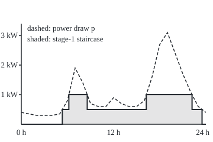
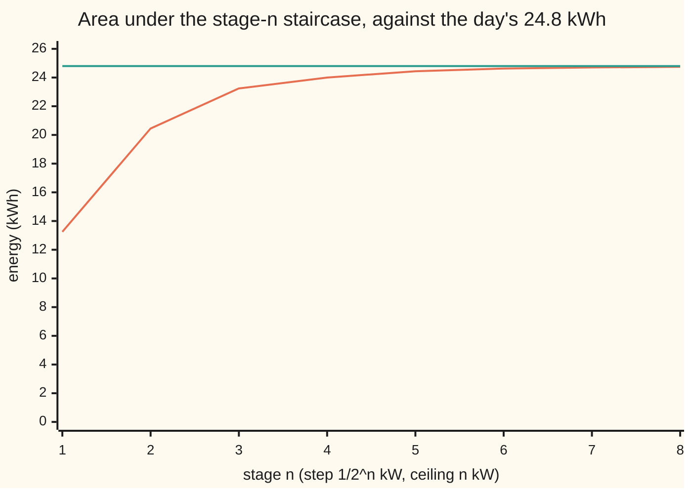

# Simple functions: finitely many values on measurable pieces, and every non-negative measurable function is a rising limit of them

Measure and integration → Measurable Functions → Staircases from below → Simple functions

---

## General Overview

A smart meter reads a house's power draw on the hour: 0.40 kW at midnight, 0.30 kW at 03:00, 1.90 kW at 07:00 when the kettle and shower run, and a peak of 3.10 kW at 19:00. Join the 25 readings with straight lines and the day becomes a continuous curve. The energy used is the area under it: 24.8 kWh.

Now build a cruder display. It shows power in steps of half a kilowatt, always rounds down, and never shows more than 1 kW. It reads 0 until 05:20, then 0.5 kW, then 1 kW from about 06:11, and so on. It takes three values, each on a stretch of the day whose length can be measured. A function like that is a **simple function**.

Refine in stages: halve the step and raise the ceiling by 1 kW each time. The staircase never drops, never rises above the curve, and once its ceiling clears the peak it stays within one step. The areas under the staircases run 13.25, 20.45, 23.24, 24.00 kWh and climb towards 24.8. The Lebesgue integral is built on this construction.

**A simple function takes finitely many values, each on a measurable piece; for any non-negative measurable function, rounding down to steps of 1/2^n and capping at n gives simple functions that rise, stay below it, and close to within 1/2^n wherever it is at most n.**

**What kind of fact this is:** a definition (the simple function and its standard form) and a theorem (the staircase approximation), proved on this card in Why it works.

### The picture: the day's curve and the first staircase

Drawn to scale, 13 units to the hour and 50 units to the kilowatt. The dashed line is the power curve. The shaded staircase is stage 1: 0 kW, 0.5 kW or 1 kW, jumping where the curve crosses 0.5 kW and 1 kW.

<p align="center"></p>

The shaded area is 13.25 kWh; the area under the dashed curve is 24.8 kWh. Later stages fill the gap.

---

## The formula

Notation first, in words. The **indicator** $\mathbf{1}_A$, read "one on A, zero off it", equals 1 at every point of the set A and 0 elsewhere. As a reminder, a measure space $(\Omega, \mathcal{F}, \mu)$ is a set of points, the collection of its subsets we allow ourselves to measure, and a size for each ([measures](../01-Sets%20You%20Can%20Measure/04-measures.md)). Here $\Omega$ is the day, hours 0 to 24, $\mathcal{F}$ its Borel sets, and the measure is length, Lebesgue measure $\lambda$.

A **simple function** is a function $s$ on $\Omega$, measurable with respect to $\mathcal{F}$, that takes only finitely many values. Its **standard form** lists each value once, with the set where it is taken:

$$s \;=\; \sum_{i=1}^{m} a_i\, \mathbf{1}_{A_i}, \qquad a_1, \dots, a_m \text{ distinct}, \qquad A_i = \{\omega \in \Omega : s(\omega) = a_i\} \in \mathcal{F}.$$

**Read it aloud:** s is a-one on the piece A-one, a-two on A-two, and so on; the pieces do not overlap, fill the space, and can each be measured.

The staircase that approximates a non-negative measurable function $f$ at stage $n$ is

$$s_n(\omega) \;=\; \min\!\Big(n,\ 2^{-n}\big\lfloor 2^n f(\omega) \big\rfloor\Big), \qquad s_n(\omega) = n \ \text{ where } f(\omega) = \infty.$$

**Read it aloud:** multiply the value by 2 to the n, round down to a whole number, divide back, and never go above n.

**The theorem.** For every $f$ from $\Omega$ to $[0, \infty]$ that is measurable with respect to $\mathcal{F}$:

$$0 \le s_1 \le s_2 \le s_3 \le \cdots \le f, \qquad s_n(\omega) \to f(\omega) \text{ at every } \omega, \qquad 0 \le f(\omega) - s_n(\omega) < 2^{-n} \text{ wherever } f(\omega) \le n.$$

**Read it aloud:** the staircases never fall, never pass f, reach f at every point, and wherever f is at most n the stage-n staircase is less than one step below it.

If $f$ never exceeds $M$, every stage $n \ge M$ keeps every gap below $2^{-n}$: the convergence is uniform. Since a pointwise limit of measurable functions is measurable ([limits-of-measurable-functions](02-limits-of-measurable-functions.md)), a non-negative function is measurable exactly when it is a rising limit of simple functions.

| Symbol | Plain meaning | In our example | Push it up and the answer… |
| --- | --- | --- | --- |
| $p$ | the house's power draw, in kW | 0.80 kW at 06:00, 3.10 kW at 19:00 | every staircase under it rises or stays put |
| $t$, $\omega$ | a point of the space; on the day, a time in hours | $t = 19$ is 19:00 | — |
| $\Omega$, $\mathcal{F}$ | the space, and the sets of it we allow ourselves to measure | the hours 0 to 24; the Borel sets | a bigger $\mathcal{F}$ admits more simple functions |
| $\lambda$, $\mu$ | a measure; $\lambda$ is Lebesgue measure, length | the piece where stage 1 reads 1 kW: 8.339610 h | longer pieces, more area under the staircase |
| $f$, $M$, $B$ | a non-negative measurable function, values in $[0, \infty]$; $M$ a bound on it on a set $B$ | $f = p$, $M = 3.1$ kW | a larger $M$ needs more stages before the cap stops mattering |
| $s$, $a_i$, $A_i$, $m$ | a simple function; its $m$ distinct values and the pieces where each is taken | stage 1: $m = 3$, values 0, 0.5, 1 kW | — |
| $\mathbf{1}_A$, $A$ | the indicator of a set $A$: 1 on $A$, 0 off it | $\mathbf{1}$ of "draw at least 0.5 kW" | — |
| $n$ | the stage: steps of $2^{-n}$, ceiling $n$ | stage 2: steps of 0.25 kW, ceiling 2 kW | finer steps, higher ceiling, smaller gap |
| $\lfloor y \rfloor$, $y$ | the floor: the largest whole number not above $y$ | $\lfloor 12.4 \rfloor = 12$ | — |
| $s_n$, $r_n$, $g_n$ | the stage-$n$ staircase; $r_n$ and $g_n$ are staircases built from it in the proof | $s_4 = 3.0625$ kW at 19:00 | — |
| $j$, $k$, $N$ | counters for the levels $j\,2^{-n}$; $N$ a whole-number stage | level $j = 49$ at stage 4 is 3.0625 kW | — |
| $f^+$, $f^-$ | the positive part $\max(f, 0)$ and the negative part $\max(-f, 0)$ | net draw with solar at 12:00: $f^+ = 0$, $f^- = 0.6$ kW | — |

- **Simple.** Stage 1 of the day. Also the indicator of the rational numbers in `[0, 1]`: its pieces are Borel sets but not intervals, so it is no step function and has no Riemann integral ([why-a-new-integral](../01-Sets%20You%20Can%20Measure/01-why-a-new-integral.md)), yet it is simple.
- **Not simple.** The curve $p$: it takes every value from 0.30 to 3.10 kW. And the indicator of the Vitali set ([translation-invariance-and-the-vitali-set](../02-Length%20Done%20Properly/04-translation-invariance-and-the-vitali-set.md)): two values, but one piece cannot be measured.

### When it holds

- **Measurable.** The pieces of $s_n$ are where $f$ lies in an interval; if $f$ is not measurable they may have no size, and $s_n$ is not simple.
- **Non-negative, or split first.** A function that goes negative is split into $f^+$ and $f^-$; the difference of their staircases converges but no longer rises.
- **The gap bound needs $f \le n$.** Above the cap the gap can be anything: 1.1 kW at 19:00 on stage 2, against a step of 0.25.
- **Any sigma-algebra.** No length is used; the theorem holds on a die, two coins, or infinitely many tosses. Infinite values are allowed: where $f = \infty$, $s_n = n$.

---

## Why it works

### Step 0: slice the values, not the time, on grids that nest

A Riemann sum chops the time axis and needs the curve's height on each piece, which fails when the function jumps wildly. The staircase chops the power axis instead: for each level it asks at which times the power reaches it. Because $f$ is measurable, those times form a measurable set, however wild $f$ is. The grids are halves, quarters, eighths, and each contains the one before: every quarter-kilowatt mark is also an eighth-kilowatt mark. Rounding down onto a finer grid that contains the coarser one never lands lower. That one fact makes the staircases rise.

### Step 1: each staircase is a simple function

At stage $n$ the value is a multiple of $2^{-n}$ between 0 and $n$, so there are at most $n\,2^n + 1$ values: 3 at stage 1, 9 at stage 2, 2049 at stage 8. The piece carrying the value $j\,2^{-n}$ is where $f$ lies between $j\,2^{-n}$ and the next grid mark; the top piece is where $f \ge n$. A measurable function pulls every interval back to a set in $\mathcal{F}$ ([measurable-functions](01-measurable-functions.md)), so every piece is measurable and $s_n$ is simple, already in standard form.

On the day, the curve crosses 0.5 kW at hours 5.3333 and 23.5000, and 1 kW at 6.1818, 8.5714, 16.2500 and 22.2000. Stage 1 reads 0 for 5.833333 hours, 0.5 kW for 9.827056 hours and 1 kW for 8.339610 hours; the three add to 24.

The same function can be written other ways. Stage 1 is also $0.5 \cdot \mathbf{1}_{\{p \ge 0.5\}} + 0.5 \cdot \mathbf{1}_{\{p \ge 1\}}$: two overlapping pieces, each adding half a kilowatt, and the code checks both forms agree at all 86400 seconds. The standard form is unique: its values are the values taken, and its pieces are where each is taken.

### Step 2: the staircase stays below the curve and never falls

Rounding down never increases a number, and the cap only lowers it further, so $s_n \le f$. For the rise, double any number: the double of its floor is a whole number not above the double, so the floor of the double is at least that large. That is the nested-grid fact of Step 0 in one line, and the ceiling rises from $n$ to $n+1$ as well, so $s_{n+1} \ge s_n$.

At 19:00 the draw is 3.1 kW. Stages 1 to 3 give 1, 2 and 3, each the ceiling; at stage 3 the rounding also gives 3. Stages 4 to 8 give 3.0625, 3.09375, 3.09375, 3.09375 and 3.09765625. The value never falls, and often stays put: "rising" here means "never falling".

### Step 3: below the cap, the gap is under one step

Where $f(\omega) < n$, the rounded value is below $n$ and the cap does nothing. A number exceeds its floor by less than 1, so dividing by $2^n$ gives $0 \le f - s_n < 2^{-n}$. Where $f$ is finite, every stage past $f(\omega)$ has a gap below $2^{-n}$, which shrinks to 0. Where $f = \infty$, $s_n = n$ grows without end.

The day's peak is 3.1 kW, above the ceiling on stages 1 to 3, though at stage 3 rounding down never passes 3, so the cap changes nothing there. The largest sampled gap is 2.099944 kW at stage 1 and 1.099944 at stage 2. From stage 3 on it sits just under a step: 0.124993 against 0.125, down to 0.003903 against 0.00390625 at stage 8. From stage 4, with the ceiling above the peak, a gap below $2^{-n}$ at every time puts the area under the staircase within $24 \times 2^{-n}$ kWh of the area under the curve.



Orange: the area under the stage-$n$ staircase. Green: the area under the curve. The orange line rises at every stage, never crosses the green, and its gap roughly halves per stage once the ceiling clears the peak.

### Step 4: functions that go negative

A rooftop panel producing 1.5 kW at noon, against a draw of 0.9 kW, makes the net draw from the grid −0.6 kW. Split the net draw $f$ into its positive part $f^+ = \max(f, 0)$ and negative part $f^- = \max(-f, 0)$. Both are non-negative and measurable ([limits-of-measurable-functions](02-limits-of-measurable-functions.md)), and $f = f^+ - f^-$. At 12:00 they are 0 and 0.6; their stage-4 staircases give 0 and 0.5625, so the approximation is −0.5625 kW. The difference of staircases converges at every point and never exceeds $\lvert f \rvert$ in size, but on the negative side it falls towards $f$ rather than rising.

<details>
<summary>Detailed proof</summary>

**Setting.** $(\Omega, \mathcal{F})$ is a set with a sigma-algebra; no measure is needed. $f : \Omega \to [0, \infty]$ is measurable with respect to $\mathcal{F}$: the set where $f$ lies in any interval of $[0, \infty]$ belongs to $\mathcal{F}$ ([measurable-functions](01-measurable-functions.md)). Define $s_n$ as in The formula.

**Lemma 1 (standard form).** A function with finitely many values $a_i$ is simple exactly when each level set $A_i = \{s = a_i\}$ is in $\mathcal{F}$, and then $s = \sum_i a_i \mathbf{1}_{A_i}$, uniquely. *Proof.* A level set is the preimage of one value; conversely the preimage of any set of values is a finite union of level sets. The level sets do not overlap and cover $\Omega$, so at a point of $A_i$ the sum is $a_i$. In any such sum with distinct values on non-overlapping covering pieces, the piece carrying $a_i$ is exactly where $s = a_i$.

**Lemma 2 (floors on nested grids).** For every real $y \ge 0$: $0 \le \lfloor y \rfloor \le y < \lfloor y \rfloor + 1$ and $\lfloor 2y \rfloor \ge 2 \lfloor y \rfloor$. *Proof.* The first line is the definition of the floor. For the second, $2\lfloor y \rfloor$ is a whole number and $2 \lfloor y \rfloor \le 2y$; the floor of $2y$ is the largest such whole number.

**Theorem.** (a) Each $s_n$ is simple. (b) $0 \le s_n \le s_{n+1} \le f$. (c) If $f(\omega) \le n$ then $0 \le f(\omega) - s_n(\omega) < 2^{-n}$. (d) $s_n(\omega) \to f(\omega)$ for every $\omega$. (e) If $f \le M$ on a set $B$, then $s_n \to f$ uniformly on $B$.

(a) The values of $s_n$ lie in the finite set $\{j\,2^{-n} : 0 \le j \le n\,2^n\}$. For $j < n\,2^n$, $\{s_n = j\,2^{-n}\} = \{\omega : j\,2^{-n} \le f(\omega) < (j+1)\,2^{-n}\}$: on that set $f$ is below $n$, the floor of $2^n f$ is $j$ and the cap does nothing, while a value of $f$ at or above $n$ gives $s_n = n$. Also $\{s_n = n\} = \{\omega : f(\omega) \ge n\}$, which includes the points where $f = \infty$. Each is the preimage of an interval, so in $\mathcal{F}$. By Lemma 1, $s_n$ is simple.

(b) Where $f(\omega) = \infty$: $s_n = n < n + 1 = s_{n+1} \le \infty$. Where $f(\omega)$ is finite, put $y = 2^n f(\omega)$. Lemma 2 gives $2^{-(n+1)} \lfloor 2y \rfloor \ge 2^{-n} \lfloor y \rfloor$, and the smaller of two numbers never decreases when both increase, so $s_{n+1} = \min(n+1, 2^{-(n+1)} \lfloor 2y \rfloor) \ge \min(n, 2^{-n}\lfloor y \rfloor) = s_n$. Lemma 2 also gives $0 \le 2^{-n} \lfloor y \rfloor \le f(\omega)$, and the minimum with $n$ keeps it in that range.

(c) If $f(\omega) < n$, then $y < n\,2^n$, so $\lfloor y \rfloor \le n\,2^n - 1$ and $2^{-n}\lfloor y \rfloor < n$: $s_n(\omega) = 2^{-n}\lfloor y \rfloor$. By Lemma 2, $0 \le y - \lfloor y \rfloor < 1$; dividing by $2^n$ gives $0 \le f(\omega) - s_n(\omega) < 2^{-n}$. If $f(\omega) = n$, then $y = n\,2^n$ is whole and $s_n(\omega) = n = f(\omega)$.

(d) If $f(\omega)$ is finite, choose a whole number $N \ge f(\omega)$. For $n \ge N$, (c) gives $\lvert f(\omega) - s_n(\omega) \rvert < 2^{-n}$, which tends to 0. If $f(\omega) = \infty$, $s_n(\omega) = n$ exceeds every number from some stage on.

(e) For $n \ge M$, (c) applies at every point of $B$ at once: $\sup_B (f - s_n) \le 2^{-n}$, which tends to 0.

**Corollary 1 (signed functions).** If $f : \Omega \to \mathbb{R}$ is measurable, then $f^+ = \max(f, 0)$ and $f^- = \max(-f, 0)$ are non-negative and measurable ([limits-of-measurable-functions](02-limits-of-measurable-functions.md)), and $f = f^+ - f^-$. With $s_n$ and $r_n$ the staircases of $f^+$ and $f^-$, the difference $g_n = s_n - r_n$ is simple (finitely many values, level sets built from finitely many level sets), converges to $f$ at every point by (d), and satisfies $\lvert g_n \rvert \le \lvert f \rvert$, since at each point one of $f^+$, $f^-$ is 0 and so is its staircase.

**Corollary 2 (the converse).** Every simple function is measurable, and a pointwise limit of measurable functions is measurable ([limits-of-measurable-functions](02-limits-of-measurable-functions.md)). With the theorem: $f : \Omega \to [0, \infty]$ is measurable exactly when it is the pointwise limit of a rising sequence of simple functions.

</details>

A second road to the same staircase counts layers instead of pieces. At every point, $s_n = 2^{-n} \sum_{k=1}^{n 2^n} \mathbf{1}_{\{f \ge k\,2^{-n}\}}$: stack one thin slab of height $2^{-n}$ for every grid level the function reaches. The code computes the energies both ways and they agree exactly at all eight stages. Turning that stacking into a formula for integrals is [layer-cake-and-tail-integrals](../06-Product%20Measures%20and%20Fubini/06-layer-cake-and-tail-integrals.md).

---

## Worked numbers, by hand

Stage 1 of the day, and one moment traced through the stages.

| Step | Arithmetic | Value |
| --- | --- | --- |
| first crossing of 0.5 kW | 5 + (0.5 − 0.35) / (0.80 − 0.35) | 5.3333 h, 05:20 |
| last crossing of 0.5 kW | 23 + (0.60 − 0.5) / (0.60 − 0.40) | 23.5000 h |
| hours at 0 kW | 5.3333 + (24 − 23.5) | 5.833333 |
| hours at 1 kW | (8.5714 − 6.1818) + (22.2000 − 16.2500) | 8.339610 |
| hours at 0.5 kW | 24 − 5.833333 − 8.339610 | 9.827056 |
| area under stage 1 | 0 × 5.833333 + 0.5 × 9.827056 + 1 × 8.339610 | 13.253139 kWh |
| stage 2 at 19:00 | ⌊4 × 3.1⌋ / 4 = 3, above the ceiling 2 | 2, gap 1.1 kW |
| stage 4 at 19:00 | ⌊16 × 3.1⌋ / 16 = 49 / 16 | 3.0625, gap 0.0375 < 0.0625 |
| stage 8 at 19:00 | ⌊256 × 3.1⌋ / 256 = 793 / 256 | 3.09765625, gap 0.00234375 < 0.00390625 |
| area under stage 8 | exact sum over its pieces | **24.750014 kWh, within 0.049986 of 24.8** |

By stage 8 the staircase shows the day's energy to within 0.05 kWh from finitely many power levels, and it never overstates it. The guaranteed margin, $24 \times 2^{-8}$ = 0.09375 kWh, is about twice the real gap, because on average the curve sits half a step above its staircase.

### What breaks if you drop a piece

| Mistake | Comes out at | What went wrong |
| --- | --- | --- |
| Round to the nearest quarter instead of down (stage 2) | above the curve for 33958 of 86400 seconds; below its own stage-1 version (nearest half kW) for 31118 seconds | rounding to nearest is neither below $f$ nor rising |
| Steps of 1/2 kW, then 1/3 kW | the 1/3 staircase lower than the 1/2 one for 22429 seconds | thirds do not contain halves; the grids must nest |
| Drop the cap, for $1/x$ on `(0, 1]` | stage 2 takes 396 values at 10000 sample points, and infinitely many on the whole interval; capped, at most 9 | an unbounded function needs the ceiling to stay simple |
| Read the gap bound where the cap binds | 1.1 kW at 19:00 on stage 2, against a step of 0.25 | the bound holds only where $f \le n$ |

---

## Code, from first principles, and it actually runs

The code checks one curve; that every non-negative measurable function works rests on the proof. The curve's energy is reached two ways (hourly trapezoids; midpoints of all 86400 seconds). Each staircase's energy is reached three ways: its standard-form pieces, its layer-cake slabs, and the sampled seconds. At every sample and stage the code checks the staircase is below the curve, rising, and within one step once the cap is clear, then prints the counterexamples. Python uses `fractions`; the Rust writes its own fraction type, and both sample in whole-number units so they count the same seconds.

### Python

```python
# Simple functions and the dyadic staircase: the check behind the card.
# Standard library only; Fraction keeps every length and energy exact.
from fractions import Fraction as F
W = [400, 350, 300, 300, 300, 350, 800, 1900, 1400, 700, 600, 600, 900,
     700, 600, 600, 800, 1600, 2700, 3100, 2400, 1700, 1100, 600, 400]
TOP = F(10**9)                          # "no upper edge" for the cap band, in W

def f6(x, d=6): return f"{float(x):.{d}f}"

def band_len(v0, v1, a, b):             # hours of one hour-segment where a <= p < b
    if v0 == v1: return F(int(a <= v0 < b))
    lo, hi = sorted([(a - v0) / F(v1 - v0), (b - v0) / F(v1 - v0)])
    return max(F(0), min(F(1), hi) - max(F(0), lo))

def ge_len(v0, v1, c):                  # hours of one hour-segment where p >= c
    if v0 == v1: return F(int(v0 >= c))
    u = min(F(1), max(F(0), (c - v0) / F(v1 - v0)))
    return 1 - u if v1 > v0 else u

def pieces(n):                          # standard form: (value in kW, hours at that value)
    d = 2**n; out = []
    for j in range(n * d + 1):
        a = F(1000 * j, d); b = F(1000 * (j + 1), d) if j < n * d else TOP
        out.append((F(j, d), sum(band_len(W[i], W[i + 1], a, b) for i in range(24))))
    return out

def layers(n):                          # road 2: sum over k of 2^-n times hours with p >= k 2^-n
    d = 2**n
    return sum(F(1, d) * sum(ge_len(W[i], W[i + 1], F(1000 * k, d)) for i in range(24))
               for k in range(1, n * d + 1))

# road 3: one sample per second, at the middle of the second; power in kW is x / U
U = 7_200_000
P = [7200 * W[h] + (W[h + 1] - W[h]) * (2 * m + 1) for h in range(24) for m in range(3600)]
def stair(n, x): return min(n * 2**n, (2**n * x) // U)   # s_n in units of 2^-n kW

print("readings, kW, hours 0 to 24:", " ".join(f"{w / 1000:.2f}" for w in W))
E_trap = F(sum(W[i] + W[i + 1] for i in range(24)), 2000)
E_mid = F(sum(P), U * 3600)
assert E_trap == E_mid
print("energy of the curve: trapezoids", f6(E_trap), "kWh; 86400 midpoints", f6(E_mid), "kWh")

cross = {c: [i + F(c - W[i], W[i + 1] - W[i]) for i in range(24)
             if (W[i] - c) * (W[i + 1] - c) < 0] for c in (500, 1000)}
for c in (500, 1000):
    print(f"p = {c / 1000:.1f} kW at hours", ", ".join(f6(t, 4) for t in cross[c]))
print("stage 1 standard form: value kW, hours")
for v, L in pieces(1): print(f"  {f6(v, 1)}, {f6(L)}")
over = all(500 * ((1000 * x >= 500 * U) + (1000 * x >= 1000 * U)) == 500 * stair(1, x) for x in P)
print("stage 1 as 0.5 1{p >= 0.5} + 0.5 1{p >= 1}, same at all 86400 samples:", "yes" if over else "no")
assert over

print("n, step kW, grid levels, E_n by pieces, by layers, by samples, gap to E, 24/2^n")
prev, chart = F(0), []
for n in range(1, 9):
    pc = pieces(n); En = sum(v * L for v, L in pc); Ek = layers(n)
    Es = F(sum(stair(n, x) for x in P), 2**n * 3600)
    assert En == Ek and abs(En - Es) < F(1, 1000) and En > prev
    assert sum(L for _, L in pc) == 24
    if n >= 4: assert 0 < E_trap - En <= F(24, 2**n)
    prev = En
    chart.append(f"{float(En):.2f}")
    print(f"{n}, 1/{2**n}, {len(pc)}, {f6(En)}, {f6(Ek)}, {f6(Es)}, {f6(E_trap - En)}, {f6(F(24, 2**n))}")

print("chart, E_n in kWh for n = 1 to 8:", " ".join(chart))
print("largest sampled gap p - s_n, kW, against 2^-n")
for n in range(1, 9):
    assert all(2 * stair(n, x) <= stair(n + 1, x) and U * stair(n, x) <= 2**n * x for x in P)
    g = F(max(2**n * x - U * stair(n, x) for x in P), U * 2**n)
    if n >= 4: assert g < F(1, 2**n)
    print(f"  n={n}: {f6(g)} against {f6(F(1, 2**n), 8)}")

print("at 19:00, p = 3.1 kW: n, s_n, error, 2^-n")
for n in range(1, 9):
    s = F(min(n * 2**n, (2**n * 31) // 10), 2**n)
    assert s <= F(31, 10) and (n < 4 or F(31, 10) - s < F(1, 2**n))
    print(f"  {n}, {f6(s, 8)}, {f6(F(31, 10) - s, 8)}, {f6(F(1, 2**n), 8)}")

def near(n, x): return (2**(n + 1) * x + U) // (2 * U)      # nearest multiple of 2^-n, uncapped
above = sum(near(2, x) * U > 4 * x for x in P)
drop = sum(near(2, x) < 2 * near(1, x) for x in P)
thirds = sum(2 * ((3 * x) // U) < 3 * ((2 * x) // U) for x in P)
print("nearest instead of down, n=2: seconds above the curve", above, "/ seconds below stage 1", drop)
print("steps of 1/2 then 1/3 kW: seconds where the 1/3 staircase is lower", thirds)
assert above > 0 and drop > 0 and thirds > 0
vals = len({(4 * 10000) // j for j in range(1, 10001)})
assert vals > 2 * 4 + 1
print("1/x on (0,1] at x = j/10000: uncapped stage 2 takes", vals, "values; capped stage 2 at most", 2 * 4 + 1)
net = F(900 - 1500, 1000); pos, neg = max(net, 0), max(-net, 0)
sp, sn = [F((2**4 * y.numerator) // y.denominator, 2**4) for y in (pos, neg)]
assert pos - neg == net and 0 <= (sp - sn) - net < F(1, 2**4)
print(f"12:00 with 1.5 kW solar: net {f6(net, 4)}, parts {f6(pos, 4)} and {f6(neg, 4)}, stage 4 {f6(sp - sn, 4)}")
print("figure, x = 36 + 13 t, y = 210 - 50 p; stage-1 corners at x =",
      ", ".join(f"{36 + 13 * float(t):.2f}" for t in sorted(cross[500] + cross[1000])))
```

**Ran 2026-09-29 on macOS, Python 3.14.6, standard library only. All checks passed. Output, pasted from the run:**

```
readings, kW, hours 0 to 24: 0.40 0.35 0.30 0.30 0.30 0.35 0.80 1.90 1.40 0.70 0.60 0.60 0.90 0.70 0.60 0.60 0.80 1.60 2.70 3.10 2.40 1.70 1.10 0.60 0.40
energy of the curve: trapezoids 24.800000 kWh; 86400 midpoints 24.800000 kWh
p = 0.5 kW at hours 5.3333, 23.5000
p = 1.0 kW at hours 6.1818, 8.5714, 16.2500, 22.2000
stage 1 standard form: value kW, hours
  0.0, 5.833333
  0.5, 9.827056
  1.0, 8.339610
stage 1 as 0.5 1{p >= 0.5} + 0.5 1{p >= 1}, same at all 86400 samples: yes
n, step kW, grid levels, E_n by pieces, by layers, by samples, gap to E, 24/2^n
1, 1/2, 3, 13.253139, 13.253139, 13.253056, 11.546861, 12.000000
2, 1/4, 9, 20.449247, 20.449247, 20.449167, 4.350753, 6.000000
3, 1/8, 25, 23.235801, 23.235801, 23.235833, 1.564199, 3.000000
4, 1/16, 65, 24.003550, 24.003550, 24.003611, 0.796450, 1.500000
5, 1/32, 161, 24.436613, 24.436613, 24.436727, 0.363387, 0.750000
6, 1/64, 385, 24.625222, 24.625222, 24.625417, 0.174778, 0.375000
7, 1/128, 897, 24.703070, 24.703070, 24.703212, 0.096930, 0.187500
8, 1/256, 2049, 24.750014, 24.750014, 24.750084, 0.049986, 0.093750
chart, E_n in kWh for n = 1 to 8: 13.25 20.45 23.24 24.00 24.44 24.63 24.70 24.75
largest sampled gap p - s_n, kW, against 2^-n
  n=1: 2.099944 against 0.50000000
  n=2: 1.099944 against 0.25000000
  n=3: 0.124993 against 0.12500000
  n=4: 0.062493 against 0.06250000
  n=5: 0.031243 against 0.03125000
  n=6: 0.015618 against 0.01562500
  n=7: 0.007806 against 0.00781250
  n=8: 0.003903 against 0.00390625
at 19:00, p = 3.1 kW: n, s_n, error, 2^-n
  1, 1.00000000, 2.10000000, 0.50000000
  2, 2.00000000, 1.10000000, 0.25000000
  3, 3.00000000, 0.10000000, 0.12500000
  4, 3.06250000, 0.03750000, 0.06250000
  5, 3.09375000, 0.00625000, 0.03125000
  6, 3.09375000, 0.00625000, 0.01562500
  7, 3.09375000, 0.00625000, 0.00781250
  8, 3.09765625, 0.00234375, 0.00390625
nearest instead of down, n=2: seconds above the curve 33958 / seconds below stage 1 31118
steps of 1/2 then 1/3 kW: seconds where the 1/3 staircase is lower 22429
1/x on (0,1] at x = j/10000: uncapped stage 2 takes 396 values; capped stage 2 at most 9
12:00 with 1.5 kW solar: net -0.6000, parts 0.0000 and 0.6000, stage 4 -0.5625
figure, x = 36 + 13 t, y = 210 - 50 p; stage-1 corners at x = 105.33, 116.36, 147.43, 247.25, 324.60, 341.50
```

### Rust

```rust
// Simple functions and the dyadic staircase: the check behind the card.
// Rust std only; a hand-written fraction type keeps lengths and energies exact.
use std::collections::HashSet;
use std::ops::{Add, Div, Mul, Sub};
#[derive(Clone, Copy)]
struct Q { n: i128, d: i128 }
fn gcd(a: i128, b: i128) -> i128 { if b == 0 { a.abs() } else { gcd(b, a % b) } }
fn q(n: i128, d: i128) -> Q { let g = gcd(n, d) * d.signum(); Q { n: n / g, d: d / g } }
impl Add for Q { type Output = Q; fn add(self, o: Q) -> Q { q(self.n * o.d + o.n * self.d, self.d * o.d) } }
impl Sub for Q { type Output = Q; fn sub(self, o: Q) -> Q { q(self.n * o.d - o.n * self.d, self.d * o.d) } }
impl Mul for Q { type Output = Q; fn mul(self, o: Q) -> Q { q(self.n * o.n, self.d * o.d) } }
impl Div for Q { type Output = Q; fn div(self, o: Q) -> Q { q(self.n * o.d, self.d * o.n) } }
fn lt(a: Q, b: Q) -> bool { a.n * b.d < b.n * a.d }
fn eq(a: Q, b: Q) -> bool { a.n * b.d == b.n * a.d }
fn mx(a: Q, b: Q) -> Q { if lt(a, b) { b } else { a } }
fn mn(a: Q, b: Q) -> Q { if lt(a, b) { a } else { b } }
fn fl(x: Q) -> f64 { x.n as f64 / x.d as f64 }
fn z(k: i128) -> Q { q(k, 1) }
const W: [i128; 25] = [400, 350, 300, 300, 300, 350, 800, 1900, 1400, 700, 600, 600, 900,
    700, 600, 600, 800, 1600, 2700, 3100, 2400, 1700, 1100, 600, 400];
const U: i64 = 7_200_000;
// hours of one hour-segment where a <= p < b (p linear, in W)
fn band_len(v0: i128, v1: i128, a: Q, b: Q) -> Q {
    if v0 == v1 { return z((!lt(z(v0), a) && lt(z(v0), b)) as i128); }
    let (u, w) = ((a - z(v0)) / z(v1 - v0), (b - z(v0)) / z(v1 - v0));
    let (lo, hi) = if lt(u, w) { (u, w) } else { (w, u) };
    mx(z(0), mn(z(1), hi) - mx(z(0), lo))
}
// hours of one hour-segment where p >= c
fn ge_len(v0: i128, v1: i128, c: Q) -> Q {
    if v0 == v1 { return z((!lt(z(v0), c)) as i128); }
    let u = mn(z(1), mx(z(0), (c - z(v0)) / z(v1 - v0)));
    if v1 > v0 { z(1) - u } else { u }
}
fn pieces(n: u32) -> Vec<(Q, Q)> {
    let d = 1i128 << n;
    (0..=n as i128 * d).map(|j| {
        let a = q(1000 * j, d);
        let b = if j < n as i128 * d { q(1000 * (j + 1), d) } else { z(1_000_000_000) };
        (q(j, d), (0..24).fold(z(0), |s, i| s + band_len(W[i], W[i + 1], a, b)))
    }).collect()
}
fn layers(n: u32) -> Q {
    let d = 1i128 << n;
    (1..=n as i128 * d).fold(z(0), |s, k| s + q(1, d)
        * (0..24).fold(z(0), |t, i| t + ge_len(W[i], W[i + 1], q(1000 * k, d))))
}
fn stair(n: u32, x: i64) -> i64 { (n as i64 * (1 << n)).min(((1i64 << n) * x) / U) }
fn near(n: u32, x: i64) -> i64 { ((1i64 << (n + 1)) * x + U) / (2 * U) }
fn main() {
    let p: Vec<i64> = (0..24).flat_map(|h| (0..3600).map(move |m|
        (7200 * W[h] + (W[h + 1] - W[h]) * (2 * m + 1)) as i64)).collect();
    let r: Vec<String> = W.iter().map(|w| format!("{:.2}", *w as f64 / 1000.0)).collect();
    println!("readings, kW, hours 0 to 24: {}", r.join(" "));
    let e_trap = q((0..24).map(|i| W[i] + W[i + 1]).sum::<i128>(), 2000);
    let e_mid = q(p.iter().map(|&x| x as i128).sum::<i128>(), U as i128 * 3600);
    assert!(eq(e_trap, e_mid));
    println!("energy of the curve: trapezoids {:.6} kWh; 86400 midpoints {:.6} kWh", fl(e_trap), fl(e_mid));
    let mut all_cross = vec![];
    for c in [500i128, 1000] {
        let t: Vec<Q> = (0..24).filter(|&i| (W[i] - c) * (W[i + 1] - c) < 0)
            .map(|i| z(i as i128) + q(c - W[i], W[i + 1] - W[i])).collect();
        let s: Vec<String> = t.iter().map(|x| format!("{:.4}", fl(*x))).collect();
        println!("p = {:.1} kW at hours {}", c as f64 / 1000.0, s.join(", "));
        all_cross.extend(t.iter().map(|x| fl(*x)));
    }
    println!("stage 1 standard form: value kW, hours");
    for (v, l) in pieces(1) { println!("  {:.1}, {:.6}", fl(v), fl(l)); }
    let over = p.iter().all(|&x| 500 * ((1000 * x >= 500 * U) as i64 + (1000 * x >= 1000 * U) as i64) == 500 * stair(1, x));
    println!("stage 1 as 0.5 1{{p >= 0.5}} + 0.5 1{{p >= 1}}, same at all 86400 samples: {}", if over { "yes" } else { "no" });
    assert!(over);
    println!("n, step kW, grid levels, E_n by pieces, by layers, by samples, gap to E, 24/2^n");
    let (mut prev, mut chart) = (z(0), vec![]);
    for n in 1..=8u32 {
        let pc = pieces(n);
        let en = pc.iter().fold(z(0), |s, &(v, l)| s + v * l);
        let ek = layers(n);
        let es = q(p.iter().map(|&x| stair(n, x) as i128).sum::<i128>(), (1i128 << n) * 3600);
        assert!(eq(en, ek) && lt(mx(en - es, es - en), q(1, 1000)) && lt(prev, en));
        assert!(eq(pc.iter().fold(z(0), |s, &(_, l)| s + l), z(24)));
        if n >= 4 { assert!(lt(z(0), e_trap - en) && !lt(q(24, 1 << n), e_trap - en)); }
        prev = en;
        chart.push(format!("{:.2}", fl(en)));
        println!("{}, 1/{}, {}, {:.6}, {:.6}, {:.6}, {:.6}, {:.6}", n, 1 << n, pc.len(), fl(en), fl(ek),
            fl(es), fl(e_trap - en), fl(q(24, 1 << n)));
    }
    println!("chart, E_n in kWh for n = 1 to 8: {}", chart.join(" "));
    println!("largest sampled gap p - s_n, kW, against 2^-n");
    for n in 1..=8u32 {
        assert!(p.iter().all(|&x| 2 * stair(n, x) <= stair(n + 1, x) && U * stair(n, x) <= (1 << n) * x));
        let g = q(p.iter().map(|&x| ((1i64 << n) * x - U * stair(n, x)) as i128).max().unwrap(), U as i128 * (1 << n));
        if n >= 4 { assert!(lt(g, q(1, 1 << n))); }
        println!("  n={}: {:.6} against {:.8}", n, fl(g), fl(q(1, 1 << n)));
    }
    println!("at 19:00, p = 3.1 kW: n, s_n, error, 2^-n");
    for n in 1..=8u32 {
        let s = q((n as i128 * (1 << n)).min(((1i128 << n) * 31) / 10), 1 << n);
        assert!(!lt(q(31, 10), s) && (n < 4 || lt(q(31, 10) - s, q(1, 1 << n))));
        println!("  {}, {:.8}, {:.8}, {:.8}", n, fl(s), fl(q(31, 10) - s), fl(q(1, 1 << n)));
    }
    let above = p.iter().filter(|&&x| near(2, x) * U > 4 * x).count();
    let drop = p.iter().filter(|&&x| near(2, x) < 2 * near(1, x)).count();
    let thirds = p.iter().filter(|&&x| 2 * ((3 * x) / U) < 3 * ((2 * x) / U)).count();
    println!("nearest instead of down, n=2: seconds above the curve {} / seconds below stage 1 {}", above, drop);
    println!("steps of 1/2 then 1/3 kW: seconds where the 1/3 staircase is lower {}", thirds);
    assert!(above > 0 && drop > 0 && thirds > 0);
    let vals: HashSet<i64> = (1..=10000i64).map(|j| (4 * 10000) / j).collect();
    assert!(vals.len() > 2 * 4 + 1);
    println!("1/x on (0,1] at x = j/10000: uncapped stage 2 takes {} values; capped stage 2 at most {}", vals.len(), 2 * 4 + 1);
    let net = q(900 - 1500, 1000);
    let (pos, neg) = (mx(net, z(0)), mx(z(0) - net, z(0)));
    let (sp, sn) = (q(16 * pos.n / pos.d, 16), q(16 * neg.n / neg.d, 16));
    assert!(eq(pos - neg, net) && !lt(sp - sn - net, z(0)) && lt(sp - sn - net, q(1, 16)));
    println!("12:00 with 1.5 kW solar: net {:.4}, parts {:.4} and {:.4}, stage 4 {:.4}", fl(net), fl(pos), fl(neg), fl(sp - sn));
    all_cross.sort_by(|a, b| a.partial_cmp(b).unwrap());
    let fx: Vec<String> = all_cross.iter().map(|t| format!("{:.2}", 36.0 + 13.0 * t)).collect();
    println!("figure, x = 36 + 13 t, y = 210 - 50 p; stage-1 corners at x = {}", fx.join(", "));
}
```

**Ran 2026-09-29 on macOS, rustc 1.98.1, no crates. All checks passed. Output, pasted from the run:**

```
readings, kW, hours 0 to 24: 0.40 0.35 0.30 0.30 0.30 0.35 0.80 1.90 1.40 0.70 0.60 0.60 0.90 0.70 0.60 0.60 0.80 1.60 2.70 3.10 2.40 1.70 1.10 0.60 0.40
energy of the curve: trapezoids 24.800000 kWh; 86400 midpoints 24.800000 kWh
p = 0.5 kW at hours 5.3333, 23.5000
p = 1.0 kW at hours 6.1818, 8.5714, 16.2500, 22.2000
stage 1 standard form: value kW, hours
  0.0, 5.833333
  0.5, 9.827056
  1.0, 8.339610
stage 1 as 0.5 1{p >= 0.5} + 0.5 1{p >= 1}, same at all 86400 samples: yes
n, step kW, grid levels, E_n by pieces, by layers, by samples, gap to E, 24/2^n
1, 1/2, 3, 13.253139, 13.253139, 13.253056, 11.546861, 12.000000
2, 1/4, 9, 20.449247, 20.449247, 20.449167, 4.350753, 6.000000
3, 1/8, 25, 23.235801, 23.235801, 23.235833, 1.564199, 3.000000
4, 1/16, 65, 24.003550, 24.003550, 24.003611, 0.796450, 1.500000
5, 1/32, 161, 24.436613, 24.436613, 24.436727, 0.363387, 0.750000
6, 1/64, 385, 24.625222, 24.625222, 24.625417, 0.174778, 0.375000
7, 1/128, 897, 24.703070, 24.703070, 24.703212, 0.096930, 0.187500
8, 1/256, 2049, 24.750014, 24.750014, 24.750084, 0.049986, 0.093750
chart, E_n in kWh for n = 1 to 8: 13.25 20.45 23.24 24.00 24.44 24.63 24.70 24.75
largest sampled gap p - s_n, kW, against 2^-n
  n=1: 2.099944 against 0.50000000
  n=2: 1.099944 against 0.25000000
  n=3: 0.124993 against 0.12500000
  n=4: 0.062493 against 0.06250000
  n=5: 0.031243 against 0.03125000
  n=6: 0.015618 against 0.01562500
  n=7: 0.007806 against 0.00781250
  n=8: 0.003903 against 0.00390625
at 19:00, p = 3.1 kW: n, s_n, error, 2^-n
  1, 1.00000000, 2.10000000, 0.50000000
  2, 2.00000000, 1.10000000, 0.25000000
  3, 3.00000000, 0.10000000, 0.12500000
  4, 3.06250000, 0.03750000, 0.06250000
  5, 3.09375000, 0.00625000, 0.03125000
  6, 3.09375000, 0.00625000, 0.01562500
  7, 3.09375000, 0.00625000, 0.00781250
  8, 3.09765625, 0.00234375, 0.00390625
nearest instead of down, n=2: seconds above the curve 33958 / seconds below stage 1 31118
steps of 1/2 then 1/3 kW: seconds where the 1/3 staircase is lower 22429
1/x on (0,1] at x = j/10000: uncapped stage 2 takes 396 values; capped stage 2 at most 9
12:00 with 1.5 kW solar: net -0.6000, parts 0.0000 and 0.6000, stage 4 -0.5625
figure, x = 36 + 13 t, y = 210 - 50 p; stage-1 corners at x = 105.33, 116.36, 147.43, 247.25, 324.60, 341.50
```

The two outputs are identical line for line.

> [!TIP]
> **Try changing**
> - **A bigger peak.** Guess first: which check fails if the 19:00 reading is 5100 watts? The sampled-gap check, at stage 4: the 4 kW ceiling sits below the 5.1 kW peak, leaving a gap over 1 kW.
> - **A flat day.** Guess first: set every reading to 1000 watts. Every stage matches the curve exactly, all areas are 24 kWh, and the strict-rise check fails at stage 2. The theorem promises "never falls", not "always climbs".
> - **Coarser samples.** Guess first: sample once a minute. The sampled road misses the stage-1 energy by about 0.0031 kWh, past the 0.001 tolerance: a minute holding a jump is counted at one level.

---

## The usual mistake

> [!warning]
> **Taking "simple" to mean "a step function on intervals".** Only the number of values is restricted; the pieces need only be measurable. The indicator of the rationals in `[0, 1]` is simple, though its pieces are scattered through every interval.
>
> - **Counting values without checking pieces.** The Vitali set's indicator has two values and is not simple.
> - **Rounding to nearest.** It overshoots for 33958 of 86400 seconds at stage 2.
> - **Any refinement will do.** Steps of 1/2 then 1/3 kW drop for 22429 seconds; the grids must nest.
> - **The gap bound everywhere.** At 19:00 stage 2 is 1.1 kW short; the bound needs $f \le n$.

---

## Where you meet it in real life

- **Digital meters and sound cards.** A truncating analogue-to-digital converter rounds each reading down to its step; one more bit halves the step, one stage of this staircase.
- **The Lebesgue integral.** The integral of a non-negative function is built from the areas under simple functions below it, starting at [integral-of-a-simple-function](../04-The%20Lebesgue%20Integral/01-integral-of-a-simple-function.md).
- **Probability.** A die's score is a simple function on the sample space ([random-variables-and-their-information](04-random-variables-and-their-information.md)). Every non-negative random variable is a rising limit of such variables, which is how expectations of continuous quantities are defined.
- **Proofs by stages.** Prove a statement for indicators, then for simple functions by adding, then for every non-negative measurable function by the rising limit. The rules of conditional expectation are proved this way, taking out what is known among them ([rules-of-conditional-expectation](../09-Conditional%20Expectation/04-rules-of-conditional-expectation.md)).

> **Say it back**
> A simple function takes finitely many values, each on a measurable piece; its standard form lists each value once with the piece where it is taken. For a non-negative measurable function, round down to steps of 1/2^n and cap at n. Because halving grids nest, the staircases never fall; because rounding down never overshoots, they stay below the function. Wherever the function is at most n the gap is under one step, so the staircases reach it at every point, uniformly if it is bounded. On the day's power curve their areas climb from 13.25 to 24.75 kWh towards 24.8.

---

## What this builds on

- [limits-of-measurable-functions](02-limits-of-measurable-functions.md): maxima and pointwise limits of measurable functions are measurable, which gives the positive and negative parts and the converse of the theorem.

## Where this goes next

- [integral-of-a-simple-function](../04-The%20Lebesgue%20Integral/01-integral-of-a-simple-function.md): the area under a simple function, value times size of piece, and why any way of writing it gives the same answer.
- [integral-of-a-nonnegative-function](../04-The%20Lebesgue%20Integral/02-integral-of-a-nonnegative-function.md): the integral as the best area reached by simple functions from below.
- [monotone-convergence-theorem](../04-The%20Lebesgue%20Integral/03-monotone-convergence-theorem.md): why the staircases' areas converge to the function's area.

The staircases reach the curve at every point, but that their areas must reach the curve's area is not yet proved; it starts with giving a simple function an area, on [integral-of-a-simple-function](../04-The%20Lebesgue%20Integral/01-integral-of-a-simple-function.md).

---

## Sources

Verified 2026-09-29: every link below resolves to the publisher's or author's page for the book named.

- Folland, Gerald B. *Real Analysis: Modern Techniques and Their Applications*, 2nd ed. Wiley, 1999. [Publisher page](https://www.wiley.com/en-us/Real+Analysis%3A+Modern+Techniques+and+Their+Applications%2C+2nd+Edition-p-9780471317166). Section 2.1 defines simple functions in standard form and proves the rising approximation, uniform where the function is bounded.
- Axler, Sheldon. *Measure, Integration & Real Analysis*. Springer, Graduate Texts in Mathematics 282, 2020. [Author's page with free edition](https://measure.axler.net/). Chapter 2 approximates measurable functions from below by simple functions.
- Tao, Terence. *An Introduction to Measure Theory*. American Mathematical Society, Graduate Studies in Mathematics 126, 2011. [Author's page for the book](https://terrytao.wordpress.com/books/an-introduction-to-measure-theory/). Chapter 1 builds the Lebesgue integral from simple functions, level by level.
