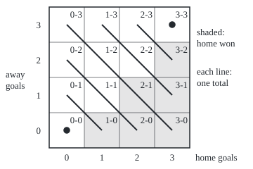
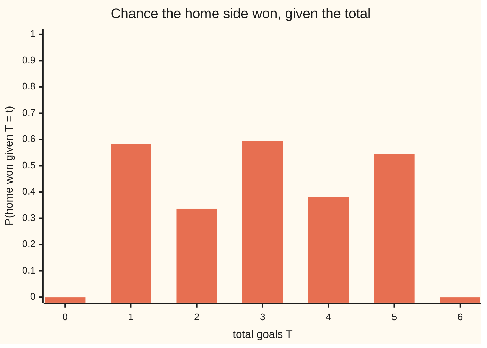

# Random variables as measurable maps: what a quantity lets you know is the sigma-algebra it generates

[Syllabus](../../../SYLLABUS.md) → [Measure and integration](../README.md) → [Measurable Functions](../README.md#s03) → Random variables as measurable maps

---

## General Overview

A football match ends 2-1. A results feed that publishes only total goals reports 3. That settles some questions: more than 3 goals? No. It leaves others open: did the home side win? A total of 3 fits the home wins 3-0 and 2-1, but also 1-2 and 0-3.

In a toy league each side scores 0 to 3 goals, independently: the home side 0, 1, 2 or 3 with chances 0.25, 0.35, 0.25 and 0.15, the away side with chances 0.35, 0.35, 0.20 and 0.10. That gives 16 final scores. Total goals is a fixed rule, a score in and one number out: in the probability wing, a random variable ([Random variables](../../09-Probability%20and%20statistics/02-Random%20Variables/01-random-variables-and-distributions.md)).

This card adds two things. A random variable must be **measurable**: every question "is the value in this set of numbers?" must be an event the model gives a probability to. And the events the total settles form a family closed under "not" and "or", a sigma-algebra: the **sigma-algebra generated by the total**, the exact meaning of "what the total lets you know". It holds 128 of the 65,536 sets of scores. The **Doob–Dynkin lemma**, after Joseph Doob and Eugene Dynkin, says which quantities the total settles: exactly its functions. "Home won" is not one. "The winning margin is even" is.

**A random variable is a function of the outcome whose every "is the value in B?" question is an event; those events form the sigma-algebra it generates, which is what the variable lets you know, and a second quantity is known from the first exactly when it is a function of it.**

**What kind of fact this is:** a definition (random variable, generated sigma-algebra) and a theorem, the Doob–Dynkin lemma, proved on this card in Why it works.

### The picture: sixteen scores, seven totals

<p align="center"></p>

To scale, 50 units per goal. Each line, or corner dot, joins the scores sharing one total, 0 at bottom left to 6 at top right. The total names a line and no more. The shading cuts across lines: the total-1 line runs from 0-1, unshaded, to 1-0, shaded.

---

## The formula

Notation first, in words. A probability space $(\Omega, \mathcal{F}, P)$ is the outcomes $\Omega$, the sigma-algebra $\mathcal{F}$ of events (the sets we allow ourselves to measure), and the probability measure $P$. The Borel sets $\mathcal{B}(\mathbb{R})$ are the sets of numbers the intervals generate ([Generated sigma-algebras and Borel sets](../01-Sets%20You%20Can%20Measure/03-generated-and-borel-sigma-algebras.md)). $X^{-1}(B)$, read "the preimage of B", is the set of outcomes whose value lands in $B$; it needs no inverse function ([Functions](../../01-Foundations/08-Relations%20and%20Functions/02-functions.md)). It is also written $\{X \in B\}$. "$\mathcal{G}$-measurable" means every such preimage lies in the sigma-algebra $\mathcal{G}$.

$$X \text{ is a random variable} \iff X^{-1}(B) \in \mathcal{F} \ \text{ for every Borel set } B$$

**Read it aloud:** a random variable is a function from outcomes to numbers for which every question "is the value in B?" is an event.

$$\sigma(X) = \{\, X^{-1}(B) \;:\; B \in \mathcal{B}(\mathbb{R}) \,\}$$

**Read it aloud:** the sigma-algebra generated by X is the collection of all events of the form "X landed in B", one for each Borel set of numbers.

A **Borel function** sends numbers to numbers with every preimage of a Borel set Borel ([Measurable functions](01-measurable-functions.md)); continuous and step functions qualify. The third line, the Doob–Dynkin lemma, uses one.

$$Y \text{ is } \sigma(X)\text{-measurable} \iff Y = g(X) \ \text{ for some Borel function } g : \mathbb{R} \to \mathbb{R}$$

**Read it aloud:** a second quantity is settled by X exactly when it is computed from X's value by one fixed rule, and that rule is a Borel function.

An example that meets the definition and one that fails. With all 65,536 sets of scores as events, the total $T$ is a random variable. With only the 128 sets in $\sigma(T)$ as events, the records of a totals-only feed, the indicator $1_W$ of $W$ = "home won", read "one on W, zero off it", is not: its preimage of 1, the six home wins, is not an event.

| Symbol | Plain meaning | In our example | Push it up and the answer… |
| --- | --- | --- | --- |
| $\Omega$, $\omega$ | the outcomes; one outcome | the 16 final scores; the score 2-1 | more outcomes: more sets to settle |
| $\mathcal{F}$, $\mathcal{G}$ | sigma-algebras: collections of sets we allow ourselves to measure | all 65,536 sets of scores; $\sigma(T)$ | more events: more functions pass as random variables |
| $P$ | the probability measure | P(home won) = 0.4325 | changes chances, never $\sigma(T)$ |
| $H$, $A$ | home goals, away goals | 2 and 1 in 2-1 | — |
| $X$, $T$, $x_i$ | a random variable; the total goals $T = H + A$; a value of $X$ | $T$ = 3 for 2-1 | — |
| $Y$ | a second random variable, to be read off $X$ | the return on an over-3.5 bet: 0 or 19 | — |
| $B$, $B_1$, $B_2$, $B_i$, $B_k$, $\mathcal{B}$, $\mathbb{R}$ | Borel sets of numbers; all of them; the real line | the totals 4, 5, 6 | a bigger $B$: a bigger preimage |
| $X^{-1}(B)$ | the preimage: outcomes whose value lands in $B$ | "more than 3 goals": 6 scores | grows with $B$ |
| $\sigma$ | generated sigma-algebra: $\sigma(X)$ is what $X$ lets you know | $\sigma(T)$: 128 sets | a finer variable: a bigger family |
| $g$, $g_n$, $c_i$ | a Borel function; the $n$-th of a sequence; a constant | g = 0 on totals 0 to 3 and 19 on 4 to 6 | — |
| $W$, $1_W$, $E$, $E_k$ | the event "home won"; its indicator, one on $W$, zero off it; events in the proof | 1 on the six home wins | — |
| $n$, $Y_n$, $L$ | a stage; $Y$ rounded down to a multiple of $2^{-n}$; where the $g_n$ converge | used in the proof | $Y_n$ closes in on $Y$ |
| $t$, $k$, $i$ | a threshold, or one value of the total; counters that number sets and terms | t from 0 to 6, as in "T = t" on the chart | a larger t: a bigger event $\{X \le t\}$ |

### When it holds

- **Real values for Y.** The proof rounds Y down to real numbers, so Y must take values on the line (or in $\mathbb{R}^n$, coordinate by coordinate). Stranger value spaces need extra conditions.
- **g must be Borel.** With $\Omega = [0, 1]$, the Borel sets as events and $X(\omega) = \omega$, the indicator of the Vitali set applied to X is no random variable ([Translation invariance and the Vitali set](../02-Length%20Done%20Properly/04-translation-invariance-and-the-vitali-set.md)).
- **Measurability is relative.** The same function is a random variable for one sigma-algebra and not another, as the home-win indicator shows.
- **No probability is used.** $\sigma(X)$ and the lemma involve only sets: change the odds and $\sigma(T)$ keeps its 128 sets. If Y equals a $\sigma(X)$-measurable variable almost surely (except on a set of probability zero), then $Y = g(X)$ almost surely.

---

## Why it works

### Step 0: questions about the value pull back to questions about the outcome

"Is the total 4, 5 or 6?" is answered by one set of scores, the six on the top-right lines. Pulling back respects "not" and "or": the scores whose total is not in $B$ are the complement of those whose total is, and the preimage of a countable union of sets $B_k$ is the union of their preimages. So questions about numbers closed under "not" and countable "or" pull back to events closed under them too. That fact carries the card.

### Step 1: what X lets you know is a sigma-algebra, and the smallest one that makes X measurable

The whole line pulls back to $\Omega$, and complements and countable unions pass through by Step 0, so $\sigma(X)$ is a sigma-algebra. Any $\mathcal{G}$ for which X is $\mathcal{G}$-measurable holds every $X^{-1}(B)$, so $\sigma(X)$ is the smallest such family. "X is a random variable" says exactly that $\sigma(X)$ sits inside $\mathcal{F}$: what X can tell, the model can give a chance to.

Threshold questions suffice: the rays "at most t" generate the Borel sets, so, by the good value-sets argument of [Measurable functions](01-measurable-functions.md), the events $\{X \le t\}$ generate $\sigma(X)$. In the code, the six events "total at most t", t = 0 to 5, closed under complements and unions round by round, grow 6 → 12 → 28 → 44 → 114 → 128 and stop. The preimages of all 2^7 = 128 sets of totals are the same 128 sets.

### Step 2: on a finite range, the information is the unions of the pieces

The preimages of single values, $\{T = t\}$, are the diagonal lines in the picture: 1, 2, 3, 4, 3, 2 and 1 scores for totals 0 to 6. Call them the **atoms** of $\sigma(T)$: the pieces the total cannot split. Every preimage $T^{-1}(B)$ is a union of whole atoms, one per total in $B$, and every union of atoms is the preimage of the totals it covers. So $\sigma(T)$ is exactly the 2^7 unions of the seven atoms, and there is a test by eye. **A set of scores is in $\sigma(T)$ exactly when it never splits a diagonal.** "More than 3 goals" takes the lines for 4, 5 and 6 whole. "Home won" splits the total-1 line: 1-0 is a home win, 0-1 is not.

### Step 3: a function of X is settled by X

Suppose $Y = g(X)$ with g Borel. Then $Y^{-1}(B) = X^{-1}(g^{-1}(B))$: g of the value lands in B exactly when the value lands in the set g sends into B. That set is Borel, so the event is in $\sigma(X)$.

A stake of 10 on "more than 3.5 goals" returns 19 on totals 4 to 6 and 0 on 0 to 3: the return is $g(T)$ for that step function g.

### Step 4: anything settled by X is a function of X

This direction has the content. It climbs three layers.

- **Yes/no questions.** If Y is the indicator of A in $\sigma(X)$, then A is $X^{-1}(B)$ for a Borel B, so $Y = 1_B(X)$.
- **Finitely many values.** A simple function (finitely many values, [Simple functions](03-simple-functions-and-approximation.md)) is a sum of values times indicators: do each indicator and add.
- **Any real value.** Round Y down to multiples of $2^{-n}$, capped at $\pm n$: the rounded $Y_n$ is simple and settled by X, so $Y_n = g_n(X)$, and $Y_n$ closes in on Y. Let g be the limit of the $g_n$ where it exists, 0 elsewhere. Limits of Borel functions are Borel ([Sums, products, sups and limits](02-limits-of-measurable-functions.md)).

The catch: the $g_n$ are pinned down only at values X takes, and elsewhere may never settle. Hence "where it exists".

On the 16 scores the ladder collapses to a table lookup: read Y once on each diagonal. The code runs it on all 65,536 yes/no questions: exactly 128 are constant on every diagonal, and they are exactly the members of $\sigma(T)$.

<details>
<summary>Detailed proof</summary>

**Setting.** $X : \Omega \to \mathbb{R}$ is any function and $\sigma(X) = \{X^{-1}(B) : B \in \mathcal{B}(\mathbb{R})\}$.

**Claim 1: $\sigma(X)$ is a sigma-algebra.** $\Omega = X^{-1}(\mathbb{R})$. If $E = X^{-1}(B)$ then $\Omega \setminus E = X^{-1}(\mathbb{R} \setminus B)$, and if $E_k = X^{-1}(B_k)$ then $\bigcup_k E_k = X^{-1}(\bigcup_k B_k)$, each by unwinding membership; complements and countable unions of Borel sets are Borel.

**Claim 2: if $g$ is Borel, $g(X)$ is $\sigma(X)$-measurable.** For Borel $B$, $\{g(X) \in B\} = X^{-1}(g^{-1}(B))$ by unwinding membership, and $g^{-1}(B)$ is Borel since $g$ is. So the event is in $\sigma(X)$ by its definition.

**Claim 3: indicators.** Let $Y = 1_E$ with $E \in \sigma(X)$. By definition $E = X^{-1}(B)$ for a Borel $B$. For each $\omega$, $1_B(X(\omega)) = 1$ exactly when $X(\omega) \in B$, that is when $\omega \in E$. So $Y = 1_B(X)$, and $1_B$ is Borel: its preimages are $\varnothing$, $B$, $\mathbb{R} \setminus B$ and $\mathbb{R}$.

**Claim 4: simple functions.** Let $Y = \sum_{i=1}^{k} c_i 1_{E_i}$ with each $E_i \in \sigma(X)$ and real $c_i$. By Claim 3, $1_{E_i} = 1_{B_i}(X)$ with $B_i$ Borel. So $Y = g(X)$ with $g = \sum_{i} c_i 1_{B_i}$, a finite sum of Borel functions, hence Borel ([Sums, products, sups and limits](02-limits-of-measurable-functions.md)).

**Claim 5: any $\sigma(X)$-measurable real $Y$.** For $n = 1, 2, \ldots$ let $Y_n = \max(-n, \min(n, 2^{-n} \lfloor 2^n Y \rfloor))$: $Y$ rounded down to a multiple of $2^{-n}$, then capped at $\pm n$. $Y_n$ takes finitely many values, and each level set $\{Y_n = c\}$ is the preimage under $Y$ of an interval or a ray, which is in $\sigma(X)$ because $Y$ is $\sigma(X)$-measurable. So $Y_n$ is simple and $\sigma(X)$-measurable, and by Claim 4 $Y_n = g_n(X)$ with $g_n$ Borel. At each $\omega$, once $n > |Y(\omega)|$ the cap is inactive and $0 \le Y(\omega) - Y_n(\omega) < 2^{-n}$, so $Y_n(\omega) \to Y(\omega)$.

Let $L = \{x \in \mathbb{R} : \limsup_n g_n(x) = \liminf_n g_n(x), \text{ both finite}\}$, the set where the $g_n$ converge. The lim sup and lim inf of Borel functions are Borel (with values in the extended line), so $L$ is Borel ([Sums, products, sups and limits](02-limits-of-measurable-functions.md)). Define $g(x) = \lim_n g_n(x)$ for $x \in L$ and $g(x) = 0$ otherwise. For Borel $B$, $g^{-1}(B)$ is $L$ intersected with the preimage of $B$ under $\limsup_n g_n$, together with the complement of $L$ when $B$ contains 0; so $g$ is Borel. For every $\omega$, $g_n(X(\omega)) = Y_n(\omega) \to Y(\omega)$, so $X(\omega) \in L$ and $g(X(\omega)) = Y(\omega)$. Hence $Y = g(X)$.

**Conclusion.** Claims 2 and 5 are the two directions of the lemma. No probability was used; with $P$ in play and $Y$ equal to a $\sigma(X)$-measurable variable except on a null set, the same $g$ gives $Y = g(X)$ almost surely.

</details>

### Step 5: reading "knowing X" off the atoms

"The winning margin is even" looks like a question about who beat whom, yet the total settles it: $H - A = (H + A) - 2A$, so margin and total share their parity, and g is 1 on even totals, 0 on odd. The margin itself is no function of the total: total 1 gives margins −1 and 1.

"Home won" is no function of the total, but the total shifts its chances. If the total settled it, every bar below would be 0 or 1.



Totals 0 and 6 hold only the draws 0-0 and 3-3, so their bars are 0; the other five sit strictly between 0 and 1. Those numbers are a conditional expectation, the best guess of the home-win indicator from what the total lets you know; [Conditioning on a partition](../09-Conditional%20Expectation/01-conditioning-on-a-partition.md) builds it on the cells of a partition, such as these atoms.

A shorter road works when X takes countably many values: set g at each value $x_i$ to the one value Y takes on the atom $\{X = x_i\}$, and 0 elsewhere. That g is Borel, since each preimage differs from $\varnothing$ or $\mathbb{R}$ by a countable set. The limit step is needed only for uncountably many values.

---

## Worked numbers, by hand

| Step | Arithmetic | Value |
| --- | --- | --- |
| outcomes | every pair of 0 to 3 home and 0 to 3 away goals | 16 scores |
| atoms of the total | scores on each diagonal, totals 0 to 6 | 1, 2, 3, 4, 3, 2, 1 |
| size of $\sigma(T)$ | keep or drop each of the 7 atoms | 2^7 = **128** sets |
| "more than 3 goals" | diagonals 4, 5, 6 taken whole | 6 scores, in $\sigma(T)$ |
| its chance | 0.1375 + 0.0550 + 0.0150 | **0.2075** |
| "home won" on total 1 | 1-0 is a home win, 0-1 is not | splits an atom: not in $\sigma(T)$ |
| chance of a home win given total 1 | 1225/2100, in ten-thousandths | **0.5833** |
| "margin is even" | same parity as the total | g = 1, 0, 1, 0, 1, 0, 1 on totals 0 to 6 |
| over-3.5 bet, stake 10 | g = 19 on totals 4 to 6, else 0 | returns 19 with chance 0.2075 |

A totals-only feed settles 128 of the 65,536 yes/no questions about a score: never who won, always whether the margin was even.

### What breaks if you drop a piece

| Mistake | Comes out at | What went wrong |
| --- | --- | --- |
| "Home won" read off the total | chance 0.5833 given total 1, not 0 or 1 | the question splits an atom, so no g exists |
| $\sigma(T)$ taken as the 7 values of the total | 128 sets, not 7 | information is sets of outcomes: unions of atoms |
| Only "more than 3?" recorded | 4 sets; "exactly 2 goals" not settled | a g that merges values loses information |
| Any rule g, Borel or not | the Vitali indicator of X is no event | Step 3 needs $g^{-1}(B)$ to be Borel |

The code prints the first three. The fourth is an argument about a non-measurable set, and no code builds one.

---

## Code, from first principles, and it actually runs

Nothing is imported. The code builds $\sigma(T)$ by two roads that share nothing: closing the six threshold events "total at most t" under complements and unions until nothing new appears, and taking the preimage of every set of totals. It tests Doob–Dynkin on all 65,536 yes/no questions, once by membership in $\sigma(T)$ and once by trying to build g as a table on the diagonals. Each chance is found twice: over scores, and through the law of the total or a running total of away chances. Chances are whole ten-thousandths, so both languages print the same digits. The code checks one finite space completely; the lemma on every space is what the proof shows.

### Python

```python
# Random variables and their information -- the check behind the card.
# Nothing is imported.  A toy league: each side scores 0 to 3 goals, home and
# away independent.  The 16 final scores are the outcomes; a set of scores is
# a 16-bit mask.  The total T = home + away generates sigma(T), built by two
# roads; Doob-Dynkin is then tested on every yes/no question about the score.
# The code checks one finite space exactly; the general theorem is the proof's.
PH = [25, 35, 25, 15]                    # P(home scores 0, 1, 2, 3), in hundredths
PA = [35, 35, 20, 10]                    # P(away scores 0, 1, 2, 3), in hundredths
SCORES = [(h, a) for h in range(4) for a in range(4)]
FULL = (1 << 16) - 1

def mask(test):                          # the set of scores passing a test
    return sum(1 << i for i, (h, a) in enumerate(SCORES) if test(h, a))

def prob(m):                             # road one: add score by score, in 1/10000
    return sum(PH[h] * PA[a] for i, (h, a) in enumerate(SCORES) if m >> i & 1)

def dec(n, d=10000):                     # n/d rounded to 4 places, integers only
    r = (20000 * n + d) // (2 * d)
    return f"{r // 10000}.{r % 10000:04d}"

def closure(gens):                       # sigma road one: complements, unions, repeat
    s, rounds = set(gens), [len(set(gens))]
    while True:
        new = s | {FULL ^ m for m in s} | {x | y for x in s for y in s}
        if new == s:
            return s, rounds
        s = new
        rounds.append(len(s))

def level_sets(f):                       # the scores sharing each value of f
    out = {}
    for i, (h, a) in enumerate(SCORES):
        out.setdefault(f(h, a), []).append(i)
    return out

def g_of(y, f):                          # build g with y = g(f) if one exists, else None
    g = {}
    for v, idx in sorted(level_sets(f).items()):
        vals = sorted({y(*SCORES[i]) for i in idx})
        if len(vals) > 1:
            return None, (v, vals)
        g[v] = vals[0]
    return g, None

total = lambda h, a: h + a
thresholds = [mask(lambda h, a, t=t: h + a <= t) for t in range(6)]
sig, rounds = closure(thresholds)
pre = {mask(lambda h, a, b=b: b >> (h + a) & 1) for b in range(1 << 7)}   # sigma road two
atoms = level_sets(total)
print("P(home scores 0..3): " + ", ".join(dec(x, 100) for x in PH) + "; P(away scores 0..3): " + ", ".join(dec(x, 100) for x in PA))
print(f"each side scores 0 to 3 goals: scores 16, questions about the score 2^16 = {1 << 16}")
print(f"sigma(T) from the thresholds 'T <= t?': {len(sig)} sets, rounds {' -> '.join(map(str, rounds))}")
print(f"sigma(T) as preimages of all 2^7 sets of totals: {len(pre)} sets; same family: {'yes' if sig == pre else 'no'}")
print("atoms, scores per total 0..6: " + ", ".join(str(len(atoms[t])) for t in range(7)))
print("total 2 atom: " + ", ".join(f"{SCORES[i][0]}-{SCORES[i][1]}" for i in atoms[2]))
const_on_atoms = [m for m in range(1 << 16)
                  if all(len({m >> i & 1 for i in idx}) == 1 for idx in atoms.values())]
agree = all((m in sig) == (m in set(const_on_atoms)) for m in range(1 << 16))
print(f"of {1 << 16} questions: in sigma(T) {len(sig)}, constant on every atom {len(const_on_atoms)}, "
      f"agree on all: {'yes' if agree else 'no'}")
questions = [
    ("more than 3 goals", lambda h, a: h + a > 3),
    ("no goals at all", lambda h, a: h + a == 0),
    ("total is even", lambda h, a: (h + a) % 2 == 0),
    ("margin is even", lambda h, a: (h - a) % 2 == 0),
    ("home won", lambda h, a: h > a),
    ("draw", lambda h, a: h == a),
    ("both teams scored", lambda h, a: h > 0 and a > 0),
]
print("question            | scores | P      | in sigma(T) | g(0..6) or the atom that splits")
verdict = {}
for name, test in questions:
    m = mask(test)
    g, clash = g_of(lambda h, a: int(test(h, a)), total)
    verdict[name] = (m in sig, g is not None)
    shown = "".join(str(g[t]) for t in range(7)) if g else f"total {clash[0]} gives {clash[1]}"
    print(f"{name:19} | {bin(m).count('1'):6} | {dec(prob(m))} | {'yes' if m in sig else 'no':11} | {shown}")
bet = lambda h, a: 19 if h + a > 3 else 0                 # 10 staked on over 3.5, returns 19
gb, _ = g_of(bet, total)
gbv = [gb[t] for t in range(7)] if gb else []              # empty when the bet is no function of T
print(f"10 staked on over 3.5 returns g(T), g = {gbv}")
gm, clash = g_of(lambda h, a: h - a, total)
print(f"home margin as g(T): {'exists' if gm else 'none'}; total {clash[0]} gives margins {clash[1]}")
# probabilities by a second road: the law of T by convolution, and a running total
law = [sum(PH[h] * PA[t - h] for h in range(4) if 0 <= t - h <= 3) for t in range(7)]
home_win2 = sum(PH[h] * sum(PA[:h]) for h in range(4))
print("law of T, P(T = 0..6): " + ", ".join(dec(p) for p in law))
print(f"P(more than 3): by scores {dec(prob(mask(lambda h, a: h + a > 3)))}, by the law of T {dec(sum(law[4:]))}")
print(f"P(home won): by scores {dec(prob(mask(lambda h, a: h > a)))}, by home goals and a running total {dec(home_win2)}")
hw = mask(lambda h, a: h > a)
cond = [(prob(hw & mask(lambda h, a, t=t: h + a == t)), law[t]) for t in range(7)]
print("P(home won | T = t), t = 0..6: " + ", ".join(dec(n, d) for n, d in cond))
print(f"  total 1 by hand: {cond[1][0]}/{cond[1][1]} = {dec(*cond[1])}")
# what breaks
coarse, _ = closure([mask(lambda h, a: h + a > 3)])
print(f"mistake 1, home won read off the total: P(home won | T = 1) = {dec(*cond[1])}, not 0 or 1")
print(f"mistake 2, sigma(T) taken as its 7 values: it has 2^7 = {len(sig)} sets")
print(f"mistake 3, only 'more than 3?' recorded: {len(coarse)} sets; settles 'exactly 2 goals': "
      f"{'yes' if mask(lambda h, a: h + a == 2) in coarse else 'no'}")
sq, _ = closure([mask(lambda h, a, v=v: (h + a) ** 2 == v) for v in range(37)])
print(f"relabelled total T*T generates the same family: {'yes' if sq == sig else 'no'}")
cx = lambda h: 95 + 50 * h                                 # the picture: 50 units per goal
cy = lambda a: 185 - 50 * a
ends = [(max(0, t - 3), min(3, t)) for t in range(7)]
print("figure, cell 50, grid x 70..270, y 10..210, total lines from (x, y) to (x, y): "
      + "; ".join(f"{t}: {cx(h)},{cy(t - h)} {cx(k)},{cy(t - k)}" for t, (h, k) in enumerate(ends)))
assert sig == pre and len(sig) == 2 ** len(atoms) == 128                  # two roads, one sigma(T)
assert agree and len(const_on_atoms) == 128                               # Doob-Dynkin on 65536 questions
assert [v for v, _ in verdict.values()] == [True, True, True, True, False, False, False]
assert all(v == w for v, w in verdict.values())                          # membership = a g exists
assert sum(law[4:]) == prob(mask(lambda h, a: h + a > 3)) and home_win2 == prob(hw)
assert len(coarse) == 4 and mask(lambda h, a: h + a == 2) not in coarse    # mistake 3
assert sq == sig and gm is None and gbv == [0, 0, 0, 0, 19, 19, 19]       # T*T; margin; the bet's g by hand
assert cond[1] == (PH[1] * PA[0], PH[0] * PA[1] + PH[1] * PA[0])           # 1-0 over 1-0 or 0-1, by hand
print("ALL CHECKS PASS")
```

**Ran 2026-10-06 on macOS, Python 3.14.6, standard library only. All checks passed. Output, pasted from the run:**

```
P(home scores 0..3): 0.2500, 0.3500, 0.2500, 0.1500; P(away scores 0..3): 0.3500, 0.3500, 0.2000, 0.1000
each side scores 0 to 3 goals: scores 16, questions about the score 2^16 = 65536
sigma(T) from the thresholds 'T <= t?': 128 sets, rounds 6 -> 12 -> 28 -> 44 -> 114 -> 128
sigma(T) as preimages of all 2^7 sets of totals: 128 sets; same family: yes
atoms, scores per total 0..6: 1, 2, 3, 4, 3, 2, 1
total 2 atom: 0-2, 1-1, 2-0
of 65536 questions: in sigma(T) 128, constant on every atom 128, agree on all: yes
question            | scores | P      | in sigma(T) | g(0..6) or the atom that splits
more than 3 goals   |      6 | 0.2075 | yes         | 0000111
no goals at all     |      1 | 0.0875 | yes         | 1000000
total is even       |      8 | 0.5000 | yes         | 1010101
margin is even      |      8 | 0.5000 | yes         | 1010101
home won            |      6 | 0.4325 | no          | total 1 gives [0, 1]
draw                |      4 | 0.2750 | no          | total 2 gives [0, 1]
both teams scored   |      9 | 0.4875 | no          | total 2 gives [0, 1]
10 staked on over 3.5 returns g(T), g = [0, 0, 0, 0, 19, 19, 19]
home margin as g(T): none; total 1 gives margins [-1, 1]
law of T, P(T = 0..6): 0.0875, 0.2100, 0.2600, 0.2350, 0.1375, 0.0550, 0.0150
P(more than 3): by scores 0.2075, by the law of T 0.2075
P(home won): by scores 0.4325, by home goals and a running total 0.4325
P(home won | T = t), t = 0..6: 0.0000, 0.5833, 0.3365, 0.5957, 0.3818, 0.5455, 0.0000
  total 1 by hand: 1225/2100 = 0.5833
mistake 1, home won read off the total: P(home won | T = 1) = 0.5833, not 0 or 1
mistake 2, sigma(T) taken as its 7 values: it has 2^7 = 128 sets
mistake 3, only 'more than 3?' recorded: 4 sets; settles 'exactly 2 goals': no
relabelled total T*T generates the same family: yes
figure, cell 50, grid x 70..270, y 10..210, total lines from (x, y) to (x, y): 0: 95,185 95,185; 1: 95,135 145,185; 2: 95,85 195,185; 3: 95,35 245,185; 4: 145,35 245,135; 5: 195,35 245,85; 6: 245,35 245,35
ALL CHECKS PASS
```

### Rust

Same numbers, same labels, built with `rustc --edition 2021 -O`.

```rust
// Random variables and their information -- the same check as the Python, in
// Rust, std only.  A toy league: each side scores 0 to 3 goals, home and away
// independent.  The 16 final scores are the outcomes; a set of scores is a
// 16-bit mask.  The total T = home + away generates sigma(T), built by two
// roads; Doob-Dynkin is then tested on every yes/no question about the score.
// The code checks one finite space exactly; the general theorem is the proof's.
use std::collections::{BTreeMap, BTreeSet};
const PH: [i64; 4] = [25, 35, 25, 15]; // P(home scores 0, 1, 2, 3), in hundredths
const PA: [i64; 4] = [35, 35, 20, 10]; // P(away scores 0, 1, 2, 3), in hundredths
const FULL: u32 = (1 << 16) - 1;

fn score(i: usize) -> (i64, i64) { ((i / 4) as i64, (i % 4) as i64) }

fn mask<F: Fn(i64, i64) -> bool>(test: F) -> u32 {  // the set of scores passing a test
    (0..16).filter(|&i| { let (h, a) = score(i); test(h, a) }).map(|i| 1u32 << i).sum()
}

fn prob(m: u32) -> i64 {                              // road one: add score by score, in 1/10000
    (0..16).filter(|&i| m >> i & 1 == 1).map(|i| { let (h, a) = score(i); PH[h as usize] * PA[a as usize] }).sum()
}

fn dec(n: i64, d: i64) -> String {                    // n/d rounded to 4 places, integers only
    let r = (20000 * n + d) / (2 * d);
    format!("{}.{:04}", r / 10000, r % 10000)
}

fn closure(gens: &[u32]) -> (BTreeSet<u32>, Vec<usize>) { // sigma road one: complements, unions, repeat
    let mut s: BTreeSet<u32> = gens.iter().copied().collect();
    let mut rounds = vec![s.len()];
    loop {
        let mut new = s.clone();
        for &m in &s { new.insert(FULL ^ m); for &n in &s { new.insert(m | n); } }
        if new == s { return (s, rounds); }
        s = new;
        rounds.push(s.len());
    }
}

fn level_sets<F: Fn(i64, i64) -> i64>(f: F) -> BTreeMap<i64, Vec<usize>> { // the scores sharing each value
    let mut out: BTreeMap<i64, Vec<usize>> = BTreeMap::new();
    for i in 0..16 { let (h, a) = score(i); out.entry(f(h, a)).or_default().push(i); }
    out
}

// build g with y = g(total) if one exists, else the atom that splits
fn g_of<Y: Fn(i64, i64) -> i64>(y: Y) -> Result<BTreeMap<i64, i64>, (i64, Vec<i64>)> {
    let mut g = BTreeMap::new();
    for (v, idx) in level_sets(|h, a| h + a) {
        let vals: Vec<i64> = idx.iter().map(|&i| { let (h, a) = score(i); y(h, a) })
            .collect::<BTreeSet<i64>>().into_iter().collect();
        if vals.len() > 1 { return Err((v, vals)); }
        g.insert(v, vals[0]);
    }
    Ok(g)
}

fn yn(b: bool) -> &'static str { if b { "yes" } else { "no" } }

fn main() {
    let thresholds: Vec<u32> = (0..6).map(|t| mask(|h, a| h + a <= t)).collect();
    let (sig, rounds) = closure(&thresholds);
    let pre: BTreeSet<u32> = (0..128u32).map(|b| mask(|h, a| b >> (h + a) & 1 == 1)).collect();
    let atoms = level_sets(|h, a| h + a);
    let ph: Vec<String> = PH.iter().map(|&x| dec(x, 100)).collect();
    let pa: Vec<String> = PA.iter().map(|&x| dec(x, 100)).collect();
    println!("P(home scores 0..3): {}; P(away scores 0..3): {}", ph.join(", "), pa.join(", "));
    println!("each side scores 0 to 3 goals: scores 16, questions about the score 2^16 = {}", 1 << 16);
    let r: Vec<String> = rounds.iter().map(|x| x.to_string()).collect();
    println!("sigma(T) from the thresholds 'T <= t?': {} sets, rounds {}", sig.len(), r.join(" -> "));
    println!("sigma(T) as preimages of all 2^7 sets of totals: {} sets; same family: {}", pre.len(), yn(sig == pre));
    let sizes: Vec<String> = (0..7).map(|t| atoms[&t].len().to_string()).collect();
    println!("atoms, scores per total 0..6: {}", sizes.join(", "));
    let a2: Vec<String> = atoms[&2].iter().map(|&i| { let (h, a) = score(i); format!("{}-{}", h, a) }).collect();
    println!("total 2 atom: {}", a2.join(", "));
    let const_on_atoms: BTreeSet<u32> = (0..1u32 << 16)
        .filter(|&m| atoms.values().all(|idx| idx.iter().all(|&i| (m >> i & 1) == (m >> idx[0] & 1)))).collect();
    let agree = (0..1u32 << 16).all(|m| sig.contains(&m) == const_on_atoms.contains(&m));
    println!("of {} questions: in sigma(T) {}, constant on every atom {}, agree on all: {}",
             1 << 16, sig.len(), const_on_atoms.len(), yn(agree));
    let questions: Vec<(&str, fn(i64, i64) -> bool)> = vec![
        ("more than 3 goals", |h, a| h + a > 3),
        ("no goals at all", |h, a| h + a == 0),
        ("total is even", |h, a| (h + a) % 2 == 0),
        ("margin is even", |h, a| (h - a).rem_euclid(2) == 0),
        ("home won", |h, a| h > a),
        ("draw", |h, a| h == a),
        ("both teams scored", |h, a| h > 0 && a > 0),
    ];
    println!("question            | scores | P      | in sigma(T) | g(0..6) or the atom that splits");
    let mut verdict = vec![];
    for (name, test) in &questions {
        let m = mask(test);
        let g = g_of(|h, a| test(h, a) as i64);
        verdict.push((sig.contains(&m), g.is_ok()));
        let shown = match &g {
            Ok(g) => (0..7).map(|t| g[&t].to_string()).collect::<String>(),
            Err((v, vals)) => format!("total {} gives {:?}", v, vals),
        };
        println!("{:19} | {:6} | {} | {:11} | {}", name, m.count_ones(), dec(prob(m), 10000), yn(sig.contains(&m)), shown);
    }
    let bet = |h: i64, a: i64| if h + a > 3 { 19 } else { 0 }; // 10 staked on over 3.5, returns 19
    let gbv: Vec<i64> = g_of(bet).map(|g| (0..7).map(|t| g[&t]).collect()).unwrap_or_default(); // empty when no g
    println!("10 staked on over 3.5 returns g(T), g = {:?}", gbv);
    let (cv, cvals) = g_of(|h, a| h - a).unwrap_err();
    println!("home margin as g(T): none; total {} gives margins {:?}", cv, cvals);
    // probabilities by a second road: the law of T by convolution, and a running total
    let law: Vec<i64> = (0..7i64).map(|t| (0..4i64).filter(|h| (0..=3).contains(&(t - h)))
        .map(|h| PH[h as usize] * PA[(t - h) as usize]).sum()).collect();
    let home_win2: i64 = (0..4).map(|h| PH[h] * PA[..h].iter().sum::<i64>()).sum();
    let lw: Vec<String> = law.iter().map(|&p| dec(p, 10000)).collect();
    println!("law of T, P(T = 0..6): {}", lw.join(", "));
    let over = mask(|h, a| h + a > 3);
    println!("P(more than 3): by scores {}, by the law of T {}", dec(prob(over), 10000), dec(law[4..].iter().sum(), 10000));
    let hw = mask(|h, a| h > a);
    println!("P(home won): by scores {}, by home goals and a running total {}", dec(prob(hw), 10000), dec(home_win2, 10000));
    let cond: Vec<(i64, i64)> = (0..7).map(|t| (prob(hw & mask(|h, a| h + a == t)), law[t as usize])).collect();
    let cs: Vec<String> = cond.iter().map(|&(n, d)| dec(n, d)).collect();
    println!("P(home won | T = t), t = 0..6: {}", cs.join(", "));
    println!("  total 1 by hand: {}/{} = {}", cond[1].0, cond[1].1, dec(cond[1].0, cond[1].1));
    // what breaks
    let (coarse, _) = closure(&[over]);
    println!("mistake 1, home won read off the total: P(home won | T = 1) = {}, not 0 or 1", dec(cond[1].0, cond[1].1));
    println!("mistake 2, sigma(T) taken as its 7 values: it has 2^7 = {} sets", sig.len());
    println!("mistake 3, only 'more than 3?' recorded: {} sets; settles 'exactly 2 goals': {}",
             coarse.len(), yn(coarse.contains(&mask(|h, a| h + a == 2))));
    let sq_gens: Vec<u32> = (0..37).map(|v| mask(|h, a| (h + a) * (h + a) == v)).collect();
    let (sq, _) = closure(&sq_gens);
    println!("relabelled total T*T generates the same family: {}", yn(sq == sig));
    let (cx, cy) = (|h: i64| 95 + 50 * h, |a: i64| 185 - 50 * a); // the picture: 50 units per goal
    let fig: Vec<String> = (0..7i64).map(|t| { let (h, k) = ((t - 3).max(0), t.min(3));
        format!("{}: {},{} {},{}", t, cx(h), cy(t - h), cx(k), cy(t - k)) }).collect();
    println!("figure, cell 50, grid x 70..270, y 10..210, total lines from (x, y) to (x, y): {}", fig.join("; "));
    assert!(sig == pre && sig.len() == 1 << atoms.len() && sig.len() == 128); // two roads, one sigma(T)
    assert!(agree && const_on_atoms.len() == 128);                          // Doob-Dynkin on 65536 questions
    let firsts: Vec<bool> = verdict.iter().map(|v| v.0).collect();
    assert_eq!(firsts, vec![true, true, true, true, false, false, false]);
    assert!(verdict.iter().all(|&(v, w)| v == w));                          // membership = a g exists
    assert!(law[4..].iter().sum::<i64>() == prob(over) && home_win2 == prob(hw));
    assert!(coarse.len() == 4 && !coarse.contains(&mask(|h, a| h + a == 2))); // mistake 3
    assert!(sq == sig && gbv == vec![0, 0, 0, 0, 19, 19, 19]);               // T*T; the bet's g by hand
    assert!(cond[1] == (PH[1] * PA[0], PH[0] * PA[1] + PH[1] * PA[0]));      // 1-0 over 1-0 or 0-1, by hand
    println!("ALL CHECKS PASS");
}
```

**Ran 2026-10-06 on macOS, rustc 1.98.1, no crates. All checks passed. Output, pasted from the run:**

```
P(home scores 0..3): 0.2500, 0.3500, 0.2500, 0.1500; P(away scores 0..3): 0.3500, 0.3500, 0.2000, 0.1000
each side scores 0 to 3 goals: scores 16, questions about the score 2^16 = 65536
sigma(T) from the thresholds 'T <= t?': 128 sets, rounds 6 -> 12 -> 28 -> 44 -> 114 -> 128
sigma(T) as preimages of all 2^7 sets of totals: 128 sets; same family: yes
atoms, scores per total 0..6: 1, 2, 3, 4, 3, 2, 1
total 2 atom: 0-2, 1-1, 2-0
of 65536 questions: in sigma(T) 128, constant on every atom 128, agree on all: yes
question            | scores | P      | in sigma(T) | g(0..6) or the atom that splits
more than 3 goals   |      6 | 0.2075 | yes         | 0000111
no goals at all     |      1 | 0.0875 | yes         | 1000000
total is even       |      8 | 0.5000 | yes         | 1010101
margin is even      |      8 | 0.5000 | yes         | 1010101
home won            |      6 | 0.4325 | no          | total 1 gives [0, 1]
draw                |      4 | 0.2750 | no          | total 2 gives [0, 1]
both teams scored   |      9 | 0.4875 | no          | total 2 gives [0, 1]
10 staked on over 3.5 returns g(T), g = [0, 0, 0, 0, 19, 19, 19]
home margin as g(T): none; total 1 gives margins [-1, 1]
law of T, P(T = 0..6): 0.0875, 0.2100, 0.2600, 0.2350, 0.1375, 0.0550, 0.0150
P(more than 3): by scores 0.2075, by the law of T 0.2075
P(home won): by scores 0.4325, by home goals and a running total 0.4325
P(home won | T = t), t = 0..6: 0.0000, 0.5833, 0.3365, 0.5957, 0.3818, 0.5455, 0.0000
  total 1 by hand: 1225/2100 = 0.5833
mistake 1, home won read off the total: P(home won | T = 1) = 0.5833, not 0 or 1
mistake 2, sigma(T) taken as its 7 values: it has 2^7 = 128 sets
mistake 3, only 'more than 3?' recorded: 4 sets; settles 'exactly 2 goals': no
relabelled total T*T generates the same family: yes
figure, cell 50, grid x 70..270, y 10..210, total lines from (x, y) to (x, y): 0: 95,185 95,185; 1: 95,135 145,185; 2: 95,85 195,185; 3: 95,35 245,185; 4: 145,35 245,135; 5: 195,35 245,85; 6: 245,35 245,35
ALL CHECKS PASS
```

The two outputs match line for line.

> [!TIP]
> **Try changing**
> Guess first, then run it.
> - **Change the odds.** Set `PH` to `[40, 30, 20, 10]`. Does $\sigma(T)$ change? No: every set count and verdict stays, only chances move, and the asserts pass.
> - **Ask fewer threshold questions.** Change `range(6)` in `thresholds` to `range(0, 6, 2)`. Totals 1 and 2 merge, as do 3 and 4, and 5 and 6; the closure road falls short of the preimage road, and the first assert stops it.
> - **A different margin question.** Change the "margin is even" test to `h - a in (0, 2)`. Settled by the total? No: on total 2, 2-0 and 1-1 say yes, 0-2 says no; the third assert stops it.

---

## The usual mistake

> [!warning]
> **Taking what X lets you know for how X is distributed.** $\sigma(T)$ is sets of scores; the law of $T$ is chances for totals. Change the odds and every chance moves; $\sigma(T)$ keeps its 128 sets. The total and its square have different laws yet generate the same family: squaring loses nothing on totals 0 to 6.
>
> - **Any function of the score is a function of the total.** "Home won" splits the total-1 atom, so no g exists.
> - **$\sigma(T)$ has one member per value.** It has one per set of values: 128, not 7.
> - **Unsettled means uninformative.** A home win has chance 0.5833 given total 1 and 0.3365 given total 2: partial information, which conditional expectation measures.
> - **Dropping "with respect to which sigma-algebra".** The home-win indicator is a random variable when every set of scores is an event, and not when only $\sigma(T)$ is.

---

## Where you meet it in real life

- **Over/under betting.** A total-goals market settles on the total alone, so every such bet returns $g(T)$ for some rule g, and none can settle "home won".
- **Published aggregates.** An office that releases only totals releases what they generate. Doob–Dynkin says what can be recovered with certainty: functions of the totals, nothing more.
- **Information growing over time.** The first n results of a season generate a sigma-algebra that grows with n; that growing family is a filtration ([Filtrations and martingales](../09-Conditional%20Expectation/06-filtrations-and-martingales.md)).

> **Say it back**
> A random variable is a function from outcomes to numbers whose every question "is the value in B?" is an event. Those events form a sigma-algebra, the one it generates, and that family is exactly what the variable lets you know. On a finite range it is the unions of the pieces the variable cannot split. A second quantity is settled by the first exactly when it is a Borel function of it. The total settles "more than 3 goals" and "margin even", never "home won".

---

## What this builds on

- [Measurable functions](01-measurable-functions.md): preimages of measurable sets, and the Borel functions g.
- [Sums, products, sups and limits](02-limits-of-measurable-functions.md): sums and limits of Borel functions are Borel, used in Claims 4 and 5.
- [Simple functions](03-simple-functions-and-approximation.md): simple functions, the middle rung of Step 4's ladder.
- [Random variables](../../09-Probability%20and%20statistics/02-Random%20Variables/01-random-variables-and-distributions.md): a random variable as a rule on outcomes, before measurability.
- [Functions](../../01-Foundations/08-Relations%20and%20Functions/02-functions.md): preimages, which need no inverse.

## Where this goes next

- [The law of a random variable](05-pushforward-and-the-law.md): the law of a random variable, carried from the outcomes by preimages; for T it is the list of chances printed here.
- [Conditioning on a partition](../09-Conditional%20Expectation/01-conditioning-on-a-partition.md): the best guess of an unsettled quantity from the cells of a partition, such as the atoms of $\sigma(T)$.

This card says which questions the total settles and which it leaves open; how likely each total is, and so how often each settled question comes out yes, is the law of the total, which [The law of a random variable](05-pushforward-and-the-law.md) defines for every random variable.

---

## Sources

Verified 2026-09-29: every link below resolves to the publisher's or author's page.

- Williams, David. *Probability with Martingales*. Cambridge University Press, 1991. [Publisher page](https://www.cambridge.org/core/books/probability-with-martingales/B4CFCE0D08930FB46C6E93E775503926). Random variables as measurable functions, and the sigma-algebra they generate read as information.
- Durrett, Rick. *Probability: Theory and Examples*, 5th ed. [Author's page with the full text](https://sites.math.duke.edu/~rtd/PTE/pte.html). Section 1.3, Random Variables: measurable maps and the sigma-algebra a variable generates.
- Kallenberg, Olav. *Foundations of Modern Probability*, 3rd ed. Springer, 2021. [DOI](https://doi.org/10.1007/978-3-030-61871-1). The functional representation lemma, the Doob–Dynkin statement proved here, in its first chapter.
