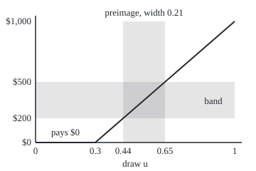
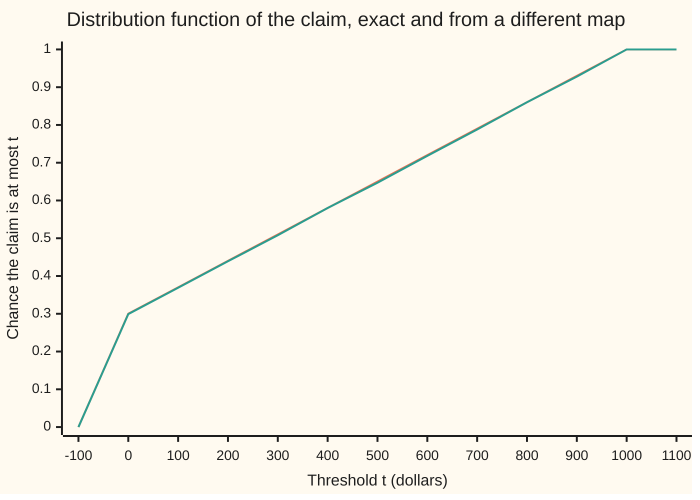

# The law of a random variable: push the probability forward through it, and the distribution on the line is the whole story

[Syllabus](../../../SYLLABUS.md) → [Measure and integration](../../../SYLLABUS.md#w10) → [Measurable Functions](../../../SYLLABUS.md#w10-s03) → The law of a random variable

---

## General Overview

A small insurance policy pays at most one claim a year. In three years out of ten nothing is claimed. Otherwise the claim is anywhere from $0 to $1,000, every amount equally likely. The card [Distribution functions and Lebesgue-Stieltjes measures](../02-Length%20Done%20Properly/06-lebesgue-stieltjes-measures.md) wrote this down as a measure on the dollar line: 0.3 sitting on $0 exactly, the other 0.7 spread evenly from $0 to $1,000. It gives a claim above $200 and at most $500 the probability 0.21.

A simulator builds the same claim another way. It draws one number u between 0 and 1, every value equally likely, and sends it through a rule. A draw at or below 0.3 pays $0. A draw above 0.3 pays (u − 0.3)/0.7 × $1,000. A draw of 0.44 pays $200; 0.65 pays $500; 0.9 pays $857.14. The rule is a random variable: a measurable map from draws to dollars ([Random variables as measurable maps](04-random-variables-and-their-information.md)).

What chance does the rule give to "above $200, at most $500"? Go back through the rule and collect every draw that lands there. They fill the stretch of draws from 0.44 to 0.65, of length 0.21. The probability on the draws has been carried through the rule onto the dollar line, and what arrives is the shelf 2 measure, set by set. The carried-over measure is the **pushforward** of the probability through the map, called from here on the **law** of the random variable.

**The law of a random variable gives each set of values the probability of the draws that land in it; it is a probability measure on the line, and its distribution function determines it completely.**

**What kind of fact this is:** a definition (the law), with three theorems proved on this card in Why it works: the law is a probability measure, equal distribution functions give equal laws, and every distribution function is some variable's law.

### The picture: a band of dollars and the draws that land in it

The horizontal axis is the draw u, from 0 to 1. The vertical axis is the claim in dollars. The graph is flat at $0 up to u = 0.3, then climbs straight to $1,000. The horizontal band is the set of claims above $200 and at most $500. The vertical band is its preimage: the draws the rule sends into it, from 0.44 to 0.65. Its width, 0.21, is the band's probability. Drawn to scale.

<p align="center"></p>

The flat piece carries 0.3 of the draws onto a single point, $0. That point gets probability 0.3, though its own length is zero: the law counts the draws behind a value, never the size of the value set.

---

## The formula

Notation first, in words. A probability space $(\Omega, \mathcal{F}, P)$ is a set of outcomes, a sigma-algebra (the collection of sets we allow ourselves to measure) and a probability measure on it ([Measures](../01-Sets%20You%20Can%20Measure/04-measures.md)). Here $\Omega$ is the draws from 0 to 1, and $P$ is length, Lebesgue measure $\lambda$. The Borel sets $\mathcal{B}(\mathbb{R})$ are the sets of real numbers built from intervals by complements and countable unions. For a set $B$ of dollar amounts, $X^{-1}(B)$ is read "the preimage of B": every draw that the map sends into B. It is a set of draws and exists whether or not the map can be undone; the claim rule sends 0.3 of the draws to one point, so it has no inverse. $\mu_X$ is read "the law of X", and is also written $P \circ X^{-1}$, "P after the preimage".

$$\mu_X(B) \;=\; P\big(X^{-1}(B)\big) \;=\; P\big(\{\,u \in \Omega : X(u) \in B\,\}\big), \qquad B \in \mathcal{B}(\mathbb{R})$$

**Read it aloud:** the law gives a set of values the probability of all the draws that land in it.

Its distribution function reads the law on half-lines:

$$F_X(t) \;=\; \mu_X\big((-\infty, t]\big) \;=\; P(X \le t)$$

**Read it aloud:** the distribution function at t is the chance the value is at most t.

For the claim, $F_X(t)$ is 0 below $0, then 0.3 + 0.7 × t/1,000 from $0 up to $1,000, then 1. Two of the card's theorems, in symbols:

$$F_X = F_Y \;\Longrightarrow\; \mu_X = \mu_Y, \qquad\qquad \mu_X = \mu_{F}\ \text{ where } F = F_X$$

**Read it aloud:** two variables with the same distribution function have the same law, and that law is the measure shelf 2 builds from the function.

| Symbol | Plain meaning | In our example | Push it up and the answer… |
| --- | --- | --- | --- |
| $\Omega$, $u$ | the space of outcomes, and one outcome | draws u from 0 to 1 | — |
| $\mathcal{F}$ | the sets of draws that get a probability | Borel sets of draws | a finer collection lets more maps be measurable |
| $P$, $\lambda$ | the probability on the draws; here length | the stretch 0.44 to 0.65 has 0.21 | — |
| $X$, $Y$ | random variables: measurable maps to the line | X the claim rule; Y pays $0 if u > 0.7, else u/0.7 × $1,000 | — |
| $B$, $B_i$, $B_j$ | Borel sets of values | claims above $200, at most $500 | a wider band collects more draws |
| $X^{-1}(B)$ | the preimage: draws sent into B | draws from 0.44 to 0.65 | — |
| $\mathcal{B}(\mathbb{R})$ | the Borel sets of the line | every set built from intervals | — |
| $\mu_X$, $\mu_Y$ | the laws of X and Y, measures on values | 0.21 on the band, 0.3 on $0 | — |
| $F_X$, $F$ | the distribution function of X; F alone is any such function | 0.475 at $250 | rises with t, never falls |
| $\mu_F$ | the measure shelf 2 builds from F | mass F(b) − F(a) on each (a, b] | — |
| $t$, $a$, $b$ | thresholds and interval ends, in dollars | $250; $200 and $500 | a larger t collects more draws |
| $Q$ | the quantile map: u goes to the smallest amount x with F(x) ≥ u | the claim rule itself | a larger u gives a larger amount |
| $n$, $x$, $s$ | a whole-number counter, as in t − 1/n and (−n, t]; an amount in Q's definition; a second threshold, rising to t in $F_X(t-)$ or beside t in the proof of Step 4 | n = 1, 2, 3, …; x and s in dollars | a larger n: t − 1/n closes in on t |
| $\mathcal{P}$ | the family of half-lines (−∞, t], a pi-system | used in the proof of Step 4 | — |

### When it holds

- **X measurable, for the sigma-algebra in play.** The law needs every preimage of a Borel set to be a set P can measure. Measure the draws more coarsely and the question has no answer: with ten tickets and only "first five or last five" measurable, the claim's preimage of the band is tickets 4, 5 and 6, which is no such set.
- **P a probability measure, total 1.** Pushforward works for any measure, but the distribution function needs finite totals. Length on the whole line gives every half-line infinite size, and so does twice length; the two measures disagree on the interval from 0 to 1.
- **X finite at every draw.** A value of plus infinity would never enter any half-line, and the distribution function would climb to less than 1.
- **Agreement at every threshold t, or at least on a dense set such as the rationals.** Continuity from the right fills in the thresholds between. Two distribution functions that agree only on a grid with gaps can belong to different laws; What breaks prints one.

---

## Why it works

### Step 0: preimages keep every set operation, so the probability travels intact

Take two disjoint bands of dollars. No draw can land in both, so their preimages are disjoint. A draw lands in a union of bands exactly when it lands in one of them, so the preimage of a union is the union of the preimages. Complements work the same way. Every rule a probability obeys is a statement about unions, complements and disjointness, so every rule survives the trip to the dollar line.

### Step 1: the law is a probability measure

Plain version. The law of the whole line is the probability of all draws, 1. The law of disjoint bands adds up, because the draws behind them are disjoint and P adds up. That is the definition of a probability measure ([Measures](../01-Sets%20You%20Can%20Measure/04-measures.md)).

<details>
<summary>Detailed proof: the law is a probability measure on the Borel sets</summary>

Let $X$ be measurable from $(\Omega, \mathcal{F})$ to the line with its Borel sets: $X^{-1}(B)$ is in $\mathcal{F}$ for every Borel $B$ ([Measurable functions](01-measurable-functions.md)). So $\mu_X(B) = P(X^{-1}(B))$ is defined for every Borel $B$, and lies between 0 and 1 because $P$ does.

Totals. $X^{-1}(\mathbb{R}) = \Omega$, since every draw has a real value; so $\mu_X(\mathbb{R}) = P(\Omega) = 1$. $X^{-1}(\emptyset) = \emptyset$, so the empty set gets 0.

Countable additivity. Let $B_1, B_2, \ldots$ be disjoint Borel sets. If a draw $u$ were in both $X^{-1}(B_i)$ and $X^{-1}(B_j)$ with $i \ne j$, then $X(u)$ would be in both $B_i$ and $B_j$, which share nothing; so the preimages are disjoint. A draw is in $X^{-1}(\bigcup_i B_i)$ exactly when $X(u)$ is in some $B_i$, exactly when $u$ is in some $X^{-1}(B_i)$; so the preimage of the union is the union of the preimages. Countable additivity of $P$ then gives
$$\mu_X\Big(\bigcup_i B_i\Big) = P\Big(\bigcup_i X^{-1}(B_i)\Big) = \sum_i P\big(X^{-1}(B_i)\big) = \sum_i \mu_X(B_i).$$
No inverse of $X$, no density and no continuity was used.

</details>

### Step 2: ten tickets, the whole definition listed

Replace the continuous draw by ten equally likely tickets at u = 0.05, 0.15, …, 0.95, each with probability 0.1. The rule pays $0.00, $0.00, $0.00, $71.43, $214.29, $357.14, $500.00, $642.86, $785.71 and $928.57. The law pools equal payments: 0.3 on $0, and 0.1 on each of the 7 other amounts. The band above $200 and at most $500 collects tickets 4, 5 and 6 (counting from 0), probability 0.3.

That is 0.3, not 0.21, because ten tickets are a different probability space from the continuous draw; the grid in the code uses 100,000 tickets and returns 0.21000.

A non-example. Keep the ten tickets but let the sigma-algebra be only: nothing, tickets 0 to 4, tickets 5 to 9, everything. The preimage of the band is tickets 4, 5 and 6, which straddles the split and is not in the collection. The rule is not measurable for this sigma-algebra, and the law is undefined there.

### Step 3: the distribution function falls out of the law

Set B to the half-line of amounts at most t. The law then gives $F_X(t)$, the chance the claim is at most t. Because the law is a probability measure, this function never falls, is continuous from the right, and runs from 0 to 1 ([Distribution functions and Lebesgue-Stieltjes measures](../02-Length%20Done%20Properly/06-lebesgue-stieltjes-measures.md)). For an interval, split the half-line at a:

$$\mu_X\big((a, b]\big) = F_X(b) - F_X(a).$$

For the claim, the band's preimage runs from 0.3 + 0.7 × 200/1,000 = 0.44 to 0.3 + 0.7 × 500/1,000 = 0.65. By the preimage, 0.21; by the distribution function, 0.65 − 0.44 = 0.21.

Write $F_X(t-)$, read "F just below t", for the limit of $F_X(s)$ as s rises to t. The half-lines up to t − 1/n grow to the values strictly below t, so continuity from below gives $F_X(t-) = P(X < t)$, and

$$P(X = t) \;=\; F_X(t) - F_X(t-).$$

A jump is a single value with probability of its own. At $0, 0.3 − 0 = 0.3: the 0.3 of the draws that land on $0.

### Step 4: equal distribution functions mean equal laws

Plain version. The half-lines "at most t" overlap in another half-line, so they form a pi-system (a family closed under overlap), and they generate the Borel sets. Two probability measures that agree on such a family agree on every set it generates ([Pi-systems and Dynkin's theorem](../01-Sets%20You%20Can%20Measure/06-pi-systems-and-uniqueness.md)). Two laws with the same distribution function agree on every half-line, so they agree everywhere.

<details>
<summary>Detailed proof: equal distribution functions give equal laws</summary>

Let $X$ and $Y$ be real random variables, possibly on different probability spaces, with $F_X(t) = F_Y(t)$ for every real $t$. By Step 1, $\mu_X$ and $\mu_Y$ are probability measures on $\mathcal{B}(\mathbb{R})$.

The family $\mathcal{P}$ of half-lines $(-\infty, t]$ is a pi-system: $(-\infty, s] \cap (-\infty, t] = (-\infty, \min(s, t)]$.

It generates the Borel sets. An interval $(a, b]$ is $(-\infty, b]$ with $(-\infty, a]$ removed; an open interval $(a, b)$ is the union of $(a, b - 1/n]$ over whole numbers n; every open set of the line is a countable union of open intervals with rational ends; and the Borel sets are generated by the open sets ([Generated sigma-algebras and Borel sets](../01-Sets%20You%20Can%20Measure/03-generated-and-borel-sigma-algebras.md)). So $\sigma(\mathcal{P}) = \mathcal{B}(\mathbb{R})$.

The two laws agree on $\mathcal{P}$, because $\mu_X((-\infty, t]) = F_X(t) = F_Y(t) = \mu_Y((-\infty, t])$, and have the same total, 1. Dynkin's uniqueness theorem ([Pi-systems and Dynkin's theorem](../01-Sets%20You%20Can%20Measure/06-pi-systems-and-uniqueness.md)) gives $\mu_X(B) = \mu_Y(B)$ for every Borel $B$.

The same argument with $\mu_F$ in place of $\mu_Y$ gives $\mu_X = \mu_F$. The measure $\mu_F$ has mass $F(b) - F(a)$ on each $(a, b]$ by construction, and continuity from below along the growing intervals $(-n, t]$ gives $\mu_F((-\infty, t]) = F(t) - \lim_{n} F(-n) = F(t)$. Letting t grow, continuity from below again gives $\mu_F(\mathbb{R}) = \lim_t F(t) = 1$, so $\mu_F$ has the total 1 that the uniqueness step needs.

</details>

Read back on the claim. A second simulator uses the rule Y: $0 if u > 0.7, else u/0.7 × $1,000. It pays from the other end of the draws. Its distribution function is 0.3 + 0.7 × t/1,000 on the same range, so its law is the claim's law, on every Borel set. Yet X and Y never pay the same amount on the same draw: the grid finds them different on 100,000 of 100,000 tickets.



The first line (orange) is the exact distribution function of X. The second line (green) is the fraction of 20,000 simulated payments of Y at or below t. They lie on top of each other. The steep first segment is the jump of 0.3 at $0, drawn across one step of the axis because the chart joins its points.

### Step 5: every distribution function is some variable's law

Plain version. Given F, send each draw u to the smallest amount x with F(x) ≥ u. Call that amount Q(u), the quantile map. The draws sent to at most t are exactly the draws at most F(t), which have probability F(t). So Q has distribution function F, and by Step 4 its law is the measure built from F.

For the claim, F already reaches any u at or below 0.3 at $0, so Q(u) is $0. Above 0.3, solve 0.3 + 0.7 × t/1,000 = u: t = (u − 0.3)/0.7 × $1,000. That is the simulator's rule. The rule X was not invented; it is the quantile map of the shelf 2 function. The code finds the smallest amount by bisection (halving an interval that brackets it) and matches X at u = 0.44, 0.65 and 0.9: $200.00, $500.00, $857.14.

<details>
<summary>Detailed proof: the quantile map has law F</summary>

Let $F$ be non-decreasing, continuous from the right, with limits 0 at minus infinity and 1 at plus infinity. For $u$ strictly between 0 and 1 set $Q(u) = \inf\{x : F(x) \ge u\}$. The set is non-empty because $F$ tends to 1 and $u < 1$; it is bounded below because $F$ tends to 0 and $u > 0$. So $Q(u)$ is a real number.

Claim: $Q(u) \le t$ exactly when $u \le F(t)$.

If $u \le F(t)$, then $t$ is in the set, so its infimum $Q(u)$ is at most $t$.

If $Q(u) \le t$: for every whole number n some amount x in the set lies below Q(u) + 1/n, and $F$ never falls, so $F(Q(u) + 1/n) \ge F(x) \ge u$. Continuity from the right lets n grow: $F(Q(u)) \ge u$. Then $F(t) \ge F(Q(u)) \ge u$.

So $\{u : Q(u) \le t\}$ is the stretch of draws from 0 up to $F(t)$, clipped to $(0, 1)$. It is an interval, so $Q$ is measurable by the half-line test ([Measurable functions](01-measurable-functions.md)), and its length is $F(t)$. Hence $F_Q = F$, and Step 4 gives $\mu_Q = \mu_F$.

</details>

### Step 6: discrete, continuous and mixed laws are three shapes of one object

Shelf 2 sorts distribution functions by shape; each shape is a law. Push the same uniform draw through three maps:

- **Discrete.** A flat fee: $0 if u ≤ 0.3, else $500. The law is two point masses, 0.3 at $0 and 0.7 at $500. The distribution function is a staircase: 0.3 from $0, 1 from $500.
- **Continuous.** $1,000 × u. No single amount has probability of its own; the distribution function climbs without jumps, 0.25 at $250 and 0.5 at $500. Its law has a density ([Densities](../../09-Probability%20and%20statistics/04-Continuous%20Distributions/01-densities-and-cdfs.md)): the chance of an interval is the area under a flat curve over it.
- **Mixed.** The claim. A point mass of 0.3 at $0, read off the jump, plus 0.7 spread evenly over the dollars. The distribution function jumps to 0.3 at $0, then climbs to 0.475 at $250 and 0.65 at $500.

No density gives a single point probability 0.3, and no list of point masses gives intervals probability in proportion to length; the measure holds both. Not every law is one of the three: the Cantor function's law has no jumps and no density ([The Cantor set](../02-Length%20Done%20Properly/07-the-cantor-set.md)).

The probability wing computes the law of a transformed variable by change of variables ([Transforming a variable](../../09-Probability%20and%20statistics/05-Transformations%20and%20Joint%20Laws/01-transforming-a-random-variable.md)); that is this pushforward done twice, since the law of g(X) is the law of X pushed through g.

---

## Worked numbers, by hand

| Step | Arithmetic | Value |
| --- | --- | --- |
| lower end of the preimage | 0.3 + 0.7 × 200/1,000 | 0.44 |
| upper end | 0.3 + 0.7 × 500/1,000 | 0.65 |
| law of the band, by preimage | 0.65 − 0.44 | **0.21** |
| law of the band, by F | F(500) − F(200) = 0.65 − 0.44 | **0.21** |
| law of $0 | draws from 0 to 0.3 | 0.3 |
| law of (0, 200] | 0.44 − 0.3; the $0 draws are left out | 0.14 |
| law above $900 | 1 − 0.93 | 0.07 |
| law of $0, the band, or above $900 | 0.3 + 0.21 + 0.07, disjoint | **0.58** |
| distribution function at $250 | 0.3 + 0.7 × 250/1,000 | 0.475 |
| quantile at u = 0.9 | (0.9 − 0.3)/0.7 × 1,000 | $857.14 |

A claim above $200 and at most $500 comes in about 21 years out of 100 over the long run; the simulator and the shelf 2 measure agree on that and on every other set of amounts.

### What breaks if you drop a piece

| Mistake | Comes out at | What went wrong |
| --- | --- | --- |
| Distribution functions compared only at $0, $100, …, $1,000 | the claim rounded up to the next $100 matches X there, yet gives 0.0000 above $200 and at most $250, where X gives 0.0350 | a grid of half-lines does not generate the Borel sets |
| Same law read as same variable | X and Y differ on 100,000 of 100,000 tickets | the law forgets which draw paid which amount |
| Atom dropped: the claim spread evenly over $0 to $1,000 | 0.3000 on the band, not 0.2100; 0.0000 at or below $0, not 0.3000 | a mixed law read as continuous |
| Left limit read as F at the jump | F(0−) = 0.0000 in place of F(0) = 0.3000 | the distribution function counts the point itself |

The code prints all four.

---

## Code, from first principles, and it actually runs

Nothing is imported. Exact probabilities are whole numbers of ten-thousandths, so the preimage road, the distribution-function road and the grid are exact. Five roads: the preimage length worked out from the rule; shelf 2's distribution function; 100,000 equally spaced tickets pushed through the rule one by one and counted; a SplitMix64 random generator (a small, standard mixing recipe, written out in both languages) feeding a different map Y; and bisection for the quantile map. The code checks instances. That the law is a measure on every Borel set, and that the distribution function fixes it, only the proofs above show.

### Python

```python
# The law of a random variable -- the check behind the card.  Standard library
# only, nothing imported.  Omega = (0, 1), probability = length.  The claim map
# sends a draw u to $0 if u <= 0.3, else to (u - 0.3)/0.7 x $1,000.  Exact
# probabilities are whole numbers of ten-thousandths.  Roads: preimage lengths;
# shelf 2's distribution function F; a grid of 100,000 equal tickets pushed
# forward one by one; a SplitMix64 simulation of a different map Y; bisection.
U, N = 10000, 100000                          # probability unit 1/10000; grid size
LO, HI = -10**6, 10**6                        # stand-ins for minus and plus infinity

def show(k):                                  # ten-thousandths -> "0.2100"
    return f"{k // U}.{k % U:04d}"

def cdf(t):                                   # road 2: shelf 2's F, in 1/10000
    return 0 if t < 0 else (3000 + 7 * t if t < 1000 else U)

def preimage(a, b):                           # road 1: length of {u : a < X(u) <= b}
    flat = 3000 if a < 0 <= b else 0          # the flat piece (0, 0.3], where X = 0
    lo, hi = max(a, 0), min(b, 1000)          # the ramp, u from 0.3 + 0.0007 lo to 0.3 + 0.0007 hi
    return flat + (7 * (hi - lo) if hi > lo else 0)

def xnum(i, n):                               # ticket i of n sits at u = (2i+1)/(2n); X = xnum/(140 n)
    return max(0, ((2 * i + 1) * 10 - 6 * n) * 10000)

def ynum(i, n):                               # a different map: Y = 0 if u > 0.7, else u/0.7 x $1,000
    return 0 if (2 * i + 1) * 10 > 14 * n else (2 * i + 1) * 100000

def grid(num, a, b, n=N):                     # road 3: count tickets whose value lands in (a, b]
    d = 140 * n
    return sum(1 for i in range(n) if a * d < num(i, n) <= b * d)

def dollars(v, n):                            # xnum/(140 n) to cents, rounded half up
    return f"{(v * 200 + 140 * n) // (280 * n) / 100:.2f}"

def splitmix(state):                          # road 4: SplitMix64, written out here
    state = (state + 0x9E3779B97F4A7C15) & 0xFFFFFFFFFFFFFFFF
    z = state
    z = ((z ^ (z >> 30)) * 0xBF58476D1CE4E5B9) & 0xFFFFFFFFFFFFFFFF
    z = ((z ^ (z >> 27)) * 0x94D049BB133111EB) & 0xFFFFFFFFFFFFFFFF
    return state, z ^ (z >> 31)

def quantile(p):                              # road 5: inf {x : F(x) >= p}, by bisection
    f = lambda x: 0.0 if x < 0 else (0.3 + 0.0007 * x if x < 1000 else 1.0)
    lo, hi = -1.0, 1001.0
    for _ in range(60):
        mid = (lo + hi) / 2
        lo, hi = (lo, mid) if f(mid) >= p else (mid, hi)
    return hi

# ---- ten tickets: the definition on a space small enough to list ----
ten = [xnum(i, 10) for i in range(10)]
print("ten tickets u = 0.05 .. 0.95, each 0.1; X in dollars:", "[" + ", ".join(dollars(v, 10) for v in ten) + "]")
hit = [i for i in range(10) if 200 * 1400 < ten[i] <= 500 * 1400]
print(f"ten tickets: law puts {ten.count(0) / 10} on $0 and 0.1 on each of {len(set(ten)) - 1} other values")
print(f"ten tickets: preimage of (200, 500] = tickets {hit}, probability {len(hit) / 10}")
coarse = [[], [0, 1, 2, 3, 4], [5, 6, 7, 8, 9], list(range(10))]
print(f"coarse sigma-algebra (none, 0-4, 5-9, all) holds tickets {hit}: {'yes' if hit in coarse else 'no'}")
assert hit == [4, 5, 6] and hit not in coarse and ten.count(0) == 3

# ---- the continuous claim: three roads to each probability ----
sets = [("{0}", -1, 0), ("(0, 200]", 0, 200), ("(200, 500]", 200, 500),
        ("(-inf, 250]", LO, 250), ("(900, inf)", 900, HI), ("(1000, inf)", 1000, HI)]
print("set | preimage length | F(b) - F(a) | grid of 100000 tickets")
for name, a, b in sets:
    g = grid(xnum, a, b)
    print(f"{name} | {show(preimage(a, b))} | {show(cdf(b) - cdf(a))} | {g / N:.5f}")
    assert preimage(a, b) == cdf(b) - cdf(a) and abs(g * U - preimage(a, b) * N) <= 2 * U
union = preimage(-1, 0) + preimage(200, 500) + preimage(900, HI)
ug = grid(xnum, -1, 0) + grid(xnum, 200, 500) + grid(xnum, 900, HI)
print(f"union {{0}} or (200, 500] or (900, inf): {show(union)} by additivity, {ug / N:.5f} by the grid")
assert union == cdf(0) - cdf(-1) + cdf(500) - cdf(200) + U - cdf(900) and abs(ug * U - union * N) <= 6 * U

# ---- the distribution function, and a different map with the same law ----
ts = list(range(-100, 1101, 100))
print("chart t:", ts)
print("chart F_X exact:", "[" + ", ".join(f"{cdf(t) / U:.2f}" for t in ts) + "]")
seed = 2026
state, draws = seed, []
for _ in range(20000):
    state, z = splitmix(state)
    u = (z >> 11) * 2.0 ** -53
    draws.append(0.0 if u > 0.7 else u / 0.7 * 1000)
sim = [sum(1 for y in draws if y <= t) / 20000 for t in ts]
print(f"chart F_Y simulated, 20000 draws, seed {seed}:", "[" + ", ".join(f"{s:.3f}" for s in sim) + "]")
fy = [grid(ynum, LO, t) for t in ts]
print("F_Y by the grid equals F_X at every chart t:", "yes" if all(abs(g * U - cdf(t) * N) <= 2 * U for g, t in zip(fy, ts)) else "no")
assert all(abs(g * U - cdf(t) * N) <= 2 * U for g, t in zip(fy, ts))
assert all(abs(s - cdf(t) / U) <= 4 * 0.0036 for s, t in zip(sim, ts))     # 4 standard errors

# ---- X is the quantile map of F ----
for p in (0.1, 0.3, 0.44, 0.65, 0.9):
    x = 0.0 if p <= 0.3 else (p - 0.3) / 0.7 * 1000
    print(f"u = {p}: X(u) = {x:.2f}, smallest x with F(x) >= u = {quantile(p):.2f}")
    assert abs(x - quantile(p)) < 1e-6

# ---- three kinds of law from the same draw u ----
fee = lambda i, n: 0 if 20 * i + 10 <= 6 * n else 500 * 140 * n      # $500 if u > 0.3
flat = lambda i, n: (2 * i + 1) * 70000                               # $1,000 x u
kinds = (("discrete, $500 fee", fee, [0, 0.3, 0.3, 1]), ("continuous, $1,000 x u", flat, [0, 0, 0.25, 0.5]),
         ("mixed, the claim", xnum, [0, 0.3, 0.475, 0.65]))               # closed forms, by hand
for name, f, want in kinds:
    at = [grid(f, LO, t, 10000) / 10000 for t in (-1, 0, 250, 500)]
    print(f"{name}: F(0-) {at[0]:.4f}, F(0) {at[1]:.4f}, F(250) {at[2]:.4f}, F(500) {at[3]:.4f}")
    assert at == want

# ---- what breaks ----
rnum = lambda i, n: -(-xnum(i, n) // (14000 * n)) * 14000 * n         # rounded up to $100
agree = all(grid(rnum, LO, t, 10000) == grid(xnum, LO, t, 10000) for t in range(0, 1001, 100))
r25 = grid(rnum, 200, 250, 10000)
print(f"thresholds 0, 100, .., 1000 only: rounded claim R agrees with X there: {'yes' if agree else 'no'}; "
      f"P(200 < . <= 250) X {show(preimage(200, 250))}, R {r25 / 10000:.4f}")
diff = sum(1 for i in range(N) if xnum(i, N) != ynum(i, N))
print(f"same law, different maps: X and Y differ on {diff} of {N} tickets")
even = [grid(flat, a, b, 10000) / 10000 for a, b in ((200, 500), (LO, 0))]
print(f"atom dropped, claim read as spread evenly on $0 to $1,000: P((200, 500]) = {even[0]:.4f}, "
      f"not {show(preimage(200, 500))}; P(X <= 0) = {even[1]:.4f}, not {show(cdf(0))}")
print(f"left limit read as F at the jump: F(0-) = {show(cdf(-1))}, F(0) = {show(cdf(0))}")
assert agree and r25 == 0 and preimage(200, 250) == 350 and diff == N and even == [0.3, 0.0]
px, py = lambda u: 50 + 280 * u, lambda x: 200 - 0.17 * x
print(f"figure, px = 50 + 280u, py = 200 - 0.17X: kink ({px(0.3):.1f}, {py(0):.1f}), top ({px(1):.1f}, {py(1000):.1f}), "
      f"band py {py(200):.1f} to {py(500):.1f}, preimage px {px(0.3 + 0.0007 * 200):.1f} to {px(0.3 + 0.0007 * 500):.1f}")
print("ALL CHECKS PASS")
```

**Ran 2026-10-06 on macOS, Python 3.14.6, standard library only. All checks passed. Output, pasted from the run:**

```
ten tickets u = 0.05 .. 0.95, each 0.1; X in dollars: [0.00, 0.00, 0.00, 71.43, 214.29, 357.14, 500.00, 642.86, 785.71, 928.57]
ten tickets: law puts 0.3 on $0 and 0.1 on each of 7 other values
ten tickets: preimage of (200, 500] = tickets [4, 5, 6], probability 0.3
coarse sigma-algebra (none, 0-4, 5-9, all) holds tickets [4, 5, 6]: no
set | preimage length | F(b) - F(a) | grid of 100000 tickets
{0} | 0.3000 | 0.3000 | 0.30000
(0, 200] | 0.1400 | 0.1400 | 0.14000
(200, 500] | 0.2100 | 0.2100 | 0.21000
(-inf, 250] | 0.4750 | 0.4750 | 0.47500
(900, inf) | 0.0700 | 0.0700 | 0.07000
(1000, inf) | 0.0000 | 0.0000 | 0.00000
union {0} or (200, 500] or (900, inf): 0.5800 by additivity, 0.58000 by the grid
chart t: [-100, 0, 100, 200, 300, 400, 500, 600, 700, 800, 900, 1000, 1100]
chart F_X exact: [0.00, 0.30, 0.37, 0.44, 0.51, 0.58, 0.65, 0.72, 0.79, 0.86, 0.93, 1.00, 1.00]
chart F_Y simulated, 20000 draws, seed 2026: [0.000, 0.299, 0.369, 0.439, 0.508, 0.580, 0.647, 0.718, 0.788, 0.860, 0.928, 1.000, 1.000]
F_Y by the grid equals F_X at every chart t: yes
u = 0.1: X(u) = 0.00, smallest x with F(x) >= u = 0.00
u = 0.3: X(u) = 0.00, smallest x with F(x) >= u = 0.00
u = 0.44: X(u) = 200.00, smallest x with F(x) >= u = 200.00
u = 0.65: X(u) = 500.00, smallest x with F(x) >= u = 500.00
u = 0.9: X(u) = 857.14, smallest x with F(x) >= u = 857.14
discrete, $500 fee: F(0-) 0.0000, F(0) 0.3000, F(250) 0.3000, F(500) 1.0000
continuous, $1,000 x u: F(0-) 0.0000, F(0) 0.0000, F(250) 0.2500, F(500) 0.5000
mixed, the claim: F(0-) 0.0000, F(0) 0.3000, F(250) 0.4750, F(500) 0.6500
thresholds 0, 100, .., 1000 only: rounded claim R agrees with X there: yes; P(200 < . <= 250) X 0.0350, R 0.0000
same law, different maps: X and Y differ on 100000 of 100000 tickets
atom dropped, claim read as spread evenly on $0 to $1,000: P((200, 500]) = 0.3000, not 0.2100; P(X <= 0) = 0.0000, not 0.3000
left limit read as F at the jump: F(0-) = 0.0000, F(0) = 0.3000
figure, px = 50 + 280u, py = 200 - 0.17X: kink (134.0, 200.0), top (330.0, 30.0), band py 166.0 to 115.0, preimage px 173.2 to 232.0
ALL CHECKS PASS
```

### Rust

Same numbers, same labels, built with `rustc --edition 2021 -O`. The integer roads use the same whole-number arithmetic; the simulation and bisection use the same floating-point steps, so the outputs match byte for byte.

```rust
// The law of a random variable -- the same check as the Python, in Rust.  No
// crates.  Omega = (0, 1), probability = length.  The claim map sends a draw
// u to $0 if u <= 0.3, else to (u - 0.3)/0.7 x $1,000.  Exact probabilities
// are whole numbers of ten-thousandths.  Roads: preimage lengths; shelf 2's
// distribution function F; a grid of 100,000 equal tickets pushed forward one
// by one; a SplitMix64 simulation of a different map Y; bisection.
const U: i64 = 10000;                         // probability unit 1/10000
const N: i64 = 100000;                        // grid size
const LO: i64 = -1_000_000;                   // stand-ins for minus and plus infinity
const HI: i64 = 1_000_000;

fn show(k: i64) -> String { format!("{}.{:04}", k / U, k % U) }

fn cdf(t: i64) -> i64 {                       // road 2: shelf 2's F, in 1/10000
    if t < 0 { 0 } else if t < 1000 { 3000 + 7 * t } else { U }
}

fn preimage(a: i64, b: i64) -> i64 {          // road 1: length of {u : a < X(u) <= b}
    let flat = if a < 0 && 0 <= b { 3000 } else { 0 };
    let (lo, hi) = (a.max(0), b.min(1000));   // the ramp, u from 0.3 + 0.0007 lo to 0.3 + 0.0007 hi
    flat + if hi > lo { 7 * (hi - lo) } else { 0 }
}

// ticket i of n sits at u = (2i+1)/(2n); each map returns its value times 140 n
fn xnum(i: i64, n: i64) -> i64 { (((2 * i + 1) * 10 - 6 * n) * 10000).max(0) }
fn ynum(i: i64, n: i64) -> i64 { if (2 * i + 1) * 10 > 14 * n { 0 } else { (2 * i + 1) * 100000 } }
fn fee(i: i64, n: i64) -> i64 { if 20 * i + 10 <= 6 * n { 0 } else { 500 * 140 * n } }
fn flat(i: i64, _n: i64) -> i64 { (2 * i + 1) * 70000 }
fn rnum(i: i64, n: i64) -> i64 { let d = 14000 * n; (xnum(i, n) + d - 1) / d * d }

fn grid(num: fn(i64, i64) -> i64, a: i64, b: i64, n: i64) -> i64 {   // road 3
    let d = 140 * n;
    (0..n).filter(|&i| a * d < num(i, n) && num(i, n) <= b * d).count() as i64
}

fn dollars(v: i64, n: i64) -> String {        // value/(140 n) to cents, rounded half up
    let c = (v * 200 + 140 * n) / (280 * n);
    format!("{}.{:02}", c / 100, c % 100)
}

fn splitmix(state: u64) -> (u64, u64) {      // road 4: SplitMix64, written out here
    let s = state.wrapping_add(0x9E3779B97F4A7C15);
    let mut z = s;
    z = (z ^ (z >> 30)).wrapping_mul(0xBF58476D1CE4E5B9);
    z = (z ^ (z >> 27)).wrapping_mul(0x94D049BB133111EB);
    (s, z ^ (z >> 31))
}

fn quantile(p: f64) -> f64 {                  // road 5: inf {x : F(x) >= p}, by bisection
    let f = |x: f64| if x < 0.0 { 0.0 } else if x < 1000.0 { 0.3 + 0.0007 * x } else { 1.0 };
    let (mut lo, mut hi) = (-1.0f64, 1001.0f64);
    for _ in 0..60 {
        let mid = (lo + hi) / 2.0;
        if f(mid) >= p { hi = mid } else { lo = mid }
    }
    hi
}

fn list(v: &[String]) -> String { format!("[{}]", v.join(", ")) }

fn main() {
    // ---- ten tickets: the definition on a space small enough to list ----
    let ten: Vec<i64> = (0..10).map(|i| xnum(i, 10)).collect();
    println!("ten tickets u = 0.05 .. 0.95, each 0.1; X in dollars: {}",
             list(&ten.iter().map(|&v| dollars(v, 10)).collect::<Vec<_>>()));
    let hit: Vec<i64> = (0..10).filter(|&i| 200 * 1400 < ten[i as usize] && ten[i as usize] <= 500 * 1400).collect();
    let mut values = ten.clone();
    values.dedup();
    let zeros = ten.iter().filter(|&&v| v == 0).count() as f64;
    println!("ten tickets: law puts {} on $0 and 0.1 on each of {} other values", zeros / 10.0, values.len() - 1);
    println!("ten tickets: preimage of (200, 500] = tickets {:?}, probability {}", hit, hit.len() as f64 / 10.0);
    let coarse: Vec<Vec<i64>> = vec![vec![], (0..5).collect(), (5..10).collect(), (0..10).collect()];
    println!("coarse sigma-algebra (none, 0-4, 5-9, all) holds tickets {:?}: {}", hit, if coarse.contains(&hit) { "yes" } else { "no" });
    assert!(hit == vec![4, 5, 6] && !coarse.contains(&hit) && zeros == 3.0);

    // ---- the continuous claim: three roads to each probability ----
    let sets = [("{0}", -1, 0), ("(0, 200]", 0, 200), ("(200, 500]", 200, 500),
                ("(-inf, 250]", LO, 250), ("(900, inf)", 900, HI), ("(1000, inf)", 1000, HI)];
    println!("set | preimage length | F(b) - F(a) | grid of 100000 tickets");
    for &(name, a, b) in sets.iter() {
        let g = grid(xnum, a, b, N);
        println!("{} | {} | {} | {:.5}", name, show(preimage(a, b)), show(cdf(b) - cdf(a)), g as f64 / N as f64);
        assert!(preimage(a, b) == cdf(b) - cdf(a) && (g * U - preimage(a, b) * N).abs() <= 2 * U);
    }
    let union = preimage(-1, 0) + preimage(200, 500) + preimage(900, HI);
    let ug = grid(xnum, -1, 0, N) + grid(xnum, 200, 500, N) + grid(xnum, 900, HI, N);
    println!("union {{0}} or (200, 500] or (900, inf): {} by additivity, {:.5} by the grid", show(union), ug as f64 / N as f64);
    assert!(union == cdf(0) - cdf(-1) + cdf(500) - cdf(200) + U - cdf(900) && (ug * U - union * N).abs() <= 6 * U);

    // ---- the distribution function, and a different map with the same law ----
    let ts: Vec<i64> = (-1..=11).map(|k| 100 * k).collect();
    println!("chart t: {:?}", ts);
    println!("chart F_X exact: {}", list(&ts.iter().map(|&t| format!("{:.2}", cdf(t) as f64 / U as f64)).collect::<Vec<_>>()));
    let seed = 2026u64;
    let (mut state, mut draws) = (seed, Vec::new());
    for _ in 0..20000 {
        let (s, z) = splitmix(state);
        state = s;
        let u = (z >> 11) as f64 * 2.0f64.powi(-53);
        draws.push(if u > 0.7 { 0.0 } else { u / 0.7 * 1000.0 });
    }
    let sim: Vec<f64> = ts.iter().map(|&t| draws.iter().filter(|&&y| y <= t as f64).count() as f64 / 20000.0).collect();
    println!("chart F_Y simulated, 20000 draws, seed {}: {}", seed, list(&sim.iter().map(|s| format!("{:.3}", s)).collect::<Vec<_>>()));
    let same = ts.iter().all(|&t| (grid(ynum, LO, t, N) * U - cdf(t) * N).abs() <= 2 * U);
    println!("F_Y by the grid equals F_X at every chart t: {}", if same { "yes" } else { "no" });
    assert!(same);
    assert!(sim.iter().zip(&ts).all(|(s, &t)| (s - cdf(t) as f64 / U as f64).abs() <= 4.0 * 0.0036));

    // ---- X is the quantile map of F ----
    for &p in [0.1f64, 0.3, 0.44, 0.65, 0.9].iter() {
        let x = if p <= 0.3 { 0.0 } else { (p - 0.3) / 0.7 * 1000.0 };
        println!("u = {}: X(u) = {:.2}, smallest x with F(x) >= u = {:.2}", p, x, quantile(p));
        assert!((x - quantile(p)).abs() < 1e-6);
    }

    // ---- three kinds of law from the same draw u ----
    let kinds: [(&str, fn(i64, i64) -> i64, [f64; 4]); 3] = [("discrete, $500 fee", fee, [0.0, 0.3, 0.3, 1.0]),
        ("continuous, $1,000 x u", flat, [0.0, 0.0, 0.25, 0.5]), ("mixed, the claim", xnum, [0.0, 0.3, 0.475, 0.65])]; // closed forms, by hand
    for &(name, f, want) in kinds.iter() {
        let at: Vec<f64> = [-1, 0, 250, 500].iter().map(|&t| grid(f, LO, t, 10000) as f64 / 10000.0).collect();
        println!("{}: F(0-) {:.4}, F(0) {:.4}, F(250) {:.4}, F(500) {:.4}", name, at[0], at[1], at[2], at[3]);
        assert!(at == want);
    }

    // ---- what breaks ----
    let agree = (0..=10).all(|k| grid(rnum, LO, 100 * k, 10000) == grid(xnum, LO, 100 * k, 10000));
    let r25 = grid(rnum, 200, 250, 10000);
    println!("thresholds 0, 100, .., 1000 only: rounded claim R agrees with X there: {}; P(200 < . <= 250) X {}, R {:.4}",
             if agree { "yes" } else { "no" }, show(preimage(200, 250)), r25 as f64 / 10000.0);
    let diff = (0..N).filter(|&i| xnum(i, N) != ynum(i, N)).count() as i64;
    println!("same law, different maps: X and Y differ on {} of {} tickets", diff, N);
    let even: Vec<f64> = [(200, 500), (LO, 0)].iter().map(|&(a, b)| grid(flat, a, b, 10000) as f64 / 10000.0).collect();
    println!("atom dropped, claim read as spread evenly on $0 to $1,000: P((200, 500]) = {:.4}, not {}; P(X <= 0) = {:.4}, not {}",
             even[0], show(preimage(200, 500)), even[1], show(cdf(0)));
    println!("left limit read as F at the jump: F(0-) = {}, F(0) = {}", show(cdf(-1)), show(cdf(0)));
    assert!(agree && r25 == 0 && preimage(200, 250) == 350 && diff == N && even == vec![0.3, 0.0]);
    let px = |u: f64| 50.0 + 280.0 * u;
    let py = |x: f64| 200.0 - 0.17 * x;
    println!("figure, px = 50 + 280u, py = 200 - 0.17X: kink ({:.1}, {:.1}), top ({:.1}, {:.1}), band py {:.1} to {:.1}, preimage px {:.1} to {:.1}",
             px(0.3), py(0.0), px(1.0), py(1000.0), py(200.0), py(500.0), px(0.3 + 0.0007 * 200.0), px(0.3 + 0.0007 * 500.0));
    println!("ALL CHECKS PASS");
}
```

**Ran 2026-10-06 on macOS, rustc 1.98.1, no crates. All checks passed. Output, pasted from the run:**

```
ten tickets u = 0.05 .. 0.95, each 0.1; X in dollars: [0.00, 0.00, 0.00, 71.43, 214.29, 357.14, 500.00, 642.86, 785.71, 928.57]
ten tickets: law puts 0.3 on $0 and 0.1 on each of 7 other values
ten tickets: preimage of (200, 500] = tickets [4, 5, 6], probability 0.3
coarse sigma-algebra (none, 0-4, 5-9, all) holds tickets [4, 5, 6]: no
set | preimage length | F(b) - F(a) | grid of 100000 tickets
{0} | 0.3000 | 0.3000 | 0.30000
(0, 200] | 0.1400 | 0.1400 | 0.14000
(200, 500] | 0.2100 | 0.2100 | 0.21000
(-inf, 250] | 0.4750 | 0.4750 | 0.47500
(900, inf) | 0.0700 | 0.0700 | 0.07000
(1000, inf) | 0.0000 | 0.0000 | 0.00000
union {0} or (200, 500] or (900, inf): 0.5800 by additivity, 0.58000 by the grid
chart t: [-100, 0, 100, 200, 300, 400, 500, 600, 700, 800, 900, 1000, 1100]
chart F_X exact: [0.00, 0.30, 0.37, 0.44, 0.51, 0.58, 0.65, 0.72, 0.79, 0.86, 0.93, 1.00, 1.00]
chart F_Y simulated, 20000 draws, seed 2026: [0.000, 0.299, 0.369, 0.439, 0.508, 0.580, 0.647, 0.718, 0.788, 0.860, 0.928, 1.000, 1.000]
F_Y by the grid equals F_X at every chart t: yes
u = 0.1: X(u) = 0.00, smallest x with F(x) >= u = 0.00
u = 0.3: X(u) = 0.00, smallest x with F(x) >= u = 0.00
u = 0.44: X(u) = 200.00, smallest x with F(x) >= u = 200.00
u = 0.65: X(u) = 500.00, smallest x with F(x) >= u = 500.00
u = 0.9: X(u) = 857.14, smallest x with F(x) >= u = 857.14
discrete, $500 fee: F(0-) 0.0000, F(0) 0.3000, F(250) 0.3000, F(500) 1.0000
continuous, $1,000 x u: F(0-) 0.0000, F(0) 0.0000, F(250) 0.2500, F(500) 0.5000
mixed, the claim: F(0-) 0.0000, F(0) 0.3000, F(250) 0.4750, F(500) 0.6500
thresholds 0, 100, .., 1000 only: rounded claim R agrees with X there: yes; P(200 < . <= 250) X 0.0350, R 0.0000
same law, different maps: X and Y differ on 100000 of 100000 tickets
atom dropped, claim read as spread evenly on $0 to $1,000: P((200, 500]) = 0.3000, not 0.2100; P(X <= 0) = 0.0000, not 0.3000
left limit read as F at the jump: F(0-) = 0.0000, F(0) = 0.3000
figure, px = 50 + 280u, py = 200 - 0.17X: kink (134.0, 200.0), top (330.0, 30.0), band py 166.0 to 115.0, preimage px 173.2 to 232.0
ALL CHECKS PASS
```

The two outputs match line for line.

> [!TIP]
> **Try changing**
> Guess first, then run it.
> - **A different law for Y.** In `ynum`, change `14 * n` to `12 * n`, so Y pays $0 above u = 0.6. The grid line prints "no" and an assert stops the run: Y's law has moved, with more weight on $0.
> - **Round to $10, not $100.** In `rnum`, change both `14000` to `1400`. The rounded claim now gives 0.0350 above $200 and at most $250, the same as X, and the what-breaks assert stops the run: at $10 steps the grid is fine enough for that band.
> - **Another seed.** Set `seed` to 7. The simulated line shifts by a few thousandths and every check still passes.
> - **Fewer tickets.** Set `N` to 1000. Every grid value is unchanged, because every set on the card has ends at whole thousandths of a draw.

---

## The usual mistake

> [!warning]
> **Equal in law is not equal.** X and Y have the same law, so every question about the value alone has the same answer for both. They are different maps: on the same draw they never pay the same amount, 100,000 of 100,000 tickets. The law answers "how likely is each set of amounts"; it cannot answer "what did this draw pay", or anything about X and Y together.
>
> - **Measuring the image instead of the preimage.** The draws from 0 to 0.3 all pay $0, a set of length zero. Its probability is 0.3, carried by the draws behind it.
> - **Dropping the atom.** Treating the claim as spread evenly over $0 to $1,000 gives the band 0.3000, not 0.2100, and $0 nothing.
> - **Comparing distribution functions on a grid.** Rounding the claim up to the next $100 agrees at every multiple of $100 and still gives the band above $200 and at most $250 probability 0.0000, not 0.0350.
> - **Using the left limit at a jump.** F(0) is 0.3000, not 0.0000: "at most $0" includes $0.

---

## Where you meet it in real life

- **Insurance pricing.** A premium depends on the claim's law, not on the model that generated it. Two loss models with the same distribution function give the same premium for any policy that pays a function of the claim.
- **Simulation by inverse transform.** Random-number libraries turn a uniform draw into a draw from almost any law by the quantile map of Step 5, exactly as the claim rule does.
- **Copulas.** Sklar's theorem splits a joint law into its one-variable laws and a copula, the part that says how the variables move together, using the same quantile construction ([Copulas](../../09-Probability%20and%20statistics/05-Transformations%20and%20Joint%20Laws/07-copulas-and-sklars-theorem.md)).

> **Say it back**
> The law of a random variable gives each Borel set of values the probability of the draws that land in it. Preimages keep unions, complements and disjointness, so the law is a probability measure on the line. Its distribution function is its value on half-lines, and since half-lines form a pi-system that generates the Borel sets, equal distribution functions mean equal laws. Every distribution function is the law of its quantile map, and the claim rule is the quantile map of the shelf 2 claim. Equal laws do not make equal variables.

---

## What this builds on

- [Random variables as measurable maps](04-random-variables-and-their-information.md): a random variable as a measurable map, the thing pushed through.
- [Distribution functions and Lebesgue-Stieltjes measures](../02-Length%20Done%20Properly/06-lebesgue-stieltjes-measures.md): the claim's measure, built from its distribution function, and that function's properties.
- [Pi-systems and Dynkin's theorem](../01-Sets%20You%20Can%20Measure/06-pi-systems-and-uniqueness.md): agreement on half-lines forces agreement on every Borel set.
- [Densities](../../09-Probability%20and%20statistics/04-Continuous%20Distributions/01-densities-and-cdfs.md): distribution functions and densities, without measure.
- [Transforming a variable](../../09-Probability%20and%20statistics/05-Transformations%20and%20Joint%20Laws/01-transforming-a-random-variable.md): the change-of-variables recipe this card puts on a measure footing.

## Where this goes next

- [Expectation as an integral](../04-The%20Lebesgue%20Integral/06-expectation-as-an-integral.md): the average claim as an integral against the law, the same for every variable with that law.
- [Independence as a product](../06-Product%20Measures%20and%20Fubini/04-independence-as-a-product-measure.md): two variables pushed forward together onto the plane, and independence as that joint law being a product.
- [Infinitely many coin tosses](../06-Product%20Measures%20and%20Fubini/07-infinite-sequences-and-kolmogorov-extension.md): laws of a whole sequence of claims, one year after another.
- [Convergence in distribution](../10-The%20Limit%20Theorems%2C%20Proved/05-convergence-in-distribution.md): laws converging while the variables may live on different spaces.

The law says how likely each set of amounts is, but not what the policy costs on average; that needs an integral against the law, built in [Expectation as an integral](../04-The%20Lebesgue%20Integral/06-expectation-as-an-integral.md).

---

## Sources

Verified 2026-09-29: every link below resolves to a page that names the book.

- Billingsley, Patrick. *Probability and Measure*, Anniversary Edition. Wiley, 2012. [Publisher page](https://www.wiley.com/en-us/Probability+and+Measure%2C+Anniversary+Edition-p-9781118122372). Distributions as measures on the line, their distribution functions, and the quantile construction.
- Durrett, Rick. *Probability: Theory and Examples*, 5th ed. Cambridge University Press, 2019. [Author's page with the full text](https://services.math.duke.edu/~rtd/PTE/pte.html). Chapter 1, sections on distributions and random variables: the law as a pushforward and the half-line uniqueness argument.
- Williams, David. *Probability with Martingales*. Cambridge University Press, 1991. [Publisher page](https://www.cambridge.org/core/books/probability-with-martingales/B4CFCE0D08930FB46C6E93E775503926). Laws, distribution functions and the Skorokhod representation by the quantile map.
- Tao, Terence. *An Introduction to Measure Theory*. American Mathematical Society, 2011. [Author's page](https://terrytao.wordpress.com/books/an-introduction-to-measure-theory/). Pushforward measures and Lebesgue-Stieltjes measures from the measure side.
