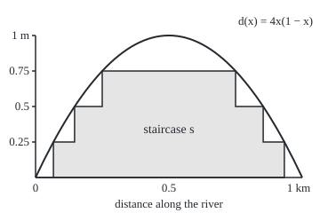

# The integral of a simple function: value times size of each piece, added up, whichever way you wrote it

[Syllabus](../../../SYLLABUS.md) → [Measure and integration](../../../SYLLABUS.md#w10) → [The Lebesgue Integral](../../../SYLLABUS.md#w10-s04) → The integral of a simple function

---

## General Overview

A river runs for 1 km. A survey boat drops a sounding line marked only in quarter metres, so every reading is the depth rounded down: 0, 0.25, 0.5 or 0.75 m, and 1 m at the single deepest point. The true bed is a smooth trough, deepest at the middle, where it reaches exactly 1 m. The survey wants one number: the area of the river's long section, the vertical slice down its centre line, in kilometres times metres (km·m).

With rounded readings the job is bookkeeping. The reading is 0.75 m along a stretch 0.5 km long. It is 0.5 m along two stretches totalling 0.2071 km, 0.25 m along two totalling 0.1589 km, and 0 near the banks. Multiply each reading by the length where it holds, add: 0.3750 + 0.1036 + 0.0397 = **0.5183 km·m**. A second surveyor stacks the same answer in layers instead: the water is at least 0.25 m deep along 0.8660 km, at least 0.5 m along 0.7071 km, at least 0.75 m along 0.5 km. Each layer is 0.25 m thick, so the total is 0.25 × (0.8660 + 0.7071 + 0.5) = 0.5183 again.

Henri Lebesgue described this as counting a pile of coins by denomination: sort by value, count each heap, multiply, add. Here the heaps are the stretches where the rounded depth takes one value; from here on they are called **level sets**, and the rounded depth is a **simple function**: a function with finitely many values, each on a measurable set. Nothing requires the level sets to be intervals. The function that is 1 on the rational points of [0, 1] and 0 elsewhere has no Riemann integral, yet its level sets have lengths 0 and 1, so the same bookkeeping gives 1 × 0 + 0 × 1 = 0 ([Null sets and almost everywhere](../01-Sets%20You%20Can%20Measure/07-null-sets-and-almost-everywhere.md)). The card's real work is proving that the pieces, the layers, or any other way of writing the same staircase always give the same total.

**The integral of a non-negative simple function is the sum, over its finitely many values, of each value times the measure of the set where it is taken; any other way of writing the function as a sum of values on sets gives the same number, and the integral adds, scales and respects order.**

**What kind of fact this is:** a definition; that it does not depend on how the function is written, that it is linear, and that it is monotone are theorems, proved on this card in Why it works.

### The picture: the river's long section and its quarter-metre staircase

Drawn to scale: 300 drawing units per km across, 160 per metre of depth up (depth is plotted upward). The curve is the true bed profile; the shaded staircase is the rounded depth. Its steps change at 0.0670, 0.1464 and 0.25 km from each bank.

<p align="center"></p>

Caption: the curve is the depth, the shaded region is the rounded depth. The shaded area is 0.5183 km·m; the area under the curve is 2/3 = 0.6667 km·m.

---

## The formula

Notation first, in words. A measure space $(\Omega,\mathcal F,\mu)$ is a set of points $\Omega$ (omega), the collection $\mathcal F$ of sets we allow ourselves to measure, and a measure $\mu$ (mu) that gives each such set a size of zero or more, possibly infinite ([Measures](../01-Sets%20You%20Can%20Measure/04-measures.md)). On the river, $\Omega$ is the stretch [0, 1] in km and the measure is length, written $\lambda$ (lambda). The indicator $\mathbf 1_A$, read "one on A, zero off it", is the function that is 1 at points of the set A and 0 elsewhere. A non-negative **simple function** is a finite sum of indicators with coefficients of zero or more ([Simple functions](../03-Measurable%20Functions/03-simple-functions-and-approximation.md)). The new symbol $\int s\,d\mu$ is read "the integral of s against mu".

Write the simple function $s$ in its **standard form**: list its distinct values $a_1, \dots, a_n$, and let $A_i$ be the set where $s$ equals $a_i$. The sets $A_i$ do not overlap and together cover $\Omega$.

$$\int s\,d\mu \;=\; \sum_{i=1}^{n} a_i\,\mu(A_i)\qquad\text{where}\qquad s=\sum_{i=1}^{n} a_i\,\mathbf 1_{A_i},\quad a_i\ge 0,\quad A_i\in\mathcal F .$$

**Read it aloud:** for each value the function takes, multiply the value by the size of the set where it takes it, and add.

One convention: $0\cdot\infty=0$. A zero value on a set of infinite size adds nothing. Without it, the zero function on the whole real line would have no integral.

Three facts turn the definition into a tool. For non-negative simple functions $s$ and $t$ and a number $c\ge 0$:

$$\int \Big(\sum_{j=1}^{m} c_j\mathbf 1_{B_j}\Big)d\mu=\sum_{j=1}^{m} c_j\,\mu(B_j)\ \ \text{for any sets } B_j\in\mathcal F,\ \text{overlapping or not};$$

$$\int (s+t)\,d\mu=\int s\,d\mu+\int t\,d\mu,\qquad \int c\,s\,d\mu=c\int s\,d\mu;\qquad s\le t \text{ everywhere}\ \Rightarrow\ \int s\,d\mu\le\int t\,d\mu .$$

**Read it aloud:** any way of writing the staircase as values on sets gives the same total; totals add and scale; a lower staircase never has the larger total.

The first fact with one set gives $\int \mathbf 1_A\,d\mu=\mu(A)$: the integral of "one on A" is the size of A.

| Symbol | Plain meaning | In our example | Push it up and the answer… |
| --- | --- | --- | --- |
| $d$, $x$ | depth in metres at distance x km | d(x) = 4x(1 − x), 0 to 1 m | deeper river, more water under each step |
| $s$ | the simple function: finitely many values on measurable sets | depth rounded down to 0.25 m | a higher staircase, a larger integral |
| $a_i$, $n$ | the i-th of the n distinct values of s | 0, 0.25, 0.5, 0.75, 1 m; n = 5 | a_i up by 1 adds μ(A_i) |
| $A_i$ | the level set where s equals a_i | {s = 0.75} is 0.25 to 0.75 km, minus the point 0.5 | a longer piece carries more weight |
| $C_e$, $C$, $e_j$ | a cell: the points with one yes/no pattern e, where e_j says in B_j or not | the stretch 0.25 to 0.75 km: in all three layers | — |
| $\mathbf 1_A$ | indicator: one on A, zero off it | one on the stretch where depth ≥ 0.5 m | — |
| $\Omega$, $\mathcal F$ | the space and its measurable sets | [0, 1] km and its Borel sets | — |
| $\mu$, $P$ | a measure; P is one with total size 1 | length; the die's 1/6 per face | sizes up, integral up |
| $\lambda$ | length on the line (Lebesgue measure) | λ{s = 0.5} = 0.2071 km | — |
| $\int s\,d\mu$ | the integral of s against μ | 0.5183 km·m | — |
| $B_j$, $c_j$, $m$ | another way of writing s: m sets that may overlap, with weights | the m = 4 layers {d ≥ c}, weight 0.25 each | — |
| $t$, $c$ | a second simple function; a non-negative scale | silt depth u, or the half-metre staircase; c = 100 for centimetres | c doubles, integral doubles |
| $b_k$, $D_k$ | the values of t and the sets where t takes them | half-metre staircase: 0.5 where the depth is at least 0.5 m, 1 at the deepest point, 0 elsewhere | — |
| $u$ | the silt on the bed, a simple function | 0.2 m from 0.3 to 0.8 km, 0.1 m from 0.8 km to the far bank; integral 0.1200 km·m | thicker silt, a larger integral |

### When it holds

The integral itself is a definition, so it does not hold or fail; the three theorems need these hypotheses.

- **Every piece measurable.** The sets $A_i$ must lie in $\mathcal F$, or $\mu(A_i)$ is not defined. A two-valued function that is 1 on the Vitali set ([Translation invariance and the Vitali set](../02-Length%20Done%20Properly/04-translation-invariance-and-the-vitali-set.md)) has no integral against length.
- **Values of zero or more.** Then every term is at least zero and nothing cancels. With signs and infinite pieces, +1 on [0, ∞) and −1 on (−∞, 0) gives ∞ − ∞, and cutting the line at different places gives 0 or 1000 (What breaks, below).
- **Finitely many values.** The sums are finite sums, so reordering and regrouping are free. Infinitely many values are the next card's business.
- **Finite values.** Each $a_i$ is a real number; a set of size ∞ is allowed, a value ∞ is not.

---

## Why it works

### Step 0: sizes add over non-overlapping pieces, so any regrouping gives the same total

Two ways of writing the same staircase can always be cut down to a common set of small pieces on which both are constant. On each small piece both ways say "this value, this size". Because a measure adds over pieces that do not overlap, adding the small pieces back up in either grouping reproduces either original total. Everything on this card follows from that one move.

### Step 1: the formula is forced

Ask two things of any integral. First, a block of height 1 over a set A has area μ(A): the integral of $\mathbf 1_A$ is $\mu(A)$. Second, integrals add and scale: the integral of $c_1\mathbf 1_{A_1}+c_2\mathbf 1_{A_2}$ is $c_1\mu(A_1)+c_2\mu(A_2)$. Every simple function is a finite sum of scaled indicators, so these two demands leave exactly one candidate: value times size, added. The definition is not a choice among many. The only question is whether it is consistent, since one function has many ways of being written.

### Step 2: any representation gives the same number

The river staircase has two natural descriptions. As level sets: 0.25 on a piece of 0.1589 km, 0.5 on 0.2071 km, 0.75 on 0.5 km. As layers: $s=0.25\,\mathbf 1_{\{d\ge 0.25\}}+0.25\,\mathbf 1_{\{d\ge 0.5\}}+0.25\,\mathbf 1_{\{d\ge 0.75\}}+0.25\,\mathbf 1_{\{d\ge 1\}}$, where the sets are nested stretches of 0.8660, 0.7071 and 0.5 km, overlapping heavily, and the single point 0.5 km, length 0. A point at 0.4 km, depth 0.9600 m, lies in all three layers and gets 0.25 + 0.25 + 0.25 = 0.75, which is its level. The two sums agree, 0.5183 each.

The proof in outline. Given any representation with m sets $B_1,\dots,B_m$, look at the pieces cut out by asking, for each $B_j$, "in it or not". There are at most $2^m$ such **cells**; they do not overlap, they are measurable, and each $B_j$ is exactly the union of the cells inside it. On one cell the function has one value, the sum of the $c_j$ for the sets that contain that cell. Split each $\mu(B_j)$ over its cells, collect by cell, and the representation's total becomes "value on the cell times size of the cell", summed over cells. The standard form gives the same cell sum. For the river, the four layers cut [0, 1] into the two bank stretches, a pair of stretches each for 0.25 and 0.5, the middle stretch for 0.75 minus its centre, and the centre point for 1.

<details>
<summary>Detailed proof</summary>

**Claim.** Let $s=\sum_{j=1}^{m}c_j\mathbf 1_{B_j}$ with each $c_j\ge 0$ finite and each $B_j\in\mathcal F$. Then $\sum_j c_j\,\mu(B_j)=\sum_i a_i\,\mu(A_i)$, the standard-form value.

**Arithmetic in [0, ∞].** Sums of terms in [0, ∞] are defined, and for finite sums they may be reordered and regrouped: a finite sum of non-negative terms is ∞ exactly when one term is ∞, and otherwise is an ordinary sum. For finite $c\ge0$ and $x,y\in[0,\infty]$, with $0\cdot\infty=0$, the rule $c(x+y)=cx+cy$ holds: if $c=0$ both sides are 0; if $c>0$ and one of x, y is ∞, both sides are ∞; otherwise it is ordinary algebra. The other distributive rule, $(c_1+\dots+c_m)\,x=c_1x+\dots+c_mx$, for any finite list of finite $c_j\ge0$ and any $x\in[0,\infty]$, holds too: if $x=\infty$, both sides are 0 when every $c_j$ is 0 and ∞ otherwise; if x is finite it is ordinary algebra. No subtraction appears anywhere below.

**Cells.** For each choice $e=(e_1,\dots,e_m)$ of yes or no, let $C_e$ be the intersection over j of $B_j$ (if $e_j$ is yes) or its complement (if no). Complements and finite intersections of sets in $\mathcal F$ are in $\mathcal F$, so each $C_e$ is measurable ([Sigma-algebras](../01-Sets%20You%20Can%20Measure/02-sigma-algebras.md)). Every point lies in exactly one cell: its own yes/no pattern. So the cells are disjoint and cover $\Omega$. Discard the empty ones.

**Each set is its cells.** $B_j$ is the disjoint union of the cells with $e_j$ yes. By finite additivity of $\mu$ ([Measures](../01-Sets%20You%20Can%20Measure/04-measures.md)), $\mu(B_j)=\sum_{e:\,e_j=\text{yes}}\mu(C_e)$.

**Regroup.** Using that and both distributive rules,
$$\sum_j c_j\,\mu(B_j)=\sum_j\ \sum_{e:\,e_j=\text{yes}} c_j\,\mu(C_e)=\sum_e\Big(\sum_{j:\,e_j=\text{yes}}c_j\Big)\mu(C_e)=\sum_e s(C_e)\,\mu(C_e),$$
where the middle step swaps the order of a finite double sum of non-negative terms, and $s(C_e)$ is the constant value of s on the non-empty cell $C_e$: at a point of $C_e$, exactly the indicators with $e_j$ yes are 1.

**The standard form is one representation.** Apply the same computation to $s=\sum_i a_i\mathbf 1_{A_i}$. Its cells are the $A_i$ themselves (each point is in exactly one of them), so it gives $\sum_i a_i\,\mu(A_i)$.

**Both equal the same cell sum.** Each standard-form set $A_i$ is the union of the cells $C_e$ with $s(C_e)=a_i$, since s is constant on each cell. Grouping the cell sum by value and using additivity once more, $\sum_e s(C_e)\mu(C_e)=\sum_i a_i\sum_{e:\,s(C_e)=a_i}\mu(C_e)=\sum_i a_i\,\mu(A_i)$. So every representation gives the standard-form number. ∎

**Linearity.** If $s=\sum_i a_i\mathbf 1_{A_i}$ and $t=\sum_k b_k\mathbf 1_{D_k}$, then listing both families together is a representation of $s+t$. By the claim, $\int(s+t)\,d\mu=\sum_i a_i\mu(A_i)+\sum_k b_k\mu(D_k)=\int s\,d\mu+\int t\,d\mu$. For $c\ge0$, $c\,s=\sum_i (ca_i)\mathbf 1_{A_i}$ is a representation of $c\,s$, and the distributive rule gives $\int c\,s\,d\mu=c\int s\,d\mu$. ∎

**Monotonicity.** Suppose $s\le t$ at every point. Form the cells of the combined family $A_1,\dots,A_n,D_1,\dots$. Both s and t are constant on each non-empty cell $C$, with $s(C)\le t(C)$, since the inequality holds at any point of $C$. By the claim applied to each function, $\int s\,d\mu=\sum_C s(C)\mu(C)\le\sum_C t(C)\mu(C)=\int t\,d\mu$, comparing term by term: $s(C)\mu(C)\le t(C)\mu(C)$ holds also when $\mu(C)=\infty$. ∎

</details>

### Step 3: linearity, on the river

A second survey measures the silt on the bed, a simple function u: 0.2 m thick from 0.3 to 0.8 km, 0.1 m from 0.8 km to the far bank, none elsewhere. Its integral is 0.2 × 0.5 + 0.1 × 0.2 = 0.1200 km·m. The depth to hard bottom is s + u. Its level sets are new: cut the stretch at the staircase's steps and at 0.3 and 0.8, giving 10 cells, and add value times length cell by cell. That gives 0.6383 km·m, which is 0.5183 + 0.1200. The proof needs no cells at all: writing s's pieces and u's pieces in one list is already a representation of s + u, and Step 2 says any representation gives the integral.

Scaling is the same move. Reading depth in centimetres multiplies every value by 100 and the integral by 100: 51.83 km·cm.

### Step 4: monotonicity, on the river

Round the depth down to the half metre instead. Call it t: 0.5 on the stretch where depth is at least 0.5 m, 0 elsewhere (and 1 at the single deepest point, a set of length 0). At every point t ≤ s, since rounding down to a coarser grid never rounds up. Its integral is 0.5 × 0.7071 = 0.3536, below 0.5183. The proof: on each cell of the combined pieces the lower function has the lower value, and sizes are never negative, so the cell-by-cell comparison survives the adding.

### Step 5: what the definition does not yet reach

The true depth d is not simple: it takes every value from 0 to 1. The staircases approach it from below as the steps shrink: 0.3536 with half-metre steps, 0.5183 with quarter-metre steps, then 0.5956 and 0.6323 with eighths and sixteenths, rising toward the true 2/3 = 0.6667. Monotonicity is what makes them rise in order. Defining the integral of d as the best such lower total is [The integral of a non-negative function](02-integral-of-a-nonnegative-function.md).

An alternative route to the same numbers on an interval is the Riemann step function: a staircase whose pieces are intervals. Where both apply they agree, and when that extends to every Riemann-integrable function is [Riemann meets Lebesgue](05-riemann-meets-lebesgue.md).

---

## Worked numbers, by hand

The level set {d ≥ c} is where 4x(1 − x) ≥ c. Since 1 − 4x(1 − x) = (1 − 2x)^2, this is where |1 − 2x| ≤ √(1 − c): a stretch of length √(1 − c) centred on 0.5 km.

| Step | Arithmetic | Value |
| --- | --- | --- |
| layer {d ≥ 0.25} | √0.75, from 0.0670 to 0.9330 km | 0.8660 km |
| layer {d ≥ 0.5} | √0.5, from 0.1464 to 0.8536 km | 0.7071 km |
| layer {d ≥ 0.75} | √0.25, from 0.25 to 0.75 km | 0.5000 km |
| level set {s = 0.25} | 0.8660 − 0.7071 | 0.1589 km |
| level set {s = 0.5} | 0.7071 − 0.5000 | 0.2071 km |
| level set {s = 0.75} | 0.5000 − 0 (the point 0.5 has length 0) | 0.5000 km |
| level set {s = 0} | 1 − 0.8660 | 0.1340 km |
| by level sets | 0 × 0.1340 + 0.25 × 0.1589 + 0.5 × 0.2071 + 0.75 × 0.5 = 0 + 0.0397 + 0.1036 + 0.3750 | 0.5183 km·m |
| by layers | 0.25 × (0.8660 + 0.7071 + 0.5000) | 0.5183 km·m |
| exact | (1 + √2 + √3)/8 | **0.518283 km·m** |

Over 1 km that is an average rounded depth of 0.5183 m, short of the true average 0.6667 m by 0.1484 m. A boat moored at a uniformly random point along the stretch reads, on average, 0.5183 m on the quarter-metre line: with length as the probability, the integral is the expected reading ([Expectation as an integral](06-expectation-as-an-integral.md)).

The same formula against a probability on six points: a die pays 0 on faces 1, 2, 3, pays 2 on faces 4 and 5, and 6 on face 6. Point by point, (0 + 0 + 0 + 2 + 2 + 6)/6; by level sets, 0 × 0.5 + 2 × (2/6) + 6 × (1/6). Both give 5/3 = 1.6667.

### What breaks if you drop a piece

| Mistake | Comes out at | What went wrong |
| --- | --- | --- |
| Levels added without their lengths | 0.25 + 0.50 + 0.75 = 1.50 | the values say nothing about how much river carries them |
| Layers weighted by their level instead of their thickness | 0.9451, not 0.5183 | the layers overlap; a point at 0.4 km gets 0.25 + 0.50 + 0.75 = 1.50 m instead of 0.75 m |
| Rounding up and calling it the integral of the rounded depth | 0.7683, above the true 0.6667 | that staircase lies above d; it is exactly 0.25 m × 1 km = 0.2500 above s |
| Signed values on pieces of infinite length: +1 on [0, ∞), −1 on (−∞, 0) | cut at [−1000, 1000] gives 0; at [−1000, 2000] gives 1000 | ∞ − ∞ has no value; the answer depends on where the line is cut |

---

## Code, from first principles, and it actually runs

The code finds the quarter-metre staircase's integral by four independent roads. Road one locates each level set's ends by bisection on the depth, with no square roots, and adds value times length over the standard form. Road two adds the overlapping layers with lengths from the square-root formula. Road three averages the staircase over a million evenly spaced points. Road four cuts every piece again at each 0.1 km mark, a finer partition, and adds cell by cell. Then it checks linearity with the silt layer and a change to centimetres, monotonicity against the half-metre staircase, the die in exact fractions, the finer staircases, and every row of What breaks.

The code checks one staircase, one die and a few refinements. That every representation of every simple function on every measure space gives the same total, and that the integral is linear and monotone, is what the Detailed proof shows.

### Python

```python
# The integral of a simple function -- the check behind the card.  Standard
# library only.  River depth d(x) = 4x(1 - x) metres at x km along a 1 km
# stretch, rounded down to the quarter metre, is a simple function s.
# Road one finds where the depth crosses each level by bisection and adds
# value times length over the pieces {s = value}.  Road two adds the
# overlapping layers {d >= c} with lengths from the square root.  Road three
# averages s over a million-point grid.  Road four cuts every piece at each
# 0.1 km mark.  Then linearity, monotonicity, a die, and what breaks.
import math
from fractions import Fraction

M = 4                                      # steps per metre: quarter-metre levels

def depth(x):
    return 4 * x * (1 - x)

def s(x):                                  # depth rounded down to a quarter metre
    return int(depth(x) * M) / M

def left_end(c):                           # smallest x in [0, 0.5] with depth(x) >= c
    lo, hi = 0.0, 0.5
    for _ in range(100):
        mid = (lo + hi) / 2
        if depth(mid) >= c:
            hi = mid
        else:
            lo = mid
    return hi

L = [left_end(k / M) for k in range(M)] + [0.5, 0.5]   # d = 1 only at x = 0.5: 1 - d = (1 - 2x)^2
print("layer {d >= c}: c, from, to, length (km)")
for k in range(1, M + 1):
    print(f"  c = {k / M:.2f}: {L[k]:.4f} to {1 - L[k]:.4f}, length {1 - 2 * L[k]:.4f}")

# road one: the level sets {s = k/4}, each two intervals, found by bisection
piece = [2 * (L[k + 1] - L[k]) for k in range(M + 1)]
road1 = 0.0
for k in range(M + 1):
    road1 += k / M * piece[k]
    print(f"road 1, piece s = {k / M:.2f} m: length {piece[k]:.4f} km, value x length {k / M * piece[k]:.4f}")
print(f"road 1, level sets by bisection: {road1:.4f} km-m")

# road two: layers {d >= c} overlap; each adds one step of 0.25 m
layer = [math.sqrt(1 - k / M) for k in range(1, M + 1)]
road2 = sum(layer) / M
print(f"road 2, layers {1 / M:g} x ({' + '.join(f'{v:.4f}' for v in layer[:-1])}) = {road2:.4f} km-m"
      f"; (1 + sqrt 2 + sqrt 3)/8 = {road2:.6f}")
assert abs(road1 - road2) < 1e-12
hits = [k / M for k in range(1, M + 1) if depth(0.4) >= k / M]   # the layers holding x = 0.4 km
print(f"point 0.4 km: depth {depth(0.4):.4f}, level {s(0.4):.2f}; in {len(hits)} layers, {1 / M:g} x {len(hits)}"
      f" = {len(hits) / M:.2f}; weighted by level {sum(hits):.2f}")
assert len(hits) / M == s(0.4)

# road three: average of s over a grid of a million midpoints; also t <= s
N = 1_000_000
total, t_below = 0.0, True
for i in range(N):
    x = (i + 0.5) / N
    total += s(x)
    t_below = t_below and int(depth(x) * 2) / 2 <= s(x)
grid = total / N
print(f"road 3, grid of {N} midpoints: {grid:.6f} km-m")
assert abs(grid - road2) < 2 * (M - 1) / M / N   # 2(M - 1) jumps, each off by 1/M m on one cell

# road four: a finer partition -- every piece cut again at each 0.1 km mark
def refined(f, cuts):
    pts = sorted(set([0.0, 1.0] + cuts))
    return sum(f((a + b) / 2) * (b - a) for a, b in zip(pts, pts[1:])), len(pts) - 1
ends = [L[k] for k in range(1, M + 1)] + [1 - L[k] for k in range(1, M + 1)]
road4, cells = refined(s, ends + [j / 10 for j in range(1, 10)])
print(f"road 4, cut again at every 0.1 km: {cells} cells, {road4:.4f} km-m")
assert abs(road4 - road1) < 1e-12

# linearity: silt u = 0.2 m on [0.3, 0.8), 0.1 m on [0.8, 1]; and scaling to centimetres
def u(x):
    return 0.2 if 0.3 <= x < 0.8 else (0.1 if x >= 0.8 else 0.0)
int_u = 0.2 * 0.5 + 0.1 * 0.2
both, cells2 = refined(lambda x: s(x) + u(x), ends + [0.3, 0.8])
print(f"linearity: integral of silt u = {int_u:.4f}; of s + u on {cells2} cells = {both:.4f}"
      f"; sum of the two = {road1 + int_u:.4f}")
assert abs(both - (road1 + int_u)) < 1e-12
cm, _ = refined(lambda x: 100 * s(x), ends)
print(f"scaling: depth in centimetres, integral {cm:.2f} km-cm = 100 x {road1:.4f}")
assert abs(cm - 100 * road1) < 1e-9

# monotonicity: t = depth rounded down to the half metre sits below s
int_t, _ = refined(lambda x: int(depth(x) * 2) / 2, ends)
print(f"monotonicity: t <= s at every grid point: {'yes' if t_below else 'no'}; integral of t = {int_t:.4f} <= {road1:.4f}")
assert t_below
assert abs(int_t - 0.5 * math.sqrt(0.5)) < 1e-12

# the same formula against a probability: a die paying 0, 0, 0, 2, 2, 6
pay = [0, 0, 0, 2, 2, 6]
by_point = sum(Fraction(p, 6) for p in pay)
by_level = sum(v * Fraction(pay.count(v), 6) for v in set(pay))
print(f"die: point by point {by_point}, by level sets {by_level} = {float(by_level):.4f}")
assert by_point == by_level == Fraction(5, 3)

# finer steps rise toward the true area 2/3 (the next card's limit)
for m in (2, 4, 8, 16):
    low = sum(math.sqrt(1 - k / m) for k in range(1, m + 1)) / m
    print(f"step 1/{m} m: lower staircase {low:.4f}")
    assert low <= 2 / 3
print(f"true area under d: 2/3 = {2 / 3:.4f}; staircase average depth {road1:.4f} m, short by {2 / 3 - road1:.4f}")

# what breaks
up, _ = refined(lambda x: math.ceil(depth(x) * M) / M, ends)
print(f"breaks, rounding up: {up:.4f} km-m, above 2/3; gap to s = {up - road1:.4f} = {1 / M:g} m x 1 km")
assert abs(up - road1 - 1 / M) < 1e-12
assert up > 2 / 3
levels_only = sum(k / M for k in range(1, M))
print(f"breaks, levels added without lengths: {' + '.join(f'{k / M:.2f}' for k in range(1, M))} = {levels_only:.2f}")
wrong_layers = sum(k / M * (1 - 2 * L[k]) for k in range(1, M + 1))
print(f"breaks, overlapping layers weighted by their level: {wrong_layers:.4f}, not {road1:.4f}")
assert abs(wrong_layers - road1) > 0.1
n = 1000                                   # +1 on [0, inf), -1 on (-inf, 0), summed unit by unit
cut = [sum(1 if j >= 0 else -1 for j in range(-n, b)) for b in (n, 2 * n)]
print(f"breaks, signed pieces +1 on [0, inf), -1 on (-inf, 0): cut at [-{n}, {n}] gives {cut[0]},"
      f" at [-{n}, {2 * n}] gives {cut[1]}")
assert cut == [0, n]

xs = ", ".join(f"{40 + 300 * v:.1f}" for v in sorted(e for e in ends if e != 0.5))
ys = ", ".join(f"{200 - 160 * k / M:.0f}" for k in range(1, M))
print(f"figure, x = 40 + 300 x, y = 200 - 160 d; ends x = {xs}; levels y = {ys}; apex (190, 40)")
assert 200 - 160 * depth(0.5) == 40
print("ALL CHECKS PASS")
```

**Ran 2026-10-06 on macOS, Python 3.14.6, standard library only. All checks passed. Output, pasted from the run:**

```
layer {d >= c}: c, from, to, length (km)
  c = 0.25: 0.0670 to 0.9330, length 0.8660
  c = 0.50: 0.1464 to 0.8536, length 0.7071
  c = 0.75: 0.2500 to 0.7500, length 0.5000
  c = 1.00: 0.5000 to 0.5000, length 0.0000
road 1, piece s = 0.00 m: length 0.1340 km, value x length 0.0000
road 1, piece s = 0.25 m: length 0.1589 km, value x length 0.0397
road 1, piece s = 0.50 m: length 0.2071 km, value x length 0.1036
road 1, piece s = 0.75 m: length 0.5000 km, value x length 0.3750
road 1, piece s = 1.00 m: length 0.0000 km, value x length 0.0000
road 1, level sets by bisection: 0.5183 km-m
road 2, layers 0.25 x (0.8660 + 0.7071 + 0.5000) = 0.5183 km-m; (1 + sqrt 2 + sqrt 3)/8 = 0.518283
point 0.4 km: depth 0.9600, level 0.75; in 3 layers, 0.25 x 3 = 0.75; weighted by level 1.50
road 3, grid of 1000000 midpoints: 0.518283 km-m
road 4, cut again at every 0.1 km: 16 cells, 0.5183 km-m
linearity: integral of silt u = 0.1200; of s + u on 10 cells = 0.6383; sum of the two = 0.6383
scaling: depth in centimetres, integral 51.83 km-cm = 100 x 0.5183
monotonicity: t <= s at every grid point: yes; integral of t = 0.3536 <= 0.5183
die: point by point 5/3, by level sets 5/3 = 1.6667
step 1/2 m: lower staircase 0.3536
step 1/4 m: lower staircase 0.5183
step 1/8 m: lower staircase 0.5956
step 1/16 m: lower staircase 0.6323
true area under d: 2/3 = 0.6667; staircase average depth 0.5183 m, short by 0.1484
breaks, rounding up: 0.7683 km-m, above 2/3; gap to s = 0.2500 = 0.25 m x 1 km
breaks, levels added without lengths: 0.25 + 0.50 + 0.75 = 1.50
breaks, overlapping layers weighted by their level: 0.9451, not 0.5183
breaks, signed pieces +1 on [0, inf), -1 on (-inf, 0): cut at [-1000, 1000] gives 0, at [-1000, 2000] gives 1000
figure, x = 40 + 300 x, y = 200 - 160 d; ends x = 60.1, 83.9, 115.0, 265.0, 296.1, 319.9; levels y = 160, 120, 80; apex (190, 40)
ALL CHECKS PASS
```

### Rust

Same rows, same labels, built with `rustc --edition 2021 -O`. The two outputs are identical.

```rust
// The integral of a simple function -- the same check as the Python, in Rust.
// No crates.  River depth d(x) = 4x(1 - x) metres at x km along a 1 km
// stretch, rounded down to the quarter metre, is a simple function s.
// Road one finds where the depth crosses each level by bisection and adds
// value times length over the pieces {s = value}.  Road two adds the
// overlapping layers {d >= c} with lengths from the square root.  Road three
// averages s over a million-point grid.  Road four cuts every piece at each
// 0.1 km mark.  Then linearity, monotonicity, a die, and what breaks.
const M: usize = 4; // steps per metre: quarter-metre levels
const MF: f64 = 4.0;

fn depth(x: f64) -> f64 {
    4.0 * x * (1.0 - x)
}

fn s(x: f64) -> f64 {
    // depth rounded down to a quarter metre
    (depth(x) * MF).floor() / MF
}

fn left_end(c: f64) -> f64 {
    // smallest x in [0, 0.5] with depth(x) >= c
    let (mut lo, mut hi) = (0.0f64, 0.5f64);
    for _ in 0..100 {
        let mid = (lo + hi) / 2.0;
        if depth(mid) >= c { hi = mid; } else { lo = mid; }
    }
    hi
}

fn refined(f: &dyn Fn(f64) -> f64, cuts: &[f64]) -> (f64, usize) {
    // value at the midpoint times width, over the cells of the partition
    let mut pts = vec![0.0, 1.0];
    pts.extend_from_slice(cuts);
    pts.sort_by(|a, b| a.partial_cmp(b).unwrap());
    pts.dedup();
    let total = pts.windows(2).map(|w| f((w[0] + w[1]) / 2.0) * (w[1] - w[0])).sum();
    (total, pts.len() - 1)
}

fn gcd(a: i64, b: i64) -> i64 {
    if b == 0 { a } else { gcd(b, a % b) }
}

fn main() {
    // d = 1 only at x = 0.5: 1 - d = (1 - 2x)^2
    let mut l: Vec<f64> = (0..M).map(|k| left_end(k as f64 / MF)).collect();
    l.push(0.5);
    l.push(0.5);
    println!("layer {{d >= c}}: c, from, to, length (km)");
    for k in 1..=M {
        println!("  c = {:.2}: {:.4} to {:.4}, length {:.4}", k as f64 / MF, l[k], 1.0 - l[k], 1.0 - 2.0 * l[k]);
    }

    // road one: the level sets {s = k/4}, each two intervals, found by bisection
    let piece: Vec<f64> = (0..=M).map(|k| 2.0 * (l[k + 1] - l[k])).collect();
    let mut road1 = 0.0;
    for k in 0..=M {
        let v = k as f64 / MF;
        road1 += v * piece[k];
        println!("road 1, piece s = {:.2} m: length {:.4} km, value x length {:.4}", v, piece[k], v * piece[k]);
    }
    println!("road 1, level sets by bisection: {:.4} km-m", road1);

    // road two: layers {d >= c} overlap; each adds one step of 0.25 m
    let layer: Vec<f64> = (1..=M).map(|k| (1.0 - k as f64 / MF).sqrt()).collect();
    let road2 = layer.iter().sum::<f64>() / MF;
    let shown: Vec<String> = layer[..M - 1].iter().map(|v| format!("{:.4}", v)).collect();
    println!("road 2, layers {} x ({}) = {:.4} km-m; (1 + sqrt 2 + sqrt 3)/8 = {:.6}", 1.0 / MF, shown.join(" + "), road2, road2);
    assert!((road1 - road2).abs() < 1e-12);
    let hits: Vec<f64> = (1..=M).map(|k| k as f64 / MF).filter(|c| depth(0.4) >= *c).collect(); // the layers holding x = 0.4 km
    println!("point 0.4 km: depth {:.4}, level {:.2}; in {} layers, {} x {} = {:.2}; weighted by level {:.2}",
        depth(0.4), s(0.4), hits.len(), 1.0 / MF, hits.len(), hits.len() as f64 / MF, hits.iter().sum::<f64>());
    assert!(hits.len() as f64 / MF == s(0.4));

    // road three: average of s over a grid of a million midpoints; also t <= s
    let n_grid = 1_000_000usize;
    let (mut total, mut t_below) = (0.0f64, true);
    for i in 0..n_grid {
        let x = (i as f64 + 0.5) / n_grid as f64;
        total += s(x);
        t_below = t_below && (depth(x) * 2.0).floor() / 2.0 <= s(x);
    }
    let grid = total / n_grid as f64;
    println!("road 3, grid of {} midpoints: {:.6} km-m", n_grid, grid);
    assert!((grid - road2).abs() < 2.0 * (MF - 1.0) / MF / n_grid as f64); // 2(M - 1) jumps, each off by 1/M m on one cell

    // road four: a finer partition -- every piece cut again at each 0.1 km mark
    let mut ends: Vec<f64> = (1..=M).map(|k| l[k]).collect();
    ends.extend((1..=M).map(|k| 1.0 - l[k]));
    let mut cuts = ends.clone();
    cuts.extend((1..10).map(|j| j as f64 / 10.0));
    let (road4, cells) = refined(&s, &cuts);
    println!("road 4, cut again at every 0.1 km: {} cells, {:.4} km-m", cells, road4);
    assert!((road4 - road1).abs() < 1e-12);

    // linearity: silt u = 0.2 m on [0.3, 0.8), 0.1 m on [0.8, 1]; and scaling to centimetres
    let u = |x: f64| if 0.3 <= x && x < 0.8 { 0.2 } else if x >= 0.8 { 0.1 } else { 0.0 };
    let int_u = 0.2 * 0.5 + 0.1 * 0.2;
    let mut cuts2 = ends.clone();
    cuts2.extend([0.3, 0.8]);
    let (both, cells2) = refined(&|x| s(x) + u(x), &cuts2);
    println!("linearity: integral of silt u = {:.4}; of s + u on {} cells = {:.4}; sum of the two = {:.4}", int_u, cells2, both, road1 + int_u);
    assert!((both - (road1 + int_u)).abs() < 1e-12);
    let (cm, _) = refined(&|x| 100.0 * s(x), &ends);
    println!("scaling: depth in centimetres, integral {:.2} km-cm = 100 x {:.4}", cm, road1);
    assert!((cm - 100.0 * road1).abs() < 1e-9);

    // monotonicity: t = depth rounded down to the half metre sits below s
    let (int_t, _) = refined(&|x| (depth(x) * 2.0).floor() / 2.0, &ends);
    println!("monotonicity: t <= s at every grid point: {}; integral of t = {:.4} <= {:.4}", if t_below { "yes" } else { "no" }, int_t, road1);
    assert!(t_below);
    assert!((int_t - 0.5 * 0.5f64.sqrt()).abs() < 1e-12);

    // the same formula against a probability: a die paying 0, 0, 0, 2, 2, 6
    let pay = [0i64, 0, 0, 2, 2, 6];
    let by_point: i64 = pay.iter().sum(); // over 6
    let mut values = pay.to_vec();
    values.dedup();
    let by_level: i64 = values.iter().map(|v| v * pay.iter().filter(|p| *p == v).count() as i64).sum();
    let (g1, g2) = (gcd(by_point, 6), gcd(by_level, 6));
    println!("die: point by point {}/{}, by level sets {}/{} = {:.4}", by_point / g1, 6 / g1, by_level / g2, 6 / g2, by_level as f64 / 6.0);
    assert!(by_point == by_level);
    assert!(by_level * 3 == 5 * 6);

    // finer steps rise toward the true area 2/3 (the next card's limit)
    for m in [2usize, 4, 8, 16] {
        let low = (1..=m).map(|k| (1.0 - k as f64 / m as f64).sqrt()).sum::<f64>() / m as f64;
        println!("step 1/{} m: lower staircase {:.4}", m, low);
        assert!(low <= 2.0 / 3.0);
    }
    println!("true area under d: 2/3 = {:.4}; staircase average depth {:.4} m, short by {:.4}", 2.0 / 3.0, road1, 2.0 / 3.0 - road1);

    // what breaks
    let (up, _) = refined(&|x| (depth(x) * MF).ceil() / MF, &ends);
    println!("breaks, rounding up: {:.4} km-m, above 2/3; gap to s = {:.4} = {} m x 1 km", up, up - road1, 1.0 / MF);
    assert!((up - road1 - 1.0 / MF).abs() < 1e-12);
    assert!(up > 2.0 / 3.0);
    let levels_only: f64 = (1..M).map(|k| k as f64 / MF).sum();
    let lv: Vec<String> = (1..M).map(|k| format!("{:.2}", k as f64 / MF)).collect();
    println!("breaks, levels added without lengths: {} = {:.2}", lv.join(" + "), levels_only);
    let wrong_layers: f64 = (1..=M).map(|k| k as f64 / MF * (1.0 - 2.0 * l[k])).sum();
    println!("breaks, overlapping layers weighted by their level: {:.4}, not {:.4}", wrong_layers, road1);
    assert!((wrong_layers - road1).abs() > 0.1);
    let n: i64 = 1000; // +1 on [0, inf), -1 on (-inf, 0), summed unit by unit
    let cut: Vec<i64> = [n, 2 * n].iter().map(|&b| (-n..b).map(|j| if j >= 0 { 1 } else { -1 }).sum()).collect();
    println!("breaks, signed pieces +1 on [0, inf), -1 on (-inf, 0): cut at [-{}, {}] gives {}, at [-{}, {}] gives {}", n, n, cut[0], n, 2 * n, cut[1]);
    assert!(cut == vec![0, n]);

    let mut fig: Vec<f64> = ends.iter().copied().filter(|&e| e != 0.5).collect();
    fig.sort_by(|a, b| a.partial_cmp(b).unwrap());
    let xs: Vec<String> = fig.iter().map(|v| format!("{:.1}", 40.0 + 300.0 * v)).collect();
    let ys: Vec<String> = (1..M).map(|k| format!("{:.0}", 200.0 - 160.0 * k as f64 / MF)).collect();
    println!("figure, x = 40 + 300 x, y = 200 - 160 d; ends x = {}; levels y = {}; apex (190, 40)", xs.join(", "), ys.join(", "));
    assert!(200.0 - 160.0 * depth(0.5) == 40.0);
    println!("ALL CHECKS PASS");
}
```

**Ran 2026-10-06 on macOS, rustc 1.98.1, no crates. All checks passed. Output, pasted from the run:**

```
layer {d >= c}: c, from, to, length (km)
  c = 0.25: 0.0670 to 0.9330, length 0.8660
  c = 0.50: 0.1464 to 0.8536, length 0.7071
  c = 0.75: 0.2500 to 0.7500, length 0.5000
  c = 1.00: 0.5000 to 0.5000, length 0.0000
road 1, piece s = 0.00 m: length 0.1340 km, value x length 0.0000
road 1, piece s = 0.25 m: length 0.1589 km, value x length 0.0397
road 1, piece s = 0.50 m: length 0.2071 km, value x length 0.1036
road 1, piece s = 0.75 m: length 0.5000 km, value x length 0.3750
road 1, piece s = 1.00 m: length 0.0000 km, value x length 0.0000
road 1, level sets by bisection: 0.5183 km-m
road 2, layers 0.25 x (0.8660 + 0.7071 + 0.5000) = 0.5183 km-m; (1 + sqrt 2 + sqrt 3)/8 = 0.518283
point 0.4 km: depth 0.9600, level 0.75; in 3 layers, 0.25 x 3 = 0.75; weighted by level 1.50
road 3, grid of 1000000 midpoints: 0.518283 km-m
road 4, cut again at every 0.1 km: 16 cells, 0.5183 km-m
linearity: integral of silt u = 0.1200; of s + u on 10 cells = 0.6383; sum of the two = 0.6383
scaling: depth in centimetres, integral 51.83 km-cm = 100 x 0.5183
monotonicity: t <= s at every grid point: yes; integral of t = 0.3536 <= 0.5183
die: point by point 5/3, by level sets 5/3 = 1.6667
step 1/2 m: lower staircase 0.3536
step 1/4 m: lower staircase 0.5183
step 1/8 m: lower staircase 0.5956
step 1/16 m: lower staircase 0.6323
true area under d: 2/3 = 0.6667; staircase average depth 0.5183 m, short by 0.1484
breaks, rounding up: 0.7683 km-m, above 2/3; gap to s = 0.2500 = 0.25 m x 1 km
breaks, levels added without lengths: 0.25 + 0.50 + 0.75 = 1.50
breaks, overlapping layers weighted by their level: 0.9451, not 0.5183
breaks, signed pieces +1 on [0, inf), -1 on (-inf, 0): cut at [-1000, 1000] gives 0, at [-1000, 2000] gives 1000
figure, x = 40 + 300 x, y = 200 - 160 d; ends x = 60.1, 83.9, 115.0, 265.0, 296.1, 319.9; levels y = 160, 120, 80; apex (190, 40)
ALL CHECKS PASS
```

> [!TIP]
> **Try changing**
> - **Guess first:** set `M = 8`, eighth-metre steps. Answer: the staircase rises to 0.5956, the value on the "step 1/8" line; the four roads still agree with each other, because each computes the new staircase's integral.
> - **Guess first:** set `M = 2`. Answer: 0.3536, the half-metre staircase t from Step 4. The run then stops at the "weighted by level" assert: with one layer of positive length, nothing overlaps, so that mistake costs nothing.
> - **Guess first:** drop the 0.1 km marks from road four. Answer: fewer cells, same 0.5183. Refining a partition never changes the integral; that is Step 2.
> - **Guess first:** in road one, change `2 * (L[k + 1] - L[k])` to `1 * (...)`, counting only one bank. Answer: road one halves and the first assert stops the run.

---

## The usual mistake

> [!warning]
> **Weighting overlapping sets as if they were level sets.** The layer description of the river uses sets that sit inside one another. Each layer carries its own thickness, 0.25 m, not the depth reached at its top. Weighting the layers by 0.25, 0.5 and 0.75 counts the deep middle three times and gives 0.9451 instead of 0.5183. The formula with overlapping sets is correct only with the coefficients that actually add up to the function's value at each point.
>
> - **Adding values, forgetting sizes.** 0.25 + 0.5 + 0.75 = 1.50 is not an integral; the integral weighs each value by how much of the space carries it.
> - **Worrying about single points.** The rounded depth is 1 m at exactly one point, 0.5 km. That piece has length 0 and contributes 1 × 0 = 0. Changing a simple function on a set of measure zero never changes its integral.
> - **Treating 0 × ∞ as undefined.** On the whole line the zero function has integral 0 by the convention $0\cdot\infty=0$; without it the definition would fail on its simplest input.
> - **Subtracting.** Everything here is non-negative. Differences of integrals, and signed functions, need the finite-integral condition of [Integrable functions](04-integrable-functions-and-l1.md).

---

## Where you meet it in real life

- **Lake and reservoir volumes.** Hydrographers compute volume from a depth-contour chart: the area inside each contour times the contour interval, added. That is the layer representation, and Step 2 is why it matches a count by depth band.
- **Histograms and binned data.** A quantity recorded in bins is a simple function; its total is each bin's value times the bin's count or width, added.
- **Expected payouts.** A payout with finitely many values, integrated against a probability, is its expected value: the die's 5/3. The measure version of expectation is [Expectation as an integral](06-expectation-as-an-integral.md).
- **Tail bounds.** Markov's inequality compares a non-negative quantity with the two-valued simple function that is a on the set where the quantity is at least a. For a quantity that is not itself simple, the proof uses the definition on [The integral of a non-negative function](02-integral-of-a-nonnegative-function.md); the probability form is [Markov and Chebyshev](07-markov-and-chebyshev.md).

> **Say it back**
> A simple function takes finitely many values, each on a measurable set. Its integral is each value times the size of its set, added. Written any other way, overlapping sets included, it gives the same total, because every description breaks down into common cells whose sizes add. The integral adds, scales, and never lets a lower staircase have the larger total. On the river the quarter-metre staircase gives 0.5183 km·m, by level sets, by layers, and cell by cell.

---

## What this builds on

- [Simple functions](../03-Measurable%20Functions/03-simple-functions-and-approximation.md): what a simple function is, the indicator, and the rising staircases that approach any non-negative measurable function.
- [Measures](../01-Sets%20You%20Can%20Measure/04-measures.md): the sizes, finite additivity over disjoint pieces, and the arithmetic of [0, ∞] used in every step of the proof.

## Where this goes next

- [The integral of a non-negative function](02-integral-of-a-nonnegative-function.md): the integral of any non-negative measurable function as the best total of the simple functions below it, which turns 0.3536, 0.5183, 0.5956, 0.6323 into 2/3.
- [The monotone convergence theorem](03-monotone-convergence-theorem.md): why those rising totals reach the integral of their limit.

The true depth takes every value from 0 to 1 m, so no finite list of values and lengths adds it up: what is its integral, and do the staircase totals reach it?

---

## Sources

Verified 2026-09-29: every link below resolves to the page for the book it names.

- Axler, Sheldon. *Measure, Integration & Real Analysis*. Springer, Graduate Texts in Mathematics, 2020, open access. [Author's page with the free edition](https://measure.axler.net/). Simple functions, the integral of a non-negative function, and additivity, with full proofs.
- Folland, Gerald B. *Real Analysis: Modern Techniques and Their Applications*, 2nd ed. Wiley, 1999. [Publisher page](https://www.wiley.com/en-us/Real+Analysis%3A+Modern+Techniques+and+Their+Applications%2C+2nd+Edition-p-9780471317166). Integration of non-negative functions: the simple-function integral, independence of representation, linearity and monotonicity.
- Tao, Terence. *An Introduction to Measure Theory*. American Mathematical Society, Graduate Studies in Mathematics 126, 2011. [Author's page with the book](https://terrytao.wordpress.com/books/an-introduction-to-measure-theory/). Builds the integral from unsigned simple functions, with the common-refinement argument written out.
