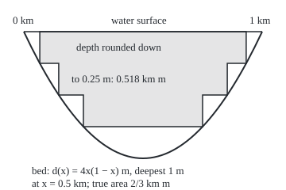
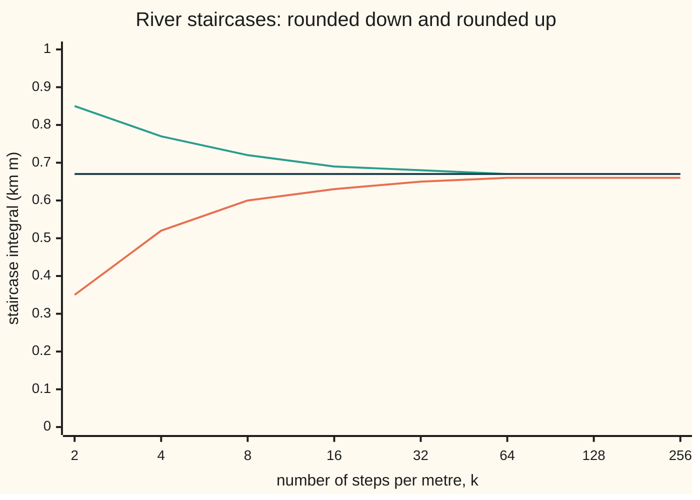
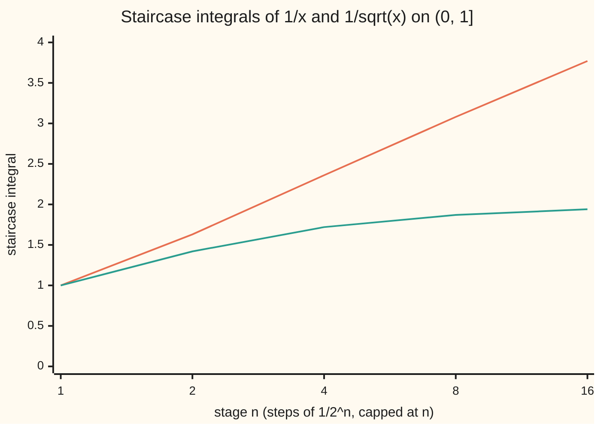

# The integral of a non-negative function: the best you can do from below with simple functions, infinity allowed

Measure and integration → The Lebesgue Integral → Integrals from below → The integral of a non-negative function

---

## General Overview

A river runs along a straight 1 km stretch. At x km from the start its depth is 4x(1 − x) metres: zero at both ends, 1 m in the middle. How much water does the stretch hold per metre of width? The area under the depth curve, in kilometre-metres (km m).

Round the depth down to the nearest half metre and the answer is easy: 0.5 m wherever the depth reaches 0.5 m, a stretch 0.707 km long, so 0.354 km m. Round down to quarter metres: 0.518. To eighths: 0.596. Rounding down only removes water, so each answer is too small, and finer rounding removes less. The numbers climb toward 2/3.

A rounded-down depth takes finitely many values, each on a piece of known length: a **simple function**, whose integral, value times length of each piece added up, was built on [integral-of-a-simple-function](01-integral-of-a-simple-function.md). The depth's own integral is defined as the best answer any simple function lying under it can give. For some functions that best answer is infinite, and the definition allows it.

Three facts follow at once. Changing the depth at one point, even to 1000 m, changes nothing. A function with integral zero is zero except on a set of length zero. And a river of average depth 2/3 m is 0.75 m deep or more along at most 0.889 km: Markov's inequality.

**The integral of a non-negative function is the supremum of the integrals of the simple functions lying under it; it may be infinite, it grows when the function grows, it ignores sets of size zero, and it bounds how much of the space the function can spend above any level.**

**What kind of fact this is:** a definition (the integral as a supremum), with five theorems proved on this card in Why it works: it agrees with the simple integral, it is monotone, it satisfies Markov's inequality, and it obeys the two almost-everywhere rules.

### The picture: the river and its quarter-metre staircase

Drawn to scale: 300 units to the kilometre across, 160 to the metre down. The curve is the bed. The shaded blocks are the depth rounded down to quarter metres, 0.518 km m; the unshaded slivers below them are the 0.148 km m still missed.

<p align="center"></p>

The steps sit where the depth crosses 0.25, 0.5 and 0.75 m. The code prints their drawn positions on its `figure,` line.

---

## The formula

Notation first, in words. A measure space $(\Omega, \mathcal{F}, \mu)$ is a set of points, the collection of its subsets we allow ourselves to measure, and a measure giving each a size; here, positions along the river, sets including every interval, and length, written $\lambda$. A function $f$ is **non-negative** when its values lie in $[0, \infty]$: zero or more, with $\infty$ allowed. It is **measurable** when every set $\{f \ge t\}$, the points where $f$ is at least $t$, is one of the sets we may measure ([measurable-functions](../03-Measurable%20Functions/01-measurable-functions.md)).

A simple function $s$ takes finitely many values $a_i$ on measurable pieces $A_i$, and its integral is already defined:

$$\int s\,d\mu = \sum_i a_i\,\mu(A_i), \qquad 0 \times \infty = 0.$$

The integral of a non-negative measurable $f$ is

$$\int f\,d\mu \;=\; \sup\Big\{ \int s\,d\mu \;:\; s \text{ simple},\ 0 \le s \le f \Big\}.$$

**Read it aloud:** look at every simple function that never rises above f, take each one's integral; the integral of f is the smallest number none of them exceeds, or ∞ if no finite number works.

That smallest upper bound is the **supremum**, written sup. It need not be on the list: every river staircase falls short of 2/3, and 2/3 is still the supremum.

Four consequences, all proved below. For non-negative measurable $f$ and $g$, and any level $t > 0$:

$$f \le g \ \Rightarrow\ \int f\,d\mu \le \int g\,d\mu \qquad\text{(monotonicity)}$$

$$\mu(\{f \ge t\}) \;\le\; \frac{1}{t}\int f\,d\mu \qquad\text{(Markov's inequality)}$$

$$\int f\,d\mu = 0 \iff f = 0 \text{ a.e.}, \qquad\quad f = g \text{ a.e.} \ \Rightarrow\ \int f\,d\mu = \int g\,d\mu$$

**Read them aloud:** a bigger function has a bigger integral; the set where f is at least t has size at most the integral divided by t; the integral is zero exactly when f is zero almost everywhere, written a.e., meaning except on a set of size zero ([null-sets-and-almost-everywhere](../01-Sets%20You%20Can%20Measure/07-null-sets-and-almost-everywhere.md)); and functions equal a.e. have equal integrals.

| Symbol | Plain meaning | In our example | Push it up and the answer… |
| --- | --- | --- | --- |
| $d$, $x$ | the river's depth in m, and the position along it in km | $d$ = 4x(1 − x), 1 m at x = 0.5 | more water, larger integral |
| $f$, $g$, $\infty$ | non-negative measurable functions, values in $[0, \infty]$, infinity allowed | $d$; $d$ raised to 1000 m at x = 0.5; 1/x, integral ∞ | larger $f$, larger integral |
| $s$, $c$ | a simple function lying under $f$, and its largest value | the depth rounded down to quarter metres; $c$ = 1, at x = 0.5 | a better staircase, closer to the integral |
| $a_i$, $A_i$ | the values of $s$ and the pieces where it takes them | 0.25 m where the depth is from 0.25 to 0.5 m | — |
| $k$, $n$ | steps of 1/k, with k = 2 to the power n | k = 4, n = 2: quarter metres | finer steps, less water missed |
| $s_n$ | the stage-n staircase: $f$ rounded down to steps of 1/k, capped at n | 0.518 km m at n = 2 | rises toward the integral |
| $\mu$, $\lambda$ | a measure; $\lambda$ is length | $\lambda$ of the stretch 0.75 m deep or more: 0.5 km | — |
| $\Omega$, $\mathcal{F}$ | the space, and the sets we allow ourselves to measure | positions 0 to 1 km; the Borel sets | — |
| $t$, $m$ | a level for Markov's inequality; $m$ a whole number, for the level 1/m | $t$ = 0.75 m | a smaller bound on a smaller set |
| $N$ | a null set: measurable, of size zero | the single point x = 0.5 | — |
| $\mathbf{1}_A$, $A$, $A_m$ | the indicator of $A$: one on $A$, zero off it; $A_m$ the set where $f$ is at least 1/m | $A$ = where the depth is at least 0.75 m | — |
| $L$, $E$ | $L(t)$: length where the depth is at least t; $E$: where k times the depth is not a whole number | L(0.75) = 0.5 km | — |

### When it holds

- **Non-negative values.** A function +2 on the first half and −2 on the second has parts whose integrals cancel to 0, yet it is zero nowhere, and the length where it is at least 1 is 0.5, above Markov's bound of 0. Signed functions are handled on [integrable-functions-and-l1](04-integrable-functions-and-l1.md).
- **Measurable.** If $\{f \ge t\}$ is not in $\mathcal{F}$, it has no size, and Markov's inequality says nothing.
- **Infinity allowed, never subtracted.** Values and integrals may be ∞, with 0 times ∞ read as 0; ∞ − ∞ never arises.
- **Any measure.** Counting measure, length on the whole line and probabilities all fit. The a.e. rules use null sets of the same $\mu$.

---

## Why it works

### Step 0: measure only what can be measured, from below

Any simple function under $f$ is a safe underestimate: it only ever leaves water out. The definition takes the best underestimate, and each theorem below follows by putting the right simple function under $f$.

Why not from above? A simple function is bounded, so nothing simple lies above an unbounded function such as 1/√x, and a definition from above would give it ∞ instead of its true 2. From below, the zero function is always available.

### Step 1: the river's integral is 2/3

Stack the quarter-metre staircase as slabs: 0.25 m wherever the depth is at least 0.25 m, another 0.25 m wherever it is at least 0.5 m, another wherever it is at least 0.75 m. Its integral is 0.25 times the sum of three lengths. Solving 4x(1 − x) = t by the quadratic formula, the depth reaches level $t$ from (1 − r)/2 to (1 + r)/2 km, with r the square root of 1 − t. The three lengths are 0.866, 0.707 and 0.5 km, and the staircase holds 0.518 km m.

Rounding up instead gives a staircase above the depth: one more slab of 1/k over the whole stretch, apart from finitely many points. For quarter metres, 0.518 + 0.25 = 0.768.

Every simple $s$ under $d$ lies under the rounded-up staircase, so, by monotonicity of the simple integral, its integral is at most 0.768; the rounded-down staircase is under $d$. So the integral of $d$ lies between 0.518 and 0.768. The gap halves with the step: at 1/256 m the bounds are 0.664663 and 0.668570.

The rounded-down staircases are sums of slab lengths, the square root of 1 − j/k times 1/k for j = 1 to k: a Riemann sum ([riemann-integral](../../06-Calculus%20and%20analysis/04-Integrals/01-riemann-integral.md)) for the area under the square root of 1 − t, which is 2/3. So the integral of the depth is 2/3 km m, and the river's average depth over its 1 km is 2/3 m.



Orange: rounded-down staircases, rising. Green: rounded-up ones, falling. Dark: the integral, 2/3. The definition uses only the orange line; the green one proves the supremum is no larger.

The squeeze needs a bounded function on a finite stretch. In general the proof that the rounded-down staircases $s_n$ always climb all the way to $\int f\,d\mu$ is the monotone convergence theorem, on [monotone-convergence-theorem](03-monotone-convergence-theorem.md).

### Step 2: the new integral agrees with the old one, and is monotone

If $f$ is itself simple, $f$ lies under $f$, so the supremum is at least its old integral; and every simple $s$ under $f$ has integral at most that, by monotonicity of the simple integral. So the two definitions agree.

If $f \le g$, every simple function under $f$ is also under $g$, so the supremum for $g$ is over a larger collection and is at least as large. No limits are involved.

### Step 3: Markov's inequality, from one simple function

Fix the level 0.75 m. The function $0.75 \cdot \mathbf{1}_A$, with $A = \{d \ge 0.75\}$, is 0.75 where the depth is at least 0.75 m and 0 elsewhere. It is simple and lies under $d$. So its integral, 0.75 times the length of $A$, is at most 2/3, and the length of $A$ is at most (2/3)/0.75 = 0.889 km.

The truth is 0.5 km: Markov uses only the average, so it is often loose. It cannot be improved in general. A river 0.75 m deep on the middle half and dry elsewhere holds 0.375 km m, and the bound gives 0.375/0.75 = 0.5, exactly its length.

For a boat moored at a uniformly random point of the stretch, lengths are chances: the chance its depth is at least 0.75 m is at most 0.889 and truly 0.5. The probability version, with Chebyshev's inequality beside it, is [markov-and-chebyshev](07-markov-and-chebyshev.md); the wing-09 statement without measure is on [markov-and-chebyshev-inequalities](../../09-Probability%20and%20statistics/02-Random%20Variables/08-markov-and-chebyshev-inequalities.md).

### Step 4: zero integral means zero almost everywhere

Suppose the integral of $f$ is 0. Markov's inequality at level 1/m says the set where $f$ is at least 1/m has size at most m times 0, which is 0. The set where $f$ is positive is the union of these sets for m = 1, 2, 3, …, since a positive value is at least 1/m for some m. A countable union of null sets is null. So $f = 0$ a.e.

Conversely, if $f$ is zero off a null set $N$, a simple $s$ under $f$ is zero off $N$ and at most its largest value on $N$, so its integral is at most that value times $\mu(N) = 0$. So $f$ has integral 0.

A function 1000 m high at the single point x = 0.5 and zero elsewhere has integral 0. The point is null: it sits inside intervals of length 0.2, 0.002, 0.00002, and so on down.

### Step 5: changing a function on a null set changes nothing

Raise the depth at x = 0.5 from 1 m to 1000 m and call the new function $g$. Take any simple $s$ under $d$ and set it to 0 at x = 0.5. The result is simple, lies under $g$, and has the same integral as $s$, since the change is on a set of length 0. So $\int g \ge \int d$, and swapping the roles gives the reverse. Both are 2/3. The same holds for any functions equal off a null set, including a value ∞ placed on a null set.

Sampling behaves differently: averaging the depth at the 1000 points 0, 0.001, …, 0.999 gives 0.666666, and 1.665666 once x = 0.5, one of them, is raised.

### Step 6: infinity is a legitimate answer

Take 1/x on (0, 1], with the value ∞ at 0, a null set. Its stage-n staircase rounds down to steps of 1/2^n and caps at n. The integrals are 1.0000, 1.6345, 2.3632, 3.0777 and 3.7726 at n = 1, 2, 4, 8, 16. They grow like 1 + ln n, without bound, so the integral of 1/x is ∞. Take 1/√x instead: the staircases give 1.0000, 1.4152, 1.7213, 1.8731, 1.9375, bounded by 2 − 1/n, and the integral is 2.



Orange: 1/x, climbing without bound. Green: 1/√x, levelling off below 2. Both are finite at every point of (0, 1].

One consequence: if the integral of $f$ is finite, Markov's inequality bounds the size of $\{f = \infty\}$ by the integral divided by t, for every t, so a function with finite integral is finite a.e.

<details>
<summary>Detailed proof</summary>

Throughout, $(\Omega, \mathcal{F}, \mu)$ is a measure space, $f$ and $g$ are measurable from $\Omega$ to $[0, \infty]$, and "simple" means a measurable function with finitely many values in $[0, \infty)$. The integral of a simple function, with its independence of representation, linearity and monotonicity, is taken from [integral-of-a-simple-function](01-integral-of-a-simple-function.md). Write $S(f)$ for the set of simple $s$ with $0 \le s \le f$, and $I(f)$ for the supremum of their integrals. $S(f)$ contains the zero function, so $I(f)$ is defined, in $[0, \infty]$.

**Theorem 1 (agreement).** If $f$ is simple, $I(f) = \int f\,d\mu$ in the simple sense. *Proof.* $f$ is in $S(f)$, so $I(f) \ge \int f\,d\mu$. For $s$ in $S(f)$, $s \le f$ and simple monotonicity give $\int s\,d\mu \le \int f\,d\mu$; taking the supremum, $I(f) \le \int f\,d\mu$.

**Theorem 2 (monotonicity).** If $f \le g$ then $I(f) \le I(g)$. *Proof.* If $s \le f$ then $s \le g$, so $S(f) \subseteq S(g)$, and a supremum over a larger set is at least as large.

**Theorem 3 (Markov's inequality).** For $t$ in $(0, \infty)$, $\mu(\{f \ge t\}) \le I(f)/t$. *Proof.* $A = \{f \ge t\}$ is in $\mathcal{F}$ because $f$ is measurable. The function $t\mathbf{1}_A$ is simple. On $A$, $t\mathbf{1}_A = t \le f$; off $A$, $t\mathbf{1}_A = 0 \le f$. So $t\mathbf{1}_A$ is in $S(f)$, and $t\,\mu(A) = \int t\mathbf{1}_A\,d\mu \le I(f)$. Divide by $t$. (If $I(f) = \infty$ the claim holds trivially.)

**Theorem 4 (zero integral).** $I(f) = 0$ if and only if $\mu(\{f > 0\}) = 0$. *Proof.* Suppose $I(f) = 0$. For each whole number $m \ge 1$ let $A_m = \{f \ge 1/m\}$. Theorem 3 gives $\mu(A_m) \le m \cdot 0 = 0$. If $f(\omega) > 0$ then $f(\omega) \ge 1/m$ for some $m$ (for $f(\omega) = \infty$ any $m$ will do), so $\{f > 0\}$ is the union of the $A_m$, and countable subadditivity ([continuity-of-measure](../01-Sets%20You%20Can%20Measure/05-continuity-of-measure.md)) gives $\mu(\{f > 0\}) \le \sum_m \mu(A_m) = 0$. Conversely, let $N = \{f > 0\}$ be null, and let $s$ be in $S(f)$ with largest value $c$, finite. Off $N$, $0 \le s \le f = 0$, so $s \le c\mathbf{1}_N$ everywhere. Simple monotonicity gives $\int s\,d\mu \le c\,\mu(N) = 0$. So every member of $S(f)$ has integral 0, and $I(f) = 0$.

**Theorem 5 (a.e.-equal functions).** If $f = g$ off a null set $N$, then $I(f) = I(g)$. *Proof.* Let $s$ be in $S(f)$ and put $s' = s\mathbf{1}_{\Omega \setminus N}$, which is simple because $N$ is measurable. Off $N$, $s' = s \le f = g$; on $N$, $s' = 0 \le g$. So $s'$ is in $S(g)$. Also $s = s' + s\mathbf{1}_N$, and by simple linearity $\int s\,d\mu = \int s'\,d\mu + \int s\mathbf{1}_N\,d\mu$, where the last term is at most $c\,\mu(N) = 0$ for $c$ the largest value of $s$. So $\int s\,d\mu = \int s'\,d\mu \le I(g)$. Taking the supremum over $s$, $I(f) \le I(g)$. Exchanging $f$ and $g$ gives $I(g) \le I(f)$.

**Corollary (finite integral, finite a.e.).** If $I(f) < \infty$ then $\mu(\{f = \infty\}) = 0$. *Proof.* $\{f = \infty\}$ lies inside $\{f \ge t\}$ for every $t > 0$, so by Theorem 3 its measure is at most $I(f)/t$ for every $t$; let $t$ grow.

**The river's value.** Let $L(t) = \lambda(\{d \ge t\})$. For $0 \le t < 1$ the set is the interval from $(1 - \sqrt{1 - t})/2$ to $(1 + \sqrt{1 - t})/2$, so $L(t) = \sqrt{1 - t}$, and $L(1) = \lambda(\{0.5\}) = 0$. The stage staircase $\ell_k = \lfloor k d \rfloor / k$ equals $\sum_{j=1}^{k} (1/k)\mathbf{1}_{\{d \ge j/k\}}$, so by simple linearity $\int \ell_k\,d\lambda = (1/k)\sum_{j=1}^{k} L(j/k)$. The rounded-up $u_k = \ell_k + (1/k)\mathbf{1}_{E}$ with $E$ the set where k times d is not a whole number, whose complement is finite, so $\int u_k\,d\lambda = \int \ell_k\,d\lambda + 1/k$. For any $s$ in $S(d)$, $s \le d \le u_k$ gives $\int s\,d\lambda \le \int u_k\,d\lambda$. Hence $\int \ell_k \le I(d) \le \int \ell_k + 1/k$ for every $k$. The sums $(1/k)\sum_j L(j/k)$ are Riemann sums of the continuous $L$ on $[0, 1]$, converging to its Riemann integral $\int_0^1 \sqrt{1 - t}\,dt = 2/3$. So $I(d) = 2/3$.

**The two unbounded examples.** For $f = 1/x$ on $(0, 1]$ and $k = 2^n$, the stage-$n$ staircase is $\sum_{j=1}^{nk} (1/k)\mathbf{1}_{\{f \ge j/k\}}$ with $\lambda(\{f \ge j/k\}) = \min(1, k/j)$, giving $1 + \sum_{j=k+1}^{nk} 1/j \ge 1 + \ln((nk + 1)/(k + 1))$, which grows without bound; each staircase is in $S(f)$, so $I(f) = \infty$. For $f = 1/\sqrt{x}$ the staircase is $1 + k\sum_{j=k+1}^{nk} 1/j^2$, at most $2 - 1/n$ and tending to 2. A simple $s$ under $1/\sqrt{x}$ with largest value $c$ lies under $\min(c, 1/\sqrt{x})$, whose integral, by the squeeze used for the river, is $2 - 1/c$ for $c \ge 1$ and $c$ for $c < 1$, below 2 either way. So $I(f) = 2$.

</details>

A second route to the same number counts sizes instead of values: $\int f\,d\mu$ equals the integral over levels t of the size of $\{f > t\}$, the "layer cake" the slabs of Step 1 are a finite version of. It needs Tonelli's theorem and is proved on [layer-cake-and-tail-integrals](../06-Product%20Measures%20and%20Fubini/06-layer-cake-and-tail-integrals.md).

---

## Worked numbers, by hand

| Step | Arithmetic | Value |
| --- | --- | --- |
| stretch where the depth is at least 0.25 m | square root of 1 − 0.25 | 0.866 km |
| at least 0.5 m | square root of 1 − 0.5 | 0.707 km |
| at least 0.75 m | square root of 1 − 0.75 | 0.5 km |
| quarter-metre staircase, rounded down | 0.25 × (0.866 + 0.707 + 0.5) | 0.518 km m |
| quarter-metre staircase, rounded up | 0.518 + 0.25 × 1 | 0.768 km m |
| half-metre staircase, rounded down | 0.5 × 0.707 | 0.354 km m |
| integral of the depth | squeezed to the area under the square root of 1 − t | **2/3 = 0.667 km m** |
| Markov at 0.75 m | (2/3) ÷ 0.75 | at most 0.889 km, truly 0.5 |
| depth at x = 0.5 raised to 1000 m | the point is covered by intervals of length 0.2, 0.002, 0.00002, … | **still 2/3** |

The stretch holds 2/3 km m of water per metre of width, an average depth of 2/3 m, whatever happens at any single point.

### What breaks if you drop a piece

| Mistake | Comes out at | What went wrong |
| --- | --- | --- |
| Rounding to the nearest half metre, not down | 0.683013, above the true 0.666667 | the staircase pokes through the bed |
| Approximating 1/√x from above | ∞, since no simple function lies above it; from below, 1.9375 at n = 16, integral 2 | simple functions are bounded |
| Dropping non-negativity: +2 on the first half, −2 on the second | integral 0.0 and Markov bound 0.0, yet at least 1 on a length 0.5, and zero nowhere | the negative part cancels the positive one |
| Sampling points, not measuring sets, with the 1000 m point | 1.665666 instead of 0.666666 | a sample gives one point weight 1/1000, the integral gives it 0 |

The code prints all four.

---

## Code, from first principles, and it actually runs

The code checks instances: the river, the raised point, Markov's inequality and two unbounded functions. Statements about every function rest on the proofs. Three roads reach each river staircase: piece lengths from the quadratic formula, piece lengths from a bisection root finder, and a midpoint sum over 100000 cells, whose error is at most 2/100000. The exact 2/3 comes from the antiderivative; every rounded-down staircase must fall below it and every rounded-up one above. The unbounded examples are integrated by slab sums and by a 200000-cell grid, and pinned between bounds from comparing a sum with an integral, with a logarithm computed by its own series.

### Python

```python
# The integral of a non-negative function -- the check behind the card.
# Standard library only.  River depth d(x) = 4x(1 - x) metres at x km along a
# 1 km stretch.  Staircases below d (depth rounded down to steps of 1/k m) are
# integrated by three roads: piece lengths from the quadratic formula, piece
# lengths from a bisection root finder, and a fine grid of midpoints in x.
from fractions import Fraction

def depth(x):
    return 4 * x * (1 - x)

def length_formula(t):                   # length of {d >= t}: x from (1 - r)/2 to (1 + r)/2
    return (1 - t) ** 0.5 if t < 1 else 0.0

def length_bisect(t):                    # road two: halve [0, 0.5] onto the left crossing
    if t >= 1:
        return 0.0                       # {d >= 1} is the single point x = 0.5
    lo, hi = 0.0, 0.5
    for _ in range(60):
        mid = (lo + hi) / 2
        lo, hi = (lo, mid) if depth(mid) >= t else (mid, hi)
    return 1 - 2 * hi

def staircase(k, length, up=0):          # sum of value x length of piece {j/k <= d < (j+1)/k}
    return sum((j + up) / k * (length(j / k) - length((j + 1) / k)) for j in range(k))

def grid(func, M):                       # road three: midpoint sum of a step function
    return sum(func((i + 0.5) / M) for i in range(M)) / M

def ln(y):                               # natural log by the series 2(z + z^3/3 + ...)
    z, total, i = (y - 1) / (y + 1), 0.0, 0
    p = z
    while abs(p) > 1e-17:
        total += p / (2 * i + 1)
        p, i = p * z * z, i + 1
    return 2 * total

exact = Fraction(2) - Fraction(4, 3)     # antiderivative 2x^2 - 4x^3/3 from 0 to 1
M = 100_000
print(f"area under d by the antiderivative 2x^2 - 4x^3/3: {exact} = {float(exact):.6f} km m")
print("k levels, staircase by formula, by bisection, by grid of 100000 midpoints, upper staircase, gap to 2/3")
lows, ups = [], []
for n in range(1, 9):
    k = 2 ** n
    a, b = staircase(k, length_formula), staircase(k, length_bisect)
    c = grid(lambda x: int(k * depth(x)) / k, M)
    u = staircase(k, length_formula, up=1)
    assert abs(a - b) < 1e-12 and abs(a - c) <= 2 / M + 1e-12   # three roads, bound 2/M
    assert a < exact < u and (not lows or lows[-1] < a)         # squeezed, and rising
    lows.append(a); ups.append(u)
    print(f"{k:3d}, {a:.6f}, {b:.6f}, {c:.6f}, {u:.6f}, {float(exact) - a:.6f}")
print("chart, lower:", ", ".join(f"{v:.2f}" for v in lows))
print("chart, upper:", ", ".join(f"{v:.2f}" for v in ups))
near = sum(length_formula((j - 0.5) / 2) for j in (1, 2)) / 2
print(f"k = 2 rounded to nearest, not down: {near:.6f}, above {float(exact):.6f}")

covers = [2 * e for e in (0.1, 0.001, 0.00001)]
print("covers of the point x = 0.5 by [0.5 - e, 0.5 + e], e = 0.1, 0.001, 0.00001:",
      ", ".join(f"{v:.5f}" for v in covers))
left = sum(depth(j / 1000) for j in range(1000)) / 1000
print(f"1000 left-end samples: {left:.6f}; with the 1000 m spike sampled: {left + 999 / 1000:.6f}")

print("t, length of {d >= t} by formula, by bisection, Markov bound (2/3)/t, t x length")
for t in (0.25, 0.5, 0.75, 0.9):
    L, Lb, bound = length_formula(t), length_bisect(t), float(exact) / t
    assert abs(L - Lb) < 1e-12 and L <= bound and t * L < float(exact)
    print(f"{t:.2f}, {L:.6f}, {Lb:.6f}, {bound:.6f}, {t * L:.6f}")
f_tight = lambda x: 0.75 if 0.25 <= x <= 0.75 else 0.0  # f = 0.75 on [0.25, 0.75], 0 elsewhere
tight = grid(f_tight, M)                                  # its integral, on the grid
t_len = grid(lambda x: float(f_tight(x) >= 0.75), M)      # size of {f >= 0.75}, measured on the grid
assert abs(tight / 0.75 - t_len) < 1e-12                  # Markov met with equality
print(f"tight: f = 0.75 on [0.25, 0.75], integral {tight:.3f}, bound at t = 0.75: {tight / 0.75:.3f}, true {t_len:.3f}")
signed_f = lambda x: 2.0 if x < 0.5 else -2.0
s_int, s_len = grid(signed_f, M), grid(lambda x: float(signed_f(x) >= 1), M)
assert s_len > s_int / 1                                  # Markov fails once f may be negative
print(f"signed f = +2 then -2: integral {s_int:.1f}, length of {{f >= 1}} {s_len:.1f}, Markov bound {s_int / 1:.1f}")

print("n, staircase of 1/x: layers, grid of 200000, 1 + ln n; staircase of 1/sqrt(x): layers, grid")
rec, rsq = [], []
for n in (1, 2, 4, 8, 16):
    m = 2 ** n
    lay_r = sum(min(1.0, m / j) for j in range(1, n * m + 1)) / m       # sizes of {f >= j/m}
    lay_s = sum(min(1.0, (m / j) ** 2) for j in range(1, n * m + 1)) / m
    g_r = grid(lambda x: min(n, int(m / x) / m), 200_000)
    g_s = grid(lambda x: min(n, int(m / x ** 0.5) / m), 200_000)
    assert abs(lay_r - g_r) <= n / 200_000 and abs(lay_s - g_s) <= n / 200_000
    lo_r = 1 + ln((n * m + 1) / (m + 1))                  # sum of 1/j beats the integral of 1/x
    lo_s = 1 + m / (m + 1) - m / (n * m + 1)
    assert lo_r <= lay_r <= 1 + ln(n) + 1e-12 and lo_s <= lay_s <= 2 - 1 / n + 1e-12
    rec.append(lay_r); rsq.append(lay_s)
    print(f"{n:2d}, {lay_r:.4f}, {g_r:.4f}, {1 + ln(n):.4f}; {lay_s:.4f}, {g_s:.4f}")
print("chart, 1/x:", ", ".join(f"{v:.2f}" for v in rec))
print("chart, 1/sqrt(x):", ", ".join(f"{v:.2f}" for v in rsq))
steps = [30 + 300 * (1 - length_formula(t)) / 2 for t in (0.25, 0.5, 0.75)]
print("figure, x px " + ", ".join(f"{v:.1f}" for v in steps + [360 - s for s in reversed(steps)])
      + "; y px 80, 120, 160; bed bottom (180, 200)")
print("ALL CHECKS PASS")
```

**Ran 2026-10-06 on macOS, Python 3.14.6, standard library only. All checks passed. Output, pasted from the run:**

```
area under d by the antiderivative 2x^2 - 4x^3/3: 2/3 = 0.666667 km m
k levels, staircase by formula, by bisection, by grid of 100000 midpoints, upper staircase, gap to 2/3
  2, 0.353553, 0.353553, 0.353550, 0.853553, 0.313113
  4, 0.518283, 0.518283, 0.518280, 0.768283, 0.148384
  8, 0.595630, 0.595630, 0.595630, 0.720630, 0.071036
 16, 0.632331, 0.632331, 0.632331, 0.694831, 0.034335
 32, 0.649934, 0.649934, 0.649935, 0.681184, 0.016733
 64, 0.658458, 0.658458, 0.658458, 0.674083, 0.008208
128, 0.662619, 0.662619, 0.662620, 0.670432, 0.004047
256, 0.664663, 0.664663, 0.664664, 0.668570, 0.002003
chart, lower: 0.35, 0.52, 0.60, 0.63, 0.65, 0.66, 0.66, 0.66
chart, upper: 0.85, 0.77, 0.72, 0.69, 0.68, 0.67, 0.67, 0.67
k = 2 rounded to nearest, not down: 0.683013, above 0.666667
covers of the point x = 0.5 by [0.5 - e, 0.5 + e], e = 0.1, 0.001, 0.00001: 0.20000, 0.00200, 0.00002
1000 left-end samples: 0.666666; with the 1000 m spike sampled: 1.665666
t, length of {d >= t} by formula, by bisection, Markov bound (2/3)/t, t x length
0.25, 0.866025, 0.866025, 2.666667, 0.216506
0.50, 0.707107, 0.707107, 1.333333, 0.353553
0.75, 0.500000, 0.500000, 0.888889, 0.375000
0.90, 0.316228, 0.316228, 0.740741, 0.284605
tight: f = 0.75 on [0.25, 0.75], integral 0.375, bound at t = 0.75: 0.500, true 0.500
signed f = +2 then -2: integral 0.0, length of {f >= 1} 0.5, Markov bound 0.0
n, staircase of 1/x: layers, grid of 200000, 1 + ln n; staircase of 1/sqrt(x): layers, grid
 1, 1.0000, 1.0000, 1.0000; 1.0000, 1.0000
 2, 1.6345, 1.6345, 1.6931; 1.4152, 1.4152
 4, 2.3632, 2.3632, 2.3863; 1.7213, 1.7213
 8, 3.0777, 3.0777, 3.0794; 1.8731, 1.8731
16, 3.7726, 3.7726, 3.7726; 1.9375, 1.9375
chart, 1/x: 1.00, 1.63, 2.36, 3.08, 3.77
chart, 1/sqrt(x): 1.00, 1.42, 1.72, 1.87, 1.94
figure, x px 50.1, 73.9, 105.0, 255.0, 286.1, 309.9; y px 80, 120, 160; bed bottom (180, 200)
ALL CHECKS PASS
```

### Rust

Same numbers, same labels, built with `rustc --edition 2021 -O`. The exact 2/3 is kept as the integer pair 2 and 3, and every staircase is compared with it by cross-multiplying.

```rust
// The integral of a non-negative function -- the same check in Rust, std only.
// River depth d(x) = 4x(1 - x) metres at x km along a 1 km stretch.  Staircases
// below d (depth rounded down to steps of 1/k m) are integrated by three roads:
// piece lengths from the quadratic formula, piece lengths from a bisection root
// finder, and a fine grid of midpoints in x.  Exact 2/3 by integer fractions.

fn depth(x: f64) -> f64 {
    4.0 * x * (1.0 - x)
}

fn length_formula(t: f64) -> f64 { // length of {d >= t}: x from (1 - r)/2 to (1 + r)/2
    if t < 1.0 { (1.0 - t).sqrt() } else { 0.0 }
}

fn length_bisect(t: f64) -> f64 { // road two: halve [0, 0.5] onto the left crossing
    if t >= 1.0 {
        return 0.0; // {d >= 1} is the single point x = 0.5
    }
    let (mut lo, mut hi) = (0.0f64, 0.5f64);
    for _ in 0..60 {
        let mid = (lo + hi) / 2.0;
        if depth(mid) >= t { hi = mid } else { lo = mid }
    }
    1.0 - 2.0 * hi
}

fn staircase(k: usize, length: fn(f64) -> f64, up: f64) -> f64 { // value x length of each piece
    let kf = k as f64;
    (0..k).map(|j| (j as f64 + up) / kf * (length(j as f64 / kf) - length((j as f64 + 1.0) / kf))).sum()
}

fn grid(func: &dyn Fn(f64) -> f64, m: usize) -> f64 { // road three: midpoint sum of a step function
    (0..m).map(|i| func((i as f64 + 0.5) / m as f64)).sum::<f64>() / m as f64
}

fn ln(y: f64) -> f64 { // natural log by the series 2(z + z^3/3 + ...)
    let z = (y - 1.0) / (y + 1.0);
    let (mut total, mut p, mut i) = (0.0, z, 0.0);
    while p.abs() > 1e-17 {
        total += p / (2.0 * i + 1.0);
        p *= z * z;
        i += 1.0;
    }
    2.0 * total
}

fn join(v: &[f64], d: usize) -> String {
    v.iter().map(|x| format!("{:.*}", d, x)).collect::<Vec<_>>().join(", ")
}

fn main() {
    let (num, den) = (2 * 3 - 4, 3); // antiderivative 2x^2 - 4x^3/3 from 0 to 1: 2 - 4/3
    let exact = num as f64 / den as f64;
    let m_grid = 100_000;
    println!("area under d by the antiderivative 2x^2 - 4x^3/3: {}/{} = {:.6} km m", num, den, exact);
    println!("k levels, staircase by formula, by bisection, by grid of 100000 midpoints, upper staircase, gap to 2/3");
    let (mut lows, mut ups): (Vec<f64>, Vec<f64>) = (vec![], vec![]);
    for n in 1..9 {
        let k = 1usize << n;
        let kf = k as f64;
        let (a, b) = (staircase(k, length_formula, 0.0), staircase(k, length_bisect, 0.0));
        let c = grid(&|x| (kf * depth(x)).floor() / kf, m_grid);
        let u = staircase(k, length_formula, 1.0);
        assert!((a - b).abs() < 1e-12 && (a - c).abs() <= 2.0 / m_grid as f64 + 1e-12); // three roads
        assert!(den as f64 * a < num as f64 && den as f64 * u > num as f64); // squeezed round 2/3
        assert!(lows.last().map_or(true, |&p| p < a)); // rising
        lows.push(a);
        ups.push(u);
        println!("{:3}, {:.6}, {:.6}, {:.6}, {:.6}, {:.6}", k, a, b, c, u, exact - a);
    }
    println!("chart, lower: {}", join(&lows, 2));
    println!("chart, upper: {}", join(&ups, 2));
    let near = (length_formula(0.25) + length_formula(0.75)) / 2.0;
    println!("k = 2 rounded to nearest, not down: {:.6}, above {:.6}", near, exact);

    let covers: Vec<f64> = [0.1, 0.001, 0.00001].iter().map(|e| 2.0 * e).collect();
    println!("covers of the point x = 0.5 by [0.5 - e, 0.5 + e], e = 0.1, 0.001, 0.00001: {}", join(&covers, 5));
    let left: f64 = (0..1000).map(|j| depth(j as f64 / 1000.0)).sum::<f64>() / 1000.0;
    println!("1000 left-end samples: {:.6}; with the 1000 m spike sampled: {:.6}", left, left + 999.0 / 1000.0);

    println!("t, length of {{d >= t}} by formula, by bisection, Markov bound (2/3)/t, t x length");
    for &t in [0.25, 0.5, 0.75, 0.9].iter() {
        let (l, lb, bound) = (length_formula(t), length_bisect(t), exact / t);
        assert!((l - lb).abs() < 1e-12 && l <= bound && t * l < exact);
        println!("{:.2}, {:.6}, {:.6}, {:.6}, {:.6}", t, l, lb, bound, t * l);
    }
    let f_tight = |x: f64| if (0.25..=0.75).contains(&x) { 0.75 } else { 0.0 }; // f = 0.75 on [0.25, 0.75], 0 elsewhere
    let tight = grid(&f_tight, m_grid); // its integral, on the grid
    let t_len = grid(&|x| if f_tight(x) >= 0.75 { 1.0 } else { 0.0 }, m_grid); // size of {f >= 0.75}
    assert!((tight / 0.75 - t_len).abs() < 1e-12); // Markov met with equality
    println!("tight: f = 0.75 on [0.25, 0.75], integral {:.3}, bound at t = 0.75: {:.3}, true {:.3}", tight, tight / 0.75, t_len);
    let signed_f = |x: f64| if x < 0.5 { 2.0 } else { -2.0 };
    let (s_int, s_len) = (grid(&signed_f, m_grid), grid(&|x| if signed_f(x) >= 1.0 { 1.0 } else { 0.0 }, m_grid));
    assert!(s_len > s_int / 1.0); // Markov fails once f may be negative
    println!("signed f = +2 then -2: integral {:.1}, length of {{f >= 1}} {:.1}, Markov bound {:.1}", s_int, s_len, s_int / 1.0);

    println!("n, staircase of 1/x: layers, grid of 200000, 1 + ln n; staircase of 1/sqrt(x): layers, grid");
    let (mut rec, mut rsq): (Vec<f64>, Vec<f64>) = (vec![], vec![]);
    for &n in [1usize, 2, 4, 8, 16].iter() {
        let (m, nf) = ((1usize << n) as f64, n as f64);
        let top = n * (1usize << n);
        let lay_r: f64 = (1..=top).map(|j| (m / j as f64).min(1.0)).sum::<f64>() / m; // sizes of {f >= j/m}
        let lay_s: f64 = (1..=top).map(|j| (m / j as f64).powi(2).min(1.0)).sum::<f64>() / m;
        let g_r = grid(&|x| ((m / x).floor() / m).min(nf), 200_000);
        let g_s = grid(&|x| ((m / x.sqrt()).floor() / m).min(nf), 200_000);
        assert!((lay_r - g_r).abs() <= nf / 200_000.0 && (lay_s - g_s).abs() <= nf / 200_000.0);
        let lo_r = 1.0 + ln((nf * m + 1.0) / (m + 1.0)); // sum of 1/j beats the integral of 1/x
        let lo_s = 1.0 + m / (m + 1.0) - m / (nf * m + 1.0);
        assert!(lo_r <= lay_r && lay_r <= 1.0 + ln(nf) + 1e-12);
        assert!(lo_s <= lay_s && lay_s <= 2.0 - 1.0 / nf + 1e-12);
        rec.push(lay_r);
        rsq.push(lay_s);
        println!("{:2}, {:.4}, {:.4}, {:.4}; {:.4}, {:.4}", n, lay_r, g_r, 1.0 + ln(nf), lay_s, g_s);
    }
    println!("chart, 1/x: {}", join(&rec, 2));
    println!("chart, 1/sqrt(x): {}", join(&rsq, 2));
    let mut steps: Vec<f64> = [0.25, 0.5, 0.75].iter().map(|&t| 30.0 + 300.0 * (1.0 - length_formula(t)) / 2.0).collect();
    let right: Vec<f64> = steps.iter().rev().map(|s| 360.0 - s).collect();
    steps.extend(right);
    println!("figure, x px {}; y px 80, 120, 160; bed bottom (180, 200)", join(&steps, 1));
    println!("ALL CHECKS PASS");
}
```

**Ran 2026-10-06 on macOS, rustc 1.98.1, no crates. All checks passed. Output, pasted from the run:**

```
area under d by the antiderivative 2x^2 - 4x^3/3: 2/3 = 0.666667 km m
k levels, staircase by formula, by bisection, by grid of 100000 midpoints, upper staircase, gap to 2/3
  2, 0.353553, 0.353553, 0.353550, 0.853553, 0.313113
  4, 0.518283, 0.518283, 0.518280, 0.768283, 0.148384
  8, 0.595630, 0.595630, 0.595630, 0.720630, 0.071036
 16, 0.632331, 0.632331, 0.632331, 0.694831, 0.034335
 32, 0.649934, 0.649934, 0.649935, 0.681184, 0.016733
 64, 0.658458, 0.658458, 0.658458, 0.674083, 0.008208
128, 0.662619, 0.662619, 0.662620, 0.670432, 0.004047
256, 0.664663, 0.664663, 0.664664, 0.668570, 0.002003
chart, lower: 0.35, 0.52, 0.60, 0.63, 0.65, 0.66, 0.66, 0.66
chart, upper: 0.85, 0.77, 0.72, 0.69, 0.68, 0.67, 0.67, 0.67
k = 2 rounded to nearest, not down: 0.683013, above 0.666667
covers of the point x = 0.5 by [0.5 - e, 0.5 + e], e = 0.1, 0.001, 0.00001: 0.20000, 0.00200, 0.00002
1000 left-end samples: 0.666666; with the 1000 m spike sampled: 1.665666
t, length of {d >= t} by formula, by bisection, Markov bound (2/3)/t, t x length
0.25, 0.866025, 0.866025, 2.666667, 0.216506
0.50, 0.707107, 0.707107, 1.333333, 0.353553
0.75, 0.500000, 0.500000, 0.888889, 0.375000
0.90, 0.316228, 0.316228, 0.740741, 0.284605
tight: f = 0.75 on [0.25, 0.75], integral 0.375, bound at t = 0.75: 0.500, true 0.500
signed f = +2 then -2: integral 0.0, length of {f >= 1} 0.5, Markov bound 0.0
n, staircase of 1/x: layers, grid of 200000, 1 + ln n; staircase of 1/sqrt(x): layers, grid
 1, 1.0000, 1.0000, 1.0000; 1.0000, 1.0000
 2, 1.6345, 1.6345, 1.6931; 1.4152, 1.4152
 4, 2.3632, 2.3632, 2.3863; 1.7213, 1.7213
 8, 3.0777, 3.0777, 3.0794; 1.8731, 1.8731
16, 3.7726, 3.7726, 3.7726; 1.9375, 1.9375
chart, 1/x: 1.00, 1.63, 2.36, 3.08, 3.77
chart, 1/sqrt(x): 1.00, 1.42, 1.72, 1.87, 1.94
figure, x px 50.1, 73.9, 105.0, 255.0, 286.1, 309.9; y px 80, 120, 160; bed bottom (180, 200)
ALL CHECKS PASS
```

The two outputs are identical line for line.

> [!TIP]
> **Try changing**
> - **Finer steps.** Guess first: what does the gap to 2/3 do each time k doubles? Change `range(1, 9)` to `range(1, 11)` and `1..9` to `1..11`. The gap keeps halving and the three roads keep agreeing.
> - **A low Markov level.** Guess first: at t = 0.1, does Markov's bound say anything about a 1 km stretch? Add 0.1 to the list of levels in both files. The bound comes out above the whole stretch's length, so it says nothing: here Markov bites only above the average depth, 2/3 m.
> - **Round to nearest in the grid road.** Guess first: will anything notice? Replace `int(k * depth(x))` with `round(k * depth(x))` in the Python. The first assert stops the run at k = 2: the grid road now integrates a function that pokes through the bed, and it no longer matches the two roads that round down.

---

## The usual mistake

> [!warning]
> **Reading the integral as a value at points.** The integral sees only sizes of sets. Raising the depth at x = 0.5 to 1000 m leaves it at 2/3, because the point has length 0; a sample average jumps from 0.666666 to 1.665666.
>
> - **Taking a supremum for a maximum.** No staircase printed reaches 2/3; the best, at k = 256, is 0.664663.
> - **Expecting Markov to be sharp.** At 0.75 m it allows 0.889 km; the truth is 0.5 km.
> - **Treating ∞ as failure.** The integral of 1/x on (0, 1] is ∞, a legitimate value; the stage-16 staircase is 3.7726 and climbing.

---

## Where you meet it in real life

- **Expected values.** An average of a non-negative quantity, such as a waiting time, a loss or a rainfall total, is this integral against a probability. The measure version of expectation is [expectation-as-an-integral](06-expectation-as-an-integral.md).
- **Tail bounds.** Markov's inequality turns an average into a guarantee from the average alone; sharper versions square or exponentiate first ([markov-and-chebyshev](07-markov-and-chebyshev.md)).
- **Densities and changing odds.** Integrating a non-negative $f$ over each set $A$ builds a new measure that, by Step 4, gives size zero to every null set of the old one; that is what lets a pricing model switch from real-world to risk-neutral odds ([absolutely-continuous-and-singular-measures](../08-Densities%20and%20Changing%20Measure/01-absolutely-continuous-and-singular-measures.md)).

> **Say it back**
> The integral of a non-negative function is the best total any simple function under it can give: the supremum of their integrals, which may be infinite. For the river, staircases of 2, 4 and 8 steps give 0.354, 0.518 and 0.596, climbing to 2/3. A bigger function has a bigger integral, because every staircase under the smaller one is under the bigger one. Putting one flat step of height t under the function gives Markov's inequality, and Markov at levels 1/m gives the zero rule: zero integral means zero except on a null set. Changing a function on a null set, even to 1000 m or to ∞, changes nothing.

---

## What this builds on

- [integral-of-a-simple-function](01-integral-of-a-simple-function.md): the integral of a staircase, value times size of each piece, and its monotonicity and linearity, used in every proof here.

## Where this goes next

- [monotone-convergence-theorem](03-monotone-convergence-theorem.md): integrals of rising functions rise to the integral of the limit.
- [absolutely-continuous-and-singular-measures](../08-Densities%20and%20Changing%20Measure/01-absolutely-continuous-and-singular-measures.md): measures built by integrating a density, which never charge a null set.

The supremum makes monotonicity free but says nothing about sums: whether the integral of f + g is the sum of the integrals, and whether staircases reach the integral with no rounded-up partner to squeeze them, is answered by [monotone-convergence-theorem](03-monotone-convergence-theorem.md).

---

## Sources

Verified 2026-09-29: every link below resolves to the publisher's or author's page for the book named.

- Axler, Sheldon. *Measure, Integration & Real Analysis*. Springer, 2020. [Author's page with free edition](https://measure.axler.net/). Chapter 3 defines the integral as a supremum of lower sums; Chapter 4 opens with Markov's inequality.
- Folland, Gerald B. *Real Analysis: Modern Techniques and Their Applications*, 2nd ed. Wiley, 1999. [Publisher page](https://www.wiley.com/en-us/Real+Analysis%3A+Modern+Techniques+and+Their+Applications%2C+2nd+Edition-p-9780471317166). Section 2.2: the supremum over simple functions, and the zero-integral rule.
- Tao, Terence. *An Introduction to Measure Theory*. American Mathematical Society, Graduate Studies in Mathematics 126, 2011. [Author's page](https://terrytao.wordpress.com/books/an-introduction-to-measure-theory/). The unsigned integral as a supremum from below, with Markov's inequality and the a.e. rules.
