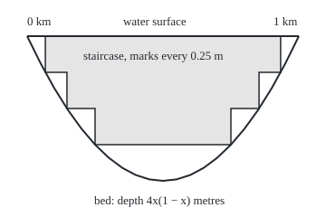
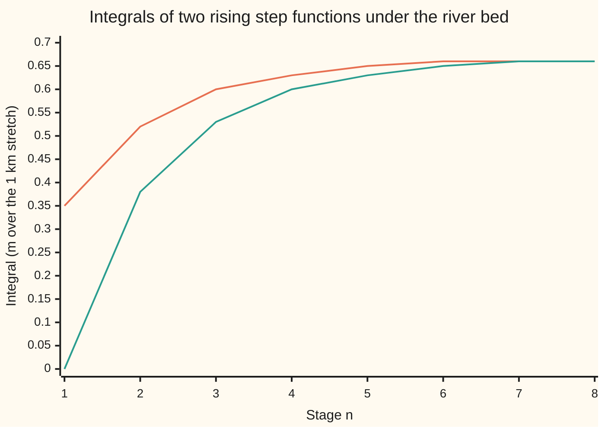

# The monotone convergence theorem: if functions rise to a limit, their integrals rise to the limit's integral, so sums and integrals swap for free

[Syllabus](../../../SYLLABUS.md) → [Measure and integration](../../../SYLLABUS.md#w10) → [The Lebesgue Integral](../../../SYLLABUS.md#w10-s04) → The monotone convergence theorem

---

## General Overview

A river stretch is 1 km long. At x km downstream its depth is 4x(1 − x) metres: zero at the shallows at either end, 1 m in the middle. The integral of the depth over the stretch is 2/3. Because the stretch is 1 km long, that is also the average depth in metres.

The integral of a non-negative function is defined as the supremum (the least number none of them exceeds) of the integrals of the simple functions under it (a simple function has finitely many values, each on a measurable set); no single one need reach it. No survey can try them all.

A survey crew sounds the river with a rod marked every half metre and records each depth rounded down to the last mark. That record is a staircase with integral 0.3536. Marks every quarter metre give 0.5183, every eighth 0.5956, and marks 1/1024 m apart 0.6662. A second crew cuts the stretch into 2, 4, 8, … equal pieces and records the shallowest depth on each: 0, then 0.375, then 0.53125. Both lists rise. Do both reach 2/3, the integral the definition asks for? A second question has the same shape: why does 1/2 + 1/8 + 1/24 + 1/64 + …, the sum of 1/(m 2^m), come to ln 2 = 0.693147?

The monotone convergence theorem answers both: functions that rise, point by point, to a limit have integrals that rise to the limit's integral.

**If non-negative measurable functions rise at every point to a limit, their integrals rise to the integral of the limit, infinity allowed; so the integral can be computed along any rising sequence, integrals add, and non-negative series integrate term by term.**

**What kind of fact this is:** a theorem, proved on this card in Why it works from continuity of measure; the staircase formula, additivity and term-by-term integration are corollaries proved here too.

### The picture: the river and its quarter-metre staircase

<p align="center"></p>

Drawn to scale: 300 pixels to the km along the river, 160 pixels to the metre of depth. The curve is the river bed. The shaded steps are the staircase with marks every quarter metre, at depths 0.25, 0.5 and 0.75 m. The clear water between the lowest step and the bed is what this staircase misses: 0.1484 of the 2/3.

---

## The formula

Notation first. From [The integral of a non-negative function](02-integral-of-a-nonnegative-function.md): a measure space $(\Omega, \mathcal{F}, \mu)$ is a whole space $\Omega$, a sigma-algebra $\mathcal{F}$ (the collection of sets we allow ourselves to measure) and a measure $\mu$. For measurable f with values in $[0, \infty]$, the integral $\int_\Omega f\,d\mu$, read "the integral of f against μ", is the supremum of the integrals of simple s with $0 \le s \le f$. On the river, $\Omega$ is the stretch $[0, 1]$ in km and $\mu$ is Lebesgue measure $\lambda$, which is length. One new piece of notation: $f_n \uparrow f$, read "f_n rises to f", means $f_1(x) \le f_2(x) \le \cdots$ and $f_n(x) \to f(x)$ at every point x. Infinity is allowed as a value throughout.

$$0 \le f_1 \le f_2 \le \cdots, \quad f_n \uparrow f \quad\Longrightarrow\quad \int_\Omega f\,d\mu = \lim_{n\to\infty} \int_\Omega f_n\,d\mu$$

**Read it aloud:** when non-negative measurable functions rise at every point to a limit, the integral of the limit is the limit of the integrals.

Three consequences are proved below. The first is the **staircase formula**. The staircase $\varphi_n$ is f rounded down to the last mark, with marks $2^{-n}$ apart, capped at height n: $\varphi_n = \min\big(n, \lfloor 2^n f \rfloor / 2^n\big)$, where $\lfloor y \rfloor$ is y rounded down to a whole number.

$$\int_\Omega f\,d\mu = \lim_{n\to\infty} \sum_{k=1}^{n 2^n} \frac{1}{2^n}\, \mu\big(\{f \ge k/2^n\}\big)$$

**Read it aloud:** slice the graph horizontally every $2^{-n}$, weigh each slice by the size of the set where f reaches it, add, and refine.

The second is **additivity**: for non-negative measurable f and $r$, $\int (f + r)\,d\mu = \int f\,d\mu + \int r\,d\mu$. The third is **term-by-term integration**: for non-negative measurable $g_k$,

$$\int_\Omega \sum_{k=0}^{\infty} g_k \,d\mu = \sum_{k=0}^{\infty} \int_\Omega g_k\,d\mu$$

**Read it aloud:** a series of non-negative functions may be integrated one term at a time, and the two sides agree even when both are infinite.

On the river, $4x(1-x) \ge t$ exactly when x lies within $\sqrt{1-t}/2$ of the middle, so $\lambda(\{d \ge t\}) = \sqrt{1 - t}$ for a depth $t$ between 0 and 1. The staircase integral at stage n is therefore $2^{-n} \sum_{k=1}^{2^n} \sqrt{1 - k/2^n}$. The second crew's step function has integral $L_n$, and on this river $L_n = 2/3 - 2^{-n} - \tfrac{2}{3} 4^{-n}$. The shallowest point of each cell is its end nearer a bank, so by symmetry $L_n$ is twice $2^{-n}$ times the sum of the depths $d(j/2^n)$ for whole numbers j from 0 to $2^{n-1} - 1$; with $d(x) = 4x(1 - x)$, the formulas for the sums of j and of $j^2$ give the closed form.

| Symbol | Plain meaning | In our example | Push it up and the answer… |
| --- | --- | --- | --- |
| $\Omega$, $\mathcal{F}$, $\mu$, $\lambda$ | measure space: whole space, sets allowed a size, the measure; λ is length | the stretch [0, 1] km, its Borel sets, length | — |
| $f$ | the limit: a non-negative measurable function | depth d(x) = 4x(1 − x) m | a deeper river, a larger integral |
| $f_n$ | the n-th function of a rising sequence | the n-th staircase | later n, larger integral, never past the limit's |
| $\varphi_n$, $\psi_n$ | the staircase: f (or r) rounded down to marks $2^{-n}$ apart, capped at n | integrals 0.3536, 0.5183, 0.5956 … | finer marks, closer to 2/3 |
| $L_n$ | integral of the shallowest depth on each of $2^n$ equal cells | 0, 0.375, 0.53125 … | more cells, closer to 2/3 |
| $t$ | a depth level | 0.25, 0.5, 0.75 m | higher level, shorter set $\{d \ge t\}$ |
| $s$, $A_j$ | a simple function under f, the test in the proof; its level sets | 0.95 m on [0.4, 0.6] km | — |
| $c$ | shrink factor in the proof, between 0 and 1 | 0.99 | nearer 1, the test sets fill later |
| $E_n$ | the set where $f_n$ has reached c times s | length 0.8 up to n = 4, then 0.9768, then 1 | — |
| $r$ | a second non-negative function, to add to f | a flood adding x/2 m | — |
| $g_k$ | the k-th term of a series of non-negative functions | $x^k$ on [0, 1/2] km | — |
| $n$, $k$, $m$, $j$ | whole-number counters | stage, level, term, cell or level set | — |

### When it holds

- **Rising at every point.** The spike of height n on (0, 1/n) converges to 0 everywhere, yet each spike has integral 1: at x = 0.3 its values go 1, 2, 3, then 0 from n = 4 on. Rising almost everywhere (a.e., except on a set of size zero) is enough, since a null set changes no integral.
- **Non-negative.** On the real line, the function −1 on [n, ∞) rises to 0, yet each has an infinite negative part and no integral. Both signs wait for [Integrable functions](04-integrable-functions-and-l1.md).
- **Measurable, with respect to $\mathcal{F}$.** Each $f_n$ must be measurable; the limit then is too, by [Sums, products, sups and limits](../03-Measurable%20Functions/02-limits-of-measurable-functions.md).
- **Nothing else.** No bound on the functions, no finite total, no uniform convergence (every point getting close at the same rate). Infinite integrals are allowed on both sides.
- **Rising, not falling.** The function 1 on [n, ∞) falls to 0 with infinite length at every n.

---

## Why it works

### Step 0: one inequality is free; the other comes from continuity of measure

The functions sit under their limit, so their integrals sit under its integral. For the other half, shrink any simple function s under the limit to c times s, with c just below 1. The sets where the rising functions have overtaken c times s rise to the whole space, and continuity from below carries the integral of c times s along with them.

### Step 1: the limit is measurable, and the integrals rise to at most its integral

At each point the numbers $f_n(x)$ never fall, so they settle on their least upper bound, possibly infinity. The limit exceeds a number exactly when some $f_n$ does, a countable union of measurable sets, so the limit is measurable. A simple function under $f_n$ is under $f_{n+1}$ and under f, so the integrals rise and stay at most $\int f\,d\mu$.

### Step 2: the hard inequality, on the river

Test the river staircases against a simple function s: 0.95 m on [0.4, 0.6] km, zero elsewhere. It sits under the bed, since the depth is at least 0.96 m there. Take c = 0.99, so c times s is 0.9405 m. Let $E_n$ be the set where the n-th staircase has reached c times s.

Off [0.4, 0.6] the test is zero, so those points are in $E_n$ from the start: length 0.8. On [0.4, 0.6] the staircase must show 0.9405 m. Up to n = 4 the first mark at or above 0.9405 is 1, reached only at the middle point. At n = 5 that mark is 0.96875, and $E_n$ has length 0.9768. At n = 6 it is 0.953125, which the depth passes everywhere on [0.4, 0.6], and $E_n$ is the whole stretch.

The staircase is at least c times s on $E_n$, so its integral is at least 0.9405 times the length of $E_n$ inside [0.4, 0.6]: 0 up to n = 4, then 0.1663, then 0.1881, which is c times the integral of s. The staircase integrals, 0.6499 and 0.6585 at those stages, clear it.

In general, s has finitely many levels, each on a measurable set, and the part of each level set inside $E_n$ rises to the whole of it. Continuity from below moves the sizes up, so the limit of $\int f_n\,d\mu$ is at least c times $\int s\,d\mu$. Let c rise to 1 and take the supremum over s: that supremum is $\int f\,d\mu$ by definition.

### Step 3: why c must be below 1

Let $f_n$ be $(1 - 1/n)$ times the quarter-metre staircase; these rise to that staircase. Test with s equal to it and c = 1. Wherever the staircase is positive, $f_n$ stays strictly below it, so $E_n$ is only the shallows where it is zero: length 0.1340 at n = 2, 10 and 100. With c below 1, every point enters once $1 - 1/n \ge c$.

### Step 4: the staircase formula

The staircase at stage n is $2^{-n}$ times the number of marks the function reaches, so it is simple and its integral is the sum in the formula. Halving the gap between marks can only keep or raise the last mark below a depth, so the staircases rise. Where f is finite they come within $2^{-n}$ of it once n passes f; where f is infinite they equal n. Both facts are proved on [Simple functions](../03-Measurable%20Functions/03-simple-functions-and-approximation.md). They rise to f, and the theorem gives the formula. On the river, stage 10 is within 1/1024 m of the depth everywhere and misses 0.000495 of the integral.

The second crew's step functions rise too, since splitting a cell can only raise the shallowest depth on each half, and they approach the continuous depth at every point. The theorem says both sequences reach the same number: 2/3.

### Step 5: additivity

Simple integrals add ([The integral of a simple function](01-integral-of-a-simple-function.md)), and the staircases of f and r add to simple functions rising to f + r. The theorem, applied three times, gives additivity. The supremum definition alone does not: a simple function under f + r need not split into one under f plus one under r.

A flood adds x/2 m of water at x km, so r has integral 1/4 and the flooded river has integral 11/12 = 0.9167. At n = 2 the staircase of the flooded depth has integral 0.7937, while the two separate staircases add to 0.6433. Different sequences, one limit: 11/12.

### Step 6: series, term by term

The partial sums of non-negative terms rise, additivity integrates each one, and the theorem moves the limit inside.

On [0, 1/2] the geometric series $1 + x + x^2 + \cdots$ sums to 1/(1 − x), every term non-negative. The integral of $x^k$ over [0, 1/2] is $(1/2)^{k+1}/(k+1)$, the calculus value, as the two integrals agree for continuous functions on a closed interval ([Riemann meets Lebesgue](05-riemann-meets-lebesgue.md); that later card uses this theorem, but only this example leans on it, never the proof above). With m = k + 1 the terms are 1/(m 2^m): 1/2, 1/8, 1/24, 1/64, 1/160. The integral of 1/(1 − x) over [0, 1/2] is ln 2, so the sum is ln 2.

No uniform convergence is needed. On [0, 1) the leftover after N terms, $x^{N+1}/(1 - x)$, is unbounded near 1, yet the swap holds: the integrals 1/(k + 1) form the harmonic series, which diverges ([Infinite series](../../06-Calculus%20and%20analysis/06-Series/01-series-convergence.md)), so the integral of 1/(1 − x) over [0, 1) is infinite.

<details>
<summary>Detailed proof</summary>

**Setting.** $(\Omega, \mathcal{F}, \mu)$ is a measure space. Each $f_n$ maps $\Omega$ to $[0, \infty]$, is measurable with respect to $\mathcal{F}$, and $f_n(x) \le f_{n+1}(x)$ at every x. Arithmetic in $[0, \infty]$ uses $a + \infty = \infty$ and $0 \cdot \infty = 0$. From [The integral of a non-negative function](02-integral-of-a-nonnegative-function.md): a simple $s = \sum_j a_j 1_{A_j}$ with disjoint sets $A_j \in \mathcal{F}$ and levels $a_j \ge 0$ has $\int s\,d\mu = \sum_j a_j \mu(A_j)$; the integral of f is the supremum of $\int s\,d\mu$ over simple $0 \le s \le f$; and if $f \le g$ pointwise then $\int f\,d\mu \le \int g\,d\mu$, because every simple function under f is under g.

**1. The limit is measurable.** Each list $f_n(x)$ never falls, so it converges in $[0, \infty]$ to its supremum f(x). For real a, $\{f > a\} = \bigcup_n \{f_n > a\}$, since f(x) > a exactly when a is not an upper bound of the list. A countable union of sets in $\mathcal{F}$ is in $\mathcal{F}$, so f is measurable ([Sums, products, sups and limits](../03-Measurable%20Functions/02-limits-of-measurable-functions.md)).

**2. The easy inequality.** From $f_n \le f_{n+1} \le f$ and monotonicity of the integral, $\int f_n\,d\mu \le \int f_{n+1}\,d\mu \le \int f\,d\mu$. A list in $[0, \infty]$ that never falls converges to its supremum, so $\lim_n \int f_n\,d\mu$ exists and is at most $\int f\,d\mu$.

**3. The hard inequality.** Fix a simple $s = \sum_{j=1}^{J} a_j 1_{A_j}$ with $0 \le s \le f$ and $A_1, \dots, A_J$ disjoint and covering $\Omega$, and fix $0 < c < 1$. Put $E_n = \{x : f_n(x) \ge c\,s(x)\} = \bigcup_j \big(A_j \cap \{f_n \ge c\,a_j\}\big)$, a finite union of sets in $\mathcal{F}$. Since $f_n \le f_{n+1}$, $E_n \subseteq E_{n+1}$. Their union is $\Omega$: if s(x) = 0 then x is in every $E_n$; if s(x) > 0 then $f(x) \ge s(x) > c\,s(x)$, and since $f_n(x)$ converges to f(x), or grows without bound when f(x) is infinite, some $f_n(x)$ exceeds $c\,s(x)$. The function $\sum_j c\,a_j 1_{A_j \cap E_n}$ is simple and at most $f_n$, so $\int f_n\,d\mu \ge c \sum_j a_j\, \mu(A_j \cap E_n)$. For each j the sets $A_j \cap E_n$ rise with union $A_j$, so $\mu(A_j \cap E_n) \to \mu(A_j)$ by continuity from below ([Continuity and subadditivity](../01-Sets%20You%20Can%20Measure/05-continuity-of-measure.md)). A finite sum of rising lists in $[0, \infty]$ converges to the sum of their limits, so $\lim_n \int f_n\,d\mu \ge c \int s\,d\mu$. If $\int s\,d\mu$ is infinite, c = 1/2 already makes the left side infinite. Otherwise the inequality for every c below 1 gives $\lim_n \int f_n\,d\mu \ge \int s\,d\mu$. Taking the supremum over s gives $\lim_n \int f_n\,d\mu \ge \int f\,d\mu$, and with step 2 the two are equal.

**4. The staircase formula.** Put $\varphi_n(x) = \min(n, \lfloor 2^n f(x) \rfloor / 2^n)$, and $\varphi_n(x) = n$ where f(x) is infinite. The number of k from 1 to $n 2^n$ with $k/2^n \le f(x)$ is $\min(n 2^n, \lfloor 2^n f(x) \rfloor)$, so $\varphi_n = \sum_{k=1}^{n 2^n} 2^{-n} 1_{\{f \ge k/2^n\}}$. Each set $\{f \ge k/2^n\}$ is in $\mathcal{F}$, so $\varphi_n$ is simple, and linearity of the simple integral ([The integral of a simple function](01-integral-of-a-simple-function.md)) gives $\int \varphi_n\,d\mu = \sum_{k=1}^{n 2^n} 2^{-n} \mu(\{f \ge k/2^n\})$. They rise, as Lemma 2 and part (b) on [Simple functions](../03-Measurable%20Functions/03-simple-functions-and-approximation.md) prove: $\lfloor 2y \rfloor \ge 2 \lfloor y \rfloor$ for real y, and the cap grows. They converge to f, by parts (c) and (d) there: where f(x) < n, $0 \le f(x) - \varphi_n(x) < 2^{-n}$; where f(x) is infinite, $\varphi_n(x) = n$. Steps 1 to 3 applied to $\varphi_n \uparrow f$ give the formula.

**5. Additivity.** Let f and r be non-negative and measurable, with staircases $\varphi_n$ and $\psi_n$. The sums $\varphi_n + \psi_n$ are simple, rise, and converge to f + r at every point, so f + r is measurable by step 1. Simple integrals add, so $\int (\varphi_n + \psi_n)\,d\mu = \int \varphi_n\,d\mu + \int \psi_n\,d\mu$. Apply the theorem to all three sequences; in $[0, \infty]$ the limit of a sum of two rising lists is the sum of their limits. The same argument with $a\varphi_n \uparrow a f$ gives $\int a f\,d\mu = a \int f\,d\mu$ for a number $a \ge 0$.

**6. Term by term.** Let each $g_k$ be non-negative and measurable. The partial sums $S_N = \sum_{k=0}^{N} g_k$ are measurable, and step 5 with induction on N gives $\int S_N\,d\mu = \sum_{k=0}^{N} \int g_k\,d\mu$. The partial sums rise, and at each x they converge in $[0, \infty]$ to $\sum_k g_k(x)$, a series of non-negative terms ([Infinite series](../../06-Calculus%20and%20analysis/06-Series/01-series-convergence.md)). The theorem gives $\int \sum_k g_k\,d\mu = \lim_N \int S_N\,d\mu = \sum_k \int g_k\,d\mu$.

</details>

Some texts prove Fatou's lemma first and deduce this theorem from it; this library runs the other way, and [Fatou's lemma](../05-Swapping%20Limits%20and%20Integrals/01-fatous-lemma.md) is proved from the theorem on this card.

---

## Worked numbers, by hand

| Step | Arithmetic | Value |
| --- | --- | --- |
| staircase, marks every 0.5 m | the depth reaches 0.5 m on a length $\sqrt{0.5}$; times 0.5 | 0.3536 |
| staircase, marks every 0.25 m | $(\sqrt{0.75} + \sqrt{0.5} + \sqrt{0.25} + 0)/4 = (0.8660 + 0.7071 + 0.5 + 0)/4$ | 0.5183 |
| staircase, stage 10 | the sum of $\sqrt{1 - k/1024}$ for k = 1 to 1024, divided by 1024 | 0.6661720810 |
| shallowest per cell, 4 cells | depths at the cell ends 0, 0.75, 1, 0.75, 0; lowest per cell 0, 0.75, 0.75, 0; times 1/4 | 0.375 |
| shallowest per cell, stage 10 | $2/3 - 1/1024 - (2/3)/1024^2$ | 0.6656894684 |
| both limits | $\int_0^1 4x(1-x)\,dx = 2 - 4/3$ | **2/3 = 0.6667** |
| first five series terms | 1/2 + 1/8 + 1/24 + 1/64 + 1/160 = 661/960 | 0.688541666667 |
| thirty terms | the sum of 1/(m 2^m) for m = 1 to 30 | 0.693147180531 |
| the closed form | $\int_0^{1/2} dx/(1 - x) = \ln 2$ | **0.693147180560** |

The river's average depth is 2/3 m whichever rising record is used, and the integrals of $x^k$ over [0, 1/2], added one at a time, land on ln 2.

### The picture: two rising records of the same river



The upper line is the staircase, marks $2^{-n}$ m apart. The lower line is the shallowest depth on each of $2^n$ equal cells. Both climb towards 2/3 = 0.6667, the integral of the depth.

### What breaks if you drop a piece

| Mistake | Comes out at | What went wrong |
| --- | --- | --- |
| Drop "rising": the spike n on (0, 1/n) | integral 1 at n = 1, 2, 4, 8, 16; limit 0, integral 0 | at x = 0.3 the values go 1, 2, 3, then 0: area escapes towards 0 |
| Falling, not rising: 1 on [n, ∞) | length 999, 990, 900 inside [0, 1000] for n = 1, 10, 100, unbounded as the window grows; limit 0 | every integral is infinite |
| Drop non-negativity: −1 on [n, ∞) | the same lengths, negative; no integral at any n | an infinite negative part |
| Test with c = 1 in the proof | $E_n$ stuck at length 0.1340 for n = 2, 10, 100 | $f_n$ never reaches s where s is positive |

---

## Code, from first principles, and it actually runs

Three roads lead to the river's integral. The first sums the staircase through its level sets, $\lambda(\{d \ge t\}) = \sqrt{1 - t}$. The second samples the same staircase at 65536 midpoints; the two must agree within 2/65536, the most sampling can lose on a step function that climbs to at most 1 and back. The third is the shallowest depth per cell, summed exactly and matched against $2/3 - 2^{-n} - \tfrac{2}{3}4^{-n}$. The code then replays the proof's test sets, the c = 1 failure and the flood. The series sums are checked against ln 2 found by Simpson's rule on 1/(1 − x) and by the series for $2\,\mathrm{atanh}(1/3)$. Python uses exact fractions for the per-cell sums and the series; Rust uses whole numbers over $2^{3n}$ for the first and floating point for the second. The code checks finite stages; that every rising sequence reaches the limit's integral is the proof's work.

### Python

```python
# The monotone convergence theorem -- the check behind the card.  Standard
# library only; fractions keeps the step-function sums exact.
# River: depth d(x) = 4x(1 - x) metres over a 1 km stretch; integral 2/3.
# Road 1: the staircase through its level sets, lambda(d >= t) = sqrt(1 - t).
# Road 2: the same staircase sampled at M grid midpoints; it never sees a level set.
# Road 3: a different rising sequence, the lowest depth on each of 2^n equal
#         cells, summed exactly and set against the algebra 2/3 - h - 2h^2/3.
# Series on [0, 1/2]: the integrals of x^k added term by term, against ln 2 found
# by Simpson's rule and by the series 2 atanh(1/3).  The code checks finite
# stages; that every rising sequence reaches the limit's integral is the proof's.
from fractions import Fraction as Q
from math import floor, ceil, sqrt

M = 2 ** 16                                            # grid cells for road 2

def d(x): return 4 * x * (1 - x)                      # river depth, metres, x in km
def stair(v, n): return min(n, floor(v * 2 ** n) / 2 ** n)   # round down to marks 2^-n apart, cap n
def grid(fun): return sum(fun((i + 0.5) / M) for i in range(M)) / M

print(f"river, grid of {M} midpoints; n: staircase by levels | staircase on grid | lowest-per-cell exact | 2/3 - h - 2h^2/3 | stair short | cells short")
stairs, cells = [], []
for n in range(1, 11):
    N, h = 2 ** n, Q(1, 2 ** n)
    by_levels = sum(sqrt(1 - k / N) for k in range(1, N + 1)) / N      # sum of 2^-n lambda(d >= k 2^-n)
    on_grid = grid(lambda x: stair(d(x), n))
    low = sum(h * min(Q(4 * j * (N - j), N * N), Q(4 * (j + 1) * (N - j - 1), N * N)) for j in range(N))
    closed = Q(2, 3) - h - 2 * h * h / 3
    assert abs(by_levels - on_grid) <= 2 / M          # one staircase, two roads
    assert low == closed                              # exact sum against the algebra
    assert 0 < 2 / 3 - by_levels <= float(h)          # staircase within 2^-n of d at every point
    assert not stairs or (by_levels > stairs[-1] and low > cells[-1])   # both sequences rise
    stairs.append(by_levels)
    cells.append(low)
    if n == 2:
        print("river, n=2 level-set lengths, lambda(d >= 1/4, 1/2, 3/4, 1):",
              " ".join(f"{sqrt(1 - k / 4):.10f}" for k in range(1, 5)))
    print(f"river, n={n}: {by_levels:.10f} | {on_grid:.10f} | {low:.10f} | {closed:.10f} | "
          f"{2 / 3 - by_levels:.10f} | {Q(2, 3) - low:.10f}")

print(f"river, both limits: 2/3 = {2 / 3:.10f}, from the antiderivative 2x^2 - 4x^3/3 at x = 1")

s_top, c, a, b = 0.95, 0.99, 0.4, 0.6                 # test function s: 0.95 m on [0.4, 0.6] km
assert d(a) >= s_top and d(b) >= s_top                # s sits under d: d >= 0.96 there
print(f"test sets E_n = {{staircase >= c s}}, c = {c}, s = {s_top} on [0.4, 0.6] where d >= {d(a):.2f}, c s = {c * s_top:.4f}")
print("test set, n: lowest mark >= c s | length by formula | on grid | c x integral of s on E_n | staircase integral")
for n in range(1, 7):
    t = ceil(c * s_top * 2 ** n) / 2 ** n              # lowest mark at or above c s = 0.9405
    inside = min(b - a, sqrt(1 - t)) if t <= 1 else 0.0   # {d >= t} is |x - 1/2| <= sqrt(1 - t)/2
    length = 1 - (b - a) + inside
    on_grid = grid(lambda x: 1.0 if stair(d(x), n) >= (c * s_top if a <= x <= b else 0) else 0.0)
    assert abs(length - on_grid) <= 4 / M
    assert c * s_top * inside <= stairs[n - 1]         # integral of f_n >= c times integral of s on E_n
    print(f"test set, n={n}: {t:g} | {length:.10f} | {on_grid:.10f} | {c * s_top * inside:.10f} | {stairs[n - 1]:.10f}")
print(f"test sets, limit: length 1; c x integral of s = {c * s_top * (b - a):.10f}")

zero_part = 1 - sqrt(0.75)                             # where staircase_2 = 0: d < 1/4
lens = []
for n in (2, 10, 100):
    lens.append(grid(lambda x: 1.0 if (1 - 1 / n) * stair(d(x), 2) >= stair(d(x), 2) else 0.0))
    assert abs(lens[-1] - zero_part) <= 4 / M
print(f"c = 1 fails: f_n = (1 - 1/n) staircase_2, length of {{f_n >= staircase_2}}, n = 2, 10, 100: "
      f"{lens[0]:.4f} {lens[1]:.4f} {lens[2]:.4f}; formula 1 - sqrt(3/4) = {zero_part:.4f}")

print("additivity, d + r with r(x) = x/2, exact 2/3 + 1/4 = 11/12: n | staircase of d + r | stair d + stair r")
for n in (2, 4, 6, 8, 10):
    N = 2 ** n
    joint = grid(lambda x: stair(d(x) + x / 2, n))
    apart = stairs[n - 1] + sum(1 - 2 * k / N for k in range(1, N // 2 + 1)) / N   # lambda(r >= t) = 1 - 2t
    assert 0 < 11 / 12 - joint <= 1 / N + 3 / M
    assert 0 < 11 / 12 - apart <= 2 / N
    print(f"additivity, n={n}: {joint:.10f} | {apart:.10f}")
print(f"additivity, 11/12 = {11 / 12:.10f}")

def simpson(fun, lo, hi, m=1000):                      # own integrator, m even
    w = (hi - lo) / m
    return w / 3 * sum(fun(lo + i * w) * (1 if i in (0, m) else (4 if i % 2 else 2)) for i in range(m + 1))

ln2_simpson = simpson(lambda x: 1 / (1 - x), 0.0, 0.5)
ln2_atanh = 2 * sum(Q(1, (2 * j + 1) * 3 ** (2 * j + 1)) for j in range(30))   # ln 2 = 2 atanh(1/3)
assert abs(ln2_simpson - float(ln2_atanh)) < 1e-12
print(f"series, ln 2 by Simpson on 1/(1 - x): {ln2_simpson:.12f}; by 2 atanh(1/3): {float(ln2_atanh):.12f}")
print("series on [0, 1/2], term k integrates to 1/(m 2^m) with m = k + 1: N | sum of first N | ln 2 minus it | bound 1/((N+1) 2^N)")
P = Q(0)
for m in range(1, 31):
    P += Q(1, m * 2 ** m)
    if m in (1, 2, 3, 4, 5, 10, 20, 30):
        gap, bound = float(ln2_atanh - P), 1 / ((m + 1) * 2 ** m)
        assert 0 < gap <= bound                       # the tail of the term-by-term sum
        e3 = lambda v: f"{v:.3e}".replace("e-0", "e-")   # Rust's exponent style
        print(f"series, N={m}: {float(P):.12f} | {e3(gap)} | {e3(bound)}")
five = simpson(lambda x: 1 + x + x * x + x * x * x + x * x * x * x, 0.0, 0.5)
assert abs(five - float(sum(Q(1, m * 2 ** m) for m in range(1, 6)))) < 1e-14
print(f"series, integral of 1 + x + ... + x^4 by Simpson: {five:.12f}; terms",
      " + ".join(str(Q(1, m * 2 ** m)) for m in range(1, 6)), "=", sum(Q(1, m * 2 ** m) for m in range(1, 6)))
H, hs = 0.0, []
for k in range(1, 10001):
    H += 1 / k                                         # integral of x^(k-1) over [0, 1] is 1/k
    if k in (10, 100, 1000, 10000):
        hs.append(H)
assert hs[3] > 9 and hs[3] - hs[2] > 2.3               # still climbing by about ln 10 per decade
print("series on [0, 1): sums of 1/k, N = 10, 100, 1000, 10000: " + " ".join(f"{v:.6f}" for v in hs))

spikes = [grid(lambda x: n if x < 1 / n else 0) for n in (1, 2, 4, 8, 16)]
assert spikes == [1.0] * 5                             # grid count against n x (1/n) = 1
at = [n if 0.3 < 1 / n else 0 for n in (1, 2, 3, 4, 5)]
print(f"spike n on (0, 1/n), n = 1, 2, 4, 8, 16: integrals {' '.join(f'{v:.4f}' for v in spikes)}; "
      f"value at x = 0.3 for n = 1 to 5: {' '.join(str(v) for v in at)}; limit function 0, integral 0")
nw = [(n, w) for n in (1, 10, 100) for w in (1000, 1000000)]
W = [sum(1 for i in range(4 * w) if (i + 0.5) / 4 >= n) / 4 for n, w in nw]   # quarter-unit midpoints
assert W == [w - n for n, w in nw]                     # grid against w - n
print(f"tails, length of [n, infinity) inside [0, w], n = 1, 10, 100, w = 1000 and 10^6: {' '.join(f'{v:g}' for v in W)}")

px = lambda x: 30 + 300 * x                            # figure: 300 px per km, 160 px per metre
edges = [0.5 - sqrt(1 - k / 4) / 2 for k in (1, 2, 3)]
print("figure, staircase_2 step edges x px:", " ".join(f"{px(e):.2f}" for e in edges),
      "|", " ".join(f"{px(1 - e):.2f}" for e in reversed(edges)), "| levels y px 80 120 160 | surface y 40")
print("figure, bed:", " ".join(f"{px(i / 20):.0f},{40 + 160 * d(i / 20):.1f}" for i in range(21)))
print("chart, staircase integrals n=1..8:", " ".join(f"{v:.2f}" for v in stairs[:8]))
print("chart, lowest-per-cell integrals n=1..8:", " ".join(f"{float(v):.2f}" for v in cells[:8]))
print("ALL CHECKS PASS")
```

**Ran 2026-10-06 on macOS, Python 3.14.6, standard library only. All checks passed. Output, pasted from the run:**

```
river, grid of 65536 midpoints; n: staircase by levels | staircase on grid | lowest-per-cell exact | 2/3 - h - 2h^2/3 | stair short | cells short
river, n=1: 0.3535533906 | 0.3535461426 | 0.0000000000 | 0.0000000000 | 0.3131132761 | 0.6666666667
river, n=2 level-set lengths, lambda(d >= 1/4, 1/2, 3/4, 1): 0.8660254038 0.7071067812 0.5000000000 0.0000000000
river, n=2: 0.5182830462 | 0.5182800293 | 0.3750000000 | 0.3750000000 | 0.1483836204 | 0.2916666667
river, n=3: 0.5956302216 | 0.5956268311 | 0.5312500000 | 0.5312500000 | 0.0710364450 | 0.1354166667
river, n=4: 0.6323311969 | 0.6323299408 | 0.6015625000 | 0.6015625000 | 0.0343354698 | 0.0651041667
river, n=5: 0.6499339363 | 0.6499338150 | 0.6347656250 | 0.6347656250 | 0.0167327304 | 0.0319010417
river, n=6: 0.6584583114 | 0.6584582329 | 0.6508789062 | 0.6508789062 | 0.0082083553 | 0.0157877604
river, n=7: 0.6626194073 | 0.6626200676 | 0.6588134766 | 0.6588134766 | 0.0040472594 | 0.0078531901
river, n=8: 0.6646634240 | 0.6646636724 | 0.6627502441 | 0.6627502441 | 0.0020032427 | 0.0039164225
river, n=9: 0.6656723190 | 0.6656721830 | 0.6647109985 | 0.6647109985 | 0.0009943476 | 0.0019556681
river, n=10: 0.6661720810 | 0.6661719978 | 0.6656894684 | 0.6656894684 | 0.0004945857 | 0.0009771983
river, both limits: 2/3 = 0.6666666667, from the antiderivative 2x^2 - 4x^3/3 at x = 1
test sets E_n = {staircase >= c s}, c = 0.99, s = 0.95 on [0.4, 0.6] where d >= 0.96, c s = 0.9405
test set, n: lowest mark >= c s | length by formula | on grid | c x integral of s on E_n | staircase integral
test set, n=1: 1 | 0.8000000000 | 0.7999877930 | 0.0000000000 | 0.3535533906
test set, n=2: 1 | 0.8000000000 | 0.7999877930 | 0.0000000000 | 0.5182830462
test set, n=3: 1 | 0.8000000000 | 0.7999877930 | 0.0000000000 | 0.5956302216
test set, n=4: 1 | 0.8000000000 | 0.7999877930 | 0.0000000000 | 0.6323311969
test set, n=5: 0.96875 | 0.9767766953 | 0.9767761230 | 0.1662584819 | 0.6499339363
test set, n=6: 0.953125 | 1.0000000000 | 1.0000000000 | 0.1881000000 | 0.6584583114
test sets, limit: length 1; c x integral of s = 0.1881000000
c = 1 fails: f_n = (1 - 1/n) staircase_2, length of {f_n >= staircase_2}, n = 2, 10, 100: 0.1340 0.1340 0.1340; formula 1 - sqrt(3/4) = 0.1340
additivity, d + r with r(x) = x/2, exact 2/3 + 1/4 = 11/12: n | staircase of d + r | stair d + stair r
additivity, n=2: 0.7937126160 | 0.6432830462
additivity, n=4: 0.8869924545 | 0.8510811969
additivity, n=6: 0.9084584713 | 0.9006458114
additivity, n=8: 0.9146636128 | 0.9127102990
additivity, n=10: 0.9161719233 | 0.9156837997
additivity, 11/12 = 0.9166666667
series, ln 2 by Simpson on 1/(1 - x): 0.693147180560; by 2 atanh(1/3): 0.693147180560
series on [0, 1/2], term k integrates to 1/(m 2^m) with m = k + 1: N | sum of first N | ln 2 minus it | bound 1/((N+1) 2^N)
series, N=1: 0.500000000000 | 1.931e-1 | 2.500e-1
series, N=2: 0.625000000000 | 6.815e-2 | 8.333e-2
series, N=3: 0.666666666667 | 2.648e-2 | 3.125e-2
series, N=4: 0.682291666667 | 1.086e-2 | 1.250e-2
series, N=5: 0.688541666667 | 4.606e-3 | 5.208e-3
series, N=10: 0.693064856151 | 8.232e-5 | 8.878e-5
series, N=20: 0.693147137051 | 4.351e-8 | 4.541e-8
series, N=30: 0.693147180531 | 2.916e-11 | 3.004e-11
series, integral of 1 + x + ... + x^4 by Simpson: 0.688541666667; terms 1/2 + 1/8 + 1/24 + 1/64 + 1/160 = 661/960
series on [0, 1): sums of 1/k, N = 10, 100, 1000, 10000: 2.928968 5.187378 7.485471 9.787606
spike n on (0, 1/n), n = 1, 2, 4, 8, 16: integrals 1.0000 1.0000 1.0000 1.0000 1.0000; value at x = 0.3 for n = 1 to 5: 1 2 3 0 0; limit function 0, integral 0
tails, length of [n, infinity) inside [0, w], n = 1, 10, 100, w = 1000 and 10^6: 999 999999 990 999990 900 999900
figure, staircase_2 step edges x px: 50.10 73.93 105.00 | 255.00 286.07 309.90 | levels y px 80 120 160 | surface y 40
figure, bed: 30,40.0 45,70.4 60,97.6 75,121.6 90,142.4 105,160.0 120,174.4 135,185.6 150,193.6 165,198.4 180,200.0 195,198.4 210,193.6 225,185.6 240,174.4 255,160.0 270,142.4 285,121.6 300,97.6 315,70.4 330,40.0
chart, staircase integrals n=1..8: 0.35 0.52 0.60 0.63 0.65 0.66 0.66 0.66
chart, lowest-per-cell integrals n=1..8: 0.00 0.38 0.53 0.60 0.63 0.65 0.66 0.66
ALL CHECKS PASS
```

### Rust

Same numbers, same labels, built with `rustc --edition 2021 -O`.

```rust
// The monotone convergence theorem -- the same check as the Python, in Rust,
// no crates.  The lowest-per-cell sums are exact: whole numbers over 2^(3n)
// in i128.  The series is summed in f64 where the Python keeps fractions.
// River: depth d(x) = 4x(1 - x) metres over a 1 km stretch; integral 2/3.
// Road 1: the staircase through its level sets, lambda(d >= t) = sqrt(1 - t).
// Road 2: the same staircase sampled at M grid midpoints; it never sees a level set.
// Road 3: a different rising sequence, the lowest depth on each of 2^n equal
//         cells, summed exactly and set against the algebra 2/3 - h - 2h^2/3.
// Series on [0, 1/2]: the integrals of x^k added term by term, against ln 2 found
// by Simpson's rule and by the series 2 atanh(1/3).  The code checks finite
// stages; that every rising sequence reaches the limit's integral is the proof's.
const M: usize = 1 << 16; // grid cells for road 2

fn d(x: f64) -> f64 { 4.0 * x * (1.0 - x) } // river depth, metres, x in km
fn stair(v: f64, n: i32) -> f64 {           // round down to marks 2^-n apart, cap n
    let p = 2f64.powi(n);
    (n as f64).min((v * p).floor() / p)
}
fn grid(f: &dyn Fn(f64) -> f64) -> f64 {
    (0..M).map(|i| f((i as f64 + 0.5) / M as f64)).sum::<f64>() / M as f64
}
fn simpson(f: &dyn Fn(f64) -> f64, lo: f64, hi: f64, m: usize) -> f64 { // own integrator, m even
    let w = (hi - lo) / m as f64;
    w / 3.0 * (0..=m).map(|i| f(lo + i as f64 * w) * if i == 0 || i == m { 1.0 } else if i % 2 == 1 { 4.0 } else { 2.0 }).sum::<f64>()
}
fn join(v: &[f64], p: usize) -> String { v.iter().map(|x| format!("{:.*}", p, x)).collect::<Vec<_>>().join(" ") }

fn main() {
    println!("river, grid of {} midpoints; n: staircase by levels | staircase on grid | lowest-per-cell exact | 2/3 - h - 2h^2/3 | stair short | cells short", M);
    let (mut stairs, mut cells): (Vec<f64>, Vec<f64>) = (Vec::new(), Vec::new());
    for n in 1..=10i32 {
        let nn: i128 = 1 << n;
        let by_levels = (1..=nn).map(|k| (1.0 - k as f64 / nn as f64).sqrt()).sum::<f64>() / nn as f64;
        let on_grid = grid(&|x| stair(d(x), n));
        let s: i128 = (0..nn).map(|j| 4 * (j * (nn - j)).min((j + 1) * (nn - j - 1))).sum(); // low = s / N^3
        let cube = nn * nn * nn;
        assert!((by_levels - on_grid).abs() <= 2.0 / M as f64);      // one staircase, two roads
        assert_eq!(3 * s, 2 * cube - 3 * nn * nn - 2 * nn);             // exact sum against the algebra
        let short = 2.0 / 3.0 - by_levels;
        assert!(0.0 < short && short <= 1.0 / nn as f64);              // staircase within 2^-n of d
        let low = s as f64 / cube as f64;
        assert!(stairs.is_empty() || (by_levels > stairs[n as usize - 2] && low > cells[n as usize - 2]));
        stairs.push(by_levels);
        cells.push(low);
        if n == 2 {
            let ls: Vec<f64> = (1..5).map(|k| (1.0 - k as f64 / 4.0).sqrt()).collect();
            println!("river, n=2 level-set lengths, lambda(d >= 1/4, 1/2, 3/4, 1): {}", join(&ls, 10));
        }
        let closed = (2 * cube - 3 * nn * nn - 2 * nn) as f64 / (3 * cube) as f64;
        println!("river, n={}: {:.10} | {:.10} | {:.10} | {:.10} | {:.10} | {:.10}", n, by_levels, on_grid, low,
                 closed, short, (2 * cube - 3 * s) as f64 / (3 * cube) as f64);
    }
    println!("river, both limits: 2/3 = {:.10}, from the antiderivative 2x^2 - 4x^3/3 at x = 1", 2.0 / 3.0);

    let (s_top, c, a, b) = (0.95f64, 0.99f64, 0.4f64, 0.6f64); // test function s: 0.95 m on [0.4, 0.6] km
    assert!(d(a) >= s_top && d(b) >= s_top);                       // s sits under d: d >= 0.96 there
    println!("test sets E_n = {{staircase >= c s}}, c = {}, s = {} on [0.4, 0.6] where d >= {:.2}, c s = {:.4}", c, s_top, d(a), c * s_top);
    println!("test set, n: lowest mark >= c s | length by formula | on grid | c x integral of s on E_n | staircase integral");
    for n in 1..=6i32 {
        let p = 2f64.powi(n);
        let t = (c * s_top * p).ceil() / p;                        // lowest mark at or above c s = 0.9405
        let inside = if t <= 1.0 { (b - a).min((1.0 - t).sqrt()) } else { 0.0 };
        let length = 1.0 - (b - a) + inside;
        let on_grid = grid(&|x| if stair(d(x), n) >= (if a <= x && x <= b { c * s_top } else { 0.0 }) { 1.0 } else { 0.0 });
        assert!((length - on_grid).abs() <= 4.0 / M as f64);
        assert!(c * s_top * inside <= stairs[n as usize - 1]);     // integral of f_n >= c times integral of s on E_n
        println!("test set, n={}: {} | {:.10} | {:.10} | {:.10} | {:.10}", n, t, length, on_grid, c * s_top * inside, stairs[n as usize - 1]);
    }
    println!("test sets, limit: length 1; c x integral of s = {:.10}", c * s_top * (b - a));

    let zero_part = 1.0 - 0.75f64.sqrt();                          // where staircase_2 = 0: d < 1/4
    let mut lens = Vec::new();
    for n in [2.0f64, 10.0, 100.0] {
        lens.push(grid(&|x| if (1.0 - 1.0 / n) * stair(d(x), 2) >= stair(d(x), 2) { 1.0 } else { 0.0 }));
        assert!((lens[lens.len() - 1] - zero_part).abs() <= 4.0 / M as f64);
    }
    println!("c = 1 fails: f_n = (1 - 1/n) staircase_2, length of {{f_n >= staircase_2}}, n = 2, 10, 100: {}; formula 1 - sqrt(3/4) = {:.4}",
             join(&lens, 4), zero_part);

    println!("additivity, d + r with r(x) = x/2, exact 2/3 + 1/4 = 11/12: n | staircase of d + r | stair d + stair r");
    for n in [2i32, 4, 6, 8, 10] {
        let nn = 1i64 << n;
        let joint = grid(&|x| stair(d(x) + x / 2.0, n));
        let apart = stairs[n as usize - 1] + (1..=nn / 2).map(|k| 1.0 - (2 * k) as f64 / nn as f64).sum::<f64>() / nn as f64;
        assert!(0.0 < 11.0 / 12.0 - joint && 11.0 / 12.0 - joint <= 1.0 / nn as f64 + 3.0 / M as f64);
        assert!(0.0 < 11.0 / 12.0 - apart && 11.0 / 12.0 - apart <= 2.0 / nn as f64);
        println!("additivity, n={}: {:.10} | {:.10}", n, joint, apart);
    }
    println!("additivity, 11/12 = {:.10}", 11.0 / 12.0);

    let ln2_simpson = simpson(&|x| 1.0 / (1.0 - x), 0.0, 0.5, 1000);
    let ln2_atanh = 2.0 * (0..30).map(|j| 1.0 / ((2 * j + 1) as f64 * 3f64.powi(2 * j + 1))).sum::<f64>(); // ln 2 = 2 atanh(1/3)
    assert!((ln2_simpson - ln2_atanh).abs() < 1e-12);
    println!("series, ln 2 by Simpson on 1/(1 - x): {:.12}; by 2 atanh(1/3): {:.12}", ln2_simpson, ln2_atanh);
    println!("series on [0, 1/2], term k integrates to 1/(m 2^m) with m = k + 1: N | sum of first N | ln 2 minus it | bound 1/((N+1) 2^N)");
    let mut p = 0.0f64;
    for m in 1..=30i32 {
        p += 1.0 / (m as f64 * 2f64.powi(m));
        if [1, 2, 3, 4, 5, 10, 20, 30].contains(&m) {
            let (gap, bound) = (ln2_atanh - p, 1.0 / ((m + 1) as f64 * 2f64.powi(m)));
            assert!(0.0 < gap && gap <= bound);                      // the tail of the term-by-term sum
            println!("series, N={}: {:.12} | {:.3e} | {:.3e}", m, p, gap, bound);
        }
    }
    let five = simpson(&|x| 1.0 + x + x * x + x * x * x + x * x * x * x, 0.0, 0.5, 1000);
    let five_terms: f64 = (1..=5).map(|m| 1.0 / (m as f64 * 2f64.powi(m))).sum();
    assert!((five - five_terms).abs() < 1e-14);
    let terms: Vec<String> = (1..=5).map(|m| format!("1/{}", m * (1 << m))).collect();
    let den = 960; // lcm of 2, 8, 24, 64, 160
    let num: i64 = (1..=5i64).map(|m| den / (m * (1 << m))).sum();
    assert_eq!(num, 661);
    println!("series, integral of 1 + x + ... + x^4 by Simpson: {:.12}; terms {} = {}/{}", five, terms.join(" + "), num, den);
    let (mut h, mut hs) = (0.0f64, Vec::new());
    for k in 1..=10000 {
        h += 1.0 / k as f64;                                      // integral of x^(k-1) over [0, 1] is 1/k
        if [10, 100, 1000, 10000].contains(&k) { hs.push(h); }
    }
    assert!(hs[3] > 9.0 && hs[3] - hs[2] > 2.3);                  // still climbing by about ln 10 per decade
    println!("series on [0, 1): sums of 1/k, N = 10, 100, 1000, 10000: {}", join(&hs, 6));

    let ns = [1.0f64, 2.0, 4.0, 8.0, 16.0];
    let spikes: Vec<f64> = ns.iter().map(|&n| grid(&|x| if x < 1.0 / n { n } else { 0.0 })).collect();
    assert_eq!(spikes, vec![1.0; 5]);                              // grid count against n x (1/n) = 1
    let at: Vec<String> = [1.0f64, 2.0, 3.0, 4.0, 5.0].iter().map(|&n| if 0.3 < 1.0 / n { format!("{}", n) } else { "0".to_string() }).collect();
    println!("spike n on (0, 1/n), n = 1, 2, 4, 8, 16: integrals {}; value at x = 0.3 for n = 1 to 5: {}; limit function 0, integral 0",
             join(&spikes, 4), at.join(" "));
    let nw: Vec<(usize, usize)> = [1usize, 10, 100].iter().flat_map(|&n| [1000usize, 1000000].map(|w| (n, w))).collect();
    let w: Vec<f64> = nw.iter().map(|&(n, w)| (0..4 * w).filter(|&i| (i as f64 + 0.5) / 4.0 >= n as f64).count() as f64 / 4.0).collect();
    let exact: Vec<f64> = nw.iter().map(|&(n, w)| (w - n) as f64).collect();
    assert!(w == exact);                                          // grid against w - n
    println!("tails, length of [n, infinity) inside [0, w], n = 1, 10, 100, w = 1000 and 10^6: {}",
             w.iter().map(|v| v.to_string()).collect::<Vec<_>>().join(" "));

    let px = |x: f64| 30.0 + 300.0 * x;                            // figure: 300 px per km, 160 px per metre
    let edges: Vec<f64> = [1.0f64, 2.0, 3.0].iter().map(|k| 0.5 - (1.0 - k / 4.0).sqrt() / 2.0).collect();
    let left: Vec<f64> = edges.iter().map(|&e| px(e)).collect();
    let right: Vec<f64> = edges.iter().rev().map(|&e| px(1.0 - e)).collect();
    println!("figure, staircase_2 step edges x px: {} | {} | levels y px 80 120 160 | surface y 40", join(&left, 2), join(&right, 2));
    let bed: Vec<String> = (0..21).map(|i| format!("{:.0},{:.1}", px(i as f64 / 20.0), 40.0 + 160.0 * d(i as f64 / 20.0))).collect();
    println!("figure, bed: {}", bed.join(" "));
    println!("chart, staircase integrals n=1..8: {}", join(&stairs[..8], 2));
    println!("chart, lowest-per-cell integrals n=1..8: {}", join(&cells[..8], 2));
    println!("ALL CHECKS PASS");
}
```

**Ran 2026-10-06 on macOS, rustc 1.98.1, no crates. All checks passed. Output, pasted from the run:**

```
river, grid of 65536 midpoints; n: staircase by levels | staircase on grid | lowest-per-cell exact | 2/3 - h - 2h^2/3 | stair short | cells short
river, n=1: 0.3535533906 | 0.3535461426 | 0.0000000000 | 0.0000000000 | 0.3131132761 | 0.6666666667
river, n=2 level-set lengths, lambda(d >= 1/4, 1/2, 3/4, 1): 0.8660254038 0.7071067812 0.5000000000 0.0000000000
river, n=2: 0.5182830462 | 0.5182800293 | 0.3750000000 | 0.3750000000 | 0.1483836204 | 0.2916666667
river, n=3: 0.5956302216 | 0.5956268311 | 0.5312500000 | 0.5312500000 | 0.0710364450 | 0.1354166667
river, n=4: 0.6323311969 | 0.6323299408 | 0.6015625000 | 0.6015625000 | 0.0343354698 | 0.0651041667
river, n=5: 0.6499339363 | 0.6499338150 | 0.6347656250 | 0.6347656250 | 0.0167327304 | 0.0319010417
river, n=6: 0.6584583114 | 0.6584582329 | 0.6508789062 | 0.6508789062 | 0.0082083553 | 0.0157877604
river, n=7: 0.6626194073 | 0.6626200676 | 0.6588134766 | 0.6588134766 | 0.0040472594 | 0.0078531901
river, n=8: 0.6646634240 | 0.6646636724 | 0.6627502441 | 0.6627502441 | 0.0020032427 | 0.0039164225
river, n=9: 0.6656723190 | 0.6656721830 | 0.6647109985 | 0.6647109985 | 0.0009943476 | 0.0019556681
river, n=10: 0.6661720810 | 0.6661719978 | 0.6656894684 | 0.6656894684 | 0.0004945857 | 0.0009771983
river, both limits: 2/3 = 0.6666666667, from the antiderivative 2x^2 - 4x^3/3 at x = 1
test sets E_n = {staircase >= c s}, c = 0.99, s = 0.95 on [0.4, 0.6] where d >= 0.96, c s = 0.9405
test set, n: lowest mark >= c s | length by formula | on grid | c x integral of s on E_n | staircase integral
test set, n=1: 1 | 0.8000000000 | 0.7999877930 | 0.0000000000 | 0.3535533906
test set, n=2: 1 | 0.8000000000 | 0.7999877930 | 0.0000000000 | 0.5182830462
test set, n=3: 1 | 0.8000000000 | 0.7999877930 | 0.0000000000 | 0.5956302216
test set, n=4: 1 | 0.8000000000 | 0.7999877930 | 0.0000000000 | 0.6323311969
test set, n=5: 0.96875 | 0.9767766953 | 0.9767761230 | 0.1662584819 | 0.6499339363
test set, n=6: 0.953125 | 1.0000000000 | 1.0000000000 | 0.1881000000 | 0.6584583114
test sets, limit: length 1; c x integral of s = 0.1881000000
c = 1 fails: f_n = (1 - 1/n) staircase_2, length of {f_n >= staircase_2}, n = 2, 10, 100: 0.1340 0.1340 0.1340; formula 1 - sqrt(3/4) = 0.1340
additivity, d + r with r(x) = x/2, exact 2/3 + 1/4 = 11/12: n | staircase of d + r | stair d + stair r
additivity, n=2: 0.7937126160 | 0.6432830462
additivity, n=4: 0.8869924545 | 0.8510811969
additivity, n=6: 0.9084584713 | 0.9006458114
additivity, n=8: 0.9146636128 | 0.9127102990
additivity, n=10: 0.9161719233 | 0.9156837997
additivity, 11/12 = 0.9166666667
series, ln 2 by Simpson on 1/(1 - x): 0.693147180560; by 2 atanh(1/3): 0.693147180560
series on [0, 1/2], term k integrates to 1/(m 2^m) with m = k + 1: N | sum of first N | ln 2 minus it | bound 1/((N+1) 2^N)
series, N=1: 0.500000000000 | 1.931e-1 | 2.500e-1
series, N=2: 0.625000000000 | 6.815e-2 | 8.333e-2
series, N=3: 0.666666666667 | 2.648e-2 | 3.125e-2
series, N=4: 0.682291666667 | 1.086e-2 | 1.250e-2
series, N=5: 0.688541666667 | 4.606e-3 | 5.208e-3
series, N=10: 0.693064856151 | 8.232e-5 | 8.878e-5
series, N=20: 0.693147137051 | 4.351e-8 | 4.541e-8
series, N=30: 0.693147180531 | 2.916e-11 | 3.004e-11
series, integral of 1 + x + ... + x^4 by Simpson: 0.688541666667; terms 1/2 + 1/8 + 1/24 + 1/64 + 1/160 = 661/960
series on [0, 1): sums of 1/k, N = 10, 100, 1000, 10000: 2.928968 5.187378 7.485471 9.787606
spike n on (0, 1/n), n = 1, 2, 4, 8, 16: integrals 1.0000 1.0000 1.0000 1.0000 1.0000; value at x = 0.3 for n = 1 to 5: 1 2 3 0 0; limit function 0, integral 0
tails, length of [n, infinity) inside [0, w], n = 1, 10, 100, w = 1000 and 10^6: 999 999999 990 999990 900 999900
figure, staircase_2 step edges x px: 50.10 73.93 105.00 | 255.00 286.07 309.90 | levels y px 80 120 160 | surface y 40
figure, bed: 30,40.0 45,70.4 60,97.6 75,121.6 90,142.4 105,160.0 120,174.4 135,185.6 150,193.6 165,198.4 180,200.0 195,198.4 210,193.6 225,185.6 240,174.4 255,160.0 270,142.4 285,121.6 300,97.6 315,70.4 330,40.0
chart, staircase integrals n=1..8: 0.35 0.52 0.60 0.63 0.65 0.66 0.66 0.66
chart, lowest-per-cell integrals n=1..8: 0.00 0.38 0.53 0.60 0.63 0.65 0.66 0.66
ALL CHECKS PASS
```

The two outputs match line for line.

> [!TIP]
> **Try changing**
> Guess first, then run the Python.
> - **Round to the nearest mark.** In `stair`, change `floor(v * 2 ** n)` to `floor(v * 2 ** n + 0.5)`. Guess: the record now pokes below the bed, so it is not the staircase of the formula; the grid road leaves the level-set road and the first assert stops the run.
> - **Let c be 1.** Change `c` from 0.99 to 1.0. Guess: the test sets still fill by n = 6, since the depth is 0.96 m or more where s is 0.95 m. c = 1 fails only where f and s touch.
> - **Make s touch the bed.** Set `s_top` to 0.96 and `c` to 1.0. Guess: the depth equals s at x = 0.4 and 0.6, 0.96 is never a mark, and those two points never enter $E_n$. The printed lengths reach 0.9768 at n = 5 and stay there at n = 6; later stages approach 1, since two points have length zero.

---

## The usual mistake

> [!warning]
> **Believing that convergence at every point is enough.** The spike of height n on (0, 1/n) goes to 0 at every point and keeps integral 1. The theorem needs the functions to rise, so no area can leave: whatever is under $f_n$ stays under $f_{n+1}$.
>
> - **Applying it to falling functions.** The function 1 on [n, ∞) falls to 0 with infinite length at every n. Falling needs a finite first integral and the tools of [Fatou's lemma](../05-Swapping%20Limits%20and%20Integrals/01-fatous-lemma.md).
> - **Treating the staircase as the definition.** The definition is the supremum over all simple functions below; the staircase formula is a theorem, and the shallowest-per-cell record, 0.375 at four cells, is another rising sequence with the same limit.
> - **Asking for uniform convergence.** On [0, 1) the geometric series is not uniformly convergent, and the swap still holds, both sides infinite.
> - **Confusing it with the theorem for numbers.** A rising list of numbers with a ceiling converges; that fact from wing 06 is used inside this proof.

---

## Where you meet it in real life

- **Expected values.** The average of a quantity that is never negative, such as an insurance claim or a waiting time, is the limit of the averages of its staircases; [Expectation as an integral](06-expectation-as-an-integral.md) builds expectation this way.
- **Tail sums.** A whole-number count is the number of k it reaches, a sum of indicators, so term-by-term integration gives its expected value as the sum of the chances that it is at least k. Queue and reliability models use this form.
- **Double sums in either order.** Rainfall totals over infinitely many months and infinitely many stations, summed by month then by station or the other way round, agree when every entry is non-negative; a finite table agrees in either order whatever the signs. This theorem is the engine of [Product measure](../06-Product%20Measures%20and%20Fubini/02-product-measure.md).
- **Closed forms for sums.** Integrating a non-negative series term by term, as with ln 2 here, turns many sums into integrals with known values.

> **Say it back**
> The integral of a non-negative function is the supremum of the totals of the simple functions under it, which no single one need reach. If measurable functions rise at every point to a limit, their integrals rise to the limit's integral, finite or not. The proof tests the limit against a simple function shrunk by a factor below 1 and lets continuity of measure carry the sets where the functions have caught up. Consequences: any rising staircase computes the integral, integrals add, and non-negative series integrate term by term. Drop the rise and a spike keeps its area while the functions vanish.

---

## What this builds on

- [The integral of a non-negative function](02-integral-of-a-nonnegative-function.md): the integral as a supremum over simple functions, and its monotonicity.
- [Continuity and subadditivity](../01-Sets%20You%20Can%20Measure/05-continuity-of-measure.md): rising sets have sizes rising to the size of their union, the step the whole proof rests on.
- [Sums, products, sups and limits](../03-Measurable%20Functions/02-limits-of-measurable-functions.md): the limit of measurable functions is measurable, so its integral is defined.
- [Infinite series](../../06-Calculus%20and%20analysis/06-Series/01-series-convergence.md): a series of non-negative terms is the limit of its partial sums, which rise.

## Where this goes next

- [Integrable functions](04-integrable-functions-and-l1.md): functions of both signs, integrated as a positive part minus a negative part, using the additivity proved here.
- [Fatou's lemma](../05-Swapping%20Limits%20and%20Integrals/01-fatous-lemma.md): this theorem applied to running minimums, giving an inequality for sequences that do not rise.
- [Product measure](../06-Product%20Measures%20and%20Fubini/02-product-measure.md): areas of sets in a plane built slice by slice, with this theorem swapping sums and integrals.
- [The Radon-Nikodym theorem](../08-Densities%20and%20Changing%20Measure/03-radon-nikodym-theorem.md): a density found as the limit of a rising sequence, its integrals controlled by this theorem.

Only non-negative functions have an integral so far, so the river's height above a datum, positive in the pools and negative over the shoals, has none; [Integrable functions](04-integrable-functions-and-l1.md) gives it one, and the additivity proved here is what makes that integral consistent.

---

## Sources

Verified 29 Sep 2026: every link below opens a page naming the cited work.

- Axler, Sheldon. *Measure, Integration & Real Analysis*. Springer Graduate Texts in Mathematics, 2020, open access. [Author's page with the free edition](https://measure.axler.net/). Chapter 3 proves the monotone convergence theorem and additivity of the integral from simple functions.
- Folland, Gerald B. *Real Analysis: Modern Techniques and Their Applications*, 2nd ed. Wiley, 1999. [Publisher page](https://www.wiley.com/en-us/Real+Analysis%3A+Modern+Techniques+and+Their+Applications%2C+2nd+Edition-p-9780471317166). Section 2.2 gives the staircase approximation, the theorem and term-by-term integration of non-negative series.
- Williams, David. *Probability with Martingales*. Cambridge University Press, 1991. [Publisher page](https://www.cambridge.org/core/books/probability-with-martingales/B4CFCE0D08930FB46C6E93E775503926). Chapter 5 builds expectation on the staircase and the theorem.
- Billingsley, Patrick. *Probability and Measure*, Anniversary Edition. Wiley, 2012. [Publisher page](https://www.wiley.com/en-us/Probability+and+Measure%2C+Anniversary+Edition-p-9781118122372). The theorem and its series form for general measures, with probability uses.
- Tao, Terence. "245A, Notes 3: Integration on abstract measure spaces, and the convergence theorems." *What's new*, 25 Sep 2010. [Lecture notes](https://terrytao.wordpress.com/2010/09/25/245a-notes-3-integration-on-abstract-measure-spaces-and-the-convergence-theorems/). Proves the theorem for unsigned functions and compares the orders in which texts prove it and Fatou's lemma.
